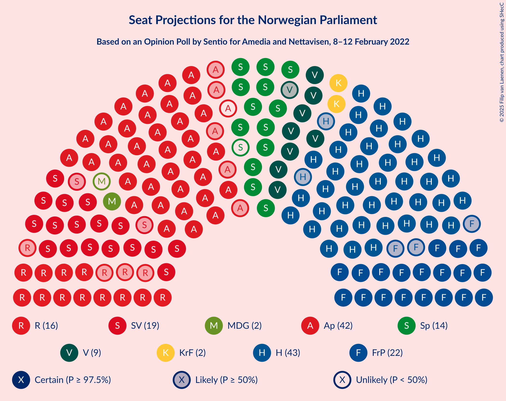

# Opinion Poll by Sentio for Amedia and Nettavisen, 8–12 February 2022

<a href="#voting-intentions">Voting Intentions</a> | <a href="#seats">Seats</a> | <a href="#coalitions">Coalitions</a> | <a href="#technical-information">Technical Information</a>

## Voting Intentions

### Confidence Intervals

| Party | Last Result | Poll Result | 80% Confidence Interval | 90% Confidence Interval | 95% Confidence Interval | 99% Confidence Interval |
|:-----:|:-----------:|:-----------:|:-----------------------:|:-----------------------:|:-----------------------:|:-----------------------:|
| Høyre | 20.4% | 24.9% | 23.2–26.7% |22.7–27.3% |22.3–27.7% |21.5–28.6% |
| Arbeiderpartiet | 26.2% | 21.9% | 20.3–23.7% |19.8–24.2% |19.5–24.6% |18.7–25.5% |
| Fremskrittspartiet | 11.6% | 11.4% | 10.2–12.8% |9.9–13.2% |9.6–13.5% |9.0–14.2% |
| Sosialistisk Venstreparti | 7.6% | 10.6% | 9.4–12.0% |9.1–12.3% |8.8–12.7% |8.3–13.4% |
| Rødt | 4.7% | 8.1% | 7.1–9.3% |6.8–9.7% |6.6–10.0% |6.1–10.6% |
| Senterpartiet | 13.5% | 7.9% | 6.9–9.1% |6.6–9.4% |6.4–9.8% |5.9–10.4% |
| Venstre | 4.6% | 4.9% | 4.1–5.9% |3.9–6.2% |3.7–6.4% |3.4–6.9% |
| Miljøpartiet De Grønne | 3.9% | 3.3% | 2.7–4.2% |2.5–4.4% |2.4–4.6% |2.1–5.0% |
| Kristelig Folkeparti | 3.8% | 3.1% | 2.5–3.9% |2.3–4.2% |2.2–4.4% |1.9–4.8% |
| Norgesdemokratene | 1.1% | 1.4% | 1.0–2.0% |0.9–2.2% |0.8–2.3% |0.7–2.7% |
| Liberalistene | 0.2% | 0.7% | 0.5–1.2% |0.4–1.3% |0.3–1.4% |0.2–1.7% |
| Konservativt | 0.4% | 0.5% | 0.3–0.9% |0.3–1.1% |0.2–1.2% |0.2–1.4% |
| Industri- og Næringspartiet | 0.3% | 0.5% | 0.3–0.9% |0.3–1.1% |0.2–1.2% |0.2–1.4% |

*Note:* The poll result column reflects the actual value used in the calculations. Published results may vary slightly, and in addition be rounded to fewer digits.

## Seats

### Confidence Intervals

| Party | Last Result | Median | 80% Confidence Interval | 90% Confidence Interval | 95% Confidence Interval | 99% Confidence Interval |
|:-----:|:-----------:|:------:|:-----------------------:|:-----------------------:|:-----------------------:|:-----------------------:|
| <a href="#høyre">Høyre</a> | 36 | 43 | 43–47 |41–47 |41–47 |39–51 |
| <a href="#arbeiderpartiet">Arbeiderpartiet</a> | 48 | 42 | 37–43 |37–44 |37–44 |36–47 |
| <a href="#fremskrittspartiet">Fremskrittspartiet</a> | 21 | 22 | 19–22 |19–23 |19–23 |17–24 |
| <a href="#sosialistisk-venstreparti">Sosialistisk Venstreparti</a> | 13 | 19 | 17–21 |17–21 |17–22 |14–23 |
| <a href="#rødt">Rødt</a> | 8 | 16 | 13–16 |12–17 |12–17 |12–17 |
| <a href="#senterpartiet">Senterpartiet</a> | 28 | 13 | 13–16 |13–17 |13–17 |12–17 |
| <a href="#venstre">Venstre</a> | 8 | 9 | 9–10 |9–12 |8–12 |2–12 |
| <a href="#miljøpartiet-de-grønne">Miljøpartiet De Grønne</a> | 3 | 2 | 1–2 |1–2 |1–2 |1–8 |
| <a href="#kristelig-folkeparti">Kristelig Folkeparti</a> | 3 | 2 | 2 |2 |2–3 |1–7 |
| <a href="#norgesdemokratene">Norgesdemokratene</a> | 0 | 0 | 0 |0 |0 |0 |
| <a href="#liberalistene">Liberalistene</a> | 0 | 0 | 0 |0 |0 |0 |
| <a href="#konservativt">Konservativt</a> | 0 | 0 | 0 |0 |0 |0 |
| <a href="#industri--og-næringspartiet">Industri- og Næringspartiet</a> | 0 | 0 | 0 |0 |0 |0 |

### Høyre

*For a full overview of the results for this party, see the [Høyre](party-høyre.html) page.*

| Number of Seats | Probability | Accumulated | Special Marks |
|:---------------:|:-----------:|:-----------:|:-------------:|
| 36 | 0% | 100% | Last Result |
| 37 | 0.1% | 100% |  |
| 38 | 0.1% | 99.9% |  |
| 39 | 0.3% | 99.8% |  |
| 40 | 0.3% | 99.5% |  |
| 41 | 7% | 99.1% |  |
| 42 | 0.9% | 92% |  |
| 43 | 55% | 91% | Median |
| 44 | 1.4% | 36% |  |
| 45 | 10% | 35% |  |
| 46 | 13% | 25% |  |
| 47 | 10% | 12% |  |
| 48 | 0.5% | 2% |  |
| 49 | 0.1% | 1.4% |  |
| 50 | 0.1% | 1.3% |  |
| 51 | 0.9% | 1.1% |  |
| 52 | 0.2% | 0.2% |  |
| 53 | 0% | 0% |  |

### Arbeiderpartiet

*For a full overview of the results for this party, see the [Arbeiderpartiet](party-arbeiderpartiet.html) page.*

| Number of Seats | Probability | Accumulated | Special Marks |
|:---------------:|:-----------:|:-----------:|:-------------:|
| 33 | 0.2% | 100% |  |
| 34 | 0% | 99.8% |  |
| 35 | 0.1% | 99.8% |  |
| 36 | 0.2% | 99.7% |  |
| 37 | 14% | 99.5% |  |
| 38 | 1.3% | 86% |  |
| 39 | 0.9% | 84% |  |
| 40 | 16% | 84% |  |
| 41 | 1.1% | 68% |  |
| 42 | 55% | 67% | Median |
| 43 | 2% | 12% |  |
| 44 | 8% | 10% |  |
| 45 | 0.2% | 2% |  |
| 46 | 0.6% | 1.4% |  |
| 47 | 0.5% | 0.8% |  |
| 48 | 0.3% | 0.3% | Last Result |
| 49 | 0% | 0% |  |

### Fremskrittspartiet

*For a full overview of the results for this party, see the [Fremskrittspartiet](party-fremskrittspartiet.html) page.*

| Number of Seats | Probability | Accumulated | Special Marks |
|:---------------:|:-----------:|:-----------:|:-------------:|
| 16 | 0% | 100% |  |
| 17 | 1.1% | 99.9% |  |
| 18 | 1.0% | 98.8% |  |
| 19 | 18% | 98% |  |
| 20 | 15% | 79% |  |
| 21 | 2% | 65% | Last Result |
| 22 | 55% | 63% | Median |
| 23 | 8% | 8% |  |
| 24 | 0.3% | 0.5% |  |
| 25 | 0% | 0.2% |  |
| 26 | 0.1% | 0.2% |  |
| 27 | 0% | 0% |  |

### Sosialistisk Venstreparti

*For a full overview of the results for this party, see the [Sosialistisk Venstreparti](party-sosialistiskvenstreparti.html) page.*

| Number of Seats | Probability | Accumulated | Special Marks |
|:---------------:|:-----------:|:-----------:|:-------------:|
| 13 | 0% | 100% | Last Result |
| 14 | 0.6% | 100% |  |
| 15 | 0.1% | 99.4% |  |
| 16 | 0.4% | 99.3% |  |
| 17 | 9% | 98.8% |  |
| 18 | 0.7% | 89% |  |
| 19 | 64% | 89% | Median |
| 20 | 8% | 25% |  |
| 21 | 14% | 17% |  |
| 22 | 2% | 3% |  |
| 23 | 0.2% | 0.6% |  |
| 24 | 0.2% | 0.3% |  |
| 25 | 0% | 0.1% |  |
| 26 | 0% | 0% |  |

### Rødt

*For a full overview of the results for this party, see the [Rødt](party-rødt.html) page.*

| Number of Seats | Probability | Accumulated | Special Marks |
|:---------------:|:-----------:|:-----------:|:-------------:|
| 8 | 0% | 100% | Last Result |
| 9 | 0% | 100% |  |
| 10 | 0% | 100% |  |
| 11 | 0.2% | 100% |  |
| 12 | 9% | 99.8% |  |
| 13 | 3% | 91% |  |
| 14 | 2% | 88% |  |
| 15 | 22% | 86% |  |
| 16 | 56% | 64% | Median |
| 17 | 8% | 8% |  |
| 18 | 0.1% | 0.3% |  |
| 19 | 0.1% | 0.1% |  |
| 20 | 0% | 0% |  |

### Senterpartiet

*For a full overview of the results for this party, see the [Senterpartiet](party-senterpartiet.html) page.*

| Number of Seats | Probability | Accumulated | Special Marks |
|:---------------:|:-----------:|:-----------:|:-------------:|
| 10 | 0.2% | 100% |  |
| 11 | 0.1% | 99.8% |  |
| 12 | 2% | 99.7% |  |
| 13 | 56% | 98% | Median |
| 14 | 24% | 42% |  |
| 15 | 2% | 17% |  |
| 16 | 6% | 15% |  |
| 17 | 9% | 9% |  |
| 18 | 0.2% | 0.5% |  |
| 19 | 0.3% | 0.3% |  |
| 20 | 0% | 0% |  |
| 21 | 0% | 0% |  |
| 22 | 0% | 0% |  |
| 23 | 0% | 0% |  |
| 24 | 0% | 0% |  |
| 25 | 0% | 0% |  |
| 26 | 0% | 0% |  |
| 27 | 0% | 0% |  |
| 28 | 0% | 0% | Last Result |

### Venstre

*For a full overview of the results for this party, see the [Venstre](party-venstre.html) page.*

| Number of Seats | Probability | Accumulated | Special Marks |
|:---------------:|:-----------:|:-----------:|:-------------:|
| 2 | 1.0% | 100% |  |
| 3 | 0.1% | 99.0% |  |
| 4 | 0% | 98.9% |  |
| 5 | 0% | 98.9% |  |
| 6 | 0% | 98.9% |  |
| 7 | 0.2% | 98.9% |  |
| 8 | 3% | 98.7% | Last Result |
| 9 | 65% | 96% | Median |
| 10 | 22% | 31% |  |
| 11 | 0.9% | 10% |  |
| 12 | 9% | 9% |  |
| 13 | 0% | 0% |  |

### Miljøpartiet De Grønne

*For a full overview of the results for this party, see the [Miljøpartiet De Grønne](party-miljøpartietdegrønne.html) page.*

| Number of Seats | Probability | Accumulated | Special Marks |
|:---------------:|:-----------:|:-----------:|:-------------:|
| 1 | 15% | 100% |  |
| 2 | 83% | 85% | Median |
| 3 | 0.5% | 2% | Last Result |
| 4 | 0% | 2% |  |
| 5 | 0% | 2% |  |
| 6 | 0% | 2% |  |
| 7 | 0.6% | 2% |  |
| 8 | 0.9% | 1.1% |  |
| 9 | 0.2% | 0.2% |  |
| 10 | 0% | 0% |  |

### Kristelig Folkeparti

*For a full overview of the results for this party, see the [Kristelig Folkeparti](party-kristeligfolkeparti.html) page.*

| Number of Seats | Probability | Accumulated | Special Marks |
|:---------------:|:-----------:|:-----------:|:-------------:|
| 0 | 0.3% | 100% |  |
| 1 | 0.6% | 99.7% |  |
| 2 | 96% | 99.2% | Median |
| 3 | 3% | 3% | Last Result |
| 4 | 0% | 0.8% |  |
| 5 | 0% | 0.8% |  |
| 6 | 0% | 0.8% |  |
| 7 | 0.5% | 0.8% |  |
| 8 | 0.3% | 0.3% |  |
| 9 | 0.1% | 0.1% |  |
| 10 | 0% | 0% |  |

### Norgesdemokratene

*For a full overview of the results for this party, see the [Norgesdemokratene](party-norgesdemokratene.html) page.*

| Number of Seats | Probability | Accumulated | Special Marks |
|:---------------:|:-----------:|:-----------:|:-------------:|
| 0 | 100% | 100% | Last Result, Median |

### Liberalistene

*For a full overview of the results for this party, see the [Liberalistene](party-liberalistene.html) page.*

| Number of Seats | Probability | Accumulated | Special Marks |
|:---------------:|:-----------:|:-----------:|:-------------:|
| 0 | 100% | 100% | Last Result, Median |

### Konservativt

*For a full overview of the results for this party, see the [Konservativt](party-konservativt.html) page.*

| Number of Seats | Probability | Accumulated | Special Marks |
|:---------------:|:-----------:|:-----------:|:-------------:|
| 0 | 100% | 100% | Last Result, Median |

### Industri- og Næringspartiet

*For a full overview of the results for this party, see the [Industri- og Næringspartiet](party-industri-ognæringspartiet.html) page.*

| Number of Seats | Probability | Accumulated | Special Marks |
|:---------------:|:-----------:|:-----------:|:-------------:|
| 0 | 100% | 100% | Last Result, Median |

## Coalitions

### Confidence Intervals

| Coalition | Last Result | Median | Majority? | 80% Confidence Interval | 90% Confidence Interval | 95% Confidence Interval | 99% Confidence Interval |
|:---------:|:-----------:|:------:|:---------:|:-----------------------:|:-----------------------:|:-----------------------:|:-----------------------:|
| Arbeiderpartiet – Sosialistisk Venstreparti – Rødt – Senterpartiet – Miljøpartiet De Grønne | 100 | 92 | 99.3% | 89–92 | 89–92 | 89–94 | 84–99 |
| Høyre – Fremskrittspartiet – Senterpartiet – Venstre – Kristelig Folkeparti | 96 | 89 | 99.4% | 89–94 | 89–94 | 88–94 | 84–97 |
| Arbeiderpartiet – Sosialistisk Venstreparti – Rødt – Senterpartiet | 97 | 90 | 98.9% | 87–90 | 87–90 | 87–91 | 82–94 |
| Arbeiderpartiet – Sosialistisk Venstreparti – Senterpartiet – Miljøpartiet De Grønne – Kristelig Folkeparti | 95 | 78 | 0.9% | 77–79 | 77–81 | 77–82 | 72–86 |
| Høyre – Fremskrittspartiet – Venstre – Miljøpartiet De Grønne – Kristelig Folkeparti | 71 | 78 | 0.9% | 78–81 | 78–81 | 77–81 | 74–86 |
| Arbeiderpartiet – Sosialistisk Venstreparti – Rødt – Miljøpartiet De Grønne | 72 | 79 | 0.4% | 74–79 | 74–79 | 74–80 | 71–84 |
| Arbeiderpartiet – Sosialistisk Venstreparti – Senterpartiet – Miljøpartiet De Grønne | 92 | 76 | 0.3% | 75–77 | 75–78 | 75–79 | 70–83 |
| Høyre – Fremskrittspartiet – Venstre – Kristelig Folkeparti | 68 | 76 | 0.1% | 76–79 | 76–79 | 74–79 | 69–84 |
| Arbeiderpartiet – Sosialistisk Venstreparti – Senterpartiet | 89 | 74 | 0% | 73–75 | 73–75 | 72–77 | 68–80 |
| Høyre – Fremskrittspartiet – Venstre | 65 | 74 | 0% | 74–77 | 74–77 | 71–77 | 66–81 |
| Høyre – Fremskrittspartiet | 57 | 65 | 0% | 64–66 | 64–66 | 62–67 | 59–72 |
| Arbeiderpartiet – Sosialistisk Venstreparti | 61 | 61 | 0% | 57–61 | 57–61 | 57–65 | 54–65 |
| Arbeiderpartiet – Senterpartiet – Miljøpartiet De Grønne – Kristelig Folkeparti | 82 | 59 | 0% | 58–61 | 56–61 | 56–64 | 55–67 |
| Arbeiderpartiet – Senterpartiet – Kristelig Folkeparti | 79 | 57 | 0% | 56–60 | 55–60 | 55–61 | 53–64 |
| Høyre – Venstre – Kristelig Folkeparti | 47 | 54 | 0% | 54–59 | 53–59 | 53–59 | 50–63 |
| Arbeiderpartiet – Senterpartiet | 76 | 55 | 0% | 54–58 | 53–58 | 53–58 | 50–62 |
| Senterpartiet – Venstre – Kristelig Folkeparti | 39 | 24 | 0% | 24–28 | 24–29 | 22–29 | 20–31 |

### Arbeiderpartiet – Sosialistisk Venstreparti – Rødt – Senterpartiet – Miljøpartiet De Grønne

| Number of Seats | Probability | Accumulated | Special Marks |
|:---------------:|:-----------:|:-----------:|:-------------:|
| 83 | 0% | 100% |  |
| 84 | 0.6% | 99.9% |  |
| 85 | 0% | 99.3% | Majority |
| 86 | 0.3% | 99.3% |  |
| 87 | 0.2% | 99.0% |  |
| 88 | 0.5% | 98.8% |  |
| 89 | 9% | 98% |  |
| 90 | 6% | 89% |  |
| 91 | 16% | 83% |  |
| 92 | 63% | 67% | Median |
| 93 | 1.4% | 4% |  |
| 94 | 0.7% | 3% |  |
| 95 | 0.8% | 2% |  |
| 96 | 0.5% | 1.2% |  |
| 97 | 0.1% | 0.8% |  |
| 98 | 0.1% | 0.7% |  |
| 99 | 0.2% | 0.6% |  |
| 100 | 0.1% | 0.4% | Last Result |
| 101 | 0.2% | 0.2% |  |
| 102 | 0% | 0% |  |

### Høyre – Fremskrittspartiet – Senterpartiet – Venstre – Kristelig Folkeparti

| Number of Seats | Probability | Accumulated | Special Marks |
|:---------------:|:-----------:|:-----------:|:-------------:|
| 81 | 0.2% | 100% |  |
| 82 | 0% | 99.8% |  |
| 83 | 0.2% | 99.8% |  |
| 84 | 0.2% | 99.6% |  |
| 85 | 0.3% | 99.4% | Majority |
| 86 | 0.3% | 99.1% |  |
| 87 | 0.8% | 98.7% |  |
| 88 | 2% | 98% |  |
| 89 | 55% | 96% | Median |
| 90 | 8% | 41% |  |
| 91 | 8% | 34% |  |
| 92 | 1.2% | 25% |  |
| 93 | 9% | 24% |  |
| 94 | 13% | 15% |  |
| 95 | 0.3% | 2% |  |
| 96 | 0.8% | 2% | Last Result |
| 97 | 0.5% | 0.8% |  |
| 98 | 0.1% | 0.3% |  |
| 99 | 0.2% | 0.3% |  |
| 100 | 0% | 0.1% |  |
| 101 | 0% | 0% |  |

### Arbeiderpartiet – Sosialistisk Venstreparti – Rødt – Senterpartiet

| Number of Seats | Probability | Accumulated | Special Marks |
|:---------------:|:-----------:|:-----------:|:-------------:|
| 81 | 0% | 100% |  |
| 82 | 0.6% | 99.9% |  |
| 83 | 0.1% | 99.3% |  |
| 84 | 0.2% | 99.1% |  |
| 85 | 0.5% | 98.9% | Majority |
| 86 | 0.6% | 98% |  |
| 87 | 9% | 98% |  |
| 88 | 2% | 89% |  |
| 89 | 14% | 87% |  |
| 90 | 71% | 74% | Median |
| 91 | 1.1% | 3% |  |
| 92 | 0.9% | 2% |  |
| 93 | 0.3% | 1.2% |  |
| 94 | 0.6% | 0.9% |  |
| 95 | 0% | 0.3% |  |
| 96 | 0% | 0.3% |  |
| 97 | 0% | 0.2% | Last Result |
| 98 | 0.2% | 0.2% |  |
| 99 | 0% | 0% |  |

### Arbeiderpartiet – Sosialistisk Venstreparti – Senterpartiet – Miljøpartiet De Grønne – Kristelig Folkeparti

| Number of Seats | Probability | Accumulated | Special Marks |
|:---------------:|:-----------:|:-----------:|:-------------:|
| 72 | 0.7% | 100% |  |
| 73 | 0% | 99.2% |  |
| 74 | 0.3% | 99.2% |  |
| 75 | 0% | 98.9% |  |
| 76 | 0.4% | 98.8% |  |
| 77 | 13% | 98% |  |
| 78 | 70% | 85% | Median |
| 79 | 8% | 15% |  |
| 80 | 1.0% | 7% |  |
| 81 | 2% | 6% |  |
| 82 | 1.3% | 3% |  |
| 83 | 0.9% | 2% |  |
| 84 | 0.2% | 1.1% |  |
| 85 | 0.3% | 0.9% | Majority |
| 86 | 0.3% | 0.6% |  |
| 87 | 0.2% | 0.3% |  |
| 88 | 0.1% | 0.1% |  |
| 89 | 0% | 0% |  |
| 90 | 0% | 0% |  |
| 91 | 0% | 0% |  |
| 92 | 0% | 0% |  |
| 93 | 0% | 0% |  |
| 94 | 0% | 0% |  |
| 95 | 0% | 0% | Last Result |

### Høyre – Fremskrittspartiet – Venstre – Miljøpartiet De Grønne – Kristelig Folkeparti

| Number of Seats | Probability | Accumulated | Special Marks |
|:---------------:|:-----------:|:-----------:|:-------------:|
| 70 | 0.2% | 100% |  |
| 71 | 0% | 99.8% | Last Result |
| 72 | 0% | 99.8% |  |
| 73 | 0% | 99.7% |  |
| 74 | 0.3% | 99.7% |  |
| 75 | 0.6% | 99.4% |  |
| 76 | 0.9% | 98.8% |  |
| 77 | 1.1% | 98% |  |
| 78 | 71% | 97% | Median |
| 79 | 14% | 26% |  |
| 80 | 2% | 13% |  |
| 81 | 9% | 11% |  |
| 82 | 0.6% | 2% |  |
| 83 | 0.5% | 2% |  |
| 84 | 0.2% | 1.1% |  |
| 85 | 0.1% | 0.9% | Majority |
| 86 | 0.6% | 0.7% |  |
| 87 | 0% | 0.1% |  |
| 88 | 0% | 0% |  |

### Arbeiderpartiet – Sosialistisk Venstreparti – Rødt – Miljøpartiet De Grønne

| Number of Seats | Probability | Accumulated | Special Marks |
|:---------------:|:-----------:|:-----------:|:-------------:|
| 68 | 0% | 100% |  |
| 69 | 0.2% | 99.9% |  |
| 70 | 0.1% | 99.7% |  |
| 71 | 0.5% | 99.7% |  |
| 72 | 0.8% | 99.2% | Last Result |
| 73 | 0.3% | 98% |  |
| 74 | 13% | 98% |  |
| 75 | 9% | 85% |  |
| 76 | 0.9% | 76% |  |
| 77 | 9% | 75% |  |
| 78 | 8% | 66% |  |
| 79 | 55% | 59% | Median |
| 80 | 2% | 4% |  |
| 81 | 0.8% | 2% |  |
| 82 | 0.3% | 1.3% |  |
| 83 | 0.3% | 0.9% |  |
| 84 | 0.2% | 0.6% |  |
| 85 | 0.2% | 0.4% | Majority |
| 86 | 0% | 0.2% |  |
| 87 | 0.2% | 0.2% |  |
| 88 | 0% | 0% |  |

### Arbeiderpartiet – Sosialistisk Venstreparti – Senterpartiet – Miljøpartiet De Grønne

| Number of Seats | Probability | Accumulated | Special Marks |
|:---------------:|:-----------:|:-----------:|:-------------:|
| 69 | 0.4% | 100% |  |
| 70 | 0.3% | 99.5% |  |
| 71 | 0.3% | 99.2% |  |
| 72 | 0.1% | 98.9% |  |
| 73 | 0.1% | 98.8% |  |
| 74 | 0.4% | 98.7% |  |
| 75 | 13% | 98% |  |
| 76 | 70% | 85% | Median |
| 77 | 9% | 15% |  |
| 78 | 1.1% | 6% |  |
| 79 | 3% | 5% |  |
| 80 | 1.0% | 2% |  |
| 81 | 0.1% | 1.2% |  |
| 82 | 0.5% | 1.1% |  |
| 83 | 0.1% | 0.6% |  |
| 84 | 0.1% | 0.5% |  |
| 85 | 0.3% | 0.3% | Majority |
| 86 | 0% | 0% |  |
| 87 | 0% | 0% |  |
| 88 | 0% | 0% |  |
| 89 | 0% | 0% |  |
| 90 | 0% | 0% |  |
| 91 | 0% | 0% |  |
| 92 | 0% | 0% | Last Result |

### Høyre – Fremskrittspartiet – Venstre – Kristelig Folkeparti

| Number of Seats | Probability | Accumulated | Special Marks |
|:---------------:|:-----------:|:-----------:|:-------------:|
| 67 | 0.2% | 100% |  |
| 68 | 0.1% | 99.8% | Last Result |
| 69 | 0.2% | 99.6% |  |
| 70 | 0.1% | 99.4% |  |
| 71 | 0.1% | 99.3% |  |
| 72 | 0.2% | 99.2% |  |
| 73 | 1.1% | 99.0% |  |
| 74 | 0.7% | 98% |  |
| 75 | 1.4% | 97% |  |
| 76 | 63% | 96% | Median |
| 77 | 16% | 33% |  |
| 78 | 6% | 17% |  |
| 79 | 9% | 11% |  |
| 80 | 0.5% | 2% |  |
| 81 | 0.2% | 1.2% |  |
| 82 | 0.3% | 1.0% |  |
| 83 | 0% | 0.7% |  |
| 84 | 0.6% | 0.7% |  |
| 85 | 0% | 0.1% | Majority |
| 86 | 0% | 0% |  |

### Arbeiderpartiet – Sosialistisk Venstreparti – Senterpartiet

| Number of Seats | Probability | Accumulated | Special Marks |
|:---------------:|:-----------:|:-----------:|:-------------:|
| 67 | 0.4% | 100% |  |
| 68 | 0.2% | 99.6% |  |
| 69 | 0.4% | 99.3% |  |
| 70 | 0.3% | 98.9% |  |
| 71 | 0.4% | 98.6% |  |
| 72 | 0.9% | 98% |  |
| 73 | 8% | 97% |  |
| 74 | 69% | 90% | Median |
| 75 | 16% | 21% |  |
| 76 | 1.1% | 5% |  |
| 77 | 2% | 4% |  |
| 78 | 0.5% | 2% |  |
| 79 | 0.5% | 1.1% |  |
| 80 | 0.3% | 0.6% |  |
| 81 | 0.2% | 0.3% |  |
| 82 | 0% | 0% |  |
| 83 | 0% | 0% |  |
| 84 | 0% | 0% |  |
| 85 | 0% | 0% | Majority |
| 86 | 0% | 0% |  |
| 87 | 0% | 0% |  |
| 88 | 0% | 0% |  |
| 89 | 0% | 0% | Last Result |

### Høyre – Fremskrittspartiet – Venstre

| Number of Seats | Probability | Accumulated | Special Marks |
|:---------------:|:-----------:|:-----------:|:-------------:|
| 64 | 0% | 100% |  |
| 65 | 0.2% | 99.9% | Last Result |
| 66 | 0.3% | 99.8% |  |
| 67 | 0% | 99.5% |  |
| 68 | 0.2% | 99.4% |  |
| 69 | 0% | 99.2% |  |
| 70 | 0.9% | 99.2% |  |
| 71 | 0.9% | 98% |  |
| 72 | 0.8% | 97% |  |
| 73 | 1.4% | 96% |  |
| 74 | 63% | 95% | Median |
| 75 | 16% | 32% |  |
| 76 | 6% | 16% |  |
| 77 | 9% | 11% |  |
| 78 | 0.3% | 1.3% |  |
| 79 | 0.1% | 1.0% |  |
| 80 | 0.3% | 1.0% |  |
| 81 | 0.4% | 0.7% |  |
| 82 | 0.2% | 0.3% |  |
| 83 | 0% | 0% |  |

### Høyre – Fremskrittspartiet

| Number of Seats | Probability | Accumulated | Special Marks |
|:---------------:|:-----------:|:-----------:|:-------------:|
| 57 | 0.3% | 100% | Last Result |
| 58 | 0.1% | 99.6% |  |
| 59 | 0.1% | 99.5% |  |
| 60 | 0.3% | 99.4% |  |
| 61 | 0.4% | 99.1% |  |
| 62 | 2% | 98.7% |  |
| 63 | 0.6% | 97% |  |
| 64 | 8% | 96% |  |
| 65 | 71% | 89% | Median |
| 66 | 15% | 18% |  |
| 67 | 0.8% | 3% |  |
| 68 | 0.5% | 2% |  |
| 69 | 0.5% | 2% |  |
| 70 | 0.4% | 1.5% |  |
| 71 | 0.6% | 1.1% |  |
| 72 | 0.3% | 0.5% |  |
| 73 | 0.1% | 0.2% |  |
| 74 | 0.1% | 0.1% |  |
| 75 | 0% | 0% |  |

### Arbeiderpartiet – Sosialistisk Venstreparti

| Number of Seats | Probability | Accumulated | Special Marks |
|:---------------:|:-----------:|:-----------:|:-------------:|
| 52 | 0% | 100% |  |
| 53 | 0.2% | 99.9% |  |
| 54 | 0.5% | 99.7% |  |
| 55 | 0.4% | 99.3% |  |
| 56 | 0.3% | 98.9% |  |
| 57 | 9% | 98.6% |  |
| 58 | 6% | 90% |  |
| 59 | 8% | 84% |  |
| 60 | 0.7% | 76% |  |
| 61 | 71% | 75% | Last Result, Median |
| 62 | 0.5% | 4% |  |
| 63 | 0.3% | 3% |  |
| 64 | 0.4% | 3% |  |
| 65 | 2% | 3% |  |
| 66 | 0% | 0.2% |  |
| 67 | 0.1% | 0.2% |  |
| 68 | 0.1% | 0.1% |  |
| 69 | 0% | 0% |  |

### Arbeiderpartiet – Senterpartiet – Miljøpartiet De Grønne – Kristelig Folkeparti

| Number of Seats | Probability | Accumulated | Special Marks |
|:---------------:|:-----------:|:-----------:|:-------------:|
| 52 | 0.2% | 100% |  |
| 53 | 0.2% | 99.8% |  |
| 54 | 0.1% | 99.6% |  |
| 55 | 0.5% | 99.5% |  |
| 56 | 6% | 99.0% |  |
| 57 | 0.2% | 93% |  |
| 58 | 24% | 93% |  |
| 59 | 56% | 69% | Median |
| 60 | 0.2% | 13% |  |
| 61 | 8% | 13% |  |
| 62 | 0.6% | 4% |  |
| 63 | 0.8% | 4% |  |
| 64 | 0.8% | 3% |  |
| 65 | 0.6% | 2% |  |
| 66 | 0.8% | 1.5% |  |
| 67 | 0.2% | 0.7% |  |
| 68 | 0% | 0.4% |  |
| 69 | 0% | 0.4% |  |
| 70 | 0.3% | 0.4% |  |
| 71 | 0% | 0% |  |
| 72 | 0% | 0% |  |
| 73 | 0% | 0% |  |
| 74 | 0% | 0% |  |
| 75 | 0% | 0% |  |
| 76 | 0% | 0% |  |
| 77 | 0% | 0% |  |
| 78 | 0% | 0% |  |
| 79 | 0% | 0% |  |
| 80 | 0% | 0% |  |
| 81 | 0% | 0% |  |
| 82 | 0% | 0% | Last Result |

### Arbeiderpartiet – Senterpartiet – Kristelig Folkeparti

| Number of Seats | Probability | Accumulated | Special Marks |
|:---------------:|:-----------:|:-----------:|:-------------:|
| 50 | 0.2% | 100% |  |
| 51 | 0% | 99.8% |  |
| 52 | 0.2% | 99.8% |  |
| 53 | 0.5% | 99.5% |  |
| 54 | 0.5% | 99.0% |  |
| 55 | 6% | 98% |  |
| 56 | 24% | 93% |  |
| 57 | 57% | 69% | Median |
| 58 | 0.2% | 12% |  |
| 59 | 0.8% | 12% |  |
| 60 | 8% | 11% |  |
| 61 | 0.3% | 3% |  |
| 62 | 0.8% | 2% |  |
| 63 | 0.7% | 2% |  |
| 64 | 0.8% | 0.9% |  |
| 65 | 0.1% | 0.1% |  |
| 66 | 0% | 0% |  |
| 67 | 0% | 0% |  |
| 68 | 0% | 0% |  |
| 69 | 0% | 0% |  |
| 70 | 0% | 0% |  |
| 71 | 0% | 0% |  |
| 72 | 0% | 0% |  |
| 73 | 0% | 0% |  |
| 74 | 0% | 0% |  |
| 75 | 0% | 0% |  |
| 76 | 0% | 0% |  |
| 77 | 0% | 0% |  |
| 78 | 0% | 0% |  |
| 79 | 0% | 0% | Last Result |

### Høyre – Venstre – Kristelig Folkeparti

| Number of Seats | Probability | Accumulated | Special Marks |
|:---------------:|:-----------:|:-----------:|:-------------:|
| 47 | 0% | 100% | Last Result |
| 48 | 0% | 99.9% |  |
| 49 | 0.3% | 99.9% |  |
| 50 | 0.2% | 99.6% |  |
| 51 | 0.2% | 99.5% |  |
| 52 | 0.4% | 99.2% |  |
| 53 | 8% | 98.8% |  |
| 54 | 55% | 91% | Median |
| 55 | 0.5% | 36% |  |
| 56 | 2% | 35% |  |
| 57 | 2% | 34% |  |
| 58 | 22% | 32% |  |
| 59 | 9% | 10% |  |
| 60 | 0.2% | 1.5% |  |
| 61 | 0.5% | 1.3% |  |
| 62 | 0.2% | 0.8% |  |
| 63 | 0.2% | 0.7% |  |
| 64 | 0.4% | 0.5% |  |
| 65 | 0% | 0.1% |  |
| 66 | 0% | 0% |  |

### Arbeiderpartiet – Senterpartiet

| Number of Seats | Probability | Accumulated | Special Marks |
|:---------------:|:-----------:|:-----------:|:-------------:|
| 48 | 0.2% | 100% |  |
| 49 | 0% | 99.8% |  |
| 50 | 0.6% | 99.7% |  |
| 51 | 0.4% | 99.2% |  |
| 52 | 0.4% | 98.7% |  |
| 53 | 7% | 98% |  |
| 54 | 23% | 92% |  |
| 55 | 57% | 68% | Median |
| 56 | 0.5% | 11% |  |
| 57 | 0.9% | 11% |  |
| 58 | 8% | 10% |  |
| 59 | 0.3% | 2% |  |
| 60 | 0.7% | 2% |  |
| 61 | 0.1% | 1.0% |  |
| 62 | 0.6% | 0.9% |  |
| 63 | 0.3% | 0.3% |  |
| 64 | 0% | 0% |  |
| 65 | 0% | 0% |  |
| 66 | 0% | 0% |  |
| 67 | 0% | 0% |  |
| 68 | 0% | 0% |  |
| 69 | 0% | 0% |  |
| 70 | 0% | 0% |  |
| 71 | 0% | 0% |  |
| 72 | 0% | 0% |  |
| 73 | 0% | 0% |  |
| 74 | 0% | 0% |  |
| 75 | 0% | 0% |  |
| 76 | 0% | 0% | Last Result |

### Senterpartiet – Venstre – Kristelig Folkeparti

| Number of Seats | Probability | Accumulated | Special Marks |
|:---------------:|:-----------:|:-----------:|:-------------:|
| 15 | 0.1% | 100% |  |
| 16 | 0.1% | 99.9% |  |
| 17 | 0.1% | 99.8% |  |
| 18 | 0% | 99.7% |  |
| 19 | 0.1% | 99.7% |  |
| 20 | 0.4% | 99.6% |  |
| 21 | 0.2% | 99.2% |  |
| 22 | 2% | 99.0% |  |
| 23 | 0.3% | 97% |  |
| 24 | 55% | 97% | Median |
| 25 | 9% | 42% |  |
| 26 | 8% | 33% |  |
| 27 | 1.4% | 25% |  |
| 28 | 13% | 23% |  |
| 29 | 9% | 10% |  |
| 30 | 0.3% | 0.9% |  |
| 31 | 0.4% | 0.7% |  |
| 32 | 0.1% | 0.2% |  |
| 33 | 0% | 0.1% |  |
| 34 | 0% | 0.1% |  |
| 35 | 0% | 0% |  |
| 36 | 0% | 0% |  |
| 37 | 0% | 0% |  |
| 38 | 0% | 0% |  |
| 39 | 0% | 0% | Last Result |

## Technical Information

### Opinion Poll

+ **Polling firm:** Sentio
+ **Commissioner(s):** Amedia and Nettavisen
+ **Fieldwork period:** 8–12 February 2022

### Calculations

+ **Sample size:** 999
+ **Simulations done:** 1,048,576
+ **Error estimate:** 1.95%

