# Opinion Poll by Respons Analyse for VG, 9–14 February 2022

<a href="#voting-intentions">Voting Intentions</a> | <a href="#seats">Seats</a> | <a href="#coalitions">Coalitions</a> | <a href="#technical-information">Technical Information</a>

## Voting Intentions

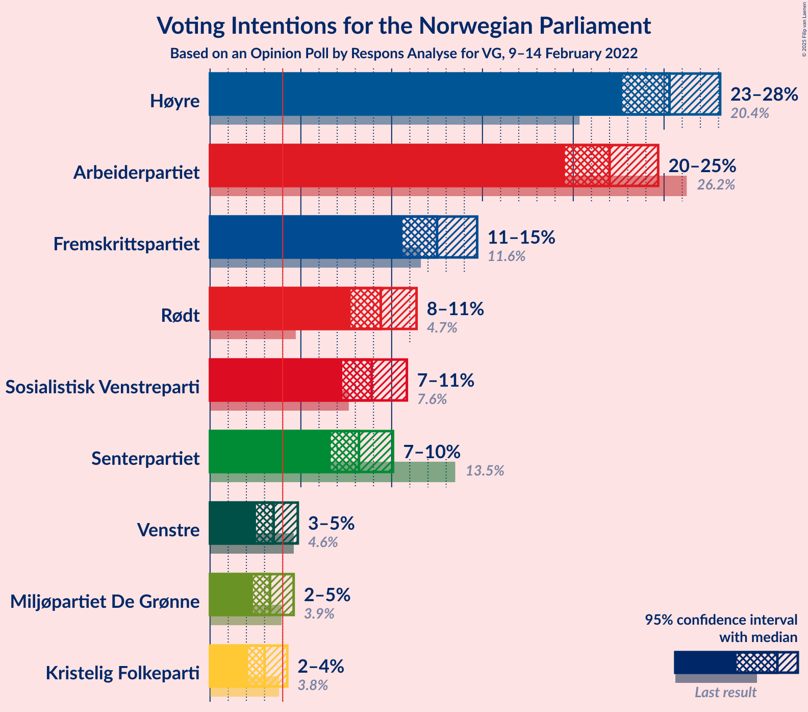

### Confidence Intervals

| Party | Last Result | Poll Result | 80% Confidence Interval | 90% Confidence Interval | 95% Confidence Interval | 99% Confidence Interval |
|:-----:|:-----------:|:-----------:|:-----------------------:|:-----------------------:|:-----------------------:|:-----------------------:|
| Høyre | 20.4% | 25.3% | 23.6–27.1% |23.1–27.6% |22.7–28.1% |21.9–29.0% |
| Arbeiderpartiet | 26.2% | 22.0% | 20.4–23.7% |19.9–24.2% |19.5–24.7% |18.8–25.5% |
| Fremskrittspartiet | 11.6% | 12.5% | 11.2–13.9% |10.9–14.3% |10.6–14.7% |10.0–15.4% |
| Rødt | 4.7% | 9.4% | 8.3–10.7% |8.0–11.1% |7.7–11.4% |7.2–12.0% |
| Sosialistisk Venstreparti | 7.6% | 8.9% | 7.8–10.2% |7.5–10.5% |7.3–10.8% |6.8–11.5% |
| Senterpartiet | 13.5% | 8.2% | 7.2–9.4% |6.9–9.8% |6.6–10.1% |6.2–10.7% |
| Venstre | 4.6% | 3.5% | 2.9–4.4% |2.7–4.6% |2.5–4.8% |2.2–5.3% |
| Miljøpartiet De Grønne | 3.9% | 3.3% | 2.7–4.1% |2.5–4.4% |2.4–4.6% |2.1–5.0% |
| Kristelig Folkeparti | 3.8% | 3.0% | 2.4–3.8% |2.2–4.1% |2.1–4.3% |1.9–4.7% |

*Note:* The poll result column reflects the actual value used in the calculations. Published results may vary slightly, and in addition be rounded to fewer digits.

## Seats

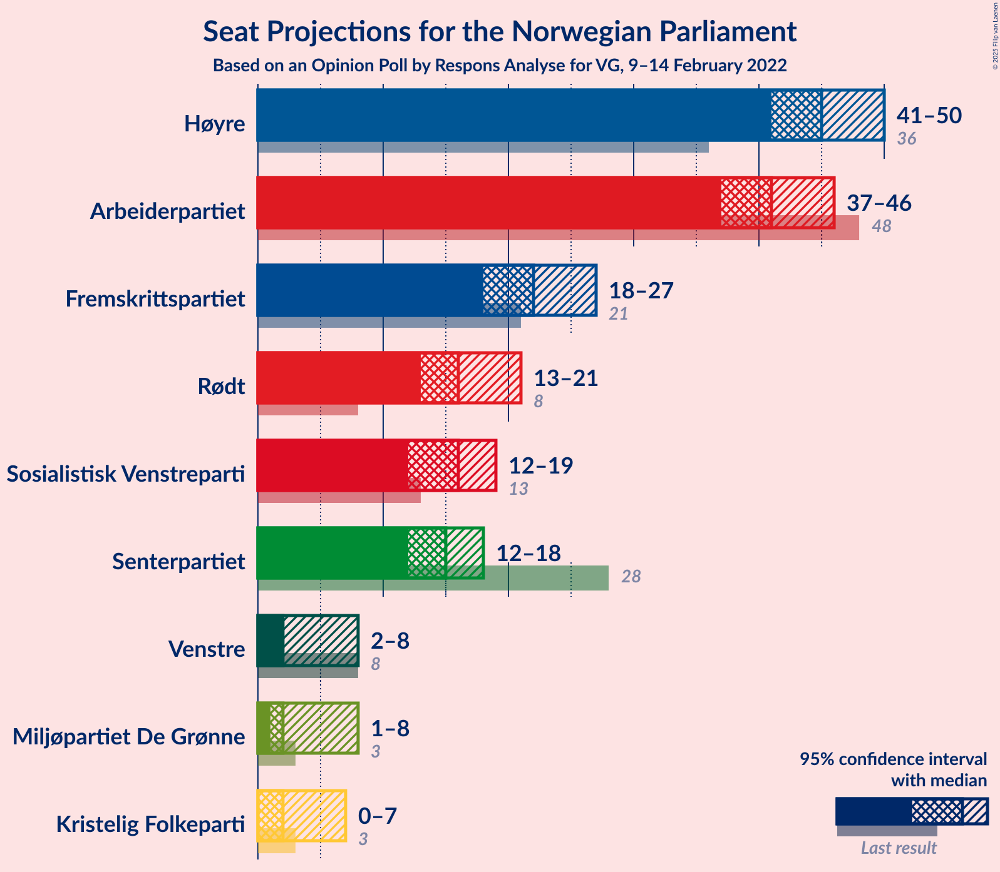

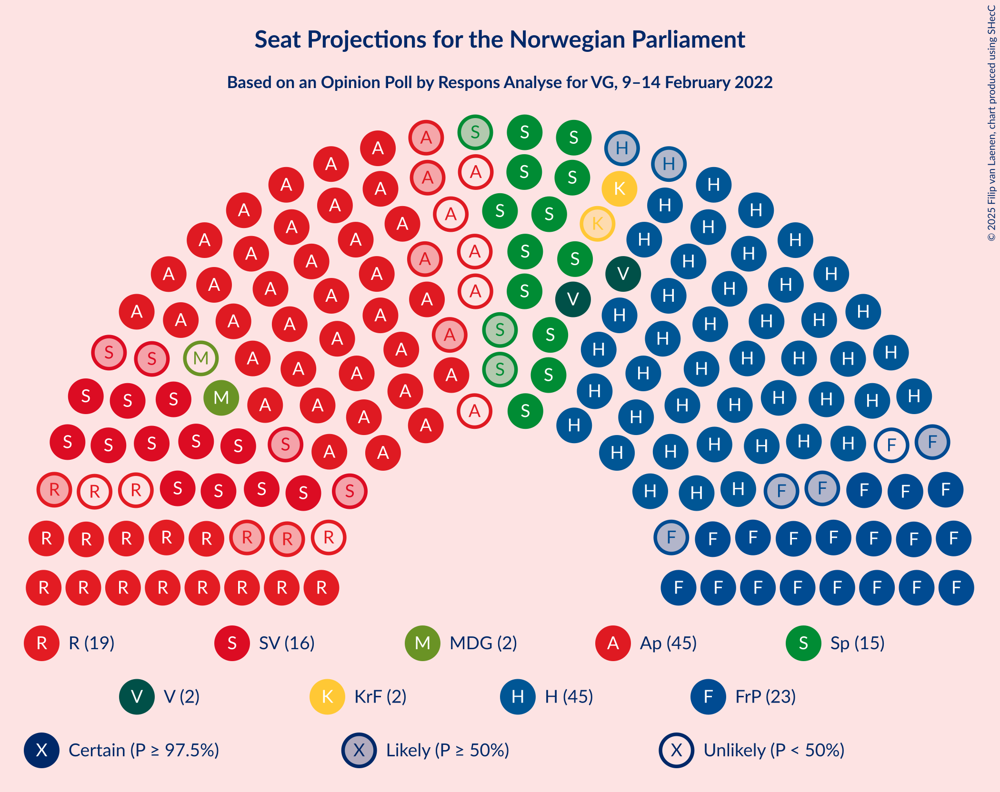

### Confidence Intervals

| Party | Last Result | Median | 80% Confidence Interval | 90% Confidence Interval | 95% Confidence Interval | 99% Confidence Interval |
|:-----:|:-----------:|:------:|:-----------------------:|:-----------------------:|:-----------------------:|:-----------------------:|
| <a href="#høyre">Høyre</a> | 36 | 45 | 42–49 |41–49 |41–50 |39–53 |
| <a href="#arbeiderpartiet">Arbeiderpartiet</a> | 48 | 41 | 38–45 |37–46 |37–46 |35–48 |
| <a href="#fremskrittspartiet">Fremskrittspartiet</a> | 21 | 22 | 19–25 |19–26 |18–27 |17–28 |
| <a href="#rødt">Rødt</a> | 8 | 16 | 14–19 |13–20 |13–21 |12–22 |
| <a href="#sosialistisk-venstreparti">Sosialistisk Venstreparti</a> | 13 | 16 | 13–18 |12–19 |12–19 |11–21 |
| <a href="#senterpartiet">Senterpartiet</a> | 28 | 15 | 13–17 |12–18 |12–18 |11–19 |
| <a href="#venstre">Venstre</a> | 8 | 2 | 2–7 |2–8 |2–8 |1–9 |
| <a href="#miljøpartiet-de-grønne">Miljøpartiet De Grønne</a> | 3 | 2 | 1–7 |1–8 |1–8 |1–9 |
| <a href="#kristelig-folkeparti">Kristelig Folkeparti</a> | 3 | 2 | 2–3 |0–7 |0–7 |0–8 |

### Høyre

*For a full overview of the results for this party, see the [Høyre](party-høyre.html) page.*

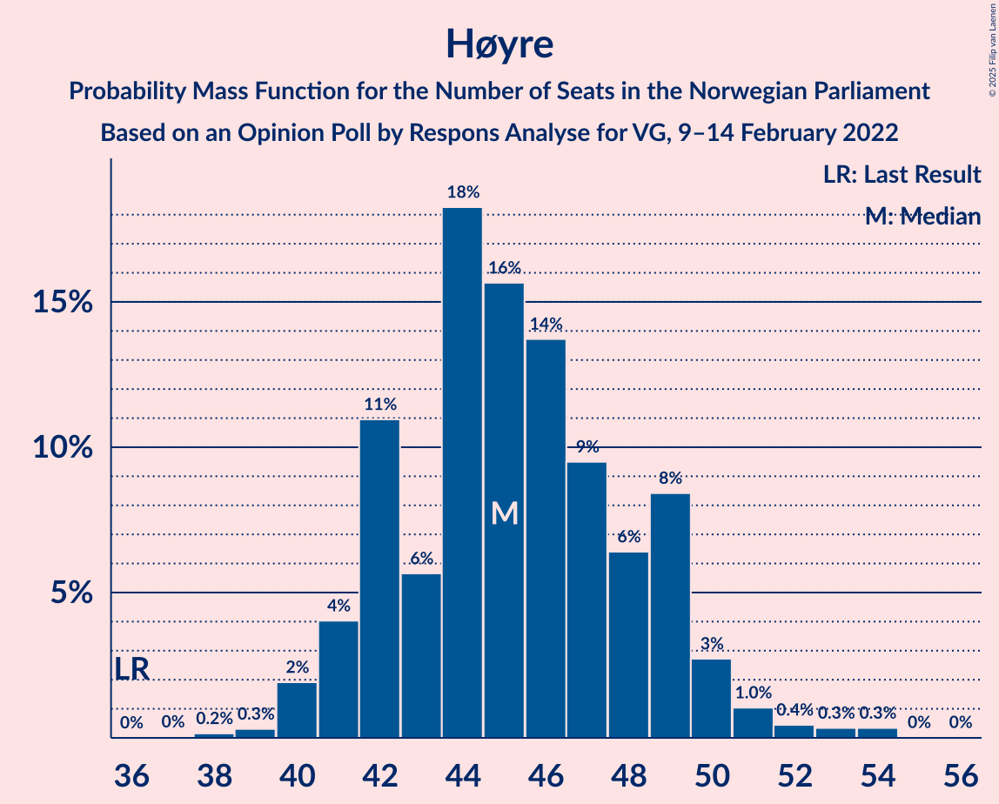

| Number of Seats | Probability | Accumulated | Special Marks |
|:---------------:|:-----------:|:-----------:|:-------------:|
| 36 | 0% | 100% | Last Result |
| 37 | 0% | 100% |  |
| 38 | 0.2% | 99.9% |  |
| 39 | 0.3% | 99.8% |  |
| 40 | 2% | 99.5% |  |
| 41 | 4% | 98% |  |
| 42 | 11% | 94% |  |
| 43 | 6% | 83% |  |
| 44 | 18% | 77% |  |
| 45 | 16% | 59% | Median |
| 46 | 14% | 43% |  |
| 47 | 9% | 29% |  |
| 48 | 6% | 20% |  |
| 49 | 8% | 13% |  |
| 50 | 3% | 5% |  |
| 51 | 1.0% | 2% |  |
| 52 | 0.4% | 1.2% |  |
| 53 | 0.3% | 0.7% |  |
| 54 | 0.3% | 0.4% |  |
| 55 | 0% | 0.1% |  |
| 56 | 0% | 0% |  |

### Arbeiderpartiet

*For a full overview of the results for this party, see the [Arbeiderpartiet](party-arbeiderpartiet.html) page.*

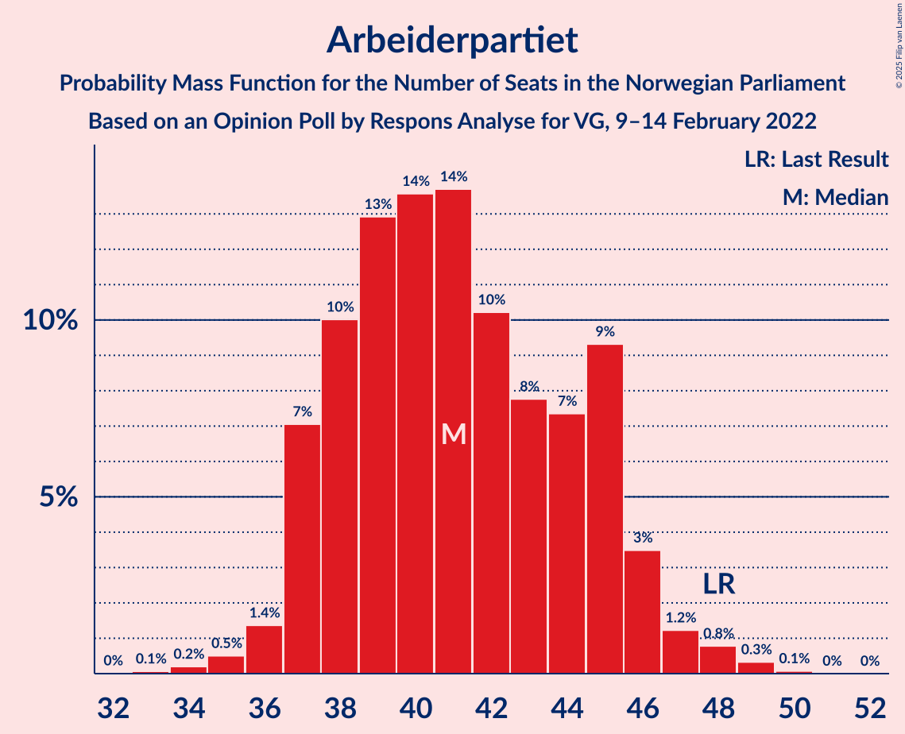

| Number of Seats | Probability | Accumulated | Special Marks |
|:---------------:|:-----------:|:-----------:|:-------------:|
| 33 | 0.1% | 100% |  |
| 34 | 0.2% | 99.9% |  |
| 35 | 0.5% | 99.7% |  |
| 36 | 1.4% | 99.2% |  |
| 37 | 7% | 98% |  |
| 38 | 10% | 91% |  |
| 39 | 13% | 81% |  |
| 40 | 14% | 68% |  |
| 41 | 14% | 54% | Median |
| 42 | 10% | 41% |  |
| 43 | 8% | 30% |  |
| 44 | 7% | 23% |  |
| 45 | 9% | 15% |  |
| 46 | 3% | 6% |  |
| 47 | 1.2% | 2% |  |
| 48 | 0.8% | 1.2% | Last Result |
| 49 | 0.3% | 0.4% |  |
| 50 | 0.1% | 0.1% |  |
| 51 | 0% | 0% |  |

### Fremskrittspartiet

*For a full overview of the results for this party, see the [Fremskrittspartiet](party-fremskrittspartiet.html) page.*

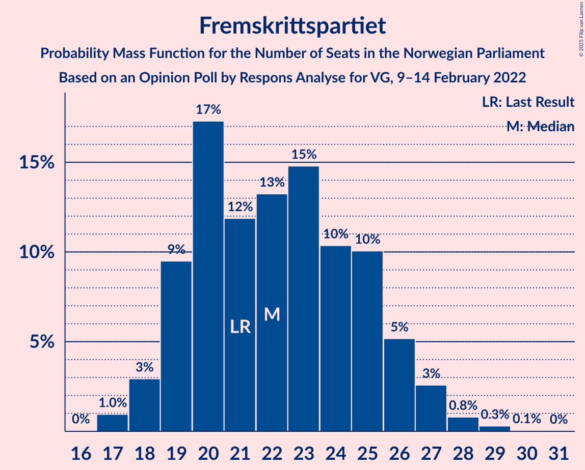

| Number of Seats | Probability | Accumulated | Special Marks |
|:---------------:|:-----------:|:-----------:|:-------------:|
| 16 | 0% | 100% |  |
| 17 | 1.0% | 99.9% |  |
| 18 | 3% | 99.0% |  |
| 19 | 9% | 96% |  |
| 20 | 17% | 87% |  |
| 21 | 12% | 69% | Last Result |
| 22 | 13% | 57% | Median |
| 23 | 15% | 44% |  |
| 24 | 10% | 29% |  |
| 25 | 10% | 19% |  |
| 26 | 5% | 9% |  |
| 27 | 3% | 4% |  |
| 28 | 0.8% | 1.2% |  |
| 29 | 0.3% | 0.4% |  |
| 30 | 0.1% | 0.1% |  |
| 31 | 0% | 0% |  |

### Rødt

*For a full overview of the results for this party, see the [Rødt](party-rødt.html) page.*

| Number of Seats | Probability | Accumulated | Special Marks |
|:---------------:|:-----------:|:-----------:|:-------------:|
| 8 | 0% | 100% | Last Result |
| 9 | 0% | 100% |  |
| 10 | 0% | 100% |  |
| 11 | 0% | 100% |  |
| 12 | 0.8% | 99.9% |  |
| 13 | 4% | 99.2% |  |
| 14 | 23% | 95% |  |
| 15 | 15% | 71% |  |
| 16 | 13% | 57% | Median |
| 17 | 10% | 44% |  |
| 18 | 10% | 34% |  |
| 19 | 15% | 24% |  |
| 20 | 6% | 10% |  |
| 21 | 3% | 4% |  |
| 22 | 1.1% | 1.3% |  |
| 23 | 0.2% | 0.2% |  |
| 24 | 0% | 0% |  |

### Sosialistisk Venstreparti

*For a full overview of the results for this party, see the [Sosialistisk Venstreparti](party-sosialistiskvenstreparti.html) page.*

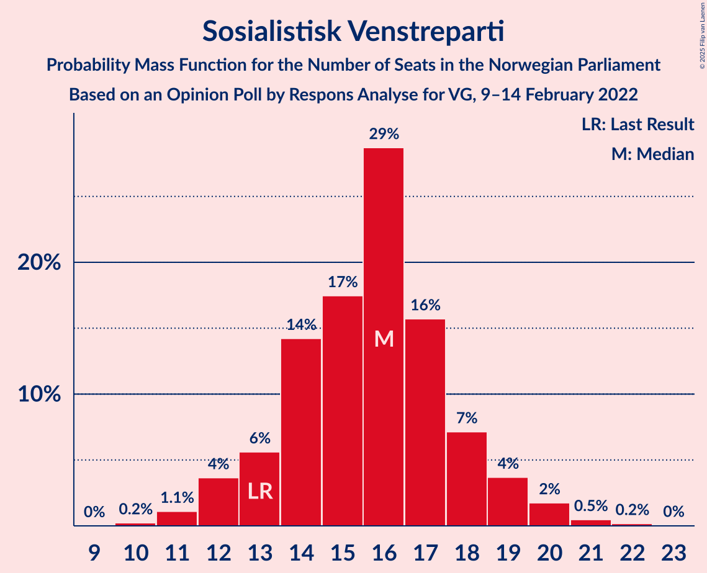

| Number of Seats | Probability | Accumulated | Special Marks |
|:---------------:|:-----------:|:-----------:|:-------------:|
| 10 | 0.2% | 100% |  |
| 11 | 1.1% | 99.8% |  |
| 12 | 4% | 98.7% |  |
| 13 | 6% | 95% | Last Result |
| 14 | 14% | 89% |  |
| 15 | 17% | 75% |  |
| 16 | 29% | 58% | Median |
| 17 | 16% | 29% |  |
| 18 | 7% | 13% |  |
| 19 | 4% | 6% |  |
| 20 | 2% | 2% |  |
| 21 | 0.5% | 0.7% |  |
| 22 | 0.2% | 0.2% |  |
| 23 | 0% | 0% |  |

### Senterpartiet

*For a full overview of the results for this party, see the [Senterpartiet](party-senterpartiet.html) page.*

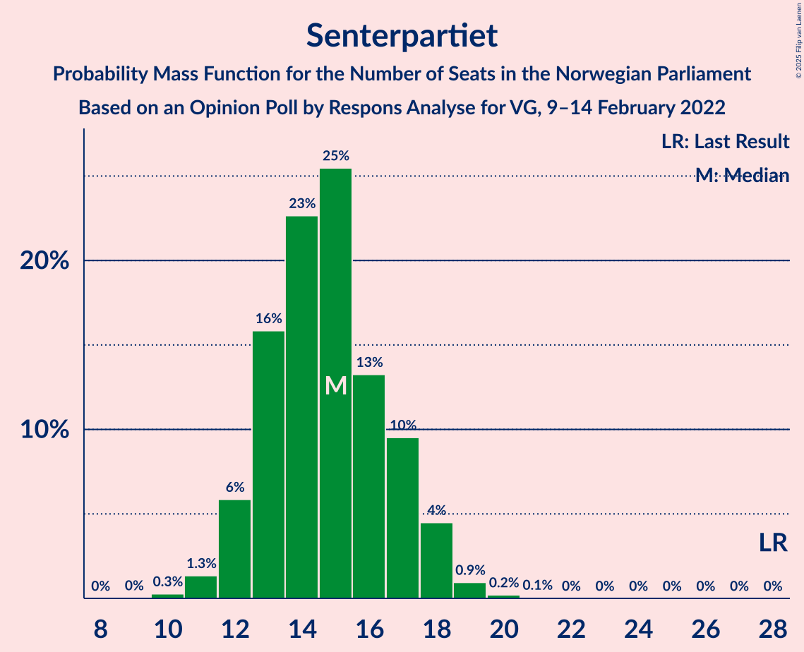

| Number of Seats | Probability | Accumulated | Special Marks |
|:---------------:|:-----------:|:-----------:|:-------------:|
| 10 | 0.3% | 100% |  |
| 11 | 1.3% | 99.7% |  |
| 12 | 6% | 98% |  |
| 13 | 16% | 92% |  |
| 14 | 23% | 77% |  |
| 15 | 25% | 54% | Median |
| 16 | 13% | 29% |  |
| 17 | 10% | 15% |  |
| 18 | 4% | 6% |  |
| 19 | 0.9% | 1.2% |  |
| 20 | 0.2% | 0.3% |  |
| 21 | 0.1% | 0.1% |  |
| 22 | 0% | 0% |  |
| 23 | 0% | 0% |  |
| 24 | 0% | 0% |  |
| 25 | 0% | 0% |  |
| 26 | 0% | 0% |  |
| 27 | 0% | 0% |  |
| 28 | 0% | 0% | Last Result |

### Venstre

*For a full overview of the results for this party, see the [Venstre](party-venstre.html) page.*

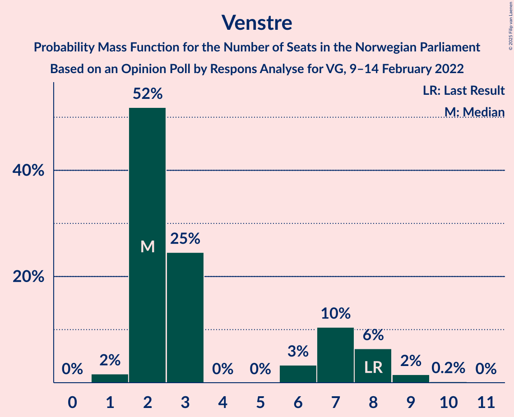

| Number of Seats | Probability | Accumulated | Special Marks |
|:---------------:|:-----------:|:-----------:|:-------------:|
| 1 | 2% | 100% |  |
| 2 | 52% | 98% | Median |
| 3 | 25% | 46% |  |
| 4 | 0% | 22% |  |
| 5 | 0% | 22% |  |
| 6 | 3% | 22% |  |
| 7 | 10% | 19% |  |
| 8 | 6% | 8% | Last Result |
| 9 | 2% | 2% |  |
| 10 | 0.2% | 0.2% |  |
| 11 | 0% | 0% |  |

### Miljøpartiet De Grønne

*For a full overview of the results for this party, see the [Miljøpartiet De Grønne](party-miljøpartietdegrønne.html) page.*

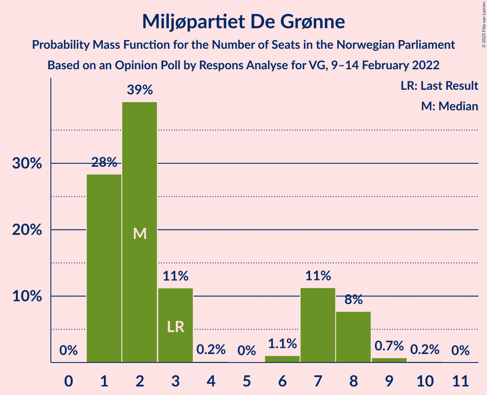

| Number of Seats | Probability | Accumulated | Special Marks |
|:---------------:|:-----------:|:-----------:|:-------------:|
| 1 | 28% | 100% |  |
| 2 | 39% | 72% | Median |
| 3 | 11% | 32% | Last Result |
| 4 | 0.2% | 21% |  |
| 5 | 0% | 21% |  |
| 6 | 1.1% | 21% |  |
| 7 | 11% | 20% |  |
| 8 | 8% | 9% |  |
| 9 | 0.7% | 0.9% |  |
| 10 | 0.2% | 0.2% |  |
| 11 | 0% | 0% |  |

### Kristelig Folkeparti

*For a full overview of the results for this party, see the [Kristelig Folkeparti](party-kristeligfolkeparti.html) page.*

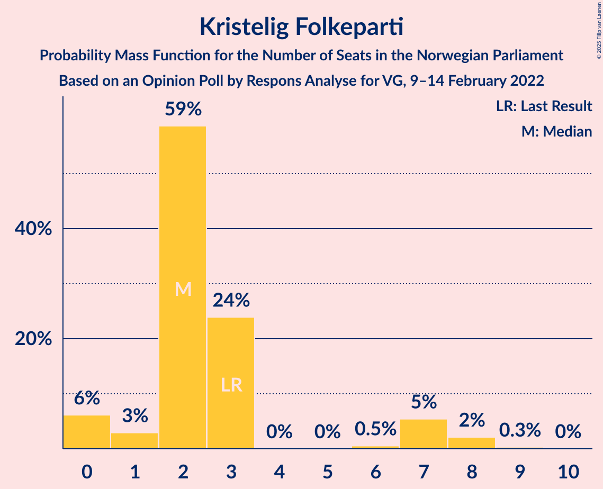

| Number of Seats | Probability | Accumulated | Special Marks |
|:---------------:|:-----------:|:-----------:|:-------------:|
| 0 | 6% | 100% |  |
| 1 | 3% | 94% |  |
| 2 | 59% | 91% | Median |
| 3 | 24% | 32% | Last Result |
| 4 | 0% | 8% |  |
| 5 | 0% | 8% |  |
| 6 | 0.5% | 8% |  |
| 7 | 5% | 8% |  |
| 8 | 2% | 2% |  |
| 9 | 0.3% | 0.3% |  |
| 10 | 0% | 0% |  |

## Coalitions

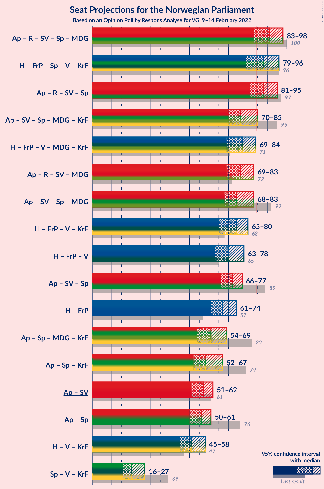

### Confidence Intervals

| Coalition | Last Result | Median | Majority? | 80% Confidence Interval | 90% Confidence Interval | 95% Confidence Interval | 99% Confidence Interval |
|:---------:|:-----------:|:------:|:---------:|:-----------------------:|:-----------------------:|:-----------------------:|:-----------------------:|
| Arbeiderpartiet – Rødt – Sosialistisk Venstreparti – Senterpartiet – Miljøpartiet De Grønne | 100 | 91 | 96% | 86–96 | 85–98 | 83–98 | 81–100 |
| Høyre – Fremskrittspartiet – Senterpartiet – Venstre – Kristelig Folkeparti | 96 | 88 | 82% | 83–93 | 80–94 | 79–96 | 78–99 |
| Arbeiderpartiet – Rødt – Sosialistisk Venstreparti – Senterpartiet | 97 | 88 | 79% | 83–92 | 82–94 | 81–95 | 79–98 |
| Arbeiderpartiet – Sosialistisk Venstreparti – Senterpartiet – Miljøpartiet De Grønne – Kristelig Folkeparti | 95 | 76 | 3% | 73–82 | 71–84 | 70–85 | 68–86 |
| Høyre – Fremskrittspartiet – Venstre – Miljøpartiet De Grønne – Kristelig Folkeparti | 71 | 77 | 2% | 72–80 | 70–82 | 69–84 | 67–86 |
| Arbeiderpartiet – Rødt – Sosialistisk Venstreparti – Miljøpartiet De Grønne | 72 | 76 | 1.2% | 71–81 | 70–82 | 69–83 | 66–85 |
| Arbeiderpartiet – Sosialistisk Venstreparti – Senterpartiet – Miljøpartiet De Grønne | 92 | 74 | 0.2% | 70–80 | 69–81 | 68–83 | 66–83 |
| Høyre – Fremskrittspartiet – Venstre – Kristelig Folkeparti | 68 | 74 | 0.1% | 68–78 | 66–79 | 65–80 | 64–83 |
| Høyre – Fremskrittspartiet – Venstre | 65 | 70 | 0% | 66–75 | 64–77 | 63–78 | 62–80 |
| Arbeiderpartiet – Sosialistisk Venstreparti – Senterpartiet | 89 | 72 | 0% | 68–75 | 67–76 | 66–77 | 64–80 |
| Høyre – Fremskrittspartiet | 57 | 67 | 0% | 62–72 | 61–73 | 61–74 | 59–77 |
| Arbeiderpartiet – Senterpartiet – Miljøpartiet De Grønne – Kristelig Folkeparti | 82 | 61 | 0% | 56–67 | 55–69 | 54–69 | 53–71 |
| Arbeiderpartiet – Senterpartiet – Kristelig Folkeparti | 79 | 58 | 0% | 55–62 | 53–65 | 52–67 | 51–67 |
| Arbeiderpartiet – Sosialistisk Venstreparti | 61 | 57 | 0% | 53–61 | 52–61 | 51–62 | 50–64 |
| Arbeiderpartiet – Senterpartiet | 76 | 56 | 0% | 52–60 | 51–60 | 50–61 | 49–64 |
| Høyre – Venstre – Kristelig Folkeparti | 47 | 51 | 0% | 47–55 | 46–56 | 45–58 | 44–60 |
| Senterpartiet – Venstre – Kristelig Folkeparti | 39 | 20 | 0% | 17–25 | 16–26 | 16–27 | 14–30 |

### Arbeiderpartiet – Rødt – Sosialistisk Venstreparti – Senterpartiet – Miljøpartiet De Grønne

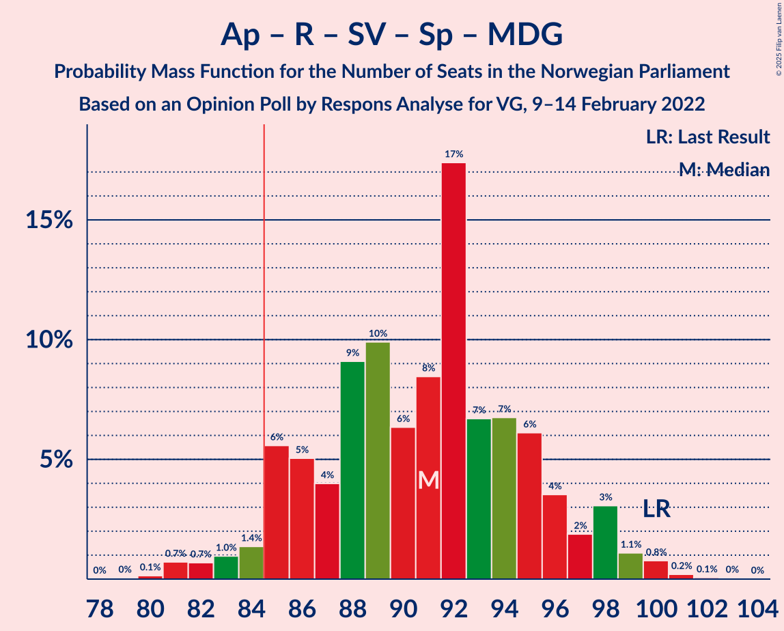

| Number of Seats | Probability | Accumulated | Special Marks |
|:---------------:|:-----------:|:-----------:|:-------------:|
| 79 | 0% | 100% |  |
| 80 | 0.1% | 99.9% |  |
| 81 | 0.7% | 99.8% |  |
| 82 | 0.7% | 99.1% |  |
| 83 | 1.0% | 98% |  |
| 84 | 1.4% | 97% |  |
| 85 | 6% | 96% | Majority |
| 86 | 5% | 90% |  |
| 87 | 4% | 85% |  |
| 88 | 9% | 81% |  |
| 89 | 10% | 72% |  |
| 90 | 6% | 62% | Median |
| 91 | 8% | 56% |  |
| 92 | 17% | 48% |  |
| 93 | 7% | 30% |  |
| 94 | 7% | 24% |  |
| 95 | 6% | 17% |  |
| 96 | 4% | 11% |  |
| 97 | 2% | 7% |  |
| 98 | 3% | 5% |  |
| 99 | 1.1% | 2% |  |
| 100 | 0.8% | 1.1% | Last Result |
| 101 | 0.2% | 0.3% |  |
| 102 | 0.1% | 0.1% |  |
| 103 | 0% | 0.1% |  |
| 104 | 0% | 0% |  |

### Høyre – Fremskrittspartiet – Senterpartiet – Venstre – Kristelig Folkeparti

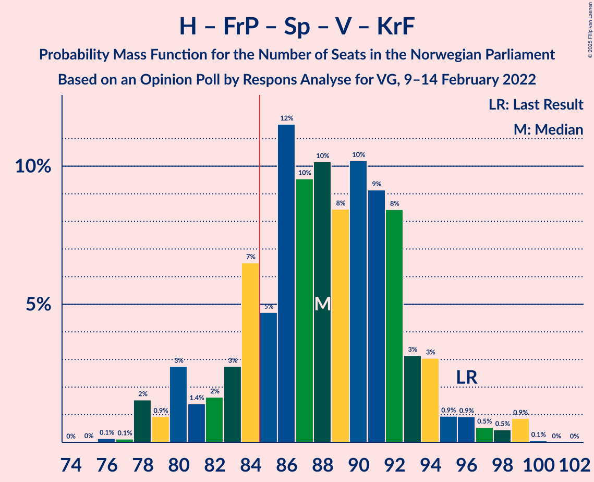

| Number of Seats | Probability | Accumulated | Special Marks |
|:---------------:|:-----------:|:-----------:|:-------------:|
| 76 | 0.1% | 100% |  |
| 77 | 0.1% | 99.8% |  |
| 78 | 2% | 99.7% |  |
| 79 | 0.9% | 98% |  |
| 80 | 3% | 97% |  |
| 81 | 1.4% | 94% |  |
| 82 | 2% | 93% |  |
| 83 | 3% | 91% |  |
| 84 | 7% | 89% |  |
| 85 | 5% | 82% | Majority |
| 86 | 12% | 77% | Median |
| 87 | 10% | 66% |  |
| 88 | 10% | 56% |  |
| 89 | 8% | 46% |  |
| 90 | 10% | 38% |  |
| 91 | 9% | 28% |  |
| 92 | 8% | 18% |  |
| 93 | 3% | 10% |  |
| 94 | 3% | 7% |  |
| 95 | 0.9% | 4% |  |
| 96 | 0.9% | 3% | Last Result |
| 97 | 0.5% | 2% |  |
| 98 | 0.5% | 1.4% |  |
| 99 | 0.9% | 1.0% |  |
| 100 | 0.1% | 0.1% |  |
| 101 | 0% | 0% |  |

### Arbeiderpartiet – Rødt – Sosialistisk Venstreparti – Senterpartiet

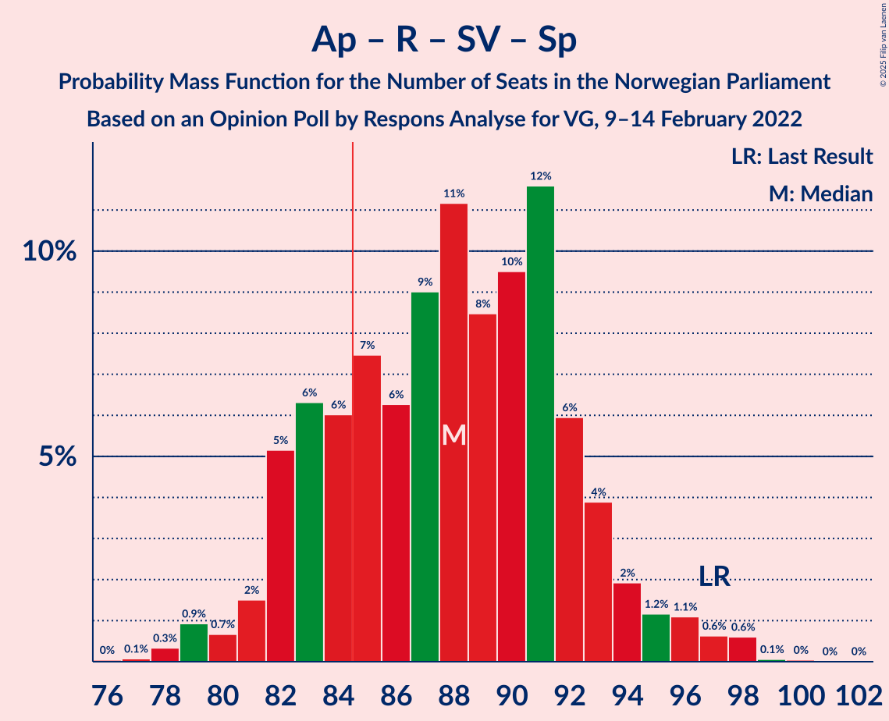

| Number of Seats | Probability | Accumulated | Special Marks |
|:---------------:|:-----------:|:-----------:|:-------------:|
| 76 | 0% | 100% |  |
| 77 | 0.1% | 99.9% |  |
| 78 | 0.3% | 99.9% |  |
| 79 | 0.9% | 99.5% |  |
| 80 | 0.7% | 98.6% |  |
| 81 | 2% | 98% |  |
| 82 | 5% | 96% |  |
| 83 | 6% | 91% |  |
| 84 | 6% | 85% |  |
| 85 | 7% | 79% | Majority |
| 86 | 6% | 71% |  |
| 87 | 9% | 65% |  |
| 88 | 11% | 56% | Median |
| 89 | 8% | 45% |  |
| 90 | 10% | 37% |  |
| 91 | 12% | 27% |  |
| 92 | 6% | 15% |  |
| 93 | 4% | 9% |  |
| 94 | 2% | 6% |  |
| 95 | 1.2% | 4% |  |
| 96 | 1.1% | 2% |  |
| 97 | 0.6% | 1.4% | Last Result |
| 98 | 0.6% | 0.7% |  |
| 99 | 0.1% | 0.1% |  |
| 100 | 0% | 0.1% |  |
| 101 | 0% | 0% |  |

### Arbeiderpartiet – Sosialistisk Venstreparti – Senterpartiet – Miljøpartiet De Grønne – Kristelig Folkeparti

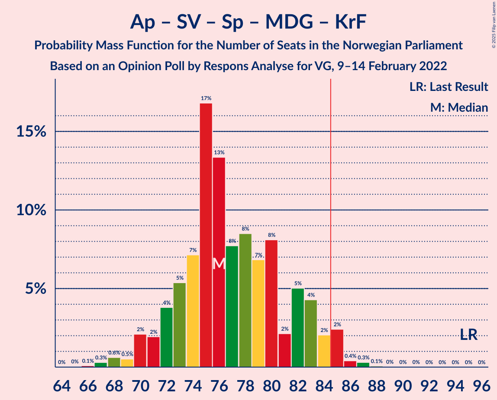

| Number of Seats | Probability | Accumulated | Special Marks |
|:---------------:|:-----------:|:-----------:|:-------------:|
| 65 | 0% | 100% |  |
| 66 | 0.1% | 99.9% |  |
| 67 | 0.3% | 99.8% |  |
| 68 | 0.6% | 99.5% |  |
| 69 | 0.5% | 98.9% |  |
| 70 | 2% | 98% |  |
| 71 | 2% | 96% |  |
| 72 | 4% | 94% |  |
| 73 | 5% | 91% |  |
| 74 | 7% | 85% |  |
| 75 | 17% | 78% |  |
| 76 | 13% | 61% | Median |
| 77 | 8% | 48% |  |
| 78 | 8% | 40% |  |
| 79 | 7% | 32% |  |
| 80 | 8% | 25% |  |
| 81 | 2% | 17% |  |
| 82 | 5% | 15% |  |
| 83 | 4% | 10% |  |
| 84 | 2% | 5% |  |
| 85 | 2% | 3% | Majority |
| 86 | 0.4% | 0.8% |  |
| 87 | 0.3% | 0.4% |  |
| 88 | 0.1% | 0.1% |  |
| 89 | 0% | 0.1% |  |
| 90 | 0% | 0% |  |
| 91 | 0% | 0% |  |
| 92 | 0% | 0% |  |
| 93 | 0% | 0% |  |
| 94 | 0% | 0% |  |
| 95 | 0% | 0% | Last Result |

### Høyre – Fremskrittspartiet – Venstre – Miljøpartiet De Grønne – Kristelig Folkeparti

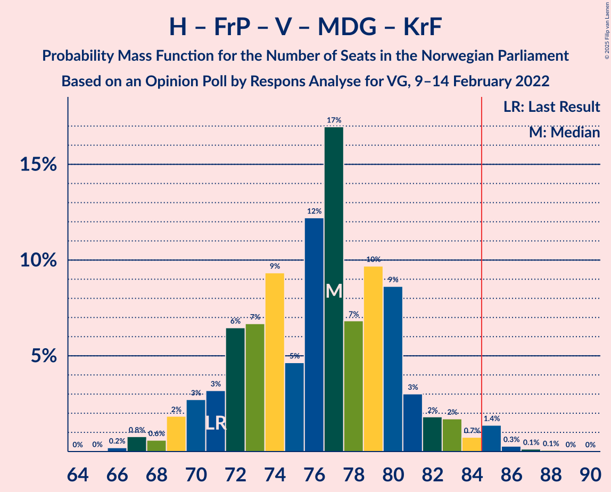

| Number of Seats | Probability | Accumulated | Special Marks |
|:---------------:|:-----------:|:-----------:|:-------------:|
| 66 | 0.2% | 100% |  |
| 67 | 0.8% | 99.8% |  |
| 68 | 0.6% | 99.0% |  |
| 69 | 2% | 98% |  |
| 70 | 3% | 97% |  |
| 71 | 3% | 94% | Last Result |
| 72 | 6% | 91% |  |
| 73 | 7% | 84% | Median |
| 74 | 9% | 77% |  |
| 75 | 5% | 68% |  |
| 76 | 12% | 63% |  |
| 77 | 17% | 51% |  |
| 78 | 7% | 34% |  |
| 79 | 10% | 27% |  |
| 80 | 9% | 18% |  |
| 81 | 3% | 9% |  |
| 82 | 2% | 6% |  |
| 83 | 2% | 4% |  |
| 84 | 0.7% | 3% |  |
| 85 | 1.4% | 2% | Majority |
| 86 | 0.3% | 0.5% |  |
| 87 | 0.1% | 0.2% |  |
| 88 | 0.1% | 0.1% |  |
| 89 | 0% | 0% |  |

### Arbeiderpartiet – Rødt – Sosialistisk Venstreparti – Miljøpartiet De Grønne

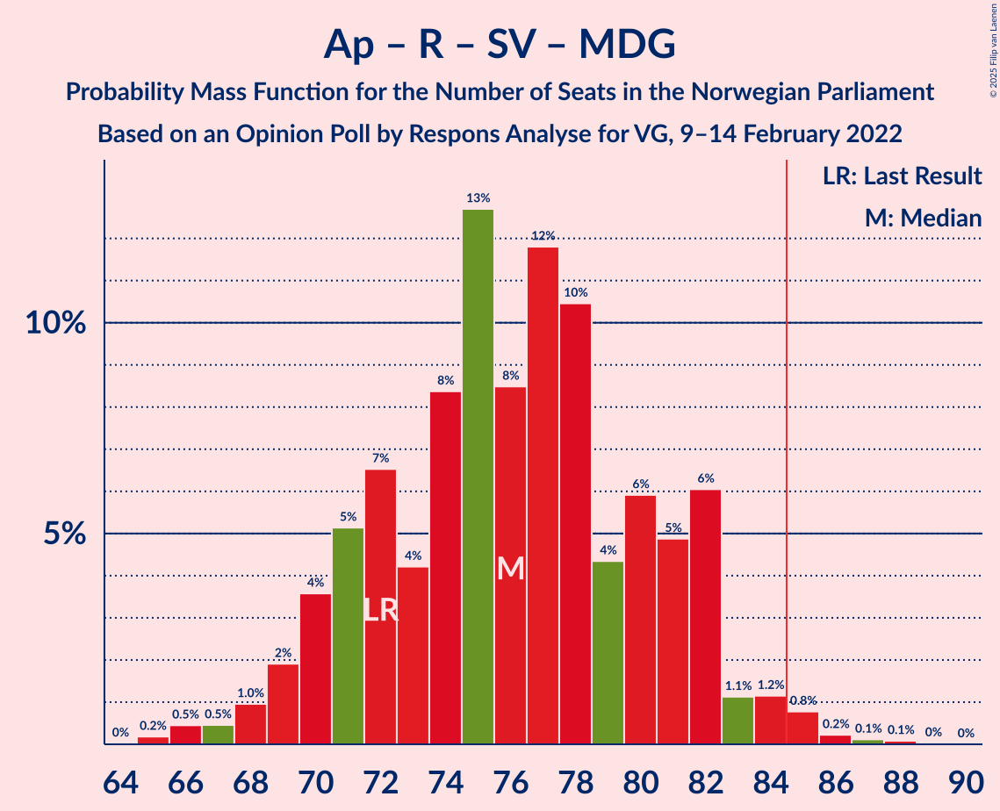

| Number of Seats | Probability | Accumulated | Special Marks |
|:---------------:|:-----------:|:-----------:|:-------------:|
| 65 | 0.2% | 100% |  |
| 66 | 0.5% | 99.8% |  |
| 67 | 0.5% | 99.3% |  |
| 68 | 1.0% | 98.9% |  |
| 69 | 2% | 98% |  |
| 70 | 4% | 96% |  |
| 71 | 5% | 92% |  |
| 72 | 7% | 87% | Last Result |
| 73 | 4% | 81% |  |
| 74 | 8% | 77% |  |
| 75 | 13% | 68% | Median |
| 76 | 8% | 55% |  |
| 77 | 12% | 47% |  |
| 78 | 10% | 35% |  |
| 79 | 4% | 25% |  |
| 80 | 6% | 20% |  |
| 81 | 5% | 14% |  |
| 82 | 6% | 10% |  |
| 83 | 1.1% | 4% |  |
| 84 | 1.2% | 2% |  |
| 85 | 0.8% | 1.2% | Majority |
| 86 | 0.2% | 0.5% |  |
| 87 | 0.1% | 0.2% |  |
| 88 | 0.1% | 0.1% |  |
| 89 | 0% | 0% |  |

### Arbeiderpartiet – Sosialistisk Venstreparti – Senterpartiet – Miljøpartiet De Grønne

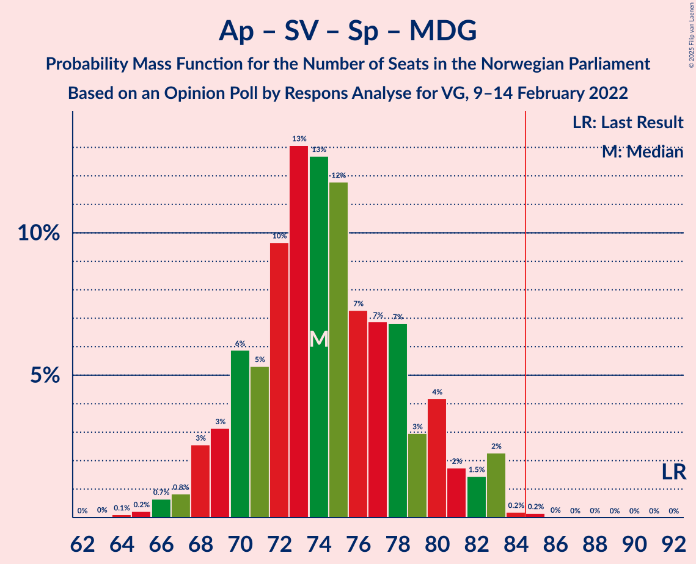

| Number of Seats | Probability | Accumulated | Special Marks |
|:---------------:|:-----------:|:-----------:|:-------------:|
| 63 | 0% | 100% |  |
| 64 | 0.1% | 99.9% |  |
| 65 | 0.2% | 99.8% |  |
| 66 | 0.7% | 99.6% |  |
| 67 | 0.8% | 99.0% |  |
| 68 | 3% | 98% |  |
| 69 | 3% | 96% |  |
| 70 | 6% | 92% |  |
| 71 | 5% | 87% |  |
| 72 | 10% | 81% |  |
| 73 | 13% | 72% |  |
| 74 | 13% | 58% | Median |
| 75 | 12% | 46% |  |
| 76 | 7% | 34% |  |
| 77 | 7% | 27% |  |
| 78 | 7% | 20% |  |
| 79 | 3% | 13% |  |
| 80 | 4% | 10% |  |
| 81 | 2% | 6% |  |
| 82 | 1.5% | 4% |  |
| 83 | 2% | 3% |  |
| 84 | 0.2% | 0.4% |  |
| 85 | 0.2% | 0.2% | Majority |
| 86 | 0% | 0.1% |  |
| 87 | 0% | 0% |  |
| 88 | 0% | 0% |  |
| 89 | 0% | 0% |  |
| 90 | 0% | 0% |  |
| 91 | 0% | 0% |  |
| 92 | 0% | 0% | Last Result |

### Høyre – Fremskrittspartiet – Venstre – Kristelig Folkeparti

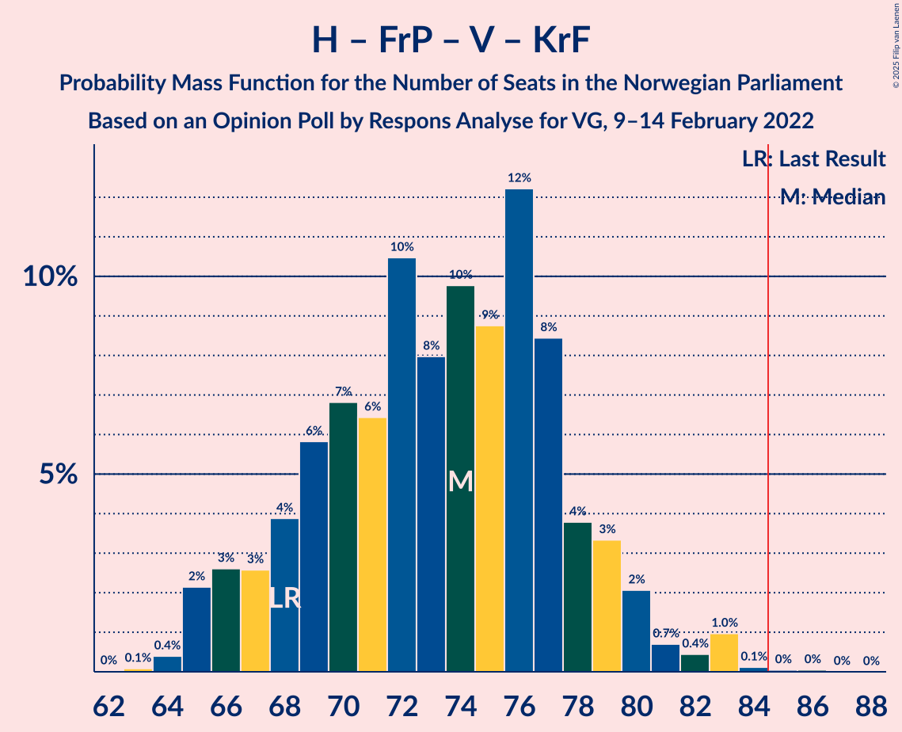

| Number of Seats | Probability | Accumulated | Special Marks |
|:---------------:|:-----------:|:-----------:|:-------------:|
| 63 | 0.1% | 100% |  |
| 64 | 0.4% | 99.9% |  |
| 65 | 2% | 99.5% |  |
| 66 | 3% | 97% |  |
| 67 | 3% | 95% |  |
| 68 | 4% | 92% | Last Result |
| 69 | 6% | 88% |  |
| 70 | 7% | 82% |  |
| 71 | 6% | 76% | Median |
| 72 | 10% | 69% |  |
| 73 | 8% | 59% |  |
| 74 | 10% | 51% |  |
| 75 | 9% | 41% |  |
| 76 | 12% | 32% |  |
| 77 | 8% | 20% |  |
| 78 | 4% | 12% |  |
| 79 | 3% | 8% |  |
| 80 | 2% | 4% |  |
| 81 | 0.7% | 2% |  |
| 82 | 0.4% | 2% |  |
| 83 | 1.0% | 1.2% |  |
| 84 | 0.1% | 0.2% |  |
| 85 | 0% | 0.1% | Majority |
| 86 | 0% | 0.1% |  |
| 87 | 0% | 0% |  |

### Høyre – Fremskrittspartiet – Venstre

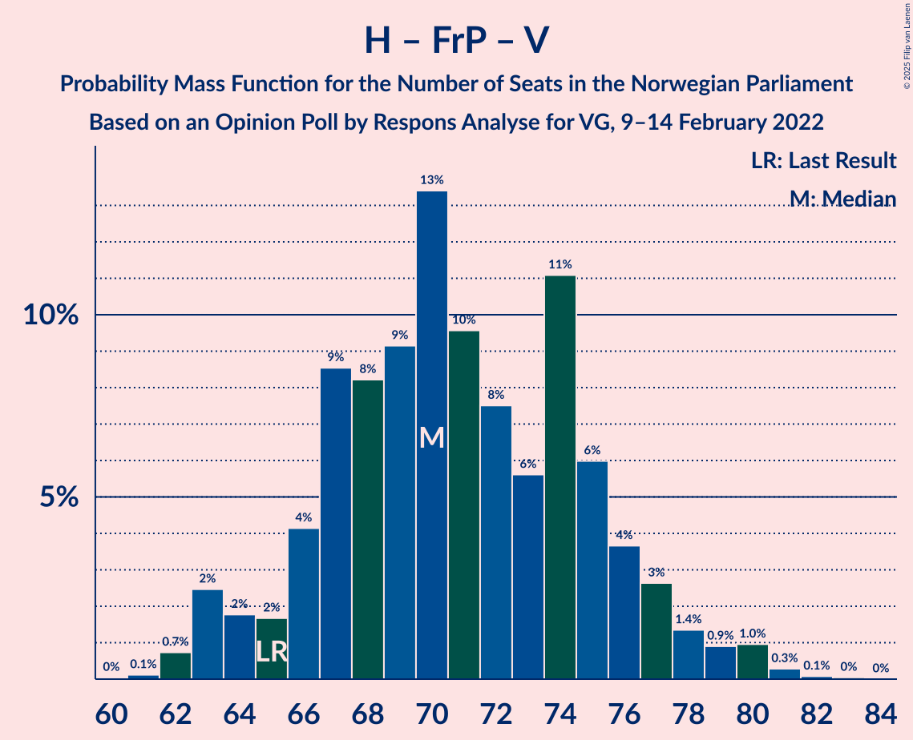

| Number of Seats | Probability | Accumulated | Special Marks |
|:---------------:|:-----------:|:-----------:|:-------------:|
| 60 | 0% | 100% |  |
| 61 | 0.1% | 99.9% |  |
| 62 | 0.7% | 99.8% |  |
| 63 | 2% | 99.1% |  |
| 64 | 2% | 97% |  |
| 65 | 2% | 95% | Last Result |
| 66 | 4% | 93% |  |
| 67 | 9% | 89% |  |
| 68 | 8% | 80% |  |
| 69 | 9% | 72% | Median |
| 70 | 13% | 63% |  |
| 71 | 10% | 50% |  |
| 72 | 8% | 40% |  |
| 73 | 6% | 33% |  |
| 74 | 11% | 27% |  |
| 75 | 6% | 16% |  |
| 76 | 4% | 10% |  |
| 77 | 3% | 6% |  |
| 78 | 1.4% | 4% |  |
| 79 | 0.9% | 2% |  |
| 80 | 1.0% | 1.4% |  |
| 81 | 0.3% | 0.4% |  |
| 82 | 0.1% | 0.1% |  |
| 83 | 0% | 0.1% |  |
| 84 | 0% | 0% |  |

### Arbeiderpartiet – Sosialistisk Venstreparti – Senterpartiet

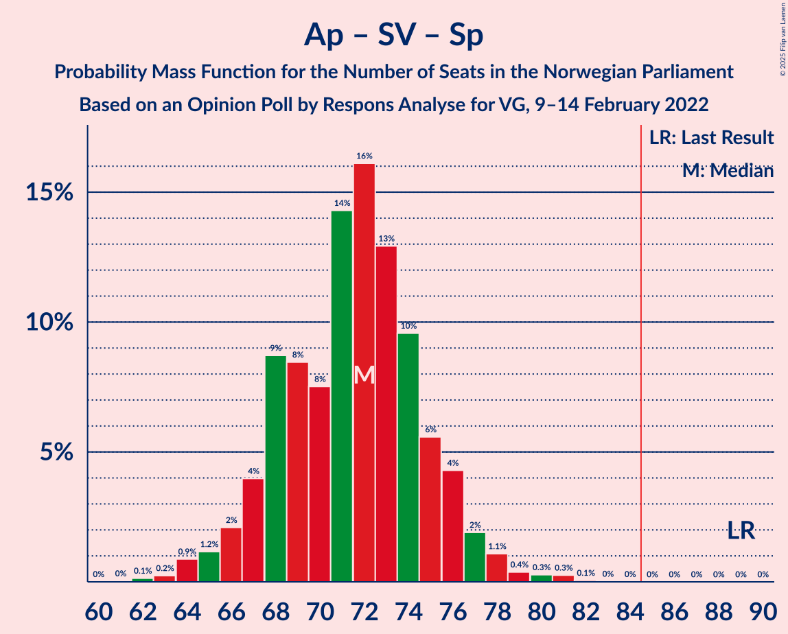

| Number of Seats | Probability | Accumulated | Special Marks |
|:---------------:|:-----------:|:-----------:|:-------------:|
| 61 | 0% | 100% |  |
| 62 | 0.1% | 99.9% |  |
| 63 | 0.2% | 99.8% |  |
| 64 | 0.9% | 99.6% |  |
| 65 | 1.2% | 98.7% |  |
| 66 | 2% | 98% |  |
| 67 | 4% | 95% |  |
| 68 | 9% | 91% |  |
| 69 | 8% | 83% |  |
| 70 | 8% | 74% |  |
| 71 | 14% | 67% |  |
| 72 | 16% | 52% | Median |
| 73 | 13% | 36% |  |
| 74 | 10% | 23% |  |
| 75 | 6% | 14% |  |
| 76 | 4% | 8% |  |
| 77 | 2% | 4% |  |
| 78 | 1.1% | 2% |  |
| 79 | 0.4% | 1.0% |  |
| 80 | 0.3% | 0.6% |  |
| 81 | 0.3% | 0.3% |  |
| 82 | 0.1% | 0.1% |  |
| 83 | 0% | 0% |  |
| 84 | 0% | 0% |  |
| 85 | 0% | 0% | Majority |
| 86 | 0% | 0% |  |
| 87 | 0% | 0% |  |
| 88 | 0% | 0% |  |
| 89 | 0% | 0% | Last Result |

### Høyre – Fremskrittspartiet

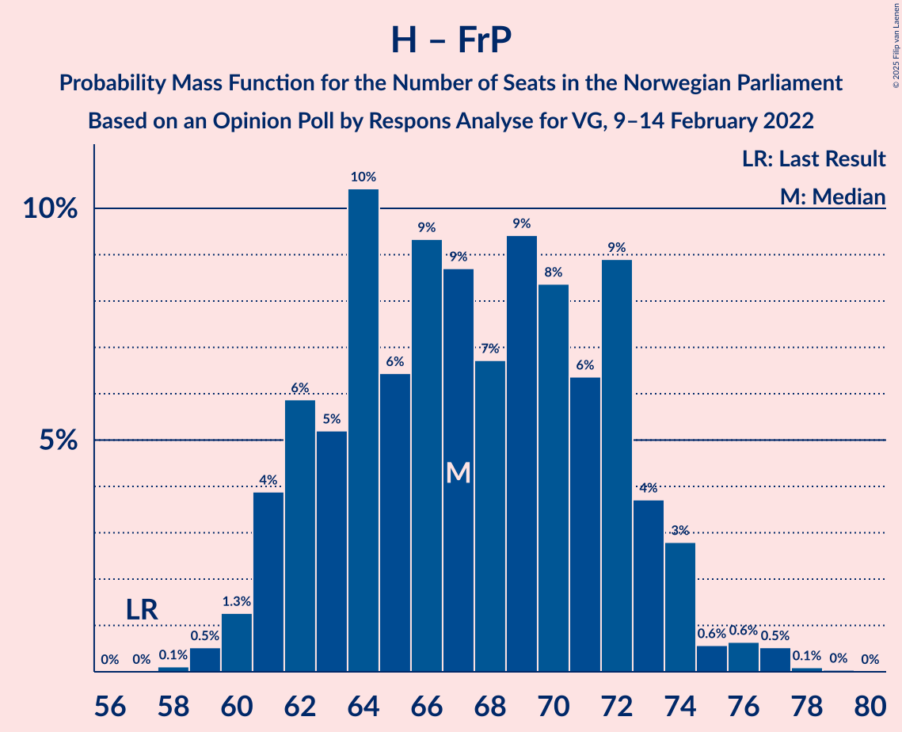

| Number of Seats | Probability | Accumulated | Special Marks |
|:---------------:|:-----------:|:-----------:|:-------------:|
| 57 | 0% | 100% | Last Result |
| 58 | 0.1% | 100% |  |
| 59 | 0.5% | 99.9% |  |
| 60 | 1.3% | 99.3% |  |
| 61 | 4% | 98% |  |
| 62 | 6% | 94% |  |
| 63 | 5% | 88% |  |
| 64 | 10% | 83% |  |
| 65 | 6% | 73% |  |
| 66 | 9% | 66% |  |
| 67 | 9% | 57% | Median |
| 68 | 7% | 48% |  |
| 69 | 9% | 41% |  |
| 70 | 8% | 32% |  |
| 71 | 6% | 24% |  |
| 72 | 9% | 17% |  |
| 73 | 4% | 8% |  |
| 74 | 3% | 5% |  |
| 75 | 0.6% | 2% |  |
| 76 | 0.6% | 1.3% |  |
| 77 | 0.5% | 0.7% |  |
| 78 | 0.1% | 0.2% |  |
| 79 | 0% | 0.1% |  |
| 80 | 0% | 0% |  |

### Arbeiderpartiet – Senterpartiet – Miljøpartiet De Grønne – Kristelig Folkeparti

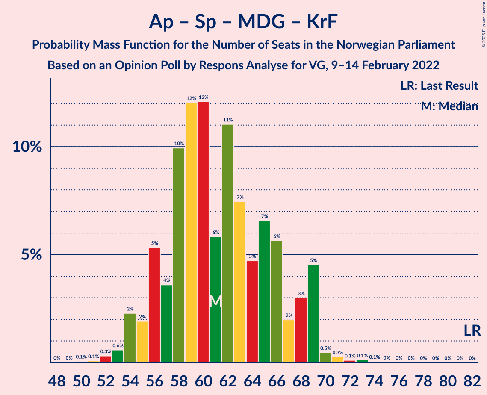

| Number of Seats | Probability | Accumulated | Special Marks |
|:---------------:|:-----------:|:-----------:|:-------------:|
| 50 | 0.1% | 100% |  |
| 51 | 0.1% | 99.9% |  |
| 52 | 0.3% | 99.8% |  |
| 53 | 0.6% | 99.5% |  |
| 54 | 2% | 99.0% |  |
| 55 | 2% | 97% |  |
| 56 | 5% | 95% |  |
| 57 | 4% | 89% |  |
| 58 | 10% | 86% |  |
| 59 | 12% | 76% |  |
| 60 | 12% | 64% | Median |
| 61 | 6% | 52% |  |
| 62 | 11% | 46% |  |
| 63 | 7% | 35% |  |
| 64 | 5% | 27% |  |
| 65 | 7% | 23% |  |
| 66 | 6% | 16% |  |
| 67 | 2% | 11% |  |
| 68 | 3% | 9% |  |
| 69 | 5% | 6% |  |
| 70 | 0.5% | 1.0% |  |
| 71 | 0.3% | 0.6% |  |
| 72 | 0.1% | 0.3% |  |
| 73 | 0.1% | 0.2% |  |
| 74 | 0.1% | 0.1% |  |
| 75 | 0% | 0% |  |
| 76 | 0% | 0% |  |
| 77 | 0% | 0% |  |
| 78 | 0% | 0% |  |
| 79 | 0% | 0% |  |
| 80 | 0% | 0% |  |
| 81 | 0% | 0% |  |
| 82 | 0% | 0% | Last Result |

### Arbeiderpartiet – Senterpartiet – Kristelig Folkeparti

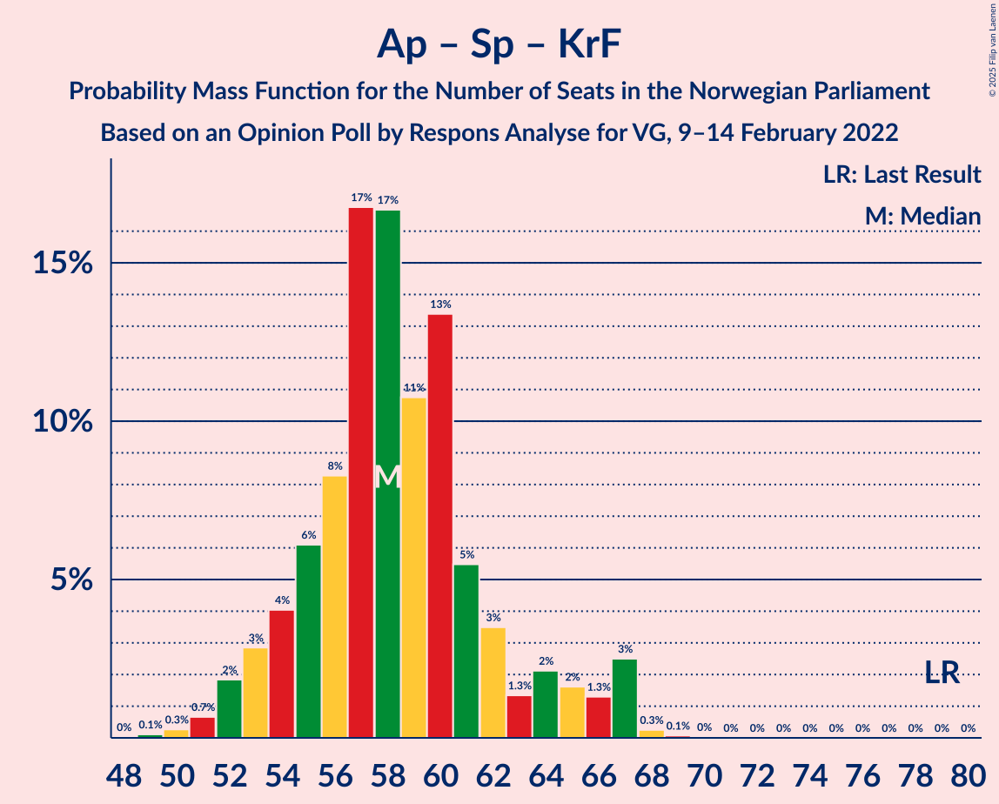

| Number of Seats | Probability | Accumulated | Special Marks |
|:---------------:|:-----------:|:-----------:|:-------------:|
| 49 | 0.1% | 100% |  |
| 50 | 0.3% | 99.9% |  |
| 51 | 0.7% | 99.6% |  |
| 52 | 2% | 98.9% |  |
| 53 | 3% | 97% |  |
| 54 | 4% | 94% |  |
| 55 | 6% | 90% |  |
| 56 | 8% | 84% |  |
| 57 | 17% | 76% |  |
| 58 | 17% | 59% | Median |
| 59 | 11% | 42% |  |
| 60 | 13% | 32% |  |
| 61 | 5% | 18% |  |
| 62 | 3% | 13% |  |
| 63 | 1.3% | 9% |  |
| 64 | 2% | 8% |  |
| 65 | 2% | 6% |  |
| 66 | 1.3% | 4% |  |
| 67 | 3% | 3% |  |
| 68 | 0.3% | 0.4% |  |
| 69 | 0.1% | 0.1% |  |
| 70 | 0% | 0% |  |
| 71 | 0% | 0% |  |
| 72 | 0% | 0% |  |
| 73 | 0% | 0% |  |
| 74 | 0% | 0% |  |
| 75 | 0% | 0% |  |
| 76 | 0% | 0% |  |
| 77 | 0% | 0% |  |
| 78 | 0% | 0% |  |
| 79 | 0% | 0% | Last Result |

### Arbeiderpartiet – Sosialistisk Venstreparti

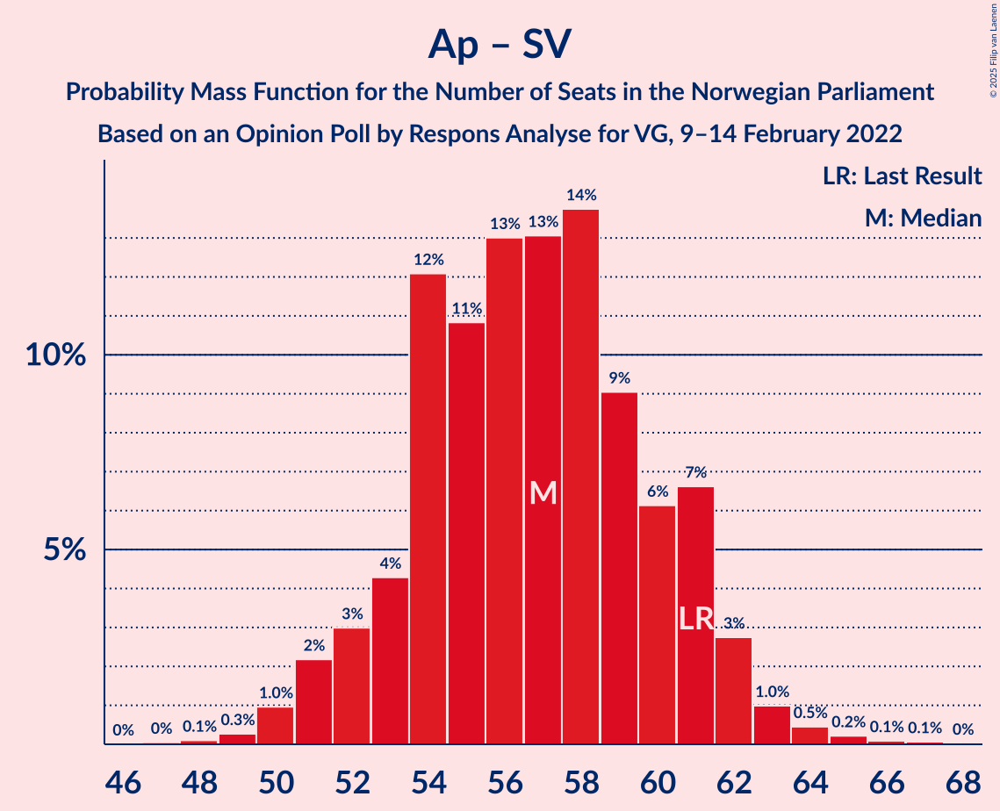

| Number of Seats | Probability | Accumulated | Special Marks |
|:---------------:|:-----------:|:-----------:|:-------------:|
| 47 | 0% | 100% |  |
| 48 | 0.1% | 99.9% |  |
| 49 | 0.3% | 99.8% |  |
| 50 | 1.0% | 99.6% |  |
| 51 | 2% | 98.6% |  |
| 52 | 3% | 96% |  |
| 53 | 4% | 93% |  |
| 54 | 12% | 89% |  |
| 55 | 11% | 77% |  |
| 56 | 13% | 66% |  |
| 57 | 13% | 53% | Median |
| 58 | 14% | 40% |  |
| 59 | 9% | 26% |  |
| 60 | 6% | 17% |  |
| 61 | 7% | 11% | Last Result |
| 62 | 3% | 5% |  |
| 63 | 1.0% | 2% |  |
| 64 | 0.5% | 0.9% |  |
| 65 | 0.2% | 0.4% |  |
| 66 | 0.1% | 0.2% |  |
| 67 | 0.1% | 0.1% |  |
| 68 | 0% | 0% |  |

### Arbeiderpartiet – Senterpartiet

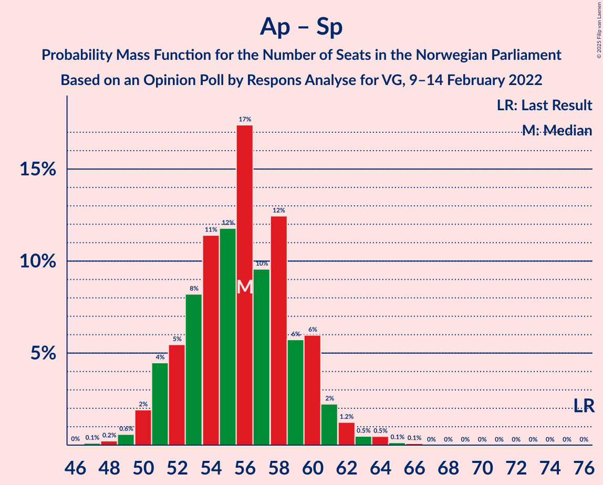

| Number of Seats | Probability | Accumulated | Special Marks |
|:---------------:|:-----------:|:-----------:|:-------------:|
| 47 | 0.1% | 100% |  |
| 48 | 0.2% | 99.9% |  |
| 49 | 0.6% | 99.6% |  |
| 50 | 2% | 99.0% |  |
| 51 | 4% | 97% |  |
| 52 | 5% | 93% |  |
| 53 | 8% | 87% |  |
| 54 | 11% | 79% |  |
| 55 | 12% | 68% |  |
| 56 | 17% | 56% | Median |
| 57 | 10% | 38% |  |
| 58 | 12% | 29% |  |
| 59 | 6% | 16% |  |
| 60 | 6% | 11% |  |
| 61 | 2% | 5% |  |
| 62 | 1.2% | 2% |  |
| 63 | 0.5% | 1.2% |  |
| 64 | 0.5% | 0.7% |  |
| 65 | 0.1% | 0.2% |  |
| 66 | 0.1% | 0.1% |  |
| 67 | 0% | 0% |  |
| 68 | 0% | 0% |  |
| 69 | 0% | 0% |  |
| 70 | 0% | 0% |  |
| 71 | 0% | 0% |  |
| 72 | 0% | 0% |  |
| 73 | 0% | 0% |  |
| 74 | 0% | 0% |  |
| 75 | 0% | 0% |  |
| 76 | 0% | 0% | Last Result |

### Høyre – Venstre – Kristelig Folkeparti

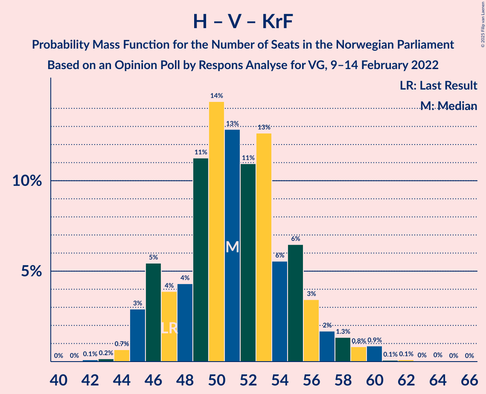

| Number of Seats | Probability | Accumulated | Special Marks |
|:---------------:|:-----------:|:-----------:|:-------------:|
| 42 | 0.1% | 100% |  |
| 43 | 0.2% | 99.9% |  |
| 44 | 0.7% | 99.7% |  |
| 45 | 3% | 99.1% |  |
| 46 | 5% | 96% |  |
| 47 | 4% | 91% | Last Result |
| 48 | 4% | 87% |  |
| 49 | 11% | 83% | Median |
| 50 | 14% | 71% |  |
| 51 | 13% | 57% |  |
| 52 | 11% | 44% |  |
| 53 | 13% | 33% |  |
| 54 | 6% | 20% |  |
| 55 | 6% | 15% |  |
| 56 | 3% | 8% |  |
| 57 | 2% | 5% |  |
| 58 | 1.3% | 3% |  |
| 59 | 0.8% | 2% |  |
| 60 | 0.9% | 1.1% |  |
| 61 | 0.1% | 0.3% |  |
| 62 | 0.1% | 0.2% |  |
| 63 | 0% | 0.1% |  |
| 64 | 0% | 0.1% |  |
| 65 | 0% | 0% |  |

### Senterpartiet – Venstre – Kristelig Folkeparti

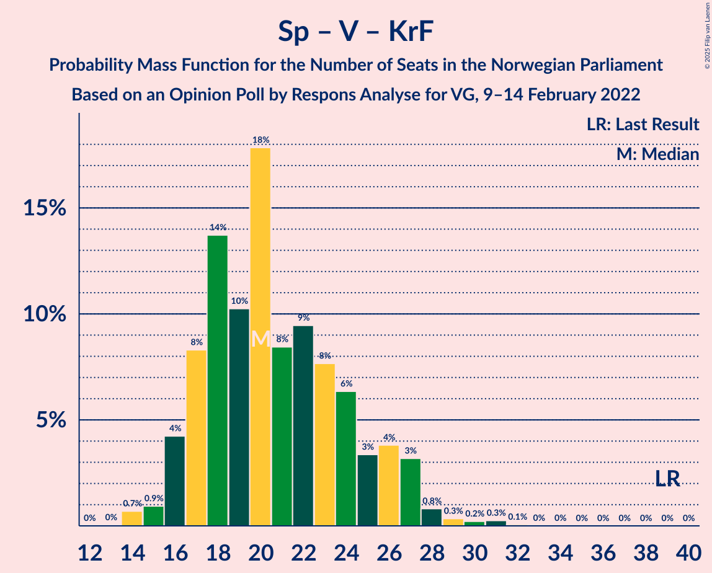

| Number of Seats | Probability | Accumulated | Special Marks |
|:---------------:|:-----------:|:-----------:|:-------------:|
| 14 | 0.7% | 100% |  |
| 15 | 0.9% | 99.3% |  |
| 16 | 4% | 98% |  |
| 17 | 8% | 94% |  |
| 18 | 14% | 86% |  |
| 19 | 10% | 72% | Median |
| 20 | 18% | 62% |  |
| 21 | 8% | 44% |  |
| 22 | 9% | 36% |  |
| 23 | 8% | 26% |  |
| 24 | 6% | 18% |  |
| 25 | 3% | 12% |  |
| 26 | 4% | 9% |  |
| 27 | 3% | 5% |  |
| 28 | 0.8% | 2% |  |
| 29 | 0.3% | 0.9% |  |
| 30 | 0.2% | 0.5% |  |
| 31 | 0.3% | 0.3% |  |
| 32 | 0.1% | 0.1% |  |
| 33 | 0% | 0% |  |
| 34 | 0% | 0% |  |
| 35 | 0% | 0% |  |
| 36 | 0% | 0% |  |
| 37 | 0% | 0% |  |
| 38 | 0% | 0% |  |
| 39 | 0% | 0% | Last Result |

## Technical Information

### Opinion Poll

+ **Polling firm:** Respons Analyse
+ **Commissioner(s):** VG
+ **Fieldwork period:** 9–14 February 2022

### Calculations

+ **Sample size:** 1000
+ **Simulations done:** 1,048,576
+ **Error estimate:** 1.55%

