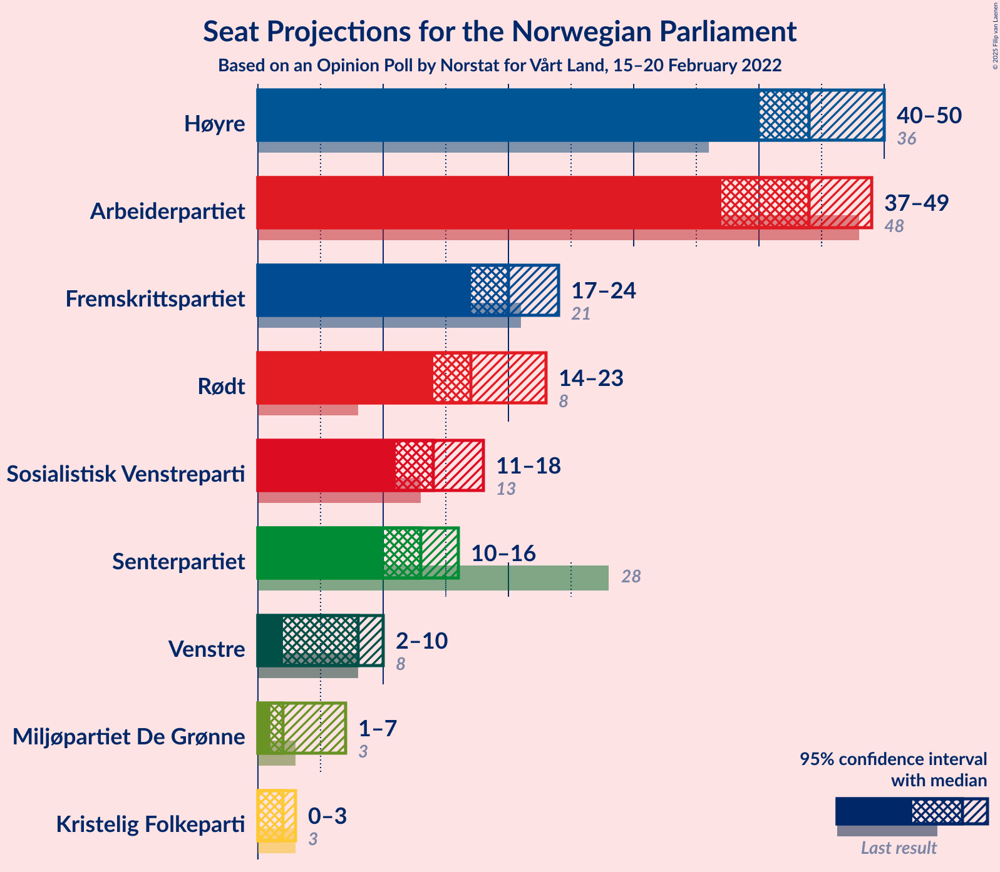
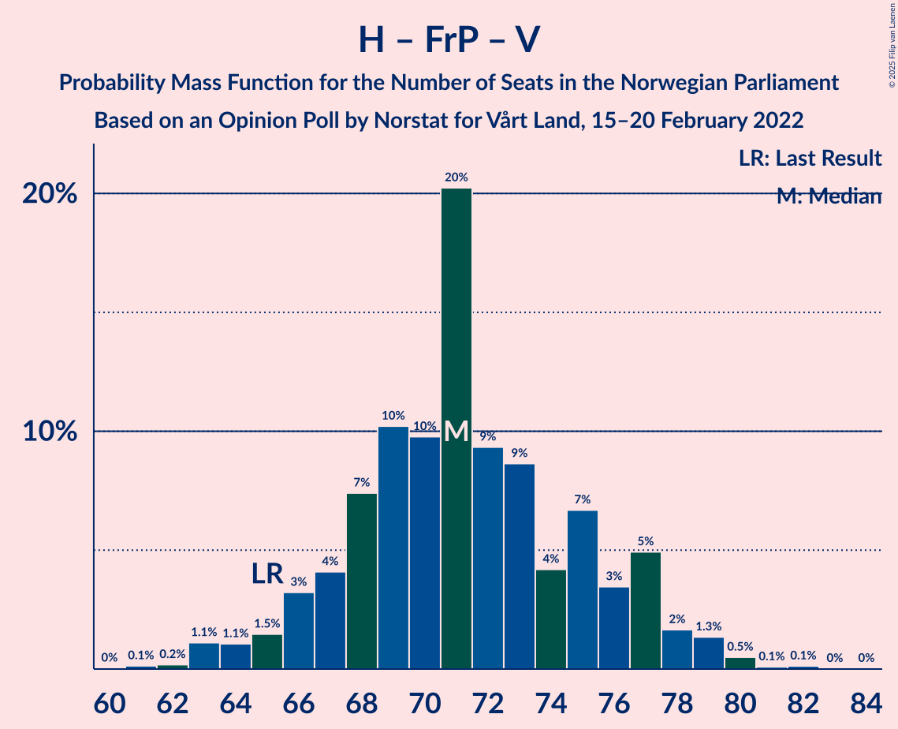

# Opinion Poll by Norstat for Vårt Land, 15–20 February 2022

<a href="#voting-intentions">Voting Intentions</a> | <a href="#seats">Seats</a> | <a href="#coalitions">Coalitions</a> | <a href="#technical-information">Technical Information</a>

## Voting Intentions

### Confidence Intervals

| Party | Last Result | Poll Result | 80% Confidence Interval | 90% Confidence Interval | 95% Confidence Interval | 99% Confidence Interval |
|:-----:|:-----------:|:-----------:|:-----------------------:|:-----------------------:|:-----------------------:|:-----------------------:|
| Høyre | 20.4% | 25.4% | 23.7–27.3% |23.2–27.8% |22.8–28.3% |21.9–29.2% |
| Arbeiderpartiet | 26.2% | 22.8% | 21.1–24.6% |20.6–25.1% |20.2–25.6% |19.4–26.5% |
| Fremskrittspartiet | 11.6% | 11.2% | 10.0–12.7% |9.7–13.1% |9.4–13.4% |8.8–14.1% |
| Rødt | 4.7% | 10.5% | 9.3–11.9% |9.0–12.3% |8.7–12.6% |8.2–13.3% |
| Sosialistisk Venstreparti | 7.6% | 8.3% | 7.3–9.6% |7.0–9.9% |6.7–10.2% |6.2–10.9% |
| Senterpartiet | 13.5% | 7.5% | 6.5–8.7% |6.2–9.0% |5.9–9.3% |5.5–9.9% |
| Venstre | 4.6% | 4.6% | 3.9–5.6% |3.6–5.9% |3.5–6.2% |3.1–6.7% |
| Miljøpartiet De Grønne | 3.9% | 3.0% | 2.4–3.9% |2.3–4.1% |2.1–4.3% |1.9–4.8% |
| Kristelig Folkeparti | 3.8% | 2.4% | 1.9–3.2% |1.7–3.4% |1.6–3.6% |1.4–4.0% |

*Note:* The poll result column reflects the actual value used in the calculations. Published results may vary slightly, and in addition be rounded to fewer digits.

## Seats

### Confidence Intervals

| Party | Last Result | Median | 80% Confidence Interval | 90% Confidence Interval | 95% Confidence Interval | 99% Confidence Interval |
|:-----:|:-----------:|:------:|:-----------------------:|:-----------------------:|:-----------------------:|:-----------------------:|
| <a href="#høyre">Høyre</a> | 36 | 44 | 41–48 |41–49 |40–50 |39–52 |
| <a href="#arbeiderpartiet">Arbeiderpartiet</a> | 48 | 44 | 39–47 |38–48 |37–49 |36–50 |
| <a href="#fremskrittspartiet">Fremskrittspartiet</a> | 21 | 20 | 17–22 |17–23 |17–24 |15–25 |
| <a href="#rødt">Rødt</a> | 8 | 17 | 15–20 |14–22 |14–23 |13–24 |
| <a href="#sosialistisk-venstreparti">Sosialistisk Venstreparti</a> | 13 | 14 | 12–16 |11–18 |11–18 |10–19 |
| <a href="#senterpartiet">Senterpartiet</a> | 28 | 13 | 11–15 |11–16 |10–16 |9–18 |
| <a href="#venstre">Venstre</a> | 8 | 8 | 3–9 |2–10 |2–10 |2–11 |
| <a href="#miljøpartiet-de-grønne">Miljøpartiet De Grønne</a> | 3 | 2 | 1–3 |1–7 |1–7 |1–8 |
| <a href="#kristelig-folkeparti">Kristelig Folkeparti</a> | 3 | 2 | 0–2 |0–2 |0–3 |0–3 |

### Høyre

*For a full overview of the results for this party, see the [Høyre](party-høyre.html) page.*

| Number of Seats | Probability | Accumulated | Special Marks |
|:---------------:|:-----------:|:-----------:|:-------------:|
| 36 | 0% | 100% | Last Result |
| 37 | 0.1% | 100% |  |
| 38 | 0.2% | 99.9% |  |
| 39 | 0.5% | 99.7% |  |
| 40 | 3% | 99.2% |  |
| 41 | 8% | 96% |  |
| 42 | 18% | 88% |  |
| 43 | 16% | 70% |  |
| 44 | 12% | 53% | Median |
| 45 | 12% | 41% |  |
| 46 | 7% | 29% |  |
| 47 | 7% | 22% |  |
| 48 | 7% | 15% |  |
| 49 | 3% | 7% |  |
| 50 | 2% | 5% |  |
| 51 | 0.8% | 2% |  |
| 52 | 1.2% | 2% |  |
| 53 | 0.2% | 0.4% |  |
| 54 | 0.1% | 0.1% |  |
| 55 | 0% | 0% |  |

### Arbeiderpartiet

*For a full overview of the results for this party, see the [Arbeiderpartiet](party-arbeiderpartiet.html) page.*

| Number of Seats | Probability | Accumulated | Special Marks |
|:---------------:|:-----------:|:-----------:|:-------------:|
| 34 | 0.1% | 100% |  |
| 35 | 0.2% | 99.9% |  |
| 36 | 0.7% | 99.7% |  |
| 37 | 2% | 99.0% |  |
| 38 | 6% | 97% |  |
| 39 | 5% | 91% |  |
| 40 | 6% | 86% |  |
| 41 | 8% | 80% |  |
| 42 | 7% | 71% |  |
| 43 | 6% | 65% |  |
| 44 | 16% | 59% | Median |
| 45 | 9% | 43% |  |
| 46 | 10% | 33% |  |
| 47 | 13% | 23% |  |
| 48 | 6% | 10% | Last Result |
| 49 | 2% | 3% |  |
| 50 | 0.6% | 0.7% |  |
| 51 | 0.1% | 0.2% |  |
| 52 | 0% | 0.1% |  |
| 53 | 0% | 0% |  |

### Fremskrittspartiet

*For a full overview of the results for this party, see the [Fremskrittspartiet](party-fremskrittspartiet.html) page.*

| Number of Seats | Probability | Accumulated | Special Marks |
|:---------------:|:-----------:|:-----------:|:-------------:|
| 13 | 0.1% | 100% |  |
| 14 | 0.2% | 99.9% |  |
| 15 | 0.7% | 99.7% |  |
| 16 | 1.2% | 99.0% |  |
| 17 | 9% | 98% |  |
| 18 | 14% | 89% |  |
| 19 | 17% | 75% |  |
| 20 | 24% | 58% | Median |
| 21 | 18% | 33% | Last Result |
| 22 | 9% | 15% |  |
| 23 | 3% | 6% |  |
| 24 | 1.1% | 3% |  |
| 25 | 1.2% | 1.4% |  |
| 26 | 0.2% | 0.3% |  |
| 27 | 0% | 0.1% |  |
| 28 | 0% | 0% |  |

### Rødt

*For a full overview of the results for this party, see the [Rødt](party-rødt.html) page.*

| Number of Seats | Probability | Accumulated | Special Marks |
|:---------------:|:-----------:|:-----------:|:-------------:|
| 8 | 0% | 100% | Last Result |
| 9 | 0% | 100% |  |
| 10 | 0% | 100% |  |
| 11 | 0% | 100% |  |
| 12 | 0.3% | 100% |  |
| 13 | 1.0% | 99.7% |  |
| 14 | 8% | 98.8% |  |
| 15 | 7% | 91% |  |
| 16 | 18% | 85% |  |
| 17 | 17% | 67% | Median |
| 18 | 15% | 50% |  |
| 19 | 14% | 35% |  |
| 20 | 11% | 21% |  |
| 21 | 4% | 10% |  |
| 22 | 3% | 6% |  |
| 23 | 2% | 3% |  |
| 24 | 1.2% | 1.3% |  |
| 25 | 0.1% | 0.1% |  |
| 26 | 0% | 0% |  |

### Sosialistisk Venstreparti

*For a full overview of the results for this party, see the [Sosialistisk Venstreparti](party-sosialistiskvenstreparti.html) page.*

| Number of Seats | Probability | Accumulated | Special Marks |
|:---------------:|:-----------:|:-----------:|:-------------:|
| 9 | 0.2% | 100% |  |
| 10 | 0.9% | 99.8% |  |
| 11 | 5% | 98.9% |  |
| 12 | 13% | 94% |  |
| 13 | 13% | 80% | Last Result |
| 14 | 25% | 67% | Median |
| 15 | 22% | 42% |  |
| 16 | 12% | 20% |  |
| 17 | 3% | 8% |  |
| 18 | 4% | 5% |  |
| 19 | 0.5% | 0.8% |  |
| 20 | 0.2% | 0.3% |  |
| 21 | 0% | 0.1% |  |
| 22 | 0% | 0% |  |

### Senterpartiet

*For a full overview of the results for this party, see the [Senterpartiet](party-senterpartiet.html) page.*

| Number of Seats | Probability | Accumulated | Special Marks |
|:---------------:|:-----------:|:-----------:|:-------------:|
| 8 | 0.2% | 100% |  |
| 9 | 1.3% | 99.8% |  |
| 10 | 3% | 98% |  |
| 11 | 8% | 96% |  |
| 12 | 31% | 88% |  |
| 13 | 15% | 57% | Median |
| 14 | 22% | 42% |  |
| 15 | 12% | 20% |  |
| 16 | 6% | 8% |  |
| 17 | 2% | 2% |  |
| 18 | 0.5% | 0.6% |  |
| 19 | 0.1% | 0.1% |  |
| 20 | 0% | 0% |  |
| 21 | 0% | 0% |  |
| 22 | 0% | 0% |  |
| 23 | 0% | 0% |  |
| 24 | 0% | 0% |  |
| 25 | 0% | 0% |  |
| 26 | 0% | 0% |  |
| 27 | 0% | 0% |  |
| 28 | 0% | 0% | Last Result |

### Venstre

*For a full overview of the results for this party, see the [Venstre](party-venstre.html) page.*

| Number of Seats | Probability | Accumulated | Special Marks |
|:---------------:|:-----------:|:-----------:|:-------------:|
| 2 | 8% | 100% |  |
| 3 | 9% | 92% |  |
| 4 | 0% | 83% |  |
| 5 | 0% | 83% |  |
| 6 | 0.6% | 83% |  |
| 7 | 19% | 82% |  |
| 8 | 36% | 63% | Last Result, Median |
| 9 | 17% | 27% |  |
| 10 | 8% | 10% |  |
| 11 | 2% | 2% |  |
| 12 | 0.4% | 0.5% |  |
| 13 | 0% | 0% |  |

### Miljøpartiet De Grønne

*For a full overview of the results for this party, see the [Miljøpartiet De Grønne](party-miljøpartietdegrønne.html) page.*

| Number of Seats | Probability | Accumulated | Special Marks |
|:---------------:|:-----------:|:-----------:|:-------------:|
| 0 | 0.2% | 100% |  |
| 1 | 45% | 99.8% |  |
| 2 | 43% | 55% | Median |
| 3 | 5% | 12% | Last Result |
| 4 | 0% | 7% |  |
| 5 | 0% | 7% |  |
| 6 | 2% | 7% |  |
| 7 | 4% | 5% |  |
| 8 | 1.5% | 2% |  |
| 9 | 0.1% | 0.1% |  |
| 10 | 0% | 0% |  |

### Kristelig Folkeparti

*For a full overview of the results for this party, see the [Kristelig Folkeparti](party-kristeligfolkeparti.html) page.*

| Number of Seats | Probability | Accumulated | Special Marks |
|:---------------:|:-----------:|:-----------:|:-------------:|
| 0 | 29% | 100% |  |
| 1 | 12% | 71% |  |
| 2 | 55% | 59% | Median |
| 3 | 3% | 4% | Last Result |
| 4 | 0% | 0.4% |  |
| 5 | 0% | 0.4% |  |
| 6 | 0.1% | 0.4% |  |
| 7 | 0.3% | 0.3% |  |
| 8 | 0.1% | 0.1% |  |
| 9 | 0% | 0% |  |

## Coalitions

### Confidence Intervals

| Coalition | Last Result | Median | Majority? | 80% Confidence Interval | 90% Confidence Interval | 95% Confidence Interval | 99% Confidence Interval |
|:---------:|:-----------:|:------:|:---------:|:-----------------------:|:-----------------------:|:-----------------------:|:-----------------------:|
| Arbeiderpartiet – Rødt – Sosialistisk Venstreparti – Senterpartiet – Miljøpartiet De Grønne | 100 | 90 | 96% | 87–95 | 85–96 | 83–97 | 81–100 |
| Arbeiderpartiet – Rødt – Sosialistisk Venstreparti – Senterpartiet | 97 | 88 | 89% | 84–93 | 83–94 | 82–95 | 79–98 |
| Høyre – Fremskrittspartiet – Senterpartiet – Venstre – Kristelig Folkeparti | 96 | 86 | 66% | 81–91 | 79–91 | 78–93 | 77–95 |
| Arbeiderpartiet – Rødt – Sosialistisk Venstreparti – Miljøpartiet De Grønne | 72 | 77 | 2% | 73–82 | 72–82 | 70–84 | 68–86 |
| Høyre – Fremskrittspartiet – Venstre – Miljøpartiet De Grønne – Kristelig Folkeparti | 71 | 74 | 0.3% | 70–79 | 69–80 | 67–81 | 66–83 |
| Arbeiderpartiet – Sosialistisk Venstreparti – Senterpartiet – Miljøpartiet De Grønne – Kristelig Folkeparti | 95 | 74 | 0.1% | 70–78 | 68–80 | 67–80 | 64–83 |
| Høyre – Fremskrittspartiet – Venstre – Kristelig Folkeparti | 68 | 73 | 0% | 68–77 | 67–78 | 66–80 | 64–82 |
| Arbeiderpartiet – Sosialistisk Venstreparti – Senterpartiet – Miljøpartiet De Grønne | 92 | 73 | 0% | 68–77 | 67–78 | 66–79 | 64–82 |
| Høyre – Fremskrittspartiet – Venstre | 65 | 71 | 0% | 67–76 | 66–77 | 64–78 | 63–80 |
| Arbeiderpartiet – Sosialistisk Venstreparti – Senterpartiet | 89 | 71 | 0% | 66–75 | 65–76 | 64–76 | 62–78 |
| Høyre – Fremskrittspartiet | 57 | 63 | 0% | 60–69 | 60–70 | 59–72 | 57–72 |
| Arbeiderpartiet – Senterpartiet – Miljøpartiet De Grønne – Kristelig Folkeparti | 82 | 60 | 0% | 55–64 | 54–65 | 53–66 | 50–69 |
| Arbeiderpartiet – Senterpartiet – Kristelig Folkeparti | 79 | 58 | 0% | 53–62 | 52–63 | 51–63 | 49–65 |
| Arbeiderpartiet – Sosialistisk Venstreparti | 61 | 58 | 0% | 53–62 | 52–62 | 51–62 | 49–64 |
| Arbeiderpartiet – Senterpartiet | 76 | 57 | 0% | 52–61 | 51–62 | 50–62 | 48–64 |
| Høyre – Venstre – Kristelig Folkeparti | 47 | 53 | 0% | 49–57 | 48–58 | 46–59 | 45–62 |
| Senterpartiet – Venstre – Kristelig Folkeparti | 39 | 22 | 0% | 18–25 | 16–26 | 15–26 | 14–29 |

### Arbeiderpartiet – Rødt – Sosialistisk Venstreparti – Senterpartiet – Miljøpartiet De Grønne

| Number of Seats | Probability | Accumulated | Special Marks |
|:---------------:|:-----------:|:-----------:|:-------------:|
| 80 | 0.3% | 100% |  |
| 81 | 0.2% | 99.6% |  |
| 82 | 0.5% | 99.5% |  |
| 83 | 2% | 99.0% |  |
| 84 | 1.5% | 97% |  |
| 85 | 3% | 96% | Majority |
| 86 | 2% | 93% |  |
| 87 | 11% | 91% |  |
| 88 | 9% | 80% |  |
| 89 | 13% | 71% |  |
| 90 | 12% | 58% | Median |
| 91 | 13% | 47% |  |
| 92 | 8% | 34% |  |
| 93 | 5% | 26% |  |
| 94 | 4% | 21% |  |
| 95 | 8% | 17% |  |
| 96 | 5% | 9% |  |
| 97 | 2% | 4% |  |
| 98 | 0.7% | 2% |  |
| 99 | 0.6% | 1.3% |  |
| 100 | 0.3% | 0.7% | Last Result |
| 101 | 0.3% | 0.4% |  |
| 102 | 0% | 0.1% |  |
| 103 | 0% | 0.1% |  |
| 104 | 0% | 0.1% |  |
| 105 | 0% | 0% |  |

### Arbeiderpartiet – Rødt – Sosialistisk Venstreparti – Senterpartiet

| Number of Seats | Probability | Accumulated | Special Marks |
|:---------------:|:-----------:|:-----------:|:-------------:|
| 77 | 0% | 100% |  |
| 78 | 0.1% | 99.9% |  |
| 79 | 0.5% | 99.9% |  |
| 80 | 0.4% | 99.3% |  |
| 81 | 1.1% | 98.9% |  |
| 82 | 2% | 98% |  |
| 83 | 3% | 96% |  |
| 84 | 3% | 92% |  |
| 85 | 4% | 89% | Majority |
| 86 | 14% | 85% |  |
| 87 | 10% | 71% |  |
| 88 | 13% | 60% | Median |
| 89 | 12% | 47% |  |
| 90 | 9% | 35% |  |
| 91 | 4% | 26% |  |
| 92 | 5% | 22% |  |
| 93 | 8% | 17% |  |
| 94 | 5% | 9% |  |
| 95 | 2% | 4% |  |
| 96 | 0.6% | 1.5% |  |
| 97 | 0.2% | 0.9% | Last Result |
| 98 | 0.3% | 0.7% |  |
| 99 | 0.2% | 0.4% |  |
| 100 | 0.2% | 0.2% |  |
| 101 | 0% | 0.1% |  |
| 102 | 0% | 0% |  |

### Høyre – Fremskrittspartiet – Senterpartiet – Venstre – Kristelig Folkeparti

| Number of Seats | Probability | Accumulated | Special Marks |
|:---------------:|:-----------:|:-----------:|:-------------:|
| 74 | 0% | 100% |  |
| 75 | 0.1% | 99.9% |  |
| 76 | 0.1% | 99.8% |  |
| 77 | 0.4% | 99.7% |  |
| 78 | 3% | 99.3% |  |
| 79 | 2% | 97% |  |
| 80 | 4% | 95% |  |
| 81 | 5% | 90% |  |
| 82 | 4% | 85% |  |
| 83 | 5% | 81% |  |
| 84 | 10% | 76% |  |
| 85 | 15% | 66% | Majority |
| 86 | 12% | 51% |  |
| 87 | 8% | 40% | Median |
| 88 | 8% | 31% |  |
| 89 | 6% | 23% |  |
| 90 | 5% | 17% |  |
| 91 | 8% | 12% |  |
| 92 | 1.0% | 4% |  |
| 93 | 2% | 3% |  |
| 94 | 0.9% | 2% |  |
| 95 | 0.3% | 0.8% |  |
| 96 | 0.2% | 0.5% | Last Result |
| 97 | 0.2% | 0.3% |  |
| 98 | 0% | 0.1% |  |
| 99 | 0% | 0% |  |

### Arbeiderpartiet – Rødt – Sosialistisk Venstreparti – Miljøpartiet De Grønne

| Number of Seats | Probability | Accumulated | Special Marks |
|:---------------:|:-----------:|:-----------:|:-------------:|
| 66 | 0.2% | 100% |  |
| 67 | 0.1% | 99.8% |  |
| 68 | 0.5% | 99.6% |  |
| 69 | 0.3% | 99.1% |  |
| 70 | 2% | 98.9% |  |
| 71 | 2% | 97% |  |
| 72 | 2% | 95% | Last Result |
| 73 | 3% | 93% |  |
| 74 | 3% | 90% |  |
| 75 | 16% | 87% |  |
| 76 | 13% | 71% |  |
| 77 | 13% | 58% | Median |
| 78 | 7% | 45% |  |
| 79 | 10% | 37% |  |
| 80 | 9% | 28% |  |
| 81 | 8% | 18% |  |
| 82 | 5% | 10% |  |
| 83 | 2% | 5% |  |
| 84 | 2% | 3% |  |
| 85 | 0.6% | 2% | Majority |
| 86 | 0.5% | 1.0% |  |
| 87 | 0.2% | 0.5% |  |
| 88 | 0.1% | 0.2% |  |
| 89 | 0.1% | 0.1% |  |
| 90 | 0% | 0.1% |  |
| 91 | 0% | 0% |  |

### Høyre – Fremskrittspartiet – Venstre – Miljøpartiet De Grønne – Kristelig Folkeparti

| Number of Seats | Probability | Accumulated | Special Marks |
|:---------------:|:-----------:|:-----------:|:-------------:|
| 63 | 0.1% | 100% |  |
| 64 | 0.1% | 99.9% |  |
| 65 | 0.2% | 99.9% |  |
| 66 | 0.2% | 99.7% |  |
| 67 | 2% | 99.4% |  |
| 68 | 1.1% | 97% |  |
| 69 | 3% | 96% |  |
| 70 | 5% | 93% |  |
| 71 | 6% | 88% | Last Result |
| 72 | 5% | 82% |  |
| 73 | 15% | 78% |  |
| 74 | 17% | 63% |  |
| 75 | 11% | 46% |  |
| 76 | 7% | 34% | Median |
| 77 | 4% | 28% |  |
| 78 | 8% | 24% |  |
| 79 | 8% | 16% |  |
| 80 | 4% | 8% |  |
| 81 | 2% | 4% |  |
| 82 | 1.2% | 2% |  |
| 83 | 0.7% | 1.2% |  |
| 84 | 0.2% | 0.5% |  |
| 85 | 0.2% | 0.3% | Majority |
| 86 | 0.1% | 0.1% |  |
| 87 | 0% | 0% |  |

### Arbeiderpartiet – Sosialistisk Venstreparti – Senterpartiet – Miljøpartiet De Grønne – Kristelig Folkeparti

| Number of Seats | Probability | Accumulated | Special Marks |
|:---------------:|:-----------:|:-----------:|:-------------:|
| 63 | 0.1% | 100% |  |
| 64 | 0.5% | 99.9% |  |
| 65 | 0.5% | 99.4% |  |
| 66 | 1.3% | 98.9% |  |
| 67 | 0.9% | 98% |  |
| 68 | 2% | 97% |  |
| 69 | 4% | 95% |  |
| 70 | 6% | 91% |  |
| 71 | 6% | 85% |  |
| 72 | 7% | 80% |  |
| 73 | 15% | 72% |  |
| 74 | 11% | 58% |  |
| 75 | 10% | 47% | Median |
| 76 | 9% | 37% |  |
| 77 | 15% | 28% |  |
| 78 | 5% | 13% |  |
| 79 | 2% | 8% |  |
| 80 | 4% | 6% |  |
| 81 | 0.6% | 2% |  |
| 82 | 0.8% | 1.4% |  |
| 83 | 0.4% | 0.6% |  |
| 84 | 0.1% | 0.2% |  |
| 85 | 0% | 0.1% | Majority |
| 86 | 0% | 0.1% |  |
| 87 | 0% | 0% |  |
| 88 | 0% | 0% |  |
| 89 | 0% | 0% |  |
| 90 | 0% | 0% |  |
| 91 | 0% | 0% |  |
| 92 | 0% | 0% |  |
| 93 | 0% | 0% |  |
| 94 | 0% | 0% |  |
| 95 | 0% | 0% | Last Result |

### Høyre – Fremskrittspartiet – Venstre – Kristelig Folkeparti

| Number of Seats | Probability | Accumulated | Special Marks |
|:---------------:|:-----------:|:-----------:|:-------------:|
| 62 | 0.1% | 100% |  |
| 63 | 0.2% | 99.9% |  |
| 64 | 0.2% | 99.7% |  |
| 65 | 1.2% | 99.4% |  |
| 66 | 2% | 98% |  |
| 67 | 2% | 96% |  |
| 68 | 5% | 94% | Last Result |
| 69 | 5% | 89% |  |
| 70 | 7% | 84% |  |
| 71 | 13% | 77% |  |
| 72 | 13% | 64% |  |
| 73 | 19% | 51% |  |
| 74 | 5% | 32% | Median |
| 75 | 6% | 27% |  |
| 76 | 4% | 21% |  |
| 77 | 9% | 17% |  |
| 78 | 3% | 7% |  |
| 79 | 1.4% | 4% |  |
| 80 | 1.2% | 3% |  |
| 81 | 0.8% | 1.5% |  |
| 82 | 0.5% | 0.6% |  |
| 83 | 0.1% | 0.2% |  |
| 84 | 0.1% | 0.1% |  |
| 85 | 0% | 0% | Majority |

### Arbeiderpartiet – Sosialistisk Venstreparti – Senterpartiet – Miljøpartiet De Grønne

| Number of Seats | Probability | Accumulated | Special Marks |
|:---------------:|:-----------:|:-----------:|:-------------:|
| 62 | 0.2% | 100% |  |
| 63 | 0.2% | 99.8% |  |
| 64 | 0.7% | 99.6% |  |
| 65 | 0.8% | 98.8% |  |
| 66 | 2% | 98% |  |
| 67 | 2% | 96% |  |
| 68 | 6% | 94% |  |
| 69 | 4% | 87% |  |
| 70 | 7% | 84% |  |
| 71 | 13% | 77% |  |
| 72 | 7% | 63% |  |
| 73 | 12% | 57% | Median |
| 74 | 9% | 44% |  |
| 75 | 14% | 35% |  |
| 76 | 7% | 21% |  |
| 77 | 6% | 14% |  |
| 78 | 5% | 7% |  |
| 79 | 0.8% | 3% |  |
| 80 | 1.2% | 2% |  |
| 81 | 0.2% | 0.8% |  |
| 82 | 0.2% | 0.5% |  |
| 83 | 0.3% | 0.4% |  |
| 84 | 0% | 0.1% |  |
| 85 | 0% | 0% | Majority |
| 86 | 0% | 0% |  |
| 87 | 0% | 0% |  |
| 88 | 0% | 0% |  |
| 89 | 0% | 0% |  |
| 90 | 0% | 0% |  |
| 91 | 0% | 0% |  |
| 92 | 0% | 0% | Last Result |

### Høyre – Fremskrittspartiet – Venstre

| Number of Seats | Probability | Accumulated | Special Marks |
|:---------------:|:-----------:|:-----------:|:-------------:|
| 60 | 0% | 100% |  |
| 61 | 0.1% | 99.9% |  |
| 62 | 0.2% | 99.8% |  |
| 63 | 1.1% | 99.6% |  |
| 64 | 1.1% | 98.5% |  |
| 65 | 1.5% | 97% | Last Result |
| 66 | 3% | 96% |  |
| 67 | 4% | 93% |  |
| 68 | 7% | 89% |  |
| 69 | 10% | 81% |  |
| 70 | 10% | 71% |  |
| 71 | 20% | 61% |  |
| 72 | 9% | 41% | Median |
| 73 | 9% | 32% |  |
| 74 | 4% | 23% |  |
| 75 | 7% | 19% |  |
| 76 | 3% | 12% |  |
| 77 | 5% | 9% |  |
| 78 | 2% | 4% |  |
| 79 | 1.3% | 2% |  |
| 80 | 0.5% | 0.8% |  |
| 81 | 0.1% | 0.3% |  |
| 82 | 0.1% | 0.2% |  |
| 83 | 0% | 0.1% |  |
| 84 | 0% | 0% |  |

### Arbeiderpartiet – Sosialistisk Venstreparti – Senterpartiet

| Number of Seats | Probability | Accumulated | Special Marks |
|:---------------:|:-----------:|:-----------:|:-------------:|
| 60 | 0.1% | 100% |  |
| 61 | 0.3% | 99.9% |  |
| 62 | 0.4% | 99.6% |  |
| 63 | 0.9% | 99.3% |  |
| 64 | 2% | 98% |  |
| 65 | 2% | 97% |  |
| 66 | 5% | 94% |  |
| 67 | 6% | 89% |  |
| 68 | 7% | 83% |  |
| 69 | 6% | 75% |  |
| 70 | 15% | 69% |  |
| 71 | 7% | 54% | Median |
| 72 | 11% | 47% |  |
| 73 | 12% | 36% |  |
| 74 | 10% | 24% |  |
| 75 | 7% | 14% |  |
| 76 | 5% | 7% |  |
| 77 | 0.9% | 2% |  |
| 78 | 0.4% | 0.8% |  |
| 79 | 0.3% | 0.4% |  |
| 80 | 0.1% | 0.1% |  |
| 81 | 0% | 0.1% |  |
| 82 | 0% | 0% |  |
| 83 | 0% | 0% |  |
| 84 | 0% | 0% |  |
| 85 | 0% | 0% | Majority |
| 86 | 0% | 0% |  |
| 87 | 0% | 0% |  |
| 88 | 0% | 0% |  |
| 89 | 0% | 0% | Last Result |

### Høyre – Fremskrittspartiet

| Number of Seats | Probability | Accumulated | Special Marks |
|:---------------:|:-----------:|:-----------:|:-------------:|
| 55 | 0.1% | 100% |  |
| 56 | 0.1% | 99.9% |  |
| 57 | 0.3% | 99.8% | Last Result |
| 58 | 1.0% | 99.4% |  |
| 59 | 3% | 98% |  |
| 60 | 7% | 95% |  |
| 61 | 10% | 88% |  |
| 62 | 10% | 78% |  |
| 63 | 19% | 68% |  |
| 64 | 11% | 49% | Median |
| 65 | 11% | 38% |  |
| 66 | 5% | 27% |  |
| 67 | 7% | 22% |  |
| 68 | 3% | 15% |  |
| 69 | 6% | 12% |  |
| 70 | 1.4% | 6% |  |
| 71 | 2% | 4% |  |
| 72 | 2% | 3% |  |
| 73 | 0.2% | 0.5% |  |
| 74 | 0.1% | 0.3% |  |
| 75 | 0.2% | 0.2% |  |
| 76 | 0% | 0% |  |

### Arbeiderpartiet – Senterpartiet – Miljøpartiet De Grønne – Kristelig Folkeparti

| Number of Seats | Probability | Accumulated | Special Marks |
|:---------------:|:-----------:|:-----------:|:-------------:|
| 49 | 0.2% | 100% |  |
| 50 | 0.4% | 99.8% |  |
| 51 | 0.4% | 99.4% |  |
| 52 | 1.3% | 99.0% |  |
| 53 | 2% | 98% |  |
| 54 | 4% | 95% |  |
| 55 | 4% | 92% |  |
| 56 | 4% | 88% |  |
| 57 | 4% | 83% |  |
| 58 | 10% | 79% |  |
| 59 | 13% | 70% |  |
| 60 | 12% | 57% |  |
| 61 | 10% | 45% | Median |
| 62 | 10% | 35% |  |
| 63 | 9% | 25% |  |
| 64 | 7% | 16% |  |
| 65 | 5% | 9% |  |
| 66 | 2% | 4% |  |
| 67 | 0.6% | 2% |  |
| 68 | 0.8% | 1.5% |  |
| 69 | 0.4% | 0.7% |  |
| 70 | 0.2% | 0.3% |  |
| 71 | 0.1% | 0.1% |  |
| 72 | 0% | 0% |  |
| 73 | 0% | 0% |  |
| 74 | 0% | 0% |  |
| 75 | 0% | 0% |  |
| 76 | 0% | 0% |  |
| 77 | 0% | 0% |  |
| 78 | 0% | 0% |  |
| 79 | 0% | 0% |  |
| 80 | 0% | 0% |  |
| 81 | 0% | 0% |  |
| 82 | 0% | 0% | Last Result |

### Arbeiderpartiet – Senterpartiet – Kristelig Folkeparti

| Number of Seats | Probability | Accumulated | Special Marks |
|:---------------:|:-----------:|:-----------:|:-------------:|
| 47 | 0.1% | 100% |  |
| 48 | 0.2% | 99.9% |  |
| 49 | 0.5% | 99.7% |  |
| 50 | 0.5% | 99.2% |  |
| 51 | 3% | 98.7% |  |
| 52 | 3% | 96% |  |
| 53 | 4% | 92% |  |
| 54 | 5% | 88% |  |
| 55 | 3% | 83% |  |
| 56 | 9% | 80% |  |
| 57 | 10% | 71% |  |
| 58 | 13% | 60% |  |
| 59 | 12% | 47% | Median |
| 60 | 9% | 35% |  |
| 61 | 12% | 26% |  |
| 62 | 5% | 15% |  |
| 63 | 8% | 10% |  |
| 64 | 1.2% | 2% |  |
| 65 | 0.6% | 0.8% |  |
| 66 | 0.1% | 0.3% |  |
| 67 | 0.1% | 0.2% |  |
| 68 | 0% | 0.1% |  |
| 69 | 0% | 0% |  |
| 70 | 0% | 0% |  |
| 71 | 0% | 0% |  |
| 72 | 0% | 0% |  |
| 73 | 0% | 0% |  |
| 74 | 0% | 0% |  |
| 75 | 0% | 0% |  |
| 76 | 0% | 0% |  |
| 77 | 0% | 0% |  |
| 78 | 0% | 0% |  |
| 79 | 0% | 0% | Last Result |

### Arbeiderpartiet – Sosialistisk Venstreparti

| Number of Seats | Probability | Accumulated | Special Marks |
|:---------------:|:-----------:|:-----------:|:-------------:|
| 47 | 0.1% | 100% |  |
| 48 | 0.1% | 99.9% |  |
| 49 | 0.4% | 99.8% |  |
| 50 | 2% | 99.4% |  |
| 51 | 2% | 98% |  |
| 52 | 2% | 96% |  |
| 53 | 5% | 94% |  |
| 54 | 6% | 88% |  |
| 55 | 7% | 83% |  |
| 56 | 11% | 76% |  |
| 57 | 4% | 65% |  |
| 58 | 14% | 61% | Median |
| 59 | 12% | 47% |  |
| 60 | 15% | 35% |  |
| 61 | 9% | 20% | Last Result |
| 62 | 8% | 10% |  |
| 63 | 1.4% | 2% |  |
| 64 | 0.5% | 1.0% |  |
| 65 | 0.3% | 0.5% |  |
| 66 | 0.1% | 0.2% |  |
| 67 | 0.1% | 0.1% |  |
| 68 | 0% | 0% |  |

### Arbeiderpartiet – Senterpartiet

| Number of Seats | Probability | Accumulated | Special Marks |
|:---------------:|:-----------:|:-----------:|:-------------:|
| 46 | 0.1% | 100% |  |
| 47 | 0.2% | 99.9% |  |
| 48 | 0.3% | 99.7% |  |
| 49 | 1.0% | 99.4% |  |
| 50 | 2% | 98% |  |
| 51 | 5% | 96% |  |
| 52 | 4% | 91% |  |
| 53 | 3% | 87% |  |
| 54 | 9% | 84% |  |
| 55 | 8% | 75% |  |
| 56 | 16% | 67% |  |
| 57 | 8% | 51% | Median |
| 58 | 5% | 42% |  |
| 59 | 16% | 37% |  |
| 60 | 8% | 21% |  |
| 61 | 7% | 13% |  |
| 62 | 5% | 6% |  |
| 63 | 1.0% | 1.5% |  |
| 64 | 0.4% | 0.5% |  |
| 65 | 0.1% | 0.2% |  |
| 66 | 0.1% | 0.1% |  |
| 67 | 0% | 0% |  |
| 68 | 0% | 0% |  |
| 69 | 0% | 0% |  |
| 70 | 0% | 0% |  |
| 71 | 0% | 0% |  |
| 72 | 0% | 0% |  |
| 73 | 0% | 0% |  |
| 74 | 0% | 0% |  |
| 75 | 0% | 0% |  |
| 76 | 0% | 0% | Last Result |

### Høyre – Venstre – Kristelig Folkeparti

| Number of Seats | Probability | Accumulated | Special Marks |
|:---------------:|:-----------:|:-----------:|:-------------:|
| 42 | 0% | 100% |  |
| 43 | 0.1% | 99.9% |  |
| 44 | 0.1% | 99.8% |  |
| 45 | 1.0% | 99.7% |  |
| 46 | 2% | 98.8% |  |
| 47 | 1.3% | 97% | Last Result |
| 48 | 4% | 96% |  |
| 49 | 5% | 92% |  |
| 50 | 7% | 87% |  |
| 51 | 10% | 80% |  |
| 52 | 16% | 70% |  |
| 53 | 15% | 54% |  |
| 54 | 12% | 39% | Median |
| 55 | 9% | 27% |  |
| 56 | 4% | 18% |  |
| 57 | 7% | 14% |  |
| 58 | 4% | 8% |  |
| 59 | 0.8% | 3% |  |
| 60 | 1.4% | 2% |  |
| 61 | 0.4% | 1.0% |  |
| 62 | 0.2% | 0.6% |  |
| 63 | 0.3% | 0.4% |  |
| 64 | 0.1% | 0.1% |  |
| 65 | 0% | 0% |  |

### Senterpartiet – Venstre – Kristelig Folkeparti

| Number of Seats | Probability | Accumulated | Special Marks |
|:---------------:|:-----------:|:-----------:|:-------------:|
| 13 | 0.1% | 100% |  |
| 14 | 2% | 99.9% |  |
| 15 | 2% | 98% |  |
| 16 | 3% | 96% |  |
| 17 | 2% | 93% |  |
| 18 | 4% | 91% |  |
| 19 | 8% | 86% |  |
| 20 | 4% | 79% |  |
| 21 | 13% | 74% |  |
| 22 | 18% | 61% |  |
| 23 | 17% | 44% | Median |
| 24 | 15% | 26% |  |
| 25 | 4% | 11% |  |
| 26 | 5% | 7% |  |
| 27 | 1.1% | 2% |  |
| 28 | 0.5% | 1.3% |  |
| 29 | 0.6% | 0.7% |  |
| 30 | 0.1% | 0.2% |  |
| 31 | 0% | 0% |  |
| 32 | 0% | 0% |  |
| 33 | 0% | 0% |  |
| 34 | 0% | 0% |  |
| 35 | 0% | 0% |  |
| 36 | 0% | 0% |  |
| 37 | 0% | 0% |  |
| 38 | 0% | 0% |  |
| 39 | 0% | 0% | Last Result |

## Technical Information

### Opinion Poll

+ **Polling firm:** Norstat
+ **Commissioner(s):** Vårt Land
+ **Fieldwork period:** 15–20 February 2022

### Calculations

+ **Sample size:** 952
+ **Simulations done:** 1,048,576
+ **Error estimate:** 1.34%

