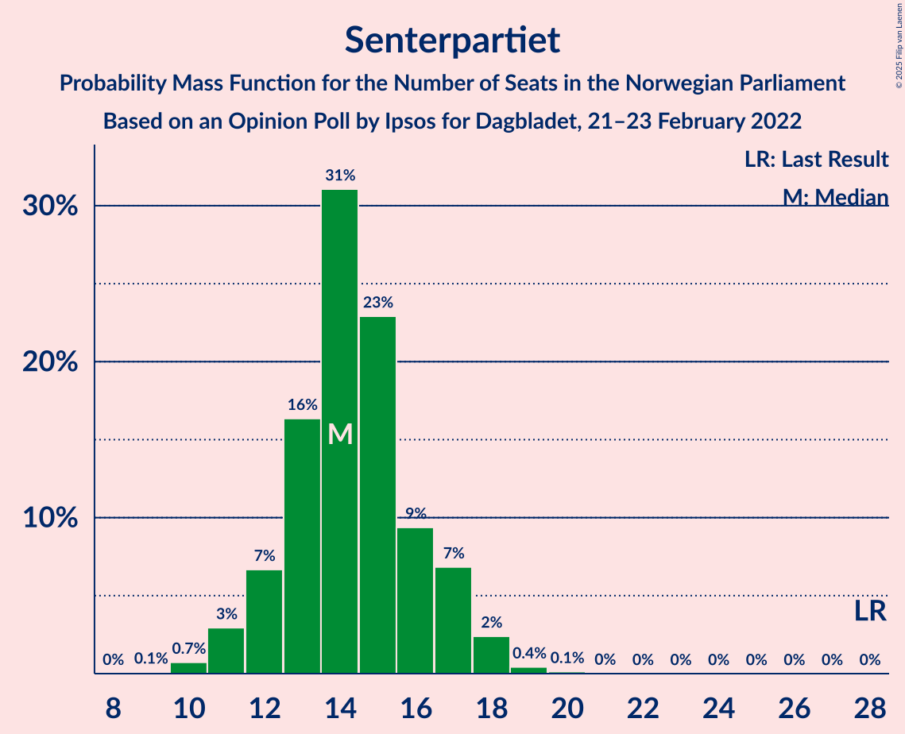
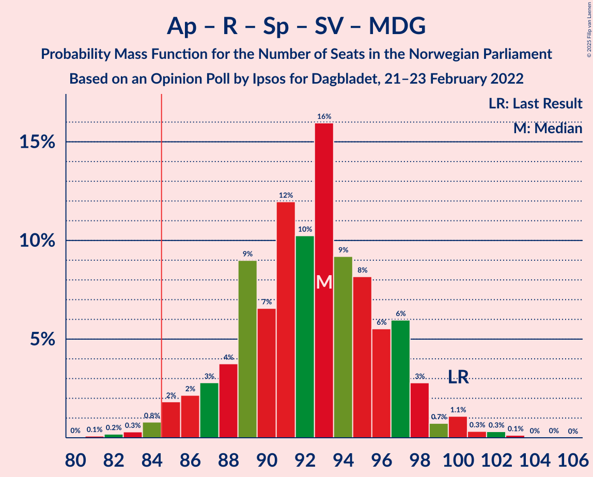

# Opinion Poll by Ipsos for Dagbladet, 21–23 February 2022

<a href="#voting-intentions">Voting Intentions</a> | <a href="#seats">Seats</a> | <a href="#coalitions">Coalitions</a> | <a href="#technical-information">Technical Information</a>

## Voting Intentions

### Confidence Intervals

| Party | Last Result | Poll Result | 80% Confidence Interval | 90% Confidence Interval | 95% Confidence Interval | 99% Confidence Interval |
|:-----:|:-----------:|:-----------:|:-----------------------:|:-----------------------:|:-----------------------:|:-----------------------:|
| Høyre | 20.4% | 26.8% | 24.8–29.0% |24.2–29.6% |23.7–30.1% |22.7–31.2% |
| Arbeiderpartiet | 26.2% | 25.4% | 23.4–27.6% |22.9–28.2% |22.4–28.7% |21.5–29.8% |
| Fremskrittspartiet | 11.6% | 10.5% | 9.2–12.1% |8.8–12.6% |8.5–13.0% |7.9–13.8% |
| Sosialistisk Venstreparti | 7.6% | 8.1% | 6.9–9.5% |6.6–9.9% |6.3–10.3% |5.8–11.0% |
| Rødt | 4.7% | 8.1% | 6.9–9.5% |6.6–9.9% |6.3–10.3% |5.8–11.0% |
| Senterpartiet | 13.5% | 8.1% | 6.9–9.5% |6.6–9.9% |6.3–10.3% |5.8–11.0% |
| Venstre | 4.6% | 4.6% | 3.8–5.8% |3.5–6.1% |3.3–6.4% |3.0–7.0% |
| Kristelig Folkeparti | 3.8% | 2.7% | 2.1–3.7% |1.9–3.9% |1.8–4.2% |1.5–4.7% |
| Miljøpartiet De Grønne | 3.9% | 2.7% | 2.1–3.7% |1.9–3.9% |1.8–4.2% |1.5–4.7% |

*Note:* The poll result column reflects the actual value used in the calculations. Published results may vary slightly, and in addition be rounded to fewer digits.

## Seats

### Confidence Intervals

| Party | Last Result | Median | 80% Confidence Interval | 90% Confidence Interval | 95% Confidence Interval | 99% Confidence Interval |
|:-----:|:-----------:|:------:|:-----------------------:|:-----------------------:|:-----------------------:|:-----------------------:|
| <a href="#høyre">Høyre</a> | 36 | 47 | 43–51 |43–52 |42–53 |40–56 |
| <a href="#arbeiderpartiet">Arbeiderpartiet</a> | 48 | 48 | 45–50 |43–52 |42–53 |39–56 |
| <a href="#fremskrittspartiet">Fremskrittspartiet</a> | 21 | 19 | 17–21 |16–22 |15–23 |13–24 |
| <a href="#sosialistisk-venstreparti">Sosialistisk Venstreparti</a> | 13 | 15 | 12–16 |11–17 |11–18 |10–19 |
| <a href="#rødt">Rødt</a> | 8 | 14 | 13–16 |13–16 |12–17 |11–17 |
| <a href="#senterpartiet">Senterpartiet</a> | 28 | 14 | 12–16 |12–17 |11–18 |10–19 |
| <a href="#venstre">Venstre</a> | 8 | 8 | 3–10 |2–11 |2–11 |2–12 |
| <a href="#kristelig-folkeparti">Kristelig Folkeparti</a> | 3 | 1 | 1–3 |0–3 |0–3 |0–8 |
| <a href="#miljøpartiet-de-grønne">Miljøpartiet De Grønne</a> | 3 | 1 | 1–2 |1–3 |1–7 |0–8 |

### Høyre

*For a full overview of the results for this party, see the [Høyre](party-høyre.html) page.*

| Number of Seats | Probability | Accumulated | Special Marks |
|:---------------:|:-----------:|:-----------:|:-------------:|
| 36 | 0% | 100% | Last Result |
| 37 | 0% | 100% |  |
| 38 | 0% | 100% |  |
| 39 | 0.2% | 100% |  |
| 40 | 0.5% | 99.8% |  |
| 41 | 1.3% | 99.3% |  |
| 42 | 2% | 98% |  |
| 43 | 8% | 96% |  |
| 44 | 6% | 88% |  |
| 45 | 9% | 82% |  |
| 46 | 11% | 73% |  |
| 47 | 25% | 62% | Median |
| 48 | 9% | 37% |  |
| 49 | 9% | 28% |  |
| 50 | 7% | 19% |  |
| 51 | 6% | 12% |  |
| 52 | 3% | 6% |  |
| 53 | 1.3% | 4% |  |
| 54 | 1.4% | 2% |  |
| 55 | 0.6% | 1.1% |  |
| 56 | 0.5% | 0.6% |  |
| 57 | 0% | 0.1% |  |
| 58 | 0.1% | 0.1% |  |
| 59 | 0% | 0% |  |

### Arbeiderpartiet

*For a full overview of the results for this party, see the [Arbeiderpartiet](party-arbeiderpartiet.html) page.*

| Number of Seats | Probability | Accumulated | Special Marks |
|:---------------:|:-----------:|:-----------:|:-------------:|
| 37 | 0.1% | 100% |  |
| 38 | 0.1% | 99.9% |  |
| 39 | 0.5% | 99.8% |  |
| 40 | 0.8% | 99.3% |  |
| 41 | 0.9% | 98% |  |
| 42 | 1.3% | 98% |  |
| 43 | 2% | 96% |  |
| 44 | 2% | 94% |  |
| 45 | 7% | 92% |  |
| 46 | 13% | 85% |  |
| 47 | 13% | 72% |  |
| 48 | 18% | 59% | Last Result, Median |
| 49 | 15% | 41% |  |
| 50 | 16% | 25% |  |
| 51 | 4% | 10% |  |
| 52 | 2% | 6% |  |
| 53 | 2% | 3% |  |
| 54 | 0.8% | 2% |  |
| 55 | 0.3% | 0.8% |  |
| 56 | 0.3% | 0.6% |  |
| 57 | 0.1% | 0.3% |  |
| 58 | 0.1% | 0.2% |  |
| 59 | 0% | 0% |  |

### Fremskrittspartiet

*For a full overview of the results for this party, see the [Fremskrittspartiet](party-fremskrittspartiet.html) page.*

| Number of Seats | Probability | Accumulated | Special Marks |
|:---------------:|:-----------:|:-----------:|:-------------:|
| 12 | 0.1% | 100% |  |
| 13 | 0.4% | 99.8% |  |
| 14 | 0.9% | 99.5% |  |
| 15 | 3% | 98.6% |  |
| 16 | 5% | 95% |  |
| 17 | 16% | 90% |  |
| 18 | 18% | 74% |  |
| 19 | 25% | 56% | Median |
| 20 | 14% | 31% |  |
| 21 | 10% | 17% | Last Result |
| 22 | 5% | 8% |  |
| 23 | 2% | 3% |  |
| 24 | 1.0% | 1.3% |  |
| 25 | 0.1% | 0.3% |  |
| 26 | 0.1% | 0.1% |  |
| 27 | 0% | 0% |  |

### Sosialistisk Venstreparti

*For a full overview of the results for this party, see the [Sosialistisk Venstreparti](party-sosialistiskvenstreparti.html) page.*

| Number of Seats | Probability | Accumulated | Special Marks |
|:---------------:|:-----------:|:-----------:|:-------------:|
| 9 | 0.1% | 100% |  |
| 10 | 1.1% | 99.9% |  |
| 11 | 4% | 98.7% |  |
| 12 | 11% | 94% |  |
| 13 | 15% | 83% | Last Result |
| 14 | 17% | 69% |  |
| 15 | 30% | 52% | Median |
| 16 | 14% | 22% |  |
| 17 | 5% | 8% |  |
| 18 | 2% | 3% |  |
| 19 | 0.7% | 0.9% |  |
| 20 | 0.1% | 0.1% |  |
| 21 | 0% | 0% |  |

### Rødt

*For a full overview of the results for this party, see the [Rødt](party-rødt.html) page.*

| Number of Seats | Probability | Accumulated | Special Marks |
|:---------------:|:-----------:|:-----------:|:-------------:|
| 8 | 0% | 100% | Last Result |
| 9 | 0% | 100% |  |
| 10 | 0.1% | 100% |  |
| 11 | 1.3% | 99.9% |  |
| 12 | 3% | 98.6% |  |
| 13 | 21% | 96% |  |
| 14 | 35% | 75% | Median |
| 15 | 30% | 40% |  |
| 16 | 8% | 10% |  |
| 17 | 2% | 3% |  |
| 18 | 0.2% | 0.3% |  |
| 19 | 0% | 0.1% |  |
| 20 | 0% | 0.1% |  |
| 21 | 0% | 0.1% |  |
| 22 | 0% | 0% |  |

### Senterpartiet

*For a full overview of the results for this party, see the [Senterpartiet](party-senterpartiet.html) page.*

| Number of Seats | Probability | Accumulated | Special Marks |
|:---------------:|:-----------:|:-----------:|:-------------:|
| 9 | 0.1% | 100% |  |
| 10 | 0.7% | 99.9% |  |
| 11 | 3% | 99.2% |  |
| 12 | 7% | 96% |  |
| 13 | 16% | 90% |  |
| 14 | 31% | 73% | Median |
| 15 | 23% | 42% |  |
| 16 | 9% | 19% |  |
| 17 | 7% | 10% |  |
| 18 | 2% | 3% |  |
| 19 | 0.4% | 0.6% |  |
| 20 | 0.1% | 0.2% |  |
| 21 | 0% | 0% |  |
| 22 | 0% | 0% |  |
| 23 | 0% | 0% |  |
| 24 | 0% | 0% |  |
| 25 | 0% | 0% |  |
| 26 | 0% | 0% |  |
| 27 | 0% | 0% |  |
| 28 | 0% | 0% | Last Result |

### Venstre

*For a full overview of the results for this party, see the [Venstre](party-venstre.html) page.*

| Number of Seats | Probability | Accumulated | Special Marks |
|:---------------:|:-----------:|:-----------:|:-------------:|
| 2 | 9% | 100% |  |
| 3 | 7% | 91% |  |
| 4 | 0% | 85% |  |
| 5 | 0% | 85% |  |
| 6 | 0.4% | 85% |  |
| 7 | 10% | 84% |  |
| 8 | 36% | 74% | Last Result, Median |
| 9 | 18% | 38% |  |
| 10 | 15% | 20% |  |
| 11 | 4% | 5% |  |
| 12 | 1.2% | 1.5% |  |
| 13 | 0.2% | 0.3% |  |
| 14 | 0% | 0% |  |

### Kristelig Folkeparti

*For a full overview of the results for this party, see the [Kristelig Folkeparti](party-kristeligfolkeparti.html) page.*

| Number of Seats | Probability | Accumulated | Special Marks |
|:---------------:|:-----------:|:-----------:|:-------------:|
| 0 | 10% | 100% |  |
| 1 | 42% | 90% | Median |
| 2 | 22% | 48% |  |
| 3 | 25% | 26% | Last Result |
| 4 | 0% | 1.2% |  |
| 5 | 0% | 1.2% |  |
| 6 | 0% | 1.2% |  |
| 7 | 0.1% | 1.1% |  |
| 8 | 0.9% | 1.0% |  |
| 9 | 0.1% | 0.1% |  |
| 10 | 0% | 0% |  |

### Miljøpartiet De Grønne

*For a full overview of the results for this party, see the [Miljøpartiet De Grønne](party-miljøpartietdegrønne.html) page.*

| Number of Seats | Probability | Accumulated | Special Marks |
|:---------------:|:-----------:|:-----------:|:-------------:|
| 0 | 2% | 100% |  |
| 1 | 58% | 98% | Median |
| 2 | 34% | 40% |  |
| 3 | 2% | 6% | Last Result |
| 4 | 0% | 4% |  |
| 5 | 0% | 4% |  |
| 6 | 0.1% | 4% |  |
| 7 | 3% | 4% |  |
| 8 | 1.0% | 1.1% |  |
| 9 | 0.1% | 0.1% |  |
| 10 | 0% | 0% |  |

## Coalitions

### Confidence Intervals

| Coalition | Last Result | Median | Majority? | 80% Confidence Interval | 90% Confidence Interval | 95% Confidence Interval | 99% Confidence Interval |
|:---------:|:-----------:|:------:|:---------:|:-----------------------:|:-----------------------:|:-----------------------:|:-----------------------:|
| Arbeiderpartiet – Rødt – Senterpartiet – Sosialistisk Venstreparti – Miljøpartiet De Grønne | 100 | 93 | 98.6% | 88–97 | 86–98 | 85–99 | 83–102 |
| Arbeiderpartiet – Rødt – Senterpartiet – Sosialistisk Venstreparti | 97 | 91 | 95% | 86–95 | 85–96 | 84–97 | 81–99 |
| Høyre – Fremskrittspartiet – Senterpartiet – Venstre – Kristelig Folkeparti | 96 | 89 | 95% | 86–94 | 84–95 | 83–96 | 81–98 |
| Arbeiderpartiet – Senterpartiet – Sosialistisk Venstreparti – Kristelig Folkeparti – Miljøpartiet De Grønne | 95 | 80 | 3% | 76–83 | 74–84 | 74–85 | 72–88 |
| Arbeiderpartiet – Rødt – Sosialistisk Venstreparti – Miljøpartiet De Grønne | 72 | 78 | 2% | 74–82 | 72–83 | 72–84 | 69–86 |
| Høyre – Fremskrittspartiet – Venstre – Kristelig Folkeparti – Miljøpartiet De Grønne | 71 | 77 | 1.3% | 73–81 | 72–82 | 70–84 | 68–85 |
| Arbeiderpartiet – Senterpartiet – Sosialistisk Venstreparti – Miljøpartiet De Grønne | 92 | 78 | 1.5% | 74–82 | 73–82 | 72–83 | 70–86 |
| Arbeiderpartiet – Senterpartiet – Sosialistisk Venstreparti | 89 | 77 | 0.3% | 73–80 | 72–81 | 70–82 | 69–84 |
| Høyre – Fremskrittspartiet – Venstre – Kristelig Folkeparti | 68 | 75 | 0.2% | 71–79 | 70–81 | 68–82 | 66–84 |
| Høyre – Fremskrittspartiet – Venstre | 65 | 74 | 0% | 70–78 | 68–79 | 67–80 | 65–82 |
| Høyre – Fremskrittspartiet | 57 | 66 | 0% | 62–70 | 61–71 | 60–72 | 57–75 |
| Arbeiderpartiet – Senterpartiet – Kristelig Folkeparti – Miljøpartiet De Grønne | 82 | 66 | 0% | 62–69 | 60–70 | 59–71 | 57–74 |
| Arbeiderpartiet – Senterpartiet – Kristelig Folkeparti | 79 | 64 | 0% | 60–67 | 59–69 | 57–69 | 56–72 |
| Arbeiderpartiet – Senterpartiet | 76 | 62 | 0% | 59–66 | 57–67 | 56–68 | 54–70 |
| Arbeiderpartiet – Sosialistisk Venstreparti | 61 | 62 | 0% | 59–65 | 57–66 | 56–67 | 54–70 |
| Høyre – Venstre – Kristelig Folkeparti | 47 | 56 | 0% | 52–61 | 50–62 | 50–63 | 47–65 |
| Senterpartiet – Venstre – Kristelig Folkeparti | 39 | 24 | 0% | 20–27 | 18–28 | 17–29 | 15–30 |

### Arbeiderpartiet – Rødt – Senterpartiet – Sosialistisk Venstreparti – Miljøpartiet De Grønne

| Number of Seats | Probability | Accumulated | Special Marks |
|:---------------:|:-----------:|:-----------:|:-------------:|
| 80 | 0% | 100% |  |
| 81 | 0.1% | 99.9% |  |
| 82 | 0.2% | 99.9% |  |
| 83 | 0.3% | 99.7% |  |
| 84 | 0.8% | 99.4% |  |
| 85 | 2% | 98.6% | Majority |
| 86 | 2% | 97% |  |
| 87 | 3% | 95% |  |
| 88 | 4% | 92% |  |
| 89 | 9% | 88% |  |
| 90 | 7% | 79% |  |
| 91 | 12% | 72% |  |
| 92 | 10% | 61% | Median |
| 93 | 16% | 50% |  |
| 94 | 9% | 34% |  |
| 95 | 8% | 25% |  |
| 96 | 6% | 17% |  |
| 97 | 6% | 11% |  |
| 98 | 3% | 5% |  |
| 99 | 0.7% | 3% |  |
| 100 | 1.1% | 2% | Last Result |
| 101 | 0.3% | 0.8% |  |
| 102 | 0.3% | 0.5% |  |
| 103 | 0.1% | 0.2% |  |
| 104 | 0% | 0.1% |  |
| 105 | 0% | 0% |  |

### Arbeiderpartiet – Rødt – Senterpartiet – Sosialistisk Venstreparti

| Number of Seats | Probability | Accumulated | Special Marks |
|:---------------:|:-----------:|:-----------:|:-------------:|
| 79 | 0.1% | 100% |  |
| 80 | 0.1% | 99.9% |  |
| 81 | 0.3% | 99.8% |  |
| 82 | 0.4% | 99.4% |  |
| 83 | 1.3% | 99.0% |  |
| 84 | 2% | 98% |  |
| 85 | 2% | 95% | Majority |
| 86 | 3% | 93% |  |
| 87 | 7% | 90% |  |
| 88 | 8% | 82% |  |
| 89 | 10% | 74% |  |
| 90 | 9% | 64% |  |
| 91 | 18% | 56% | Median |
| 92 | 10% | 38% |  |
| 93 | 6% | 28% |  |
| 94 | 7% | 22% |  |
| 95 | 8% | 15% |  |
| 96 | 2% | 7% |  |
| 97 | 2% | 4% | Last Result |
| 98 | 0.4% | 2% |  |
| 99 | 1.1% | 2% |  |
| 100 | 0.2% | 0.5% |  |
| 101 | 0.2% | 0.3% |  |
| 102 | 0.1% | 0.1% |  |
| 103 | 0% | 0% |  |

### Høyre – Fremskrittspartiet – Senterpartiet – Venstre – Kristelig Folkeparti

| Number of Seats | Probability | Accumulated | Special Marks |
|:---------------:|:-----------:|:-----------:|:-------------:|
| 76 | 0% | 100% |  |
| 77 | 0% | 99.9% |  |
| 78 | 0.1% | 99.9% |  |
| 79 | 0.1% | 99.8% |  |
| 80 | 0.2% | 99.8% |  |
| 81 | 0.8% | 99.5% |  |
| 82 | 0.6% | 98.8% |  |
| 83 | 2% | 98% |  |
| 84 | 2% | 96% |  |
| 85 | 3% | 95% | Majority |
| 86 | 7% | 92% |  |
| 87 | 12% | 85% |  |
| 88 | 7% | 74% |  |
| 89 | 17% | 67% | Median |
| 90 | 12% | 49% |  |
| 91 | 9% | 37% |  |
| 92 | 12% | 28% |  |
| 93 | 5% | 16% |  |
| 94 | 5% | 11% |  |
| 95 | 2% | 6% |  |
| 96 | 2% | 4% | Last Result |
| 97 | 0.5% | 1.4% |  |
| 98 | 0.6% | 0.9% |  |
| 99 | 0.1% | 0.3% |  |
| 100 | 0.1% | 0.2% |  |
| 101 | 0% | 0% |  |

### Arbeiderpartiet – Senterpartiet – Sosialistisk Venstreparti – Kristelig Folkeparti – Miljøpartiet De Grønne

| Number of Seats | Probability | Accumulated | Special Marks |
|:---------------:|:-----------:|:-----------:|:-------------:|
| 70 | 0.1% | 100% |  |
| 71 | 0.1% | 99.9% |  |
| 72 | 0.7% | 99.8% |  |
| 73 | 1.0% | 99.1% |  |
| 74 | 3% | 98% |  |
| 75 | 3% | 95% |  |
| 76 | 4% | 92% |  |
| 77 | 7% | 87% |  |
| 78 | 15% | 81% |  |
| 79 | 6% | 65% | Median |
| 80 | 14% | 59% |  |
| 81 | 17% | 45% |  |
| 82 | 12% | 28% |  |
| 83 | 9% | 15% |  |
| 84 | 3% | 6% |  |
| 85 | 2% | 3% | Majority |
| 86 | 0.5% | 2% |  |
| 87 | 0.5% | 1.3% |  |
| 88 | 0.5% | 0.8% |  |
| 89 | 0.2% | 0.3% |  |
| 90 | 0.1% | 0.2% |  |
| 91 | 0% | 0.1% |  |
| 92 | 0% | 0% |  |
| 93 | 0% | 0% |  |
| 94 | 0% | 0% |  |
| 95 | 0% | 0% | Last Result |

### Arbeiderpartiet – Rødt – Sosialistisk Venstreparti – Miljøpartiet De Grønne

| Number of Seats | Probability | Accumulated | Special Marks |
|:---------------:|:-----------:|:-----------:|:-------------:|
| 67 | 0.1% | 100% |  |
| 68 | 0.2% | 99.9% |  |
| 69 | 0.3% | 99.7% |  |
| 70 | 0.9% | 99.4% |  |
| 71 | 0.8% | 98.5% |  |
| 72 | 3% | 98% | Last Result |
| 73 | 2% | 95% |  |
| 74 | 6% | 93% |  |
| 75 | 6% | 87% |  |
| 76 | 13% | 81% |  |
| 77 | 8% | 67% |  |
| 78 | 14% | 59% | Median |
| 79 | 16% | 46% |  |
| 80 | 7% | 29% |  |
| 81 | 11% | 23% |  |
| 82 | 6% | 11% |  |
| 83 | 2% | 5% |  |
| 84 | 1.2% | 3% |  |
| 85 | 1.0% | 2% | Majority |
| 86 | 0.4% | 0.9% |  |
| 87 | 0.3% | 0.5% |  |
| 88 | 0.1% | 0.2% |  |
| 89 | 0% | 0.1% |  |
| 90 | 0% | 0% |  |

### Høyre – Fremskrittspartiet – Venstre – Kristelig Folkeparti – Miljøpartiet De Grønne

| Number of Seats | Probability | Accumulated | Special Marks |
|:---------------:|:-----------:|:-----------:|:-------------:|
| 65 | 0% | 100% |  |
| 66 | 0.1% | 99.9% |  |
| 67 | 0.2% | 99.8% |  |
| 68 | 0.3% | 99.6% |  |
| 69 | 1.5% | 99.3% |  |
| 70 | 0.9% | 98% |  |
| 71 | 2% | 97% | Last Result |
| 72 | 4% | 95% |  |
| 73 | 8% | 91% |  |
| 74 | 8% | 84% |  |
| 75 | 7% | 75% |  |
| 76 | 10% | 68% | Median |
| 77 | 18% | 58% |  |
| 78 | 9% | 39% |  |
| 79 | 8% | 30% |  |
| 80 | 8% | 23% |  |
| 81 | 7% | 14% |  |
| 82 | 2% | 7% |  |
| 83 | 2% | 5% |  |
| 84 | 2% | 3% |  |
| 85 | 0.9% | 1.3% | Majority |
| 86 | 0.3% | 0.4% |  |
| 87 | 0.1% | 0.2% |  |
| 88 | 0% | 0.1% |  |
| 89 | 0% | 0% |  |

### Arbeiderpartiet – Senterpartiet – Sosialistisk Venstreparti – Miljøpartiet De Grønne

| Number of Seats | Probability | Accumulated | Special Marks |
|:---------------:|:-----------:|:-----------:|:-------------:|
| 68 | 0.1% | 100% |  |
| 69 | 0.2% | 99.9% |  |
| 70 | 0.3% | 99.7% |  |
| 71 | 1.2% | 99.4% |  |
| 72 | 2% | 98% |  |
| 73 | 3% | 96% |  |
| 74 | 4% | 94% |  |
| 75 | 5% | 89% |  |
| 76 | 13% | 84% |  |
| 77 | 12% | 71% |  |
| 78 | 11% | 59% | Median |
| 79 | 17% | 47% |  |
| 80 | 11% | 30% |  |
| 81 | 8% | 19% |  |
| 82 | 6% | 11% |  |
| 83 | 2% | 5% |  |
| 84 | 1.0% | 2% |  |
| 85 | 0.8% | 1.5% | Majority |
| 86 | 0.3% | 0.7% |  |
| 87 | 0.3% | 0.4% |  |
| 88 | 0.1% | 0.1% |  |
| 89 | 0% | 0.1% |  |
| 90 | 0% | 0% |  |
| 91 | 0% | 0% |  |
| 92 | 0% | 0% | Last Result |

### Arbeiderpartiet – Senterpartiet – Sosialistisk Venstreparti

| Number of Seats | Probability | Accumulated | Special Marks |
|:---------------:|:-----------:|:-----------:|:-------------:|
| 66 | 0% | 100% |  |
| 67 | 0.1% | 99.9% |  |
| 68 | 0.3% | 99.8% |  |
| 69 | 0.7% | 99.5% |  |
| 70 | 2% | 98.8% |  |
| 71 | 2% | 97% |  |
| 72 | 4% | 95% |  |
| 73 | 6% | 92% |  |
| 74 | 7% | 86% |  |
| 75 | 16% | 79% |  |
| 76 | 11% | 63% |  |
| 77 | 17% | 51% | Median |
| 78 | 10% | 34% |  |
| 79 | 9% | 24% |  |
| 80 | 9% | 14% |  |
| 81 | 2% | 6% |  |
| 82 | 2% | 4% |  |
| 83 | 0.6% | 2% |  |
| 84 | 0.6% | 0.9% |  |
| 85 | 0.2% | 0.3% | Majority |
| 86 | 0.1% | 0.1% |  |
| 87 | 0% | 0% |  |
| 88 | 0% | 0% |  |
| 89 | 0% | 0% | Last Result |

### Høyre – Fremskrittspartiet – Venstre – Kristelig Folkeparti

| Number of Seats | Probability | Accumulated | Special Marks |
|:---------------:|:-----------:|:-----------:|:-------------:|
| 63 | 0.1% | 100% |  |
| 64 | 0.1% | 99.9% |  |
| 65 | 0.1% | 99.8% |  |
| 66 | 0.3% | 99.7% |  |
| 67 | 0.5% | 99.4% |  |
| 68 | 2% | 98.9% | Last Result |
| 69 | 1.2% | 97% |  |
| 70 | 2% | 96% |  |
| 71 | 7% | 94% |  |
| 72 | 8% | 87% |  |
| 73 | 8% | 80% |  |
| 74 | 10% | 71% |  |
| 75 | 16% | 61% | Median |
| 76 | 12% | 46% |  |
| 77 | 10% | 34% |  |
| 78 | 6% | 24% |  |
| 79 | 9% | 17% |  |
| 80 | 3% | 9% |  |
| 81 | 2% | 5% |  |
| 82 | 2% | 3% |  |
| 83 | 1.3% | 2% |  |
| 84 | 0.3% | 0.6% |  |
| 85 | 0.2% | 0.2% | Majority |
| 86 | 0% | 0.1% |  |
| 87 | 0% | 0% |  |

### Høyre – Fremskrittspartiet – Venstre

| Number of Seats | Probability | Accumulated | Special Marks |
|:---------------:|:-----------:|:-----------:|:-------------:|
| 62 | 0.1% | 100% |  |
| 63 | 0.1% | 99.8% |  |
| 64 | 0.2% | 99.7% |  |
| 65 | 0.4% | 99.5% | Last Result |
| 66 | 0.8% | 99.1% |  |
| 67 | 2% | 98% |  |
| 68 | 2% | 96% |  |
| 69 | 4% | 94% |  |
| 70 | 6% | 90% |  |
| 71 | 9% | 84% |  |
| 72 | 13% | 75% |  |
| 73 | 11% | 62% |  |
| 74 | 12% | 51% | Median |
| 75 | 14% | 38% |  |
| 76 | 8% | 24% |  |
| 77 | 2% | 16% |  |
| 78 | 6% | 14% |  |
| 79 | 4% | 8% |  |
| 80 | 2% | 4% |  |
| 81 | 1.1% | 2% |  |
| 82 | 0.3% | 0.6% |  |
| 83 | 0.2% | 0.3% |  |
| 84 | 0% | 0.1% |  |
| 85 | 0% | 0% | Majority |

### Høyre – Fremskrittspartiet

| Number of Seats | Probability | Accumulated | Special Marks |
|:---------------:|:-----------:|:-----------:|:-------------:|
| 55 | 0% | 100% |  |
| 56 | 0.1% | 99.9% |  |
| 57 | 0.4% | 99.9% | Last Result |
| 58 | 0.6% | 99.5% |  |
| 59 | 0.7% | 98.9% |  |
| 60 | 3% | 98% |  |
| 61 | 3% | 95% |  |
| 62 | 5% | 92% |  |
| 63 | 6% | 87% |  |
| 64 | 16% | 81% |  |
| 65 | 11% | 65% |  |
| 66 | 13% | 54% | Median |
| 67 | 14% | 41% |  |
| 68 | 8% | 27% |  |
| 69 | 7% | 18% |  |
| 70 | 4% | 12% |  |
| 71 | 3% | 7% |  |
| 72 | 2% | 5% |  |
| 73 | 1.1% | 2% |  |
| 74 | 0.4% | 1.3% |  |
| 75 | 0.6% | 0.9% |  |
| 76 | 0.2% | 0.3% |  |
| 77 | 0.1% | 0.1% |  |
| 78 | 0% | 0% |  |

### Arbeiderpartiet – Senterpartiet – Kristelig Folkeparti – Miljøpartiet De Grønne

| Number of Seats | Probability | Accumulated | Special Marks |
|:---------------:|:-----------:|:-----------:|:-------------:|
| 55 | 0.1% | 100% |  |
| 56 | 0.2% | 99.9% |  |
| 57 | 0.4% | 99.7% |  |
| 58 | 2% | 99.3% |  |
| 59 | 2% | 98% |  |
| 60 | 2% | 96% |  |
| 61 | 3% | 93% |  |
| 62 | 6% | 90% |  |
| 63 | 12% | 84% |  |
| 64 | 5% | 72% | Median |
| 65 | 14% | 67% |  |
| 66 | 17% | 53% |  |
| 67 | 10% | 36% |  |
| 68 | 12% | 26% |  |
| 69 | 5% | 14% |  |
| 70 | 5% | 9% |  |
| 71 | 1.4% | 4% |  |
| 72 | 0.9% | 2% |  |
| 73 | 0.6% | 2% |  |
| 74 | 0.5% | 1.0% |  |
| 75 | 0.2% | 0.4% |  |
| 76 | 0.1% | 0.2% |  |
| 77 | 0.1% | 0.1% |  |
| 78 | 0% | 0% |  |
| 79 | 0% | 0% |  |
| 80 | 0% | 0% |  |
| 81 | 0% | 0% |  |
| 82 | 0% | 0% | Last Result |

### Arbeiderpartiet – Senterpartiet – Kristelig Folkeparti

| Number of Seats | Probability | Accumulated | Special Marks |
|:---------------:|:-----------:|:-----------:|:-------------:|
| 53 | 0% | 100% |  |
| 54 | 0.1% | 99.9% |  |
| 55 | 0.2% | 99.8% |  |
| 56 | 0.9% | 99.7% |  |
| 57 | 2% | 98.8% |  |
| 58 | 2% | 97% |  |
| 59 | 2% | 95% |  |
| 60 | 4% | 93% |  |
| 61 | 9% | 89% |  |
| 62 | 11% | 80% |  |
| 63 | 12% | 69% | Median |
| 64 | 12% | 57% |  |
| 65 | 18% | 45% |  |
| 66 | 10% | 26% |  |
| 67 | 6% | 16% |  |
| 68 | 4% | 10% |  |
| 69 | 4% | 6% |  |
| 70 | 0.6% | 2% |  |
| 71 | 0.5% | 1.2% |  |
| 72 | 0.3% | 0.7% |  |
| 73 | 0.2% | 0.4% |  |
| 74 | 0.1% | 0.2% |  |
| 75 | 0.1% | 0.1% |  |
| 76 | 0% | 0% |  |
| 77 | 0% | 0% |  |
| 78 | 0% | 0% |  |
| 79 | 0% | 0% | Last Result |

### Arbeiderpartiet – Senterpartiet

| Number of Seats | Probability | Accumulated | Special Marks |
|:---------------:|:-----------:|:-----------:|:-------------:|
| 52 | 0.1% | 100% |  |
| 53 | 0.3% | 99.9% |  |
| 54 | 0.7% | 99.6% |  |
| 55 | 1.3% | 98.9% |  |
| 56 | 1.3% | 98% |  |
| 57 | 2% | 96% |  |
| 58 | 3% | 94% |  |
| 59 | 7% | 91% |  |
| 60 | 15% | 84% |  |
| 61 | 4% | 70% |  |
| 62 | 20% | 65% | Median |
| 63 | 14% | 46% |  |
| 64 | 15% | 31% |  |
| 65 | 6% | 17% |  |
| 66 | 4% | 10% |  |
| 67 | 3% | 7% |  |
| 68 | 3% | 4% |  |
| 69 | 0.7% | 2% |  |
| 70 | 0.5% | 0.8% |  |
| 71 | 0.2% | 0.3% |  |
| 72 | 0.1% | 0.1% |  |
| 73 | 0% | 0% |  |
| 74 | 0% | 0% |  |
| 75 | 0% | 0% |  |
| 76 | 0% | 0% | Last Result |

### Arbeiderpartiet – Sosialistisk Venstreparti

| Number of Seats | Probability | Accumulated | Special Marks |
|:---------------:|:-----------:|:-----------:|:-------------:|
| 51 | 0% | 100% |  |
| 52 | 0.1% | 99.9% |  |
| 53 | 0.3% | 99.9% |  |
| 54 | 0.4% | 99.6% |  |
| 55 | 1.0% | 99.2% |  |
| 56 | 1.2% | 98% |  |
| 57 | 2% | 97% |  |
| 58 | 4% | 95% |  |
| 59 | 4% | 91% |  |
| 60 | 14% | 87% |  |
| 61 | 14% | 73% | Last Result |
| 62 | 13% | 60% |  |
| 63 | 19% | 47% | Median |
| 64 | 7% | 28% |  |
| 65 | 14% | 21% |  |
| 66 | 3% | 7% |  |
| 67 | 2% | 4% |  |
| 68 | 1.2% | 2% |  |
| 69 | 0.6% | 1.2% |  |
| 70 | 0.3% | 0.7% |  |
| 71 | 0.2% | 0.3% |  |
| 72 | 0.1% | 0.1% |  |
| 73 | 0% | 0.1% |  |
| 74 | 0% | 0% |  |

### Høyre – Venstre – Kristelig Folkeparti

| Number of Seats | Probability | Accumulated | Special Marks |
|:---------------:|:-----------:|:-----------:|:-------------:|
| 45 | 0.1% | 100% |  |
| 46 | 0.2% | 99.9% |  |
| 47 | 0.8% | 99.8% | Last Result |
| 48 | 0.2% | 99.0% |  |
| 49 | 0.3% | 98.7% |  |
| 50 | 4% | 98% |  |
| 51 | 2% | 95% |  |
| 52 | 5% | 92% |  |
| 53 | 5% | 87% |  |
| 54 | 7% | 82% |  |
| 55 | 12% | 76% |  |
| 56 | 15% | 64% | Median |
| 57 | 14% | 49% |  |
| 58 | 9% | 36% |  |
| 59 | 8% | 27% |  |
| 60 | 8% | 19% |  |
| 61 | 4% | 12% |  |
| 62 | 4% | 8% |  |
| 63 | 2% | 4% |  |
| 64 | 0.7% | 2% |  |
| 65 | 0.6% | 1.0% |  |
| 66 | 0.2% | 0.3% |  |
| 67 | 0.1% | 0.1% |  |
| 68 | 0% | 0% |  |

### Senterpartiet – Venstre – Kristelig Folkeparti

| Number of Seats | Probability | Accumulated | Special Marks |
|:---------------:|:-----------:|:-----------:|:-------------:|
| 14 | 0.1% | 100% |  |
| 15 | 0.6% | 99.9% |  |
| 16 | 0.5% | 99.3% |  |
| 17 | 2% | 98.8% |  |
| 18 | 4% | 97% |  |
| 19 | 2% | 93% |  |
| 20 | 5% | 91% |  |
| 21 | 6% | 86% |  |
| 22 | 7% | 80% |  |
| 23 | 17% | 73% | Median |
| 24 | 11% | 57% |  |
| 25 | 23% | 46% |  |
| 26 | 10% | 23% |  |
| 27 | 5% | 13% |  |
| 28 | 4% | 8% |  |
| 29 | 3% | 4% |  |
| 30 | 0.9% | 1.3% |  |
| 31 | 0.3% | 0.5% |  |
| 32 | 0.1% | 0.2% |  |
| 33 | 0.1% | 0.1% |  |
| 34 | 0% | 0% |  |
| 35 | 0% | 0% |  |
| 36 | 0% | 0% |  |
| 37 | 0% | 0% |  |
| 38 | 0% | 0% |  |
| 39 | 0% | 0% | Last Result |

## Technical Information

### Opinion Poll

+ **Polling firm:** Ipsos
+ **Commissioner(s):** Dagbladet
+ **Fieldwork period:** 21–23 February 2022

### Calculations

+ **Sample size:** 732
+ **Simulations done:** 1,048,576
+ **Error estimate:** 1.87%

