# Opinion Poll by Kantar TNS for TV2, 22–28 February 2022

<a href="#voting-intentions">Voting Intentions</a> | <a href="#seats">Seats</a> | <a href="#coalitions">Coalitions</a> | <a href="#technical-information">Technical Information</a>

## Voting Intentions

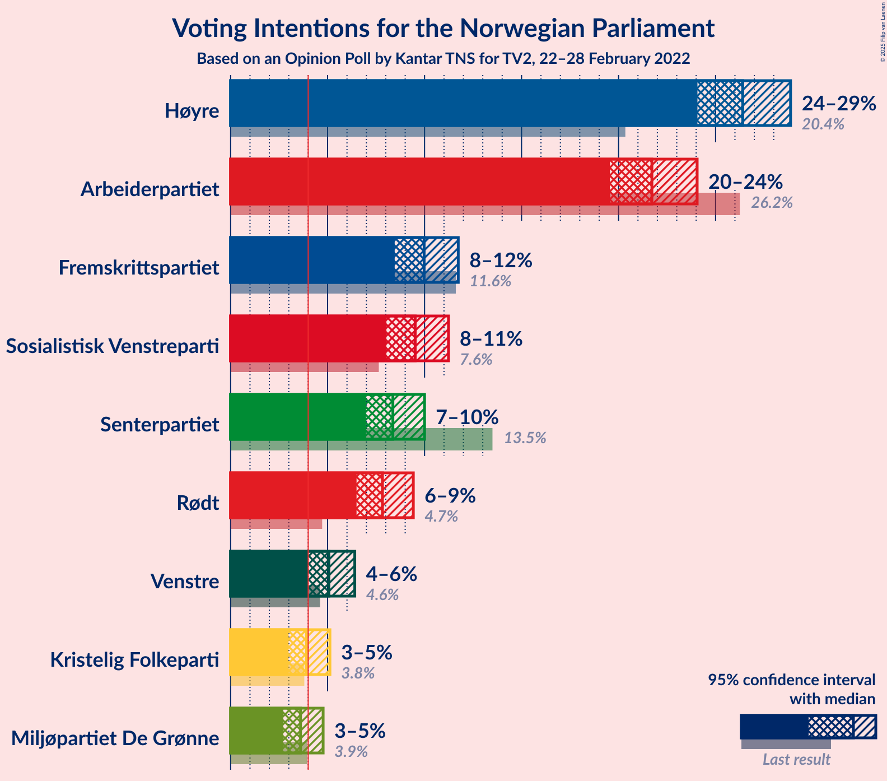

### Confidence Intervals

| Party | Last Result | Poll Result | 80% Confidence Interval | 90% Confidence Interval | 95% Confidence Interval | 99% Confidence Interval |
|:-----:|:-----------:|:-----------:|:-----------------------:|:-----------------------:|:-----------------------:|:-----------------------:|
| Høyre | 20.4% | 26.4% | 24.9–28.0% |24.4–28.5% |24.1–28.9% |23.4–29.7% |
| Arbeiderpartiet | 26.2% | 21.7% | 20.3–23.2% |19.9–23.7% |19.6–24.1% |18.9–24.8% |
| Fremskrittspartiet | 11.6% | 10.0% | 9.0–11.1% |8.7–11.4% |8.5–11.7% |8.0–12.3% |
| Sosialistisk Venstreparti | 7.6% | 9.5% | 8.5–10.6% |8.3–11.0% |8.0–11.2% |7.6–11.8% |
| Senterpartiet | 13.5% | 8.4% | 7.5–9.4% |7.2–9.7% |7.0–10.0% |6.6–10.5% |
| Rødt | 4.7% | 7.8% | 7.0–8.9% |6.7–9.2% |6.5–9.4% |6.1–9.9% |
| Venstre | 4.6% | 5.1% | 4.4–5.9% |4.2–6.2% |4.0–6.4% |3.7–6.8% |
| Kristelig Folkeparti | 3.8% | 3.9% | 3.3–4.7% |3.1–4.9% |3.0–5.1% |2.7–5.5% |
| Miljøpartiet De Grønne | 3.9% | 3.6% | 3.0–4.4% |2.9–4.6% |2.7–4.8% |2.5–5.2% |

*Note:* The poll result column reflects the actual value used in the calculations. Published results may vary slightly, and in addition be rounded to fewer digits.

## Seats

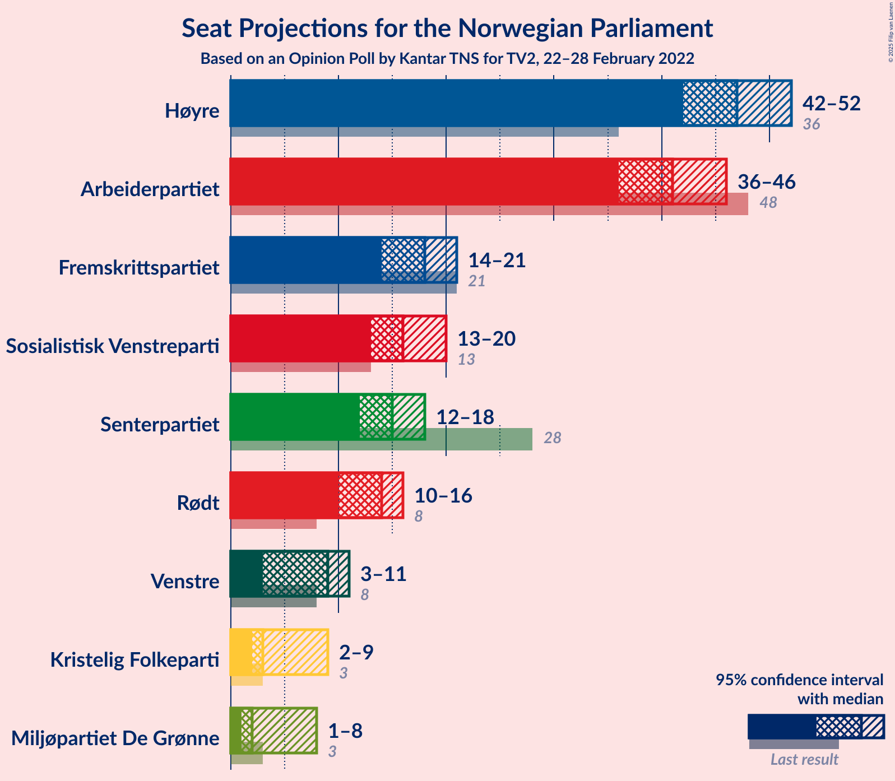

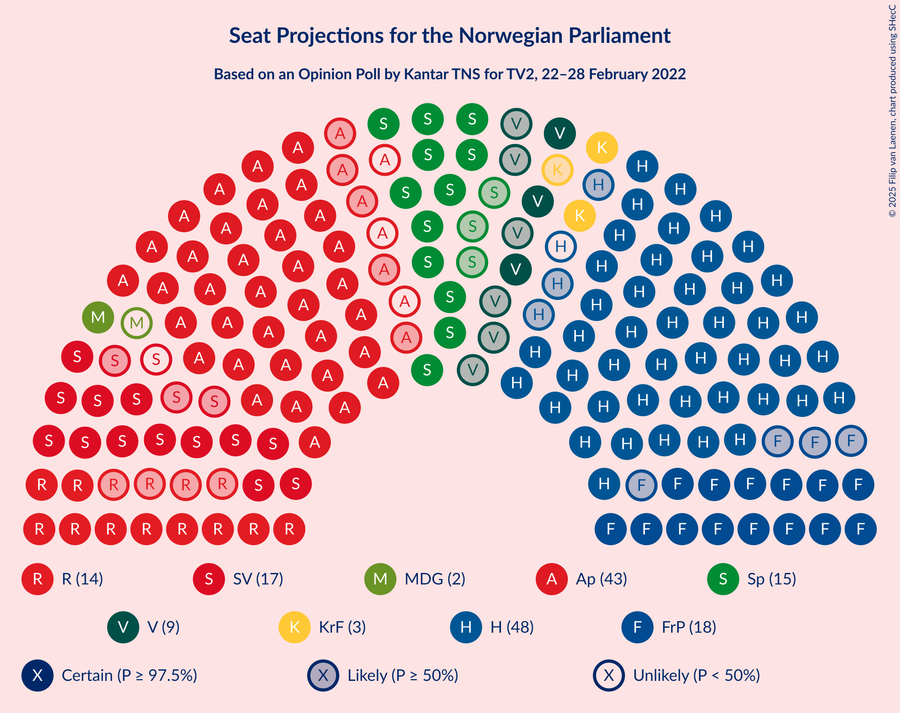

### Confidence Intervals

| Party | Last Result | Median | 80% Confidence Interval | 90% Confidence Interval | 95% Confidence Interval | 99% Confidence Interval |
|:-----:|:-----------:|:------:|:-----------------------:|:-----------------------:|:-----------------------:|:-----------------------:|
| <a href="#høyre">Høyre</a> | 36 | 47 | 44–51 |43–51 |42–52 |41–53 |
| <a href="#arbeiderpartiet">Arbeiderpartiet</a> | 48 | 41 | 37–44 |37–45 |36–46 |35–47 |
| <a href="#fremskrittspartiet">Fremskrittspartiet</a> | 21 | 18 | 16–19 |15–20 |14–21 |13–22 |
| <a href="#sosialistisk-venstreparti">Sosialistisk Venstreparti</a> | 13 | 16 | 14–19 |13–19 |13–20 |11–21 |
| <a href="#senterpartiet">Senterpartiet</a> | 28 | 15 | 13–17 |12–17 |12–18 |11–19 |
| <a href="#rødt">Rødt</a> | 8 | 14 | 12–15 |11–16 |10–16 |9–18 |
| <a href="#venstre">Venstre</a> | 8 | 9 | 7–10 |7–11 |3–11 |2–12 |
| <a href="#kristelig-folkeparti">Kristelig Folkeparti</a> | 3 | 3 | 2–8 |2–9 |2–9 |2–10 |
| <a href="#miljøpartiet-de-grønne">Miljøpartiet De Grønne</a> | 3 | 2 | 1–7 |1–8 |1–8 |1–9 |

### Høyre

*For a full overview of the results for this party, see the [Høyre](party-høyre.html) page.*

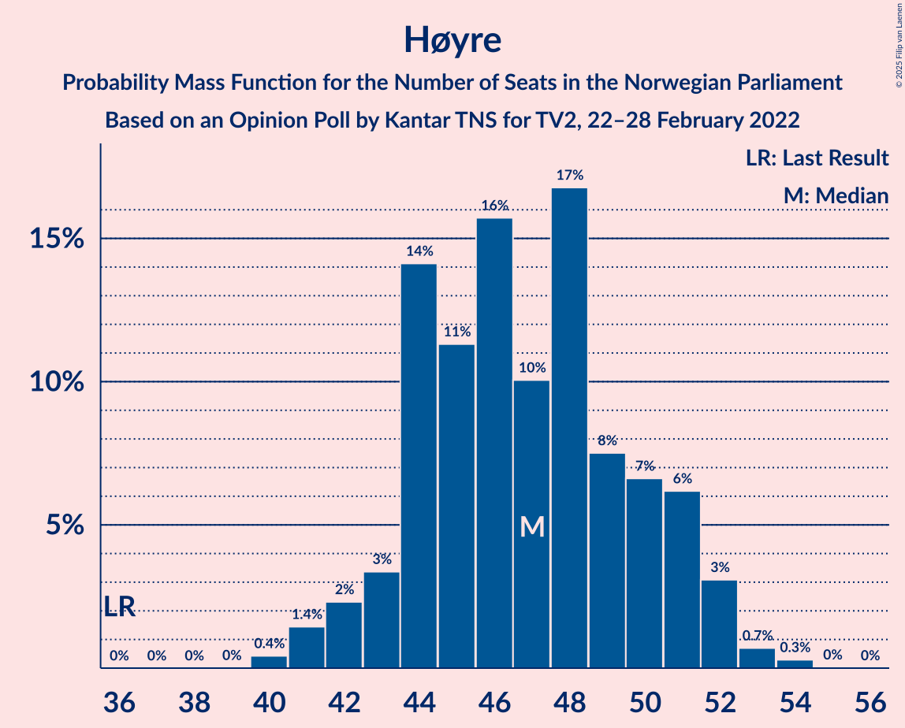

| Number of Seats | Probability | Accumulated | Special Marks |
|:---------------:|:-----------:|:-----------:|:-------------:|
| 36 | 0% | 100% | Last Result |
| 37 | 0% | 100% |  |
| 38 | 0% | 100% |  |
| 39 | 0% | 100% |  |
| 40 | 0.4% | 100% |  |
| 41 | 1.4% | 99.6% |  |
| 42 | 2% | 98% |  |
| 43 | 3% | 96% |  |
| 44 | 14% | 92% |  |
| 45 | 11% | 78% |  |
| 46 | 16% | 67% |  |
| 47 | 10% | 51% | Median |
| 48 | 17% | 41% |  |
| 49 | 8% | 24% |  |
| 50 | 7% | 17% |  |
| 51 | 6% | 10% |  |
| 52 | 3% | 4% |  |
| 53 | 0.7% | 1.0% |  |
| 54 | 0.3% | 0.3% |  |
| 55 | 0% | 0% |  |

### Arbeiderpartiet

*For a full overview of the results for this party, see the [Arbeiderpartiet](party-arbeiderpartiet.html) page.*

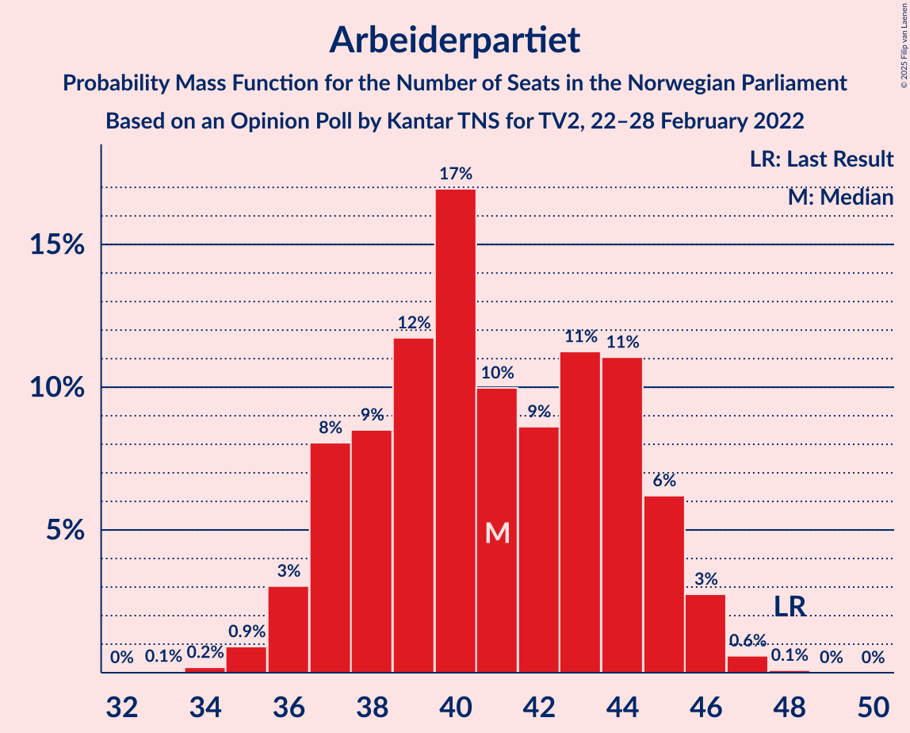

| Number of Seats | Probability | Accumulated | Special Marks |
|:---------------:|:-----------:|:-----------:|:-------------:|
| 33 | 0.1% | 100% |  |
| 34 | 0.2% | 99.9% |  |
| 35 | 0.9% | 99.7% |  |
| 36 | 3% | 98.8% |  |
| 37 | 8% | 96% |  |
| 38 | 9% | 88% |  |
| 39 | 12% | 79% |  |
| 40 | 17% | 68% |  |
| 41 | 10% | 51% | Median |
| 42 | 9% | 41% |  |
| 43 | 11% | 32% |  |
| 44 | 11% | 21% |  |
| 45 | 6% | 10% |  |
| 46 | 3% | 3% |  |
| 47 | 0.6% | 0.7% |  |
| 48 | 0.1% | 0.1% | Last Result |
| 49 | 0% | 0% |  |

### Fremskrittspartiet

*For a full overview of the results for this party, see the [Fremskrittspartiet](party-fremskrittspartiet.html) page.*

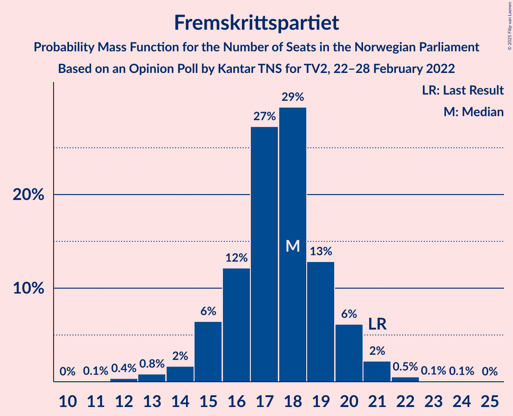

| Number of Seats | Probability | Accumulated | Special Marks |
|:---------------:|:-----------:|:-----------:|:-------------:|
| 11 | 0.1% | 100% |  |
| 12 | 0.4% | 99.9% |  |
| 13 | 0.8% | 99.6% |  |
| 14 | 2% | 98.7% |  |
| 15 | 6% | 97% |  |
| 16 | 12% | 91% |  |
| 17 | 27% | 78% |  |
| 18 | 29% | 51% | Median |
| 19 | 13% | 22% |  |
| 20 | 6% | 9% |  |
| 21 | 2% | 3% | Last Result |
| 22 | 0.5% | 0.7% |  |
| 23 | 0.1% | 0.2% |  |
| 24 | 0.1% | 0.1% |  |
| 25 | 0% | 0% |  |

### Sosialistisk Venstreparti

*For a full overview of the results for this party, see the [Sosialistisk Venstreparti](party-sosialistiskvenstreparti.html) page.*

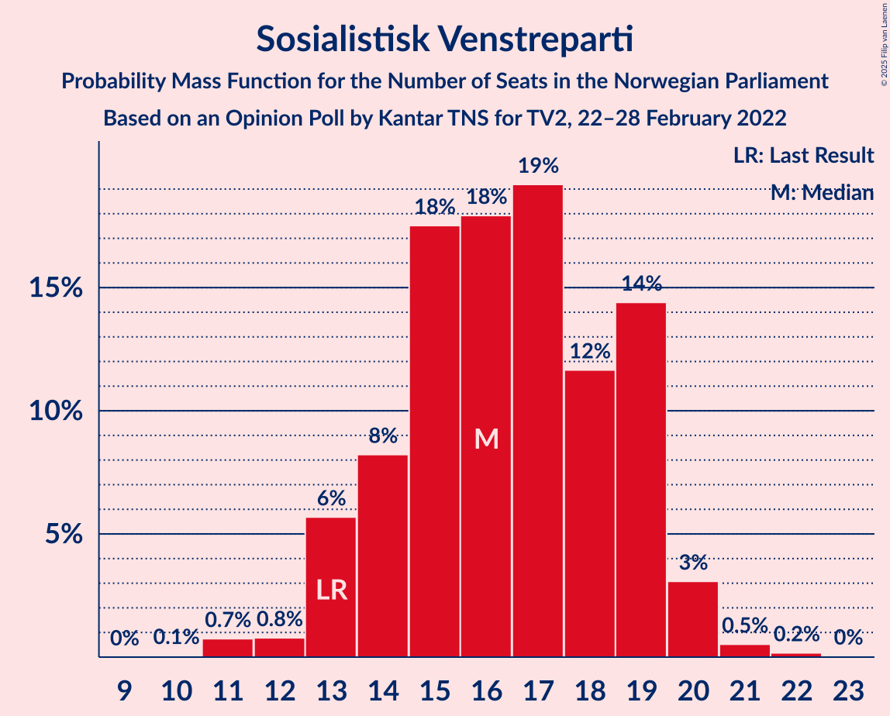

| Number of Seats | Probability | Accumulated | Special Marks |
|:---------------:|:-----------:|:-----------:|:-------------:|
| 10 | 0.1% | 100% |  |
| 11 | 0.7% | 99.9% |  |
| 12 | 0.8% | 99.2% |  |
| 13 | 6% | 98% | Last Result |
| 14 | 8% | 93% |  |
| 15 | 18% | 85% |  |
| 16 | 18% | 67% | Median |
| 17 | 19% | 49% |  |
| 18 | 12% | 30% |  |
| 19 | 14% | 18% |  |
| 20 | 3% | 4% |  |
| 21 | 0.5% | 0.7% |  |
| 22 | 0.2% | 0.2% |  |
| 23 | 0% | 0% |  |

### Senterpartiet

*For a full overview of the results for this party, see the [Senterpartiet](party-senterpartiet.html) page.*

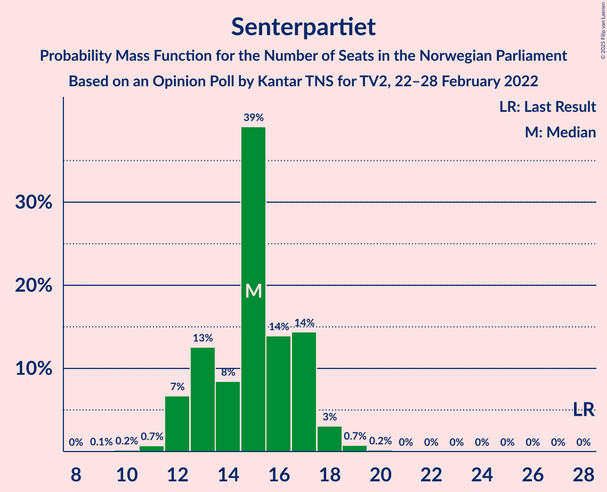

| Number of Seats | Probability | Accumulated | Special Marks |
|:---------------:|:-----------:|:-----------:|:-------------:|
| 9 | 0.1% | 100% |  |
| 10 | 0.2% | 99.9% |  |
| 11 | 0.7% | 99.8% |  |
| 12 | 7% | 99.1% |  |
| 13 | 13% | 92% |  |
| 14 | 8% | 80% |  |
| 15 | 39% | 71% | Median |
| 16 | 14% | 32% |  |
| 17 | 14% | 18% |  |
| 18 | 3% | 4% |  |
| 19 | 0.7% | 0.9% |  |
| 20 | 0.2% | 0.2% |  |
| 21 | 0% | 0% |  |
| 22 | 0% | 0% |  |
| 23 | 0% | 0% |  |
| 24 | 0% | 0% |  |
| 25 | 0% | 0% |  |
| 26 | 0% | 0% |  |
| 27 | 0% | 0% |  |
| 28 | 0% | 0% | Last Result |

### Rødt

*For a full overview of the results for this party, see the [Rødt](party-rødt.html) page.*

| Number of Seats | Probability | Accumulated | Special Marks |
|:---------------:|:-----------:|:-----------:|:-------------:|
| 8 | 0% | 100% | Last Result |
| 9 | 0.5% | 100% |  |
| 10 | 2% | 99.4% |  |
| 11 | 5% | 97% |  |
| 12 | 12% | 92% |  |
| 13 | 28% | 80% |  |
| 14 | 28% | 52% | Median |
| 15 | 17% | 24% |  |
| 16 | 5% | 6% |  |
| 17 | 1.2% | 2% |  |
| 18 | 0.6% | 0.6% |  |
| 19 | 0% | 0.1% |  |
| 20 | 0% | 0% |  |

### Venstre

*For a full overview of the results for this party, see the [Venstre](party-venstre.html) page.*

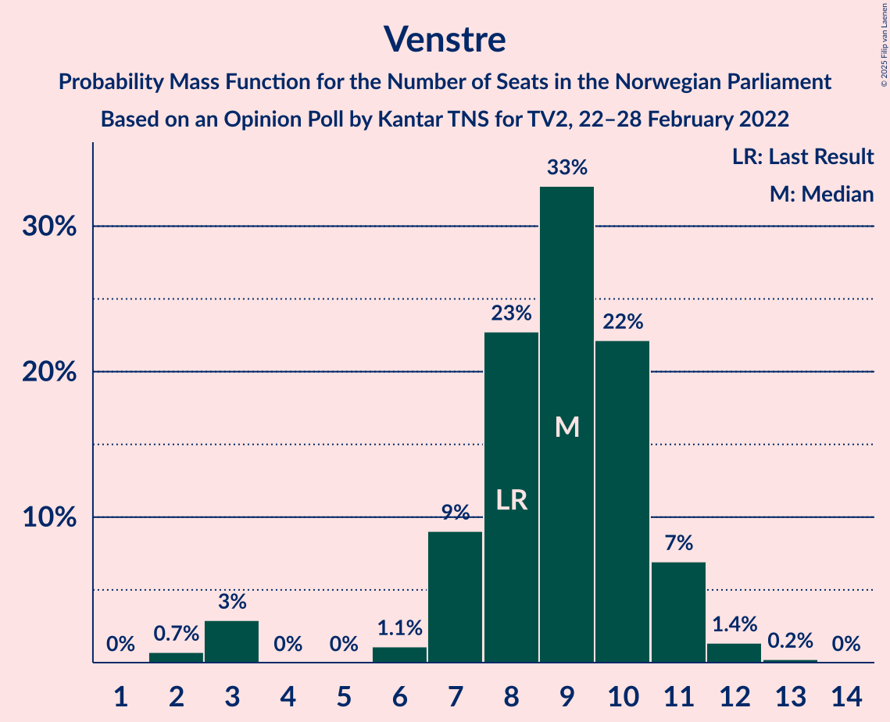

| Number of Seats | Probability | Accumulated | Special Marks |
|:---------------:|:-----------:|:-----------:|:-------------:|
| 2 | 0.7% | 100% |  |
| 3 | 3% | 99.3% |  |
| 4 | 0% | 96% |  |
| 5 | 0% | 96% |  |
| 6 | 1.1% | 96% |  |
| 7 | 9% | 95% |  |
| 8 | 23% | 86% | Last Result |
| 9 | 33% | 63% | Median |
| 10 | 22% | 31% |  |
| 11 | 7% | 9% |  |
| 12 | 1.4% | 2% |  |
| 13 | 0.2% | 0.2% |  |
| 14 | 0% | 0% |  |

### Kristelig Folkeparti

*For a full overview of the results for this party, see the [Kristelig Folkeparti](party-kristeligfolkeparti.html) page.*

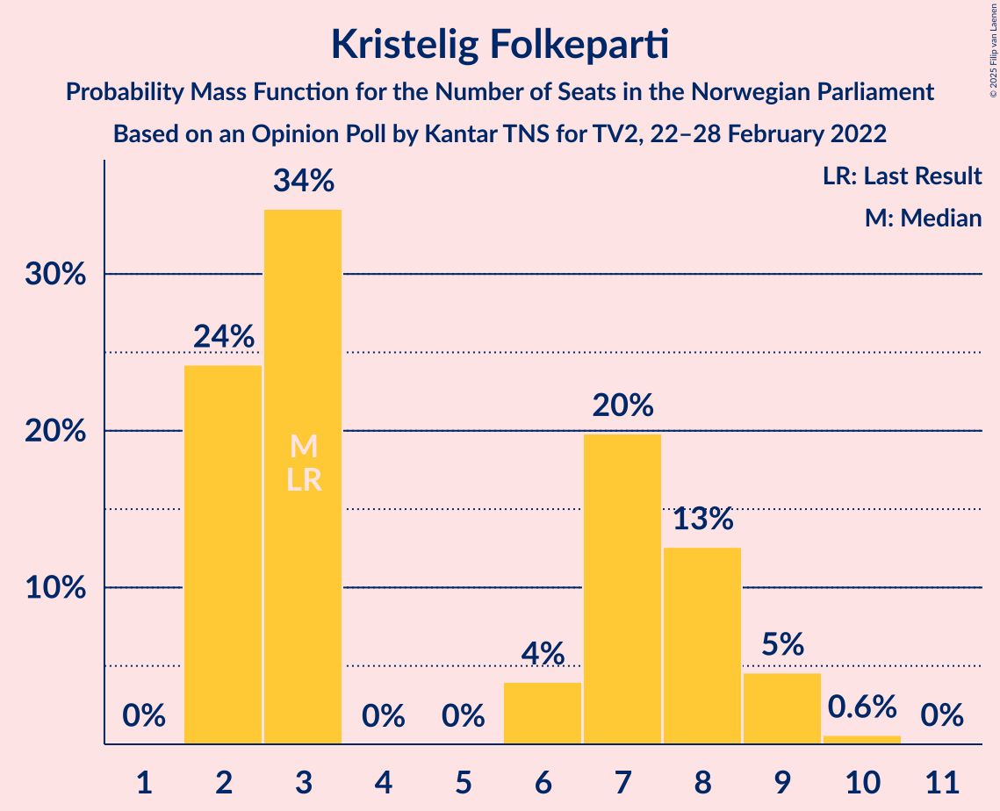

| Number of Seats | Probability | Accumulated | Special Marks |
|:---------------:|:-----------:|:-----------:|:-------------:|
| 2 | 24% | 100% |  |
| 3 | 34% | 76% | Last Result, Median |
| 4 | 0% | 42% |  |
| 5 | 0% | 42% |  |
| 6 | 4% | 42% |  |
| 7 | 20% | 38% |  |
| 8 | 13% | 18% |  |
| 9 | 5% | 5% |  |
| 10 | 0.6% | 0.6% |  |
| 11 | 0% | 0% |  |

### Miljøpartiet De Grønne

*For a full overview of the results for this party, see the [Miljøpartiet De Grønne](party-miljøpartietdegrønne.html) page.*

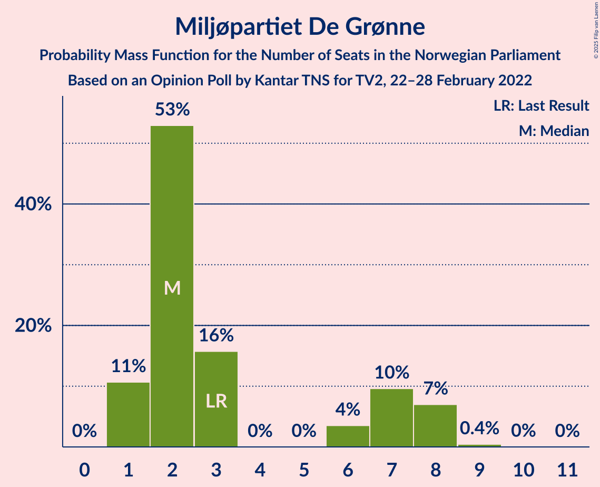

| Number of Seats | Probability | Accumulated | Special Marks |
|:---------------:|:-----------:|:-----------:|:-------------:|
| 1 | 11% | 100% |  |
| 2 | 53% | 89% | Median |
| 3 | 16% | 36% | Last Result |
| 4 | 0% | 21% |  |
| 5 | 0% | 21% |  |
| 6 | 4% | 21% |  |
| 7 | 10% | 17% |  |
| 8 | 7% | 7% |  |
| 9 | 0.4% | 0.5% |  |
| 10 | 0% | 0.1% |  |
| 11 | 0% | 0% |  |

## Coalitions

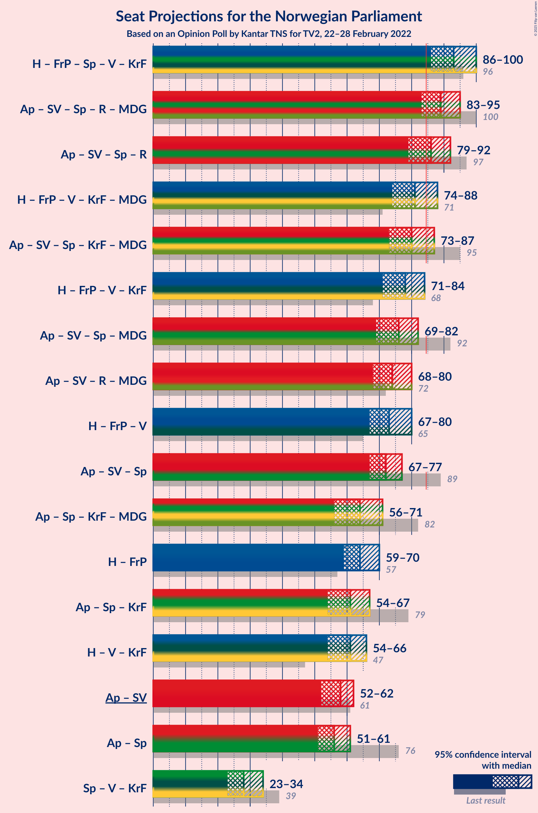

### Confidence Intervals

| Coalition | Last Result | Median | Majority? | 80% Confidence Interval | 90% Confidence Interval | 95% Confidence Interval | 99% Confidence Interval |
|:---------:|:-----------:|:------:|:---------:|:-----------------------:|:-----------------------:|:-----------------------:|:-----------------------:|
| Høyre – Fremskrittspartiet – Senterpartiet – Venstre – Kristelig Folkeparti | 96 | 93 | 99.2% | 88–97 | 87–99 | 86–100 | 84–100 |
| Arbeiderpartiet – Sosialistisk Venstreparti – Senterpartiet – Rødt – Miljøpartiet De Grønne | 100 | 89 | 88% | 84–94 | 83–94 | 83–95 | 80–97 |
| Arbeiderpartiet – Sosialistisk Venstreparti – Senterpartiet – Rødt | 97 | 86 | 67% | 81–90 | 80–92 | 79–92 | 77–94 |
| Høyre – Fremskrittspartiet – Venstre – Kristelig Folkeparti – Miljøpartiet De Grønne | 71 | 81 | 14% | 76–86 | 75–87 | 74–88 | 73–89 |
| Arbeiderpartiet – Sosialistisk Venstreparti – Senterpartiet – Kristelig Folkeparti – Miljøpartiet De Grønne | 95 | 80 | 8% | 75–84 | 74–85 | 73–87 | 71–88 |
| Høyre – Fremskrittspartiet – Venstre – Kristelig Folkeparti | 68 | 78 | 1.2% | 73–82 | 72–84 | 71–84 | 69–85 |
| Arbeiderpartiet – Sosialistisk Venstreparti – Senterpartiet – Miljøpartiet De Grønne | 92 | 76 | 0.2% | 71–79 | 70–80 | 69–82 | 68–83 |
| Arbeiderpartiet – Sosialistisk Venstreparti – Rødt – Miljøpartiet De Grønne | 72 | 74 | 0.1% | 69–79 | 68–79 | 68–80 | 64–83 |
| Høyre – Fremskrittspartiet – Venstre | 65 | 73 | 0% | 69–77 | 68–78 | 67–80 | 65–81 |
| Arbeiderpartiet – Sosialistisk Venstreparti – Senterpartiet | 89 | 72 | 0% | 68–76 | 68–77 | 67–77 | 65–79 |
| Arbeiderpartiet – Senterpartiet – Kristelig Folkeparti – Miljøpartiet De Grønne | 82 | 64 | 0% | 59–68 | 58–70 | 56–71 | 55–73 |
| Høyre – Fremskrittspartiet | 57 | 64 | 0% | 61–68 | 60–69 | 59–70 | 58–72 |
| Arbeiderpartiet – Senterpartiet – Kristelig Folkeparti | 79 | 61 | 0% | 56–65 | 55–66 | 54–67 | 53–68 |
| Høyre – Venstre – Kristelig Folkeparti | 47 | 61 | 0% | 56–64 | 55–66 | 54–66 | 52–67 |
| Arbeiderpartiet – Sosialistisk Venstreparti | 61 | 58 | 0% | 53–61 | 53–62 | 52–62 | 50–64 |
| Arbeiderpartiet – Senterpartiet | 76 | 56 | 0% | 53–59 | 52–60 | 51–61 | 50–62 |
| Senterpartiet – Venstre – Kristelig Folkeparti | 39 | 28 | 0% | 25–33 | 23–34 | 23–34 | 21–36 |

### Høyre – Fremskrittspartiet – Senterpartiet – Venstre – Kristelig Folkeparti

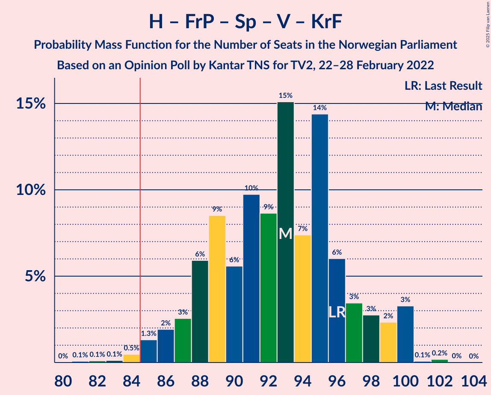

| Number of Seats | Probability | Accumulated | Special Marks |
|:---------------:|:-----------:|:-----------:|:-------------:|
| 81 | 0.1% | 100% |  |
| 82 | 0.1% | 99.9% |  |
| 83 | 0.1% | 99.8% |  |
| 84 | 0.5% | 99.7% |  |
| 85 | 1.3% | 99.2% | Majority |
| 86 | 2% | 98% |  |
| 87 | 3% | 96% |  |
| 88 | 6% | 93% |  |
| 89 | 9% | 87% |  |
| 90 | 6% | 79% |  |
| 91 | 10% | 73% |  |
| 92 | 9% | 64% | Median |
| 93 | 15% | 55% |  |
| 94 | 7% | 40% |  |
| 95 | 14% | 33% |  |
| 96 | 6% | 18% | Last Result |
| 97 | 3% | 12% |  |
| 98 | 3% | 9% |  |
| 99 | 2% | 6% |  |
| 100 | 3% | 4% |  |
| 101 | 0.1% | 0.3% |  |
| 102 | 0.2% | 0.2% |  |
| 103 | 0% | 0% |  |

### Arbeiderpartiet – Sosialistisk Venstreparti – Senterpartiet – Rødt – Miljøpartiet De Grønne

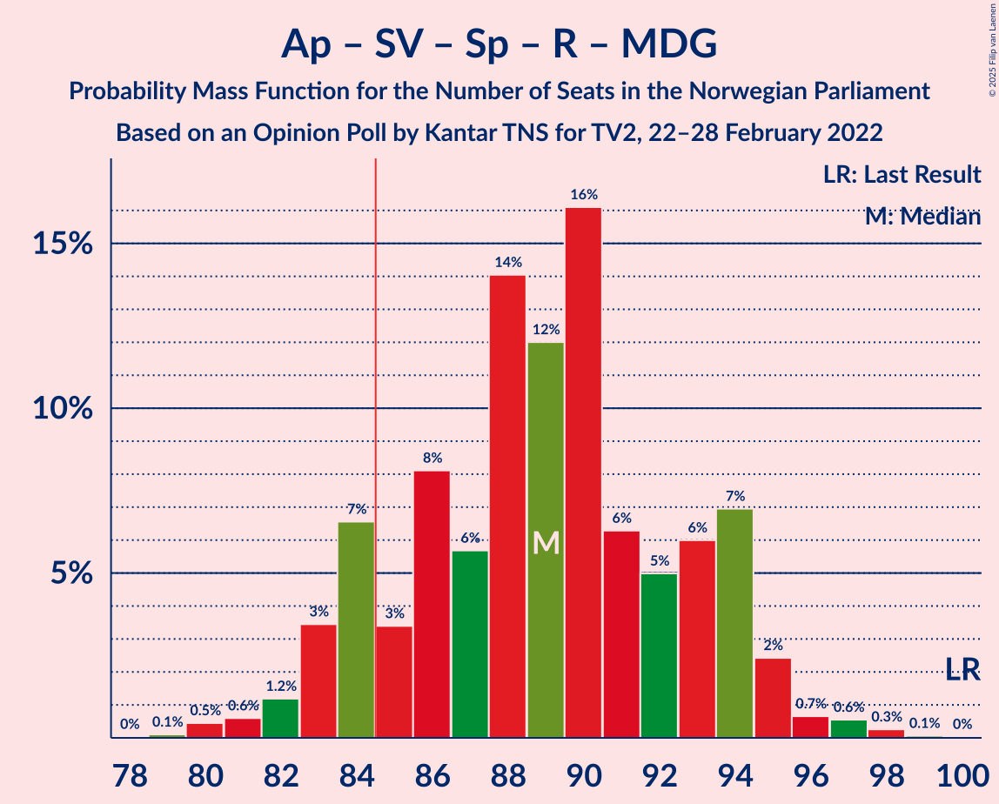

| Number of Seats | Probability | Accumulated | Special Marks |
|:---------------:|:-----------:|:-----------:|:-------------:|
| 78 | 0% | 100% |  |
| 79 | 0.1% | 99.9% |  |
| 80 | 0.5% | 99.8% |  |
| 81 | 0.6% | 99.4% |  |
| 82 | 1.2% | 98.8% |  |
| 83 | 3% | 98% |  |
| 84 | 7% | 94% |  |
| 85 | 3% | 88% | Majority |
| 86 | 8% | 84% |  |
| 87 | 6% | 76% |  |
| 88 | 14% | 70% | Median |
| 89 | 12% | 56% |  |
| 90 | 16% | 44% |  |
| 91 | 6% | 28% |  |
| 92 | 5% | 22% |  |
| 93 | 6% | 17% |  |
| 94 | 7% | 11% |  |
| 95 | 2% | 4% |  |
| 96 | 0.7% | 2% |  |
| 97 | 0.6% | 0.9% |  |
| 98 | 0.3% | 0.4% |  |
| 99 | 0.1% | 0.1% |  |
| 100 | 0% | 0% | Last Result |

### Arbeiderpartiet – Sosialistisk Venstreparti – Senterpartiet – Rødt

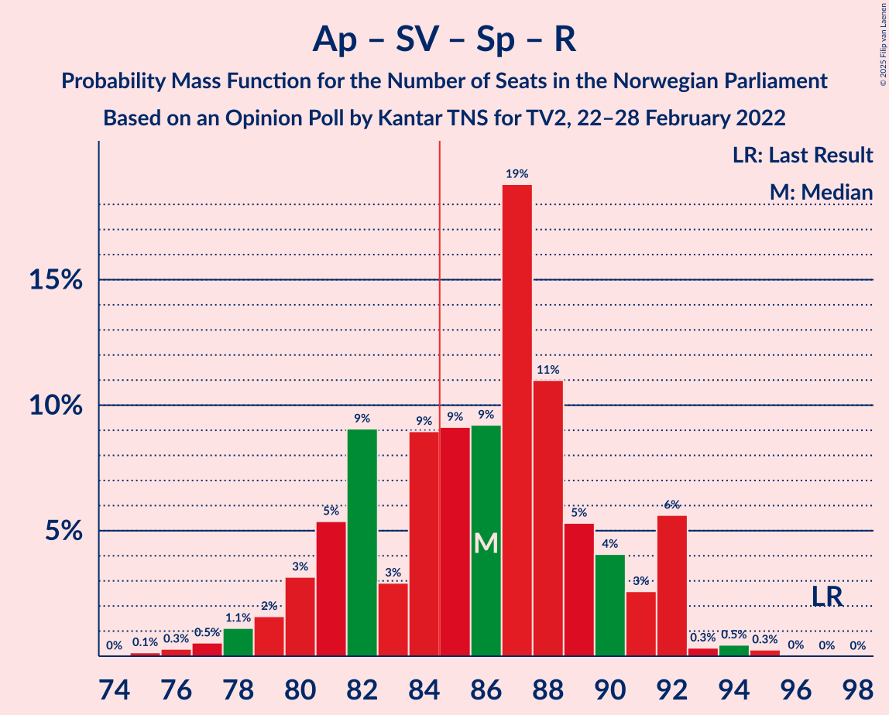

| Number of Seats | Probability | Accumulated | Special Marks |
|:---------------:|:-----------:|:-----------:|:-------------:|
| 75 | 0.1% | 100% |  |
| 76 | 0.3% | 99.8% |  |
| 77 | 0.5% | 99.5% |  |
| 78 | 1.1% | 99.0% |  |
| 79 | 2% | 98% |  |
| 80 | 3% | 96% |  |
| 81 | 5% | 93% |  |
| 82 | 9% | 88% |  |
| 83 | 3% | 79% |  |
| 84 | 9% | 76% |  |
| 85 | 9% | 67% | Majority |
| 86 | 9% | 58% | Median |
| 87 | 19% | 48% |  |
| 88 | 11% | 30% |  |
| 89 | 5% | 19% |  |
| 90 | 4% | 13% |  |
| 91 | 3% | 9% |  |
| 92 | 6% | 7% |  |
| 93 | 0.3% | 1.1% |  |
| 94 | 0.5% | 0.8% |  |
| 95 | 0.3% | 0.3% |  |
| 96 | 0% | 0.1% |  |
| 97 | 0% | 0% | Last Result |

### Høyre – Fremskrittspartiet – Venstre – Kristelig Folkeparti – Miljøpartiet De Grønne

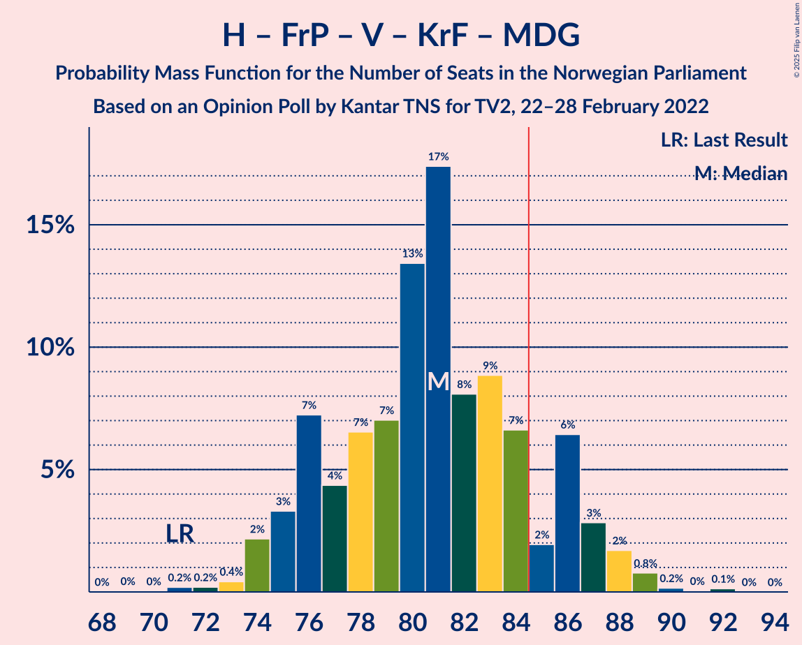

| Number of Seats | Probability | Accumulated | Special Marks |
|:---------------:|:-----------:|:-----------:|:-------------:|
| 69 | 0% | 100% |  |
| 70 | 0% | 99.9% |  |
| 71 | 0.2% | 99.9% | Last Result |
| 72 | 0.2% | 99.7% |  |
| 73 | 0.4% | 99.5% |  |
| 74 | 2% | 99.1% |  |
| 75 | 3% | 97% |  |
| 76 | 7% | 94% |  |
| 77 | 4% | 86% |  |
| 78 | 7% | 82% |  |
| 79 | 7% | 75% | Median |
| 80 | 13% | 68% |  |
| 81 | 17% | 55% |  |
| 82 | 8% | 38% |  |
| 83 | 9% | 30% |  |
| 84 | 7% | 21% |  |
| 85 | 2% | 14% | Majority |
| 86 | 6% | 12% |  |
| 87 | 3% | 6% |  |
| 88 | 2% | 3% |  |
| 89 | 0.8% | 1.1% |  |
| 90 | 0.2% | 0.4% |  |
| 91 | 0% | 0.2% |  |
| 92 | 0.1% | 0.1% |  |
| 93 | 0% | 0% |  |

### Arbeiderpartiet – Sosialistisk Venstreparti – Senterpartiet – Kristelig Folkeparti – Miljøpartiet De Grønne

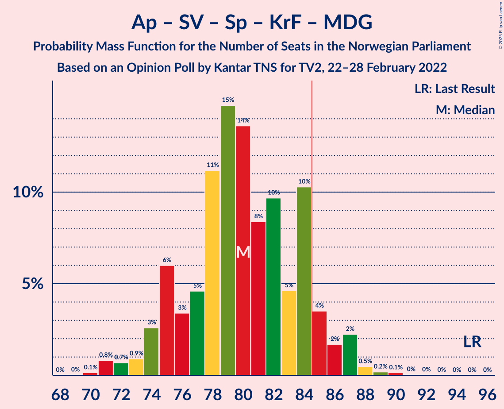

| Number of Seats | Probability | Accumulated | Special Marks |
|:---------------:|:-----------:|:-----------:|:-------------:|
| 70 | 0.1% | 100% |  |
| 71 | 0.8% | 99.8% |  |
| 72 | 0.7% | 99.0% |  |
| 73 | 0.9% | 98% |  |
| 74 | 3% | 97% |  |
| 75 | 6% | 95% |  |
| 76 | 3% | 89% |  |
| 77 | 5% | 85% | Median |
| 78 | 11% | 81% |  |
| 79 | 15% | 70% |  |
| 80 | 14% | 55% |  |
| 81 | 8% | 41% |  |
| 82 | 10% | 33% |  |
| 83 | 5% | 23% |  |
| 84 | 10% | 19% |  |
| 85 | 4% | 8% | Majority |
| 86 | 2% | 5% |  |
| 87 | 2% | 3% |  |
| 88 | 0.5% | 0.9% |  |
| 89 | 0.2% | 0.4% |  |
| 90 | 0.1% | 0.2% |  |
| 91 | 0% | 0.1% |  |
| 92 | 0% | 0% |  |
| 93 | 0% | 0% |  |
| 94 | 0% | 0% |  |
| 95 | 0% | 0% | Last Result |

### Høyre – Fremskrittspartiet – Venstre – Kristelig Folkeparti

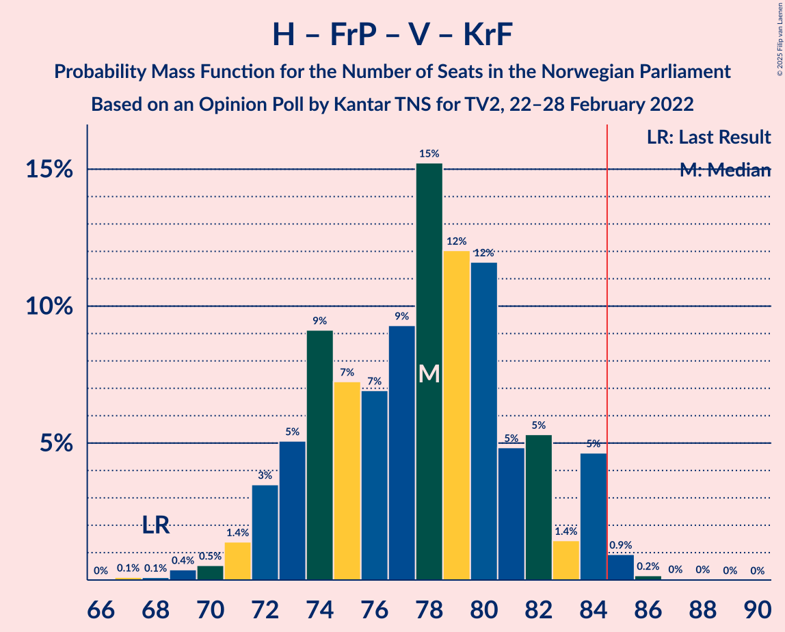

| Number of Seats | Probability | Accumulated | Special Marks |
|:---------------:|:-----------:|:-----------:|:-------------:|
| 67 | 0.1% | 100% |  |
| 68 | 0.1% | 99.9% | Last Result |
| 69 | 0.4% | 99.8% |  |
| 70 | 0.5% | 99.4% |  |
| 71 | 1.4% | 98.9% |  |
| 72 | 3% | 97% |  |
| 73 | 5% | 94% |  |
| 74 | 9% | 89% |  |
| 75 | 7% | 80% |  |
| 76 | 7% | 73% |  |
| 77 | 9% | 66% | Median |
| 78 | 15% | 56% |  |
| 79 | 12% | 41% |  |
| 80 | 12% | 29% |  |
| 81 | 5% | 17% |  |
| 82 | 5% | 13% |  |
| 83 | 1.4% | 7% |  |
| 84 | 5% | 6% |  |
| 85 | 0.9% | 1.2% | Majority |
| 86 | 0.2% | 0.3% |  |
| 87 | 0% | 0.1% |  |
| 88 | 0% | 0.1% |  |
| 89 | 0% | 0% |  |

### Arbeiderpartiet – Sosialistisk Venstreparti – Senterpartiet – Miljøpartiet De Grønne

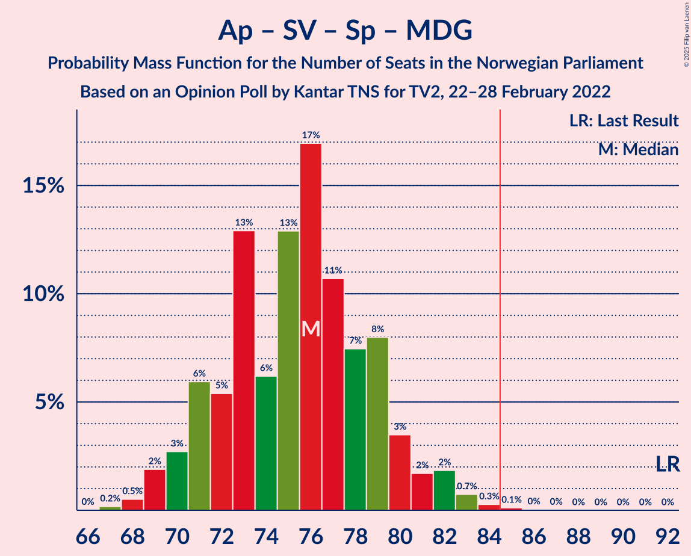

| Number of Seats | Probability | Accumulated | Special Marks |
|:---------------:|:-----------:|:-----------:|:-------------:|
| 67 | 0.2% | 100% |  |
| 68 | 0.5% | 99.8% |  |
| 69 | 2% | 99.3% |  |
| 70 | 3% | 97% |  |
| 71 | 6% | 95% |  |
| 72 | 5% | 89% |  |
| 73 | 13% | 83% |  |
| 74 | 6% | 70% | Median |
| 75 | 13% | 64% |  |
| 76 | 17% | 51% |  |
| 77 | 11% | 34% |  |
| 78 | 7% | 24% |  |
| 79 | 8% | 16% |  |
| 80 | 3% | 8% |  |
| 81 | 2% | 5% |  |
| 82 | 2% | 3% |  |
| 83 | 0.7% | 1.2% |  |
| 84 | 0.3% | 0.4% |  |
| 85 | 0.1% | 0.2% | Majority |
| 86 | 0% | 0.1% |  |
| 87 | 0% | 0% |  |
| 88 | 0% | 0% |  |
| 89 | 0% | 0% |  |
| 90 | 0% | 0% |  |
| 91 | 0% | 0% |  |
| 92 | 0% | 0% | Last Result |

### Arbeiderpartiet – Sosialistisk Venstreparti – Rødt – Miljøpartiet De Grønne

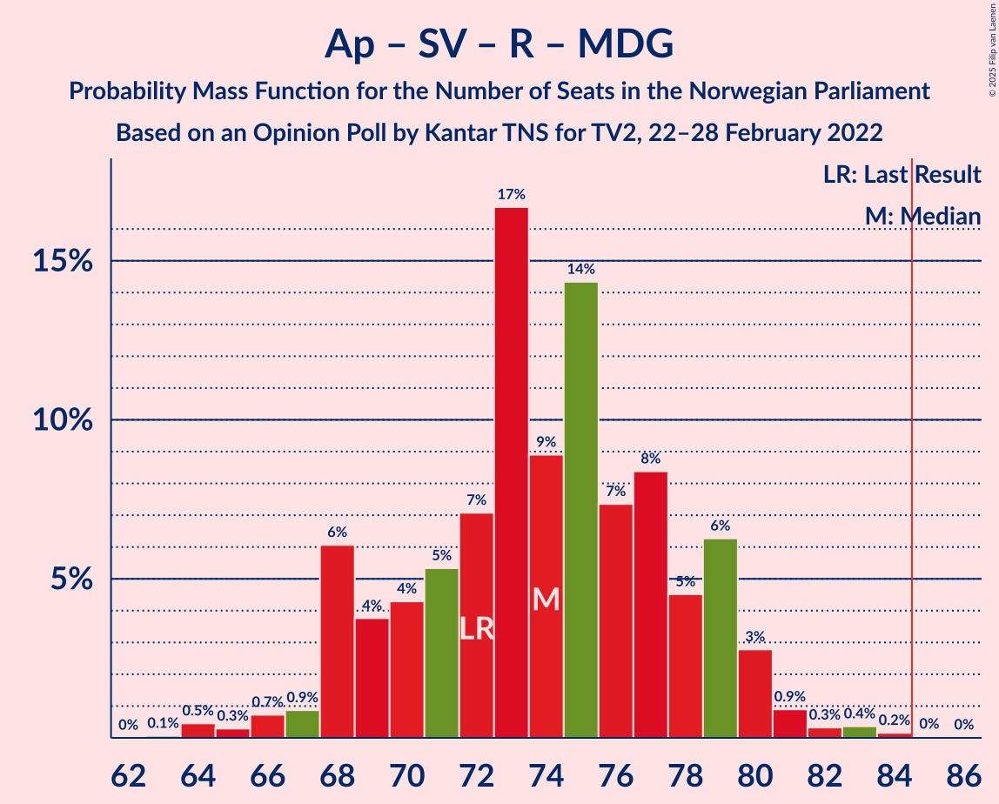

| Number of Seats | Probability | Accumulated | Special Marks |
|:---------------:|:-----------:|:-----------:|:-------------:|
| 63 | 0.1% | 100% |  |
| 64 | 0.5% | 99.9% |  |
| 65 | 0.3% | 99.5% |  |
| 66 | 0.7% | 99.2% |  |
| 67 | 0.9% | 98% |  |
| 68 | 6% | 98% |  |
| 69 | 4% | 92% |  |
| 70 | 4% | 88% |  |
| 71 | 5% | 83% |  |
| 72 | 7% | 78% | Last Result |
| 73 | 17% | 71% | Median |
| 74 | 9% | 54% |  |
| 75 | 14% | 45% |  |
| 76 | 7% | 31% |  |
| 77 | 8% | 24% |  |
| 78 | 5% | 15% |  |
| 79 | 6% | 11% |  |
| 80 | 3% | 5% |  |
| 81 | 0.9% | 2% |  |
| 82 | 0.3% | 0.9% |  |
| 83 | 0.4% | 0.6% |  |
| 84 | 0.2% | 0.2% |  |
| 85 | 0% | 0.1% | Majority |
| 86 | 0% | 0% |  |

### Høyre – Fremskrittspartiet – Venstre

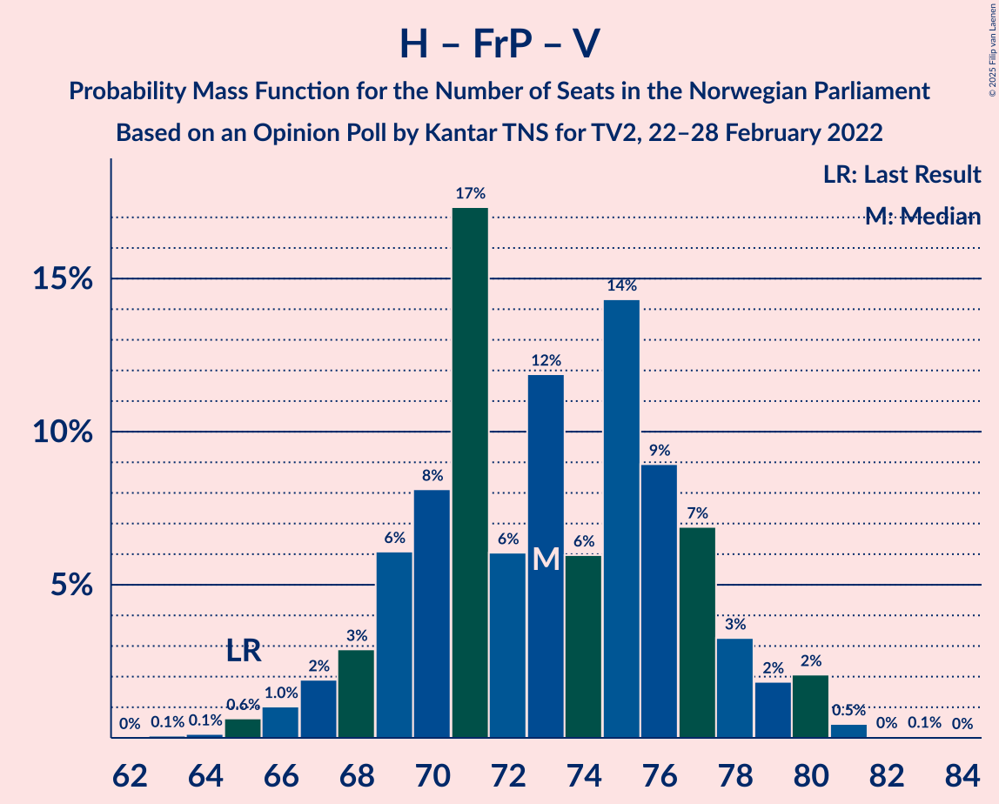

| Number of Seats | Probability | Accumulated | Special Marks |
|:---------------:|:-----------:|:-----------:|:-------------:|
| 63 | 0.1% | 100% |  |
| 64 | 0.1% | 99.9% |  |
| 65 | 0.6% | 99.8% | Last Result |
| 66 | 1.0% | 99.1% |  |
| 67 | 2% | 98% |  |
| 68 | 3% | 96% |  |
| 69 | 6% | 93% |  |
| 70 | 8% | 87% |  |
| 71 | 17% | 79% |  |
| 72 | 6% | 62% |  |
| 73 | 12% | 56% |  |
| 74 | 6% | 44% | Median |
| 75 | 14% | 38% |  |
| 76 | 9% | 24% |  |
| 77 | 7% | 15% |  |
| 78 | 3% | 8% |  |
| 79 | 2% | 4% |  |
| 80 | 2% | 3% |  |
| 81 | 0.5% | 0.6% |  |
| 82 | 0% | 0.1% |  |
| 83 | 0.1% | 0.1% |  |
| 84 | 0% | 0% |  |

### Arbeiderpartiet – Sosialistisk Venstreparti – Senterpartiet

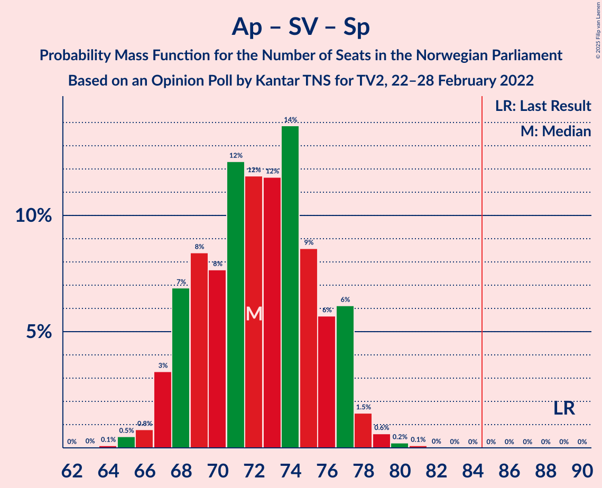

| Number of Seats | Probability | Accumulated | Special Marks |
|:---------------:|:-----------:|:-----------:|:-------------:|
| 63 | 0% | 100% |  |
| 64 | 0.1% | 99.9% |  |
| 65 | 0.5% | 99.9% |  |
| 66 | 0.8% | 99.4% |  |
| 67 | 3% | 98.6% |  |
| 68 | 7% | 95% |  |
| 69 | 8% | 88% |  |
| 70 | 8% | 80% |  |
| 71 | 12% | 72% |  |
| 72 | 12% | 60% | Median |
| 73 | 12% | 48% |  |
| 74 | 14% | 37% |  |
| 75 | 9% | 23% |  |
| 76 | 6% | 14% |  |
| 77 | 6% | 9% |  |
| 78 | 1.5% | 2% |  |
| 79 | 0.6% | 1.0% |  |
| 80 | 0.2% | 0.3% |  |
| 81 | 0.1% | 0.1% |  |
| 82 | 0% | 0% |  |
| 83 | 0% | 0% |  |
| 84 | 0% | 0% |  |
| 85 | 0% | 0% | Majority |
| 86 | 0% | 0% |  |
| 87 | 0% | 0% |  |
| 88 | 0% | 0% |  |
| 89 | 0% | 0% | Last Result |

### Arbeiderpartiet – Senterpartiet – Kristelig Folkeparti – Miljøpartiet De Grønne

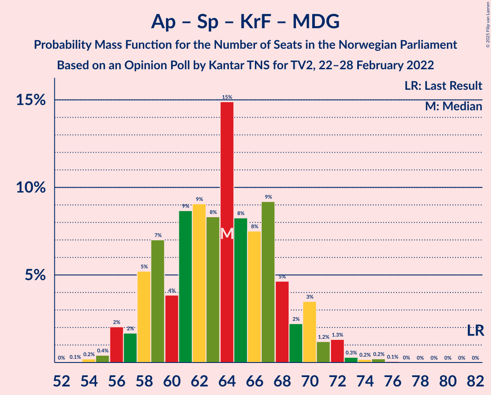

| Number of Seats | Probability | Accumulated | Special Marks |
|:---------------:|:-----------:|:-----------:|:-------------:|
| 53 | 0.1% | 100% |  |
| 54 | 0.2% | 99.9% |  |
| 55 | 0.4% | 99.7% |  |
| 56 | 2% | 99.3% |  |
| 57 | 2% | 97% |  |
| 58 | 5% | 96% |  |
| 59 | 7% | 90% |  |
| 60 | 4% | 83% |  |
| 61 | 9% | 80% | Median |
| 62 | 9% | 71% |  |
| 63 | 8% | 62% |  |
| 64 | 15% | 53% |  |
| 65 | 8% | 39% |  |
| 66 | 8% | 30% |  |
| 67 | 9% | 23% |  |
| 68 | 5% | 14% |  |
| 69 | 2% | 9% |  |
| 70 | 3% | 7% |  |
| 71 | 1.2% | 3% |  |
| 72 | 1.3% | 2% |  |
| 73 | 0.3% | 0.8% |  |
| 74 | 0.2% | 0.5% |  |
| 75 | 0.2% | 0.3% |  |
| 76 | 0.1% | 0.1% |  |
| 77 | 0% | 0% |  |
| 78 | 0% | 0% |  |
| 79 | 0% | 0% |  |
| 80 | 0% | 0% |  |
| 81 | 0% | 0% |  |
| 82 | 0% | 0% | Last Result |

### Høyre – Fremskrittspartiet

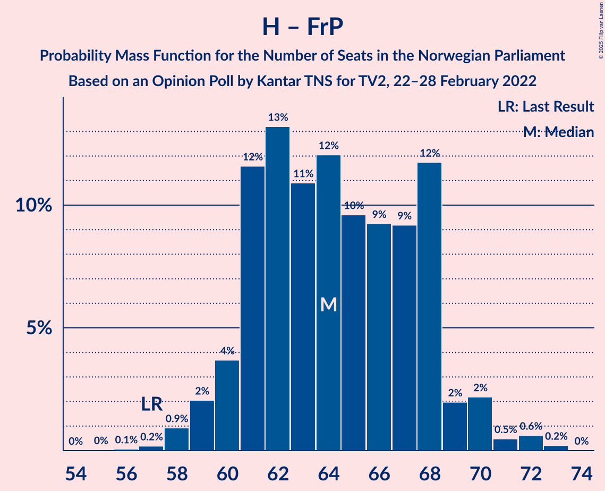

| Number of Seats | Probability | Accumulated | Special Marks |
|:---------------:|:-----------:|:-----------:|:-------------:|
| 56 | 0.1% | 100% |  |
| 57 | 0.2% | 99.9% | Last Result |
| 58 | 0.9% | 99.7% |  |
| 59 | 2% | 98.8% |  |
| 60 | 4% | 97% |  |
| 61 | 12% | 93% |  |
| 62 | 13% | 81% |  |
| 63 | 11% | 68% |  |
| 64 | 12% | 57% |  |
| 65 | 10% | 45% | Median |
| 66 | 9% | 36% |  |
| 67 | 9% | 26% |  |
| 68 | 12% | 17% |  |
| 69 | 2% | 5% |  |
| 70 | 2% | 4% |  |
| 71 | 0.5% | 1.3% |  |
| 72 | 0.6% | 0.8% |  |
| 73 | 0.2% | 0.2% |  |
| 74 | 0% | 0% |  |

### Arbeiderpartiet – Senterpartiet – Kristelig Folkeparti

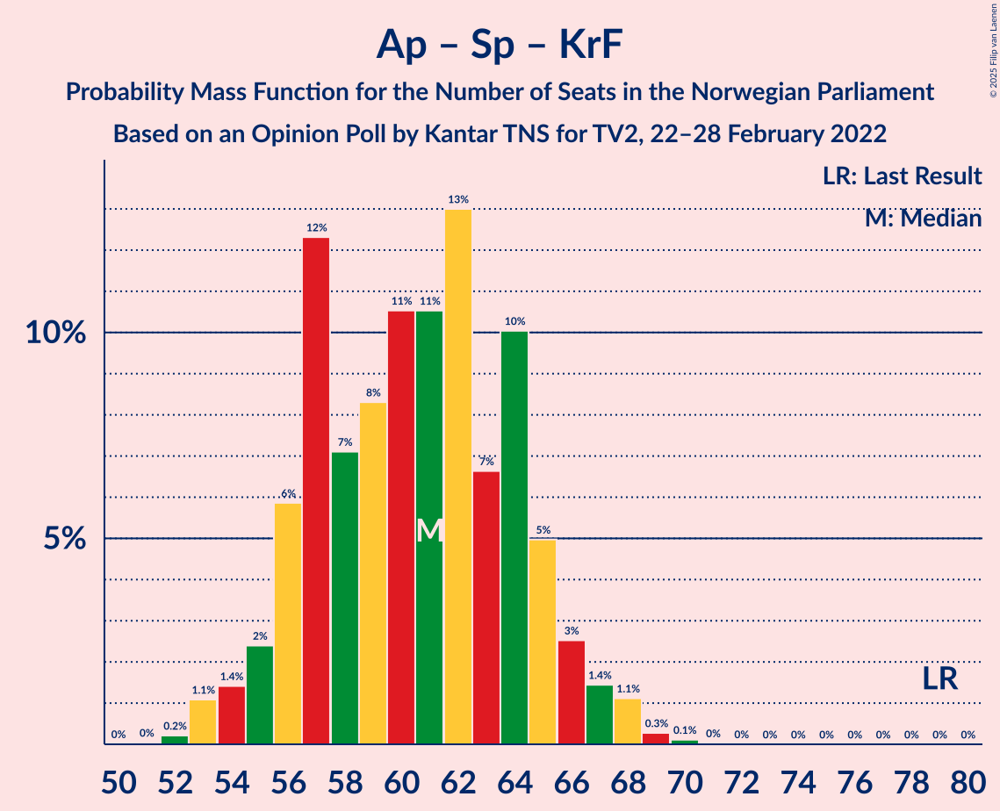

| Number of Seats | Probability | Accumulated | Special Marks |
|:---------------:|:-----------:|:-----------:|:-------------:|
| 51 | 0% | 100% |  |
| 52 | 0.2% | 99.9% |  |
| 53 | 1.1% | 99.7% |  |
| 54 | 1.4% | 98.6% |  |
| 55 | 2% | 97% |  |
| 56 | 6% | 95% |  |
| 57 | 12% | 89% |  |
| 58 | 7% | 77% |  |
| 59 | 8% | 70% | Median |
| 60 | 11% | 61% |  |
| 61 | 11% | 51% |  |
| 62 | 13% | 40% |  |
| 63 | 7% | 27% |  |
| 64 | 10% | 21% |  |
| 65 | 5% | 10% |  |
| 66 | 3% | 6% |  |
| 67 | 1.4% | 3% |  |
| 68 | 1.1% | 2% |  |
| 69 | 0.3% | 0.4% |  |
| 70 | 0.1% | 0.2% |  |
| 71 | 0% | 0% |  |
| 72 | 0% | 0% |  |
| 73 | 0% | 0% |  |
| 74 | 0% | 0% |  |
| 75 | 0% | 0% |  |
| 76 | 0% | 0% |  |
| 77 | 0% | 0% |  |
| 78 | 0% | 0% |  |
| 79 | 0% | 0% | Last Result |

### Høyre – Venstre – Kristelig Folkeparti

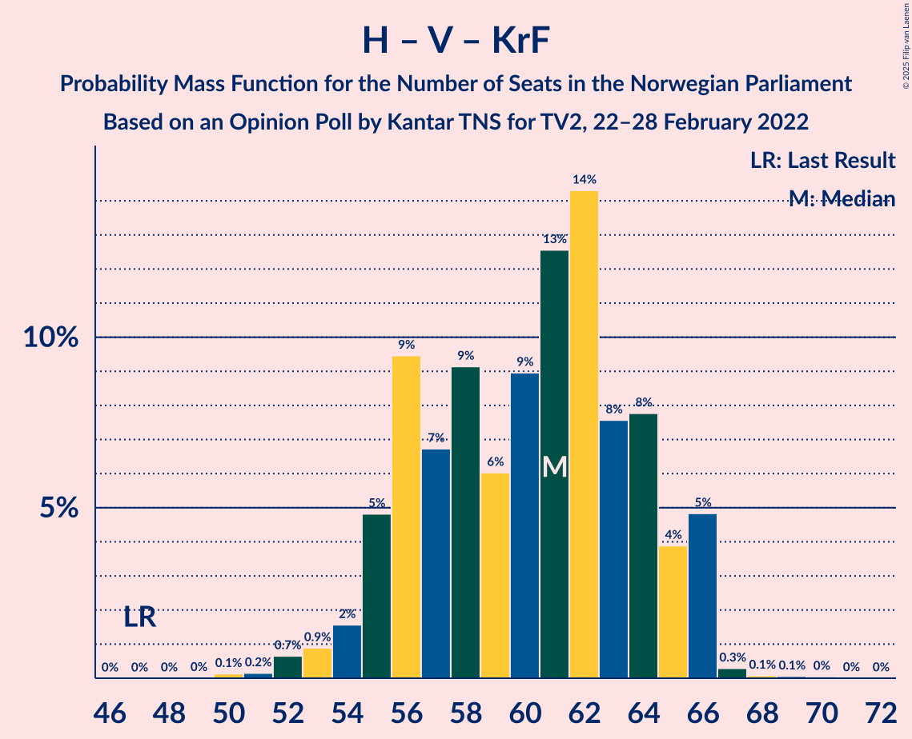

| Number of Seats | Probability | Accumulated | Special Marks |
|:---------------:|:-----------:|:-----------:|:-------------:|
| 47 | 0% | 100% | Last Result |
| 48 | 0% | 100% |  |
| 49 | 0% | 100% |  |
| 50 | 0.1% | 100% |  |
| 51 | 0.2% | 99.8% |  |
| 52 | 0.7% | 99.7% |  |
| 53 | 0.9% | 99.0% |  |
| 54 | 2% | 98% |  |
| 55 | 5% | 97% |  |
| 56 | 9% | 92% |  |
| 57 | 7% | 82% |  |
| 58 | 9% | 76% |  |
| 59 | 6% | 66% | Median |
| 60 | 9% | 60% |  |
| 61 | 13% | 51% |  |
| 62 | 14% | 39% |  |
| 63 | 8% | 25% |  |
| 64 | 8% | 17% |  |
| 65 | 4% | 9% |  |
| 66 | 5% | 5% |  |
| 67 | 0.3% | 0.5% |  |
| 68 | 0.1% | 0.2% |  |
| 69 | 0.1% | 0.1% |  |
| 70 | 0% | 0.1% |  |
| 71 | 0% | 0% |  |

### Arbeiderpartiet – Sosialistisk Venstreparti

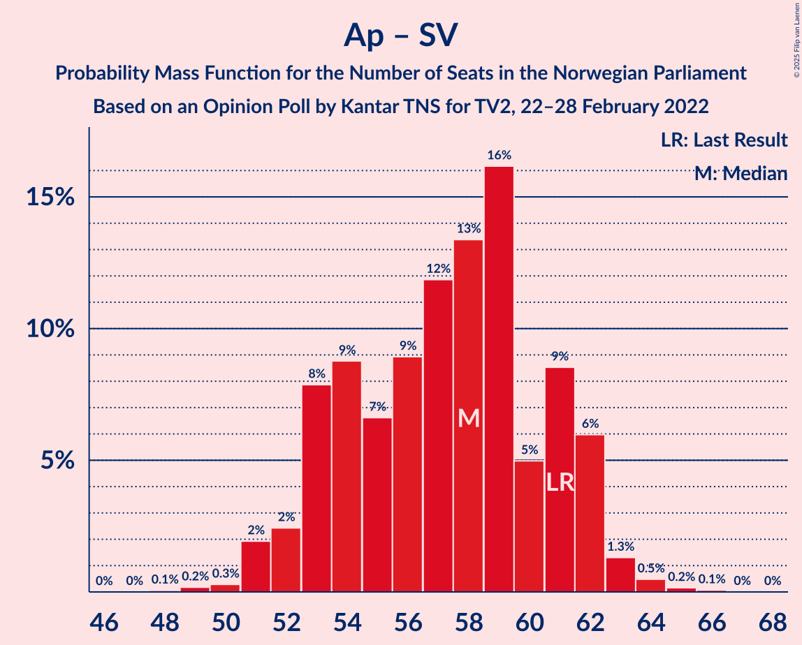

| Number of Seats | Probability | Accumulated | Special Marks |
|:---------------:|:-----------:|:-----------:|:-------------:|
| 48 | 0.1% | 100% |  |
| 49 | 0.2% | 99.9% |  |
| 50 | 0.3% | 99.8% |  |
| 51 | 2% | 99.5% |  |
| 52 | 2% | 98% |  |
| 53 | 8% | 95% |  |
| 54 | 9% | 87% |  |
| 55 | 7% | 78% |  |
| 56 | 9% | 72% |  |
| 57 | 12% | 63% | Median |
| 58 | 13% | 51% |  |
| 59 | 16% | 38% |  |
| 60 | 5% | 22% |  |
| 61 | 9% | 17% | Last Result |
| 62 | 6% | 8% |  |
| 63 | 1.3% | 2% |  |
| 64 | 0.5% | 0.7% |  |
| 65 | 0.2% | 0.2% |  |
| 66 | 0.1% | 0.1% |  |
| 67 | 0% | 0% |  |

### Arbeiderpartiet – Senterpartiet

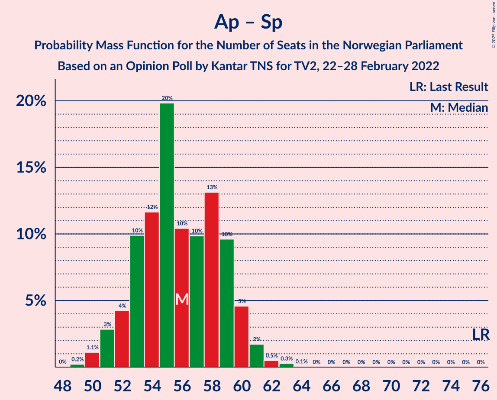

| Number of Seats | Probability | Accumulated | Special Marks |
|:---------------:|:-----------:|:-----------:|:-------------:|
| 48 | 0% | 100% |  |
| 49 | 0.2% | 99.9% |  |
| 50 | 1.1% | 99.7% |  |
| 51 | 3% | 98.6% |  |
| 52 | 4% | 96% |  |
| 53 | 10% | 92% |  |
| 54 | 12% | 82% |  |
| 55 | 20% | 70% |  |
| 56 | 10% | 50% | Median |
| 57 | 10% | 40% |  |
| 58 | 13% | 30% |  |
| 59 | 10% | 17% |  |
| 60 | 5% | 7% |  |
| 61 | 2% | 3% |  |
| 62 | 0.5% | 0.8% |  |
| 63 | 0.3% | 0.3% |  |
| 64 | 0.1% | 0.1% |  |
| 65 | 0% | 0% |  |
| 66 | 0% | 0% |  |
| 67 | 0% | 0% |  |
| 68 | 0% | 0% |  |
| 69 | 0% | 0% |  |
| 70 | 0% | 0% |  |
| 71 | 0% | 0% |  |
| 72 | 0% | 0% |  |
| 73 | 0% | 0% |  |
| 74 | 0% | 0% |  |
| 75 | 0% | 0% |  |
| 76 | 0% | 0% | Last Result |

### Senterpartiet – Venstre – Kristelig Folkeparti

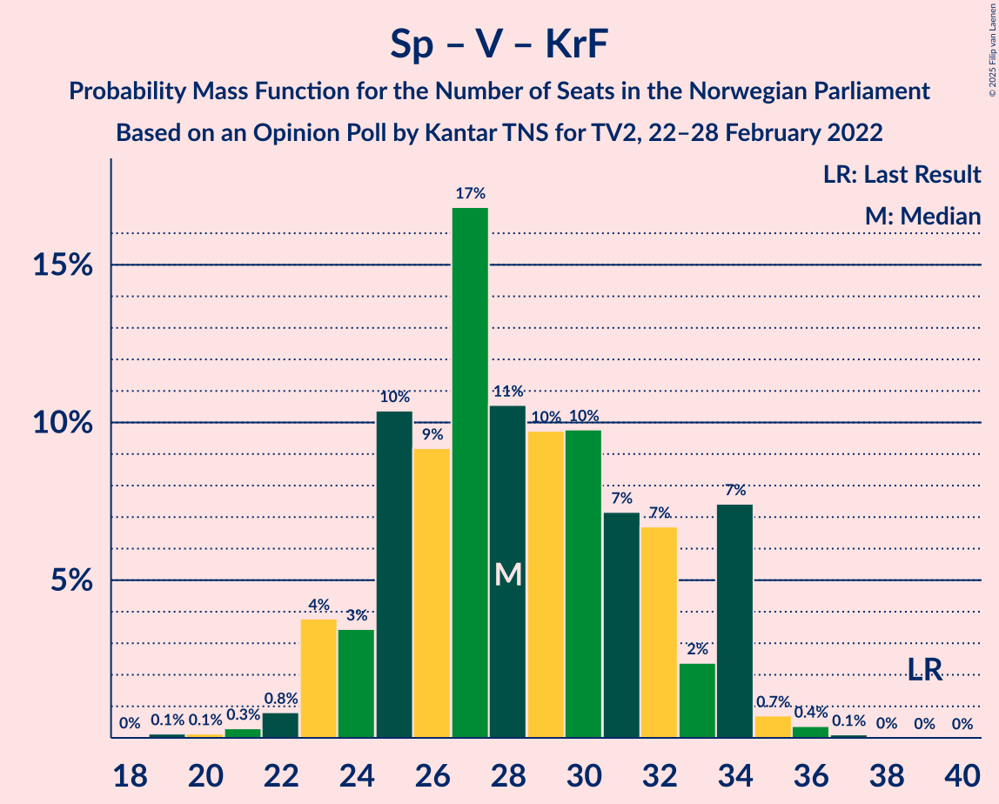

| Number of Seats | Probability | Accumulated | Special Marks |
|:---------------:|:-----------:|:-----------:|:-------------:|
| 19 | 0.1% | 100% |  |
| 20 | 0.1% | 99.8% |  |
| 21 | 0.3% | 99.7% |  |
| 22 | 0.8% | 99.4% |  |
| 23 | 4% | 98.6% |  |
| 24 | 3% | 95% |  |
| 25 | 10% | 91% |  |
| 26 | 9% | 81% |  |
| 27 | 17% | 72% | Median |
| 28 | 11% | 55% |  |
| 29 | 10% | 44% |  |
| 30 | 10% | 35% |  |
| 31 | 7% | 25% |  |
| 32 | 7% | 18% |  |
| 33 | 2% | 11% |  |
| 34 | 7% | 9% |  |
| 35 | 0.7% | 1.2% |  |
| 36 | 0.4% | 0.5% |  |
| 37 | 0.1% | 0.1% |  |
| 38 | 0% | 0% |  |
| 39 | 0% | 0% | Last Result |

## Technical Information

### Opinion Poll

+ **Polling firm:** Kantar TNS
+ **Commissioner(s):** TV2
+ **Fieldwork period:** 22–28 February 2022

### Calculations

+ **Sample size:** 1303
+ **Simulations done:** 1,048,576
+ **Error estimate:** 2.91%

