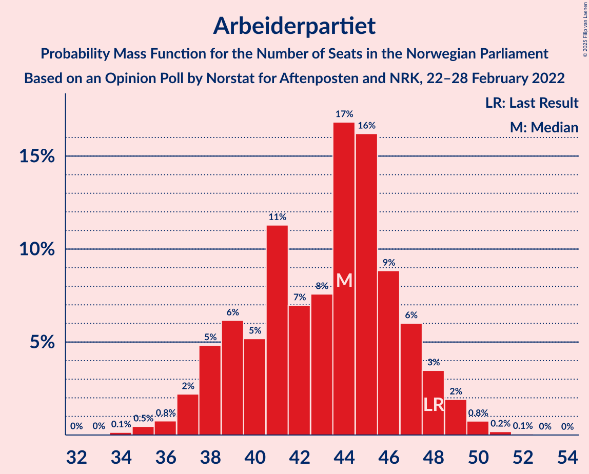

# Opinion Poll by Norstat for Aftenposten and NRK, 22–28 February 2022

<a href="#voting-intentions">Voting Intentions</a> | <a href="#seats">Seats</a> | <a href="#coalitions">Coalitions</a> | <a href="#technical-information">Technical Information</a>

## Voting Intentions

### Confidence Intervals

| Party | Last Result | Poll Result | 80% Confidence Interval | 90% Confidence Interval | 95% Confidence Interval | 99% Confidence Interval |
|:-----:|:-----------:|:-----------:|:-----------------------:|:-----------------------:|:-----------------------:|:-----------------------:|
| Høyre | 20.4% | 24.9% | 22.9–27.0% |22.3–27.6% |21.9–28.1% |21.0–29.2% |
| Arbeiderpartiet | 26.2% | 22.6% | 20.7–24.6% |20.1–25.2% |19.7–25.7% |18.8–26.7% |
| Fremskrittspartiet | 11.6% | 10.9% | 9.5–12.5% |9.1–12.9% |8.8–13.3% |8.2–14.1% |
| Senterpartiet | 13.5% | 9.1% | 7.9–10.6% |7.5–11.0% |7.2–11.4% |6.7–12.2% |
| Rødt | 4.7% | 8.8% | 7.6–10.3% |7.3–10.7% |7.0–11.1% |6.4–11.9% |
| Sosialistisk Venstreparti | 7.6% | 7.9% | 6.7–9.3% |6.4–9.7% |6.1–10.1% |5.6–10.8% |
| Venstre | 4.6% | 4.3% | 3.5–5.5% |3.3–5.8% |3.1–6.1% |2.7–6.7% |
| Kristelig Folkeparti | 3.8% | 4.2% | 3.4–5.3% |3.2–5.6% |3.0–5.9% |2.6–6.5% |
| Miljøpartiet De Grønne | 3.9% | 3.4% | 2.7–4.4% |2.5–4.7% |2.3–5.0% |2.0–5.5% |

*Note:* The poll result column reflects the actual value used in the calculations. Published results may vary slightly, and in addition be rounded to fewer digits.

## Seats

### Confidence Intervals

| Party | Last Result | Median | 80% Confidence Interval | 90% Confidence Interval | 95% Confidence Interval | 99% Confidence Interval |
|:-----:|:-----------:|:------:|:-----------------------:|:-----------------------:|:-----------------------:|:-----------------------:|
| <a href="#høyre">Høyre</a> | 36 | 44 | 41–47 |40–48 |40–50 |37–52 |
| <a href="#arbeiderpartiet">Arbeiderpartiet</a> | 48 | 44 | 39–47 |38–48 |37–49 |35–50 |
| <a href="#fremskrittspartiet">Fremskrittspartiet</a> | 21 | 18 | 17–21 |17–22 |16–23 |13–25 |
| <a href="#senterpartiet">Senterpartiet</a> | 28 | 16 | 14–18 |13–19 |12–20 |12–22 |
| <a href="#rødt">Rødt</a> | 8 | 15 | 12–17 |11–18 |11–19 |10–21 |
| <a href="#sosialistisk-venstreparti">Sosialistisk Venstreparti</a> | 13 | 13 | 10–16 |10–17 |9–18 |8–19 |
| <a href="#venstre">Venstre</a> | 8 | 7 | 2–9 |2–9 |2–10 |2–11 |
| <a href="#kristelig-folkeparti">Kristelig Folkeparti</a> | 3 | 7 | 3–9 |2–9 |2–10 |2–11 |
| <a href="#miljøpartiet-de-grønne">Miljøpartiet De Grønne</a> | 3 | 2 | 1–7 |1–8 |1–8 |1–9 |

### Høyre

*For a full overview of the results for this party, see the [Høyre](party-høyre.html) page.*

| Number of Seats | Probability | Accumulated | Special Marks |
|:---------------:|:-----------:|:-----------:|:-------------:|
| 36 | 0.1% | 100% | Last Result |
| 37 | 0.4% | 99.8% |  |
| 38 | 0.7% | 99.5% |  |
| 39 | 1.2% | 98.8% |  |
| 40 | 6% | 98% |  |
| 41 | 13% | 92% |  |
| 42 | 9% | 79% |  |
| 43 | 12% | 70% |  |
| 44 | 13% | 58% | Median |
| 45 | 19% | 45% |  |
| 46 | 11% | 26% |  |
| 47 | 6% | 15% |  |
| 48 | 5% | 9% |  |
| 49 | 1.5% | 4% |  |
| 50 | 2% | 3% |  |
| 51 | 0.5% | 1.1% |  |
| 52 | 0.4% | 0.6% |  |
| 53 | 0.1% | 0.2% |  |
| 54 | 0% | 0.1% |  |
| 55 | 0.1% | 0.1% |  |
| 56 | 0% | 0% |  |

### Arbeiderpartiet

*For a full overview of the results for this party, see the [Arbeiderpartiet](party-arbeiderpartiet.html) page.*

| Number of Seats | Probability | Accumulated | Special Marks |
|:---------------:|:-----------:|:-----------:|:-------------:|
| 32 | 0% | 100% |  |
| 33 | 0% | 99.9% |  |
| 34 | 0.1% | 99.9% |  |
| 35 | 0.5% | 99.8% |  |
| 36 | 0.8% | 99.3% |  |
| 37 | 2% | 98.5% |  |
| 38 | 5% | 96% |  |
| 39 | 6% | 92% |  |
| 40 | 5% | 85% |  |
| 41 | 11% | 80% |  |
| 42 | 7% | 69% |  |
| 43 | 8% | 62% |  |
| 44 | 17% | 54% | Median |
| 45 | 16% | 37% |  |
| 46 | 9% | 21% |  |
| 47 | 6% | 12% |  |
| 48 | 3% | 6% | Last Result |
| 49 | 2% | 3% |  |
| 50 | 0.8% | 1.0% |  |
| 51 | 0.2% | 0.3% |  |
| 52 | 0.1% | 0.1% |  |
| 53 | 0% | 0% |  |

### Fremskrittspartiet

*For a full overview of the results for this party, see the [Fremskrittspartiet](party-fremskrittspartiet.html) page.*

| Number of Seats | Probability | Accumulated | Special Marks |
|:---------------:|:-----------:|:-----------:|:-------------:|
| 11 | 0% | 100% |  |
| 12 | 0.2% | 99.9% |  |
| 13 | 0.4% | 99.8% |  |
| 14 | 0.4% | 99.4% |  |
| 15 | 1.4% | 99.0% |  |
| 16 | 2% | 98% |  |
| 17 | 17% | 95% |  |
| 18 | 30% | 79% | Median |
| 19 | 16% | 48% |  |
| 20 | 16% | 32% |  |
| 21 | 8% | 16% | Last Result |
| 22 | 4% | 8% |  |
| 23 | 2% | 4% |  |
| 24 | 0.8% | 2% |  |
| 25 | 0.4% | 0.7% |  |
| 26 | 0.1% | 0.3% |  |
| 27 | 0.1% | 0.1% |  |
| 28 | 0% | 0.1% |  |
| 29 | 0% | 0% |  |

### Senterpartiet

*For a full overview of the results for this party, see the [Senterpartiet](party-senterpartiet.html) page.*

| Number of Seats | Probability | Accumulated | Special Marks |
|:---------------:|:-----------:|:-----------:|:-------------:|
| 10 | 0.1% | 100% |  |
| 11 | 0.3% | 99.9% |  |
| 12 | 3% | 99.6% |  |
| 13 | 4% | 97% |  |
| 14 | 9% | 93% |  |
| 15 | 24% | 84% |  |
| 16 | 24% | 60% | Median |
| 17 | 13% | 36% |  |
| 18 | 18% | 24% |  |
| 19 | 2% | 6% |  |
| 20 | 2% | 3% |  |
| 21 | 0.9% | 1.5% |  |
| 22 | 0.3% | 0.5% |  |
| 23 | 0.1% | 0.2% |  |
| 24 | 0% | 0.1% |  |
| 25 | 0% | 0.1% |  |
| 26 | 0% | 0% |  |
| 27 | 0% | 0% |  |
| 28 | 0% | 0% | Last Result |

### Rødt

*For a full overview of the results for this party, see the [Rødt](party-rødt.html) page.*

| Number of Seats | Probability | Accumulated | Special Marks |
|:---------------:|:-----------:|:-----------:|:-------------:|
| 8 | 0% | 100% | Last Result |
| 9 | 0.3% | 100% |  |
| 10 | 1.2% | 99.7% |  |
| 11 | 5% | 98% |  |
| 12 | 8% | 93% |  |
| 13 | 13% | 85% |  |
| 14 | 21% | 73% |  |
| 15 | 15% | 51% | Median |
| 16 | 13% | 36% |  |
| 17 | 14% | 23% |  |
| 18 | 4% | 9% |  |
| 19 | 3% | 4% |  |
| 20 | 1.1% | 2% |  |
| 21 | 0.5% | 0.6% |  |
| 22 | 0.1% | 0.1% |  |
| 23 | 0.1% | 0.1% |  |
| 24 | 0% | 0% |  |

### Sosialistisk Venstreparti

*For a full overview of the results for this party, see the [Sosialistisk Venstreparti](party-sosialistiskvenstreparti.html) page.*

| Number of Seats | Probability | Accumulated | Special Marks |
|:---------------:|:-----------:|:-----------:|:-------------:|
| 7 | 0.1% | 100% |  |
| 8 | 0.8% | 99.9% |  |
| 9 | 3% | 99.2% |  |
| 10 | 7% | 96% |  |
| 11 | 13% | 89% |  |
| 12 | 16% | 76% |  |
| 13 | 15% | 60% | Last Result, Median |
| 14 | 18% | 46% |  |
| 15 | 15% | 27% |  |
| 16 | 6% | 12% |  |
| 17 | 3% | 6% |  |
| 18 | 2% | 3% |  |
| 19 | 0.7% | 0.9% |  |
| 20 | 0.1% | 0.2% |  |
| 21 | 0.1% | 0.1% |  |
| 22 | 0% | 0% |  |

### Venstre

*For a full overview of the results for this party, see the [Venstre](party-venstre.html) page.*

| Number of Seats | Probability | Accumulated | Special Marks |
|:---------------:|:-----------:|:-----------:|:-------------:|
| 2 | 15% | 100% |  |
| 3 | 19% | 85% |  |
| 4 | 0% | 67% |  |
| 5 | 0.3% | 67% |  |
| 6 | 5% | 66% |  |
| 7 | 22% | 61% | Median |
| 8 | 24% | 39% | Last Result |
| 9 | 11% | 14% |  |
| 10 | 3% | 4% |  |
| 11 | 0.6% | 1.0% |  |
| 12 | 0.4% | 0.4% |  |
| 13 | 0% | 0% |  |

### Kristelig Folkeparti

*For a full overview of the results for this party, see the [Kristelig Folkeparti](party-kristeligfolkeparti.html) page.*

| Number of Seats | Probability | Accumulated | Special Marks |
|:---------------:|:-----------:|:-----------:|:-------------:|
| 1 | 0.1% | 100% |  |
| 2 | 9% | 99.9% |  |
| 3 | 28% | 91% | Last Result |
| 4 | 0% | 63% |  |
| 5 | 0.1% | 63% |  |
| 6 | 5% | 63% |  |
| 7 | 30% | 58% | Median |
| 8 | 17% | 28% |  |
| 9 | 7% | 11% |  |
| 10 | 3% | 4% |  |
| 11 | 0.5% | 0.6% |  |
| 12 | 0.1% | 0.2% |  |
| 13 | 0% | 0% |  |

### Miljøpartiet De Grønne

*For a full overview of the results for this party, see the [Miljøpartiet De Grønne](party-miljøpartietdegrønne.html) page.*

| Number of Seats | Probability | Accumulated | Special Marks |
|:---------------:|:-----------:|:-----------:|:-------------:|
| 1 | 14% | 100% |  |
| 2 | 54% | 86% | Median |
| 3 | 11% | 32% | Last Result |
| 4 | 0% | 21% |  |
| 5 | 0.7% | 21% |  |
| 6 | 3% | 21% |  |
| 7 | 11% | 17% |  |
| 8 | 5% | 6% |  |
| 9 | 0.6% | 0.8% |  |
| 10 | 0.1% | 0.1% |  |
| 11 | 0% | 0% |  |

## Coalitions

### Confidence Intervals

| Coalition | Last Result | Median | Majority? | 80% Confidence Interval | 90% Confidence Interval | 95% Confidence Interval | 99% Confidence Interval |
|:---------:|:-----------:|:------:|:---------:|:-----------------------:|:-----------------------:|:-----------------------:|:-----------------------:|
| Høyre – Fremskrittspartiet – Senterpartiet – Venstre – Kristelig Folkeparti | 96 | 90 | 95% | 86–96 | 85–98 | 83–99 | 80–101 |
| Arbeiderpartiet – Senterpartiet – Rødt – Sosialistisk Venstreparti – Miljøpartiet De Grønne | 100 | 90 | 92% | 85–95 | 83–96 | 82–98 | 80–101 |
| Arbeiderpartiet – Senterpartiet – Rødt – Sosialistisk Venstreparti | 97 | 87 | 76% | 82–92 | 80–93 | 79–95 | 77–97 |
| Arbeiderpartiet – Senterpartiet – Sosialistisk Venstreparti – Kristelig Folkeparti – Miljøpartiet De Grønne | 95 | 81 | 17% | 76–86 | 75–87 | 73–89 | 71–92 |
| Høyre – Fremskrittspartiet – Venstre – Kristelig Folkeparti – Miljøpartiet De Grønne | 71 | 78 | 5% | 73–82 | 72–84 | 71–85 | 68–88 |
| Arbeiderpartiet – Senterpartiet – Sosialistisk Venstreparti – Miljøpartiet De Grønne | 92 | 76 | 0.7% | 71–79 | 70–82 | 68–83 | 66–85 |
| Høyre – Fremskrittspartiet – Venstre – Kristelig Folkeparti | 68 | 74 | 0.7% | 70–80 | 69–81 | 67–83 | 64–85 |
| Arbeiderpartiet – Rødt – Sosialistisk Venstreparti – Miljøpartiet De Grønne | 72 | 74 | 0.7% | 69–79 | 67–81 | 66–82 | 63–85 |
| Arbeiderpartiet – Senterpartiet – Sosialistisk Venstreparti | 89 | 73 | 0.1% | 68–75 | 67–77 | 66–79 | 63–82 |
| Høyre – Fremskrittspartiet – Venstre | 65 | 69 | 0% | 64–73 | 63–75 | 62–76 | 60–78 |
| Arbeiderpartiet – Senterpartiet – Kristelig Folkeparti – Miljøpartiet De Grønne | 82 | 68 | 0% | 63–73 | 60–75 | 60–76 | 57–79 |
| Arbeiderpartiet – Senterpartiet – Kristelig Folkeparti | 79 | 65 | 0% | 60–70 | 58–71 | 57–72 | 55–75 |
| Høyre – Fremskrittspartiet | 57 | 63 | 0% | 59–67 | 58–68 | 57–69 | 55–72 |
| Arbeiderpartiet – Senterpartiet | 76 | 60 | 0% | 55–63 | 53–64 | 52–65 | 51–67 |
| Høyre – Venstre – Kristelig Folkeparti | 47 | 56 | 0% | 52–60 | 50–62 | 49–64 | 46–66 |
| Arbeiderpartiet – Sosialistisk Venstreparti | 61 | 57 | 0% | 52–60 | 51–61 | 49–62 | 48–65 |
| Senterpartiet – Venstre – Kristelig Folkeparti | 39 | 28 | 0% | 22–32 | 21–34 | 21–35 | 19–37 |

### Høyre – Fremskrittspartiet – Senterpartiet – Venstre – Kristelig Folkeparti

| Number of Seats | Probability | Accumulated | Special Marks |
|:---------------:|:-----------:|:-----------:|:-------------:|
| 77 | 0.1% | 100% |  |
| 78 | 0.1% | 99.9% |  |
| 79 | 0.2% | 99.8% |  |
| 80 | 0.1% | 99.6% |  |
| 81 | 0.5% | 99.4% |  |
| 82 | 0.6% | 98.9% |  |
| 83 | 1.4% | 98% |  |
| 84 | 2% | 97% |  |
| 85 | 2% | 95% | Majority |
| 86 | 7% | 93% |  |
| 87 | 8% | 85% |  |
| 88 | 8% | 77% |  |
| 89 | 7% | 69% |  |
| 90 | 16% | 62% |  |
| 91 | 9% | 46% |  |
| 92 | 5% | 37% | Median |
| 93 | 5% | 32% |  |
| 94 | 6% | 28% |  |
| 95 | 11% | 22% |  |
| 96 | 4% | 11% | Last Result |
| 97 | 2% | 7% |  |
| 98 | 2% | 5% |  |
| 99 | 2% | 3% |  |
| 100 | 0.8% | 1.3% |  |
| 101 | 0.2% | 0.5% |  |
| 102 | 0.1% | 0.4% |  |
| 103 | 0.2% | 0.2% |  |
| 104 | 0% | 0.1% |  |
| 105 | 0% | 0% |  |

### Arbeiderpartiet – Senterpartiet – Rødt – Sosialistisk Venstreparti – Miljøpartiet De Grønne

| Number of Seats | Probability | Accumulated | Special Marks |
|:---------------:|:-----------:|:-----------:|:-------------:|
| 77 | 0% | 100% |  |
| 78 | 0.2% | 99.9% |  |
| 79 | 0.1% | 99.7% |  |
| 80 | 0.4% | 99.6% |  |
| 81 | 1.2% | 99.2% |  |
| 82 | 2% | 98% |  |
| 83 | 2% | 96% |  |
| 84 | 2% | 94% |  |
| 85 | 4% | 92% | Majority |
| 86 | 7% | 88% |  |
| 87 | 6% | 81% |  |
| 88 | 7% | 75% |  |
| 89 | 14% | 68% |  |
| 90 | 8% | 54% | Median |
| 91 | 5% | 46% |  |
| 92 | 11% | 41% |  |
| 93 | 5% | 30% |  |
| 94 | 13% | 25% |  |
| 95 | 3% | 11% |  |
| 96 | 4% | 8% |  |
| 97 | 2% | 5% |  |
| 98 | 1.4% | 3% |  |
| 99 | 0.8% | 2% |  |
| 100 | 0.6% | 1.1% | Last Result |
| 101 | 0.2% | 0.5% |  |
| 102 | 0.1% | 0.3% |  |
| 103 | 0.1% | 0.2% |  |
| 104 | 0% | 0.1% |  |
| 105 | 0% | 0.1% |  |
| 106 | 0% | 0% |  |

### Arbeiderpartiet – Senterpartiet – Rødt – Sosialistisk Venstreparti

| Number of Seats | Probability | Accumulated | Special Marks |
|:---------------:|:-----------:|:-----------:|:-------------:|
| 73 | 0% | 100% |  |
| 74 | 0.1% | 99.9% |  |
| 75 | 0.1% | 99.9% |  |
| 76 | 0.2% | 99.8% |  |
| 77 | 0.6% | 99.5% |  |
| 78 | 0.4% | 98.9% |  |
| 79 | 2% | 98.6% |  |
| 80 | 2% | 97% |  |
| 81 | 4% | 94% |  |
| 82 | 3% | 90% |  |
| 83 | 4% | 87% |  |
| 84 | 7% | 83% |  |
| 85 | 7% | 76% | Majority |
| 86 | 6% | 69% |  |
| 87 | 23% | 62% |  |
| 88 | 5% | 40% | Median |
| 89 | 6% | 35% |  |
| 90 | 9% | 29% |  |
| 91 | 4% | 19% |  |
| 92 | 9% | 15% |  |
| 93 | 2% | 7% |  |
| 94 | 0.8% | 5% |  |
| 95 | 2% | 4% |  |
| 96 | 0.8% | 2% |  |
| 97 | 1.0% | 1.3% | Last Result |
| 98 | 0.1% | 0.3% |  |
| 99 | 0.1% | 0.2% |  |
| 100 | 0.1% | 0.1% |  |
| 101 | 0% | 0% |  |

### Arbeiderpartiet – Senterpartiet – Sosialistisk Venstreparti – Kristelig Folkeparti – Miljøpartiet De Grønne

| Number of Seats | Probability | Accumulated | Special Marks |
|:---------------:|:-----------:|:-----------:|:-------------:|
| 67 | 0% | 100% |  |
| 68 | 0.1% | 99.9% |  |
| 69 | 0.1% | 99.9% |  |
| 70 | 0.1% | 99.8% |  |
| 71 | 0.5% | 99.7% |  |
| 72 | 0.6% | 99.3% |  |
| 73 | 1.3% | 98.7% |  |
| 74 | 1.4% | 97% |  |
| 75 | 2% | 96% |  |
| 76 | 5% | 94% |  |
| 77 | 6% | 89% |  |
| 78 | 11% | 83% |  |
| 79 | 9% | 73% |  |
| 80 | 8% | 64% |  |
| 81 | 7% | 55% |  |
| 82 | 5% | 48% | Median |
| 83 | 8% | 44% |  |
| 84 | 19% | 36% |  |
| 85 | 4% | 17% | Majority |
| 86 | 5% | 12% |  |
| 87 | 2% | 7% |  |
| 88 | 1.5% | 5% |  |
| 89 | 1.0% | 3% |  |
| 90 | 1.4% | 2% |  |
| 91 | 0.6% | 1.1% |  |
| 92 | 0.3% | 0.5% |  |
| 93 | 0.1% | 0.2% |  |
| 94 | 0% | 0.1% |  |
| 95 | 0.1% | 0.1% | Last Result |
| 96 | 0% | 0% |  |

### Høyre – Fremskrittspartiet – Venstre – Kristelig Folkeparti – Miljøpartiet De Grønne

| Number of Seats | Probability | Accumulated | Special Marks |
|:---------------:|:-----------:|:-----------:|:-------------:|
| 64 | 0% | 100% |  |
| 65 | 0.1% | 99.9% |  |
| 66 | 0.1% | 99.8% |  |
| 67 | 0.1% | 99.8% |  |
| 68 | 0.4% | 99.6% |  |
| 69 | 0.6% | 99.3% |  |
| 70 | 0.7% | 98.7% |  |
| 71 | 1.0% | 98% | Last Result |
| 72 | 5% | 97% |  |
| 73 | 7% | 92% |  |
| 74 | 5% | 85% |  |
| 75 | 9% | 79% |  |
| 76 | 13% | 71% |  |
| 77 | 6% | 57% |  |
| 78 | 8% | 51% | Median |
| 79 | 11% | 43% |  |
| 80 | 6% | 32% |  |
| 81 | 11% | 26% |  |
| 82 | 5% | 15% |  |
| 83 | 3% | 9% |  |
| 84 | 2% | 6% |  |
| 85 | 2% | 5% | Majority |
| 86 | 0.8% | 2% |  |
| 87 | 0.8% | 2% |  |
| 88 | 0.5% | 0.7% |  |
| 89 | 0.1% | 0.3% |  |
| 90 | 0% | 0.1% |  |
| 91 | 0% | 0.1% |  |
| 92 | 0% | 0% |  |

### Arbeiderpartiet – Senterpartiet – Sosialistisk Venstreparti – Miljøpartiet De Grønne

| Number of Seats | Probability | Accumulated | Special Marks |
|:---------------:|:-----------:|:-----------:|:-------------:|
| 63 | 0% | 100% |  |
| 64 | 0.1% | 99.9% |  |
| 65 | 0.1% | 99.8% |  |
| 66 | 0.4% | 99.7% |  |
| 67 | 0.7% | 99.4% |  |
| 68 | 2% | 98.7% |  |
| 69 | 2% | 97% |  |
| 70 | 3% | 95% |  |
| 71 | 6% | 92% |  |
| 72 | 6% | 87% |  |
| 73 | 6% | 80% |  |
| 74 | 11% | 74% |  |
| 75 | 13% | 63% | Median |
| 76 | 9% | 50% |  |
| 77 | 20% | 41% |  |
| 78 | 8% | 22% |  |
| 79 | 4% | 14% |  |
| 80 | 2% | 10% |  |
| 81 | 2% | 8% |  |
| 82 | 2% | 5% |  |
| 83 | 2% | 3% |  |
| 84 | 0.4% | 1.1% |  |
| 85 | 0.3% | 0.7% | Majority |
| 86 | 0.2% | 0.4% |  |
| 87 | 0.1% | 0.2% |  |
| 88 | 0% | 0.1% |  |
| 89 | 0% | 0% |  |
| 90 | 0% | 0% |  |
| 91 | 0% | 0% |  |
| 92 | 0% | 0% | Last Result |

### Høyre – Fremskrittspartiet – Venstre – Kristelig Folkeparti

| Number of Seats | Probability | Accumulated | Special Marks |
|:---------------:|:-----------:|:-----------:|:-------------:|
| 61 | 0% | 100% |  |
| 62 | 0.1% | 99.9% |  |
| 63 | 0.3% | 99.9% |  |
| 64 | 0.2% | 99.6% |  |
| 65 | 0.2% | 99.5% |  |
| 66 | 1.0% | 99.3% |  |
| 67 | 0.8% | 98% |  |
| 68 | 1.4% | 97% | Last Result |
| 69 | 1.4% | 96% |  |
| 70 | 5% | 95% |  |
| 71 | 9% | 90% |  |
| 72 | 10% | 81% |  |
| 73 | 7% | 71% |  |
| 74 | 17% | 64% |  |
| 75 | 9% | 47% |  |
| 76 | 8% | 38% | Median |
| 77 | 10% | 30% |  |
| 78 | 4% | 19% |  |
| 79 | 5% | 15% |  |
| 80 | 4% | 10% |  |
| 81 | 2% | 6% |  |
| 82 | 1.0% | 4% |  |
| 83 | 1.4% | 3% |  |
| 84 | 0.6% | 1.2% |  |
| 85 | 0.3% | 0.7% | Majority |
| 86 | 0.3% | 0.4% |  |
| 87 | 0.1% | 0.1% |  |
| 88 | 0% | 0% |  |

### Arbeiderpartiet – Rødt – Sosialistisk Venstreparti – Miljøpartiet De Grønne

| Number of Seats | Probability | Accumulated | Special Marks |
|:---------------:|:-----------:|:-----------:|:-------------:|
| 61 | 0% | 100% |  |
| 62 | 0.1% | 99.9% |  |
| 63 | 0.8% | 99.8% |  |
| 64 | 0.4% | 99.1% |  |
| 65 | 0.8% | 98.7% |  |
| 66 | 1.2% | 98% |  |
| 67 | 2% | 97% |  |
| 68 | 2% | 94% |  |
| 69 | 4% | 92% |  |
| 70 | 4% | 88% |  |
| 71 | 7% | 83% |  |
| 72 | 9% | 76% | Last Result |
| 73 | 7% | 67% |  |
| 74 | 21% | 60% | Median |
| 75 | 6% | 39% |  |
| 76 | 4% | 34% |  |
| 77 | 6% | 30% |  |
| 78 | 12% | 23% |  |
| 79 | 3% | 11% |  |
| 80 | 3% | 9% |  |
| 81 | 3% | 6% |  |
| 82 | 2% | 3% |  |
| 83 | 1.0% | 2% |  |
| 84 | 0.2% | 0.9% |  |
| 85 | 0.3% | 0.7% | Majority |
| 86 | 0% | 0.4% |  |
| 87 | 0.3% | 0.3% |  |
| 88 | 0% | 0% |  |

### Arbeiderpartiet – Senterpartiet – Sosialistisk Venstreparti

| Number of Seats | Probability | Accumulated | Special Marks |
|:---------------:|:-----------:|:-----------:|:-------------:|
| 60 | 0% | 100% |  |
| 61 | 0.1% | 99.9% |  |
| 62 | 0.2% | 99.9% |  |
| 63 | 0.2% | 99.7% |  |
| 64 | 0.5% | 99.4% |  |
| 65 | 1.1% | 98.9% |  |
| 66 | 2% | 98% |  |
| 67 | 2% | 96% |  |
| 68 | 6% | 94% |  |
| 69 | 6% | 88% |  |
| 70 | 7% | 82% |  |
| 71 | 13% | 76% |  |
| 72 | 10% | 63% |  |
| 73 | 16% | 52% | Median |
| 74 | 11% | 37% |  |
| 75 | 16% | 26% |  |
| 76 | 3% | 10% |  |
| 77 | 2% | 7% |  |
| 78 | 2% | 5% |  |
| 79 | 1.2% | 3% |  |
| 80 | 0.7% | 2% |  |
| 81 | 0.5% | 1.1% |  |
| 82 | 0.4% | 0.6% |  |
| 83 | 0.2% | 0.3% |  |
| 84 | 0% | 0.1% |  |
| 85 | 0% | 0.1% | Majority |
| 86 | 0% | 0% |  |
| 87 | 0% | 0% |  |
| 88 | 0% | 0% |  |
| 89 | 0% | 0% | Last Result |

### Høyre – Fremskrittspartiet – Venstre

| Number of Seats | Probability | Accumulated | Special Marks |
|:---------------:|:-----------:|:-----------:|:-------------:|
| 57 | 0.1% | 100% |  |
| 58 | 0.1% | 99.9% |  |
| 59 | 0.2% | 99.8% |  |
| 60 | 0.8% | 99.7% |  |
| 61 | 1.0% | 98.9% |  |
| 62 | 0.7% | 98% |  |
| 63 | 2% | 97% |  |
| 64 | 5% | 95% |  |
| 65 | 4% | 90% | Last Result |
| 66 | 9% | 85% |  |
| 67 | 12% | 76% |  |
| 68 | 12% | 64% |  |
| 69 | 13% | 52% | Median |
| 70 | 10% | 39% |  |
| 71 | 10% | 29% |  |
| 72 | 4% | 19% |  |
| 73 | 6% | 15% |  |
| 74 | 3% | 9% |  |
| 75 | 2% | 6% |  |
| 76 | 2% | 4% |  |
| 77 | 1.3% | 2% |  |
| 78 | 0.5% | 0.9% |  |
| 79 | 0.1% | 0.4% |  |
| 80 | 0.1% | 0.3% |  |
| 81 | 0.1% | 0.1% |  |
| 82 | 0.1% | 0.1% |  |
| 83 | 0% | 0% |  |

### Arbeiderpartiet – Senterpartiet – Kristelig Folkeparti – Miljøpartiet De Grønne

| Number of Seats | Probability | Accumulated | Special Marks |
|:---------------:|:-----------:|:-----------:|:-------------:|
| 54 | 0% | 100% |  |
| 55 | 0% | 99.9% |  |
| 56 | 0.1% | 99.9% |  |
| 57 | 0.6% | 99.8% |  |
| 58 | 0.9% | 99.2% |  |
| 59 | 0.8% | 98% |  |
| 60 | 3% | 98% |  |
| 61 | 2% | 95% |  |
| 62 | 3% | 93% |  |
| 63 | 2% | 90% |  |
| 64 | 5% | 88% |  |
| 65 | 10% | 83% |  |
| 66 | 9% | 73% |  |
| 67 | 6% | 63% |  |
| 68 | 10% | 58% |  |
| 69 | 14% | 48% | Median |
| 70 | 5% | 35% |  |
| 71 | 4% | 29% |  |
| 72 | 13% | 25% |  |
| 73 | 3% | 12% |  |
| 74 | 4% | 9% |  |
| 75 | 2% | 6% |  |
| 76 | 1.2% | 3% |  |
| 77 | 0.9% | 2% |  |
| 78 | 0.8% | 1.3% |  |
| 79 | 0.4% | 0.5% |  |
| 80 | 0% | 0.1% |  |
| 81 | 0% | 0.1% |  |
| 82 | 0% | 0.1% | Last Result |
| 83 | 0% | 0% |  |

### Arbeiderpartiet – Senterpartiet – Kristelig Folkeparti

| Number of Seats | Probability | Accumulated | Special Marks |
|:---------------:|:-----------:|:-----------:|:-------------:|
| 52 | 0% | 100% |  |
| 53 | 0.1% | 99.9% |  |
| 54 | 0.1% | 99.8% |  |
| 55 | 0.6% | 99.7% |  |
| 56 | 1.1% | 99.1% |  |
| 57 | 1.1% | 98% |  |
| 58 | 3% | 97% |  |
| 59 | 3% | 94% |  |
| 60 | 3% | 91% |  |
| 61 | 4% | 89% |  |
| 62 | 6% | 84% |  |
| 63 | 15% | 79% |  |
| 64 | 6% | 64% |  |
| 65 | 11% | 58% |  |
| 66 | 10% | 46% |  |
| 67 | 12% | 37% | Median |
| 68 | 6% | 24% |  |
| 69 | 3% | 18% |  |
| 70 | 9% | 15% |  |
| 71 | 3% | 6% |  |
| 72 | 1.5% | 3% |  |
| 73 | 0.8% | 2% |  |
| 74 | 0.3% | 0.9% |  |
| 75 | 0.4% | 0.6% |  |
| 76 | 0.2% | 0.2% |  |
| 77 | 0% | 0.1% |  |
| 78 | 0% | 0% |  |
| 79 | 0% | 0% | Last Result |

### Høyre – Fremskrittspartiet

| Number of Seats | Probability | Accumulated | Special Marks |
|:---------------:|:-----------:|:-----------:|:-------------:|
| 52 | 0% | 100% |  |
| 53 | 0.1% | 99.9% |  |
| 54 | 0.2% | 99.9% |  |
| 55 | 0.4% | 99.7% |  |
| 56 | 0.9% | 99.2% |  |
| 57 | 1.3% | 98% | Last Result |
| 58 | 3% | 97% |  |
| 59 | 12% | 94% |  |
| 60 | 7% | 82% |  |
| 61 | 11% | 75% |  |
| 62 | 7% | 65% | Median |
| 63 | 15% | 57% |  |
| 64 | 16% | 42% |  |
| 65 | 10% | 27% |  |
| 66 | 6% | 17% |  |
| 67 | 4% | 11% |  |
| 68 | 3% | 7% |  |
| 69 | 1.3% | 4% |  |
| 70 | 1.1% | 2% |  |
| 71 | 0.7% | 1.2% |  |
| 72 | 0.3% | 0.5% |  |
| 73 | 0.1% | 0.3% |  |
| 74 | 0.1% | 0.1% |  |
| 75 | 0% | 0% |  |

### Arbeiderpartiet – Senterpartiet

| Number of Seats | Probability | Accumulated | Special Marks |
|:---------------:|:-----------:|:-----------:|:-------------:|
| 48 | 0% | 100% |  |
| 49 | 0.1% | 99.9% |  |
| 50 | 0.2% | 99.8% |  |
| 51 | 0.6% | 99.7% |  |
| 52 | 2% | 99.1% |  |
| 53 | 2% | 97% |  |
| 54 | 2% | 95% |  |
| 55 | 5% | 93% |  |
| 56 | 6% | 87% |  |
| 57 | 7% | 82% |  |
| 58 | 10% | 74% |  |
| 59 | 12% | 64% |  |
| 60 | 23% | 51% | Median |
| 61 | 6% | 28% |  |
| 62 | 5% | 23% |  |
| 63 | 12% | 18% |  |
| 64 | 2% | 6% |  |
| 65 | 2% | 4% |  |
| 66 | 0.7% | 1.3% |  |
| 67 | 0.3% | 0.7% |  |
| 68 | 0.1% | 0.3% |  |
| 69 | 0.1% | 0.2% |  |
| 70 | 0% | 0.1% |  |
| 71 | 0% | 0% |  |
| 72 | 0% | 0% |  |
| 73 | 0% | 0% |  |
| 74 | 0% | 0% |  |
| 75 | 0% | 0% |  |
| 76 | 0% | 0% | Last Result |

### Høyre – Venstre – Kristelig Folkeparti

| Number of Seats | Probability | Accumulated | Special Marks |
|:---------------:|:-----------:|:-----------:|:-------------:|
| 44 | 0% | 100% |  |
| 45 | 0.3% | 99.9% |  |
| 46 | 0.3% | 99.6% |  |
| 47 | 0.5% | 99.3% | Last Result |
| 48 | 0.8% | 98.8% |  |
| 49 | 1.3% | 98% |  |
| 50 | 2% | 97% |  |
| 51 | 3% | 94% |  |
| 52 | 12% | 92% |  |
| 53 | 5% | 80% |  |
| 54 | 14% | 75% |  |
| 55 | 7% | 61% |  |
| 56 | 13% | 54% |  |
| 57 | 5% | 40% |  |
| 58 | 11% | 35% | Median |
| 59 | 10% | 24% |  |
| 60 | 6% | 14% |  |
| 61 | 2% | 8% |  |
| 62 | 2% | 6% |  |
| 63 | 1.1% | 4% |  |
| 64 | 2% | 3% |  |
| 65 | 0.4% | 1.1% |  |
| 66 | 0.5% | 0.7% |  |
| 67 | 0.1% | 0.2% |  |
| 68 | 0% | 0.1% |  |
| 69 | 0% | 0.1% |  |
| 70 | 0% | 0% |  |

### Arbeiderpartiet – Sosialistisk Venstreparti

| Number of Seats | Probability | Accumulated | Special Marks |
|:---------------:|:-----------:|:-----------:|:-------------:|
| 45 | 0% | 100% |  |
| 46 | 0.1% | 99.9% |  |
| 47 | 0.2% | 99.8% |  |
| 48 | 1.1% | 99.6% |  |
| 49 | 1.0% | 98% |  |
| 50 | 2% | 97% |  |
| 51 | 3% | 96% |  |
| 52 | 3% | 93% |  |
| 53 | 6% | 90% |  |
| 54 | 10% | 83% |  |
| 55 | 12% | 74% |  |
| 56 | 9% | 62% |  |
| 57 | 16% | 53% | Median |
| 58 | 13% | 37% |  |
| 59 | 12% | 23% |  |
| 60 | 4% | 11% |  |
| 61 | 3% | 7% | Last Result |
| 62 | 2% | 4% |  |
| 63 | 0.9% | 2% |  |
| 64 | 0.9% | 1.5% |  |
| 65 | 0.4% | 0.6% |  |
| 66 | 0.1% | 0.1% |  |
| 67 | 0% | 0% |  |

### Senterpartiet – Venstre – Kristelig Folkeparti

| Number of Seats | Probability | Accumulated | Special Marks |
|:---------------:|:-----------:|:-----------:|:-------------:|
| 17 | 0.1% | 100% |  |
| 18 | 0.1% | 99.9% |  |
| 19 | 0.4% | 99.7% |  |
| 20 | 1.1% | 99.3% |  |
| 21 | 7% | 98% |  |
| 22 | 2% | 92% |  |
| 23 | 4% | 90% |  |
| 24 | 3% | 86% |  |
| 25 | 10% | 83% |  |
| 26 | 9% | 73% |  |
| 27 | 10% | 63% |  |
| 28 | 8% | 53% |  |
| 29 | 4% | 45% |  |
| 30 | 8% | 41% | Median |
| 31 | 13% | 32% |  |
| 32 | 12% | 19% |  |
| 33 | 2% | 7% |  |
| 34 | 2% | 6% |  |
| 35 | 2% | 3% |  |
| 36 | 0.7% | 1.3% |  |
| 37 | 0.3% | 0.6% |  |
| 38 | 0.2% | 0.3% |  |
| 39 | 0% | 0.1% | Last Result |
| 40 | 0% | 0% |  |

## Technical Information

### Opinion Poll

+ **Polling firm:** Norstat
+ **Commissioner(s):** Aftenposten and NRK
+ **Fieldwork period:** 22–28 February 2022

### Calculations

+ **Sample size:** 736
+ **Simulations done:** 1,048,576
+ **Error estimate:** 1.59%

