# Opinion Poll by Norfakta for Klassekampen and Nationen, 1–2 March 2022

<a href="#voting-intentions">Voting Intentions</a> | <a href="#seats">Seats</a> | <a href="#coalitions">Coalitions</a> | <a href="#technical-information">Technical Information</a>

## Voting Intentions

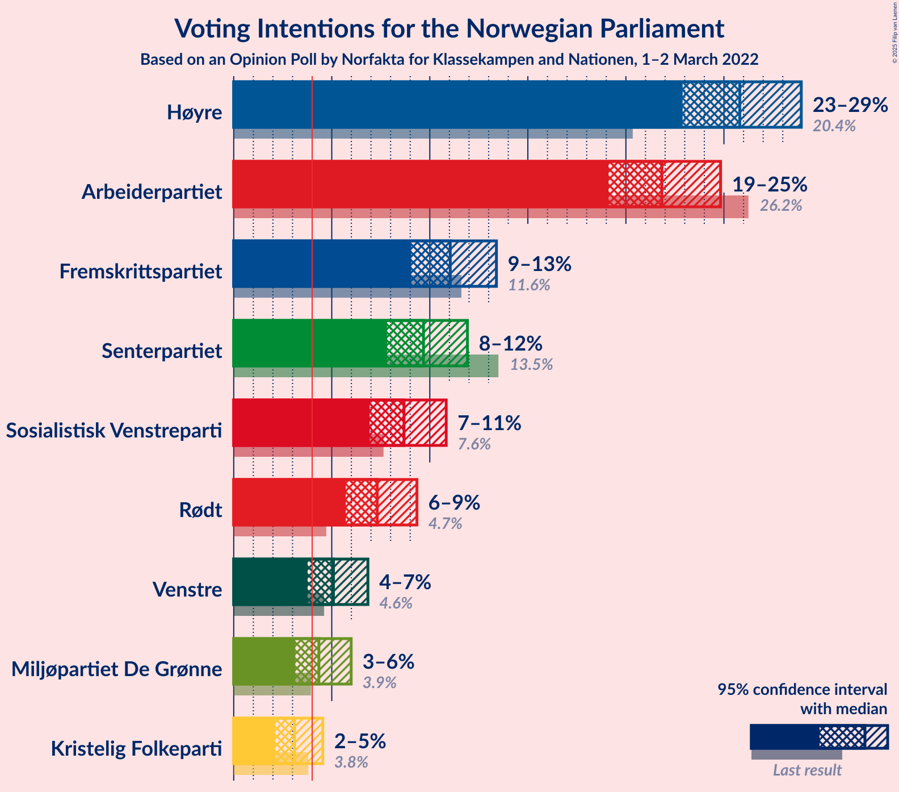

### Confidence Intervals

| Party | Last Result | Poll Result | 80% Confidence Interval | 90% Confidence Interval | 95% Confidence Interval | 99% Confidence Interval |
|:-----:|:-----------:|:-----------:|:-----------------------:|:-----------------------:|:-----------------------:|:-----------------------:|
| Høyre | 20.4% | 25.8% | 23.9–27.9% |23.4–28.4% |22.9–28.9% |22.0–29.9% |
| Arbeiderpartiet | 26.2% | 21.8% | 20.0–23.8% |19.5–24.3% |19.1–24.8% |18.3–25.8% |
| Fremskrittspartiet | 11.6% | 11.0% | 9.7–12.6% |9.4–13.0% |9.1–13.4% |8.5–14.2% |
| Senterpartiet | 13.5% | 9.7% | 8.5–11.1% |8.1–11.6% |7.8–11.9% |7.3–12.7% |
| Sosialistisk Venstreparti | 7.6% | 8.7% | 7.5–10.1% |7.2–10.5% |6.9–10.8% |6.4–11.6% |
| Rødt | 4.7% | 7.3% | 6.3–8.6% |6.0–9.0% |5.7–9.3% |5.2–10.0% |
| Venstre | 4.6% | 5.1% | 4.2–6.2% |4.0–6.6% |3.8–6.8% |3.4–7.4% |
| Miljøpartiet De Grønne | 3.9% | 4.3% | 3.6–5.4% |3.3–5.7% |3.1–6.0% |2.8–6.5% |
| Kristelig Folkeparti | 3.8% | 3.1% | 2.4–4.0% |2.3–4.3% |2.1–4.5% |1.8–5.0% |

*Note:* The poll result column reflects the actual value used in the calculations. Published results may vary slightly, and in addition be rounded to fewer digits.

## Seats

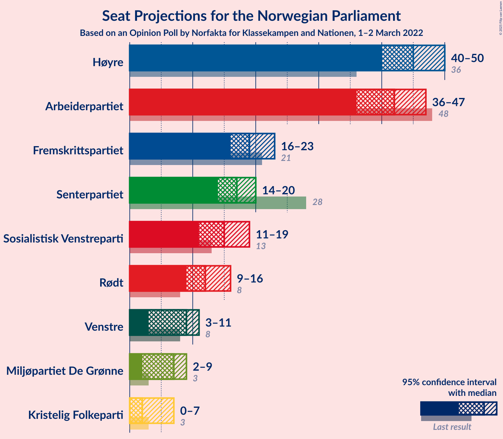

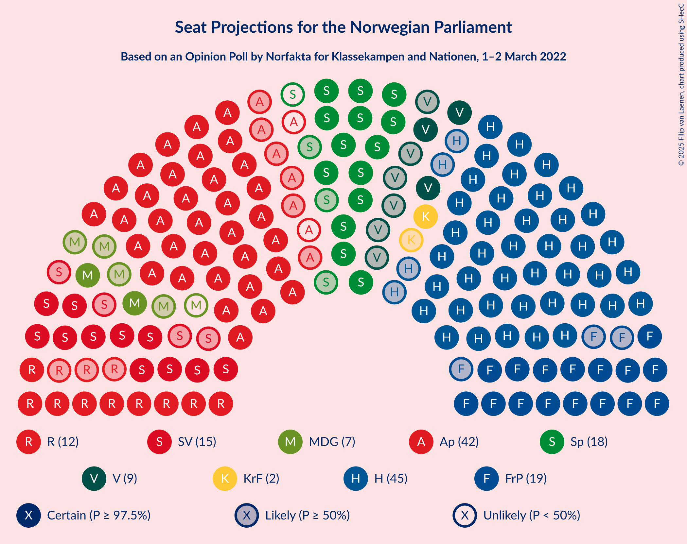

### Confidence Intervals

| Party | Last Result | Median | 80% Confidence Interval | 90% Confidence Interval | 95% Confidence Interval | 99% Confidence Interval |
|:-----:|:-----------:|:------:|:-----------------------:|:-----------------------:|:-----------------------:|:-----------------------:|
| <a href="#høyre">Høyre</a> | 36 | 45 | 42–48 |41–49 |40–50 |39–53 |
| <a href="#arbeiderpartiet">Arbeiderpartiet</a> | 48 | 42 | 38–45 |37–46 |36–47 |34–48 |
| <a href="#fremskrittspartiet">Fremskrittspartiet</a> | 21 | 19 | 17–21 |17–22 |16–23 |15–25 |
| <a href="#senterpartiet">Senterpartiet</a> | 28 | 17 | 15–19 |15–19 |14–20 |13–22 |
| <a href="#sosialistisk-venstreparti">Sosialistisk Venstreparti</a> | 13 | 15 | 12–17 |12–18 |11–19 |10–20 |
| <a href="#rødt">Rødt</a> | 8 | 12 | 11–15 |10–15 |9–16 |9–17 |
| <a href="#venstre">Venstre</a> | 8 | 9 | 7–10 |6–11 |3–11 |2–13 |
| <a href="#miljøpartiet-de-grønne">Miljøpartiet De Grønne</a> | 3 | 7 | 2–9 |2–9 |2–9 |1–11 |
| <a href="#kristelig-folkeparti">Kristelig Folkeparti</a> | 3 | 2 | 2–3 |1–7 |0–7 |0–8 |

### Høyre

*For a full overview of the results for this party, see the [Høyre](party-høyre.html) page.*

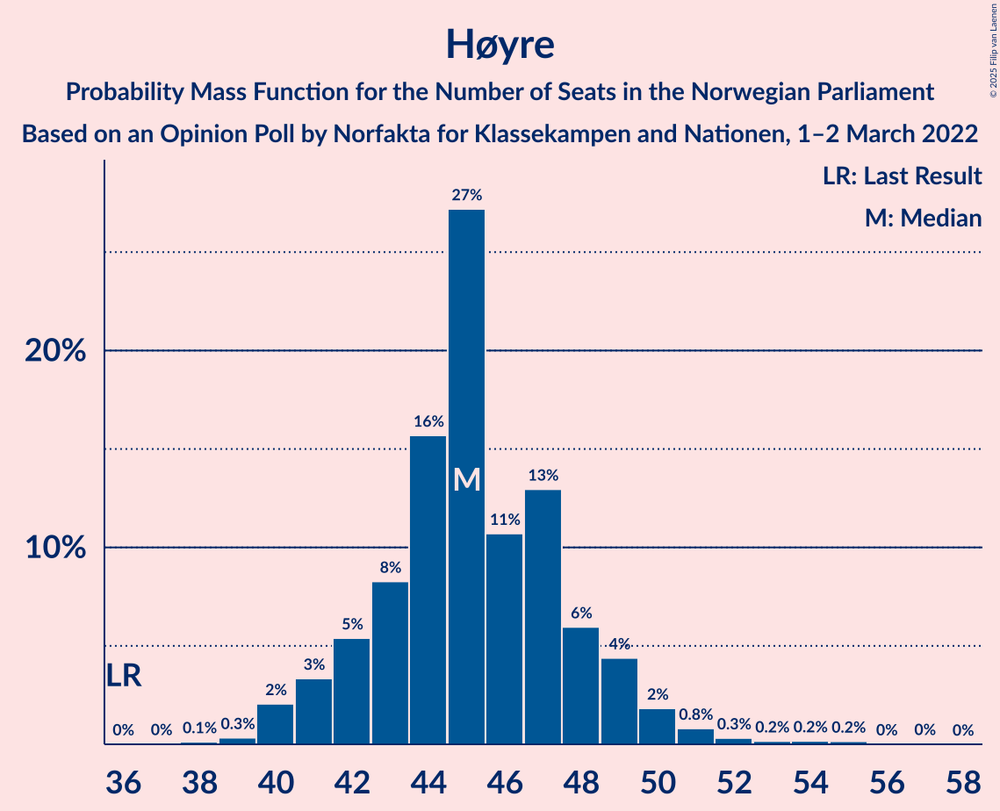

| Number of Seats | Probability | Accumulated | Special Marks |
|:---------------:|:-----------:|:-----------:|:-------------:|
| 36 | 0% | 100% | Last Result |
| 37 | 0% | 100% |  |
| 38 | 0.1% | 99.9% |  |
| 39 | 0.3% | 99.8% |  |
| 40 | 2% | 99.5% |  |
| 41 | 3% | 97% |  |
| 42 | 5% | 94% |  |
| 43 | 8% | 89% |  |
| 44 | 16% | 80% |  |
| 45 | 27% | 65% | Median |
| 46 | 11% | 38% |  |
| 47 | 13% | 27% |  |
| 48 | 6% | 14% |  |
| 49 | 4% | 8% |  |
| 50 | 2% | 4% |  |
| 51 | 0.8% | 2% |  |
| 52 | 0.3% | 0.9% |  |
| 53 | 0.2% | 0.5% |  |
| 54 | 0.2% | 0.4% |  |
| 55 | 0.2% | 0.2% |  |
| 56 | 0% | 0.1% |  |
| 57 | 0% | 0% |  |

### Arbeiderpartiet

*For a full overview of the results for this party, see the [Arbeiderpartiet](party-arbeiderpartiet.html) page.*

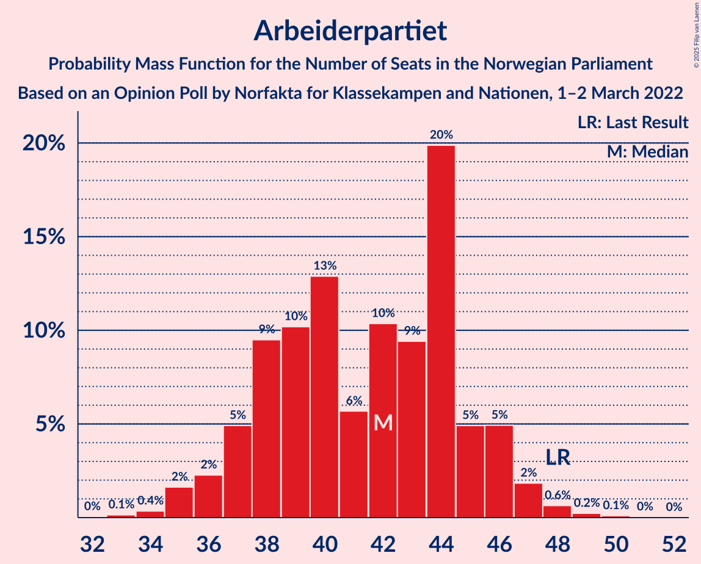

| Number of Seats | Probability | Accumulated | Special Marks |
|:---------------:|:-----------:|:-----------:|:-------------:|
| 32 | 0% | 100% |  |
| 33 | 0.1% | 99.9% |  |
| 34 | 0.4% | 99.8% |  |
| 35 | 2% | 99.4% |  |
| 36 | 2% | 98% |  |
| 37 | 5% | 96% |  |
| 38 | 9% | 91% |  |
| 39 | 10% | 81% |  |
| 40 | 13% | 71% |  |
| 41 | 6% | 58% |  |
| 42 | 10% | 52% | Median |
| 43 | 9% | 42% |  |
| 44 | 20% | 33% |  |
| 45 | 5% | 13% |  |
| 46 | 5% | 8% |  |
| 47 | 2% | 3% |  |
| 48 | 0.6% | 1.0% | Last Result |
| 49 | 0.2% | 0.4% |  |
| 50 | 0.1% | 0.1% |  |
| 51 | 0% | 0% |  |

### Fremskrittspartiet

*For a full overview of the results for this party, see the [Fremskrittspartiet](party-fremskrittspartiet.html) page.*

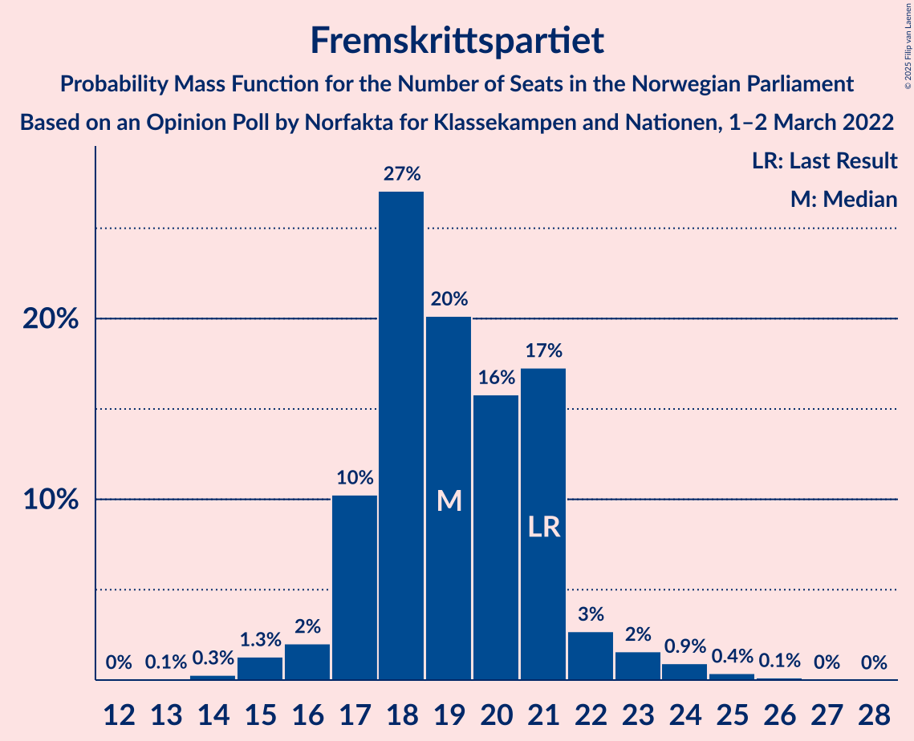

| Number of Seats | Probability | Accumulated | Special Marks |
|:---------------:|:-----------:|:-----------:|:-------------:|
| 13 | 0.1% | 100% |  |
| 14 | 0.3% | 99.9% |  |
| 15 | 1.3% | 99.6% |  |
| 16 | 2% | 98% |  |
| 17 | 10% | 96% |  |
| 18 | 27% | 86% |  |
| 19 | 20% | 59% | Median |
| 20 | 16% | 39% |  |
| 21 | 17% | 23% | Last Result |
| 22 | 3% | 6% |  |
| 23 | 2% | 3% |  |
| 24 | 0.9% | 1.5% |  |
| 25 | 0.4% | 0.6% |  |
| 26 | 0.1% | 0.2% |  |
| 27 | 0% | 0.1% |  |
| 28 | 0% | 0% |  |

### Senterpartiet

*For a full overview of the results for this party, see the [Senterpartiet](party-senterpartiet.html) page.*

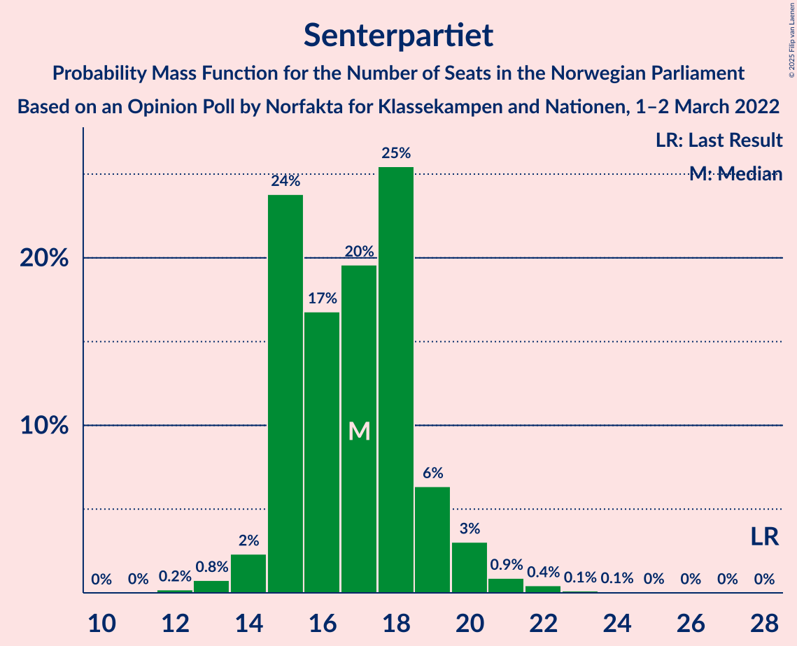

| Number of Seats | Probability | Accumulated | Special Marks |
|:---------------:|:-----------:|:-----------:|:-------------:|
| 12 | 0.2% | 100% |  |
| 13 | 0.8% | 99.8% |  |
| 14 | 2% | 99.0% |  |
| 15 | 24% | 97% |  |
| 16 | 17% | 73% |  |
| 17 | 20% | 56% | Median |
| 18 | 25% | 37% |  |
| 19 | 6% | 11% |  |
| 20 | 3% | 5% |  |
| 21 | 0.9% | 2% |  |
| 22 | 0.4% | 0.8% |  |
| 23 | 0.1% | 0.3% |  |
| 24 | 0.1% | 0.2% |  |
| 25 | 0% | 0.1% |  |
| 26 | 0% | 0.1% |  |
| 27 | 0% | 0.1% |  |
| 28 | 0% | 0% | Last Result |

### Sosialistisk Venstreparti

*For a full overview of the results for this party, see the [Sosialistisk Venstreparti](party-sosialistiskvenstreparti.html) page.*

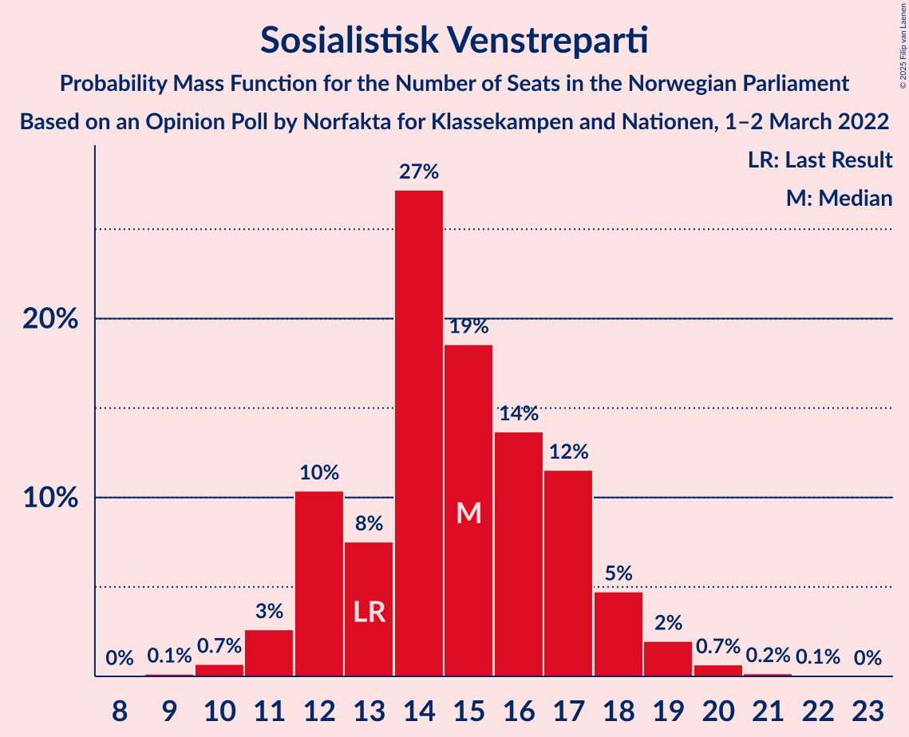

| Number of Seats | Probability | Accumulated | Special Marks |
|:---------------:|:-----------:|:-----------:|:-------------:|
| 9 | 0.1% | 100% |  |
| 10 | 0.7% | 99.8% |  |
| 11 | 3% | 99.2% |  |
| 12 | 10% | 97% |  |
| 13 | 8% | 86% | Last Result |
| 14 | 27% | 79% |  |
| 15 | 19% | 51% | Median |
| 16 | 14% | 33% |  |
| 17 | 12% | 19% |  |
| 18 | 5% | 8% |  |
| 19 | 2% | 3% |  |
| 20 | 0.7% | 0.9% |  |
| 21 | 0.2% | 0.3% |  |
| 22 | 0.1% | 0.1% |  |
| 23 | 0% | 0% |  |

### Rødt

*For a full overview of the results for this party, see the [Rødt](party-rødt.html) page.*

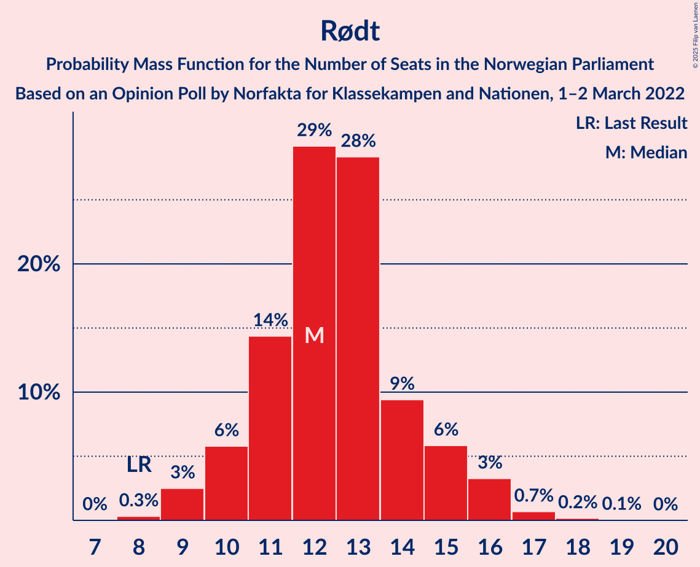

| Number of Seats | Probability | Accumulated | Special Marks |
|:---------------:|:-----------:|:-----------:|:-------------:|
| 8 | 0.3% | 100% | Last Result |
| 9 | 3% | 99.7% |  |
| 10 | 6% | 97% |  |
| 11 | 14% | 91% |  |
| 12 | 29% | 77% | Median |
| 13 | 28% | 48% |  |
| 14 | 9% | 19% |  |
| 15 | 6% | 10% |  |
| 16 | 3% | 4% |  |
| 17 | 0.7% | 0.9% |  |
| 18 | 0.2% | 0.2% |  |
| 19 | 0.1% | 0.1% |  |
| 20 | 0% | 0% |  |

### Venstre

*For a full overview of the results for this party, see the [Venstre](party-venstre.html) page.*

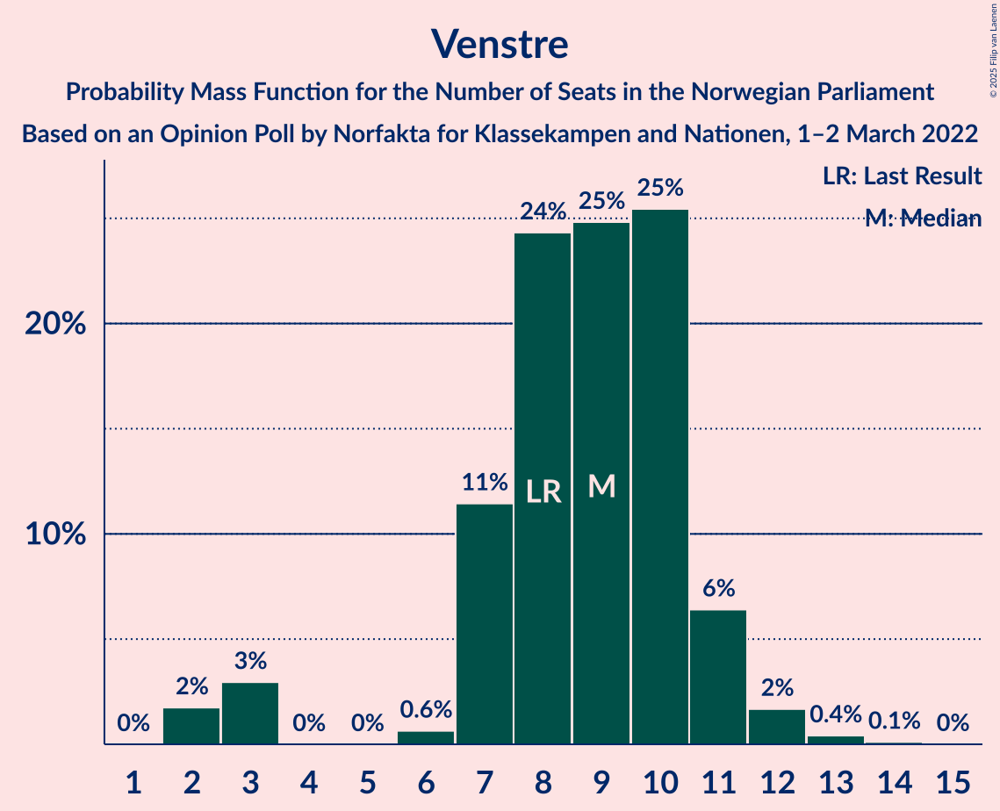

| Number of Seats | Probability | Accumulated | Special Marks |
|:---------------:|:-----------:|:-----------:|:-------------:|
| 2 | 2% | 100% |  |
| 3 | 3% | 98% |  |
| 4 | 0% | 95% |  |
| 5 | 0% | 95% |  |
| 6 | 0.6% | 95% |  |
| 7 | 11% | 95% |  |
| 8 | 24% | 83% | Last Result |
| 9 | 25% | 59% | Median |
| 10 | 25% | 34% |  |
| 11 | 6% | 9% |  |
| 12 | 2% | 2% |  |
| 13 | 0.4% | 0.5% |  |
| 14 | 0.1% | 0.1% |  |
| 15 | 0% | 0% |  |

### Miljøpartiet De Grønne

*For a full overview of the results for this party, see the [Miljøpartiet De Grønne](party-miljøpartietdegrønne.html) page.*

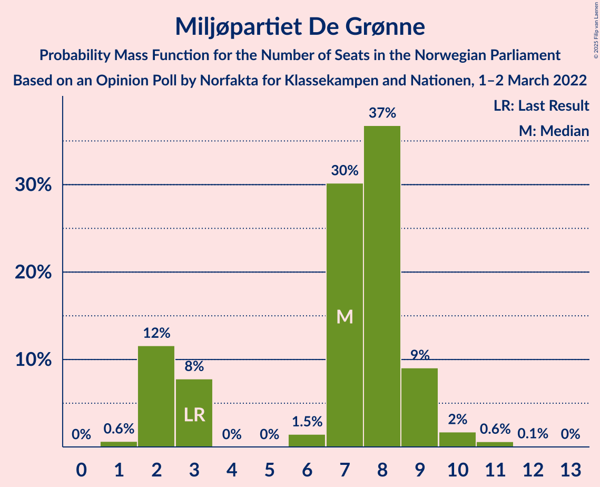

| Number of Seats | Probability | Accumulated | Special Marks |
|:---------------:|:-----------:|:-----------:|:-------------:|
| 1 | 0.6% | 100% |  |
| 2 | 12% | 99.4% |  |
| 3 | 8% | 88% | Last Result |
| 4 | 0% | 80% |  |
| 5 | 0% | 80% |  |
| 6 | 1.5% | 80% |  |
| 7 | 30% | 78% | Median |
| 8 | 37% | 48% |  |
| 9 | 9% | 12% |  |
| 10 | 2% | 2% |  |
| 11 | 0.6% | 0.8% |  |
| 12 | 0.1% | 0.1% |  |
| 13 | 0% | 0% |  |

### Kristelig Folkeparti

*For a full overview of the results for this party, see the [Kristelig Folkeparti](party-kristeligfolkeparti.html) page.*

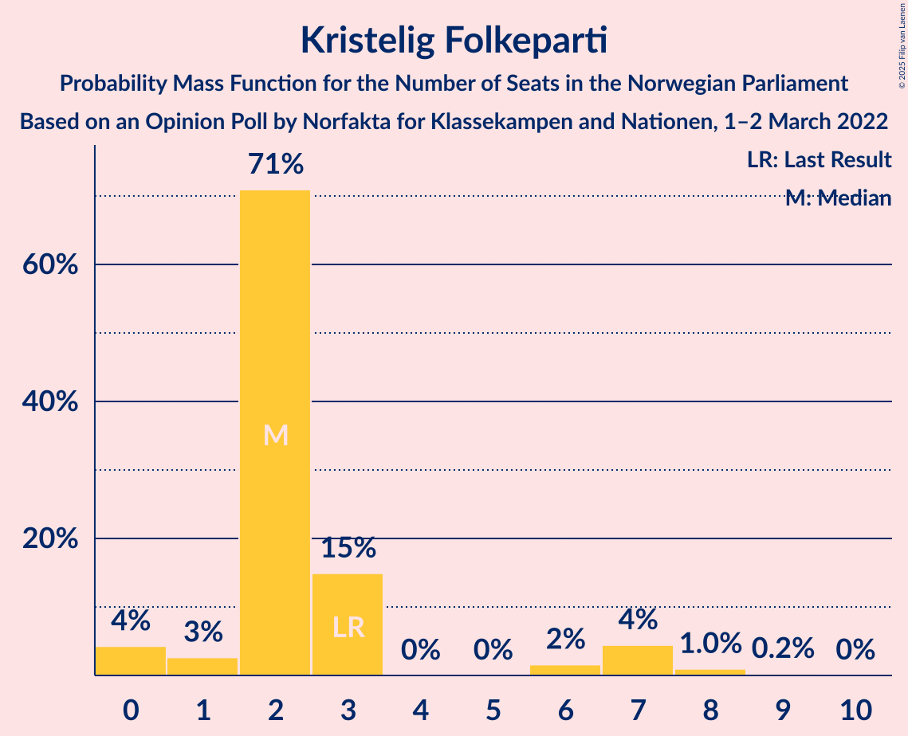

| Number of Seats | Probability | Accumulated | Special Marks |
|:---------------:|:-----------:|:-----------:|:-------------:|
| 0 | 4% | 100% |  |
| 1 | 3% | 96% |  |
| 2 | 71% | 93% | Median |
| 3 | 15% | 22% | Last Result |
| 4 | 0% | 7% |  |
| 5 | 0% | 7% |  |
| 6 | 2% | 7% |  |
| 7 | 4% | 6% |  |
| 8 | 1.0% | 1.2% |  |
| 9 | 0.2% | 0.3% |  |
| 10 | 0% | 0% |  |

## Coalitions

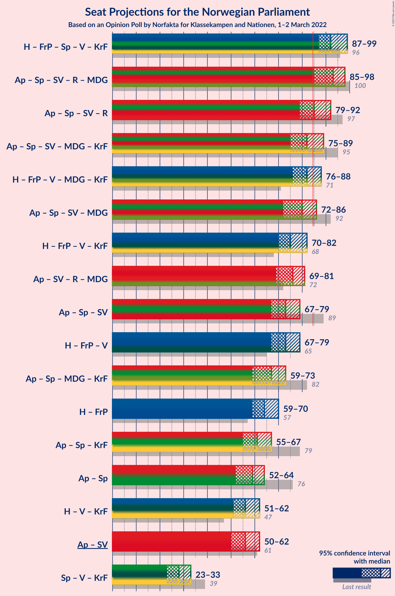

### Confidence Intervals

| Coalition | Last Result | Median | Majority? | 80% Confidence Interval | 90% Confidence Interval | 95% Confidence Interval | 99% Confidence Interval |
|:---------:|:-----------:|:------:|:---------:|:-----------------------:|:-----------------------:|:-----------------------:|:-----------------------:|
| Høyre – Fremskrittspartiet – Senterpartiet – Venstre – Kristelig Folkeparti | 96 | 92 | 99.5% | 88–96 | 88–97 | 87–99 | 84–101 |
| Arbeiderpartiet – Senterpartiet – Sosialistisk Venstreparti – Rødt – Miljøpartiet De Grønne | 100 | 93 | 98% | 88–96 | 86–97 | 85–98 | 82–101 |
| Arbeiderpartiet – Senterpartiet – Sosialistisk Venstreparti – Rødt | 97 | 85 | 68% | 82–90 | 80–91 | 79–92 | 77–95 |
| Arbeiderpartiet – Senterpartiet – Sosialistisk Venstreparti – Miljøpartiet De Grønne – Kristelig Folkeparti | 95 | 82 | 15% | 78–86 | 76–87 | 75–89 | 73–90 |
| Høyre – Fremskrittspartiet – Venstre – Miljøpartiet De Grønne – Kristelig Folkeparti | 71 | 82 | 21% | 78–86 | 77–87 | 76–88 | 73–91 |
| Arbeiderpartiet – Senterpartiet – Sosialistisk Venstreparti – Miljøpartiet De Grønne | 92 | 80 | 4% | 76–83 | 74–84 | 72–86 | 70–88 |
| Høyre – Fremskrittspartiet – Venstre – Kristelig Folkeparti | 68 | 75 | 0.3% | 72–79 | 71–81 | 70–82 | 67–84 |
| Arbeiderpartiet – Sosialistisk Venstreparti – Rødt – Miljøpartiet De Grønne | 72 | 76 | 0.2% | 71–79 | 69–80 | 69–81 | 66–82 |
| Arbeiderpartiet – Senterpartiet – Sosialistisk Venstreparti | 89 | 73 | 0% | 69–76 | 69–78 | 67–79 | 65–82 |
| Høyre – Fremskrittspartiet – Venstre | 65 | 73 | 0.1% | 69–76 | 68–78 | 67–79 | 65–81 |
| Arbeiderpartiet – Senterpartiet – Miljøpartiet De Grønne – Kristelig Folkeparti | 82 | 67 | 0% | 63–72 | 61–72 | 59–73 | 56–76 |
| Høyre – Fremskrittspartiet | 57 | 64 | 0% | 61–67 | 60–69 | 59–70 | 58–73 |
| Arbeiderpartiet – Senterpartiet – Kristelig Folkeparti | 79 | 61 | 0% | 57–64 | 56–66 | 55–67 | 53–69 |
| Arbeiderpartiet – Senterpartiet | 76 | 59 | 0% | 55–62 | 54–63 | 52–64 | 51–66 |
| Høyre – Venstre – Kristelig Folkeparti | 47 | 56 | 0% | 53–59 | 52–61 | 51–62 | 49–64 |
| Arbeiderpartiet – Sosialistisk Venstreparti | 61 | 56 | 0% | 52–60 | 51–61 | 50–62 | 48–64 |
| Senterpartiet – Venstre – Kristelig Folkeparti | 39 | 28 | 0% | 26–30 | 25–31 | 23–33 | 21–36 |

### Høyre – Fremskrittspartiet – Senterpartiet – Venstre – Kristelig Folkeparti

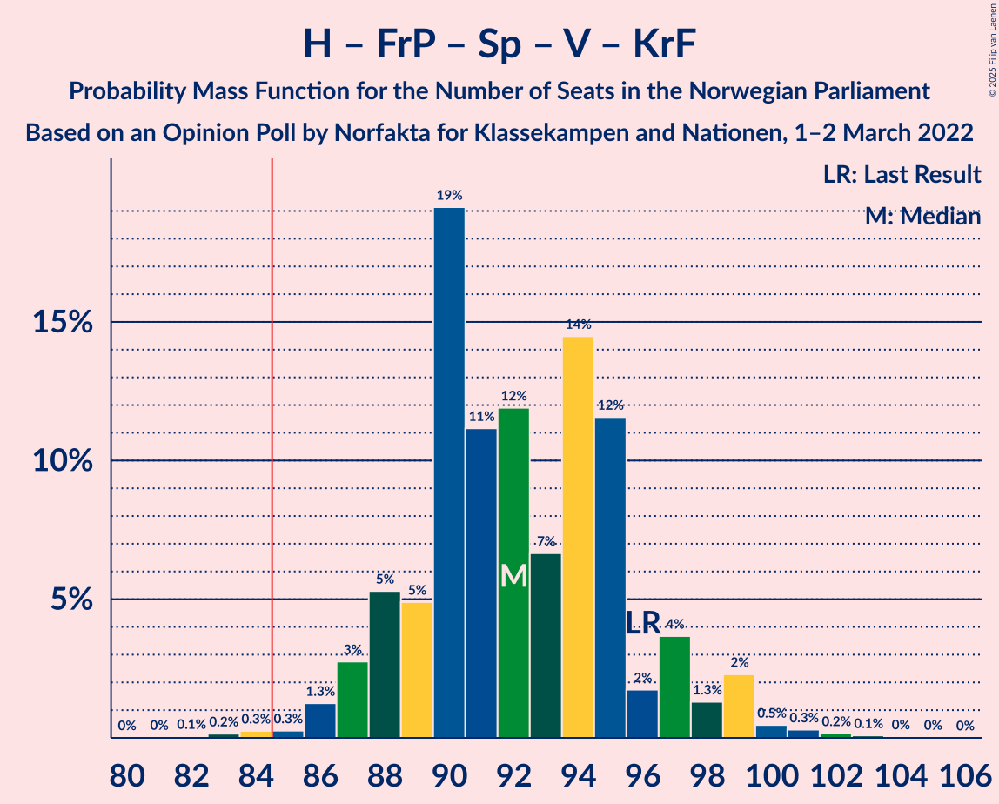

| Number of Seats | Probability | Accumulated | Special Marks |
|:---------------:|:-----------:|:-----------:|:-------------:|
| 81 | 0% | 100% |  |
| 82 | 0.1% | 99.9% |  |
| 83 | 0.2% | 99.9% |  |
| 84 | 0.3% | 99.7% |  |
| 85 | 0.3% | 99.5% | Majority |
| 86 | 1.3% | 99.2% |  |
| 87 | 3% | 98% |  |
| 88 | 5% | 95% |  |
| 89 | 5% | 90% |  |
| 90 | 19% | 85% |  |
| 91 | 11% | 66% |  |
| 92 | 12% | 55% | Median |
| 93 | 7% | 43% |  |
| 94 | 14% | 36% |  |
| 95 | 12% | 22% |  |
| 96 | 2% | 10% | Last Result |
| 97 | 4% | 8% |  |
| 98 | 1.3% | 5% |  |
| 99 | 2% | 3% |  |
| 100 | 0.5% | 1.1% |  |
| 101 | 0.3% | 0.6% |  |
| 102 | 0.2% | 0.3% |  |
| 103 | 0.1% | 0.2% |  |
| 104 | 0% | 0.1% |  |
| 105 | 0% | 0% |  |

### Arbeiderpartiet – Senterpartiet – Sosialistisk Venstreparti – Rødt – Miljøpartiet De Grønne

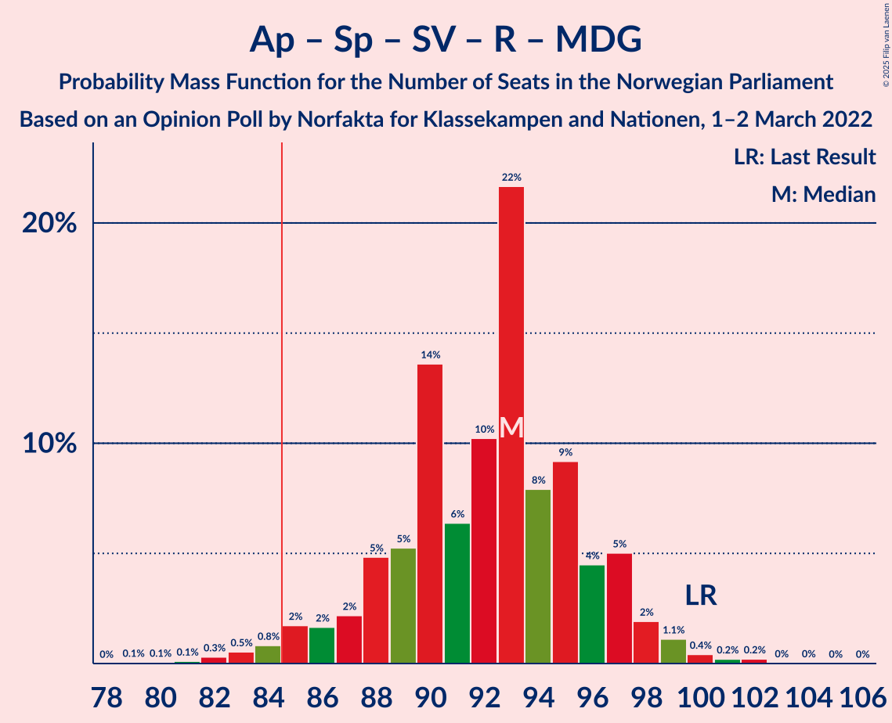

| Number of Seats | Probability | Accumulated | Special Marks |
|:---------------:|:-----------:|:-----------:|:-------------:|
| 79 | 0.1% | 100% |  |
| 80 | 0.1% | 99.9% |  |
| 81 | 0.1% | 99.9% |  |
| 82 | 0.3% | 99.8% |  |
| 83 | 0.5% | 99.5% |  |
| 84 | 0.8% | 98.9% |  |
| 85 | 2% | 98% | Majority |
| 86 | 2% | 96% |  |
| 87 | 2% | 95% |  |
| 88 | 5% | 93% |  |
| 89 | 5% | 88% |  |
| 90 | 14% | 82% |  |
| 91 | 6% | 69% |  |
| 92 | 10% | 62% |  |
| 93 | 22% | 52% | Median |
| 94 | 8% | 31% |  |
| 95 | 9% | 23% |  |
| 96 | 4% | 13% |  |
| 97 | 5% | 9% |  |
| 98 | 2% | 4% |  |
| 99 | 1.1% | 2% |  |
| 100 | 0.4% | 0.9% | Last Result |
| 101 | 0.2% | 0.5% |  |
| 102 | 0.2% | 0.3% |  |
| 103 | 0% | 0.1% |  |
| 104 | 0% | 0.1% |  |
| 105 | 0% | 0% |  |

### Arbeiderpartiet – Senterpartiet – Sosialistisk Venstreparti – Rødt

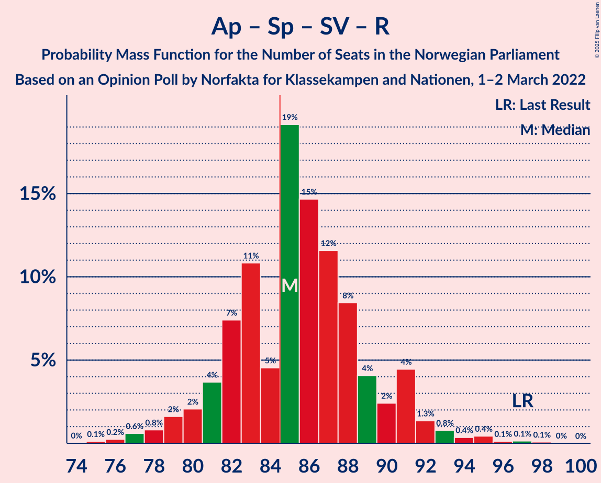

| Number of Seats | Probability | Accumulated | Special Marks |
|:---------------:|:-----------:|:-----------:|:-------------:|
| 74 | 0% | 100% |  |
| 75 | 0.1% | 99.9% |  |
| 76 | 0.2% | 99.8% |  |
| 77 | 0.6% | 99.6% |  |
| 78 | 0.8% | 99.0% |  |
| 79 | 2% | 98% |  |
| 80 | 2% | 97% |  |
| 81 | 4% | 95% |  |
| 82 | 7% | 91% |  |
| 83 | 11% | 83% |  |
| 84 | 5% | 73% |  |
| 85 | 19% | 68% | Majority |
| 86 | 15% | 49% | Median |
| 87 | 12% | 34% |  |
| 88 | 8% | 23% |  |
| 89 | 4% | 14% |  |
| 90 | 2% | 10% |  |
| 91 | 4% | 8% |  |
| 92 | 1.3% | 3% |  |
| 93 | 0.8% | 2% |  |
| 94 | 0.4% | 1.1% |  |
| 95 | 0.4% | 0.8% |  |
| 96 | 0.1% | 0.4% |  |
| 97 | 0.1% | 0.2% | Last Result |
| 98 | 0.1% | 0.1% |  |
| 99 | 0% | 0% |  |

### Arbeiderpartiet – Senterpartiet – Sosialistisk Venstreparti – Miljøpartiet De Grønne – Kristelig Folkeparti

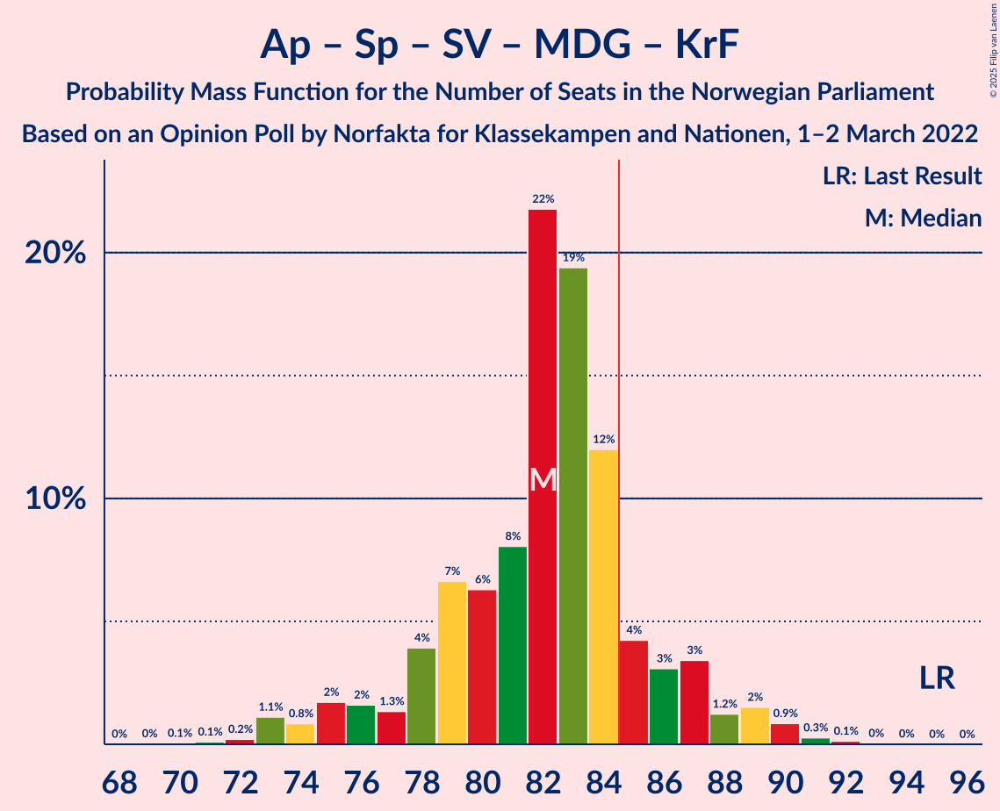

| Number of Seats | Probability | Accumulated | Special Marks |
|:---------------:|:-----------:|:-----------:|:-------------:|
| 69 | 0% | 100% |  |
| 70 | 0.1% | 99.9% |  |
| 71 | 0.1% | 99.9% |  |
| 72 | 0.2% | 99.8% |  |
| 73 | 1.1% | 99.6% |  |
| 74 | 0.8% | 98% |  |
| 75 | 2% | 98% |  |
| 76 | 2% | 96% |  |
| 77 | 1.3% | 94% |  |
| 78 | 4% | 93% |  |
| 79 | 7% | 89% |  |
| 80 | 6% | 82% |  |
| 81 | 8% | 76% |  |
| 82 | 22% | 68% |  |
| 83 | 19% | 46% | Median |
| 84 | 12% | 27% |  |
| 85 | 4% | 15% | Majority |
| 86 | 3% | 11% |  |
| 87 | 3% | 8% |  |
| 88 | 1.2% | 4% |  |
| 89 | 2% | 3% |  |
| 90 | 0.9% | 1.3% |  |
| 91 | 0.3% | 0.5% |  |
| 92 | 0.1% | 0.2% |  |
| 93 | 0% | 0.1% |  |
| 94 | 0% | 0% |  |
| 95 | 0% | 0% | Last Result |

### Høyre – Fremskrittspartiet – Venstre – Miljøpartiet De Grønne – Kristelig Folkeparti

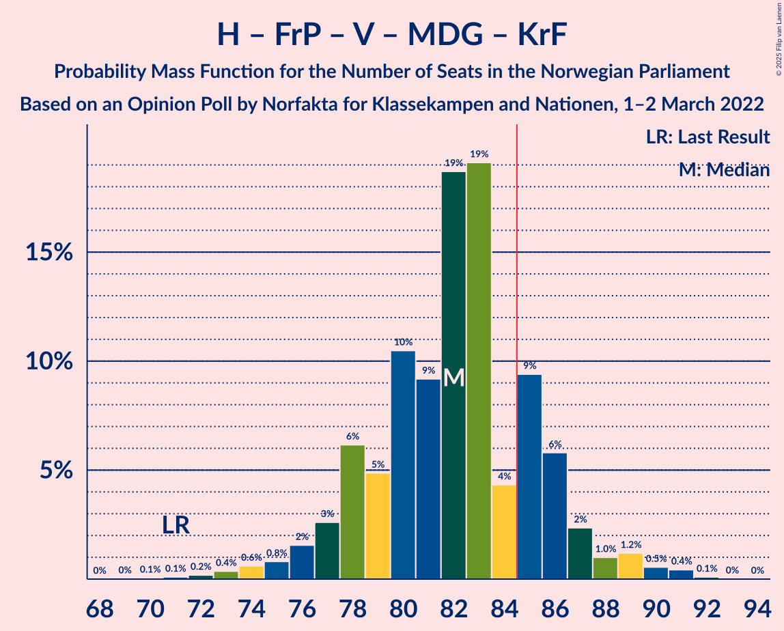

| Number of Seats | Probability | Accumulated | Special Marks |
|:---------------:|:-----------:|:-----------:|:-------------:|
| 70 | 0.1% | 100% |  |
| 71 | 0.1% | 99.9% | Last Result |
| 72 | 0.2% | 99.8% |  |
| 73 | 0.4% | 99.6% |  |
| 74 | 0.6% | 99.3% |  |
| 75 | 0.8% | 98.7% |  |
| 76 | 2% | 98% |  |
| 77 | 3% | 96% |  |
| 78 | 6% | 94% |  |
| 79 | 5% | 88% |  |
| 80 | 10% | 83% |  |
| 81 | 9% | 72% |  |
| 82 | 19% | 63% | Median |
| 83 | 19% | 44% |  |
| 84 | 4% | 25% |  |
| 85 | 9% | 21% | Majority |
| 86 | 6% | 11% |  |
| 87 | 2% | 6% |  |
| 88 | 1.0% | 3% |  |
| 89 | 1.2% | 2% |  |
| 90 | 0.5% | 1.1% |  |
| 91 | 0.4% | 0.6% |  |
| 92 | 0.1% | 0.1% |  |
| 93 | 0% | 0% |  |

### Arbeiderpartiet – Senterpartiet – Sosialistisk Venstreparti – Miljøpartiet De Grønne

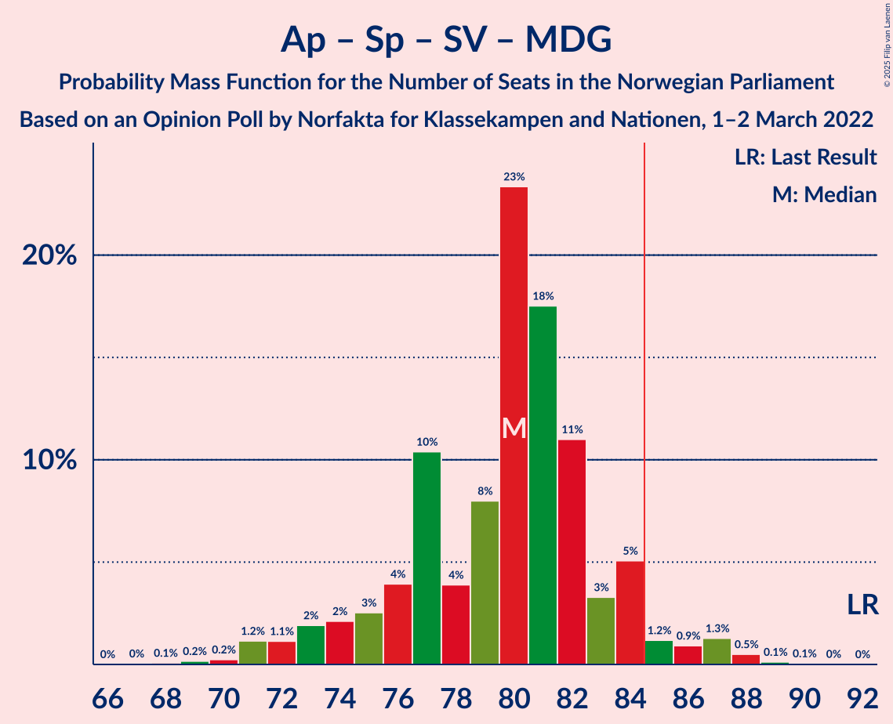

| Number of Seats | Probability | Accumulated | Special Marks |
|:---------------:|:-----------:|:-----------:|:-------------:|
| 67 | 0% | 100% |  |
| 68 | 0.1% | 99.9% |  |
| 69 | 0.2% | 99.9% |  |
| 70 | 0.2% | 99.7% |  |
| 71 | 1.2% | 99.4% |  |
| 72 | 1.1% | 98% |  |
| 73 | 2% | 97% |  |
| 74 | 2% | 95% |  |
| 75 | 3% | 93% |  |
| 76 | 4% | 91% |  |
| 77 | 10% | 87% |  |
| 78 | 4% | 76% |  |
| 79 | 8% | 72% |  |
| 80 | 23% | 64% |  |
| 81 | 18% | 41% | Median |
| 82 | 11% | 23% |  |
| 83 | 3% | 12% |  |
| 84 | 5% | 9% |  |
| 85 | 1.2% | 4% | Majority |
| 86 | 0.9% | 3% |  |
| 87 | 1.3% | 2% |  |
| 88 | 0.5% | 0.7% |  |
| 89 | 0.1% | 0.2% |  |
| 90 | 0.1% | 0.1% |  |
| 91 | 0% | 0% |  |
| 92 | 0% | 0% | Last Result |

### Høyre – Fremskrittspartiet – Venstre – Kristelig Folkeparti

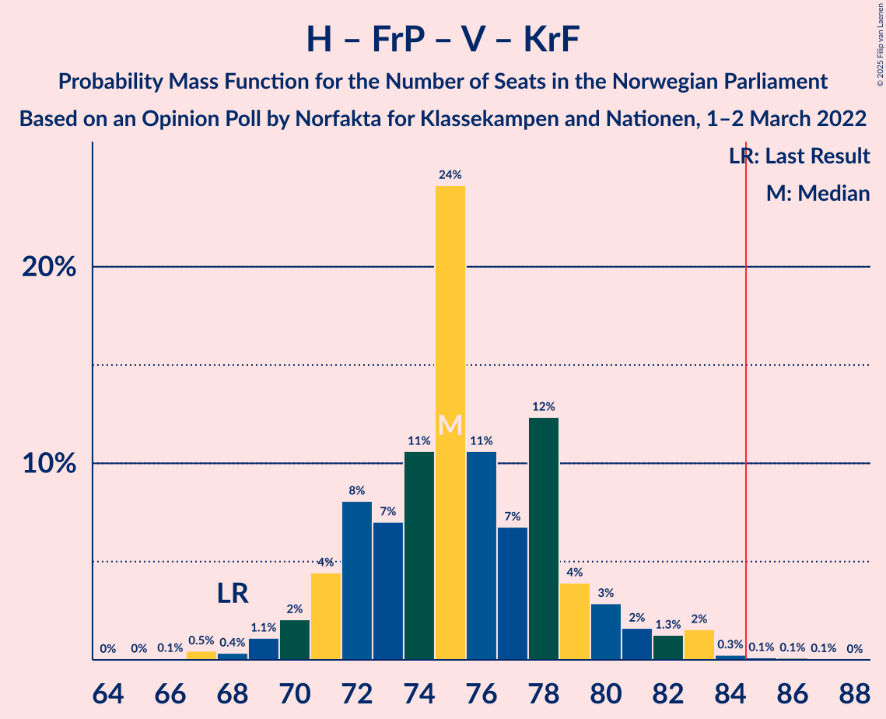

| Number of Seats | Probability | Accumulated | Special Marks |
|:---------------:|:-----------:|:-----------:|:-------------:|
| 64 | 0% | 100% |  |
| 65 | 0% | 99.9% |  |
| 66 | 0.1% | 99.9% |  |
| 67 | 0.5% | 99.8% |  |
| 68 | 0.4% | 99.4% | Last Result |
| 69 | 1.1% | 99.0% |  |
| 70 | 2% | 98% |  |
| 71 | 4% | 96% |  |
| 72 | 8% | 91% |  |
| 73 | 7% | 83% |  |
| 74 | 11% | 76% |  |
| 75 | 24% | 66% | Median |
| 76 | 11% | 42% |  |
| 77 | 7% | 31% |  |
| 78 | 12% | 24% |  |
| 79 | 4% | 12% |  |
| 80 | 3% | 8% |  |
| 81 | 2% | 5% |  |
| 82 | 1.3% | 3% |  |
| 83 | 2% | 2% |  |
| 84 | 0.3% | 0.6% |  |
| 85 | 0.1% | 0.3% | Majority |
| 86 | 0.1% | 0.2% |  |
| 87 | 0.1% | 0.1% |  |
| 88 | 0% | 0% |  |

### Arbeiderpartiet – Sosialistisk Venstreparti – Rødt – Miljøpartiet De Grønne

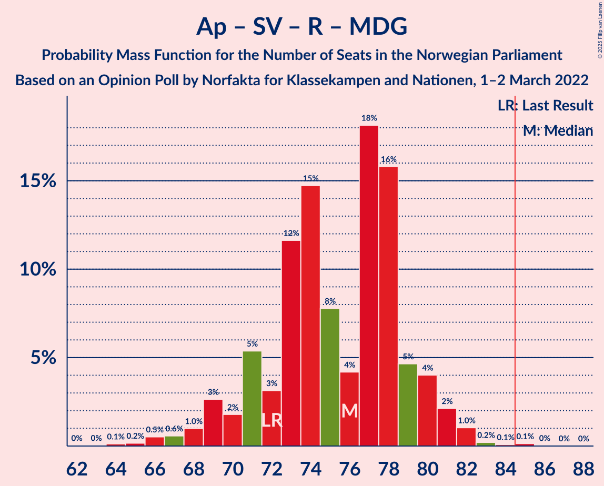

| Number of Seats | Probability | Accumulated | Special Marks |
|:---------------:|:-----------:|:-----------:|:-------------:|
| 63 | 0% | 100% |  |
| 64 | 0.1% | 99.9% |  |
| 65 | 0.2% | 99.8% |  |
| 66 | 0.5% | 99.6% |  |
| 67 | 0.6% | 99.1% |  |
| 68 | 1.0% | 98.5% |  |
| 69 | 3% | 98% |  |
| 70 | 2% | 95% |  |
| 71 | 5% | 93% |  |
| 72 | 3% | 88% | Last Result |
| 73 | 12% | 85% |  |
| 74 | 15% | 73% |  |
| 75 | 8% | 58% |  |
| 76 | 4% | 50% | Median |
| 77 | 18% | 46% |  |
| 78 | 16% | 28% |  |
| 79 | 5% | 12% |  |
| 80 | 4% | 8% |  |
| 81 | 2% | 4% |  |
| 82 | 1.0% | 2% |  |
| 83 | 0.2% | 0.5% |  |
| 84 | 0.1% | 0.3% |  |
| 85 | 0.1% | 0.2% | Majority |
| 86 | 0% | 0.1% |  |
| 87 | 0% | 0% |  |

### Arbeiderpartiet – Senterpartiet – Sosialistisk Venstreparti

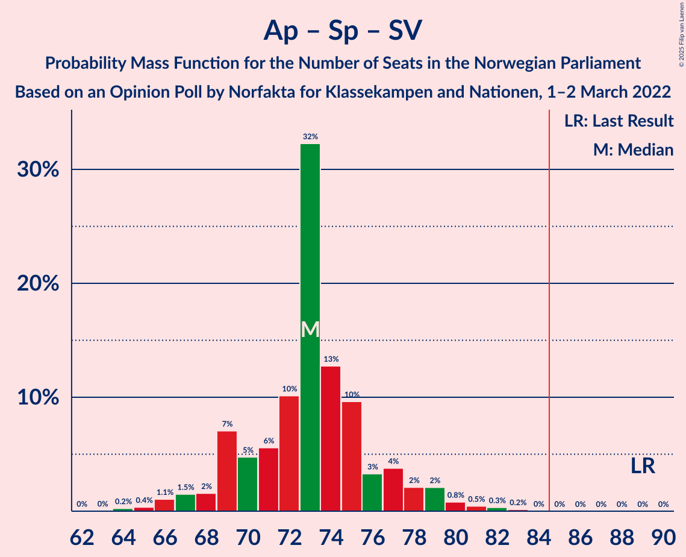

| Number of Seats | Probability | Accumulated | Special Marks |
|:---------------:|:-----------:|:-----------:|:-------------:|
| 63 | 0% | 100% |  |
| 64 | 0.2% | 99.9% |  |
| 65 | 0.4% | 99.7% |  |
| 66 | 1.1% | 99.3% |  |
| 67 | 1.5% | 98% |  |
| 68 | 2% | 97% |  |
| 69 | 7% | 95% |  |
| 70 | 5% | 88% |  |
| 71 | 6% | 83% |  |
| 72 | 10% | 78% |  |
| 73 | 32% | 68% |  |
| 74 | 13% | 35% | Median |
| 75 | 10% | 23% |  |
| 76 | 3% | 13% |  |
| 77 | 4% | 10% |  |
| 78 | 2% | 6% |  |
| 79 | 2% | 4% |  |
| 80 | 0.8% | 2% |  |
| 81 | 0.5% | 1.0% |  |
| 82 | 0.3% | 0.5% |  |
| 83 | 0.2% | 0.2% |  |
| 84 | 0% | 0% |  |
| 85 | 0% | 0% | Majority |
| 86 | 0% | 0% |  |
| 87 | 0% | 0% |  |
| 88 | 0% | 0% |  |
| 89 | 0% | 0% | Last Result |

### Høyre – Fremskrittspartiet – Venstre

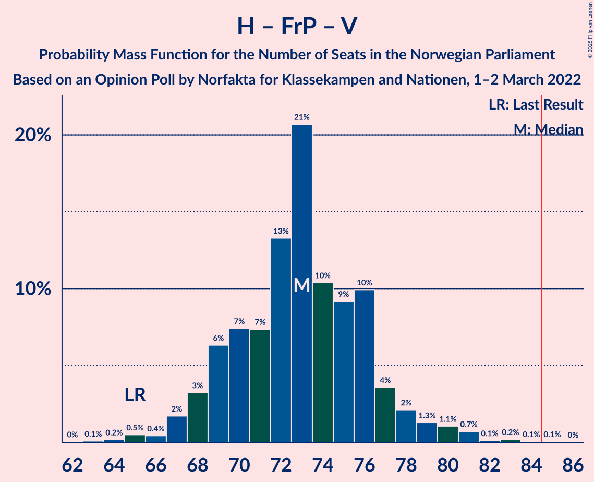

| Number of Seats | Probability | Accumulated | Special Marks |
|:---------------:|:-----------:|:-----------:|:-------------:|
| 62 | 0% | 100% |  |
| 63 | 0.1% | 99.9% |  |
| 64 | 0.2% | 99.8% |  |
| 65 | 0.5% | 99.7% | Last Result |
| 66 | 0.4% | 99.2% |  |
| 67 | 2% | 98.7% |  |
| 68 | 3% | 97% |  |
| 69 | 6% | 94% |  |
| 70 | 7% | 87% |  |
| 71 | 7% | 80% |  |
| 72 | 13% | 73% |  |
| 73 | 21% | 59% | Median |
| 74 | 10% | 39% |  |
| 75 | 9% | 28% |  |
| 76 | 10% | 19% |  |
| 77 | 4% | 9% |  |
| 78 | 2% | 6% |  |
| 79 | 1.3% | 4% |  |
| 80 | 1.1% | 2% |  |
| 81 | 0.7% | 1.2% |  |
| 82 | 0.1% | 0.5% |  |
| 83 | 0.2% | 0.3% |  |
| 84 | 0.1% | 0.1% |  |
| 85 | 0.1% | 0.1% | Majority |
| 86 | 0% | 0% |  |

### Arbeiderpartiet – Senterpartiet – Miljøpartiet De Grønne – Kristelig Folkeparti

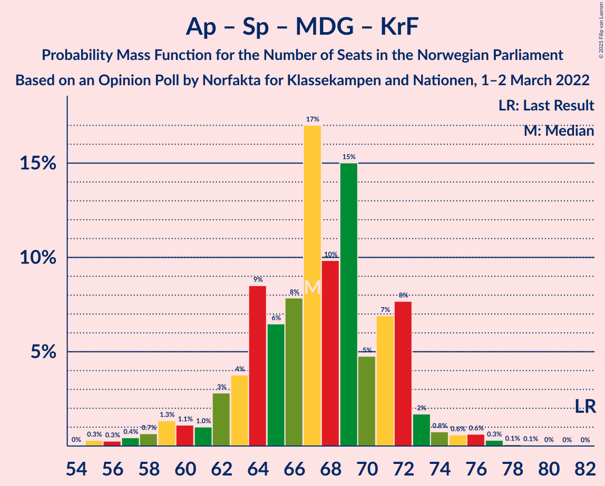

| Number of Seats | Probability | Accumulated | Special Marks |
|:---------------:|:-----------:|:-----------:|:-------------:|
| 55 | 0.3% | 100% |  |
| 56 | 0.3% | 99.7% |  |
| 57 | 0.4% | 99.4% |  |
| 58 | 0.7% | 98.9% |  |
| 59 | 1.3% | 98% |  |
| 60 | 1.1% | 97% |  |
| 61 | 1.0% | 96% |  |
| 62 | 3% | 95% |  |
| 63 | 4% | 92% |  |
| 64 | 9% | 88% |  |
| 65 | 6% | 80% |  |
| 66 | 8% | 73% |  |
| 67 | 17% | 65% |  |
| 68 | 10% | 48% | Median |
| 69 | 15% | 39% |  |
| 70 | 5% | 24% |  |
| 71 | 7% | 19% |  |
| 72 | 8% | 12% |  |
| 73 | 2% | 4% |  |
| 74 | 0.8% | 2% |  |
| 75 | 0.6% | 2% |  |
| 76 | 0.6% | 1.1% |  |
| 77 | 0.3% | 0.5% |  |
| 78 | 0.1% | 0.2% |  |
| 79 | 0.1% | 0.1% |  |
| 80 | 0% | 0% |  |
| 81 | 0% | 0% |  |
| 82 | 0% | 0% | Last Result |

### Høyre – Fremskrittspartiet

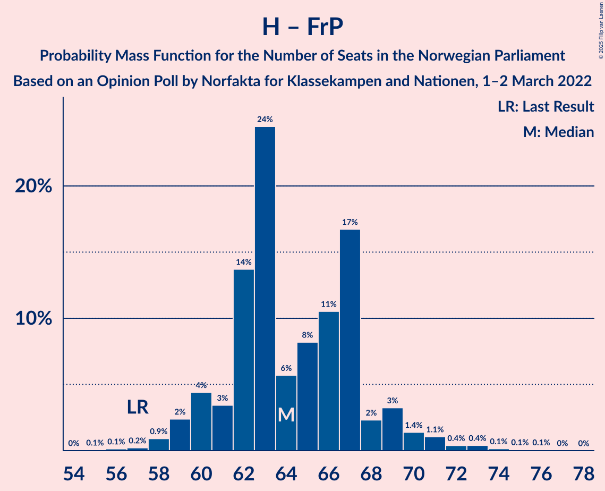

| Number of Seats | Probability | Accumulated | Special Marks |
|:---------------:|:-----------:|:-----------:|:-------------:|
| 55 | 0.1% | 100% |  |
| 56 | 0.1% | 99.9% |  |
| 57 | 0.2% | 99.8% | Last Result |
| 58 | 0.9% | 99.6% |  |
| 59 | 2% | 98.7% |  |
| 60 | 4% | 96% |  |
| 61 | 3% | 92% |  |
| 62 | 14% | 88% |  |
| 63 | 24% | 75% |  |
| 64 | 6% | 50% | Median |
| 65 | 8% | 45% |  |
| 66 | 11% | 36% |  |
| 67 | 17% | 26% |  |
| 68 | 2% | 9% |  |
| 69 | 3% | 7% |  |
| 70 | 1.4% | 4% |  |
| 71 | 1.1% | 2% |  |
| 72 | 0.4% | 1.1% |  |
| 73 | 0.4% | 0.7% |  |
| 74 | 0.1% | 0.3% |  |
| 75 | 0.1% | 0.2% |  |
| 76 | 0.1% | 0.1% |  |
| 77 | 0% | 0% |  |

### Arbeiderpartiet – Senterpartiet – Kristelig Folkeparti

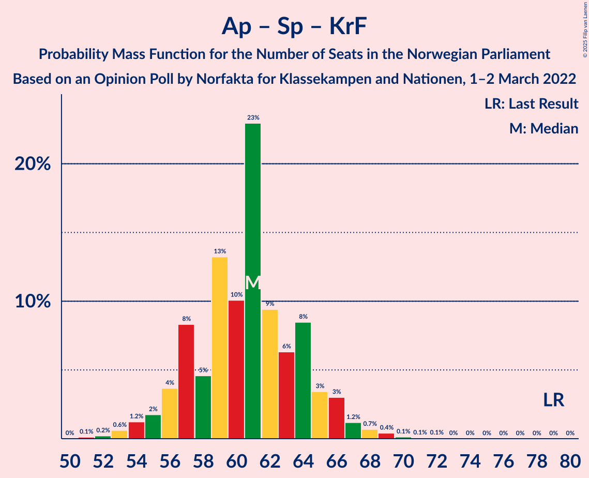

| Number of Seats | Probability | Accumulated | Special Marks |
|:---------------:|:-----------:|:-----------:|:-------------:|
| 51 | 0.1% | 100% |  |
| 52 | 0.2% | 99.9% |  |
| 53 | 0.6% | 99.6% |  |
| 54 | 1.2% | 99.0% |  |
| 55 | 2% | 98% |  |
| 56 | 4% | 96% |  |
| 57 | 8% | 92% |  |
| 58 | 5% | 84% |  |
| 59 | 13% | 79% |  |
| 60 | 10% | 66% |  |
| 61 | 23% | 56% | Median |
| 62 | 9% | 33% |  |
| 63 | 6% | 24% |  |
| 64 | 8% | 17% |  |
| 65 | 3% | 9% |  |
| 66 | 3% | 6% |  |
| 67 | 1.2% | 3% |  |
| 68 | 0.7% | 1.4% |  |
| 69 | 0.4% | 0.7% |  |
| 70 | 0.1% | 0.3% |  |
| 71 | 0.1% | 0.1% |  |
| 72 | 0.1% | 0.1% |  |
| 73 | 0% | 0% |  |
| 74 | 0% | 0% |  |
| 75 | 0% | 0% |  |
| 76 | 0% | 0% |  |
| 77 | 0% | 0% |  |
| 78 | 0% | 0% |  |
| 79 | 0% | 0% | Last Result |

### Arbeiderpartiet – Senterpartiet

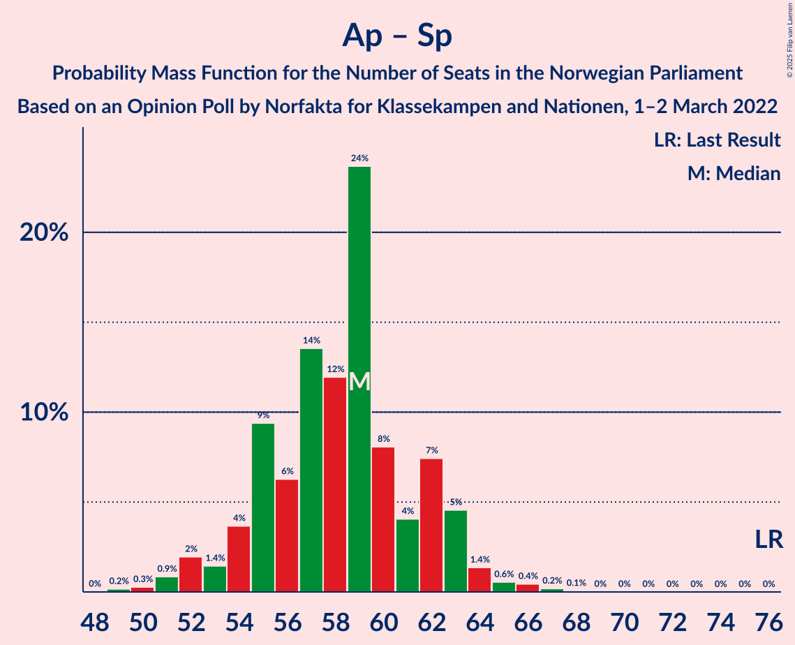

| Number of Seats | Probability | Accumulated | Special Marks |
|:---------------:|:-----------:|:-----------:|:-------------:|
| 49 | 0.2% | 100% |  |
| 50 | 0.3% | 99.8% |  |
| 51 | 0.9% | 99.5% |  |
| 52 | 2% | 98.7% |  |
| 53 | 1.4% | 97% |  |
| 54 | 4% | 95% |  |
| 55 | 9% | 92% |  |
| 56 | 6% | 82% |  |
| 57 | 14% | 76% |  |
| 58 | 12% | 62% |  |
| 59 | 24% | 50% | Median |
| 60 | 8% | 27% |  |
| 61 | 4% | 19% |  |
| 62 | 7% | 15% |  |
| 63 | 5% | 7% |  |
| 64 | 1.4% | 3% |  |
| 65 | 0.6% | 1.3% |  |
| 66 | 0.4% | 0.7% |  |
| 67 | 0.2% | 0.3% |  |
| 68 | 0.1% | 0.1% |  |
| 69 | 0% | 0% |  |
| 70 | 0% | 0% |  |
| 71 | 0% | 0% |  |
| 72 | 0% | 0% |  |
| 73 | 0% | 0% |  |
| 74 | 0% | 0% |  |
| 75 | 0% | 0% |  |
| 76 | 0% | 0% | Last Result |

### Høyre – Venstre – Kristelig Folkeparti

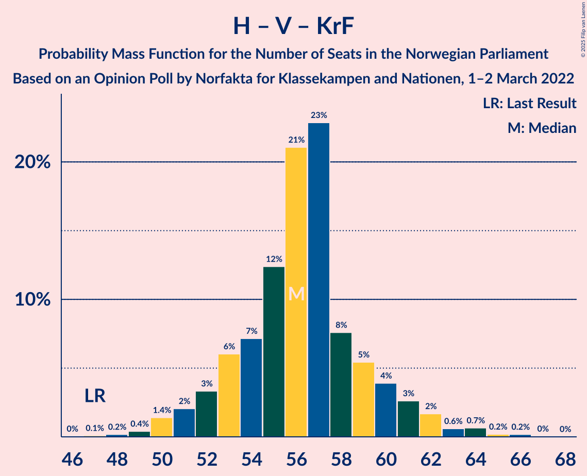

| Number of Seats | Probability | Accumulated | Special Marks |
|:---------------:|:-----------:|:-----------:|:-------------:|
| 46 | 0% | 100% |  |
| 47 | 0.1% | 99.9% | Last Result |
| 48 | 0.2% | 99.8% |  |
| 49 | 0.4% | 99.7% |  |
| 50 | 1.4% | 99.2% |  |
| 51 | 2% | 98% |  |
| 52 | 3% | 96% |  |
| 53 | 6% | 92% |  |
| 54 | 7% | 86% |  |
| 55 | 12% | 79% |  |
| 56 | 21% | 67% | Median |
| 57 | 23% | 46% |  |
| 58 | 8% | 23% |  |
| 59 | 5% | 15% |  |
| 60 | 4% | 10% |  |
| 61 | 3% | 6% |  |
| 62 | 2% | 3% |  |
| 63 | 0.6% | 2% |  |
| 64 | 0.7% | 1.1% |  |
| 65 | 0.2% | 0.5% |  |
| 66 | 0.2% | 0.3% |  |
| 67 | 0% | 0.1% |  |
| 68 | 0% | 0% |  |

### Arbeiderpartiet – Sosialistisk Venstreparti

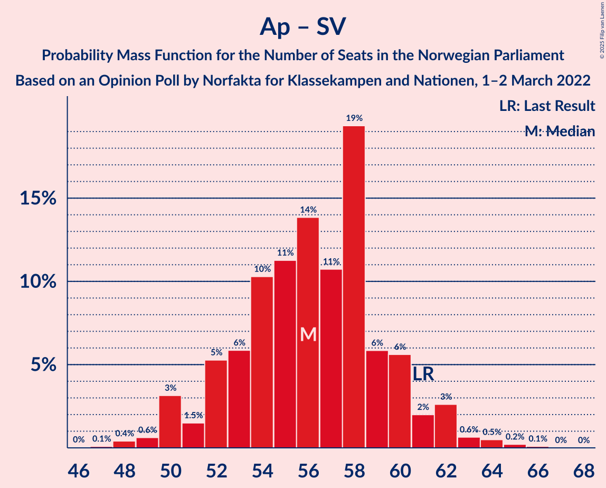

| Number of Seats | Probability | Accumulated | Special Marks |
|:---------------:|:-----------:|:-----------:|:-------------:|
| 46 | 0% | 100% |  |
| 47 | 0.1% | 99.9% |  |
| 48 | 0.4% | 99.8% |  |
| 49 | 0.6% | 99.4% |  |
| 50 | 3% | 98.8% |  |
| 51 | 1.5% | 96% |  |
| 52 | 5% | 94% |  |
| 53 | 6% | 89% |  |
| 54 | 10% | 83% |  |
| 55 | 11% | 73% |  |
| 56 | 14% | 61% |  |
| 57 | 11% | 48% | Median |
| 58 | 19% | 37% |  |
| 59 | 6% | 18% |  |
| 60 | 6% | 12% |  |
| 61 | 2% | 6% | Last Result |
| 62 | 3% | 4% |  |
| 63 | 0.6% | 1.5% |  |
| 64 | 0.5% | 0.8% |  |
| 65 | 0.2% | 0.3% |  |
| 66 | 0.1% | 0.1% |  |
| 67 | 0% | 0% |  |

### Senterpartiet – Venstre – Kristelig Folkeparti

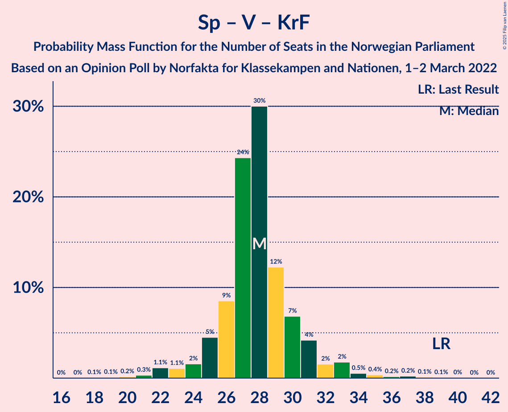

| Number of Seats | Probability | Accumulated | Special Marks |
|:---------------:|:-----------:|:-----------:|:-------------:|
| 18 | 0.1% | 100% |  |
| 19 | 0.1% | 99.9% |  |
| 20 | 0.2% | 99.8% |  |
| 21 | 0.3% | 99.6% |  |
| 22 | 1.1% | 99.3% |  |
| 23 | 1.1% | 98% |  |
| 24 | 2% | 97% |  |
| 25 | 5% | 96% |  |
| 26 | 9% | 91% |  |
| 27 | 24% | 82% |  |
| 28 | 30% | 58% | Median |
| 29 | 12% | 28% |  |
| 30 | 7% | 16% |  |
| 31 | 4% | 9% |  |
| 32 | 2% | 5% |  |
| 33 | 2% | 3% |  |
| 34 | 0.5% | 2% |  |
| 35 | 0.4% | 1.0% |  |
| 36 | 0.2% | 0.6% |  |
| 37 | 0.2% | 0.5% |  |
| 38 | 0.1% | 0.2% |  |
| 39 | 0.1% | 0.1% | Last Result |
| 40 | 0% | 0.1% |  |
| 41 | 0% | 0% |  |

## Technical Information

### Opinion Poll

+ **Polling firm:** Norfakta
+ **Commissioner(s):** Klassekampen and Nationen
+ **Fieldwork period:** 1–2 March 2022

### Calculations

+ **Sample size:** 806
+ **Simulations done:** 1,048,576
+ **Error estimate:** 1.02%

