# Opinion Poll by Opinion Perduco for Avisens Nyhetsbyrå, Dagsavisen and FriFagbevegelse, 2–7 March 2022

<a href="#voting-intentions">Voting Intentions</a> | <a href="#seats">Seats</a> | <a href="#coalitions">Coalitions</a> | <a href="#technical-information">Technical Information</a>

## Voting Intentions

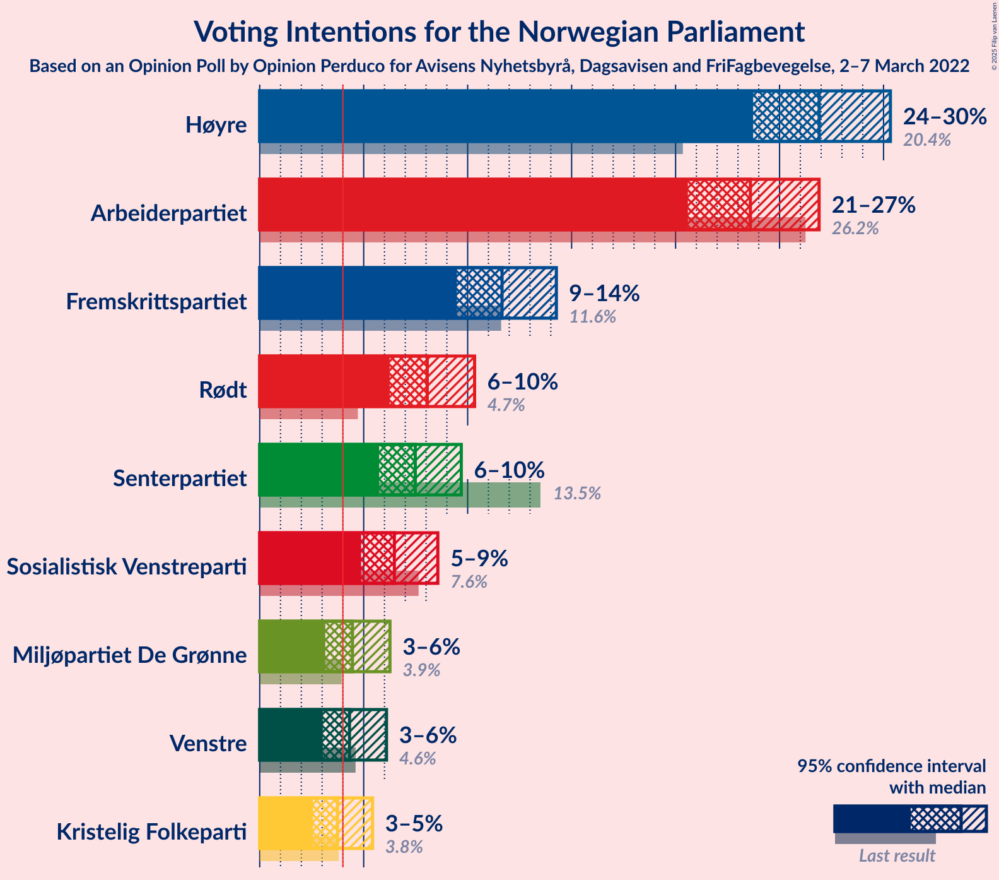

### Confidence Intervals

| Party | Last Result | Poll Result | 80% Confidence Interval | 90% Confidence Interval | 95% Confidence Interval | 99% Confidence Interval |
|:-----:|:-----------:|:-----------:|:-----------------------:|:-----------------------:|:-----------------------:|:-----------------------:|
| Høyre | 20.4% | 26.9% | 24.8–29.1% |24.2–29.8% |23.7–30.3% |22.8–31.4% |
| Arbeiderpartiet | 26.2% | 23.6% | 21.6–25.8% |21.1–26.4% |20.6–26.9% |19.7–28.0% |
| Fremskrittspartiet | 11.6% | 11.7% | 10.2–13.4% |9.8–13.8% |9.5–14.3% |8.8–15.1% |
| Rødt | 4.7% | 8.1% | 6.9–9.5% |6.5–10.0% |6.2–10.3% |5.7–11.1% |
| Senterpartiet | 13.5% | 7.5% | 6.3–8.9% |6.0–9.3% |5.7–9.7% |5.2–10.4% |
| Sosialistisk Venstreparti | 7.6% | 6.5% | 5.4–7.8% |5.1–8.2% |4.9–8.6% |4.4–9.3% |
| Miljøpartiet De Grønne | 3.9% | 4.5% | 3.6–5.6% |3.4–6.0% |3.2–6.3% |2.8–6.9% |
| Venstre | 4.6% | 4.3% | 3.5–5.5% |3.2–5.8% |3.0–6.1% |2.7–6.7% |
| Kristelig Folkeparti | 3.8% | 3.7% | 3.0–4.8% |2.7–5.2% |2.6–5.4% |2.2–6.0% |

*Note:* The poll result column reflects the actual value used in the calculations. Published results may vary slightly, and in addition be rounded to fewer digits.

## Seats

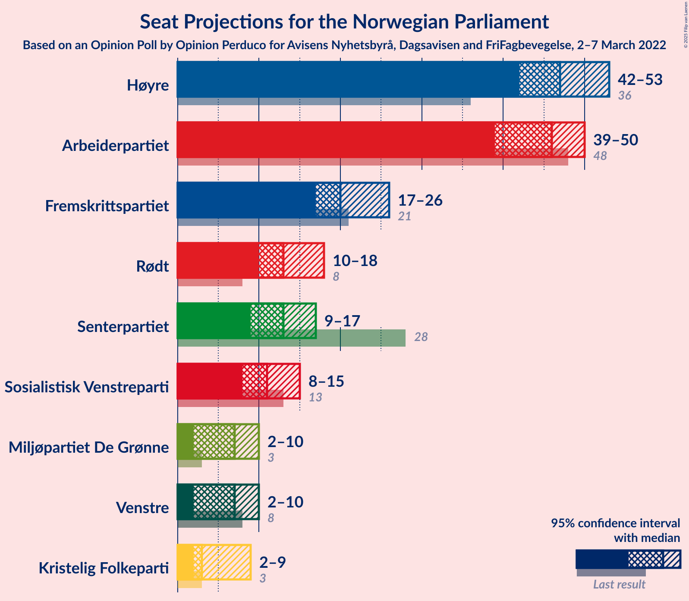

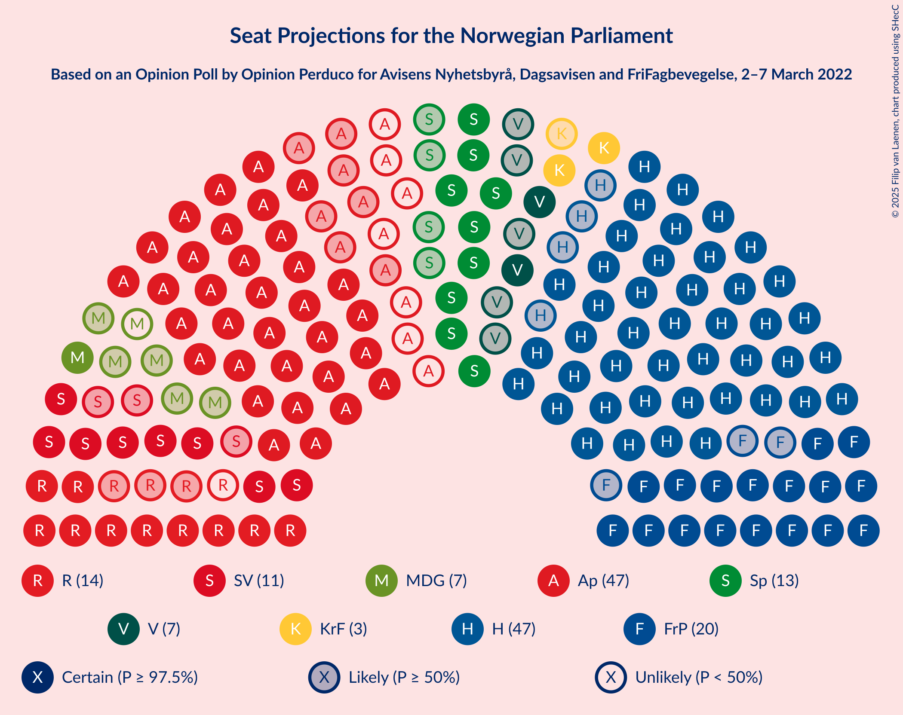

### Confidence Intervals

| Party | Last Result | Median | 80% Confidence Interval | 90% Confidence Interval | 95% Confidence Interval | 99% Confidence Interval |
|:-----:|:-----------:|:------:|:-----------------------:|:-----------------------:|:-----------------------:|:-----------------------:|
| <a href="#høyre">Høyre</a> | 36 | 47 | 44–50 |43–52 |42–53 |40–55 |
| <a href="#arbeiderpartiet">Arbeiderpartiet</a> | 48 | 46 | 42–48 |40–49 |39–50 |37–52 |
| <a href="#fremskrittspartiet">Fremskrittspartiet</a> | 21 | 20 | 17–24 |17–25 |17–26 |15–27 |
| <a href="#rødt">Rødt</a> | 8 | 13 | 11–16 |10–17 |10–18 |9–19 |
| <a href="#senterpartiet">Senterpartiet</a> | 28 | 13 | 11–15 |10–16 |9–17 |8–18 |
| <a href="#sosialistisk-venstreparti">Sosialistisk Venstreparti</a> | 13 | 11 | 9–13 |8–14 |8–15 |7–16 |
| <a href="#miljøpartiet-de-grønne">Miljøpartiet De Grønne</a> | 3 | 7 | 2–9 |2–10 |2–10 |1–11 |
| <a href="#venstre">Venstre</a> | 8 | 7 | 2–9 |2–9 |2–10 |2–11 |
| <a href="#kristelig-folkeparti">Kristelig Folkeparti</a> | 3 | 3 | 2–8 |2–8 |2–9 |1–10 |

### Høyre

*For a full overview of the results for this party, see the [Høyre](party-høyre.html) page.*

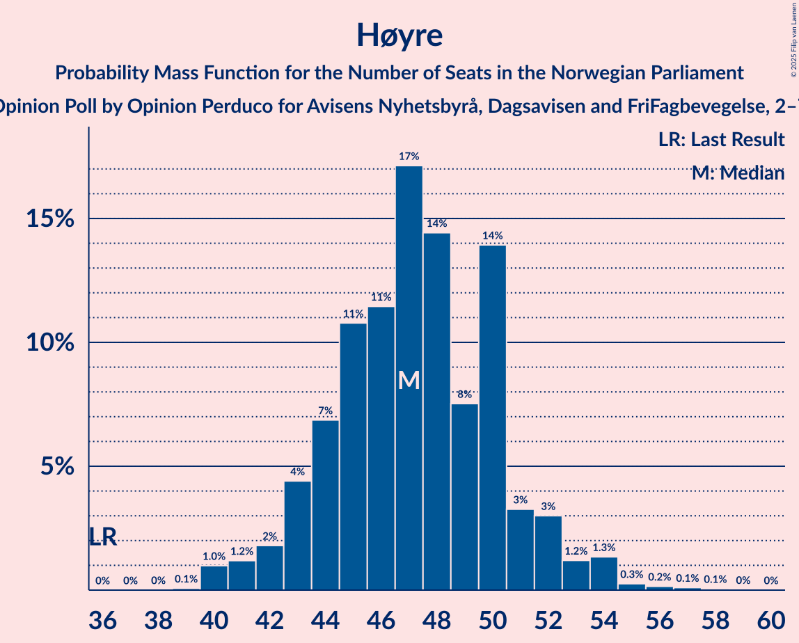

| Number of Seats | Probability | Accumulated | Special Marks |
|:---------------:|:-----------:|:-----------:|:-------------:|
| 36 | 0% | 100% | Last Result |
| 37 | 0% | 100% |  |
| 38 | 0% | 100% |  |
| 39 | 0.1% | 100% |  |
| 40 | 1.0% | 99.9% |  |
| 41 | 1.2% | 98.9% |  |
| 42 | 2% | 98% |  |
| 43 | 4% | 96% |  |
| 44 | 7% | 92% |  |
| 45 | 11% | 85% |  |
| 46 | 11% | 74% |  |
| 47 | 17% | 62% | Median |
| 48 | 14% | 45% |  |
| 49 | 8% | 31% |  |
| 50 | 14% | 23% |  |
| 51 | 3% | 9% |  |
| 52 | 3% | 6% |  |
| 53 | 1.2% | 3% |  |
| 54 | 1.3% | 2% |  |
| 55 | 0.3% | 0.6% |  |
| 56 | 0.2% | 0.3% |  |
| 57 | 0.1% | 0.2% |  |
| 58 | 0.1% | 0.1% |  |
| 59 | 0% | 0% |  |

### Arbeiderpartiet

*For a full overview of the results for this party, see the [Arbeiderpartiet](party-arbeiderpartiet.html) page.*

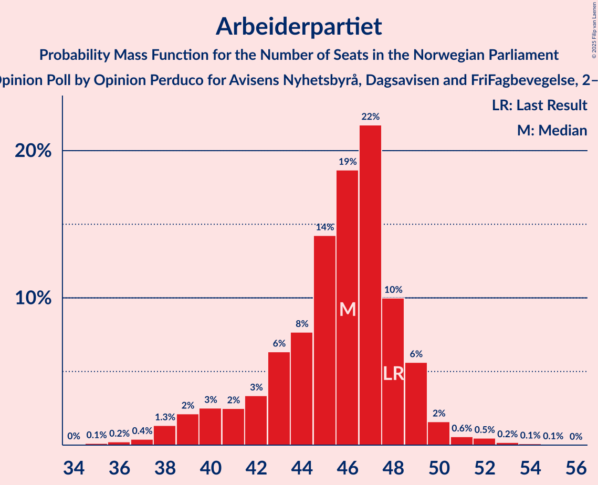

| Number of Seats | Probability | Accumulated | Special Marks |
|:---------------:|:-----------:|:-----------:|:-------------:|
| 34 | 0% | 100% |  |
| 35 | 0.1% | 99.9% |  |
| 36 | 0.2% | 99.8% |  |
| 37 | 0.4% | 99.6% |  |
| 38 | 1.3% | 99.2% |  |
| 39 | 2% | 98% |  |
| 40 | 3% | 96% |  |
| 41 | 2% | 93% |  |
| 42 | 3% | 91% |  |
| 43 | 6% | 87% |  |
| 44 | 8% | 81% |  |
| 45 | 14% | 73% |  |
| 46 | 19% | 59% | Median |
| 47 | 22% | 40% |  |
| 48 | 10% | 19% | Last Result |
| 49 | 6% | 9% |  |
| 50 | 2% | 3% |  |
| 51 | 0.6% | 1.4% |  |
| 52 | 0.5% | 0.8% |  |
| 53 | 0.2% | 0.4% |  |
| 54 | 0.1% | 0.2% |  |
| 55 | 0.1% | 0.1% |  |
| 56 | 0% | 0% |  |

### Fremskrittspartiet

*For a full overview of the results for this party, see the [Fremskrittspartiet](party-fremskrittspartiet.html) page.*

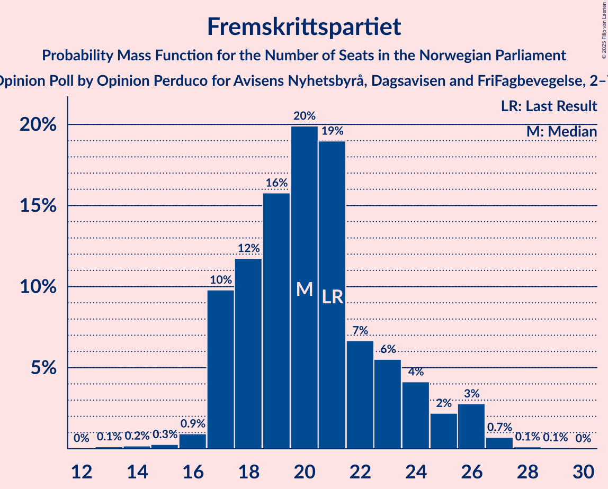

| Number of Seats | Probability | Accumulated | Special Marks |
|:---------------:|:-----------:|:-----------:|:-------------:|
| 12 | 0% | 100% |  |
| 13 | 0.1% | 99.9% |  |
| 14 | 0.2% | 99.8% |  |
| 15 | 0.3% | 99.6% |  |
| 16 | 0.9% | 99.4% |  |
| 17 | 10% | 98% |  |
| 18 | 12% | 89% |  |
| 19 | 16% | 77% |  |
| 20 | 20% | 61% | Median |
| 21 | 19% | 41% | Last Result |
| 22 | 7% | 22% |  |
| 23 | 6% | 16% |  |
| 24 | 4% | 10% |  |
| 25 | 2% | 6% |  |
| 26 | 3% | 4% |  |
| 27 | 0.7% | 0.9% |  |
| 28 | 0.1% | 0.2% |  |
| 29 | 0.1% | 0.1% |  |
| 30 | 0% | 0% |  |

### Rødt

*For a full overview of the results for this party, see the [Rødt](party-rødt.html) page.*

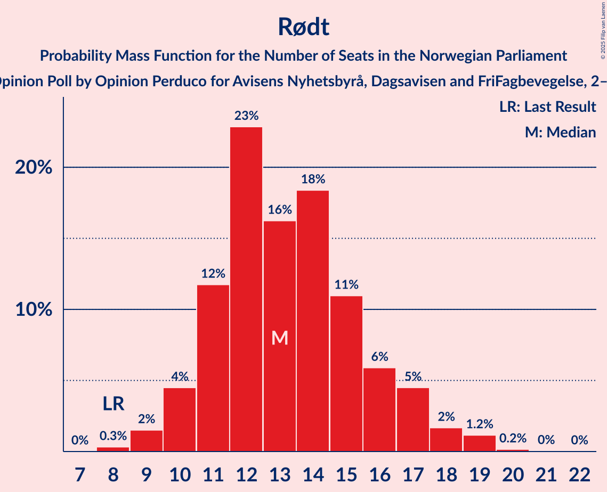

| Number of Seats | Probability | Accumulated | Special Marks |
|:---------------:|:-----------:|:-----------:|:-------------:|
| 8 | 0.3% | 100% | Last Result |
| 9 | 2% | 99.7% |  |
| 10 | 4% | 98% |  |
| 11 | 12% | 94% |  |
| 12 | 23% | 82% |  |
| 13 | 16% | 59% | Median |
| 14 | 18% | 43% |  |
| 15 | 11% | 24% |  |
| 16 | 6% | 13% |  |
| 17 | 5% | 8% |  |
| 18 | 2% | 3% |  |
| 19 | 1.2% | 1.4% |  |
| 20 | 0.2% | 0.2% |  |
| 21 | 0% | 0.1% |  |
| 22 | 0% | 0% |  |

### Senterpartiet

*For a full overview of the results for this party, see the [Senterpartiet](party-senterpartiet.html) page.*

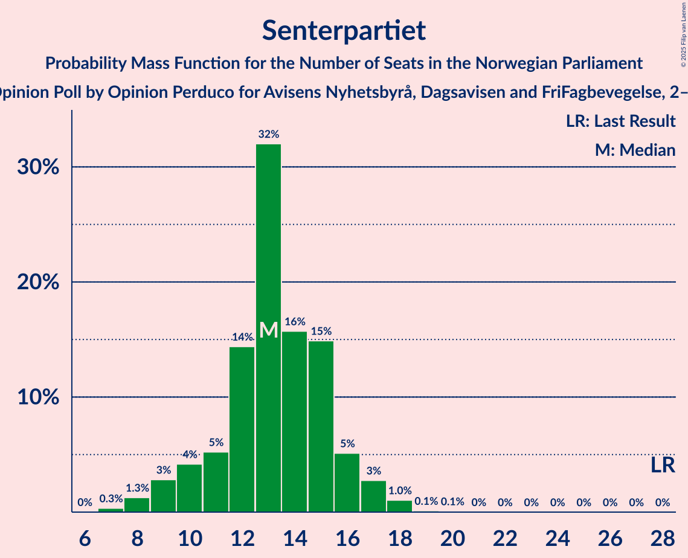

| Number of Seats | Probability | Accumulated | Special Marks |
|:---------------:|:-----------:|:-----------:|:-------------:|
| 7 | 0.3% | 100% |  |
| 8 | 1.3% | 99.6% |  |
| 9 | 3% | 98% |  |
| 10 | 4% | 96% |  |
| 11 | 5% | 91% |  |
| 12 | 14% | 86% |  |
| 13 | 32% | 72% | Median |
| 14 | 16% | 40% |  |
| 15 | 15% | 24% |  |
| 16 | 5% | 9% |  |
| 17 | 3% | 4% |  |
| 18 | 1.0% | 1.3% |  |
| 19 | 0.1% | 0.2% |  |
| 20 | 0.1% | 0.1% |  |
| 21 | 0% | 0% |  |
| 22 | 0% | 0% |  |
| 23 | 0% | 0% |  |
| 24 | 0% | 0% |  |
| 25 | 0% | 0% |  |
| 26 | 0% | 0% |  |
| 27 | 0% | 0% |  |
| 28 | 0% | 0% | Last Result |

### Sosialistisk Venstreparti

*For a full overview of the results for this party, see the [Sosialistisk Venstreparti](party-sosialistiskvenstreparti.html) page.*

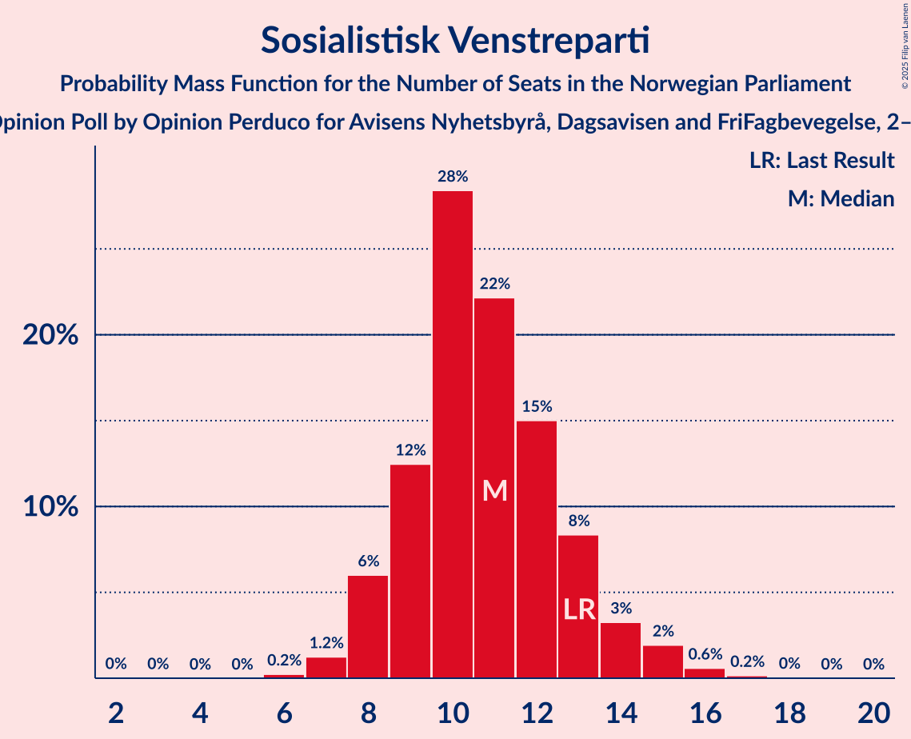

| Number of Seats | Probability | Accumulated | Special Marks |
|:---------------:|:-----------:|:-----------:|:-------------:|
| 2 | 0% | 100% |  |
| 3 | 0% | 99.9% |  |
| 4 | 0% | 99.9% |  |
| 5 | 0% | 99.9% |  |
| 6 | 0.2% | 99.9% |  |
| 7 | 1.2% | 99.7% |  |
| 8 | 6% | 98% |  |
| 9 | 12% | 92% |  |
| 10 | 28% | 80% |  |
| 11 | 22% | 52% | Median |
| 12 | 15% | 29% |  |
| 13 | 8% | 14% | Last Result |
| 14 | 3% | 6% |  |
| 15 | 2% | 3% |  |
| 16 | 0.6% | 0.8% |  |
| 17 | 0.2% | 0.2% |  |
| 18 | 0% | 0.1% |  |
| 19 | 0% | 0% |  |

### Miljøpartiet De Grønne

*For a full overview of the results for this party, see the [Miljøpartiet De Grønne](party-miljøpartietdegrønne.html) page.*

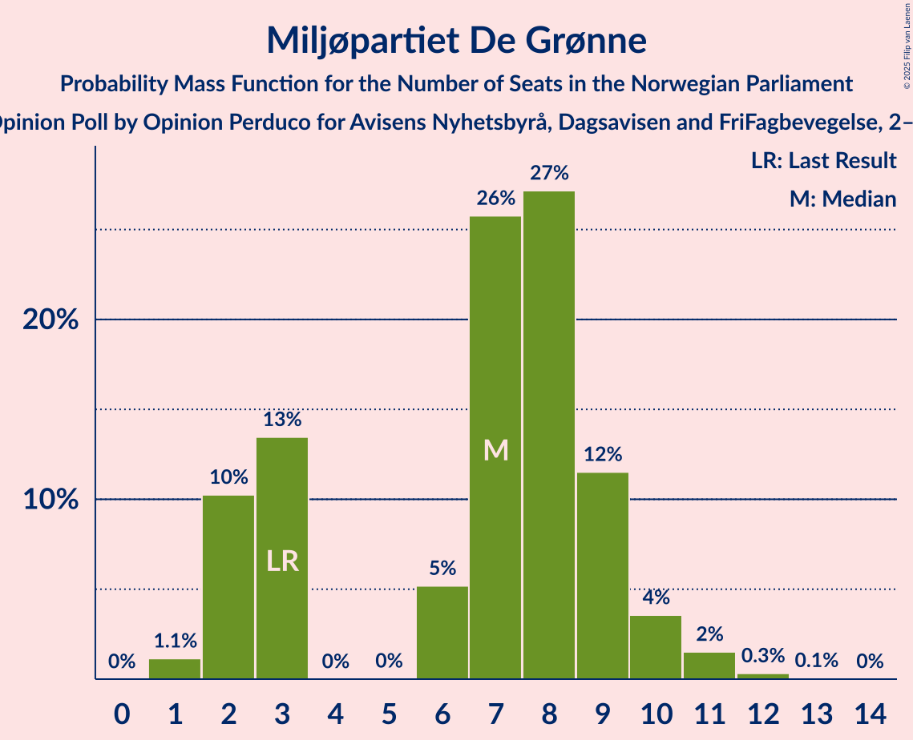

| Number of Seats | Probability | Accumulated | Special Marks |
|:---------------:|:-----------:|:-----------:|:-------------:|
| 1 | 1.1% | 100% |  |
| 2 | 10% | 98.9% |  |
| 3 | 13% | 89% | Last Result |
| 4 | 0% | 75% |  |
| 5 | 0% | 75% |  |
| 6 | 5% | 75% |  |
| 7 | 26% | 70% | Median |
| 8 | 27% | 44% |  |
| 9 | 12% | 17% |  |
| 10 | 4% | 5% |  |
| 11 | 2% | 2% |  |
| 12 | 0.3% | 0.4% |  |
| 13 | 0.1% | 0.1% |  |
| 14 | 0% | 0% |  |

### Venstre

*For a full overview of the results for this party, see the [Venstre](party-venstre.html) page.*

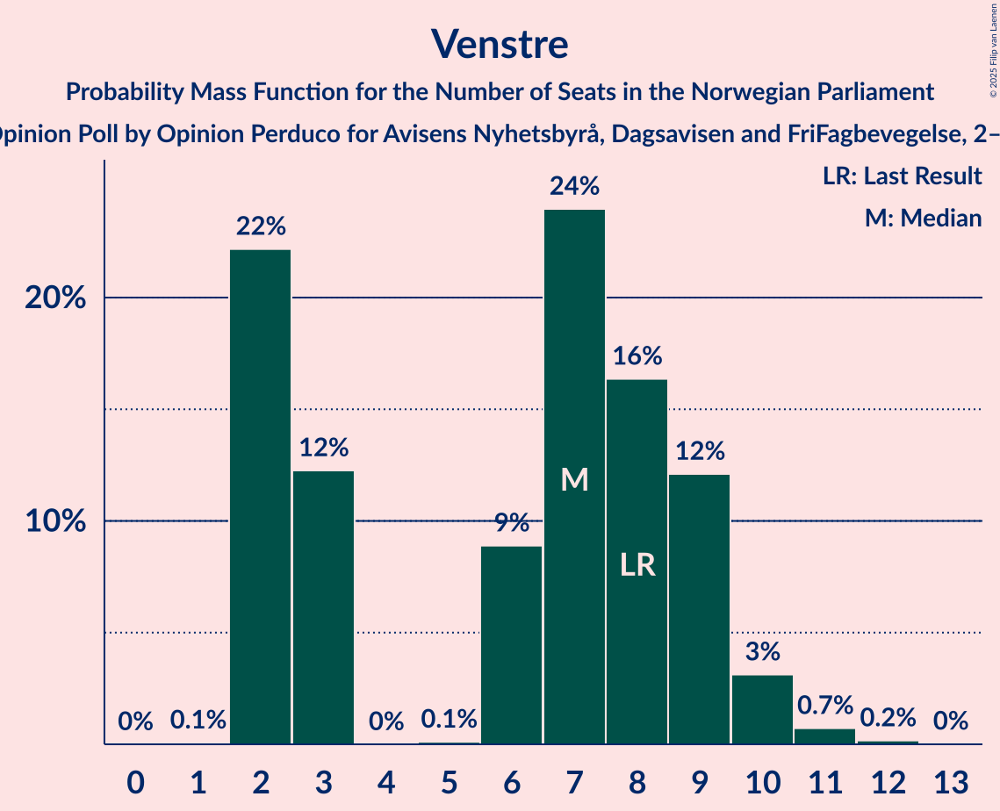

| Number of Seats | Probability | Accumulated | Special Marks |
|:---------------:|:-----------:|:-----------:|:-------------:|
| 1 | 0.1% | 100% |  |
| 2 | 22% | 99.9% |  |
| 3 | 12% | 78% |  |
| 4 | 0% | 65% |  |
| 5 | 0.1% | 65% |  |
| 6 | 9% | 65% |  |
| 7 | 24% | 56% | Median |
| 8 | 16% | 33% | Last Result |
| 9 | 12% | 16% |  |
| 10 | 3% | 4% |  |
| 11 | 0.7% | 0.9% |  |
| 12 | 0.2% | 0.2% |  |
| 13 | 0% | 0% |  |

### Kristelig Folkeparti

*For a full overview of the results for this party, see the [Kristelig Folkeparti](party-kristeligfolkeparti.html) page.*

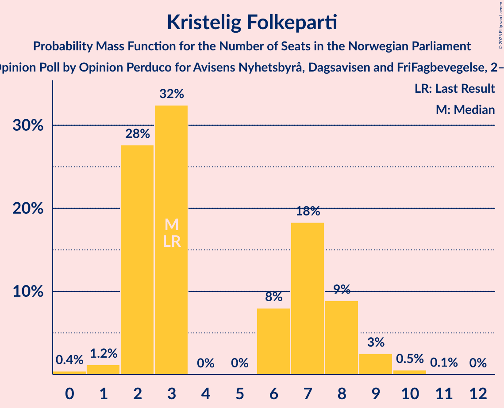

| Number of Seats | Probability | Accumulated | Special Marks |
|:---------------:|:-----------:|:-----------:|:-------------:|
| 0 | 0.4% | 100% |  |
| 1 | 1.2% | 99.6% |  |
| 2 | 28% | 98% |  |
| 3 | 32% | 71% | Last Result, Median |
| 4 | 0% | 38% |  |
| 5 | 0% | 38% |  |
| 6 | 8% | 38% |  |
| 7 | 18% | 30% |  |
| 8 | 9% | 12% |  |
| 9 | 3% | 3% |  |
| 10 | 0.5% | 0.6% |  |
| 11 | 0.1% | 0.1% |  |
| 12 | 0% | 0% |  |

## Coalitions

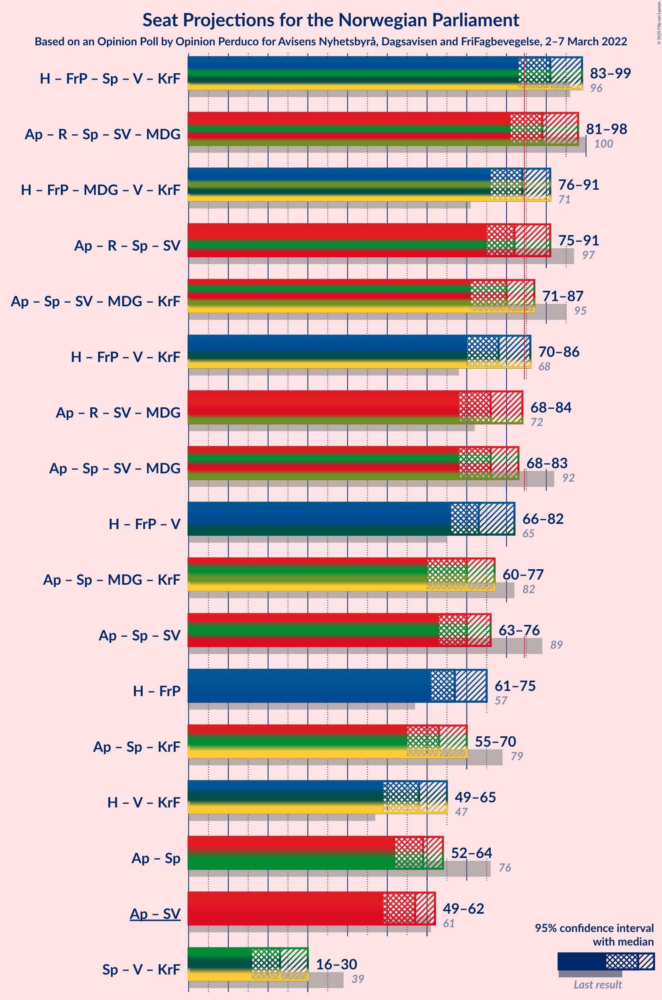

### Confidence Intervals

| Coalition | Last Result | Median | Majority? | 80% Confidence Interval | 90% Confidence Interval | 95% Confidence Interval | 99% Confidence Interval |
|:---------:|:-----------:|:------:|:---------:|:-----------------------:|:-----------------------:|:-----------------------:|:-----------------------:|
| Høyre – Fremskrittspartiet – Senterpartiet – Venstre – Kristelig Folkeparti | 96 | 91 | 95% | 86–96 | 84–97 | 83–99 | 81–101 |
| Arbeiderpartiet – Rødt – Senterpartiet – Sosialistisk Venstreparti – Miljøpartiet De Grønne | 100 | 89 | 84% | 83–95 | 82–96 | 81–98 | 79–100 |
| Høyre – Fremskrittspartiet – Miljøpartiet De Grønne – Venstre – Kristelig Folkeparti | 71 | 84 | 46% | 79–89 | 77–90 | 76–91 | 73–94 |
| Arbeiderpartiet – Rødt – Senterpartiet – Sosialistisk Venstreparti | 97 | 82 | 34% | 78–88 | 76–89 | 75–91 | 73–92 |
| Arbeiderpartiet – Senterpartiet – Sosialistisk Venstreparti – Miljøpartiet De Grønne – Kristelig Folkeparti | 95 | 80 | 19% | 75–85 | 73–86 | 71–87 | 69–90 |
| Høyre – Fremskrittspartiet – Venstre – Kristelig Folkeparti | 68 | 78 | 5% | 73–83 | 71–85 | 70–86 | 67–87 |
| Arbeiderpartiet – Rødt – Sosialistisk Venstreparti – Miljøpartiet De Grønne | 72 | 76 | 2% | 71–82 | 69–83 | 68–84 | 65–86 |
| Arbeiderpartiet – Senterpartiet – Sosialistisk Venstreparti – Miljøpartiet De Grønne | 92 | 76 | 0.8% | 71–81 | 69–82 | 68–83 | 66–86 |
| Høyre – Fremskrittspartiet – Venstre | 65 | 73 | 0.2% | 69–78 | 67–80 | 66–82 | 63–83 |
| Arbeiderpartiet – Senterpartiet – Miljøpartiet De Grønne – Kristelig Folkeparti | 82 | 70 | 0% | 64–75 | 62–76 | 60–77 | 58–79 |
| Arbeiderpartiet – Senterpartiet – Sosialistisk Venstreparti | 89 | 70 | 0% | 65–74 | 64–74 | 63–76 | 60–78 |
| Høyre – Fremskrittspartiet | 57 | 67 | 0% | 63–72 | 62–75 | 61–75 | 59–76 |
| Arbeiderpartiet – Senterpartiet – Kristelig Folkeparti | 79 | 63 | 0% | 58–68 | 57–68 | 55–70 | 53–73 |
| Høyre – Venstre – Kristelig Folkeparti | 47 | 58 | 0% | 52–62 | 51–64 | 49–65 | 48–68 |
| Arbeiderpartiet – Senterpartiet | 76 | 59 | 0% | 55–62 | 53–63 | 52–64 | 50–66 |
| Arbeiderpartiet – Sosialistisk Venstreparti | 61 | 57 | 0% | 53–59 | 50–61 | 49–62 | 47–63 |
| Senterpartiet – Venstre – Kristelig Folkeparti | 39 | 23 | 0% | 18–28 | 17–29 | 16–30 | 14–32 |

### Høyre – Fremskrittspartiet – Senterpartiet – Venstre – Kristelig Folkeparti

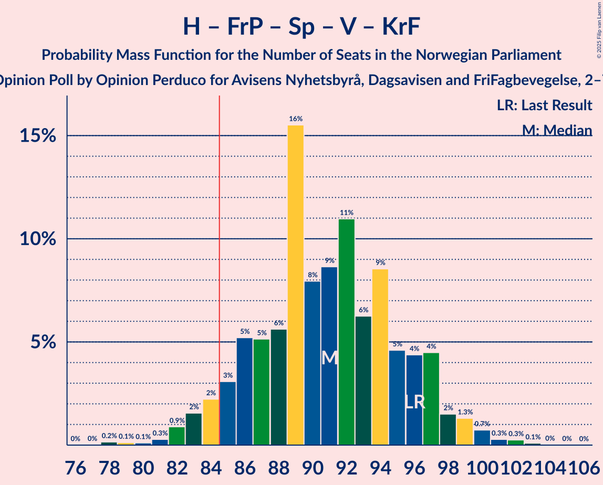

| Number of Seats | Probability | Accumulated | Special Marks |
|:---------------:|:-----------:|:-----------:|:-------------:|
| 78 | 0.2% | 100% |  |
| 79 | 0.1% | 99.8% |  |
| 80 | 0.1% | 99.7% |  |
| 81 | 0.3% | 99.6% |  |
| 82 | 0.9% | 99.3% |  |
| 83 | 2% | 98% |  |
| 84 | 2% | 97% |  |
| 85 | 3% | 95% | Majority |
| 86 | 5% | 92% |  |
| 87 | 5% | 86% |  |
| 88 | 6% | 81% |  |
| 89 | 16% | 76% |  |
| 90 | 8% | 60% | Median |
| 91 | 9% | 52% |  |
| 92 | 11% | 43% |  |
| 93 | 6% | 32% |  |
| 94 | 9% | 26% |  |
| 95 | 5% | 18% |  |
| 96 | 4% | 13% | Last Result |
| 97 | 4% | 9% |  |
| 98 | 2% | 4% |  |
| 99 | 1.3% | 3% |  |
| 100 | 0.7% | 1.4% |  |
| 101 | 0.3% | 0.7% |  |
| 102 | 0.3% | 0.4% |  |
| 103 | 0.1% | 0.2% |  |
| 104 | 0% | 0.1% |  |
| 105 | 0% | 0% |  |

### Arbeiderpartiet – Rødt – Senterpartiet – Sosialistisk Venstreparti – Miljøpartiet De Grønne

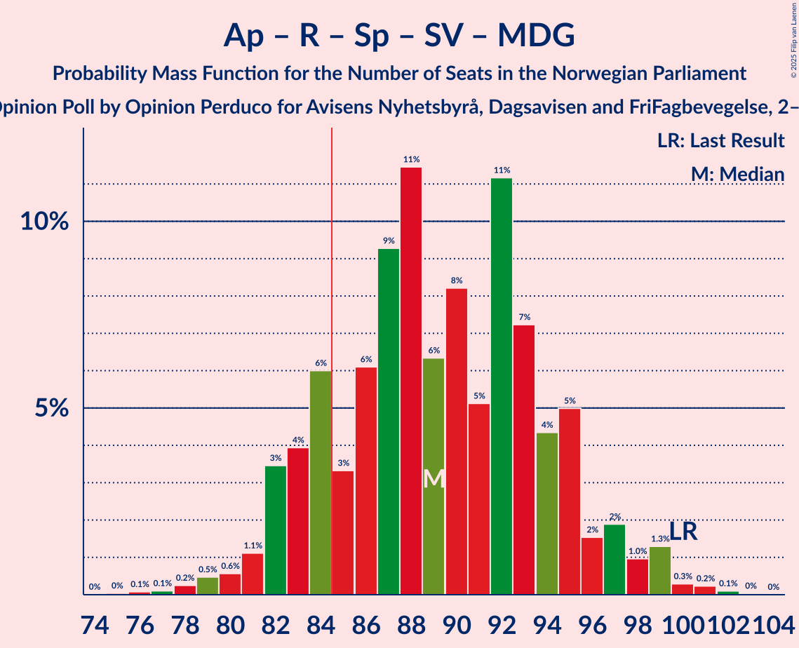

| Number of Seats | Probability | Accumulated | Special Marks |
|:---------------:|:-----------:|:-----------:|:-------------:|
| 75 | 0% | 100% |  |
| 76 | 0.1% | 99.9% |  |
| 77 | 0.1% | 99.9% |  |
| 78 | 0.2% | 99.8% |  |
| 79 | 0.5% | 99.5% |  |
| 80 | 0.6% | 99.0% |  |
| 81 | 1.1% | 98% |  |
| 82 | 3% | 97% |  |
| 83 | 4% | 94% |  |
| 84 | 6% | 90% |  |
| 85 | 3% | 84% | Majority |
| 86 | 6% | 81% |  |
| 87 | 9% | 75% |  |
| 88 | 11% | 65% |  |
| 89 | 6% | 54% |  |
| 90 | 8% | 47% | Median |
| 91 | 5% | 39% |  |
| 92 | 11% | 34% |  |
| 93 | 7% | 23% |  |
| 94 | 4% | 16% |  |
| 95 | 5% | 11% |  |
| 96 | 2% | 6% |  |
| 97 | 2% | 5% |  |
| 98 | 1.0% | 3% |  |
| 99 | 1.3% | 2% |  |
| 100 | 0.3% | 0.7% | Last Result |
| 101 | 0.2% | 0.4% |  |
| 102 | 0.1% | 0.1% |  |
| 103 | 0% | 0% |  |

### Høyre – Fremskrittspartiet – Miljøpartiet De Grønne – Venstre – Kristelig Folkeparti

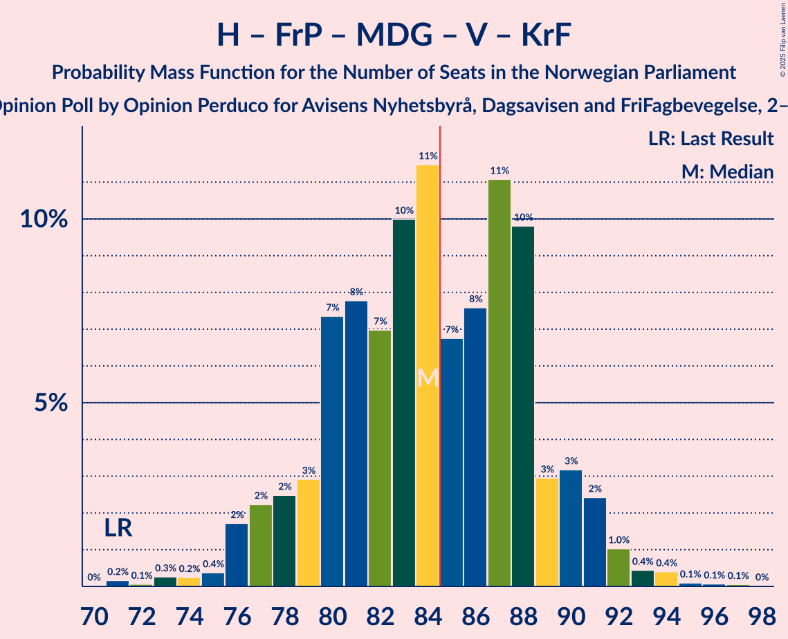

| Number of Seats | Probability | Accumulated | Special Marks |
|:---------------:|:-----------:|:-----------:|:-------------:|
| 71 | 0.2% | 100% | Last Result |
| 72 | 0.1% | 99.8% |  |
| 73 | 0.3% | 99.7% |  |
| 74 | 0.2% | 99.5% |  |
| 75 | 0.4% | 99.2% |  |
| 76 | 2% | 98.9% |  |
| 77 | 2% | 97% |  |
| 78 | 2% | 95% |  |
| 79 | 3% | 92% |  |
| 80 | 7% | 89% |  |
| 81 | 8% | 82% |  |
| 82 | 7% | 74% |  |
| 83 | 10% | 67% |  |
| 84 | 11% | 57% | Median |
| 85 | 7% | 46% | Majority |
| 86 | 8% | 39% |  |
| 87 | 11% | 32% |  |
| 88 | 10% | 20% |  |
| 89 | 3% | 11% |  |
| 90 | 3% | 8% |  |
| 91 | 2% | 5% |  |
| 92 | 1.0% | 2% |  |
| 93 | 0.4% | 1.1% |  |
| 94 | 0.4% | 0.7% |  |
| 95 | 0.1% | 0.3% |  |
| 96 | 0.1% | 0.2% |  |
| 97 | 0.1% | 0.1% |  |
| 98 | 0% | 0% |  |

### Arbeiderpartiet – Rødt – Senterpartiet – Sosialistisk Venstreparti

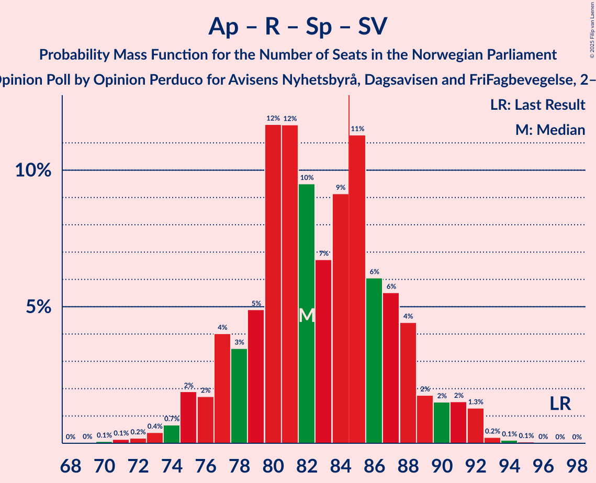

| Number of Seats | Probability | Accumulated | Special Marks |
|:---------------:|:-----------:|:-----------:|:-------------:|
| 70 | 0.1% | 100% |  |
| 71 | 0.1% | 99.9% |  |
| 72 | 0.2% | 99.7% |  |
| 73 | 0.4% | 99.6% |  |
| 74 | 0.7% | 99.2% |  |
| 75 | 2% | 98% |  |
| 76 | 2% | 97% |  |
| 77 | 4% | 95% |  |
| 78 | 3% | 91% |  |
| 79 | 5% | 87% |  |
| 80 | 12% | 82% |  |
| 81 | 12% | 71% |  |
| 82 | 10% | 59% |  |
| 83 | 7% | 50% | Median |
| 84 | 9% | 43% |  |
| 85 | 11% | 34% | Majority |
| 86 | 6% | 22% |  |
| 87 | 6% | 16% |  |
| 88 | 4% | 11% |  |
| 89 | 2% | 7% |  |
| 90 | 2% | 5% |  |
| 91 | 2% | 3% |  |
| 92 | 1.3% | 2% |  |
| 93 | 0.2% | 0.4% |  |
| 94 | 0.1% | 0.2% |  |
| 95 | 0.1% | 0.1% |  |
| 96 | 0% | 0% |  |
| 97 | 0% | 0% | Last Result |

### Arbeiderpartiet – Senterpartiet – Sosialistisk Venstreparti – Miljøpartiet De Grønne – Kristelig Folkeparti

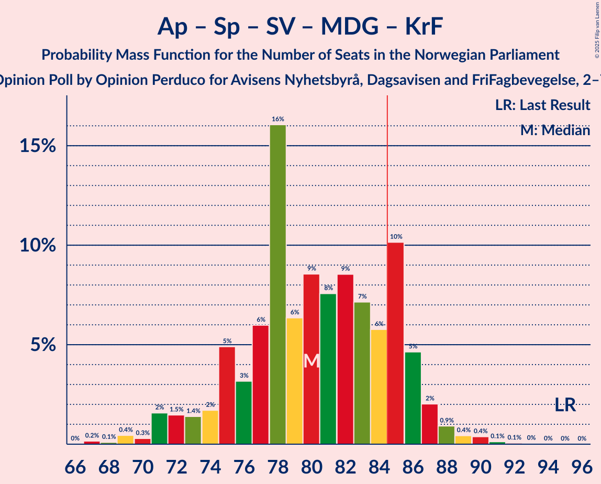

| Number of Seats | Probability | Accumulated | Special Marks |
|:---------------:|:-----------:|:-----------:|:-------------:|
| 66 | 0% | 100% |  |
| 67 | 0.2% | 99.9% |  |
| 68 | 0.1% | 99.8% |  |
| 69 | 0.4% | 99.7% |  |
| 70 | 0.3% | 99.3% |  |
| 71 | 2% | 99.0% |  |
| 72 | 1.5% | 97% |  |
| 73 | 1.4% | 96% |  |
| 74 | 2% | 95% |  |
| 75 | 5% | 93% |  |
| 76 | 3% | 88% |  |
| 77 | 6% | 85% |  |
| 78 | 16% | 79% |  |
| 79 | 6% | 63% |  |
| 80 | 9% | 56% | Median |
| 81 | 8% | 48% |  |
| 82 | 9% | 40% |  |
| 83 | 7% | 32% |  |
| 84 | 6% | 25% |  |
| 85 | 10% | 19% | Majority |
| 86 | 5% | 9% |  |
| 87 | 2% | 4% |  |
| 88 | 0.9% | 2% |  |
| 89 | 0.4% | 1.1% |  |
| 90 | 0.4% | 0.6% |  |
| 91 | 0.1% | 0.3% |  |
| 92 | 0.1% | 0.1% |  |
| 93 | 0% | 0.1% |  |
| 94 | 0% | 0% |  |
| 95 | 0% | 0% | Last Result |

### Høyre – Fremskrittspartiet – Venstre – Kristelig Folkeparti

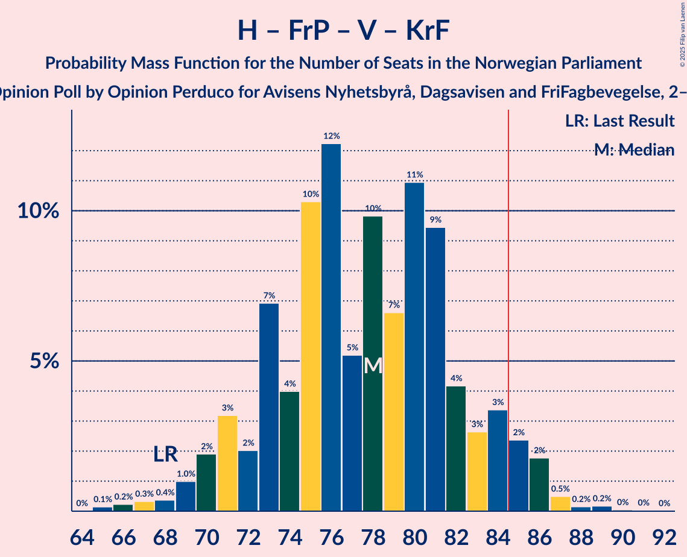

| Number of Seats | Probability | Accumulated | Special Marks |
|:---------------:|:-----------:|:-----------:|:-------------:|
| 65 | 0.1% | 100% |  |
| 66 | 0.2% | 99.8% |  |
| 67 | 0.3% | 99.6% |  |
| 68 | 0.4% | 99.3% | Last Result |
| 69 | 1.0% | 98.9% |  |
| 70 | 2% | 98% |  |
| 71 | 3% | 96% |  |
| 72 | 2% | 93% |  |
| 73 | 7% | 91% |  |
| 74 | 4% | 84% |  |
| 75 | 10% | 80% |  |
| 76 | 12% | 70% |  |
| 77 | 5% | 57% | Median |
| 78 | 10% | 52% |  |
| 79 | 7% | 42% |  |
| 80 | 11% | 36% |  |
| 81 | 9% | 25% |  |
| 82 | 4% | 15% |  |
| 83 | 3% | 11% |  |
| 84 | 3% | 8% |  |
| 85 | 2% | 5% | Majority |
| 86 | 2% | 3% |  |
| 87 | 0.5% | 0.9% |  |
| 88 | 0.2% | 0.4% |  |
| 89 | 0.2% | 0.3% |  |
| 90 | 0% | 0.1% |  |
| 91 | 0% | 0.1% |  |
| 92 | 0% | 0% |  |

### Arbeiderpartiet – Rødt – Sosialistisk Venstreparti – Miljøpartiet De Grønne

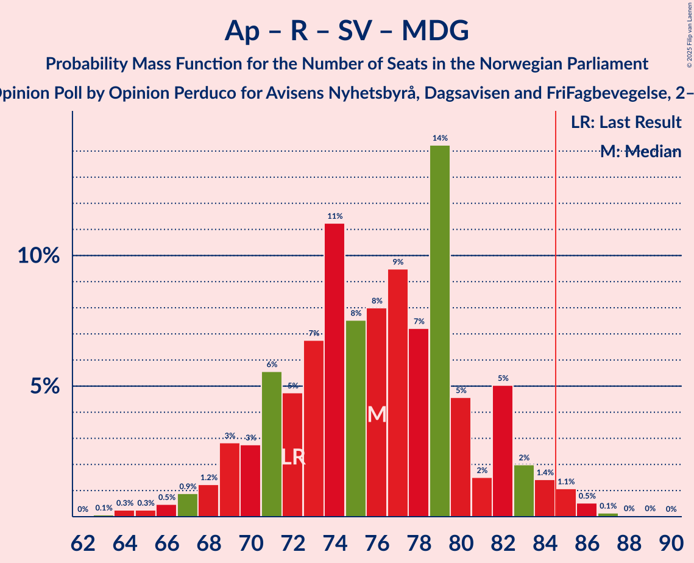

| Number of Seats | Probability | Accumulated | Special Marks |
|:---------------:|:-----------:|:-----------:|:-------------:|
| 63 | 0.1% | 100% |  |
| 64 | 0.3% | 99.9% |  |
| 65 | 0.3% | 99.6% |  |
| 66 | 0.5% | 99.4% |  |
| 67 | 0.9% | 98.9% |  |
| 68 | 1.2% | 98% |  |
| 69 | 3% | 97% |  |
| 70 | 3% | 94% |  |
| 71 | 6% | 91% |  |
| 72 | 5% | 86% | Last Result |
| 73 | 7% | 81% |  |
| 74 | 11% | 74% |  |
| 75 | 8% | 63% |  |
| 76 | 8% | 55% |  |
| 77 | 9% | 47% | Median |
| 78 | 7% | 38% |  |
| 79 | 14% | 31% |  |
| 80 | 5% | 16% |  |
| 81 | 2% | 12% |  |
| 82 | 5% | 10% |  |
| 83 | 2% | 5% |  |
| 84 | 1.4% | 3% |  |
| 85 | 1.1% | 2% | Majority |
| 86 | 0.5% | 0.8% |  |
| 87 | 0.1% | 0.3% |  |
| 88 | 0% | 0.1% |  |
| 89 | 0% | 0.1% |  |
| 90 | 0% | 0% |  |

### Arbeiderpartiet – Senterpartiet – Sosialistisk Venstreparti – Miljøpartiet De Grønne

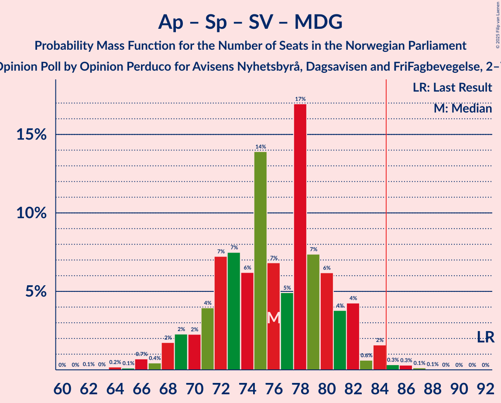

| Number of Seats | Probability | Accumulated | Special Marks |
|:---------------:|:-----------:|:-----------:|:-------------:|
| 62 | 0.1% | 100% |  |
| 63 | 0% | 99.9% |  |
| 64 | 0.2% | 99.9% |  |
| 65 | 0.1% | 99.7% |  |
| 66 | 0.7% | 99.6% |  |
| 67 | 0.4% | 98.9% |  |
| 68 | 2% | 98% |  |
| 69 | 2% | 97% |  |
| 70 | 2% | 94% |  |
| 71 | 4% | 92% |  |
| 72 | 7% | 88% |  |
| 73 | 7% | 81% |  |
| 74 | 6% | 73% |  |
| 75 | 14% | 67% |  |
| 76 | 7% | 53% |  |
| 77 | 5% | 47% | Median |
| 78 | 17% | 42% |  |
| 79 | 7% | 25% |  |
| 80 | 6% | 17% |  |
| 81 | 4% | 11% |  |
| 82 | 4% | 7% |  |
| 83 | 0.6% | 3% |  |
| 84 | 2% | 2% |  |
| 85 | 0.3% | 0.8% | Majority |
| 86 | 0.3% | 0.5% |  |
| 87 | 0.1% | 0.2% |  |
| 88 | 0.1% | 0.1% |  |
| 89 | 0% | 0% |  |
| 90 | 0% | 0% |  |
| 91 | 0% | 0% |  |
| 92 | 0% | 0% | Last Result |

### Høyre – Fremskrittspartiet – Venstre

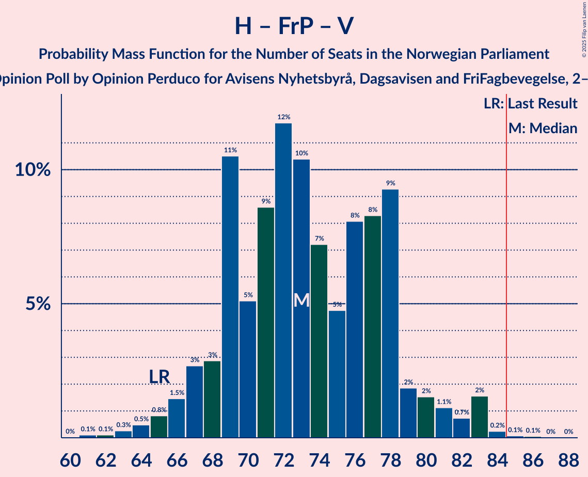

| Number of Seats | Probability | Accumulated | Special Marks |
|:---------------:|:-----------:|:-----------:|:-------------:|
| 61 | 0.1% | 100% |  |
| 62 | 0.1% | 99.9% |  |
| 63 | 0.3% | 99.8% |  |
| 64 | 0.5% | 99.5% |  |
| 65 | 0.8% | 99.0% | Last Result |
| 66 | 1.5% | 98% |  |
| 67 | 3% | 97% |  |
| 68 | 3% | 94% |  |
| 69 | 11% | 91% |  |
| 70 | 5% | 81% |  |
| 71 | 9% | 76% |  |
| 72 | 12% | 67% |  |
| 73 | 10% | 55% |  |
| 74 | 7% | 45% | Median |
| 75 | 5% | 38% |  |
| 76 | 8% | 33% |  |
| 77 | 8% | 25% |  |
| 78 | 9% | 16% |  |
| 79 | 2% | 7% |  |
| 80 | 2% | 5% |  |
| 81 | 1.1% | 4% |  |
| 82 | 0.7% | 3% |  |
| 83 | 2% | 2% |  |
| 84 | 0.2% | 0.4% |  |
| 85 | 0.1% | 0.2% | Majority |
| 86 | 0.1% | 0.1% |  |
| 87 | 0% | 0% |  |

### Arbeiderpartiet – Senterpartiet – Miljøpartiet De Grønne – Kristelig Folkeparti

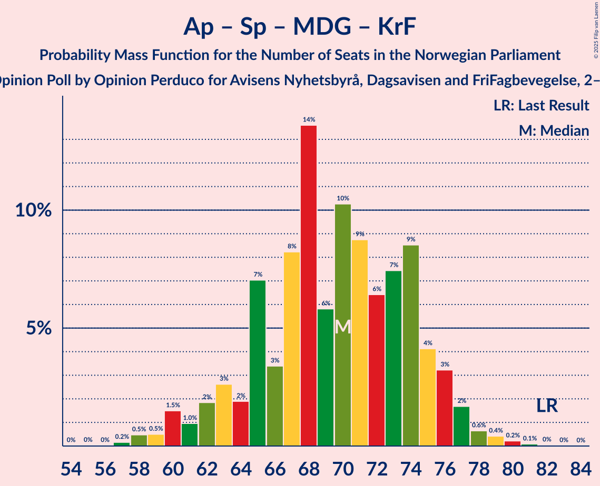

| Number of Seats | Probability | Accumulated | Special Marks |
|:---------------:|:-----------:|:-----------:|:-------------:|
| 55 | 0% | 100% |  |
| 56 | 0% | 99.9% |  |
| 57 | 0.2% | 99.9% |  |
| 58 | 0.5% | 99.8% |  |
| 59 | 0.5% | 99.3% |  |
| 60 | 1.5% | 98.8% |  |
| 61 | 1.0% | 97% |  |
| 62 | 2% | 96% |  |
| 63 | 3% | 94% |  |
| 64 | 2% | 92% |  |
| 65 | 7% | 90% |  |
| 66 | 3% | 83% |  |
| 67 | 8% | 80% |  |
| 68 | 14% | 71% |  |
| 69 | 6% | 58% | Median |
| 70 | 10% | 52% |  |
| 71 | 9% | 42% |  |
| 72 | 6% | 33% |  |
| 73 | 7% | 26% |  |
| 74 | 9% | 19% |  |
| 75 | 4% | 10% |  |
| 76 | 3% | 6% |  |
| 77 | 2% | 3% |  |
| 78 | 0.6% | 1.4% |  |
| 79 | 0.4% | 0.8% |  |
| 80 | 0.2% | 0.4% |  |
| 81 | 0.1% | 0.2% |  |
| 82 | 0% | 0.1% | Last Result |
| 83 | 0% | 0% |  |

### Arbeiderpartiet – Senterpartiet – Sosialistisk Venstreparti

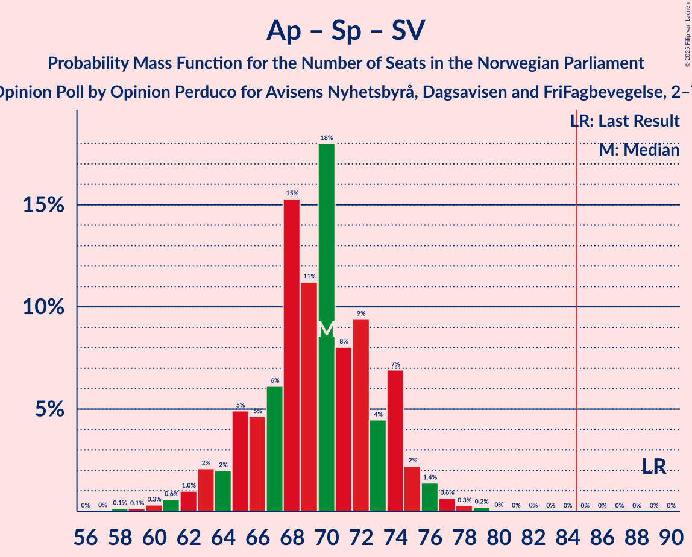

| Number of Seats | Probability | Accumulated | Special Marks |
|:---------------:|:-----------:|:-----------:|:-------------:|
| 58 | 0.1% | 100% |  |
| 59 | 0.1% | 99.8% |  |
| 60 | 0.3% | 99.7% |  |
| 61 | 0.6% | 99.4% |  |
| 62 | 1.0% | 98.8% |  |
| 63 | 2% | 98% |  |
| 64 | 2% | 96% |  |
| 65 | 5% | 94% |  |
| 66 | 5% | 89% |  |
| 67 | 6% | 84% |  |
| 68 | 15% | 78% |  |
| 69 | 11% | 63% |  |
| 70 | 18% | 52% | Median |
| 71 | 8% | 34% |  |
| 72 | 9% | 26% |  |
| 73 | 4% | 16% |  |
| 74 | 7% | 12% |  |
| 75 | 2% | 5% |  |
| 76 | 1.4% | 3% |  |
| 77 | 0.6% | 1.2% |  |
| 78 | 0.3% | 0.5% |  |
| 79 | 0.2% | 0.3% |  |
| 80 | 0% | 0.1% |  |
| 81 | 0% | 0% |  |
| 82 | 0% | 0% |  |
| 83 | 0% | 0% |  |
| 84 | 0% | 0% |  |
| 85 | 0% | 0% | Majority |
| 86 | 0% | 0% |  |
| 87 | 0% | 0% |  |
| 88 | 0% | 0% |  |
| 89 | 0% | 0% | Last Result |

### Høyre – Fremskrittspartiet

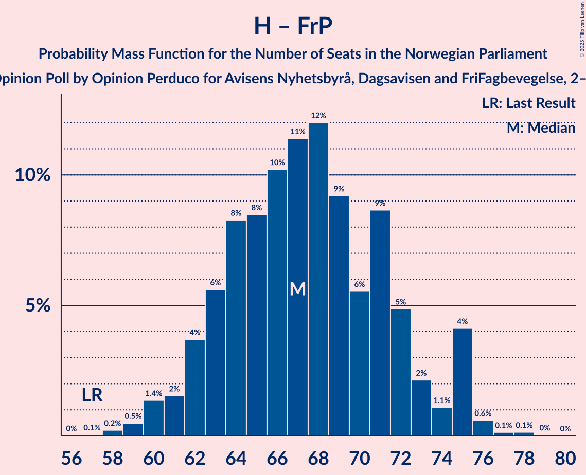

| Number of Seats | Probability | Accumulated | Special Marks |
|:---------------:|:-----------:|:-----------:|:-------------:|
| 57 | 0.1% | 100% | Last Result |
| 58 | 0.2% | 99.9% |  |
| 59 | 0.5% | 99.7% |  |
| 60 | 1.4% | 99.2% |  |
| 61 | 2% | 98% |  |
| 62 | 4% | 96% |  |
| 63 | 6% | 93% |  |
| 64 | 8% | 87% |  |
| 65 | 8% | 79% |  |
| 66 | 10% | 70% |  |
| 67 | 11% | 60% | Median |
| 68 | 12% | 49% |  |
| 69 | 9% | 37% |  |
| 70 | 6% | 27% |  |
| 71 | 9% | 22% |  |
| 72 | 5% | 13% |  |
| 73 | 2% | 8% |  |
| 74 | 1.1% | 6% |  |
| 75 | 4% | 5% |  |
| 76 | 0.6% | 1.0% |  |
| 77 | 0.1% | 0.4% |  |
| 78 | 0.1% | 0.2% |  |
| 79 | 0% | 0.1% |  |
| 80 | 0% | 0% |  |

### Arbeiderpartiet – Senterpartiet – Kristelig Folkeparti

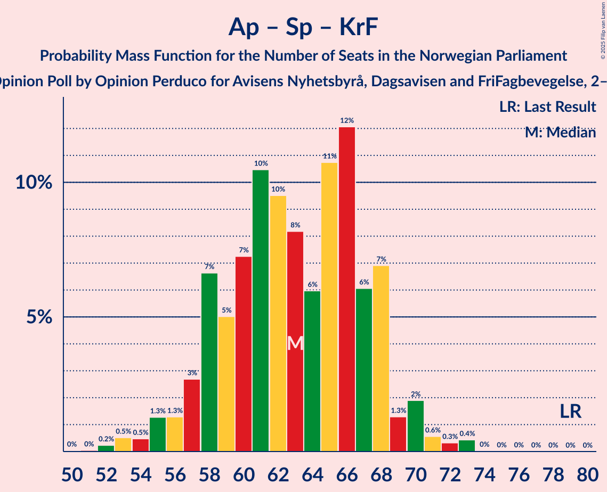

| Number of Seats | Probability | Accumulated | Special Marks |
|:---------------:|:-----------:|:-----------:|:-------------:|
| 50 | 0% | 100% |  |
| 51 | 0% | 99.9% |  |
| 52 | 0.2% | 99.9% |  |
| 53 | 0.5% | 99.7% |  |
| 54 | 0.5% | 99.1% |  |
| 55 | 1.3% | 98.7% |  |
| 56 | 1.3% | 97% |  |
| 57 | 3% | 96% |  |
| 58 | 7% | 93% |  |
| 59 | 5% | 87% |  |
| 60 | 7% | 82% |  |
| 61 | 10% | 75% |  |
| 62 | 10% | 64% | Median |
| 63 | 8% | 55% |  |
| 64 | 6% | 46% |  |
| 65 | 11% | 40% |  |
| 66 | 12% | 30% |  |
| 67 | 6% | 18% |  |
| 68 | 7% | 11% |  |
| 69 | 1.3% | 5% |  |
| 70 | 2% | 3% |  |
| 71 | 0.6% | 1.4% |  |
| 72 | 0.3% | 0.8% |  |
| 73 | 0.4% | 0.5% |  |
| 74 | 0% | 0.1% |  |
| 75 | 0% | 0% |  |
| 76 | 0% | 0% |  |
| 77 | 0% | 0% |  |
| 78 | 0% | 0% |  |
| 79 | 0% | 0% | Last Result |

### Høyre – Venstre – Kristelig Folkeparti

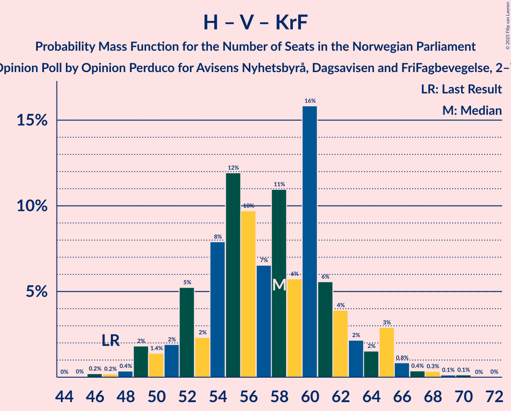

| Number of Seats | Probability | Accumulated | Special Marks |
|:---------------:|:-----------:|:-----------:|:-------------:|
| 46 | 0.2% | 100% |  |
| 47 | 0.2% | 99.7% | Last Result |
| 48 | 0.4% | 99.6% |  |
| 49 | 2% | 99.2% |  |
| 50 | 1.4% | 97% |  |
| 51 | 2% | 96% |  |
| 52 | 5% | 94% |  |
| 53 | 2% | 89% |  |
| 54 | 8% | 87% |  |
| 55 | 12% | 79% |  |
| 56 | 10% | 67% |  |
| 57 | 7% | 57% | Median |
| 58 | 11% | 50% |  |
| 59 | 6% | 39% |  |
| 60 | 16% | 34% |  |
| 61 | 6% | 18% |  |
| 62 | 4% | 12% |  |
| 63 | 2% | 8% |  |
| 64 | 2% | 6% |  |
| 65 | 3% | 5% |  |
| 66 | 0.8% | 2% |  |
| 67 | 0.4% | 1.0% |  |
| 68 | 0.3% | 0.6% |  |
| 69 | 0.1% | 0.3% |  |
| 70 | 0.1% | 0.2% |  |
| 71 | 0% | 0% |  |

### Arbeiderpartiet – Senterpartiet

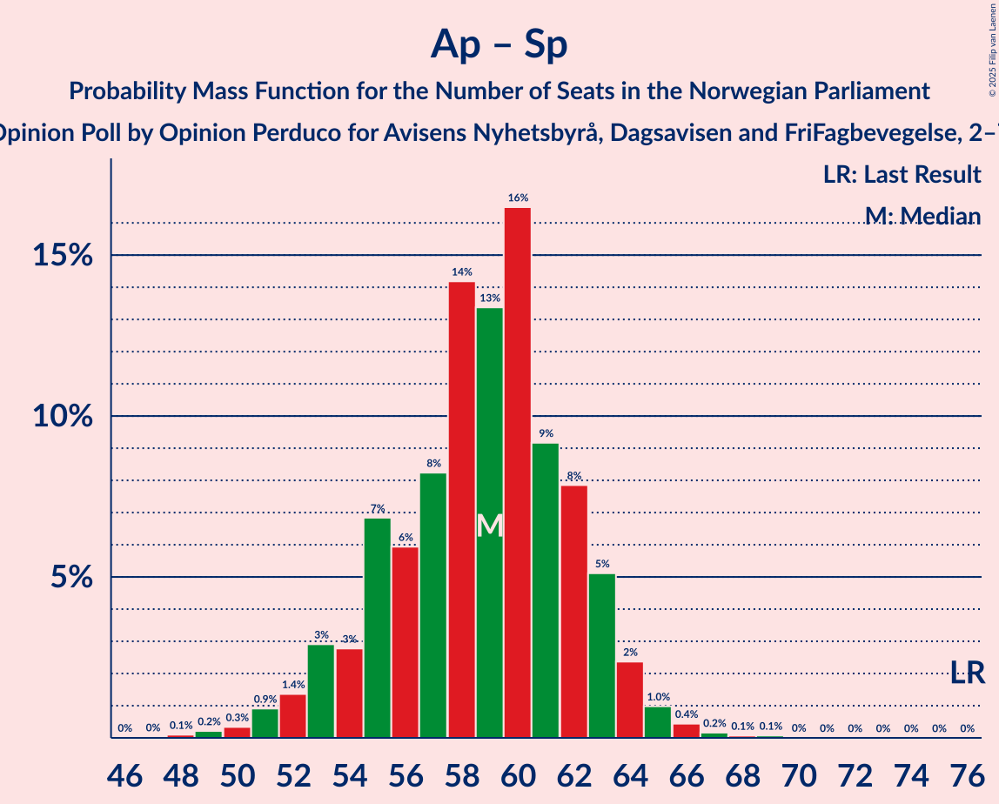

| Number of Seats | Probability | Accumulated | Special Marks |
|:---------------:|:-----------:|:-----------:|:-------------:|
| 48 | 0.1% | 100% |  |
| 49 | 0.2% | 99.9% |  |
| 50 | 0.3% | 99.6% |  |
| 51 | 0.9% | 99.3% |  |
| 52 | 1.4% | 98% |  |
| 53 | 3% | 97% |  |
| 54 | 3% | 94% |  |
| 55 | 7% | 91% |  |
| 56 | 6% | 84% |  |
| 57 | 8% | 79% |  |
| 58 | 14% | 70% |  |
| 59 | 13% | 56% | Median |
| 60 | 16% | 43% |  |
| 61 | 9% | 26% |  |
| 62 | 8% | 17% |  |
| 63 | 5% | 9% |  |
| 64 | 2% | 4% |  |
| 65 | 1.0% | 2% |  |
| 66 | 0.4% | 0.8% |  |
| 67 | 0.2% | 0.3% |  |
| 68 | 0.1% | 0.2% |  |
| 69 | 0.1% | 0.1% |  |
| 70 | 0% | 0% |  |
| 71 | 0% | 0% |  |
| 72 | 0% | 0% |  |
| 73 | 0% | 0% |  |
| 74 | 0% | 0% |  |
| 75 | 0% | 0% |  |
| 76 | 0% | 0% | Last Result |

### Arbeiderpartiet – Sosialistisk Venstreparti

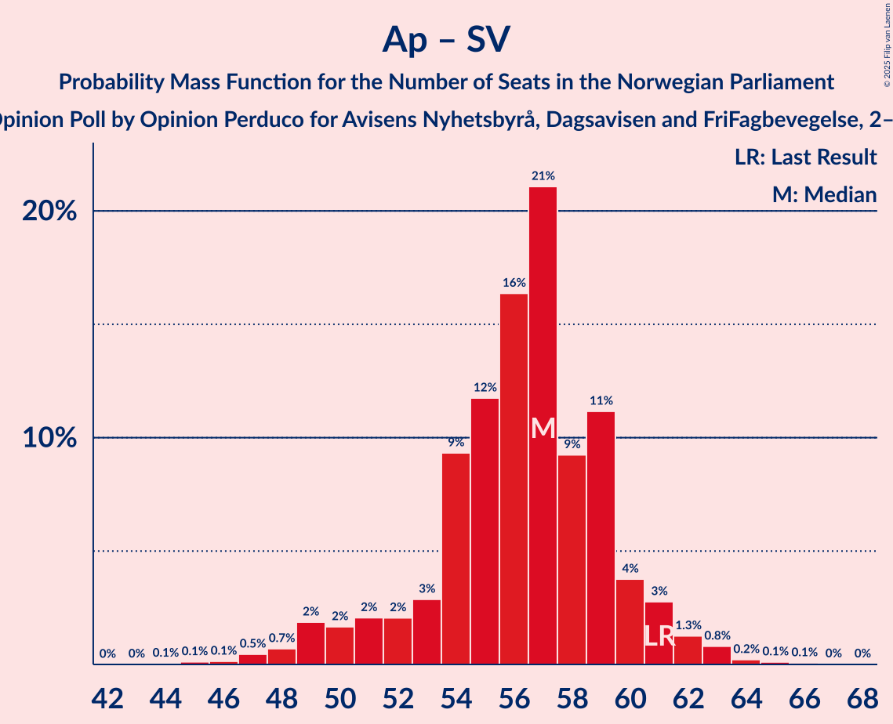

| Number of Seats | Probability | Accumulated | Special Marks |
|:---------------:|:-----------:|:-----------:|:-------------:|
| 44 | 0.1% | 100% |  |
| 45 | 0.1% | 99.9% |  |
| 46 | 0.1% | 99.8% |  |
| 47 | 0.5% | 99.7% |  |
| 48 | 0.7% | 99.2% |  |
| 49 | 2% | 98.5% |  |
| 50 | 2% | 97% |  |
| 51 | 2% | 95% |  |
| 52 | 2% | 93% |  |
| 53 | 3% | 91% |  |
| 54 | 9% | 88% |  |
| 55 | 12% | 79% |  |
| 56 | 16% | 67% |  |
| 57 | 21% | 51% | Median |
| 58 | 9% | 29% |  |
| 59 | 11% | 20% |  |
| 60 | 4% | 9% |  |
| 61 | 3% | 5% | Last Result |
| 62 | 1.3% | 3% |  |
| 63 | 0.8% | 1.3% |  |
| 64 | 0.2% | 0.5% |  |
| 65 | 0.1% | 0.2% |  |
| 66 | 0.1% | 0.1% |  |
| 67 | 0% | 0.1% |  |
| 68 | 0% | 0% |  |

### Senterpartiet – Venstre – Kristelig Folkeparti

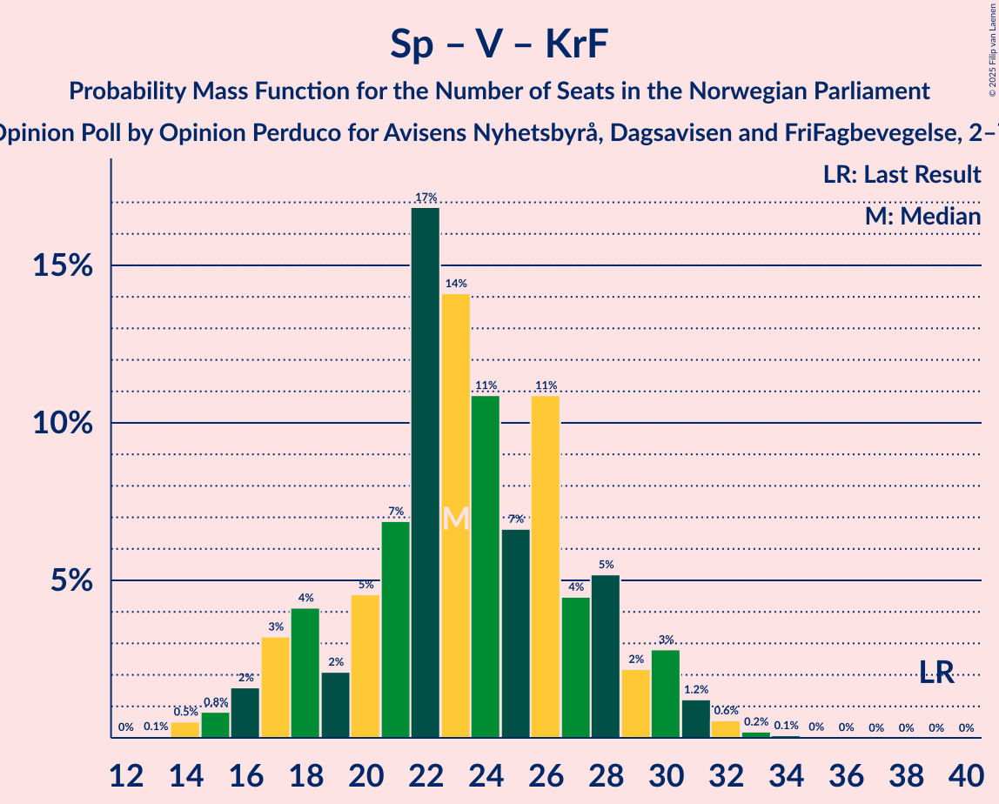

| Number of Seats | Probability | Accumulated | Special Marks |
|:---------------:|:-----------:|:-----------:|:-------------:|
| 13 | 0.1% | 100% |  |
| 14 | 0.5% | 99.9% |  |
| 15 | 0.8% | 99.4% |  |
| 16 | 2% | 98.6% |  |
| 17 | 3% | 97% |  |
| 18 | 4% | 94% |  |
| 19 | 2% | 90% |  |
| 20 | 5% | 88% |  |
| 21 | 7% | 83% |  |
| 22 | 17% | 76% |  |
| 23 | 14% | 59% | Median |
| 24 | 11% | 45% |  |
| 25 | 7% | 34% |  |
| 26 | 11% | 28% |  |
| 27 | 4% | 17% |  |
| 28 | 5% | 12% |  |
| 29 | 2% | 7% |  |
| 30 | 3% | 5% |  |
| 31 | 1.2% | 2% |  |
| 32 | 0.6% | 0.9% |  |
| 33 | 0.2% | 0.3% |  |
| 34 | 0.1% | 0.1% |  |
| 35 | 0% | 0.1% |  |
| 36 | 0% | 0% |  |
| 37 | 0% | 0% |  |
| 38 | 0% | 0% |  |
| 39 | 0% | 0% | Last Result |

## Technical Information

### Opinion Poll

+ **Polling firm:** Opinion Perduco
+ **Commissioner(s):** Avisens Nyhetsbyrå, Dagsavisen and FriFagbevegelse
+ **Fieldwork period:** 2–7 March 2022

### Calculations

+ **Sample size:** 695
+ **Simulations done:** 1,048,576
+ **Error estimate:** 1.45%

