# Opinion Poll by Respons Analyse for VG, 8–14 March 2022

<a href="#voting-intentions">Voting Intentions</a> | <a href="#seats">Seats</a> | <a href="#coalitions">Coalitions</a> | <a href="#technical-information">Technical Information</a>

## Voting Intentions

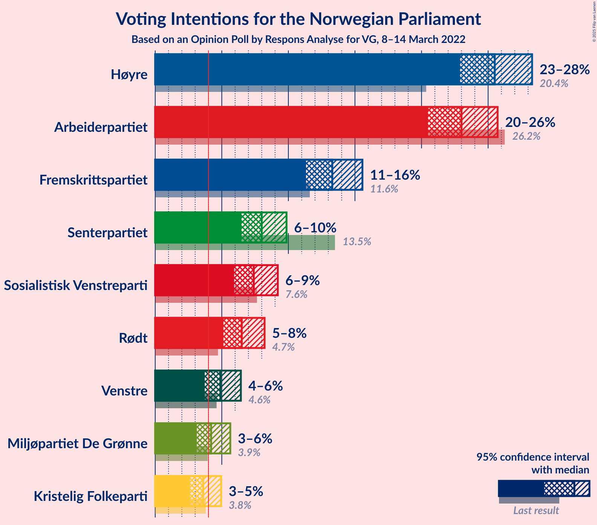

### Confidence Intervals

| Party | Last Result | Poll Result | 80% Confidence Interval | 90% Confidence Interval | 95% Confidence Interval | 99% Confidence Interval |
|:-----:|:-----------:|:-----------:|:-----------------------:|:-----------------------:|:-----------------------:|:-----------------------:|
| Høyre | 20.4% | 25.5% | 23.8–27.3% |23.3–27.8% |22.9–28.3% |22.1–29.2% |
| Arbeiderpartiet | 26.2% | 23.0% | 21.4–24.8% |20.9–25.3% |20.5–25.7% |19.7–26.6% |
| Fremskrittspartiet | 11.6% | 13.3% | 12.0–14.8% |11.6–15.2% |11.3–15.6% |10.7–16.3% |
| Senterpartiet | 13.5% | 8.0% | 7.0–9.2% |6.7–9.6% |6.5–9.9% |6.0–10.5% |
| Sosialistisk Venstreparti | 7.6% | 7.4% | 6.4–8.6% |6.2–8.9% |5.9–9.2% |5.5–9.8% |
| Rødt | 4.7% | 6.5% | 5.6–7.6% |5.3–7.9% |5.1–8.2% |4.7–8.8% |
| Venstre | 4.6% | 4.9% | 4.1–5.9% |3.9–6.2% |3.7–6.4% |3.4–6.9% |
| Miljøpartiet De Grønne | 3.9% | 4.2% | 3.5–5.1% |3.3–5.4% |3.1–5.6% |2.8–6.1% |
| Kristelig Folkeparti | 3.8% | 3.6% | 2.9–4.5% |2.8–4.7% |2.6–5.0% |2.3–5.4% |

*Note:* The poll result column reflects the actual value used in the calculations. Published results may vary slightly, and in addition be rounded to fewer digits.

## Seats

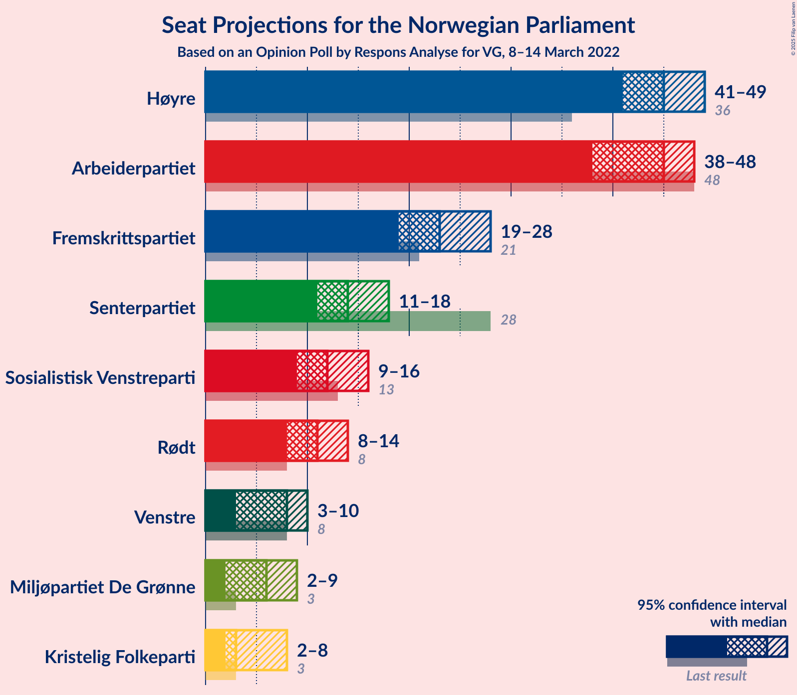

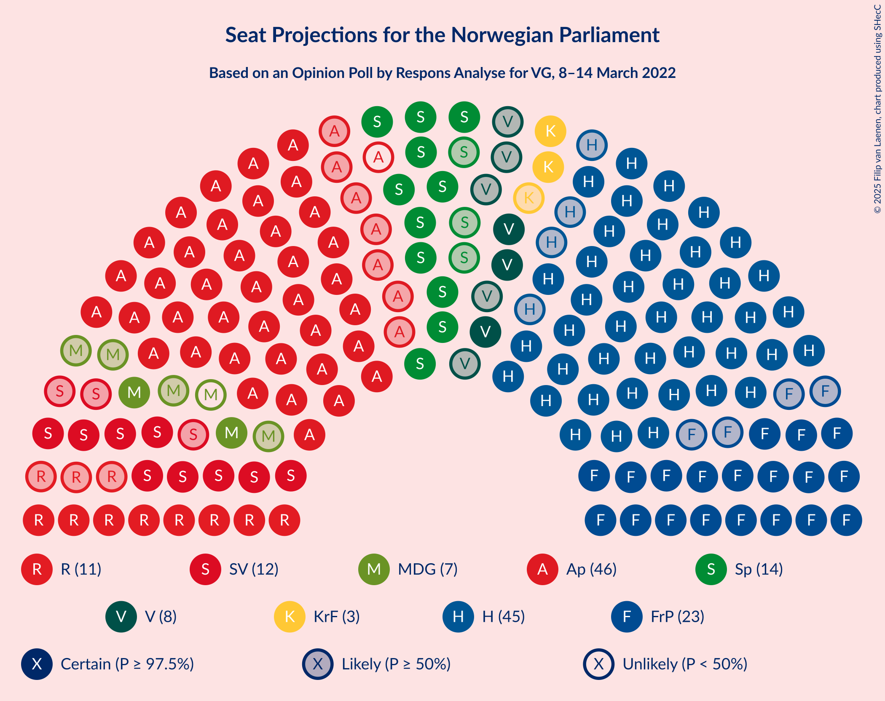

### Confidence Intervals

| Party | Last Result | Median | 80% Confidence Interval | 90% Confidence Interval | 95% Confidence Interval | 99% Confidence Interval |
|:-----:|:-----------:|:------:|:-----------------------:|:-----------------------:|:-----------------------:|:-----------------------:|
| <a href="#høyre">Høyre</a> | 36 | 45 | 42–48 |41–49 |41–49 |40–51 |
| <a href="#arbeiderpartiet">Arbeiderpartiet</a> | 48 | 45 | 40–47 |39–47 |38–48 |37–50 |
| <a href="#fremskrittspartiet">Fremskrittspartiet</a> | 21 | 23 | 20–26 |20–27 |19–28 |18–30 |
| <a href="#senterpartiet">Senterpartiet</a> | 28 | 14 | 13–16 |12–17 |11–18 |10–18 |
| <a href="#sosialistisk-venstreparti">Sosialistisk Venstreparti</a> | 13 | 12 | 10–15 |9–15 |9–16 |8–17 |
| <a href="#rødt">Rødt</a> | 8 | 11 | 9–12 |8–13 |8–14 |7–15 |
| <a href="#venstre">Venstre</a> | 8 | 8 | 6–10 |3–10 |3–10 |2–12 |
| <a href="#miljøpartiet-de-grønne">Miljøpartiet De Grønne</a> | 3 | 6 | 2–8 |2–9 |2–9 |1–10 |
| <a href="#kristelig-folkeparti">Kristelig Folkeparti</a> | 3 | 3 | 2–7 |2–8 |2–8 |1–9 |

### Høyre

*For a full overview of the results for this party, see the [Høyre](party-høyre.html) page.*

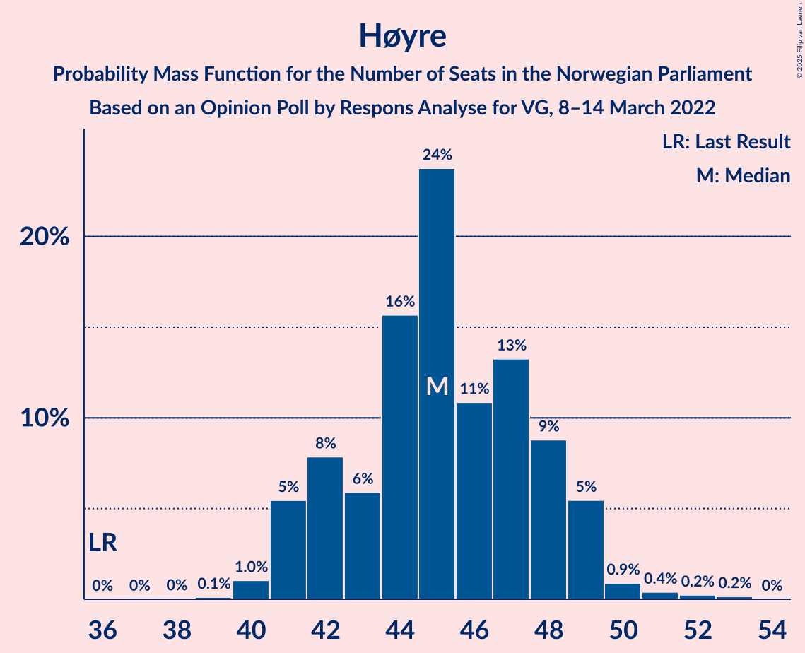

| Number of Seats | Probability | Accumulated | Special Marks |
|:---------------:|:-----------:|:-----------:|:-------------:|
| 36 | 0% | 100% | Last Result |
| 37 | 0% | 100% |  |
| 38 | 0% | 100% |  |
| 39 | 0.1% | 99.9% |  |
| 40 | 1.0% | 99.8% |  |
| 41 | 5% | 98.8% |  |
| 42 | 8% | 93% |  |
| 43 | 6% | 85% |  |
| 44 | 16% | 80% |  |
| 45 | 24% | 64% | Median |
| 46 | 11% | 40% |  |
| 47 | 13% | 29% |  |
| 48 | 9% | 16% |  |
| 49 | 5% | 7% |  |
| 50 | 0.9% | 2% |  |
| 51 | 0.4% | 0.8% |  |
| 52 | 0.2% | 0.4% |  |
| 53 | 0.2% | 0.2% |  |
| 54 | 0% | 0% |  |

### Arbeiderpartiet

*For a full overview of the results for this party, see the [Arbeiderpartiet](party-arbeiderpartiet.html) page.*

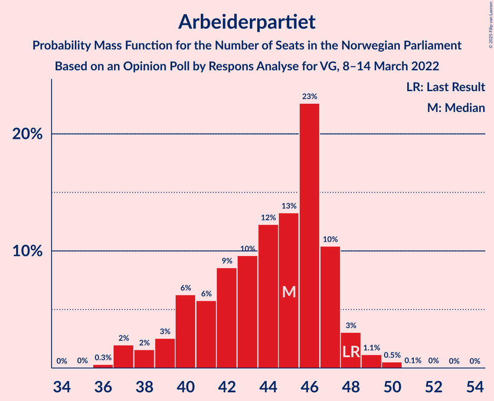

| Number of Seats | Probability | Accumulated | Special Marks |
|:---------------:|:-----------:|:-----------:|:-------------:|
| 35 | 0% | 100% |  |
| 36 | 0.3% | 99.9% |  |
| 37 | 2% | 99.6% |  |
| 38 | 2% | 98% |  |
| 39 | 3% | 96% |  |
| 40 | 6% | 94% |  |
| 41 | 6% | 87% |  |
| 42 | 9% | 82% |  |
| 43 | 10% | 73% |  |
| 44 | 12% | 63% |  |
| 45 | 13% | 51% | Median |
| 46 | 23% | 38% |  |
| 47 | 10% | 15% |  |
| 48 | 3% | 5% | Last Result |
| 49 | 1.1% | 2% |  |
| 50 | 0.5% | 0.6% |  |
| 51 | 0.1% | 0.1% |  |
| 52 | 0% | 0.1% |  |
| 53 | 0% | 0% |  |

### Fremskrittspartiet

*For a full overview of the results for this party, see the [Fremskrittspartiet](party-fremskrittspartiet.html) page.*

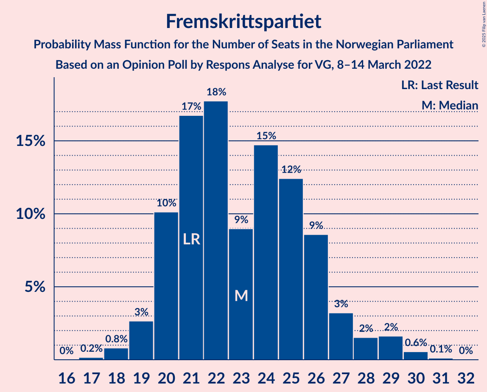

| Number of Seats | Probability | Accumulated | Special Marks |
|:---------------:|:-----------:|:-----------:|:-------------:|
| 17 | 0.2% | 100% |  |
| 18 | 0.8% | 99.8% |  |
| 19 | 3% | 99.0% |  |
| 20 | 10% | 96% |  |
| 21 | 17% | 86% | Last Result |
| 22 | 18% | 70% |  |
| 23 | 9% | 52% | Median |
| 24 | 15% | 43% |  |
| 25 | 12% | 28% |  |
| 26 | 9% | 16% |  |
| 27 | 3% | 7% |  |
| 28 | 2% | 4% |  |
| 29 | 2% | 2% |  |
| 30 | 0.6% | 0.7% |  |
| 31 | 0.1% | 0.1% |  |
| 32 | 0% | 0% |  |

### Senterpartiet

*For a full overview of the results for this party, see the [Senterpartiet](party-senterpartiet.html) page.*

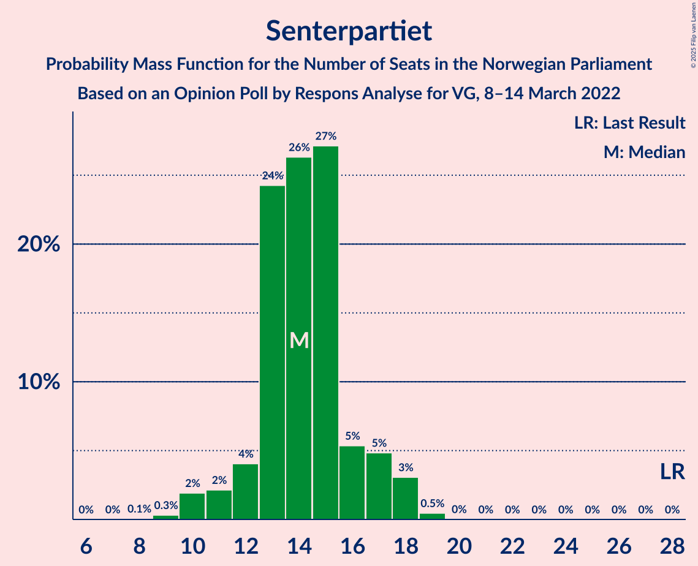

| Number of Seats | Probability | Accumulated | Special Marks |
|:---------------:|:-----------:|:-----------:|:-------------:|
| 8 | 0.1% | 100% |  |
| 9 | 0.3% | 99.9% |  |
| 10 | 2% | 99.6% |  |
| 11 | 2% | 98% |  |
| 12 | 4% | 96% |  |
| 13 | 24% | 91% |  |
| 14 | 26% | 67% | Median |
| 15 | 27% | 41% |  |
| 16 | 5% | 14% |  |
| 17 | 5% | 8% |  |
| 18 | 3% | 4% |  |
| 19 | 0.5% | 0.5% |  |
| 20 | 0% | 0% |  |
| 21 | 0% | 0% |  |
| 22 | 0% | 0% |  |
| 23 | 0% | 0% |  |
| 24 | 0% | 0% |  |
| 25 | 0% | 0% |  |
| 26 | 0% | 0% |  |
| 27 | 0% | 0% |  |
| 28 | 0% | 0% | Last Result |

### Sosialistisk Venstreparti

*For a full overview of the results for this party, see the [Sosialistisk Venstreparti](party-sosialistiskvenstreparti.html) page.*

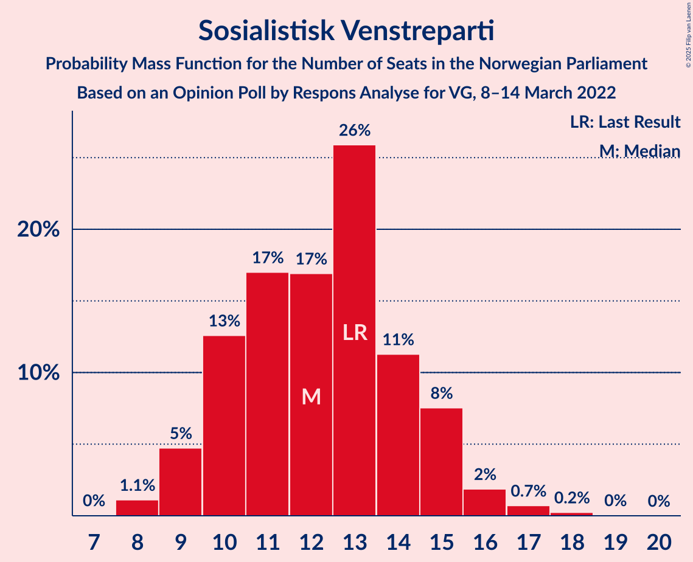

| Number of Seats | Probability | Accumulated | Special Marks |
|:---------------:|:-----------:|:-----------:|:-------------:|
| 8 | 1.1% | 100% |  |
| 9 | 5% | 98.8% |  |
| 10 | 13% | 94% |  |
| 11 | 17% | 82% |  |
| 12 | 17% | 65% | Median |
| 13 | 26% | 48% | Last Result |
| 14 | 11% | 22% |  |
| 15 | 8% | 10% |  |
| 16 | 2% | 3% |  |
| 17 | 0.7% | 1.0% |  |
| 18 | 0.2% | 0.3% |  |
| 19 | 0% | 0.1% |  |
| 20 | 0% | 0% |  |

### Rødt

*For a full overview of the results for this party, see the [Rødt](party-rødt.html) page.*

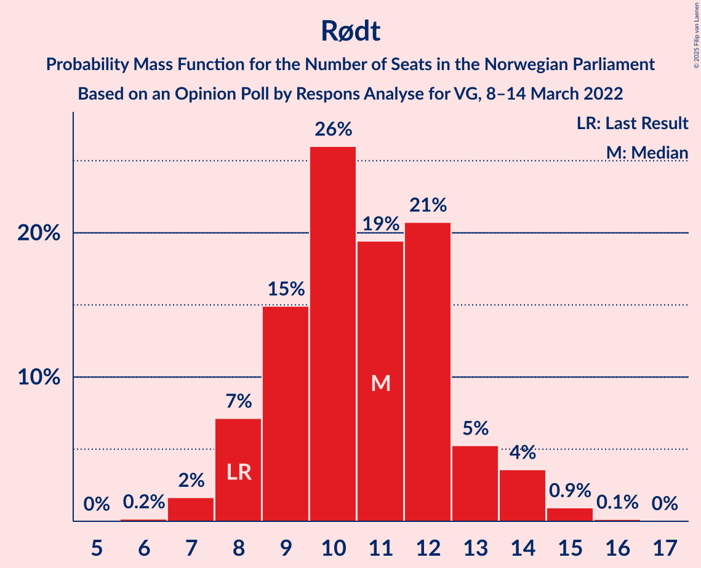

| Number of Seats | Probability | Accumulated | Special Marks |
|:---------------:|:-----------:|:-----------:|:-------------:|
| 6 | 0.2% | 100% |  |
| 7 | 2% | 99.8% |  |
| 8 | 7% | 98% | Last Result |
| 9 | 15% | 91% |  |
| 10 | 26% | 76% |  |
| 11 | 19% | 50% | Median |
| 12 | 21% | 31% |  |
| 13 | 5% | 10% |  |
| 14 | 4% | 5% |  |
| 15 | 0.9% | 1.1% |  |
| 16 | 0.1% | 0.2% |  |
| 17 | 0% | 0% |  |

### Venstre

*For a full overview of the results for this party, see the [Venstre](party-venstre.html) page.*

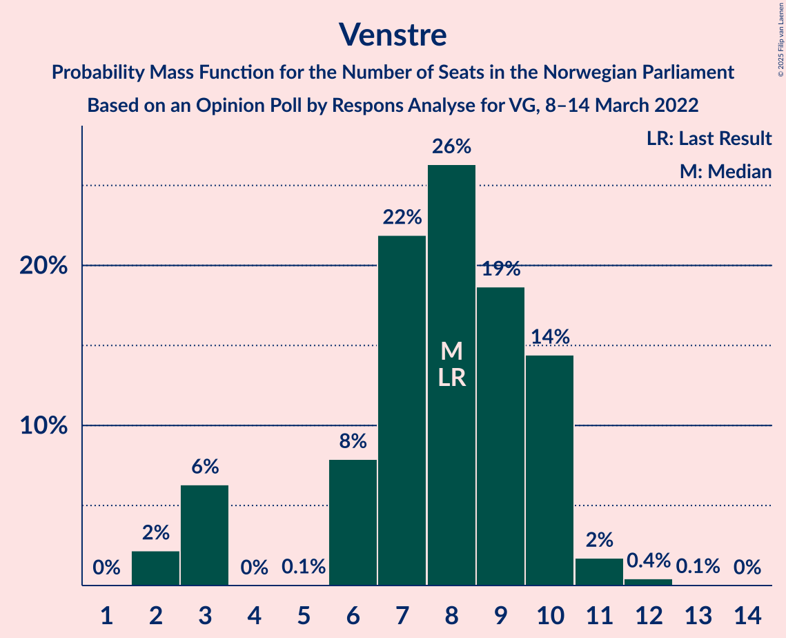

| Number of Seats | Probability | Accumulated | Special Marks |
|:---------------:|:-----------:|:-----------:|:-------------:|
| 2 | 2% | 100% |  |
| 3 | 6% | 98% |  |
| 4 | 0% | 92% |  |
| 5 | 0.1% | 92% |  |
| 6 | 8% | 91% |  |
| 7 | 22% | 84% |  |
| 8 | 26% | 62% | Last Result, Median |
| 9 | 19% | 35% |  |
| 10 | 14% | 17% |  |
| 11 | 2% | 2% |  |
| 12 | 0.4% | 0.5% |  |
| 13 | 0.1% | 0.1% |  |
| 14 | 0% | 0% |  |

### Miljøpartiet De Grønne

*For a full overview of the results for this party, see the [Miljøpartiet De Grønne](party-miljøpartietdegrønne.html) page.*

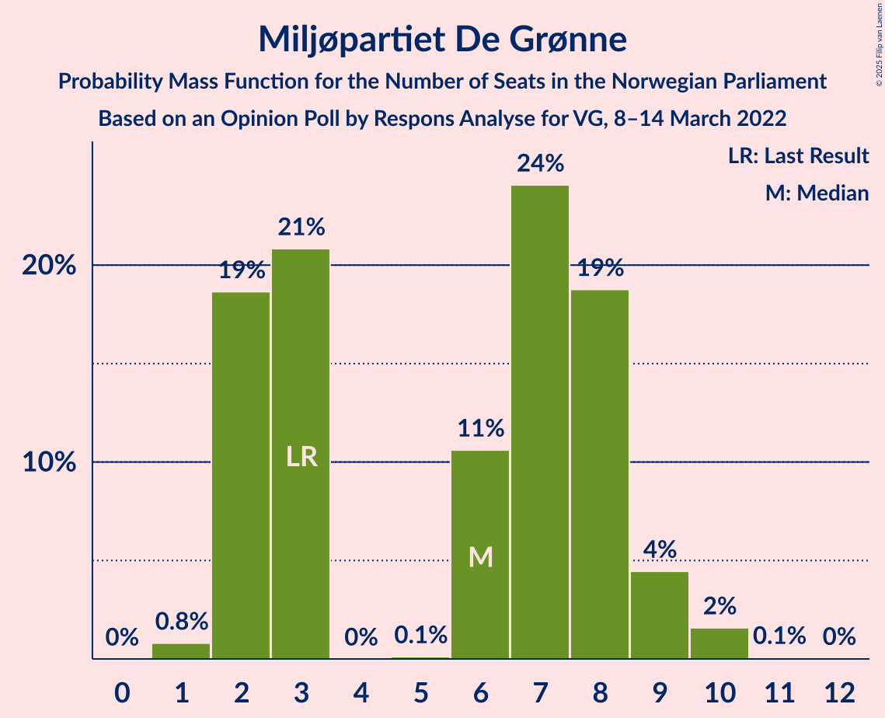

| Number of Seats | Probability | Accumulated | Special Marks |
|:---------------:|:-----------:|:-----------:|:-------------:|
| 1 | 0.8% | 100% |  |
| 2 | 19% | 99.2% |  |
| 3 | 21% | 81% | Last Result |
| 4 | 0% | 60% |  |
| 5 | 0.1% | 60% |  |
| 6 | 11% | 60% | Median |
| 7 | 24% | 49% |  |
| 8 | 19% | 25% |  |
| 9 | 4% | 6% |  |
| 10 | 2% | 2% |  |
| 11 | 0.1% | 0.1% |  |
| 12 | 0% | 0% |  |

### Kristelig Folkeparti

*For a full overview of the results for this party, see the [Kristelig Folkeparti](party-kristeligfolkeparti.html) page.*

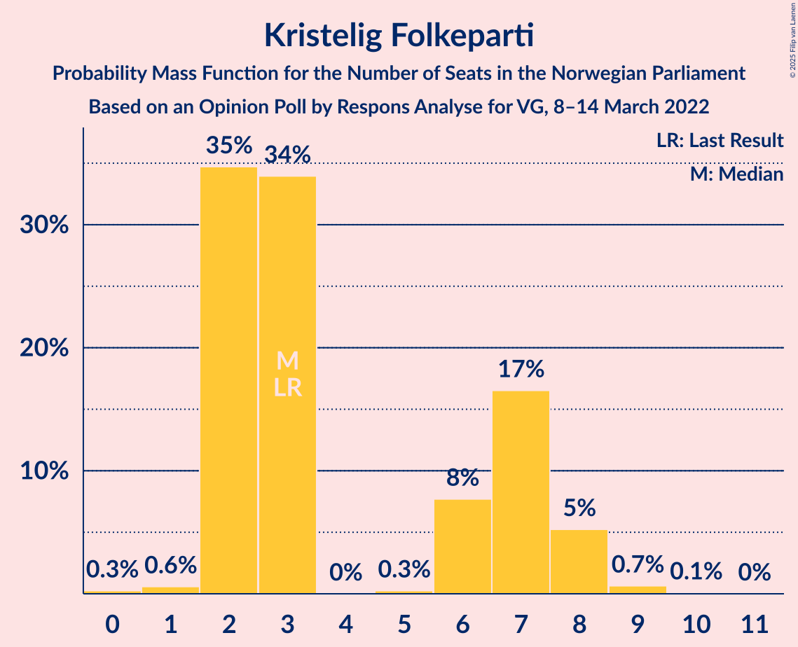

| Number of Seats | Probability | Accumulated | Special Marks |
|:---------------:|:-----------:|:-----------:|:-------------:|
| 0 | 0.3% | 100% |  |
| 1 | 0.6% | 99.7% |  |
| 2 | 35% | 99.2% |  |
| 3 | 34% | 64% | Last Result, Median |
| 4 | 0% | 30% |  |
| 5 | 0.3% | 30% |  |
| 6 | 8% | 30% |  |
| 7 | 17% | 23% |  |
| 8 | 5% | 6% |  |
| 9 | 0.7% | 0.8% |  |
| 10 | 0.1% | 0.1% |  |
| 11 | 0% | 0% |  |

## Coalitions

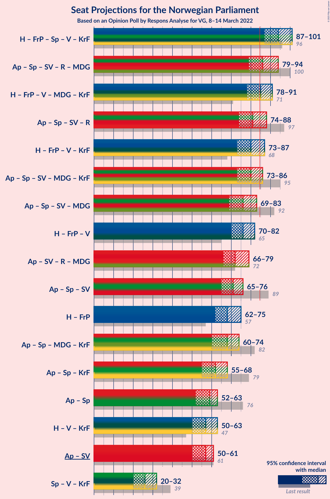

### Confidence Intervals

| Coalition | Last Result | Median | Majority? | 80% Confidence Interval | 90% Confidence Interval | 95% Confidence Interval | 99% Confidence Interval |
|:---------:|:-----------:|:------:|:---------:|:-----------------------:|:-----------------------:|:-----------------------:|:-----------------------:|
| Høyre – Fremskrittspartiet – Senterpartiet – Venstre – Kristelig Folkeparti | 96 | 94 | 99.4% | 89–99 | 88–100 | 87–101 | 84–103 |
| Arbeiderpartiet – Senterpartiet – Sosialistisk Venstreparti – Rødt – Miljøpartiet De Grønne | 100 | 86 | 70% | 82–91 | 81–92 | 79–94 | 77–95 |
| Høyre – Fremskrittspartiet – Venstre – Miljøpartiet De Grønne – Kristelig Folkeparti | 71 | 85 | 57% | 80–90 | 78–91 | 78–91 | 75–94 |
| Arbeiderpartiet – Senterpartiet – Sosialistisk Venstreparti – Rødt | 97 | 81 | 14% | 77–85 | 75–86 | 74–88 | 72–90 |
| Høyre – Fremskrittspartiet – Venstre – Kristelig Folkeparti | 68 | 80 | 8% | 75–84 | 74–85 | 73–87 | 71–89 |
| Arbeiderpartiet – Senterpartiet – Sosialistisk Venstreparti – Miljøpartiet De Grønne – Kristelig Folkeparti | 95 | 80 | 12% | 75–85 | 74–85 | 73–86 | 70–89 |
| Arbeiderpartiet – Senterpartiet – Sosialistisk Venstreparti – Miljøpartiet De Grønne | 92 | 76 | 0.3% | 72–80 | 70–81 | 69–83 | 67–84 |
| Høyre – Fremskrittspartiet – Venstre | 65 | 76 | 0.4% | 72–80 | 71–81 | 70–82 | 68–84 |
| Arbeiderpartiet – Sosialistisk Venstreparti – Rødt – Miljøpartiet De Grønne | 72 | 72 | 0% | 68–77 | 66–78 | 66–79 | 63–82 |
| Arbeiderpartiet – Senterpartiet – Sosialistisk Venstreparti | 89 | 71 | 0% | 67–74 | 65–75 | 65–76 | 62–78 |
| Høyre – Fremskrittspartiet | 57 | 68 | 0% | 64–72 | 63–73 | 62–75 | 61–76 |
| Arbeiderpartiet – Senterpartiet – Miljøpartiet De Grønne – Kristelig Folkeparti | 82 | 68 | 0% | 63–72 | 61–73 | 60–74 | 58–76 |
| Arbeiderpartiet – Senterpartiet – Kristelig Folkeparti | 79 | 62 | 0% | 58–66 | 56–67 | 55–68 | 52–70 |
| Arbeiderpartiet – Senterpartiet | 76 | 59 | 0% | 55–61 | 53–62 | 52–63 | 50–64 |
| Høyre – Venstre – Kristelig Folkeparti | 47 | 57 | 0% | 53–61 | 51–62 | 50–63 | 49–65 |
| Arbeiderpartiet – Sosialistisk Venstreparti | 61 | 57 | 0% | 53–59 | 51–61 | 50–61 | 48–62 |
| Senterpartiet – Venstre – Kristelig Folkeparti | 39 | 26 | 0% | 22–30 | 20–31 | 20–32 | 18–33 |

### Høyre – Fremskrittspartiet – Senterpartiet – Venstre – Kristelig Folkeparti

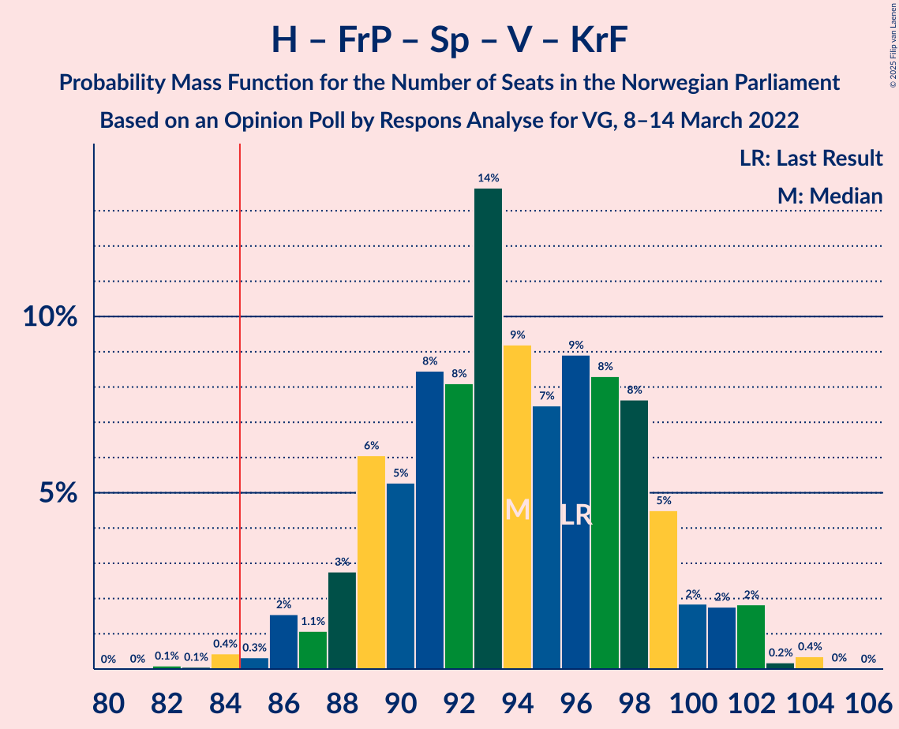

| Number of Seats | Probability | Accumulated | Special Marks |
|:---------------:|:-----------:|:-----------:|:-------------:|
| 82 | 0.1% | 100% |  |
| 83 | 0.1% | 99.9% |  |
| 84 | 0.4% | 99.8% |  |
| 85 | 0.3% | 99.4% | Majority |
| 86 | 2% | 99.1% |  |
| 87 | 1.1% | 98% |  |
| 88 | 3% | 96% |  |
| 89 | 6% | 94% |  |
| 90 | 5% | 88% |  |
| 91 | 8% | 82% |  |
| 92 | 8% | 74% |  |
| 93 | 14% | 66% | Median |
| 94 | 9% | 52% |  |
| 95 | 7% | 43% |  |
| 96 | 9% | 35% | Last Result |
| 97 | 8% | 27% |  |
| 98 | 8% | 18% |  |
| 99 | 5% | 11% |  |
| 100 | 2% | 6% |  |
| 101 | 2% | 4% |  |
| 102 | 2% | 2% |  |
| 103 | 0.2% | 0.6% |  |
| 104 | 0.4% | 0.4% |  |
| 105 | 0% | 0.1% |  |
| 106 | 0% | 0% |  |

### Arbeiderpartiet – Senterpartiet – Sosialistisk Venstreparti – Rødt – Miljøpartiet De Grønne

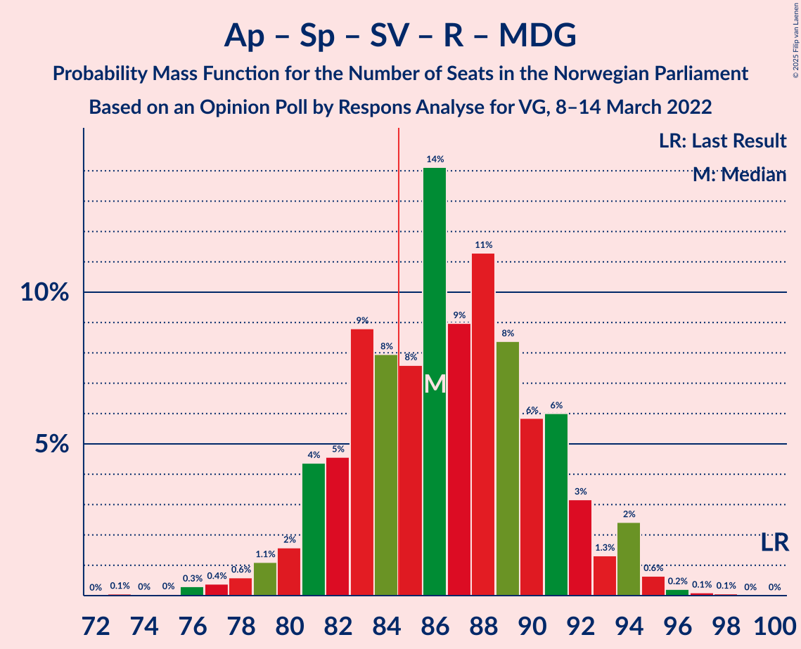

| Number of Seats | Probability | Accumulated | Special Marks |
|:---------------:|:-----------:|:-----------:|:-------------:|
| 73 | 0.1% | 100% |  |
| 74 | 0% | 99.9% |  |
| 75 | 0% | 99.9% |  |
| 76 | 0.3% | 99.9% |  |
| 77 | 0.4% | 99.6% |  |
| 78 | 0.6% | 99.2% |  |
| 79 | 1.1% | 98.6% |  |
| 80 | 2% | 97% |  |
| 81 | 4% | 96% |  |
| 82 | 5% | 92% |  |
| 83 | 9% | 87% |  |
| 84 | 8% | 78% |  |
| 85 | 8% | 70% | Majority |
| 86 | 14% | 63% |  |
| 87 | 9% | 48% |  |
| 88 | 11% | 39% | Median |
| 89 | 8% | 28% |  |
| 90 | 6% | 20% |  |
| 91 | 6% | 14% |  |
| 92 | 3% | 8% |  |
| 93 | 1.3% | 5% |  |
| 94 | 2% | 3% |  |
| 95 | 0.6% | 1.1% |  |
| 96 | 0.2% | 0.4% |  |
| 97 | 0.1% | 0.2% |  |
| 98 | 0.1% | 0.1% |  |
| 99 | 0% | 0% |  |
| 100 | 0% | 0% | Last Result |

### Høyre – Fremskrittspartiet – Venstre – Miljøpartiet De Grønne – Kristelig Folkeparti

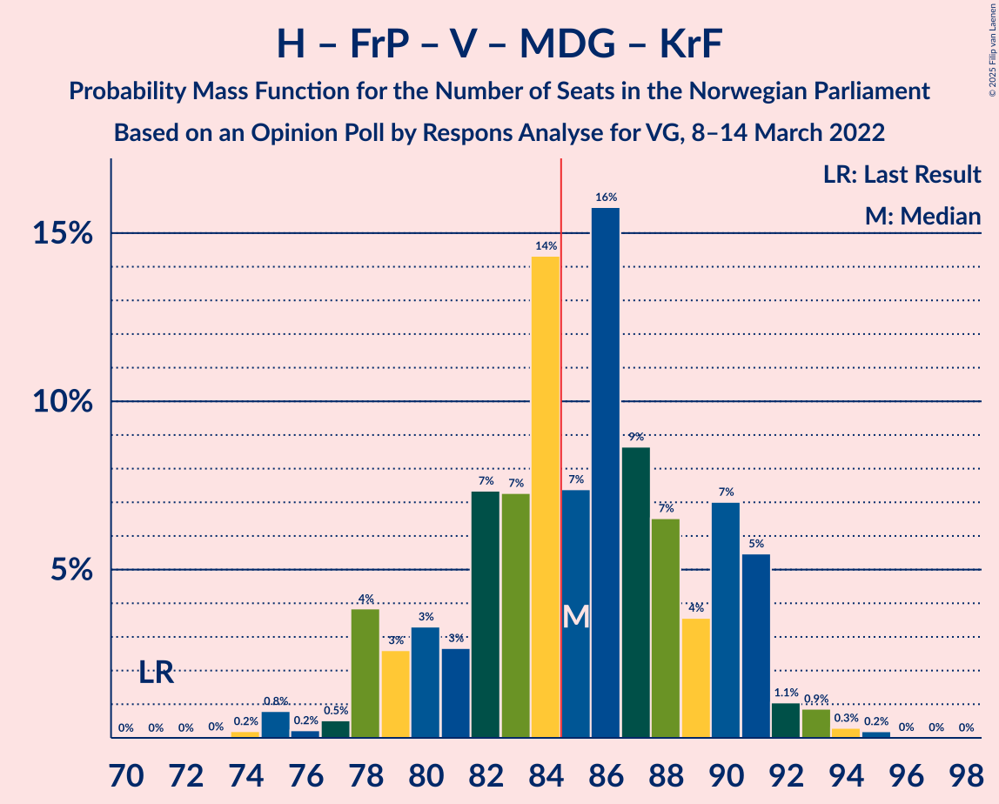

| Number of Seats | Probability | Accumulated | Special Marks |
|:---------------:|:-----------:|:-----------:|:-------------:|
| 71 | 0% | 100% | Last Result |
| 72 | 0% | 100% |  |
| 73 | 0% | 100% |  |
| 74 | 0.2% | 100% |  |
| 75 | 0.8% | 99.8% |  |
| 76 | 0.2% | 99.0% |  |
| 77 | 0.5% | 98.7% |  |
| 78 | 4% | 98% |  |
| 79 | 3% | 94% |  |
| 80 | 3% | 92% |  |
| 81 | 3% | 88% |  |
| 82 | 7% | 86% |  |
| 83 | 7% | 78% |  |
| 84 | 14% | 71% |  |
| 85 | 7% | 57% | Median, Majority |
| 86 | 16% | 49% |  |
| 87 | 9% | 34% |  |
| 88 | 7% | 25% |  |
| 89 | 4% | 19% |  |
| 90 | 7% | 15% |  |
| 91 | 5% | 8% |  |
| 92 | 1.1% | 2% |  |
| 93 | 0.9% | 1.4% |  |
| 94 | 0.3% | 0.5% |  |
| 95 | 0.2% | 0.2% |  |
| 96 | 0% | 0.1% |  |
| 97 | 0% | 0% |  |

### Arbeiderpartiet – Senterpartiet – Sosialistisk Venstreparti – Rødt

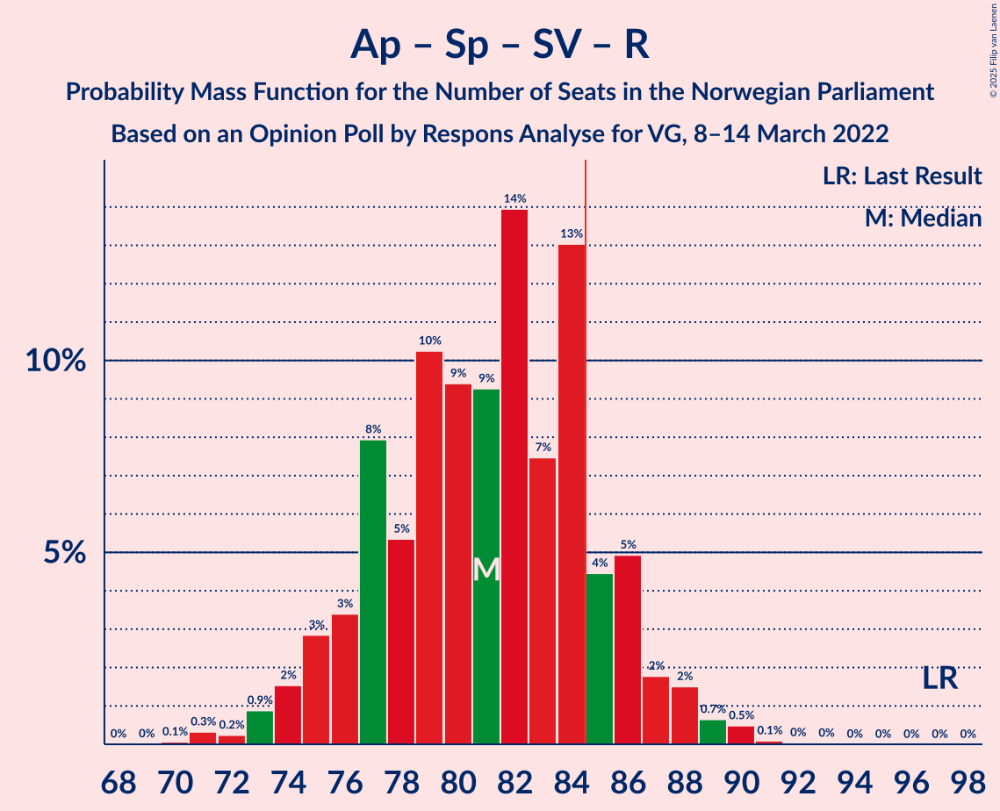

| Number of Seats | Probability | Accumulated | Special Marks |
|:---------------:|:-----------:|:-----------:|:-------------:|
| 70 | 0.1% | 100% |  |
| 71 | 0.3% | 99.9% |  |
| 72 | 0.2% | 99.6% |  |
| 73 | 0.9% | 99.3% |  |
| 74 | 2% | 98% |  |
| 75 | 3% | 97% |  |
| 76 | 3% | 94% |  |
| 77 | 8% | 91% |  |
| 78 | 5% | 83% |  |
| 79 | 10% | 77% |  |
| 80 | 9% | 67% |  |
| 81 | 9% | 58% |  |
| 82 | 14% | 48% | Median |
| 83 | 7% | 35% |  |
| 84 | 13% | 27% |  |
| 85 | 4% | 14% | Majority |
| 86 | 5% | 10% |  |
| 87 | 2% | 5% |  |
| 88 | 2% | 3% |  |
| 89 | 0.7% | 1.3% |  |
| 90 | 0.5% | 0.7% |  |
| 91 | 0.1% | 0.2% |  |
| 92 | 0% | 0.1% |  |
| 93 | 0% | 0% |  |
| 94 | 0% | 0% |  |
| 95 | 0% | 0% |  |
| 96 | 0% | 0% |  |
| 97 | 0% | 0% | Last Result |

### Høyre – Fremskrittspartiet – Venstre – Kristelig Folkeparti

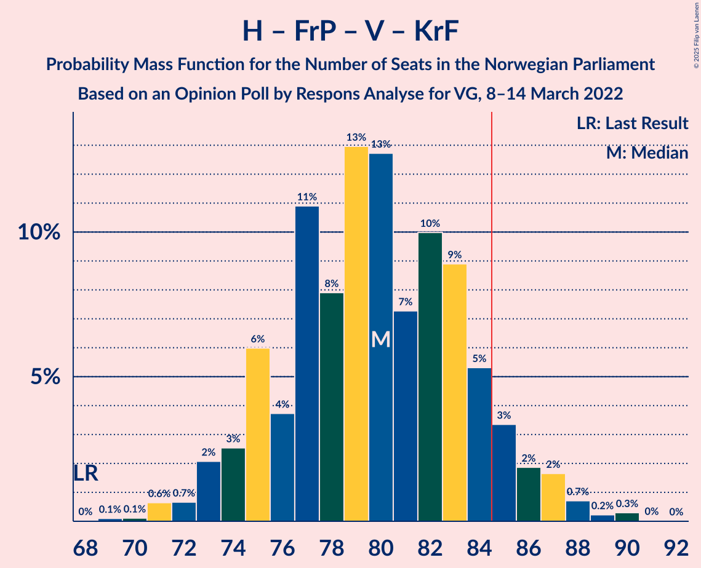

| Number of Seats | Probability | Accumulated | Special Marks |
|:---------------:|:-----------:|:-----------:|:-------------:|
| 68 | 0% | 100% | Last Result |
| 69 | 0.1% | 100% |  |
| 70 | 0.1% | 99.9% |  |
| 71 | 0.6% | 99.8% |  |
| 72 | 0.7% | 99.1% |  |
| 73 | 2% | 98% |  |
| 74 | 3% | 96% |  |
| 75 | 6% | 94% |  |
| 76 | 4% | 88% |  |
| 77 | 11% | 84% |  |
| 78 | 8% | 73% |  |
| 79 | 13% | 65% | Median |
| 80 | 13% | 52% |  |
| 81 | 7% | 40% |  |
| 82 | 10% | 32% |  |
| 83 | 9% | 22% |  |
| 84 | 5% | 13% |  |
| 85 | 3% | 8% | Majority |
| 86 | 2% | 5% |  |
| 87 | 2% | 3% |  |
| 88 | 0.7% | 1.3% |  |
| 89 | 0.2% | 0.6% |  |
| 90 | 0.3% | 0.3% |  |
| 91 | 0% | 0.1% |  |
| 92 | 0% | 0% |  |

### Arbeiderpartiet – Senterpartiet – Sosialistisk Venstreparti – Miljøpartiet De Grønne – Kristelig Folkeparti

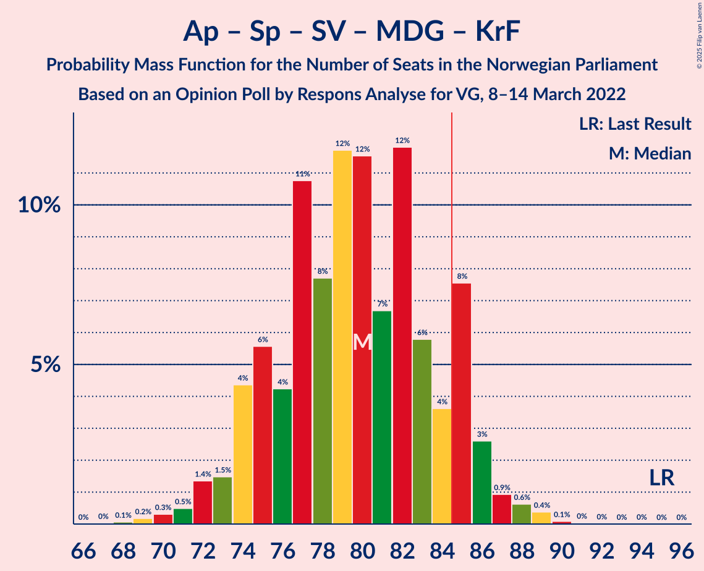

| Number of Seats | Probability | Accumulated | Special Marks |
|:---------------:|:-----------:|:-----------:|:-------------:|
| 68 | 0.1% | 100% |  |
| 69 | 0.2% | 99.9% |  |
| 70 | 0.3% | 99.7% |  |
| 71 | 0.5% | 99.4% |  |
| 72 | 1.4% | 98.9% |  |
| 73 | 1.5% | 98% |  |
| 74 | 4% | 96% |  |
| 75 | 6% | 92% |  |
| 76 | 4% | 86% |  |
| 77 | 11% | 82% |  |
| 78 | 8% | 71% |  |
| 79 | 12% | 63% |  |
| 80 | 12% | 52% | Median |
| 81 | 7% | 40% |  |
| 82 | 12% | 33% |  |
| 83 | 6% | 22% |  |
| 84 | 4% | 16% |  |
| 85 | 8% | 12% | Majority |
| 86 | 3% | 5% |  |
| 87 | 0.9% | 2% |  |
| 88 | 0.6% | 1.2% |  |
| 89 | 0.4% | 0.5% |  |
| 90 | 0.1% | 0.2% |  |
| 91 | 0% | 0.1% |  |
| 92 | 0% | 0% |  |
| 93 | 0% | 0% |  |
| 94 | 0% | 0% |  |
| 95 | 0% | 0% | Last Result |

### Arbeiderpartiet – Senterpartiet – Sosialistisk Venstreparti – Miljøpartiet De Grønne

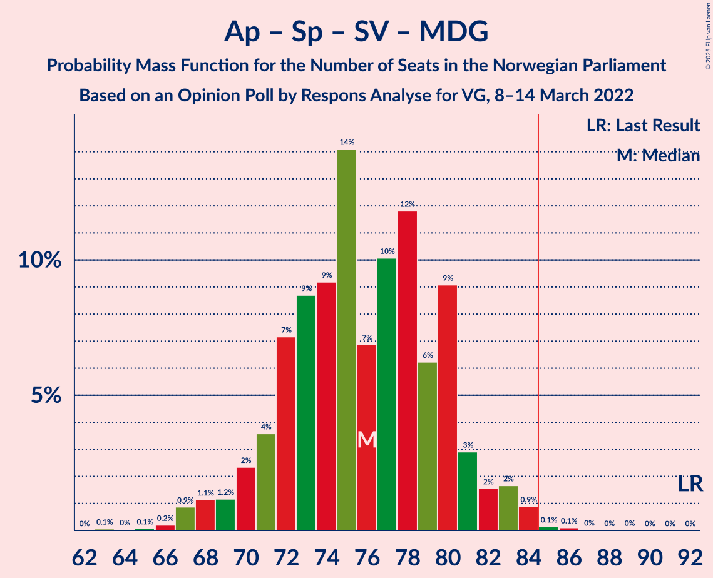

| Number of Seats | Probability | Accumulated | Special Marks |
|:---------------:|:-----------:|:-----------:|:-------------:|
| 63 | 0.1% | 100% |  |
| 64 | 0% | 99.9% |  |
| 65 | 0.1% | 99.9% |  |
| 66 | 0.2% | 99.8% |  |
| 67 | 0.9% | 99.6% |  |
| 68 | 1.1% | 98.8% |  |
| 69 | 1.2% | 98% |  |
| 70 | 2% | 96% |  |
| 71 | 4% | 94% |  |
| 72 | 7% | 91% |  |
| 73 | 9% | 83% |  |
| 74 | 9% | 75% |  |
| 75 | 14% | 65% |  |
| 76 | 7% | 51% |  |
| 77 | 10% | 44% | Median |
| 78 | 12% | 34% |  |
| 79 | 6% | 23% |  |
| 80 | 9% | 16% |  |
| 81 | 3% | 7% |  |
| 82 | 2% | 4% |  |
| 83 | 2% | 3% |  |
| 84 | 0.9% | 1.2% |  |
| 85 | 0.1% | 0.3% | Majority |
| 86 | 0.1% | 0.1% |  |
| 87 | 0% | 0% |  |
| 88 | 0% | 0% |  |
| 89 | 0% | 0% |  |
| 90 | 0% | 0% |  |
| 91 | 0% | 0% |  |
| 92 | 0% | 0% | Last Result |

### Høyre – Fremskrittspartiet – Venstre

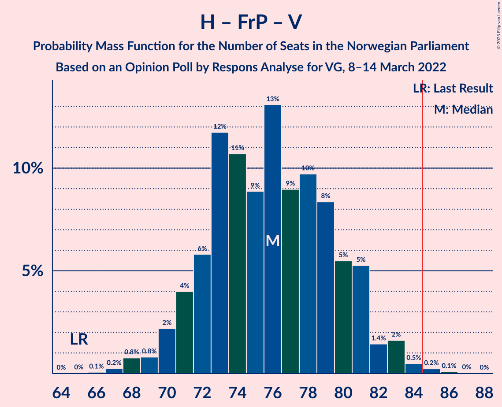

| Number of Seats | Probability | Accumulated | Special Marks |
|:---------------:|:-----------:|:-----------:|:-------------:|
| 65 | 0% | 100% | Last Result |
| 66 | 0.1% | 100% |  |
| 67 | 0.2% | 99.9% |  |
| 68 | 0.8% | 99.6% |  |
| 69 | 0.8% | 98.9% |  |
| 70 | 2% | 98% |  |
| 71 | 4% | 96% |  |
| 72 | 6% | 92% |  |
| 73 | 12% | 86% |  |
| 74 | 11% | 74% |  |
| 75 | 9% | 64% |  |
| 76 | 13% | 55% | Median |
| 77 | 9% | 42% |  |
| 78 | 10% | 33% |  |
| 79 | 8% | 23% |  |
| 80 | 5% | 15% |  |
| 81 | 5% | 9% |  |
| 82 | 1.4% | 4% |  |
| 83 | 2% | 2% |  |
| 84 | 0.5% | 0.9% |  |
| 85 | 0.2% | 0.4% | Majority |
| 86 | 0.1% | 0.1% |  |
| 87 | 0% | 0.1% |  |
| 88 | 0% | 0% |  |

### Arbeiderpartiet – Sosialistisk Venstreparti – Rødt – Miljøpartiet De Grønne

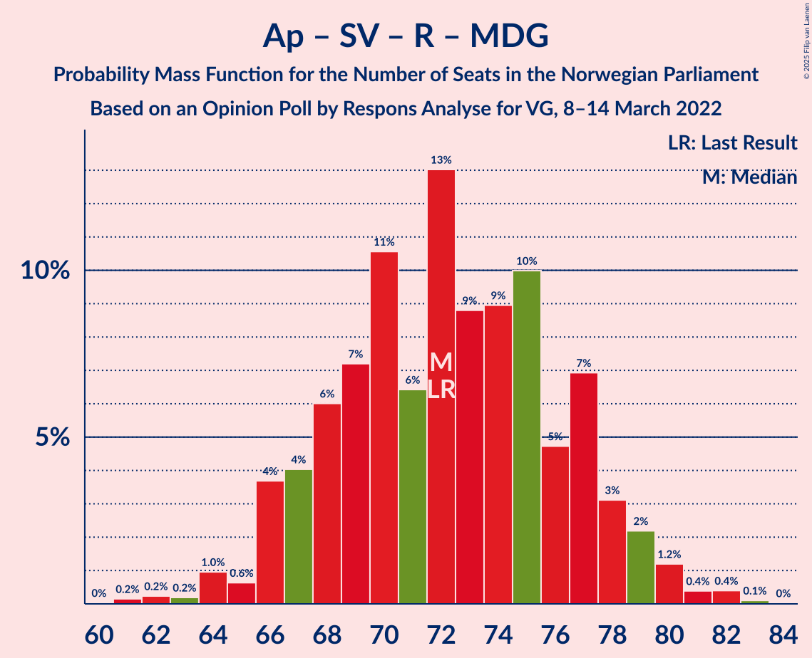

| Number of Seats | Probability | Accumulated | Special Marks |
|:---------------:|:-----------:|:-----------:|:-------------:|
| 61 | 0.2% | 100% |  |
| 62 | 0.2% | 99.8% |  |
| 63 | 0.2% | 99.6% |  |
| 64 | 1.0% | 99.4% |  |
| 65 | 0.6% | 98% |  |
| 66 | 4% | 98% |  |
| 67 | 4% | 94% |  |
| 68 | 6% | 90% |  |
| 69 | 7% | 84% |  |
| 70 | 11% | 77% |  |
| 71 | 6% | 66% |  |
| 72 | 13% | 60% | Last Result |
| 73 | 9% | 47% |  |
| 74 | 9% | 38% | Median |
| 75 | 10% | 29% |  |
| 76 | 5% | 19% |  |
| 77 | 7% | 14% |  |
| 78 | 3% | 7% |  |
| 79 | 2% | 4% |  |
| 80 | 1.2% | 2% |  |
| 81 | 0.4% | 0.9% |  |
| 82 | 0.4% | 0.5% |  |
| 83 | 0.1% | 0.2% |  |
| 84 | 0% | 0% |  |

### Arbeiderpartiet – Senterpartiet – Sosialistisk Venstreparti

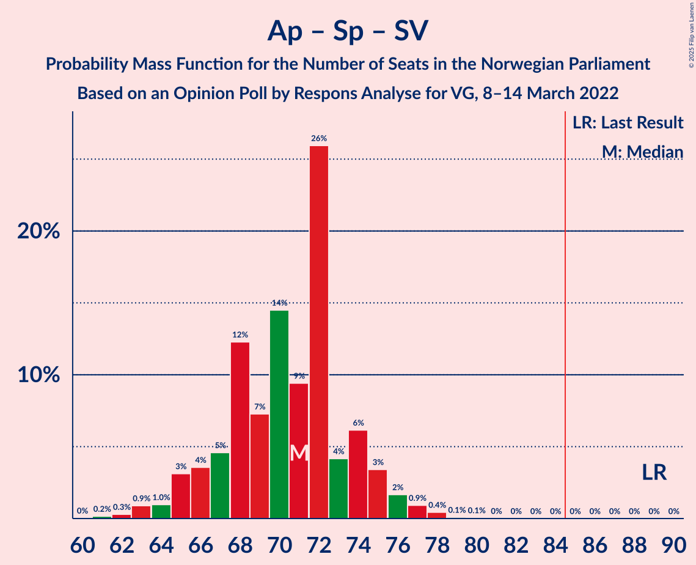

| Number of Seats | Probability | Accumulated | Special Marks |
|:---------------:|:-----------:|:-----------:|:-------------:|
| 60 | 0% | 100% |  |
| 61 | 0.2% | 99.9% |  |
| 62 | 0.3% | 99.8% |  |
| 63 | 0.9% | 99.5% |  |
| 64 | 1.0% | 98.6% |  |
| 65 | 3% | 98% |  |
| 66 | 4% | 95% |  |
| 67 | 5% | 91% |  |
| 68 | 12% | 86% |  |
| 69 | 7% | 74% |  |
| 70 | 14% | 67% |  |
| 71 | 9% | 52% | Median |
| 72 | 26% | 43% |  |
| 73 | 4% | 17% |  |
| 74 | 6% | 13% |  |
| 75 | 3% | 7% |  |
| 76 | 2% | 3% |  |
| 77 | 0.9% | 2% |  |
| 78 | 0.4% | 0.6% |  |
| 79 | 0.1% | 0.2% |  |
| 80 | 0.1% | 0.1% |  |
| 81 | 0% | 0% |  |
| 82 | 0% | 0% |  |
| 83 | 0% | 0% |  |
| 84 | 0% | 0% |  |
| 85 | 0% | 0% | Majority |
| 86 | 0% | 0% |  |
| 87 | 0% | 0% |  |
| 88 | 0% | 0% |  |
| 89 | 0% | 0% | Last Result |

### Høyre – Fremskrittspartiet

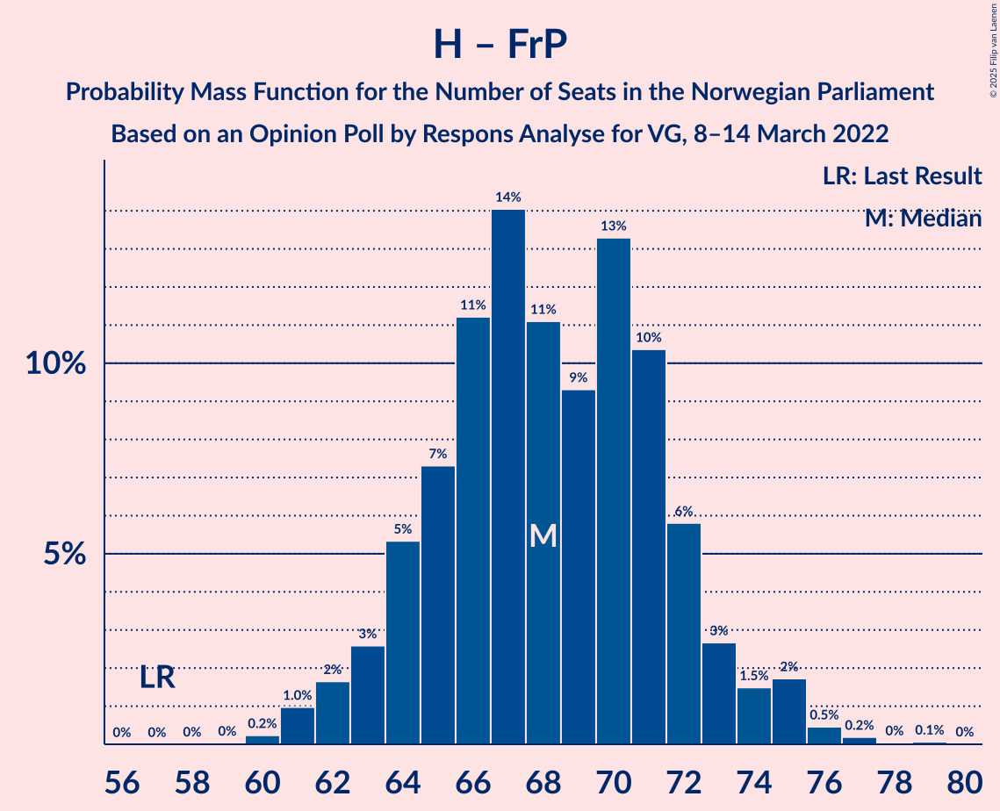

| Number of Seats | Probability | Accumulated | Special Marks |
|:---------------:|:-----------:|:-----------:|:-------------:|
| 57 | 0% | 100% | Last Result |
| 58 | 0% | 100% |  |
| 59 | 0% | 100% |  |
| 60 | 0.2% | 100% |  |
| 61 | 1.0% | 99.7% |  |
| 62 | 2% | 98.7% |  |
| 63 | 3% | 97% |  |
| 64 | 5% | 94% |  |
| 65 | 7% | 89% |  |
| 66 | 11% | 82% |  |
| 67 | 14% | 71% |  |
| 68 | 11% | 57% | Median |
| 69 | 9% | 45% |  |
| 70 | 13% | 36% |  |
| 71 | 10% | 23% |  |
| 72 | 6% | 12% |  |
| 73 | 3% | 7% |  |
| 74 | 1.5% | 4% |  |
| 75 | 2% | 3% |  |
| 76 | 0.5% | 0.8% |  |
| 77 | 0.2% | 0.3% |  |
| 78 | 0% | 0.1% |  |
| 79 | 0.1% | 0.1% |  |
| 80 | 0% | 0% |  |

### Arbeiderpartiet – Senterpartiet – Miljøpartiet De Grønne – Kristelig Folkeparti

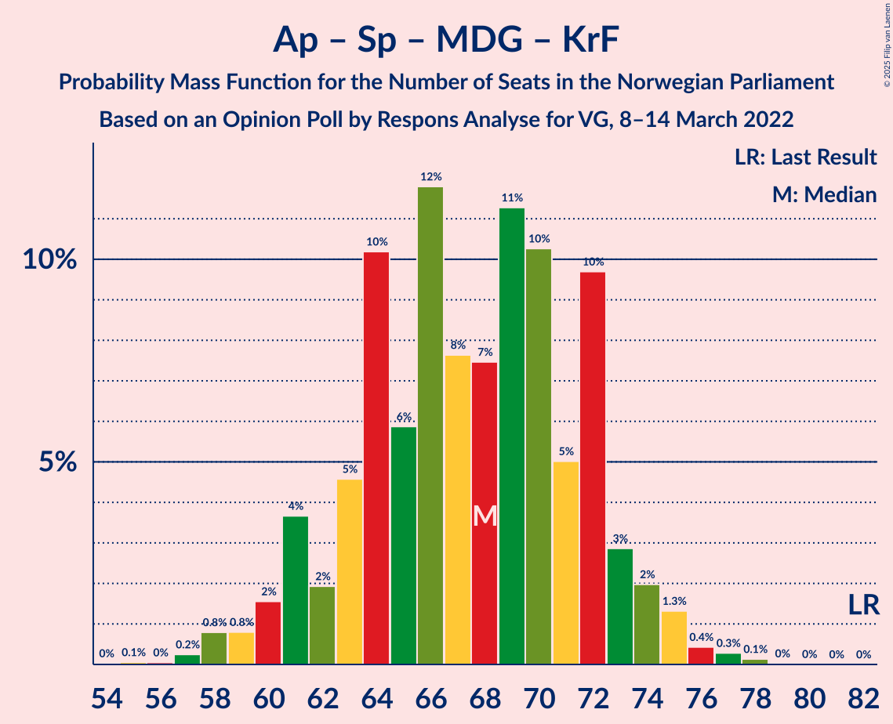

| Number of Seats | Probability | Accumulated | Special Marks |
|:---------------:|:-----------:|:-----------:|:-------------:|
| 55 | 0.1% | 100% |  |
| 56 | 0% | 99.9% |  |
| 57 | 0.2% | 99.9% |  |
| 58 | 0.8% | 99.6% |  |
| 59 | 0.8% | 98.8% |  |
| 60 | 2% | 98% |  |
| 61 | 4% | 96% |  |
| 62 | 2% | 93% |  |
| 63 | 5% | 91% |  |
| 64 | 10% | 86% |  |
| 65 | 6% | 76% |  |
| 66 | 12% | 70% |  |
| 67 | 8% | 58% |  |
| 68 | 7% | 51% | Median |
| 69 | 11% | 43% |  |
| 70 | 10% | 32% |  |
| 71 | 5% | 22% |  |
| 72 | 10% | 17% |  |
| 73 | 3% | 7% |  |
| 74 | 2% | 4% |  |
| 75 | 1.3% | 2% |  |
| 76 | 0.4% | 0.9% |  |
| 77 | 0.3% | 0.5% |  |
| 78 | 0.1% | 0.2% |  |
| 79 | 0% | 0% |  |
| 80 | 0% | 0% |  |
| 81 | 0% | 0% |  |
| 82 | 0% | 0% | Last Result |

### Arbeiderpartiet – Senterpartiet – Kristelig Folkeparti

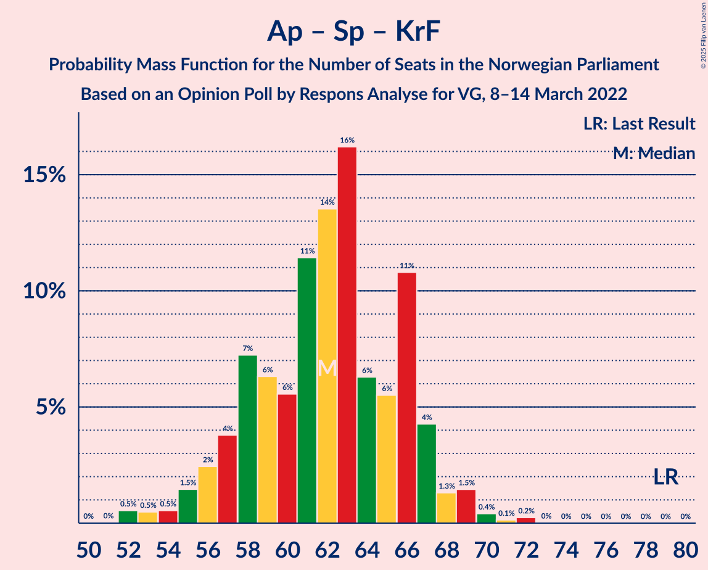

| Number of Seats | Probability | Accumulated | Special Marks |
|:---------------:|:-----------:|:-----------:|:-------------:|
| 52 | 0.5% | 100% |  |
| 53 | 0.5% | 99.4% |  |
| 54 | 0.5% | 98.9% |  |
| 55 | 1.5% | 98% |  |
| 56 | 2% | 97% |  |
| 57 | 4% | 94% |  |
| 58 | 7% | 91% |  |
| 59 | 6% | 83% |  |
| 60 | 6% | 77% |  |
| 61 | 11% | 72% |  |
| 62 | 14% | 60% | Median |
| 63 | 16% | 47% |  |
| 64 | 6% | 30% |  |
| 65 | 6% | 24% |  |
| 66 | 11% | 19% |  |
| 67 | 4% | 8% |  |
| 68 | 1.3% | 4% |  |
| 69 | 1.5% | 2% |  |
| 70 | 0.4% | 0.8% |  |
| 71 | 0.1% | 0.4% |  |
| 72 | 0.2% | 0.3% |  |
| 73 | 0% | 0% |  |
| 74 | 0% | 0% |  |
| 75 | 0% | 0% |  |
| 76 | 0% | 0% |  |
| 77 | 0% | 0% |  |
| 78 | 0% | 0% |  |
| 79 | 0% | 0% | Last Result |

### Arbeiderpartiet – Senterpartiet

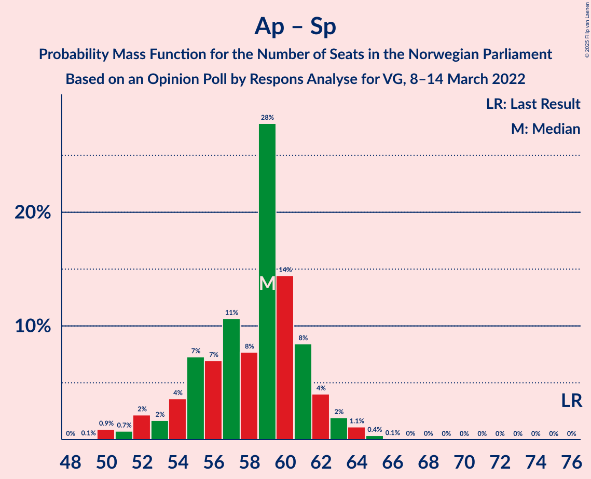

| Number of Seats | Probability | Accumulated | Special Marks |
|:---------------:|:-----------:|:-----------:|:-------------:|
| 49 | 0.1% | 100% |  |
| 50 | 0.9% | 99.9% |  |
| 51 | 0.7% | 99.0% |  |
| 52 | 2% | 98% |  |
| 53 | 2% | 96% |  |
| 54 | 4% | 94% |  |
| 55 | 7% | 91% |  |
| 56 | 7% | 84% |  |
| 57 | 11% | 77% |  |
| 58 | 8% | 66% |  |
| 59 | 28% | 58% | Median |
| 60 | 14% | 30% |  |
| 61 | 8% | 16% |  |
| 62 | 4% | 8% |  |
| 63 | 2% | 4% |  |
| 64 | 1.1% | 2% |  |
| 65 | 0.4% | 0.5% |  |
| 66 | 0.1% | 0.1% |  |
| 67 | 0% | 0% |  |
| 68 | 0% | 0% |  |
| 69 | 0% | 0% |  |
| 70 | 0% | 0% |  |
| 71 | 0% | 0% |  |
| 72 | 0% | 0% |  |
| 73 | 0% | 0% |  |
| 74 | 0% | 0% |  |
| 75 | 0% | 0% |  |
| 76 | 0% | 0% | Last Result |

### Høyre – Venstre – Kristelig Folkeparti

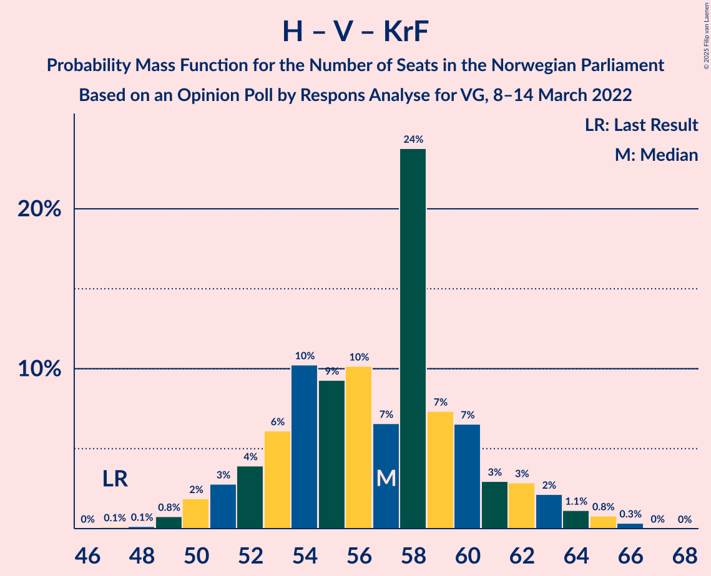

| Number of Seats | Probability | Accumulated | Special Marks |
|:---------------:|:-----------:|:-----------:|:-------------:|
| 47 | 0.1% | 100% | Last Result |
| 48 | 0.1% | 99.9% |  |
| 49 | 0.8% | 99.7% |  |
| 50 | 2% | 99.0% |  |
| 51 | 3% | 97% |  |
| 52 | 4% | 94% |  |
| 53 | 6% | 90% |  |
| 54 | 10% | 84% |  |
| 55 | 9% | 74% |  |
| 56 | 10% | 65% | Median |
| 57 | 7% | 55% |  |
| 58 | 24% | 48% |  |
| 59 | 7% | 24% |  |
| 60 | 7% | 17% |  |
| 61 | 3% | 10% |  |
| 62 | 3% | 7% |  |
| 63 | 2% | 4% |  |
| 64 | 1.1% | 2% |  |
| 65 | 0.8% | 1.2% |  |
| 66 | 0.3% | 0.4% |  |
| 67 | 0% | 0% |  |

### Arbeiderpartiet – Sosialistisk Venstreparti

| Number of Seats | Probability | Accumulated | Special Marks |
|:---------------:|:-----------:|:-----------:|:-------------:|
| 46 | 0.1% | 100% |  |
| 47 | 0.1% | 99.9% |  |
| 48 | 0.4% | 99.9% |  |
| 49 | 0.6% | 99.5% |  |
| 50 | 2% | 98.9% |  |
| 51 | 3% | 97% |  |
| 52 | 3% | 94% |  |
| 53 | 10% | 91% |  |
| 54 | 8% | 81% |  |
| 55 | 11% | 74% |  |
| 56 | 12% | 63% |  |
| 57 | 15% | 51% | Median |
| 58 | 13% | 36% |  |
| 59 | 13% | 23% |  |
| 60 | 4% | 9% |  |
| 61 | 4% | 6% | Last Result |
| 62 | 1.4% | 2% |  |
| 63 | 0.3% | 0.5% |  |
| 64 | 0.1% | 0.2% |  |
| 65 | 0% | 0.1% |  |
| 66 | 0% | 0% |  |

### Senterpartiet – Venstre – Kristelig Folkeparti

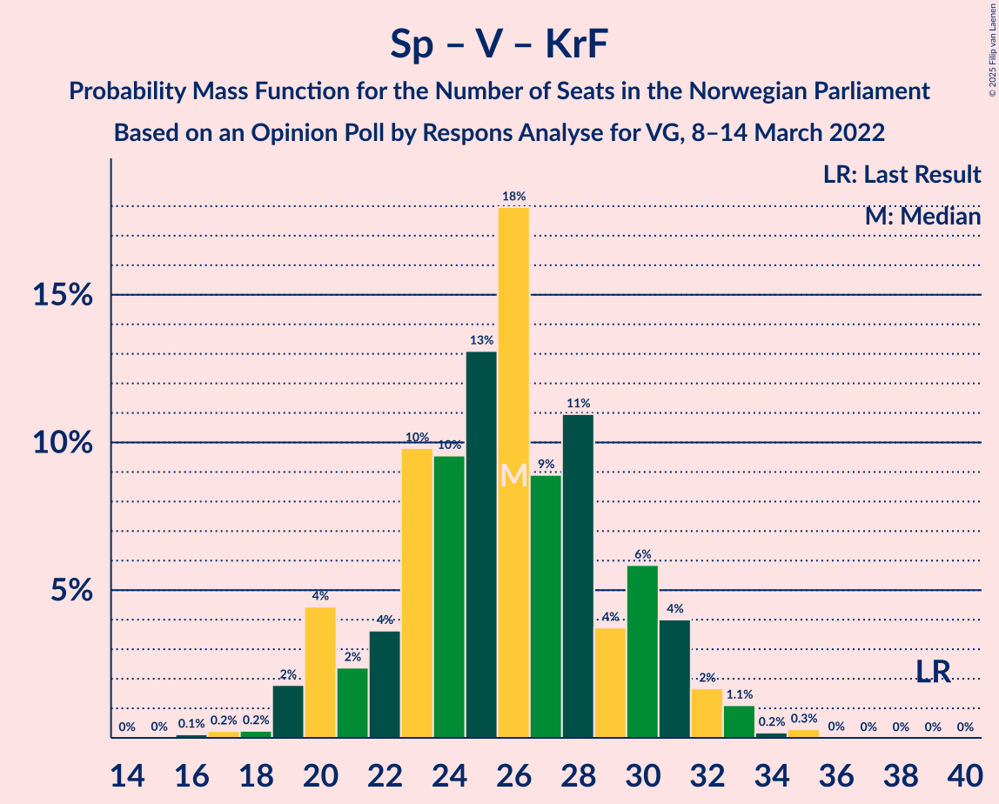

| Number of Seats | Probability | Accumulated | Special Marks |
|:---------------:|:-----------:|:-----------:|:-------------:|
| 16 | 0.1% | 100% |  |
| 17 | 0.2% | 99.9% |  |
| 18 | 0.2% | 99.6% |  |
| 19 | 2% | 99.4% |  |
| 20 | 4% | 98% |  |
| 21 | 2% | 93% |  |
| 22 | 4% | 91% |  |
| 23 | 10% | 87% |  |
| 24 | 10% | 77% |  |
| 25 | 13% | 68% | Median |
| 26 | 18% | 55% |  |
| 27 | 9% | 37% |  |
| 28 | 11% | 28% |  |
| 29 | 4% | 17% |  |
| 30 | 6% | 13% |  |
| 31 | 4% | 7% |  |
| 32 | 2% | 3% |  |
| 33 | 1.1% | 2% |  |
| 34 | 0.2% | 0.5% |  |
| 35 | 0.3% | 0.3% |  |
| 36 | 0% | 0% |  |
| 37 | 0% | 0% |  |
| 38 | 0% | 0% |  |
| 39 | 0% | 0% | Last Result |

## Technical Information

### Opinion Poll

+ **Polling firm:** Respons Analyse
+ **Commissioner(s):** VG
+ **Fieldwork period:** 8–14 March 2022

### Calculations

+ **Sample size:** 1000
+ **Simulations done:** 1,048,576
+ **Error estimate:** 1.11%

