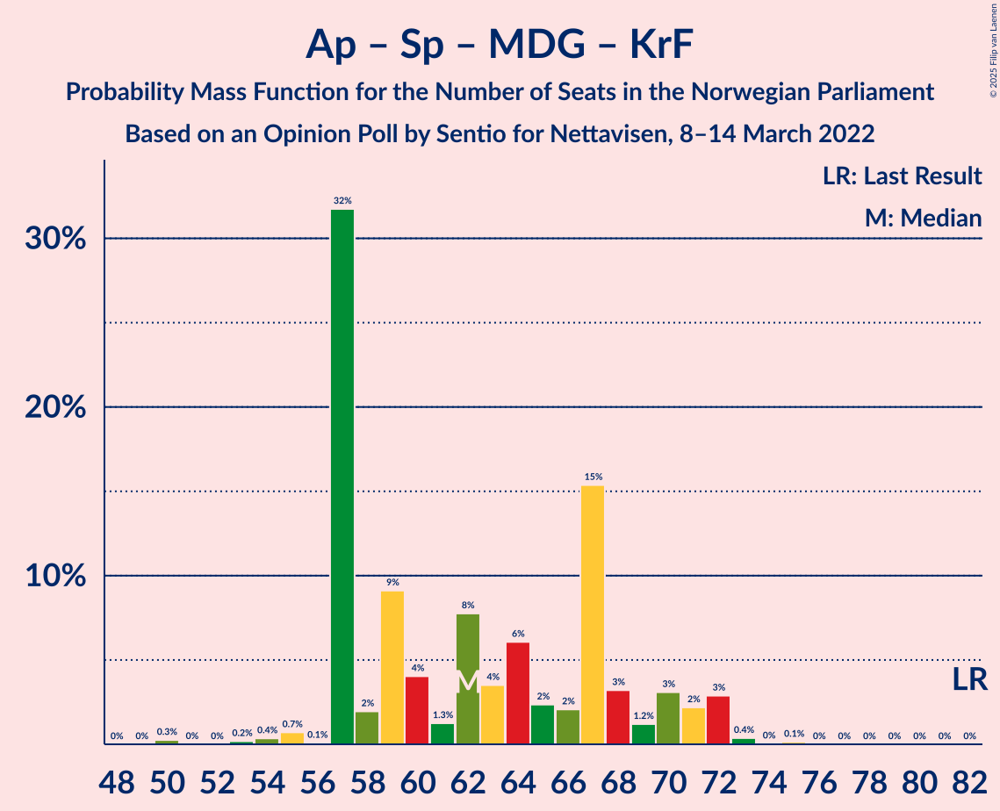

# Opinion Poll by Sentio for Nettavisen, 8–14 March 2022

<a href="#voting-intentions">Voting Intentions</a> | <a href="#seats">Seats</a> | <a href="#coalitions">Coalitions</a> | <a href="#technical-information">Technical Information</a>

## Voting Intentions

### Confidence Intervals

| Party | Last Result | Poll Result | 80% Confidence Interval | 90% Confidence Interval | 95% Confidence Interval | 99% Confidence Interval |
|:-----:|:-----------:|:-----------:|:-----------------------:|:-----------------------:|:-----------------------:|:-----------------------:|
| Høyre | 20.4% | 27.5% | 25.4–29.6% |24.9–30.2% |24.4–30.8% |23.4–31.8% |
| Arbeiderpartiet | 26.2% | 22.5% | 20.7–24.6% |20.1–25.2% |19.7–25.7% |18.8–26.7% |
| Fremskrittspartiet | 11.6% | 10.4% | 9.1–12.0% |8.7–12.4% |8.4–12.8% |7.8–13.6% |
| Senterpartiet | 13.5% | 9.2% | 8.0–10.7% |7.6–11.1% |7.3–11.5% |6.8–12.2% |
| Sosialistisk Venstreparti | 7.6% | 8.7% | 7.5–10.1% |7.1–10.5% |6.9–10.9% |6.3–11.6% |
| Rødt | 4.7% | 7.2% | 6.1–8.6% |5.8–8.9% |5.6–9.3% |5.1–10.0% |
| Venstre | 4.6% | 4.9% | 4.1–6.1% |3.8–6.4% |3.6–6.7% |3.2–7.3% |
| Miljøpartiet De Grønne | 3.9% | 2.9% | 2.3–3.9% |2.1–4.2% |2.0–4.4% |1.7–4.9% |
| Kristelig Folkeparti | 3.8% | 2.5% | 1.9–3.4% |1.8–3.7% |1.6–3.9% |1.4–4.4% |
| Norgesdemokratene | 1.1% | 2.0% | 1.5–2.8% |1.3–3.1% |1.2–3.3% |1.0–3.7% |
| Pensjonistpartiet | 0.6% | 0.8% | 0.5–1.4% |0.4–1.6% |0.4–1.7% |0.3–2.1% |
| Konservativt | 0.4% | 0.5% | 0.3–1.1% |0.3–1.2% |0.2–1.4% |0.1–1.7% |
| Industri- og Næringspartiet | 0.3% | 0.5% | 0.3–1.1% |0.3–1.2% |0.2–1.4% |0.1–1.7% |

*Note:* The poll result column reflects the actual value used in the calculations. Published results may vary slightly, and in addition be rounded to fewer digits.

## Seats

### Confidence Intervals

| Party | Last Result | Median | 80% Confidence Interval | 90% Confidence Interval | 95% Confidence Interval | 99% Confidence Interval |
|:-----:|:-----------:|:------:|:-----------------------:|:-----------------------:|:-----------------------:|:-----------------------:|
| <a href="#høyre">Høyre</a> | 36 | 50 | 46–52 |45–54 |44–55 |43–58 |
| <a href="#arbeiderpartiet">Arbeiderpartiet</a> | 48 | 41 | 39–47 |36–48 |35–49 |34–50 |
| <a href="#fremskrittspartiet">Fremskrittspartiet</a> | 21 | 20 | 17–23 |17–23 |15–23 |14–24 |
| <a href="#senterpartiet">Senterpartiet</a> | 28 | 17 | 14–20 |13–20 |13–20 |12–20 |
| <a href="#sosialistisk-venstreparti">Sosialistisk Venstreparti</a> | 13 | 16 | 14–19 |12–19 |12–19 |12–19 |
| <a href="#rødt">Rødt</a> | 8 | 14 | 11–14 |10–14 |10–15 |9–17 |
| <a href="#venstre">Venstre</a> | 8 | 8 | 8–10 |3–11 |2–12 |2–14 |
| <a href="#miljøpartiet-de-grønne">Miljøpartiet De Grønne</a> | 3 | 1 | 1–3 |1–8 |0–8 |0–9 |
| <a href="#kristelig-folkeparti">Kristelig Folkeparti</a> | 3 | 1 | 0–3 |0–3 |0–3 |0–8 |
| <a href="#norgesdemokratene">Norgesdemokratene</a> | 0 | 0 | 0 |0 |0 |0 |
| <a href="#pensjonistpartiet">Pensjonistpartiet</a> | 0 | 0 | 0 |0 |0 |0 |
| <a href="#konservativt">Konservativt</a> | 0 | 0 | 0 |0 |0 |0 |
| <a href="#industri--og-næringspartiet">Industri- og Næringspartiet</a> | 0 | 0 | 0 |0 |0 |0 |

### Høyre

*For a full overview of the results for this party, see the [Høyre](party-høyre.html) page.*

| Number of Seats | Probability | Accumulated | Special Marks |
|:---------------:|:-----------:|:-----------:|:-------------:|
| 36 | 0% | 100% | Last Result |
| 37 | 0% | 100% |  |
| 38 | 0% | 100% |  |
| 39 | 0% | 100% |  |
| 40 | 0% | 100% |  |
| 41 | 0% | 99.9% |  |
| 42 | 0.3% | 99.9% |  |
| 43 | 2% | 99.6% |  |
| 44 | 1.4% | 98% |  |
| 45 | 3% | 97% |  |
| 46 | 7% | 94% |  |
| 47 | 26% | 87% |  |
| 48 | 6% | 61% |  |
| 49 | 4% | 55% |  |
| 50 | 31% | 51% | Median |
| 51 | 4% | 19% |  |
| 52 | 6% | 16% |  |
| 53 | 2% | 9% |  |
| 54 | 5% | 7% |  |
| 55 | 0.3% | 3% |  |
| 56 | 0.3% | 2% |  |
| 57 | 1.3% | 2% |  |
| 58 | 0.7% | 0.8% |  |
| 59 | 0% | 0.1% |  |
| 60 | 0.1% | 0.1% |  |
| 61 | 0% | 0% |  |

### Arbeiderpartiet

*For a full overview of the results for this party, see the [Arbeiderpartiet](party-arbeiderpartiet.html) page.*

| Number of Seats | Probability | Accumulated | Special Marks |
|:---------------:|:-----------:|:-----------:|:-------------:|
| 34 | 1.2% | 100% |  |
| 35 | 3% | 98.8% |  |
| 36 | 1.3% | 95% |  |
| 37 | 1.0% | 94% |  |
| 38 | 3% | 93% |  |
| 39 | 30% | 90% |  |
| 40 | 3% | 60% |  |
| 41 | 8% | 57% | Median |
| 42 | 16% | 49% |  |
| 43 | 4% | 33% |  |
| 44 | 6% | 29% |  |
| 45 | 9% | 23% |  |
| 46 | 4% | 14% |  |
| 47 | 5% | 10% |  |
| 48 | 0.9% | 6% | Last Result |
| 49 | 4% | 5% |  |
| 50 | 0.4% | 0.9% |  |
| 51 | 0.4% | 0.5% |  |
| 52 | 0% | 0.1% |  |
| 53 | 0% | 0.1% |  |
| 54 | 0.1% | 0.1% |  |
| 55 | 0% | 0% |  |

### Fremskrittspartiet

*For a full overview of the results for this party, see the [Fremskrittspartiet](party-fremskrittspartiet.html) page.*

| Number of Seats | Probability | Accumulated | Special Marks |
|:---------------:|:-----------:|:-----------:|:-------------:|
| 13 | 0.3% | 100% |  |
| 14 | 0.3% | 99.7% |  |
| 15 | 2% | 99.4% |  |
| 16 | 1.2% | 97% |  |
| 17 | 27% | 96% |  |
| 18 | 9% | 69% |  |
| 19 | 5% | 60% |  |
| 20 | 16% | 55% | Median |
| 21 | 8% | 40% | Last Result |
| 22 | 2% | 32% |  |
| 23 | 29% | 30% |  |
| 24 | 0.8% | 1.0% |  |
| 25 | 0.2% | 0.3% |  |
| 26 | 0.1% | 0.1% |  |
| 27 | 0% | 0% |  |

### Senterpartiet

*For a full overview of the results for this party, see the [Senterpartiet](party-senterpartiet.html) page.*

| Number of Seats | Probability | Accumulated | Special Marks |
|:---------------:|:-----------:|:-----------:|:-------------:|
| 11 | 0% | 100% |  |
| 12 | 0.6% | 99.9% |  |
| 13 | 5% | 99.3% |  |
| 14 | 7% | 94% |  |
| 15 | 5% | 88% |  |
| 16 | 14% | 82% |  |
| 17 | 38% | 69% | Median |
| 18 | 9% | 31% |  |
| 19 | 2% | 22% |  |
| 20 | 20% | 20% |  |
| 21 | 0.1% | 0.2% |  |
| 22 | 0% | 0.1% |  |
| 23 | 0% | 0% |  |
| 24 | 0% | 0% |  |
| 25 | 0% | 0% |  |
| 26 | 0% | 0% |  |
| 27 | 0% | 0% |  |
| 28 | 0% | 0% | Last Result |

### Sosialistisk Venstreparti

*For a full overview of the results for this party, see the [Sosialistisk Venstreparti](party-sosialistiskvenstreparti.html) page.*

| Number of Seats | Probability | Accumulated | Special Marks |
|:---------------:|:-----------:|:-----------:|:-------------:|
| 10 | 0.1% | 100% |  |
| 11 | 0.4% | 99.9% |  |
| 12 | 7% | 99.6% |  |
| 13 | 2% | 93% | Last Result |
| 14 | 7% | 91% |  |
| 15 | 26% | 84% |  |
| 16 | 33% | 57% | Median |
| 17 | 6% | 24% |  |
| 18 | 7% | 18% |  |
| 19 | 11% | 11% |  |
| 20 | 0.1% | 0.2% |  |
| 21 | 0.1% | 0.2% |  |
| 22 | 0% | 0% |  |

### Rødt

*For a full overview of the results for this party, see the [Rødt](party-rødt.html) page.*

| Number of Seats | Probability | Accumulated | Special Marks |
|:---------------:|:-----------:|:-----------:|:-------------:|
| 8 | 0% | 100% | Last Result |
| 9 | 0.6% | 99.9% |  |
| 10 | 6% | 99.4% |  |
| 11 | 6% | 94% |  |
| 12 | 21% | 88% |  |
| 13 | 16% | 67% |  |
| 14 | 47% | 51% | Median |
| 15 | 2% | 4% |  |
| 16 | 0.6% | 2% |  |
| 17 | 1.4% | 2% |  |
| 18 | 0.1% | 0.2% |  |
| 19 | 0.1% | 0.1% |  |
| 20 | 0% | 0% |  |

### Venstre

*For a full overview of the results for this party, see the [Venstre](party-venstre.html) page.*

| Number of Seats | Probability | Accumulated | Special Marks |
|:---------------:|:-----------:|:-----------:|:-------------:|
| 2 | 3% | 100% |  |
| 3 | 4% | 97% |  |
| 4 | 0% | 93% |  |
| 5 | 0% | 93% |  |
| 6 | 0% | 93% |  |
| 7 | 1.2% | 93% |  |
| 8 | 52% | 92% | Last Result, Median |
| 9 | 17% | 40% |  |
| 10 | 15% | 23% |  |
| 11 | 6% | 9% |  |
| 12 | 0.7% | 3% |  |
| 13 | 0.1% | 2% |  |
| 14 | 2% | 2% |  |
| 15 | 0% | 0% |  |

### Miljøpartiet De Grønne

*For a full overview of the results for this party, see the [Miljøpartiet De Grønne](party-miljøpartietdegrønne.html) page.*

| Number of Seats | Probability | Accumulated | Special Marks |
|:---------------:|:-----------:|:-----------:|:-------------:|
| 0 | 4% | 100% |  |
| 1 | 48% | 96% | Median |
| 2 | 36% | 48% |  |
| 3 | 4% | 12% | Last Result |
| 4 | 0% | 8% |  |
| 5 | 0% | 8% |  |
| 6 | 0% | 8% |  |
| 7 | 1.3% | 8% |  |
| 8 | 5% | 7% |  |
| 9 | 2% | 2% |  |
| 10 | 0% | 0% |  |

### Kristelig Folkeparti

*For a full overview of the results for this party, see the [Kristelig Folkeparti](party-kristeligfolkeparti.html) page.*

| Number of Seats | Probability | Accumulated | Special Marks |
|:---------------:|:-----------:|:-----------:|:-------------:|
| 0 | 44% | 100% |  |
| 1 | 6% | 56% | Median |
| 2 | 24% | 50% |  |
| 3 | 25% | 26% | Last Result |
| 4 | 0% | 0.9% |  |
| 5 | 0% | 0.9% |  |
| 6 | 0% | 0.9% |  |
| 7 | 0.4% | 0.9% |  |
| 8 | 0.5% | 0.5% |  |
| 9 | 0% | 0.1% |  |
| 10 | 0% | 0% |  |

### Norgesdemokratene

*For a full overview of the results for this party, see the [Norgesdemokratene](party-norgesdemokratene.html) page.*

| Number of Seats | Probability | Accumulated | Special Marks |
|:---------------:|:-----------:|:-----------:|:-------------:|
| 0 | 99.8% | 100% | Last Result, Median |
| 1 | 0% | 0.2% |  |
| 2 | 0% | 0.2% |  |
| 3 | 0% | 0.2% |  |
| 4 | 0% | 0.2% |  |
| 5 | 0% | 0.2% |  |
| 6 | 0% | 0.2% |  |
| 7 | 0.1% | 0.2% |  |
| 8 | 0.1% | 0.1% |  |
| 9 | 0% | 0% |  |

### Pensjonistpartiet

*For a full overview of the results for this party, see the [Pensjonistpartiet](party-pensjonistpartiet.html) page.*

| Number of Seats | Probability | Accumulated | Special Marks |
|:---------------:|:-----------:|:-----------:|:-------------:|
| 0 | 99.9% | 100% | Last Result, Median |
| 1 | 0.1% | 0.1% |  |
| 2 | 0% | 0% |  |

### Konservativt

*For a full overview of the results for this party, see the [Konservativt](party-konservativt.html) page.*

| Number of Seats | Probability | Accumulated | Special Marks |
|:---------------:|:-----------:|:-----------:|:-------------:|
| 0 | 100% | 100% | Last Result, Median |

### Industri- og Næringspartiet

*For a full overview of the results for this party, see the [Industri- og Næringspartiet](party-industri-ognæringspartiet.html) page.*

| Number of Seats | Probability | Accumulated | Special Marks |
|:---------------:|:-----------:|:-----------:|:-------------:|
| 0 | 100% | 100% | Last Result, Median |

## Coalitions

### Confidence Intervals

| Coalition | Last Result | Median | Majority? | 80% Confidence Interval | 90% Confidence Interval | 95% Confidence Interval | 99% Confidence Interval |
|:---------:|:-----------:|:------:|:---------:|:-----------------------:|:-----------------------:|:-----------------------:|:-----------------------:|
| Høyre – Fremskrittspartiet – Senterpartiet – Venstre – Kristelig Folkeparti | 96 | 95 | 99.9% | 90–100 | 88–100 | 88–101 | 87–106 |
| Arbeiderpartiet – Senterpartiet – Sosialistisk Venstreparti – Rødt – Miljøpartiet De Grønne | 100 | 89 | 92% | 86–93 | 84–96 | 82–99 | 80–99 |
| Arbeiderpartiet – Senterpartiet – Sosialistisk Venstreparti – Rødt | 97 | 87 | 87% | 84–91 | 81–93 | 79–98 | 78–98 |
| Arbeiderpartiet – Senterpartiet – Sosialistisk Venstreparti – Miljøpartiet De Grønne – Kristelig Folkeparti | 95 | 78 | 7% | 73–84 | 73–86 | 72–89 | 70–89 |
| Høyre – Fremskrittspartiet – Venstre – Miljøpartiet De Grønne – Kristelig Folkeparti | 71 | 81 | 9% | 77–84 | 75–87 | 71–89 | 71–90 |
| Arbeiderpartiet – Senterpartiet – Sosialistisk Venstreparti – Miljøpartiet De Grønne | 92 | 77 | 4% | 73–82 | 72–84 | 69–87 | 68–87 |
| Høyre – Fremskrittspartiet – Venstre – Kristelig Folkeparti | 68 | 79 | 3% | 75–82 | 72–84 | 70–86 | 70–88 |
| Arbeiderpartiet – Senterpartiet – Sosialistisk Venstreparti | 89 | 75 | 3% | 71–77 | 69–79 | 67–86 | 66–86 |
| Høyre – Fremskrittspartiet – Venstre | 65 | 77 | 2% | 72–81 | 70–82 | 68–84 | 68–85 |
| Arbeiderpartiet – Sosialistisk Venstreparti – Rødt – Miljøpartiet De Grønne | 72 | 73 | 0.1% | 68–78 | 68–80 | 67–81 | 62–81 |
| Høyre – Fremskrittspartiet | 57 | 69 | 0% | 64–73 | 64–74 | 62–75 | 60–77 |
| Arbeiderpartiet – Senterpartiet – Miljøpartiet De Grønne – Kristelig Folkeparti | 82 | 62 | 0% | 57–68 | 57–71 | 57–72 | 54–73 |
| Arbeiderpartiet – Senterpartiet – Kristelig Folkeparti | 79 | 60 | 0% | 56–65 | 54–67 | 54–69 | 51–70 |
| Arbeiderpartiet – Sosialistisk Venstreparti | 61 | 57 | 0% | 55–62 | 53–63 | 53–68 | 47–68 |
| Høyre – Venstre – Kristelig Folkeparti | 47 | 58 | 0% | 57–64 | 53–64 | 52–67 | 51–68 |
| Arbeiderpartiet – Senterpartiet | 76 | 59 | 0% | 56–62 | 52–64 | 51–67 | 50–68 |
| Senterpartiet – Venstre – Kristelig Folkeparti | 39 | 26 | 0% | 23–31 | 23–31 | 22–32 | 16–33 |

### Høyre – Fremskrittspartiet – Senterpartiet – Venstre – Kristelig Folkeparti

| Number of Seats | Probability | Accumulated | Special Marks |
|:---------------:|:-----------:|:-----------:|:-------------:|
| 83 | 0.1% | 100% |  |
| 84 | 0% | 99.9% |  |
| 85 | 0% | 99.9% | Majority |
| 86 | 0.1% | 99.8% |  |
| 87 | 0.6% | 99.7% |  |
| 88 | 4% | 99.2% |  |
| 89 | 1.3% | 95% |  |
| 90 | 4% | 93% |  |
| 91 | 1.5% | 89% |  |
| 92 | 4% | 88% |  |
| 93 | 5% | 83% |  |
| 94 | 13% | 78% |  |
| 95 | 17% | 64% |  |
| 96 | 0.4% | 47% | Last Result, Median |
| 97 | 3% | 47% |  |
| 98 | 28% | 43% |  |
| 99 | 4% | 15% |  |
| 100 | 7% | 11% |  |
| 101 | 3% | 4% |  |
| 102 | 0.7% | 2% |  |
| 103 | 0.1% | 1.0% |  |
| 104 | 0.1% | 0.9% |  |
| 105 | 0% | 0.8% |  |
| 106 | 0.8% | 0.8% |  |
| 107 | 0% | 0% |  |

### Arbeiderpartiet – Senterpartiet – Sosialistisk Venstreparti – Rødt – Miljøpartiet De Grønne

| Number of Seats | Probability | Accumulated | Special Marks |
|:---------------:|:-----------:|:-----------:|:-------------:|
| 79 | 0.1% | 100% |  |
| 80 | 1.2% | 99.9% |  |
| 81 | 1.2% | 98.7% |  |
| 82 | 0.2% | 98% |  |
| 83 | 0.1% | 97% |  |
| 84 | 5% | 97% |  |
| 85 | 0.5% | 92% | Majority |
| 86 | 4% | 92% |  |
| 87 | 30% | 87% |  |
| 88 | 3% | 57% |  |
| 89 | 9% | 55% | Median |
| 90 | 7% | 46% |  |
| 91 | 10% | 39% |  |
| 92 | 4% | 29% |  |
| 93 | 15% | 25% |  |
| 94 | 2% | 10% |  |
| 95 | 1.0% | 8% |  |
| 96 | 3% | 7% |  |
| 97 | 0.9% | 4% |  |
| 98 | 0% | 3% |  |
| 99 | 3% | 3% |  |
| 100 | 0% | 0% | Last Result |

### Arbeiderpartiet – Senterpartiet – Sosialistisk Venstreparti – Rødt

| Number of Seats | Probability | Accumulated | Special Marks |
|:---------------:|:-----------:|:-----------:|:-------------:|
| 78 | 1.3% | 100% |  |
| 79 | 1.4% | 98.7% |  |
| 80 | 0.4% | 97% |  |
| 81 | 4% | 97% |  |
| 82 | 0.7% | 93% |  |
| 83 | 2% | 92% |  |
| 84 | 3% | 91% |  |
| 85 | 2% | 87% | Majority |
| 86 | 34% | 85% |  |
| 87 | 10% | 51% |  |
| 88 | 7% | 40% | Median |
| 89 | 3% | 33% |  |
| 90 | 8% | 30% |  |
| 91 | 16% | 22% |  |
| 92 | 0.3% | 7% |  |
| 93 | 2% | 6% |  |
| 94 | 1.1% | 5% |  |
| 95 | 0.1% | 4% |  |
| 96 | 0.8% | 4% |  |
| 97 | 0.1% | 3% | Last Result |
| 98 | 3% | 3% |  |
| 99 | 0% | 0% |  |

### Arbeiderpartiet – Senterpartiet – Sosialistisk Venstreparti – Miljøpartiet De Grønne – Kristelig Folkeparti

| Number of Seats | Probability | Accumulated | Special Marks |
|:---------------:|:-----------:|:-----------:|:-------------:|
| 67 | 0.1% | 100% |  |
| 68 | 0.1% | 99.9% |  |
| 69 | 0.3% | 99.8% |  |
| 70 | 1.0% | 99.6% |  |
| 71 | 0.1% | 98.6% |  |
| 72 | 2% | 98.5% |  |
| 73 | 28% | 96% |  |
| 74 | 3% | 68% |  |
| 75 | 4% | 65% |  |
| 76 | 3% | 61% | Median |
| 77 | 4% | 58% |  |
| 78 | 13% | 54% |  |
| 79 | 7% | 41% |  |
| 80 | 5% | 34% |  |
| 81 | 2% | 29% |  |
| 82 | 16% | 27% |  |
| 83 | 2% | 12% |  |
| 84 | 3% | 10% |  |
| 85 | 0.2% | 7% | Majority |
| 86 | 3% | 7% |  |
| 87 | 0.1% | 3% |  |
| 88 | 0.2% | 3% |  |
| 89 | 3% | 3% |  |
| 90 | 0% | 0.1% |  |
| 91 | 0% | 0% |  |
| 92 | 0% | 0% |  |
| 93 | 0% | 0% |  |
| 94 | 0% | 0% |  |
| 95 | 0% | 0% | Last Result |

### Høyre – Fremskrittspartiet – Venstre – Miljøpartiet De Grønne – Kristelig Folkeparti

| Number of Seats | Probability | Accumulated | Special Marks |
|:---------------:|:-----------:|:-----------:|:-------------:|
| 71 | 3% | 100% | Last Result |
| 72 | 0.1% | 97% |  |
| 73 | 0.8% | 97% |  |
| 74 | 1.1% | 96% |  |
| 75 | 2% | 95% |  |
| 76 | 0.2% | 94% |  |
| 77 | 15% | 93% |  |
| 78 | 8% | 78% |  |
| 79 | 3% | 70% |  |
| 80 | 7% | 67% | Median |
| 81 | 10% | 59% |  |
| 82 | 35% | 50% |  |
| 83 | 2% | 15% |  |
| 84 | 3% | 13% |  |
| 85 | 1.5% | 9% | Majority |
| 86 | 0.7% | 8% |  |
| 87 | 4% | 7% |  |
| 88 | 0.4% | 3% |  |
| 89 | 1.4% | 3% |  |
| 90 | 1.3% | 1.3% |  |
| 91 | 0% | 0% |  |

### Arbeiderpartiet – Senterpartiet – Sosialistisk Venstreparti – Miljøpartiet De Grønne

| Number of Seats | Probability | Accumulated | Special Marks |
|:---------------:|:-----------:|:-----------:|:-------------:|
| 65 | 0.1% | 100% |  |
| 66 | 0% | 99.9% |  |
| 67 | 0% | 99.9% |  |
| 68 | 1.0% | 99.9% |  |
| 69 | 2% | 98.9% |  |
| 70 | 0.3% | 97% |  |
| 71 | 0.1% | 97% |  |
| 72 | 5% | 97% |  |
| 73 | 29% | 92% |  |
| 74 | 5% | 63% |  |
| 75 | 3% | 59% | Median |
| 76 | 0.6% | 56% |  |
| 77 | 18% | 55% |  |
| 78 | 8% | 38% |  |
| 79 | 16% | 30% |  |
| 80 | 1.4% | 13% |  |
| 81 | 1.5% | 12% |  |
| 82 | 4% | 11% |  |
| 83 | 0.2% | 7% |  |
| 84 | 3% | 7% |  |
| 85 | 0.1% | 4% | Majority |
| 86 | 0.2% | 3% |  |
| 87 | 3% | 3% |  |
| 88 | 0% | 0% |  |
| 89 | 0% | 0% |  |
| 90 | 0% | 0% |  |
| 91 | 0% | 0% |  |
| 92 | 0% | 0% | Last Result |

### Høyre – Fremskrittspartiet – Venstre – Kristelig Folkeparti

| Number of Seats | Probability | Accumulated | Special Marks |
|:---------------:|:-----------:|:-----------:|:-------------:|
| 68 | 0% | 100% | Last Result |
| 69 | 0.1% | 100% |  |
| 70 | 3% | 99.9% |  |
| 71 | 0.2% | 97% |  |
| 72 | 3% | 97% |  |
| 73 | 2% | 94% |  |
| 74 | 2% | 92% |  |
| 75 | 15% | 90% |  |
| 76 | 4% | 75% |  |
| 77 | 10% | 71% |  |
| 78 | 7% | 61% |  |
| 79 | 9% | 54% | Median |
| 80 | 3% | 45% |  |
| 81 | 30% | 43% |  |
| 82 | 4% | 13% |  |
| 83 | 0.6% | 8% |  |
| 84 | 5% | 8% |  |
| 85 | 0.1% | 3% | Majority |
| 86 | 0.2% | 3% |  |
| 87 | 1.2% | 2% |  |
| 88 | 1.2% | 1.3% |  |
| 89 | 0.1% | 0.1% |  |
| 90 | 0% | 0% |  |

### Arbeiderpartiet – Senterpartiet – Sosialistisk Venstreparti

| Number of Seats | Probability | Accumulated | Special Marks |
|:---------------:|:-----------:|:-----------:|:-------------:|
| 64 | 0.1% | 100% |  |
| 65 | 0% | 99.9% |  |
| 66 | 1.2% | 99.9% |  |
| 67 | 1.5% | 98.7% |  |
| 68 | 1.0% | 97% |  |
| 69 | 4% | 96% |  |
| 70 | 0% | 92% |  |
| 71 | 2% | 92% |  |
| 72 | 28% | 90% |  |
| 73 | 1.3% | 61% |  |
| 74 | 9% | 60% | Median |
| 75 | 18% | 51% |  |
| 76 | 3% | 33% |  |
| 77 | 22% | 30% |  |
| 78 | 1.1% | 8% |  |
| 79 | 2% | 7% |  |
| 80 | 0.5% | 5% |  |
| 81 | 0.2% | 4% |  |
| 82 | 0.2% | 4% |  |
| 83 | 0.4% | 4% |  |
| 84 | 0.1% | 3% |  |
| 85 | 0.1% | 3% | Majority |
| 86 | 3% | 3% |  |
| 87 | 0% | 0% |  |
| 88 | 0% | 0% |  |
| 89 | 0% | 0% | Last Result |

### Høyre – Fremskrittspartiet – Venstre

| Number of Seats | Probability | Accumulated | Special Marks |
|:---------------:|:-----------:|:-----------:|:-------------:|
| 65 | 0% | 100% | Last Result |
| 66 | 0% | 100% |  |
| 67 | 0.1% | 100% |  |
| 68 | 3% | 99.9% |  |
| 69 | 0.3% | 97% |  |
| 70 | 3% | 97% |  |
| 71 | 2% | 94% |  |
| 72 | 15% | 92% |  |
| 73 | 0.5% | 77% |  |
| 74 | 5% | 77% |  |
| 75 | 2% | 71% |  |
| 76 | 9% | 69% |  |
| 77 | 12% | 60% |  |
| 78 | 5% | 48% | Median |
| 79 | 1.2% | 42% |  |
| 80 | 3% | 41% |  |
| 81 | 31% | 38% |  |
| 82 | 3% | 7% |  |
| 83 | 0.2% | 4% |  |
| 84 | 1.1% | 4% |  |
| 85 | 2% | 2% | Majority |
| 86 | 0% | 0.4% |  |
| 87 | 0.4% | 0.4% |  |
| 88 | 0% | 0% |  |

### Arbeiderpartiet – Sosialistisk Venstreparti – Rødt – Miljøpartiet De Grønne

| Number of Seats | Probability | Accumulated | Special Marks |
|:---------------:|:-----------:|:-----------:|:-------------:|
| 62 | 0.8% | 100% |  |
| 63 | 0% | 99.2% |  |
| 64 | 0.1% | 99.2% |  |
| 65 | 0.2% | 99.1% |  |
| 66 | 0.7% | 98.9% |  |
| 67 | 3% | 98% |  |
| 68 | 7% | 96% |  |
| 69 | 4% | 89% |  |
| 70 | 28% | 85% |  |
| 71 | 4% | 57% |  |
| 72 | 0.4% | 53% | Last Result, Median |
| 73 | 17% | 53% |  |
| 74 | 14% | 36% |  |
| 75 | 6% | 22% |  |
| 76 | 4% | 17% |  |
| 77 | 1.1% | 12% |  |
| 78 | 4% | 11% |  |
| 79 | 2% | 8% |  |
| 80 | 2% | 5% |  |
| 81 | 3% | 4% |  |
| 82 | 0.1% | 0.3% |  |
| 83 | 0% | 0.2% |  |
| 84 | 0% | 0.1% |  |
| 85 | 0.1% | 0.1% | Majority |
| 86 | 0% | 0% |  |

### Høyre – Fremskrittspartiet

| Number of Seats | Probability | Accumulated | Special Marks |
|:---------------:|:-----------:|:-----------:|:-------------:|
| 57 | 0% | 100% | Last Result |
| 58 | 0.1% | 100% |  |
| 59 | 0% | 99.8% |  |
| 60 | 1.3% | 99.8% |  |
| 61 | 0% | 98.5% |  |
| 62 | 2% | 98.5% |  |
| 63 | 1.2% | 96% |  |
| 64 | 16% | 95% |  |
| 65 | 7% | 79% |  |
| 66 | 4% | 72% |  |
| 67 | 14% | 69% |  |
| 68 | 5% | 55% |  |
| 69 | 8% | 50% |  |
| 70 | 4% | 43% | Median |
| 71 | 0.2% | 39% |  |
| 72 | 4% | 38% |  |
| 73 | 29% | 34% |  |
| 74 | 2% | 5% |  |
| 75 | 1.2% | 3% |  |
| 76 | 0.1% | 2% |  |
| 77 | 2% | 2% |  |
| 78 | 0% | 0% |  |

### Arbeiderpartiet – Senterpartiet – Miljøpartiet De Grønne – Kristelig Folkeparti

| Number of Seats | Probability | Accumulated | Special Marks |
|:---------------:|:-----------:|:-----------:|:-------------:|
| 50 | 0.3% | 100% |  |
| 51 | 0% | 99.7% |  |
| 52 | 0% | 99.7% |  |
| 53 | 0.2% | 99.7% |  |
| 54 | 0.4% | 99.5% |  |
| 55 | 0.7% | 99.2% |  |
| 56 | 0.1% | 98% |  |
| 57 | 32% | 98% |  |
| 58 | 2% | 67% |  |
| 59 | 9% | 65% |  |
| 60 | 4% | 56% | Median |
| 61 | 1.3% | 52% |  |
| 62 | 8% | 50% |  |
| 63 | 4% | 43% |  |
| 64 | 6% | 39% |  |
| 65 | 2% | 33% |  |
| 66 | 2% | 31% |  |
| 67 | 15% | 29% |  |
| 68 | 3% | 13% |  |
| 69 | 1.2% | 10% |  |
| 70 | 3% | 9% |  |
| 71 | 2% | 6% |  |
| 72 | 3% | 3% |  |
| 73 | 0.4% | 0.6% |  |
| 74 | 0% | 0.2% |  |
| 75 | 0.1% | 0.2% |  |
| 76 | 0% | 0% |  |
| 77 | 0% | 0% |  |
| 78 | 0% | 0% |  |
| 79 | 0% | 0% |  |
| 80 | 0% | 0% |  |
| 81 | 0% | 0% |  |
| 82 | 0% | 0% | Last Result |

### Arbeiderpartiet – Senterpartiet – Kristelig Folkeparti

| Number of Seats | Probability | Accumulated | Special Marks |
|:---------------:|:-----------:|:-----------:|:-------------:|
| 49 | 0.3% | 100% |  |
| 50 | 0% | 99.7% |  |
| 51 | 0.3% | 99.7% |  |
| 52 | 0.7% | 99.4% |  |
| 53 | 0.3% | 98.7% |  |
| 54 | 4% | 98% |  |
| 55 | 1.1% | 94% |  |
| 56 | 29% | 93% |  |
| 57 | 0.5% | 64% |  |
| 58 | 10% | 64% |  |
| 59 | 3% | 54% | Median |
| 60 | 9% | 51% |  |
| 61 | 4% | 42% |  |
| 62 | 8% | 38% |  |
| 63 | 3% | 30% |  |
| 64 | 4% | 27% |  |
| 65 | 16% | 23% |  |
| 66 | 2% | 7% |  |
| 67 | 1.2% | 5% |  |
| 68 | 0.2% | 4% |  |
| 69 | 3% | 4% |  |
| 70 | 0.5% | 0.9% |  |
| 71 | 0% | 0.4% |  |
| 72 | 0.4% | 0.4% |  |
| 73 | 0% | 0% |  |
| 74 | 0% | 0% |  |
| 75 | 0% | 0% |  |
| 76 | 0% | 0% |  |
| 77 | 0% | 0% |  |
| 78 | 0% | 0% |  |
| 79 | 0% | 0% | Last Result |

### Arbeiderpartiet – Sosialistisk Venstreparti

| Number of Seats | Probability | Accumulated | Special Marks |
|:---------------:|:-----------:|:-----------:|:-------------:|
| 47 | 0.8% | 100% |  |
| 48 | 0% | 99.2% |  |
| 49 | 0.3% | 99.2% |  |
| 50 | 0.1% | 98.9% |  |
| 51 | 0.2% | 98.7% |  |
| 52 | 0.2% | 98.6% |  |
| 53 | 5% | 98% |  |
| 54 | 3% | 93% |  |
| 55 | 34% | 90% |  |
| 56 | 3% | 57% |  |
| 57 | 15% | 54% | Median |
| 58 | 6% | 39% |  |
| 59 | 9% | 33% |  |
| 60 | 7% | 24% |  |
| 61 | 6% | 16% | Last Result |
| 62 | 4% | 11% |  |
| 63 | 2% | 7% |  |
| 64 | 0% | 5% |  |
| 65 | 1.5% | 5% |  |
| 66 | 0% | 3% |  |
| 67 | 0.5% | 3% |  |
| 68 | 3% | 3% |  |
| 69 | 0% | 0.1% |  |
| 70 | 0% | 0.1% |  |
| 71 | 0.1% | 0.1% |  |
| 72 | 0% | 0% |  |

### Høyre – Venstre – Kristelig Folkeparti

| Number of Seats | Probability | Accumulated | Special Marks |
|:---------------:|:-----------:|:-----------:|:-------------:|
| 47 | 0% | 100% | Last Result |
| 48 | 0% | 100% |  |
| 49 | 0% | 100% |  |
| 50 | 0.1% | 100% |  |
| 51 | 0.9% | 99.9% |  |
| 52 | 3% | 98.9% |  |
| 53 | 2% | 96% |  |
| 54 | 0.4% | 94% |  |
| 55 | 1.3% | 94% |  |
| 56 | 0.3% | 92% |  |
| 57 | 15% | 92% |  |
| 58 | 47% | 77% |  |
| 59 | 3% | 30% | Median |
| 60 | 5% | 27% |  |
| 61 | 2% | 22% |  |
| 62 | 6% | 20% |  |
| 63 | 4% | 14% |  |
| 64 | 7% | 10% |  |
| 65 | 0.8% | 3% |  |
| 66 | 0.1% | 3% |  |
| 67 | 0.9% | 3% |  |
| 68 | 1.2% | 2% |  |
| 69 | 0.3% | 0.5% |  |
| 70 | 0.1% | 0.2% |  |
| 71 | 0% | 0.1% |  |
| 72 | 0.1% | 0.1% |  |
| 73 | 0% | 0% |  |

### Arbeiderpartiet – Senterpartiet

| Number of Seats | Probability | Accumulated | Special Marks |
|:---------------:|:-----------:|:-----------:|:-------------:|
| 49 | 0.3% | 100% |  |
| 50 | 0.6% | 99.7% |  |
| 51 | 4% | 99.1% |  |
| 52 | 0.2% | 95% |  |
| 53 | 2% | 95% |  |
| 54 | 1.0% | 93% |  |
| 55 | 0.4% | 92% |  |
| 56 | 28% | 91% |  |
| 57 | 3% | 63% |  |
| 58 | 10% | 60% | Median |
| 59 | 7% | 50% |  |
| 60 | 13% | 43% |  |
| 61 | 3% | 31% |  |
| 62 | 20% | 27% |  |
| 63 | 2% | 8% |  |
| 64 | 0.5% | 5% |  |
| 65 | 0.9% | 5% |  |
| 66 | 0.1% | 4% |  |
| 67 | 3% | 4% |  |
| 68 | 0.6% | 1.0% |  |
| 69 | 0% | 0.4% |  |
| 70 | 0.4% | 0.4% |  |
| 71 | 0% | 0% |  |
| 72 | 0% | 0% |  |
| 73 | 0% | 0% |  |
| 74 | 0% | 0% |  |
| 75 | 0% | 0% |  |
| 76 | 0% | 0% | Last Result |

### Senterpartiet – Venstre – Kristelig Folkeparti

| Number of Seats | Probability | Accumulated | Special Marks |
|:---------------:|:-----------:|:-----------:|:-------------:|
| 16 | 0.7% | 100% |  |
| 17 | 0% | 99.3% |  |
| 18 | 0.1% | 99.3% |  |
| 19 | 0.4% | 99.1% |  |
| 20 | 0.1% | 98.8% |  |
| 21 | 0.5% | 98.7% |  |
| 22 | 3% | 98% |  |
| 23 | 5% | 95% |  |
| 24 | 6% | 90% |  |
| 25 | 31% | 83% |  |
| 26 | 3% | 52% | Median |
| 27 | 18% | 49% |  |
| 28 | 1.3% | 31% |  |
| 29 | 2% | 29% |  |
| 30 | 4% | 28% |  |
| 31 | 20% | 24% |  |
| 32 | 2% | 4% |  |
| 33 | 2% | 2% |  |
| 34 | 0.2% | 0.4% |  |
| 35 | 0% | 0.2% |  |
| 36 | 0.1% | 0.2% |  |
| 37 | 0% | 0.1% |  |
| 38 | 0% | 0.1% |  |
| 39 | 0.1% | 0.1% | Last Result |
| 40 | 0% | 0% |  |

## Technical Information

### Opinion Poll

+ **Polling firm:** Sentio
+ **Commissioner(s):** Nettavisen
+ **Fieldwork period:** 8–14 March 2022

### Calculations

+ **Sample size:** 750
+ **Simulations done:** 1,048,576
+ **Error estimate:** 3.23%

