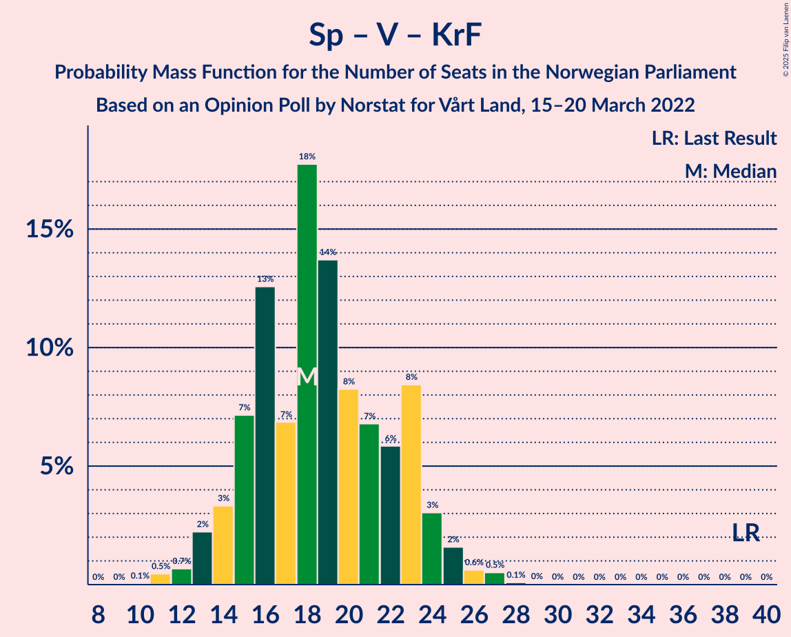

# Opinion Poll by Norstat for Vårt Land, 15–20 March 2022

<a href="#voting-intentions">Voting Intentions</a> | <a href="#seats">Seats</a> | <a href="#coalitions">Coalitions</a> | <a href="#technical-information">Technical Information</a>

## Voting Intentions

### Confidence Intervals

| Party | Last Result | Poll Result | 80% Confidence Interval | 90% Confidence Interval | 95% Confidence Interval | 99% Confidence Interval |
|:-----:|:-----------:|:-----------:|:-----------------------:|:-----------------------:|:-----------------------:|:-----------------------:|
| Høyre | 20.4% | 28.6% | 26.8–30.5% |26.3–31.1% |25.8–31.6% |25.0–32.5% |
| Arbeiderpartiet | 26.2% | 22.7% | 21.0–24.5% |20.5–25.0% |20.1–25.4% |19.3–26.3% |
| Fremskrittspartiet | 11.6% | 11.2% | 10.0–12.6% |9.6–13.0% |9.3–13.3% |8.8–14.0% |
| Rødt | 4.7% | 8.5% | 7.4–9.7% |7.1–10.1% |6.8–10.4% |6.4–11.0% |
| Senterpartiet | 13.5% | 6.6% | 5.7–7.7% |5.4–8.0% |5.2–8.3% |4.8–8.9% |
| Sosialistisk Venstreparti | 7.6% | 5.9% | 5.1–7.1% |4.8–7.4% |4.6–7.6% |4.2–8.2% |
| Miljøpartiet De Grønne | 3.9% | 4.2% | 3.4–5.1% |3.2–5.4% |3.1–5.6% |2.8–6.1% |
| Venstre | 4.6% | 3.9% | 3.2–4.8% |3.0–5.0% |2.8–5.3% |2.5–5.8% |
| Kristelig Folkeparti | 3.8% | 3.3% | 2.7–4.2% |2.5–4.5% |2.4–4.7% |2.1–5.1% |

*Note:* The poll result column reflects the actual value used in the calculations. Published results may vary slightly, and in addition be rounded to fewer digits.

## Seats

### Confidence Intervals

| Party | Last Result | Median | 80% Confidence Interval | 90% Confidence Interval | 95% Confidence Interval | 99% Confidence Interval |
|:-----:|:-----------:|:------:|:-----------------------:|:-----------------------:|:-----------------------:|:-----------------------:|
| <a href="#høyre">Høyre</a> | 36 | 50 | 47–55 |46–57 |45–57 |44–59 |
| <a href="#arbeiderpartiet">Arbeiderpartiet</a> | 48 | 45 | 42–48 |40–48 |40–50 |37–50 |
| <a href="#fremskrittspartiet">Fremskrittspartiet</a> | 21 | 18 | 17–21 |17–22 |17–23 |16–25 |
| <a href="#rødt">Rødt</a> | 8 | 13 | 11–15 |10–17 |10–17 |9–18 |
| <a href="#senterpartiet">Senterpartiet</a> | 28 | 12 | 8–14 |8–14 |7–15 |7–15 |
| <a href="#sosialistisk-venstreparti">Sosialistisk Venstreparti</a> | 13 | 9 | 7–11 |7–11 |6–12 |6–13 |
| <a href="#miljøpartiet-de-grønne">Miljøpartiet De Grønne</a> | 3 | 6 | 2–7 |2–8 |2–8 |1–9 |
| <a href="#venstre">Venstre</a> | 8 | 3 | 2–7 |2–7 |2–8 |2–9 |
| <a href="#kristelig-folkeparti">Kristelig Folkeparti</a> | 3 | 3 | 2–6 |2–7 |1–7 |0–8 |

### Høyre

*For a full overview of the results for this party, see the [Høyre](party-høyre.html) page.*

| Number of Seats | Probability | Accumulated | Special Marks |
|:---------------:|:-----------:|:-----------:|:-------------:|
| 36 | 0% | 100% | Last Result |
| 37 | 0% | 100% |  |
| 38 | 0% | 100% |  |
| 39 | 0% | 100% |  |
| 40 | 0% | 100% |  |
| 41 | 0.1% | 100% |  |
| 42 | 0.1% | 99.9% |  |
| 43 | 0.2% | 99.9% |  |
| 44 | 0.8% | 99.7% |  |
| 45 | 2% | 98.9% |  |
| 46 | 3% | 97% |  |
| 47 | 5% | 94% |  |
| 48 | 8% | 89% |  |
| 49 | 15% | 81% |  |
| 50 | 18% | 65% | Median |
| 51 | 15% | 47% |  |
| 52 | 9% | 33% |  |
| 53 | 8% | 23% |  |
| 54 | 4% | 16% |  |
| 55 | 4% | 11% |  |
| 56 | 2% | 7% |  |
| 57 | 4% | 5% |  |
| 58 | 0.2% | 0.9% |  |
| 59 | 0.4% | 0.7% |  |
| 60 | 0.1% | 0.4% |  |
| 61 | 0.1% | 0.2% |  |
| 62 | 0.1% | 0.2% |  |
| 63 | 0% | 0% |  |

### Arbeiderpartiet

*For a full overview of the results for this party, see the [Arbeiderpartiet](party-arbeiderpartiet.html) page.*

| Number of Seats | Probability | Accumulated | Special Marks |
|:---------------:|:-----------:|:-----------:|:-------------:|
| 34 | 0% | 100% |  |
| 35 | 0.1% | 99.9% |  |
| 36 | 0.2% | 99.8% |  |
| 37 | 0.4% | 99.6% |  |
| 38 | 0.7% | 99.2% |  |
| 39 | 0.6% | 98% |  |
| 40 | 4% | 98% |  |
| 41 | 3% | 94% |  |
| 42 | 4% | 91% |  |
| 43 | 6% | 87% |  |
| 44 | 9% | 81% |  |
| 45 | 29% | 72% | Median |
| 46 | 21% | 42% |  |
| 47 | 10% | 21% |  |
| 48 | 6% | 11% | Last Result |
| 49 | 2% | 5% |  |
| 50 | 2% | 3% |  |
| 51 | 0.3% | 0.4% |  |
| 52 | 0% | 0.1% |  |
| 53 | 0% | 0% |  |

### Fremskrittspartiet

*For a full overview of the results for this party, see the [Fremskrittspartiet](party-fremskrittspartiet.html) page.*

| Number of Seats | Probability | Accumulated | Special Marks |
|:---------------:|:-----------:|:-----------:|:-------------:|
| 13 | 0% | 100% |  |
| 14 | 0.1% | 99.9% |  |
| 15 | 0.1% | 99.8% |  |
| 16 | 0.5% | 99.7% |  |
| 17 | 10% | 99.1% |  |
| 18 | 48% | 90% | Median |
| 19 | 14% | 42% |  |
| 20 | 14% | 28% |  |
| 21 | 9% | 14% | Last Result |
| 22 | 3% | 6% |  |
| 23 | 1.5% | 3% |  |
| 24 | 0.4% | 1.2% |  |
| 25 | 0.3% | 0.8% |  |
| 26 | 0.2% | 0.5% |  |
| 27 | 0.2% | 0.3% |  |
| 28 | 0.1% | 0.1% |  |
| 29 | 0% | 0% |  |

### Rødt

*For a full overview of the results for this party, see the [Rødt](party-rødt.html) page.*

| Number of Seats | Probability | Accumulated | Special Marks |
|:---------------:|:-----------:|:-----------:|:-------------:|
| 8 | 0.1% | 100% | Last Result |
| 9 | 1.4% | 99.9% |  |
| 10 | 5% | 98% |  |
| 11 | 17% | 93% |  |
| 12 | 20% | 76% |  |
| 13 | 28% | 56% | Median |
| 14 | 13% | 28% |  |
| 15 | 7% | 15% |  |
| 16 | 3% | 8% |  |
| 17 | 3% | 5% |  |
| 18 | 1.2% | 2% |  |
| 19 | 0.2% | 0.4% |  |
| 20 | 0.1% | 0.1% |  |
| 21 | 0% | 0% |  |

### Senterpartiet

*For a full overview of the results for this party, see the [Senterpartiet](party-senterpartiet.html) page.*

| Number of Seats | Probability | Accumulated | Special Marks |
|:---------------:|:-----------:|:-----------:|:-------------:|
| 6 | 0.3% | 100% |  |
| 7 | 4% | 99.7% |  |
| 8 | 6% | 96% |  |
| 9 | 3% | 90% |  |
| 10 | 12% | 86% |  |
| 11 | 20% | 74% |  |
| 12 | 13% | 54% | Median |
| 13 | 31% | 42% |  |
| 14 | 7% | 10% |  |
| 15 | 3% | 3% |  |
| 16 | 0.2% | 0.4% |  |
| 17 | 0.1% | 0.2% |  |
| 18 | 0.1% | 0.1% |  |
| 19 | 0% | 0% |  |
| 20 | 0% | 0% |  |
| 21 | 0% | 0% |  |
| 22 | 0% | 0% |  |
| 23 | 0% | 0% |  |
| 24 | 0% | 0% |  |
| 25 | 0% | 0% |  |
| 26 | 0% | 0% |  |
| 27 | 0% | 0% |  |
| 28 | 0% | 0% | Last Result |

### Sosialistisk Venstreparti

*For a full overview of the results for this party, see the [Sosialistisk Venstreparti](party-sosialistiskvenstreparti.html) page.*

| Number of Seats | Probability | Accumulated | Special Marks |
|:---------------:|:-----------:|:-----------:|:-------------:|
| 2 | 0.1% | 100% |  |
| 3 | 0% | 99.9% |  |
| 4 | 0% | 99.8% |  |
| 5 | 0% | 99.8% |  |
| 6 | 2% | 99.8% |  |
| 7 | 8% | 97% |  |
| 8 | 21% | 90% |  |
| 9 | 36% | 68% | Median |
| 10 | 21% | 33% |  |
| 11 | 7% | 12% |  |
| 12 | 3% | 5% |  |
| 13 | 2% | 2% | Last Result |
| 14 | 0.2% | 0.3% |  |
| 15 | 0.1% | 0.1% |  |
| 16 | 0% | 0% |  |

### Miljøpartiet De Grønne

*For a full overview of the results for this party, see the [Miljøpartiet De Grønne](party-miljøpartietdegrønne.html) page.*

| Number of Seats | Probability | Accumulated | Special Marks |
|:---------------:|:-----------:|:-----------:|:-------------:|
| 1 | 1.5% | 100% |  |
| 2 | 21% | 98.5% |  |
| 3 | 14% | 77% | Last Result |
| 4 | 0% | 63% |  |
| 5 | 1.3% | 63% |  |
| 6 | 26% | 62% | Median |
| 7 | 27% | 36% |  |
| 8 | 7% | 9% |  |
| 9 | 1.5% | 2% |  |
| 10 | 0.2% | 0.3% |  |
| 11 | 0% | 0% |  |

### Venstre

*For a full overview of the results for this party, see the [Venstre](party-venstre.html) page.*

| Number of Seats | Probability | Accumulated | Special Marks |
|:---------------:|:-----------:|:-----------:|:-------------:|
| 1 | 0.1% | 100% |  |
| 2 | 44% | 99.9% |  |
| 3 | 14% | 55% | Median |
| 4 | 0% | 41% |  |
| 5 | 1.2% | 41% |  |
| 6 | 21% | 40% |  |
| 7 | 16% | 19% |  |
| 8 | 3% | 3% | Last Result |
| 9 | 0.4% | 0.5% |  |
| 10 | 0.1% | 0.1% |  |
| 11 | 0% | 0% |  |

### Kristelig Folkeparti

*For a full overview of the results for this party, see the [Kristelig Folkeparti](party-kristeligfolkeparti.html) page.*

| Number of Seats | Probability | Accumulated | Special Marks |
|:---------------:|:-----------:|:-----------:|:-------------:|
| 0 | 0.7% | 100% |  |
| 1 | 2% | 99.3% |  |
| 2 | 37% | 97% |  |
| 3 | 43% | 60% | Last Result, Median |
| 4 | 0% | 17% |  |
| 5 | 2% | 17% |  |
| 6 | 10% | 16% |  |
| 7 | 5% | 6% |  |
| 8 | 0.5% | 0.6% |  |
| 9 | 0% | 0% |  |

## Coalitions

### Confidence Intervals

| Coalition | Last Result | Median | Majority? | 80% Confidence Interval | 90% Confidence Interval | 95% Confidence Interval | 99% Confidence Interval |
|:---------:|:-----------:|:------:|:---------:|:-----------------------:|:-----------------------:|:-----------------------:|:-----------------------:|
| Høyre – Fremskrittspartiet – Senterpartiet – Venstre – Kristelig Folkeparti | 96 | 88 | 88% | 84–92 | 83–94 | 82–95 | 80–98 |
| Arbeiderpartiet – Rødt – Senterpartiet – Sosialistisk Venstreparti – Miljøpartiet De Grønne | 100 | 83 | 41% | 79–87 | 78–89 | 77–90 | 74–94 |
| Høyre – Fremskrittspartiet – Miljøpartiet De Grønne – Venstre – Kristelig Folkeparti | 71 | 82 | 21% | 78–87 | 76–88 | 75–89 | 73–91 |
| Arbeiderpartiet – Rødt – Senterpartiet – Sosialistisk Venstreparti | 97 | 79 | 3% | 74–82 | 73–84 | 72–85 | 69–88 |
| Høyre – Fremskrittspartiet – Venstre – Kristelig Folkeparti | 68 | 77 | 2% | 73–81 | 72–82 | 71–84 | 69–86 |
| Høyre – Fremskrittspartiet – Venstre | 65 | 74 | 0.2% | 70–78 | 69–79 | 68–80 | 66–83 |
| Arbeiderpartiet – Senterpartiet – Sosialistisk Venstreparti – Miljøpartiet De Grønne – Kristelig Folkeparti | 95 | 74 | 0% | 69–78 | 67–79 | 67–80 | 65–82 |
| Arbeiderpartiet – Rødt – Sosialistisk Venstreparti – Miljøpartiet De Grønne | 72 | 72 | 0% | 68–76 | 67–77 | 65–79 | 63–82 |
| Arbeiderpartiet – Senterpartiet – Sosialistisk Venstreparti – Miljøpartiet De Grønne | 92 | 71 | 0% | 66–75 | 65–76 | 64–77 | 62–79 |
| Høyre – Fremskrittspartiet | 57 | 69 | 0% | 66–73 | 65–75 | 64–76 | 63–78 |
| Arbeiderpartiet – Senterpartiet – Sosialistisk Venstreparti | 89 | 66 | 0% | 62–69 | 61–70 | 59–71 | 57–73 |
| Arbeiderpartiet – Senterpartiet – Miljøpartiet De Grønne – Kristelig Folkeparti | 82 | 65 | 0% | 60–69 | 58–70 | 57–71 | 55–73 |
| Arbeiderpartiet – Senterpartiet – Kristelig Folkeparti | 79 | 60 | 0% | 56–63 | 54–65 | 53–66 | 51–67 |
| Høyre – Venstre – Kristelig Folkeparti | 47 | 58 | 0% | 54–62 | 53–64 | 52–65 | 50–67 |
| Arbeiderpartiet – Senterpartiet | 76 | 57 | 0% | 53–60 | 52–61 | 51–61 | 49–62 |
| Arbeiderpartiet – Sosialistisk Venstreparti | 61 | 54 | 0% | 50–57 | 50–58 | 48–59 | 45–60 |
| Senterpartiet – Venstre – Kristelig Folkeparti | 39 | 18 | 0% | 15–23 | 14–24 | 13–25 | 11–27 |

### Høyre – Fremskrittspartiet – Senterpartiet – Venstre – Kristelig Folkeparti

| Number of Seats | Probability | Accumulated | Special Marks |
|:---------------:|:-----------:|:-----------:|:-------------:|
| 78 | 0.1% | 100% |  |
| 79 | 0.2% | 99.9% |  |
| 80 | 0.3% | 99.7% |  |
| 81 | 1.2% | 99.4% |  |
| 82 | 2% | 98% |  |
| 83 | 2% | 97% |  |
| 84 | 7% | 95% |  |
| 85 | 5% | 88% | Majority |
| 86 | 17% | 83% | Median |
| 87 | 11% | 67% |  |
| 88 | 11% | 55% |  |
| 89 | 10% | 45% |  |
| 90 | 12% | 35% |  |
| 91 | 7% | 23% |  |
| 92 | 6% | 15% |  |
| 93 | 4% | 10% |  |
| 94 | 2% | 5% |  |
| 95 | 1.3% | 4% |  |
| 96 | 1.2% | 2% | Last Result |
| 97 | 0.8% | 1.3% |  |
| 98 | 0.2% | 0.5% |  |
| 99 | 0.1% | 0.3% |  |
| 100 | 0.1% | 0.1% |  |
| 101 | 0% | 0.1% |  |
| 102 | 0% | 0% |  |

### Arbeiderpartiet – Rødt – Senterpartiet – Sosialistisk Venstreparti – Miljøpartiet De Grønne

| Number of Seats | Probability | Accumulated | Special Marks |
|:---------------:|:-----------:|:-----------:|:-------------:|
| 71 | 0% | 100% |  |
| 72 | 0.1% | 99.9% |  |
| 73 | 0.1% | 99.8% |  |
| 74 | 0.3% | 99.8% |  |
| 75 | 0.5% | 99.4% |  |
| 76 | 1.1% | 99.0% |  |
| 77 | 1.0% | 98% |  |
| 78 | 4% | 97% |  |
| 79 | 5% | 93% |  |
| 80 | 10% | 88% |  |
| 81 | 7% | 79% |  |
| 82 | 11% | 72% |  |
| 83 | 12% | 61% |  |
| 84 | 8% | 49% |  |
| 85 | 11% | 41% | Median, Majority |
| 86 | 4% | 30% |  |
| 87 | 17% | 26% |  |
| 88 | 3% | 8% |  |
| 89 | 2% | 5% |  |
| 90 | 1.1% | 3% |  |
| 91 | 0.9% | 2% |  |
| 92 | 0.7% | 1.5% |  |
| 93 | 0.2% | 0.8% |  |
| 94 | 0.4% | 0.6% |  |
| 95 | 0.1% | 0.2% |  |
| 96 | 0.1% | 0.1% |  |
| 97 | 0% | 0.1% |  |
| 98 | 0% | 0% |  |
| 99 | 0% | 0% |  |
| 100 | 0% | 0% | Last Result |

### Høyre – Fremskrittspartiet – Miljøpartiet De Grønne – Venstre – Kristelig Folkeparti

| Number of Seats | Probability | Accumulated | Special Marks |
|:---------------:|:-----------:|:-----------:|:-------------:|
| 70 | 0% | 100% |  |
| 71 | 0.1% | 99.9% | Last Result |
| 72 | 0.2% | 99.9% |  |
| 73 | 0.4% | 99.7% |  |
| 74 | 1.0% | 99.3% |  |
| 75 | 2% | 98% |  |
| 76 | 4% | 97% |  |
| 77 | 2% | 93% |  |
| 78 | 5% | 90% |  |
| 79 | 9% | 85% |  |
| 80 | 17% | 76% | Median |
| 81 | 7% | 58% |  |
| 82 | 13% | 51% |  |
| 83 | 10% | 38% |  |
| 84 | 7% | 28% |  |
| 85 | 4% | 21% | Majority |
| 86 | 5% | 17% |  |
| 87 | 5% | 12% |  |
| 88 | 4% | 7% |  |
| 89 | 1.1% | 3% |  |
| 90 | 0.9% | 2% |  |
| 91 | 0.7% | 1.2% |  |
| 92 | 0.3% | 0.5% |  |
| 93 | 0.1% | 0.2% |  |
| 94 | 0.1% | 0.1% |  |
| 95 | 0% | 0.1% |  |
| 96 | 0% | 0% |  |

### Arbeiderpartiet – Rødt – Senterpartiet – Sosialistisk Venstreparti

| Number of Seats | Probability | Accumulated | Special Marks |
|:---------------:|:-----------:|:-----------:|:-------------:|
| 66 | 0% | 100% |  |
| 67 | 0.1% | 99.9% |  |
| 68 | 0.1% | 99.9% |  |
| 69 | 0.3% | 99.7% |  |
| 70 | 0.5% | 99.4% |  |
| 71 | 0.8% | 98.9% |  |
| 72 | 2% | 98% |  |
| 73 | 3% | 96% |  |
| 74 | 8% | 93% |  |
| 75 | 3% | 85% |  |
| 76 | 7% | 82% |  |
| 77 | 12% | 75% |  |
| 78 | 10% | 63% |  |
| 79 | 10% | 53% | Median |
| 80 | 21% | 43% |  |
| 81 | 7% | 22% |  |
| 82 | 5% | 15% |  |
| 83 | 4% | 9% |  |
| 84 | 2% | 5% |  |
| 85 | 2% | 3% | Majority |
| 86 | 0.5% | 2% |  |
| 87 | 0.5% | 1.2% |  |
| 88 | 0.5% | 0.7% |  |
| 89 | 0.2% | 0.2% |  |
| 90 | 0% | 0% |  |
| 91 | 0% | 0% |  |
| 92 | 0% | 0% |  |
| 93 | 0% | 0% |  |
| 94 | 0% | 0% |  |
| 95 | 0% | 0% |  |
| 96 | 0% | 0% |  |
| 97 | 0% | 0% | Last Result |

### Høyre – Fremskrittspartiet – Venstre – Kristelig Folkeparti

| Number of Seats | Probability | Accumulated | Special Marks |
|:---------------:|:-----------:|:-----------:|:-------------:|
| 67 | 0.1% | 100% |  |
| 68 | 0.2% | 99.8% | Last Result |
| 69 | 0.7% | 99.6% |  |
| 70 | 1.1% | 98.9% |  |
| 71 | 2% | 98% |  |
| 72 | 5% | 96% |  |
| 73 | 16% | 91% |  |
| 74 | 6% | 75% | Median |
| 75 | 7% | 69% |  |
| 76 | 8% | 63% |  |
| 77 | 17% | 54% |  |
| 78 | 8% | 38% |  |
| 79 | 10% | 30% |  |
| 80 | 5% | 20% |  |
| 81 | 5% | 15% |  |
| 82 | 5% | 9% |  |
| 83 | 1.5% | 5% |  |
| 84 | 1.1% | 3% |  |
| 85 | 0.9% | 2% | Majority |
| 86 | 0.8% | 1.2% |  |
| 87 | 0.2% | 0.4% |  |
| 88 | 0.1% | 0.2% |  |
| 89 | 0.1% | 0.1% |  |
| 90 | 0% | 0.1% |  |
| 91 | 0% | 0% |  |

### Høyre – Fremskrittspartiet – Venstre

| Number of Seats | Probability | Accumulated | Special Marks |
|:---------------:|:-----------:|:-----------:|:-------------:|
| 64 | 0.1% | 100% |  |
| 65 | 0.2% | 99.9% | Last Result |
| 66 | 0.5% | 99.8% |  |
| 67 | 0.9% | 99.2% |  |
| 68 | 2% | 98% |  |
| 69 | 5% | 97% |  |
| 70 | 17% | 92% |  |
| 71 | 8% | 75% | Median |
| 72 | 7% | 67% |  |
| 73 | 10% | 60% |  |
| 74 | 11% | 50% |  |
| 75 | 12% | 40% |  |
| 76 | 8% | 28% |  |
| 77 | 7% | 20% |  |
| 78 | 4% | 13% |  |
| 79 | 6% | 9% |  |
| 80 | 2% | 3% |  |
| 81 | 0.4% | 1.3% |  |
| 82 | 0.3% | 0.9% |  |
| 83 | 0.3% | 0.6% |  |
| 84 | 0.1% | 0.3% |  |
| 85 | 0.1% | 0.2% | Majority |
| 86 | 0.1% | 0.1% |  |
| 87 | 0% | 0.1% |  |
| 88 | 0% | 0% |  |

### Arbeiderpartiet – Senterpartiet – Sosialistisk Venstreparti – Miljøpartiet De Grønne – Kristelig Folkeparti

| Number of Seats | Probability | Accumulated | Special Marks |
|:---------------:|:-----------:|:-----------:|:-------------:|
| 61 | 0% | 100% |  |
| 62 | 0.1% | 99.9% |  |
| 63 | 0.1% | 99.9% |  |
| 64 | 0.2% | 99.8% |  |
| 65 | 0.5% | 99.5% |  |
| 66 | 0.8% | 99.1% |  |
| 67 | 4% | 98% |  |
| 68 | 2% | 94% |  |
| 69 | 3% | 92% |  |
| 70 | 6% | 89% |  |
| 71 | 8% | 83% |  |
| 72 | 10% | 75% |  |
| 73 | 10% | 64% |  |
| 74 | 9% | 55% |  |
| 75 | 9% | 46% | Median |
| 76 | 7% | 37% |  |
| 77 | 17% | 30% |  |
| 78 | 7% | 13% |  |
| 79 | 2% | 6% |  |
| 80 | 2% | 4% |  |
| 81 | 1.5% | 2% |  |
| 82 | 0.2% | 0.5% |  |
| 83 | 0.1% | 0.3% |  |
| 84 | 0.1% | 0.1% |  |
| 85 | 0% | 0% | Majority |
| 86 | 0% | 0% |  |
| 87 | 0% | 0% |  |
| 88 | 0% | 0% |  |
| 89 | 0% | 0% |  |
| 90 | 0% | 0% |  |
| 91 | 0% | 0% |  |
| 92 | 0% | 0% |  |
| 93 | 0% | 0% |  |
| 94 | 0% | 0% |  |
| 95 | 0% | 0% | Last Result |

### Arbeiderpartiet – Rødt – Sosialistisk Venstreparti – Miljøpartiet De Grønne

| Number of Seats | Probability | Accumulated | Special Marks |
|:---------------:|:-----------:|:-----------:|:-------------:|
| 60 | 0% | 100% |  |
| 61 | 0.1% | 99.9% |  |
| 62 | 0.2% | 99.8% |  |
| 63 | 0.3% | 99.6% |  |
| 64 | 0.3% | 99.3% |  |
| 65 | 2% | 99.0% |  |
| 66 | 2% | 97% |  |
| 67 | 3% | 95% |  |
| 68 | 6% | 92% |  |
| 69 | 11% | 86% |  |
| 70 | 7% | 75% |  |
| 71 | 8% | 68% |  |
| 72 | 17% | 60% | Last Result |
| 73 | 8% | 44% | Median |
| 74 | 17% | 36% |  |
| 75 | 6% | 18% |  |
| 76 | 5% | 12% |  |
| 77 | 3% | 7% |  |
| 78 | 1.5% | 4% |  |
| 79 | 0.9% | 3% |  |
| 80 | 0.7% | 2% |  |
| 81 | 0.4% | 1.0% |  |
| 82 | 0.4% | 0.5% |  |
| 83 | 0.1% | 0.2% |  |
| 84 | 0% | 0% |  |

### Arbeiderpartiet – Senterpartiet – Sosialistisk Venstreparti – Miljøpartiet De Grønne

| Number of Seats | Probability | Accumulated | Special Marks |
|:---------------:|:-----------:|:-----------:|:-------------:|
| 59 | 0.1% | 100% |  |
| 60 | 0.1% | 99.9% |  |
| 61 | 0.2% | 99.8% |  |
| 62 | 0.5% | 99.6% |  |
| 63 | 0.7% | 99.1% |  |
| 64 | 2% | 98% |  |
| 65 | 5% | 97% |  |
| 66 | 3% | 92% |  |
| 67 | 7% | 89% |  |
| 68 | 9% | 83% |  |
| 69 | 12% | 73% |  |
| 70 | 8% | 61% |  |
| 71 | 9% | 53% |  |
| 72 | 7% | 44% | Median |
| 73 | 10% | 36% |  |
| 74 | 15% | 26% |  |
| 75 | 5% | 11% |  |
| 76 | 3% | 6% |  |
| 77 | 2% | 3% |  |
| 78 | 0.9% | 1.5% |  |
| 79 | 0.4% | 0.6% |  |
| 80 | 0.1% | 0.2% |  |
| 81 | 0.1% | 0.1% |  |
| 82 | 0.1% | 0.1% |  |
| 83 | 0% | 0% |  |
| 84 | 0% | 0% |  |
| 85 | 0% | 0% | Majority |
| 86 | 0% | 0% |  |
| 87 | 0% | 0% |  |
| 88 | 0% | 0% |  |
| 89 | 0% | 0% |  |
| 90 | 0% | 0% |  |
| 91 | 0% | 0% |  |
| 92 | 0% | 0% | Last Result |

### Høyre – Fremskrittspartiet

| Number of Seats | Probability | Accumulated | Special Marks |
|:---------------:|:-----------:|:-----------:|:-------------:|
| 57 | 0% | 100% | Last Result |
| 58 | 0% | 100% |  |
| 59 | 0% | 100% |  |
| 60 | 0% | 100% |  |
| 61 | 0.1% | 100% |  |
| 62 | 0.1% | 99.9% |  |
| 63 | 0.9% | 99.7% |  |
| 64 | 2% | 98.9% |  |
| 65 | 3% | 97% |  |
| 66 | 6% | 94% |  |
| 67 | 9% | 88% |  |
| 68 | 21% | 79% | Median |
| 69 | 14% | 57% |  |
| 70 | 9% | 43% |  |
| 71 | 10% | 34% |  |
| 72 | 7% | 24% |  |
| 73 | 7% | 17% |  |
| 74 | 3% | 10% |  |
| 75 | 3% | 6% |  |
| 76 | 2% | 3% |  |
| 77 | 0.5% | 1.2% |  |
| 78 | 0.3% | 0.7% |  |
| 79 | 0.2% | 0.4% |  |
| 80 | 0.1% | 0.2% |  |
| 81 | 0.1% | 0.1% |  |
| 82 | 0% | 0% |  |

### Arbeiderpartiet – Senterpartiet – Sosialistisk Venstreparti

| Number of Seats | Probability | Accumulated | Special Marks |
|:---------------:|:-----------:|:-----------:|:-------------:|
| 54 | 0% | 100% |  |
| 55 | 0.1% | 99.9% |  |
| 56 | 0.2% | 99.8% |  |
| 57 | 0.3% | 99.7% |  |
| 58 | 0.5% | 99.4% |  |
| 59 | 1.5% | 98.9% |  |
| 60 | 1.5% | 97% |  |
| 61 | 2% | 96% |  |
| 62 | 9% | 94% |  |
| 63 | 10% | 85% |  |
| 64 | 6% | 75% |  |
| 65 | 10% | 69% |  |
| 66 | 14% | 59% | Median |
| 67 | 27% | 46% |  |
| 68 | 8% | 19% |  |
| 69 | 4% | 11% |  |
| 70 | 4% | 7% |  |
| 71 | 1.2% | 3% |  |
| 72 | 1.4% | 2% |  |
| 73 | 0.4% | 0.5% |  |
| 74 | 0.1% | 0.1% |  |
| 75 | 0% | 0.1% |  |
| 76 | 0% | 0% |  |
| 77 | 0% | 0% |  |
| 78 | 0% | 0% |  |
| 79 | 0% | 0% |  |
| 80 | 0% | 0% |  |
| 81 | 0% | 0% |  |
| 82 | 0% | 0% |  |
| 83 | 0% | 0% |  |
| 84 | 0% | 0% |  |
| 85 | 0% | 0% | Majority |
| 86 | 0% | 0% |  |
| 87 | 0% | 0% |  |
| 88 | 0% | 0% |  |
| 89 | 0% | 0% | Last Result |

### Arbeiderpartiet – Senterpartiet – Miljøpartiet De Grønne – Kristelig Folkeparti

| Number of Seats | Probability | Accumulated | Special Marks |
|:---------------:|:-----------:|:-----------:|:-------------:|
| 52 | 0% | 100% |  |
| 53 | 0.1% | 99.9% |  |
| 54 | 0.2% | 99.8% |  |
| 55 | 0.2% | 99.7% |  |
| 56 | 0.5% | 99.4% |  |
| 57 | 3% | 98.9% |  |
| 58 | 1.4% | 96% |  |
| 59 | 3% | 94% |  |
| 60 | 6% | 91% |  |
| 61 | 3% | 86% |  |
| 62 | 9% | 82% |  |
| 63 | 7% | 73% |  |
| 64 | 9% | 67% |  |
| 65 | 14% | 58% |  |
| 66 | 6% | 44% | Median |
| 67 | 8% | 37% |  |
| 68 | 17% | 30% |  |
| 69 | 6% | 12% |  |
| 70 | 3% | 6% |  |
| 71 | 1.2% | 3% |  |
| 72 | 1.5% | 2% |  |
| 73 | 0.5% | 0.7% |  |
| 74 | 0.1% | 0.2% |  |
| 75 | 0.1% | 0.1% |  |
| 76 | 0% | 0% |  |
| 77 | 0% | 0% |  |
| 78 | 0% | 0% |  |
| 79 | 0% | 0% |  |
| 80 | 0% | 0% |  |
| 81 | 0% | 0% |  |
| 82 | 0% | 0% | Last Result |

### Arbeiderpartiet – Senterpartiet – Kristelig Folkeparti

| Number of Seats | Probability | Accumulated | Special Marks |
|:---------------:|:-----------:|:-----------:|:-------------:|
| 48 | 0% | 100% |  |
| 49 | 0.1% | 99.9% |  |
| 50 | 0.2% | 99.8% |  |
| 51 | 0.3% | 99.7% |  |
| 52 | 0.3% | 99.3% |  |
| 53 | 2% | 99.0% |  |
| 54 | 3% | 97% |  |
| 55 | 3% | 94% |  |
| 56 | 6% | 91% |  |
| 57 | 7% | 84% |  |
| 58 | 8% | 78% |  |
| 59 | 14% | 70% |  |
| 60 | 12% | 56% | Median |
| 61 | 19% | 44% |  |
| 62 | 11% | 25% |  |
| 63 | 5% | 15% |  |
| 64 | 4% | 9% |  |
| 65 | 3% | 5% |  |
| 66 | 2% | 3% |  |
| 67 | 0.4% | 0.7% |  |
| 68 | 0.3% | 0.3% |  |
| 69 | 0.1% | 0.1% |  |
| 70 | 0% | 0% |  |
| 71 | 0% | 0% |  |
| 72 | 0% | 0% |  |
| 73 | 0% | 0% |  |
| 74 | 0% | 0% |  |
| 75 | 0% | 0% |  |
| 76 | 0% | 0% |  |
| 77 | 0% | 0% |  |
| 78 | 0% | 0% |  |
| 79 | 0% | 0% | Last Result |

### Høyre – Venstre – Kristelig Folkeparti

| Number of Seats | Probability | Accumulated | Special Marks |
|:---------------:|:-----------:|:-----------:|:-------------:|
| 47 | 0.1% | 100% | Last Result |
| 48 | 0.2% | 99.9% |  |
| 49 | 0.2% | 99.8% |  |
| 50 | 0.7% | 99.5% |  |
| 51 | 0.7% | 98.8% |  |
| 52 | 3% | 98% |  |
| 53 | 3% | 95% |  |
| 54 | 7% | 92% |  |
| 55 | 17% | 85% |  |
| 56 | 7% | 67% | Median |
| 57 | 8% | 60% |  |
| 58 | 6% | 52% |  |
| 59 | 16% | 46% |  |
| 60 | 6% | 30% |  |
| 61 | 9% | 24% |  |
| 62 | 6% | 15% |  |
| 63 | 2% | 9% |  |
| 64 | 3% | 6% |  |
| 65 | 2% | 3% |  |
| 66 | 0.8% | 2% |  |
| 67 | 0.4% | 0.8% |  |
| 68 | 0.2% | 0.4% |  |
| 69 | 0.1% | 0.3% |  |
| 70 | 0.1% | 0.1% |  |
| 71 | 0% | 0.1% |  |
| 72 | 0% | 0% |  |

### Arbeiderpartiet – Senterpartiet

| Number of Seats | Probability | Accumulated | Special Marks |
|:---------------:|:-----------:|:-----------:|:-------------:|
| 45 | 0% | 100% |  |
| 46 | 0.1% | 99.9% |  |
| 47 | 0.1% | 99.8% |  |
| 48 | 0.2% | 99.8% |  |
| 49 | 0.4% | 99.6% |  |
| 50 | 0.8% | 99.1% |  |
| 51 | 2% | 98% |  |
| 52 | 4% | 96% |  |
| 53 | 7% | 92% |  |
| 54 | 7% | 85% |  |
| 55 | 8% | 78% |  |
| 56 | 11% | 70% |  |
| 57 | 20% | 60% | Median |
| 58 | 20% | 40% |  |
| 59 | 10% | 20% |  |
| 60 | 4% | 10% |  |
| 61 | 4% | 6% |  |
| 62 | 1.5% | 2% |  |
| 63 | 0.2% | 0.3% |  |
| 64 | 0.1% | 0.1% |  |
| 65 | 0% | 0% |  |
| 66 | 0% | 0% |  |
| 67 | 0% | 0% |  |
| 68 | 0% | 0% |  |
| 69 | 0% | 0% |  |
| 70 | 0% | 0% |  |
| 71 | 0% | 0% |  |
| 72 | 0% | 0% |  |
| 73 | 0% | 0% |  |
| 74 | 0% | 0% |  |
| 75 | 0% | 0% |  |
| 76 | 0% | 0% | Last Result |

### Arbeiderpartiet – Sosialistisk Venstreparti

| Number of Seats | Probability | Accumulated | Special Marks |
|:---------------:|:-----------:|:-----------:|:-------------:|
| 43 | 0.1% | 100% |  |
| 44 | 0.2% | 99.9% |  |
| 45 | 0.3% | 99.8% |  |
| 46 | 0.4% | 99.4% |  |
| 47 | 0.3% | 99.0% |  |
| 48 | 1.2% | 98.7% |  |
| 49 | 1.1% | 97% |  |
| 50 | 7% | 96% |  |
| 51 | 4% | 90% |  |
| 52 | 8% | 86% |  |
| 53 | 11% | 78% |  |
| 54 | 25% | 67% | Median |
| 55 | 14% | 42% |  |
| 56 | 14% | 28% |  |
| 57 | 8% | 14% |  |
| 58 | 3% | 6% |  |
| 59 | 2% | 3% |  |
| 60 | 1.4% | 2% |  |
| 61 | 0.2% | 0.3% | Last Result |
| 62 | 0.1% | 0.1% |  |
| 63 | 0% | 0% |  |

### Senterpartiet – Venstre – Kristelig Folkeparti

| Number of Seats | Probability | Accumulated | Special Marks |
|:---------------:|:-----------:|:-----------:|:-------------:|
| 10 | 0.1% | 100% |  |
| 11 | 0.5% | 99.9% |  |
| 12 | 0.7% | 99.5% |  |
| 13 | 2% | 98.8% |  |
| 14 | 3% | 97% |  |
| 15 | 7% | 93% |  |
| 16 | 13% | 86% |  |
| 17 | 7% | 74% |  |
| 18 | 18% | 67% | Median |
| 19 | 14% | 49% |  |
| 20 | 8% | 35% |  |
| 21 | 7% | 27% |  |
| 22 | 6% | 20% |  |
| 23 | 8% | 14% |  |
| 24 | 3% | 6% |  |
| 25 | 2% | 3% |  |
| 26 | 0.6% | 1.3% |  |
| 27 | 0.5% | 0.6% |  |
| 28 | 0.1% | 0.1% |  |
| 29 | 0% | 0% |  |
| 30 | 0% | 0% |  |
| 31 | 0% | 0% |  |
| 32 | 0% | 0% |  |
| 33 | 0% | 0% |  |
| 34 | 0% | 0% |  |
| 35 | 0% | 0% |  |
| 36 | 0% | 0% |  |
| 37 | 0% | 0% |  |
| 38 | 0% | 0% |  |
| 39 | 0% | 0% | Last Result |

## Technical Information

### Opinion Poll

+ **Polling firm:** Norstat
+ **Commissioner(s):** Vårt Land
+ **Fieldwork period:** 15–20 March 2022

### Calculations

+ **Sample size:** 958
+ **Simulations done:** 1,048,576
+ **Error estimate:** 1.33%

