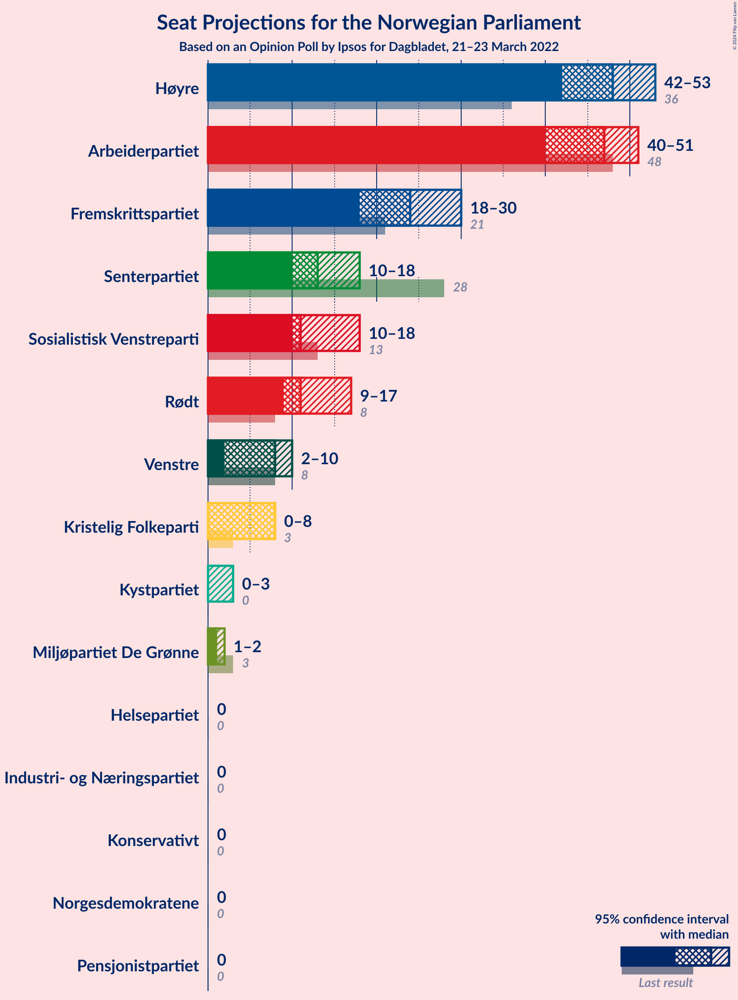
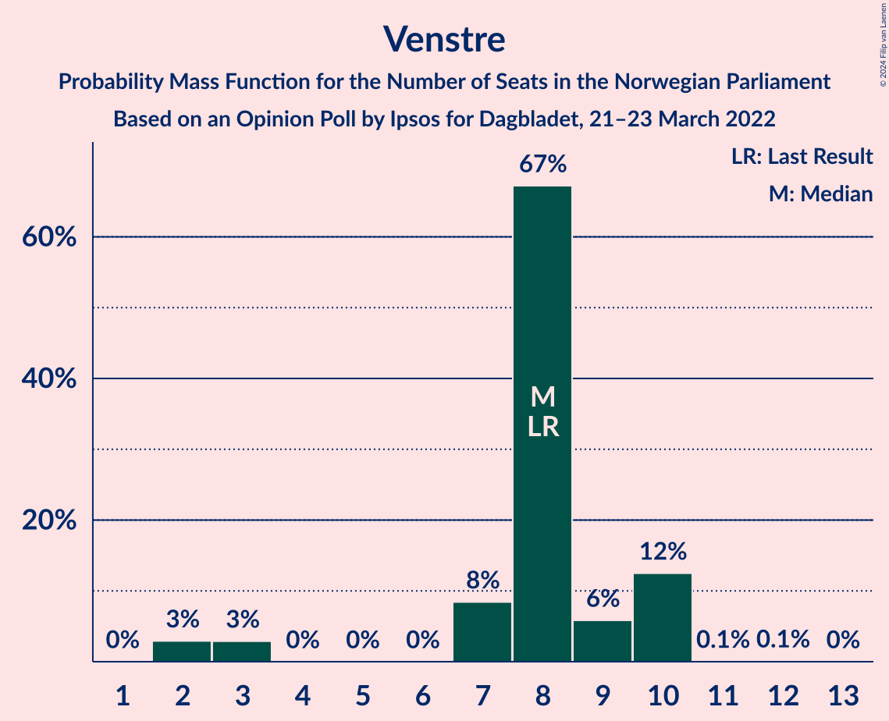
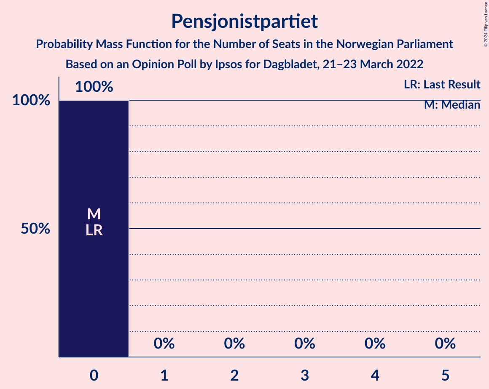

# Opinion Poll by Ipsos for Dagbladet, 21–23 March 2022

<a href="#voting-intentions">Voting Intentions</a> | <a href="#seats">Seats</a> | <a href="#coalitions">Coalitions</a> | <a href="#technical-information">Technical Information</a>

## Voting Intentions

### Confidence Intervals

| Party | Last Result | Poll Result | 80% Confidence Interval | 90% Confidence Interval | 95% Confidence Interval | 99% Confidence Interval |
|:-----:|:-----------:|:-----------:|:-----------------------:|:-----------------------:|:-----------------------:|:-----------------------:|
| Høyre | 20.4% | 26.5% | 24.4–28.6% |23.9–29.2% |23.4–29.8% |22.5–30.8% |
| Arbeiderpartiet | 26.2% | 24.0% | 22.1–26.1% |21.6–26.7% |21.1–27.2% |20.2–28.3% |
| Fremskrittspartiet | 11.6% | 13.2% | 11.7–15.0% |11.3–15.4% |11.0–15.9% |10.3–16.7% |
| Senterpartiet | 13.5% | 7.6% | 6.4–8.9% |6.1–9.3% |5.9–9.7% |5.4–10.4% |
| Sosialistisk Venstreparti | 7.6% | 7.2% | 6.1–8.5% |5.8–8.9% |5.5–9.3% |5.0–9.9% |
| Rødt | 4.7% | 6.6% | 5.6–7.9% |5.3–8.3% |5.0–8.6% |4.6–9.3% |
| Venstre | 4.6% | 4.3% | 3.5–5.4% |3.3–5.8% |3.1–6.0% |2.7–6.6% |
| Kristelig Folkeparti | 3.8% | 3.1% | 2.4–4.1% |2.2–4.4% |2.1–4.6% |1.8–5.1% |
| Miljøpartiet De Grønne | 3.9% | 2.6% | 2.0–3.5% |1.8–3.7% |1.6–4.0% |1.4–4.5% |
| Norgesdemokratene | 1.1% | 2.6% | 2.0–3.5% |1.8–3.7% |1.6–4.0% |1.4–4.5% |
| Kystpartiet | 0.0% | 0.5% | 0.3–1.1% |0.3–1.2% |0.2–1.4% |0.1–1.7% |
| Pensjonistpartiet | 0.6% | 0.4% | 0.2–0.9% |0.2–1.1% |0.1–1.2% |0.1–1.5% |
| Helsepartiet | 0.2% | 0.4% | 0.2–0.9% |0.2–1.1% |0.1–1.2% |0.1–1.5% |
| Konservativt | 0.4% | 0.3% | 0.1–0.7% |0.1–0.9% |0.1–1.0% |0.0–1.2% |
| Industri- og Næringspartiet | 0.3% | 0.3% | 0.1–0.7% |0.1–0.9% |0.1–1.0% |0.0–1.2% |

*Note:* The poll result column reflects the actual value used in the calculations. Published results may vary slightly, and in addition be rounded to fewer digits.

## Seats

### Confidence Intervals

| Party | Last Result | Median | 80% Confidence Interval | 90% Confidence Interval | 95% Confidence Interval | 99% Confidence Interval |
|:-----:|:-----------:|:------:|:-----------------------:|:-----------------------:|:-----------------------:|:-----------------------:|
| <a href="#høyre">Høyre</a> | 36 | 48 | 43–50 |43–52 |42–53 |42–55 |
| <a href="#arbeiderpartiet">Arbeiderpartiet</a> | 48 | 47 | 44–50 |43–50 |40–51 |37–51 |
| <a href="#fremskrittspartiet">Fremskrittspartiet</a> | 21 | 24 | 18–27 |18–27 |18–30 |18–34 |
| <a href="#senterpartiet">Senterpartiet</a> | 28 | 13 | 10–15 |10–15 |10–18 |10–18 |
| <a href="#sosialistisk-venstreparti">Sosialistisk Venstreparti</a> | 13 | 11 | 10–16 |10–16 |10–18 |10–19 |
| <a href="#rødt">Rødt</a> | 8 | 11 | 9–13 |9–15 |9–17 |7–17 |
| <a href="#venstre">Venstre</a> | 8 | 8 | 7–10 |3–10 |2–10 |2–10 |
| <a href="#kristelig-folkeparti">Kristelig Folkeparti</a> | 3 | 8 | 2–8 |1–8 |0–8 |0–8 |
| <a href="#miljøpartiet-de-grønne">Miljøpartiet De Grønne</a> | 3 | 1 | 1–2 |1–2 |1–2 |1–2 |
| <a href="#norgesdemokratene">Norgesdemokratene</a> | 0 | 0 | 0 |0 |0 |0–1 |
| <a href="#kystpartiet">Kystpartiet</a> | 0 | 0 | 0–2 |0–2 |0–3 |0–3 |
| <a href="#pensjonistpartiet">Pensjonistpartiet</a> | 0 | 0 | 0 |0 |0 |0 |
| <a href="#helsepartiet">Helsepartiet</a> | 0 | 0 | 0 |0 |0 |0 |
| <a href="#konservativt">Konservativt</a> | 0 | 0 | 0 |0 |0 |0 |
| <a href="#industri--og-næringspartiet">Industri- og Næringspartiet</a> | 0 | 0 | 0 |0 |0 |0 |

### Høyre

*For a full overview of the results for this party, see the [Høyre](party-høyre.html) page.*

| Number of Seats | Probability | Accumulated | Special Marks |
|:---------------:|:-----------:|:-----------:|:-------------:|
| 36 | 0% | 100% | Last Result |
| 37 | 0% | 100% |  |
| 38 | 0% | 100% |  |
| 39 | 0% | 100% |  |
| 40 | 0% | 100% |  |
| 41 | 0.2% | 99.9% |  |
| 42 | 3% | 99.8% |  |
| 43 | 8% | 97% |  |
| 44 | 0.3% | 89% |  |
| 45 | 23% | 89% |  |
| 46 | 3% | 65% |  |
| 47 | 3% | 63% |  |
| 48 | 41% | 60% | Median |
| 49 | 1.4% | 19% |  |
| 50 | 8% | 18% |  |
| 51 | 5% | 10% |  |
| 52 | 0.9% | 5% |  |
| 53 | 3% | 4% |  |
| 54 | 0% | 1.2% |  |
| 55 | 1.1% | 1.1% |  |
| 56 | 0% | 0% |  |

### Arbeiderpartiet

*For a full overview of the results for this party, see the [Arbeiderpartiet](party-arbeiderpartiet.html) page.*

| Number of Seats | Probability | Accumulated | Special Marks |
|:---------------:|:-----------:|:-----------:|:-------------:|
| 37 | 0.6% | 100% |  |
| 38 | 0.1% | 99.4% |  |
| 39 | 0% | 99.3% |  |
| 40 | 3% | 99.2% |  |
| 41 | 0.4% | 96% |  |
| 42 | 0.1% | 96% |  |
| 43 | 5% | 95% |  |
| 44 | 4% | 90% |  |
| 45 | 1.2% | 86% |  |
| 46 | 10% | 85% |  |
| 47 | 36% | 75% | Median |
| 48 | 0.4% | 38% | Last Result |
| 49 | 5% | 38% |  |
| 50 | 30% | 33% |  |
| 51 | 3% | 3% |  |
| 52 | 0.1% | 0.2% |  |
| 53 | 0% | 0% |  |

### Fremskrittspartiet

*For a full overview of the results for this party, see the [Fremskrittspartiet](party-fremskrittspartiet.html) page.*

| Number of Seats | Probability | Accumulated | Special Marks |
|:---------------:|:-----------:|:-----------:|:-------------:|
| 18 | 31% | 100% |  |
| 19 | 1.0% | 69% |  |
| 20 | 0.5% | 68% |  |
| 21 | 8% | 68% | Last Result |
| 22 | 3% | 60% |  |
| 23 | 0.5% | 57% |  |
| 24 | 43% | 56% | Median |
| 25 | 0.9% | 13% |  |
| 26 | 0.7% | 12% |  |
| 27 | 8% | 12% |  |
| 28 | 0.6% | 4% |  |
| 29 | 0.1% | 3% |  |
| 30 | 2% | 3% |  |
| 31 | 0% | 1.1% |  |
| 32 | 0% | 1.1% |  |
| 33 | 0% | 1.1% |  |
| 34 | 1.1% | 1.1% |  |
| 35 | 0% | 0% |  |

### Senterpartiet

*For a full overview of the results for this party, see the [Senterpartiet](party-senterpartiet.html) page.*

| Number of Seats | Probability | Accumulated | Special Marks |
|:---------------:|:-----------:|:-----------:|:-------------:|
| 9 | 0.3% | 100% |  |
| 10 | 40% | 99.7% |  |
| 11 | 0.4% | 60% |  |
| 12 | 9% | 59% |  |
| 13 | 12% | 50% | Median |
| 14 | 11% | 39% |  |
| 15 | 23% | 28% |  |
| 16 | 2% | 5% |  |
| 17 | 0.3% | 3% |  |
| 18 | 2% | 3% |  |
| 19 | 0.2% | 0.3% |  |
| 20 | 0.2% | 0.2% |  |
| 21 | 0% | 0% |  |
| 22 | 0% | 0% |  |
| 23 | 0% | 0% |  |
| 24 | 0% | 0% |  |
| 25 | 0% | 0% |  |
| 26 | 0% | 0% |  |
| 27 | 0% | 0% |  |
| 28 | 0% | 0% | Last Result |

### Sosialistisk Venstreparti

*For a full overview of the results for this party, see the [Sosialistisk Venstreparti](party-sosialistiskvenstreparti.html) page.*

| Number of Seats | Probability | Accumulated | Special Marks |
|:---------------:|:-----------:|:-----------:|:-------------:|
| 9 | 0.1% | 100% |  |
| 10 | 38% | 99.8% |  |
| 11 | 30% | 62% | Median |
| 12 | 5% | 32% |  |
| 13 | 4% | 27% | Last Result |
| 14 | 0.9% | 23% |  |
| 15 | 8% | 22% |  |
| 16 | 9% | 14% |  |
| 17 | 2% | 5% |  |
| 18 | 2% | 3% |  |
| 19 | 0.6% | 0.6% |  |
| 20 | 0% | 0% |  |

### Rødt

*For a full overview of the results for this party, see the [Rødt](party-rødt.html) page.*

| Number of Seats | Probability | Accumulated | Special Marks |
|:---------------:|:-----------:|:-----------:|:-------------:|
| 7 | 0.7% | 100% |  |
| 8 | 0.1% | 99.3% | Last Result |
| 9 | 19% | 99.2% |  |
| 10 | 3% | 81% |  |
| 11 | 63% | 77% | Median |
| 12 | 4% | 14% |  |
| 13 | 3% | 11% |  |
| 14 | 2% | 8% |  |
| 15 | 0.8% | 5% |  |
| 16 | 0.1% | 5% |  |
| 17 | 4% | 4% |  |
| 18 | 0% | 0% |  |

### Venstre

*For a full overview of the results for this party, see the [Venstre](party-venstre.html) page.*

| Number of Seats | Probability | Accumulated | Special Marks |
|:---------------:|:-----------:|:-----------:|:-------------:|
| 2 | 3% | 100% |  |
| 3 | 3% | 97% |  |
| 4 | 0% | 94% |  |
| 5 | 0% | 94% |  |
| 6 | 0% | 94% |  |
| 7 | 8% | 94% |  |
| 8 | 67% | 86% | Last Result, Median |
| 9 | 6% | 19% |  |
| 10 | 12% | 13% |  |
| 11 | 0.1% | 0.2% |  |
| 12 | 0.1% | 0.1% |  |
| 13 | 0% | 0% |  |

### Kristelig Folkeparti

*For a full overview of the results for this party, see the [Kristelig Folkeparti](party-kristeligfolkeparti.html) page.*

| Number of Seats | Probability | Accumulated | Special Marks |
|:---------------:|:-----------:|:-----------:|:-------------:|
| 0 | 4% | 100% |  |
| 1 | 2% | 96% |  |
| 2 | 21% | 94% |  |
| 3 | 2% | 73% | Last Result |
| 4 | 0% | 71% |  |
| 5 | 0% | 71% |  |
| 6 | 0% | 71% |  |
| 7 | 12% | 71% |  |
| 8 | 58% | 59% | Median |
| 9 | 0.2% | 0.2% |  |
| 10 | 0% | 0% |  |

### Miljøpartiet De Grønne

*For a full overview of the results for this party, see the [Miljøpartiet De Grønne](party-miljøpartietdegrønne.html) page.*

| Number of Seats | Probability | Accumulated | Special Marks |
|:---------------:|:-----------:|:-----------:|:-------------:|
| 0 | 0.5% | 100% |  |
| 1 | 62% | 99.5% | Median |
| 2 | 37% | 38% |  |
| 3 | 0.1% | 0.4% | Last Result |
| 4 | 0% | 0.3% |  |
| 5 | 0% | 0.3% |  |
| 6 | 0% | 0.3% |  |
| 7 | 0.2% | 0.3% |  |
| 8 | 0% | 0.1% |  |
| 9 | 0% | 0% |  |

### Norgesdemokratene

*For a full overview of the results for this party, see the [Norgesdemokratene](party-norgesdemokratene.html) page.*

| Number of Seats | Probability | Accumulated | Special Marks |
|:---------------:|:-----------:|:-----------:|:-------------:|
| 0 | 99.3% | 100% | Last Result, Median |
| 1 | 0.4% | 0.7% |  |
| 2 | 0% | 0.2% |  |
| 3 | 0% | 0.2% |  |
| 4 | 0% | 0.2% |  |
| 5 | 0% | 0.2% |  |
| 6 | 0% | 0.2% |  |
| 7 | 0% | 0.2% |  |
| 8 | 0.2% | 0.2% |  |
| 9 | 0% | 0% |  |

### Kystpartiet

*For a full overview of the results for this party, see the [Kystpartiet](party-kystpartiet.html) page.*

| Number of Seats | Probability | Accumulated | Special Marks |
|:---------------:|:-----------:|:-----------:|:-------------:|
| 0 | 56% | 100% | Last Result, Median |
| 1 | 5% | 44% |  |
| 2 | 36% | 39% |  |
| 3 | 3% | 3% |  |
| 4 | 0% | 0% |  |

### Pensjonistpartiet

*For a full overview of the results for this party, see the [Pensjonistpartiet](party-pensjonistpartiet.html) page.*

| Number of Seats | Probability | Accumulated | Special Marks |
|:---------------:|:-----------:|:-----------:|:-------------:|
| 0 | 100% | 100% | Last Result, Median |

### Helsepartiet

*For a full overview of the results for this party, see the [Helsepartiet](party-helsepartiet.html) page.*

| Number of Seats | Probability | Accumulated | Special Marks |
|:---------------:|:-----------:|:-----------:|:-------------:|
| 0 | 100% | 100% | Last Result, Median |

### Konservativt

*For a full overview of the results for this party, see the [Konservativt](party-konservativt.html) page.*

| Number of Seats | Probability | Accumulated | Special Marks |
|:---------------:|:-----------:|:-----------:|:-------------:|
| 0 | 100% | 100% | Last Result, Median |

### Industri- og Næringspartiet

*For a full overview of the results for this party, see the [Industri- og Næringspartiet](party-industri-ognæringspartiet.html) page.*

| Number of Seats | Probability | Accumulated | Special Marks |
|:---------------:|:-----------:|:-----------:|:-------------:|
| 0 | 100% | 100% | Last Result, Median |

## Coalitions

### Confidence Intervals

| Coalition | Last Result | Median | Majority? | 80% Confidence Interval | 90% Confidence Interval | 95% Confidence Interval | 99% Confidence Interval |
|:---------:|:-----------:|:------:|:---------:|:-----------------------:|:-----------------------:|:-----------------------:|:-----------------------:|
| Høyre – Fremskrittspartiet – Senterpartiet – Venstre – Kristelig Folkeparti | 96 | 95 | 99.7% | 94–98 | 93–98 | 93–99 | 89–105 |
| Høyre – Fremskrittspartiet – Venstre – Kristelig Folkeparti – Miljøpartiet De Grønne | 71 | 84 | 46% | 81–89 | 81–89 | 81–89 | 77–90 |
| Arbeiderpartiet – Senterpartiet – Sosialistisk Venstreparti – Rødt – Miljøpartiet De Grønne | 100 | 86 | 54% | 79–89 | 79–89 | 79–89 | 77–92 |
| Høyre – Fremskrittspartiet – Venstre – Kristelig Folkeparti | 68 | 82 | 45% | 79–88 | 79–88 | 79–88 | 75–89 |
| Arbeiderpartiet – Senterpartiet – Sosialistisk Venstreparti – Rødt | 97 | 84 | 45% | 78–87 | 78–87 | 78–87 | 76–90 |
| Arbeiderpartiet – Senterpartiet – Sosialistisk Venstreparti – Kristelig Folkeparti – Miljøpartiet De Grønne | 95 | 77 | 25% | 76–86 | 69–86 | 68–87 | 67–87 |
| Høyre – Fremskrittspartiet – Venstre | 65 | 80 | 2% | 71–80 | 71–83 | 71–84 | 71–87 |
| Arbeiderpartiet – Senterpartiet – Sosialistisk Venstreparti – Miljøpartiet De Grønne | 92 | 75 | 0% | 68–78 | 66–78 | 66–80 | 65–81 |
| Arbeiderpartiet – Senterpartiet – Sosialistisk Venstreparti | 89 | 74 | 0% | 67–77 | 65–77 | 65–78 | 64–79 |
| Høyre – Fremskrittspartiet | 57 | 71 | 0% | 63–75 | 63–77 | 63–77 | 63–83 |
| Arbeiderpartiet – Sosialistisk Venstreparti – Rødt – Miljøpartiet De Grønne | 72 | 73 | 0% | 69–75 | 69–75 | 66–75 | 61–78 |
| Arbeiderpartiet – Senterpartiet – Kristelig Folkeparti – Miljøpartiet De Grønne | 82 | 66 | 0% | 59–75 | 57–75 | 57–75 | 56–75 |
| Arbeiderpartiet – Senterpartiet – Kristelig Folkeparti | 79 | 65 | 0% | 58–73 | 56–73 | 56–73 | 55–73 |
| Arbeiderpartiet – Senterpartiet | 76 | 58 | 0% | 57–65 | 54–65 | 54–65 | 52–65 |
| Arbeiderpartiet – Sosialistisk Venstreparti | 61 | 59 | 0% | 56–64 | 55–65 | 53–65 | 48–65 |
| Høyre – Venstre – Kristelig Folkeparti | 47 | 61 | 0% | 55–64 | 55–64 | 55–64 | 51–67 |
| Senterpartiet – Venstre – Kristelig Folkeparti | 39 | 26 | 0% | 21–31 | 20–31 | 20–31 | 15–31 |

### Høyre – Fremskrittspartiet – Senterpartiet – Venstre – Kristelig Folkeparti

| Number of Seats | Probability | Accumulated | Special Marks |
|:---------------:|:-----------:|:-----------:|:-------------:|
| 82 | 0.1% | 100% |  |
| 83 | 0.2% | 99.9% |  |
| 84 | 0% | 99.7% |  |
| 85 | 0% | 99.7% | Majority |
| 86 | 0% | 99.7% |  |
| 87 | 0.1% | 99.7% |  |
| 88 | 0% | 99.6% |  |
| 89 | 0.2% | 99.6% |  |
| 90 | 0.1% | 99.4% |  |
| 91 | 0.5% | 99.4% |  |
| 92 | 0.3% | 98.9% |  |
| 93 | 5% | 98.6% |  |
| 94 | 30% | 94% |  |
| 95 | 18% | 63% |  |
| 96 | 0.2% | 45% | Last Result |
| 97 | 0.3% | 45% |  |
| 98 | 42% | 45% |  |
| 99 | 2% | 3% |  |
| 100 | 0% | 1.0% |  |
| 101 | 0.2% | 1.0% | Median |
| 102 | 0% | 0.8% |  |
| 103 | 0% | 0.8% |  |
| 104 | 0% | 0.7% |  |
| 105 | 0.7% | 0.7% |  |
| 106 | 0% | 0% |  |

### Høyre – Fremskrittspartiet – Venstre – Kristelig Folkeparti – Miljøpartiet De Grønne

| Number of Seats | Probability | Accumulated | Special Marks |
|:---------------:|:-----------:|:-----------:|:-------------:|
| 69 | 0.3% | 100% |  |
| 70 | 0% | 99.7% |  |
| 71 | 0% | 99.7% | Last Result |
| 72 | 0% | 99.7% |  |
| 73 | 0% | 99.7% |  |
| 74 | 0% | 99.7% |  |
| 75 | 0.1% | 99.7% |  |
| 76 | 0.1% | 99.6% |  |
| 77 | 0.2% | 99.5% |  |
| 78 | 0.2% | 99.3% |  |
| 79 | 0.2% | 99.1% |  |
| 80 | 0.2% | 98.9% |  |
| 81 | 27% | 98.7% |  |
| 82 | 8% | 71% |  |
| 83 | 9% | 63% |  |
| 84 | 9% | 54% |  |
| 85 | 0.4% | 46% | Majority |
| 86 | 7% | 45% |  |
| 87 | 2% | 39% |  |
| 88 | 0% | 36% |  |
| 89 | 36% | 36% | Median |
| 90 | 0.6% | 0.7% |  |
| 91 | 0% | 0.1% |  |
| 92 | 0% | 0.1% |  |
| 93 | 0% | 0.1% |  |
| 94 | 0% | 0% |  |

### Arbeiderpartiet – Senterpartiet – Sosialistisk Venstreparti – Rødt – Miljøpartiet De Grønne

| Number of Seats | Probability | Accumulated | Special Marks |
|:---------------:|:-----------:|:-----------:|:-------------:|
| 77 | 0.6% | 100% |  |
| 78 | 0.1% | 99.4% |  |
| 79 | 36% | 99.3% |  |
| 80 | 2% | 64% |  |
| 81 | 0.7% | 61% |  |
| 82 | 0.5% | 61% |  |
| 83 | 6% | 60% | Median |
| 84 | 0.1% | 54% |  |
| 85 | 0.1% | 54% | Majority |
| 86 | 10% | 54% |  |
| 87 | 15% | 44% |  |
| 88 | 2% | 29% |  |
| 89 | 25% | 26% |  |
| 90 | 0.4% | 1.0% |  |
| 91 | 0.1% | 0.7% |  |
| 92 | 0.1% | 0.6% |  |
| 93 | 0.2% | 0.5% |  |
| 94 | 0.1% | 0.3% |  |
| 95 | 0% | 0.2% |  |
| 96 | 0% | 0.2% |  |
| 97 | 0% | 0.2% |  |
| 98 | 0% | 0.2% |  |
| 99 | 0.2% | 0.2% |  |
| 100 | 0% | 0% | Last Result |

### Høyre – Fremskrittspartiet – Venstre – Kristelig Folkeparti

| Number of Seats | Probability | Accumulated | Special Marks |
|:---------------:|:-----------:|:-----------:|:-------------:|
| 67 | 0.1% | 100% |  |
| 68 | 0.1% | 99.9% | Last Result |
| 69 | 0% | 99.7% |  |
| 70 | 0% | 99.7% |  |
| 71 | 0% | 99.7% |  |
| 72 | 0% | 99.7% |  |
| 73 | 0% | 99.7% |  |
| 74 | 0.1% | 99.7% |  |
| 75 | 0.1% | 99.5% |  |
| 76 | 0% | 99.4% |  |
| 77 | 0.4% | 99.4% |  |
| 78 | 0.2% | 98.9% |  |
| 79 | 25% | 98.8% |  |
| 80 | 5% | 74% |  |
| 81 | 6% | 69% |  |
| 82 | 17% | 63% |  |
| 83 | 0.4% | 46% |  |
| 84 | 0.1% | 46% |  |
| 85 | 8% | 45% | Majority |
| 86 | 1.1% | 38% |  |
| 87 | 0% | 36% |  |
| 88 | 36% | 36% | Median |
| 89 | 0.6% | 0.7% |  |
| 90 | 0% | 0.1% |  |
| 91 | 0% | 0% |  |

### Arbeiderpartiet – Senterpartiet – Sosialistisk Venstreparti – Rødt

| Number of Seats | Probability | Accumulated | Special Marks |
|:---------------:|:-----------:|:-----------:|:-------------:|
| 75 | 0% | 100% |  |
| 76 | 0.6% | 99.9% |  |
| 77 | 0% | 99.3% |  |
| 78 | 36% | 99.3% |  |
| 79 | 2% | 64% |  |
| 80 | 0.8% | 61% |  |
| 81 | 2% | 61% |  |
| 82 | 5% | 59% | Median |
| 83 | 0.1% | 54% |  |
| 84 | 9% | 54% |  |
| 85 | 4% | 45% | Majority |
| 86 | 13% | 42% |  |
| 87 | 27% | 28% |  |
| 88 | 0.2% | 1.1% |  |
| 89 | 0.2% | 0.8% |  |
| 90 | 0.2% | 0.7% |  |
| 91 | 0.2% | 0.5% |  |
| 92 | 0% | 0.2% |  |
| 93 | 0.1% | 0.2% |  |
| 94 | 0% | 0.2% |  |
| 95 | 0% | 0.2% |  |
| 96 | 0% | 0.2% |  |
| 97 | 0% | 0.2% | Last Result |
| 98 | 0.2% | 0.2% |  |
| 99 | 0% | 0% |  |

### Arbeiderpartiet – Senterpartiet – Sosialistisk Venstreparti – Kristelig Folkeparti – Miljøpartiet De Grønne

| Number of Seats | Probability | Accumulated | Special Marks |
|:---------------:|:-----------:|:-----------:|:-------------:|
| 67 | 0.6% | 100% |  |
| 68 | 4% | 99.4% |  |
| 69 | 3% | 95% |  |
| 70 | 0.3% | 92% |  |
| 71 | 0.2% | 92% |  |
| 72 | 0% | 91% |  |
| 73 | 0.9% | 91% |  |
| 74 | 0.2% | 90% |  |
| 75 | 0% | 90% |  |
| 76 | 38% | 90% |  |
| 77 | 4% | 52% |  |
| 78 | 5% | 48% |  |
| 79 | 0.4% | 43% |  |
| 80 | 8% | 43% | Median |
| 81 | 0.1% | 35% |  |
| 82 | 0.9% | 35% |  |
| 83 | 0.1% | 34% |  |
| 84 | 8% | 34% |  |
| 85 | 0.2% | 25% | Majority |
| 86 | 22% | 25% |  |
| 87 | 3% | 3% |  |
| 88 | 0.1% | 0.1% |  |
| 89 | 0% | 0% |  |
| 90 | 0% | 0% |  |
| 91 | 0% | 0% |  |
| 92 | 0% | 0% |  |
| 93 | 0% | 0% |  |
| 94 | 0% | 0% |  |
| 95 | 0% | 0% | Last Result |

### Høyre – Fremskrittspartiet – Venstre

| Number of Seats | Probability | Accumulated | Special Marks |
|:---------------:|:-----------:|:-----------:|:-------------:|
| 64 | 0.1% | 100% |  |
| 65 | 0% | 99.9% | Last Result |
| 66 | 0.1% | 99.9% |  |
| 67 | 0.1% | 99.7% |  |
| 68 | 0% | 99.6% |  |
| 69 | 0% | 99.6% |  |
| 70 | 0% | 99.6% |  |
| 71 | 23% | 99.5% |  |
| 72 | 3% | 77% |  |
| 73 | 0.1% | 74% |  |
| 74 | 0.2% | 74% |  |
| 75 | 9% | 74% |  |
| 76 | 0.2% | 65% |  |
| 77 | 0.2% | 65% |  |
| 78 | 2% | 65% |  |
| 79 | 7% | 63% |  |
| 80 | 46% | 55% | Median |
| 81 | 0.4% | 9% |  |
| 82 | 0.4% | 9% |  |
| 83 | 5% | 9% |  |
| 84 | 2% | 4% |  |
| 85 | 1.1% | 2% | Majority |
| 86 | 0% | 0.7% |  |
| 87 | 0.6% | 0.6% |  |
| 88 | 0% | 0% |  |

### Arbeiderpartiet – Senterpartiet – Sosialistisk Venstreparti – Miljøpartiet De Grønne

| Number of Seats | Probability | Accumulated | Special Marks |
|:---------------:|:-----------:|:-----------:|:-------------:|
| 65 | 0.6% | 100% |  |
| 66 | 5% | 99.4% |  |
| 67 | 0.1% | 94% |  |
| 68 | 38% | 94% |  |
| 69 | 1.1% | 56% |  |
| 70 | 0.1% | 55% |  |
| 71 | 0.2% | 55% |  |
| 72 | 0.3% | 55% | Median |
| 73 | 2% | 54% |  |
| 74 | 0.8% | 53% |  |
| 75 | 2% | 52% |  |
| 76 | 5% | 50% |  |
| 77 | 11% | 45% |  |
| 78 | 30% | 34% |  |
| 79 | 0.3% | 4% |  |
| 80 | 3% | 4% |  |
| 81 | 0.2% | 0.5% |  |
| 82 | 0.2% | 0.3% |  |
| 83 | 0% | 0% |  |
| 84 | 0% | 0% |  |
| 85 | 0% | 0% | Majority |
| 86 | 0% | 0% |  |
| 87 | 0% | 0% |  |
| 88 | 0% | 0% |  |
| 89 | 0% | 0% |  |
| 90 | 0% | 0% |  |
| 91 | 0% | 0% |  |
| 92 | 0% | 0% | Last Result |

### Arbeiderpartiet – Senterpartiet – Sosialistisk Venstreparti

| Number of Seats | Probability | Accumulated | Special Marks |
|:---------------:|:-----------:|:-----------:|:-------------:|
| 64 | 0.6% | 100% |  |
| 65 | 5% | 99.4% |  |
| 66 | 0.1% | 94% |  |
| 67 | 39% | 94% |  |
| 68 | 0.2% | 55% |  |
| 69 | 0.2% | 55% |  |
| 70 | 0.2% | 55% |  |
| 71 | 0.3% | 54% | Median |
| 72 | 2% | 54% |  |
| 73 | 0.5% | 52% |  |
| 74 | 2% | 52% |  |
| 75 | 15% | 50% |  |
| 76 | 22% | 34% |  |
| 77 | 8% | 12% |  |
| 78 | 3% | 4% |  |
| 79 | 0.8% | 1.1% |  |
| 80 | 0.1% | 0.2% |  |
| 81 | 0.2% | 0.2% |  |
| 82 | 0% | 0% |  |
| 83 | 0% | 0% |  |
| 84 | 0% | 0% |  |
| 85 | 0% | 0% | Majority |
| 86 | 0% | 0% |  |
| 87 | 0% | 0% |  |
| 88 | 0% | 0% |  |
| 89 | 0% | 0% | Last Result |

### Høyre – Fremskrittspartiet

| Number of Seats | Probability | Accumulated | Special Marks |
|:---------------:|:-----------:|:-----------:|:-------------:|
| 57 | 0% | 100% | Last Result |
| 58 | 0% | 100% |  |
| 59 | 0% | 100% |  |
| 60 | 0% | 100% |  |
| 61 | 0.1% | 100% |  |
| 62 | 0.1% | 99.9% |  |
| 63 | 25% | 99.8% |  |
| 64 | 0.5% | 75% |  |
| 65 | 0.3% | 74% |  |
| 66 | 0.1% | 74% |  |
| 67 | 0.2% | 74% |  |
| 68 | 8% | 74% |  |
| 69 | 7% | 65% |  |
| 70 | 8% | 59% |  |
| 71 | 1.1% | 50% |  |
| 72 | 36% | 49% | Median |
| 73 | 0.2% | 13% |  |
| 74 | 0.5% | 13% |  |
| 75 | 5% | 12% |  |
| 76 | 2% | 8% |  |
| 77 | 3% | 5% |  |
| 78 | 0.1% | 2% |  |
| 79 | 0.6% | 2% |  |
| 80 | 0% | 1.1% |  |
| 81 | 0% | 1.1% |  |
| 82 | 0% | 1.1% |  |
| 83 | 1.1% | 1.1% |  |
| 84 | 0% | 0% |  |

### Arbeiderpartiet – Sosialistisk Venstreparti – Rødt – Miljøpartiet De Grønne

| Number of Seats | Probability | Accumulated | Special Marks |
|:---------------:|:-----------:|:-----------:|:-------------:|
| 61 | 0.6% | 100% |  |
| 62 | 0% | 99.4% |  |
| 63 | 0.1% | 99.4% |  |
| 64 | 0.1% | 99.3% |  |
| 65 | 0% | 99.2% |  |
| 66 | 2% | 99.2% |  |
| 67 | 0.1% | 97% |  |
| 68 | 0.1% | 97% |  |
| 69 | 39% | 97% |  |
| 70 | 2% | 58% | Median |
| 71 | 1.0% | 55% |  |
| 72 | 0.4% | 54% | Last Result |
| 73 | 18% | 54% |  |
| 74 | 23% | 36% |  |
| 75 | 12% | 13% |  |
| 76 | 0.2% | 1.1% |  |
| 77 | 0.3% | 0.9% |  |
| 78 | 0.3% | 0.6% |  |
| 79 | 0.1% | 0.3% |  |
| 80 | 0% | 0.2% |  |
| 81 | 0% | 0.2% |  |
| 82 | 0% | 0.2% |  |
| 83 | 0% | 0.2% |  |
| 84 | 0.1% | 0.2% |  |
| 85 | 0% | 0% | Majority |

### Arbeiderpartiet – Senterpartiet – Kristelig Folkeparti – Miljøpartiet De Grønne

| Number of Seats | Probability | Accumulated | Special Marks |
|:---------------:|:-----------:|:-----------:|:-------------:|
| 55 | 0.4% | 100% |  |
| 56 | 0.6% | 99.5% |  |
| 57 | 4% | 98.9% |  |
| 58 | 1.1% | 95% |  |
| 59 | 4% | 94% |  |
| 60 | 3% | 89% |  |
| 61 | 0.2% | 86% |  |
| 62 | 0.9% | 86% |  |
| 63 | 0.9% | 85% |  |
| 64 | 0.1% | 84% |  |
| 65 | 9% | 84% |  |
| 66 | 40% | 75% |  |
| 67 | 0.3% | 35% |  |
| 68 | 8% | 35% |  |
| 69 | 0.3% | 26% | Median |
| 70 | 0.4% | 26% |  |
| 71 | 0.1% | 26% |  |
| 72 | 0.2% | 25% |  |
| 73 | 0% | 25% |  |
| 74 | 3% | 25% |  |
| 75 | 22% | 22% |  |
| 76 | 0.1% | 0.2% |  |
| 77 | 0% | 0% |  |
| 78 | 0% | 0% |  |
| 79 | 0% | 0% |  |
| 80 | 0% | 0% |  |
| 81 | 0% | 0% |  |
| 82 | 0% | 0% | Last Result |

### Arbeiderpartiet – Senterpartiet – Kristelig Folkeparti

| Number of Seats | Probability | Accumulated | Special Marks |
|:---------------:|:-----------:|:-----------:|:-------------:|
| 54 | 0.3% | 100% |  |
| 55 | 0.8% | 99.7% |  |
| 56 | 5% | 98.9% |  |
| 57 | 0.1% | 94% |  |
| 58 | 7% | 93% |  |
| 59 | 0.7% | 87% |  |
| 60 | 0.3% | 86% |  |
| 61 | 1.0% | 86% |  |
| 62 | 0.7% | 85% |  |
| 63 | 0.1% | 84% |  |
| 64 | 9% | 84% |  |
| 65 | 40% | 75% |  |
| 66 | 8% | 35% |  |
| 67 | 0.5% | 27% |  |
| 68 | 0.3% | 26% | Median |
| 69 | 0.3% | 26% |  |
| 70 | 0.2% | 25% |  |
| 71 | 0.1% | 25% |  |
| 72 | 3% | 25% |  |
| 73 | 22% | 22% |  |
| 74 | 0% | 0.2% |  |
| 75 | 0.1% | 0.1% |  |
| 76 | 0% | 0% |  |
| 77 | 0% | 0% |  |
| 78 | 0% | 0% |  |
| 79 | 0% | 0% | Last Result |

### Arbeiderpartiet – Senterpartiet

| Number of Seats | Probability | Accumulated | Special Marks |
|:---------------:|:-----------:|:-----------:|:-------------:|
| 52 | 1.2% | 100% |  |
| 53 | 0.6% | 98.8% |  |
| 54 | 4% | 98% |  |
| 55 | 0.2% | 94% |  |
| 56 | 3% | 94% |  |
| 57 | 38% | 91% |  |
| 58 | 3% | 53% |  |
| 59 | 9% | 50% |  |
| 60 | 1.0% | 41% | Median |
| 61 | 2% | 40% |  |
| 62 | 8% | 38% |  |
| 63 | 5% | 31% |  |
| 64 | 0.2% | 26% |  |
| 65 | 25% | 26% |  |
| 66 | 0.2% | 0.5% |  |
| 67 | 0.3% | 0.3% |  |
| 68 | 0% | 0% |  |
| 69 | 0% | 0% |  |
| 70 | 0% | 0% |  |
| 71 | 0% | 0% |  |
| 72 | 0% | 0% |  |
| 73 | 0% | 0% |  |
| 74 | 0% | 0% |  |
| 75 | 0% | 0% |  |
| 76 | 0% | 0% | Last Result |

### Arbeiderpartiet – Sosialistisk Venstreparti

| Number of Seats | Probability | Accumulated | Special Marks |
|:---------------:|:-----------:|:-----------:|:-------------:|
| 48 | 0.6% | 100% |  |
| 49 | 0% | 99.4% |  |
| 50 | 0% | 99.4% |  |
| 51 | 0% | 99.4% |  |
| 52 | 0.2% | 99.4% |  |
| 53 | 3% | 99.2% |  |
| 54 | 1.1% | 96% |  |
| 55 | 4% | 95% |  |
| 56 | 2% | 91% |  |
| 57 | 38% | 89% |  |
| 58 | 0.2% | 51% | Median |
| 59 | 0.5% | 50% |  |
| 60 | 1.0% | 50% |  |
| 61 | 29% | 49% | Last Result |
| 62 | 8% | 20% |  |
| 63 | 0.4% | 12% |  |
| 64 | 3% | 11% |  |
| 65 | 8% | 9% |  |
| 66 | 0.2% | 0.2% |  |
| 67 | 0% | 0% |  |

### Høyre – Venstre – Kristelig Folkeparti

| Number of Seats | Probability | Accumulated | Special Marks |
|:---------------:|:-----------:|:-----------:|:-------------:|
| 46 | 0.2% | 100% |  |
| 47 | 0.1% | 99.8% | Last Result |
| 48 | 0% | 99.7% |  |
| 49 | 0.1% | 99.7% |  |
| 50 | 0% | 99.6% |  |
| 51 | 1.1% | 99.5% |  |
| 52 | 0% | 98% |  |
| 53 | 0.4% | 98% |  |
| 54 | 0.2% | 98% |  |
| 55 | 10% | 98% |  |
| 56 | 3% | 88% |  |
| 57 | 0.5% | 85% |  |
| 58 | 5% | 84% |  |
| 59 | 0.5% | 79% |  |
| 60 | 6% | 79% |  |
| 61 | 27% | 73% |  |
| 62 | 0.2% | 46% |  |
| 63 | 0.7% | 45% |  |
| 64 | 44% | 45% | Median |
| 65 | 0% | 0.8% |  |
| 66 | 0% | 0.7% |  |
| 67 | 0.7% | 0.7% |  |
| 68 | 0% | 0% |  |

### Senterpartiet – Venstre – Kristelig Folkeparti

| Number of Seats | Probability | Accumulated | Special Marks |
|:---------------:|:-----------:|:-----------:|:-------------:|
| 13 | 0.1% | 100% |  |
| 14 | 0% | 99.9% |  |
| 15 | 1.1% | 99.9% |  |
| 16 | 0% | 98.8% |  |
| 17 | 0.1% | 98.8% |  |
| 18 | 0.2% | 98.6% |  |
| 19 | 0.4% | 98% |  |
| 20 | 4% | 98% |  |
| 21 | 4% | 94% |  |
| 22 | 0.1% | 90% |  |
| 23 | 3% | 90% |  |
| 24 | 10% | 87% |  |
| 25 | 0.9% | 77% |  |
| 26 | 41% | 76% |  |
| 27 | 9% | 35% |  |
| 28 | 0.1% | 26% |  |
| 29 | 0% | 26% | Median |
| 30 | 3% | 26% |  |
| 31 | 22% | 23% |  |
| 32 | 0.1% | 0.3% |  |
| 33 | 0% | 0.1% |  |
| 34 | 0.1% | 0.1% |  |
| 35 | 0% | 0% |  |
| 36 | 0% | 0% |  |
| 37 | 0% | 0% |  |
| 38 | 0% | 0% |  |
| 39 | 0% | 0% | Last Result |

## Technical Information

### Opinion Poll

+ **Polling firm:** Ipsos
+ **Commissioner(s):** Dagbladet
+ **Fieldwork period:** 21–23 March 2022

### Calculations

+ **Sample size:** 741
+ **Simulations done:** 1,048,576
+ **Error estimate:** 3.55%

