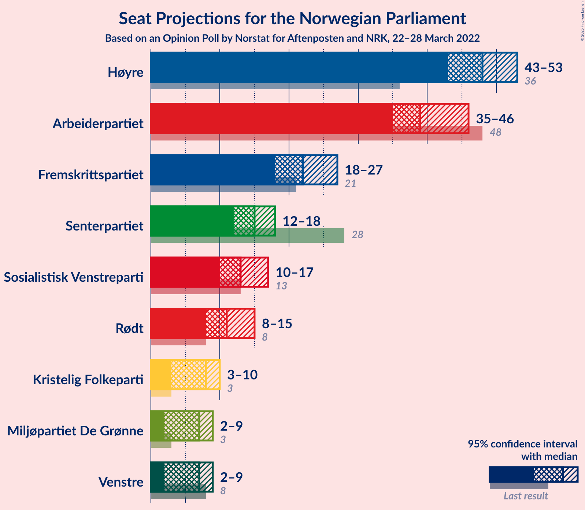

# Opinion Poll by Norstat for Aftenposten and NRK, 22–28 March 2022

<a href="#voting-intentions">Voting Intentions</a> | <a href="#seats">Seats</a> | <a href="#coalitions">Coalitions</a> | <a href="#technical-information">Technical Information</a>

## Voting Intentions

### Confidence Intervals

| Party | Last Result | Poll Result | 80% Confidence Interval | 90% Confidence Interval | 95% Confidence Interval | 99% Confidence Interval |
|:-----:|:-----------:|:-----------:|:-----------------------:|:-----------------------:|:-----------------------:|:-----------------------:|
| Høyre | 20.4% | 27.3% | 25.5–29.2% |25.0–29.8% |24.6–30.2% |23.7–31.2% |
| Arbeiderpartiet | 26.2% | 21.0% | 19.3–22.7% |18.9–23.2% |18.5–23.7% |17.7–24.5% |
| Fremskrittspartiet | 11.6% | 12.5% | 11.2–14.0% |10.8–14.4% |10.5–14.8% |9.9–15.5% |
| Senterpartiet | 13.5% | 8.5% | 7.4–9.7% |7.1–10.1% |6.8–10.4% |6.4–11.1% |
| Sosialistisk Venstreparti | 7.6% | 7.8% | 6.8–9.1% |6.5–9.4% |6.3–9.7% |5.8–10.3% |
| Rødt | 4.7% | 6.9% | 5.9–8.0% |5.7–8.4% |5.4–8.7% |5.0–9.3% |
| Kristelig Folkeparti | 3.8% | 4.6% | 3.8–5.5% |3.6–5.8% |3.4–6.1% |3.1–6.6% |
| Miljøpartiet De Grønne | 3.9% | 4.2% | 3.5–5.2% |3.3–5.5% |3.1–5.7% |2.8–6.2% |
| Venstre | 4.6% | 4.1% | 3.4–5.1% |3.2–5.4% |3.0–5.6% |2.7–6.1% |

*Note:* The poll result column reflects the actual value used in the calculations. Published results may vary slightly, and in addition be rounded to fewer digits.

## Seats

### Confidence Intervals

| Party | Last Result | Median | 80% Confidence Interval | 90% Confidence Interval | 95% Confidence Interval | 99% Confidence Interval |
|:-----:|:-----------:|:------:|:-----------------------:|:-----------------------:|:-----------------------:|:-----------------------:|
| <a href="#høyre">Høyre</a> | 36 | 48 | 45–51 |44–52 |43–53 |42–55 |
| <a href="#arbeiderpartiet">Arbeiderpartiet</a> | 48 | 39 | 36–45 |35–45 |35–46 |33–47 |
| <a href="#fremskrittspartiet">Fremskrittspartiet</a> | 21 | 22 | 19–25 |18–26 |18–27 |17–28 |
| <a href="#senterpartiet">Senterpartiet</a> | 28 | 15 | 13–17 |12–18 |12–18 |11–19 |
| <a href="#sosialistisk-venstreparti">Sosialistisk Venstreparti</a> | 13 | 13 | 11–16 |10–17 |10–17 |9–18 |
| <a href="#rødt">Rødt</a> | 8 | 11 | 10–13 |9–14 |8–15 |8–16 |
| <a href="#kristelig-folkeparti">Kristelig Folkeparti</a> | 3 | 8 | 3–9 |3–10 |3–10 |2–11 |
| <a href="#miljøpartiet-de-grønne">Miljøpartiet De Grønne</a> | 3 | 7 | 2–8 |2–9 |2–9 |1–10 |
| <a href="#venstre">Venstre</a> | 8 | 7 | 2–8 |2–9 |2–9 |2–10 |

### Høyre

*For a full overview of the results for this party, see the [Høyre](party-høyre.html) page.*

| Number of Seats | Probability | Accumulated | Special Marks |
|:---------------:|:-----------:|:-----------:|:-------------:|
| 36 | 0% | 100% | Last Result |
| 37 | 0% | 100% |  |
| 38 | 0% | 100% |  |
| 39 | 0% | 100% |  |
| 40 | 0% | 100% |  |
| 41 | 0.1% | 100% |  |
| 42 | 0.6% | 99.8% |  |
| 43 | 2% | 99.2% |  |
| 44 | 6% | 97% |  |
| 45 | 9% | 92% |  |
| 46 | 8% | 82% |  |
| 47 | 10% | 75% |  |
| 48 | 15% | 65% | Median |
| 49 | 19% | 50% |  |
| 50 | 15% | 31% |  |
| 51 | 8% | 16% |  |
| 52 | 4% | 8% |  |
| 53 | 2% | 3% |  |
| 54 | 0.7% | 1.3% |  |
| 55 | 0.3% | 0.7% |  |
| 56 | 0.1% | 0.4% |  |
| 57 | 0.2% | 0.3% |  |
| 58 | 0% | 0.1% |  |
| 59 | 0% | 0% |  |

### Arbeiderpartiet

*For a full overview of the results for this party, see the [Arbeiderpartiet](party-arbeiderpartiet.html) page.*

| Number of Seats | Probability | Accumulated | Special Marks |
|:---------------:|:-----------:|:-----------:|:-------------:|
| 32 | 0.1% | 100% |  |
| 33 | 0.6% | 99.9% |  |
| 34 | 1.3% | 99.3% |  |
| 35 | 3% | 98% |  |
| 36 | 10% | 95% |  |
| 37 | 18% | 85% |  |
| 38 | 14% | 67% |  |
| 39 | 7% | 53% | Median |
| 40 | 4% | 46% |  |
| 41 | 7% | 42% |  |
| 42 | 15% | 35% |  |
| 43 | 6% | 20% |  |
| 44 | 4% | 14% |  |
| 45 | 8% | 10% |  |
| 46 | 1.4% | 3% |  |
| 47 | 1.0% | 1.2% |  |
| 48 | 0.1% | 0.2% | Last Result |
| 49 | 0.1% | 0.1% |  |
| 50 | 0% | 0% |  |

### Fremskrittspartiet

*For a full overview of the results for this party, see the [Fremskrittspartiet](party-fremskrittspartiet.html) page.*

| Number of Seats | Probability | Accumulated | Special Marks |
|:---------------:|:-----------:|:-----------:|:-------------:|
| 16 | 0.1% | 100% |  |
| 17 | 1.3% | 99.9% |  |
| 18 | 5% | 98.6% |  |
| 19 | 7% | 93% |  |
| 20 | 17% | 87% |  |
| 21 | 18% | 70% | Last Result |
| 22 | 15% | 51% | Median |
| 23 | 20% | 36% |  |
| 24 | 3% | 16% |  |
| 25 | 5% | 14% |  |
| 26 | 3% | 8% |  |
| 27 | 4% | 5% |  |
| 28 | 0.4% | 0.6% |  |
| 29 | 0.2% | 0.3% |  |
| 30 | 0% | 0% |  |

### Senterpartiet

*For a full overview of the results for this party, see the [Senterpartiet](party-senterpartiet.html) page.*

| Number of Seats | Probability | Accumulated | Special Marks |
|:---------------:|:-----------:|:-----------:|:-------------:|
| 9 | 0.1% | 100% |  |
| 10 | 0.2% | 99.9% |  |
| 11 | 0.7% | 99.7% |  |
| 12 | 6% | 99.0% |  |
| 13 | 13% | 93% |  |
| 14 | 15% | 80% |  |
| 15 | 26% | 65% | Median |
| 16 | 19% | 39% |  |
| 17 | 14% | 20% |  |
| 18 | 5% | 6% |  |
| 19 | 0.6% | 0.8% |  |
| 20 | 0.2% | 0.3% |  |
| 21 | 0% | 0.1% |  |
| 22 | 0% | 0% |  |
| 23 | 0% | 0% |  |
| 24 | 0% | 0% |  |
| 25 | 0% | 0% |  |
| 26 | 0% | 0% |  |
| 27 | 0% | 0% |  |
| 28 | 0% | 0% | Last Result |

### Sosialistisk Venstreparti

*For a full overview of the results for this party, see the [Sosialistisk Venstreparti](party-sosialistiskvenstreparti.html) page.*

| Number of Seats | Probability | Accumulated | Special Marks |
|:---------------:|:-----------:|:-----------:|:-------------:|
| 8 | 0.4% | 100% |  |
| 9 | 1.4% | 99.6% |  |
| 10 | 6% | 98% |  |
| 11 | 11% | 92% |  |
| 12 | 15% | 81% |  |
| 13 | 22% | 67% | Last Result, Median |
| 14 | 20% | 45% |  |
| 15 | 13% | 25% |  |
| 16 | 5% | 12% |  |
| 17 | 6% | 7% |  |
| 18 | 0.9% | 1.1% |  |
| 19 | 0.2% | 0.2% |  |
| 20 | 0% | 0% |  |

### Rødt

*For a full overview of the results for this party, see the [Rødt](party-rødt.html) page.*

| Number of Seats | Probability | Accumulated | Special Marks |
|:---------------:|:-----------:|:-----------:|:-------------:|
| 7 | 0.2% | 100% |  |
| 8 | 2% | 99.8% | Last Result |
| 9 | 4% | 97% |  |
| 10 | 22% | 94% |  |
| 11 | 26% | 72% | Median |
| 12 | 20% | 46% |  |
| 13 | 16% | 26% |  |
| 14 | 5% | 10% |  |
| 15 | 3% | 4% |  |
| 16 | 1.1% | 1.2% |  |
| 17 | 0.1% | 0.1% |  |
| 18 | 0% | 0% |  |

### Kristelig Folkeparti

*For a full overview of the results for this party, see the [Kristelig Folkeparti](party-kristeligfolkeparti.html) page.*

| Number of Seats | Probability | Accumulated | Special Marks |
|:---------------:|:-----------:|:-----------:|:-------------:|
| 2 | 2% | 100% |  |
| 3 | 19% | 98% | Last Result |
| 4 | 0% | 78% |  |
| 5 | 0% | 78% |  |
| 6 | 3% | 78% |  |
| 7 | 23% | 75% |  |
| 8 | 30% | 53% | Median |
| 9 | 16% | 23% |  |
| 10 | 5% | 7% |  |
| 11 | 1.2% | 1.4% |  |
| 12 | 0.1% | 0.2% |  |
| 13 | 0% | 0% |  |

### Miljøpartiet De Grønne

*For a full overview of the results for this party, see the [Miljøpartiet De Grønne](party-miljøpartietdegrønne.html) page.*

| Number of Seats | Probability | Accumulated | Special Marks |
|:---------------:|:-----------:|:-----------:|:-------------:|
| 1 | 0.9% | 100% |  |
| 2 | 12% | 99.1% |  |
| 3 | 27% | 87% | Last Result |
| 4 | 0% | 60% |  |
| 5 | 0.1% | 60% |  |
| 6 | 5% | 60% |  |
| 7 | 20% | 55% | Median |
| 8 | 26% | 35% |  |
| 9 | 7% | 9% |  |
| 10 | 1.5% | 2% |  |
| 11 | 0.3% | 0.4% |  |
| 12 | 0% | 0% |  |

### Venstre

*For a full overview of the results for this party, see the [Venstre](party-venstre.html) page.*

| Number of Seats | Probability | Accumulated | Special Marks |
|:---------------:|:-----------:|:-----------:|:-------------:|
| 2 | 16% | 100% |  |
| 3 | 29% | 84% |  |
| 4 | 0% | 55% |  |
| 5 | 0.4% | 55% |  |
| 6 | 4% | 55% |  |
| 7 | 21% | 50% | Median |
| 8 | 21% | 29% | Last Result |
| 9 | 6% | 8% |  |
| 10 | 1.4% | 2% |  |
| 11 | 0.3% | 0.3% |  |
| 12 | 0% | 0% |  |

## Coalitions

### Confidence Intervals

| Coalition | Last Result | Median | Majority? | 80% Confidence Interval | 90% Confidence Interval | 95% Confidence Interval | 99% Confidence Interval |
|:---------:|:-----------:|:------:|:---------:|:-----------------------:|:-----------------------:|:-----------------------:|:-----------------------:|
| Høyre – Fremskrittspartiet – Senterpartiet – Kristelig Folkeparti – Venstre | 96 | 98 | 100% | 93–102 | 91–103 | 90–104 | 87–106 |
| Høyre – Fremskrittspartiet – Kristelig Folkeparti – Miljøpartiet De Grønne – Venstre | 71 | 88 | 86% | 84–92 | 82–93 | 81–94 | 79–97 |
| Arbeiderpartiet – Senterpartiet – Sosialistisk Venstreparti – Rødt – Miljøpartiet De Grønne | 100 | 85 | 55% | 81–89 | 80–92 | 78–93 | 76–95 |
| Høyre – Fremskrittspartiet – Kristelig Folkeparti – Venstre | 68 | 83 | 25% | 78–86 | 76–87 | 75–89 | 72–91 |
| Arbeiderpartiet – Senterpartiet – Sosialistisk Venstreparti – Kristelig Folkeparti – Miljøpartiet De Grønne | 95 | 80 | 18% | 76–86 | 75–87 | 74–87 | 72–89 |
| Arbeiderpartiet – Senterpartiet – Sosialistisk Venstreparti – Rødt | 97 | 80 | 7% | 75–84 | 74–85 | 72–86 | 70–88 |
| Høyre – Fremskrittspartiet – Venstre | 65 | 75 | 0.3% | 71–80 | 69–81 | 68–81 | 66–84 |
| Arbeiderpartiet – Senterpartiet – Sosialistisk Venstreparti – Miljøpartiet De Grønne | 92 | 73 | 0% | 69–78 | 68–79 | 67–80 | 65–83 |
| Arbeiderpartiet – Sosialistisk Venstreparti – Rødt – Miljøpartiet De Grønne | 72 | 70 | 0% | 66–75 | 64–76 | 64–77 | 61–80 |
| Høyre – Fremskrittspartiet | 57 | 70 | 0% | 66–74 | 64–76 | 63–77 | 62–78 |
| Arbeiderpartiet – Senterpartiet – Kristelig Folkeparti – Miljøpartiet De Grønne | 82 | 68 | 0% | 62–73 | 61–74 | 60–75 | 58–77 |
| Arbeiderpartiet – Senterpartiet – Sosialistisk Venstreparti | 89 | 68 | 0% | 64–72 | 63–73 | 62–74 | 60–75 |
| Arbeiderpartiet – Senterpartiet – Kristelig Folkeparti | 79 | 62 | 0% | 56–66 | 54–68 | 54–68 | 53–70 |
| Høyre – Kristelig Folkeparti – Venstre | 47 | 61 | 0% | 57–64 | 54–65 | 53–66 | 51–69 |
| Arbeiderpartiet – Senterpartiet | 76 | 54 | 0% | 51–59 | 50–60 | 49–61 | 48–62 |
| Arbeiderpartiet – Sosialistisk Venstreparti | 61 | 53 | 0% | 49–57 | 48–58 | 47–59 | 46–60 |
| Senterpartiet – Kristelig Folkeparti – Venstre | 39 | 27 | 0% | 23–31 | 21–33 | 20–34 | 18–35 |

### Høyre – Fremskrittspartiet – Senterpartiet – Kristelig Folkeparti – Venstre

| Number of Seats | Probability | Accumulated | Special Marks |
|:---------------:|:-----------:|:-----------:|:-------------:|
| 85 | 0.1% | 100% | Majority |
| 86 | 0.3% | 99.9% |  |
| 87 | 0.4% | 99.5% |  |
| 88 | 0.5% | 99.2% |  |
| 89 | 0.5% | 98.7% |  |
| 90 | 2% | 98% |  |
| 91 | 3% | 97% |  |
| 92 | 3% | 94% |  |
| 93 | 7% | 91% |  |
| 94 | 4% | 84% |  |
| 95 | 9% | 80% |  |
| 96 | 7% | 71% | Last Result |
| 97 | 9% | 64% |  |
| 98 | 17% | 55% |  |
| 99 | 15% | 38% |  |
| 100 | 6% | 23% | Median |
| 101 | 4% | 17% |  |
| 102 | 7% | 13% |  |
| 103 | 3% | 6% |  |
| 104 | 2% | 3% |  |
| 105 | 0.6% | 1.2% |  |
| 106 | 0.3% | 0.6% |  |
| 107 | 0.2% | 0.3% |  |
| 108 | 0.1% | 0.1% |  |
| 109 | 0% | 0% |  |

### Høyre – Fremskrittspartiet – Kristelig Folkeparti – Miljøpartiet De Grønne – Venstre

| Number of Seats | Probability | Accumulated | Special Marks |
|:---------------:|:-----------:|:-----------:|:-------------:|
| 71 | 0% | 100% | Last Result |
| 72 | 0% | 100% |  |
| 73 | 0% | 100% |  |
| 74 | 0% | 100% |  |
| 75 | 0% | 100% |  |
| 76 | 0.1% | 100% |  |
| 77 | 0.1% | 99.9% |  |
| 78 | 0.2% | 99.8% |  |
| 79 | 0.6% | 99.6% |  |
| 80 | 0.8% | 99.0% |  |
| 81 | 1.4% | 98% |  |
| 82 | 3% | 97% |  |
| 83 | 3% | 94% |  |
| 84 | 5% | 91% |  |
| 85 | 6% | 86% | Majority |
| 86 | 15% | 80% |  |
| 87 | 13% | 64% |  |
| 88 | 9% | 51% |  |
| 89 | 6% | 42% |  |
| 90 | 10% | 36% |  |
| 91 | 6% | 25% |  |
| 92 | 11% | 20% | Median |
| 93 | 4% | 9% |  |
| 94 | 2% | 4% |  |
| 95 | 0.7% | 2% |  |
| 96 | 0.8% | 2% |  |
| 97 | 0.6% | 0.8% |  |
| 98 | 0.1% | 0.2% |  |
| 99 | 0% | 0.1% |  |
| 100 | 0% | 0% |  |

### Arbeiderpartiet – Senterpartiet – Sosialistisk Venstreparti – Rødt – Miljøpartiet De Grønne

| Number of Seats | Probability | Accumulated | Special Marks |
|:---------------:|:-----------:|:-----------:|:-------------:|
| 73 | 0% | 100% |  |
| 74 | 0.1% | 99.9% |  |
| 75 | 0.1% | 99.8% |  |
| 76 | 0.6% | 99.8% |  |
| 77 | 0.7% | 99.1% |  |
| 78 | 1.0% | 98% |  |
| 79 | 2% | 97% |  |
| 80 | 3% | 95% |  |
| 81 | 5% | 92% |  |
| 82 | 8% | 87% |  |
| 83 | 10% | 80% |  |
| 84 | 14% | 70% |  |
| 85 | 15% | 55% | Median, Majority |
| 86 | 7% | 40% |  |
| 87 | 7% | 33% |  |
| 88 | 9% | 25% |  |
| 89 | 6% | 16% |  |
| 90 | 3% | 10% |  |
| 91 | 2% | 7% |  |
| 92 | 2% | 5% |  |
| 93 | 1.2% | 3% |  |
| 94 | 1.2% | 2% |  |
| 95 | 0.3% | 0.6% |  |
| 96 | 0.3% | 0.3% |  |
| 97 | 0% | 0.1% |  |
| 98 | 0% | 0% |  |
| 99 | 0% | 0% |  |
| 100 | 0% | 0% | Last Result |

### Høyre – Fremskrittspartiet – Kristelig Folkeparti – Venstre

| Number of Seats | Probability | Accumulated | Special Marks |
|:---------------:|:-----------:|:-----------:|:-------------:|
| 68 | 0% | 100% | Last Result |
| 69 | 0% | 100% |  |
| 70 | 0.2% | 99.9% |  |
| 71 | 0.1% | 99.7% |  |
| 72 | 0.3% | 99.6% |  |
| 73 | 0.4% | 99.3% |  |
| 74 | 1.4% | 98.9% |  |
| 75 | 1.4% | 98% |  |
| 76 | 2% | 96% |  |
| 77 | 3% | 94% |  |
| 78 | 4% | 91% |  |
| 79 | 7% | 87% |  |
| 80 | 10% | 80% |  |
| 81 | 7% | 71% |  |
| 82 | 8% | 63% |  |
| 83 | 16% | 55% |  |
| 84 | 14% | 39% |  |
| 85 | 9% | 25% | Median, Majority |
| 86 | 7% | 16% |  |
| 87 | 5% | 9% |  |
| 88 | 2% | 4% |  |
| 89 | 1.4% | 3% |  |
| 90 | 0.5% | 1.2% |  |
| 91 | 0.4% | 0.6% |  |
| 92 | 0.1% | 0.3% |  |
| 93 | 0.1% | 0.1% |  |
| 94 | 0.1% | 0.1% |  |
| 95 | 0% | 0% |  |

### Arbeiderpartiet – Senterpartiet – Sosialistisk Venstreparti – Kristelig Folkeparti – Miljøpartiet De Grønne

| Number of Seats | Probability | Accumulated | Special Marks |
|:---------------:|:-----------:|:-----------:|:-------------:|
| 68 | 0% | 100% |  |
| 69 | 0.2% | 99.9% |  |
| 70 | 0.1% | 99.7% |  |
| 71 | 0.1% | 99.6% |  |
| 72 | 0.5% | 99.5% |  |
| 73 | 1.2% | 99.0% |  |
| 74 | 0.9% | 98% |  |
| 75 | 3% | 97% |  |
| 76 | 11% | 94% |  |
| 77 | 7% | 83% |  |
| 78 | 6% | 76% |  |
| 79 | 10% | 70% |  |
| 80 | 10% | 60% |  |
| 81 | 8% | 50% |  |
| 82 | 14% | 42% | Median |
| 83 | 5% | 28% |  |
| 84 | 6% | 23% |  |
| 85 | 6% | 18% | Majority |
| 86 | 6% | 12% |  |
| 87 | 3% | 6% |  |
| 88 | 1.4% | 2% |  |
| 89 | 0.5% | 0.9% |  |
| 90 | 0.2% | 0.4% |  |
| 91 | 0.2% | 0.2% |  |
| 92 | 0% | 0.1% |  |
| 93 | 0% | 0% |  |
| 94 | 0% | 0% |  |
| 95 | 0% | 0% | Last Result |

### Arbeiderpartiet – Senterpartiet – Sosialistisk Venstreparti – Rødt

| Number of Seats | Probability | Accumulated | Special Marks |
|:---------------:|:-----------:|:-----------:|:-------------:|
| 68 | 0.1% | 100% |  |
| 69 | 0.1% | 99.9% |  |
| 70 | 0.5% | 99.8% |  |
| 71 | 0.8% | 99.3% |  |
| 72 | 1.2% | 98.5% |  |
| 73 | 1.5% | 97% |  |
| 74 | 2% | 96% |  |
| 75 | 5% | 93% |  |
| 76 | 12% | 89% |  |
| 77 | 7% | 77% |  |
| 78 | 10% | 70% | Median |
| 79 | 7% | 60% |  |
| 80 | 9% | 53% |  |
| 81 | 14% | 44% |  |
| 82 | 15% | 30% |  |
| 83 | 4% | 15% |  |
| 84 | 4% | 11% |  |
| 85 | 2% | 7% | Majority |
| 86 | 3% | 5% |  |
| 87 | 1.0% | 2% |  |
| 88 | 0.4% | 0.9% |  |
| 89 | 0.2% | 0.4% |  |
| 90 | 0.2% | 0.2% |  |
| 91 | 0% | 0.1% |  |
| 92 | 0% | 0% |  |
| 93 | 0% | 0% |  |
| 94 | 0% | 0% |  |
| 95 | 0% | 0% |  |
| 96 | 0% | 0% |  |
| 97 | 0% | 0% | Last Result |

### Høyre – Fremskrittspartiet – Venstre

| Number of Seats | Probability | Accumulated | Special Marks |
|:---------------:|:-----------:|:-----------:|:-------------:|
| 64 | 0.1% | 100% |  |
| 65 | 0.1% | 99.9% | Last Result |
| 66 | 0.7% | 99.9% |  |
| 67 | 0.5% | 99.2% |  |
| 68 | 2% | 98.7% |  |
| 69 | 2% | 97% |  |
| 70 | 3% | 95% |  |
| 71 | 5% | 92% |  |
| 72 | 10% | 87% |  |
| 73 | 7% | 77% |  |
| 74 | 7% | 70% |  |
| 75 | 14% | 63% |  |
| 76 | 13% | 49% |  |
| 77 | 8% | 36% | Median |
| 78 | 8% | 28% |  |
| 79 | 7% | 20% |  |
| 80 | 3% | 13% |  |
| 81 | 7% | 9% |  |
| 82 | 1.1% | 2% |  |
| 83 | 0.4% | 1.0% |  |
| 84 | 0.3% | 0.6% |  |
| 85 | 0.2% | 0.3% | Majority |
| 86 | 0.1% | 0.1% |  |
| 87 | 0% | 0.1% |  |
| 88 | 0% | 0% |  |

### Arbeiderpartiet – Senterpartiet – Sosialistisk Venstreparti – Miljøpartiet De Grønne

| Number of Seats | Probability | Accumulated | Special Marks |
|:---------------:|:-----------:|:-----------:|:-------------:|
| 62 | 0% | 100% |  |
| 63 | 0.1% | 99.9% |  |
| 64 | 0.2% | 99.9% |  |
| 65 | 0.4% | 99.7% |  |
| 66 | 1.2% | 99.3% |  |
| 67 | 0.9% | 98% |  |
| 68 | 4% | 97% |  |
| 69 | 4% | 93% |  |
| 70 | 6% | 89% |  |
| 71 | 7% | 83% |  |
| 72 | 14% | 76% |  |
| 73 | 13% | 63% |  |
| 74 | 13% | 50% | Median |
| 75 | 9% | 37% |  |
| 76 | 8% | 28% |  |
| 77 | 5% | 20% |  |
| 78 | 5% | 14% |  |
| 79 | 4% | 9% |  |
| 80 | 3% | 5% |  |
| 81 | 1.0% | 2% |  |
| 82 | 0.7% | 1.3% |  |
| 83 | 0.4% | 0.5% |  |
| 84 | 0.1% | 0.2% |  |
| 85 | 0% | 0% | Majority |
| 86 | 0% | 0% |  |
| 87 | 0% | 0% |  |
| 88 | 0% | 0% |  |
| 89 | 0% | 0% |  |
| 90 | 0% | 0% |  |
| 91 | 0% | 0% |  |
| 92 | 0% | 0% | Last Result |

### Arbeiderpartiet – Sosialistisk Venstreparti – Rødt – Miljøpartiet De Grønne

| Number of Seats | Probability | Accumulated | Special Marks |
|:---------------:|:-----------:|:-----------:|:-------------:|
| 58 | 0% | 100% |  |
| 59 | 0% | 99.9% |  |
| 60 | 0.1% | 99.9% |  |
| 61 | 0.4% | 99.8% |  |
| 62 | 0.7% | 99.4% |  |
| 63 | 1.0% | 98.7% |  |
| 64 | 3% | 98% |  |
| 65 | 4% | 94% |  |
| 66 | 7% | 91% |  |
| 67 | 5% | 83% |  |
| 68 | 7% | 79% |  |
| 69 | 15% | 72% |  |
| 70 | 16% | 57% | Median |
| 71 | 9% | 40% |  |
| 72 | 7% | 31% | Last Result |
| 73 | 8% | 25% |  |
| 74 | 3% | 16% |  |
| 75 | 6% | 13% |  |
| 76 | 2% | 7% |  |
| 77 | 3% | 5% |  |
| 78 | 1.0% | 2% |  |
| 79 | 0.4% | 1.1% |  |
| 80 | 0.4% | 0.7% |  |
| 81 | 0.3% | 0.4% |  |
| 82 | 0% | 0.1% |  |
| 83 | 0.1% | 0.1% |  |
| 84 | 0% | 0% |  |

### Høyre – Fremskrittspartiet

| Number of Seats | Probability | Accumulated | Special Marks |
|:---------------:|:-----------:|:-----------:|:-------------:|
| 57 | 0% | 100% | Last Result |
| 58 | 0% | 100% |  |
| 59 | 0% | 100% |  |
| 60 | 0% | 100% |  |
| 61 | 0.2% | 99.9% |  |
| 62 | 0.9% | 99.7% |  |
| 63 | 1.5% | 98.8% |  |
| 64 | 3% | 97% |  |
| 65 | 4% | 95% |  |
| 66 | 7% | 90% |  |
| 67 | 6% | 83% |  |
| 68 | 11% | 77% |  |
| 69 | 10% | 66% |  |
| 70 | 15% | 57% | Median |
| 71 | 6% | 42% |  |
| 72 | 11% | 36% |  |
| 73 | 12% | 25% |  |
| 74 | 4% | 13% |  |
| 75 | 1.2% | 9% |  |
| 76 | 5% | 8% |  |
| 77 | 1.1% | 3% |  |
| 78 | 1.3% | 2% |  |
| 79 | 0.2% | 0.3% |  |
| 80 | 0.1% | 0.1% |  |
| 81 | 0% | 0% |  |

### Arbeiderpartiet – Senterpartiet – Kristelig Folkeparti – Miljøpartiet De Grønne

| Number of Seats | Probability | Accumulated | Special Marks |
|:---------------:|:-----------:|:-----------:|:-------------:|
| 55 | 0% | 100% |  |
| 56 | 0.2% | 99.9% |  |
| 57 | 0.2% | 99.8% |  |
| 58 | 0.3% | 99.5% |  |
| 59 | 0.9% | 99.2% |  |
| 60 | 2% | 98% |  |
| 61 | 2% | 96% |  |
| 62 | 8% | 94% |  |
| 63 | 9% | 86% |  |
| 64 | 6% | 77% |  |
| 65 | 6% | 70% |  |
| 66 | 7% | 65% |  |
| 67 | 6% | 58% |  |
| 68 | 10% | 52% |  |
| 69 | 13% | 42% | Median |
| 70 | 9% | 29% |  |
| 71 | 4% | 20% |  |
| 72 | 3% | 16% |  |
| 73 | 4% | 13% |  |
| 74 | 5% | 9% |  |
| 75 | 2% | 4% |  |
| 76 | 1.1% | 2% |  |
| 77 | 0.3% | 0.5% |  |
| 78 | 0.2% | 0.2% |  |
| 79 | 0% | 0.1% |  |
| 80 | 0% | 0% |  |
| 81 | 0% | 0% |  |
| 82 | 0% | 0% | Last Result |

### Arbeiderpartiet – Senterpartiet – Sosialistisk Venstreparti

| Number of Seats | Probability | Accumulated | Special Marks |
|:---------------:|:-----------:|:-----------:|:-------------:|
| 58 | 0.1% | 100% |  |
| 59 | 0.2% | 99.9% |  |
| 60 | 0.3% | 99.8% |  |
| 61 | 0.9% | 99.5% |  |
| 62 | 2% | 98.5% |  |
| 63 | 4% | 97% |  |
| 64 | 5% | 93% |  |
| 65 | 15% | 88% |  |
| 66 | 11% | 73% |  |
| 67 | 6% | 62% | Median |
| 68 | 9% | 57% |  |
| 69 | 16% | 48% |  |
| 70 | 6% | 33% |  |
| 71 | 14% | 26% |  |
| 72 | 6% | 12% |  |
| 73 | 3% | 6% |  |
| 74 | 2% | 3% |  |
| 75 | 0.6% | 1.0% |  |
| 76 | 0.1% | 0.4% |  |
| 77 | 0.1% | 0.2% |  |
| 78 | 0.1% | 0.1% |  |
| 79 | 0% | 0% |  |
| 80 | 0% | 0% |  |
| 81 | 0% | 0% |  |
| 82 | 0% | 0% |  |
| 83 | 0% | 0% |  |
| 84 | 0% | 0% |  |
| 85 | 0% | 0% | Majority |
| 86 | 0% | 0% |  |
| 87 | 0% | 0% |  |
| 88 | 0% | 0% |  |
| 89 | 0% | 0% | Last Result |

### Arbeiderpartiet – Senterpartiet – Kristelig Folkeparti

| Number of Seats | Probability | Accumulated | Special Marks |
|:---------------:|:-----------:|:-----------:|:-------------:|
| 51 | 0.1% | 100% |  |
| 52 | 0.3% | 99.9% |  |
| 53 | 0.6% | 99.6% |  |
| 54 | 6% | 99.0% |  |
| 55 | 2% | 93% |  |
| 56 | 4% | 91% |  |
| 57 | 4% | 87% |  |
| 58 | 5% | 83% |  |
| 59 | 7% | 78% |  |
| 60 | 9% | 71% |  |
| 61 | 11% | 63% |  |
| 62 | 11% | 52% | Median |
| 63 | 7% | 41% |  |
| 64 | 6% | 34% |  |
| 65 | 5% | 28% |  |
| 66 | 13% | 23% |  |
| 67 | 4% | 10% |  |
| 68 | 4% | 6% |  |
| 69 | 1.4% | 2% |  |
| 70 | 0.3% | 0.8% |  |
| 71 | 0.3% | 0.4% |  |
| 72 | 0% | 0.1% |  |
| 73 | 0.1% | 0.1% |  |
| 74 | 0% | 0% |  |
| 75 | 0% | 0% |  |
| 76 | 0% | 0% |  |
| 77 | 0% | 0% |  |
| 78 | 0% | 0% |  |
| 79 | 0% | 0% | Last Result |

### Høyre – Kristelig Folkeparti – Venstre

| Number of Seats | Probability | Accumulated | Special Marks |
|:---------------:|:-----------:|:-----------:|:-------------:|
| 47 | 0% | 100% | Last Result |
| 48 | 0% | 100% |  |
| 49 | 0% | 100% |  |
| 50 | 0.4% | 100% |  |
| 51 | 0.7% | 99.5% |  |
| 52 | 0.6% | 98.8% |  |
| 53 | 0.8% | 98% |  |
| 54 | 3% | 97% |  |
| 55 | 2% | 95% |  |
| 56 | 3% | 93% |  |
| 57 | 5% | 90% |  |
| 58 | 6% | 85% |  |
| 59 | 11% | 79% |  |
| 60 | 17% | 68% |  |
| 61 | 18% | 50% |  |
| 62 | 8% | 33% |  |
| 63 | 5% | 25% | Median |
| 64 | 10% | 20% |  |
| 65 | 5% | 10% |  |
| 66 | 3% | 5% |  |
| 67 | 0.6% | 2% |  |
| 68 | 0.4% | 1.0% |  |
| 69 | 0.2% | 0.6% |  |
| 70 | 0.1% | 0.4% |  |
| 71 | 0.1% | 0.3% |  |
| 72 | 0.1% | 0.2% |  |
| 73 | 0% | 0% |  |

### Arbeiderpartiet – Senterpartiet

| Number of Seats | Probability | Accumulated | Special Marks |
|:---------------:|:-----------:|:-----------:|:-------------:|
| 47 | 0.3% | 100% |  |
| 48 | 0.9% | 99.7% |  |
| 49 | 3% | 98.8% |  |
| 50 | 3% | 96% |  |
| 51 | 12% | 93% |  |
| 52 | 12% | 81% |  |
| 53 | 10% | 69% |  |
| 54 | 10% | 59% | Median |
| 55 | 9% | 49% |  |
| 56 | 4% | 40% |  |
| 57 | 9% | 35% |  |
| 58 | 13% | 27% |  |
| 59 | 7% | 14% |  |
| 60 | 4% | 7% |  |
| 61 | 2% | 3% |  |
| 62 | 0.4% | 0.7% |  |
| 63 | 0.2% | 0.3% |  |
| 64 | 0.1% | 0.2% |  |
| 65 | 0% | 0.1% |  |
| 66 | 0% | 0% |  |
| 67 | 0% | 0% |  |
| 68 | 0% | 0% |  |
| 69 | 0% | 0% |  |
| 70 | 0% | 0% |  |
| 71 | 0% | 0% |  |
| 72 | 0% | 0% |  |
| 73 | 0% | 0% |  |
| 74 | 0% | 0% |  |
| 75 | 0% | 0% |  |
| 76 | 0% | 0% | Last Result |

### Arbeiderpartiet – Sosialistisk Venstreparti

| Number of Seats | Probability | Accumulated | Special Marks |
|:---------------:|:-----------:|:-----------:|:-------------:|
| 43 | 0% | 100% |  |
| 44 | 0.1% | 99.9% |  |
| 45 | 0.2% | 99.9% |  |
| 46 | 0.5% | 99.7% |  |
| 47 | 2% | 99.2% |  |
| 48 | 5% | 97% |  |
| 49 | 5% | 92% |  |
| 50 | 10% | 88% |  |
| 51 | 14% | 78% |  |
| 52 | 10% | 64% | Median |
| 53 | 10% | 54% |  |
| 54 | 9% | 44% |  |
| 55 | 10% | 34% |  |
| 56 | 10% | 24% |  |
| 57 | 7% | 13% |  |
| 58 | 4% | 6% |  |
| 59 | 1.5% | 3% |  |
| 60 | 0.6% | 1.0% |  |
| 61 | 0.4% | 0.5% | Last Result |
| 62 | 0% | 0.1% |  |
| 63 | 0.1% | 0.1% |  |
| 64 | 0% | 0% |  |

### Senterpartiet – Kristelig Folkeparti – Venstre

| Number of Seats | Probability | Accumulated | Special Marks |
|:---------------:|:-----------:|:-----------:|:-------------:|
| 17 | 0.1% | 100% |  |
| 18 | 0.7% | 99.9% |  |
| 19 | 1.3% | 99.1% |  |
| 20 | 0.8% | 98% |  |
| 21 | 3% | 97% |  |
| 22 | 4% | 94% |  |
| 23 | 2% | 90% |  |
| 24 | 5% | 88% |  |
| 25 | 12% | 83% |  |
| 26 | 8% | 71% |  |
| 27 | 17% | 63% |  |
| 28 | 11% | 46% |  |
| 29 | 8% | 35% |  |
| 30 | 8% | 27% | Median |
| 31 | 10% | 19% |  |
| 32 | 3% | 9% |  |
| 33 | 3% | 6% |  |
| 34 | 2% | 3% |  |
| 35 | 1.2% | 2% |  |
| 36 | 0.2% | 0.3% |  |
| 37 | 0% | 0.1% |  |
| 38 | 0% | 0% |  |
| 39 | 0% | 0% | Last Result |

## Technical Information

### Opinion Poll

+ **Polling firm:** Norstat
+ **Commissioner(s):** Aftenposten and NRK
+ **Fieldwork period:** 22–28 March 2022

### Calculations

+ **Sample size:** 945
+ **Simulations done:** 1,048,576
+ **Error estimate:** 1.45%

