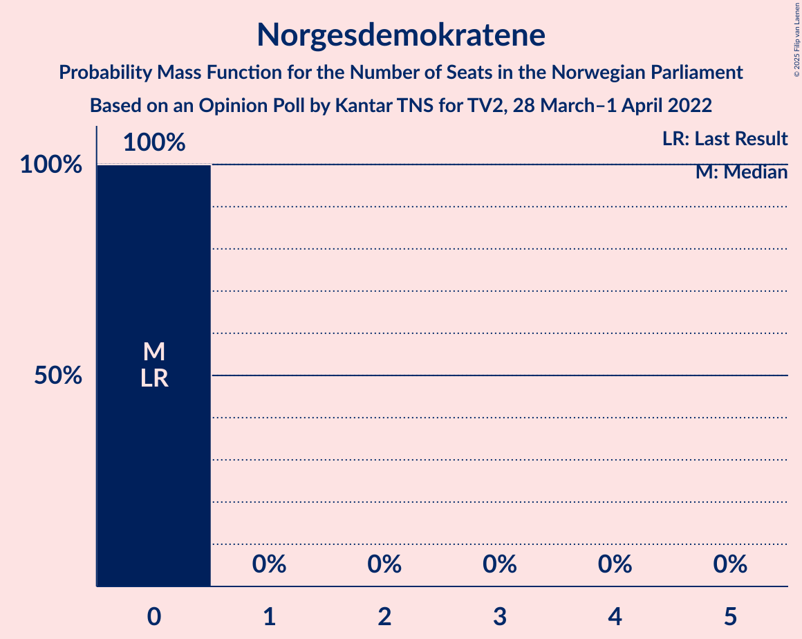

# Opinion Poll by Kantar TNS for TV2, 28 March–1 April 2022

<a href="#voting-intentions">Voting Intentions</a> | <a href="#seats">Seats</a> | <a href="#coalitions">Coalitions</a> | <a href="#technical-information">Technical Information</a>

## Voting Intentions

### Confidence Intervals

| Party | Last Result | Poll Result | 80% Confidence Interval | 90% Confidence Interval | 95% Confidence Interval | 99% Confidence Interval |
|:-----:|:-----------:|:-----------:|:-----------------------:|:-----------------------:|:-----------------------:|:-----------------------:|
| Høyre | 20.4% | 27.7% | 25.9–29.6% |25.4–30.1% |25.0–30.6% |24.2–31.5% |
| Arbeiderpartiet | 26.2% | 23.2% | 21.6–25.0% |21.1–25.5% |20.7–26.0% |19.9–26.8% |
| Fremskrittspartiet | 11.6% | 13.8% | 12.5–15.4% |12.1–15.8% |11.8–16.2% |11.2–16.9% |
| Sosialistisk Venstreparti | 7.6% | 8.2% | 7.2–9.5% |6.9–9.8% |6.7–10.2% |6.2–10.8% |
| Senterpartiet | 13.5% | 6.6% | 5.7–7.8% |5.4–8.1% |5.2–8.4% |4.8–8.9% |
| Rødt | 4.7% | 5.0% | 4.2–6.0% |4.0–6.3% |3.8–6.5% |3.4–7.1% |
| Venstre | 4.6% | 4.3% | 3.6–5.2% |3.4–5.5% |3.2–5.7% |2.9–6.2% |
| Miljøpartiet De Grønne | 3.9% | 3.4% | 2.7–4.2% |2.5–4.5% |2.4–4.7% |2.1–5.1% |
| Kristelig Folkeparti | 3.8% | 3.3% | 2.6–4.1% |2.5–4.4% |2.3–4.6% |2.0–5.0% |
| Norgesdemokratene | 1.1% | 1.8% | 1.4–2.5% |1.3–2.7% |1.2–2.9% |1.0–3.2% |

*Note:* The poll result column reflects the actual value used in the calculations. Published results may vary slightly, and in addition be rounded to fewer digits.

## Seats

### Confidence Intervals

| Party | Last Result | Median | 80% Confidence Interval | 90% Confidence Interval | 95% Confidence Interval | 99% Confidence Interval |
|:-----:|:-----------:|:------:|:-----------------------:|:-----------------------:|:-----------------------:|:-----------------------:|
| <a href="#høyre">Høyre</a> | 36 | 50 | 46–54 |46–55 |45–56 |43–57 |
| <a href="#arbeiderpartiet">Arbeiderpartiet</a> | 48 | 45 | 41–48 |39–49 |38–49 |37–51 |
| <a href="#fremskrittspartiet">Fremskrittspartiet</a> | 21 | 25 | 22–28 |21–29 |21–30 |20–31 |
| <a href="#sosialistisk-venstreparti">Sosialistisk Venstreparti</a> | 13 | 15 | 13–17 |12–18 |11–19 |11–20 |
| <a href="#senterpartiet">Senterpartiet</a> | 28 | 12 | 11–14 |10–14 |9–14 |8–16 |
| <a href="#rødt">Rødt</a> | 8 | 9 | 7–11 |6–11 |1–12 |1–12 |
| <a href="#venstre">Venstre</a> | 8 | 8 | 2–9 |2–10 |2–10 |2–11 |
| <a href="#miljøpartiet-de-grønne">Miljøpartiet De Grønne</a> | 3 | 2 | 1–7 |1–7 |1–8 |1–9 |
| <a href="#kristelig-folkeparti">Kristelig Folkeparti</a> | 3 | 2 | 2–7 |1–8 |1–8 |0–9 |
| <a href="#norgesdemokratene">Norgesdemokratene</a> | 0 | 0 | 0 |0 |0 |0 |

### Høyre

*For a full overview of the results for this party, see the [Høyre](party-høyre.html) page.*

| Number of Seats | Probability | Accumulated | Special Marks |
|:---------------:|:-----------:|:-----------:|:-------------:|
| 36 | 0% | 100% | Last Result |
| 37 | 0% | 100% |  |
| 38 | 0% | 100% |  |
| 39 | 0% | 100% |  |
| 40 | 0% | 100% |  |
| 41 | 0% | 100% |  |
| 42 | 0.1% | 100% |  |
| 43 | 0.5% | 99.9% |  |
| 44 | 0.6% | 99.4% |  |
| 45 | 2% | 98.7% |  |
| 46 | 11% | 97% |  |
| 47 | 8% | 86% |  |
| 48 | 9% | 78% |  |
| 49 | 12% | 69% |  |
| 50 | 23% | 57% | Median |
| 51 | 11% | 34% |  |
| 52 | 4% | 22% |  |
| 53 | 6% | 18% |  |
| 54 | 5% | 12% |  |
| 55 | 4% | 7% |  |
| 56 | 2% | 3% |  |
| 57 | 0.8% | 1.2% |  |
| 58 | 0.2% | 0.4% |  |
| 59 | 0.2% | 0.2% |  |
| 60 | 0% | 0.1% |  |
| 61 | 0% | 0% |  |

### Arbeiderpartiet

*For a full overview of the results for this party, see the [Arbeiderpartiet](party-arbeiderpartiet.html) page.*

| Number of Seats | Probability | Accumulated | Special Marks |
|:---------------:|:-----------:|:-----------:|:-------------:|
| 36 | 0.1% | 100% |  |
| 37 | 0.4% | 99.9% |  |
| 38 | 2% | 99.5% |  |
| 39 | 4% | 97% |  |
| 40 | 1.2% | 94% |  |
| 41 | 4% | 93% |  |
| 42 | 7% | 88% |  |
| 43 | 13% | 81% |  |
| 44 | 9% | 68% |  |
| 45 | 38% | 59% | Median |
| 46 | 7% | 22% |  |
| 47 | 4% | 15% |  |
| 48 | 5% | 11% | Last Result |
| 49 | 5% | 6% |  |
| 50 | 0.3% | 1.1% |  |
| 51 | 0.6% | 0.8% |  |
| 52 | 0.2% | 0.2% |  |
| 53 | 0% | 0.1% |  |
| 54 | 0% | 0% |  |

### Fremskrittspartiet

*For a full overview of the results for this party, see the [Fremskrittspartiet](party-fremskrittspartiet.html) page.*

| Number of Seats | Probability | Accumulated | Special Marks |
|:---------------:|:-----------:|:-----------:|:-------------:|
| 18 | 0.1% | 100% |  |
| 19 | 0.2% | 99.9% |  |
| 20 | 0.8% | 99.7% |  |
| 21 | 6% | 98.9% | Last Result |
| 22 | 5% | 92% |  |
| 23 | 13% | 87% |  |
| 24 | 19% | 74% |  |
| 25 | 13% | 55% | Median |
| 26 | 11% | 42% |  |
| 27 | 13% | 31% |  |
| 28 | 9% | 18% |  |
| 29 | 5% | 9% |  |
| 30 | 2% | 3% |  |
| 31 | 0.8% | 1.3% |  |
| 32 | 0.4% | 0.5% |  |
| 33 | 0.1% | 0.1% |  |
| 34 | 0% | 0% |  |

### Sosialistisk Venstreparti

*For a full overview of the results for this party, see the [Sosialistisk Venstreparti](party-sosialistiskvenstreparti.html) page.*

| Number of Seats | Probability | Accumulated | Special Marks |
|:---------------:|:-----------:|:-----------:|:-------------:|
| 10 | 0.2% | 100% |  |
| 11 | 2% | 99.8% |  |
| 12 | 3% | 97% |  |
| 13 | 8% | 95% | Last Result |
| 14 | 25% | 87% |  |
| 15 | 18% | 62% | Median |
| 16 | 29% | 44% |  |
| 17 | 7% | 15% |  |
| 18 | 4% | 8% |  |
| 19 | 3% | 3% |  |
| 20 | 0.5% | 0.7% |  |
| 21 | 0.2% | 0.2% |  |
| 22 | 0% | 0% |  |

### Senterpartiet

*For a full overview of the results for this party, see the [Senterpartiet](party-senterpartiet.html) page.*

| Number of Seats | Probability | Accumulated | Special Marks |
|:---------------:|:-----------:|:-----------:|:-------------:|
| 7 | 0.1% | 100% |  |
| 8 | 0.5% | 99.9% |  |
| 9 | 4% | 99.4% |  |
| 10 | 5% | 96% |  |
| 11 | 17% | 91% |  |
| 12 | 35% | 74% | Median |
| 13 | 21% | 39% |  |
| 14 | 17% | 19% |  |
| 15 | 1.2% | 2% |  |
| 16 | 0.7% | 1.1% |  |
| 17 | 0.3% | 0.4% |  |
| 18 | 0% | 0.1% |  |
| 19 | 0% | 0% |  |
| 20 | 0% | 0% |  |
| 21 | 0% | 0% |  |
| 22 | 0% | 0% |  |
| 23 | 0% | 0% |  |
| 24 | 0% | 0% |  |
| 25 | 0% | 0% |  |
| 26 | 0% | 0% |  |
| 27 | 0% | 0% |  |
| 28 | 0% | 0% | Last Result |

### Rødt

*For a full overview of the results for this party, see the [Rødt](party-rødt.html) page.*

| Number of Seats | Probability | Accumulated | Special Marks |
|:---------------:|:-----------:|:-----------:|:-------------:|
| 1 | 5% | 100% |  |
| 2 | 0% | 95% |  |
| 3 | 0% | 95% |  |
| 4 | 0% | 95% |  |
| 5 | 0% | 95% |  |
| 6 | 0.7% | 95% |  |
| 7 | 9% | 95% |  |
| 8 | 11% | 85% | Last Result |
| 9 | 31% | 74% | Median |
| 10 | 31% | 43% |  |
| 11 | 7% | 12% |  |
| 12 | 4% | 5% |  |
| 13 | 0.4% | 0.5% |  |
| 14 | 0.1% | 0.1% |  |
| 15 | 0% | 0% |  |

### Venstre

*For a full overview of the results for this party, see the [Venstre](party-venstre.html) page.*

| Number of Seats | Probability | Accumulated | Special Marks |
|:---------------:|:-----------:|:-----------:|:-------------:|
| 2 | 11% | 100% |  |
| 3 | 15% | 89% |  |
| 4 | 0% | 73% |  |
| 5 | 0% | 73% |  |
| 6 | 0.2% | 73% |  |
| 7 | 21% | 73% |  |
| 8 | 27% | 52% | Last Result, Median |
| 9 | 19% | 25% |  |
| 10 | 5% | 6% |  |
| 11 | 1.0% | 1.3% |  |
| 12 | 0.2% | 0.2% |  |
| 13 | 0% | 0% |  |

### Miljøpartiet De Grønne

*For a full overview of the results for this party, see the [Miljøpartiet De Grønne](party-miljøpartietdegrønne.html) page.*

| Number of Seats | Probability | Accumulated | Special Marks |
|:---------------:|:-----------:|:-----------:|:-------------:|
| 1 | 12% | 100% |  |
| 2 | 56% | 88% | Median |
| 3 | 15% | 32% | Last Result |
| 4 | 0% | 17% |  |
| 5 | 0% | 17% |  |
| 6 | 0.1% | 17% |  |
| 7 | 13% | 17% |  |
| 8 | 3% | 4% |  |
| 9 | 0.8% | 0.9% |  |
| 10 | 0.1% | 0.1% |  |
| 11 | 0% | 0% |  |

### Kristelig Folkeparti

*For a full overview of the results for this party, see the [Kristelig Folkeparti](party-kristeligfolkeparti.html) page.*

| Number of Seats | Probability | Accumulated | Special Marks |
|:---------------:|:-----------:|:-----------:|:-------------:|
| 0 | 2% | 100% |  |
| 1 | 3% | 98% |  |
| 2 | 45% | 94% | Median |
| 3 | 38% | 49% | Last Result |
| 4 | 0% | 11% |  |
| 5 | 0% | 11% |  |
| 6 | 0.2% | 11% |  |
| 7 | 5% | 11% |  |
| 8 | 5% | 6% |  |
| 9 | 0.7% | 0.8% |  |
| 10 | 0.1% | 0.1% |  |
| 11 | 0% | 0% |  |

### Norgesdemokratene

*For a full overview of the results for this party, see the [Norgesdemokratene](party-norgesdemokratene.html) page.*

| Number of Seats | Probability | Accumulated | Special Marks |
|:---------------:|:-----------:|:-----------:|:-------------:|
| 0 | 100% | 100% | Last Result, Median |

## Coalitions

### Confidence Intervals

| Coalition | Last Result | Median | Majority? | 80% Confidence Interval | 90% Confidence Interval | 95% Confidence Interval | 99% Confidence Interval |
|:---------:|:-----------:|:------:|:---------:|:-----------------------:|:-----------------------:|:-----------------------:|:-----------------------:|
| Høyre – Fremskrittspartiet – Senterpartiet – Venstre – Kristelig Folkeparti | 96 | 96 | 100% | 91–101 | 91–102 | 91–105 | 88–107 |
| Høyre – Fremskrittspartiet – Venstre – Miljøpartiet De Grønne – Kristelig Folkeparti | 71 | 87 | 85% | 84–92 | 83–93 | 81–95 | 80–97 |
| Høyre – Fremskrittspartiet – Venstre – Kristelig Folkeparti | 68 | 85 | 56% | 79–89 | 79–90 | 79–92 | 77–94 |
| Høyre – Fremskrittspartiet – Venstre | 65 | 82 | 21% | 76–86 | 76–88 | 76–90 | 73–91 |
| Arbeiderpartiet – Sosialistisk Venstreparti – Senterpartiet – Rødt – Miljøpartiet De Grønne | 100 | 83 | 36% | 79–89 | 77–89 | 75–89 | 74–92 |
| Arbeiderpartiet – Sosialistisk Venstreparti – Senterpartiet – Rødt | 97 | 81 | 12% | 76–85 | 74–85 | 73–87 | 71–88 |
| Arbeiderpartiet – Sosialistisk Venstreparti – Senterpartiet – Miljøpartiet De Grønne – Kristelig Folkeparti | 95 | 77 | 2% | 73–82 | 71–82 | 70–84 | 69–86 |
| Høyre – Fremskrittspartiet | 57 | 75 | 0.5% | 69–80 | 69–81 | 69–82 | 67–84 |
| Arbeiderpartiet – Sosialistisk Venstreparti – Senterpartiet – Miljøpartiet De Grønne | 92 | 74 | 0.1% | 70–79 | 68–79 | 68–81 | 67–83 |
| Arbeiderpartiet – Sosialistisk Venstreparti – Senterpartiet | 89 | 72 | 0% | 67–76 | 66–77 | 65–78 | 64–79 |
| Arbeiderpartiet – Sosialistisk Venstreparti – Rødt – Miljøpartiet De Grønne | 72 | 72 | 0% | 66–77 | 65–77 | 63–77 | 61–80 |
| Arbeiderpartiet – Senterpartiet – Miljøpartiet De Grønne – Kristelig Folkeparti | 82 | 62 | 0% | 58–67 | 56–68 | 55–69 | 54–72 |
| Høyre – Venstre – Kristelig Folkeparti | 47 | 60 | 0% | 56–64 | 55–65 | 53–66 | 52–68 |
| Arbeiderpartiet – Senterpartiet – Kristelig Folkeparti | 79 | 59 | 0% | 56–64 | 54–65 | 53–65 | 52–68 |
| Arbeiderpartiet – Sosialistisk Venstreparti | 61 | 60 | 0% | 56–63 | 54–64 | 53–65 | 52–66 |
| Arbeiderpartiet – Senterpartiet | 76 | 57 | 0% | 53–60 | 51–61 | 51–62 | 49–63 |
| Senterpartiet – Venstre – Kristelig Folkeparti | 39 | 22 | 0% | 17–25 | 17–27 | 16–27 | 14–29 |

### Høyre – Fremskrittspartiet – Senterpartiet – Venstre – Kristelig Folkeparti

| Number of Seats | Probability | Accumulated | Special Marks |
|:---------------:|:-----------:|:-----------:|:-------------:|
| 86 | 0% | 100% |  |
| 87 | 0.2% | 99.9% |  |
| 88 | 0.3% | 99.7% |  |
| 89 | 0.9% | 99.4% |  |
| 90 | 0.5% | 98.5% |  |
| 91 | 11% | 98% |  |
| 92 | 2% | 87% |  |
| 93 | 2% | 85% |  |
| 94 | 9% | 83% |  |
| 95 | 6% | 74% |  |
| 96 | 19% | 68% | Last Result |
| 97 | 11% | 49% | Median |
| 98 | 4% | 38% |  |
| 99 | 11% | 34% |  |
| 100 | 3% | 23% |  |
| 101 | 10% | 19% |  |
| 102 | 5% | 10% |  |
| 103 | 1.1% | 5% |  |
| 104 | 1.2% | 4% |  |
| 105 | 1.4% | 3% |  |
| 106 | 0.7% | 1.2% |  |
| 107 | 0.2% | 0.5% |  |
| 108 | 0.2% | 0.3% |  |
| 109 | 0% | 0.2% |  |
| 110 | 0% | 0.1% |  |
| 111 | 0.1% | 0.1% |  |
| 112 | 0% | 0% |  |

### Høyre – Fremskrittspartiet – Venstre – Miljøpartiet De Grønne – Kristelig Folkeparti

| Number of Seats | Probability | Accumulated | Special Marks |
|:---------------:|:-----------:|:-----------:|:-------------:|
| 71 | 0% | 100% | Last Result |
| 72 | 0% | 100% |  |
| 73 | 0% | 100% |  |
| 74 | 0% | 100% |  |
| 75 | 0% | 100% |  |
| 76 | 0% | 100% |  |
| 77 | 0% | 100% |  |
| 78 | 0.1% | 99.9% |  |
| 79 | 0.1% | 99.8% |  |
| 80 | 0.9% | 99.7% |  |
| 81 | 2% | 98.7% |  |
| 82 | 0.7% | 97% |  |
| 83 | 4% | 96% |  |
| 84 | 7% | 92% |  |
| 85 | 2% | 85% | Majority |
| 86 | 18% | 83% |  |
| 87 | 28% | 64% | Median |
| 88 | 5% | 36% |  |
| 89 | 4% | 31% |  |
| 90 | 13% | 27% |  |
| 91 | 3% | 14% |  |
| 92 | 4% | 11% |  |
| 93 | 2% | 7% |  |
| 94 | 2% | 5% |  |
| 95 | 2% | 3% |  |
| 96 | 0.5% | 1.1% |  |
| 97 | 0.2% | 0.6% |  |
| 98 | 0.1% | 0.4% |  |
| 99 | 0.2% | 0.3% |  |
| 100 | 0% | 0.1% |  |
| 101 | 0.1% | 0.1% |  |
| 102 | 0% | 0% |  |

### Høyre – Fremskrittspartiet – Venstre – Kristelig Folkeparti

| Number of Seats | Probability | Accumulated | Special Marks |
|:---------------:|:-----------:|:-----------:|:-------------:|
| 68 | 0% | 100% | Last Result |
| 69 | 0% | 100% |  |
| 70 | 0% | 100% |  |
| 71 | 0% | 100% |  |
| 72 | 0% | 100% |  |
| 73 | 0% | 100% |  |
| 74 | 0.1% | 100% |  |
| 75 | 0.2% | 99.9% |  |
| 76 | 0.2% | 99.7% |  |
| 77 | 1.0% | 99.5% |  |
| 78 | 0.4% | 98.5% |  |
| 79 | 10% | 98% |  |
| 80 | 3% | 88% |  |
| 81 | 4% | 85% |  |
| 82 | 8% | 81% |  |
| 83 | 4% | 73% |  |
| 84 | 13% | 69% |  |
| 85 | 26% | 56% | Median, Majority |
| 86 | 5% | 31% |  |
| 87 | 5% | 26% |  |
| 88 | 10% | 21% |  |
| 89 | 2% | 11% |  |
| 90 | 4% | 9% |  |
| 91 | 1.3% | 5% |  |
| 92 | 2% | 4% |  |
| 93 | 2% | 2% |  |
| 94 | 0.2% | 0.6% |  |
| 95 | 0.2% | 0.4% |  |
| 96 | 0.1% | 0.2% |  |
| 97 | 0% | 0.1% |  |
| 98 | 0.1% | 0.1% |  |
| 99 | 0% | 0% |  |

### Høyre – Fremskrittspartiet – Venstre

| Number of Seats | Probability | Accumulated | Special Marks |
|:---------------:|:-----------:|:-----------:|:-------------:|
| 65 | 0% | 100% | Last Result |
| 66 | 0% | 100% |  |
| 67 | 0% | 100% |  |
| 68 | 0% | 100% |  |
| 69 | 0% | 100% |  |
| 70 | 0% | 100% |  |
| 71 | 0.1% | 100% |  |
| 72 | 0.1% | 99.9% |  |
| 73 | 0.4% | 99.7% |  |
| 74 | 0.6% | 99.3% |  |
| 75 | 1.1% | 98.8% |  |
| 76 | 9% | 98% |  |
| 77 | 3% | 89% |  |
| 78 | 6% | 85% |  |
| 79 | 8% | 80% |  |
| 80 | 6% | 72% |  |
| 81 | 6% | 66% |  |
| 82 | 29% | 60% |  |
| 83 | 8% | 31% | Median |
| 84 | 3% | 23% |  |
| 85 | 3% | 21% | Majority |
| 86 | 8% | 17% |  |
| 87 | 2% | 9% |  |
| 88 | 4% | 7% |  |
| 89 | 0.6% | 3% |  |
| 90 | 2% | 3% |  |
| 91 | 0.7% | 1.1% |  |
| 92 | 0.1% | 0.4% |  |
| 93 | 0.1% | 0.3% |  |
| 94 | 0.1% | 0.2% |  |
| 95 | 0% | 0.1% |  |
| 96 | 0.1% | 0.1% |  |
| 97 | 0% | 0% |  |

### Arbeiderpartiet – Sosialistisk Venstreparti – Senterpartiet – Rødt – Miljøpartiet De Grønne

| Number of Seats | Probability | Accumulated | Special Marks |
|:---------------:|:-----------:|:-----------:|:-------------:|
| 70 | 0.1% | 100% |  |
| 71 | 0% | 99.9% |  |
| 72 | 0.1% | 99.9% |  |
| 73 | 0.1% | 99.7% |  |
| 74 | 0.3% | 99.7% |  |
| 75 | 2% | 99.3% |  |
| 76 | 2% | 97% |  |
| 77 | 1.1% | 96% |  |
| 78 | 4% | 94% |  |
| 79 | 2% | 91% |  |
| 80 | 10% | 88% |  |
| 81 | 5% | 79% |  |
| 82 | 3% | 73% |  |
| 83 | 22% | 70% | Median |
| 84 | 12% | 48% |  |
| 85 | 8% | 36% | Majority |
| 86 | 7% | 28% |  |
| 87 | 5% | 21% |  |
| 88 | 3% | 15% |  |
| 89 | 10% | 12% |  |
| 90 | 0.5% | 2% |  |
| 91 | 0.6% | 2% |  |
| 92 | 0.6% | 0.9% |  |
| 93 | 0.2% | 0.3% |  |
| 94 | 0.1% | 0.1% |  |
| 95 | 0% | 0% |  |
| 96 | 0% | 0% |  |
| 97 | 0% | 0% |  |
| 98 | 0% | 0% |  |
| 99 | 0% | 0% |  |
| 100 | 0% | 0% | Last Result |

### Arbeiderpartiet – Sosialistisk Venstreparti – Senterpartiet – Rødt

| Number of Seats | Probability | Accumulated | Special Marks |
|:---------------:|:-----------:|:-----------:|:-------------:|
| 67 | 0.1% | 100% |  |
| 68 | 0% | 99.9% |  |
| 69 | 0.2% | 99.9% |  |
| 70 | 0.1% | 99.7% |  |
| 71 | 0.2% | 99.6% |  |
| 72 | 0.5% | 99.4% |  |
| 73 | 3% | 98.9% |  |
| 74 | 2% | 96% |  |
| 75 | 3% | 95% |  |
| 76 | 4% | 92% |  |
| 77 | 3% | 88% |  |
| 78 | 13% | 85% |  |
| 79 | 5% | 73% |  |
| 80 | 5% | 68% |  |
| 81 | 22% | 63% | Median |
| 82 | 19% | 41% |  |
| 83 | 7% | 22% |  |
| 84 | 3% | 15% |  |
| 85 | 8% | 12% | Majority |
| 86 | 0.9% | 4% |  |
| 87 | 2% | 3% |  |
| 88 | 0.9% | 1.2% |  |
| 89 | 0.2% | 0.3% |  |
| 90 | 0.1% | 0.2% |  |
| 91 | 0% | 0% |  |
| 92 | 0% | 0% |  |
| 93 | 0% | 0% |  |
| 94 | 0% | 0% |  |
| 95 | 0% | 0% |  |
| 96 | 0% | 0% |  |
| 97 | 0% | 0% | Last Result |

### Arbeiderpartiet – Sosialistisk Venstreparti – Senterpartiet – Miljøpartiet De Grønne – Kristelig Folkeparti

| Number of Seats | Probability | Accumulated | Special Marks |
|:---------------:|:-----------:|:-----------:|:-------------:|
| 67 | 0% | 100% |  |
| 68 | 0.1% | 99.9% |  |
| 69 | 1.4% | 99.8% |  |
| 70 | 3% | 98% |  |
| 71 | 1.2% | 96% |  |
| 72 | 3% | 94% |  |
| 73 | 2% | 91% |  |
| 74 | 4% | 89% |  |
| 75 | 9% | 85% |  |
| 76 | 9% | 76% | Median |
| 77 | 23% | 67% |  |
| 78 | 10% | 44% |  |
| 79 | 6% | 34% |  |
| 80 | 6% | 29% |  |
| 81 | 4% | 22% |  |
| 82 | 14% | 18% |  |
| 83 | 1.3% | 4% |  |
| 84 | 1.1% | 3% |  |
| 85 | 0.9% | 2% | Majority |
| 86 | 0.5% | 0.9% |  |
| 87 | 0.2% | 0.5% |  |
| 88 | 0.2% | 0.3% |  |
| 89 | 0.1% | 0.1% |  |
| 90 | 0% | 0% |  |
| 91 | 0% | 0% |  |
| 92 | 0% | 0% |  |
| 93 | 0% | 0% |  |
| 94 | 0% | 0% |  |
| 95 | 0% | 0% | Last Result |

### Høyre – Fremskrittspartiet

| Number of Seats | Probability | Accumulated | Special Marks |
|:---------------:|:-----------:|:-----------:|:-------------:|
| 57 | 0% | 100% | Last Result |
| 58 | 0% | 100% |  |
| 59 | 0% | 100% |  |
| 60 | 0% | 100% |  |
| 61 | 0% | 100% |  |
| 62 | 0% | 100% |  |
| 63 | 0% | 100% |  |
| 64 | 0% | 100% |  |
| 65 | 0% | 100% |  |
| 66 | 0.2% | 99.9% |  |
| 67 | 0.6% | 99.7% |  |
| 68 | 0.5% | 99.1% |  |
| 69 | 10% | 98.6% |  |
| 70 | 4% | 89% |  |
| 71 | 5% | 85% |  |
| 72 | 3% | 79% |  |
| 73 | 10% | 76% |  |
| 74 | 14% | 66% |  |
| 75 | 11% | 52% | Median |
| 76 | 9% | 41% |  |
| 77 | 8% | 32% |  |
| 78 | 3% | 24% |  |
| 79 | 5% | 21% |  |
| 80 | 7% | 16% |  |
| 81 | 5% | 8% |  |
| 82 | 1.5% | 4% |  |
| 83 | 1.1% | 2% |  |
| 84 | 0.5% | 1.0% |  |
| 85 | 0.1% | 0.5% | Majority |
| 86 | 0.1% | 0.4% |  |
| 87 | 0.1% | 0.3% |  |
| 88 | 0.1% | 0.1% |  |
| 89 | 0% | 0% |  |

### Arbeiderpartiet – Sosialistisk Venstreparti – Senterpartiet – Miljøpartiet De Grønne

| Number of Seats | Probability | Accumulated | Special Marks |
|:---------------:|:-----------:|:-----------:|:-------------:|
| 64 | 0% | 100% |  |
| 65 | 0.1% | 99.9% |  |
| 66 | 0.3% | 99.8% |  |
| 67 | 2% | 99.6% |  |
| 68 | 4% | 98% |  |
| 69 | 2% | 94% |  |
| 70 | 3% | 92% |  |
| 71 | 3% | 89% |  |
| 72 | 2% | 86% |  |
| 73 | 14% | 83% |  |
| 74 | 22% | 69% | Median |
| 75 | 18% | 47% |  |
| 76 | 3% | 29% |  |
| 77 | 3% | 25% |  |
| 78 | 6% | 23% |  |
| 79 | 13% | 17% |  |
| 80 | 1.0% | 4% |  |
| 81 | 1.1% | 3% |  |
| 82 | 0.5% | 2% |  |
| 83 | 0.8% | 1.0% |  |
| 84 | 0.2% | 0.3% |  |
| 85 | 0% | 0.1% | Majority |
| 86 | 0% | 0.1% |  |
| 87 | 0% | 0% |  |
| 88 | 0% | 0% |  |
| 89 | 0% | 0% |  |
| 90 | 0% | 0% |  |
| 91 | 0% | 0% |  |
| 92 | 0% | 0% | Last Result |

### Arbeiderpartiet – Sosialistisk Venstreparti – Senterpartiet

| Number of Seats | Probability | Accumulated | Special Marks |
|:---------------:|:-----------:|:-----------:|:-------------:|
| 61 | 0.1% | 100% |  |
| 62 | 0.2% | 99.9% |  |
| 63 | 0.2% | 99.8% |  |
| 64 | 0.2% | 99.6% |  |
| 65 | 2% | 99.4% |  |
| 66 | 3% | 97% |  |
| 67 | 4% | 94% |  |
| 68 | 4% | 90% |  |
| 69 | 4% | 86% |  |
| 70 | 4% | 82% |  |
| 71 | 19% | 78% |  |
| 72 | 27% | 59% | Median |
| 73 | 16% | 32% |  |
| 74 | 2% | 16% |  |
| 75 | 2% | 14% |  |
| 76 | 5% | 12% |  |
| 77 | 4% | 7% |  |
| 78 | 2% | 3% |  |
| 79 | 0.6% | 0.9% |  |
| 80 | 0.2% | 0.4% |  |
| 81 | 0% | 0.2% |  |
| 82 | 0.1% | 0.1% |  |
| 83 | 0% | 0% |  |
| 84 | 0% | 0% |  |
| 85 | 0% | 0% | Majority |
| 86 | 0% | 0% |  |
| 87 | 0% | 0% |  |
| 88 | 0% | 0% |  |
| 89 | 0% | 0% | Last Result |

### Arbeiderpartiet – Sosialistisk Venstreparti – Rødt – Miljøpartiet De Grønne

| Number of Seats | Probability | Accumulated | Special Marks |
|:---------------:|:-----------:|:-----------:|:-------------:|
| 57 | 0.1% | 100% |  |
| 58 | 0% | 99.9% |  |
| 59 | 0% | 99.9% |  |
| 60 | 0.1% | 99.8% |  |
| 61 | 0.3% | 99.8% |  |
| 62 | 0.7% | 99.5% |  |
| 63 | 1.3% | 98.7% |  |
| 64 | 1.2% | 97% |  |
| 65 | 2% | 96% |  |
| 66 | 5% | 95% |  |
| 67 | 10% | 90% |  |
| 68 | 3% | 80% |  |
| 69 | 7% | 77% |  |
| 70 | 8% | 70% |  |
| 71 | 10% | 61% | Median |
| 72 | 13% | 51% | Last Result |
| 73 | 12% | 38% |  |
| 74 | 7% | 26% |  |
| 75 | 5% | 19% |  |
| 76 | 2% | 15% |  |
| 77 | 11% | 13% |  |
| 78 | 0.7% | 2% |  |
| 79 | 0.3% | 1.4% |  |
| 80 | 0.8% | 1.1% |  |
| 81 | 0.2% | 0.2% |  |
| 82 | 0% | 0.1% |  |
| 83 | 0% | 0% |  |

### Arbeiderpartiet – Senterpartiet – Miljøpartiet De Grønne – Kristelig Folkeparti

| Number of Seats | Probability | Accumulated | Special Marks |
|:---------------:|:-----------:|:-----------:|:-------------:|
| 52 | 0% | 100% |  |
| 53 | 0.3% | 99.9% |  |
| 54 | 0.2% | 99.7% |  |
| 55 | 4% | 99.4% |  |
| 56 | 2% | 95% |  |
| 57 | 2% | 94% |  |
| 58 | 4% | 91% |  |
| 59 | 6% | 87% |  |
| 60 | 6% | 81% |  |
| 61 | 24% | 75% | Median |
| 62 | 6% | 51% |  |
| 63 | 7% | 45% |  |
| 64 | 7% | 38% |  |
| 65 | 7% | 31% |  |
| 66 | 6% | 24% |  |
| 67 | 10% | 18% |  |
| 68 | 5% | 8% |  |
| 69 | 1.3% | 3% |  |
| 70 | 0.5% | 2% |  |
| 71 | 0.7% | 1.2% |  |
| 72 | 0.2% | 0.5% |  |
| 73 | 0.1% | 0.4% |  |
| 74 | 0.1% | 0.2% |  |
| 75 | 0.2% | 0.2% |  |
| 76 | 0% | 0% |  |
| 77 | 0% | 0% |  |
| 78 | 0% | 0% |  |
| 79 | 0% | 0% |  |
| 80 | 0% | 0% |  |
| 81 | 0% | 0% |  |
| 82 | 0% | 0% | Last Result |

### Høyre – Venstre – Kristelig Folkeparti

| Number of Seats | Probability | Accumulated | Special Marks |
|:---------------:|:-----------:|:-----------:|:-------------:|
| 47 | 0% | 100% | Last Result |
| 48 | 0% | 100% |  |
| 49 | 0% | 100% |  |
| 50 | 0% | 99.9% |  |
| 51 | 0.2% | 99.9% |  |
| 52 | 1.1% | 99.6% |  |
| 53 | 2% | 98% |  |
| 54 | 1.5% | 97% |  |
| 55 | 5% | 95% |  |
| 56 | 14% | 90% |  |
| 57 | 8% | 77% |  |
| 58 | 6% | 69% |  |
| 59 | 11% | 62% |  |
| 60 | 9% | 51% | Median |
| 61 | 21% | 42% |  |
| 62 | 4% | 21% |  |
| 63 | 5% | 16% |  |
| 64 | 5% | 12% |  |
| 65 | 3% | 7% |  |
| 66 | 2% | 4% |  |
| 67 | 0.8% | 2% |  |
| 68 | 0.6% | 1.0% |  |
| 69 | 0.1% | 0.4% |  |
| 70 | 0.1% | 0.2% |  |
| 71 | 0.1% | 0.1% |  |
| 72 | 0% | 0% |  |

### Arbeiderpartiet – Senterpartiet – Kristelig Folkeparti

| Number of Seats | Probability | Accumulated | Special Marks |
|:---------------:|:-----------:|:-----------:|:-------------:|
| 50 | 0.1% | 100% |  |
| 51 | 0.2% | 99.9% |  |
| 52 | 0.4% | 99.7% |  |
| 53 | 4% | 99.3% |  |
| 54 | 2% | 95% |  |
| 55 | 3% | 93% |  |
| 56 | 6% | 91% |  |
| 57 | 7% | 85% |  |
| 58 | 10% | 78% |  |
| 59 | 22% | 68% | Median |
| 60 | 15% | 46% |  |
| 61 | 4% | 31% |  |
| 62 | 10% | 27% |  |
| 63 | 5% | 17% |  |
| 64 | 6% | 12% |  |
| 65 | 4% | 6% |  |
| 66 | 1.2% | 2% |  |
| 67 | 0.6% | 1.2% |  |
| 68 | 0.4% | 0.6% |  |
| 69 | 0.1% | 0.2% |  |
| 70 | 0% | 0.1% |  |
| 71 | 0% | 0% |  |
| 72 | 0% | 0% |  |
| 73 | 0% | 0% |  |
| 74 | 0% | 0% |  |
| 75 | 0% | 0% |  |
| 76 | 0% | 0% |  |
| 77 | 0% | 0% |  |
| 78 | 0% | 0% |  |
| 79 | 0% | 0% | Last Result |

### Arbeiderpartiet – Sosialistisk Venstreparti

| Number of Seats | Probability | Accumulated | Special Marks |
|:---------------:|:-----------:|:-----------:|:-------------:|
| 50 | 0% | 100% |  |
| 51 | 0.1% | 99.9% |  |
| 52 | 1.2% | 99.8% |  |
| 53 | 1.2% | 98.5% |  |
| 54 | 3% | 97% |  |
| 55 | 2% | 94% |  |
| 56 | 5% | 92% |  |
| 57 | 11% | 87% |  |
| 58 | 8% | 76% |  |
| 59 | 17% | 68% |  |
| 60 | 15% | 51% | Median |
| 61 | 18% | 36% | Last Result |
| 62 | 5% | 18% |  |
| 63 | 4% | 13% |  |
| 64 | 5% | 9% |  |
| 65 | 2% | 3% |  |
| 66 | 0.8% | 1.3% |  |
| 67 | 0.3% | 0.5% |  |
| 68 | 0.1% | 0.2% |  |
| 69 | 0% | 0.1% |  |
| 70 | 0% | 0% |  |

### Arbeiderpartiet – Senterpartiet

| Number of Seats | Probability | Accumulated | Special Marks |
|:---------------:|:-----------:|:-----------:|:-------------:|
| 48 | 0.1% | 100% |  |
| 49 | 0.4% | 99.8% |  |
| 50 | 1.5% | 99.4% |  |
| 51 | 5% | 98% |  |
| 52 | 1.4% | 93% |  |
| 53 | 3% | 92% |  |
| 54 | 8% | 89% |  |
| 55 | 7% | 81% |  |
| 56 | 17% | 74% |  |
| 57 | 29% | 57% | Median |
| 58 | 7% | 28% |  |
| 59 | 9% | 21% |  |
| 60 | 4% | 12% |  |
| 61 | 5% | 9% |  |
| 62 | 2% | 3% |  |
| 63 | 0.8% | 1.2% |  |
| 64 | 0.1% | 0.3% |  |
| 65 | 0.1% | 0.2% |  |
| 66 | 0% | 0.1% |  |
| 67 | 0% | 0% |  |
| 68 | 0% | 0% |  |
| 69 | 0% | 0% |  |
| 70 | 0% | 0% |  |
| 71 | 0% | 0% |  |
| 72 | 0% | 0% |  |
| 73 | 0% | 0% |  |
| 74 | 0% | 0% |  |
| 75 | 0% | 0% |  |
| 76 | 0% | 0% | Last Result |

### Senterpartiet – Venstre – Kristelig Folkeparti

| Number of Seats | Probability | Accumulated | Special Marks |
|:---------------:|:-----------:|:-----------:|:-------------:|
| 13 | 0.2% | 100% |  |
| 14 | 0.7% | 99.8% |  |
| 15 | 1.3% | 99.1% |  |
| 16 | 2% | 98% |  |
| 17 | 6% | 96% |  |
| 18 | 9% | 90% |  |
| 19 | 5% | 81% |  |
| 20 | 2% | 76% |  |
| 21 | 4% | 73% |  |
| 22 | 27% | 69% | Median |
| 23 | 13% | 42% |  |
| 24 | 14% | 29% |  |
| 25 | 6% | 15% |  |
| 26 | 3% | 8% |  |
| 27 | 4% | 6% |  |
| 28 | 0.8% | 2% |  |
| 29 | 0.4% | 0.8% |  |
| 30 | 0.2% | 0.4% |  |
| 31 | 0.1% | 0.2% |  |
| 32 | 0% | 0% |  |
| 33 | 0% | 0% |  |
| 34 | 0% | 0% |  |
| 35 | 0% | 0% |  |
| 36 | 0% | 0% |  |
| 37 | 0% | 0% |  |
| 38 | 0% | 0% |  |
| 39 | 0% | 0% | Last Result |

## Technical Information

### Opinion Poll

+ **Polling firm:** Kantar TNS
+ **Commissioner(s):** TV2
+ **Fieldwork period:** 28 March–1 April 2022

### Calculations

+ **Sample size:** 982
+ **Simulations done:** 1,048,576
+ **Error estimate:** 1.13%

