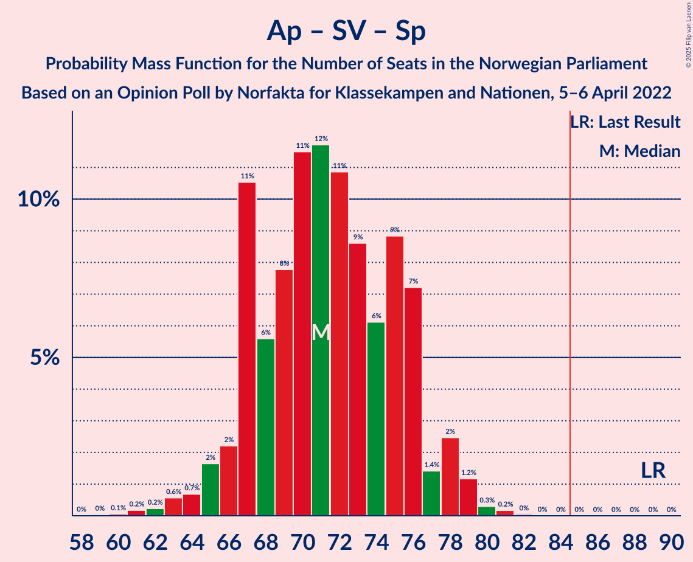

# Opinion Poll by Norfakta for Klassekampen and Nationen, 5–6 April 2022

<a href="#voting-intentions">Voting Intentions</a> | <a href="#seats">Seats</a> | <a href="#coalitions">Coalitions</a> | <a href="#technical-information">Technical Information</a>

## Voting Intentions

### Confidence Intervals

| Party | Last Result | Poll Result | 80% Confidence Interval | 90% Confidence Interval | 95% Confidence Interval | 99% Confidence Interval |
|:-----:|:-----------:|:-----------:|:-----------------------:|:-----------------------:|:-----------------------:|:-----------------------:|
| Høyre | 20.4% | 29.6% | 27.6–31.7% |27.0–32.3% |26.5–32.9% |25.6–33.9% |
| Arbeiderpartiet | 26.2% | 23.8% | 21.9–25.8% |21.4–26.4% |20.9–26.9% |20.1–27.9% |
| Fremskrittspartiet | 11.6% | 11.3% | 9.9–12.8% |9.5–13.3% |9.2–13.7% |8.6–14.4% |
| Sosialistisk Venstreparti | 7.6% | 8.7% | 7.6–10.2% |7.2–10.5% |7.0–10.9% |6.4–11.6% |
| Rødt | 4.7% | 7.2% | 6.1–8.5% |5.9–8.9% |5.6–9.2% |5.1–9.9% |
| Senterpartiet | 13.5% | 6.1% | 5.1–7.3% |4.8–7.7% |4.6–8.0% |4.2–8.6% |
| Venstre | 4.6% | 4.4% | 3.6–5.5% |3.4–5.8% |3.2–6.1% |2.9–6.7% |
| Miljøpartiet De Grønne | 3.9% | 3.3% | 2.6–4.3% |2.4–4.5% |2.3–4.8% |2.0–5.3% |
| Kristelig Folkeparti | 3.8% | 2.5% | 1.9–3.4% |1.8–3.7% |1.6–3.9% |1.4–4.3% |

*Note:* The poll result column reflects the actual value used in the calculations. Published results may vary slightly, and in addition be rounded to fewer digits.

## Seats

### Confidence Intervals

| Party | Last Result | Median | 80% Confidence Interval | 90% Confidence Interval | 95% Confidence Interval | 99% Confidence Interval |
|:-----:|:-----------:|:------:|:-----------------------:|:-----------------------:|:-----------------------:|:-----------------------:|
| <a href="#høyre">Høyre</a> | 36 | 52 | 48–56 |47–57 |47–58 |45–61 |
| <a href="#arbeiderpartiet">Arbeiderpartiet</a> | 48 | 46 | 40–50 |40–51 |39–51 |37–52 |
| <a href="#fremskrittspartiet">Fremskrittspartiet</a> | 21 | 20 | 17–23 |17–24 |17–25 |15–26 |
| <a href="#sosialistisk-venstreparti">Sosialistisk Venstreparti</a> | 13 | 15 | 13–18 |12–19 |11–19 |10–20 |
| <a href="#rødt">Rødt</a> | 8 | 13 | 11–15 |10–15 |9–16 |9–18 |
| <a href="#senterpartiet">Senterpartiet</a> | 28 | 11 | 9–13 |8–14 |8–14 |7–15 |
| <a href="#venstre">Venstre</a> | 8 | 8 | 2–10 |2–10 |2–11 |2–11 |
| <a href="#miljøpartiet-de-grønne">Miljøpartiet De Grønne</a> | 3 | 2 | 1–7 |1–8 |1–8 |1–9 |
| <a href="#kristelig-folkeparti">Kristelig Folkeparti</a> | 3 | 2 | 0–3 |0–3 |0–3 |0–7 |

### Høyre

*For a full overview of the results for this party, see the [Høyre](party-høyre.html) page.*

| Number of Seats | Probability | Accumulated | Special Marks |
|:---------------:|:-----------:|:-----------:|:-------------:|
| 36 | 0% | 100% | Last Result |
| 37 | 0% | 100% |  |
| 38 | 0% | 100% |  |
| 39 | 0% | 100% |  |
| 40 | 0% | 100% |  |
| 41 | 0% | 100% |  |
| 42 | 0% | 100% |  |
| 43 | 0.1% | 100% |  |
| 44 | 0.2% | 99.9% |  |
| 45 | 0.5% | 99.7% |  |
| 46 | 2% | 99.1% |  |
| 47 | 3% | 98% |  |
| 48 | 5% | 94% |  |
| 49 | 7% | 89% |  |
| 50 | 8% | 82% |  |
| 51 | 16% | 74% |  |
| 52 | 13% | 58% | Median |
| 53 | 11% | 45% |  |
| 54 | 12% | 34% |  |
| 55 | 6% | 22% |  |
| 56 | 8% | 16% |  |
| 57 | 4% | 8% |  |
| 58 | 2% | 4% |  |
| 59 | 0.8% | 2% |  |
| 60 | 0.7% | 1.5% |  |
| 61 | 0.4% | 0.8% |  |
| 62 | 0.2% | 0.4% |  |
| 63 | 0.2% | 0.2% |  |
| 64 | 0% | 0.1% |  |
| 65 | 0% | 0% |  |

### Arbeiderpartiet

*For a full overview of the results for this party, see the [Arbeiderpartiet](party-arbeiderpartiet.html) page.*

| Number of Seats | Probability | Accumulated | Special Marks |
|:---------------:|:-----------:|:-----------:|:-------------:|
| 35 | 0% | 100% |  |
| 36 | 0.1% | 99.9% |  |
| 37 | 0.9% | 99.8% |  |
| 38 | 0.8% | 98.9% |  |
| 39 | 2% | 98% |  |
| 40 | 8% | 96% |  |
| 41 | 5% | 87% |  |
| 42 | 7% | 82% |  |
| 43 | 7% | 75% |  |
| 44 | 7% | 68% |  |
| 45 | 11% | 61% |  |
| 46 | 10% | 50% | Median |
| 47 | 9% | 40% |  |
| 48 | 9% | 32% | Last Result |
| 49 | 8% | 22% |  |
| 50 | 7% | 15% |  |
| 51 | 6% | 7% |  |
| 52 | 0.6% | 1.0% |  |
| 53 | 0.2% | 0.3% |  |
| 54 | 0.1% | 0.1% |  |
| 55 | 0% | 0.1% |  |
| 56 | 0% | 0% |  |

### Fremskrittspartiet

*For a full overview of the results for this party, see the [Fremskrittspartiet](party-fremskrittspartiet.html) page.*

| Number of Seats | Probability | Accumulated | Special Marks |
|:---------------:|:-----------:|:-----------:|:-------------:|
| 13 | 0% | 100% |  |
| 14 | 0.2% | 99.9% |  |
| 15 | 0.5% | 99.8% |  |
| 16 | 2% | 99.2% |  |
| 17 | 9% | 98% |  |
| 18 | 20% | 88% |  |
| 19 | 14% | 69% |  |
| 20 | 15% | 55% | Median |
| 21 | 22% | 40% | Last Result |
| 22 | 7% | 18% |  |
| 23 | 5% | 11% |  |
| 24 | 3% | 6% |  |
| 25 | 2% | 3% |  |
| 26 | 0.4% | 0.7% |  |
| 27 | 0.1% | 0.3% |  |
| 28 | 0.1% | 0.2% |  |
| 29 | 0.1% | 0.1% |  |
| 30 | 0% | 0% |  |

### Sosialistisk Venstreparti

*For a full overview of the results for this party, see the [Sosialistisk Venstreparti](party-sosialistiskvenstreparti.html) page.*

| Number of Seats | Probability | Accumulated | Special Marks |
|:---------------:|:-----------:|:-----------:|:-------------:|
| 9 | 0.1% | 100% |  |
| 10 | 0.5% | 99.9% |  |
| 11 | 2% | 99.4% |  |
| 12 | 6% | 97% |  |
| 13 | 10% | 91% | Last Result |
| 14 | 17% | 81% |  |
| 15 | 23% | 65% | Median |
| 16 | 15% | 42% |  |
| 17 | 10% | 27% |  |
| 18 | 11% | 17% |  |
| 19 | 4% | 6% |  |
| 20 | 2% | 2% |  |
| 21 | 0.2% | 0.4% |  |
| 22 | 0.2% | 0.2% |  |
| 23 | 0% | 0% |  |

### Rødt

*For a full overview of the results for this party, see the [Rødt](party-rødt.html) page.*

| Number of Seats | Probability | Accumulated | Special Marks |
|:---------------:|:-----------:|:-----------:|:-------------:|
| 8 | 0.3% | 100% | Last Result |
| 9 | 3% | 99.6% |  |
| 10 | 6% | 97% |  |
| 11 | 19% | 91% |  |
| 12 | 19% | 72% |  |
| 13 | 21% | 53% | Median |
| 14 | 16% | 32% |  |
| 15 | 12% | 16% |  |
| 16 | 3% | 5% |  |
| 17 | 1.1% | 2% |  |
| 18 | 0.4% | 0.6% |  |
| 19 | 0.1% | 0.1% |  |
| 20 | 0% | 0% |  |

### Senterpartiet

*For a full overview of the results for this party, see the [Senterpartiet](party-senterpartiet.html) page.*

| Number of Seats | Probability | Accumulated | Special Marks |
|:---------------:|:-----------:|:-----------:|:-------------:|
| 0 | 0.1% | 100% |  |
| 1 | 0.1% | 99.9% |  |
| 2 | 0% | 99.8% |  |
| 3 | 0% | 99.8% |  |
| 4 | 0% | 99.8% |  |
| 5 | 0% | 99.8% |  |
| 6 | 0.2% | 99.8% |  |
| 7 | 2% | 99.6% |  |
| 8 | 7% | 98% |  |
| 9 | 16% | 91% |  |
| 10 | 19% | 75% |  |
| 11 | 23% | 56% | Median |
| 12 | 18% | 33% |  |
| 13 | 8% | 14% |  |
| 14 | 5% | 6% |  |
| 15 | 1.0% | 1.5% |  |
| 16 | 0.4% | 0.5% |  |
| 17 | 0.1% | 0.1% |  |
| 18 | 0% | 0% |  |
| 19 | 0% | 0% |  |
| 20 | 0% | 0% |  |
| 21 | 0% | 0% |  |
| 22 | 0% | 0% |  |
| 23 | 0% | 0% |  |
| 24 | 0% | 0% |  |
| 25 | 0% | 0% |  |
| 26 | 0% | 0% |  |
| 27 | 0% | 0% |  |
| 28 | 0% | 0% | Last Result |

### Venstre

*For a full overview of the results for this party, see the [Venstre](party-venstre.html) page.*

| Number of Seats | Probability | Accumulated | Special Marks |
|:---------------:|:-----------:|:-----------:|:-------------:|
| 1 | 0.1% | 100% |  |
| 2 | 14% | 99.9% |  |
| 3 | 11% | 86% |  |
| 4 | 0% | 75% |  |
| 5 | 0% | 75% |  |
| 6 | 1.2% | 75% |  |
| 7 | 18% | 74% |  |
| 8 | 30% | 56% | Last Result, Median |
| 9 | 15% | 26% |  |
| 10 | 8% | 11% |  |
| 11 | 3% | 3% |  |
| 12 | 0.4% | 0.5% |  |
| 13 | 0.1% | 0.1% |  |
| 14 | 0% | 0% |  |

### Miljøpartiet De Grønne

*For a full overview of the results for this party, see the [Miljøpartiet De Grønne](party-miljøpartietdegrønne.html) page.*

| Number of Seats | Probability | Accumulated | Special Marks |
|:---------------:|:-----------:|:-----------:|:-------------:|
| 0 | 0.1% | 100% |  |
| 1 | 30% | 99.9% |  |
| 2 | 46% | 69% | Median |
| 3 | 6% | 23% | Last Result |
| 4 | 0% | 17% |  |
| 5 | 0% | 17% |  |
| 6 | 0.7% | 17% |  |
| 7 | 11% | 16% |  |
| 8 | 4% | 6% |  |
| 9 | 1.5% | 2% |  |
| 10 | 0.1% | 0.1% |  |
| 11 | 0% | 0% |  |

### Kristelig Folkeparti

*For a full overview of the results for this party, see the [Kristelig Folkeparti](party-kristeligfolkeparti.html) page.*

| Number of Seats | Probability | Accumulated | Special Marks |
|:---------------:|:-----------:|:-----------:|:-------------:|
| 0 | 27% | 100% |  |
| 1 | 18% | 73% |  |
| 2 | 43% | 55% | Median |
| 3 | 10% | 12% | Last Result |
| 4 | 0% | 1.3% |  |
| 5 | 0% | 1.3% |  |
| 6 | 0.1% | 1.3% |  |
| 7 | 0.8% | 1.2% |  |
| 8 | 0.4% | 0.4% |  |
| 9 | 0% | 0% |  |

## Coalitions

### Confidence Intervals

| Coalition | Last Result | Median | Majority? | 80% Confidence Interval | 90% Confidence Interval | 95% Confidence Interval | 99% Confidence Interval |
|:---------:|:-----------:|:------:|:---------:|:-----------------------:|:-----------------------:|:-----------------------:|:-----------------------:|
| Høyre – Fremskrittspartiet – Senterpartiet – Venstre – Kristelig Folkeparti | 96 | 92 | 93% | 85–96 | 84–97 | 83–97 | 81–100 |
| Arbeiderpartiet – Sosialistisk Venstreparti – Rødt – Senterpartiet – Miljøpartiet De Grønne | 100 | 86 | 68% | 82–92 | 81–94 | 80–95 | 77–96 |
| Arbeiderpartiet – Sosialistisk Venstreparti – Rødt – Senterpartiet | 97 | 84 | 44% | 79–89 | 78–91 | 77–92 | 74–94 |
| Høyre – Fremskrittspartiet – Venstre – Miljøpartiet De Grønne – Kristelig Folkeparti | 71 | 83 | 36% | 78–88 | 76–89 | 75–90 | 74–92 |
| Høyre – Fremskrittspartiet – Venstre – Kristelig Folkeparti | 68 | 81 | 17% | 75–85 | 73–86 | 73–87 | 71–89 |
| Høyre – Fremskrittspartiet – Venstre | 65 | 79 | 7% | 73–84 | 72–85 | 71–86 | 69–88 |
| Arbeiderpartiet – Sosialistisk Venstreparti – Rødt – Miljøpartiet De Grønne | 72 | 75 | 2% | 71–82 | 71–83 | 69–84 | 67–86 |
| Arbeiderpartiet – Sosialistisk Venstreparti – Senterpartiet – Miljøpartiet De Grønne – Kristelig Folkeparti | 95 | 75 | 0.9% | 71–80 | 70–81 | 69–83 | 66–85 |
| Arbeiderpartiet – Sosialistisk Venstreparti – Senterpartiet – Miljøpartiet De Grønne | 92 | 74 | 0.2% | 69–79 | 69–80 | 68–81 | 65–84 |
| Høyre – Fremskrittspartiet | 57 | 72 | 0.1% | 68–77 | 66–78 | 65–79 | 64–82 |
| Arbeiderpartiet – Sosialistisk Venstreparti – Senterpartiet | 89 | 71 | 0% | 67–76 | 66–77 | 65–78 | 62–80 |
| Arbeiderpartiet – Senterpartiet – Miljøpartiet De Grønne – Kristelig Folkeparti | 82 | 60 | 0% | 55–65 | 53–67 | 53–68 | 51–70 |
| Arbeiderpartiet – Sosialistisk Venstreparti | 61 | 61 | 0% | 56–65 | 55–66 | 54–67 | 52–69 |
| Høyre – Venstre – Kristelig Folkeparti | 47 | 61 | 0% | 56–65 | 54–66 | 53–67 | 51–70 |
| Arbeiderpartiet – Senterpartiet – Kristelig Folkeparti | 79 | 58 | 0% | 53–62 | 52–62 | 51–63 | 49–66 |
| Arbeiderpartiet – Senterpartiet | 76 | 56 | 0% | 52–61 | 51–61 | 50–62 | 47–63 |
| Senterpartiet – Venstre – Kristelig Folkeparti | 39 | 19 | 0% | 14–23 | 13–24 | 12–25 | 11–26 |

### Høyre – Fremskrittspartiet – Senterpartiet – Venstre – Kristelig Folkeparti

| Number of Seats | Probability | Accumulated | Special Marks |
|:---------------:|:-----------:|:-----------:|:-------------:|
| 78 | 0.1% | 100% |  |
| 79 | 0.1% | 99.9% |  |
| 80 | 0.2% | 99.9% |  |
| 81 | 0.5% | 99.6% |  |
| 82 | 1.4% | 99.1% |  |
| 83 | 2% | 98% |  |
| 84 | 3% | 96% |  |
| 85 | 4% | 93% | Majority |
| 86 | 4% | 88% |  |
| 87 | 5% | 84% |  |
| 88 | 7% | 79% |  |
| 89 | 5% | 72% |  |
| 90 | 8% | 67% |  |
| 91 | 7% | 58% |  |
| 92 | 9% | 52% |  |
| 93 | 11% | 43% | Median |
| 94 | 8% | 32% |  |
| 95 | 8% | 24% |  |
| 96 | 7% | 17% | Last Result |
| 97 | 7% | 10% |  |
| 98 | 1.0% | 2% |  |
| 99 | 0.6% | 1.4% |  |
| 100 | 0.5% | 0.9% |  |
| 101 | 0.1% | 0.4% |  |
| 102 | 0.1% | 0.3% |  |
| 103 | 0.1% | 0.1% |  |
| 104 | 0% | 0.1% |  |
| 105 | 0% | 0% |  |

### Arbeiderpartiet – Sosialistisk Venstreparti – Rødt – Senterpartiet – Miljøpartiet De Grønne

| Number of Seats | Probability | Accumulated | Special Marks |
|:---------------:|:-----------:|:-----------:|:-------------:|
| 74 | 0% | 100% |  |
| 75 | 0.2% | 99.9% |  |
| 76 | 0.1% | 99.8% |  |
| 77 | 0.2% | 99.6% |  |
| 78 | 0.4% | 99.4% |  |
| 79 | 0.7% | 99.0% |  |
| 80 | 1.3% | 98% |  |
| 81 | 4% | 97% |  |
| 82 | 6% | 93% |  |
| 83 | 10% | 86% |  |
| 84 | 9% | 77% |  |
| 85 | 10% | 68% | Majority |
| 86 | 13% | 57% |  |
| 87 | 7% | 45% | Median |
| 88 | 6% | 37% |  |
| 89 | 5% | 31% |  |
| 90 | 4% | 26% |  |
| 91 | 6% | 22% |  |
| 92 | 6% | 16% |  |
| 93 | 4% | 10% |  |
| 94 | 2% | 5% |  |
| 95 | 2% | 3% |  |
| 96 | 0.4% | 0.8% |  |
| 97 | 0.4% | 0.5% |  |
| 98 | 0.1% | 0.1% |  |
| 99 | 0% | 0% |  |
| 100 | 0% | 0% | Last Result |

### Arbeiderpartiet – Sosialistisk Venstreparti – Rødt – Senterpartiet

| Number of Seats | Probability | Accumulated | Special Marks |
|:---------------:|:-----------:|:-----------:|:-------------:|
| 71 | 0% | 100% |  |
| 72 | 0.1% | 99.9% |  |
| 73 | 0.1% | 99.8% |  |
| 74 | 0.3% | 99.7% |  |
| 75 | 0.4% | 99.4% |  |
| 76 | 0.5% | 98.9% |  |
| 77 | 2% | 98% |  |
| 78 | 3% | 97% |  |
| 79 | 4% | 94% |  |
| 80 | 8% | 90% |  |
| 81 | 10% | 82% |  |
| 82 | 7% | 72% |  |
| 83 | 10% | 65% |  |
| 84 | 12% | 56% |  |
| 85 | 12% | 44% | Median, Majority |
| 86 | 6% | 32% |  |
| 87 | 8% | 26% |  |
| 88 | 5% | 18% |  |
| 89 | 3% | 13% |  |
| 90 | 4% | 10% |  |
| 91 | 2% | 6% |  |
| 92 | 3% | 4% |  |
| 93 | 0.6% | 1.2% |  |
| 94 | 0.5% | 0.6% |  |
| 95 | 0.1% | 0.1% |  |
| 96 | 0% | 0% |  |
| 97 | 0% | 0% | Last Result |

### Høyre – Fremskrittspartiet – Venstre – Miljøpartiet De Grønne – Kristelig Folkeparti

| Number of Seats | Probability | Accumulated | Special Marks |
|:---------------:|:-----------:|:-----------:|:-------------:|
| 70 | 0.1% | 100% |  |
| 71 | 0.1% | 99.9% | Last Result |
| 72 | 0.1% | 99.8% |  |
| 73 | 0.3% | 99.8% |  |
| 74 | 1.4% | 99.5% |  |
| 75 | 2% | 98% |  |
| 76 | 3% | 96% |  |
| 77 | 3% | 93% |  |
| 78 | 5% | 90% |  |
| 79 | 3% | 86% |  |
| 80 | 6% | 82% |  |
| 81 | 9% | 76% |  |
| 82 | 7% | 68% |  |
| 83 | 12% | 61% |  |
| 84 | 12% | 49% | Median |
| 85 | 9% | 36% | Majority |
| 86 | 6% | 28% |  |
| 87 | 9% | 22% |  |
| 88 | 6% | 12% |  |
| 89 | 2% | 6% |  |
| 90 | 3% | 4% |  |
| 91 | 0.9% | 2% |  |
| 92 | 0.3% | 0.7% |  |
| 93 | 0.1% | 0.5% |  |
| 94 | 0.2% | 0.3% |  |
| 95 | 0.1% | 0.1% |  |
| 96 | 0% | 0.1% |  |
| 97 | 0% | 0% |  |

### Høyre – Fremskrittspartiet – Venstre – Kristelig Folkeparti

| Number of Seats | Probability | Accumulated | Special Marks |
|:---------------:|:-----------:|:-----------:|:-------------:|
| 68 | 0.1% | 100% | Last Result |
| 69 | 0.1% | 99.9% |  |
| 70 | 0.1% | 99.7% |  |
| 71 | 0.6% | 99.6% |  |
| 72 | 1.5% | 99.1% |  |
| 73 | 4% | 98% |  |
| 74 | 3% | 94% |  |
| 75 | 5% | 91% |  |
| 76 | 6% | 86% |  |
| 77 | 7% | 80% |  |
| 78 | 5% | 73% |  |
| 79 | 6% | 68% |  |
| 80 | 7% | 62% |  |
| 81 | 8% | 55% |  |
| 82 | 13% | 47% | Median |
| 83 | 10% | 35% |  |
| 84 | 8% | 25% |  |
| 85 | 9% | 17% | Majority |
| 86 | 5% | 8% |  |
| 87 | 1.3% | 3% |  |
| 88 | 0.5% | 1.4% |  |
| 89 | 0.4% | 0.8% |  |
| 90 | 0.2% | 0.5% |  |
| 91 | 0.1% | 0.2% |  |
| 92 | 0.1% | 0.2% |  |
| 93 | 0.1% | 0.1% |  |
| 94 | 0% | 0% |  |

### Høyre – Fremskrittspartiet – Venstre

| Number of Seats | Probability | Accumulated | Special Marks |
|:---------------:|:-----------:|:-----------:|:-------------:|
| 65 | 0% | 100% | Last Result |
| 66 | 0.1% | 100% |  |
| 67 | 0.1% | 99.9% |  |
| 68 | 0.1% | 99.8% |  |
| 69 | 0.4% | 99.7% |  |
| 70 | 0.4% | 99.2% |  |
| 71 | 2% | 98.8% |  |
| 72 | 3% | 97% |  |
| 73 | 4% | 94% |  |
| 74 | 3% | 90% |  |
| 75 | 7% | 87% |  |
| 76 | 8% | 80% |  |
| 77 | 7% | 72% |  |
| 78 | 7% | 65% |  |
| 79 | 12% | 58% |  |
| 80 | 8% | 46% | Median |
| 81 | 9% | 38% |  |
| 82 | 7% | 28% |  |
| 83 | 9% | 21% |  |
| 84 | 5% | 12% |  |
| 85 | 2% | 7% | Majority |
| 86 | 3% | 5% |  |
| 87 | 1.0% | 2% |  |
| 88 | 0.3% | 0.7% |  |
| 89 | 0.2% | 0.4% |  |
| 90 | 0.1% | 0.2% |  |
| 91 | 0% | 0.1% |  |
| 92 | 0% | 0.1% |  |
| 93 | 0% | 0% |  |

### Arbeiderpartiet – Sosialistisk Venstreparti – Rødt – Miljøpartiet De Grønne

| Number of Seats | Probability | Accumulated | Special Marks |
|:---------------:|:-----------:|:-----------:|:-------------:|
| 64 | 0.1% | 100% |  |
| 65 | 0.1% | 99.9% |  |
| 66 | 0.3% | 99.8% |  |
| 67 | 0.3% | 99.5% |  |
| 68 | 1.0% | 99.2% |  |
| 69 | 1.1% | 98% |  |
| 70 | 2% | 97% |  |
| 71 | 9% | 96% |  |
| 72 | 9% | 87% | Last Result |
| 73 | 9% | 78% |  |
| 74 | 8% | 69% |  |
| 75 | 11% | 61% |  |
| 76 | 9% | 50% | Median |
| 77 | 8% | 41% |  |
| 78 | 7% | 33% |  |
| 79 | 4% | 26% |  |
| 80 | 6% | 22% |  |
| 81 | 4% | 16% |  |
| 82 | 4% | 12% |  |
| 83 | 4% | 8% |  |
| 84 | 2% | 4% |  |
| 85 | 1.0% | 2% | Majority |
| 86 | 0.6% | 1.0% |  |
| 87 | 0.2% | 0.4% |  |
| 88 | 0.1% | 0.2% |  |
| 89 | 0% | 0% |  |

### Arbeiderpartiet – Sosialistisk Venstreparti – Senterpartiet – Miljøpartiet De Grønne – Kristelig Folkeparti

| Number of Seats | Probability | Accumulated | Special Marks |
|:---------------:|:-----------:|:-----------:|:-------------:|
| 63 | 0% | 100% |  |
| 64 | 0.1% | 99.9% |  |
| 65 | 0.1% | 99.9% |  |
| 66 | 0.3% | 99.7% |  |
| 67 | 0.6% | 99.5% |  |
| 68 | 1.0% | 98.9% |  |
| 69 | 2% | 98% |  |
| 70 | 2% | 96% |  |
| 71 | 10% | 93% |  |
| 72 | 6% | 83% |  |
| 73 | 5% | 76% |  |
| 74 | 12% | 71% |  |
| 75 | 9% | 59% |  |
| 76 | 10% | 50% | Median |
| 77 | 8% | 39% |  |
| 78 | 11% | 32% |  |
| 79 | 8% | 21% |  |
| 80 | 5% | 13% |  |
| 81 | 3% | 8% |  |
| 82 | 2% | 5% |  |
| 83 | 1.1% | 3% |  |
| 84 | 0.7% | 2% |  |
| 85 | 0.5% | 0.9% | Majority |
| 86 | 0.2% | 0.4% |  |
| 87 | 0.1% | 0.1% |  |
| 88 | 0% | 0% |  |
| 89 | 0% | 0% |  |
| 90 | 0% | 0% |  |
| 91 | 0% | 0% |  |
| 92 | 0% | 0% |  |
| 93 | 0% | 0% |  |
| 94 | 0% | 0% |  |
| 95 | 0% | 0% | Last Result |

### Arbeiderpartiet – Sosialistisk Venstreparti – Senterpartiet – Miljøpartiet De Grønne

| Number of Seats | Probability | Accumulated | Special Marks |
|:---------------:|:-----------:|:-----------:|:-------------:|
| 62 | 0% | 100% |  |
| 63 | 0.1% | 99.9% |  |
| 64 | 0.1% | 99.8% |  |
| 65 | 0.4% | 99.7% |  |
| 66 | 0.6% | 99.4% |  |
| 67 | 0.9% | 98.7% |  |
| 68 | 2% | 98% |  |
| 69 | 9% | 96% |  |
| 70 | 5% | 87% |  |
| 71 | 9% | 82% |  |
| 72 | 11% | 72% |  |
| 73 | 6% | 61% |  |
| 74 | 13% | 55% | Median |
| 75 | 8% | 42% |  |
| 76 | 6% | 35% |  |
| 77 | 7% | 29% |  |
| 78 | 10% | 21% |  |
| 79 | 5% | 12% |  |
| 80 | 3% | 7% |  |
| 81 | 2% | 4% |  |
| 82 | 1.0% | 2% |  |
| 83 | 0.8% | 1.3% |  |
| 84 | 0.3% | 0.6% |  |
| 85 | 0.1% | 0.2% | Majority |
| 86 | 0.1% | 0.1% |  |
| 87 | 0% | 0% |  |
| 88 | 0% | 0% |  |
| 89 | 0% | 0% |  |
| 90 | 0% | 0% |  |
| 91 | 0% | 0% |  |
| 92 | 0% | 0% | Last Result |

### Høyre – Fremskrittspartiet

| Number of Seats | Probability | Accumulated | Special Marks |
|:---------------:|:-----------:|:-----------:|:-------------:|
| 57 | 0% | 100% | Last Result |
| 58 | 0% | 100% |  |
| 59 | 0% | 100% |  |
| 60 | 0% | 100% |  |
| 61 | 0% | 100% |  |
| 62 | 0.2% | 99.9% |  |
| 63 | 0.2% | 99.8% |  |
| 64 | 2% | 99.5% |  |
| 65 | 0.8% | 98% |  |
| 66 | 3% | 97% |  |
| 67 | 4% | 94% |  |
| 68 | 5% | 90% |  |
| 69 | 11% | 85% |  |
| 70 | 9% | 75% |  |
| 71 | 9% | 65% |  |
| 72 | 11% | 56% | Median |
| 73 | 10% | 45% |  |
| 74 | 8% | 36% |  |
| 75 | 10% | 28% |  |
| 76 | 7% | 19% |  |
| 77 | 4% | 11% |  |
| 78 | 4% | 7% |  |
| 79 | 2% | 4% |  |
| 80 | 0.9% | 2% |  |
| 81 | 0.3% | 1.1% |  |
| 82 | 0.3% | 0.8% |  |
| 83 | 0.2% | 0.4% |  |
| 84 | 0.1% | 0.2% |  |
| 85 | 0.1% | 0.1% | Majority |
| 86 | 0% | 0.1% |  |
| 87 | 0% | 0% |  |

### Arbeiderpartiet – Sosialistisk Venstreparti – Senterpartiet

| Number of Seats | Probability | Accumulated | Special Marks |
|:---------------:|:-----------:|:-----------:|:-------------:|
| 59 | 0% | 100% |  |
| 60 | 0.1% | 99.9% |  |
| 61 | 0.2% | 99.9% |  |
| 62 | 0.2% | 99.7% |  |
| 63 | 0.6% | 99.5% |  |
| 64 | 0.7% | 98.9% |  |
| 65 | 2% | 98% |  |
| 66 | 2% | 97% |  |
| 67 | 11% | 94% |  |
| 68 | 6% | 84% |  |
| 69 | 8% | 78% |  |
| 70 | 11% | 70% |  |
| 71 | 12% | 59% |  |
| 72 | 11% | 47% | Median |
| 73 | 9% | 36% |  |
| 74 | 6% | 28% |  |
| 75 | 9% | 22% |  |
| 76 | 7% | 13% |  |
| 77 | 1.4% | 6% |  |
| 78 | 2% | 4% |  |
| 79 | 1.2% | 2% |  |
| 80 | 0.3% | 0.5% |  |
| 81 | 0.2% | 0.2% |  |
| 82 | 0% | 0.1% |  |
| 83 | 0% | 0% |  |
| 84 | 0% | 0% |  |
| 85 | 0% | 0% | Majority |
| 86 | 0% | 0% |  |
| 87 | 0% | 0% |  |
| 88 | 0% | 0% |  |
| 89 | 0% | 0% | Last Result |

### Arbeiderpartiet – Senterpartiet – Miljøpartiet De Grønne – Kristelig Folkeparti

| Number of Seats | Probability | Accumulated | Special Marks |
|:---------------:|:-----------:|:-----------:|:-------------:|
| 48 | 0% | 100% |  |
| 49 | 0.1% | 99.9% |  |
| 50 | 0.2% | 99.9% |  |
| 51 | 0.5% | 99.7% |  |
| 52 | 0.8% | 99.1% |  |
| 53 | 3% | 98% |  |
| 54 | 4% | 95% |  |
| 55 | 2% | 91% |  |
| 56 | 9% | 89% |  |
| 57 | 6% | 80% |  |
| 58 | 8% | 74% |  |
| 59 | 9% | 65% |  |
| 60 | 10% | 57% |  |
| 61 | 7% | 46% | Median |
| 62 | 8% | 39% |  |
| 63 | 10% | 31% |  |
| 64 | 6% | 21% |  |
| 65 | 6% | 15% |  |
| 66 | 3% | 9% |  |
| 67 | 2% | 6% |  |
| 68 | 3% | 4% |  |
| 69 | 0.6% | 1.5% |  |
| 70 | 0.7% | 0.9% |  |
| 71 | 0.2% | 0.3% |  |
| 72 | 0.1% | 0.1% |  |
| 73 | 0% | 0% |  |
| 74 | 0% | 0% |  |
| 75 | 0% | 0% |  |
| 76 | 0% | 0% |  |
| 77 | 0% | 0% |  |
| 78 | 0% | 0% |  |
| 79 | 0% | 0% |  |
| 80 | 0% | 0% |  |
| 81 | 0% | 0% |  |
| 82 | 0% | 0% | Last Result |

### Arbeiderpartiet – Sosialistisk Venstreparti

| Number of Seats | Probability | Accumulated | Special Marks |
|:---------------:|:-----------:|:-----------:|:-------------:|
| 50 | 0.1% | 100% |  |
| 51 | 0.2% | 99.9% |  |
| 52 | 0.4% | 99.7% |  |
| 53 | 0.8% | 99.3% |  |
| 54 | 1.2% | 98% |  |
| 55 | 7% | 97% |  |
| 56 | 3% | 91% |  |
| 57 | 7% | 87% |  |
| 58 | 7% | 80% |  |
| 59 | 10% | 73% |  |
| 60 | 10% | 63% |  |
| 61 | 11% | 53% | Last Result, Median |
| 62 | 10% | 41% |  |
| 63 | 8% | 31% |  |
| 64 | 10% | 23% |  |
| 65 | 6% | 13% |  |
| 66 | 3% | 7% |  |
| 67 | 2% | 4% |  |
| 68 | 1.2% | 2% |  |
| 69 | 0.5% | 0.8% |  |
| 70 | 0.2% | 0.3% |  |
| 71 | 0.1% | 0.1% |  |
| 72 | 0% | 0% |  |

### Høyre – Venstre – Kristelig Folkeparti

| Number of Seats | Probability | Accumulated | Special Marks |
|:---------------:|:-----------:|:-----------:|:-------------:|
| 47 | 0% | 100% | Last Result |
| 48 | 0% | 100% |  |
| 49 | 0.1% | 100% |  |
| 50 | 0.3% | 99.9% |  |
| 51 | 0.6% | 99.6% |  |
| 52 | 0.9% | 99.0% |  |
| 53 | 2% | 98% |  |
| 54 | 2% | 96% |  |
| 55 | 4% | 94% |  |
| 56 | 6% | 90% |  |
| 57 | 4% | 84% |  |
| 58 | 10% | 80% |  |
| 59 | 8% | 70% |  |
| 60 | 8% | 62% |  |
| 61 | 10% | 54% |  |
| 62 | 10% | 44% | Median |
| 63 | 9% | 34% |  |
| 64 | 12% | 25% |  |
| 65 | 5% | 13% |  |
| 66 | 4% | 8% |  |
| 67 | 2% | 4% |  |
| 68 | 0.8% | 2% |  |
| 69 | 0.3% | 1.0% |  |
| 70 | 0.4% | 0.7% |  |
| 71 | 0.2% | 0.3% |  |
| 72 | 0.1% | 0.1% |  |
| 73 | 0% | 0% |  |

### Arbeiderpartiet – Senterpartiet – Kristelig Folkeparti

| Number of Seats | Probability | Accumulated | Special Marks |
|:---------------:|:-----------:|:-----------:|:-------------:|
| 46 | 0% | 100% |  |
| 47 | 0.1% | 99.9% |  |
| 48 | 0.3% | 99.9% |  |
| 49 | 0.6% | 99.5% |  |
| 50 | 0.9% | 98.9% |  |
| 51 | 2% | 98% |  |
| 52 | 6% | 96% |  |
| 53 | 5% | 90% |  |
| 54 | 8% | 86% |  |
| 55 | 9% | 78% |  |
| 56 | 6% | 69% |  |
| 57 | 10% | 63% |  |
| 58 | 11% | 53% |  |
| 59 | 11% | 43% | Median |
| 60 | 7% | 32% |  |
| 61 | 13% | 25% |  |
| 62 | 8% | 12% |  |
| 63 | 2% | 4% |  |
| 64 | 1.4% | 2% |  |
| 65 | 0.4% | 1.0% |  |
| 66 | 0.4% | 0.6% |  |
| 67 | 0.1% | 0.2% |  |
| 68 | 0.1% | 0.1% |  |
| 69 | 0% | 0% |  |
| 70 | 0% | 0% |  |
| 71 | 0% | 0% |  |
| 72 | 0% | 0% |  |
| 73 | 0% | 0% |  |
| 74 | 0% | 0% |  |
| 75 | 0% | 0% |  |
| 76 | 0% | 0% |  |
| 77 | 0% | 0% |  |
| 78 | 0% | 0% |  |
| 79 | 0% | 0% | Last Result |

### Arbeiderpartiet – Senterpartiet

| Number of Seats | Probability | Accumulated | Special Marks |
|:---------------:|:-----------:|:-----------:|:-------------:|
| 45 | 0% | 100% |  |
| 46 | 0.1% | 99.9% |  |
| 47 | 0.5% | 99.9% |  |
| 48 | 0.4% | 99.4% |  |
| 49 | 0.9% | 99.0% |  |
| 50 | 2% | 98% |  |
| 51 | 4% | 96% |  |
| 52 | 13% | 92% |  |
| 53 | 8% | 80% |  |
| 54 | 6% | 72% |  |
| 55 | 7% | 65% |  |
| 56 | 11% | 58% |  |
| 57 | 12% | 47% | Median |
| 58 | 7% | 36% |  |
| 59 | 9% | 29% |  |
| 60 | 8% | 20% |  |
| 61 | 9% | 12% |  |
| 62 | 1.1% | 3% |  |
| 63 | 1.3% | 2% |  |
| 64 | 0.2% | 0.4% |  |
| 65 | 0.1% | 0.2% |  |
| 66 | 0% | 0% |  |
| 67 | 0% | 0% |  |
| 68 | 0% | 0% |  |
| 69 | 0% | 0% |  |
| 70 | 0% | 0% |  |
| 71 | 0% | 0% |  |
| 72 | 0% | 0% |  |
| 73 | 0% | 0% |  |
| 74 | 0% | 0% |  |
| 75 | 0% | 0% |  |
| 76 | 0% | 0% | Last Result |

### Senterpartiet – Venstre – Kristelig Folkeparti

| Number of Seats | Probability | Accumulated | Special Marks |
|:---------------:|:-----------:|:-----------:|:-------------:|
| 5 | 0% | 100% |  |
| 6 | 0% | 99.9% |  |
| 7 | 0% | 99.9% |  |
| 8 | 0% | 99.9% |  |
| 9 | 0.1% | 99.9% |  |
| 10 | 0.3% | 99.9% |  |
| 11 | 0.7% | 99.5% |  |
| 12 | 2% | 98.8% |  |
| 13 | 2% | 97% |  |
| 14 | 5% | 94% |  |
| 15 | 7% | 89% |  |
| 16 | 5% | 83% |  |
| 17 | 9% | 78% |  |
| 18 | 11% | 69% |  |
| 19 | 10% | 58% |  |
| 20 | 8% | 48% |  |
| 21 | 16% | 40% | Median |
| 22 | 12% | 24% |  |
| 23 | 6% | 12% |  |
| 24 | 3% | 7% |  |
| 25 | 2% | 3% |  |
| 26 | 0.6% | 1.0% |  |
| 27 | 0.2% | 0.4% |  |
| 28 | 0.1% | 0.2% |  |
| 29 | 0.1% | 0.1% |  |
| 30 | 0% | 0% |  |
| 31 | 0% | 0% |  |
| 32 | 0% | 0% |  |
| 33 | 0% | 0% |  |
| 34 | 0% | 0% |  |
| 35 | 0% | 0% |  |
| 36 | 0% | 0% |  |
| 37 | 0% | 0% |  |
| 38 | 0% | 0% |  |
| 39 | 0% | 0% | Last Result |

## Technical Information

### Opinion Poll

+ **Polling firm:** Norfakta
+ **Commissioner(s):** Klassekampen and Nationen
+ **Fieldwork period:** 5–6 April 2022

### Calculations

+ **Sample size:** 791
+ **Simulations done:** 1,048,576
+ **Error estimate:** 2.56%

