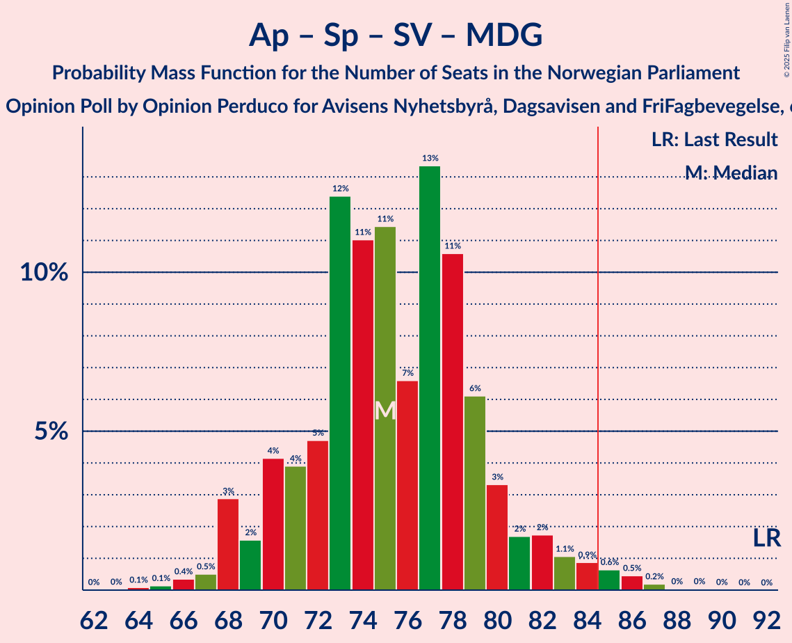
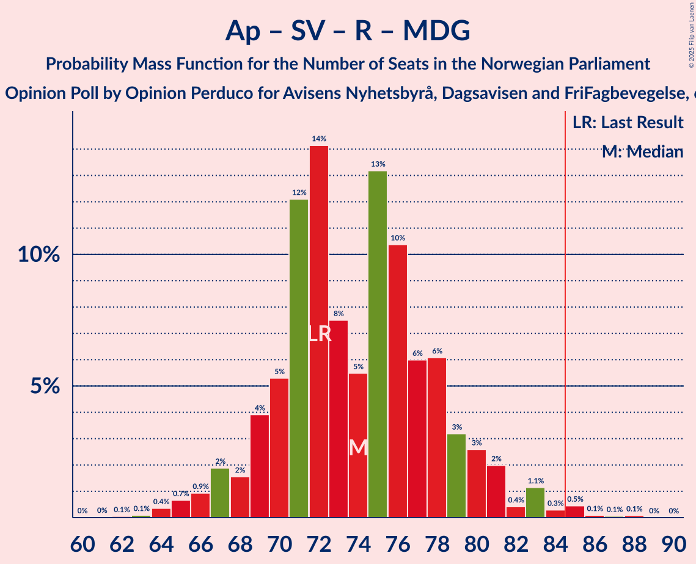

# Opinion Poll by Opinion Perduco for Avisens Nyhetsbyrå, Dagsavisen and FriFagbevegelse, 6 April 2022

<a href="#voting-intentions">Voting Intentions</a> | <a href="#seats">Seats</a> | <a href="#coalitions">Coalitions</a> | <a href="#technical-information">Technical Information</a>

## Voting Intentions

### Confidence Intervals

| Party | Last Result | Poll Result | 80% Confidence Interval | 90% Confidence Interval | 95% Confidence Interval | 99% Confidence Interval |
|:-----:|:-----------:|:-----------:|:-----------------------:|:-----------------------:|:-----------------------:|:-----------------------:|
| Arbeiderpartiet | 26.2% | 25.7% | 23.6–28.1% |23.0–28.7% |22.5–29.3% |21.5–30.4% |
| Høyre | 20.4% | 25.6% | 23.5–27.9% |22.9–28.6% |22.3–29.1% |21.4–30.3% |
| Fremskrittspartiet | 11.6% | 12.7% | 11.2–14.6% |10.7–15.1% |10.3–15.5% |9.6–16.5% |
| Sosialistisk Venstreparti | 7.6% | 7.1% | 5.9–8.5% |5.6–9.0% |5.3–9.3% |4.8–10.1% |
| Senterpartiet | 13.5% | 7.1% | 5.9–8.5% |5.6–9.0% |5.3–9.3% |4.8–10.1% |
| Rødt | 4.7% | 6.4% | 5.3–7.9% |5.0–8.3% |4.8–8.6% |4.3–9.4% |
| Venstre | 4.6% | 5.7% | 4.6–7.0% |4.3–7.4% |4.1–7.7% |3.7–8.4% |
| Kristelig Folkeparti | 3.8% | 3.5% | 2.7–4.6% |2.5–4.9% |2.3–5.2% |2.0–5.8% |
| Miljøpartiet De Grønne | 3.9% | 3.1% | 2.4–4.2% |2.2–4.5% |2.0–4.8% |1.7–5.4% |

*Note:* The poll result column reflects the actual value used in the calculations. Published results may vary slightly, and in addition be rounded to fewer digits.

## Seats

### Confidence Intervals

| Party | Last Result | Median | 80% Confidence Interval | 90% Confidence Interval | 95% Confidence Interval | 99% Confidence Interval |
|:-----:|:-----------:|:------:|:-----------------------:|:-----------------------:|:-----------------------:|:-----------------------:|
| <a href="#arbeiderpartiet">Arbeiderpartiet</a> | 48 | 48 | 45–52 |44–54 |43–55 |40–57 |
| <a href="#høyre">Høyre</a> | 36 | 46 | 41–49 |41–50 |40–51 |39–53 |
| <a href="#fremskrittspartiet">Fremskrittspartiet</a> | 21 | 22 | 19–26 |18–27 |18–29 |17–30 |
| <a href="#sosialistisk-venstreparti">Sosialistisk Venstreparti</a> | 13 | 12 | 10–15 |9–16 |9–17 |8–18 |
| <a href="#senterpartiet">Senterpartiet</a> | 28 | 13 | 10–14 |9–16 |8–16 |7–18 |
| <a href="#rødt">Rødt</a> | 8 | 11 | 9–13 |9–14 |8–15 |7–16 |
| <a href="#venstre">Venstre</a> | 8 | 10 | 8–12 |7–12 |7–13 |3–14 |
| <a href="#kristelig-folkeparti">Kristelig Folkeparti</a> | 3 | 3 | 2–7 |1–8 |0–9 |0–9 |
| <a href="#miljøpartiet-de-grønne">Miljøpartiet De Grønne</a> | 3 | 2 | 1–7 |1–7 |1–8 |1–9 |

### Arbeiderpartiet

*For a full overview of the results for this party, see the [Arbeiderpartiet](party-arbeiderpartiet.html) page.*

| Number of Seats | Probability | Accumulated | Special Marks |
|:---------------:|:-----------:|:-----------:|:-------------:|
| 38 | 0.1% | 100% |  |
| 39 | 0.2% | 99.9% |  |
| 40 | 0.2% | 99.7% |  |
| 41 | 0.6% | 99.5% |  |
| 42 | 1.1% | 98.9% |  |
| 43 | 2% | 98% |  |
| 44 | 4% | 96% |  |
| 45 | 7% | 92% |  |
| 46 | 9% | 85% |  |
| 47 | 23% | 77% |  |
| 48 | 16% | 53% | Last Result, Median |
| 49 | 12% | 37% |  |
| 50 | 8% | 25% |  |
| 51 | 7% | 17% |  |
| 52 | 2% | 10% |  |
| 53 | 2% | 8% |  |
| 54 | 2% | 6% |  |
| 55 | 2% | 4% |  |
| 56 | 1.2% | 2% |  |
| 57 | 0.7% | 1.1% |  |
| 58 | 0.3% | 0.4% |  |
| 59 | 0.1% | 0.1% |  |
| 60 | 0% | 0.1% |  |
| 61 | 0% | 0% |  |

### Høyre

*For a full overview of the results for this party, see the [Høyre](party-høyre.html) page.*

| Number of Seats | Probability | Accumulated | Special Marks |
|:---------------:|:-----------:|:-----------:|:-------------:|
| 35 | 0% | 100% |  |
| 36 | 0.1% | 99.9% | Last Result |
| 37 | 0.1% | 99.9% |  |
| 38 | 0.3% | 99.8% |  |
| 39 | 0.8% | 99.5% |  |
| 40 | 2% | 98.7% |  |
| 41 | 8% | 96% |  |
| 42 | 5% | 88% |  |
| 43 | 7% | 84% |  |
| 44 | 10% | 77% |  |
| 45 | 16% | 67% |  |
| 46 | 10% | 50% | Median |
| 47 | 14% | 40% |  |
| 48 | 10% | 26% |  |
| 49 | 9% | 16% |  |
| 50 | 4% | 7% |  |
| 51 | 2% | 3% |  |
| 52 | 0.8% | 2% |  |
| 53 | 0.6% | 0.8% |  |
| 54 | 0.2% | 0.3% |  |
| 55 | 0% | 0.1% |  |
| 56 | 0% | 0% |  |

### Fremskrittspartiet

*For a full overview of the results for this party, see the [Fremskrittspartiet](party-fremskrittspartiet.html) page.*

| Number of Seats | Probability | Accumulated | Special Marks |
|:---------------:|:-----------:|:-----------:|:-------------:|
| 15 | 0.1% | 100% |  |
| 16 | 0.1% | 99.9% |  |
| 17 | 1.1% | 99.8% |  |
| 18 | 4% | 98.7% |  |
| 19 | 10% | 95% |  |
| 20 | 16% | 85% |  |
| 21 | 10% | 69% | Last Result |
| 22 | 24% | 59% | Median |
| 23 | 11% | 35% |  |
| 24 | 7% | 24% |  |
| 25 | 7% | 17% |  |
| 26 | 3% | 10% |  |
| 27 | 3% | 7% |  |
| 28 | 1.3% | 4% |  |
| 29 | 2% | 3% |  |
| 30 | 0.4% | 0.9% |  |
| 31 | 0.2% | 0.4% |  |
| 32 | 0.1% | 0.2% |  |
| 33 | 0% | 0.1% |  |
| 34 | 0% | 0% |  |

### Sosialistisk Venstreparti

*For a full overview of the results for this party, see the [Sosialistisk Venstreparti](party-sosialistiskvenstreparti.html) page.*

| Number of Seats | Probability | Accumulated | Special Marks |
|:---------------:|:-----------:|:-----------:|:-------------:|
| 7 | 0.2% | 100% |  |
| 8 | 1.3% | 99.8% |  |
| 9 | 5% | 98% |  |
| 10 | 11% | 93% |  |
| 11 | 24% | 82% |  |
| 12 | 14% | 58% | Median |
| 13 | 17% | 43% | Last Result |
| 14 | 15% | 27% |  |
| 15 | 7% | 12% |  |
| 16 | 2% | 5% |  |
| 17 | 2% | 3% |  |
| 18 | 0.6% | 0.8% |  |
| 19 | 0.1% | 0.1% |  |
| 20 | 0% | 0.1% |  |
| 21 | 0% | 0% |  |

### Senterpartiet

*For a full overview of the results for this party, see the [Senterpartiet](party-senterpartiet.html) page.*

| Number of Seats | Probability | Accumulated | Special Marks |
|:---------------:|:-----------:|:-----------:|:-------------:|
| 6 | 0% | 100% |  |
| 7 | 0.7% | 99.9% |  |
| 8 | 2% | 99.3% |  |
| 9 | 4% | 97% |  |
| 10 | 6% | 93% |  |
| 11 | 12% | 88% |  |
| 12 | 13% | 76% |  |
| 13 | 32% | 63% | Median |
| 14 | 21% | 31% |  |
| 15 | 5% | 10% |  |
| 16 | 3% | 5% |  |
| 17 | 1.4% | 2% |  |
| 18 | 0.4% | 0.6% |  |
| 19 | 0.1% | 0.2% |  |
| 20 | 0% | 0% |  |
| 21 | 0% | 0% |  |
| 22 | 0% | 0% |  |
| 23 | 0% | 0% |  |
| 24 | 0% | 0% |  |
| 25 | 0% | 0% |  |
| 26 | 0% | 0% |  |
| 27 | 0% | 0% |  |
| 28 | 0% | 0% | Last Result |

### Rødt

*For a full overview of the results for this party, see the [Rødt](party-rødt.html) page.*

| Number of Seats | Probability | Accumulated | Special Marks |
|:---------------:|:-----------:|:-----------:|:-------------:|
| 1 | 0.1% | 100% |  |
| 2 | 0% | 99.9% |  |
| 3 | 0% | 99.9% |  |
| 4 | 0% | 99.9% |  |
| 5 | 0% | 99.9% |  |
| 6 | 0.1% | 99.9% |  |
| 7 | 1.2% | 99.8% |  |
| 8 | 3% | 98.6% | Last Result |
| 9 | 10% | 95% |  |
| 10 | 18% | 85% |  |
| 11 | 30% | 68% | Median |
| 12 | 13% | 38% |  |
| 13 | 16% | 25% |  |
| 14 | 5% | 9% |  |
| 15 | 2% | 3% |  |
| 16 | 1.1% | 1.3% |  |
| 17 | 0.1% | 0.2% |  |
| 18 | 0.1% | 0.1% |  |
| 19 | 0% | 0% |  |

### Venstre

*For a full overview of the results for this party, see the [Venstre](party-venstre.html) page.*

| Number of Seats | Probability | Accumulated | Special Marks |
|:---------------:|:-----------:|:-----------:|:-------------:|
| 2 | 0.3% | 100% |  |
| 3 | 1.4% | 99.7% |  |
| 4 | 0% | 98% |  |
| 5 | 0% | 98% |  |
| 6 | 0.5% | 98% |  |
| 7 | 5% | 98% |  |
| 8 | 18% | 93% | Last Result |
| 9 | 24% | 74% |  |
| 10 | 25% | 50% | Median |
| 11 | 11% | 26% |  |
| 12 | 10% | 14% |  |
| 13 | 3% | 4% |  |
| 14 | 1.0% | 1.3% |  |
| 15 | 0.2% | 0.3% |  |
| 16 | 0.1% | 0.1% |  |
| 17 | 0% | 0% |  |

### Kristelig Folkeparti

*For a full overview of the results for this party, see the [Kristelig Folkeparti](party-kristeligfolkeparti.html) page.*

| Number of Seats | Probability | Accumulated | Special Marks |
|:---------------:|:-----------:|:-----------:|:-------------:|
| 0 | 4% | 100% |  |
| 1 | 5% | 96% |  |
| 2 | 38% | 91% |  |
| 3 | 26% | 53% | Last Result, Median |
| 4 | 0% | 27% |  |
| 5 | 0% | 27% |  |
| 6 | 2% | 27% |  |
| 7 | 16% | 24% |  |
| 8 | 6% | 8% |  |
| 9 | 2% | 3% |  |
| 10 | 0.4% | 0.5% |  |
| 11 | 0% | 0% |  |

### Miljøpartiet De Grønne

*For a full overview of the results for this party, see the [Miljøpartiet De Grønne](party-miljøpartietdegrønne.html) page.*

| Number of Seats | Probability | Accumulated | Special Marks |
|:---------------:|:-----------:|:-----------:|:-------------:|
| 0 | 0.3% | 100% |  |
| 1 | 38% | 99.7% |  |
| 2 | 38% | 62% | Median |
| 3 | 12% | 24% | Last Result |
| 4 | 0% | 12% |  |
| 5 | 0% | 12% |  |
| 6 | 2% | 12% |  |
| 7 | 6% | 10% |  |
| 8 | 3% | 4% |  |
| 9 | 0.8% | 0.8% |  |
| 10 | 0.1% | 0.1% |  |
| 11 | 0% | 0% |  |

## Coalitions

### Confidence Intervals

| Coalition | Last Result | Median | Majority? | 80% Confidence Interval | 90% Confidence Interval | 95% Confidence Interval | 99% Confidence Interval |
|:---------:|:-----------:|:------:|:---------:|:-----------------------:|:-----------------------:|:-----------------------:|:-----------------------:|
| Høyre – Fremskrittspartiet – Senterpartiet – Venstre – Kristelig Folkeparti | 96 | 93 | 98% | 88–98 | 86–99 | 85–101 | 83–103 |
| Arbeiderpartiet – Senterpartiet – Sosialistisk Venstreparti – Rødt – Miljøpartiet De Grønne | 100 | 86 | 69% | 81–91 | 80–93 | 79–94 | 76–97 |
| Arbeiderpartiet – Senterpartiet – Sosialistisk Venstreparti – Rødt | 97 | 84 | 48% | 79–89 | 78–90 | 77–91 | 74–94 |
| Høyre – Fremskrittspartiet – Venstre – Kristelig Folkeparti – Miljøpartiet De Grønne | 71 | 83 | 37% | 78–88 | 77–89 | 76–91 | 73–93 |
| Høyre – Fremskrittspartiet – Venstre – Kristelig Folkeparti | 68 | 81 | 14% | 76–86 | 74–87 | 73–89 | 71–91 |
| Arbeiderpartiet – Senterpartiet – Sosialistisk Venstreparti – Kristelig Folkeparti – Miljøpartiet De Grønne | 95 | 79 | 9% | 74–84 | 72–85 | 71–87 | 70–89 |
| Høyre – Fremskrittspartiet – Venstre | 65 | 77 | 4% | 72–82 | 71–84 | 70–85 | 67–87 |
| Arbeiderpartiet – Senterpartiet – Sosialistisk Venstreparti – Miljøpartiet De Grønne | 92 | 75 | 1.4% | 71–80 | 69–82 | 68–83 | 66–86 |
| Arbeiderpartiet – Sosialistisk Venstreparti – Rødt – Miljøpartiet De Grønne | 72 | 74 | 0.7% | 70–79 | 68–80 | 67–82 | 64–85 |
| Arbeiderpartiet – Senterpartiet – Sosialistisk Venstreparti | 89 | 73 | 0.1% | 69–77 | 67–78 | 66–80 | 64–82 |
| Arbeiderpartiet – Senterpartiet – Kristelig Folkeparti – Miljøpartiet De Grønne | 82 | 67 | 0% | 62–72 | 60–74 | 60–75 | 58–78 |
| Høyre – Fremskrittspartiet | 57 | 68 | 0% | 63–72 | 62–73 | 60–75 | 59–77 |
| Arbeiderpartiet – Senterpartiet – Kristelig Folkeparti | 79 | 64 | 0% | 60–69 | 59–71 | 58–72 | 55–75 |
| Arbeiderpartiet – Senterpartiet | 76 | 61 | 0% | 56–65 | 56–66 | 55–67 | 53–70 |
| Arbeiderpartiet – Sosialistisk Venstreparti | 61 | 60 | 0% | 56–65 | 55–66 | 55–67 | 52–70 |
| Høyre – Venstre – Kristelig Folkeparti | 47 | 59 | 0% | 54–63 | 53–65 | 52–65 | 49–68 |
| Senterpartiet – Venstre – Kristelig Folkeparti | 39 | 25 | 0% | 22–30 | 21–31 | 19–32 | 17–35 |

### Høyre – Fremskrittspartiet – Senterpartiet – Venstre – Kristelig Folkeparti

| Number of Seats | Probability | Accumulated | Special Marks |
|:---------------:|:-----------:|:-----------:|:-------------:|
| 79 | 0% | 100% |  |
| 80 | 0.1% | 99.9% |  |
| 81 | 0.1% | 99.8% |  |
| 82 | 0.2% | 99.7% |  |
| 83 | 0.7% | 99.5% |  |
| 84 | 0.5% | 98.9% |  |
| 85 | 2% | 98% | Majority |
| 86 | 2% | 97% |  |
| 87 | 3% | 94% |  |
| 88 | 3% | 92% |  |
| 89 | 5% | 89% |  |
| 90 | 7% | 84% |  |
| 91 | 7% | 77% |  |
| 92 | 9% | 70% |  |
| 93 | 13% | 61% |  |
| 94 | 6% | 48% | Median |
| 95 | 5% | 42% |  |
| 96 | 13% | 37% | Last Result |
| 97 | 12% | 24% |  |
| 98 | 5% | 12% |  |
| 99 | 2% | 7% |  |
| 100 | 2% | 4% |  |
| 101 | 1.3% | 3% |  |
| 102 | 0.8% | 1.4% |  |
| 103 | 0.2% | 0.5% |  |
| 104 | 0.3% | 0.4% |  |
| 105 | 0.1% | 0.1% |  |
| 106 | 0% | 0% |  |

### Arbeiderpartiet – Senterpartiet – Sosialistisk Venstreparti – Rødt – Miljøpartiet De Grønne

| Number of Seats | Probability | Accumulated | Special Marks |
|:---------------:|:-----------:|:-----------:|:-------------:|
| 73 | 0.1% | 100% |  |
| 74 | 0.1% | 99.9% |  |
| 75 | 0.2% | 99.8% |  |
| 76 | 0.2% | 99.7% |  |
| 77 | 0.8% | 99.4% |  |
| 78 | 0.5% | 98.6% |  |
| 79 | 2% | 98% |  |
| 80 | 2% | 96% |  |
| 81 | 4% | 94% |  |
| 82 | 4% | 90% |  |
| 83 | 4% | 85% |  |
| 84 | 12% | 81% |  |
| 85 | 10% | 69% | Majority |
| 86 | 10% | 59% | Median |
| 87 | 7% | 49% |  |
| 88 | 11% | 43% |  |
| 89 | 7% | 32% |  |
| 90 | 11% | 25% |  |
| 91 | 5% | 14% |  |
| 92 | 3% | 9% |  |
| 93 | 2% | 6% |  |
| 94 | 1.2% | 3% |  |
| 95 | 1.0% | 2% |  |
| 96 | 0.6% | 1.2% |  |
| 97 | 0.3% | 0.6% |  |
| 98 | 0.1% | 0.2% |  |
| 99 | 0.1% | 0.1% |  |
| 100 | 0% | 0.1% | Last Result |
| 101 | 0% | 0% |  |

### Arbeiderpartiet – Senterpartiet – Sosialistisk Venstreparti – Rødt

| Number of Seats | Probability | Accumulated | Special Marks |
|:---------------:|:-----------:|:-----------:|:-------------:|
| 70 | 0% | 100% |  |
| 71 | 0.1% | 99.9% |  |
| 72 | 0.1% | 99.9% |  |
| 73 | 0.1% | 99.7% |  |
| 74 | 0.3% | 99.6% |  |
| 75 | 1.0% | 99.3% |  |
| 76 | 0.7% | 98% |  |
| 77 | 2% | 98% |  |
| 78 | 2% | 95% |  |
| 79 | 5% | 93% |  |
| 80 | 4% | 88% |  |
| 81 | 6% | 84% |  |
| 82 | 12% | 79% |  |
| 83 | 9% | 66% |  |
| 84 | 9% | 57% | Median |
| 85 | 8% | 48% | Majority |
| 86 | 11% | 40% |  |
| 87 | 10% | 28% |  |
| 88 | 7% | 18% |  |
| 89 | 2% | 11% |  |
| 90 | 5% | 9% |  |
| 91 | 1.2% | 4% |  |
| 92 | 1.4% | 2% |  |
| 93 | 0.4% | 1.1% |  |
| 94 | 0.4% | 0.6% |  |
| 95 | 0.1% | 0.2% |  |
| 96 | 0.1% | 0.1% |  |
| 97 | 0% | 0.1% | Last Result |
| 98 | 0% | 0% |  |

### Høyre – Fremskrittspartiet – Venstre – Kristelig Folkeparti – Miljøpartiet De Grønne

| Number of Seats | Probability | Accumulated | Special Marks |
|:---------------:|:-----------:|:-----------:|:-------------:|
| 70 | 0% | 100% |  |
| 71 | 0.1% | 99.9% | Last Result |
| 72 | 0.1% | 99.9% |  |
| 73 | 0.3% | 99.7% |  |
| 74 | 1.4% | 99.4% |  |
| 75 | 0.5% | 98% |  |
| 76 | 2% | 98% |  |
| 77 | 2% | 95% |  |
| 78 | 6% | 94% |  |
| 79 | 4% | 87% |  |
| 80 | 8% | 83% |  |
| 81 | 10% | 75% |  |
| 82 | 12% | 66% |  |
| 83 | 6% | 53% | Median |
| 84 | 11% | 48% |  |
| 85 | 9% | 37% | Majority |
| 86 | 11% | 28% |  |
| 87 | 4% | 17% |  |
| 88 | 4% | 13% |  |
| 89 | 4% | 9% |  |
| 90 | 2% | 5% |  |
| 91 | 0.7% | 3% |  |
| 92 | 1.3% | 2% |  |
| 93 | 0.5% | 0.9% |  |
| 94 | 0.1% | 0.4% |  |
| 95 | 0.1% | 0.2% |  |
| 96 | 0.1% | 0.1% |  |
| 97 | 0% | 0.1% |  |
| 98 | 0% | 0% |  |

### Høyre – Fremskrittspartiet – Venstre – Kristelig Folkeparti

| Number of Seats | Probability | Accumulated | Special Marks |
|:---------------:|:-----------:|:-----------:|:-------------:|
| 67 | 0.1% | 100% |  |
| 68 | 0.1% | 99.9% | Last Result |
| 69 | 0.1% | 99.9% |  |
| 70 | 0.2% | 99.8% |  |
| 71 | 0.6% | 99.6% |  |
| 72 | 1.2% | 99.0% |  |
| 73 | 2% | 98% |  |
| 74 | 2% | 96% |  |
| 75 | 3% | 94% |  |
| 76 | 4% | 91% |  |
| 77 | 8% | 87% |  |
| 78 | 12% | 79% |  |
| 79 | 6% | 67% |  |
| 80 | 10% | 61% |  |
| 81 | 7% | 51% | Median |
| 82 | 7% | 44% |  |
| 83 | 12% | 37% |  |
| 84 | 10% | 25% |  |
| 85 | 3% | 14% | Majority |
| 86 | 2% | 11% |  |
| 87 | 5% | 9% |  |
| 88 | 0.9% | 4% |  |
| 89 | 1.5% | 3% |  |
| 90 | 1.1% | 2% |  |
| 91 | 0.2% | 0.6% |  |
| 92 | 0.2% | 0.4% |  |
| 93 | 0% | 0.2% |  |
| 94 | 0.1% | 0.1% |  |
| 95 | 0% | 0% |  |

### Arbeiderpartiet – Senterpartiet – Sosialistisk Venstreparti – Kristelig Folkeparti – Miljøpartiet De Grønne

| Number of Seats | Probability | Accumulated | Special Marks |
|:---------------:|:-----------:|:-----------:|:-------------:|
| 66 | 0% | 100% |  |
| 67 | 0.1% | 99.9% |  |
| 68 | 0.1% | 99.9% |  |
| 69 | 0.3% | 99.8% |  |
| 70 | 0.3% | 99.5% |  |
| 71 | 2% | 99.2% |  |
| 72 | 3% | 97% |  |
| 73 | 2% | 94% |  |
| 74 | 4% | 92% |  |
| 75 | 6% | 88% |  |
| 76 | 7% | 82% |  |
| 77 | 12% | 76% |  |
| 78 | 10% | 64% | Median |
| 79 | 14% | 54% |  |
| 80 | 10% | 40% |  |
| 81 | 6% | 30% |  |
| 82 | 8% | 24% |  |
| 83 | 4% | 17% |  |
| 84 | 4% | 13% |  |
| 85 | 4% | 9% | Majority |
| 86 | 2% | 5% |  |
| 87 | 0.8% | 3% |  |
| 88 | 0.9% | 2% |  |
| 89 | 0.6% | 1.0% |  |
| 90 | 0.2% | 0.5% |  |
| 91 | 0.1% | 0.3% |  |
| 92 | 0.1% | 0.1% |  |
| 93 | 0% | 0.1% |  |
| 94 | 0% | 0% |  |
| 95 | 0% | 0% | Last Result |

### Høyre – Fremskrittspartiet – Venstre

| Number of Seats | Probability | Accumulated | Special Marks |
|:---------------:|:-----------:|:-----------:|:-------------:|
| 64 | 0.1% | 100% |  |
| 65 | 0.1% | 99.9% | Last Result |
| 66 | 0.1% | 99.8% |  |
| 67 | 0.2% | 99.7% |  |
| 68 | 0.6% | 99.5% |  |
| 69 | 0.9% | 98.9% |  |
| 70 | 2% | 98% |  |
| 71 | 3% | 96% |  |
| 72 | 5% | 93% |  |
| 73 | 7% | 88% |  |
| 74 | 5% | 81% |  |
| 75 | 9% | 76% |  |
| 76 | 12% | 68% |  |
| 77 | 12% | 56% |  |
| 78 | 9% | 44% | Median |
| 79 | 5% | 34% |  |
| 80 | 10% | 29% |  |
| 81 | 7% | 20% |  |
| 82 | 3% | 13% |  |
| 83 | 3% | 10% |  |
| 84 | 4% | 7% |  |
| 85 | 2% | 4% | Majority |
| 86 | 0.6% | 2% |  |
| 87 | 0.8% | 1.1% |  |
| 88 | 0.2% | 0.3% |  |
| 89 | 0.1% | 0.1% |  |
| 90 | 0% | 0% |  |

### Arbeiderpartiet – Senterpartiet – Sosialistisk Venstreparti – Miljøpartiet De Grønne

| Number of Seats | Probability | Accumulated | Special Marks |
|:---------------:|:-----------:|:-----------:|:-------------:|
| 64 | 0.1% | 100% |  |
| 65 | 0.1% | 99.9% |  |
| 66 | 0.4% | 99.7% |  |
| 67 | 0.5% | 99.4% |  |
| 68 | 3% | 98.9% |  |
| 69 | 2% | 96% |  |
| 70 | 4% | 94% |  |
| 71 | 4% | 90% |  |
| 72 | 5% | 86% |  |
| 73 | 12% | 82% |  |
| 74 | 11% | 69% |  |
| 75 | 11% | 58% | Median |
| 76 | 7% | 47% |  |
| 77 | 13% | 40% |  |
| 78 | 11% | 27% |  |
| 79 | 6% | 16% |  |
| 80 | 3% | 10% |  |
| 81 | 2% | 7% |  |
| 82 | 2% | 5% |  |
| 83 | 1.1% | 3% |  |
| 84 | 0.9% | 2% |  |
| 85 | 0.6% | 1.4% | Majority |
| 86 | 0.5% | 0.8% |  |
| 87 | 0.2% | 0.3% |  |
| 88 | 0% | 0.1% |  |
| 89 | 0% | 0.1% |  |
| 90 | 0% | 0% |  |
| 91 | 0% | 0% |  |
| 92 | 0% | 0% | Last Result |

### Arbeiderpartiet – Sosialistisk Venstreparti – Rødt – Miljøpartiet De Grønne

| Number of Seats | Probability | Accumulated | Special Marks |
|:---------------:|:-----------:|:-----------:|:-------------:|
| 62 | 0.1% | 100% |  |
| 63 | 0.1% | 99.9% |  |
| 64 | 0.4% | 99.8% |  |
| 65 | 0.7% | 99.5% |  |
| 66 | 0.9% | 98.8% |  |
| 67 | 2% | 98% |  |
| 68 | 2% | 96% |  |
| 69 | 4% | 94% |  |
| 70 | 5% | 91% |  |
| 71 | 12% | 85% |  |
| 72 | 14% | 73% | Last Result |
| 73 | 8% | 59% | Median |
| 74 | 5% | 51% |  |
| 75 | 13% | 46% |  |
| 76 | 10% | 33% |  |
| 77 | 6% | 22% |  |
| 78 | 6% | 16% |  |
| 79 | 3% | 10% |  |
| 80 | 3% | 7% |  |
| 81 | 2% | 5% |  |
| 82 | 0.4% | 3% |  |
| 83 | 1.1% | 2% |  |
| 84 | 0.3% | 1.0% |  |
| 85 | 0.5% | 0.7% | Majority |
| 86 | 0.1% | 0.2% |  |
| 87 | 0.1% | 0.2% |  |
| 88 | 0.1% | 0.1% |  |
| 89 | 0% | 0% |  |

### Arbeiderpartiet – Senterpartiet – Sosialistisk Venstreparti

| Number of Seats | Probability | Accumulated | Special Marks |
|:---------------:|:-----------:|:-----------:|:-------------:|
| 61 | 0% | 100% |  |
| 62 | 0.1% | 99.9% |  |
| 63 | 0.2% | 99.9% |  |
| 64 | 0.4% | 99.7% |  |
| 65 | 0.6% | 99.3% |  |
| 66 | 3% | 98.7% |  |
| 67 | 2% | 96% |  |
| 68 | 3% | 94% |  |
| 69 | 6% | 91% |  |
| 70 | 6% | 85% |  |
| 71 | 12% | 79% |  |
| 72 | 13% | 68% |  |
| 73 | 7% | 54% | Median |
| 74 | 17% | 47% |  |
| 75 | 8% | 31% |  |
| 76 | 8% | 22% |  |
| 77 | 7% | 15% |  |
| 78 | 4% | 8% |  |
| 79 | 2% | 4% |  |
| 80 | 0.9% | 3% |  |
| 81 | 0.8% | 2% |  |
| 82 | 0.4% | 0.8% |  |
| 83 | 0.2% | 0.4% |  |
| 84 | 0.1% | 0.2% |  |
| 85 | 0.1% | 0.1% | Majority |
| 86 | 0% | 0% |  |
| 87 | 0% | 0% |  |
| 88 | 0% | 0% |  |
| 89 | 0% | 0% | Last Result |

### Arbeiderpartiet – Senterpartiet – Kristelig Folkeparti – Miljøpartiet De Grønne

| Number of Seats | Probability | Accumulated | Special Marks |
|:---------------:|:-----------:|:-----------:|:-------------:|
| 54 | 0% | 100% |  |
| 55 | 0.1% | 99.9% |  |
| 56 | 0.2% | 99.9% |  |
| 57 | 0.1% | 99.7% |  |
| 58 | 0.3% | 99.5% |  |
| 59 | 1.3% | 99.2% |  |
| 60 | 3% | 98% |  |
| 61 | 4% | 95% |  |
| 62 | 5% | 90% |  |
| 63 | 5% | 86% |  |
| 64 | 15% | 80% |  |
| 65 | 5% | 65% |  |
| 66 | 9% | 60% | Median |
| 67 | 12% | 51% |  |
| 68 | 5% | 39% |  |
| 69 | 13% | 34% |  |
| 70 | 4% | 21% |  |
| 71 | 4% | 17% |  |
| 72 | 4% | 13% |  |
| 73 | 3% | 8% |  |
| 74 | 2% | 6% |  |
| 75 | 1.2% | 3% |  |
| 76 | 0.6% | 2% |  |
| 77 | 0.6% | 1.3% |  |
| 78 | 0.3% | 0.6% |  |
| 79 | 0.1% | 0.3% |  |
| 80 | 0.1% | 0.3% |  |
| 81 | 0.1% | 0.2% |  |
| 82 | 0.1% | 0.1% | Last Result |
| 83 | 0% | 0% |  |

### Høyre – Fremskrittspartiet

| Number of Seats | Probability | Accumulated | Special Marks |
|:---------------:|:-----------:|:-----------:|:-------------:|
| 56 | 0.1% | 100% |  |
| 57 | 0.1% | 99.9% | Last Result |
| 58 | 0.2% | 99.8% |  |
| 59 | 0.6% | 99.6% |  |
| 60 | 2% | 99.0% |  |
| 61 | 2% | 97% |  |
| 62 | 3% | 96% |  |
| 63 | 5% | 92% |  |
| 64 | 7% | 87% |  |
| 65 | 10% | 81% |  |
| 66 | 8% | 71% |  |
| 67 | 11% | 63% |  |
| 68 | 8% | 52% | Median |
| 69 | 15% | 44% |  |
| 70 | 6% | 29% |  |
| 71 | 10% | 23% |  |
| 72 | 6% | 13% |  |
| 73 | 2% | 7% |  |
| 74 | 1.4% | 5% |  |
| 75 | 1.4% | 3% |  |
| 76 | 0.7% | 2% |  |
| 77 | 1.0% | 1.3% |  |
| 78 | 0.1% | 0.3% |  |
| 79 | 0.1% | 0.2% |  |
| 80 | 0% | 0.1% |  |
| 81 | 0% | 0% |  |

### Arbeiderpartiet – Senterpartiet – Kristelig Folkeparti

| Number of Seats | Probability | Accumulated | Special Marks |
|:---------------:|:-----------:|:-----------:|:-------------:|
| 52 | 0% | 100% |  |
| 53 | 0.1% | 99.9% |  |
| 54 | 0.2% | 99.9% |  |
| 55 | 0.3% | 99.7% |  |
| 56 | 0.3% | 99.5% |  |
| 57 | 0.8% | 99.1% |  |
| 58 | 3% | 98% |  |
| 59 | 5% | 96% |  |
| 60 | 5% | 91% |  |
| 61 | 5% | 86% |  |
| 62 | 12% | 81% |  |
| 63 | 13% | 68% |  |
| 64 | 14% | 56% | Median |
| 65 | 7% | 42% |  |
| 66 | 7% | 35% |  |
| 67 | 10% | 28% |  |
| 68 | 5% | 18% |  |
| 69 | 3% | 13% |  |
| 70 | 3% | 10% |  |
| 71 | 2% | 6% |  |
| 72 | 3% | 4% |  |
| 73 | 0.6% | 1.5% |  |
| 74 | 0.3% | 0.9% |  |
| 75 | 0.3% | 0.6% |  |
| 76 | 0.1% | 0.3% |  |
| 77 | 0.1% | 0.1% |  |
| 78 | 0% | 0% |  |
| 79 | 0% | 0% | Last Result |

### Arbeiderpartiet – Senterpartiet

| Number of Seats | Probability | Accumulated | Special Marks |
|:---------------:|:-----------:|:-----------:|:-------------:|
| 50 | 0.1% | 100% |  |
| 51 | 0.1% | 99.9% |  |
| 52 | 0.2% | 99.8% |  |
| 53 | 0.6% | 99.6% |  |
| 54 | 0.6% | 99.0% |  |
| 55 | 2% | 98% |  |
| 56 | 6% | 96% |  |
| 57 | 4% | 90% |  |
| 58 | 8% | 86% |  |
| 59 | 9% | 78% |  |
| 60 | 19% | 69% |  |
| 61 | 13% | 51% | Median |
| 62 | 11% | 38% |  |
| 63 | 10% | 27% |  |
| 64 | 5% | 17% |  |
| 65 | 6% | 12% |  |
| 66 | 2% | 6% |  |
| 67 | 2% | 4% |  |
| 68 | 1.0% | 2% |  |
| 69 | 0.6% | 1.3% |  |
| 70 | 0.5% | 0.8% |  |
| 71 | 0.2% | 0.3% |  |
| 72 | 0.1% | 0.1% |  |
| 73 | 0% | 0% |  |
| 74 | 0% | 0% |  |
| 75 | 0% | 0% |  |
| 76 | 0% | 0% | Last Result |

### Arbeiderpartiet – Sosialistisk Venstreparti

| Number of Seats | Probability | Accumulated | Special Marks |
|:---------------:|:-----------:|:-----------:|:-------------:|
| 49 | 0% | 100% |  |
| 50 | 0.1% | 99.9% |  |
| 51 | 0.3% | 99.9% |  |
| 52 | 0.3% | 99.6% |  |
| 53 | 0.4% | 99.3% |  |
| 54 | 1.3% | 98.8% |  |
| 55 | 3% | 98% |  |
| 56 | 4% | 94% |  |
| 57 | 7% | 90% |  |
| 58 | 15% | 83% |  |
| 59 | 9% | 69% |  |
| 60 | 13% | 59% | Median |
| 61 | 14% | 47% | Last Result |
| 62 | 11% | 33% |  |
| 63 | 6% | 22% |  |
| 64 | 6% | 16% |  |
| 65 | 4% | 10% |  |
| 66 | 2% | 6% |  |
| 67 | 1.4% | 4% |  |
| 68 | 0.8% | 2% |  |
| 69 | 0.8% | 2% |  |
| 70 | 0.5% | 0.8% |  |
| 71 | 0.2% | 0.3% |  |
| 72 | 0.1% | 0.2% |  |
| 73 | 0.1% | 0.1% |  |
| 74 | 0% | 0% |  |

### Høyre – Venstre – Kristelig Folkeparti

| Number of Seats | Probability | Accumulated | Special Marks |
|:---------------:|:-----------:|:-----------:|:-------------:|
| 46 | 0.1% | 100% |  |
| 47 | 0.1% | 99.9% | Last Result |
| 48 | 0.3% | 99.8% |  |
| 49 | 0.2% | 99.6% |  |
| 50 | 0.5% | 99.3% |  |
| 51 | 1.0% | 98.8% |  |
| 52 | 2% | 98% |  |
| 53 | 3% | 95% |  |
| 54 | 6% | 92% |  |
| 55 | 5% | 86% |  |
| 56 | 10% | 81% |  |
| 57 | 6% | 71% |  |
| 58 | 12% | 64% |  |
| 59 | 11% | 53% | Median |
| 60 | 7% | 41% |  |
| 61 | 12% | 34% |  |
| 62 | 11% | 22% |  |
| 63 | 4% | 12% |  |
| 64 | 3% | 8% |  |
| 65 | 3% | 5% |  |
| 66 | 1.0% | 2% |  |
| 67 | 0.8% | 1.3% |  |
| 68 | 0.2% | 0.5% |  |
| 69 | 0.1% | 0.3% |  |
| 70 | 0.1% | 0.2% |  |
| 71 | 0% | 0% |  |

### Senterpartiet – Venstre – Kristelig Folkeparti

| Number of Seats | Probability | Accumulated | Special Marks |
|:---------------:|:-----------:|:-----------:|:-------------:|
| 15 | 0.1% | 100% |  |
| 16 | 0.1% | 99.9% |  |
| 17 | 0.4% | 99.8% |  |
| 18 | 0.7% | 99.4% |  |
| 19 | 2% | 98.7% |  |
| 20 | 2% | 97% |  |
| 21 | 3% | 96% |  |
| 22 | 7% | 93% |  |
| 23 | 6% | 86% |  |
| 24 | 11% | 80% |  |
| 25 | 20% | 69% |  |
| 26 | 13% | 49% | Median |
| 27 | 6% | 36% |  |
| 28 | 12% | 30% |  |
| 29 | 7% | 18% |  |
| 30 | 5% | 11% |  |
| 31 | 2% | 6% |  |
| 32 | 3% | 5% |  |
| 33 | 1.1% | 2% |  |
| 34 | 0.3% | 0.8% |  |
| 35 | 0.3% | 0.5% |  |
| 36 | 0.2% | 0.2% |  |
| 37 | 0% | 0.1% |  |
| 38 | 0% | 0% |  |
| 39 | 0% | 0% | Last Result |

## Technical Information

### Opinion Poll

+ **Polling firm:** Opinion Perduco
+ **Commissioner(s):** Avisens Nyhetsbyrå, Dagsavisen and FriFagbevegelse
+ **Fieldwork period:** 6 April 2022

### Calculations

+ **Sample size:** 637
+ **Simulations done:** 1,048,576
+ **Error estimate:** 1.16%

