# Opinion Poll by Respons Analyse for VG, 4–6 April 2022

<a href="#voting-intentions">Voting Intentions</a> | <a href="#seats">Seats</a> | <a href="#coalitions">Coalitions</a> | <a href="#technical-information">Technical Information</a>

## Voting Intentions

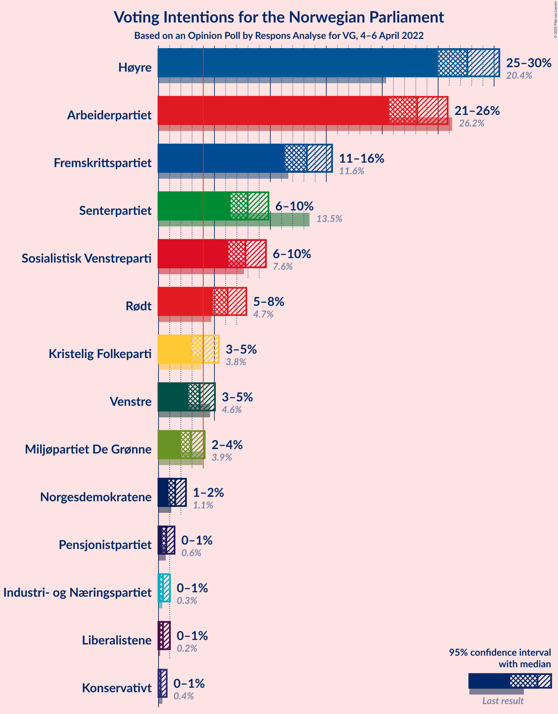

### Confidence Intervals

| Party | Last Result | Poll Result | 80% Confidence Interval | 90% Confidence Interval | 95% Confidence Interval | 99% Confidence Interval |
|:-----:|:-----------:|:-----------:|:-----------------------:|:-----------------------:|:-----------------------:|:-----------------------:|
| Høyre | 20.4% | 27.6% | 25.8–29.5% |25.4–30.0% |24.9–30.5% |24.1–31.4% |
| Arbeiderpartiet | 26.2% | 23.1% | 21.5–24.9% |21.0–25.4% |20.6–25.8% |19.9–26.7% |
| Fremskrittspartiet | 11.6% | 13.3% | 12.0–14.7% |11.6–15.2% |11.3–15.5% |10.7–16.2% |
| Senterpartiet | 13.5% | 8.0% | 7.0–9.2% |6.7–9.5% |6.4–9.8% |6.0–10.4% |
| Sosialistisk Venstreparti | 7.6% | 7.8% | 6.8–9.0% |6.5–9.3% |6.3–9.6% |5.8–10.2% |
| Rødt | 4.7% | 6.2% | 5.3–7.3% |5.1–7.6% |4.8–7.8% |4.5–8.4% |
| Kristelig Folkeparti | 3.8% | 4.0% | 3.3–4.9% |3.1–5.2% |2.9–5.4% |2.6–5.9% |
| Venstre | 4.6% | 3.7% | 3.0–4.6% |2.8–4.8% |2.7–5.0% |2.4–5.5% |
| Miljøpartiet De Grønne | 3.9% | 2.9% | 2.3–3.7% |2.1–3.9% |2.0–4.1% |1.8–4.5% |
| Norgesdemokratene | 1.1% | 1.5% | 1.1–2.1% |1.0–2.3% |0.9–2.5% |0.7–2.8% |
| Pensjonistpartiet | 0.6% | 0.7% | 0.5–1.2% |0.4–1.3% |0.3–1.4% |0.2–1.7% |
| Liberalistene | 0.2% | 0.4% | 0.2–0.8% |0.2–0.9% |0.2–1.0% |0.1–1.2% |
| Industri- og Næringspartiet | 0.3% | 0.4% | 0.2–0.8% |0.2–0.9% |0.2–1.0% |0.1–1.2% |
| Konservativt | 0.4% | 0.2% | 0.1–0.5% |0.1–0.6% |0.1–0.7% |0.0–0.9% |

*Note:* The poll result column reflects the actual value used in the calculations. Published results may vary slightly, and in addition be rounded to fewer digits.

## Seats

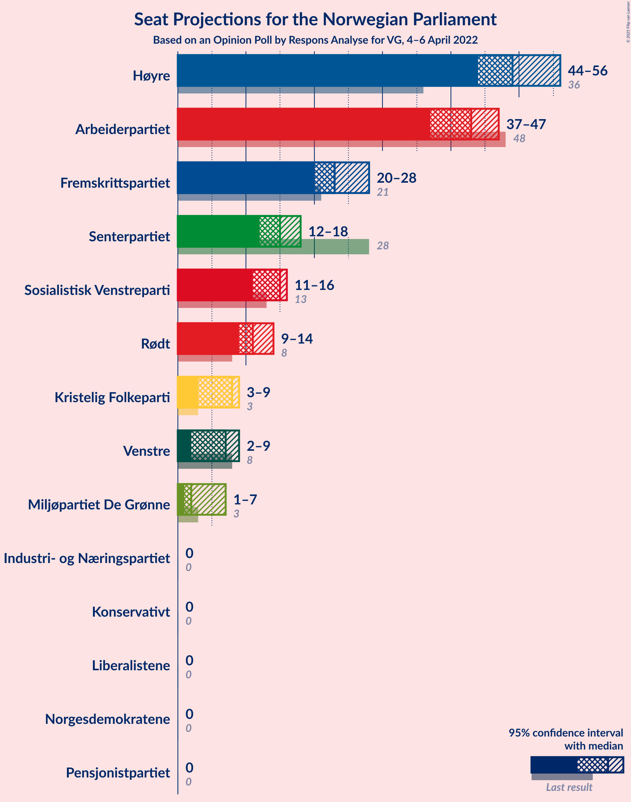

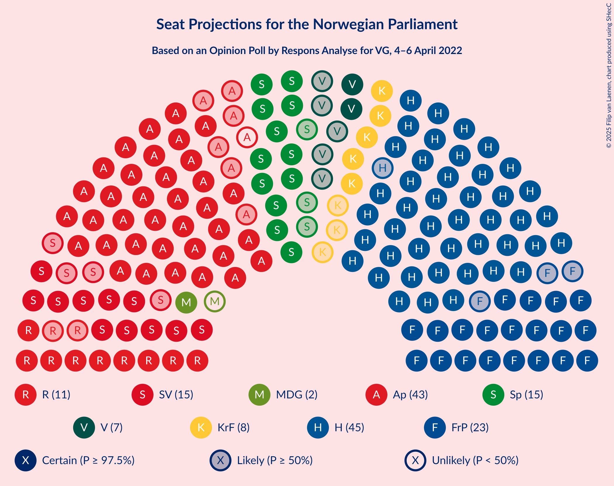

### Confidence Intervals

| Party | Last Result | Median | 80% Confidence Interval | 90% Confidence Interval | 95% Confidence Interval | 99% Confidence Interval |
|:-----:|:-----------:|:------:|:-----------------------:|:-----------------------:|:-----------------------:|:-----------------------:|
| <a href="#høyre">Høyre</a> | 36 | 49 | 44–56 |44–56 |44–56 |44–56 |
| <a href="#arbeiderpartiet">Arbeiderpartiet</a> | 48 | 43 | 37–46 |37–46 |37–47 |37–50 |
| <a href="#fremskrittspartiet">Fremskrittspartiet</a> | 21 | 23 | 21–26 |21–27 |20–28 |18–28 |
| <a href="#senterpartiet">Senterpartiet</a> | 28 | 15 | 12–16 |12–17 |12–18 |11–19 |
| <a href="#sosialistisk-venstreparti">Sosialistisk Venstreparti</a> | 13 | 15 | 12–16 |11–16 |11–16 |10–18 |
| <a href="#rødt">Rødt</a> | 8 | 11 | 9–13 |9–14 |9–14 |8–16 |
| <a href="#kristelig-folkeparti">Kristelig Folkeparti</a> | 3 | 8 | 3–9 |3–9 |3–9 |2–11 |
| <a href="#venstre">Venstre</a> | 8 | 7 | 2–8 |2–9 |2–9 |2–9 |
| <a href="#miljøpartiet-de-grønne">Miljøpartiet De Grønne</a> | 3 | 2 | 1–3 |1–3 |1–7 |0–9 |
| <a href="#norgesdemokratene">Norgesdemokratene</a> | 0 | 0 | 0 |0 |0 |0 |
| <a href="#pensjonistpartiet">Pensjonistpartiet</a> | 0 | 0 | 0 |0 |0 |0 |
| <a href="#liberalistene">Liberalistene</a> | 0 | 0 | 0 |0 |0 |0 |
| <a href="#industri--og-næringspartiet">Industri- og Næringspartiet</a> | 0 | 0 | 0 |0 |0 |0 |
| <a href="#konservativt">Konservativt</a> | 0 | 0 | 0 |0 |0 |0 |

### Høyre

*For a full overview of the results for this party, see the [Høyre](party-høyre.html) page.*

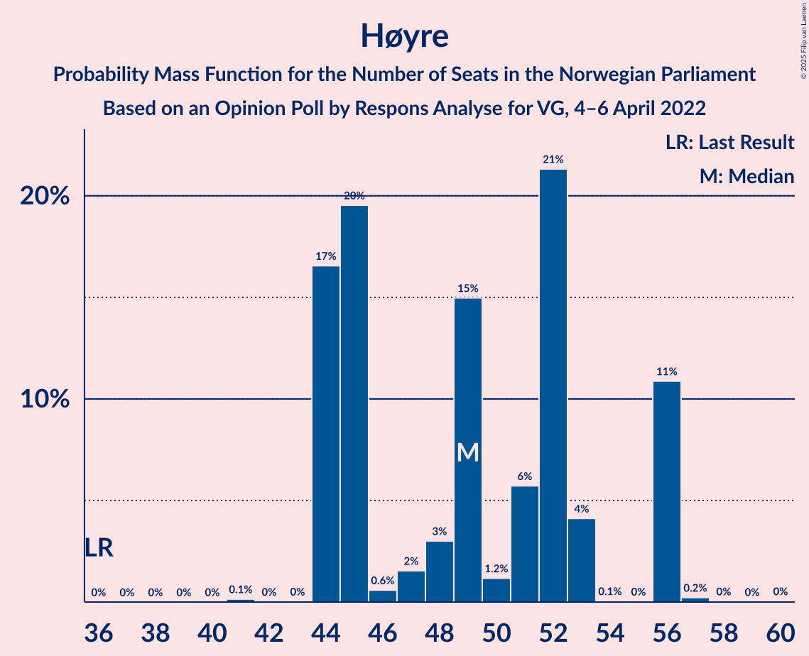

| Number of Seats | Probability | Accumulated | Special Marks |
|:---------------:|:-----------:|:-----------:|:-------------:|
| 36 | 0% | 100% | Last Result |
| 37 | 0% | 100% |  |
| 38 | 0% | 100% |  |
| 39 | 0% | 100% |  |
| 40 | 0% | 100% |  |
| 41 | 0.1% | 100% |  |
| 42 | 0% | 99.9% |  |
| 43 | 0% | 99.8% |  |
| 44 | 17% | 99.8% |  |
| 45 | 20% | 83% |  |
| 46 | 0.6% | 64% |  |
| 47 | 2% | 63% |  |
| 48 | 3% | 62% |  |
| 49 | 15% | 59% | Median |
| 50 | 1.2% | 44% |  |
| 51 | 6% | 42% |  |
| 52 | 21% | 37% |  |
| 53 | 4% | 15% |  |
| 54 | 0.1% | 11% |  |
| 55 | 0% | 11% |  |
| 56 | 11% | 11% |  |
| 57 | 0.2% | 0.3% |  |
| 58 | 0% | 0.1% |  |
| 59 | 0% | 0.1% |  |
| 60 | 0% | 0% |  |

### Arbeiderpartiet

*For a full overview of the results for this party, see the [Arbeiderpartiet](party-arbeiderpartiet.html) page.*

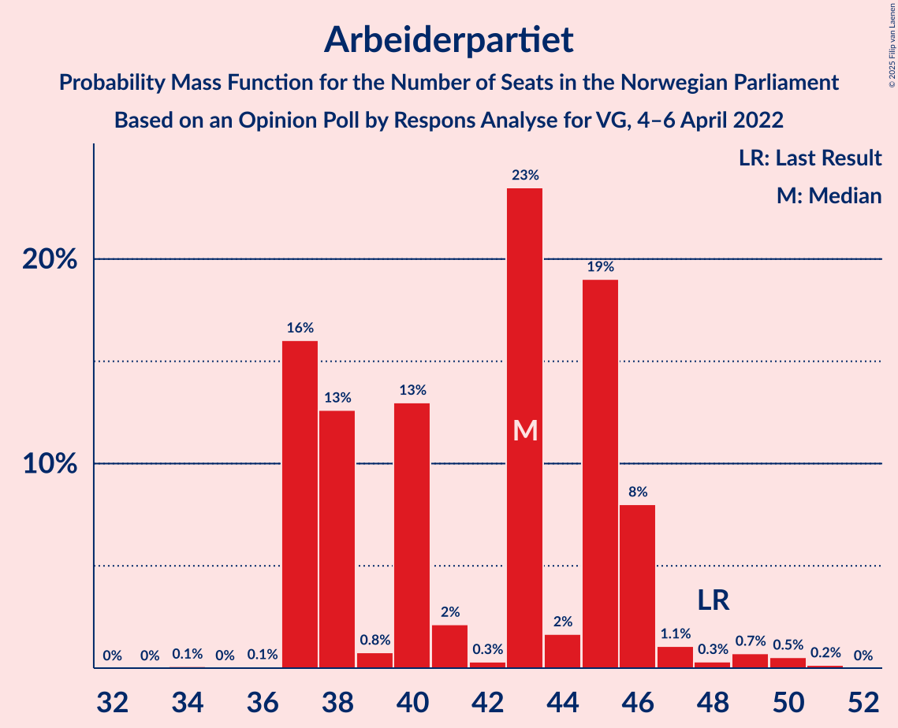

| Number of Seats | Probability | Accumulated | Special Marks |
|:---------------:|:-----------:|:-----------:|:-------------:|
| 34 | 0.1% | 100% |  |
| 35 | 0% | 99.9% |  |
| 36 | 0.1% | 99.9% |  |
| 37 | 16% | 99.8% |  |
| 38 | 13% | 84% |  |
| 39 | 0.8% | 71% |  |
| 40 | 13% | 70% |  |
| 41 | 2% | 57% |  |
| 42 | 0.3% | 55% |  |
| 43 | 23% | 55% | Median |
| 44 | 2% | 31% |  |
| 45 | 19% | 30% |  |
| 46 | 8% | 11% |  |
| 47 | 1.1% | 3% |  |
| 48 | 0.3% | 2% | Last Result |
| 49 | 0.7% | 1.4% |  |
| 50 | 0.5% | 0.7% |  |
| 51 | 0.2% | 0.2% |  |
| 52 | 0% | 0% |  |

### Fremskrittspartiet

*For a full overview of the results for this party, see the [Fremskrittspartiet](party-fremskrittspartiet.html) page.*

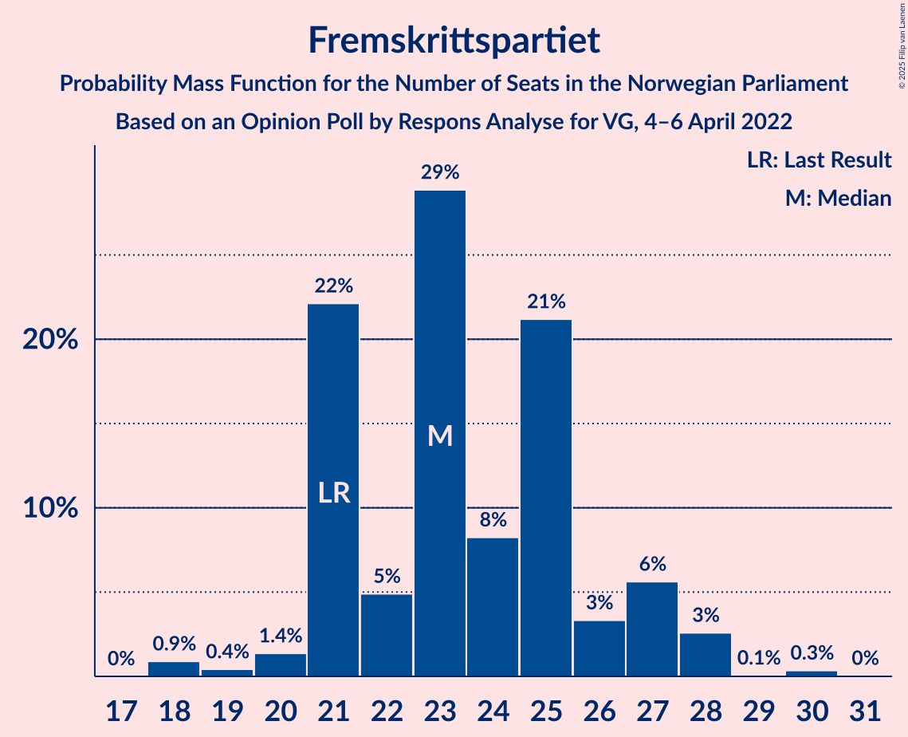

| Number of Seats | Probability | Accumulated | Special Marks |
|:---------------:|:-----------:|:-----------:|:-------------:|
| 18 | 0.9% | 100% |  |
| 19 | 0.4% | 99.1% |  |
| 20 | 1.4% | 98.7% |  |
| 21 | 22% | 97% | Last Result |
| 22 | 5% | 75% |  |
| 23 | 29% | 70% | Median |
| 24 | 8% | 41% |  |
| 25 | 21% | 33% |  |
| 26 | 3% | 12% |  |
| 27 | 6% | 9% |  |
| 28 | 3% | 3% |  |
| 29 | 0.1% | 0.4% |  |
| 30 | 0.3% | 0.4% |  |
| 31 | 0% | 0% |  |

### Senterpartiet

*For a full overview of the results for this party, see the [Senterpartiet](party-senterpartiet.html) page.*

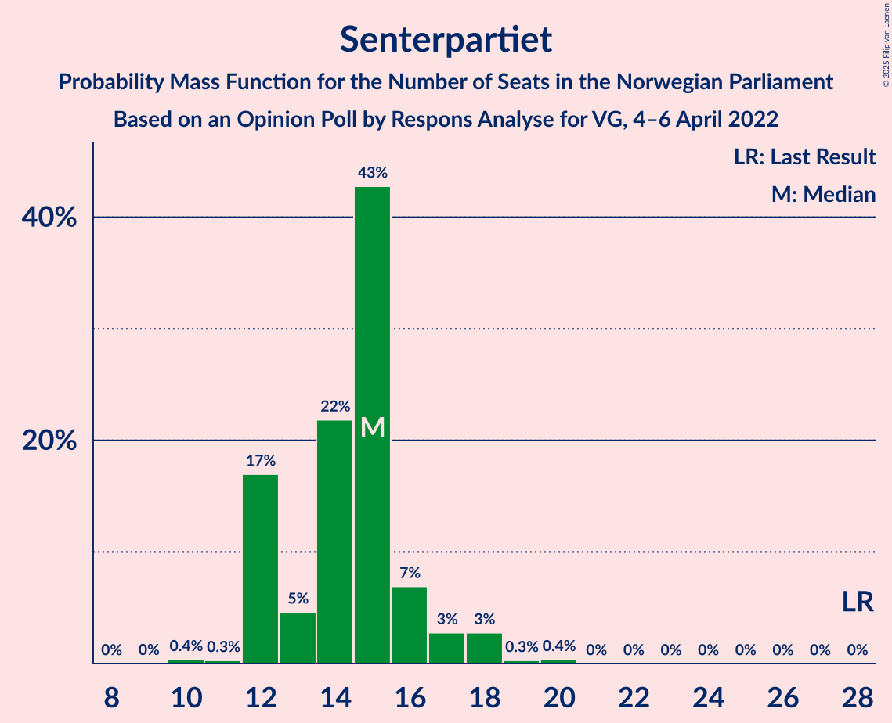

| Number of Seats | Probability | Accumulated | Special Marks |
|:---------------:|:-----------:|:-----------:|:-------------:|
| 10 | 0.4% | 100% |  |
| 11 | 0.3% | 99.6% |  |
| 12 | 17% | 99.3% |  |
| 13 | 5% | 82% |  |
| 14 | 22% | 78% |  |
| 15 | 43% | 56% | Median |
| 16 | 7% | 13% |  |
| 17 | 3% | 6% |  |
| 18 | 3% | 3% |  |
| 19 | 0.3% | 0.7% |  |
| 20 | 0.4% | 0.4% |  |
| 21 | 0% | 0% |  |
| 22 | 0% | 0% |  |
| 23 | 0% | 0% |  |
| 24 | 0% | 0% |  |
| 25 | 0% | 0% |  |
| 26 | 0% | 0% |  |
| 27 | 0% | 0% |  |
| 28 | 0% | 0% | Last Result |

### Sosialistisk Venstreparti

*For a full overview of the results for this party, see the [Sosialistisk Venstreparti](party-sosialistiskvenstreparti.html) page.*

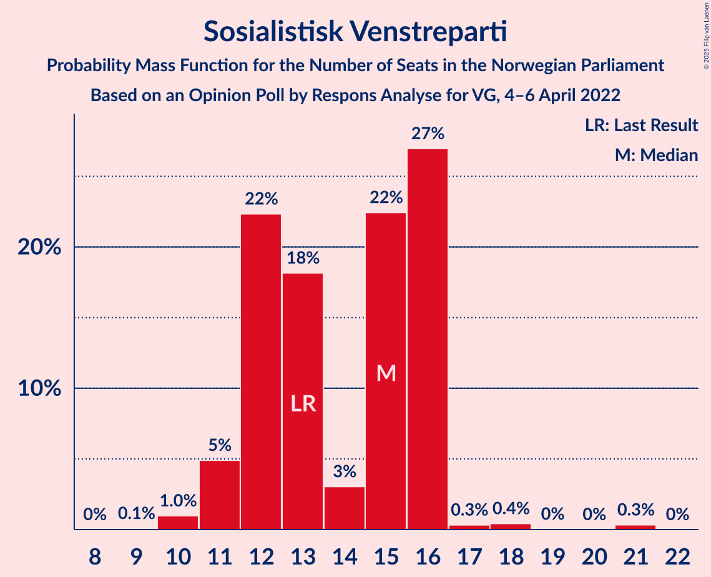

| Number of Seats | Probability | Accumulated | Special Marks |
|:---------------:|:-----------:|:-----------:|:-------------:|
| 9 | 0.1% | 100% |  |
| 10 | 1.0% | 99.9% |  |
| 11 | 5% | 98.9% |  |
| 12 | 22% | 94% |  |
| 13 | 18% | 72% | Last Result |
| 14 | 3% | 54% |  |
| 15 | 22% | 51% | Median |
| 16 | 27% | 28% |  |
| 17 | 0.3% | 1.1% |  |
| 18 | 0.4% | 0.8% |  |
| 19 | 0% | 0.4% |  |
| 20 | 0% | 0.3% |  |
| 21 | 0.3% | 0.3% |  |
| 22 | 0% | 0% |  |

### Rødt

*For a full overview of the results for this party, see the [Rødt](party-rødt.html) page.*

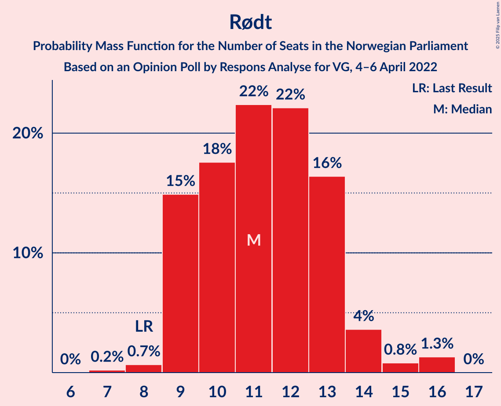

| Number of Seats | Probability | Accumulated | Special Marks |
|:---------------:|:-----------:|:-----------:|:-------------:|
| 7 | 0.2% | 100% |  |
| 8 | 0.7% | 99.8% | Last Result |
| 9 | 15% | 99.1% |  |
| 10 | 18% | 84% |  |
| 11 | 22% | 67% | Median |
| 12 | 22% | 44% |  |
| 13 | 16% | 22% |  |
| 14 | 4% | 6% |  |
| 15 | 0.8% | 2% |  |
| 16 | 1.3% | 1.3% |  |
| 17 | 0% | 0% |  |

### Kristelig Folkeparti

*For a full overview of the results for this party, see the [Kristelig Folkeparti](party-kristeligfolkeparti.html) page.*

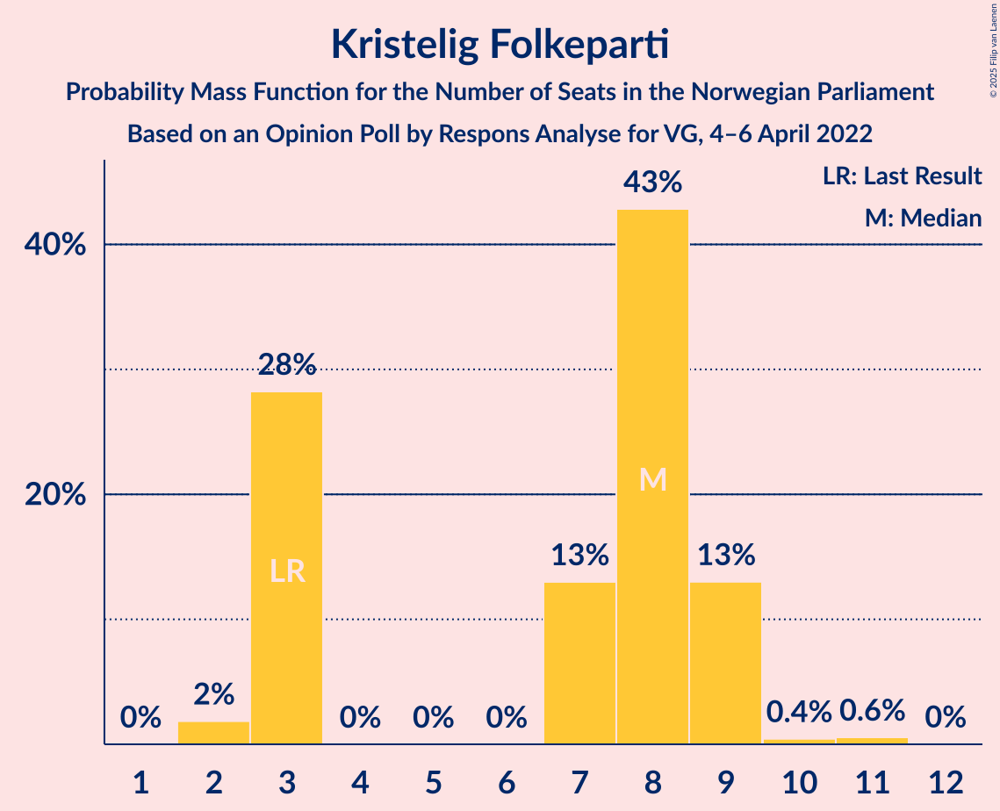

| Number of Seats | Probability | Accumulated | Special Marks |
|:---------------:|:-----------:|:-----------:|:-------------:|
| 2 | 2% | 100% |  |
| 3 | 28% | 98% | Last Result |
| 4 | 0% | 70% |  |
| 5 | 0% | 70% |  |
| 6 | 0% | 70% |  |
| 7 | 13% | 70% |  |
| 8 | 43% | 57% | Median |
| 9 | 13% | 14% |  |
| 10 | 0.4% | 1.0% |  |
| 11 | 0.6% | 0.6% |  |
| 12 | 0% | 0% |  |

### Venstre

*For a full overview of the results for this party, see the [Venstre](party-venstre.html) page.*

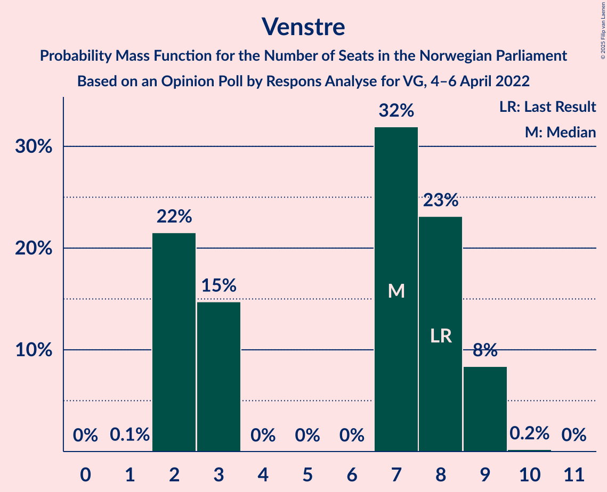

| Number of Seats | Probability | Accumulated | Special Marks |
|:---------------:|:-----------:|:-----------:|:-------------:|
| 1 | 0.1% | 100% |  |
| 2 | 22% | 99.9% |  |
| 3 | 15% | 78% |  |
| 4 | 0% | 64% |  |
| 5 | 0% | 64% |  |
| 6 | 0% | 64% |  |
| 7 | 32% | 64% | Median |
| 8 | 23% | 32% | Last Result |
| 9 | 8% | 9% |  |
| 10 | 0.2% | 0.2% |  |
| 11 | 0% | 0% |  |

### Miljøpartiet De Grønne

*For a full overview of the results for this party, see the [Miljøpartiet De Grønne](party-miljøpartietdegrønne.html) page.*

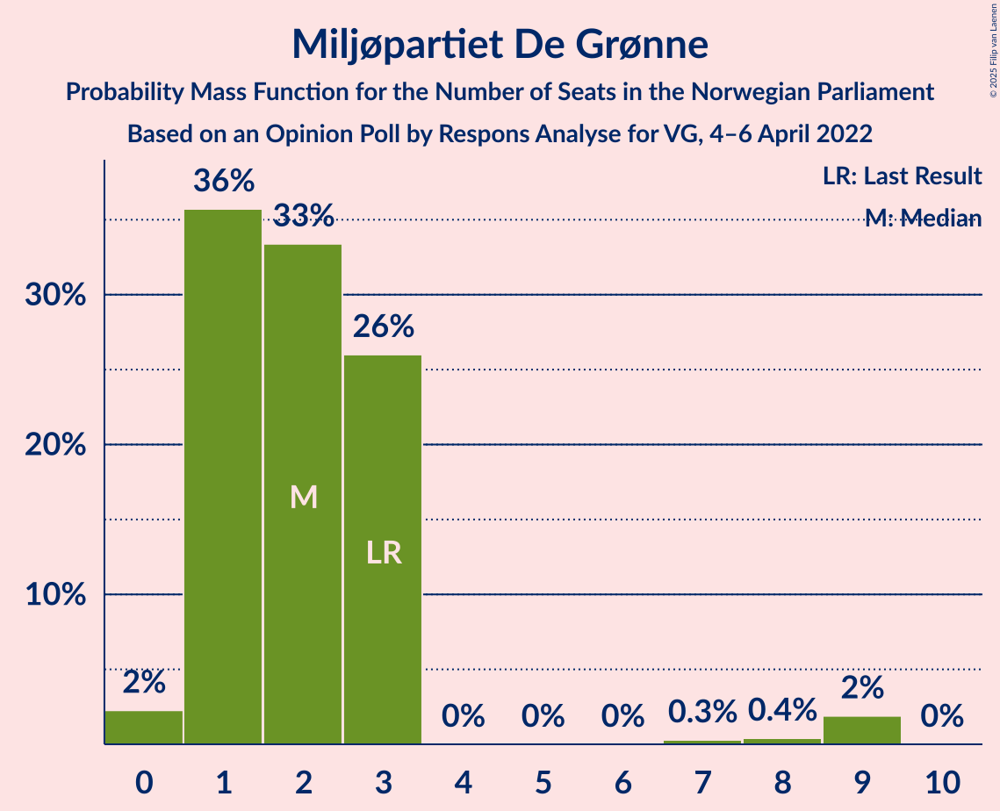

| Number of Seats | Probability | Accumulated | Special Marks |
|:---------------:|:-----------:|:-----------:|:-------------:|
| 0 | 2% | 100% |  |
| 1 | 36% | 98% |  |
| 2 | 33% | 62% | Median |
| 3 | 26% | 29% | Last Result |
| 4 | 0% | 3% |  |
| 5 | 0% | 3% |  |
| 6 | 0% | 3% |  |
| 7 | 0.3% | 3% |  |
| 8 | 0.4% | 2% |  |
| 9 | 2% | 2% |  |
| 10 | 0% | 0% |  |

### Norgesdemokratene

*For a full overview of the results for this party, see the [Norgesdemokratene](party-norgesdemokratene.html) page.*

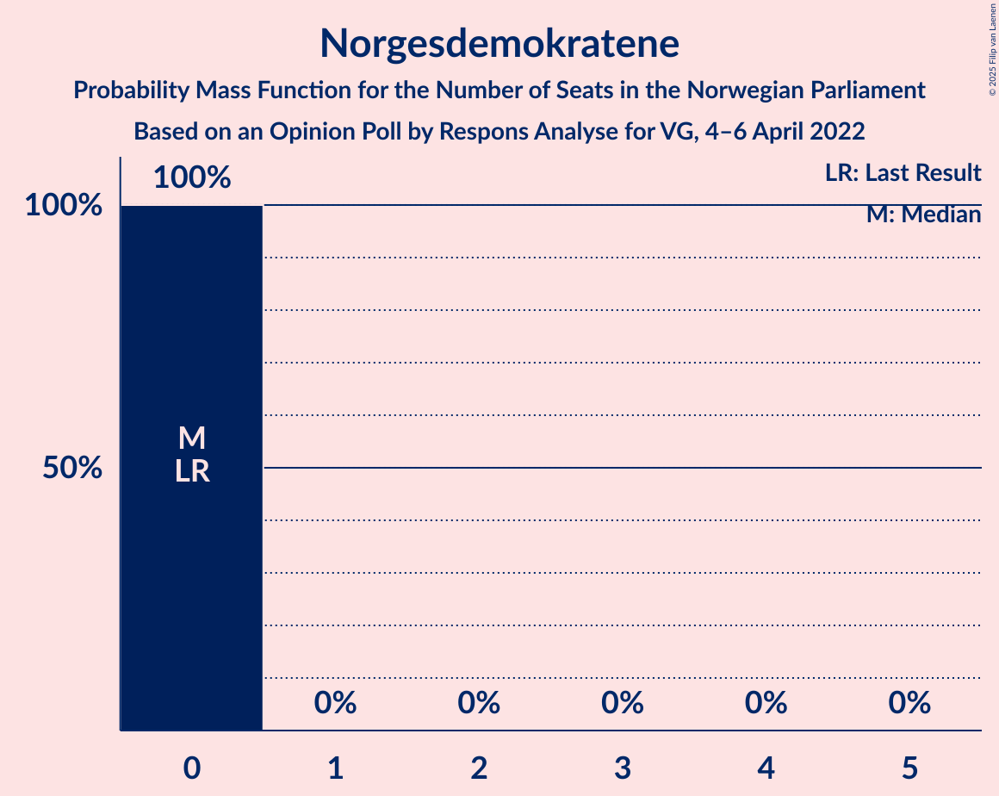

| Number of Seats | Probability | Accumulated | Special Marks |
|:---------------:|:-----------:|:-----------:|:-------------:|
| 0 | 100% | 100% | Last Result, Median |

### Pensjonistpartiet

*For a full overview of the results for this party, see the [Pensjonistpartiet](party-pensjonistpartiet.html) page.*

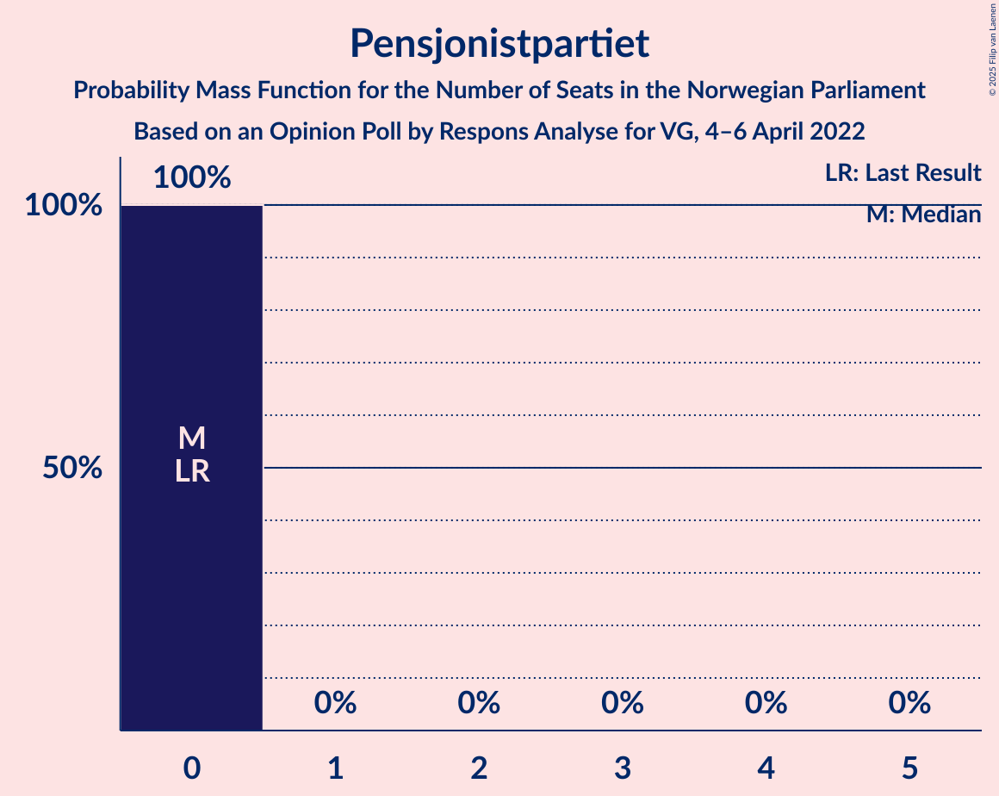

| Number of Seats | Probability | Accumulated | Special Marks |
|:---------------:|:-----------:|:-----------:|:-------------:|
| 0 | 100% | 100% | Last Result, Median |

### Liberalistene

*For a full overview of the results for this party, see the [Liberalistene](party-liberalistene.html) page.*

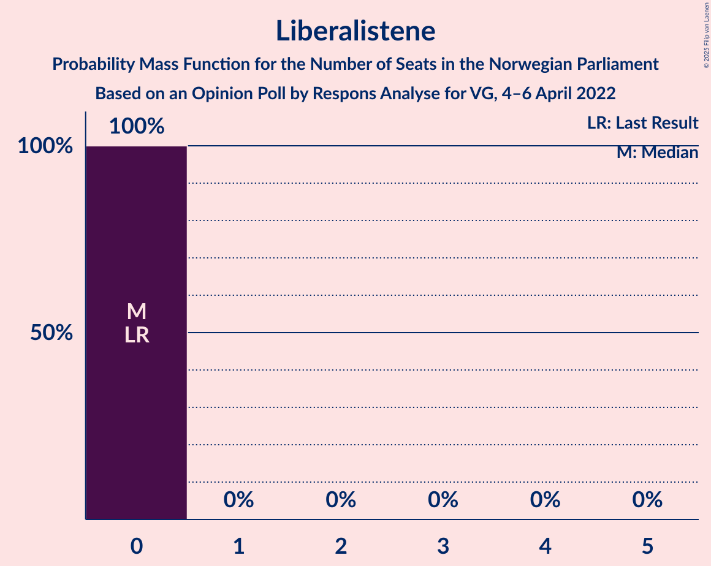

| Number of Seats | Probability | Accumulated | Special Marks |
|:---------------:|:-----------:|:-----------:|:-------------:|
| 0 | 100% | 100% | Last Result, Median |

### Industri- og Næringspartiet

*For a full overview of the results for this party, see the [Industri- og Næringspartiet](party-industri-ognæringspartiet.html) page.*

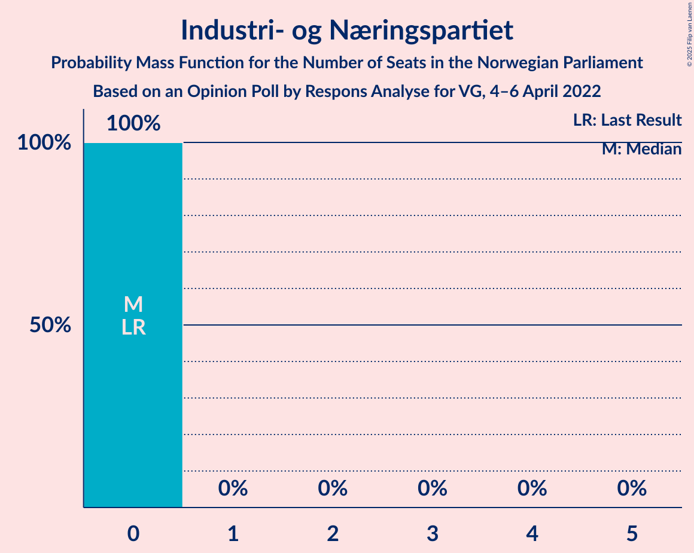

| Number of Seats | Probability | Accumulated | Special Marks |
|:---------------:|:-----------:|:-----------:|:-------------:|
| 0 | 100% | 100% | Last Result, Median |

### Konservativt

*For a full overview of the results for this party, see the [Konservativt](party-konservativt.html) page.*

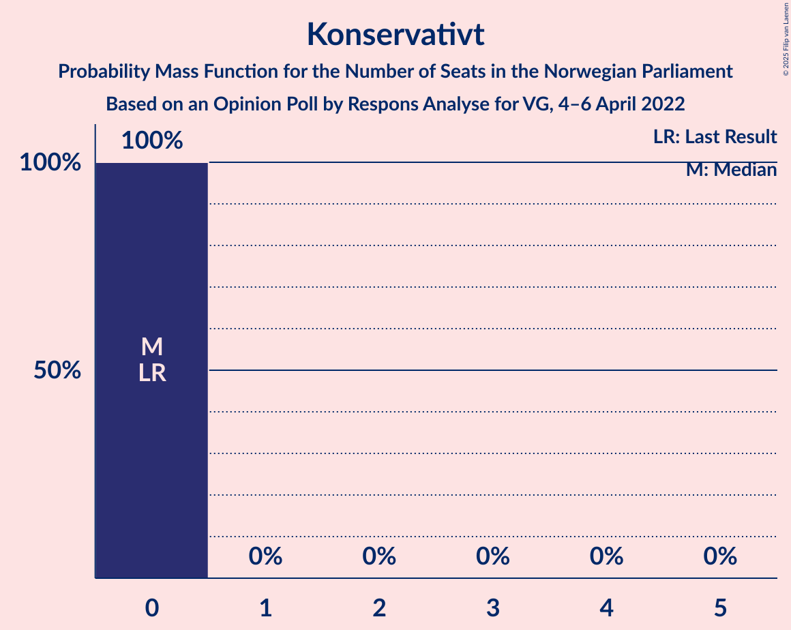

| Number of Seats | Probability | Accumulated | Special Marks |
|:---------------:|:-----------:|:-----------:|:-------------:|
| 0 | 100% | 100% | Last Result, Median |

## Coalitions

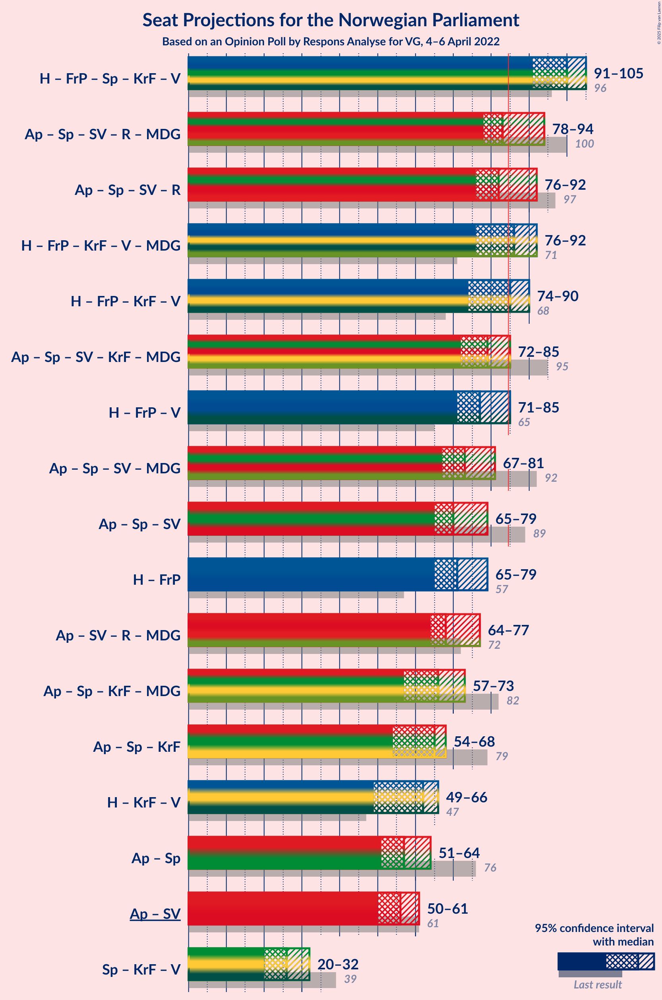

### Confidence Intervals

| Coalition | Last Result | Median | Majority? | 80% Confidence Interval | 90% Confidence Interval | 95% Confidence Interval | 99% Confidence Interval |
|:---------:|:-----------:|:------:|:---------:|:-----------------------:|:-----------------------:|:-----------------------:|:-----------------------:|
| Høyre – Fremskrittspartiet – Senterpartiet – Kristelig Folkeparti – Venstre | 96 | 100 | 100% | 95–102 | 92–103 | 91–105 | 90–105 |
| Arbeiderpartiet – Senterpartiet – Sosialistisk Venstreparti – Rødt – Miljøpartiet De Grønne | 100 | 83 | 37% | 79–88 | 79–93 | 78–94 | 77–94 |
| Arbeiderpartiet – Senterpartiet – Sosialistisk Venstreparti – Rødt | 97 | 82 | 15% | 77–86 | 77–88 | 76–92 | 76–92 |
| Høyre – Fremskrittspartiet – Kristelig Folkeparti – Venstre – Miljøpartiet De Grønne | 71 | 86 | 83% | 82–91 | 80–91 | 76–92 | 76–92 |
| Høyre – Fremskrittspartiet – Kristelig Folkeparti – Venstre | 68 | 85 | 59% | 80–89 | 75–89 | 74–90 | 74–91 |
| Arbeiderpartiet – Senterpartiet – Sosialistisk Venstreparti – Kristelig Folkeparti – Miljøpartiet De Grønne | 95 | 79 | 3% | 73–83 | 73–84 | 72–85 | 72–89 |
| Høyre – Fremskrittspartiet – Venstre | 65 | 77 | 17% | 72–85 | 72–85 | 71–85 | 67–86 |
| Arbeiderpartiet – Senterpartiet – Sosialistisk Venstreparti – Miljøpartiet De Grønne | 92 | 73 | 0% | 67–75 | 67–81 | 67–81 | 64–82 |
| Arbeiderpartiet – Senterpartiet – Sosialistisk Venstreparti | 89 | 70 | 0% | 65–73 | 65–75 | 65–79 | 62–79 |
| Høyre – Fremskrittspartiet | 57 | 71 | 0% | 68–79 | 65–79 | 65–79 | 65–80 |
| Arbeiderpartiet – Sosialistisk Venstreparti – Rødt – Miljøpartiet De Grønne | 72 | 68 | 0% | 66–73 | 65–76 | 64–77 | 64–78 |
| Arbeiderpartiet – Senterpartiet – Kristelig Folkeparti – Miljøpartiet De Grønne | 82 | 66 | 0% | 57–70 | 57–70 | 57–73 | 57–77 |
| Arbeiderpartiet – Senterpartiet – Kristelig Folkeparti | 79 | 65 | 0% | 54–68 | 54–68 | 54–68 | 54–75 |
| Høyre – Kristelig Folkeparti – Venstre | 47 | 62 | 0% | 56–66 | 54–66 | 49–66 | 49–66 |
| Arbeiderpartiet – Senterpartiet | 76 | 57 | 0% | 51–61 | 51–62 | 51–64 | 51–66 |
| Arbeiderpartiet – Sosialistisk Venstreparti | 61 | 56 | 0% | 53–59 | 50–61 | 50–61 | 49–62 |
| Senterpartiet – Kristelig Folkeparti – Venstre | 39 | 26 | 0% | 22–31 | 21–32 | 20–32 | 17–32 |

### Høyre – Fremskrittspartiet – Senterpartiet – Kristelig Folkeparti – Venstre

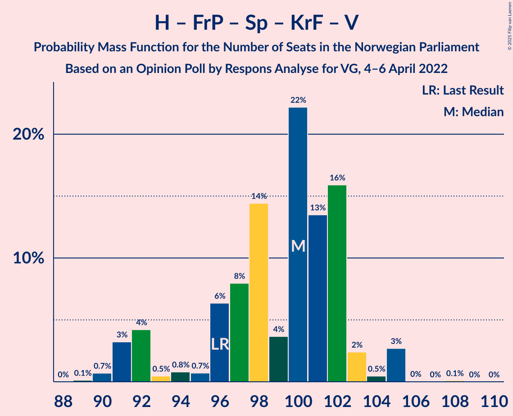

| Number of Seats | Probability | Accumulated | Special Marks |
|:---------------:|:-----------:|:-----------:|:-------------:|
| 89 | 0.1% | 100% |  |
| 90 | 0.7% | 99.8% |  |
| 91 | 3% | 99.1% |  |
| 92 | 4% | 96% |  |
| 93 | 0.5% | 92% |  |
| 94 | 0.8% | 91% |  |
| 95 | 0.7% | 90% |  |
| 96 | 6% | 90% | Last Result |
| 97 | 8% | 83% |  |
| 98 | 14% | 75% |  |
| 99 | 4% | 61% |  |
| 100 | 22% | 57% |  |
| 101 | 13% | 35% |  |
| 102 | 16% | 22% | Median |
| 103 | 2% | 6% |  |
| 104 | 0.5% | 3% |  |
| 105 | 3% | 3% |  |
| 106 | 0% | 0.2% |  |
| 107 | 0% | 0.1% |  |
| 108 | 0.1% | 0.1% |  |
| 109 | 0% | 0% |  |

### Arbeiderpartiet – Senterpartiet – Sosialistisk Venstreparti – Rødt – Miljøpartiet De Grønne

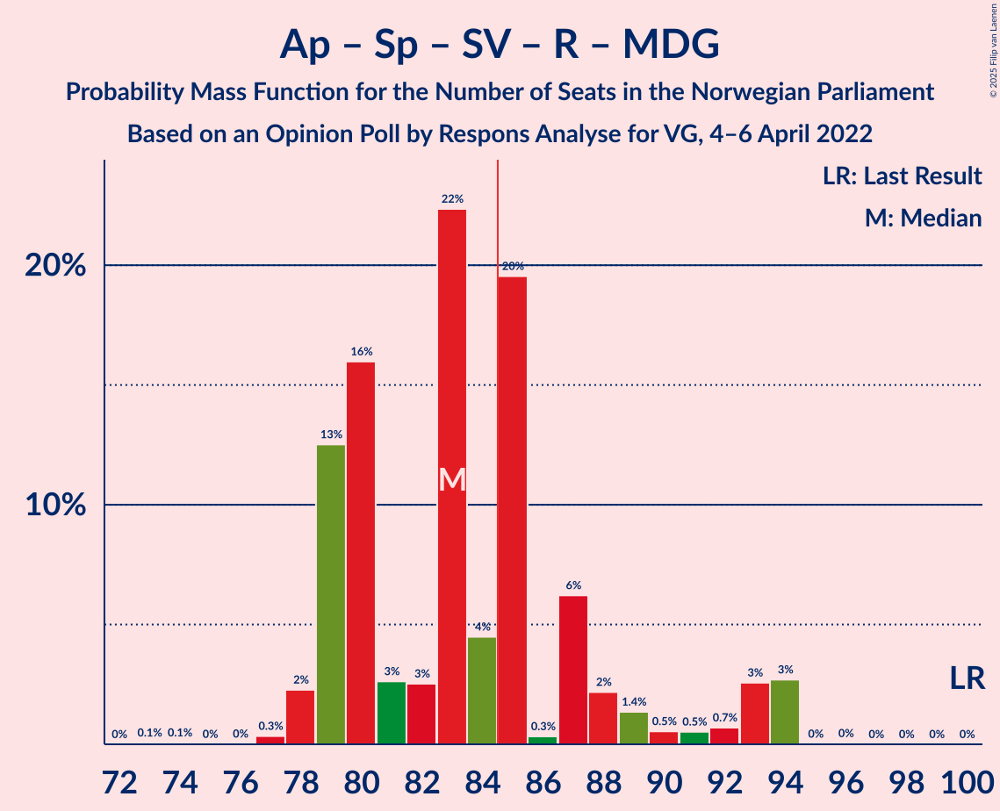

| Number of Seats | Probability | Accumulated | Special Marks |
|:---------------:|:-----------:|:-----------:|:-------------:|
| 73 | 0.1% | 100% |  |
| 74 | 0.1% | 99.9% |  |
| 75 | 0% | 99.9% |  |
| 76 | 0% | 99.9% |  |
| 77 | 0.3% | 99.8% |  |
| 78 | 2% | 99.5% |  |
| 79 | 13% | 97% |  |
| 80 | 16% | 85% |  |
| 81 | 3% | 69% |  |
| 82 | 3% | 66% |  |
| 83 | 22% | 64% |  |
| 84 | 4% | 41% |  |
| 85 | 20% | 37% | Majority |
| 86 | 0.3% | 17% | Median |
| 87 | 6% | 17% |  |
| 88 | 2% | 11% |  |
| 89 | 1.4% | 8% |  |
| 90 | 0.5% | 7% |  |
| 91 | 0.5% | 7% |  |
| 92 | 0.7% | 6% |  |
| 93 | 3% | 5% |  |
| 94 | 3% | 3% |  |
| 95 | 0% | 0.1% |  |
| 96 | 0% | 0% |  |
| 97 | 0% | 0% |  |
| 98 | 0% | 0% |  |
| 99 | 0% | 0% |  |
| 100 | 0% | 0% | Last Result |

### Arbeiderpartiet – Senterpartiet – Sosialistisk Venstreparti – Rødt

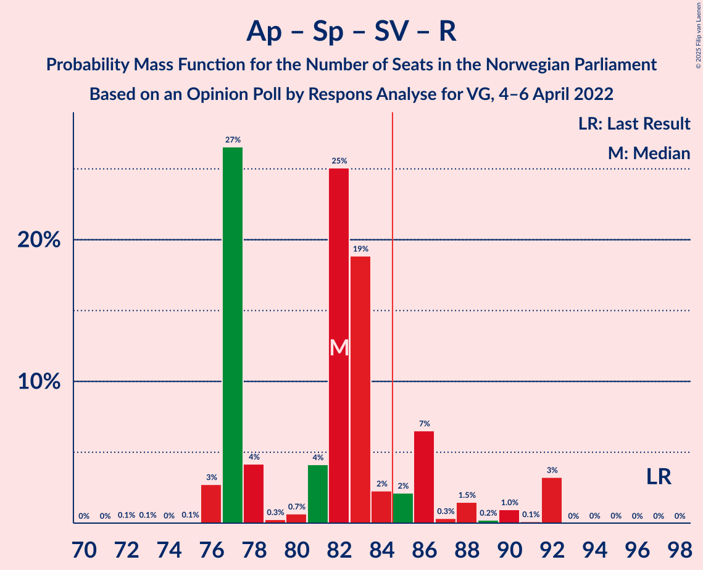

| Number of Seats | Probability | Accumulated | Special Marks |
|:---------------:|:-----------:|:-----------:|:-------------:|
| 72 | 0.1% | 100% |  |
| 73 | 0.1% | 99.9% |  |
| 74 | 0% | 99.9% |  |
| 75 | 0.1% | 99.8% |  |
| 76 | 3% | 99.7% |  |
| 77 | 27% | 97% |  |
| 78 | 4% | 70% |  |
| 79 | 0.3% | 66% |  |
| 80 | 0.7% | 66% |  |
| 81 | 4% | 65% |  |
| 82 | 25% | 61% |  |
| 83 | 19% | 36% |  |
| 84 | 2% | 17% | Median |
| 85 | 2% | 15% | Majority |
| 86 | 7% | 13% |  |
| 87 | 0.3% | 6% |  |
| 88 | 1.5% | 6% |  |
| 89 | 0.2% | 5% |  |
| 90 | 1.0% | 4% |  |
| 91 | 0.1% | 3% |  |
| 92 | 3% | 3% |  |
| 93 | 0% | 0% |  |
| 94 | 0% | 0% |  |
| 95 | 0% | 0% |  |
| 96 | 0% | 0% |  |
| 97 | 0% | 0% | Last Result |

### Høyre – Fremskrittspartiet – Kristelig Folkeparti – Venstre – Miljøpartiet De Grønne

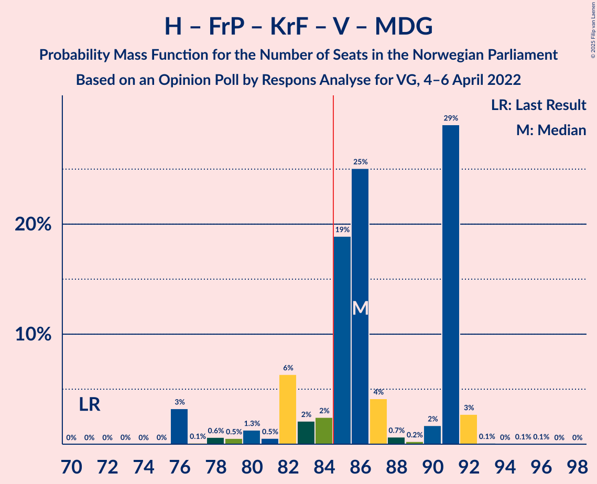

| Number of Seats | Probability | Accumulated | Special Marks |
|:---------------:|:-----------:|:-----------:|:-------------:|
| 71 | 0% | 100% | Last Result |
| 72 | 0% | 100% |  |
| 73 | 0% | 100% |  |
| 74 | 0% | 100% |  |
| 75 | 0% | 100% |  |
| 76 | 3% | 100% |  |
| 77 | 0.1% | 97% |  |
| 78 | 0.6% | 97% |  |
| 79 | 0.5% | 96% |  |
| 80 | 1.3% | 95% |  |
| 81 | 0.5% | 94% |  |
| 82 | 6% | 94% |  |
| 83 | 2% | 87% |  |
| 84 | 2% | 85% |  |
| 85 | 19% | 83% | Majority |
| 86 | 25% | 64% |  |
| 87 | 4% | 39% |  |
| 88 | 0.7% | 35% |  |
| 89 | 0.2% | 34% | Median |
| 90 | 2% | 34% |  |
| 91 | 29% | 32% |  |
| 92 | 3% | 3% |  |
| 93 | 0.1% | 0.3% |  |
| 94 | 0% | 0.2% |  |
| 95 | 0.1% | 0.1% |  |
| 96 | 0.1% | 0.1% |  |
| 97 | 0% | 0% |  |

### Høyre – Fremskrittspartiet – Kristelig Folkeparti – Venstre

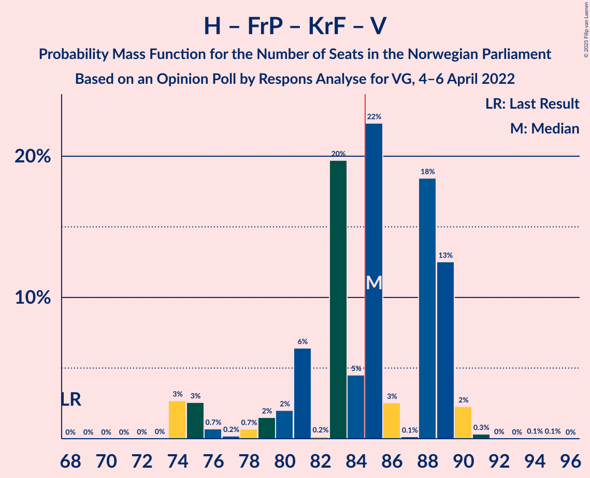

| Number of Seats | Probability | Accumulated | Special Marks |
|:---------------:|:-----------:|:-----------:|:-------------:|
| 68 | 0% | 100% | Last Result |
| 69 | 0% | 100% |  |
| 70 | 0% | 100% |  |
| 71 | 0% | 100% |  |
| 72 | 0% | 100% |  |
| 73 | 0% | 100% |  |
| 74 | 3% | 99.9% |  |
| 75 | 3% | 97% |  |
| 76 | 0.7% | 95% |  |
| 77 | 0.2% | 94% |  |
| 78 | 0.7% | 94% |  |
| 79 | 2% | 93% |  |
| 80 | 2% | 92% |  |
| 81 | 6% | 90% |  |
| 82 | 0.2% | 83% |  |
| 83 | 20% | 83% |  |
| 84 | 5% | 63% |  |
| 85 | 22% | 59% | Majority |
| 86 | 3% | 36% |  |
| 87 | 0.1% | 34% | Median |
| 88 | 18% | 34% |  |
| 89 | 13% | 15% |  |
| 90 | 2% | 3% |  |
| 91 | 0.3% | 0.5% |  |
| 92 | 0% | 0.2% |  |
| 93 | 0% | 0.1% |  |
| 94 | 0.1% | 0.1% |  |
| 95 | 0.1% | 0.1% |  |
| 96 | 0% | 0% |  |

### Arbeiderpartiet – Senterpartiet – Sosialistisk Venstreparti – Kristelig Folkeparti – Miljøpartiet De Grønne

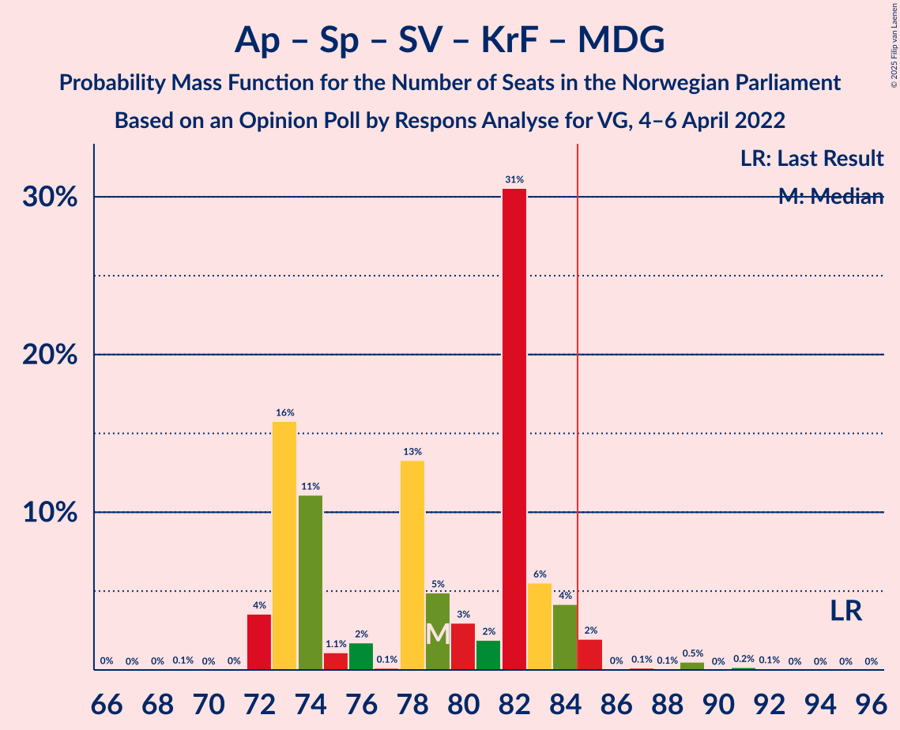

| Number of Seats | Probability | Accumulated | Special Marks |
|:---------------:|:-----------:|:-----------:|:-------------:|
| 66 | 0% | 100% |  |
| 67 | 0% | 99.9% |  |
| 68 | 0% | 99.9% |  |
| 69 | 0.1% | 99.9% |  |
| 70 | 0% | 99.8% |  |
| 71 | 0% | 99.8% |  |
| 72 | 4% | 99.8% |  |
| 73 | 16% | 96% |  |
| 74 | 11% | 80% |  |
| 75 | 1.1% | 69% |  |
| 76 | 2% | 68% |  |
| 77 | 0.1% | 66% |  |
| 78 | 13% | 66% |  |
| 79 | 5% | 53% |  |
| 80 | 3% | 48% |  |
| 81 | 2% | 45% |  |
| 82 | 31% | 43% |  |
| 83 | 6% | 13% | Median |
| 84 | 4% | 7% |  |
| 85 | 2% | 3% | Majority |
| 86 | 0% | 1.0% |  |
| 87 | 0.1% | 1.0% |  |
| 88 | 0.1% | 0.9% |  |
| 89 | 0.5% | 0.8% |  |
| 90 | 0% | 0.3% |  |
| 91 | 0.2% | 0.3% |  |
| 92 | 0.1% | 0.1% |  |
| 93 | 0% | 0% |  |
| 94 | 0% | 0% |  |
| 95 | 0% | 0% | Last Result |

### Høyre – Fremskrittspartiet – Venstre

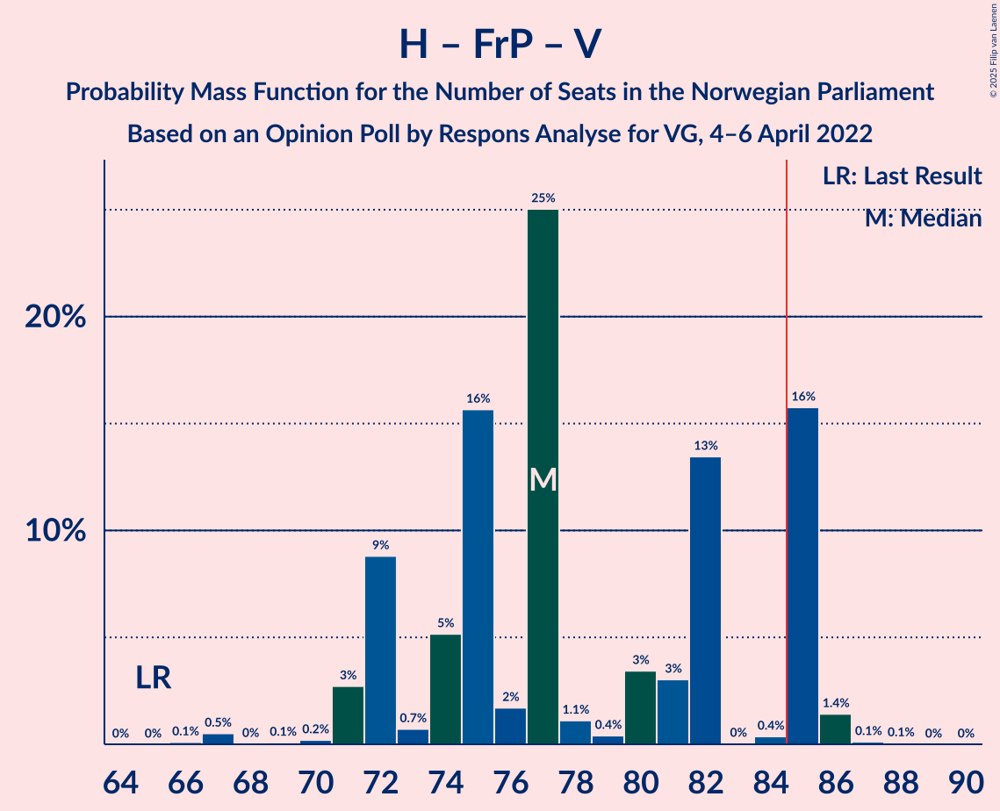

| Number of Seats | Probability | Accumulated | Special Marks |
|:---------------:|:-----------:|:-----------:|:-------------:|
| 65 | 0% | 100% | Last Result |
| 66 | 0.1% | 100% |  |
| 67 | 0.5% | 99.9% |  |
| 68 | 0% | 99.4% |  |
| 69 | 0.1% | 99.4% |  |
| 70 | 0.2% | 99.3% |  |
| 71 | 3% | 99.1% |  |
| 72 | 9% | 96% |  |
| 73 | 0.7% | 88% |  |
| 74 | 5% | 87% |  |
| 75 | 16% | 82% |  |
| 76 | 2% | 66% |  |
| 77 | 25% | 64% |  |
| 78 | 1.1% | 39% |  |
| 79 | 0.4% | 38% | Median |
| 80 | 3% | 38% |  |
| 81 | 3% | 34% |  |
| 82 | 13% | 31% |  |
| 83 | 0% | 18% |  |
| 84 | 0.4% | 18% |  |
| 85 | 16% | 17% | Majority |
| 86 | 1.4% | 2% |  |
| 87 | 0.1% | 0.2% |  |
| 88 | 0.1% | 0.1% |  |
| 89 | 0% | 0% |  |

### Arbeiderpartiet – Senterpartiet – Sosialistisk Venstreparti – Miljøpartiet De Grønne

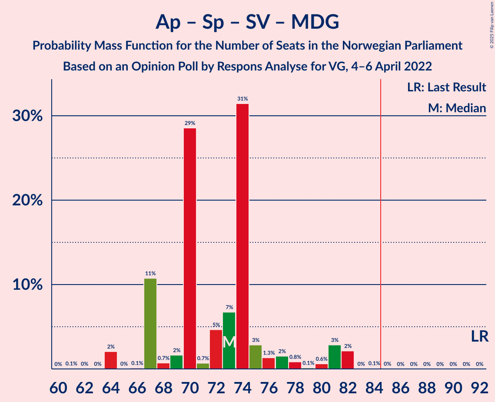

| Number of Seats | Probability | Accumulated | Special Marks |
|:---------------:|:-----------:|:-----------:|:-------------:|
| 61 | 0.1% | 100% |  |
| 62 | 0% | 99.9% |  |
| 63 | 0% | 99.9% |  |
| 64 | 2% | 99.9% |  |
| 65 | 0% | 98% |  |
| 66 | 0.1% | 98% |  |
| 67 | 11% | 98% |  |
| 68 | 0.7% | 87% |  |
| 69 | 2% | 86% |  |
| 70 | 29% | 85% |  |
| 71 | 0.7% | 56% |  |
| 72 | 5% | 55% |  |
| 73 | 7% | 51% |  |
| 74 | 31% | 44% |  |
| 75 | 3% | 12% | Median |
| 76 | 1.3% | 10% |  |
| 77 | 2% | 8% |  |
| 78 | 0.8% | 7% |  |
| 79 | 0.1% | 6% |  |
| 80 | 0.6% | 6% |  |
| 81 | 3% | 5% |  |
| 82 | 2% | 2% |  |
| 83 | 0% | 0.2% |  |
| 84 | 0.1% | 0.1% |  |
| 85 | 0% | 0% | Majority |
| 86 | 0% | 0% |  |
| 87 | 0% | 0% |  |
| 88 | 0% | 0% |  |
| 89 | 0% | 0% |  |
| 90 | 0% | 0% |  |
| 91 | 0% | 0% |  |
| 92 | 0% | 0% | Last Result |

### Arbeiderpartiet – Senterpartiet – Sosialistisk Venstreparti

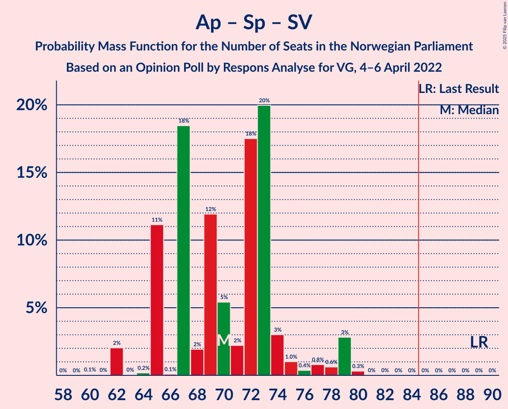

| Number of Seats | Probability | Accumulated | Special Marks |
|:---------------:|:-----------:|:-----------:|:-------------:|
| 60 | 0.1% | 100% |  |
| 61 | 0% | 99.9% |  |
| 62 | 2% | 99.9% |  |
| 63 | 0% | 98% |  |
| 64 | 0.2% | 98% |  |
| 65 | 11% | 98% |  |
| 66 | 0.1% | 86% |  |
| 67 | 18% | 86% |  |
| 68 | 2% | 68% |  |
| 69 | 12% | 66% |  |
| 70 | 5% | 54% |  |
| 71 | 2% | 49% |  |
| 72 | 18% | 46% |  |
| 73 | 20% | 29% | Median |
| 74 | 3% | 9% |  |
| 75 | 1.0% | 6% |  |
| 76 | 0.4% | 5% |  |
| 77 | 0.8% | 5% |  |
| 78 | 0.6% | 4% |  |
| 79 | 3% | 3% |  |
| 80 | 0.3% | 0.3% |  |
| 81 | 0% | 0% |  |
| 82 | 0% | 0% |  |
| 83 | 0% | 0% |  |
| 84 | 0% | 0% |  |
| 85 | 0% | 0% | Majority |
| 86 | 0% | 0% |  |
| 87 | 0% | 0% |  |
| 88 | 0% | 0% |  |
| 89 | 0% | 0% | Last Result |

### Høyre – Fremskrittspartiet

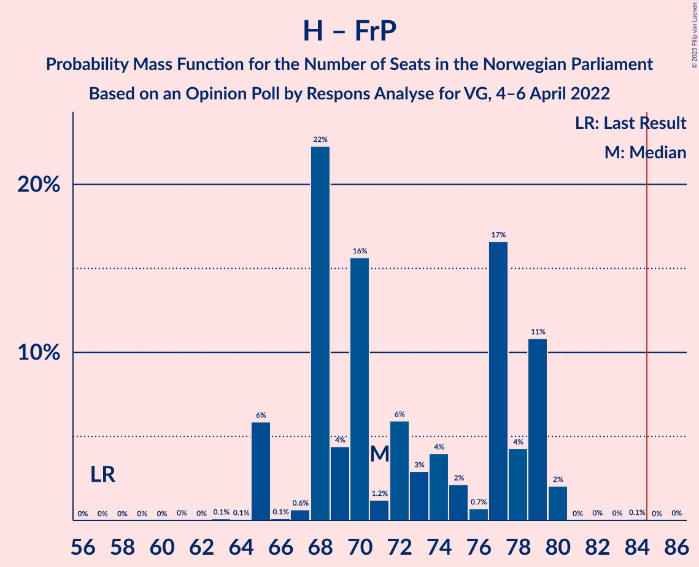

| Number of Seats | Probability | Accumulated | Special Marks |
|:---------------:|:-----------:|:-----------:|:-------------:|
| 57 | 0% | 100% | Last Result |
| 58 | 0% | 100% |  |
| 59 | 0% | 100% |  |
| 60 | 0% | 100% |  |
| 61 | 0% | 100% |  |
| 62 | 0% | 99.9% |  |
| 63 | 0.1% | 99.9% |  |
| 64 | 0.1% | 99.8% |  |
| 65 | 6% | 99.8% |  |
| 66 | 0.1% | 94% |  |
| 67 | 0.6% | 94% |  |
| 68 | 22% | 93% |  |
| 69 | 4% | 71% |  |
| 70 | 16% | 66% |  |
| 71 | 1.2% | 51% |  |
| 72 | 6% | 50% | Median |
| 73 | 3% | 44% |  |
| 74 | 4% | 41% |  |
| 75 | 2% | 37% |  |
| 76 | 0.7% | 35% |  |
| 77 | 17% | 34% |  |
| 78 | 4% | 17% |  |
| 79 | 11% | 13% |  |
| 80 | 2% | 2% |  |
| 81 | 0% | 0.2% |  |
| 82 | 0% | 0.2% |  |
| 83 | 0% | 0.2% |  |
| 84 | 0.1% | 0.1% |  |
| 85 | 0% | 0% | Majority |

### Arbeiderpartiet – Sosialistisk Venstreparti – Rødt – Miljøpartiet De Grønne

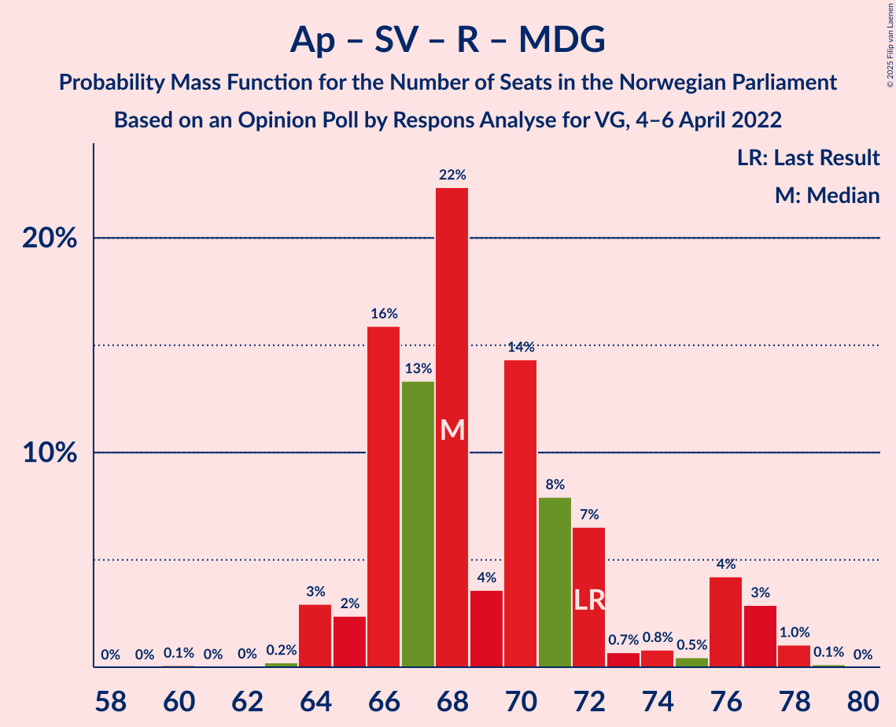

| Number of Seats | Probability | Accumulated | Special Marks |
|:---------------:|:-----------:|:-----------:|:-------------:|
| 60 | 0.1% | 100% |  |
| 61 | 0% | 99.9% |  |
| 62 | 0% | 99.9% |  |
| 63 | 0.2% | 99.8% |  |
| 64 | 3% | 99.6% |  |
| 65 | 2% | 97% |  |
| 66 | 16% | 94% |  |
| 67 | 13% | 78% |  |
| 68 | 22% | 65% |  |
| 69 | 4% | 43% |  |
| 70 | 14% | 39% |  |
| 71 | 8% | 25% | Median |
| 72 | 7% | 17% | Last Result |
| 73 | 0.7% | 10% |  |
| 74 | 0.8% | 10% |  |
| 75 | 0.5% | 9% |  |
| 76 | 4% | 8% |  |
| 77 | 3% | 4% |  |
| 78 | 1.0% | 1.2% |  |
| 79 | 0.1% | 0.2% |  |
| 80 | 0% | 0% |  |

### Arbeiderpartiet – Senterpartiet – Kristelig Folkeparti – Miljøpartiet De Grønne

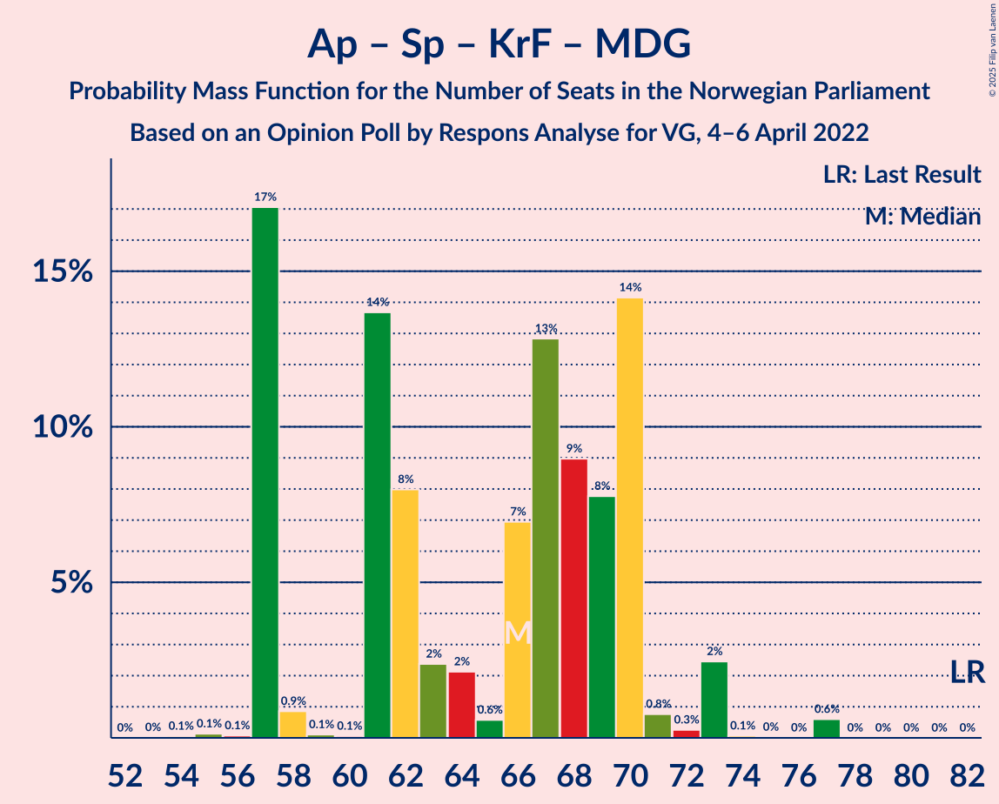

| Number of Seats | Probability | Accumulated | Special Marks |
|:---------------:|:-----------:|:-----------:|:-------------:|
| 54 | 0.1% | 100% |  |
| 55 | 0.1% | 99.9% |  |
| 56 | 0.1% | 99.8% |  |
| 57 | 17% | 99.7% |  |
| 58 | 0.9% | 83% |  |
| 59 | 0.1% | 82% |  |
| 60 | 0.1% | 82% |  |
| 61 | 14% | 82% |  |
| 62 | 8% | 68% |  |
| 63 | 2% | 60% |  |
| 64 | 2% | 58% |  |
| 65 | 0.6% | 55% |  |
| 66 | 7% | 55% |  |
| 67 | 13% | 48% |  |
| 68 | 9% | 35% | Median |
| 69 | 8% | 26% |  |
| 70 | 14% | 18% |  |
| 71 | 0.8% | 4% |  |
| 72 | 0.3% | 3% |  |
| 73 | 2% | 3% |  |
| 74 | 0.1% | 0.7% |  |
| 75 | 0% | 0.6% |  |
| 76 | 0% | 0.6% |  |
| 77 | 0.6% | 0.6% |  |
| 78 | 0% | 0% |  |
| 79 | 0% | 0% |  |
| 80 | 0% | 0% |  |
| 81 | 0% | 0% |  |
| 82 | 0% | 0% | Last Result |

### Arbeiderpartiet – Senterpartiet – Kristelig Folkeparti

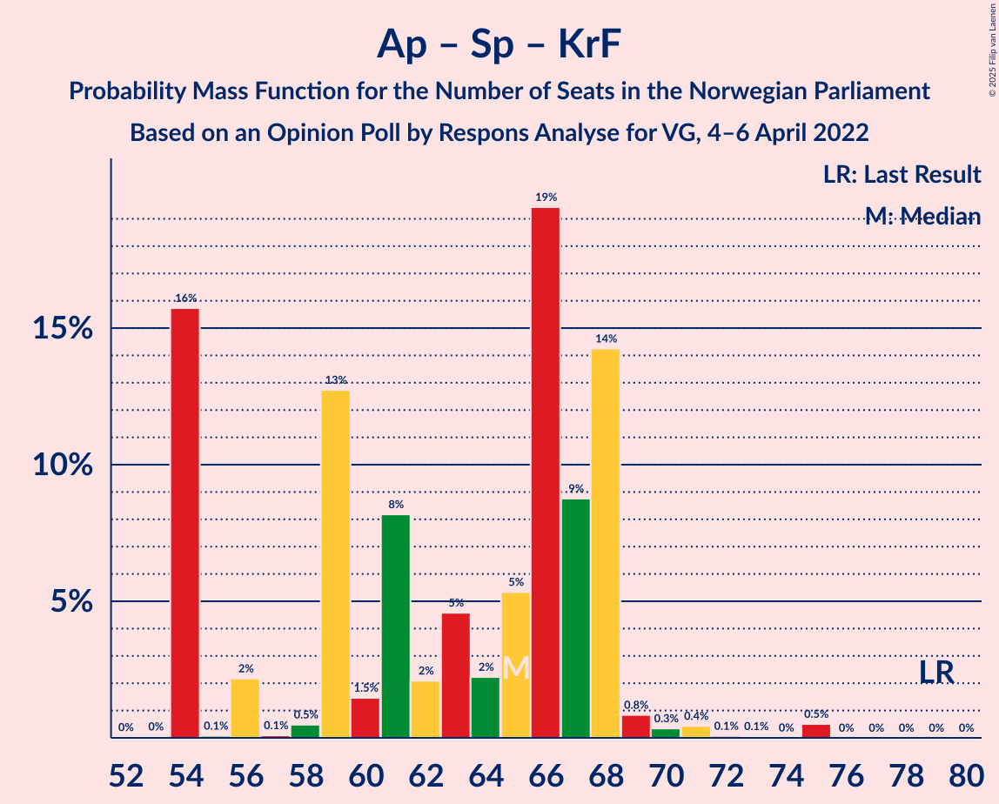

| Number of Seats | Probability | Accumulated | Special Marks |
|:---------------:|:-----------:|:-----------:|:-------------:|
| 52 | 0% | 100% |  |
| 53 | 0% | 99.9% |  |
| 54 | 16% | 99.9% |  |
| 55 | 0.1% | 84% |  |
| 56 | 2% | 84% |  |
| 57 | 0.1% | 82% |  |
| 58 | 0.5% | 82% |  |
| 59 | 13% | 81% |  |
| 60 | 1.5% | 69% |  |
| 61 | 8% | 67% |  |
| 62 | 2% | 59% |  |
| 63 | 5% | 57% |  |
| 64 | 2% | 52% |  |
| 65 | 5% | 50% |  |
| 66 | 19% | 45% | Median |
| 67 | 9% | 25% |  |
| 68 | 14% | 17% |  |
| 69 | 0.8% | 2% |  |
| 70 | 0.3% | 1.4% |  |
| 71 | 0.4% | 1.1% |  |
| 72 | 0.1% | 0.6% |  |
| 73 | 0.1% | 0.6% |  |
| 74 | 0% | 0.5% |  |
| 75 | 0.5% | 0.5% |  |
| 76 | 0% | 0% |  |
| 77 | 0% | 0% |  |
| 78 | 0% | 0% |  |
| 79 | 0% | 0% | Last Result |

### Høyre – Kristelig Folkeparti – Venstre

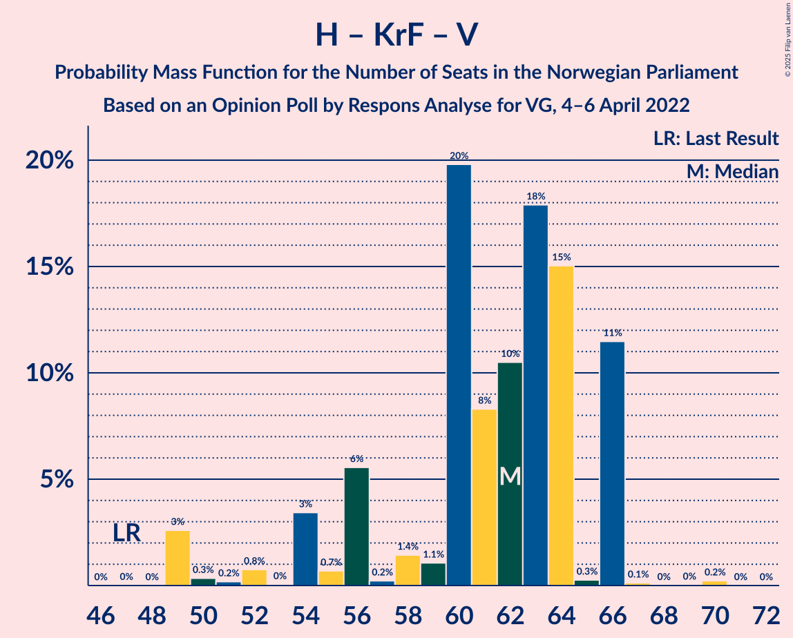

| Number of Seats | Probability | Accumulated | Special Marks |
|:---------------:|:-----------:|:-----------:|:-------------:|
| 47 | 0% | 100% | Last Result |
| 48 | 0% | 100% |  |
| 49 | 3% | 100% |  |
| 50 | 0.3% | 97% |  |
| 51 | 0.2% | 97% |  |
| 52 | 0.8% | 97% |  |
| 53 | 0% | 96% |  |
| 54 | 3% | 96% |  |
| 55 | 0.7% | 93% |  |
| 56 | 6% | 92% |  |
| 57 | 0.2% | 86% |  |
| 58 | 1.4% | 86% |  |
| 59 | 1.1% | 85% |  |
| 60 | 20% | 84% |  |
| 61 | 8% | 64% |  |
| 62 | 10% | 56% |  |
| 63 | 18% | 45% |  |
| 64 | 15% | 27% | Median |
| 65 | 0.3% | 12% |  |
| 66 | 11% | 12% |  |
| 67 | 0.1% | 0.4% |  |
| 68 | 0% | 0.3% |  |
| 69 | 0% | 0.3% |  |
| 70 | 0.2% | 0.2% |  |
| 71 | 0% | 0% |  |

### Arbeiderpartiet – Senterpartiet

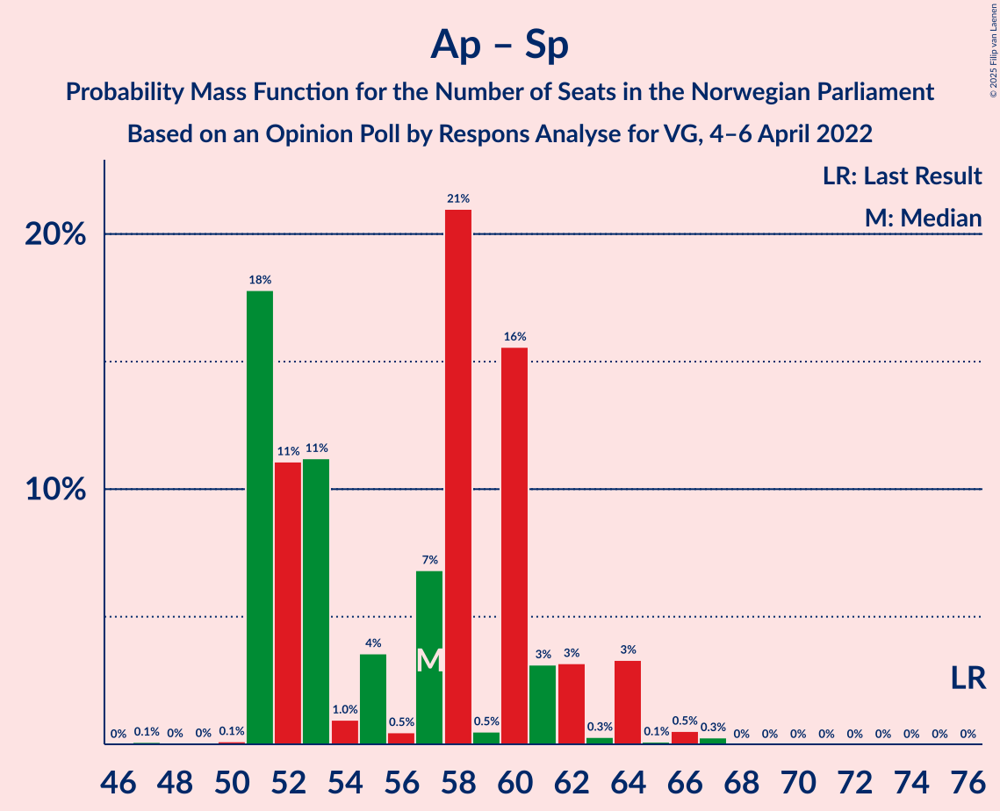

| Number of Seats | Probability | Accumulated | Special Marks |
|:---------------:|:-----------:|:-----------:|:-------------:|
| 47 | 0.1% | 100% |  |
| 48 | 0% | 99.9% |  |
| 49 | 0% | 99.9% |  |
| 50 | 0.1% | 99.8% |  |
| 51 | 18% | 99.7% |  |
| 52 | 11% | 82% |  |
| 53 | 11% | 71% |  |
| 54 | 1.0% | 60% |  |
| 55 | 4% | 59% |  |
| 56 | 0.5% | 55% |  |
| 57 | 7% | 55% |  |
| 58 | 21% | 48% | Median |
| 59 | 0.5% | 27% |  |
| 60 | 16% | 26% |  |
| 61 | 3% | 11% |  |
| 62 | 3% | 8% |  |
| 63 | 0.3% | 4% |  |
| 64 | 3% | 4% |  |
| 65 | 0.1% | 0.9% |  |
| 66 | 0.5% | 0.8% |  |
| 67 | 0.3% | 0.3% |  |
| 68 | 0% | 0% |  |
| 69 | 0% | 0% |  |
| 70 | 0% | 0% |  |
| 71 | 0% | 0% |  |
| 72 | 0% | 0% |  |
| 73 | 0% | 0% |  |
| 74 | 0% | 0% |  |
| 75 | 0% | 0% |  |
| 76 | 0% | 0% | Last Result |

### Arbeiderpartiet – Sosialistisk Venstreparti

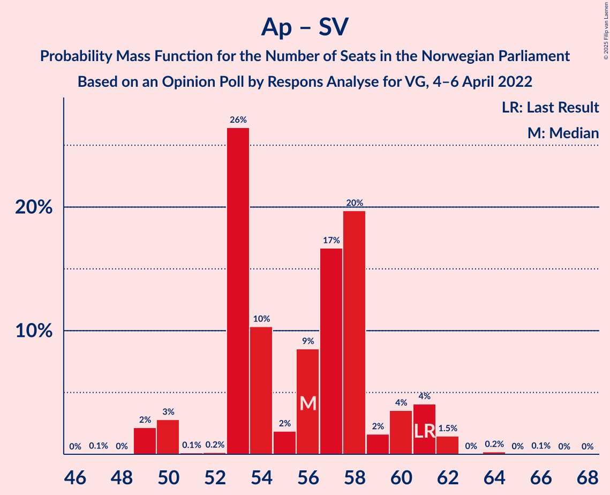

| Number of Seats | Probability | Accumulated | Special Marks |
|:---------------:|:-----------:|:-----------:|:-------------:|
| 47 | 0.1% | 100% |  |
| 48 | 0% | 99.9% |  |
| 49 | 2% | 99.9% |  |
| 50 | 3% | 98% |  |
| 51 | 0.1% | 95% |  |
| 52 | 0.2% | 95% |  |
| 53 | 26% | 95% |  |
| 54 | 10% | 68% |  |
| 55 | 2% | 58% |  |
| 56 | 9% | 56% |  |
| 57 | 17% | 47% |  |
| 58 | 20% | 31% | Median |
| 59 | 2% | 11% |  |
| 60 | 4% | 9% |  |
| 61 | 4% | 6% | Last Result |
| 62 | 1.5% | 2% |  |
| 63 | 0% | 0.3% |  |
| 64 | 0.2% | 0.3% |  |
| 65 | 0% | 0.1% |  |
| 66 | 0.1% | 0.1% |  |
| 67 | 0% | 0% |  |

### Senterpartiet – Kristelig Folkeparti – Venstre

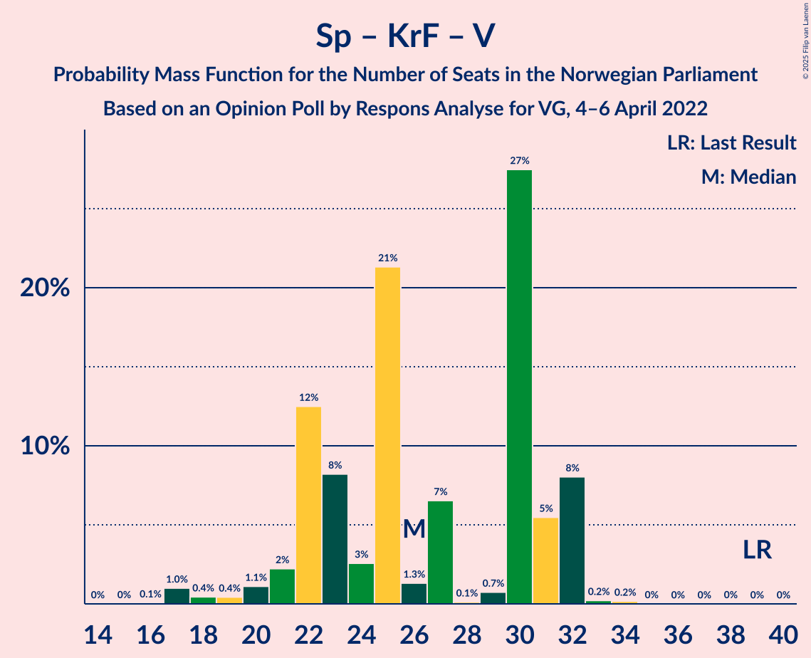

| Number of Seats | Probability | Accumulated | Special Marks |
|:---------------:|:-----------:|:-----------:|:-------------:|
| 16 | 0.1% | 100% |  |
| 17 | 1.0% | 99.9% |  |
| 18 | 0.4% | 98.9% |  |
| 19 | 0.4% | 98% |  |
| 20 | 1.1% | 98% |  |
| 21 | 2% | 97% |  |
| 22 | 12% | 95% |  |
| 23 | 8% | 82% |  |
| 24 | 3% | 74% |  |
| 25 | 21% | 71% |  |
| 26 | 1.3% | 50% |  |
| 27 | 7% | 49% |  |
| 28 | 0.1% | 42% |  |
| 29 | 0.7% | 42% |  |
| 30 | 27% | 41% | Median |
| 31 | 5% | 14% |  |
| 32 | 8% | 8% |  |
| 33 | 0.2% | 0.4% |  |
| 34 | 0.2% | 0.2% |  |
| 35 | 0% | 0% |  |
| 36 | 0% | 0% |  |
| 37 | 0% | 0% |  |
| 38 | 0% | 0% |  |
| 39 | 0% | 0% | Last Result |

## Technical Information

### Opinion Poll

+ **Polling firm:** Respons Analyse
+ **Commissioner(s):** VG
+ **Fieldwork period:** 4–6 April 2022

### Calculations

+ **Sample size:** 1003
+ **Simulations done:** 1,048,576
+ **Error estimate:** 3.73%

