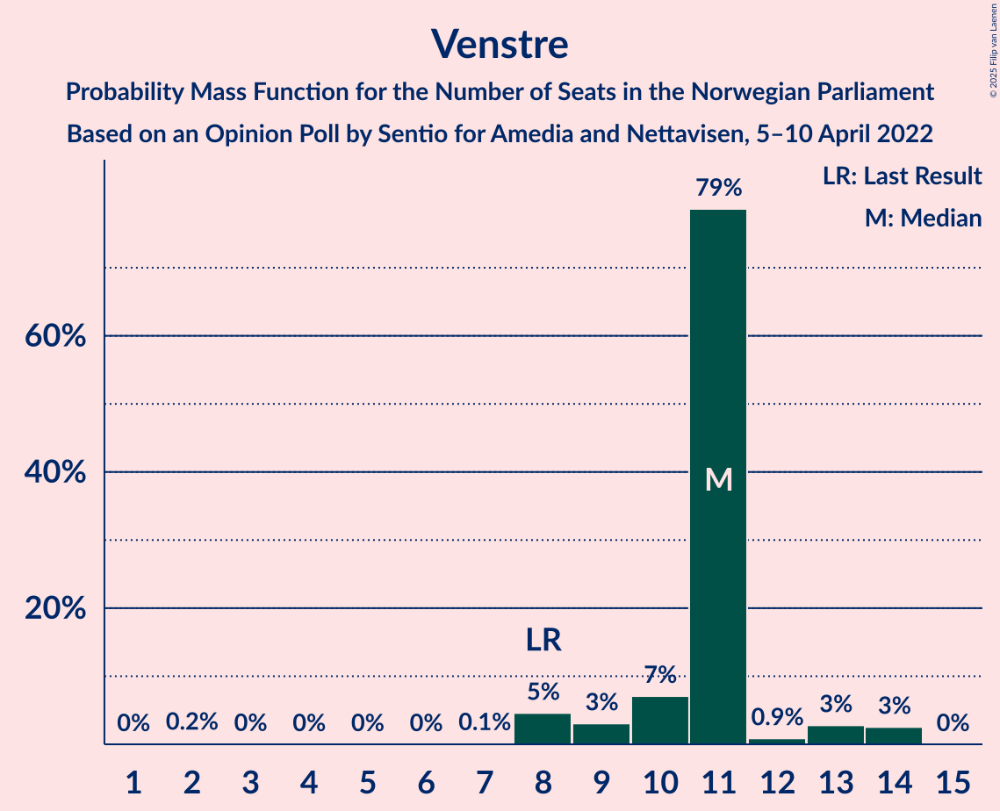
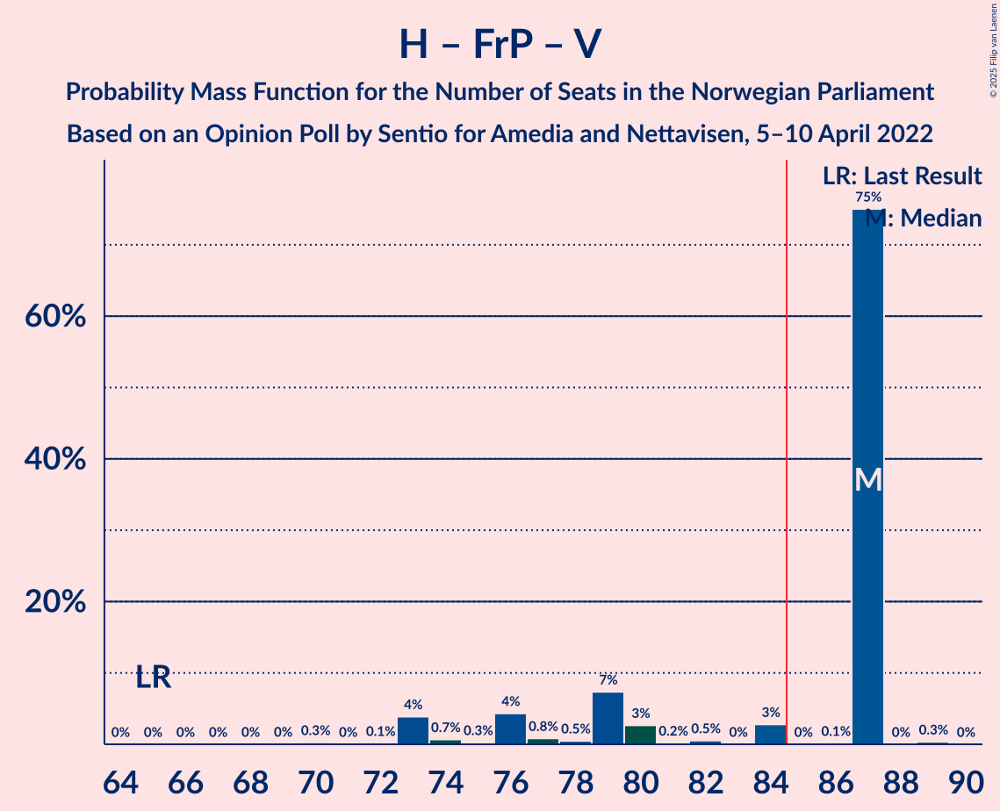

# Opinion Poll by Sentio for Amedia and Nettavisen, 5–10 April 2022

<a href="#voting-intentions">Voting Intentions</a> | <a href="#seats">Seats</a> | <a href="#coalitions">Coalitions</a> | <a href="#technical-information">Technical Information</a>

## Voting Intentions

### Confidence Intervals

| Party | Last Result | Poll Result | 80% Confidence Interval | 90% Confidence Interval | 95% Confidence Interval | 99% Confidence Interval |
|:-----:|:-----------:|:-----------:|:-----------------------:|:-----------------------:|:-----------------------:|:-----------------------:|
| Høyre | 20.4% | 27.6% | 25.8–29.5% |25.3–30.0% |24.9–30.5% |24.1–31.4% |
| Arbeiderpartiet | 26.2% | 24.5% | 22.8–26.3% |22.3–26.8% |21.9–27.3% |21.1–28.2% |
| Fremskrittspartiet | 11.6% | 11.2% | 10.0–12.6% |9.7–13.0% |9.4–13.3% |8.8–14.0% |
| Senterpartiet | 13.5% | 8.6% | 7.6–9.8% |7.3–10.2% |7.0–10.5% |6.5–11.1% |
| Sosialistisk Venstreparti | 7.6% | 6.0% | 5.1–7.1% |4.9–7.4% |4.7–7.7% |4.3–8.2% |
| Venstre | 4.6% | 5.7% | 4.9–6.8% |4.6–7.1% |4.4–7.3% |4.1–7.9% |
| Rødt | 4.7% | 5.7% | 4.9–6.8% |4.6–7.1% |4.4–7.3% |4.1–7.9% |
| Miljøpartiet De Grønne | 3.9% | 3.9% | 3.2–4.8% |3.0–5.1% |2.9–5.3% |2.6–5.8% |
| Kristelig Folkeparti | 3.8% | 3.2% | 2.6–4.0% |2.4–4.3% |2.3–4.5% |2.0–4.9% |
| Norgesdemokratene | 1.1% | 1.4% | 1.0–2.0% |0.9–2.2% |0.8–2.3% |0.7–2.7% |
| Industri- og Næringspartiet | 0.3% | 1.0% | 0.7–1.5% |0.6–1.7% |0.5–1.8% |0.4–2.1% |
| Liberalistene | 0.2% | 0.6% | 0.4–1.1% |0.3–1.2% |0.3–1.3% |0.2–1.6% |
| Konservativt | 0.4% | 0.2% | 0.1–0.5% |0.1–0.6% |0.1–0.7% |0.0–0.9% |
| Pensjonistpartiet | 0.6% | 0.2% | 0.1–0.5% |0.1–0.6% |0.1–0.7% |0.0–0.9% |

*Note:* The poll result column reflects the actual value used in the calculations. Published results may vary slightly, and in addition be rounded to fewer digits.

## Seats

### Confidence Intervals

| Party | Last Result | Median | 80% Confidence Interval | 90% Confidence Interval | 95% Confidence Interval | 99% Confidence Interval |
|:-----:|:-----------:|:------:|:-----------------------:|:-----------------------:|:-----------------------:|:-----------------------:|
| <a href="#høyre">Høyre</a> | 36 | 54 | 47–54 |46–54 |44–54 |42–54 |
| <a href="#arbeiderpartiet">Arbeiderpartiet</a> | 48 | 43 | 43–46 |43–47 |43–49 |42–51 |
| <a href="#fremskrittspartiet">Fremskrittspartiet</a> | 21 | 22 | 20–22 |18–22 |17–22 |17–25 |
| <a href="#senterpartiet">Senterpartiet</a> | 28 | 18 | 15–18 |14–18 |14–18 |13–19 |
| <a href="#sosialistisk-venstreparti">Sosialistisk Venstreparti</a> | 13 | 8 | 8–11 |8–12 |8–13 |8–15 |
| <a href="#venstre">Venstre</a> | 8 | 11 | 10–11 |9–13 |8–14 |8–14 |
| <a href="#rødt">Rødt</a> | 8 | 8 | 8–11 |8–12 |8–13 |8–14 |
| <a href="#miljøpartiet-de-grønne">Miljøpartiet De Grønne</a> | 3 | 2 | 2–7 |2–8 |2–8 |1–9 |
| <a href="#kristelig-folkeparti">Kristelig Folkeparti</a> | 3 | 2 | 2–3 |2–3 |1–3 |0–7 |
| <a href="#norgesdemokratene">Norgesdemokratene</a> | 0 | 0 | 0 |0 |0 |0 |
| <a href="#industri--og-næringspartiet">Industri- og Næringspartiet</a> | 0 | 0 | 0 |0 |0 |0 |
| <a href="#liberalistene">Liberalistene</a> | 0 | 0 | 0 |0 |0 |0 |
| <a href="#konservativt">Konservativt</a> | 0 | 0 | 0 |0 |0 |0 |
| <a href="#pensjonistpartiet">Pensjonistpartiet</a> | 0 | 0 | 0 |0 |0 |0 |

### Høyre

*For a full overview of the results for this party, see the [Høyre](party-høyre.html) page.*

| Number of Seats | Probability | Accumulated | Special Marks |
|:---------------:|:-----------:|:-----------:|:-------------:|
| 36 | 0% | 100% | Last Result |
| 37 | 0% | 100% |  |
| 38 | 0% | 100% |  |
| 39 | 0% | 100% |  |
| 40 | 0.2% | 100% |  |
| 41 | 0.2% | 99.8% |  |
| 42 | 0.1% | 99.6% |  |
| 43 | 0.1% | 99.5% |  |
| 44 | 4% | 99.4% |  |
| 45 | 0.2% | 96% |  |
| 46 | 2% | 96% |  |
| 47 | 9% | 94% |  |
| 48 | 3% | 85% |  |
| 49 | 1.0% | 82% |  |
| 50 | 4% | 81% |  |
| 51 | 1.1% | 77% |  |
| 52 | 0.4% | 76% |  |
| 53 | 0% | 75% |  |
| 54 | 75% | 75% | Median |
| 55 | 0.2% | 0.2% |  |
| 56 | 0% | 0.1% |  |
| 57 | 0% | 0% |  |

### Arbeiderpartiet

*For a full overview of the results for this party, see the [Arbeiderpartiet](party-arbeiderpartiet.html) page.*

| Number of Seats | Probability | Accumulated | Special Marks |
|:---------------:|:-----------:|:-----------:|:-------------:|
| 42 | 0.6% | 100% |  |
| 43 | 75% | 99.4% | Median |
| 44 | 8% | 24% |  |
| 45 | 3% | 16% |  |
| 46 | 6% | 14% |  |
| 47 | 4% | 8% |  |
| 48 | 0.7% | 4% | Last Result |
| 49 | 2% | 3% |  |
| 50 | 0.1% | 0.7% |  |
| 51 | 0.2% | 0.6% |  |
| 52 | 0.1% | 0.4% |  |
| 53 | 0.2% | 0.3% |  |
| 54 | 0.1% | 0.1% |  |
| 55 | 0% | 0% |  |

### Fremskrittspartiet

*For a full overview of the results for this party, see the [Fremskrittspartiet](party-fremskrittspartiet.html) page.*

| Number of Seats | Probability | Accumulated | Special Marks |
|:---------------:|:-----------:|:-----------:|:-------------:|
| 16 | 0.3% | 100% |  |
| 17 | 4% | 99.6% |  |
| 18 | 2% | 96% |  |
| 19 | 1.2% | 94% |  |
| 20 | 4% | 93% |  |
| 21 | 7% | 89% | Last Result |
| 22 | 82% | 83% | Median |
| 23 | 0.1% | 0.9% |  |
| 24 | 0.1% | 0.7% |  |
| 25 | 0.2% | 0.6% |  |
| 26 | 0% | 0.4% |  |
| 27 | 0.4% | 0.4% |  |
| 28 | 0% | 0% |  |

### Senterpartiet

*For a full overview of the results for this party, see the [Senterpartiet](party-senterpartiet.html) page.*

| Number of Seats | Probability | Accumulated | Special Marks |
|:---------------:|:-----------:|:-----------:|:-------------:|
| 10 | 0% | 100% |  |
| 11 | 0.2% | 99.9% |  |
| 12 | 0.1% | 99.8% |  |
| 13 | 2% | 99.7% |  |
| 14 | 5% | 98% |  |
| 15 | 12% | 92% |  |
| 16 | 2% | 81% |  |
| 17 | 0.4% | 78% |  |
| 18 | 77% | 78% | Median |
| 19 | 0.8% | 1.1% |  |
| 20 | 0.3% | 0.3% |  |
| 21 | 0% | 0% |  |
| 22 | 0% | 0% |  |
| 23 | 0% | 0% |  |
| 24 | 0% | 0% |  |
| 25 | 0% | 0% |  |
| 26 | 0% | 0% |  |
| 27 | 0% | 0% |  |
| 28 | 0% | 0% | Last Result |

### Sosialistisk Venstreparti

*For a full overview of the results for this party, see the [Sosialistisk Venstreparti](party-sosialistiskvenstreparti.html) page.*

| Number of Seats | Probability | Accumulated | Special Marks |
|:---------------:|:-----------:|:-----------:|:-------------:|
| 8 | 79% | 100% | Median |
| 9 | 3% | 21% |  |
| 10 | 8% | 19% |  |
| 11 | 3% | 10% |  |
| 12 | 5% | 8% |  |
| 13 | 0.9% | 3% | Last Result |
| 14 | 0.2% | 2% |  |
| 15 | 2% | 2% |  |
| 16 | 0% | 0% |  |

### Venstre

*For a full overview of the results for this party, see the [Venstre](party-venstre.html) page.*

| Number of Seats | Probability | Accumulated | Special Marks |
|:---------------:|:-----------:|:-----------:|:-------------:|
| 2 | 0.2% | 100% |  |
| 3 | 0% | 99.8% |  |
| 4 | 0% | 99.8% |  |
| 5 | 0% | 99.8% |  |
| 6 | 0% | 99.8% |  |
| 7 | 0.1% | 99.8% |  |
| 8 | 5% | 99.6% | Last Result |
| 9 | 3% | 95% |  |
| 10 | 7% | 92% |  |
| 11 | 79% | 85% | Median |
| 12 | 0.9% | 6% |  |
| 13 | 3% | 5% |  |
| 14 | 3% | 3% |  |
| 15 | 0% | 0% |  |

### Rødt

*For a full overview of the results for this party, see the [Rødt](party-rødt.html) page.*

| Number of Seats | Probability | Accumulated | Special Marks |
|:---------------:|:-----------:|:-----------:|:-------------:|
| 6 | 0% | 100% |  |
| 7 | 0.1% | 99.9% |  |
| 8 | 76% | 99.8% | Last Result, Median |
| 9 | 4% | 24% |  |
| 10 | 8% | 20% |  |
| 11 | 6% | 12% |  |
| 12 | 2% | 6% |  |
| 13 | 2% | 3% |  |
| 14 | 0.8% | 1.2% |  |
| 15 | 0.4% | 0.4% |  |
| 16 | 0% | 0% |  |

### Miljøpartiet De Grønne

*For a full overview of the results for this party, see the [Miljøpartiet De Grønne](party-miljøpartietdegrønne.html) page.*

| Number of Seats | Probability | Accumulated | Special Marks |
|:---------------:|:-----------:|:-----------:|:-------------:|
| 1 | 2% | 100% |  |
| 2 | 79% | 98% | Median |
| 3 | 5% | 19% | Last Result |
| 4 | 0% | 14% |  |
| 5 | 0% | 14% |  |
| 6 | 0% | 14% |  |
| 7 | 6% | 14% |  |
| 8 | 7% | 8% |  |
| 9 | 1.0% | 1.0% |  |
| 10 | 0% | 0% |  |

### Kristelig Folkeparti

*For a full overview of the results for this party, see the [Kristelig Folkeparti](party-kristeligfolkeparti.html) page.*

| Number of Seats | Probability | Accumulated | Special Marks |
|:---------------:|:-----------:|:-----------:|:-------------:|
| 0 | 0.9% | 100% |  |
| 1 | 2% | 99.1% |  |
| 2 | 87% | 97% | Median |
| 3 | 8% | 10% | Last Result |
| 4 | 0% | 2% |  |
| 5 | 0% | 2% |  |
| 6 | 2% | 2% |  |
| 7 | 0.3% | 0.5% |  |
| 8 | 0.1% | 0.2% |  |
| 9 | 0.1% | 0.1% |  |
| 10 | 0% | 0% |  |

### Norgesdemokratene

*For a full overview of the results for this party, see the [Norgesdemokratene](party-norgesdemokratene.html) page.*

| Number of Seats | Probability | Accumulated | Special Marks |
|:---------------:|:-----------:|:-----------:|:-------------:|
| 0 | 100% | 100% | Last Result, Median |

### Industri- og Næringspartiet

*For a full overview of the results for this party, see the [Industri- og Næringspartiet](party-industri-ognæringspartiet.html) page.*

| Number of Seats | Probability | Accumulated | Special Marks |
|:---------------:|:-----------:|:-----------:|:-------------:|
| 0 | 100% | 100% | Last Result, Median |

### Liberalistene

*For a full overview of the results for this party, see the [Liberalistene](party-liberalistene.html) page.*

| Number of Seats | Probability | Accumulated | Special Marks |
|:---------------:|:-----------:|:-----------:|:-------------:|
| 0 | 100% | 100% | Last Result, Median |

### Konservativt

*For a full overview of the results for this party, see the [Konservativt](party-konservativt.html) page.*

| Number of Seats | Probability | Accumulated | Special Marks |
|:---------------:|:-----------:|:-----------:|:-------------:|
| 0 | 100% | 100% | Last Result, Median |

### Pensjonistpartiet

*For a full overview of the results for this party, see the [Pensjonistpartiet](party-pensjonistpartiet.html) page.*

| Number of Seats | Probability | Accumulated | Special Marks |
|:---------------:|:-----------:|:-----------:|:-------------:|
| 0 | 100% | 100% | Last Result, Median |

## Coalitions

### Confidence Intervals

| Coalition | Last Result | Median | Majority? | 80% Confidence Interval | 90% Confidence Interval | 95% Confidence Interval | 99% Confidence Interval |
|:---------:|:-----------:|:------:|:---------:|:-----------------------:|:-----------------------:|:-----------------------:|:-----------------------:|
| Høyre – Fremskrittspartiet – Senterpartiet – Venstre – Kristelig Folkeparti | 96 | 107 | 100% | 95–107 | 92–107 | 92–107 | 90–107 |
| Arbeiderpartiet – Senterpartiet – Sosialistisk Venstreparti – Rødt – Miljøpartiet De Grønne | 100 | 79 | 21% | 79–89 | 79–90 | 79–93 | 79–95 |
| Høyre – Fremskrittspartiet – Venstre – Miljøpartiet De Grønne – Kristelig Folkeparti | 71 | 91 | 92% | 85–91 | 83–91 | 81–91 | 79–93 |
| Høyre – Fremskrittspartiet – Venstre – Kristelig Folkeparti | 68 | 89 | 79% | 79–89 | 78–89 | 76–89 | 74–89 |
| Arbeiderpartiet – Senterpartiet – Sosialistisk Venstreparti – Rødt | 97 | 77 | 7% | 77–83 | 77–86 | 77–88 | 75–89 |
| Høyre – Fremskrittspartiet – Venstre | 65 | 87 | 76% | 77–87 | 74–87 | 73–87 | 73–87 |
| Arbeiderpartiet – Senterpartiet – Sosialistisk Venstreparti – Miljøpartiet De Grønne – Kristelig Folkeparti | 95 | 73 | 4% | 73–79 | 73–83 | 73–86 | 72–87 |
| Arbeiderpartiet – Senterpartiet – Sosialistisk Venstreparti – Miljøpartiet De Grønne | 92 | 71 | 2% | 71–77 | 71–80 | 70–82 | 70–86 |
| Arbeiderpartiet – Senterpartiet – Sosialistisk Venstreparti | 89 | 69 | 0% | 69–72 | 69–74 | 68–77 | 66–79 |
| Arbeiderpartiet – Sosialistisk Venstreparti – Rødt – Miljøpartiet De Grønne | 72 | 61 | 0% | 61–73 | 61–76 | 61–77 | 61–78 |
| Høyre – Fremskrittspartiet | 57 | 76 | 0% | 67–76 | 65–76 | 64–76 | 63–76 |
| Arbeiderpartiet – Senterpartiet – Miljøpartiet De Grønne – Kristelig Folkeparti | 82 | 65 | 0% | 65–69 | 65–72 | 65–74 | 63–76 |
| Arbeiderpartiet – Senterpartiet – Kristelig Folkeparti | 79 | 63 | 0% | 62–63 | 61–67 | 61–68 | 58–70 |
| Høyre – Venstre – Kristelig Folkeparti | 47 | 67 | 0% | 59–67 | 58–67 | 56–67 | 54–67 |
| Arbeiderpartiet – Senterpartiet | 76 | 61 | 0% | 59–61 | 59–63 | 59–66 | 56–67 |
| Arbeiderpartiet – Sosialistisk Venstreparti | 61 | 51 | 0% | 51–57 | 51–59 | 51–61 | 51–61 |
| Senterpartiet – Venstre – Kristelig Folkeparti | 39 | 31 | 0% | 27–31 | 27–31 | 26–31 | 23–33 |

### Høyre – Fremskrittspartiet – Senterpartiet – Venstre – Kristelig Folkeparti

| Number of Seats | Probability | Accumulated | Special Marks |
|:---------------:|:-----------:|:-----------:|:-------------:|
| 87 | 0.2% | 100% |  |
| 88 | 0% | 99.8% |  |
| 89 | 0.1% | 99.7% |  |
| 90 | 0.4% | 99.6% |  |
| 91 | 0.8% | 99.1% |  |
| 92 | 4% | 98% |  |
| 93 | 0.7% | 95% |  |
| 94 | 4% | 94% |  |
| 95 | 0.6% | 90% |  |
| 96 | 7% | 90% | Last Result |
| 97 | 2% | 83% |  |
| 98 | 1.1% | 81% |  |
| 99 | 0.4% | 80% |  |
| 100 | 0.4% | 79% |  |
| 101 | 3% | 79% |  |
| 102 | 0.4% | 76% |  |
| 103 | 0% | 75% |  |
| 104 | 0% | 75% |  |
| 105 | 0.3% | 75% |  |
| 106 | 0% | 75% |  |
| 107 | 75% | 75% | Median |
| 108 | 0% | 0% |  |

### Arbeiderpartiet – Senterpartiet – Sosialistisk Venstreparti – Rødt – Miljøpartiet De Grønne

| Number of Seats | Probability | Accumulated | Special Marks |
|:---------------:|:-----------:|:-----------:|:-------------:|
| 76 | 0.3% | 100% |  |
| 77 | 0% | 99.6% |  |
| 78 | 0% | 99.6% |  |
| 79 | 75% | 99.6% | Median |
| 80 | 0.2% | 25% |  |
| 81 | 3% | 24% |  |
| 82 | 0.2% | 22% |  |
| 83 | 0% | 21% |  |
| 84 | 0.5% | 21% |  |
| 85 | 1.0% | 21% | Majority |
| 86 | 3% | 20% |  |
| 87 | 6% | 17% |  |
| 88 | 0.4% | 11% |  |
| 89 | 4% | 10% |  |
| 90 | 3% | 7% |  |
| 91 | 0.4% | 4% |  |
| 92 | 0.7% | 4% |  |
| 93 | 0.3% | 3% |  |
| 94 | 0.5% | 2% |  |
| 95 | 2% | 2% |  |
| 96 | 0% | 0.2% |  |
| 97 | 0.2% | 0.2% |  |
| 98 | 0% | 0% |  |
| 99 | 0% | 0% |  |
| 100 | 0% | 0% | Last Result |

### Høyre – Fremskrittspartiet – Venstre – Miljøpartiet De Grønne – Kristelig Folkeparti

| Number of Seats | Probability | Accumulated | Special Marks |
|:---------------:|:-----------:|:-----------:|:-------------:|
| 71 | 0% | 100% | Last Result |
| 72 | 0% | 100% |  |
| 73 | 0% | 100% |  |
| 74 | 0% | 100% |  |
| 75 | 0% | 100% |  |
| 76 | 0.1% | 100% |  |
| 77 | 0% | 99.9% |  |
| 78 | 0.1% | 99.9% |  |
| 79 | 0.5% | 99.8% |  |
| 80 | 0.4% | 99.3% |  |
| 81 | 2% | 98.9% |  |
| 82 | 2% | 97% |  |
| 83 | 2% | 95% |  |
| 84 | 0.7% | 93% |  |
| 85 | 4% | 92% | Majority |
| 86 | 2% | 88% |  |
| 87 | 0.8% | 86% |  |
| 88 | 0.2% | 85% |  |
| 89 | 9% | 85% |  |
| 90 | 0.2% | 76% |  |
| 91 | 75% | 76% | Median |
| 92 | 0.1% | 0.6% |  |
| 93 | 0% | 0.5% |  |
| 94 | 0% | 0.5% |  |
| 95 | 0.4% | 0.5% |  |
| 96 | 0% | 0% |  |

### Høyre – Fremskrittspartiet – Venstre – Kristelig Folkeparti

| Number of Seats | Probability | Accumulated | Special Marks |
|:---------------:|:-----------:|:-----------:|:-------------:|
| 68 | 0% | 100% | Last Result |
| 69 | 0% | 100% |  |
| 70 | 0% | 100% |  |
| 71 | 0.2% | 100% |  |
| 72 | 0% | 99.8% |  |
| 73 | 0.1% | 99.8% |  |
| 74 | 2% | 99.7% |  |
| 75 | 0.2% | 98% |  |
| 76 | 0.8% | 98% |  |
| 77 | 0.5% | 97% |  |
| 78 | 3% | 96% |  |
| 79 | 4% | 93% |  |
| 80 | 0.3% | 90% |  |
| 81 | 6% | 90% |  |
| 82 | 3% | 83% |  |
| 83 | 1.1% | 80% |  |
| 84 | 0.4% | 79% |  |
| 85 | 0.1% | 79% | Majority |
| 86 | 0.2% | 79% |  |
| 87 | 3% | 78% |  |
| 88 | 0.2% | 76% |  |
| 89 | 75% | 75% | Median |
| 90 | 0% | 0.4% |  |
| 91 | 0% | 0.4% |  |
| 92 | 0.3% | 0.4% |  |
| 93 | 0% | 0% |  |

### Arbeiderpartiet – Senterpartiet – Sosialistisk Venstreparti – Rødt

| Number of Seats | Probability | Accumulated | Special Marks |
|:---------------:|:-----------:|:-----------:|:-------------:|
| 73 | 0.4% | 100% |  |
| 74 | 0% | 99.5% |  |
| 75 | 0% | 99.5% |  |
| 76 | 0.1% | 99.5% |  |
| 77 | 75% | 99.4% | Median |
| 78 | 0.2% | 24% |  |
| 79 | 9% | 24% |  |
| 80 | 0.1% | 15% |  |
| 81 | 0.8% | 15% |  |
| 82 | 2% | 14% |  |
| 83 | 4% | 12% |  |
| 84 | 0.3% | 8% |  |
| 85 | 2% | 7% | Majority |
| 86 | 2% | 6% |  |
| 87 | 0.5% | 3% |  |
| 88 | 2% | 3% |  |
| 89 | 0.3% | 0.8% |  |
| 90 | 0.3% | 0.5% |  |
| 91 | 0% | 0.1% |  |
| 92 | 0.1% | 0.1% |  |
| 93 | 0% | 0% |  |
| 94 | 0% | 0% |  |
| 95 | 0% | 0% |  |
| 96 | 0% | 0% |  |
| 97 | 0% | 0% | Last Result |

### Høyre – Fremskrittspartiet – Venstre

| Number of Seats | Probability | Accumulated | Special Marks |
|:---------------:|:-----------:|:-----------:|:-------------:|
| 65 | 0% | 100% | Last Result |
| 66 | 0% | 100% |  |
| 67 | 0% | 100% |  |
| 68 | 0% | 100% |  |
| 69 | 0% | 100% |  |
| 70 | 0.3% | 99.9% |  |
| 71 | 0% | 99.7% |  |
| 72 | 0.1% | 99.7% |  |
| 73 | 4% | 99.5% |  |
| 74 | 0.7% | 96% |  |
| 75 | 0.3% | 95% |  |
| 76 | 4% | 95% |  |
| 77 | 0.8% | 90% |  |
| 78 | 0.5% | 90% |  |
| 79 | 7% | 89% |  |
| 80 | 3% | 82% |  |
| 81 | 0.2% | 79% |  |
| 82 | 0.5% | 79% |  |
| 83 | 0% | 78% |  |
| 84 | 3% | 78% |  |
| 85 | 0% | 76% | Majority |
| 86 | 0.1% | 76% |  |
| 87 | 75% | 75% | Median |
| 88 | 0% | 0.4% |  |
| 89 | 0.3% | 0.4% |  |
| 90 | 0% | 0% |  |

### Arbeiderpartiet – Senterpartiet – Sosialistisk Venstreparti – Miljøpartiet De Grønne – Kristelig Folkeparti

| Number of Seats | Probability | Accumulated | Special Marks |
|:---------------:|:-----------:|:-----------:|:-------------:|
| 70 | 0.3% | 100% |  |
| 71 | 0% | 99.6% |  |
| 72 | 0.3% | 99.6% |  |
| 73 | 78% | 99.3% | Median |
| 74 | 0.1% | 21% |  |
| 75 | 0% | 21% |  |
| 76 | 0.7% | 21% |  |
| 77 | 2% | 21% |  |
| 78 | 0.6% | 19% |  |
| 79 | 9% | 18% |  |
| 80 | 3% | 9% |  |
| 81 | 0.6% | 6% |  |
| 82 | 0.8% | 6% |  |
| 83 | 0.1% | 5% |  |
| 84 | 1.0% | 5% |  |
| 85 | 0.3% | 4% | Majority |
| 86 | 2% | 4% |  |
| 87 | 2% | 2% |  |
| 88 | 0% | 0.1% |  |
| 89 | 0% | 0% |  |
| 90 | 0% | 0% |  |
| 91 | 0% | 0% |  |
| 92 | 0% | 0% |  |
| 93 | 0% | 0% |  |
| 94 | 0% | 0% |  |
| 95 | 0% | 0% | Last Result |

### Arbeiderpartiet – Senterpartiet – Sosialistisk Venstreparti – Miljøpartiet De Grønne

| Number of Seats | Probability | Accumulated | Special Marks |
|:---------------:|:-----------:|:-----------:|:-------------:|
| 67 | 0.3% | 100% |  |
| 68 | 0% | 99.7% |  |
| 69 | 0% | 99.6% |  |
| 70 | 3% | 99.6% |  |
| 71 | 75% | 97% | Median |
| 72 | 0.1% | 21% |  |
| 73 | 0.5% | 21% |  |
| 74 | 0.3% | 21% |  |
| 75 | 2% | 20% |  |
| 76 | 1.4% | 18% |  |
| 77 | 10% | 17% |  |
| 78 | 0.7% | 7% |  |
| 79 | 1.2% | 6% |  |
| 80 | 2% | 5% |  |
| 81 | 0.7% | 3% |  |
| 82 | 0.3% | 3% |  |
| 83 | 0% | 2% |  |
| 84 | 0.4% | 2% |  |
| 85 | 0.2% | 2% | Majority |
| 86 | 2% | 2% |  |
| 87 | 0% | 0% |  |
| 88 | 0% | 0% |  |
| 89 | 0% | 0% |  |
| 90 | 0% | 0% |  |
| 91 | 0% | 0% |  |
| 92 | 0% | 0% | Last Result |

### Arbeiderpartiet – Senterpartiet – Sosialistisk Venstreparti

| Number of Seats | Probability | Accumulated | Special Marks |
|:---------------:|:-----------:|:-----------:|:-------------:|
| 64 | 0.4% | 100% |  |
| 65 | 0.1% | 99.6% |  |
| 66 | 0% | 99.5% |  |
| 67 | 0% | 99.5% |  |
| 68 | 3% | 99.4% |  |
| 69 | 82% | 97% | Median |
| 70 | 3% | 14% |  |
| 71 | 0.3% | 12% |  |
| 72 | 2% | 11% |  |
| 73 | 2% | 9% |  |
| 74 | 2% | 7% |  |
| 75 | 1.3% | 5% |  |
| 76 | 1.0% | 4% |  |
| 77 | 0.6% | 3% |  |
| 78 | 0.4% | 2% |  |
| 79 | 2% | 2% |  |
| 80 | 0% | 0.1% |  |
| 81 | 0% | 0.1% |  |
| 82 | 0% | 0% |  |
| 83 | 0% | 0% |  |
| 84 | 0% | 0% |  |
| 85 | 0% | 0% | Majority |
| 86 | 0% | 0% |  |
| 87 | 0% | 0% |  |
| 88 | 0% | 0% |  |
| 89 | 0% | 0% | Last Result |

### Arbeiderpartiet – Sosialistisk Venstreparti – Rødt – Miljøpartiet De Grønne

| Number of Seats | Probability | Accumulated | Special Marks |
|:---------------:|:-----------:|:-----------:|:-------------:|
| 61 | 75% | 100% | Median |
| 62 | 0% | 25% |  |
| 63 | 0.3% | 25% |  |
| 64 | 0% | 25% |  |
| 65 | 0% | 25% |  |
| 66 | 0.3% | 25% |  |
| 67 | 3% | 24% |  |
| 68 | 0.1% | 21% |  |
| 69 | 0.6% | 21% |  |
| 70 | 1.3% | 21% |  |
| 71 | 2% | 19% |  |
| 72 | 7% | 17% | Last Result |
| 73 | 0.6% | 11% |  |
| 74 | 4% | 10% |  |
| 75 | 0.7% | 6% |  |
| 76 | 2% | 5% |  |
| 77 | 2% | 3% |  |
| 78 | 0.6% | 1.0% |  |
| 79 | 0.1% | 0.4% |  |
| 80 | 0% | 0.3% |  |
| 81 | 0.2% | 0.2% |  |
| 82 | 0% | 0% |  |

### Høyre – Fremskrittspartiet

| Number of Seats | Probability | Accumulated | Special Marks |
|:---------------:|:-----------:|:-----------:|:-------------:|
| 57 | 0% | 100% | Last Result |
| 58 | 0.2% | 100% |  |
| 59 | 0% | 99.8% |  |
| 60 | 0% | 99.8% |  |
| 61 | 0.1% | 99.8% |  |
| 62 | 0.1% | 99.7% |  |
| 63 | 0.5% | 99.5% |  |
| 64 | 2% | 99.0% |  |
| 65 | 5% | 97% |  |
| 66 | 2% | 92% |  |
| 67 | 0.6% | 90% |  |
| 68 | 3% | 90% |  |
| 69 | 6% | 87% |  |
| 70 | 1.2% | 80% |  |
| 71 | 3% | 79% |  |
| 72 | 0.3% | 76% |  |
| 73 | 0% | 76% |  |
| 74 | 0.1% | 76% |  |
| 75 | 0% | 76% |  |
| 76 | 75% | 76% | Median |
| 77 | 0.1% | 0.5% |  |
| 78 | 0.3% | 0.4% |  |
| 79 | 0% | 0% |  |

### Arbeiderpartiet – Senterpartiet – Miljøpartiet De Grønne – Kristelig Folkeparti

| Number of Seats | Probability | Accumulated | Special Marks |
|:---------------:|:-----------:|:-----------:|:-------------:|
| 60 | 0.1% | 100% |  |
| 61 | 0.3% | 99.8% |  |
| 62 | 0% | 99.5% |  |
| 63 | 0.7% | 99.5% |  |
| 64 | 0% | 98.8% |  |
| 65 | 80% | 98.7% | Median |
| 66 | 0.6% | 19% |  |
| 67 | 3% | 18% |  |
| 68 | 2% | 16% |  |
| 69 | 6% | 14% |  |
| 70 | 0.5% | 8% |  |
| 71 | 1.3% | 7% |  |
| 72 | 1.1% | 6% |  |
| 73 | 0.5% | 5% |  |
| 74 | 2% | 4% |  |
| 75 | 2% | 2% |  |
| 76 | 0.3% | 0.6% |  |
| 77 | 0.1% | 0.4% |  |
| 78 | 0.2% | 0.3% |  |
| 79 | 0.1% | 0.1% |  |
| 80 | 0% | 0% |  |
| 81 | 0% | 0% |  |
| 82 | 0% | 0% | Last Result |

### Arbeiderpartiet – Senterpartiet – Kristelig Folkeparti

| Number of Seats | Probability | Accumulated | Special Marks |
|:---------------:|:-----------:|:-----------:|:-------------:|
| 58 | 0.5% | 100% |  |
| 59 | 0.1% | 99.5% |  |
| 60 | 0.4% | 99.4% |  |
| 61 | 8% | 99.0% |  |
| 62 | 2% | 91% |  |
| 63 | 79% | 89% | Median |
| 64 | 3% | 10% |  |
| 65 | 0.8% | 7% |  |
| 66 | 1.3% | 6% |  |
| 67 | 2% | 5% |  |
| 68 | 2% | 3% |  |
| 69 | 0.2% | 1.1% |  |
| 70 | 0.7% | 0.9% |  |
| 71 | 0.1% | 0.2% |  |
| 72 | 0% | 0.1% |  |
| 73 | 0% | 0.1% |  |
| 74 | 0% | 0.1% |  |
| 75 | 0% | 0% |  |
| 76 | 0% | 0% |  |
| 77 | 0% | 0% |  |
| 78 | 0% | 0% |  |
| 79 | 0% | 0% | Last Result |

### Høyre – Venstre – Kristelig Folkeparti

| Number of Seats | Probability | Accumulated | Special Marks |
|:---------------:|:-----------:|:-----------:|:-------------:|
| 47 | 0% | 100% | Last Result |
| 48 | 0% | 100% |  |
| 49 | 0% | 100% |  |
| 50 | 0% | 100% |  |
| 51 | 0% | 100% |  |
| 52 | 0% | 100% |  |
| 53 | 0.2% | 100% |  |
| 54 | 2% | 99.8% |  |
| 55 | 0.3% | 98% |  |
| 56 | 0.4% | 98% |  |
| 57 | 2% | 97% |  |
| 58 | 2% | 95% |  |
| 59 | 7% | 93% |  |
| 60 | 1.0% | 86% |  |
| 61 | 0.7% | 85% |  |
| 62 | 4% | 85% |  |
| 63 | 0.1% | 81% |  |
| 64 | 1.0% | 81% |  |
| 65 | 2% | 80% |  |
| 66 | 3% | 78% |  |
| 67 | 75% | 75% | Median |
| 68 | 0.2% | 0.3% |  |
| 69 | 0.1% | 0.1% |  |
| 70 | 0% | 0% |  |

### Arbeiderpartiet – Senterpartiet

| Number of Seats | Probability | Accumulated | Special Marks |
|:---------------:|:-----------:|:-----------:|:-------------:|
| 55 | 0.4% | 100% |  |
| 56 | 0.3% | 99.6% |  |
| 57 | 0.4% | 99.4% |  |
| 58 | 0.1% | 99.0% |  |
| 59 | 10% | 98.8% |  |
| 60 | 4% | 89% |  |
| 61 | 78% | 85% | Median |
| 62 | 2% | 8% |  |
| 63 | 1.5% | 6% |  |
| 64 | 0.6% | 4% |  |
| 65 | 1.0% | 4% |  |
| 66 | 0.2% | 3% |  |
| 67 | 2% | 2% |  |
| 68 | 0% | 0.4% |  |
| 69 | 0.3% | 0.4% |  |
| 70 | 0% | 0.1% |  |
| 71 | 0% | 0.1% |  |
| 72 | 0% | 0% |  |
| 73 | 0% | 0% |  |
| 74 | 0% | 0% |  |
| 75 | 0% | 0% |  |
| 76 | 0% | 0% | Last Result |

### Arbeiderpartiet – Sosialistisk Venstreparti

| Number of Seats | Probability | Accumulated | Special Marks |
|:---------------:|:-----------:|:-----------:|:-------------:|
| 50 | 0.3% | 100% |  |
| 51 | 75% | 99.7% | Median |
| 52 | 0.1% | 24% |  |
| 53 | 0% | 24% |  |
| 54 | 9% | 24% |  |
| 55 | 1.0% | 16% |  |
| 56 | 3% | 15% |  |
| 57 | 3% | 11% |  |
| 58 | 3% | 9% |  |
| 59 | 3% | 6% |  |
| 60 | 0.2% | 3% |  |
| 61 | 2% | 3% | Last Result |
| 62 | 0.3% | 0.5% |  |
| 63 | 0.1% | 0.2% |  |
| 64 | 0% | 0.2% |  |
| 65 | 0.1% | 0.1% |  |
| 66 | 0% | 0% |  |

### Senterpartiet – Venstre – Kristelig Folkeparti

| Number of Seats | Probability | Accumulated | Special Marks |
|:---------------:|:-----------:|:-----------:|:-------------:|
| 18 | 0.1% | 100% |  |
| 19 | 0% | 99.9% |  |
| 20 | 0% | 99.8% |  |
| 21 | 0% | 99.8% |  |
| 22 | 0.3% | 99.8% |  |
| 23 | 0.2% | 99.6% |  |
| 24 | 0.2% | 99.4% |  |
| 25 | 1.2% | 99.2% |  |
| 26 | 2% | 98% |  |
| 27 | 10% | 96% |  |
| 28 | 2% | 86% |  |
| 29 | 2% | 84% |  |
| 30 | 3% | 82% |  |
| 31 | 77% | 79% | Median |
| 32 | 0.7% | 2% |  |
| 33 | 1.0% | 1.1% |  |
| 34 | 0% | 0.1% |  |
| 35 | 0% | 0.1% |  |
| 36 | 0% | 0% |  |
| 37 | 0% | 0% |  |
| 38 | 0% | 0% |  |
| 39 | 0% | 0% | Last Result |

## Technical Information

### Opinion Poll

+ **Polling firm:** Sentio
+ **Commissioner(s):** Amedia and Nettavisen
+ **Fieldwork period:** 5–10 April 2022

### Calculations

+ **Sample size:** 1000
+ **Simulations done:** 1,048,576
+ **Error estimate:** 1.95%

