# Opinion Poll by Norstat for Vårt Land, 19–25 April 2022

<a href="#voting-intentions">Voting Intentions</a> | <a href="#seats">Seats</a> | <a href="#coalitions">Coalitions</a> | <a href="#technical-information">Technical Information</a>

## Voting Intentions

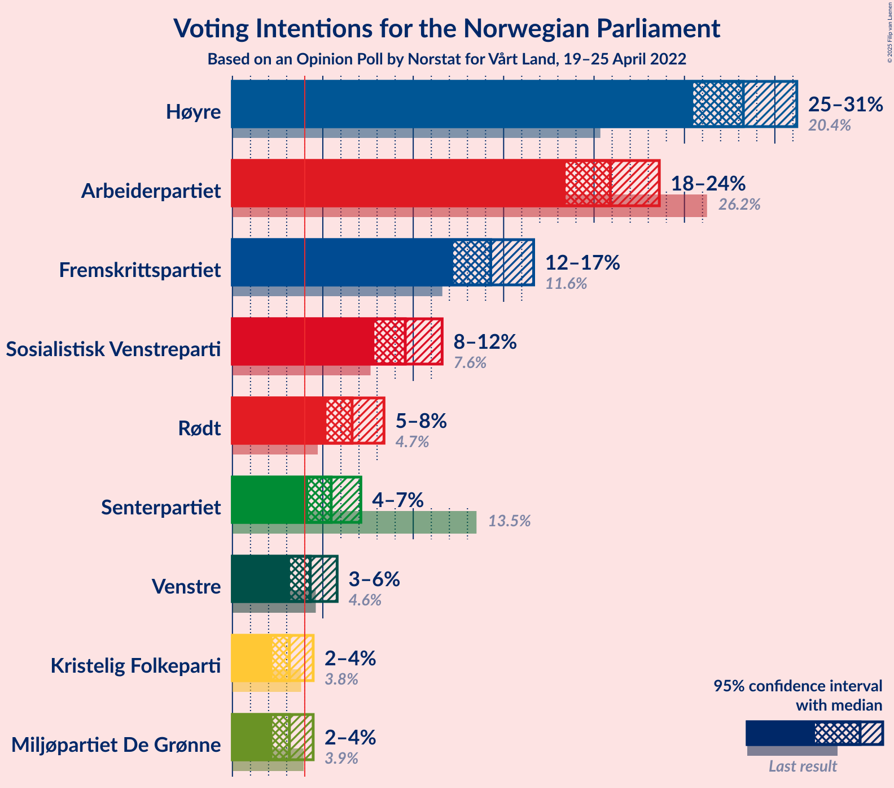

### Confidence Intervals

| Party | Last Result | Poll Result | 80% Confidence Interval | 90% Confidence Interval | 95% Confidence Interval | 99% Confidence Interval |
|:-----:|:-----------:|:-----------:|:-----------------------:|:-----------------------:|:-----------------------:|:-----------------------:|
| Høyre | 20.4% | 28.3% | 26.4–30.2% |25.9–30.7% |25.5–31.2% |24.6–32.1% |
| Arbeiderpartiet | 26.2% | 20.9% | 19.3–22.7% |18.8–23.2% |18.4–23.6% |17.7–24.5% |
| Fremskrittspartiet | 11.6% | 14.3% | 12.9–15.8% |12.5–16.3% |12.2–16.7% |11.6–17.4% |
| Sosialistisk Venstreparti | 7.6% | 9.6% | 8.4–10.9% |8.1–11.3% |7.8–11.6% |7.3–12.3% |
| Rødt | 4.7% | 6.6% | 5.7–7.8% |5.4–8.1% |5.2–8.4% |4.8–9.0% |
| Senterpartiet | 13.5% | 5.5% | 4.6–6.5% |4.4–6.8% |4.2–7.1% |3.8–7.7% |
| Venstre | 4.6% | 4.3% | 3.6–5.3% |3.4–5.5% |3.2–5.8% |2.9–6.3% |
| Kristelig Folkeparti | 3.8% | 3.2% | 2.5–4.0% |2.4–4.3% |2.2–4.5% |2.0–4.9% |
| Miljøpartiet De Grønne | 3.9% | 3.2% | 2.5–4.0% |2.4–4.3% |2.2–4.5% |2.0–4.9% |

*Note:* The poll result column reflects the actual value used in the calculations. Published results may vary slightly, and in addition be rounded to fewer digits.

## Seats

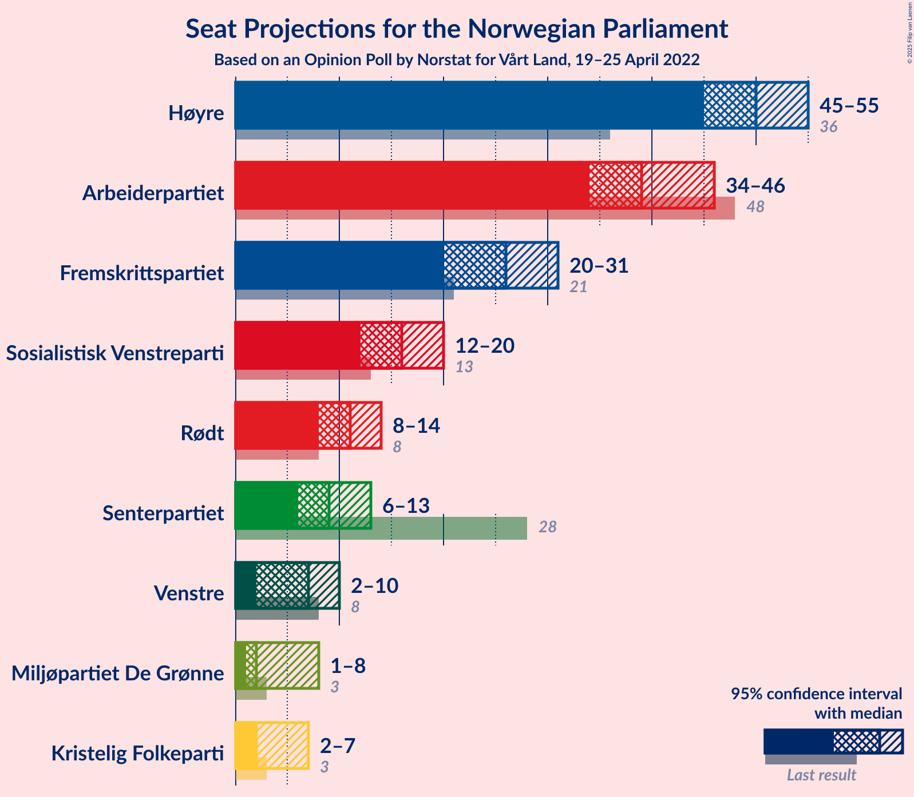

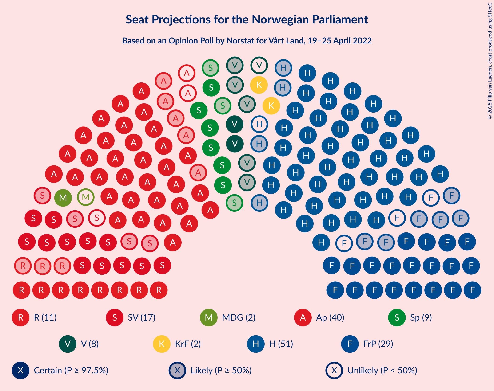

### Confidence Intervals

| Party | Last Result | Median | 80% Confidence Interval | 90% Confidence Interval | 95% Confidence Interval | 99% Confidence Interval |
|:-----:|:-----------:|:------:|:-----------------------:|:-----------------------:|:-----------------------:|:-----------------------:|
| <a href="#høyre">Høyre</a> | 36 | 50 | 46–54 |46–54 |45–55 |43–58 |
| <a href="#arbeiderpartiet">Arbeiderpartiet</a> | 48 | 39 | 37–43 |36–45 |34–46 |33–48 |
| <a href="#fremskrittspartiet">Fremskrittspartiet</a> | 21 | 26 | 22–30 |21–30 |20–31 |19–33 |
| <a href="#sosialistisk-venstreparti">Sosialistisk Venstreparti</a> | 13 | 16 | 13–19 |13–20 |12–20 |11–21 |
| <a href="#rødt">Rødt</a> | 8 | 11 | 9–14 |9–14 |8–14 |8–15 |
| <a href="#senterpartiet">Senterpartiet</a> | 28 | 9 | 7–12 |7–12 |6–13 |1–13 |
| <a href="#venstre">Venstre</a> | 8 | 7 | 2–9 |2–9 |2–10 |2–11 |
| <a href="#kristelig-folkeparti">Kristelig Folkeparti</a> | 3 | 2 | 2–3 |2–3 |2–7 |1–8 |
| <a href="#miljøpartiet-de-grønne">Miljøpartiet De Grønne</a> | 3 | 2 | 1–6 |1–7 |1–8 |1–8 |

### Høyre

*For a full overview of the results for this party, see the [Høyre](party-høyre.html) page.*

| Number of Seats | Probability | Accumulated | Special Marks |
|:---------------:|:-----------:|:-----------:|:-------------:|
| 36 | 0% | 100% | Last Result |
| 37 | 0% | 100% |  |
| 38 | 0% | 100% |  |
| 39 | 0% | 100% |  |
| 40 | 0% | 100% |  |
| 41 | 0% | 100% |  |
| 42 | 0.2% | 99.9% |  |
| 43 | 0.3% | 99.7% |  |
| 44 | 0.6% | 99.4% |  |
| 45 | 2% | 98.8% |  |
| 46 | 7% | 97% |  |
| 47 | 6% | 90% |  |
| 48 | 12% | 83% |  |
| 49 | 20% | 71% |  |
| 50 | 11% | 51% | Median |
| 51 | 12% | 40% |  |
| 52 | 11% | 28% |  |
| 53 | 5% | 17% |  |
| 54 | 9% | 12% |  |
| 55 | 1.4% | 4% |  |
| 56 | 0.9% | 2% |  |
| 57 | 0.2% | 1.2% |  |
| 58 | 0.7% | 1.0% |  |
| 59 | 0.1% | 0.2% |  |
| 60 | 0% | 0.1% |  |
| 61 | 0% | 0.1% |  |
| 62 | 0% | 0% |  |

### Arbeiderpartiet

*For a full overview of the results for this party, see the [Arbeiderpartiet](party-arbeiderpartiet.html) page.*

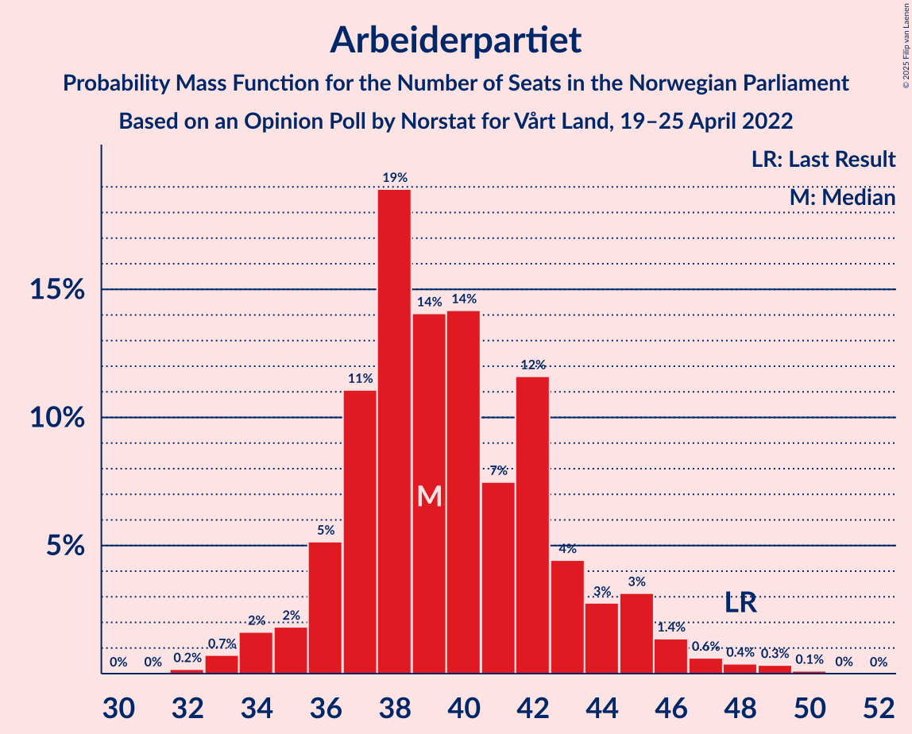

| Number of Seats | Probability | Accumulated | Special Marks |
|:---------------:|:-----------:|:-----------:|:-------------:|
| 32 | 0.2% | 100% |  |
| 33 | 0.7% | 99.8% |  |
| 34 | 2% | 99.1% |  |
| 35 | 2% | 97% |  |
| 36 | 5% | 96% |  |
| 37 | 11% | 90% |  |
| 38 | 19% | 79% |  |
| 39 | 14% | 60% | Median |
| 40 | 14% | 46% |  |
| 41 | 7% | 32% |  |
| 42 | 12% | 25% |  |
| 43 | 4% | 13% |  |
| 44 | 3% | 9% |  |
| 45 | 3% | 6% |  |
| 46 | 1.4% | 3% |  |
| 47 | 0.6% | 1.5% |  |
| 48 | 0.4% | 0.9% | Last Result |
| 49 | 0.3% | 0.5% |  |
| 50 | 0.1% | 0.1% |  |
| 51 | 0% | 0% |  |

### Fremskrittspartiet

*For a full overview of the results for this party, see the [Fremskrittspartiet](party-fremskrittspartiet.html) page.*

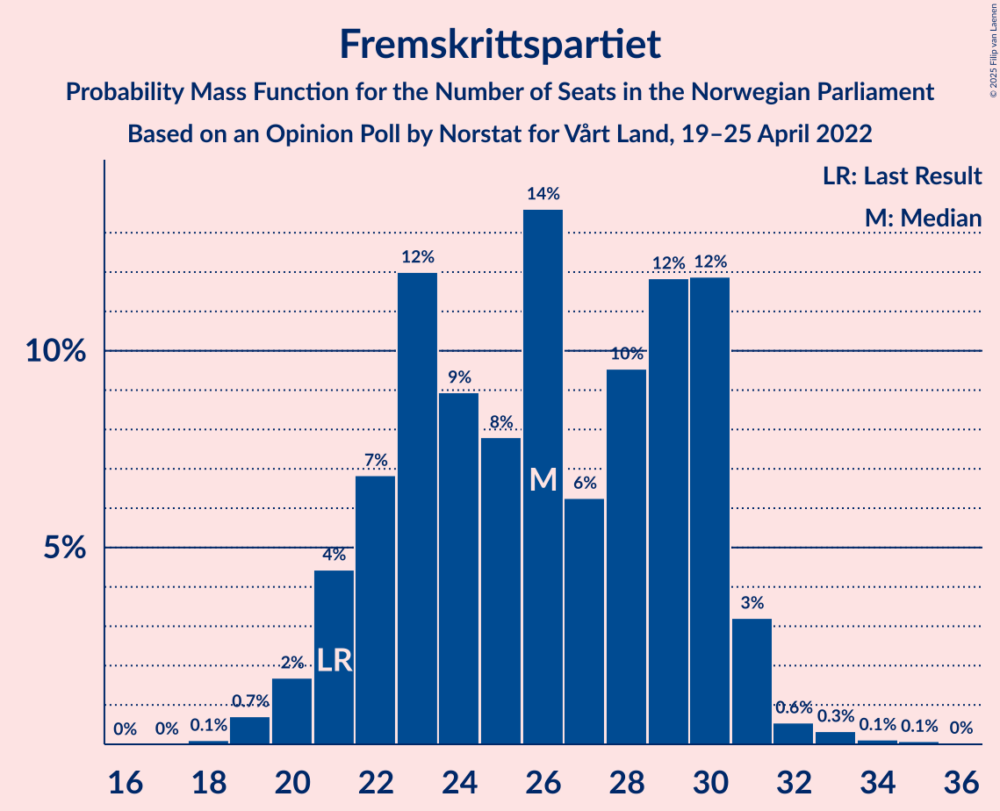

| Number of Seats | Probability | Accumulated | Special Marks |
|:---------------:|:-----------:|:-----------:|:-------------:|
| 18 | 0.1% | 100% |  |
| 19 | 0.7% | 99.9% |  |
| 20 | 2% | 99.2% |  |
| 21 | 4% | 97% | Last Result |
| 22 | 7% | 93% |  |
| 23 | 12% | 86% |  |
| 24 | 9% | 74% |  |
| 25 | 8% | 65% |  |
| 26 | 14% | 57% | Median |
| 27 | 6% | 44% |  |
| 28 | 10% | 38% |  |
| 29 | 12% | 28% |  |
| 30 | 12% | 16% |  |
| 31 | 3% | 4% |  |
| 32 | 0.6% | 1.1% |  |
| 33 | 0.3% | 0.6% |  |
| 34 | 0.1% | 0.2% |  |
| 35 | 0.1% | 0.1% |  |
| 36 | 0% | 0% |  |

### Sosialistisk Venstreparti

*For a full overview of the results for this party, see the [Sosialistisk Venstreparti](party-sosialistiskvenstreparti.html) page.*

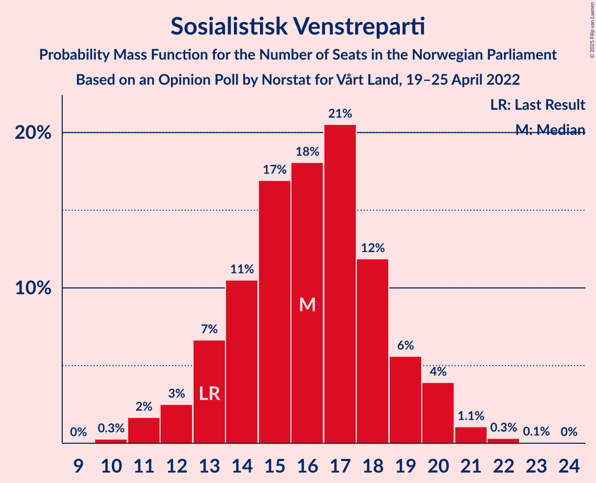

| Number of Seats | Probability | Accumulated | Special Marks |
|:---------------:|:-----------:|:-----------:|:-------------:|
| 10 | 0.3% | 100% |  |
| 11 | 2% | 99.7% |  |
| 12 | 3% | 98% |  |
| 13 | 7% | 96% | Last Result |
| 14 | 11% | 89% |  |
| 15 | 17% | 78% |  |
| 16 | 18% | 61% | Median |
| 17 | 21% | 43% |  |
| 18 | 12% | 23% |  |
| 19 | 6% | 11% |  |
| 20 | 4% | 5% |  |
| 21 | 1.1% | 1.5% |  |
| 22 | 0.3% | 0.4% |  |
| 23 | 0.1% | 0.1% |  |
| 24 | 0% | 0% |  |

### Rødt

*For a full overview of the results for this party, see the [Rødt](party-rødt.html) page.*

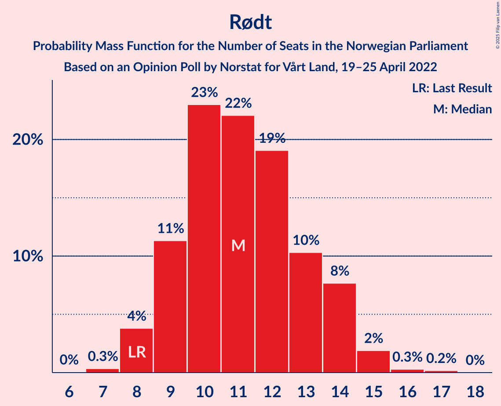

| Number of Seats | Probability | Accumulated | Special Marks |
|:---------------:|:-----------:|:-----------:|:-------------:|
| 6 | 0% | 100% |  |
| 7 | 0.3% | 99.9% |  |
| 8 | 4% | 99.6% | Last Result |
| 9 | 11% | 96% |  |
| 10 | 23% | 84% |  |
| 11 | 22% | 61% | Median |
| 12 | 19% | 39% |  |
| 13 | 10% | 20% |  |
| 14 | 8% | 10% |  |
| 15 | 2% | 2% |  |
| 16 | 0.3% | 0.5% |  |
| 17 | 0.2% | 0.2% |  |
| 18 | 0% | 0% |  |

### Senterpartiet

*For a full overview of the results for this party, see the [Senterpartiet](party-senterpartiet.html) page.*

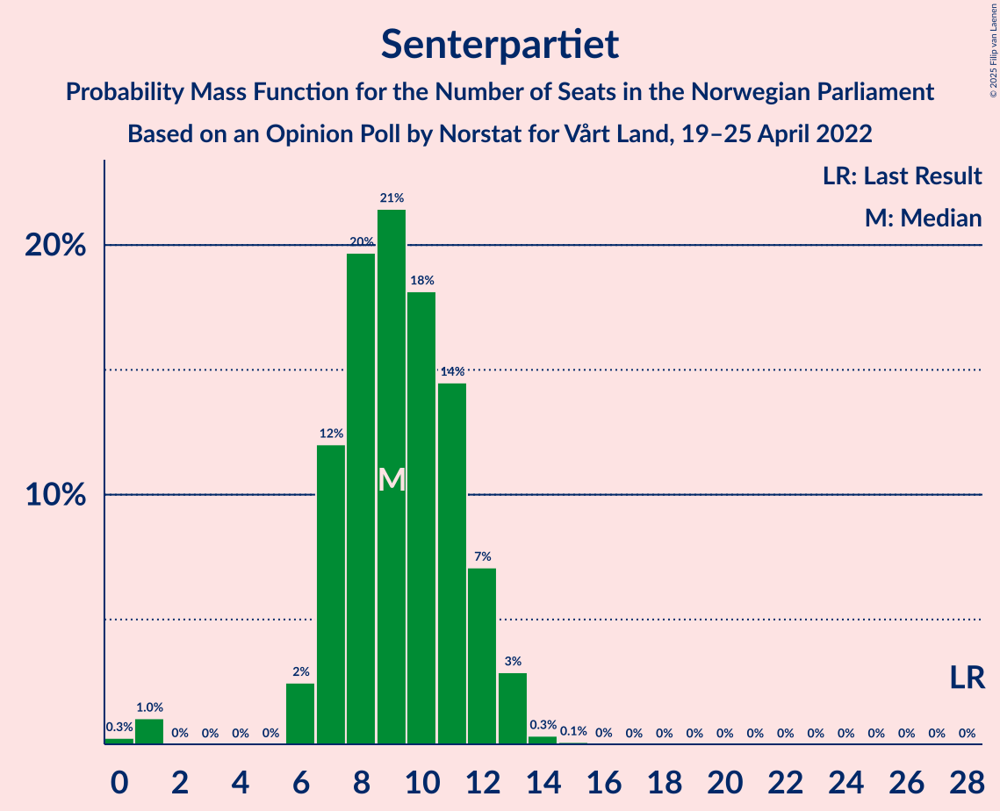

| Number of Seats | Probability | Accumulated | Special Marks |
|:---------------:|:-----------:|:-----------:|:-------------:|
| 0 | 0.3% | 100% |  |
| 1 | 1.0% | 99.7% |  |
| 2 | 0% | 98.7% |  |
| 3 | 0% | 98.7% |  |
| 4 | 0% | 98.7% |  |
| 5 | 0% | 98.7% |  |
| 6 | 2% | 98.7% |  |
| 7 | 12% | 96% |  |
| 8 | 20% | 84% |  |
| 9 | 21% | 65% | Median |
| 10 | 18% | 43% |  |
| 11 | 14% | 25% |  |
| 12 | 7% | 10% |  |
| 13 | 3% | 3% |  |
| 14 | 0.3% | 0.5% |  |
| 15 | 0.1% | 0.1% |  |
| 16 | 0% | 0% |  |
| 17 | 0% | 0% |  |
| 18 | 0% | 0% |  |
| 19 | 0% | 0% |  |
| 20 | 0% | 0% |  |
| 21 | 0% | 0% |  |
| 22 | 0% | 0% |  |
| 23 | 0% | 0% |  |
| 24 | 0% | 0% |  |
| 25 | 0% | 0% |  |
| 26 | 0% | 0% |  |
| 27 | 0% | 0% |  |
| 28 | 0% | 0% | Last Result |

### Venstre

*For a full overview of the results for this party, see the [Venstre](party-venstre.html) page.*

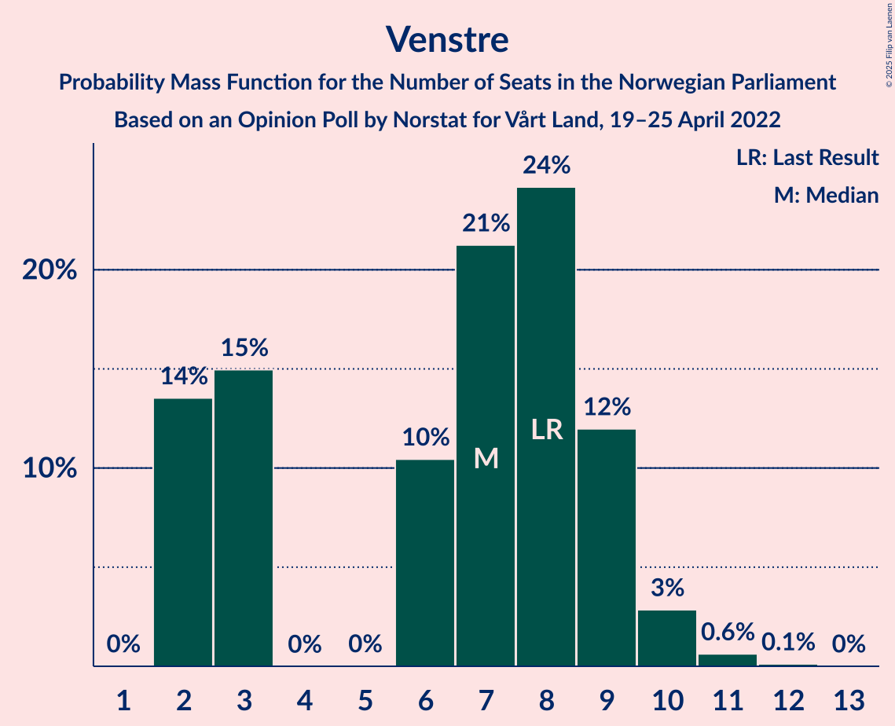

| Number of Seats | Probability | Accumulated | Special Marks |
|:---------------:|:-----------:|:-----------:|:-------------:|
| 2 | 14% | 100% |  |
| 3 | 15% | 86% |  |
| 4 | 0% | 71% |  |
| 5 | 0% | 71% |  |
| 6 | 10% | 71% |  |
| 7 | 21% | 61% | Median |
| 8 | 24% | 40% | Last Result |
| 9 | 12% | 16% |  |
| 10 | 3% | 4% |  |
| 11 | 0.6% | 0.8% |  |
| 12 | 0.1% | 0.1% |  |
| 13 | 0% | 0% |  |

### Kristelig Folkeparti

*For a full overview of the results for this party, see the [Kristelig Folkeparti](party-kristeligfolkeparti.html) page.*

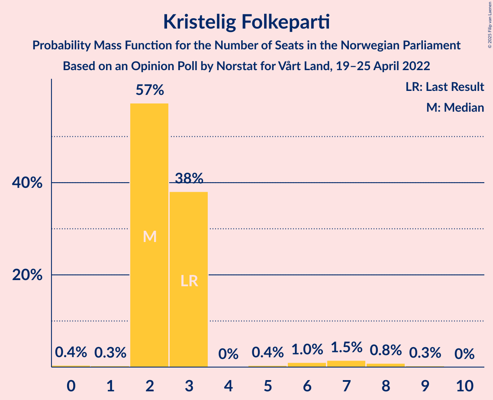

| Number of Seats | Probability | Accumulated | Special Marks |
|:---------------:|:-----------:|:-----------:|:-------------:|
| 0 | 0.4% | 100% |  |
| 1 | 0.3% | 99.6% |  |
| 2 | 57% | 99.3% | Median |
| 3 | 38% | 42% | Last Result |
| 4 | 0% | 4% |  |
| 5 | 0.4% | 4% |  |
| 6 | 1.0% | 4% |  |
| 7 | 1.5% | 3% |  |
| 8 | 0.8% | 1.1% |  |
| 9 | 0.3% | 0.3% |  |
| 10 | 0% | 0% |  |

### Miljøpartiet De Grønne

*For a full overview of the results for this party, see the [Miljøpartiet De Grønne](party-miljøpartietdegrønne.html) page.*

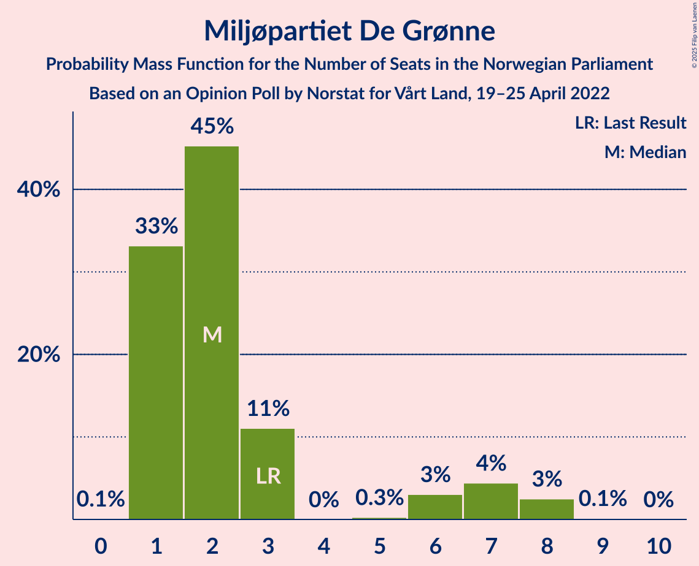

| Number of Seats | Probability | Accumulated | Special Marks |
|:---------------:|:-----------:|:-----------:|:-------------:|
| 0 | 0.1% | 100% |  |
| 1 | 33% | 99.9% |  |
| 2 | 45% | 67% | Median |
| 3 | 11% | 21% | Last Result |
| 4 | 0% | 10% |  |
| 5 | 0.3% | 10% |  |
| 6 | 3% | 10% |  |
| 7 | 4% | 7% |  |
| 8 | 3% | 3% |  |
| 9 | 0.1% | 0.2% |  |
| 10 | 0% | 0% |  |

## Coalitions

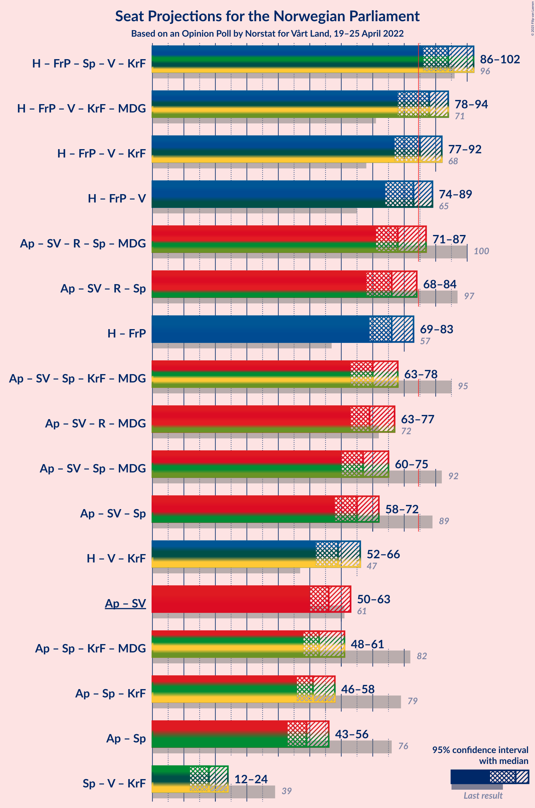

### Confidence Intervals

| Coalition | Last Result | Median | Majority? | 80% Confidence Interval | 90% Confidence Interval | 95% Confidence Interval | 99% Confidence Interval |
|:---------:|:-----------:|:------:|:---------:|:-----------------------:|:-----------------------:|:-----------------------:|:-----------------------:|
| Høyre – Fremskrittspartiet – Senterpartiet – Venstre – Kristelig Folkeparti | 96 | 94 | 98.9% | 89–99 | 87–101 | 86–102 | 83–104 |
| Høyre – Fremskrittspartiet – Venstre – Kristelig Folkeparti – Miljøpartiet De Grønne | 71 | 88 | 71% | 81–92 | 80–93 | 78–94 | 76–97 |
| Høyre – Fremskrittspartiet – Venstre – Kristelig Folkeparti | 68 | 85 | 55% | 80–90 | 78–91 | 77–92 | 74–94 |
| Høyre – Fremskrittspartiet – Venstre | 65 | 83 | 31% | 77–88 | 75–88 | 74–89 | 72–91 |
| Arbeiderpartiet – Sosialistisk Venstreparti – Rødt – Senterpartiet – Miljøpartiet De Grønne | 100 | 78 | 7% | 73–84 | 71–85 | 71–87 | 68–89 |
| Arbeiderpartiet – Sosialistisk Venstreparti – Rødt – Senterpartiet | 97 | 76 | 1.5% | 70–81 | 69–83 | 68–84 | 66–86 |
| Høyre – Fremskrittspartiet | 57 | 76 | 0.8% | 71–81 | 70–82 | 69–83 | 67–85 |
| Arbeiderpartiet – Sosialistisk Venstreparti – Senterpartiet – Kristelig Folkeparti – Miljøpartiet De Grønne | 95 | 70 | 0% | 65–75 | 64–77 | 63–78 | 60–80 |
| Arbeiderpartiet – Sosialistisk Venstreparti – Rødt – Miljøpartiet De Grønne | 72 | 69 | 0% | 65–74 | 63–76 | 63–77 | 60–79 |
| Arbeiderpartiet – Sosialistisk Venstreparti – Senterpartiet – Miljøpartiet De Grønne | 92 | 67 | 0% | 63–72 | 61–74 | 60–75 | 58–77 |
| Arbeiderpartiet – Sosialistisk Venstreparti – Senterpartiet | 89 | 65 | 0% | 60–69 | 59–71 | 58–72 | 56–74 |
| Høyre – Venstre – Kristelig Folkeparti | 47 | 59 | 0% | 55–63 | 52–65 | 52–66 | 50–67 |
| Arbeiderpartiet – Sosialistisk Venstreparti | 61 | 56 | 0% | 52–60 | 51–61 | 50–63 | 48–64 |
| Arbeiderpartiet – Senterpartiet – Kristelig Folkeparti – Miljøpartiet De Grønne | 82 | 53 | 0% | 50–58 | 49–60 | 48–61 | 45–64 |
| Arbeiderpartiet – Senterpartiet – Kristelig Folkeparti | 79 | 51 | 0% | 48–55 | 47–57 | 46–58 | 43–60 |
| Arbeiderpartiet – Senterpartiet | 76 | 49 | 0% | 45–53 | 44–54 | 43–56 | 40–57 |
| Senterpartiet – Venstre – Kristelig Folkeparti | 39 | 18 | 0% | 14–22 | 13–23 | 12–24 | 10–26 |

### Høyre – Fremskrittspartiet – Senterpartiet – Venstre – Kristelig Folkeparti

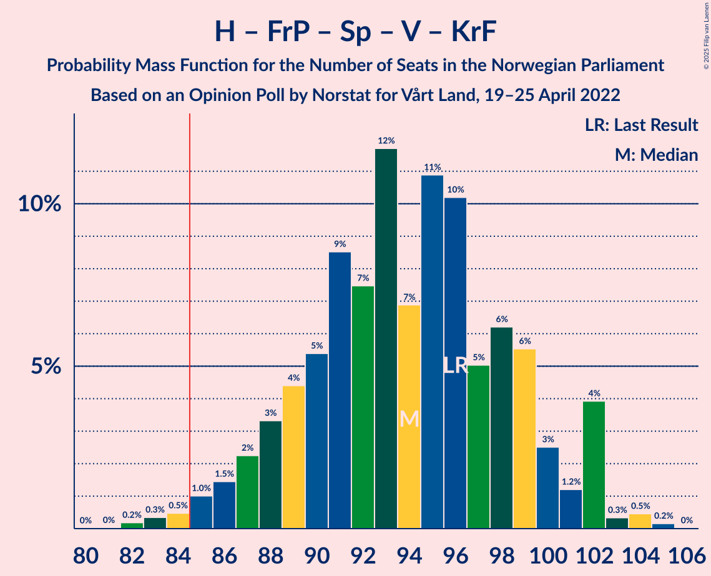

| Number of Seats | Probability | Accumulated | Special Marks |
|:---------------:|:-----------:|:-----------:|:-------------:|
| 81 | 0% | 100% |  |
| 82 | 0.2% | 99.9% |  |
| 83 | 0.3% | 99.8% |  |
| 84 | 0.5% | 99.4% |  |
| 85 | 1.0% | 98.9% | Majority |
| 86 | 1.5% | 98% |  |
| 87 | 2% | 96% |  |
| 88 | 3% | 94% |  |
| 89 | 4% | 91% |  |
| 90 | 5% | 86% |  |
| 91 | 9% | 81% |  |
| 92 | 7% | 73% |  |
| 93 | 12% | 65% |  |
| 94 | 7% | 53% | Median |
| 95 | 11% | 47% |  |
| 96 | 10% | 36% | Last Result |
| 97 | 5% | 25% |  |
| 98 | 6% | 20% |  |
| 99 | 6% | 14% |  |
| 100 | 3% | 9% |  |
| 101 | 1.2% | 6% |  |
| 102 | 4% | 5% |  |
| 103 | 0.3% | 1.0% |  |
| 104 | 0.5% | 0.7% |  |
| 105 | 0.2% | 0.2% |  |
| 106 | 0% | 0% |  |

### Høyre – Fremskrittspartiet – Venstre – Kristelig Folkeparti – Miljøpartiet De Grønne

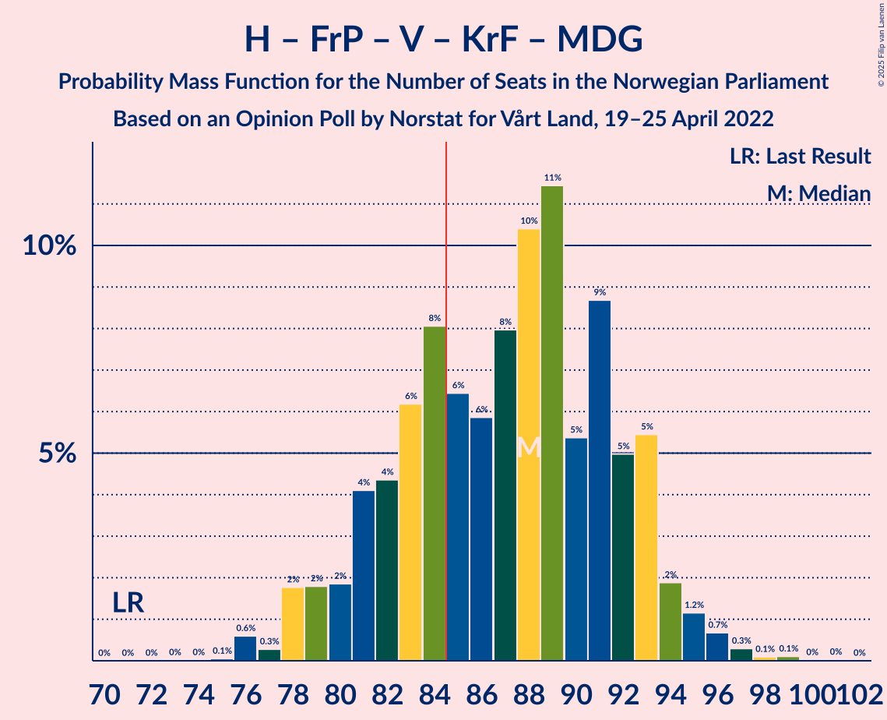

| Number of Seats | Probability | Accumulated | Special Marks |
|:---------------:|:-----------:|:-----------:|:-------------:|
| 71 | 0% | 100% | Last Result |
| 72 | 0% | 100% |  |
| 73 | 0% | 100% |  |
| 74 | 0% | 100% |  |
| 75 | 0.1% | 100% |  |
| 76 | 0.6% | 99.9% |  |
| 77 | 0.3% | 99.3% |  |
| 78 | 2% | 99.0% |  |
| 79 | 2% | 97% |  |
| 80 | 2% | 95% |  |
| 81 | 4% | 94% |  |
| 82 | 4% | 89% |  |
| 83 | 6% | 85% |  |
| 84 | 8% | 79% |  |
| 85 | 6% | 71% | Majority |
| 86 | 6% | 64% |  |
| 87 | 8% | 59% | Median |
| 88 | 10% | 51% |  |
| 89 | 11% | 40% |  |
| 90 | 5% | 29% |  |
| 91 | 9% | 23% |  |
| 92 | 5% | 15% |  |
| 93 | 5% | 10% |  |
| 94 | 2% | 4% |  |
| 95 | 1.2% | 2% |  |
| 96 | 0.7% | 1.2% |  |
| 97 | 0.3% | 0.6% |  |
| 98 | 0.1% | 0.3% |  |
| 99 | 0.1% | 0.2% |  |
| 100 | 0% | 0.1% |  |
| 101 | 0% | 0% |  |

### Høyre – Fremskrittspartiet – Venstre – Kristelig Folkeparti

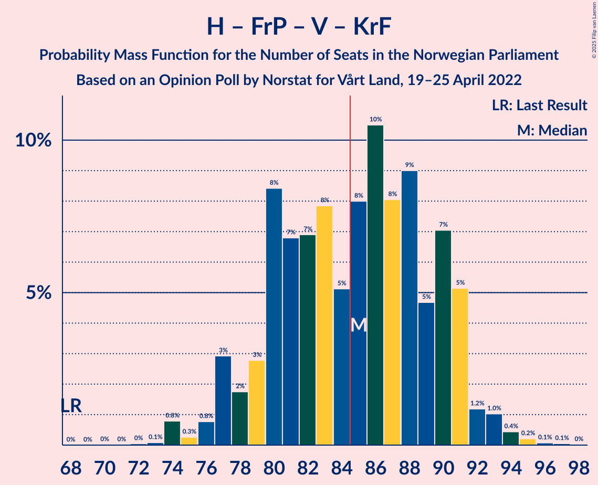

| Number of Seats | Probability | Accumulated | Special Marks |
|:---------------:|:-----------:|:-----------:|:-------------:|
| 68 | 0% | 100% | Last Result |
| 69 | 0% | 100% |  |
| 70 | 0% | 100% |  |
| 71 | 0% | 100% |  |
| 72 | 0% | 100% |  |
| 73 | 0.1% | 99.9% |  |
| 74 | 0.8% | 99.8% |  |
| 75 | 0.3% | 99.0% |  |
| 76 | 0.8% | 98.8% |  |
| 77 | 3% | 98% |  |
| 78 | 2% | 95% |  |
| 79 | 3% | 93% |  |
| 80 | 8% | 91% |  |
| 81 | 7% | 82% |  |
| 82 | 7% | 75% |  |
| 83 | 8% | 68% |  |
| 84 | 5% | 61% |  |
| 85 | 8% | 55% | Median, Majority |
| 86 | 10% | 47% |  |
| 87 | 8% | 37% |  |
| 88 | 9% | 29% |  |
| 89 | 5% | 20% |  |
| 90 | 7% | 15% |  |
| 91 | 5% | 8% |  |
| 92 | 1.2% | 3% |  |
| 93 | 1.0% | 2% |  |
| 94 | 0.4% | 0.8% |  |
| 95 | 0.2% | 0.4% |  |
| 96 | 0.1% | 0.2% |  |
| 97 | 0.1% | 0.1% |  |
| 98 | 0% | 0% |  |

### Høyre – Fremskrittspartiet – Venstre

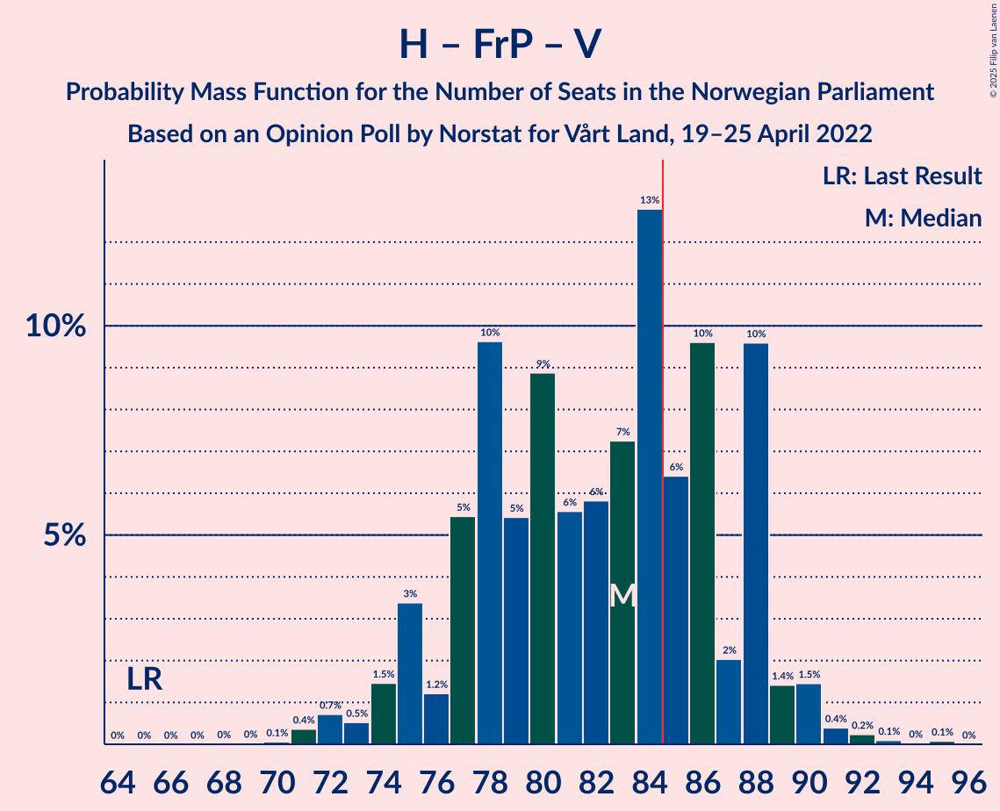

| Number of Seats | Probability | Accumulated | Special Marks |
|:---------------:|:-----------:|:-----------:|:-------------:|
| 65 | 0% | 100% | Last Result |
| 66 | 0% | 100% |  |
| 67 | 0% | 100% |  |
| 68 | 0% | 100% |  |
| 69 | 0% | 100% |  |
| 70 | 0.1% | 100% |  |
| 71 | 0.4% | 99.9% |  |
| 72 | 0.7% | 99.5% |  |
| 73 | 0.5% | 98.8% |  |
| 74 | 1.5% | 98% |  |
| 75 | 3% | 97% |  |
| 76 | 1.2% | 93% |  |
| 77 | 5% | 92% |  |
| 78 | 10% | 87% |  |
| 79 | 5% | 77% |  |
| 80 | 9% | 72% |  |
| 81 | 6% | 63% |  |
| 82 | 6% | 57% |  |
| 83 | 7% | 51% | Median |
| 84 | 13% | 44% |  |
| 85 | 6% | 31% | Majority |
| 86 | 10% | 25% |  |
| 87 | 2% | 15% |  |
| 88 | 10% | 13% |  |
| 89 | 1.4% | 4% |  |
| 90 | 1.5% | 2% |  |
| 91 | 0.4% | 0.9% |  |
| 92 | 0.2% | 0.5% |  |
| 93 | 0.1% | 0.2% |  |
| 94 | 0% | 0.1% |  |
| 95 | 0.1% | 0.1% |  |
| 96 | 0% | 0% |  |

### Arbeiderpartiet – Sosialistisk Venstreparti – Rødt – Senterpartiet – Miljøpartiet De Grønne

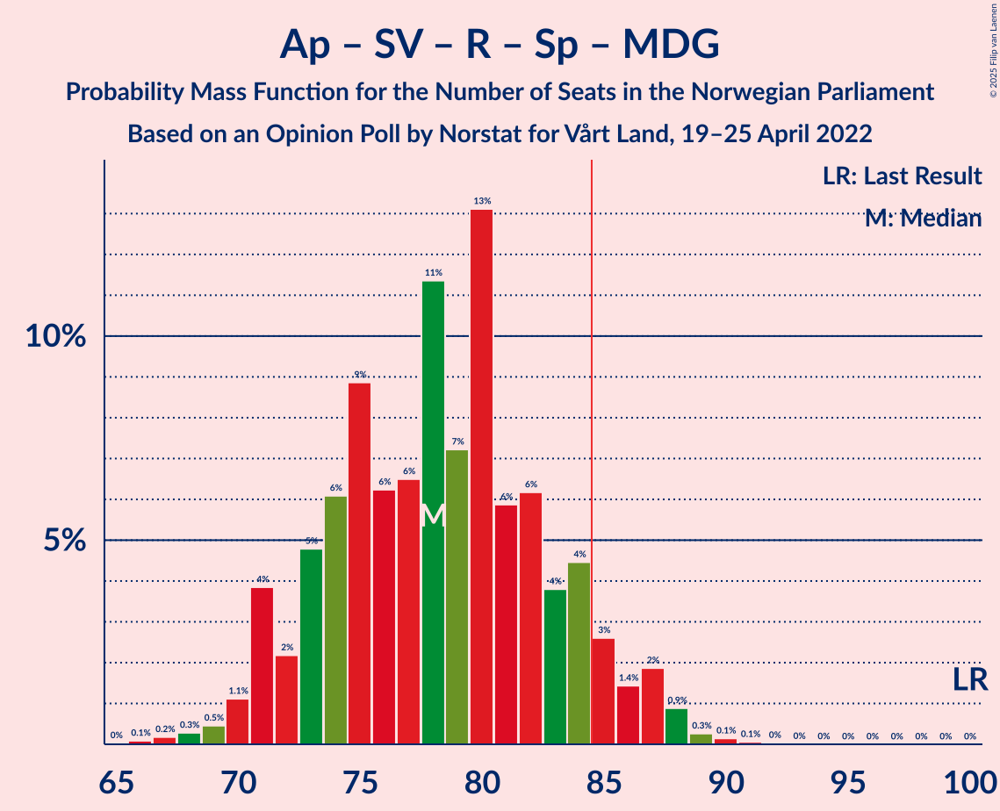

| Number of Seats | Probability | Accumulated | Special Marks |
|:---------------:|:-----------:|:-----------:|:-------------:|
| 66 | 0.1% | 100% |  |
| 67 | 0.2% | 99.9% |  |
| 68 | 0.3% | 99.7% |  |
| 69 | 0.5% | 99.4% |  |
| 70 | 1.1% | 99.0% |  |
| 71 | 4% | 98% |  |
| 72 | 2% | 94% |  |
| 73 | 5% | 92% |  |
| 74 | 6% | 87% |  |
| 75 | 9% | 81% |  |
| 76 | 6% | 72% |  |
| 77 | 6% | 66% | Median |
| 78 | 11% | 59% |  |
| 79 | 7% | 48% |  |
| 80 | 13% | 41% |  |
| 81 | 6% | 28% |  |
| 82 | 6% | 22% |  |
| 83 | 4% | 16% |  |
| 84 | 4% | 12% |  |
| 85 | 3% | 7% | Majority |
| 86 | 1.4% | 5% |  |
| 87 | 2% | 3% |  |
| 88 | 0.9% | 1.4% |  |
| 89 | 0.3% | 0.5% |  |
| 90 | 0.1% | 0.3% |  |
| 91 | 0.1% | 0.1% |  |
| 92 | 0% | 0.1% |  |
| 93 | 0% | 0% |  |
| 94 | 0% | 0% |  |
| 95 | 0% | 0% |  |
| 96 | 0% | 0% |  |
| 97 | 0% | 0% |  |
| 98 | 0% | 0% |  |
| 99 | 0% | 0% |  |
| 100 | 0% | 0% | Last Result |

### Arbeiderpartiet – Sosialistisk Venstreparti – Rødt – Senterpartiet

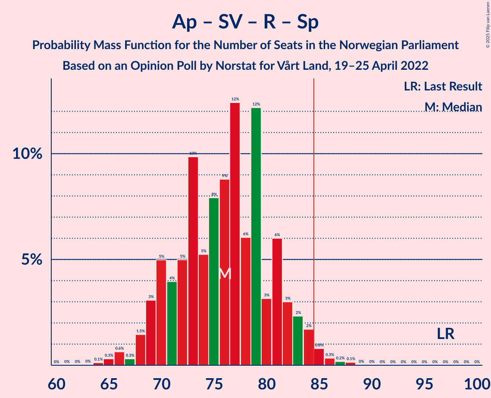

| Number of Seats | Probability | Accumulated | Special Marks |
|:---------------:|:-----------:|:-----------:|:-------------:|
| 63 | 0% | 100% |  |
| 64 | 0.1% | 99.9% |  |
| 65 | 0.3% | 99.8% |  |
| 66 | 0.6% | 99.5% |  |
| 67 | 0.3% | 98.9% |  |
| 68 | 1.5% | 98.6% |  |
| 69 | 3% | 97% |  |
| 70 | 5% | 94% |  |
| 71 | 4% | 89% |  |
| 72 | 5% | 85% |  |
| 73 | 10% | 80% |  |
| 74 | 5% | 70% |  |
| 75 | 8% | 65% | Median |
| 76 | 9% | 57% |  |
| 77 | 12% | 48% |  |
| 78 | 6% | 36% |  |
| 79 | 12% | 30% |  |
| 80 | 3% | 18% |  |
| 81 | 6% | 15% |  |
| 82 | 3% | 9% |  |
| 83 | 2% | 6% |  |
| 84 | 2% | 3% |  |
| 85 | 0.8% | 1.5% | Majority |
| 86 | 0.3% | 0.7% |  |
| 87 | 0.2% | 0.4% |  |
| 88 | 0.1% | 0.2% |  |
| 89 | 0% | 0% |  |
| 90 | 0% | 0% |  |
| 91 | 0% | 0% |  |
| 92 | 0% | 0% |  |
| 93 | 0% | 0% |  |
| 94 | 0% | 0% |  |
| 95 | 0% | 0% |  |
| 96 | 0% | 0% |  |
| 97 | 0% | 0% | Last Result |

### Høyre – Fremskrittspartiet

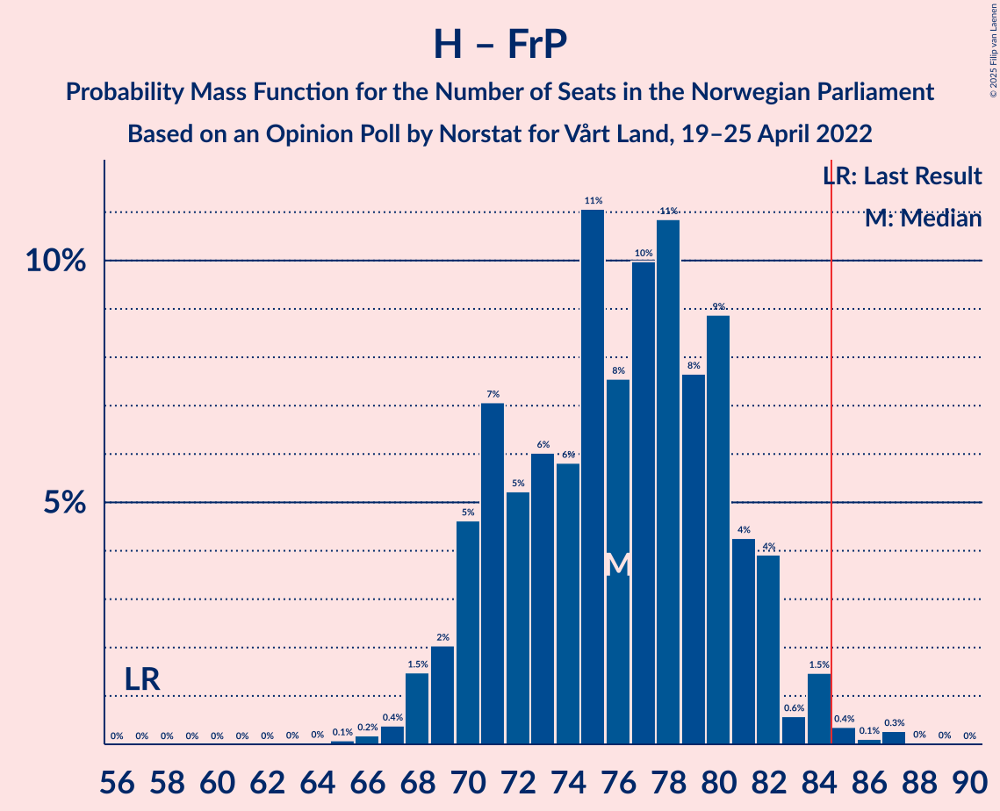

| Number of Seats | Probability | Accumulated | Special Marks |
|:---------------:|:-----------:|:-----------:|:-------------:|
| 57 | 0% | 100% | Last Result |
| 58 | 0% | 100% |  |
| 59 | 0% | 100% |  |
| 60 | 0% | 100% |  |
| 61 | 0% | 100% |  |
| 62 | 0% | 100% |  |
| 63 | 0% | 100% |  |
| 64 | 0% | 100% |  |
| 65 | 0.1% | 100% |  |
| 66 | 0.2% | 99.9% |  |
| 67 | 0.4% | 99.7% |  |
| 68 | 1.5% | 99.3% |  |
| 69 | 2% | 98% |  |
| 70 | 5% | 96% |  |
| 71 | 7% | 91% |  |
| 72 | 5% | 84% |  |
| 73 | 6% | 79% |  |
| 74 | 6% | 73% |  |
| 75 | 11% | 67% |  |
| 76 | 8% | 56% | Median |
| 77 | 10% | 48% |  |
| 78 | 11% | 38% |  |
| 79 | 8% | 28% |  |
| 80 | 9% | 20% |  |
| 81 | 4% | 11% |  |
| 82 | 4% | 7% |  |
| 83 | 0.6% | 3% |  |
| 84 | 1.5% | 2% |  |
| 85 | 0.4% | 0.8% | Majority |
| 86 | 0.1% | 0.4% |  |
| 87 | 0.3% | 0.3% |  |
| 88 | 0% | 0.1% |  |
| 89 | 0% | 0% |  |

### Arbeiderpartiet – Sosialistisk Venstreparti – Senterpartiet – Kristelig Folkeparti – Miljøpartiet De Grønne

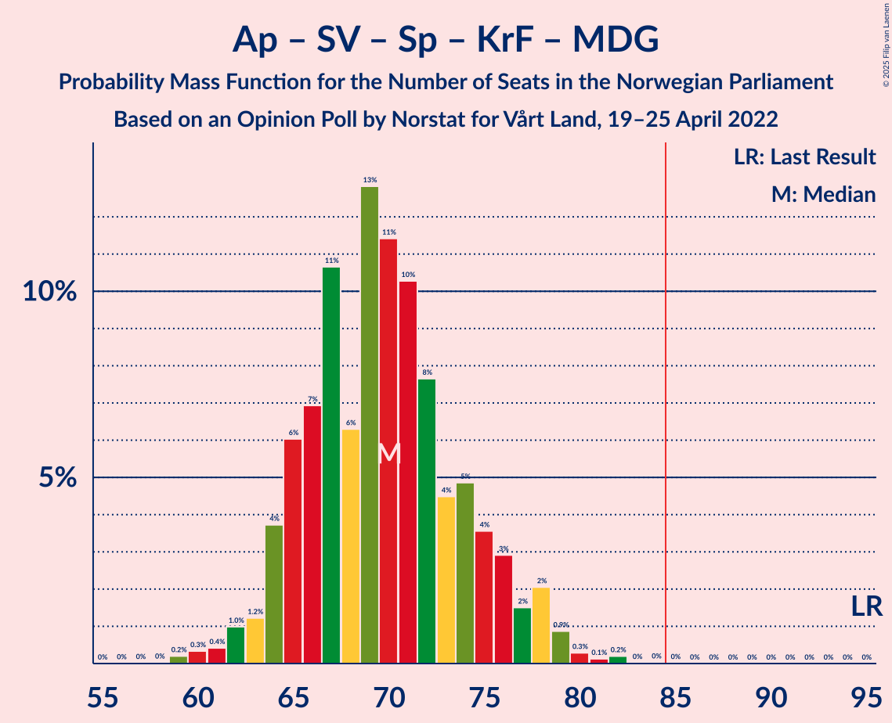

| Number of Seats | Probability | Accumulated | Special Marks |
|:---------------:|:-----------:|:-----------:|:-------------:|
| 58 | 0% | 100% |  |
| 59 | 0.2% | 99.9% |  |
| 60 | 0.3% | 99.7% |  |
| 61 | 0.4% | 99.4% |  |
| 62 | 1.0% | 99.0% |  |
| 63 | 1.2% | 98% |  |
| 64 | 4% | 97% |  |
| 65 | 6% | 93% |  |
| 66 | 7% | 87% |  |
| 67 | 11% | 80% |  |
| 68 | 6% | 69% | Median |
| 69 | 13% | 63% |  |
| 70 | 11% | 50% |  |
| 71 | 10% | 39% |  |
| 72 | 8% | 29% |  |
| 73 | 4% | 21% |  |
| 74 | 5% | 16% |  |
| 75 | 4% | 12% |  |
| 76 | 3% | 8% |  |
| 77 | 2% | 5% |  |
| 78 | 2% | 4% |  |
| 79 | 0.9% | 2% |  |
| 80 | 0.3% | 0.7% |  |
| 81 | 0.1% | 0.4% |  |
| 82 | 0.2% | 0.3% |  |
| 83 | 0% | 0.1% |  |
| 84 | 0% | 0.1% |  |
| 85 | 0% | 0% | Majority |
| 86 | 0% | 0% |  |
| 87 | 0% | 0% |  |
| 88 | 0% | 0% |  |
| 89 | 0% | 0% |  |
| 90 | 0% | 0% |  |
| 91 | 0% | 0% |  |
| 92 | 0% | 0% |  |
| 93 | 0% | 0% |  |
| 94 | 0% | 0% |  |
| 95 | 0% | 0% | Last Result |

### Arbeiderpartiet – Sosialistisk Venstreparti – Rødt – Miljøpartiet De Grønne

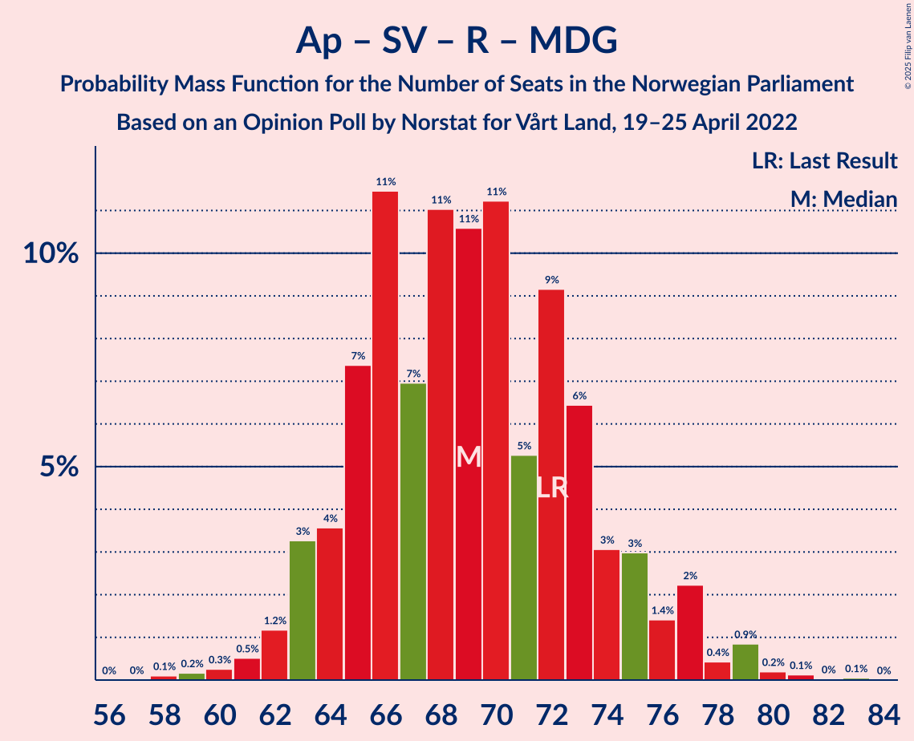

| Number of Seats | Probability | Accumulated | Special Marks |
|:---------------:|:-----------:|:-----------:|:-------------:|
| 58 | 0.1% | 100% |  |
| 59 | 0.2% | 99.9% |  |
| 60 | 0.3% | 99.7% |  |
| 61 | 0.5% | 99.5% |  |
| 62 | 1.2% | 98.9% |  |
| 63 | 3% | 98% |  |
| 64 | 4% | 94% |  |
| 65 | 7% | 91% |  |
| 66 | 11% | 84% |  |
| 67 | 7% | 72% |  |
| 68 | 11% | 65% | Median |
| 69 | 11% | 54% |  |
| 70 | 11% | 43% |  |
| 71 | 5% | 32% |  |
| 72 | 9% | 27% | Last Result |
| 73 | 6% | 18% |  |
| 74 | 3% | 11% |  |
| 75 | 3% | 8% |  |
| 76 | 1.4% | 5% |  |
| 77 | 2% | 4% |  |
| 78 | 0.4% | 2% |  |
| 79 | 0.9% | 1.3% |  |
| 80 | 0.2% | 0.4% |  |
| 81 | 0.1% | 0.2% |  |
| 82 | 0% | 0.1% |  |
| 83 | 0.1% | 0.1% |  |
| 84 | 0% | 0% |  |

### Arbeiderpartiet – Sosialistisk Venstreparti – Senterpartiet – Miljøpartiet De Grønne

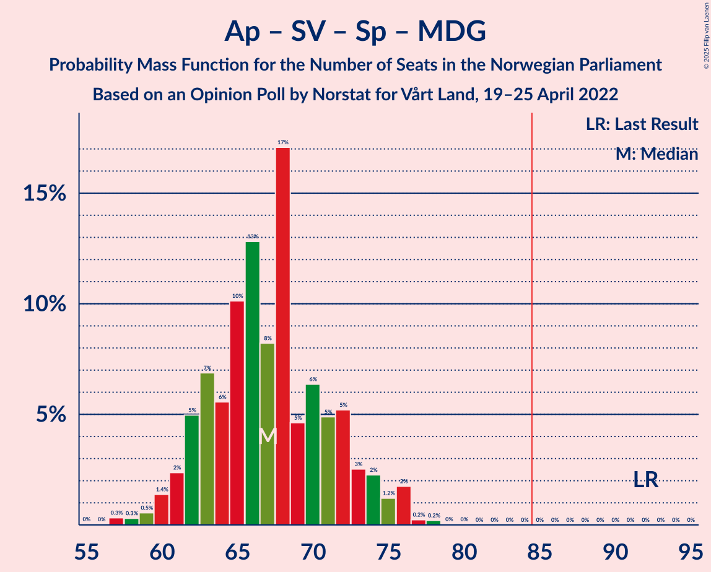

| Number of Seats | Probability | Accumulated | Special Marks |
|:---------------:|:-----------:|:-----------:|:-------------:|
| 55 | 0% | 100% |  |
| 56 | 0% | 99.9% |  |
| 57 | 0.3% | 99.9% |  |
| 58 | 0.3% | 99.6% |  |
| 59 | 0.5% | 99.3% |  |
| 60 | 1.4% | 98.7% |  |
| 61 | 2% | 97% |  |
| 62 | 5% | 95% |  |
| 63 | 7% | 90% |  |
| 64 | 6% | 83% |  |
| 65 | 10% | 78% |  |
| 66 | 13% | 67% | Median |
| 67 | 8% | 55% |  |
| 68 | 17% | 46% |  |
| 69 | 5% | 29% |  |
| 70 | 6% | 25% |  |
| 71 | 5% | 18% |  |
| 72 | 5% | 13% |  |
| 73 | 3% | 8% |  |
| 74 | 2% | 6% |  |
| 75 | 1.2% | 3% |  |
| 76 | 2% | 2% |  |
| 77 | 0.2% | 0.5% |  |
| 78 | 0.2% | 0.3% |  |
| 79 | 0% | 0.1% |  |
| 80 | 0% | 0% |  |
| 81 | 0% | 0% |  |
| 82 | 0% | 0% |  |
| 83 | 0% | 0% |  |
| 84 | 0% | 0% |  |
| 85 | 0% | 0% | Majority |
| 86 | 0% | 0% |  |
| 87 | 0% | 0% |  |
| 88 | 0% | 0% |  |
| 89 | 0% | 0% |  |
| 90 | 0% | 0% |  |
| 91 | 0% | 0% |  |
| 92 | 0% | 0% | Last Result |

### Arbeiderpartiet – Sosialistisk Venstreparti – Senterpartiet

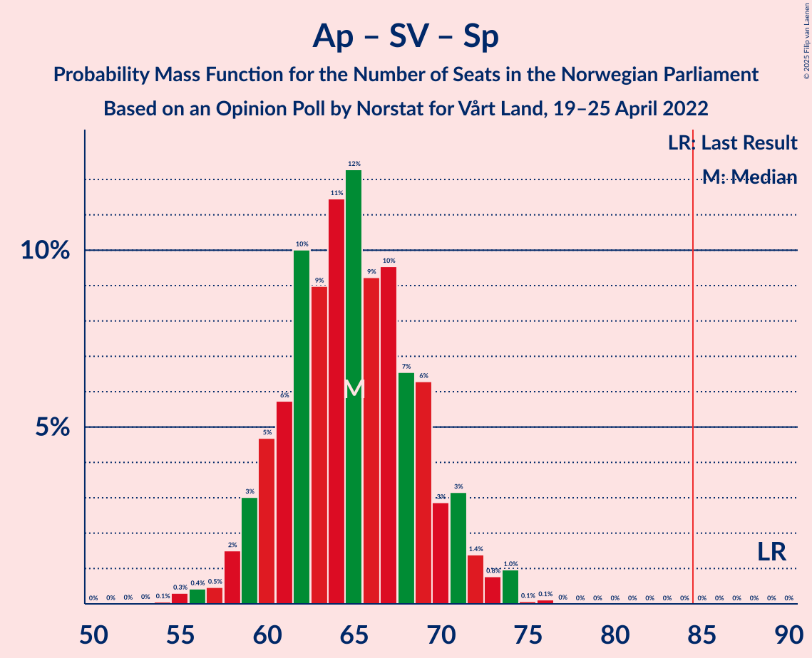

| Number of Seats | Probability | Accumulated | Special Marks |
|:---------------:|:-----------:|:-----------:|:-------------:|
| 53 | 0% | 100% |  |
| 54 | 0.1% | 99.9% |  |
| 55 | 0.3% | 99.9% |  |
| 56 | 0.4% | 99.6% |  |
| 57 | 0.5% | 99.1% |  |
| 58 | 2% | 98.7% |  |
| 59 | 3% | 97% |  |
| 60 | 5% | 94% |  |
| 61 | 6% | 89% |  |
| 62 | 10% | 84% |  |
| 63 | 9% | 74% |  |
| 64 | 11% | 65% | Median |
| 65 | 12% | 53% |  |
| 66 | 9% | 41% |  |
| 67 | 10% | 32% |  |
| 68 | 7% | 22% |  |
| 69 | 6% | 16% |  |
| 70 | 3% | 9% |  |
| 71 | 3% | 7% |  |
| 72 | 1.4% | 3% |  |
| 73 | 0.8% | 2% |  |
| 74 | 1.0% | 1.2% |  |
| 75 | 0.1% | 0.2% |  |
| 76 | 0.1% | 0.1% |  |
| 77 | 0% | 0% |  |
| 78 | 0% | 0% |  |
| 79 | 0% | 0% |  |
| 80 | 0% | 0% |  |
| 81 | 0% | 0% |  |
| 82 | 0% | 0% |  |
| 83 | 0% | 0% |  |
| 84 | 0% | 0% |  |
| 85 | 0% | 0% | Majority |
| 86 | 0% | 0% |  |
| 87 | 0% | 0% |  |
| 88 | 0% | 0% |  |
| 89 | 0% | 0% | Last Result |

### Høyre – Venstre – Kristelig Folkeparti

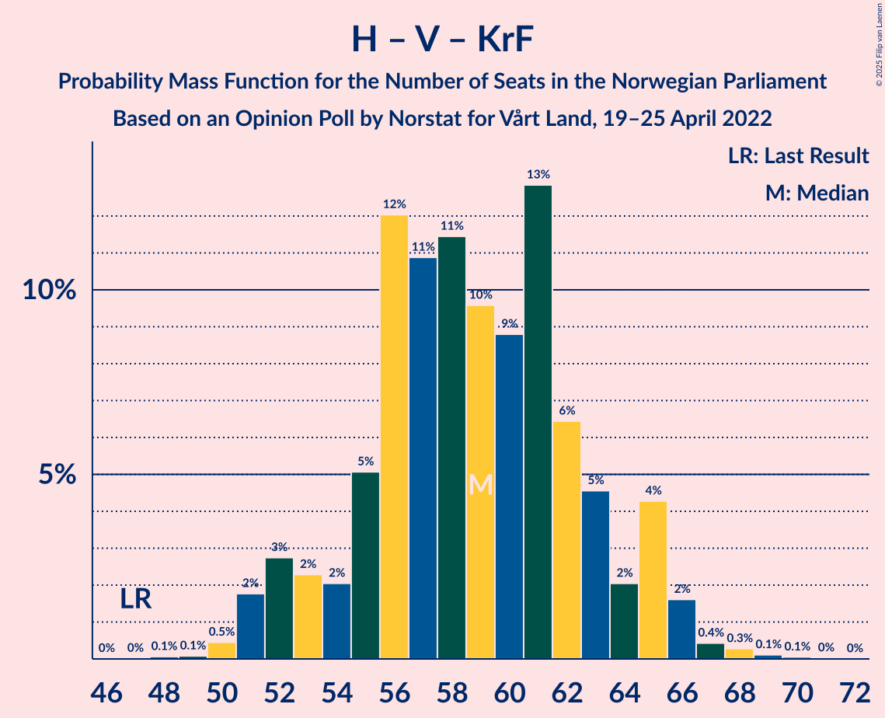

| Number of Seats | Probability | Accumulated | Special Marks |
|:---------------:|:-----------:|:-----------:|:-------------:|
| 47 | 0% | 100% | Last Result |
| 48 | 0.1% | 100% |  |
| 49 | 0.1% | 99.9% |  |
| 50 | 0.5% | 99.8% |  |
| 51 | 2% | 99.4% |  |
| 52 | 3% | 98% |  |
| 53 | 2% | 95% |  |
| 54 | 2% | 93% |  |
| 55 | 5% | 91% |  |
| 56 | 12% | 85% |  |
| 57 | 11% | 73% |  |
| 58 | 11% | 63% |  |
| 59 | 10% | 51% | Median |
| 60 | 9% | 41% |  |
| 61 | 13% | 33% |  |
| 62 | 6% | 20% |  |
| 63 | 5% | 13% |  |
| 64 | 2% | 9% |  |
| 65 | 4% | 7% |  |
| 66 | 2% | 3% |  |
| 67 | 0.4% | 0.9% |  |
| 68 | 0.3% | 0.5% |  |
| 69 | 0.1% | 0.2% |  |
| 70 | 0.1% | 0.1% |  |
| 71 | 0% | 0% |  |

### Arbeiderpartiet – Sosialistisk Venstreparti

| Number of Seats | Probability | Accumulated | Special Marks |
|:---------------:|:-----------:|:-----------:|:-------------:|
| 46 | 0% | 100% |  |
| 47 | 0.2% | 99.9% |  |
| 48 | 0.4% | 99.8% |  |
| 49 | 1.2% | 99.4% |  |
| 50 | 2% | 98% |  |
| 51 | 5% | 97% |  |
| 52 | 5% | 92% |  |
| 53 | 14% | 87% |  |
| 54 | 11% | 73% |  |
| 55 | 9% | 62% | Median |
| 56 | 17% | 53% |  |
| 57 | 11% | 36% |  |
| 58 | 10% | 26% |  |
| 59 | 5% | 16% |  |
| 60 | 4% | 11% |  |
| 61 | 3% | 7% | Last Result |
| 62 | 2% | 4% |  |
| 63 | 0.8% | 3% |  |
| 64 | 1.3% | 2% |  |
| 65 | 0.2% | 0.4% |  |
| 66 | 0.1% | 0.2% |  |
| 67 | 0% | 0.1% |  |
| 68 | 0% | 0% |  |

### Arbeiderpartiet – Senterpartiet – Kristelig Folkeparti – Miljøpartiet De Grønne

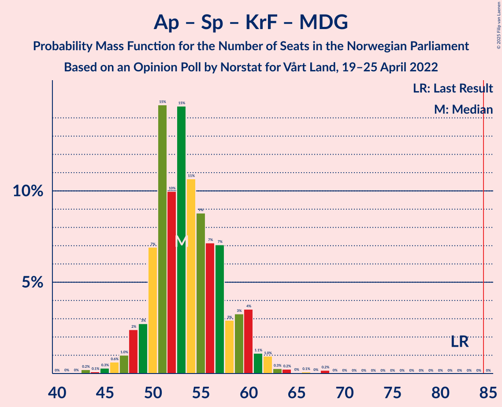

| Number of Seats | Probability | Accumulated | Special Marks |
|:---------------:|:-----------:|:-----------:|:-------------:|
| 42 | 0% | 100% |  |
| 43 | 0.2% | 99.9% |  |
| 44 | 0.1% | 99.7% |  |
| 45 | 0.3% | 99.6% |  |
| 46 | 0.6% | 99.3% |  |
| 47 | 1.0% | 98.7% |  |
| 48 | 2% | 98% |  |
| 49 | 3% | 95% |  |
| 50 | 7% | 93% |  |
| 51 | 15% | 86% |  |
| 52 | 10% | 71% | Median |
| 53 | 15% | 61% |  |
| 54 | 11% | 46% |  |
| 55 | 9% | 36% |  |
| 56 | 7% | 27% |  |
| 57 | 7% | 20% |  |
| 58 | 3% | 13% |  |
| 59 | 3% | 10% |  |
| 60 | 4% | 6% |  |
| 61 | 1.1% | 3% |  |
| 62 | 1.0% | 2% |  |
| 63 | 0.3% | 0.9% |  |
| 64 | 0.2% | 0.6% |  |
| 65 | 0% | 0.4% |  |
| 66 | 0.1% | 0.3% |  |
| 67 | 0% | 0.2% |  |
| 68 | 0.2% | 0.2% |  |
| 69 | 0% | 0% |  |
| 70 | 0% | 0% |  |
| 71 | 0% | 0% |  |
| 72 | 0% | 0% |  |
| 73 | 0% | 0% |  |
| 74 | 0% | 0% |  |
| 75 | 0% | 0% |  |
| 76 | 0% | 0% |  |
| 77 | 0% | 0% |  |
| 78 | 0% | 0% |  |
| 79 | 0% | 0% |  |
| 80 | 0% | 0% |  |
| 81 | 0% | 0% |  |
| 82 | 0% | 0% | Last Result |

### Arbeiderpartiet – Senterpartiet – Kristelig Folkeparti

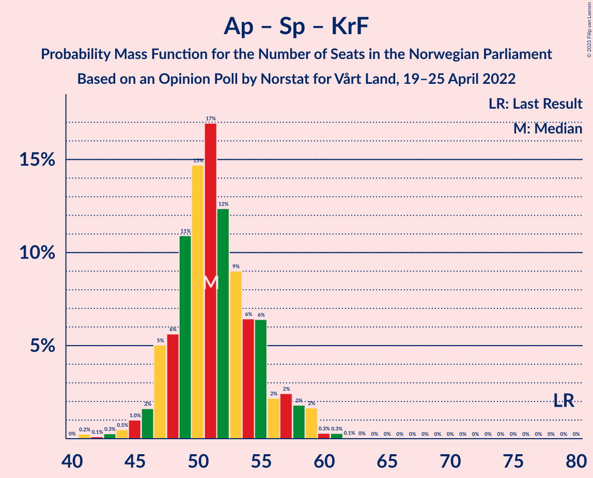

| Number of Seats | Probability | Accumulated | Special Marks |
|:---------------:|:-----------:|:-----------:|:-------------:|
| 41 | 0.2% | 100% |  |
| 42 | 0.1% | 99.7% |  |
| 43 | 0.3% | 99.6% |  |
| 44 | 0.5% | 99.3% |  |
| 45 | 1.0% | 98.8% |  |
| 46 | 2% | 98% |  |
| 47 | 5% | 96% |  |
| 48 | 6% | 91% |  |
| 49 | 11% | 86% |  |
| 50 | 15% | 75% | Median |
| 51 | 17% | 60% |  |
| 52 | 12% | 43% |  |
| 53 | 9% | 31% |  |
| 54 | 6% | 22% |  |
| 55 | 6% | 15% |  |
| 56 | 2% | 9% |  |
| 57 | 2% | 7% |  |
| 58 | 2% | 4% |  |
| 59 | 2% | 2% |  |
| 60 | 0.3% | 0.7% |  |
| 61 | 0.3% | 0.4% |  |
| 62 | 0.1% | 0.1% |  |
| 63 | 0% | 0.1% |  |
| 64 | 0% | 0% |  |
| 65 | 0% | 0% |  |
| 66 | 0% | 0% |  |
| 67 | 0% | 0% |  |
| 68 | 0% | 0% |  |
| 69 | 0% | 0% |  |
| 70 | 0% | 0% |  |
| 71 | 0% | 0% |  |
| 72 | 0% | 0% |  |
| 73 | 0% | 0% |  |
| 74 | 0% | 0% |  |
| 75 | 0% | 0% |  |
| 76 | 0% | 0% |  |
| 77 | 0% | 0% |  |
| 78 | 0% | 0% |  |
| 79 | 0% | 0% | Last Result |

### Arbeiderpartiet – Senterpartiet

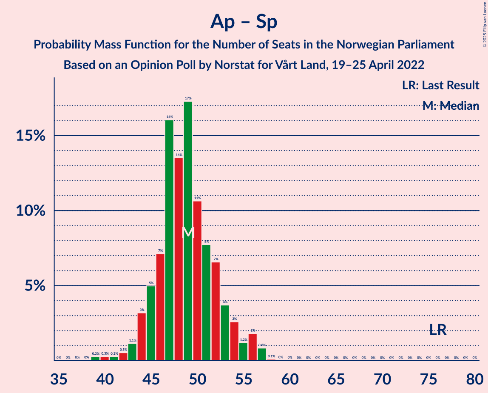

| Number of Seats | Probability | Accumulated | Special Marks |
|:---------------:|:-----------:|:-----------:|:-------------:|
| 38 | 0% | 100% |  |
| 39 | 0.3% | 99.9% |  |
| 40 | 0.3% | 99.7% |  |
| 41 | 0.3% | 99.4% |  |
| 42 | 0.5% | 99.1% |  |
| 43 | 1.1% | 98.6% |  |
| 44 | 3% | 97% |  |
| 45 | 5% | 94% |  |
| 46 | 7% | 89% |  |
| 47 | 16% | 82% |  |
| 48 | 14% | 66% | Median |
| 49 | 17% | 53% |  |
| 50 | 11% | 35% |  |
| 51 | 8% | 25% |  |
| 52 | 7% | 17% |  |
| 53 | 4% | 10% |  |
| 54 | 3% | 7% |  |
| 55 | 1.2% | 4% |  |
| 56 | 2% | 3% |  |
| 57 | 0.8% | 1.0% |  |
| 58 | 0.1% | 0.2% |  |
| 59 | 0% | 0.1% |  |
| 60 | 0% | 0% |  |
| 61 | 0% | 0% |  |
| 62 | 0% | 0% |  |
| 63 | 0% | 0% |  |
| 64 | 0% | 0% |  |
| 65 | 0% | 0% |  |
| 66 | 0% | 0% |  |
| 67 | 0% | 0% |  |
| 68 | 0% | 0% |  |
| 69 | 0% | 0% |  |
| 70 | 0% | 0% |  |
| 71 | 0% | 0% |  |
| 72 | 0% | 0% |  |
| 73 | 0% | 0% |  |
| 74 | 0% | 0% |  |
| 75 | 0% | 0% |  |
| 76 | 0% | 0% | Last Result |

### Senterpartiet – Venstre – Kristelig Folkeparti

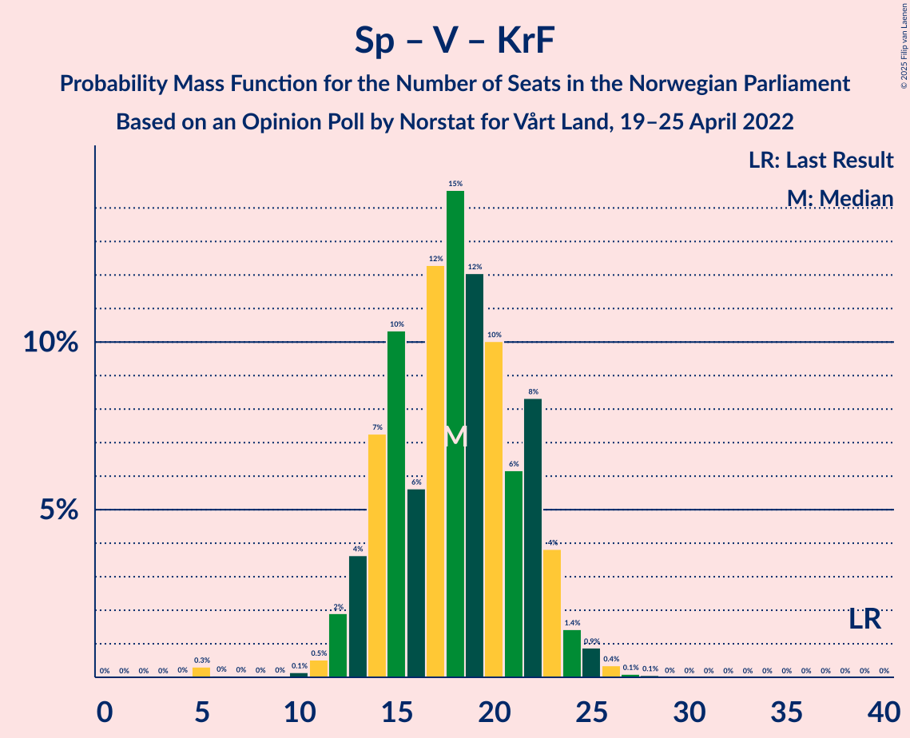

| Number of Seats | Probability | Accumulated | Special Marks |
|:---------------:|:-----------:|:-----------:|:-------------:|
| 5 | 0.3% | 100% |  |
| 6 | 0% | 99.7% |  |
| 7 | 0% | 99.6% |  |
| 8 | 0% | 99.6% |  |
| 9 | 0% | 99.6% |  |
| 10 | 0.1% | 99.5% |  |
| 11 | 0.5% | 99.4% |  |
| 12 | 2% | 98.9% |  |
| 13 | 4% | 97% |  |
| 14 | 7% | 93% |  |
| 15 | 10% | 86% |  |
| 16 | 6% | 76% |  |
| 17 | 12% | 70% |  |
| 18 | 15% | 58% | Median |
| 19 | 12% | 43% |  |
| 20 | 10% | 31% |  |
| 21 | 6% | 21% |  |
| 22 | 8% | 15% |  |
| 23 | 4% | 7% |  |
| 24 | 1.4% | 3% |  |
| 25 | 0.9% | 1.4% |  |
| 26 | 0.4% | 0.5% |  |
| 27 | 0.1% | 0.2% |  |
| 28 | 0.1% | 0.1% |  |
| 29 | 0% | 0% |  |
| 30 | 0% | 0% |  |
| 31 | 0% | 0% |  |
| 32 | 0% | 0% |  |
| 33 | 0% | 0% |  |
| 34 | 0% | 0% |  |
| 35 | 0% | 0% |  |
| 36 | 0% | 0% |  |
| 37 | 0% | 0% |  |
| 38 | 0% | 0% |  |
| 39 | 0% | 0% | Last Result |

## Technical Information

### Opinion Poll

+ **Polling firm:** Norstat
+ **Commissioner(s):** Vårt Land
+ **Fieldwork period:** 19–25 April 2022

### Calculations

+ **Sample size:** 952
+ **Simulations done:** 1,048,576
+ **Error estimate:** 1.25%

