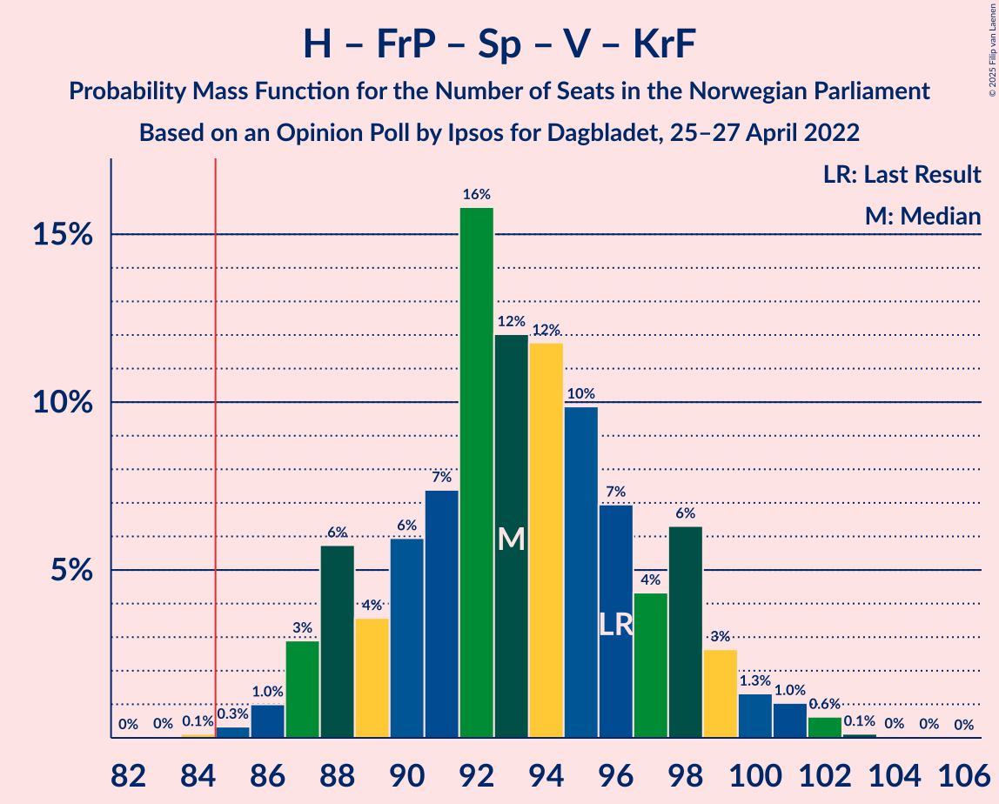

# Opinion Poll by Ipsos for Dagbladet, 25–27 April 2022

<a href="#voting-intentions">Voting Intentions</a> | <a href="#seats">Seats</a> | <a href="#coalitions">Coalitions</a> | <a href="#technical-information">Technical Information</a>

## Voting Intentions

### Confidence Intervals

| Party | Last Result | Poll Result | 80% Confidence Interval | 90% Confidence Interval | 95% Confidence Interval | 99% Confidence Interval |
|:-----:|:-----------:|:-----------:|:-----------------------:|:-----------------------:|:-----------------------:|:-----------------------:|
| Høyre | 20.4% | 26.2% | 24.4–28.1% |23.9–28.6% |23.5–29.1% |22.6–30.0% |
| Arbeiderpartiet | 26.2% | 23.8% | 22.1–25.7% |21.6–26.2% |21.2–26.7% |20.4–27.6% |
| Fremskrittspartiet | 11.6% | 10.6% | 9.4–12.0% |9.1–12.4% |8.8–12.7% |8.2–13.4% |
| Senterpartiet | 13.5% | 9.4% | 8.3–10.7% |8.0–11.1% |7.7–11.4% |7.2–12.1% |
| Sosialistisk Venstreparti | 7.6% | 8.5% | 7.5–9.8% |7.2–10.2% |6.9–10.5% |6.4–11.2% |
| Rødt | 4.7% | 5.9% | 5.0–7.0% |4.7–7.3% |4.5–7.6% |4.1–8.1% |
| Venstre | 4.6% | 5.4% | 4.6–6.5% |4.4–6.8% |4.2–7.1% |3.8–7.7% |
| Miljøpartiet De Grønne | 3.9% | 4.0% | 3.2–4.9% |3.0–5.2% |2.9–5.4% |2.6–5.9% |
| Kristelig Folkeparti | 3.8% | 3.4% | 2.8–4.3% |2.6–4.6% |2.4–4.8% |2.1–5.3% |

*Note:* The poll result column reflects the actual value used in the calculations. Published results may vary slightly, and in addition be rounded to fewer digits.

## Seats

### Confidence Intervals

| Party | Last Result | Median | 80% Confidence Interval | 90% Confidence Interval | 95% Confidence Interval | 99% Confidence Interval |
|:-----:|:-----------:|:------:|:-----------------------:|:-----------------------:|:-----------------------:|:-----------------------:|
| <a href="#høyre">Høyre</a> | 36 | 46 | 42–49 |42–50 |41–51 |40–53 |
| <a href="#arbeiderpartiet">Arbeiderpartiet</a> | 48 | 45 | 42–47 |41–48 |40–49 |38–50 |
| <a href="#fremskrittspartiet">Fremskrittspartiet</a> | 21 | 18 | 17–20 |16–21 |15–22 |14–23 |
| <a href="#senterpartiet">Senterpartiet</a> | 28 | 16 | 15–18 |14–19 |13–19 |12–21 |
| <a href="#sosialistisk-venstreparti">Sosialistisk Venstreparti</a> | 13 | 15 | 13–17 |12–18 |12–18 |11–19 |
| <a href="#rødt">Rødt</a> | 8 | 10 | 8–12 |8–12 |8–13 |7–14 |
| <a href="#venstre">Venstre</a> | 8 | 9 | 8–11 |7–12 |7–12 |3–13 |
| <a href="#miljøpartiet-de-grønne">Miljøpartiet De Grønne</a> | 3 | 7 | 2–8 |2–9 |1–9 |1–10 |
| <a href="#kristelig-folkeparti">Kristelig Folkeparti</a> | 3 | 2 | 2–7 |2–8 |1–8 |0–9 |

### Høyre

*For a full overview of the results for this party, see the [Høyre](party-høyre.html) page.*

| Number of Seats | Probability | Accumulated | Special Marks |
|:---------------:|:-----------:|:-----------:|:-------------:|
| 36 | 0% | 100% | Last Result |
| 37 | 0% | 100% |  |
| 38 | 0% | 100% |  |
| 39 | 0.1% | 100% |  |
| 40 | 0.6% | 99.9% |  |
| 41 | 3% | 99.2% |  |
| 42 | 8% | 96% |  |
| 43 | 7% | 88% |  |
| 44 | 12% | 81% |  |
| 45 | 12% | 69% |  |
| 46 | 24% | 57% | Median |
| 47 | 10% | 33% |  |
| 48 | 11% | 23% |  |
| 49 | 6% | 12% |  |
| 50 | 2% | 6% |  |
| 51 | 1.4% | 3% |  |
| 52 | 1.0% | 2% |  |
| 53 | 0.6% | 0.9% |  |
| 54 | 0.1% | 0.2% |  |
| 55 | 0.1% | 0.1% |  |
| 56 | 0% | 0% |  |

### Arbeiderpartiet

*For a full overview of the results for this party, see the [Arbeiderpartiet](party-arbeiderpartiet.html) page.*

| Number of Seats | Probability | Accumulated | Special Marks |
|:---------------:|:-----------:|:-----------:|:-------------:|
| 36 | 0.1% | 100% |  |
| 37 | 0.2% | 99.8% |  |
| 38 | 0.3% | 99.6% |  |
| 39 | 0.8% | 99.3% |  |
| 40 | 2% | 98.6% |  |
| 41 | 3% | 97% |  |
| 42 | 7% | 94% |  |
| 43 | 7% | 87% |  |
| 44 | 15% | 80% |  |
| 45 | 26% | 65% | Median |
| 46 | 18% | 39% |  |
| 47 | 13% | 21% |  |
| 48 | 4% | 8% | Last Result |
| 49 | 2% | 4% |  |
| 50 | 0.8% | 1.2% |  |
| 51 | 0.2% | 0.4% |  |
| 52 | 0.1% | 0.2% |  |
| 53 | 0% | 0.1% |  |
| 54 | 0% | 0.1% |  |
| 55 | 0% | 0% |  |

### Fremskrittspartiet

*For a full overview of the results for this party, see the [Fremskrittspartiet](party-fremskrittspartiet.html) page.*

| Number of Seats | Probability | Accumulated | Special Marks |
|:---------------:|:-----------:|:-----------:|:-------------:|
| 12 | 0% | 100% |  |
| 13 | 0.1% | 99.9% |  |
| 14 | 1.0% | 99.8% |  |
| 15 | 2% | 98.8% |  |
| 16 | 6% | 97% |  |
| 17 | 19% | 91% |  |
| 18 | 32% | 72% | Median |
| 19 | 19% | 39% |  |
| 20 | 12% | 20% |  |
| 21 | 5% | 8% | Last Result |
| 22 | 3% | 3% |  |
| 23 | 0.5% | 0.8% |  |
| 24 | 0.2% | 0.2% |  |
| 25 | 0.1% | 0.1% |  |
| 26 | 0% | 0% |  |

### Senterpartiet

*For a full overview of the results for this party, see the [Senterpartiet](party-senterpartiet.html) page.*

| Number of Seats | Probability | Accumulated | Special Marks |
|:---------------:|:-----------:|:-----------:|:-------------:|
| 12 | 0.6% | 100% |  |
| 13 | 2% | 99.4% |  |
| 14 | 6% | 97% |  |
| 15 | 17% | 91% |  |
| 16 | 26% | 75% | Median |
| 17 | 22% | 49% |  |
| 18 | 19% | 26% |  |
| 19 | 5% | 7% |  |
| 20 | 2% | 2% |  |
| 21 | 0.6% | 0.8% |  |
| 22 | 0.1% | 0.2% |  |
| 23 | 0% | 0.1% |  |
| 24 | 0% | 0% |  |
| 25 | 0% | 0% |  |
| 26 | 0% | 0% |  |
| 27 | 0% | 0% |  |
| 28 | 0% | 0% | Last Result |

### Sosialistisk Venstreparti

*For a full overview of the results for this party, see the [Sosialistisk Venstreparti](party-sosialistiskvenstreparti.html) page.*

| Number of Seats | Probability | Accumulated | Special Marks |
|:---------------:|:-----------:|:-----------:|:-------------:|
| 10 | 0.4% | 100% |  |
| 11 | 2% | 99.6% |  |
| 12 | 7% | 98% |  |
| 13 | 13% | 91% | Last Result |
| 14 | 20% | 78% |  |
| 15 | 31% | 58% | Median |
| 16 | 13% | 27% |  |
| 17 | 9% | 14% |  |
| 18 | 4% | 5% |  |
| 19 | 1.3% | 2% |  |
| 20 | 0.3% | 0.4% |  |
| 21 | 0.1% | 0.1% |  |
| 22 | 0% | 0% |  |

### Rødt

*For a full overview of the results for this party, see the [Rødt](party-rødt.html) page.*

| Number of Seats | Probability | Accumulated | Special Marks |
|:---------------:|:-----------:|:-----------:|:-------------:|
| 1 | 0.3% | 100% |  |
| 2 | 0% | 99.7% |  |
| 3 | 0% | 99.7% |  |
| 4 | 0% | 99.7% |  |
| 5 | 0% | 99.7% |  |
| 6 | 0.1% | 99.7% |  |
| 7 | 2% | 99.7% |  |
| 8 | 9% | 98% | Last Result |
| 9 | 16% | 89% |  |
| 10 | 36% | 74% | Median |
| 11 | 19% | 37% |  |
| 12 | 13% | 18% |  |
| 13 | 3% | 5% |  |
| 14 | 0.9% | 1.1% |  |
| 15 | 0.2% | 0.2% |  |
| 16 | 0% | 0% |  |

### Venstre

*For a full overview of the results for this party, see the [Venstre](party-venstre.html) page.*

| Number of Seats | Probability | Accumulated | Special Marks |
|:---------------:|:-----------:|:-----------:|:-------------:|
| 2 | 0.4% | 100% |  |
| 3 | 0.9% | 99.6% |  |
| 4 | 0% | 98.8% |  |
| 5 | 0% | 98.8% |  |
| 6 | 0.1% | 98.8% |  |
| 7 | 4% | 98.6% |  |
| 8 | 17% | 95% | Last Result |
| 9 | 29% | 77% | Median |
| 10 | 28% | 49% |  |
| 11 | 14% | 20% |  |
| 12 | 5% | 7% |  |
| 13 | 1.1% | 1.4% |  |
| 14 | 0.2% | 0.2% |  |
| 15 | 0% | 0% |  |

### Miljøpartiet De Grønne

*For a full overview of the results for this party, see the [Miljøpartiet De Grønne](party-miljøpartietdegrønne.html) page.*

| Number of Seats | Probability | Accumulated | Special Marks |
|:---------------:|:-----------:|:-----------:|:-------------:|
| 1 | 4% | 100% |  |
| 2 | 27% | 96% |  |
| 3 | 14% | 69% | Last Result |
| 4 | 0% | 55% |  |
| 5 | 0% | 55% |  |
| 6 | 1.0% | 55% |  |
| 7 | 27% | 54% | Median |
| 8 | 21% | 27% |  |
| 9 | 5% | 6% |  |
| 10 | 1.0% | 1.1% |  |
| 11 | 0.1% | 0.1% |  |
| 12 | 0% | 0% |  |

### Kristelig Folkeparti

*For a full overview of the results for this party, see the [Kristelig Folkeparti](party-kristeligfolkeparti.html) page.*

| Number of Seats | Probability | Accumulated | Special Marks |
|:---------------:|:-----------:|:-----------:|:-------------:|
| 0 | 0.5% | 100% |  |
| 1 | 4% | 99.5% |  |
| 2 | 52% | 96% | Median |
| 3 | 21% | 43% | Last Result |
| 4 | 0% | 22% |  |
| 5 | 0% | 22% |  |
| 6 | 3% | 22% |  |
| 7 | 14% | 19% |  |
| 8 | 4% | 5% |  |
| 9 | 0.9% | 1.0% |  |
| 10 | 0.1% | 0.1% |  |
| 11 | 0% | 0% |  |

## Coalitions

### Confidence Intervals

| Coalition | Last Result | Median | Majority? | 80% Confidence Interval | 90% Confidence Interval | 95% Confidence Interval | 99% Confidence Interval |
|:---------:|:-----------:|:------:|:---------:|:-----------------------:|:-----------------------:|:-----------------------:|:-----------------------:|
| Høyre – Fremskrittspartiet – Senterpartiet – Venstre – Kristelig Folkeparti | 96 | 93 | 99.8% | 88–98 | 88–99 | 87–100 | 85–102 |
| Arbeiderpartiet – Senterpartiet – Sosialistisk Venstreparti – Rødt – Miljøpartiet De Grønne | 100 | 92 | 98% | 87–96 | 86–96 | 85–97 | 83–100 |
| Arbeiderpartiet – Senterpartiet – Sosialistisk Venstreparti – Rødt | 97 | 87 | 77% | 83–90 | 81–91 | 80–92 | 78–94 |
| Arbeiderpartiet – Senterpartiet – Sosialistisk Venstreparti – Miljøpartiet De Grønne – Kristelig Folkeparti | 95 | 85 | 57% | 81–88 | 79–89 | 78–90 | 76–93 |
| Høyre – Fremskrittspartiet – Venstre – Miljøpartiet De Grønne – Kristelig Folkeparti | 71 | 82 | 17% | 78–85 | 77–87 | 76–88 | 74–90 |
| Arbeiderpartiet – Senterpartiet – Sosialistisk Venstreparti – Miljøpartiet De Grønne | 92 | 82 | 11% | 77–85 | 76–85 | 75–86 | 73–90 |
| Høyre – Fremskrittspartiet – Venstre – Kristelig Folkeparti | 68 | 76 | 0.6% | 73–81 | 72–82 | 72–83 | 69–85 |
| Arbeiderpartiet – Senterpartiet – Sosialistisk Venstreparti | 89 | 76 | 0.3% | 73–79 | 71–80 | 70–82 | 68–84 |
| Arbeiderpartiet – Sosialistisk Venstreparti – Rødt – Miljøpartiet De Grønne | 72 | 75 | 0.1% | 71–80 | 70–80 | 68–81 | 66–83 |
| Høyre – Fremskrittspartiet – Venstre | 65 | 73 | 0% | 70–77 | 69–78 | 69–79 | 66–81 |
| Arbeiderpartiet – Senterpartiet – Miljøpartiet De Grønne – Kristelig Folkeparti | 82 | 71 | 0% | 66–74 | 64–75 | 62–76 | 61–78 |
| Arbeiderpartiet – Senterpartiet – Kristelig Folkeparti | 79 | 64 | 0% | 61–68 | 60–69 | 59–70 | 57–73 |
| Høyre – Fremskrittspartiet | 57 | 64 | 0% | 61–68 | 60–69 | 59–69 | 57–72 |
| Arbeiderpartiet – Senterpartiet | 76 | 62 | 0% | 59–64 | 57–65 | 56–67 | 54–69 |
| Høyre – Venstre – Kristelig Folkeparti | 47 | 58 | 0% | 54–63 | 54–64 | 53–65 | 51–67 |
| Arbeiderpartiet – Sosialistisk Venstreparti | 61 | 60 | 0% | 57–63 | 55–64 | 54–64 | 53–66 |
| Senterpartiet – Venstre – Kristelig Folkeparti | 39 | 29 | 0% | 26–33 | 25–34 | 24–35 | 22–37 |

### Høyre – Fremskrittspartiet – Senterpartiet – Venstre – Kristelig Folkeparti

| Number of Seats | Probability | Accumulated | Special Marks |
|:---------------:|:-----------:|:-----------:|:-------------:|
| 83 | 0% | 100% |  |
| 84 | 0.1% | 99.9% |  |
| 85 | 0.3% | 99.8% | Majority |
| 86 | 1.0% | 99.5% |  |
| 87 | 3% | 98% |  |
| 88 | 6% | 96% |  |
| 89 | 4% | 90% |  |
| 90 | 6% | 86% |  |
| 91 | 7% | 80% | Median |
| 92 | 16% | 73% |  |
| 93 | 12% | 57% |  |
| 94 | 12% | 45% |  |
| 95 | 10% | 33% |  |
| 96 | 7% | 23% | Last Result |
| 97 | 4% | 16% |  |
| 98 | 6% | 12% |  |
| 99 | 3% | 6% |  |
| 100 | 1.3% | 3% |  |
| 101 | 1.0% | 2% |  |
| 102 | 0.6% | 0.8% |  |
| 103 | 0.1% | 0.2% |  |
| 104 | 0% | 0.1% |  |
| 105 | 0% | 0% |  |

### Arbeiderpartiet – Senterpartiet – Sosialistisk Venstreparti – Rødt – Miljøpartiet De Grønne

| Number of Seats | Probability | Accumulated | Special Marks |
|:---------------:|:-----------:|:-----------:|:-------------:|
| 80 | 0% | 100% |  |
| 81 | 0.1% | 99.9% |  |
| 82 | 0.3% | 99.8% |  |
| 83 | 0.5% | 99.6% |  |
| 84 | 0.9% | 99.1% |  |
| 85 | 2% | 98% | Majority |
| 86 | 3% | 96% |  |
| 87 | 6% | 93% |  |
| 88 | 6% | 87% |  |
| 89 | 8% | 80% |  |
| 90 | 10% | 73% |  |
| 91 | 8% | 63% |  |
| 92 | 7% | 54% |  |
| 93 | 12% | 47% | Median |
| 94 | 19% | 35% |  |
| 95 | 5% | 15% |  |
| 96 | 8% | 10% |  |
| 97 | 0.6% | 3% |  |
| 98 | 1.0% | 2% |  |
| 99 | 0.3% | 0.9% |  |
| 100 | 0.2% | 0.6% | Last Result |
| 101 | 0.3% | 0.4% |  |
| 102 | 0.1% | 0.1% |  |
| 103 | 0% | 0% |  |

### Arbeiderpartiet – Senterpartiet – Sosialistisk Venstreparti – Rødt

| Number of Seats | Probability | Accumulated | Special Marks |
|:---------------:|:-----------:|:-----------:|:-------------:|
| 76 | 0.1% | 100% |  |
| 77 | 0.2% | 99.9% |  |
| 78 | 0.6% | 99.7% |  |
| 79 | 0.7% | 99.1% |  |
| 80 | 1.3% | 98% |  |
| 81 | 3% | 97% |  |
| 82 | 2% | 94% |  |
| 83 | 7% | 91% |  |
| 84 | 8% | 85% |  |
| 85 | 10% | 77% | Majority |
| 86 | 17% | 68% | Median |
| 87 | 21% | 50% |  |
| 88 | 10% | 29% |  |
| 89 | 6% | 19% |  |
| 90 | 4% | 13% |  |
| 91 | 5% | 9% |  |
| 92 | 1.3% | 3% |  |
| 93 | 1.3% | 2% |  |
| 94 | 0.4% | 0.8% |  |
| 95 | 0.2% | 0.4% |  |
| 96 | 0.1% | 0.2% |  |
| 97 | 0% | 0.1% | Last Result |
| 98 | 0% | 0% |  |

### Arbeiderpartiet – Senterpartiet – Sosialistisk Venstreparti – Miljøpartiet De Grønne – Kristelig Folkeparti

| Number of Seats | Probability | Accumulated | Special Marks |
|:---------------:|:-----------:|:-----------:|:-------------:|
| 74 | 0% | 100% |  |
| 75 | 0.1% | 99.9% |  |
| 76 | 0.9% | 99.8% |  |
| 77 | 1.3% | 98.9% |  |
| 78 | 2% | 98% |  |
| 79 | 2% | 96% |  |
| 80 | 4% | 94% |  |
| 81 | 5% | 90% |  |
| 82 | 9% | 85% |  |
| 83 | 8% | 76% |  |
| 84 | 11% | 68% |  |
| 85 | 7% | 57% | Median, Majority |
| 86 | 24% | 50% |  |
| 87 | 13% | 25% |  |
| 88 | 6% | 13% |  |
| 89 | 4% | 7% |  |
| 90 | 1.3% | 3% |  |
| 91 | 1.1% | 2% |  |
| 92 | 0.5% | 1.1% |  |
| 93 | 0.3% | 0.6% |  |
| 94 | 0.2% | 0.3% |  |
| 95 | 0.1% | 0.1% | Last Result |
| 96 | 0% | 0.1% |  |
| 97 | 0% | 0% |  |

### Høyre – Fremskrittspartiet – Venstre – Miljøpartiet De Grønne – Kristelig Folkeparti

| Number of Seats | Probability | Accumulated | Special Marks |
|:---------------:|:-----------:|:-----------:|:-------------:|
| 71 | 0% | 100% | Last Result |
| 72 | 0% | 99.9% |  |
| 73 | 0.2% | 99.9% |  |
| 74 | 0.2% | 99.7% |  |
| 75 | 0.6% | 99.5% |  |
| 76 | 2% | 98.8% |  |
| 77 | 4% | 97% |  |
| 78 | 5% | 93% |  |
| 79 | 6% | 88% |  |
| 80 | 10% | 82% |  |
| 81 | 13% | 72% |  |
| 82 | 18% | 59% | Median |
| 83 | 15% | 41% |  |
| 84 | 8% | 26% |  |
| 85 | 9% | 17% | Majority |
| 86 | 3% | 9% |  |
| 87 | 3% | 6% |  |
| 88 | 1.1% | 3% |  |
| 89 | 0.8% | 2% |  |
| 90 | 0.5% | 0.8% |  |
| 91 | 0.2% | 0.3% |  |
| 92 | 0.1% | 0.1% |  |
| 93 | 0% | 0% |  |

### Arbeiderpartiet – Senterpartiet – Sosialistisk Venstreparti – Miljøpartiet De Grønne

| Number of Seats | Probability | Accumulated | Special Marks |
|:---------------:|:-----------:|:-----------:|:-------------:|
| 71 | 0.1% | 100% |  |
| 72 | 0.2% | 99.9% |  |
| 73 | 0.7% | 99.7% |  |
| 74 | 1.3% | 99.0% |  |
| 75 | 3% | 98% |  |
| 76 | 3% | 95% |  |
| 77 | 5% | 93% |  |
| 78 | 9% | 88% |  |
| 79 | 9% | 79% |  |
| 80 | 8% | 70% |  |
| 81 | 11% | 62% |  |
| 82 | 8% | 52% |  |
| 83 | 9% | 44% | Median |
| 84 | 23% | 35% |  |
| 85 | 7% | 11% | Majority |
| 86 | 2% | 5% |  |
| 87 | 0.8% | 2% |  |
| 88 | 0.3% | 2% |  |
| 89 | 0.7% | 1.3% |  |
| 90 | 0.2% | 0.6% |  |
| 91 | 0.3% | 0.4% |  |
| 92 | 0% | 0.1% | Last Result |
| 93 | 0% | 0% |  |

### Høyre – Fremskrittspartiet – Venstre – Kristelig Folkeparti

| Number of Seats | Probability | Accumulated | Special Marks |
|:---------------:|:-----------:|:-----------:|:-------------:|
| 67 | 0.1% | 100% |  |
| 68 | 0.3% | 99.9% | Last Result |
| 69 | 0.3% | 99.6% |  |
| 70 | 0.6% | 99.3% |  |
| 71 | 1.2% | 98.7% |  |
| 72 | 6% | 98% |  |
| 73 | 6% | 92% |  |
| 74 | 6% | 86% |  |
| 75 | 23% | 80% | Median |
| 76 | 9% | 57% |  |
| 77 | 9% | 48% |  |
| 78 | 10% | 39% |  |
| 79 | 9% | 29% |  |
| 80 | 5% | 20% |  |
| 81 | 6% | 14% |  |
| 82 | 5% | 9% |  |
| 83 | 1.5% | 4% |  |
| 84 | 2% | 2% |  |
| 85 | 0.4% | 0.6% | Majority |
| 86 | 0.1% | 0.2% |  |
| 87 | 0.1% | 0.1% |  |
| 88 | 0% | 0% |  |

### Arbeiderpartiet – Senterpartiet – Sosialistisk Venstreparti

| Number of Seats | Probability | Accumulated | Special Marks |
|:---------------:|:-----------:|:-----------:|:-------------:|
| 67 | 0.2% | 100% |  |
| 68 | 0.3% | 99.8% |  |
| 69 | 1.0% | 99.5% |  |
| 70 | 1.3% | 98.5% |  |
| 71 | 2% | 97% |  |
| 72 | 3% | 95% |  |
| 73 | 4% | 92% |  |
| 74 | 8% | 88% |  |
| 75 | 10% | 79% |  |
| 76 | 23% | 69% | Median |
| 77 | 25% | 46% |  |
| 78 | 7% | 21% |  |
| 79 | 7% | 14% |  |
| 80 | 3% | 7% |  |
| 81 | 2% | 5% |  |
| 82 | 1.2% | 3% |  |
| 83 | 0.6% | 1.3% |  |
| 84 | 0.5% | 0.8% |  |
| 85 | 0.1% | 0.3% | Majority |
| 86 | 0.1% | 0.2% |  |
| 87 | 0% | 0.1% |  |
| 88 | 0% | 0% |  |
| 89 | 0% | 0% | Last Result |

### Arbeiderpartiet – Sosialistisk Venstreparti – Rødt – Miljøpartiet De Grønne

| Number of Seats | Probability | Accumulated | Special Marks |
|:---------------:|:-----------:|:-----------:|:-------------:|
| 64 | 0.1% | 100% |  |
| 65 | 0.1% | 99.9% |  |
| 66 | 0.3% | 99.8% |  |
| 67 | 1.2% | 99.4% |  |
| 68 | 0.9% | 98% |  |
| 69 | 2% | 97% |  |
| 70 | 4% | 95% |  |
| 71 | 6% | 91% |  |
| 72 | 7% | 85% | Last Result |
| 73 | 10% | 78% |  |
| 74 | 12% | 69% |  |
| 75 | 11% | 57% |  |
| 76 | 8% | 47% |  |
| 77 | 18% | 39% | Median |
| 78 | 8% | 21% |  |
| 79 | 3% | 14% |  |
| 80 | 6% | 11% |  |
| 81 | 3% | 4% |  |
| 82 | 0.9% | 1.5% |  |
| 83 | 0.4% | 0.6% |  |
| 84 | 0.1% | 0.2% |  |
| 85 | 0% | 0.1% | Majority |
| 86 | 0% | 0% |  |

### Høyre – Fremskrittspartiet – Venstre

| Number of Seats | Probability | Accumulated | Special Marks |
|:---------------:|:-----------:|:-----------:|:-------------:|
| 64 | 0.1% | 100% |  |
| 65 | 0.2% | 99.9% | Last Result |
| 66 | 0.4% | 99.7% |  |
| 67 | 0.4% | 99.3% |  |
| 68 | 1.0% | 98.9% |  |
| 69 | 3% | 98% |  |
| 70 | 10% | 95% |  |
| 71 | 11% | 84% |  |
| 72 | 9% | 73% |  |
| 73 | 21% | 64% | Median |
| 74 | 10% | 43% |  |
| 75 | 11% | 33% |  |
| 76 | 6% | 22% |  |
| 77 | 7% | 16% |  |
| 78 | 4% | 9% |  |
| 79 | 2% | 5% |  |
| 80 | 1.0% | 2% |  |
| 81 | 0.9% | 1.3% |  |
| 82 | 0.2% | 0.4% |  |
| 83 | 0.1% | 0.1% |  |
| 84 | 0% | 0.1% |  |
| 85 | 0% | 0% | Majority |

### Arbeiderpartiet – Senterpartiet – Miljøpartiet De Grønne – Kristelig Folkeparti

| Number of Seats | Probability | Accumulated | Special Marks |
|:---------------:|:-----------:|:-----------:|:-------------:|
| 58 | 0.1% | 100% |  |
| 59 | 0.1% | 99.9% |  |
| 60 | 0.2% | 99.8% |  |
| 61 | 0.8% | 99.7% |  |
| 62 | 2% | 98.8% |  |
| 63 | 1.4% | 97% |  |
| 64 | 2% | 96% |  |
| 65 | 3% | 94% |  |
| 66 | 7% | 91% |  |
| 67 | 5% | 84% |  |
| 68 | 11% | 79% |  |
| 69 | 5% | 68% |  |
| 70 | 8% | 63% | Median |
| 71 | 26% | 55% |  |
| 72 | 13% | 29% |  |
| 73 | 5% | 16% |  |
| 74 | 6% | 12% |  |
| 75 | 3% | 6% |  |
| 76 | 1.1% | 3% |  |
| 77 | 1.0% | 2% |  |
| 78 | 0.3% | 0.6% |  |
| 79 | 0.1% | 0.3% |  |
| 80 | 0% | 0.2% |  |
| 81 | 0.1% | 0.1% |  |
| 82 | 0% | 0.1% | Last Result |
| 83 | 0% | 0% |  |

### Arbeiderpartiet – Senterpartiet – Kristelig Folkeparti

| Number of Seats | Probability | Accumulated | Special Marks |
|:---------------:|:-----------:|:-----------:|:-------------:|
| 55 | 0.1% | 100% |  |
| 56 | 0.2% | 99.9% |  |
| 57 | 0.5% | 99.7% |  |
| 58 | 1.2% | 99.2% |  |
| 59 | 2% | 98% |  |
| 60 | 3% | 96% |  |
| 61 | 4% | 93% |  |
| 62 | 4% | 89% |  |
| 63 | 15% | 85% | Median |
| 64 | 24% | 70% |  |
| 65 | 11% | 46% |  |
| 66 | 9% | 35% |  |
| 67 | 8% | 25% |  |
| 68 | 7% | 17% |  |
| 69 | 6% | 10% |  |
| 70 | 2% | 4% |  |
| 71 | 1.5% | 2% |  |
| 72 | 0.4% | 0.9% |  |
| 73 | 0.1% | 0.6% |  |
| 74 | 0.3% | 0.4% |  |
| 75 | 0.1% | 0.2% |  |
| 76 | 0% | 0.1% |  |
| 77 | 0% | 0% |  |
| 78 | 0% | 0% |  |
| 79 | 0% | 0% | Last Result |

### Høyre – Fremskrittspartiet

| Number of Seats | Probability | Accumulated | Special Marks |
|:---------------:|:-----------:|:-----------:|:-------------:|
| 55 | 0.1% | 100% |  |
| 56 | 0.1% | 99.9% |  |
| 57 | 0.3% | 99.8% | Last Result |
| 58 | 0.5% | 99.5% |  |
| 59 | 2% | 98.9% |  |
| 60 | 5% | 97% |  |
| 61 | 8% | 92% |  |
| 62 | 15% | 84% |  |
| 63 | 13% | 69% |  |
| 64 | 17% | 56% | Median |
| 65 | 14% | 39% |  |
| 66 | 8% | 25% |  |
| 67 | 7% | 17% |  |
| 68 | 4% | 11% |  |
| 69 | 4% | 7% |  |
| 70 | 0.8% | 2% |  |
| 71 | 0.9% | 2% |  |
| 72 | 0.4% | 0.7% |  |
| 73 | 0.2% | 0.4% |  |
| 74 | 0% | 0.2% |  |
| 75 | 0.1% | 0.1% |  |
| 76 | 0% | 0% |  |

### Arbeiderpartiet – Senterpartiet

| Number of Seats | Probability | Accumulated | Special Marks |
|:---------------:|:-----------:|:-----------:|:-------------:|
| 52 | 0% | 100% |  |
| 53 | 0.2% | 99.9% |  |
| 54 | 0.4% | 99.8% |  |
| 55 | 0.7% | 99.4% |  |
| 56 | 2% | 98.6% |  |
| 57 | 3% | 96% |  |
| 58 | 4% | 94% |  |
| 59 | 6% | 90% |  |
| 60 | 11% | 84% |  |
| 61 | 20% | 73% | Median |
| 62 | 28% | 53% |  |
| 63 | 13% | 25% |  |
| 64 | 5% | 12% |  |
| 65 | 3% | 7% |  |
| 66 | 0.8% | 4% |  |
| 67 | 2% | 3% |  |
| 68 | 0.5% | 1.4% |  |
| 69 | 0.6% | 0.9% |  |
| 70 | 0.2% | 0.3% |  |
| 71 | 0.1% | 0.1% |  |
| 72 | 0% | 0% |  |
| 73 | 0% | 0% |  |
| 74 | 0% | 0% |  |
| 75 | 0% | 0% |  |
| 76 | 0% | 0% | Last Result |

### Høyre – Venstre – Kristelig Folkeparti

| Number of Seats | Probability | Accumulated | Special Marks |
|:---------------:|:-----------:|:-----------:|:-------------:|
| 47 | 0% | 100% | Last Result |
| 48 | 0% | 100% |  |
| 49 | 0% | 100% |  |
| 50 | 0.2% | 99.9% |  |
| 51 | 0.6% | 99.7% |  |
| 52 | 0.6% | 99.1% |  |
| 53 | 3% | 98% |  |
| 54 | 7% | 96% |  |
| 55 | 8% | 89% |  |
| 56 | 8% | 82% |  |
| 57 | 15% | 74% | Median |
| 58 | 12% | 59% |  |
| 59 | 14% | 47% |  |
| 60 | 9% | 33% |  |
| 61 | 6% | 24% |  |
| 62 | 7% | 18% |  |
| 63 | 3% | 11% |  |
| 64 | 3% | 7% |  |
| 65 | 3% | 4% |  |
| 66 | 0.6% | 1.5% |  |
| 67 | 0.7% | 0.9% |  |
| 68 | 0.1% | 0.2% |  |
| 69 | 0% | 0.1% |  |
| 70 | 0% | 0.1% |  |
| 71 | 0% | 0% |  |

### Arbeiderpartiet – Sosialistisk Venstreparti

| Number of Seats | Probability | Accumulated | Special Marks |
|:---------------:|:-----------:|:-----------:|:-------------:|
| 50 | 0.1% | 100% |  |
| 51 | 0.2% | 99.9% |  |
| 52 | 0.2% | 99.7% |  |
| 53 | 1.2% | 99.5% |  |
| 54 | 1.1% | 98% |  |
| 55 | 3% | 97% |  |
| 56 | 4% | 94% |  |
| 57 | 7% | 90% |  |
| 58 | 15% | 84% |  |
| 59 | 11% | 69% |  |
| 60 | 24% | 58% | Median |
| 61 | 13% | 34% | Last Result |
| 62 | 8% | 21% |  |
| 63 | 6% | 13% |  |
| 64 | 4% | 6% |  |
| 65 | 1.3% | 2% |  |
| 66 | 0.6% | 1.1% |  |
| 67 | 0.3% | 0.5% |  |
| 68 | 0.1% | 0.2% |  |
| 69 | 0.1% | 0.1% |  |
| 70 | 0% | 0% |  |

### Senterpartiet – Venstre – Kristelig Folkeparti

| Number of Seats | Probability | Accumulated | Special Marks |
|:---------------:|:-----------:|:-----------:|:-------------:|
| 19 | 0.1% | 100% |  |
| 20 | 0.1% | 99.9% |  |
| 21 | 0.2% | 99.8% |  |
| 22 | 0.2% | 99.7% |  |
| 23 | 0.5% | 99.5% |  |
| 24 | 2% | 98.9% |  |
| 25 | 3% | 97% |  |
| 26 | 7% | 94% |  |
| 27 | 12% | 86% | Median |
| 28 | 19% | 75% |  |
| 29 | 14% | 55% |  |
| 30 | 12% | 41% |  |
| 31 | 9% | 30% |  |
| 32 | 8% | 20% |  |
| 33 | 6% | 12% |  |
| 34 | 2% | 7% |  |
| 35 | 2% | 4% |  |
| 36 | 1.4% | 2% |  |
| 37 | 0.4% | 0.6% |  |
| 38 | 0.1% | 0.1% |  |
| 39 | 0% | 0.1% | Last Result |
| 40 | 0% | 0% |  |

## Technical Information

### Opinion Poll

+ **Polling firm:** Ipsos
+ **Commissioner(s):** Dagbladet
+ **Fieldwork period:** 25–27 April 2022

### Calculations

+ **Sample size:** 936
+ **Simulations done:** 1,048,576
+ **Error estimate:** 1.07%

