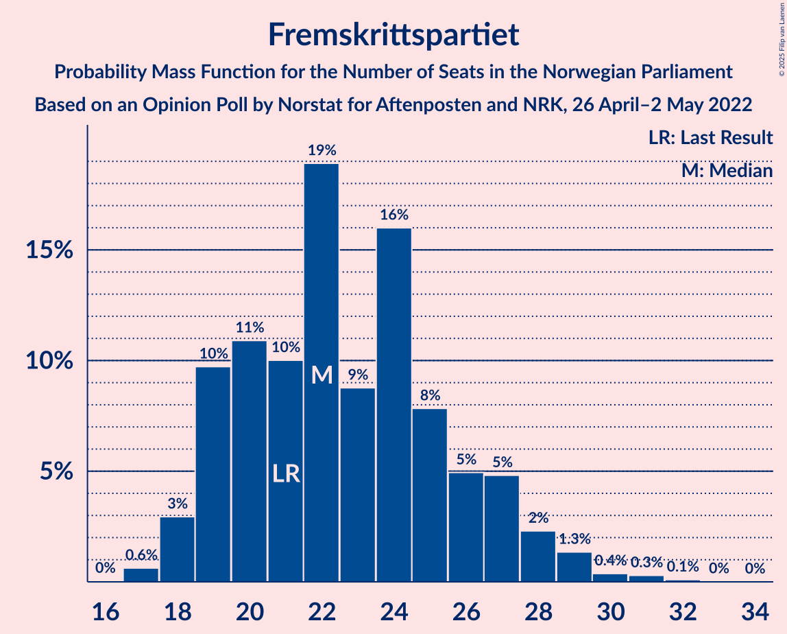
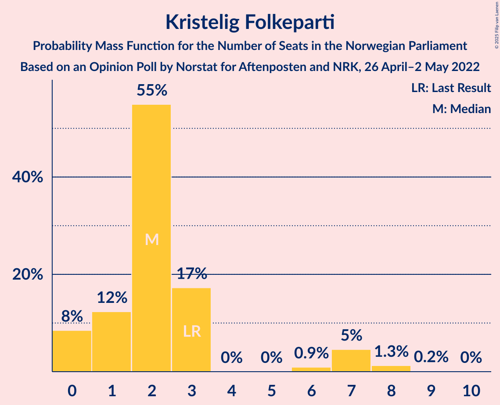
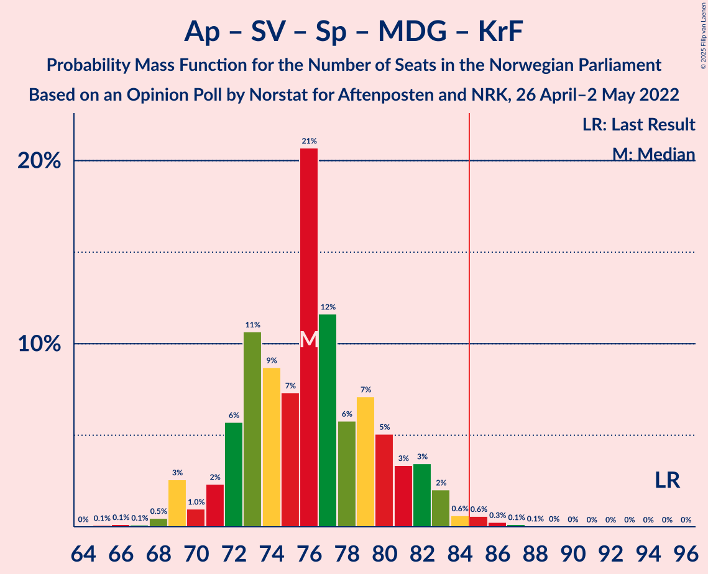

# Opinion Poll by Norstat for Aftenposten and NRK, 26 April–2 May 2022

<a href="#voting-intentions">Voting Intentions</a> | <a href="#seats">Seats</a> | <a href="#coalitions">Coalitions</a> | <a href="#technical-information">Technical Information</a>

## Voting Intentions

### Confidence Intervals

| Party | Last Result | Poll Result | 80% Confidence Interval | 90% Confidence Interval | 95% Confidence Interval | 99% Confidence Interval |
|:-----:|:-----------:|:-----------:|:-----------------------:|:-----------------------:|:-----------------------:|:-----------------------:|
| Høyre | 20.4% | 26.4% | 24.4–28.6% |23.9–29.2% |23.4–29.7% |22.4–30.8% |
| Arbeiderpartiet | 26.2% | 24.8% | 22.8–26.9% |22.3–27.5% |21.8–28.0% |20.9–29.1% |
| Fremskrittspartiet | 11.6% | 12.9% | 11.5–14.6% |11.1–15.1% |10.7–15.6% |10.0–16.4% |
| Sosialistisk Venstreparti | 7.6% | 7.5% | 6.4–8.9% |6.1–9.3% |5.9–9.7% |5.4–10.4% |
| Rødt | 4.7% | 6.7% | 5.7–8.1% |5.4–8.4% |5.2–8.8% |4.7–9.5% |
| Senterpartiet | 13.5% | 6.6% | 5.6–7.9% |5.3–8.3% |5.0–8.6% |4.6–9.3% |
| Venstre | 4.6% | 5.0% | 4.1–6.2% |3.8–6.5% |3.6–6.8% |3.2–7.4% |
| Miljøpartiet De Grønne | 3.9% | 3.2% | 2.5–4.2% |2.3–4.5% |2.2–4.8% |1.9–5.3% |
| Kristelig Folkeparti | 3.8% | 3.0% | 2.3–3.9% |2.1–4.2% |2.0–4.5% |1.7–5.0% |

*Note:* The poll result column reflects the actual value used in the calculations. Published results may vary slightly, and in addition be rounded to fewer digits.

## Seats

### Confidence Intervals

| Party | Last Result | Median | 80% Confidence Interval | 90% Confidence Interval | 95% Confidence Interval | 99% Confidence Interval |
|:-----:|:-----------:|:------:|:-----------------------:|:-----------------------:|:-----------------------:|:-----------------------:|
| <a href="#høyre">Høyre</a> | 36 | 48 | 44–50 |43–51 |42–52 |40–53 |
| <a href="#arbeiderpartiet">Arbeiderpartiet</a> | 48 | 48 | 44–50 |42–52 |41–53 |39–55 |
| <a href="#fremskrittspartiet">Fremskrittspartiet</a> | 21 | 22 | 19–26 |19–27 |18–28 |17–30 |
| <a href="#sosialistisk-venstreparti">Sosialistisk Venstreparti</a> | 13 | 13 | 10–15 |10–16 |9–17 |8–18 |
| <a href="#rødt">Rødt</a> | 8 | 11 | 9–13 |9–14 |8–15 |7–16 |
| <a href="#senterpartiet">Senterpartiet</a> | 28 | 11 | 9–14 |9–14 |8–15 |7–16 |
| <a href="#venstre">Venstre</a> | 8 | 8 | 7–10 |3–11 |3–11 |2–13 |
| <a href="#miljøpartiet-de-grønne">Miljøpartiet De Grønne</a> | 3 | 2 | 1–6 |1–7 |1–8 |1–9 |
| <a href="#kristelig-folkeparti">Kristelig Folkeparti</a> | 3 | 2 | 1–3 |0–7 |0–7 |0–8 |

### Høyre

*For a full overview of the results for this party, see the [Høyre](party-høyre.html) page.*

| Number of Seats | Probability | Accumulated | Special Marks |
|:---------------:|:-----------:|:-----------:|:-------------:|
| 36 | 0% | 100% | Last Result |
| 37 | 0% | 100% |  |
| 38 | 0% | 100% |  |
| 39 | 0.1% | 99.9% |  |
| 40 | 0.5% | 99.8% |  |
| 41 | 2% | 99.3% |  |
| 42 | 2% | 98% |  |
| 43 | 5% | 96% |  |
| 44 | 5% | 91% |  |
| 45 | 7% | 86% |  |
| 46 | 15% | 78% |  |
| 47 | 9% | 63% |  |
| 48 | 27% | 54% | Median |
| 49 | 15% | 27% |  |
| 50 | 5% | 12% |  |
| 51 | 5% | 8% |  |
| 52 | 2% | 3% |  |
| 53 | 0.8% | 1.3% |  |
| 54 | 0.3% | 0.5% |  |
| 55 | 0.1% | 0.2% |  |
| 56 | 0.1% | 0.1% |  |
| 57 | 0% | 0.1% |  |
| 58 | 0% | 0% |  |

### Arbeiderpartiet

*For a full overview of the results for this party, see the [Arbeiderpartiet](party-arbeiderpartiet.html) page.*

| Number of Seats | Probability | Accumulated | Special Marks |
|:---------------:|:-----------:|:-----------:|:-------------:|
| 37 | 0.1% | 100% |  |
| 38 | 0.2% | 99.9% |  |
| 39 | 0.8% | 99.7% |  |
| 40 | 0.5% | 98.9% |  |
| 41 | 2% | 98% |  |
| 42 | 3% | 97% |  |
| 43 | 2% | 94% |  |
| 44 | 5% | 92% |  |
| 45 | 8% | 87% |  |
| 46 | 12% | 79% |  |
| 47 | 11% | 67% |  |
| 48 | 29% | 56% | Last Result, Median |
| 49 | 10% | 27% |  |
| 50 | 9% | 16% |  |
| 51 | 2% | 7% |  |
| 52 | 2% | 5% |  |
| 53 | 2% | 3% |  |
| 54 | 0.3% | 2% |  |
| 55 | 0.9% | 1.3% |  |
| 56 | 0.2% | 0.5% |  |
| 57 | 0.2% | 0.2% |  |
| 58 | 0.1% | 0.1% |  |
| 59 | 0% | 0% |  |

### Fremskrittspartiet

*For a full overview of the results for this party, see the [Fremskrittspartiet](party-fremskrittspartiet.html) page.*

| Number of Seats | Probability | Accumulated | Special Marks |
|:---------------:|:-----------:|:-----------:|:-------------:|
| 17 | 0.6% | 100% |  |
| 18 | 3% | 99.3% |  |
| 19 | 10% | 96% |  |
| 20 | 11% | 87% |  |
| 21 | 10% | 76% | Last Result |
| 22 | 19% | 66% | Median |
| 23 | 9% | 47% |  |
| 24 | 16% | 38% |  |
| 25 | 8% | 22% |  |
| 26 | 5% | 14% |  |
| 27 | 5% | 9% |  |
| 28 | 2% | 4% |  |
| 29 | 1.3% | 2% |  |
| 30 | 0.4% | 0.8% |  |
| 31 | 0.3% | 0.4% |  |
| 32 | 0.1% | 0.2% |  |
| 33 | 0% | 0.1% |  |
| 34 | 0% | 0% |  |

### Sosialistisk Venstreparti

*For a full overview of the results for this party, see the [Sosialistisk Venstreparti](party-sosialistiskvenstreparti.html) page.*

| Number of Seats | Probability | Accumulated | Special Marks |
|:---------------:|:-----------:|:-----------:|:-------------:|
| 8 | 0.5% | 100% |  |
| 9 | 3% | 99.5% |  |
| 10 | 8% | 96% |  |
| 11 | 16% | 89% |  |
| 12 | 18% | 73% |  |
| 13 | 17% | 56% | Last Result, Median |
| 14 | 22% | 39% |  |
| 15 | 9% | 17% |  |
| 16 | 5% | 8% |  |
| 17 | 2% | 4% |  |
| 18 | 0.7% | 1.2% |  |
| 19 | 0.4% | 0.4% |  |
| 20 | 0.1% | 0.1% |  |
| 21 | 0% | 0% |  |

### Rødt

*For a full overview of the results for this party, see the [Rødt](party-rødt.html) page.*

| Number of Seats | Probability | Accumulated | Special Marks |
|:---------------:|:-----------:|:-----------:|:-------------:|
| 6 | 0% | 100% |  |
| 7 | 0.5% | 99.9% |  |
| 8 | 3% | 99.5% | Last Result |
| 9 | 9% | 97% |  |
| 10 | 26% | 88% |  |
| 11 | 14% | 61% | Median |
| 12 | 23% | 48% |  |
| 13 | 15% | 24% |  |
| 14 | 6% | 10% |  |
| 15 | 3% | 4% |  |
| 16 | 1.0% | 1.2% |  |
| 17 | 0.2% | 0.3% |  |
| 18 | 0.1% | 0.1% |  |
| 19 | 0% | 0% |  |

### Senterpartiet

*For a full overview of the results for this party, see the [Senterpartiet](party-senterpartiet.html) page.*

| Number of Seats | Probability | Accumulated | Special Marks |
|:---------------:|:-----------:|:-----------:|:-------------:|
| 6 | 0.3% | 100% |  |
| 7 | 0.7% | 99.7% |  |
| 8 | 2% | 99.0% |  |
| 9 | 16% | 97% |  |
| 10 | 24% | 81% |  |
| 11 | 11% | 57% | Median |
| 12 | 12% | 46% |  |
| 13 | 19% | 34% |  |
| 14 | 13% | 16% |  |
| 15 | 2% | 3% |  |
| 16 | 0.4% | 0.9% |  |
| 17 | 0.4% | 0.4% |  |
| 18 | 0.1% | 0.1% |  |
| 19 | 0% | 0% |  |
| 20 | 0% | 0% |  |
| 21 | 0% | 0% |  |
| 22 | 0% | 0% |  |
| 23 | 0% | 0% |  |
| 24 | 0% | 0% |  |
| 25 | 0% | 0% |  |
| 26 | 0% | 0% |  |
| 27 | 0% | 0% |  |
| 28 | 0% | 0% | Last Result |

### Venstre

*For a full overview of the results for this party, see the [Venstre](party-venstre.html) page.*

| Number of Seats | Probability | Accumulated | Special Marks |
|:---------------:|:-----------:|:-----------:|:-------------:|
| 2 | 2% | 100% |  |
| 3 | 5% | 98% |  |
| 4 | 0% | 93% |  |
| 5 | 0% | 93% |  |
| 6 | 2% | 93% |  |
| 7 | 15% | 91% |  |
| 8 | 38% | 76% | Last Result, Median |
| 9 | 21% | 38% |  |
| 10 | 10% | 17% |  |
| 11 | 5% | 7% |  |
| 12 | 0.7% | 2% |  |
| 13 | 0.9% | 1.1% |  |
| 14 | 0.1% | 0.1% |  |
| 15 | 0% | 0% |  |

### Miljøpartiet De Grønne

*For a full overview of the results for this party, see the [Miljøpartiet De Grønne](party-miljøpartietdegrønne.html) page.*

| Number of Seats | Probability | Accumulated | Special Marks |
|:---------------:|:-----------:|:-----------:|:-------------:|
| 0 | 0.1% | 100% |  |
| 1 | 27% | 99.9% |  |
| 2 | 53% | 73% | Median |
| 3 | 9% | 20% | Last Result |
| 4 | 0% | 11% |  |
| 5 | 0% | 11% |  |
| 6 | 3% | 11% |  |
| 7 | 5% | 8% |  |
| 8 | 3% | 3% |  |
| 9 | 0.5% | 0.5% |  |
| 10 | 0.1% | 0.1% |  |
| 11 | 0% | 0% |  |

### Kristelig Folkeparti

*For a full overview of the results for this party, see the [Kristelig Folkeparti](party-kristeligfolkeparti.html) page.*

| Number of Seats | Probability | Accumulated | Special Marks |
|:---------------:|:-----------:|:-----------:|:-------------:|
| 0 | 8% | 100% |  |
| 1 | 12% | 92% |  |
| 2 | 55% | 79% | Median |
| 3 | 17% | 24% | Last Result |
| 4 | 0% | 7% |  |
| 5 | 0% | 7% |  |
| 6 | 0.9% | 7% |  |
| 7 | 5% | 6% |  |
| 8 | 1.3% | 1.5% |  |
| 9 | 0.2% | 0.2% |  |
| 10 | 0% | 0% |  |

## Coalitions

### Confidence Intervals

| Coalition | Last Result | Median | Majority? | 80% Confidence Interval | 90% Confidence Interval | 95% Confidence Interval | 99% Confidence Interval |
|:---------:|:-----------:|:------:|:---------:|:-----------------------:|:-----------------------:|:-----------------------:|:-----------------------:|
| Høyre – Fremskrittspartiet – Senterpartiet – Venstre – Kristelig Folkeparti | 96 | 92 | 97% | 87–97 | 85–98 | 84–99 | 81–101 |
| Arbeiderpartiet – Sosialistisk Venstreparti – Rødt – Senterpartiet – Miljøpartiet De Grønne | 100 | 86 | 60% | 81–91 | 79–91 | 77–93 | 75–95 |
| Arbeiderpartiet – Sosialistisk Venstreparti – Rødt – Senterpartiet | 97 | 83 | 30% | 78–87 | 77–89 | 76–90 | 73–92 |
| Høyre – Fremskrittspartiet – Venstre – Miljøpartiet De Grønne – Kristelig Folkeparti | 71 | 83 | 25% | 77–88 | 76–89 | 74–90 | 73–93 |
| Høyre – Fremskrittspartiet – Venstre – Kristelig Folkeparti | 68 | 80 | 13% | 75–85 | 73–86 | 72–87 | 70–89 |
| Høyre – Fremskrittspartiet – Venstre | 65 | 78 | 3% | 73–83 | 71–84 | 70–85 | 68–87 |
| Arbeiderpartiet – Sosialistisk Venstreparti – Senterpartiet – Miljøpartiet De Grønne – Kristelig Folkeparti | 95 | 76 | 1.1% | 72–81 | 71–82 | 69–83 | 68–86 |
| Arbeiderpartiet – Sosialistisk Venstreparti – Rødt – Miljøpartiet De Grønne | 72 | 74 | 0.2% | 69–79 | 68–80 | 67–81 | 64–84 |
| Arbeiderpartiet – Sosialistisk Venstreparti – Senterpartiet – Miljøpartiet De Grønne | 92 | 74 | 0.2% | 70–78 | 69–80 | 67–81 | 65–84 |
| Arbeiderpartiet – Sosialistisk Venstreparti – Senterpartiet | 89 | 72 | 0% | 68–76 | 66–77 | 65–78 | 62–80 |
| Høyre – Fremskrittspartiet | 57 | 71 | 0% | 65–74 | 64–75 | 63–76 | 60–78 |
| Arbeiderpartiet – Senterpartiet – Miljøpartiet De Grønne – Kristelig Folkeparti | 82 | 63 | 0% | 60–68 | 58–69 | 57–70 | 55–73 |
| Arbeiderpartiet – Senterpartiet – Kristelig Folkeparti | 79 | 60 | 0% | 57–64 | 56–66 | 55–67 | 52–70 |
| Arbeiderpartiet – Sosialistisk Venstreparti | 61 | 60 | 0% | 56–64 | 55–65 | 54–67 | 52–68 |
| Arbeiderpartiet – Senterpartiet | 76 | 58 | 0% | 55–62 | 54–63 | 53–64 | 50–67 |
| Høyre – Venstre – Kristelig Folkeparti | 47 | 58 | 0% | 53–62 | 52–63 | 50–64 | 48–66 |
| Senterpartiet – Venstre – Kristelig Folkeparti | 39 | 22 | 0% | 18–26 | 17–27 | 16–28 | 14–30 |

### Høyre – Fremskrittspartiet – Senterpartiet – Venstre – Kristelig Folkeparti

| Number of Seats | Probability | Accumulated | Special Marks |
|:---------------:|:-----------:|:-----------:|:-------------:|
| 78 | 0% | 100% |  |
| 79 | 0% | 99.9% |  |
| 80 | 0.2% | 99.9% |  |
| 81 | 0.3% | 99.7% |  |
| 82 | 0.5% | 99.3% |  |
| 83 | 0.7% | 98.9% |  |
| 84 | 2% | 98% |  |
| 85 | 3% | 97% | Majority |
| 86 | 3% | 93% |  |
| 87 | 5% | 90% |  |
| 88 | 9% | 86% |  |
| 89 | 13% | 77% |  |
| 90 | 5% | 64% |  |
| 91 | 8% | 59% | Median |
| 92 | 15% | 51% |  |
| 93 | 7% | 36% |  |
| 94 | 5% | 29% |  |
| 95 | 7% | 23% |  |
| 96 | 4% | 17% | Last Result |
| 97 | 6% | 13% |  |
| 98 | 3% | 7% |  |
| 99 | 2% | 4% |  |
| 100 | 1.1% | 2% |  |
| 101 | 1.0% | 1.2% |  |
| 102 | 0.1% | 0.2% |  |
| 103 | 0.1% | 0.1% |  |
| 104 | 0.1% | 0.1% |  |
| 105 | 0% | 0% |  |

### Arbeiderpartiet – Sosialistisk Venstreparti – Rødt – Senterpartiet – Miljøpartiet De Grønne

| Number of Seats | Probability | Accumulated | Special Marks |
|:---------------:|:-----------:|:-----------:|:-------------:|
| 72 | 0% | 100% |  |
| 73 | 0.1% | 99.9% |  |
| 74 | 0.1% | 99.8% |  |
| 75 | 0.2% | 99.7% |  |
| 76 | 0.2% | 99.5% |  |
| 77 | 2% | 99.2% |  |
| 78 | 1.4% | 97% |  |
| 79 | 2% | 96% |  |
| 80 | 2% | 94% |  |
| 81 | 10% | 91% |  |
| 82 | 6% | 81% |  |
| 83 | 8% | 75% |  |
| 84 | 8% | 68% |  |
| 85 | 10% | 60% | Median, Majority |
| 86 | 17% | 50% |  |
| 87 | 10% | 33% |  |
| 88 | 5% | 23% |  |
| 89 | 5% | 18% |  |
| 90 | 2% | 13% |  |
| 91 | 6% | 10% |  |
| 92 | 2% | 4% |  |
| 93 | 0.8% | 3% |  |
| 94 | 1.0% | 2% |  |
| 95 | 0.5% | 0.8% |  |
| 96 | 0.2% | 0.3% |  |
| 97 | 0.1% | 0.2% |  |
| 98 | 0% | 0.1% |  |
| 99 | 0% | 0% |  |
| 100 | 0% | 0% | Last Result |

### Arbeiderpartiet – Sosialistisk Venstreparti – Rødt – Senterpartiet

| Number of Seats | Probability | Accumulated | Special Marks |
|:---------------:|:-----------:|:-----------:|:-------------:|
| 69 | 0% | 100% |  |
| 70 | 0% | 99.9% |  |
| 71 | 0.1% | 99.9% |  |
| 72 | 0.3% | 99.8% |  |
| 73 | 0.3% | 99.5% |  |
| 74 | 0.5% | 99.2% |  |
| 75 | 1.1% | 98.8% |  |
| 76 | 2% | 98% |  |
| 77 | 3% | 95% |  |
| 78 | 3% | 92% |  |
| 79 | 11% | 89% |  |
| 80 | 7% | 78% |  |
| 81 | 6% | 70% |  |
| 82 | 6% | 64% |  |
| 83 | 9% | 58% | Median |
| 84 | 19% | 49% |  |
| 85 | 12% | 30% | Majority |
| 86 | 4% | 19% |  |
| 87 | 4% | 14% |  |
| 88 | 3% | 10% |  |
| 89 | 3% | 7% |  |
| 90 | 2% | 4% |  |
| 91 | 0.8% | 2% |  |
| 92 | 0.7% | 1.1% |  |
| 93 | 0.3% | 0.4% |  |
| 94 | 0.1% | 0.1% |  |
| 95 | 0.1% | 0.1% |  |
| 96 | 0% | 0% |  |
| 97 | 0% | 0% | Last Result |

### Høyre – Fremskrittspartiet – Venstre – Miljøpartiet De Grønne – Kristelig Folkeparti

| Number of Seats | Probability | Accumulated | Special Marks |
|:---------------:|:-----------:|:-----------:|:-------------:|
| 69 | 0.1% | 100% |  |
| 70 | 0.1% | 99.9% |  |
| 71 | 0.1% | 99.9% | Last Result |
| 72 | 0.2% | 99.8% |  |
| 73 | 0.9% | 99.6% |  |
| 74 | 1.4% | 98.7% |  |
| 75 | 1.1% | 97% |  |
| 76 | 4% | 96% |  |
| 77 | 3% | 92% |  |
| 78 | 6% | 89% |  |
| 79 | 6% | 83% |  |
| 80 | 5% | 77% |  |
| 81 | 7% | 72% |  |
| 82 | 11% | 65% | Median |
| 83 | 10% | 55% |  |
| 84 | 19% | 44% |  |
| 85 | 5% | 25% | Majority |
| 86 | 6% | 19% |  |
| 87 | 4% | 14% |  |
| 88 | 4% | 10% |  |
| 89 | 3% | 6% |  |
| 90 | 2% | 3% |  |
| 91 | 0.3% | 1.1% |  |
| 92 | 0.3% | 0.8% |  |
| 93 | 0.3% | 0.6% |  |
| 94 | 0.2% | 0.3% |  |
| 95 | 0.1% | 0.2% |  |
| 96 | 0.1% | 0.1% |  |
| 97 | 0% | 0% |  |

### Høyre – Fremskrittspartiet – Venstre – Kristelig Folkeparti

| Number of Seats | Probability | Accumulated | Special Marks |
|:---------------:|:-----------:|:-----------:|:-------------:|
| 68 | 0.1% | 100% | Last Result |
| 69 | 0.2% | 99.8% |  |
| 70 | 0.3% | 99.7% |  |
| 71 | 0.6% | 99.3% |  |
| 72 | 2% | 98.7% |  |
| 73 | 2% | 97% |  |
| 74 | 2% | 95% |  |
| 75 | 5% | 92% |  |
| 76 | 5% | 88% |  |
| 77 | 11% | 83% |  |
| 78 | 6% | 71% |  |
| 79 | 5% | 65% |  |
| 80 | 11% | 60% | Median |
| 81 | 10% | 49% |  |
| 82 | 16% | 40% |  |
| 83 | 7% | 24% |  |
| 84 | 4% | 17% |  |
| 85 | 5% | 13% | Majority |
| 86 | 4% | 9% |  |
| 87 | 2% | 4% |  |
| 88 | 0.3% | 2% |  |
| 89 | 2% | 2% |  |
| 90 | 0.1% | 0.4% |  |
| 91 | 0.2% | 0.3% |  |
| 92 | 0.1% | 0.1% |  |
| 93 | 0% | 0.1% |  |
| 94 | 0% | 0% |  |

### Høyre – Fremskrittspartiet – Venstre

| Number of Seats | Probability | Accumulated | Special Marks |
|:---------------:|:-----------:|:-----------:|:-------------:|
| 65 | 0% | 100% | Last Result |
| 66 | 0.1% | 99.9% |  |
| 67 | 0.2% | 99.8% |  |
| 68 | 0.3% | 99.6% |  |
| 69 | 2% | 99.4% |  |
| 70 | 1.1% | 98% |  |
| 71 | 2% | 97% |  |
| 72 | 2% | 95% |  |
| 73 | 5% | 92% |  |
| 74 | 8% | 88% |  |
| 75 | 9% | 80% |  |
| 76 | 8% | 71% |  |
| 77 | 7% | 64% |  |
| 78 | 10% | 57% | Median |
| 79 | 9% | 47% |  |
| 80 | 14% | 38% |  |
| 81 | 9% | 24% |  |
| 82 | 4% | 16% |  |
| 83 | 5% | 11% |  |
| 84 | 4% | 6% |  |
| 85 | 2% | 3% | Majority |
| 86 | 0.5% | 1.1% |  |
| 87 | 0.4% | 0.7% |  |
| 88 | 0.1% | 0.2% |  |
| 89 | 0.1% | 0.2% |  |
| 90 | 0% | 0% |  |

### Arbeiderpartiet – Sosialistisk Venstreparti – Senterpartiet – Miljøpartiet De Grønne – Kristelig Folkeparti

| Number of Seats | Probability | Accumulated | Special Marks |
|:---------------:|:-----------:|:-----------:|:-------------:|
| 65 | 0.1% | 100% |  |
| 66 | 0.1% | 99.9% |  |
| 67 | 0.1% | 99.7% |  |
| 68 | 0.5% | 99.6% |  |
| 69 | 3% | 99.2% |  |
| 70 | 1.0% | 97% |  |
| 71 | 2% | 96% |  |
| 72 | 6% | 93% |  |
| 73 | 11% | 88% |  |
| 74 | 9% | 77% |  |
| 75 | 7% | 68% |  |
| 76 | 21% | 61% | Median |
| 77 | 12% | 40% |  |
| 78 | 6% | 29% |  |
| 79 | 7% | 23% |  |
| 80 | 5% | 16% |  |
| 81 | 3% | 11% |  |
| 82 | 3% | 7% |  |
| 83 | 2% | 4% |  |
| 84 | 0.6% | 2% |  |
| 85 | 0.6% | 1.1% | Majority |
| 86 | 0.3% | 0.5% |  |
| 87 | 0.1% | 0.3% |  |
| 88 | 0.1% | 0.1% |  |
| 89 | 0% | 0.1% |  |
| 90 | 0% | 0% |  |
| 91 | 0% | 0% |  |
| 92 | 0% | 0% |  |
| 93 | 0% | 0% |  |
| 94 | 0% | 0% |  |
| 95 | 0% | 0% | Last Result |

### Arbeiderpartiet – Sosialistisk Venstreparti – Rødt – Miljøpartiet De Grønne

| Number of Seats | Probability | Accumulated | Special Marks |
|:---------------:|:-----------:|:-----------:|:-------------:|
| 62 | 0.1% | 100% |  |
| 63 | 0.2% | 99.9% |  |
| 64 | 0.5% | 99.7% |  |
| 65 | 0.3% | 99.2% |  |
| 66 | 0.6% | 98.8% |  |
| 67 | 3% | 98% |  |
| 68 | 3% | 96% |  |
| 69 | 4% | 93% |  |
| 70 | 5% | 89% |  |
| 71 | 7% | 84% |  |
| 72 | 16% | 77% | Last Result |
| 73 | 9% | 61% |  |
| 74 | 9% | 52% | Median |
| 75 | 8% | 43% |  |
| 76 | 16% | 35% |  |
| 77 | 5% | 19% |  |
| 78 | 3% | 14% |  |
| 79 | 5% | 11% |  |
| 80 | 2% | 6% |  |
| 81 | 2% | 4% |  |
| 82 | 0.8% | 2% |  |
| 83 | 0.6% | 1.2% |  |
| 84 | 0.4% | 0.6% |  |
| 85 | 0.1% | 0.2% | Majority |
| 86 | 0.1% | 0.1% |  |
| 87 | 0% | 0.1% |  |
| 88 | 0% | 0% |  |

### Arbeiderpartiet – Sosialistisk Venstreparti – Senterpartiet – Miljøpartiet De Grønne

| Number of Seats | Probability | Accumulated | Special Marks |
|:---------------:|:-----------:|:-----------:|:-------------:|
| 62 | 0.1% | 100% |  |
| 63 | 0.1% | 99.9% |  |
| 64 | 0.2% | 99.8% |  |
| 65 | 0.2% | 99.6% |  |
| 66 | 0.4% | 99.4% |  |
| 67 | 2% | 99.0% |  |
| 68 | 1.2% | 97% |  |
| 69 | 3% | 95% |  |
| 70 | 6% | 92% |  |
| 71 | 13% | 86% |  |
| 72 | 7% | 73% |  |
| 73 | 8% | 66% |  |
| 74 | 23% | 59% | Median |
| 75 | 7% | 35% |  |
| 76 | 7% | 28% |  |
| 77 | 8% | 21% |  |
| 78 | 4% | 13% |  |
| 79 | 3% | 10% |  |
| 80 | 3% | 6% |  |
| 81 | 2% | 3% |  |
| 82 | 0.4% | 1.4% |  |
| 83 | 0.4% | 1.0% |  |
| 84 | 0.3% | 0.6% |  |
| 85 | 0.2% | 0.2% | Majority |
| 86 | 0% | 0.1% |  |
| 87 | 0% | 0% |  |
| 88 | 0% | 0% |  |
| 89 | 0% | 0% |  |
| 90 | 0% | 0% |  |
| 91 | 0% | 0% |  |
| 92 | 0% | 0% | Last Result |

### Arbeiderpartiet – Sosialistisk Venstreparti – Senterpartiet

| Number of Seats | Probability | Accumulated | Special Marks |
|:---------------:|:-----------:|:-----------:|:-------------:|
| 60 | 0% | 100% |  |
| 61 | 0.1% | 99.9% |  |
| 62 | 0.4% | 99.8% |  |
| 63 | 0.3% | 99.4% |  |
| 64 | 0.7% | 99.2% |  |
| 65 | 1.2% | 98% |  |
| 66 | 2% | 97% |  |
| 67 | 3% | 95% |  |
| 68 | 8% | 92% |  |
| 69 | 15% | 84% |  |
| 70 | 7% | 69% |  |
| 71 | 8% | 62% |  |
| 72 | 22% | 54% | Median |
| 73 | 8% | 32% |  |
| 74 | 7% | 24% |  |
| 75 | 7% | 17% |  |
| 76 | 3% | 10% |  |
| 77 | 3% | 7% |  |
| 78 | 2% | 4% |  |
| 79 | 1.1% | 2% |  |
| 80 | 0.6% | 0.9% |  |
| 81 | 0.1% | 0.3% |  |
| 82 | 0.1% | 0.2% |  |
| 83 | 0.1% | 0.1% |  |
| 84 | 0% | 0% |  |
| 85 | 0% | 0% | Majority |
| 86 | 0% | 0% |  |
| 87 | 0% | 0% |  |
| 88 | 0% | 0% |  |
| 89 | 0% | 0% | Last Result |

### Høyre – Fremskrittspartiet

| Number of Seats | Probability | Accumulated | Special Marks |
|:---------------:|:-----------:|:-----------:|:-------------:|
| 57 | 0% | 100% | Last Result |
| 58 | 0% | 100% |  |
| 59 | 0.1% | 99.9% |  |
| 60 | 0.4% | 99.8% |  |
| 61 | 0.6% | 99.4% |  |
| 62 | 1.0% | 98.9% |  |
| 63 | 2% | 98% |  |
| 64 | 2% | 96% |  |
| 65 | 7% | 95% |  |
| 66 | 6% | 88% |  |
| 67 | 8% | 82% |  |
| 68 | 11% | 74% |  |
| 69 | 6% | 63% |  |
| 70 | 6% | 56% | Median |
| 71 | 14% | 50% |  |
| 72 | 19% | 36% |  |
| 73 | 5% | 17% |  |
| 74 | 5% | 12% |  |
| 75 | 5% | 8% |  |
| 76 | 1.2% | 3% |  |
| 77 | 0.8% | 2% |  |
| 78 | 0.3% | 0.7% |  |
| 79 | 0.1% | 0.4% |  |
| 80 | 0.1% | 0.3% |  |
| 81 | 0% | 0.2% |  |
| 82 | 0% | 0.1% |  |
| 83 | 0% | 0.1% |  |
| 84 | 0% | 0% |  |

### Arbeiderpartiet – Senterpartiet – Miljøpartiet De Grønne – Kristelig Folkeparti

| Number of Seats | Probability | Accumulated | Special Marks |
|:---------------:|:-----------:|:-----------:|:-------------:|
| 51 | 0% | 100% |  |
| 52 | 0.1% | 99.9% |  |
| 53 | 0.1% | 99.9% |  |
| 54 | 0.2% | 99.8% |  |
| 55 | 0.3% | 99.6% |  |
| 56 | 1.1% | 99.3% |  |
| 57 | 3% | 98% |  |
| 58 | 2% | 96% |  |
| 59 | 4% | 94% |  |
| 60 | 8% | 90% |  |
| 61 | 13% | 83% |  |
| 62 | 17% | 70% |  |
| 63 | 7% | 53% | Median |
| 64 | 13% | 45% |  |
| 65 | 10% | 32% |  |
| 66 | 7% | 23% |  |
| 67 | 4% | 16% |  |
| 68 | 4% | 11% |  |
| 69 | 3% | 8% |  |
| 70 | 2% | 4% |  |
| 71 | 0.8% | 2% |  |
| 72 | 0.8% | 2% |  |
| 73 | 0.4% | 0.8% |  |
| 74 | 0.2% | 0.4% |  |
| 75 | 0.1% | 0.2% |  |
| 76 | 0.1% | 0.1% |  |
| 77 | 0% | 0.1% |  |
| 78 | 0% | 0% |  |
| 79 | 0% | 0% |  |
| 80 | 0% | 0% |  |
| 81 | 0% | 0% |  |
| 82 | 0% | 0% | Last Result |

### Arbeiderpartiet – Senterpartiet – Kristelig Folkeparti

| Number of Seats | Probability | Accumulated | Special Marks |
|:---------------:|:-----------:|:-----------:|:-------------:|
| 50 | 0.1% | 100% |  |
| 51 | 0.1% | 99.9% |  |
| 52 | 0.4% | 99.8% |  |
| 53 | 0.4% | 99.4% |  |
| 54 | 1.1% | 99.0% |  |
| 55 | 2% | 98% |  |
| 56 | 2% | 96% |  |
| 57 | 4% | 94% |  |
| 58 | 6% | 90% |  |
| 59 | 15% | 84% |  |
| 60 | 19% | 69% |  |
| 61 | 11% | 50% | Median |
| 62 | 10% | 39% |  |
| 63 | 9% | 29% |  |
| 64 | 10% | 19% |  |
| 65 | 4% | 10% |  |
| 66 | 3% | 6% |  |
| 67 | 1.0% | 3% |  |
| 68 | 1.2% | 2% |  |
| 69 | 0.7% | 1.2% |  |
| 70 | 0.3% | 0.6% |  |
| 71 | 0.1% | 0.2% |  |
| 72 | 0.1% | 0.1% |  |
| 73 | 0% | 0% |  |
| 74 | 0% | 0% |  |
| 75 | 0% | 0% |  |
| 76 | 0% | 0% |  |
| 77 | 0% | 0% |  |
| 78 | 0% | 0% |  |
| 79 | 0% | 0% | Last Result |

### Arbeiderpartiet – Sosialistisk Venstreparti

| Number of Seats | Probability | Accumulated | Special Marks |
|:---------------:|:-----------:|:-----------:|:-------------:|
| 49 | 0% | 100% |  |
| 50 | 0.2% | 99.9% |  |
| 51 | 0.2% | 99.7% |  |
| 52 | 0.3% | 99.5% |  |
| 53 | 0.6% | 99.2% |  |
| 54 | 2% | 98.5% |  |
| 55 | 3% | 96% |  |
| 56 | 5% | 93% |  |
| 57 | 6% | 88% |  |
| 58 | 10% | 82% |  |
| 59 | 13% | 72% |  |
| 60 | 13% | 59% |  |
| 61 | 10% | 45% | Last Result, Median |
| 62 | 17% | 35% |  |
| 63 | 6% | 18% |  |
| 64 | 4% | 12% |  |
| 65 | 3% | 8% |  |
| 66 | 2% | 5% |  |
| 67 | 2% | 3% |  |
| 68 | 0.8% | 1.2% |  |
| 69 | 0.1% | 0.4% |  |
| 70 | 0.2% | 0.3% |  |
| 71 | 0.1% | 0.1% |  |
| 72 | 0% | 0% |  |

### Arbeiderpartiet – Senterpartiet

| Number of Seats | Probability | Accumulated | Special Marks |
|:---------------:|:-----------:|:-----------:|:-------------:|
| 47 | 0.1% | 100% |  |
| 48 | 0.1% | 99.9% |  |
| 49 | 0.1% | 99.9% |  |
| 50 | 0.4% | 99.8% |  |
| 51 | 0.4% | 99.3% |  |
| 52 | 1.4% | 98.9% |  |
| 53 | 2% | 98% |  |
| 54 | 2% | 96% |  |
| 55 | 4% | 93% |  |
| 56 | 6% | 90% |  |
| 57 | 18% | 84% |  |
| 58 | 20% | 66% |  |
| 59 | 9% | 45% | Median |
| 60 | 10% | 36% |  |
| 61 | 9% | 26% |  |
| 62 | 9% | 17% |  |
| 63 | 3% | 8% |  |
| 64 | 2% | 4% |  |
| 65 | 1.0% | 2% |  |
| 66 | 0.4% | 1.2% |  |
| 67 | 0.6% | 0.8% |  |
| 68 | 0.1% | 0.2% |  |
| 69 | 0.1% | 0.1% |  |
| 70 | 0% | 0% |  |
| 71 | 0% | 0% |  |
| 72 | 0% | 0% |  |
| 73 | 0% | 0% |  |
| 74 | 0% | 0% |  |
| 75 | 0% | 0% |  |
| 76 | 0% | 0% | Last Result |

### Høyre – Venstre – Kristelig Folkeparti

| Number of Seats | Probability | Accumulated | Special Marks |
|:---------------:|:-----------:|:-----------:|:-------------:|
| 45 | 0% | 100% |  |
| 46 | 0.2% | 99.9% |  |
| 47 | 0.1% | 99.7% | Last Result |
| 48 | 0.6% | 99.6% |  |
| 49 | 0.7% | 99.0% |  |
| 50 | 1.2% | 98% |  |
| 51 | 1.0% | 97% |  |
| 52 | 3% | 96% |  |
| 53 | 4% | 94% |  |
| 54 | 6% | 89% |  |
| 55 | 7% | 84% |  |
| 56 | 12% | 77% |  |
| 57 | 6% | 65% |  |
| 58 | 29% | 59% | Median |
| 59 | 10% | 30% |  |
| 60 | 5% | 20% |  |
| 61 | 4% | 15% |  |
| 62 | 4% | 11% |  |
| 63 | 3% | 7% |  |
| 64 | 2% | 4% |  |
| 65 | 1.0% | 2% |  |
| 66 | 0.4% | 0.7% |  |
| 67 | 0.2% | 0.3% |  |
| 68 | 0% | 0.1% |  |
| 69 | 0% | 0.1% |  |
| 70 | 0% | 0% |  |

### Senterpartiet – Venstre – Kristelig Folkeparti

| Number of Seats | Probability | Accumulated | Special Marks |
|:---------------:|:-----------:|:-----------:|:-------------:|
| 12 | 0.1% | 100% |  |
| 13 | 0.2% | 99.9% |  |
| 14 | 0.6% | 99.7% |  |
| 15 | 0.8% | 99.1% |  |
| 16 | 0.9% | 98% |  |
| 17 | 3% | 97% |  |
| 18 | 11% | 94% |  |
| 19 | 5% | 83% |  |
| 20 | 16% | 78% |  |
| 21 | 11% | 62% | Median |
| 22 | 11% | 51% |  |
| 23 | 16% | 40% |  |
| 24 | 7% | 24% |  |
| 25 | 6% | 18% |  |
| 26 | 6% | 12% |  |
| 27 | 2% | 5% |  |
| 28 | 2% | 3% |  |
| 29 | 0.5% | 1.4% |  |
| 30 | 0.5% | 0.9% |  |
| 31 | 0.2% | 0.4% |  |
| 32 | 0.2% | 0.3% |  |
| 33 | 0.1% | 0.1% |  |
| 34 | 0% | 0% |  |
| 35 | 0% | 0% |  |
| 36 | 0% | 0% |  |
| 37 | 0% | 0% |  |
| 38 | 0% | 0% |  |
| 39 | 0% | 0% | Last Result |

## Technical Information

### Opinion Poll

+ **Polling firm:** Norstat
+ **Commissioner(s):** Aftenposten and NRK
+ **Fieldwork period:** 26 April–2 May 2022

### Calculations

+ **Sample size:** 742
+ **Simulations done:** 1,048,576
+ **Error estimate:** 0.99%

