# Opinion Poll by Kantar TNS for TV2, 3 May 2022

<a href="#voting-intentions">Voting Intentions</a> | <a href="#seats">Seats</a> | <a href="#coalitions">Coalitions</a> | <a href="#technical-information">Technical Information</a>

## Voting Intentions

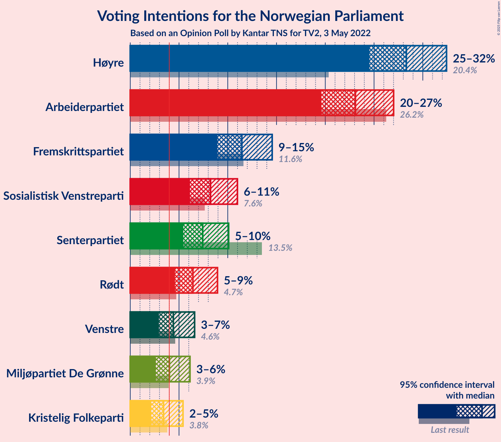

### Confidence Intervals

| Party | Last Result | Poll Result | 80% Confidence Interval | 90% Confidence Interval | 95% Confidence Interval | 99% Confidence Interval |
|:-----:|:-----------:|:-----------:|:-----------------------:|:-----------------------:|:-----------------------:|:-----------------------:|
| Høyre | 20.4% | 28.3% | 25.8–31.0% |25.1–31.8% |24.5–32.4% |23.4–33.7% |
| Arbeiderpartiet | 26.2% | 23.1% | 20.8–25.7% |20.1–26.4% |19.6–27.0% |18.5–28.3% |
| Fremskrittspartiet | 11.6% | 11.4% | 9.8–13.5% |9.3–14.0% |8.9–14.6% |8.2–15.6% |
| Sosialistisk Venstreparti | 7.6% | 8.2% | 6.8–10.0% |6.4–10.5% |6.1–11.0% |5.5–11.9% |
| Senterpartiet | 13.5% | 7.4% | 6.1–9.2% |5.7–9.6% |5.4–10.1% |4.9–11.0% |
| Rødt | 4.7% | 6.4% | 5.2–8.1% |4.9–8.5% |4.6–8.9% |4.1–9.8% |
| Venstre | 4.6% | 4.4% | 3.4–5.8% |3.2–6.2% |2.9–6.6% |2.5–7.3% |
| Miljøpartiet De Grønne | 3.9% | 4.0% | 3.1–5.4% |2.8–5.8% |2.6–6.1% |2.2–6.9% |
| Kristelig Folkeparti | 3.8% | 3.4% | 2.6–4.7% |2.3–5.1% |2.1–5.4% |1.8–6.1% |

*Note:* The poll result column reflects the actual value used in the calculations. Published results may vary slightly, and in addition be rounded to fewer digits.

## Seats

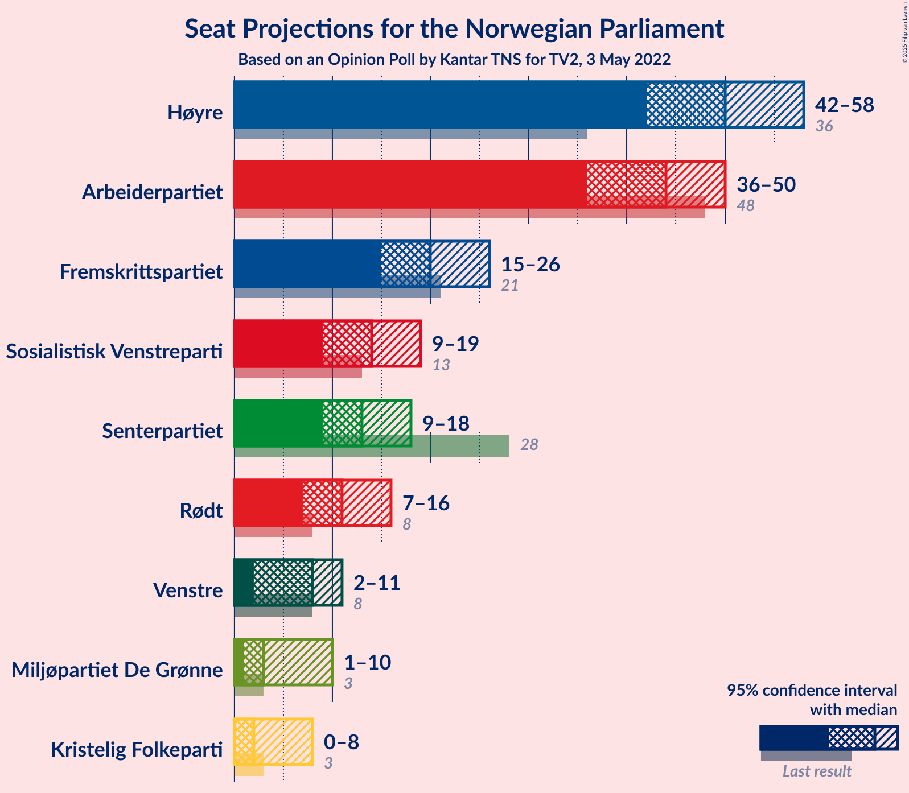

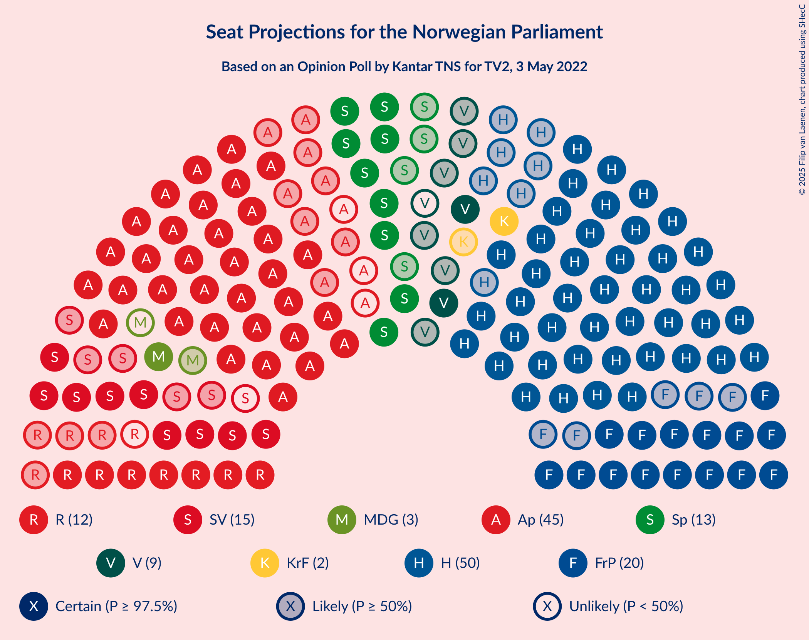

### Confidence Intervals

| Party | Last Result | Median | 80% Confidence Interval | 90% Confidence Interval | 95% Confidence Interval | 99% Confidence Interval |
|:-----:|:-----------:|:------:|:-----------------------:|:-----------------------:|:-----------------------:|:-----------------------:|
| <a href="#høyre">Høyre</a> | 36 | 50 | 45–54 |44–57 |42–58 |41–60 |
| <a href="#arbeiderpartiet">Arbeiderpartiet</a> | 48 | 44 | 38–48 |37–49 |36–50 |34–52 |
| <a href="#fremskrittspartiet">Fremskrittspartiet</a> | 21 | 20 | 17–23 |17–25 |15–26 |13–28 |
| <a href="#sosialistisk-venstreparti">Sosialistisk Venstreparti</a> | 13 | 14 | 11–17 |10–18 |9–19 |8–20 |
| <a href="#senterpartiet">Senterpartiet</a> | 28 | 13 | 10–16 |10–17 |9–18 |8–19 |
| <a href="#rødt">Rødt</a> | 8 | 11 | 9–14 |8–15 |7–16 |6–17 |
| <a href="#venstre">Venstre</a> | 8 | 8 | 2–10 |2–10 |2–11 |2–13 |
| <a href="#miljøpartiet-de-grønne">Miljøpartiet De Grønne</a> | 3 | 3 | 1–9 |1–10 |1–10 |1–12 |
| <a href="#kristelig-folkeparti">Kristelig Folkeparti</a> | 3 | 2 | 1–7 |0–8 |0–8 |0–10 |

### Høyre

*For a full overview of the results for this party, see the [Høyre](party-høyre.html) page.*

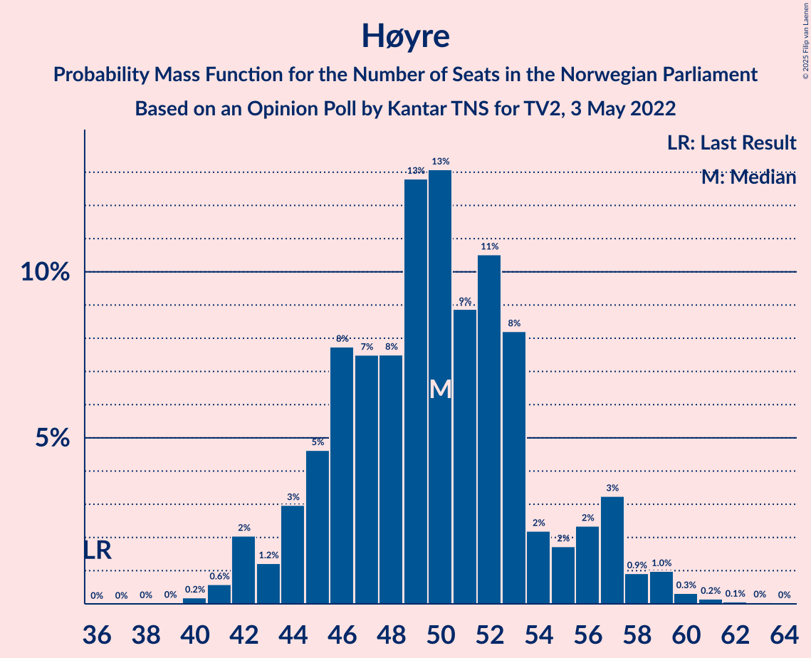

| Number of Seats | Probability | Accumulated | Special Marks |
|:---------------:|:-----------:|:-----------:|:-------------:|
| 36 | 0% | 100% | Last Result |
| 37 | 0% | 100% |  |
| 38 | 0% | 100% |  |
| 39 | 0% | 100% |  |
| 40 | 0.2% | 99.9% |  |
| 41 | 0.6% | 99.7% |  |
| 42 | 2% | 99.2% |  |
| 43 | 1.2% | 97% |  |
| 44 | 3% | 96% |  |
| 45 | 5% | 93% |  |
| 46 | 8% | 88% |  |
| 47 | 7% | 81% |  |
| 48 | 8% | 73% |  |
| 49 | 13% | 66% |  |
| 50 | 13% | 53% | Median |
| 51 | 9% | 40% |  |
| 52 | 11% | 31% |  |
| 53 | 8% | 20% |  |
| 54 | 2% | 12% |  |
| 55 | 2% | 10% |  |
| 56 | 2% | 8% |  |
| 57 | 3% | 6% |  |
| 58 | 0.9% | 3% |  |
| 59 | 1.0% | 2% |  |
| 60 | 0.3% | 0.6% |  |
| 61 | 0.2% | 0.3% |  |
| 62 | 0.1% | 0.2% |  |
| 63 | 0% | 0.1% |  |
| 64 | 0% | 0% |  |

### Arbeiderpartiet

*For a full overview of the results for this party, see the [Arbeiderpartiet](party-arbeiderpartiet.html) page.*

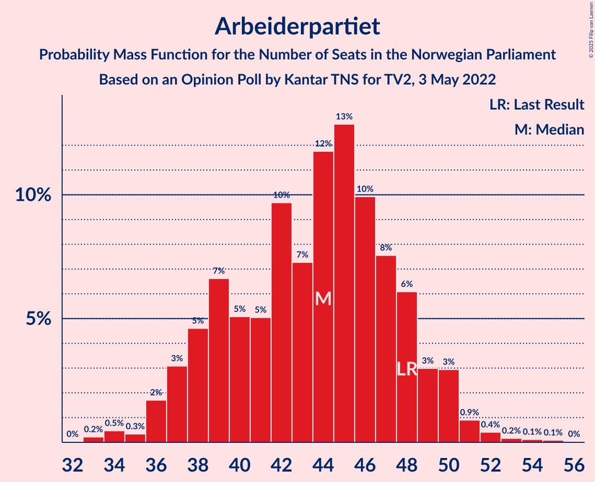

| Number of Seats | Probability | Accumulated | Special Marks |
|:---------------:|:-----------:|:-----------:|:-------------:|
| 33 | 0.2% | 100% |  |
| 34 | 0.5% | 99.7% |  |
| 35 | 0.3% | 99.3% |  |
| 36 | 2% | 98.9% |  |
| 37 | 3% | 97% |  |
| 38 | 5% | 94% |  |
| 39 | 7% | 90% |  |
| 40 | 5% | 83% |  |
| 41 | 5% | 78% |  |
| 42 | 10% | 73% |  |
| 43 | 7% | 63% |  |
| 44 | 12% | 56% | Median |
| 45 | 13% | 44% |  |
| 46 | 10% | 31% |  |
| 47 | 8% | 21% |  |
| 48 | 6% | 14% | Last Result |
| 49 | 3% | 8% |  |
| 50 | 3% | 5% |  |
| 51 | 0.9% | 2% |  |
| 52 | 0.4% | 0.8% |  |
| 53 | 0.2% | 0.4% |  |
| 54 | 0.1% | 0.3% |  |
| 55 | 0.1% | 0.1% |  |
| 56 | 0% | 0% |  |

### Fremskrittspartiet

*For a full overview of the results for this party, see the [Fremskrittspartiet](party-fremskrittspartiet.html) page.*

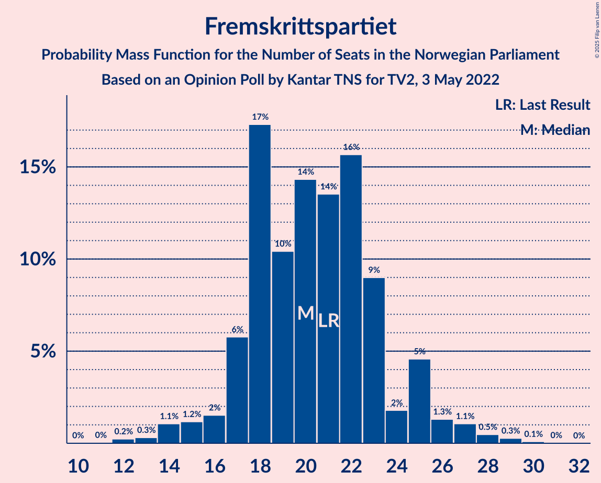

| Number of Seats | Probability | Accumulated | Special Marks |
|:---------------:|:-----------:|:-----------:|:-------------:|
| 11 | 0% | 100% |  |
| 12 | 0.2% | 99.9% |  |
| 13 | 0.3% | 99.7% |  |
| 14 | 1.1% | 99.4% |  |
| 15 | 1.2% | 98% |  |
| 16 | 2% | 97% |  |
| 17 | 6% | 96% |  |
| 18 | 17% | 90% |  |
| 19 | 10% | 73% |  |
| 20 | 14% | 62% | Median |
| 21 | 14% | 48% | Last Result |
| 22 | 16% | 34% |  |
| 23 | 9% | 19% |  |
| 24 | 2% | 10% |  |
| 25 | 5% | 8% |  |
| 26 | 1.3% | 3% |  |
| 27 | 1.1% | 2% |  |
| 28 | 0.5% | 0.9% |  |
| 29 | 0.3% | 0.4% |  |
| 30 | 0.1% | 0.1% |  |
| 31 | 0% | 0% |  |

### Sosialistisk Venstreparti

*For a full overview of the results for this party, see the [Sosialistisk Venstreparti](party-sosialistiskvenstreparti.html) page.*

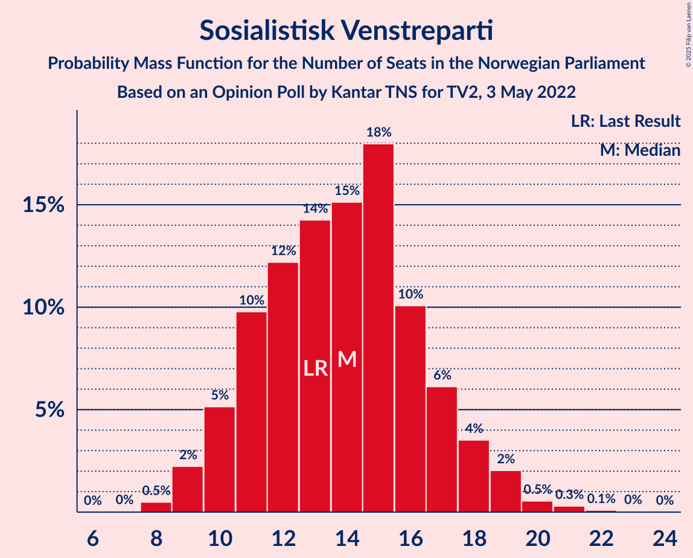

| Number of Seats | Probability | Accumulated | Special Marks |
|:---------------:|:-----------:|:-----------:|:-------------:|
| 8 | 0.5% | 100% |  |
| 9 | 2% | 99.5% |  |
| 10 | 5% | 97% |  |
| 11 | 10% | 92% |  |
| 12 | 12% | 82% |  |
| 13 | 14% | 70% | Last Result |
| 14 | 15% | 56% | Median |
| 15 | 18% | 41% |  |
| 16 | 10% | 23% |  |
| 17 | 6% | 13% |  |
| 18 | 4% | 7% |  |
| 19 | 2% | 3% |  |
| 20 | 0.5% | 1.0% |  |
| 21 | 0.3% | 0.5% |  |
| 22 | 0.1% | 0.2% |  |
| 23 | 0% | 0.1% |  |
| 24 | 0% | 0% |  |

### Senterpartiet

*For a full overview of the results for this party, see the [Senterpartiet](party-senterpartiet.html) page.*

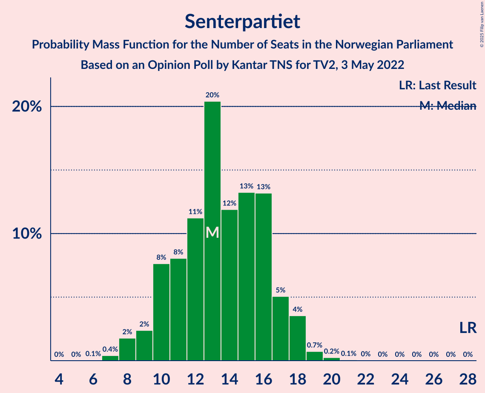

| Number of Seats | Probability | Accumulated | Special Marks |
|:---------------:|:-----------:|:-----------:|:-------------:|
| 6 | 0.1% | 100% |  |
| 7 | 0.4% | 99.9% |  |
| 8 | 2% | 99.5% |  |
| 9 | 2% | 98% |  |
| 10 | 8% | 95% |  |
| 11 | 8% | 88% |  |
| 12 | 11% | 80% |  |
| 13 | 20% | 68% | Median |
| 14 | 12% | 48% |  |
| 15 | 13% | 36% |  |
| 16 | 13% | 23% |  |
| 17 | 5% | 10% |  |
| 18 | 4% | 5% |  |
| 19 | 0.7% | 1.1% |  |
| 20 | 0.2% | 0.4% |  |
| 21 | 0.1% | 0.1% |  |
| 22 | 0% | 0.1% |  |
| 23 | 0% | 0% |  |
| 24 | 0% | 0% |  |
| 25 | 0% | 0% |  |
| 26 | 0% | 0% |  |
| 27 | 0% | 0% |  |
| 28 | 0% | 0% | Last Result |

### Rødt

*For a full overview of the results for this party, see the [Rødt](party-rødt.html) page.*

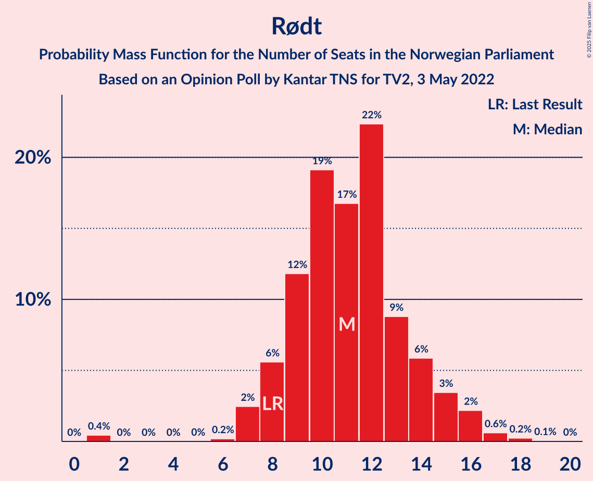

| Number of Seats | Probability | Accumulated | Special Marks |
|:---------------:|:-----------:|:-----------:|:-------------:|
| 1 | 0.4% | 100% |  |
| 2 | 0% | 99.6% |  |
| 3 | 0% | 99.6% |  |
| 4 | 0% | 99.6% |  |
| 5 | 0% | 99.6% |  |
| 6 | 0.2% | 99.5% |  |
| 7 | 2% | 99.4% |  |
| 8 | 6% | 97% | Last Result |
| 9 | 12% | 91% |  |
| 10 | 19% | 79% |  |
| 11 | 17% | 60% | Median |
| 12 | 22% | 44% |  |
| 13 | 9% | 21% |  |
| 14 | 6% | 12% |  |
| 15 | 3% | 7% |  |
| 16 | 2% | 3% |  |
| 17 | 0.6% | 0.9% |  |
| 18 | 0.2% | 0.3% |  |
| 19 | 0.1% | 0.1% |  |
| 20 | 0% | 0% |  |

### Venstre

*For a full overview of the results for this party, see the [Venstre](party-venstre.html) page.*

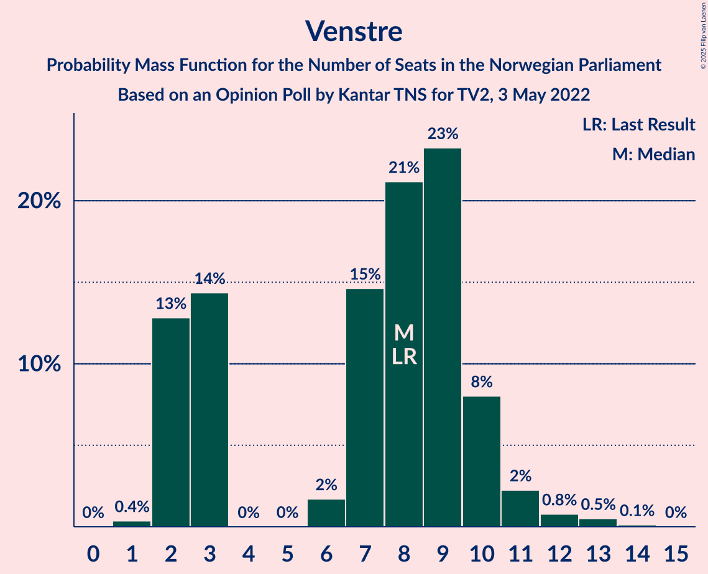

| Number of Seats | Probability | Accumulated | Special Marks |
|:---------------:|:-----------:|:-----------:|:-------------:|
| 1 | 0.4% | 100% |  |
| 2 | 13% | 99.6% |  |
| 3 | 14% | 87% |  |
| 4 | 0% | 72% |  |
| 5 | 0% | 72% |  |
| 6 | 2% | 72% |  |
| 7 | 15% | 71% |  |
| 8 | 21% | 56% | Last Result, Median |
| 9 | 23% | 35% |  |
| 10 | 8% | 12% |  |
| 11 | 2% | 4% |  |
| 12 | 0.8% | 1.4% |  |
| 13 | 0.5% | 0.6% |  |
| 14 | 0.1% | 0.1% |  |
| 15 | 0% | 0% |  |

### Miljøpartiet De Grønne

*For a full overview of the results for this party, see the [Miljøpartiet De Grønne](party-miljøpartietdegrønne.html) page.*

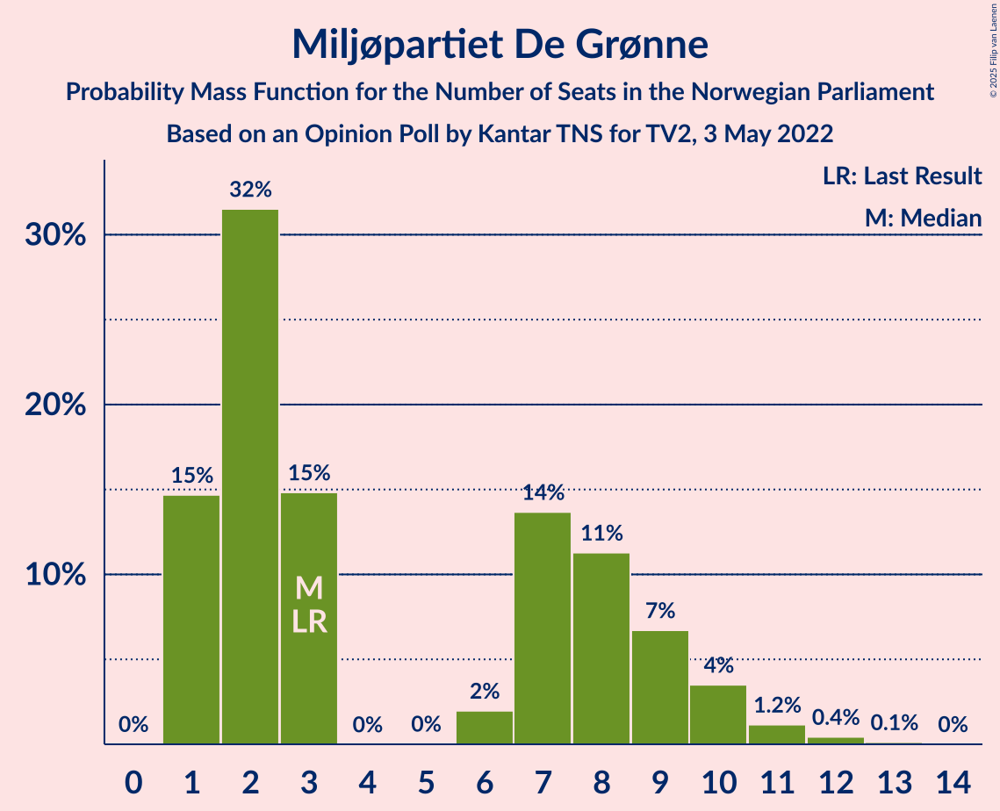

| Number of Seats | Probability | Accumulated | Special Marks |
|:---------------:|:-----------:|:-----------:|:-------------:|
| 1 | 15% | 100% |  |
| 2 | 32% | 85% |  |
| 3 | 15% | 54% | Last Result, Median |
| 4 | 0% | 39% |  |
| 5 | 0% | 39% |  |
| 6 | 2% | 39% |  |
| 7 | 14% | 37% |  |
| 8 | 11% | 23% |  |
| 9 | 7% | 12% |  |
| 10 | 4% | 5% |  |
| 11 | 1.2% | 2% |  |
| 12 | 0.4% | 0.6% |  |
| 13 | 0.1% | 0.1% |  |
| 14 | 0% | 0% |  |

### Kristelig Folkeparti

*For a full overview of the results for this party, see the [Kristelig Folkeparti](party-kristeligfolkeparti.html) page.*

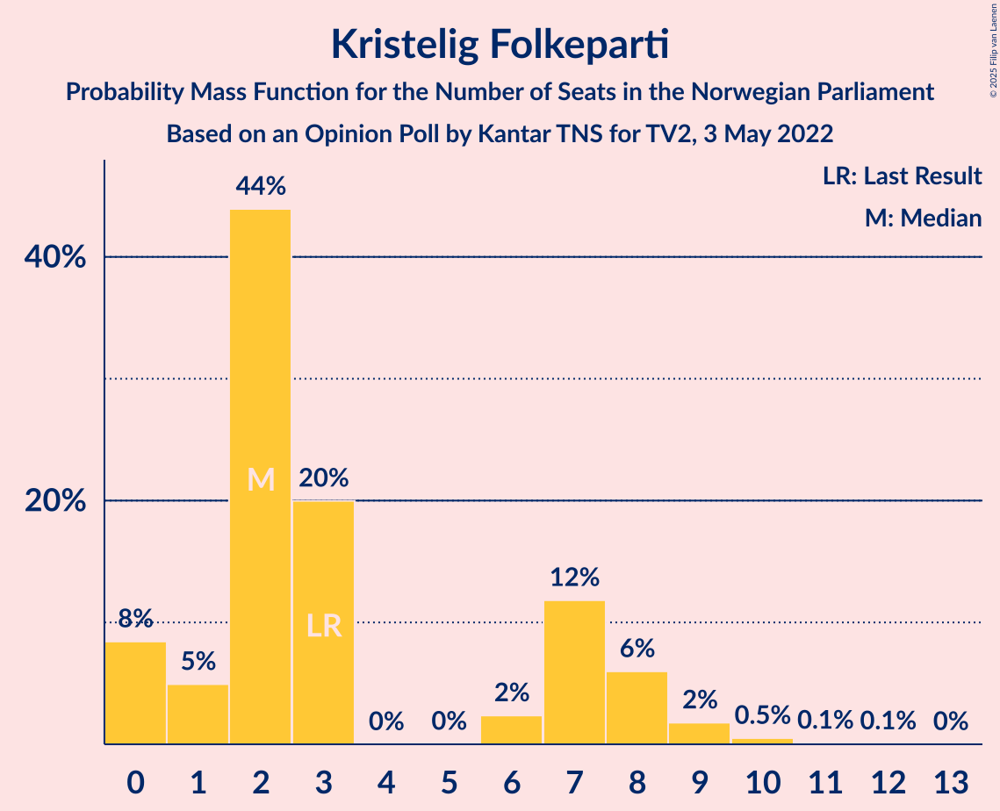

| Number of Seats | Probability | Accumulated | Special Marks |
|:---------------:|:-----------:|:-----------:|:-------------:|
| 0 | 8% | 100% |  |
| 1 | 5% | 92% |  |
| 2 | 44% | 87% | Median |
| 3 | 20% | 43% | Last Result |
| 4 | 0% | 23% |  |
| 5 | 0% | 23% |  |
| 6 | 2% | 23% |  |
| 7 | 12% | 20% |  |
| 8 | 6% | 8% |  |
| 9 | 2% | 2% |  |
| 10 | 0.5% | 0.7% |  |
| 11 | 0.1% | 0.2% |  |
| 12 | 0.1% | 0.1% |  |
| 13 | 0% | 0% |  |

## Coalitions

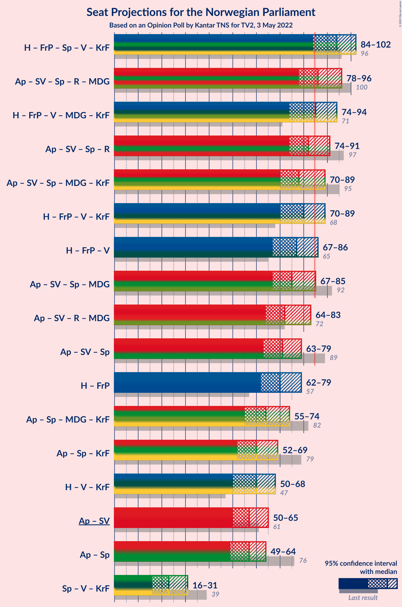

### Confidence Intervals

| Coalition | Last Result | Median | Majority? | 80% Confidence Interval | 90% Confidence Interval | 95% Confidence Interval | 99% Confidence Interval |
|:---------:|:-----------:|:------:|:---------:|:-----------------------:|:-----------------------:|:-----------------------:|:-----------------------:|
| Høyre – Fremskrittspartiet – Senterpartiet – Venstre – Kristelig Folkeparti | 96 | 94 | 97% | 87–99 | 86–101 | 84–102 | 81–105 |
| Arbeiderpartiet – Sosialistisk Venstreparti – Senterpartiet – Rødt – Miljøpartiet De Grønne | 100 | 86 | 64% | 81–93 | 79–94 | 78–96 | 75–99 |
| Høyre – Fremskrittspartiet – Venstre – Miljøpartiet De Grønne – Kristelig Folkeparti | 71 | 85 | 54% | 78–91 | 77–92 | 74–94 | 72–96 |
| Arbeiderpartiet – Sosialistisk Venstreparti – Senterpartiet – Rødt | 97 | 82 | 28% | 76–88 | 75–90 | 74–91 | 70–94 |
| Arbeiderpartiet – Sosialistisk Venstreparti – Senterpartiet – Miljøpartiet De Grønne – Kristelig Folkeparti | 95 | 78 | 10% | 73–85 | 72–87 | 70–89 | 67–92 |
| Høyre – Fremskrittspartiet – Venstre – Kristelig Folkeparti | 68 | 80 | 15% | 74–86 | 72–87 | 70–89 | 68–92 |
| Høyre – Fremskrittspartiet – Venstre | 65 | 77 | 4% | 71–83 | 69–84 | 67–86 | 64–88 |
| Arbeiderpartiet – Sosialistisk Venstreparti – Senterpartiet – Miljøpartiet De Grønne | 92 | 75 | 4% | 70–81 | 69–83 | 67–85 | 64–88 |
| Arbeiderpartiet – Sosialistisk Venstreparti – Rødt – Miljøpartiet De Grønne | 72 | 72 | 1.1% | 67–79 | 66–81 | 64–83 | 61–86 |
| Arbeiderpartiet – Sosialistisk Venstreparti – Senterpartiet | 89 | 71 | 0% | 66–76 | 65–78 | 63–79 | 60–82 |
| Høyre – Fremskrittspartiet | 57 | 70 | 0.1% | 65–75 | 64–77 | 62–79 | 59–81 |
| Arbeiderpartiet – Senterpartiet – Miljøpartiet De Grønne – Kristelig Folkeparti | 82 | 64 | 0% | 59–72 | 58–74 | 55–74 | 53–78 |
| Arbeiderpartiet – Senterpartiet – Kristelig Folkeparti | 79 | 60 | 0% | 55–66 | 54–68 | 52–69 | 50–71 |
| Høyre – Venstre – Kristelig Folkeparti | 47 | 60 | 0% | 54–65 | 52–67 | 50–68 | 48–71 |
| Arbeiderpartiet – Sosialistisk Venstreparti | 61 | 57 | 0% | 53–62 | 51–64 | 50–65 | 47–67 |
| Arbeiderpartiet – Senterpartiet | 76 | 57 | 0% | 52–62 | 51–64 | 49–64 | 48–67 |
| Senterpartiet – Venstre – Kristelig Folkeparti | 39 | 23 | 0% | 18–29 | 17–30 | 16–31 | 14–34 |

### Høyre – Fremskrittspartiet – Senterpartiet – Venstre – Kristelig Folkeparti

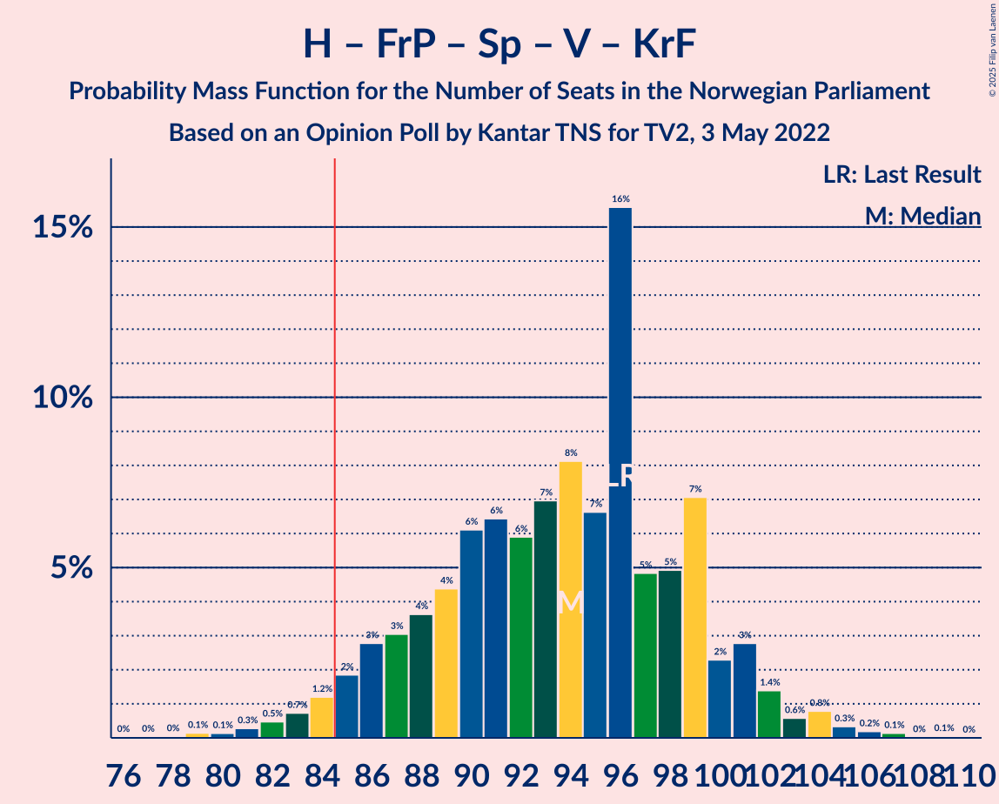

| Number of Seats | Probability | Accumulated | Special Marks |
|:---------------:|:-----------:|:-----------:|:-------------:|
| 77 | 0% | 100% |  |
| 78 | 0% | 99.9% |  |
| 79 | 0.1% | 99.9% |  |
| 80 | 0.1% | 99.7% |  |
| 81 | 0.3% | 99.6% |  |
| 82 | 0.5% | 99.3% |  |
| 83 | 0.7% | 98.8% |  |
| 84 | 1.2% | 98% |  |
| 85 | 2% | 97% | Majority |
| 86 | 3% | 95% |  |
| 87 | 3% | 92% |  |
| 88 | 4% | 89% |  |
| 89 | 4% | 86% |  |
| 90 | 6% | 81% |  |
| 91 | 6% | 75% |  |
| 92 | 6% | 69% |  |
| 93 | 7% | 63% | Median |
| 94 | 8% | 56% |  |
| 95 | 7% | 48% |  |
| 96 | 16% | 41% | Last Result |
| 97 | 5% | 25% |  |
| 98 | 5% | 21% |  |
| 99 | 7% | 16% |  |
| 100 | 2% | 9% |  |
| 101 | 3% | 6% |  |
| 102 | 1.4% | 4% |  |
| 103 | 0.6% | 2% |  |
| 104 | 0.8% | 2% |  |
| 105 | 0.3% | 0.8% |  |
| 106 | 0.2% | 0.4% |  |
| 107 | 0.1% | 0.2% |  |
| 108 | 0% | 0.1% |  |
| 109 | 0.1% | 0.1% |  |
| 110 | 0% | 0% |  |

### Arbeiderpartiet – Sosialistisk Venstreparti – Senterpartiet – Rødt – Miljøpartiet De Grønne

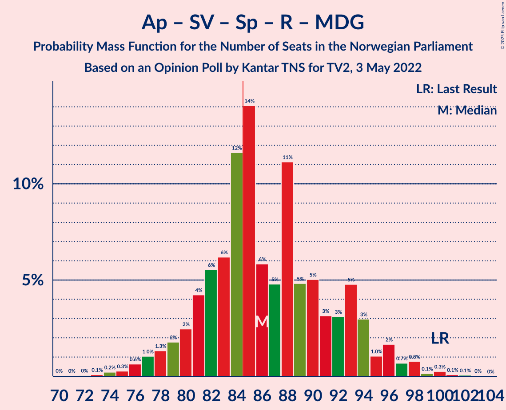

| Number of Seats | Probability | Accumulated | Special Marks |
|:---------------:|:-----------:|:-----------:|:-------------:|
| 70 | 0% | 100% |  |
| 71 | 0% | 99.9% |  |
| 72 | 0% | 99.9% |  |
| 73 | 0.1% | 99.8% |  |
| 74 | 0.2% | 99.8% |  |
| 75 | 0.3% | 99.5% |  |
| 76 | 0.6% | 99.3% |  |
| 77 | 1.0% | 98.6% |  |
| 78 | 1.3% | 98% |  |
| 79 | 2% | 96% |  |
| 80 | 2% | 94% |  |
| 81 | 4% | 92% |  |
| 82 | 6% | 88% |  |
| 83 | 6% | 82% |  |
| 84 | 12% | 76% |  |
| 85 | 14% | 64% | Median, Majority |
| 86 | 6% | 50% |  |
| 87 | 5% | 45% |  |
| 88 | 11% | 40% |  |
| 89 | 5% | 29% |  |
| 90 | 5% | 24% |  |
| 91 | 3% | 19% |  |
| 92 | 3% | 16% |  |
| 93 | 5% | 12% |  |
| 94 | 3% | 8% |  |
| 95 | 1.0% | 5% |  |
| 96 | 2% | 4% |  |
| 97 | 0.7% | 2% |  |
| 98 | 0.8% | 1.3% |  |
| 99 | 0.1% | 0.6% |  |
| 100 | 0.3% | 0.4% | Last Result |
| 101 | 0.1% | 0.2% |  |
| 102 | 0.1% | 0.1% |  |
| 103 | 0% | 0% |  |

### Høyre – Fremskrittspartiet – Venstre – Miljøpartiet De Grønne – Kristelig Folkeparti

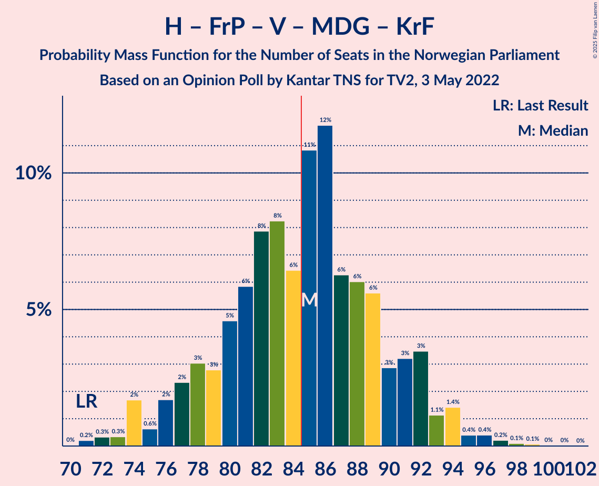

| Number of Seats | Probability | Accumulated | Special Marks |
|:---------------:|:-----------:|:-----------:|:-------------:|
| 70 | 0% | 100% |  |
| 71 | 0.2% | 99.9% | Last Result |
| 72 | 0.3% | 99.7% |  |
| 73 | 0.3% | 99.4% |  |
| 74 | 2% | 99.0% |  |
| 75 | 0.6% | 97% |  |
| 76 | 2% | 97% |  |
| 77 | 2% | 95% |  |
| 78 | 3% | 93% |  |
| 79 | 3% | 90% |  |
| 80 | 5% | 87% |  |
| 81 | 6% | 82% |  |
| 82 | 8% | 76% |  |
| 83 | 8% | 69% | Median |
| 84 | 6% | 60% |  |
| 85 | 11% | 54% | Majority |
| 86 | 12% | 43% |  |
| 87 | 6% | 31% |  |
| 88 | 6% | 25% |  |
| 89 | 6% | 19% |  |
| 90 | 3% | 13% |  |
| 91 | 3% | 10% |  |
| 92 | 3% | 7% |  |
| 93 | 1.1% | 4% |  |
| 94 | 1.4% | 3% |  |
| 95 | 0.4% | 1.3% |  |
| 96 | 0.4% | 0.8% |  |
| 97 | 0.2% | 0.4% |  |
| 98 | 0.1% | 0.2% |  |
| 99 | 0.1% | 0.1% |  |
| 100 | 0% | 0.1% |  |
| 101 | 0% | 0% |  |

### Arbeiderpartiet – Sosialistisk Venstreparti – Senterpartiet – Rødt

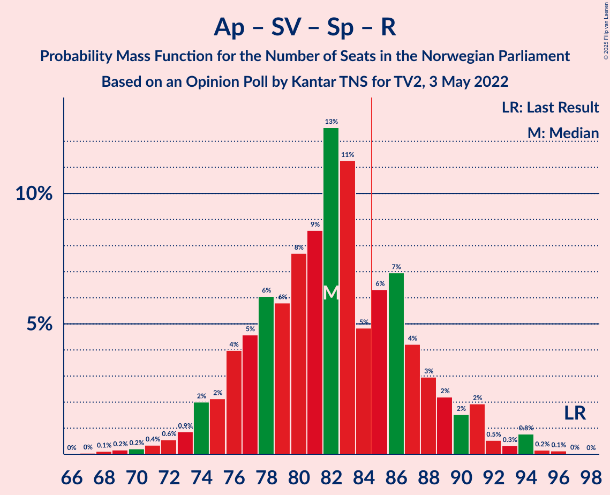

| Number of Seats | Probability | Accumulated | Special Marks |
|:---------------:|:-----------:|:-----------:|:-------------:|
| 67 | 0% | 100% |  |
| 68 | 0.1% | 99.9% |  |
| 69 | 0.2% | 99.8% |  |
| 70 | 0.2% | 99.6% |  |
| 71 | 0.4% | 99.4% |  |
| 72 | 0.6% | 99.1% |  |
| 73 | 0.9% | 98.5% |  |
| 74 | 2% | 98% |  |
| 75 | 2% | 96% |  |
| 76 | 4% | 93% |  |
| 77 | 5% | 90% |  |
| 78 | 6% | 85% |  |
| 79 | 6% | 79% |  |
| 80 | 8% | 73% |  |
| 81 | 9% | 65% |  |
| 82 | 13% | 57% | Median |
| 83 | 11% | 44% |  |
| 84 | 5% | 33% |  |
| 85 | 6% | 28% | Majority |
| 86 | 7% | 22% |  |
| 87 | 4% | 15% |  |
| 88 | 3% | 11% |  |
| 89 | 2% | 8% |  |
| 90 | 2% | 5% |  |
| 91 | 2% | 4% |  |
| 92 | 0.5% | 2% |  |
| 93 | 0.3% | 1.5% |  |
| 94 | 0.8% | 1.2% |  |
| 95 | 0.2% | 0.4% |  |
| 96 | 0.1% | 0.2% |  |
| 97 | 0% | 0.1% | Last Result |
| 98 | 0% | 0% |  |

### Arbeiderpartiet – Sosialistisk Venstreparti – Senterpartiet – Miljøpartiet De Grønne – Kristelig Folkeparti

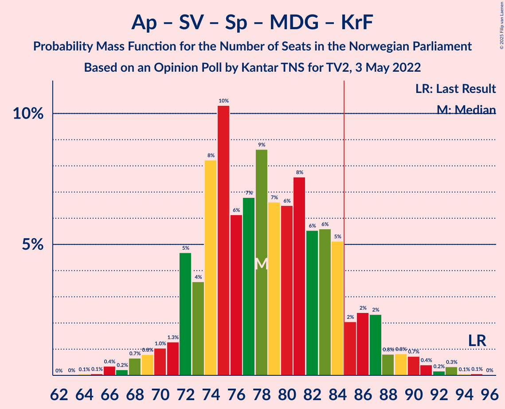

| Number of Seats | Probability | Accumulated | Special Marks |
|:---------------:|:-----------:|:-----------:|:-------------:|
| 64 | 0.1% | 100% |  |
| 65 | 0.1% | 99.9% |  |
| 66 | 0.4% | 99.9% |  |
| 67 | 0.2% | 99.5% |  |
| 68 | 0.7% | 99.3% |  |
| 69 | 0.8% | 98.6% |  |
| 70 | 1.0% | 98% |  |
| 71 | 1.3% | 97% |  |
| 72 | 5% | 96% |  |
| 73 | 4% | 91% |  |
| 74 | 8% | 87% |  |
| 75 | 10% | 79% |  |
| 76 | 6% | 69% | Median |
| 77 | 7% | 63% |  |
| 78 | 9% | 56% |  |
| 79 | 7% | 47% |  |
| 80 | 6% | 41% |  |
| 81 | 8% | 34% |  |
| 82 | 6% | 26% |  |
| 83 | 6% | 21% |  |
| 84 | 5% | 15% |  |
| 85 | 2% | 10% | Majority |
| 86 | 2% | 8% |  |
| 87 | 2% | 6% |  |
| 88 | 0.8% | 3% |  |
| 89 | 0.8% | 3% |  |
| 90 | 0.7% | 2% |  |
| 91 | 0.4% | 1.1% |  |
| 92 | 0.2% | 0.7% |  |
| 93 | 0.3% | 0.5% |  |
| 94 | 0.1% | 0.2% |  |
| 95 | 0.1% | 0.1% | Last Result |
| 96 | 0% | 0% |  |

### Høyre – Fremskrittspartiet – Venstre – Kristelig Folkeparti

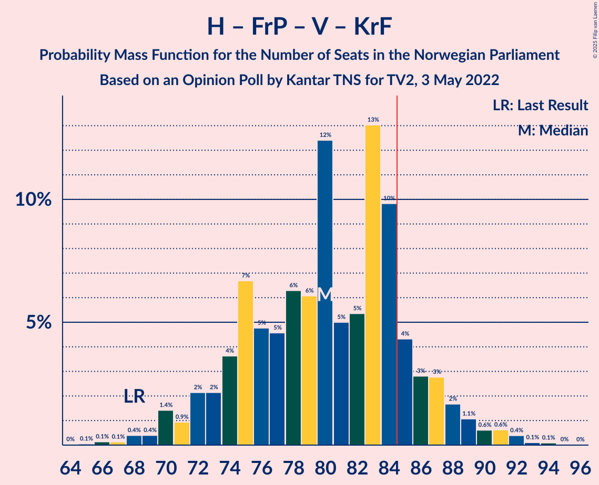

| Number of Seats | Probability | Accumulated | Special Marks |
|:---------------:|:-----------:|:-----------:|:-------------:|
| 65 | 0.1% | 100% |  |
| 66 | 0.1% | 99.9% |  |
| 67 | 0.1% | 99.8% |  |
| 68 | 0.4% | 99.6% | Last Result |
| 69 | 0.4% | 99.2% |  |
| 70 | 1.4% | 98.8% |  |
| 71 | 0.9% | 97% |  |
| 72 | 2% | 96% |  |
| 73 | 2% | 94% |  |
| 74 | 4% | 92% |  |
| 75 | 7% | 89% |  |
| 76 | 5% | 82% |  |
| 77 | 5% | 77% |  |
| 78 | 6% | 73% |  |
| 79 | 6% | 66% |  |
| 80 | 12% | 60% | Median |
| 81 | 5% | 48% |  |
| 82 | 5% | 43% |  |
| 83 | 13% | 37% |  |
| 84 | 10% | 24% |  |
| 85 | 4% | 15% | Majority |
| 86 | 3% | 10% |  |
| 87 | 3% | 7% |  |
| 88 | 2% | 5% |  |
| 89 | 1.1% | 3% |  |
| 90 | 0.6% | 2% |  |
| 91 | 0.6% | 1.3% |  |
| 92 | 0.4% | 0.7% |  |
| 93 | 0.1% | 0.3% |  |
| 94 | 0.1% | 0.2% |  |
| 95 | 0% | 0.1% |  |
| 96 | 0% | 0% |  |

### Høyre – Fremskrittspartiet – Venstre

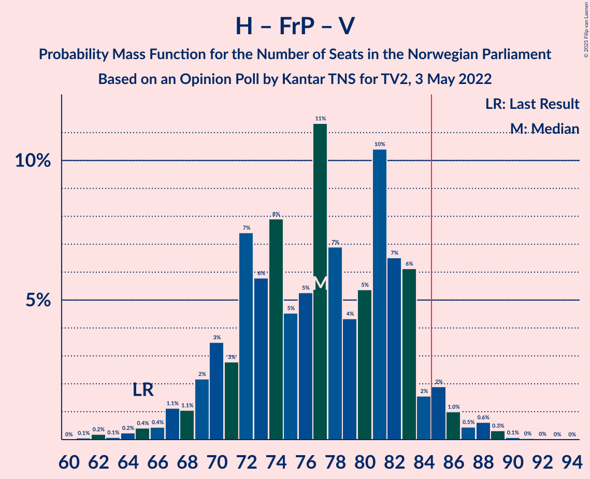

| Number of Seats | Probability | Accumulated | Special Marks |
|:---------------:|:-----------:|:-----------:|:-------------:|
| 61 | 0.1% | 100% |  |
| 62 | 0.2% | 99.9% |  |
| 63 | 0.1% | 99.7% |  |
| 64 | 0.2% | 99.6% |  |
| 65 | 0.4% | 99.4% | Last Result |
| 66 | 0.4% | 99.0% |  |
| 67 | 1.1% | 98.5% |  |
| 68 | 1.1% | 97% |  |
| 69 | 2% | 96% |  |
| 70 | 3% | 94% |  |
| 71 | 3% | 91% |  |
| 72 | 7% | 88% |  |
| 73 | 6% | 81% |  |
| 74 | 8% | 75% |  |
| 75 | 5% | 67% |  |
| 76 | 5% | 62% |  |
| 77 | 11% | 57% |  |
| 78 | 7% | 46% | Median |
| 79 | 4% | 39% |  |
| 80 | 5% | 34% |  |
| 81 | 10% | 29% |  |
| 82 | 7% | 19% |  |
| 83 | 6% | 12% |  |
| 84 | 2% | 6% |  |
| 85 | 2% | 4% | Majority |
| 86 | 1.0% | 3% |  |
| 87 | 0.5% | 2% |  |
| 88 | 0.6% | 1.1% |  |
| 89 | 0.3% | 0.5% |  |
| 90 | 0.1% | 0.2% |  |
| 91 | 0% | 0.1% |  |
| 92 | 0% | 0.1% |  |
| 93 | 0% | 0% |  |

### Arbeiderpartiet – Sosialistisk Venstreparti – Senterpartiet – Miljøpartiet De Grønne

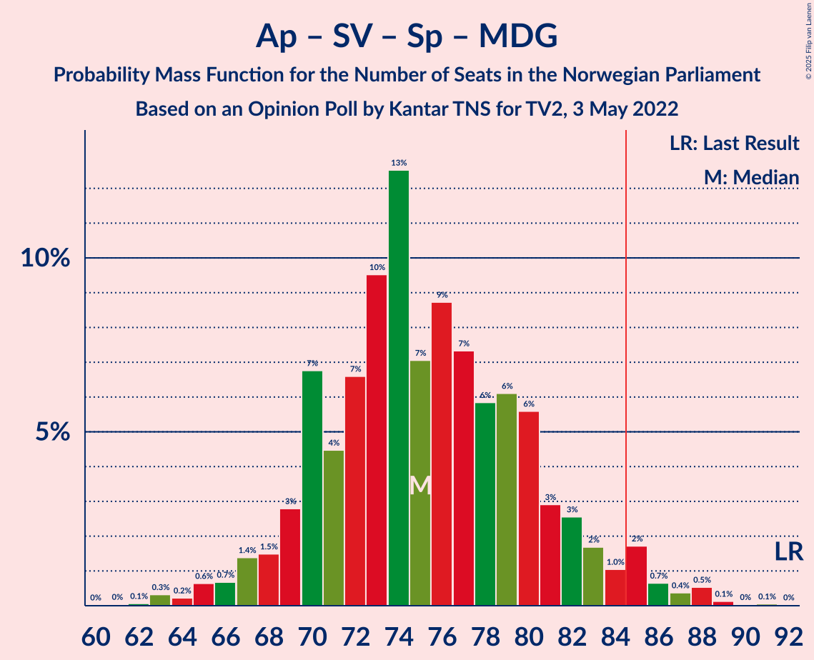

| Number of Seats | Probability | Accumulated | Special Marks |
|:---------------:|:-----------:|:-----------:|:-------------:|
| 61 | 0% | 100% |  |
| 62 | 0.1% | 99.9% |  |
| 63 | 0.3% | 99.8% |  |
| 64 | 0.2% | 99.5% |  |
| 65 | 0.6% | 99.3% |  |
| 66 | 0.7% | 98.7% |  |
| 67 | 1.4% | 98% |  |
| 68 | 1.5% | 97% |  |
| 69 | 3% | 95% |  |
| 70 | 7% | 92% |  |
| 71 | 4% | 86% |  |
| 72 | 7% | 81% |  |
| 73 | 10% | 74% |  |
| 74 | 13% | 65% | Median |
| 75 | 7% | 52% |  |
| 76 | 9% | 45% |  |
| 77 | 7% | 37% |  |
| 78 | 6% | 29% |  |
| 79 | 6% | 23% |  |
| 80 | 6% | 17% |  |
| 81 | 3% | 12% |  |
| 82 | 3% | 9% |  |
| 83 | 2% | 6% |  |
| 84 | 1.0% | 5% |  |
| 85 | 2% | 4% | Majority |
| 86 | 0.7% | 2% |  |
| 87 | 0.4% | 1.2% |  |
| 88 | 0.5% | 0.8% |  |
| 89 | 0.1% | 0.3% |  |
| 90 | 0% | 0.1% |  |
| 91 | 0.1% | 0.1% |  |
| 92 | 0% | 0% | Last Result |

### Arbeiderpartiet – Sosialistisk Venstreparti – Rødt – Miljøpartiet De Grønne

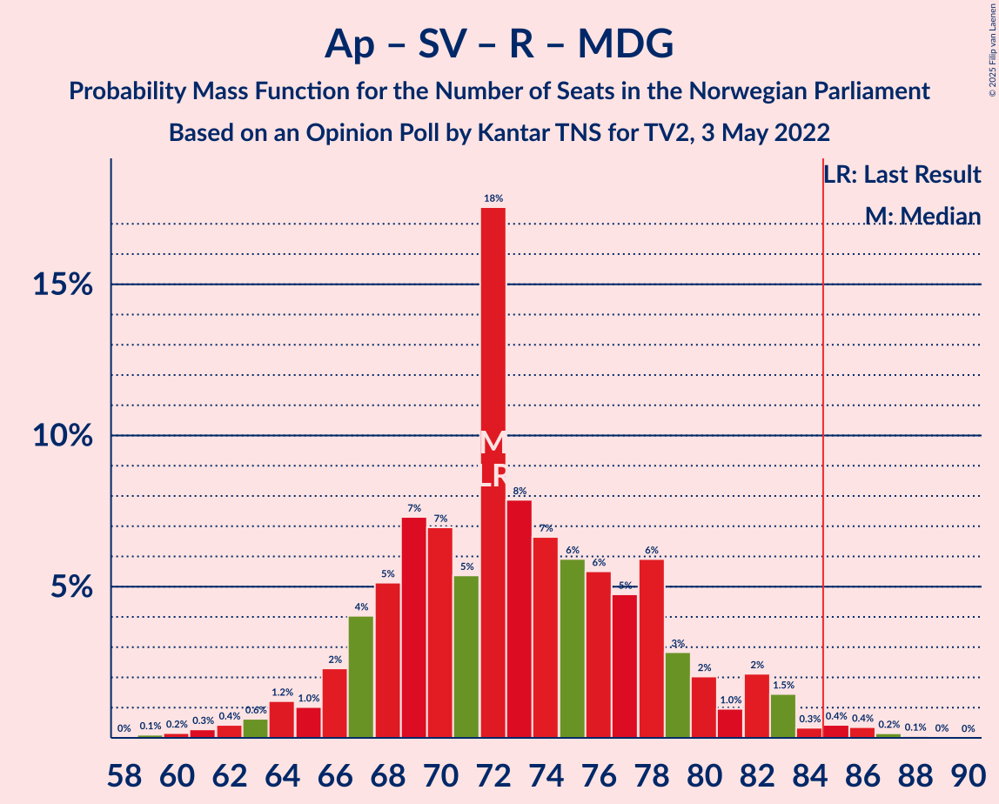

| Number of Seats | Probability | Accumulated | Special Marks |
|:---------------:|:-----------:|:-----------:|:-------------:|
| 58 | 0% | 100% |  |
| 59 | 0.1% | 99.9% |  |
| 60 | 0.2% | 99.8% |  |
| 61 | 0.3% | 99.7% |  |
| 62 | 0.4% | 99.4% |  |
| 63 | 0.6% | 99.0% |  |
| 64 | 1.2% | 98% |  |
| 65 | 1.0% | 97% |  |
| 66 | 2% | 96% |  |
| 67 | 4% | 94% |  |
| 68 | 5% | 90% |  |
| 69 | 7% | 85% |  |
| 70 | 7% | 77% |  |
| 71 | 5% | 70% |  |
| 72 | 18% | 65% | Last Result, Median |
| 73 | 8% | 47% |  |
| 74 | 7% | 40% |  |
| 75 | 6% | 33% |  |
| 76 | 6% | 27% |  |
| 77 | 5% | 21% |  |
| 78 | 6% | 17% |  |
| 79 | 3% | 11% |  |
| 80 | 2% | 8% |  |
| 81 | 1.0% | 6% |  |
| 82 | 2% | 5% |  |
| 83 | 1.5% | 3% |  |
| 84 | 0.3% | 1.4% |  |
| 85 | 0.4% | 1.1% | Majority |
| 86 | 0.4% | 0.6% |  |
| 87 | 0.2% | 0.3% |  |
| 88 | 0.1% | 0.1% |  |
| 89 | 0% | 0.1% |  |
| 90 | 0% | 0% |  |

### Arbeiderpartiet – Sosialistisk Venstreparti – Senterpartiet

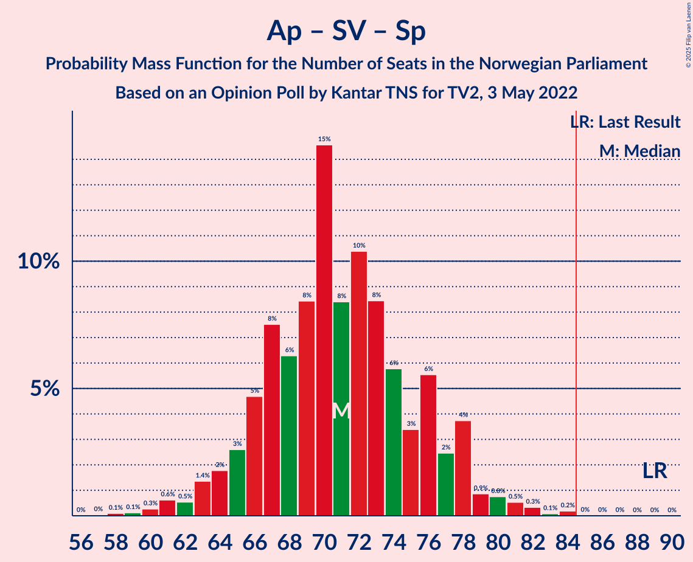

| Number of Seats | Probability | Accumulated | Special Marks |
|:---------------:|:-----------:|:-----------:|:-------------:|
| 57 | 0% | 100% |  |
| 58 | 0.1% | 99.9% |  |
| 59 | 0.1% | 99.8% |  |
| 60 | 0.3% | 99.7% |  |
| 61 | 0.6% | 99.4% |  |
| 62 | 0.5% | 98.8% |  |
| 63 | 1.4% | 98% |  |
| 64 | 2% | 97% |  |
| 65 | 3% | 95% |  |
| 66 | 5% | 93% |  |
| 67 | 8% | 88% |  |
| 68 | 6% | 80% |  |
| 69 | 8% | 74% |  |
| 70 | 15% | 66% |  |
| 71 | 8% | 51% | Median |
| 72 | 10% | 43% |  |
| 73 | 8% | 32% |  |
| 74 | 6% | 24% |  |
| 75 | 3% | 18% |  |
| 76 | 6% | 15% |  |
| 77 | 2% | 9% |  |
| 78 | 4% | 7% |  |
| 79 | 0.9% | 3% |  |
| 80 | 0.8% | 2% |  |
| 81 | 0.5% | 1.2% |  |
| 82 | 0.3% | 0.7% |  |
| 83 | 0.1% | 0.3% |  |
| 84 | 0.2% | 0.2% |  |
| 85 | 0% | 0% | Majority |
| 86 | 0% | 0% |  |
| 87 | 0% | 0% |  |
| 88 | 0% | 0% |  |
| 89 | 0% | 0% | Last Result |

### Høyre – Fremskrittspartiet

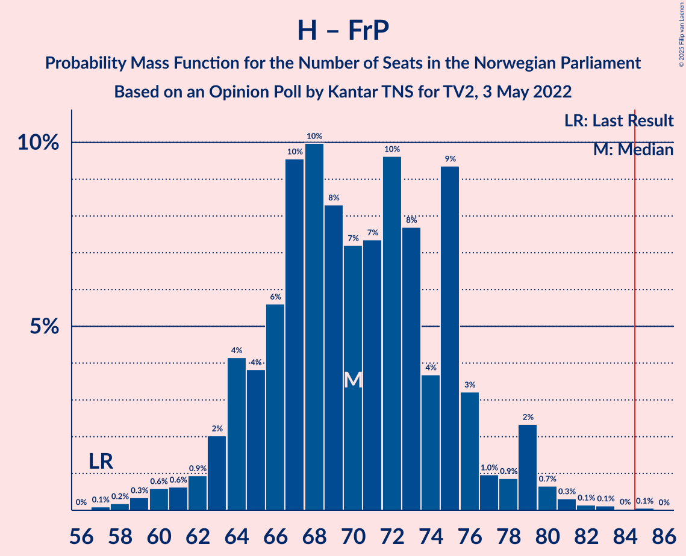

| Number of Seats | Probability | Accumulated | Special Marks |
|:---------------:|:-----------:|:-----------:|:-------------:|
| 57 | 0.1% | 100% | Last Result |
| 58 | 0.2% | 99.9% |  |
| 59 | 0.3% | 99.7% |  |
| 60 | 0.6% | 99.3% |  |
| 61 | 0.6% | 98.7% |  |
| 62 | 0.9% | 98% |  |
| 63 | 2% | 97% |  |
| 64 | 4% | 95% |  |
| 65 | 4% | 91% |  |
| 66 | 6% | 87% |  |
| 67 | 10% | 82% |  |
| 68 | 10% | 72% |  |
| 69 | 8% | 62% |  |
| 70 | 7% | 54% | Median |
| 71 | 7% | 47% |  |
| 72 | 10% | 39% |  |
| 73 | 8% | 30% |  |
| 74 | 4% | 22% |  |
| 75 | 9% | 18% |  |
| 76 | 3% | 9% |  |
| 77 | 1.0% | 6% |  |
| 78 | 0.9% | 5% |  |
| 79 | 2% | 4% |  |
| 80 | 0.7% | 1.4% |  |
| 81 | 0.3% | 0.7% |  |
| 82 | 0.1% | 0.4% |  |
| 83 | 0.1% | 0.3% |  |
| 84 | 0% | 0.1% |  |
| 85 | 0.1% | 0.1% | Majority |
| 86 | 0% | 0% |  |

### Arbeiderpartiet – Senterpartiet – Miljøpartiet De Grønne – Kristelig Folkeparti

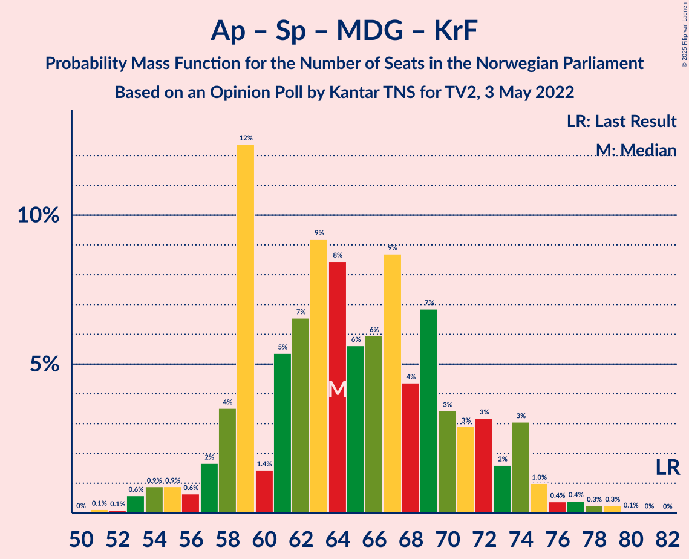

| Number of Seats | Probability | Accumulated | Special Marks |
|:---------------:|:-----------:|:-----------:|:-------------:|
| 50 | 0% | 100% |  |
| 51 | 0.1% | 99.9% |  |
| 52 | 0.1% | 99.8% |  |
| 53 | 0.6% | 99.7% |  |
| 54 | 0.9% | 99.1% |  |
| 55 | 0.9% | 98% |  |
| 56 | 0.6% | 97% |  |
| 57 | 2% | 97% |  |
| 58 | 4% | 95% |  |
| 59 | 12% | 91% |  |
| 60 | 1.4% | 79% |  |
| 61 | 5% | 78% |  |
| 62 | 7% | 72% | Median |
| 63 | 9% | 66% |  |
| 64 | 8% | 57% |  |
| 65 | 6% | 48% |  |
| 66 | 6% | 42% |  |
| 67 | 9% | 37% |  |
| 68 | 4% | 28% |  |
| 69 | 7% | 23% |  |
| 70 | 3% | 17% |  |
| 71 | 3% | 13% |  |
| 72 | 3% | 10% |  |
| 73 | 2% | 7% |  |
| 74 | 3% | 5% |  |
| 75 | 1.0% | 2% |  |
| 76 | 0.4% | 1.4% |  |
| 77 | 0.4% | 1.0% |  |
| 78 | 0.3% | 0.6% |  |
| 79 | 0.3% | 0.4% |  |
| 80 | 0.1% | 0.1% |  |
| 81 | 0% | 0.1% |  |
| 82 | 0% | 0% | Last Result |

### Arbeiderpartiet – Senterpartiet – Kristelig Folkeparti

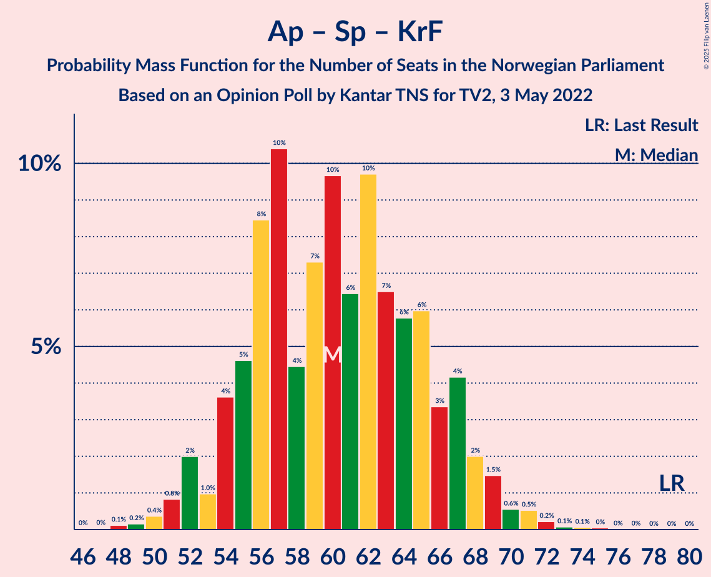

| Number of Seats | Probability | Accumulated | Special Marks |
|:---------------:|:-----------:|:-----------:|:-------------:|
| 47 | 0% | 100% |  |
| 48 | 0.1% | 99.9% |  |
| 49 | 0.2% | 99.8% |  |
| 50 | 0.4% | 99.7% |  |
| 51 | 0.8% | 99.3% |  |
| 52 | 2% | 98% |  |
| 53 | 1.0% | 96% |  |
| 54 | 4% | 95% |  |
| 55 | 5% | 92% |  |
| 56 | 8% | 87% |  |
| 57 | 10% | 79% |  |
| 58 | 4% | 68% |  |
| 59 | 7% | 64% | Median |
| 60 | 10% | 57% |  |
| 61 | 6% | 47% |  |
| 62 | 10% | 40% |  |
| 63 | 7% | 31% |  |
| 64 | 6% | 24% |  |
| 65 | 6% | 19% |  |
| 66 | 3% | 13% |  |
| 67 | 4% | 9% |  |
| 68 | 2% | 5% |  |
| 69 | 1.5% | 3% |  |
| 70 | 0.6% | 2% |  |
| 71 | 0.5% | 1.0% |  |
| 72 | 0.2% | 0.4% |  |
| 73 | 0.1% | 0.2% |  |
| 74 | 0.1% | 0.1% |  |
| 75 | 0% | 0.1% |  |
| 76 | 0% | 0% |  |
| 77 | 0% | 0% |  |
| 78 | 0% | 0% |  |
| 79 | 0% | 0% | Last Result |

### Høyre – Venstre – Kristelig Folkeparti

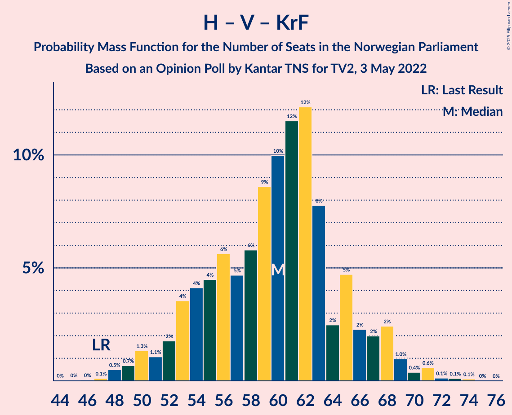

| Number of Seats | Probability | Accumulated | Special Marks |
|:---------------:|:-----------:|:-----------:|:-------------:|
| 45 | 0% | 100% |  |
| 46 | 0% | 99.9% |  |
| 47 | 0.1% | 99.9% | Last Result |
| 48 | 0.5% | 99.8% |  |
| 49 | 0.7% | 99.3% |  |
| 50 | 1.3% | 98.6% |  |
| 51 | 1.1% | 97% |  |
| 52 | 2% | 96% |  |
| 53 | 4% | 94% |  |
| 54 | 4% | 91% |  |
| 55 | 4% | 87% |  |
| 56 | 6% | 82% |  |
| 57 | 5% | 77% |  |
| 58 | 6% | 72% |  |
| 59 | 9% | 66% |  |
| 60 | 10% | 58% | Median |
| 61 | 12% | 48% |  |
| 62 | 12% | 36% |  |
| 63 | 8% | 24% |  |
| 64 | 2% | 16% |  |
| 65 | 5% | 14% |  |
| 66 | 2% | 9% |  |
| 67 | 2% | 7% |  |
| 68 | 2% | 5% |  |
| 69 | 1.0% | 2% |  |
| 70 | 0.4% | 1.3% |  |
| 71 | 0.6% | 0.9% |  |
| 72 | 0.1% | 0.4% |  |
| 73 | 0.1% | 0.2% |  |
| 74 | 0.1% | 0.1% |  |
| 75 | 0% | 0% |  |

### Arbeiderpartiet – Sosialistisk Venstreparti

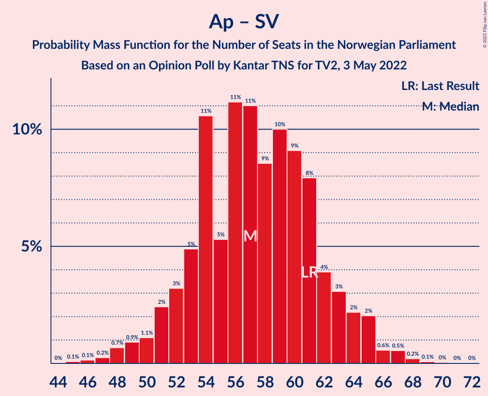

| Number of Seats | Probability | Accumulated | Special Marks |
|:---------------:|:-----------:|:-----------:|:-------------:|
| 45 | 0.1% | 100% |  |
| 46 | 0.1% | 99.9% |  |
| 47 | 0.2% | 99.7% |  |
| 48 | 0.7% | 99.5% |  |
| 49 | 0.9% | 98.8% |  |
| 50 | 1.1% | 98% |  |
| 51 | 2% | 97% |  |
| 52 | 3% | 94% |  |
| 53 | 5% | 91% |  |
| 54 | 11% | 86% |  |
| 55 | 5% | 76% |  |
| 56 | 11% | 70% |  |
| 57 | 11% | 59% |  |
| 58 | 9% | 48% | Median |
| 59 | 10% | 40% |  |
| 60 | 9% | 30% |  |
| 61 | 8% | 21% | Last Result |
| 62 | 4% | 13% |  |
| 63 | 3% | 9% |  |
| 64 | 2% | 6% |  |
| 65 | 2% | 4% |  |
| 66 | 0.6% | 1.5% |  |
| 67 | 0.5% | 0.9% |  |
| 68 | 0.2% | 0.4% |  |
| 69 | 0.1% | 0.2% |  |
| 70 | 0% | 0.1% |  |
| 71 | 0% | 0.1% |  |
| 72 | 0% | 0% |  |

### Arbeiderpartiet – Senterpartiet

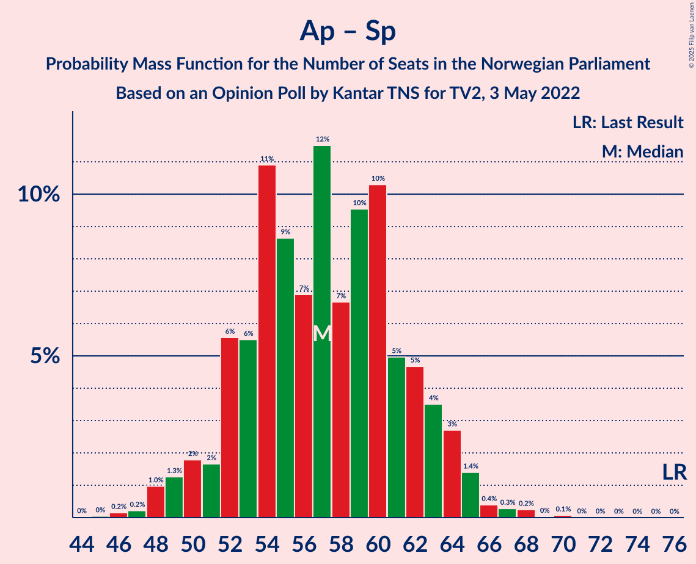

| Number of Seats | Probability | Accumulated | Special Marks |
|:---------------:|:-----------:|:-----------:|:-------------:|
| 45 | 0% | 100% |  |
| 46 | 0.2% | 99.9% |  |
| 47 | 0.2% | 99.8% |  |
| 48 | 1.0% | 99.5% |  |
| 49 | 1.3% | 98.6% |  |
| 50 | 2% | 97% |  |
| 51 | 2% | 96% |  |
| 52 | 6% | 94% |  |
| 53 | 6% | 88% |  |
| 54 | 11% | 83% |  |
| 55 | 9% | 72% |  |
| 56 | 7% | 63% |  |
| 57 | 12% | 56% | Median |
| 58 | 7% | 45% |  |
| 59 | 10% | 38% |  |
| 60 | 10% | 29% |  |
| 61 | 5% | 18% |  |
| 62 | 5% | 13% |  |
| 63 | 4% | 9% |  |
| 64 | 3% | 5% |  |
| 65 | 1.4% | 2% |  |
| 66 | 0.4% | 1.1% |  |
| 67 | 0.3% | 0.7% |  |
| 68 | 0.2% | 0.4% |  |
| 69 | 0% | 0.1% |  |
| 70 | 0.1% | 0.1% |  |
| 71 | 0% | 0% |  |
| 72 | 0% | 0% |  |
| 73 | 0% | 0% |  |
| 74 | 0% | 0% |  |
| 75 | 0% | 0% |  |
| 76 | 0% | 0% | Last Result |

### Senterpartiet – Venstre – Kristelig Folkeparti

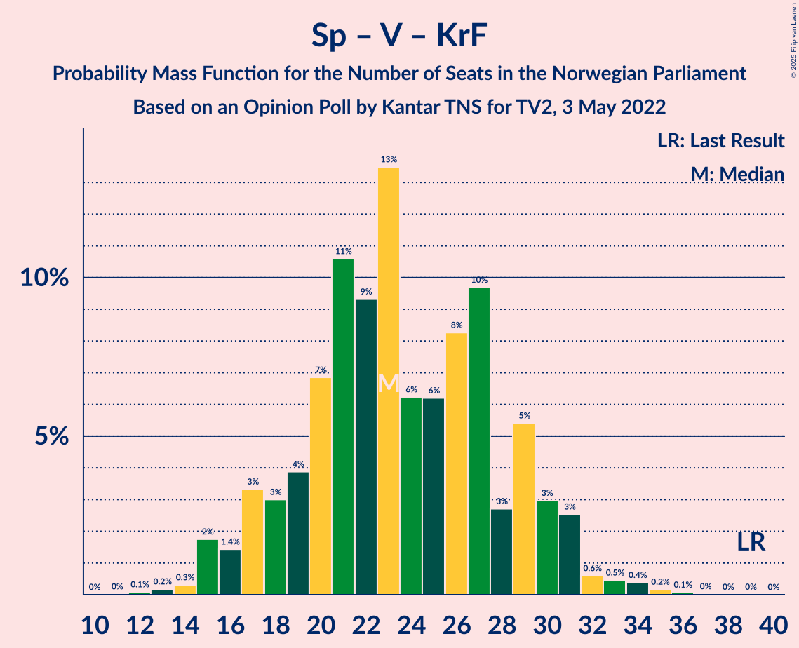

| Number of Seats | Probability | Accumulated | Special Marks |
|:---------------:|:-----------:|:-----------:|:-------------:|
| 12 | 0.1% | 100% |  |
| 13 | 0.2% | 99.9% |  |
| 14 | 0.3% | 99.7% |  |
| 15 | 2% | 99.4% |  |
| 16 | 1.4% | 98% |  |
| 17 | 3% | 96% |  |
| 18 | 3% | 93% |  |
| 19 | 4% | 90% |  |
| 20 | 7% | 86% |  |
| 21 | 11% | 79% |  |
| 22 | 9% | 69% |  |
| 23 | 13% | 59% | Median |
| 24 | 6% | 46% |  |
| 25 | 6% | 40% |  |
| 26 | 8% | 33% |  |
| 27 | 10% | 25% |  |
| 28 | 3% | 15% |  |
| 29 | 5% | 13% |  |
| 30 | 3% | 7% |  |
| 31 | 3% | 4% |  |
| 32 | 0.6% | 2% |  |
| 33 | 0.5% | 1.1% |  |
| 34 | 0.4% | 0.7% |  |
| 35 | 0.2% | 0.3% |  |
| 36 | 0.1% | 0.1% |  |
| 37 | 0% | 0% |  |
| 38 | 0% | 0% |  |
| 39 | 0% | 0% | Last Result |

## Technical Information

### Opinion Poll

+ **Polling firm:** Kantar TNS
+ **Commissioner(s):** TV2
+ **Fieldwork period:** 3 May 2022

### Calculations

+ **Sample size:** 498
+ **Simulations done:** 1,048,576
+ **Error estimate:** 1.80%

