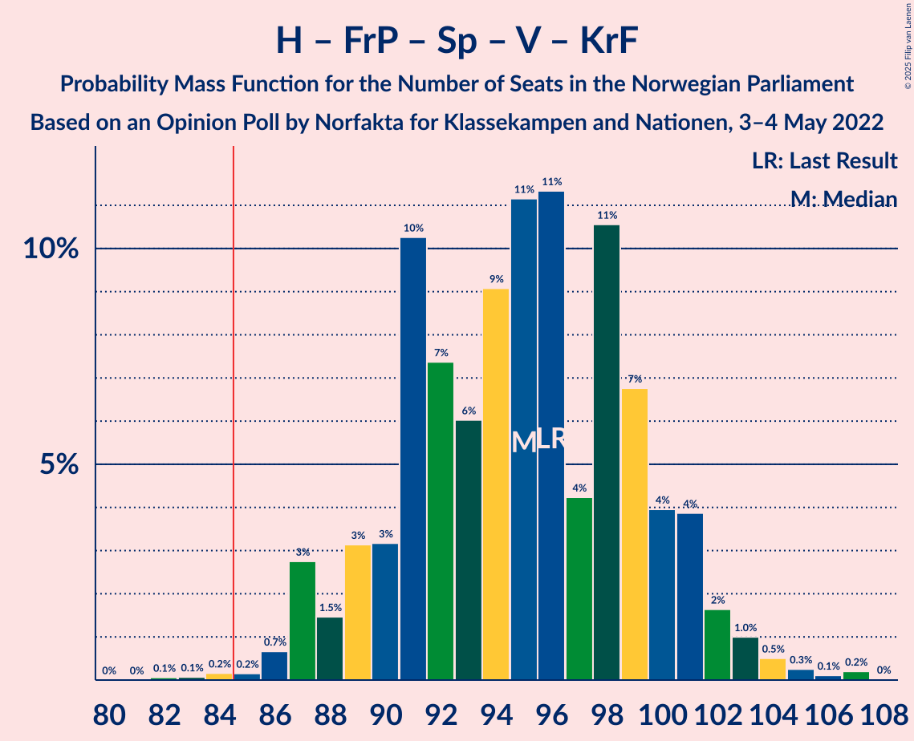
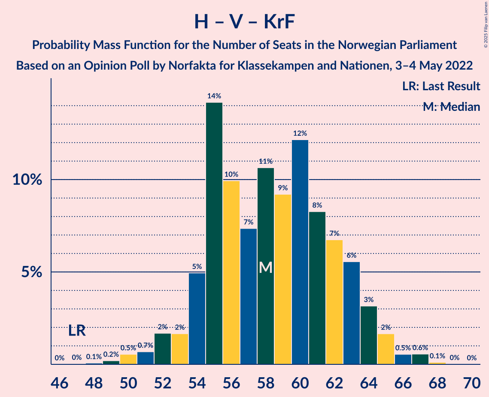

# Opinion Poll by Norfakta for Klassekampen and Nationen, 3–4 May 2022

<a href="#voting-intentions">Voting Intentions</a> | <a href="#seats">Seats</a> | <a href="#coalitions">Coalitions</a> | <a href="#technical-information">Technical Information</a>

## Voting Intentions

### Confidence Intervals

| Party | Last Result | Poll Result | 80% Confidence Interval | 90% Confidence Interval | 95% Confidence Interval | 99% Confidence Interval |
|:-----:|:-----------:|:-----------:|:-----------------------:|:-----------------------:|:-----------------------:|:-----------------------:|
| Høyre | 20.4% | 26.4% | 24.7–28.2% |24.2–28.8% |23.8–29.2% |22.9–30.1% |
| Arbeiderpartiet | 26.2% | 23.1% | 21.4–24.9% |21.0–25.4% |20.6–25.8% |19.8–26.7% |
| Fremskrittspartiet | 11.6% | 13.0% | 11.7–14.5% |11.4–14.9% |11.1–15.2% |10.5–16.0% |
| Senterpartiet | 13.5% | 8.0% | 7.0–9.2% |6.7–9.6% |6.5–9.9% |6.0–10.5% |
| Sosialistisk Venstreparti | 7.6% | 7.9% | 6.9–9.1% |6.6–9.4% |6.4–9.7% |5.9–10.3% |
| Rødt | 4.7% | 6.0% | 5.1–7.1% |4.9–7.4% |4.7–7.7% |4.3–8.2% |
| Venstre | 4.6% | 4.9% | 4.1–5.9% |3.9–6.2% |3.7–6.4% |3.4–6.9% |
| Kristelig Folkeparti | 3.8% | 3.6% | 2.9–4.5% |2.8–4.7% |2.6–5.0% |2.3–5.4% |
| Miljøpartiet De Grønne | 3.9% | 3.5% | 2.9–4.4% |2.7–4.6% |2.5–4.8% |2.2–5.3% |

*Note:* The poll result column reflects the actual value used in the calculations. Published results may vary slightly, and in addition be rounded to fewer digits.

## Seats

### Confidence Intervals

| Party | Last Result | Median | 80% Confidence Interval | 90% Confidence Interval | 95% Confidence Interval | 99% Confidence Interval |
|:-----:|:-----------:|:------:|:-----------------------:|:-----------------------:|:-----------------------:|:-----------------------:|
| <a href="#høyre">Høyre</a> | 36 | 46 | 43–50 |42–51 |42–51 |41–54 |
| <a href="#arbeiderpartiet">Arbeiderpartiet</a> | 48 | 44 | 40–47 |39–48 |38–49 |36–50 |
| <a href="#fremskrittspartiet">Fremskrittspartiet</a> | 21 | 22 | 20–26 |19–27 |19–27 |17–29 |
| <a href="#senterpartiet">Senterpartiet</a> | 28 | 14 | 12–16 |12–17 |11–18 |10–19 |
| <a href="#sosialistisk-venstreparti">Sosialistisk Venstreparti</a> | 13 | 14 | 11–16 |10–17 |10–17 |9–18 |
| <a href="#rødt">Rødt</a> | 8 | 10 | 8–12 |8–13 |7–13 |7–14 |
| <a href="#venstre">Venstre</a> | 8 | 8 | 7–10 |3–11 |3–12 |2–12 |
| <a href="#kristelig-folkeparti">Kristelig Folkeparti</a> | 3 | 3 | 2–7 |2–8 |2–8 |1–9 |
| <a href="#miljøpartiet-de-grønne">Miljøpartiet De Grønne</a> | 3 | 3 | 1–7 |1–8 |1–8 |1–9 |

### Høyre

*For a full overview of the results for this party, see the [Høyre](party-høyre.html) page.*

| Number of Seats | Probability | Accumulated | Special Marks |
|:---------------:|:-----------:|:-----------:|:-------------:|
| 36 | 0% | 100% | Last Result |
| 37 | 0% | 100% |  |
| 38 | 0% | 100% |  |
| 39 | 0% | 100% |  |
| 40 | 0.1% | 100% |  |
| 41 | 1.4% | 99.9% |  |
| 42 | 4% | 98% |  |
| 43 | 7% | 94% |  |
| 44 | 12% | 87% |  |
| 45 | 22% | 75% |  |
| 46 | 14% | 53% | Median |
| 47 | 9% | 39% |  |
| 48 | 14% | 30% |  |
| 49 | 4% | 16% |  |
| 50 | 5% | 12% |  |
| 51 | 4% | 6% |  |
| 52 | 1.1% | 2% |  |
| 53 | 0.5% | 1.1% |  |
| 54 | 0.4% | 0.6% |  |
| 55 | 0.1% | 0.2% |  |
| 56 | 0.1% | 0.1% |  |
| 57 | 0% | 0% |  |

### Arbeiderpartiet

*For a full overview of the results for this party, see the [Arbeiderpartiet](party-arbeiderpartiet.html) page.*

| Number of Seats | Probability | Accumulated | Special Marks |
|:---------------:|:-----------:|:-----------:|:-------------:|
| 36 | 0.6% | 100% |  |
| 37 | 1.1% | 99.4% |  |
| 38 | 2% | 98% |  |
| 39 | 6% | 97% |  |
| 40 | 6% | 91% |  |
| 41 | 5% | 85% |  |
| 42 | 9% | 80% |  |
| 43 | 15% | 71% |  |
| 44 | 6% | 56% | Median |
| 45 | 17% | 50% |  |
| 46 | 15% | 32% |  |
| 47 | 10% | 17% |  |
| 48 | 4% | 7% | Last Result |
| 49 | 2% | 3% |  |
| 50 | 0.6% | 0.8% |  |
| 51 | 0.1% | 0.2% |  |
| 52 | 0% | 0.1% |  |
| 53 | 0% | 0% |  |

### Fremskrittspartiet

*For a full overview of the results for this party, see the [Fremskrittspartiet](party-fremskrittspartiet.html) page.*

| Number of Seats | Probability | Accumulated | Special Marks |
|:---------------:|:-----------:|:-----------:|:-------------:|
| 17 | 0.6% | 100% |  |
| 18 | 1.1% | 99.4% |  |
| 19 | 5% | 98% |  |
| 20 | 11% | 94% |  |
| 21 | 22% | 82% | Last Result |
| 22 | 16% | 60% | Median |
| 23 | 15% | 44% |  |
| 24 | 8% | 29% |  |
| 25 | 9% | 21% |  |
| 26 | 5% | 12% |  |
| 27 | 5% | 7% |  |
| 28 | 2% | 2% |  |
| 29 | 0.5% | 0.9% |  |
| 30 | 0.2% | 0.3% |  |
| 31 | 0.1% | 0.1% |  |
| 32 | 0% | 0% |  |

### Senterpartiet

*For a full overview of the results for this party, see the [Senterpartiet](party-senterpartiet.html) page.*

| Number of Seats | Probability | Accumulated | Special Marks |
|:---------------:|:-----------:|:-----------:|:-------------:|
| 8 | 0.1% | 100% |  |
| 9 | 0.3% | 99.9% |  |
| 10 | 0.9% | 99.6% |  |
| 11 | 1.4% | 98.7% |  |
| 12 | 10% | 97% |  |
| 13 | 19% | 87% |  |
| 14 | 34% | 68% | Median |
| 15 | 22% | 33% |  |
| 16 | 5% | 11% |  |
| 17 | 3% | 6% |  |
| 18 | 2% | 3% |  |
| 19 | 0.8% | 0.8% |  |
| 20 | 0% | 0% |  |
| 21 | 0% | 0% |  |
| 22 | 0% | 0% |  |
| 23 | 0% | 0% |  |
| 24 | 0% | 0% |  |
| 25 | 0% | 0% |  |
| 26 | 0% | 0% |  |
| 27 | 0% | 0% |  |
| 28 | 0% | 0% | Last Result |

### Sosialistisk Venstreparti

*For a full overview of the results for this party, see the [Sosialistisk Venstreparti](party-sosialistiskvenstreparti.html) page.*

| Number of Seats | Probability | Accumulated | Special Marks |
|:---------------:|:-----------:|:-----------:|:-------------:|
| 8 | 0.1% | 100% |  |
| 9 | 2% | 99.9% |  |
| 10 | 3% | 98% |  |
| 11 | 10% | 95% |  |
| 12 | 15% | 85% |  |
| 13 | 19% | 70% | Last Result |
| 14 | 17% | 50% | Median |
| 15 | 17% | 34% |  |
| 16 | 10% | 16% |  |
| 17 | 4% | 7% |  |
| 18 | 2% | 2% |  |
| 19 | 0.3% | 0.3% |  |
| 20 | 0.1% | 0.1% |  |
| 21 | 0% | 0% |  |

### Rødt

*For a full overview of the results for this party, see the [Rødt](party-rødt.html) page.*

| Number of Seats | Probability | Accumulated | Special Marks |
|:---------------:|:-----------:|:-----------:|:-------------:|
| 1 | 0.1% | 100% |  |
| 2 | 0% | 99.9% |  |
| 3 | 0% | 99.9% |  |
| 4 | 0% | 99.9% |  |
| 5 | 0% | 99.9% |  |
| 6 | 0.2% | 99.9% |  |
| 7 | 3% | 99.6% |  |
| 8 | 7% | 96% | Last Result |
| 9 | 21% | 89% |  |
| 10 | 28% | 68% | Median |
| 11 | 20% | 40% |  |
| 12 | 14% | 20% |  |
| 13 | 4% | 6% |  |
| 14 | 2% | 2% |  |
| 15 | 0.3% | 0.4% |  |
| 16 | 0% | 0% |  |

### Venstre

*For a full overview of the results for this party, see the [Venstre](party-venstre.html) page.*

| Number of Seats | Probability | Accumulated | Special Marks |
|:---------------:|:-----------:|:-----------:|:-------------:|
| 2 | 2% | 100% |  |
| 3 | 5% | 98% |  |
| 4 | 0% | 93% |  |
| 5 | 0% | 93% |  |
| 6 | 2% | 93% |  |
| 7 | 16% | 91% |  |
| 8 | 33% | 75% | Last Result, Median |
| 9 | 23% | 42% |  |
| 10 | 10% | 19% |  |
| 11 | 7% | 10% |  |
| 12 | 3% | 3% |  |
| 13 | 0.1% | 0.1% |  |
| 14 | 0% | 0% |  |

### Kristelig Folkeparti

*For a full overview of the results for this party, see the [Kristelig Folkeparti](party-kristeligfolkeparti.html) page.*

| Number of Seats | Probability | Accumulated | Special Marks |
|:---------------:|:-----------:|:-----------:|:-------------:|
| 0 | 0.3% | 100% |  |
| 1 | 0.7% | 99.7% |  |
| 2 | 33% | 99.0% |  |
| 3 | 32% | 66% | Last Result, Median |
| 4 | 0% | 34% |  |
| 5 | 0.2% | 34% |  |
| 6 | 11% | 34% |  |
| 7 | 14% | 23% |  |
| 8 | 7% | 8% |  |
| 9 | 1.4% | 2% |  |
| 10 | 0.1% | 0.1% |  |
| 11 | 0% | 0% |  |

### Miljøpartiet De Grønne

*For a full overview of the results for this party, see the [Miljøpartiet De Grønne](party-miljøpartietdegrønne.html) page.*

| Number of Seats | Probability | Accumulated | Special Marks |
|:---------------:|:-----------:|:-----------:|:-------------:|
| 1 | 14% | 100% |  |
| 2 | 34% | 86% |  |
| 3 | 22% | 52% | Last Result, Median |
| 4 | 0% | 30% |  |
| 5 | 0.1% | 30% |  |
| 6 | 6% | 30% |  |
| 7 | 18% | 24% |  |
| 8 | 5% | 7% |  |
| 9 | 1.0% | 1.1% |  |
| 10 | 0.1% | 0.1% |  |
| 11 | 0% | 0% |  |

## Coalitions

### Confidence Intervals

| Coalition | Last Result | Median | Majority? | 80% Confidence Interval | 90% Confidence Interval | 95% Confidence Interval | 99% Confidence Interval |
|:---------:|:-----------:|:------:|:---------:|:-----------------------:|:-----------------------:|:-----------------------:|:-----------------------:|
| Høyre – Fremskrittspartiet – Senterpartiet – Venstre – Kristelig Folkeparti | 96 | 95 | 99.7% | 90–100 | 88–101 | 87–102 | 86–105 |
| Arbeiderpartiet – Senterpartiet – Sosialistisk Venstreparti – Rødt – Miljøpartiet De Grønne | 100 | 85 | 60% | 80–90 | 78–91 | 78–93 | 76–94 |
| Høyre – Fremskrittspartiet – Venstre – Kristelig Folkeparti – Miljøpartiet De Grønne | 71 | 85 | 53% | 80–88 | 78–90 | 78–91 | 74–94 |
| Høyre – Fremskrittspartiet – Venstre – Kristelig Folkeparti | 68 | 81 | 16% | 76–86 | 75–86 | 75–88 | 71–91 |
| Arbeiderpartiet – Senterpartiet – Sosialistisk Venstreparti – Rødt | 97 | 81 | 23% | 77–87 | 75–87 | 74–88 | 73–90 |
| Arbeiderpartiet – Senterpartiet – Sosialistisk Venstreparti – Kristelig Folkeparti – Miljøpartiet De Grønne | 95 | 79 | 4% | 74–84 | 73–84 | 72–86 | 70–88 |
| Høyre – Fremskrittspartiet – Venstre | 65 | 76 | 1.4% | 73–82 | 72–83 | 71–84 | 68–87 |
| Arbeiderpartiet – Senterpartiet – Sosialistisk Venstreparti – Miljøpartiet De Grønne | 92 | 75 | 0.2% | 70–80 | 69–81 | 68–81 | 66–83 |
| Arbeiderpartiet – Sosialistisk Venstreparti – Rødt – Miljøpartiet De Grønne | 72 | 71 | 0% | 66–76 | 64–77 | 63–79 | 61–80 |
| Arbeiderpartiet – Senterpartiet – Sosialistisk Venstreparti | 89 | 72 | 0% | 68–76 | 66–76 | 65–78 | 63–79 |
| Høyre – Fremskrittspartiet | 57 | 68 | 0% | 65–73 | 64–75 | 63–75 | 62–78 |
| Arbeiderpartiet – Senterpartiet – Kristelig Folkeparti – Miljøpartiet De Grønne | 82 | 66 | 0% | 60–70 | 59–72 | 57–72 | 55–75 |
| Arbeiderpartiet – Senterpartiet – Kristelig Folkeparti | 79 | 62 | 0% | 57–67 | 56–67 | 54–69 | 53–70 |
| Høyre – Venstre – Kristelig Folkeparti | 47 | 58 | 0% | 55–63 | 54–64 | 52–65 | 50–67 |
| Arbeiderpartiet – Senterpartiet | 76 | 58 | 0% | 54–61 | 53–62 | 52–63 | 50–65 |
| Arbeiderpartiet – Sosialistisk Venstreparti | 61 | 58 | 0% | 53–62 | 52–62 | 52–63 | 49–64 |
| Senterpartiet – Venstre – Kristelig Folkeparti | 39 | 26 | 0% | 22–30 | 21–31 | 19–31 | 17–33 |

### Høyre – Fremskrittspartiet – Senterpartiet – Venstre – Kristelig Folkeparti

| Number of Seats | Probability | Accumulated | Special Marks |
|:---------------:|:-----------:|:-----------:|:-------------:|
| 82 | 0.1% | 100% |  |
| 83 | 0.1% | 99.9% |  |
| 84 | 0.2% | 99.9% |  |
| 85 | 0.2% | 99.7% | Majority |
| 86 | 0.7% | 99.5% |  |
| 87 | 3% | 98.9% |  |
| 88 | 1.5% | 96% |  |
| 89 | 3% | 95% |  |
| 90 | 3% | 92% |  |
| 91 | 10% | 88% |  |
| 92 | 7% | 78% |  |
| 93 | 6% | 71% | Median |
| 94 | 9% | 65% |  |
| 95 | 11% | 56% |  |
| 96 | 11% | 44% | Last Result |
| 97 | 4% | 33% |  |
| 98 | 11% | 29% |  |
| 99 | 7% | 18% |  |
| 100 | 4% | 12% |  |
| 101 | 4% | 8% |  |
| 102 | 2% | 4% |  |
| 103 | 1.0% | 2% |  |
| 104 | 0.5% | 1.1% |  |
| 105 | 0.3% | 0.6% |  |
| 106 | 0.1% | 0.3% |  |
| 107 | 0.2% | 0.2% |  |
| 108 | 0% | 0% |  |

### Arbeiderpartiet – Senterpartiet – Sosialistisk Venstreparti – Rødt – Miljøpartiet De Grønne

| Number of Seats | Probability | Accumulated | Special Marks |
|:---------------:|:-----------:|:-----------:|:-------------:|
| 73 | 0% | 100% |  |
| 74 | 0.2% | 99.9% |  |
| 75 | 0.2% | 99.8% |  |
| 76 | 0.7% | 99.6% |  |
| 77 | 0.8% | 98.9% |  |
| 78 | 3% | 98% |  |
| 79 | 1.3% | 95% |  |
| 80 | 5% | 93% |  |
| 81 | 4% | 88% |  |
| 82 | 7% | 84% |  |
| 83 | 7% | 77% |  |
| 84 | 9% | 70% |  |
| 85 | 11% | 60% | Median, Majority |
| 86 | 11% | 49% |  |
| 87 | 10% | 38% |  |
| 88 | 6% | 28% |  |
| 89 | 7% | 22% |  |
| 90 | 7% | 15% |  |
| 91 | 4% | 8% |  |
| 92 | 2% | 4% |  |
| 93 | 2% | 3% |  |
| 94 | 0.4% | 0.7% |  |
| 95 | 0.1% | 0.3% |  |
| 96 | 0.1% | 0.2% |  |
| 97 | 0.1% | 0.1% |  |
| 98 | 0% | 0% |  |
| 99 | 0% | 0% |  |
| 100 | 0% | 0% | Last Result |

### Høyre – Fremskrittspartiet – Venstre – Kristelig Folkeparti – Miljøpartiet De Grønne

| Number of Seats | Probability | Accumulated | Special Marks |
|:---------------:|:-----------:|:-----------:|:-------------:|
| 71 | 0% | 100% | Last Result |
| 72 | 0% | 100% |  |
| 73 | 0.1% | 100% |  |
| 74 | 0.5% | 99.9% |  |
| 75 | 0.2% | 99.4% |  |
| 76 | 0.5% | 99.2% |  |
| 77 | 1.0% | 98.8% |  |
| 78 | 5% | 98% |  |
| 79 | 3% | 93% |  |
| 80 | 5% | 91% |  |
| 81 | 11% | 86% |  |
| 82 | 7% | 75% | Median |
| 83 | 8% | 68% |  |
| 84 | 7% | 60% |  |
| 85 | 10% | 53% | Majority |
| 86 | 9% | 43% |  |
| 87 | 11% | 35% |  |
| 88 | 15% | 24% |  |
| 89 | 4% | 10% |  |
| 90 | 3% | 6% |  |
| 91 | 0.9% | 3% |  |
| 92 | 0.8% | 2% |  |
| 93 | 0.5% | 1.0% |  |
| 94 | 0.4% | 0.5% |  |
| 95 | 0.1% | 0.1% |  |
| 96 | 0% | 0.1% |  |
| 97 | 0% | 0% |  |

### Høyre – Fremskrittspartiet – Venstre – Kristelig Folkeparti

| Number of Seats | Probability | Accumulated | Special Marks |
|:---------------:|:-----------:|:-----------:|:-------------:|
| 68 | 0% | 100% | Last Result |
| 69 | 0% | 100% |  |
| 70 | 0.1% | 99.9% |  |
| 71 | 0.4% | 99.8% |  |
| 72 | 0.5% | 99.4% |  |
| 73 | 0.7% | 98.9% |  |
| 74 | 0.7% | 98% |  |
| 75 | 5% | 98% |  |
| 76 | 5% | 92% |  |
| 77 | 6% | 87% |  |
| 78 | 10% | 82% |  |
| 79 | 8% | 71% | Median |
| 80 | 9% | 63% |  |
| 81 | 11% | 55% |  |
| 82 | 11% | 44% |  |
| 83 | 9% | 33% |  |
| 84 | 8% | 25% |  |
| 85 | 6% | 16% | Majority |
| 86 | 6% | 10% |  |
| 87 | 2% | 5% |  |
| 88 | 2% | 3% |  |
| 89 | 0.5% | 2% |  |
| 90 | 0.5% | 1.1% |  |
| 91 | 0.2% | 0.6% |  |
| 92 | 0.3% | 0.4% |  |
| 93 | 0% | 0% |  |

### Arbeiderpartiet – Senterpartiet – Sosialistisk Venstreparti – Rødt

| Number of Seats | Probability | Accumulated | Special Marks |
|:---------------:|:-----------:|:-----------:|:-------------:|
| 70 | 0% | 100% |  |
| 71 | 0% | 99.9% |  |
| 72 | 0.1% | 99.9% |  |
| 73 | 0.8% | 99.7% |  |
| 74 | 2% | 98.9% |  |
| 75 | 2% | 97% |  |
| 76 | 4% | 95% |  |
| 77 | 2% | 91% |  |
| 78 | 5% | 89% |  |
| 79 | 6% | 84% |  |
| 80 | 16% | 77% |  |
| 81 | 11% | 61% |  |
| 82 | 9% | 50% | Median |
| 83 | 12% | 41% |  |
| 84 | 5% | 28% |  |
| 85 | 6% | 23% | Majority |
| 86 | 6% | 18% |  |
| 87 | 7% | 11% |  |
| 88 | 3% | 4% |  |
| 89 | 0.8% | 1.5% |  |
| 90 | 0.3% | 0.7% |  |
| 91 | 0.2% | 0.4% |  |
| 92 | 0.1% | 0.1% |  |
| 93 | 0% | 0.1% |  |
| 94 | 0% | 0% |  |
| 95 | 0% | 0% |  |
| 96 | 0% | 0% |  |
| 97 | 0% | 0% | Last Result |

### Arbeiderpartiet – Senterpartiet – Sosialistisk Venstreparti – Kristelig Folkeparti – Miljøpartiet De Grønne

| Number of Seats | Probability | Accumulated | Special Marks |
|:---------------:|:-----------:|:-----------:|:-------------:|
| 67 | 0.1% | 100% |  |
| 68 | 0.1% | 99.9% |  |
| 69 | 0.2% | 99.7% |  |
| 70 | 0.6% | 99.6% |  |
| 71 | 1.2% | 99.0% |  |
| 72 | 0.9% | 98% |  |
| 73 | 5% | 97% |  |
| 74 | 4% | 92% |  |
| 75 | 4% | 87% |  |
| 76 | 7% | 84% |  |
| 77 | 11% | 76% |  |
| 78 | 8% | 65% | Median |
| 79 | 12% | 57% |  |
| 80 | 7% | 45% |  |
| 81 | 6% | 38% |  |
| 82 | 9% | 32% |  |
| 83 | 12% | 22% |  |
| 84 | 6% | 10% |  |
| 85 | 0.9% | 4% | Majority |
| 86 | 2% | 3% |  |
| 87 | 0.6% | 1.2% |  |
| 88 | 0.4% | 0.6% |  |
| 89 | 0.1% | 0.3% |  |
| 90 | 0.1% | 0.1% |  |
| 91 | 0% | 0% |  |
| 92 | 0% | 0% |  |
| 93 | 0% | 0% |  |
| 94 | 0% | 0% |  |
| 95 | 0% | 0% | Last Result |

### Høyre – Fremskrittspartiet – Venstre

| Number of Seats | Probability | Accumulated | Special Marks |
|:---------------:|:-----------:|:-----------:|:-------------:|
| 65 | 0% | 100% | Last Result |
| 66 | 0% | 100% |  |
| 67 | 0.1% | 99.9% |  |
| 68 | 0.5% | 99.9% |  |
| 69 | 0.6% | 99.3% |  |
| 70 | 1.1% | 98.7% |  |
| 71 | 1.3% | 98% |  |
| 72 | 5% | 96% |  |
| 73 | 8% | 92% |  |
| 74 | 8% | 83% |  |
| 75 | 17% | 75% |  |
| 76 | 10% | 58% | Median |
| 77 | 12% | 48% |  |
| 78 | 7% | 37% |  |
| 79 | 5% | 30% |  |
| 80 | 6% | 24% |  |
| 81 | 7% | 18% |  |
| 82 | 4% | 12% |  |
| 83 | 4% | 8% |  |
| 84 | 3% | 4% |  |
| 85 | 0.7% | 1.4% | Majority |
| 86 | 0.2% | 0.7% |  |
| 87 | 0.2% | 0.5% |  |
| 88 | 0.2% | 0.4% |  |
| 89 | 0.1% | 0.1% |  |
| 90 | 0.1% | 0.1% |  |
| 91 | 0% | 0% |  |

### Arbeiderpartiet – Senterpartiet – Sosialistisk Venstreparti – Miljøpartiet De Grønne

| Number of Seats | Probability | Accumulated | Special Marks |
|:---------------:|:-----------:|:-----------:|:-------------:|
| 64 | 0.1% | 100% |  |
| 65 | 0.2% | 99.8% |  |
| 66 | 0.4% | 99.6% |  |
| 67 | 0.5% | 99.2% |  |
| 68 | 1.4% | 98.6% |  |
| 69 | 4% | 97% |  |
| 70 | 4% | 94% |  |
| 71 | 6% | 90% |  |
| 72 | 7% | 84% |  |
| 73 | 7% | 77% |  |
| 74 | 8% | 70% |  |
| 75 | 17% | 62% | Median |
| 76 | 9% | 45% |  |
| 77 | 15% | 36% |  |
| 78 | 5% | 21% |  |
| 79 | 6% | 16% |  |
| 80 | 3% | 10% |  |
| 81 | 5% | 7% |  |
| 82 | 1.0% | 2% |  |
| 83 | 0.8% | 1.3% |  |
| 84 | 0.3% | 0.5% |  |
| 85 | 0.1% | 0.2% | Majority |
| 86 | 0% | 0.1% |  |
| 87 | 0% | 0% |  |
| 88 | 0% | 0% |  |
| 89 | 0% | 0% |  |
| 90 | 0% | 0% |  |
| 91 | 0% | 0% |  |
| 92 | 0% | 0% | Last Result |

### Arbeiderpartiet – Sosialistisk Venstreparti – Rødt – Miljøpartiet De Grønne

| Number of Seats | Probability | Accumulated | Special Marks |
|:---------------:|:-----------:|:-----------:|:-------------:|
| 59 | 0% | 100% |  |
| 60 | 0.2% | 99.9% |  |
| 61 | 0.3% | 99.8% |  |
| 62 | 0.3% | 99.4% |  |
| 63 | 3% | 99.1% |  |
| 64 | 2% | 96% |  |
| 65 | 2% | 95% |  |
| 66 | 3% | 92% |  |
| 67 | 5% | 89% |  |
| 68 | 7% | 84% |  |
| 69 | 7% | 77% |  |
| 70 | 11% | 69% |  |
| 71 | 10% | 58% | Median |
| 72 | 8% | 49% | Last Result |
| 73 | 11% | 40% |  |
| 74 | 9% | 29% |  |
| 75 | 5% | 19% |  |
| 76 | 7% | 15% |  |
| 77 | 3% | 8% |  |
| 78 | 2% | 5% |  |
| 79 | 2% | 3% |  |
| 80 | 0.4% | 0.7% |  |
| 81 | 0.2% | 0.3% |  |
| 82 | 0% | 0.1% |  |
| 83 | 0% | 0% |  |

### Arbeiderpartiet – Senterpartiet – Sosialistisk Venstreparti

| Number of Seats | Probability | Accumulated | Special Marks |
|:---------------:|:-----------:|:-----------:|:-------------:|
| 61 | 0% | 100% |  |
| 62 | 0.1% | 99.9% |  |
| 63 | 0.4% | 99.9% |  |
| 64 | 0.7% | 99.5% |  |
| 65 | 1.4% | 98.7% |  |
| 66 | 2% | 97% |  |
| 67 | 5% | 95% |  |
| 68 | 7% | 90% |  |
| 69 | 8% | 83% |  |
| 70 | 14% | 75% |  |
| 71 | 10% | 61% |  |
| 72 | 12% | 51% | Median |
| 73 | 14% | 39% |  |
| 74 | 9% | 25% |  |
| 75 | 6% | 16% |  |
| 76 | 5% | 10% |  |
| 77 | 2% | 5% |  |
| 78 | 3% | 3% |  |
| 79 | 0.3% | 0.6% |  |
| 80 | 0.2% | 0.3% |  |
| 81 | 0.1% | 0.1% |  |
| 82 | 0% | 0% |  |
| 83 | 0% | 0% |  |
| 84 | 0% | 0% |  |
| 85 | 0% | 0% | Majority |
| 86 | 0% | 0% |  |
| 87 | 0% | 0% |  |
| 88 | 0% | 0% |  |
| 89 | 0% | 0% | Last Result |

### Høyre – Fremskrittspartiet

| Number of Seats | Probability | Accumulated | Special Marks |
|:---------------:|:-----------:|:-----------:|:-------------:|
| 57 | 0% | 100% | Last Result |
| 58 | 0% | 100% |  |
| 59 | 0% | 100% |  |
| 60 | 0% | 100% |  |
| 61 | 0.3% | 99.9% |  |
| 62 | 1.4% | 99.7% |  |
| 63 | 0.8% | 98% |  |
| 64 | 7% | 97% |  |
| 65 | 6% | 91% |  |
| 66 | 13% | 84% |  |
| 67 | 13% | 72% |  |
| 68 | 11% | 59% | Median |
| 69 | 10% | 48% |  |
| 70 | 11% | 38% |  |
| 71 | 7% | 26% |  |
| 72 | 5% | 20% |  |
| 73 | 6% | 15% |  |
| 74 | 3% | 9% |  |
| 75 | 4% | 6% |  |
| 76 | 0.9% | 2% |  |
| 77 | 0.4% | 1.1% |  |
| 78 | 0.4% | 0.7% |  |
| 79 | 0.1% | 0.3% |  |
| 80 | 0.1% | 0.2% |  |
| 81 | 0.1% | 0.1% |  |
| 82 | 0% | 0% |  |

### Arbeiderpartiet – Senterpartiet – Kristelig Folkeparti – Miljøpartiet De Grønne

| Number of Seats | Probability | Accumulated | Special Marks |
|:---------------:|:-----------:|:-----------:|:-------------:|
| 53 | 0.1% | 100% |  |
| 54 | 0.1% | 99.9% |  |
| 55 | 0.3% | 99.8% |  |
| 56 | 2% | 99.5% |  |
| 57 | 0.5% | 98% |  |
| 58 | 2% | 97% |  |
| 59 | 2% | 95% |  |
| 60 | 4% | 93% |  |
| 61 | 4% | 89% |  |
| 62 | 9% | 85% |  |
| 63 | 6% | 76% |  |
| 64 | 8% | 69% | Median |
| 65 | 11% | 61% |  |
| 66 | 9% | 50% |  |
| 67 | 7% | 42% |  |
| 68 | 6% | 34% |  |
| 69 | 9% | 28% |  |
| 70 | 10% | 19% |  |
| 71 | 4% | 9% |  |
| 72 | 4% | 5% |  |
| 73 | 0.8% | 2% |  |
| 74 | 0.4% | 1.0% |  |
| 75 | 0.4% | 0.6% |  |
| 76 | 0.1% | 0.3% |  |
| 77 | 0.1% | 0.2% |  |
| 78 | 0% | 0% |  |
| 79 | 0% | 0% |  |
| 80 | 0% | 0% |  |
| 81 | 0% | 0% |  |
| 82 | 0% | 0% | Last Result |

### Arbeiderpartiet – Senterpartiet – Kristelig Folkeparti

| Number of Seats | Probability | Accumulated | Special Marks |
|:---------------:|:-----------:|:-----------:|:-------------:|
| 51 | 0.1% | 100% |  |
| 52 | 0.2% | 99.9% |  |
| 53 | 0.6% | 99.7% |  |
| 54 | 2% | 99.1% |  |
| 55 | 0.7% | 97% |  |
| 56 | 3% | 97% |  |
| 57 | 5% | 93% |  |
| 58 | 5% | 88% |  |
| 59 | 7% | 83% |  |
| 60 | 9% | 76% |  |
| 61 | 8% | 67% | Median |
| 62 | 11% | 59% |  |
| 63 | 17% | 47% |  |
| 64 | 8% | 30% |  |
| 65 | 6% | 22% |  |
| 66 | 5% | 16% |  |
| 67 | 6% | 10% |  |
| 68 | 1.5% | 5% |  |
| 69 | 2% | 3% |  |
| 70 | 0.9% | 1.2% |  |
| 71 | 0.2% | 0.3% |  |
| 72 | 0% | 0.1% |  |
| 73 | 0% | 0.1% |  |
| 74 | 0% | 0% |  |
| 75 | 0% | 0% |  |
| 76 | 0% | 0% |  |
| 77 | 0% | 0% |  |
| 78 | 0% | 0% |  |
| 79 | 0% | 0% | Last Result |

### Høyre – Venstre – Kristelig Folkeparti

| Number of Seats | Probability | Accumulated | Special Marks |
|:---------------:|:-----------:|:-----------:|:-------------:|
| 47 | 0% | 100% | Last Result |
| 48 | 0.1% | 100% |  |
| 49 | 0.2% | 99.9% |  |
| 50 | 0.5% | 99.7% |  |
| 51 | 0.7% | 99.1% |  |
| 52 | 2% | 98% |  |
| 53 | 2% | 97% |  |
| 54 | 5% | 95% |  |
| 55 | 14% | 90% |  |
| 56 | 10% | 76% |  |
| 57 | 7% | 66% | Median |
| 58 | 11% | 59% |  |
| 59 | 9% | 48% |  |
| 60 | 12% | 39% |  |
| 61 | 8% | 27% |  |
| 62 | 7% | 18% |  |
| 63 | 6% | 12% |  |
| 64 | 3% | 6% |  |
| 65 | 2% | 3% |  |
| 66 | 0.5% | 1.3% |  |
| 67 | 0.6% | 0.7% |  |
| 68 | 0.1% | 0.1% |  |
| 69 | 0% | 0% |  |

### Arbeiderpartiet – Senterpartiet

| Number of Seats | Probability | Accumulated | Special Marks |
|:---------------:|:-----------:|:-----------:|:-------------:|
| 49 | 0.1% | 100% |  |
| 50 | 0.4% | 99.8% |  |
| 51 | 0.9% | 99.4% |  |
| 52 | 3% | 98% |  |
| 53 | 2% | 96% |  |
| 54 | 7% | 94% |  |
| 55 | 7% | 87% |  |
| 56 | 5% | 79% |  |
| 57 | 17% | 74% |  |
| 58 | 12% | 58% | Median |
| 59 | 14% | 45% |  |
| 60 | 14% | 31% |  |
| 61 | 8% | 17% |  |
| 62 | 6% | 9% |  |
| 63 | 1.1% | 3% |  |
| 64 | 1.2% | 2% |  |
| 65 | 0.5% | 0.8% |  |
| 66 | 0.2% | 0.2% |  |
| 67 | 0.1% | 0.1% |  |
| 68 | 0% | 0% |  |
| 69 | 0% | 0% |  |
| 70 | 0% | 0% |  |
| 71 | 0% | 0% |  |
| 72 | 0% | 0% |  |
| 73 | 0% | 0% |  |
| 74 | 0% | 0% |  |
| 75 | 0% | 0% |  |
| 76 | 0% | 0% | Last Result |

### Arbeiderpartiet – Sosialistisk Venstreparti

| Number of Seats | Probability | Accumulated | Special Marks |
|:---------------:|:-----------:|:-----------:|:-------------:|
| 47 | 0% | 100% |  |
| 48 | 0.1% | 99.9% |  |
| 49 | 0.6% | 99.9% |  |
| 50 | 0.5% | 99.2% |  |
| 51 | 1.1% | 98.8% |  |
| 52 | 4% | 98% |  |
| 53 | 6% | 94% |  |
| 54 | 4% | 88% |  |
| 55 | 8% | 84% |  |
| 56 | 15% | 76% |  |
| 57 | 10% | 60% |  |
| 58 | 12% | 50% | Median |
| 59 | 13% | 39% |  |
| 60 | 10% | 26% |  |
| 61 | 6% | 16% | Last Result |
| 62 | 7% | 10% |  |
| 63 | 0.9% | 3% |  |
| 64 | 2% | 2% |  |
| 65 | 0.3% | 0.4% |  |
| 66 | 0.1% | 0.1% |  |
| 67 | 0% | 0% |  |

### Senterpartiet – Venstre – Kristelig Folkeparti

| Number of Seats | Probability | Accumulated | Special Marks |
|:---------------:|:-----------:|:-----------:|:-------------:|
| 16 | 0.1% | 100% |  |
| 17 | 1.0% | 99.9% |  |
| 18 | 0.4% | 98.9% |  |
| 19 | 1.1% | 98% |  |
| 20 | 0.7% | 97% |  |
| 21 | 4% | 97% |  |
| 22 | 4% | 93% |  |
| 23 | 8% | 89% |  |
| 24 | 10% | 81% |  |
| 25 | 12% | 71% | Median |
| 26 | 9% | 59% |  |
| 27 | 12% | 50% |  |
| 28 | 9% | 38% |  |
| 29 | 14% | 28% |  |
| 30 | 8% | 14% |  |
| 31 | 5% | 7% |  |
| 32 | 1.2% | 2% |  |
| 33 | 0.6% | 1.0% |  |
| 34 | 0.3% | 0.4% |  |
| 35 | 0.1% | 0.1% |  |
| 36 | 0% | 0.1% |  |
| 37 | 0% | 0% |  |
| 38 | 0% | 0% |  |
| 39 | 0% | 0% | Last Result |

## Technical Information

### Opinion Poll

+ **Polling firm:** Norfakta
+ **Commissioner(s):** Klassekampen and Nationen
+ **Fieldwork period:** 3–4 May 2022

### Calculations

+ **Sample size:** 1000
+ **Simulations done:** 1,048,576
+ **Error estimate:** 1.42%

