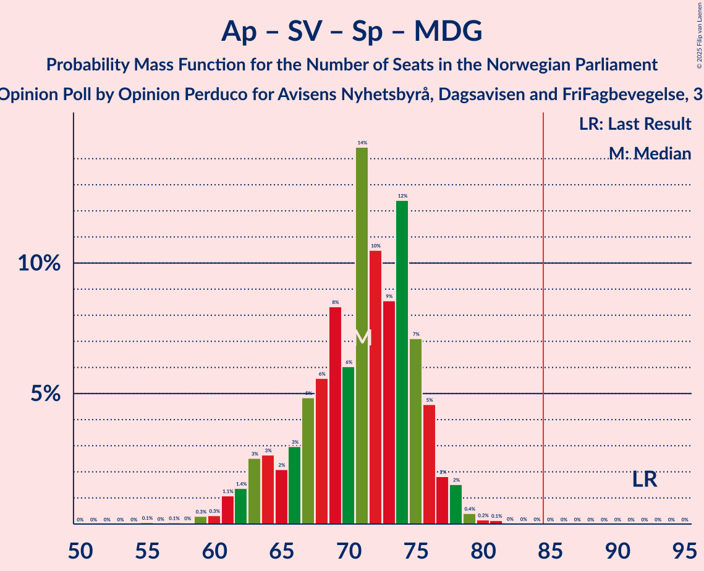

# Opinion Poll by Opinion Perduco for Avisens Nyhetsbyrå, Dagsavisen and FriFagbevegelse, 3–9 May 2022

<a href="#voting-intentions">Voting Intentions</a> | <a href="#seats">Seats</a> | <a href="#coalitions">Coalitions</a> | <a href="#technical-information">Technical Information</a>

## Voting Intentions

### Confidence Intervals

| Party | Last Result | Poll Result | 80% Confidence Interval | 90% Confidence Interval | 95% Confidence Interval | 99% Confidence Interval |
|:-----:|:-----------:|:-----------:|:-----------------------:|:-----------------------:|:-----------------------:|:-----------------------:|
| Høyre | 20.4% | 26.9% | 24.8–29.2% |24.2–29.8% |23.7–30.4% |22.8–31.5% |
| Arbeiderpartiet | 26.2% | 22.9% | 20.9–25.0% |20.3–25.6% |19.9–26.2% |19.0–27.2% |
| Fremskrittspartiet | 11.6% | 13.8% | 12.3–15.7% |11.8–16.2% |11.4–16.6% |10.7–17.5% |
| Sosialistisk Venstreparti | 7.6% | 7.9% | 6.7–9.3% |6.4–9.8% |6.1–10.1% |5.5–10.9% |
| Rødt | 4.7% | 6.8% | 5.7–8.2% |5.4–8.6% |5.2–9.0% |4.7–9.7% |
| Senterpartiet | 13.5% | 6.8% | 5.7–8.2% |5.4–8.6% |5.2–9.0% |4.7–9.7% |
| Kristelig Folkeparti | 3.8% | 4.4% | 3.5–5.5% |3.3–5.9% |3.1–6.2% |2.7–6.8% |
| Venstre | 4.6% | 3.8% | 3.0–4.9% |2.8–5.2% |2.6–5.5% |2.3–6.1% |
| Miljøpartiet De Grønne | 3.9% | 2.6% | 2.0–3.6% |1.8–3.9% |1.7–4.1% |1.4–4.6% |

*Note:* The poll result column reflects the actual value used in the calculations. Published results may vary slightly, and in addition be rounded to fewer digits.

## Seats

### Confidence Intervals

| Party | Last Result | Median | 80% Confidence Interval | 90% Confidence Interval | 95% Confidence Interval | 99% Confidence Interval |
|:-----:|:-----------:|:------:|:-----------------------:|:-----------------------:|:-----------------------:|:-----------------------:|
| <a href="#høyre">Høyre</a> | 36 | 47 | 44–51 |43–52 |42–53 |40–55 |
| <a href="#arbeiderpartiet">Arbeiderpartiet</a> | 48 | 45 | 39–47 |38–48 |37–49 |36–51 |
| <a href="#fremskrittspartiet">Fremskrittspartiet</a> | 21 | 24 | 20–28 |19–29 |19–30 |18–32 |
| <a href="#sosialistisk-venstreparti">Sosialistisk Venstreparti</a> | 13 | 14 | 10–16 |10–17 |9–17 |8–19 |
| <a href="#rødt">Rødt</a> | 8 | 12 | 9–14 |9–15 |8–15 |7–17 |
| <a href="#senterpartiet">Senterpartiet</a> | 28 | 12 | 9–14 |8–15 |8–16 |7–17 |
| <a href="#kristelig-folkeparti">Kristelig Folkeparti</a> | 3 | 7 | 3–9 |2–10 |2–10 |2–11 |
| <a href="#venstre">Venstre</a> | 8 | 3 | 2–8 |2–9 |2–9 |1–10 |
| <a href="#miljøpartiet-de-grønne">Miljøpartiet De Grønne</a> | 3 | 1 | 1–3 |1–3 |1–6 |0–8 |

### Høyre

*For a full overview of the results for this party, see the [Høyre](party-høyre.html) page.*

| Number of Seats | Probability | Accumulated | Special Marks |
|:---------------:|:-----------:|:-----------:|:-------------:|
| 36 | 0% | 100% | Last Result |
| 37 | 0% | 100% |  |
| 38 | 0% | 100% |  |
| 39 | 0.2% | 99.9% |  |
| 40 | 0.6% | 99.7% |  |
| 41 | 0.7% | 99.1% |  |
| 42 | 1.0% | 98% |  |
| 43 | 3% | 97% |  |
| 44 | 7% | 94% |  |
| 45 | 9% | 88% |  |
| 46 | 22% | 79% |  |
| 47 | 12% | 56% | Median |
| 48 | 13% | 45% |  |
| 49 | 10% | 31% |  |
| 50 | 9% | 21% |  |
| 51 | 5% | 12% |  |
| 52 | 4% | 8% |  |
| 53 | 2% | 4% |  |
| 54 | 0.9% | 2% |  |
| 55 | 0.3% | 0.8% |  |
| 56 | 0.2% | 0.5% |  |
| 57 | 0.2% | 0.3% |  |
| 58 | 0% | 0.1% |  |
| 59 | 0% | 0.1% |  |
| 60 | 0% | 0.1% |  |
| 61 | 0% | 0% |  |

### Arbeiderpartiet

*For a full overview of the results for this party, see the [Arbeiderpartiet](party-arbeiderpartiet.html) page.*

| Number of Seats | Probability | Accumulated | Special Marks |
|:---------------:|:-----------:|:-----------:|:-------------:|
| 33 | 0% | 100% |  |
| 34 | 0.1% | 99.9% |  |
| 35 | 0.3% | 99.8% |  |
| 36 | 2% | 99.5% |  |
| 37 | 2% | 98% |  |
| 38 | 4% | 96% |  |
| 39 | 4% | 92% |  |
| 40 | 4% | 88% |  |
| 41 | 5% | 84% |  |
| 42 | 8% | 79% |  |
| 43 | 7% | 71% |  |
| 44 | 10% | 64% |  |
| 45 | 21% | 54% | Median |
| 46 | 13% | 33% |  |
| 47 | 11% | 20% |  |
| 48 | 5% | 9% | Last Result |
| 49 | 2% | 4% |  |
| 50 | 0.7% | 2% |  |
| 51 | 0.5% | 0.8% |  |
| 52 | 0.1% | 0.2% |  |
| 53 | 0.1% | 0.1% |  |
| 54 | 0% | 0.1% |  |
| 55 | 0% | 0% |  |

### Fremskrittspartiet

*For a full overview of the results for this party, see the [Fremskrittspartiet](party-fremskrittspartiet.html) page.*

| Number of Seats | Probability | Accumulated | Special Marks |
|:---------------:|:-----------:|:-----------:|:-------------:|
| 17 | 0.4% | 100% |  |
| 18 | 1.1% | 99.6% |  |
| 19 | 4% | 98.5% |  |
| 20 | 6% | 95% |  |
| 21 | 9% | 89% | Last Result |
| 22 | 18% | 80% |  |
| 23 | 7% | 63% |  |
| 24 | 10% | 55% | Median |
| 25 | 16% | 45% |  |
| 26 | 6% | 29% |  |
| 27 | 7% | 23% |  |
| 28 | 7% | 16% |  |
| 29 | 4% | 9% |  |
| 30 | 3% | 4% |  |
| 31 | 0.8% | 2% |  |
| 32 | 0.3% | 0.7% |  |
| 33 | 0.2% | 0.4% |  |
| 34 | 0.1% | 0.2% |  |
| 35 | 0.1% | 0.1% |  |
| 36 | 0% | 0% |  |

### Sosialistisk Venstreparti

*For a full overview of the results for this party, see the [Sosialistisk Venstreparti](party-sosialistiskvenstreparti.html) page.*

| Number of Seats | Probability | Accumulated | Special Marks |
|:---------------:|:-----------:|:-----------:|:-------------:|
| 7 | 0.1% | 100% |  |
| 8 | 0.9% | 99.9% |  |
| 9 | 4% | 99.1% |  |
| 10 | 10% | 95% |  |
| 11 | 12% | 85% |  |
| 12 | 11% | 74% |  |
| 13 | 12% | 62% | Last Result |
| 14 | 20% | 51% | Median |
| 15 | 15% | 31% |  |
| 16 | 10% | 16% |  |
| 17 | 3% | 6% |  |
| 18 | 1.4% | 2% |  |
| 19 | 0.7% | 0.9% |  |
| 20 | 0.1% | 0.2% |  |
| 21 | 0% | 0.1% |  |
| 22 | 0.1% | 0.1% |  |
| 23 | 0% | 0% |  |

### Rødt

*For a full overview of the results for this party, see the [Rødt](party-rødt.html) page.*

| Number of Seats | Probability | Accumulated | Special Marks |
|:---------------:|:-----------:|:-----------:|:-------------:|
| 6 | 0.1% | 100% |  |
| 7 | 0.6% | 99.9% |  |
| 8 | 4% | 99.3% | Last Result |
| 9 | 10% | 95% |  |
| 10 | 17% | 85% |  |
| 11 | 14% | 69% |  |
| 12 | 26% | 55% | Median |
| 13 | 14% | 30% |  |
| 14 | 10% | 16% |  |
| 15 | 4% | 6% |  |
| 16 | 2% | 2% |  |
| 17 | 0.6% | 0.8% |  |
| 18 | 0.1% | 0.2% |  |
| 19 | 0% | 0.1% |  |
| 20 | 0% | 0% |  |

### Senterpartiet

*For a full overview of the results for this party, see the [Senterpartiet](party-senterpartiet.html) page.*

| Number of Seats | Probability | Accumulated | Special Marks |
|:---------------:|:-----------:|:-----------:|:-------------:|
| 6 | 0.2% | 100% |  |
| 7 | 1.0% | 99.7% |  |
| 8 | 4% | 98.7% |  |
| 9 | 6% | 94% |  |
| 10 | 8% | 89% |  |
| 11 | 14% | 80% |  |
| 12 | 18% | 67% | Median |
| 13 | 21% | 49% |  |
| 14 | 19% | 28% |  |
| 15 | 6% | 9% |  |
| 16 | 2% | 3% |  |
| 17 | 1.0% | 1.3% |  |
| 18 | 0.2% | 0.3% |  |
| 19 | 0% | 0% |  |
| 20 | 0% | 0% |  |
| 21 | 0% | 0% |  |
| 22 | 0% | 0% |  |
| 23 | 0% | 0% |  |
| 24 | 0% | 0% |  |
| 25 | 0% | 0% |  |
| 26 | 0% | 0% |  |
| 27 | 0% | 0% |  |
| 28 | 0% | 0% | Last Result |

### Kristelig Folkeparti

*For a full overview of the results for this party, see the [Kristelig Folkeparti](party-kristeligfolkeparti.html) page.*

| Number of Seats | Probability | Accumulated | Special Marks |
|:---------------:|:-----------:|:-----------:|:-------------:|
| 1 | 0.1% | 100% |  |
| 2 | 9% | 99.9% |  |
| 3 | 21% | 91% | Last Result |
| 4 | 0% | 70% |  |
| 5 | 0% | 70% |  |
| 6 | 8% | 70% |  |
| 7 | 17% | 62% | Median |
| 8 | 19% | 45% |  |
| 9 | 20% | 26% |  |
| 10 | 4% | 6% |  |
| 11 | 1.3% | 2% |  |
| 12 | 0.4% | 0.5% |  |
| 13 | 0.1% | 0.1% |  |
| 14 | 0% | 0% |  |

### Venstre

*For a full overview of the results for this party, see the [Venstre](party-venstre.html) page.*

| Number of Seats | Probability | Accumulated | Special Marks |
|:---------------:|:-----------:|:-----------:|:-------------:|
| 1 | 0.9% | 100% |  |
| 2 | 29% | 99.1% |  |
| 3 | 30% | 70% | Median |
| 4 | 0% | 40% |  |
| 5 | 0.1% | 40% |  |
| 6 | 6% | 40% |  |
| 7 | 15% | 34% |  |
| 8 | 12% | 19% | Last Result |
| 9 | 5% | 6% |  |
| 10 | 0.8% | 1.0% |  |
| 11 | 0.2% | 0.2% |  |
| 12 | 0% | 0% |  |

### Miljøpartiet De Grønne

*For a full overview of the results for this party, see the [Miljøpartiet De Grønne](party-miljøpartietdegrønne.html) page.*

| Number of Seats | Probability | Accumulated | Special Marks |
|:---------------:|:-----------:|:-----------:|:-------------:|
| 0 | 2% | 100% |  |
| 1 | 64% | 98% | Median |
| 2 | 23% | 34% |  |
| 3 | 8% | 10% | Last Result |
| 4 | 0% | 3% |  |
| 5 | 0% | 3% |  |
| 6 | 0.8% | 3% |  |
| 7 | 1.0% | 2% |  |
| 8 | 0.6% | 0.7% |  |
| 9 | 0.1% | 0.1% |  |
| 10 | 0% | 0% |  |

## Coalitions

### Confidence Intervals

| Coalition | Last Result | Median | Majority? | 80% Confidence Interval | 90% Confidence Interval | 95% Confidence Interval | 99% Confidence Interval |
|:---------:|:-----------:|:------:|:---------:|:-----------------------:|:-----------------------:|:-----------------------:|:-----------------------:|
| Høyre – Fremskrittspartiet – Senterpartiet – Kristelig Folkeparti – Venstre | 96 | 95 | 99.2% | 89–100 | 87–102 | 85–103 | 84–105 |
| Høyre – Fremskrittspartiet – Kristelig Folkeparti – Venstre – Miljøpartiet De Grønne | 71 | 84 | 42% | 79–89 | 77–91 | 75–92 | 73–97 |
| Høyre – Fremskrittspartiet – Kristelig Folkeparti – Venstre | 68 | 83 | 30% | 77–87 | 75–89 | 74–91 | 72–96 |
| Arbeiderpartiet – Sosialistisk Venstreparti – Rødt – Senterpartiet – Miljøpartiet De Grønne | 100 | 83 | 34% | 76–88 | 74–89 | 72–89 | 69–91 |
| Arbeiderpartiet – Sosialistisk Venstreparti – Rødt – Senterpartiet | 97 | 81 | 23% | 75–86 | 72–88 | 71–88 | 68–90 |
| Høyre – Fremskrittspartiet – Venstre | 65 | 76 | 3% | 71–82 | 69–84 | 68–85 | 66–89 |
| Arbeiderpartiet – Sosialistisk Venstreparti – Senterpartiet – Kristelig Folkeparti – Miljøpartiet De Grønne | 95 | 78 | 2% | 71–83 | 69–84 | 67–84 | 65–86 |
| Høyre – Fremskrittspartiet | 57 | 71 | 0.2% | 67–77 | 66–78 | 65–80 | 63–83 |
| Arbeiderpartiet – Sosialistisk Venstreparti – Senterpartiet – Miljøpartiet De Grønne | 92 | 71 | 0% | 65–75 | 63–76 | 62–77 | 60–79 |
| Arbeiderpartiet – Sosialistisk Venstreparti – Rødt – Miljøpartiet De Grønne | 72 | 71 | 0% | 64–75 | 62–76 | 61–77 | 59–79 |
| Arbeiderpartiet – Sosialistisk Venstreparti – Senterpartiet | 89 | 70 | 0% | 64–74 | 62–75 | 61–75 | 58–77 |
| Arbeiderpartiet – Senterpartiet – Kristelig Folkeparti – Miljøpartiet De Grønne | 82 | 64 | 0% | 58–69 | 56–70 | 54–70 | 52–73 |
| Arbeiderpartiet – Senterpartiet – Kristelig Folkeparti | 79 | 63 | 0% | 57–68 | 55–68 | 53–68 | 51–70 |
| Høyre – Kristelig Folkeparti – Venstre | 47 | 58 | 0% | 54–63 | 52–64 | 50–66 | 49–68 |
| Arbeiderpartiet – Sosialistisk Venstreparti | 61 | 58 | 0% | 52–61 | 51–62 | 49–63 | 47–64 |
| Arbeiderpartiet – Senterpartiet | 76 | 57 | 0% | 51–60 | 50–61 | 49–62 | 46–63 |
| Senterpartiet – Kristelig Folkeparti – Venstre | 39 | 23 | 0% | 18–28 | 16–29 | 16–30 | 14–32 |

### Høyre – Fremskrittspartiet – Senterpartiet – Kristelig Folkeparti – Venstre

| Number of Seats | Probability | Accumulated | Special Marks |
|:---------------:|:-----------:|:-----------:|:-------------:|
| 81 | 0.1% | 100% |  |
| 82 | 0.1% | 99.9% |  |
| 83 | 0.1% | 99.8% |  |
| 84 | 0.5% | 99.7% |  |
| 85 | 2% | 99.2% | Majority |
| 86 | 2% | 97% |  |
| 87 | 2% | 96% |  |
| 88 | 3% | 94% |  |
| 89 | 3% | 91% |  |
| 90 | 2% | 88% |  |
| 91 | 7% | 86% |  |
| 92 | 8% | 79% |  |
| 93 | 10% | 71% | Median |
| 94 | 7% | 61% |  |
| 95 | 11% | 54% |  |
| 96 | 10% | 42% | Last Result |
| 97 | 12% | 33% |  |
| 98 | 7% | 21% |  |
| 99 | 4% | 14% |  |
| 100 | 3% | 11% |  |
| 101 | 2% | 8% |  |
| 102 | 3% | 5% |  |
| 103 | 1.0% | 3% |  |
| 104 | 0.3% | 2% |  |
| 105 | 0.9% | 1.3% |  |
| 106 | 0.2% | 0.4% |  |
| 107 | 0.1% | 0.2% |  |
| 108 | 0% | 0.1% |  |
| 109 | 0% | 0.1% |  |
| 110 | 0% | 0% |  |

### Høyre – Fremskrittspartiet – Kristelig Folkeparti – Venstre – Miljøpartiet De Grønne

| Number of Seats | Probability | Accumulated | Special Marks |
|:---------------:|:-----------:|:-----------:|:-------------:|
| 71 | 0% | 100% | Last Result |
| 72 | 0.2% | 99.9% |  |
| 73 | 0.3% | 99.7% |  |
| 74 | 0.9% | 99.4% |  |
| 75 | 2% | 98.5% |  |
| 76 | 1.3% | 97% |  |
| 77 | 2% | 95% |  |
| 78 | 2% | 93% |  |
| 79 | 5% | 91% |  |
| 80 | 7% | 86% |  |
| 81 | 8% | 79% |  |
| 82 | 5% | 70% | Median |
| 83 | 6% | 65% |  |
| 84 | 17% | 59% |  |
| 85 | 8% | 42% | Majority |
| 86 | 7% | 34% |  |
| 87 | 11% | 27% |  |
| 88 | 4% | 16% |  |
| 89 | 4% | 12% |  |
| 90 | 2% | 8% |  |
| 91 | 2% | 6% |  |
| 92 | 2% | 4% |  |
| 93 | 0.7% | 2% |  |
| 94 | 0.5% | 2% |  |
| 95 | 0.2% | 1.2% |  |
| 96 | 0.3% | 1.0% |  |
| 97 | 0.5% | 0.6% |  |
| 98 | 0.1% | 0.1% |  |
| 99 | 0% | 0% |  |

### Høyre – Fremskrittspartiet – Kristelig Folkeparti – Venstre

| Number of Seats | Probability | Accumulated | Special Marks |
|:---------------:|:-----------:|:-----------:|:-------------:|
| 68 | 0% | 100% | Last Result |
| 69 | 0% | 100% |  |
| 70 | 0% | 99.9% |  |
| 71 | 0.3% | 99.9% |  |
| 72 | 0.7% | 99.6% |  |
| 73 | 1.1% | 98.9% |  |
| 74 | 2% | 98% |  |
| 75 | 2% | 96% |  |
| 76 | 3% | 94% |  |
| 77 | 2% | 91% |  |
| 78 | 8% | 89% |  |
| 79 | 6% | 81% |  |
| 80 | 7% | 75% |  |
| 81 | 8% | 68% | Median |
| 82 | 7% | 60% |  |
| 83 | 15% | 53% |  |
| 84 | 8% | 38% |  |
| 85 | 9% | 30% | Majority |
| 86 | 8% | 21% |  |
| 87 | 4% | 13% |  |
| 88 | 3% | 9% |  |
| 89 | 2% | 6% |  |
| 90 | 2% | 5% |  |
| 91 | 1.0% | 3% |  |
| 92 | 0.6% | 2% |  |
| 93 | 0.3% | 1.4% |  |
| 94 | 0.3% | 1.0% |  |
| 95 | 0.2% | 0.8% |  |
| 96 | 0.4% | 0.6% |  |
| 97 | 0.1% | 0.1% |  |
| 98 | 0% | 0% |  |

### Arbeiderpartiet – Sosialistisk Venstreparti – Rødt – Senterpartiet – Miljøpartiet De Grønne

| Number of Seats | Probability | Accumulated | Special Marks |
|:---------------:|:-----------:|:-----------:|:-------------:|
| 65 | 0.1% | 100% |  |
| 66 | 0% | 99.9% |  |
| 67 | 0% | 99.9% |  |
| 68 | 0.1% | 99.9% |  |
| 69 | 0.4% | 99.8% |  |
| 70 | 0.4% | 99.4% |  |
| 71 | 0.7% | 99.0% |  |
| 72 | 1.2% | 98% |  |
| 73 | 2% | 97% |  |
| 74 | 2% | 95% |  |
| 75 | 2% | 93% |  |
| 76 | 2% | 91% |  |
| 77 | 3% | 89% |  |
| 78 | 4% | 86% |  |
| 79 | 5% | 81% |  |
| 80 | 5% | 76% |  |
| 81 | 4% | 71% |  |
| 82 | 10% | 67% |  |
| 83 | 14% | 57% |  |
| 84 | 9% | 43% | Median |
| 85 | 6% | 34% | Majority |
| 86 | 12% | 28% |  |
| 87 | 6% | 16% |  |
| 88 | 3% | 11% |  |
| 89 | 6% | 8% |  |
| 90 | 1.0% | 2% |  |
| 91 | 1.1% | 1.4% |  |
| 92 | 0.1% | 0.3% |  |
| 93 | 0.2% | 0.2% |  |
| 94 | 0% | 0.1% |  |
| 95 | 0% | 0% |  |
| 96 | 0% | 0% |  |
| 97 | 0% | 0% |  |
| 98 | 0% | 0% |  |
| 99 | 0% | 0% |  |
| 100 | 0% | 0% | Last Result |

### Arbeiderpartiet – Sosialistisk Venstreparti – Rødt – Senterpartiet

| Number of Seats | Probability | Accumulated | Special Marks |
|:---------------:|:-----------:|:-----------:|:-------------:|
| 64 | 0.1% | 100% |  |
| 65 | 0% | 99.9% |  |
| 66 | 0.1% | 99.9% |  |
| 67 | 0.2% | 99.8% |  |
| 68 | 0.3% | 99.7% |  |
| 69 | 0.6% | 99.4% |  |
| 70 | 0.7% | 98.8% |  |
| 71 | 2% | 98% |  |
| 72 | 2% | 97% |  |
| 73 | 2% | 94% |  |
| 74 | 1.4% | 92% |  |
| 75 | 3% | 90% |  |
| 76 | 4% | 88% |  |
| 77 | 5% | 83% |  |
| 78 | 5% | 78% |  |
| 79 | 6% | 73% |  |
| 80 | 6% | 68% |  |
| 81 | 12% | 62% |  |
| 82 | 10% | 49% |  |
| 83 | 8% | 39% | Median |
| 84 | 8% | 31% |  |
| 85 | 11% | 23% | Majority |
| 86 | 3% | 12% |  |
| 87 | 2% | 9% |  |
| 88 | 5% | 7% |  |
| 89 | 0.9% | 1.4% |  |
| 90 | 0.4% | 0.5% |  |
| 91 | 0% | 0.2% |  |
| 92 | 0.1% | 0.1% |  |
| 93 | 0% | 0.1% |  |
| 94 | 0% | 0% |  |
| 95 | 0% | 0% |  |
| 96 | 0% | 0% |  |
| 97 | 0% | 0% | Last Result |

### Høyre – Fremskrittspartiet – Venstre

| Number of Seats | Probability | Accumulated | Special Marks |
|:---------------:|:-----------:|:-----------:|:-------------:|
| 64 | 0.1% | 100% |  |
| 65 | 0.1% | 99.9% | Last Result |
| 66 | 0.4% | 99.8% |  |
| 67 | 1.4% | 99.4% |  |
| 68 | 1.0% | 98% |  |
| 69 | 3% | 97% |  |
| 70 | 2% | 94% |  |
| 71 | 7% | 92% |  |
| 72 | 7% | 85% |  |
| 73 | 4% | 79% |  |
| 74 | 13% | 75% | Median |
| 75 | 10% | 62% |  |
| 76 | 10% | 52% |  |
| 77 | 9% | 41% |  |
| 78 | 8% | 32% |  |
| 79 | 5% | 24% |  |
| 80 | 4% | 19% |  |
| 81 | 4% | 15% |  |
| 82 | 4% | 11% |  |
| 83 | 2% | 7% |  |
| 84 | 2% | 5% |  |
| 85 | 1.2% | 3% | Majority |
| 86 | 1.0% | 2% |  |
| 87 | 0.3% | 1.2% |  |
| 88 | 0.3% | 0.9% |  |
| 89 | 0.5% | 0.6% |  |
| 90 | 0% | 0.1% |  |
| 91 | 0.1% | 0.1% |  |
| 92 | 0% | 0% |  |

### Arbeiderpartiet – Sosialistisk Venstreparti – Senterpartiet – Kristelig Folkeparti – Miljøpartiet De Grønne

| Number of Seats | Probability | Accumulated | Special Marks |
|:---------------:|:-----------:|:-----------:|:-------------:|
| 61 | 0.1% | 100% |  |
| 62 | 0% | 99.9% |  |
| 63 | 0.1% | 99.9% |  |
| 64 | 0.3% | 99.8% |  |
| 65 | 0.5% | 99.6% |  |
| 66 | 1.3% | 99.0% |  |
| 67 | 0.9% | 98% |  |
| 68 | 1.4% | 97% |  |
| 69 | 1.1% | 95% |  |
| 70 | 2% | 94% |  |
| 71 | 4% | 92% |  |
| 72 | 3% | 88% |  |
| 73 | 5% | 85% |  |
| 74 | 8% | 80% |  |
| 75 | 5% | 72% |  |
| 76 | 7% | 67% |  |
| 77 | 6% | 59% |  |
| 78 | 9% | 53% |  |
| 79 | 10% | 44% | Median |
| 80 | 8% | 34% |  |
| 81 | 4% | 25% |  |
| 82 | 5% | 21% |  |
| 83 | 11% | 16% |  |
| 84 | 3% | 5% |  |
| 85 | 1.2% | 2% | Majority |
| 86 | 0.5% | 0.9% |  |
| 87 | 0.1% | 0.4% |  |
| 88 | 0.1% | 0.2% |  |
| 89 | 0% | 0.1% |  |
| 90 | 0% | 0% |  |
| 91 | 0% | 0% |  |
| 92 | 0% | 0% |  |
| 93 | 0% | 0% |  |
| 94 | 0% | 0% |  |
| 95 | 0% | 0% | Last Result |

### Høyre – Fremskrittspartiet

| Number of Seats | Probability | Accumulated | Special Marks |
|:---------------:|:-----------:|:-----------:|:-------------:|
| 57 | 0% | 100% | Last Result |
| 58 | 0% | 100% |  |
| 59 | 0% | 100% |  |
| 60 | 0% | 100% |  |
| 61 | 0.1% | 99.9% |  |
| 62 | 0.2% | 99.9% |  |
| 63 | 0.3% | 99.6% |  |
| 64 | 2% | 99.3% |  |
| 65 | 2% | 98% |  |
| 66 | 5% | 96% |  |
| 67 | 4% | 91% |  |
| 68 | 8% | 87% |  |
| 69 | 9% | 78% |  |
| 70 | 12% | 69% |  |
| 71 | 12% | 58% | Median |
| 72 | 11% | 45% |  |
| 73 | 7% | 34% |  |
| 74 | 7% | 27% |  |
| 75 | 4% | 20% |  |
| 76 | 6% | 16% |  |
| 77 | 3% | 10% |  |
| 78 | 2% | 7% |  |
| 79 | 1.2% | 5% |  |
| 80 | 2% | 3% |  |
| 81 | 0.4% | 2% |  |
| 82 | 0.3% | 1.3% |  |
| 83 | 0.6% | 1.0% |  |
| 84 | 0.3% | 0.4% |  |
| 85 | 0.1% | 0.2% | Majority |
| 86 | 0% | 0.1% |  |
| 87 | 0% | 0% |  |

### Arbeiderpartiet – Sosialistisk Venstreparti – Senterpartiet – Miljøpartiet De Grønne

| Number of Seats | Probability | Accumulated | Special Marks |
|:---------------:|:-----------:|:-----------:|:-------------:|
| 55 | 0.1% | 100% |  |
| 56 | 0% | 99.9% |  |
| 57 | 0.1% | 99.9% |  |
| 58 | 0% | 99.9% |  |
| 59 | 0.3% | 99.8% |  |
| 60 | 0.3% | 99.5% |  |
| 61 | 1.1% | 99.2% |  |
| 62 | 1.4% | 98% |  |
| 63 | 3% | 97% |  |
| 64 | 3% | 94% |  |
| 65 | 2% | 92% |  |
| 66 | 3% | 89% |  |
| 67 | 5% | 86% |  |
| 68 | 6% | 82% |  |
| 69 | 8% | 76% |  |
| 70 | 6% | 68% |  |
| 71 | 14% | 62% |  |
| 72 | 10% | 47% | Median |
| 73 | 9% | 37% |  |
| 74 | 12% | 28% |  |
| 75 | 7% | 16% |  |
| 76 | 5% | 9% |  |
| 77 | 2% | 4% |  |
| 78 | 2% | 2% |  |
| 79 | 0.4% | 0.8% |  |
| 80 | 0.2% | 0.4% |  |
| 81 | 0.1% | 0.2% |  |
| 82 | 0% | 0.1% |  |
| 83 | 0% | 0% |  |
| 84 | 0% | 0% |  |
| 85 | 0% | 0% | Majority |
| 86 | 0% | 0% |  |
| 87 | 0% | 0% |  |
| 88 | 0% | 0% |  |
| 89 | 0% | 0% |  |
| 90 | 0% | 0% |  |
| 91 | 0% | 0% |  |
| 92 | 0% | 0% | Last Result |

### Arbeiderpartiet – Sosialistisk Venstreparti – Rødt – Miljøpartiet De Grønne

| Number of Seats | Probability | Accumulated | Special Marks |
|:---------------:|:-----------:|:-----------:|:-------------:|
| 56 | 0% | 100% |  |
| 57 | 0.1% | 99.9% |  |
| 58 | 0.2% | 99.8% |  |
| 59 | 1.2% | 99.6% |  |
| 60 | 0.7% | 98% |  |
| 61 | 1.0% | 98% |  |
| 62 | 2% | 97% |  |
| 63 | 3% | 95% |  |
| 64 | 3% | 92% |  |
| 65 | 3% | 89% |  |
| 66 | 5% | 86% |  |
| 67 | 6% | 81% |  |
| 68 | 4% | 75% |  |
| 69 | 8% | 71% |  |
| 70 | 12% | 64% |  |
| 71 | 6% | 51% |  |
| 72 | 12% | 46% | Last Result, Median |
| 73 | 12% | 34% |  |
| 74 | 7% | 22% |  |
| 75 | 8% | 15% |  |
| 76 | 3% | 7% |  |
| 77 | 2% | 4% |  |
| 78 | 0.7% | 2% |  |
| 79 | 0.4% | 0.8% |  |
| 80 | 0.3% | 0.5% |  |
| 81 | 0.1% | 0.2% |  |
| 82 | 0.1% | 0.1% |  |
| 83 | 0% | 0.1% |  |
| 84 | 0% | 0% |  |

### Arbeiderpartiet – Sosialistisk Venstreparti – Senterpartiet

| Number of Seats | Probability | Accumulated | Special Marks |
|:---------------:|:-----------:|:-----------:|:-------------:|
| 54 | 0.1% | 100% |  |
| 55 | 0% | 99.9% |  |
| 56 | 0% | 99.9% |  |
| 57 | 0.1% | 99.8% |  |
| 58 | 0.3% | 99.8% |  |
| 59 | 0.5% | 99.4% |  |
| 60 | 1.1% | 98.9% |  |
| 61 | 2% | 98% |  |
| 62 | 3% | 96% |  |
| 63 | 3% | 93% |  |
| 64 | 2% | 90% |  |
| 65 | 4% | 88% |  |
| 66 | 5% | 84% |  |
| 67 | 7% | 79% |  |
| 68 | 7% | 71% |  |
| 69 | 9% | 64% |  |
| 70 | 14% | 55% |  |
| 71 | 10% | 42% | Median |
| 72 | 8% | 32% |  |
| 73 | 12% | 24% |  |
| 74 | 6% | 11% |  |
| 75 | 4% | 6% |  |
| 76 | 0.8% | 2% |  |
| 77 | 1.1% | 1.4% |  |
| 78 | 0.2% | 0.4% |  |
| 79 | 0.1% | 0.1% |  |
| 80 | 0% | 0% |  |
| 81 | 0% | 0% |  |
| 82 | 0% | 0% |  |
| 83 | 0% | 0% |  |
| 84 | 0% | 0% |  |
| 85 | 0% | 0% | Majority |
| 86 | 0% | 0% |  |
| 87 | 0% | 0% |  |
| 88 | 0% | 0% |  |
| 89 | 0% | 0% | Last Result |

### Arbeiderpartiet – Senterpartiet – Kristelig Folkeparti – Miljøpartiet De Grønne

| Number of Seats | Probability | Accumulated | Special Marks |
|:---------------:|:-----------:|:-----------:|:-------------:|
| 49 | 0% | 100% |  |
| 50 | 0% | 99.9% |  |
| 51 | 0.2% | 99.9% |  |
| 52 | 0.2% | 99.7% |  |
| 53 | 2% | 99.5% |  |
| 54 | 0.8% | 98% |  |
| 55 | 1.0% | 97% |  |
| 56 | 2% | 96% |  |
| 57 | 3% | 94% |  |
| 58 | 3% | 92% |  |
| 59 | 5% | 89% |  |
| 60 | 5% | 84% |  |
| 61 | 7% | 79% |  |
| 62 | 6% | 73% |  |
| 63 | 10% | 66% |  |
| 64 | 7% | 56% |  |
| 65 | 7% | 49% | Median |
| 66 | 7% | 42% |  |
| 67 | 6% | 35% |  |
| 68 | 12% | 28% |  |
| 69 | 11% | 17% |  |
| 70 | 3% | 6% |  |
| 71 | 0.9% | 2% |  |
| 72 | 0.9% | 1.4% |  |
| 73 | 0.3% | 0.5% |  |
| 74 | 0.1% | 0.2% |  |
| 75 | 0.1% | 0.1% |  |
| 76 | 0% | 0% |  |
| 77 | 0% | 0% |  |
| 78 | 0% | 0% |  |
| 79 | 0% | 0% |  |
| 80 | 0% | 0% |  |
| 81 | 0% | 0% |  |
| 82 | 0% | 0% | Last Result |

### Arbeiderpartiet – Senterpartiet – Kristelig Folkeparti

| Number of Seats | Probability | Accumulated | Special Marks |
|:---------------:|:-----------:|:-----------:|:-------------:|
| 48 | 0% | 100% |  |
| 49 | 0% | 99.9% |  |
| 50 | 0.3% | 99.9% |  |
| 51 | 0.4% | 99.6% |  |
| 52 | 1.5% | 99.2% |  |
| 53 | 0.9% | 98% |  |
| 54 | 1.0% | 97% |  |
| 55 | 2% | 96% |  |
| 56 | 3% | 93% |  |
| 57 | 4% | 90% |  |
| 58 | 5% | 87% |  |
| 59 | 4% | 82% |  |
| 60 | 6% | 77% |  |
| 61 | 9% | 71% |  |
| 62 | 10% | 62% |  |
| 63 | 7% | 51% |  |
| 64 | 8% | 45% | Median |
| 65 | 6% | 37% |  |
| 66 | 8% | 31% |  |
| 67 | 10% | 23% |  |
| 68 | 10% | 12% |  |
| 69 | 1.3% | 2% |  |
| 70 | 0.4% | 0.9% |  |
| 71 | 0.3% | 0.5% |  |
| 72 | 0.1% | 0.2% |  |
| 73 | 0.1% | 0.1% |  |
| 74 | 0% | 0% |  |
| 75 | 0% | 0% |  |
| 76 | 0% | 0% |  |
| 77 | 0% | 0% |  |
| 78 | 0% | 0% |  |
| 79 | 0% | 0% | Last Result |

### Høyre – Kristelig Folkeparti – Venstre

| Number of Seats | Probability | Accumulated | Special Marks |
|:---------------:|:-----------:|:-----------:|:-------------:|
| 45 | 0.1% | 100% |  |
| 46 | 0.1% | 99.9% |  |
| 47 | 0.1% | 99.8% | Last Result |
| 48 | 0.2% | 99.7% |  |
| 49 | 1.0% | 99.5% |  |
| 50 | 2% | 98.5% |  |
| 51 | 1.0% | 97% |  |
| 52 | 2% | 96% |  |
| 53 | 3% | 94% |  |
| 54 | 5% | 91% |  |
| 55 | 7% | 86% |  |
| 56 | 12% | 78% |  |
| 57 | 8% | 66% | Median |
| 58 | 13% | 58% |  |
| 59 | 7% | 45% |  |
| 60 | 11% | 38% |  |
| 61 | 7% | 27% |  |
| 62 | 4% | 20% |  |
| 63 | 6% | 15% |  |
| 64 | 5% | 9% |  |
| 65 | 2% | 4% |  |
| 66 | 1.2% | 3% |  |
| 67 | 0.7% | 1.4% |  |
| 68 | 0.3% | 0.7% |  |
| 69 | 0.1% | 0.4% |  |
| 70 | 0.1% | 0.2% |  |
| 71 | 0.1% | 0.2% |  |
| 72 | 0% | 0% |  |

### Arbeiderpartiet – Sosialistisk Venstreparti

| Number of Seats | Probability | Accumulated | Special Marks |
|:---------------:|:-----------:|:-----------:|:-------------:|
| 45 | 0% | 100% |  |
| 46 | 0.2% | 99.9% |  |
| 47 | 0.3% | 99.8% |  |
| 48 | 1.5% | 99.4% |  |
| 49 | 0.9% | 98% |  |
| 50 | 2% | 97% |  |
| 51 | 4% | 95% |  |
| 52 | 2% | 91% |  |
| 53 | 4% | 89% |  |
| 54 | 9% | 85% |  |
| 55 | 4% | 76% |  |
| 56 | 12% | 72% |  |
| 57 | 10% | 61% |  |
| 58 | 7% | 51% |  |
| 59 | 17% | 44% | Median |
| 60 | 10% | 27% |  |
| 61 | 7% | 16% | Last Result |
| 62 | 5% | 9% |  |
| 63 | 3% | 4% |  |
| 64 | 0.6% | 1.1% |  |
| 65 | 0.2% | 0.5% |  |
| 66 | 0.1% | 0.3% |  |
| 67 | 0.1% | 0.2% |  |
| 68 | 0% | 0% |  |

### Arbeiderpartiet – Senterpartiet

| Number of Seats | Probability | Accumulated | Special Marks |
|:---------------:|:-----------:|:-----------:|:-------------:|
| 44 | 0.1% | 100% |  |
| 45 | 0.1% | 99.9% |  |
| 46 | 0.4% | 99.8% |  |
| 47 | 0.7% | 99.4% |  |
| 48 | 0.9% | 98.7% |  |
| 49 | 2% | 98% |  |
| 50 | 4% | 96% |  |
| 51 | 4% | 92% |  |
| 52 | 3% | 88% |  |
| 53 | 8% | 85% |  |
| 54 | 6% | 77% |  |
| 55 | 10% | 71% |  |
| 56 | 7% | 61% |  |
| 57 | 14% | 54% | Median |
| 58 | 12% | 41% |  |
| 59 | 16% | 29% |  |
| 60 | 7% | 13% |  |
| 61 | 2% | 6% |  |
| 62 | 2% | 3% |  |
| 63 | 0.8% | 1.3% |  |
| 64 | 0.3% | 0.5% |  |
| 65 | 0.1% | 0.1% |  |
| 66 | 0% | 0% |  |
| 67 | 0% | 0% |  |
| 68 | 0% | 0% |  |
| 69 | 0% | 0% |  |
| 70 | 0% | 0% |  |
| 71 | 0% | 0% |  |
| 72 | 0% | 0% |  |
| 73 | 0% | 0% |  |
| 74 | 0% | 0% |  |
| 75 | 0% | 0% |  |
| 76 | 0% | 0% | Last Result |

### Senterpartiet – Kristelig Folkeparti – Venstre

| Number of Seats | Probability | Accumulated | Special Marks |
|:---------------:|:-----------:|:-----------:|:-------------:|
| 13 | 0.4% | 100% |  |
| 14 | 0.6% | 99.5% |  |
| 15 | 0.5% | 98.9% |  |
| 16 | 4% | 98% |  |
| 17 | 2% | 95% |  |
| 18 | 4% | 92% |  |
| 19 | 5% | 88% |  |
| 20 | 7% | 83% |  |
| 21 | 7% | 76% |  |
| 22 | 8% | 70% | Median |
| 23 | 16% | 62% |  |
| 24 | 12% | 46% |  |
| 25 | 6% | 34% |  |
| 26 | 13% | 28% |  |
| 27 | 4% | 14% |  |
| 28 | 4% | 11% |  |
| 29 | 3% | 7% |  |
| 30 | 2% | 4% |  |
| 31 | 0.7% | 2% |  |
| 32 | 0.9% | 1.2% |  |
| 33 | 0.2% | 0.3% |  |
| 34 | 0.1% | 0.1% |  |
| 35 | 0% | 0% |  |
| 36 | 0% | 0% |  |
| 37 | 0% | 0% |  |
| 38 | 0% | 0% |  |
| 39 | 0% | 0% | Last Result |

## Technical Information

### Opinion Poll

+ **Polling firm:** Opinion Perduco
+ **Commissioner(s):** Avisens Nyhetsbyrå, Dagsavisen and FriFagbevegelse
+ **Fieldwork period:** 3–9 May 2022

### Calculations

+ **Sample size:** 687
+ **Simulations done:** 1,048,576
+ **Error estimate:** 1.54%

