# Opinion Poll by Respons Analyse for VG, 4–9 May 2022

<a href="#voting-intentions">Voting Intentions</a> | <a href="#seats">Seats</a> | <a href="#coalitions">Coalitions</a> | <a href="#technical-information">Technical Information</a>

## Voting Intentions

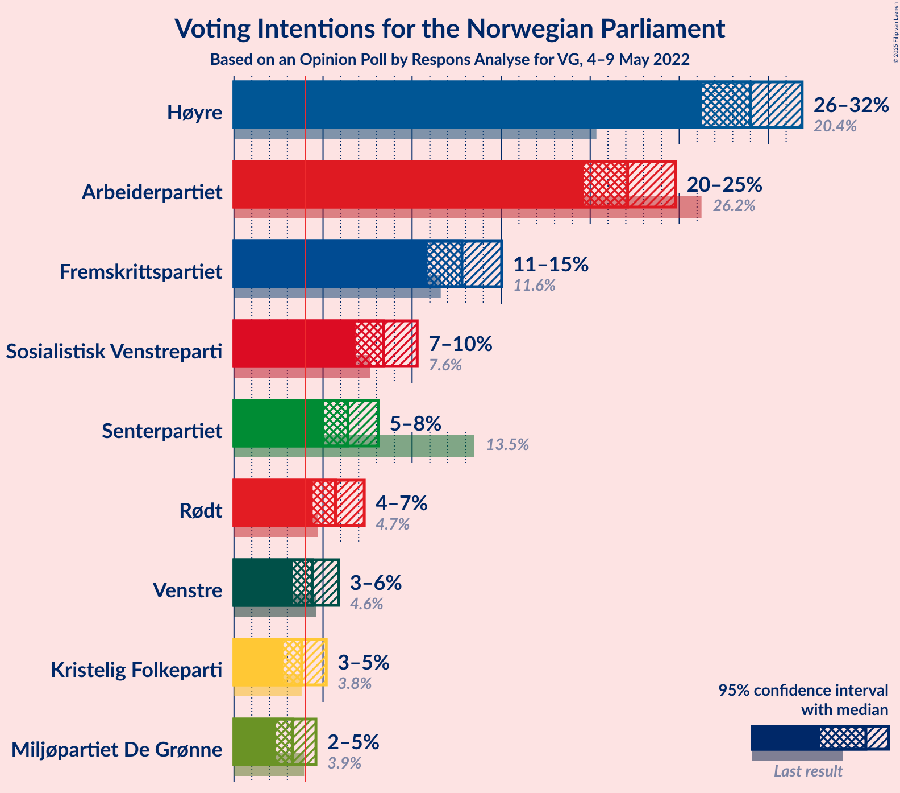

### Confidence Intervals

| Party | Last Result | Poll Result | 80% Confidence Interval | 90% Confidence Interval | 95% Confidence Interval | 99% Confidence Interval |
|:-----:|:-----------:|:-----------:|:-----------------------:|:-----------------------:|:-----------------------:|:-----------------------:|
| Høyre | 20.4% | 29.0% | 27.2–30.9% |26.7–31.4% |26.3–31.9% |25.4–32.8% |
| Arbeiderpartiet | 26.2% | 22.1% | 20.5–23.9% |20.0–24.4% |19.6–24.8% |18.9–25.6% |
| Fremskrittspartiet | 11.6% | 12.8% | 11.5–14.3% |11.2–14.7% |10.9–15.0% |10.3–15.7% |
| Sosialistisk Venstreparti | 7.6% | 8.4% | 7.4–9.6% |7.1–10.0% |6.8–10.3% |6.4–10.9% |
| Senterpartiet | 13.5% | 6.4% | 5.5–7.5% |5.3–7.8% |5.0–8.1% |4.6–8.7% |
| Rødt | 4.7% | 5.7% | 4.9–6.8% |4.6–7.1% |4.4–7.3% |4.1–7.9% |
| Venstre | 4.6% | 4.4% | 3.7–5.3% |3.5–5.6% |3.3–5.9% |3.0–6.4% |
| Kristelig Folkeparti | 3.8% | 3.8% | 3.1–4.7% |2.9–5.0% |2.8–5.2% |2.5–5.6% |
| Miljøpartiet De Grønne | 3.9% | 3.3% | 2.7–4.1% |2.5–4.4% |2.4–4.6% |2.1–5.0% |

*Note:* The poll result column reflects the actual value used in the calculations. Published results may vary slightly, and in addition be rounded to fewer digits.

## Seats

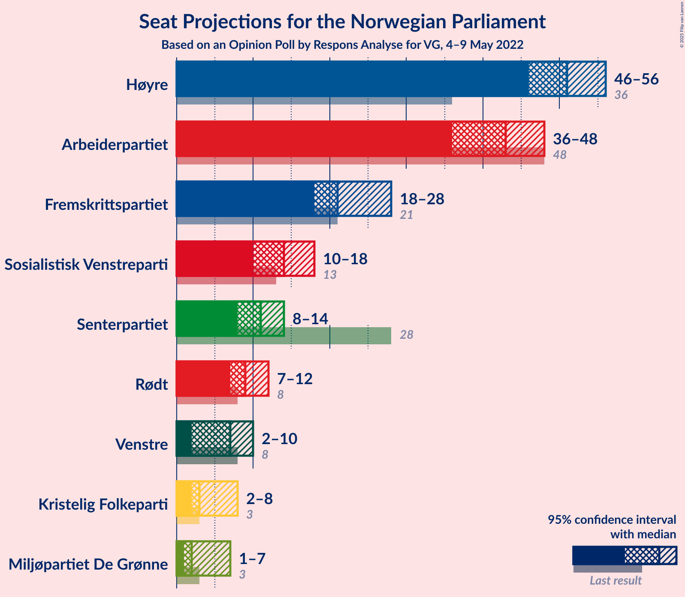

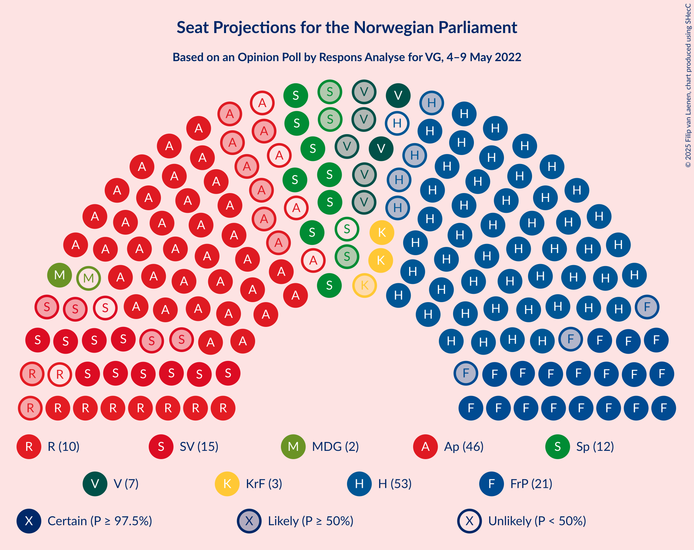

### Confidence Intervals

| Party | Last Result | Median | 80% Confidence Interval | 90% Confidence Interval | 95% Confidence Interval | 99% Confidence Interval |
|:-----:|:-----------:|:------:|:-----------------------:|:-----------------------:|:-----------------------:|:-----------------------:|
| <a href="#høyre">Høyre</a> | 36 | 51 | 48–54 |47–56 |46–56 |45–59 |
| <a href="#arbeiderpartiet">Arbeiderpartiet</a> | 48 | 43 | 39–46 |38–47 |36–48 |35–49 |
| <a href="#fremskrittspartiet">Fremskrittspartiet</a> | 21 | 21 | 19–25 |18–26 |18–28 |17–29 |
| <a href="#sosialistisk-venstreparti">Sosialistisk Venstreparti</a> | 13 | 14 | 11–17 |11–17 |10–18 |9–19 |
| <a href="#senterpartiet">Senterpartiet</a> | 28 | 11 | 8–13 |8–14 |8–14 |7–15 |
| <a href="#rødt">Rødt</a> | 8 | 9 | 8–11 |7–12 |7–12 |6–13 |
| <a href="#venstre">Venstre</a> | 8 | 7 | 3–9 |2–10 |2–10 |2–11 |
| <a href="#kristelig-folkeparti">Kristelig Folkeparti</a> | 3 | 3 | 2–8 |2–8 |2–8 |1–9 |
| <a href="#miljøpartiet-de-grønne">Miljøpartiet De Grønne</a> | 3 | 2 | 1–7 |1–7 |1–7 |1–8 |

### Høyre

*For a full overview of the results for this party, see the [Høyre](party-høyre.html) page.*

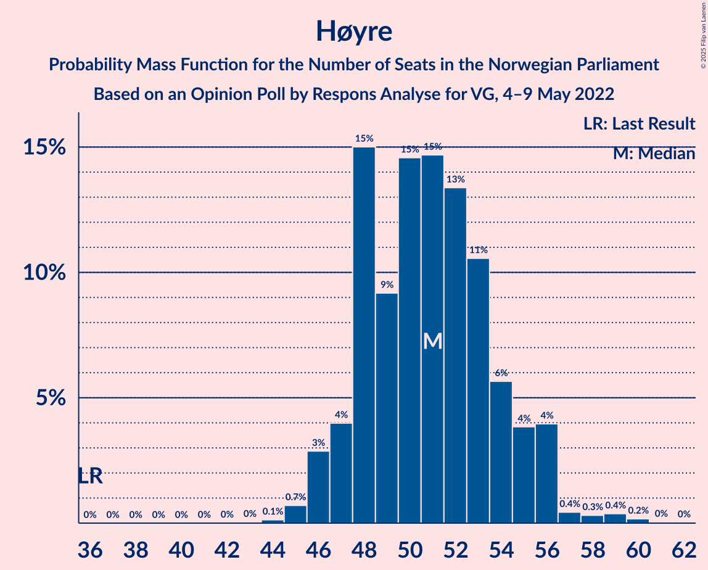

| Number of Seats | Probability | Accumulated | Special Marks |
|:---------------:|:-----------:|:-----------:|:-------------:|
| 36 | 0% | 100% | Last Result |
| 37 | 0% | 100% |  |
| 38 | 0% | 100% |  |
| 39 | 0% | 100% |  |
| 40 | 0% | 100% |  |
| 41 | 0% | 100% |  |
| 42 | 0% | 100% |  |
| 43 | 0% | 100% |  |
| 44 | 0.1% | 99.9% |  |
| 45 | 0.7% | 99.8% |  |
| 46 | 3% | 99.1% |  |
| 47 | 4% | 96% |  |
| 48 | 15% | 92% |  |
| 49 | 9% | 77% |  |
| 50 | 15% | 68% |  |
| 51 | 15% | 53% | Median |
| 52 | 13% | 39% |  |
| 53 | 11% | 25% |  |
| 54 | 6% | 15% |  |
| 55 | 4% | 9% |  |
| 56 | 4% | 5% |  |
| 57 | 0.4% | 1.4% |  |
| 58 | 0.3% | 1.0% |  |
| 59 | 0.4% | 0.6% |  |
| 60 | 0.2% | 0.3% |  |
| 61 | 0% | 0.1% |  |
| 62 | 0% | 0% |  |

### Arbeiderpartiet

*For a full overview of the results for this party, see the [Arbeiderpartiet](party-arbeiderpartiet.html) page.*

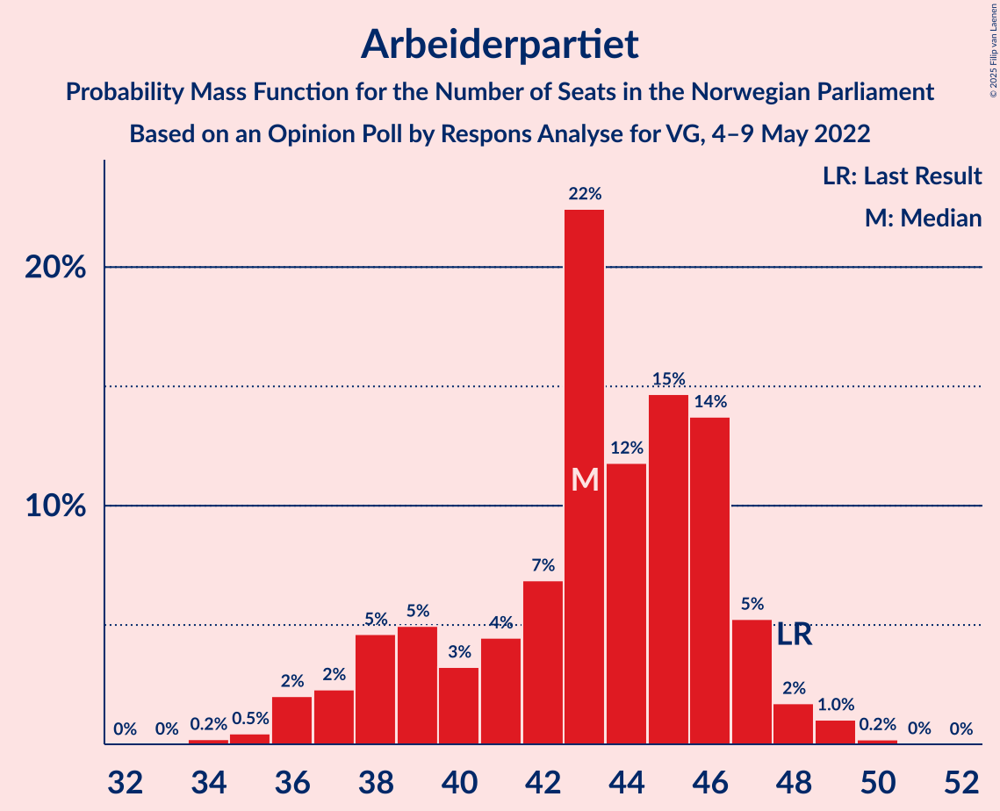

| Number of Seats | Probability | Accumulated | Special Marks |
|:---------------:|:-----------:|:-----------:|:-------------:|
| 34 | 0.2% | 100% |  |
| 35 | 0.5% | 99.8% |  |
| 36 | 2% | 99.3% |  |
| 37 | 2% | 97% |  |
| 38 | 5% | 95% |  |
| 39 | 5% | 90% |  |
| 40 | 3% | 85% |  |
| 41 | 4% | 82% |  |
| 42 | 7% | 78% |  |
| 43 | 22% | 71% | Median |
| 44 | 12% | 48% |  |
| 45 | 15% | 37% |  |
| 46 | 14% | 22% |  |
| 47 | 5% | 8% |  |
| 48 | 2% | 3% | Last Result |
| 49 | 1.0% | 1.3% |  |
| 50 | 0.2% | 0.2% |  |
| 51 | 0% | 0% |  |

### Fremskrittspartiet

*For a full overview of the results for this party, see the [Fremskrittspartiet](party-fremskrittspartiet.html) page.*

| Number of Seats | Probability | Accumulated | Special Marks |
|:---------------:|:-----------:|:-----------:|:-------------:|
| 17 | 0.8% | 100% |  |
| 18 | 6% | 99.1% |  |
| 19 | 9% | 93% |  |
| 20 | 16% | 84% |  |
| 21 | 23% | 68% | Last Result, Median |
| 22 | 14% | 46% |  |
| 23 | 12% | 32% |  |
| 24 | 7% | 20% |  |
| 25 | 3% | 13% |  |
| 26 | 5% | 10% |  |
| 27 | 2% | 5% |  |
| 28 | 1.3% | 3% |  |
| 29 | 1.1% | 1.5% |  |
| 30 | 0.3% | 0.4% |  |
| 31 | 0.1% | 0.1% |  |
| 32 | 0% | 0% |  |

### Sosialistisk Venstreparti

*For a full overview of the results for this party, see the [Sosialistisk Venstreparti](party-sosialistiskvenstreparti.html) page.*

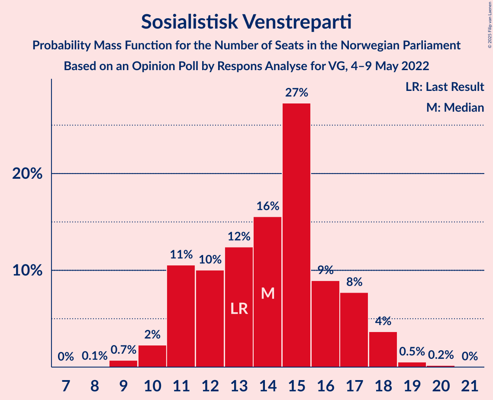

| Number of Seats | Probability | Accumulated | Special Marks |
|:---------------:|:-----------:|:-----------:|:-------------:|
| 8 | 0.1% | 100% |  |
| 9 | 0.7% | 99.9% |  |
| 10 | 2% | 99.2% |  |
| 11 | 11% | 97% |  |
| 12 | 10% | 86% |  |
| 13 | 12% | 76% | Last Result |
| 14 | 16% | 64% | Median |
| 15 | 27% | 48% |  |
| 16 | 9% | 21% |  |
| 17 | 8% | 12% |  |
| 18 | 4% | 4% |  |
| 19 | 0.5% | 0.8% |  |
| 20 | 0.2% | 0.2% |  |
| 21 | 0% | 0% |  |

### Senterpartiet

*For a full overview of the results for this party, see the [Senterpartiet](party-senterpartiet.html) page.*

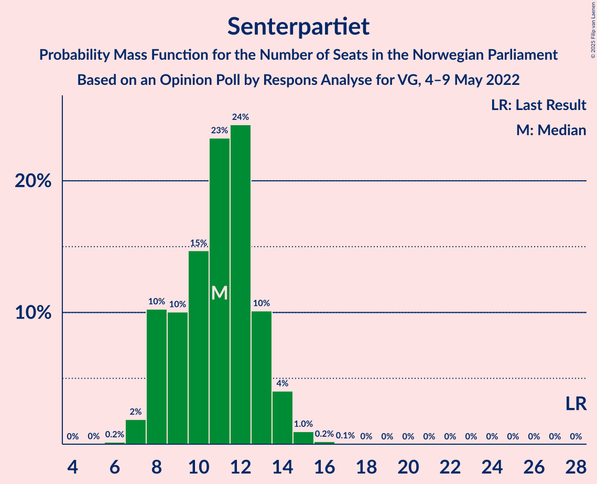

| Number of Seats | Probability | Accumulated | Special Marks |
|:---------------:|:-----------:|:-----------:|:-------------:|
| 6 | 0.2% | 100% |  |
| 7 | 2% | 99.8% |  |
| 8 | 10% | 98% |  |
| 9 | 10% | 88% |  |
| 10 | 15% | 78% |  |
| 11 | 23% | 63% | Median |
| 12 | 24% | 40% |  |
| 13 | 10% | 15% |  |
| 14 | 4% | 5% |  |
| 15 | 1.0% | 1.3% |  |
| 16 | 0.2% | 0.3% |  |
| 17 | 0.1% | 0.1% |  |
| 18 | 0% | 0% |  |
| 19 | 0% | 0% |  |
| 20 | 0% | 0% |  |
| 21 | 0% | 0% |  |
| 22 | 0% | 0% |  |
| 23 | 0% | 0% |  |
| 24 | 0% | 0% |  |
| 25 | 0% | 0% |  |
| 26 | 0% | 0% |  |
| 27 | 0% | 0% |  |
| 28 | 0% | 0% | Last Result |

### Rødt

*For a full overview of the results for this party, see the [Rødt](party-rødt.html) page.*

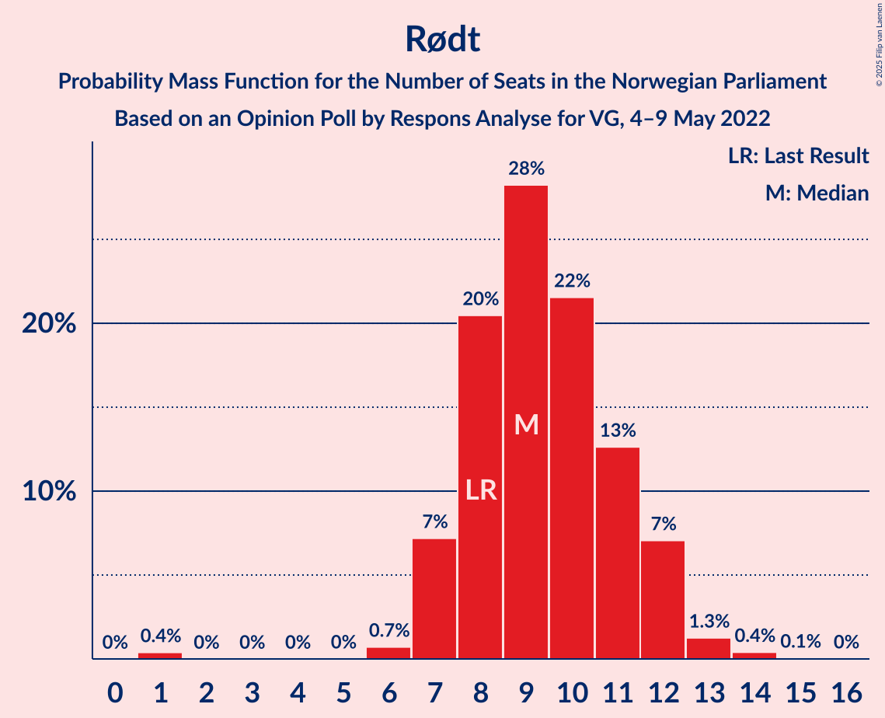

| Number of Seats | Probability | Accumulated | Special Marks |
|:---------------:|:-----------:|:-----------:|:-------------:|
| 1 | 0.4% | 100% |  |
| 2 | 0% | 99.6% |  |
| 3 | 0% | 99.6% |  |
| 4 | 0% | 99.6% |  |
| 5 | 0% | 99.6% |  |
| 6 | 0.7% | 99.6% |  |
| 7 | 7% | 98.9% |  |
| 8 | 20% | 92% | Last Result |
| 9 | 28% | 71% | Median |
| 10 | 22% | 43% |  |
| 11 | 13% | 21% |  |
| 12 | 7% | 9% |  |
| 13 | 1.3% | 2% |  |
| 14 | 0.4% | 0.5% |  |
| 15 | 0.1% | 0.1% |  |
| 16 | 0% | 0% |  |

### Venstre

*For a full overview of the results for this party, see the [Venstre](party-venstre.html) page.*

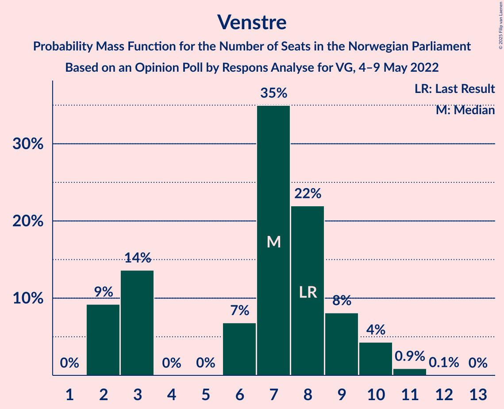

| Number of Seats | Probability | Accumulated | Special Marks |
|:---------------:|:-----------:|:-----------:|:-------------:|
| 2 | 9% | 100% |  |
| 3 | 14% | 91% |  |
| 4 | 0% | 77% |  |
| 5 | 0% | 77% |  |
| 6 | 7% | 77% |  |
| 7 | 35% | 70% | Median |
| 8 | 22% | 35% | Last Result |
| 9 | 8% | 13% |  |
| 10 | 4% | 5% |  |
| 11 | 0.9% | 1.0% |  |
| 12 | 0.1% | 0.1% |  |
| 13 | 0% | 0% |  |

### Kristelig Folkeparti

*For a full overview of the results for this party, see the [Kristelig Folkeparti](party-kristeligfolkeparti.html) page.*

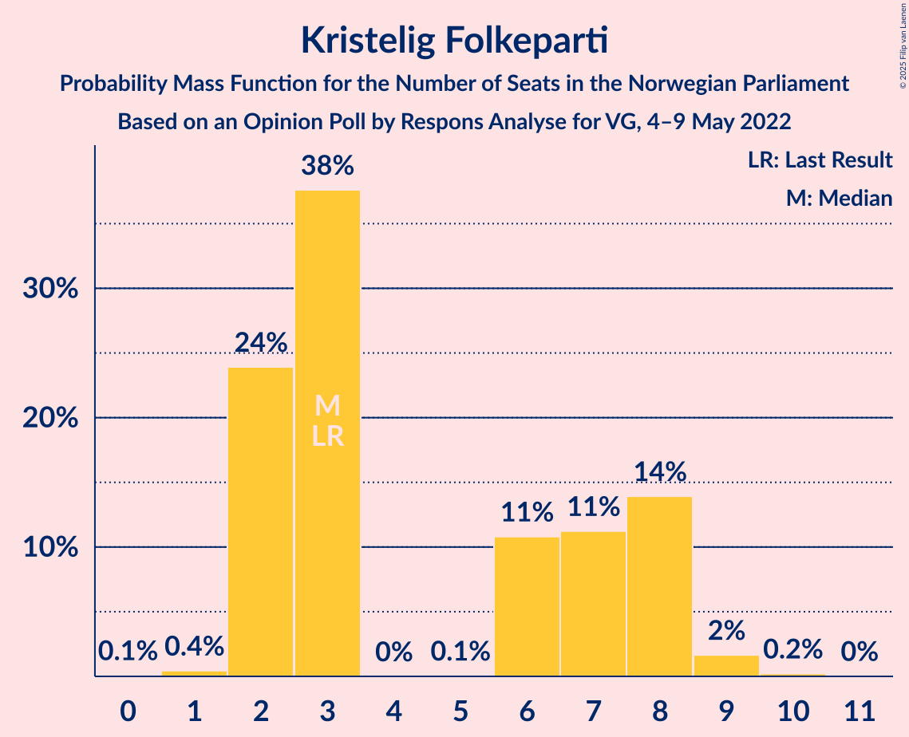

| Number of Seats | Probability | Accumulated | Special Marks |
|:---------------:|:-----------:|:-----------:|:-------------:|
| 0 | 0.1% | 100% |  |
| 1 | 0.4% | 99.9% |  |
| 2 | 24% | 99.5% |  |
| 3 | 38% | 76% | Last Result, Median |
| 4 | 0% | 38% |  |
| 5 | 0.1% | 38% |  |
| 6 | 11% | 38% |  |
| 7 | 11% | 27% |  |
| 8 | 14% | 16% |  |
| 9 | 2% | 2% |  |
| 10 | 0.2% | 0.2% |  |
| 11 | 0% | 0% |  |

### Miljøpartiet De Grønne

*For a full overview of the results for this party, see the [Miljøpartiet De Grønne](party-miljøpartietdegrønne.html) page.*

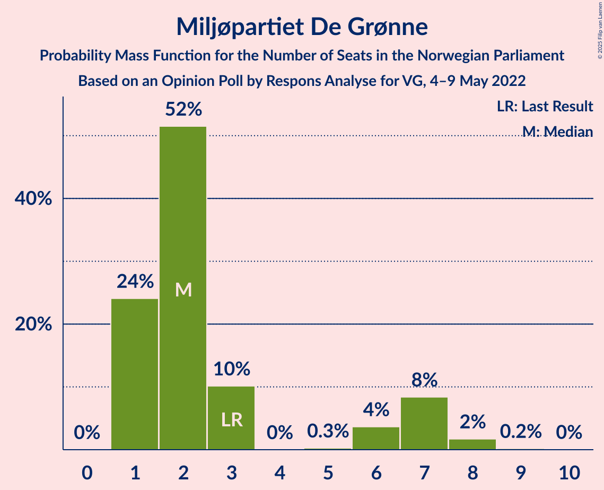

| Number of Seats | Probability | Accumulated | Special Marks |
|:---------------:|:-----------:|:-----------:|:-------------:|
| 1 | 24% | 100% |  |
| 2 | 52% | 76% | Median |
| 3 | 10% | 24% | Last Result |
| 4 | 0% | 14% |  |
| 5 | 0.3% | 14% |  |
| 6 | 4% | 14% |  |
| 7 | 8% | 10% |  |
| 8 | 2% | 2% |  |
| 9 | 0.2% | 0.2% |  |
| 10 | 0% | 0% |  |

## Coalitions

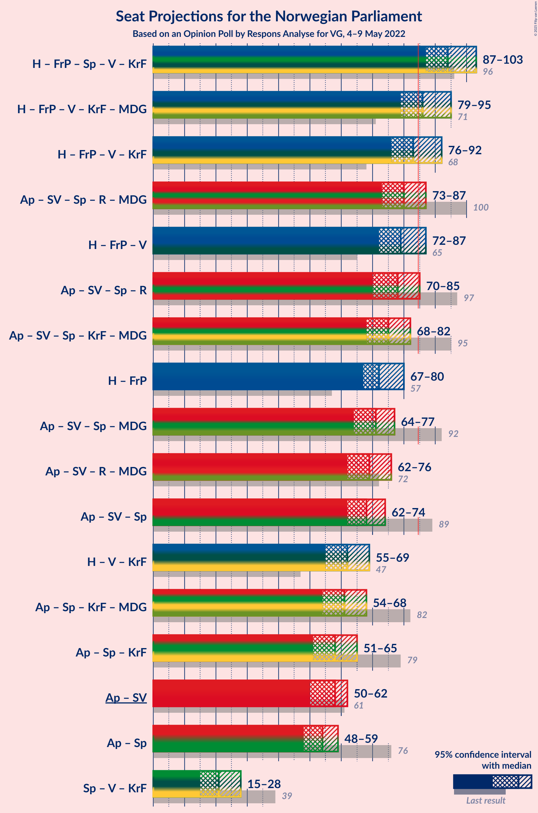

### Confidence Intervals

| Coalition | Last Result | Median | Majority? | 80% Confidence Interval | 90% Confidence Interval | 95% Confidence Interval | 99% Confidence Interval |
|:---------:|:-----------:|:------:|:---------:|:-----------------------:|:-----------------------:|:-----------------------:|:-----------------------:|
| Høyre – Fremskrittspartiet – Senterpartiet – Venstre – Kristelig Folkeparti | 96 | 94 | 99.3% | 90–99 | 88–103 | 87–103 | 84–105 |
| Høyre – Fremskrittspartiet – Venstre – Kristelig Folkeparti – Miljøpartiet De Grønne | 71 | 86 | 64% | 81–91 | 80–93 | 79–95 | 77–97 |
| Høyre – Fremskrittspartiet – Venstre – Kristelig Folkeparti | 68 | 83 | 33% | 79–88 | 78–90 | 76–92 | 75–94 |
| Arbeiderpartiet – Sosialistisk Venstreparti – Senterpartiet – Rødt – Miljøpartiet De Grønne | 100 | 80 | 12% | 76–85 | 74–86 | 73–87 | 71–90 |
| Høyre – Fremskrittspartiet – Venstre | 65 | 79 | 8% | 74–84 | 73–86 | 72–87 | 70–90 |
| Arbeiderpartiet – Sosialistisk Venstreparti – Senterpartiet – Rødt | 97 | 78 | 3% | 73–82 | 72–83 | 70–85 | 68–87 |
| Arbeiderpartiet – Sosialistisk Venstreparti – Senterpartiet – Kristelig Folkeparti – Miljøpartiet De Grønne | 95 | 75 | 0.7% | 71–80 | 69–81 | 68–82 | 66–85 |
| Høyre – Fremskrittspartiet | 57 | 72 | 0.1% | 68–77 | 68–79 | 67–80 | 66–82 |
| Arbeiderpartiet – Sosialistisk Venstreparti – Senterpartiet – Miljøpartiet De Grønne | 92 | 71 | 0% | 67–74 | 65–76 | 64–77 | 62–80 |
| Arbeiderpartiet – Sosialistisk Venstreparti – Rødt – Miljøpartiet De Grønne | 72 | 69 | 0% | 65–74 | 63–75 | 62–76 | 60–78 |
| Arbeiderpartiet – Sosialistisk Venstreparti – Senterpartiet | 89 | 68 | 0% | 64–72 | 63–73 | 62–74 | 59–76 |
| Høyre – Venstre – Kristelig Folkeparti | 47 | 62 | 0% | 58–65 | 56–67 | 55–69 | 53–71 |
| Arbeiderpartiet – Senterpartiet – Kristelig Folkeparti – Miljøpartiet De Grønne | 82 | 61 | 0% | 56–66 | 55–66 | 54–68 | 52–70 |
| Arbeiderpartiet – Senterpartiet – Kristelig Folkeparti | 79 | 58 | 0% | 54–63 | 52–65 | 51–65 | 50–67 |
| Arbeiderpartiet – Sosialistisk Venstreparti | 61 | 58 | 0% | 53–61 | 51–62 | 50–62 | 48–64 |
| Arbeiderpartiet – Senterpartiet | 76 | 54 | 0% | 50–57 | 49–58 | 48–59 | 46–60 |
| Senterpartiet – Venstre – Kristelig Folkeparti | 39 | 21 | 0% | 17–27 | 16–27 | 15–28 | 13–31 |

### Høyre – Fremskrittspartiet – Senterpartiet – Venstre – Kristelig Folkeparti

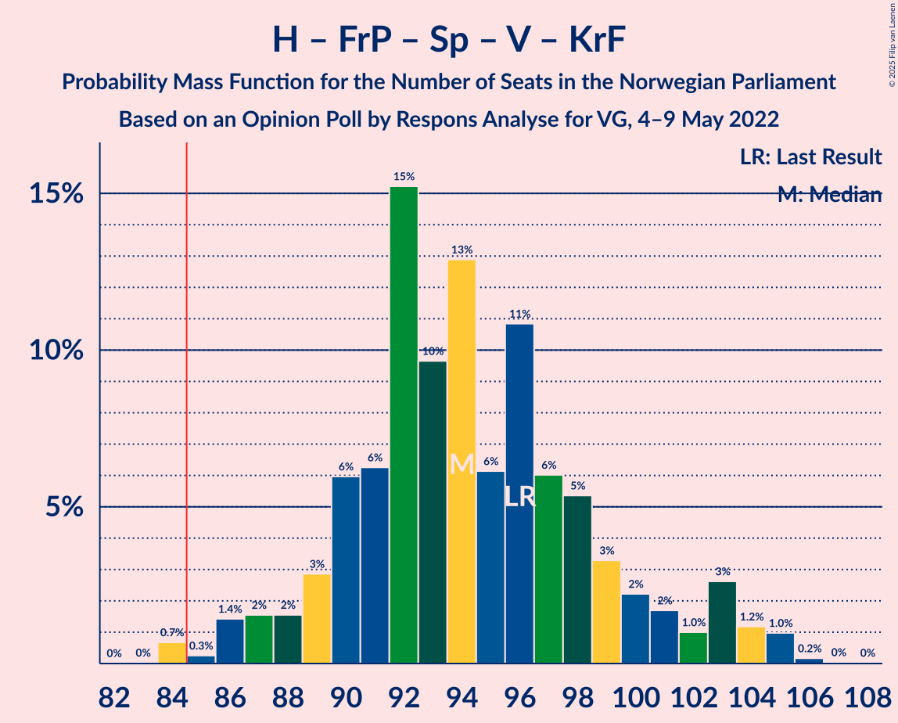

| Number of Seats | Probability | Accumulated | Special Marks |
|:---------------:|:-----------:|:-----------:|:-------------:|
| 83 | 0% | 100% |  |
| 84 | 0.7% | 99.9% |  |
| 85 | 0.3% | 99.3% | Majority |
| 86 | 1.4% | 99.0% |  |
| 87 | 2% | 98% |  |
| 88 | 2% | 96% |  |
| 89 | 3% | 94% |  |
| 90 | 6% | 92% |  |
| 91 | 6% | 86% |  |
| 92 | 15% | 79% |  |
| 93 | 10% | 64% | Median |
| 94 | 13% | 55% |  |
| 95 | 6% | 42% |  |
| 96 | 11% | 35% | Last Result |
| 97 | 6% | 25% |  |
| 98 | 5% | 19% |  |
| 99 | 3% | 13% |  |
| 100 | 2% | 10% |  |
| 101 | 2% | 8% |  |
| 102 | 1.0% | 6% |  |
| 103 | 3% | 5% |  |
| 104 | 1.2% | 2% |  |
| 105 | 1.0% | 1.2% |  |
| 106 | 0.2% | 0.3% |  |
| 107 | 0% | 0.1% |  |
| 108 | 0% | 0% |  |

### Høyre – Fremskrittspartiet – Venstre – Kristelig Folkeparti – Miljøpartiet De Grønne

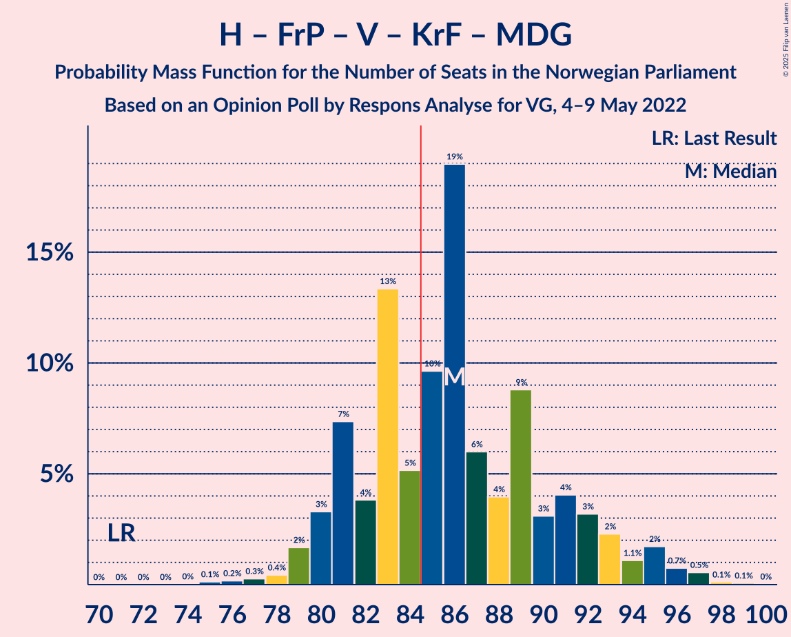

| Number of Seats | Probability | Accumulated | Special Marks |
|:---------------:|:-----------:|:-----------:|:-------------:|
| 71 | 0% | 100% | Last Result |
| 72 | 0% | 100% |  |
| 73 | 0% | 100% |  |
| 74 | 0% | 100% |  |
| 75 | 0.1% | 100% |  |
| 76 | 0.2% | 99.8% |  |
| 77 | 0.3% | 99.7% |  |
| 78 | 0.4% | 99.4% |  |
| 79 | 2% | 99.0% |  |
| 80 | 3% | 97% |  |
| 81 | 7% | 94% |  |
| 82 | 4% | 87% |  |
| 83 | 13% | 83% |  |
| 84 | 5% | 69% | Median |
| 85 | 10% | 64% | Majority |
| 86 | 19% | 55% |  |
| 87 | 6% | 36% |  |
| 88 | 4% | 30% |  |
| 89 | 9% | 26% |  |
| 90 | 3% | 17% |  |
| 91 | 4% | 14% |  |
| 92 | 3% | 10% |  |
| 93 | 2% | 7% |  |
| 94 | 1.1% | 4% |  |
| 95 | 2% | 3% |  |
| 96 | 0.7% | 2% |  |
| 97 | 0.5% | 0.8% |  |
| 98 | 0.1% | 0.2% |  |
| 99 | 0.1% | 0.1% |  |
| 100 | 0% | 0% |  |

### Høyre – Fremskrittspartiet – Venstre – Kristelig Folkeparti

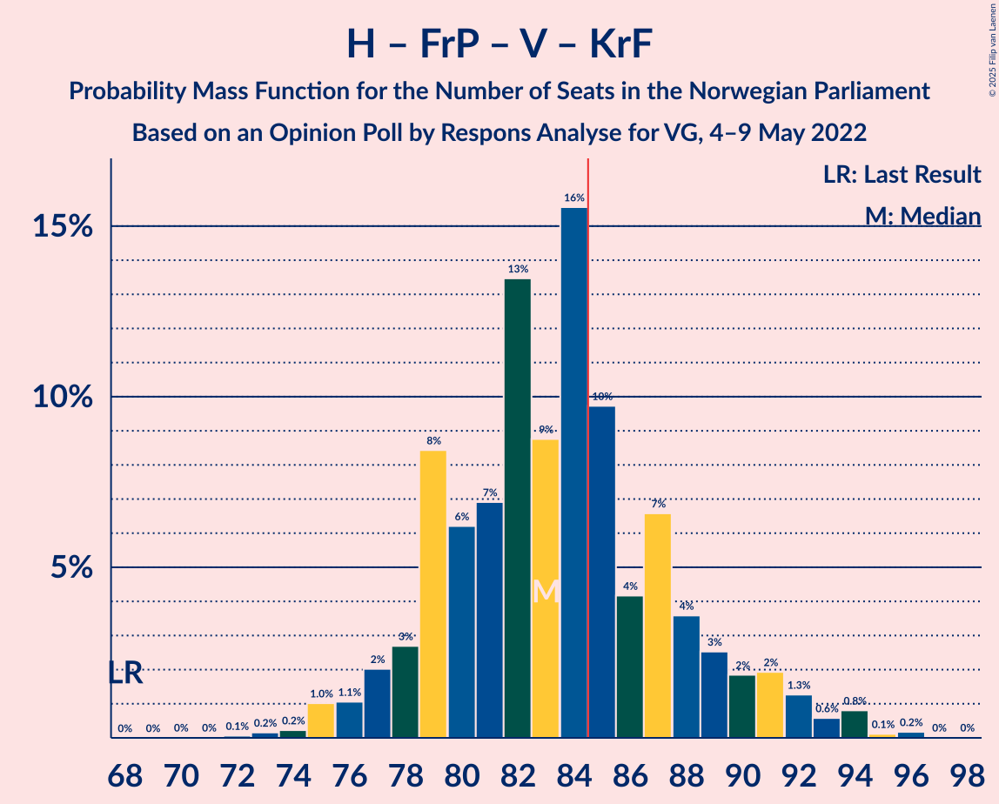

| Number of Seats | Probability | Accumulated | Special Marks |
|:---------------:|:-----------:|:-----------:|:-------------:|
| 68 | 0% | 100% | Last Result |
| 69 | 0% | 100% |  |
| 70 | 0% | 100% |  |
| 71 | 0% | 100% |  |
| 72 | 0.1% | 100% |  |
| 73 | 0.2% | 99.9% |  |
| 74 | 0.2% | 99.7% |  |
| 75 | 1.0% | 99.5% |  |
| 76 | 1.1% | 98% |  |
| 77 | 2% | 97% |  |
| 78 | 3% | 95% |  |
| 79 | 8% | 93% |  |
| 80 | 6% | 84% |  |
| 81 | 7% | 78% |  |
| 82 | 13% | 71% | Median |
| 83 | 9% | 58% |  |
| 84 | 16% | 49% |  |
| 85 | 10% | 33% | Majority |
| 86 | 4% | 24% |  |
| 87 | 7% | 19% |  |
| 88 | 4% | 13% |  |
| 89 | 3% | 9% |  |
| 90 | 2% | 7% |  |
| 91 | 2% | 5% |  |
| 92 | 1.3% | 3% |  |
| 93 | 0.6% | 2% |  |
| 94 | 0.8% | 1.1% |  |
| 95 | 0.1% | 0.3% |  |
| 96 | 0.2% | 0.2% |  |
| 97 | 0% | 0% |  |

### Arbeiderpartiet – Sosialistisk Venstreparti – Senterpartiet – Rødt – Miljøpartiet De Grønne

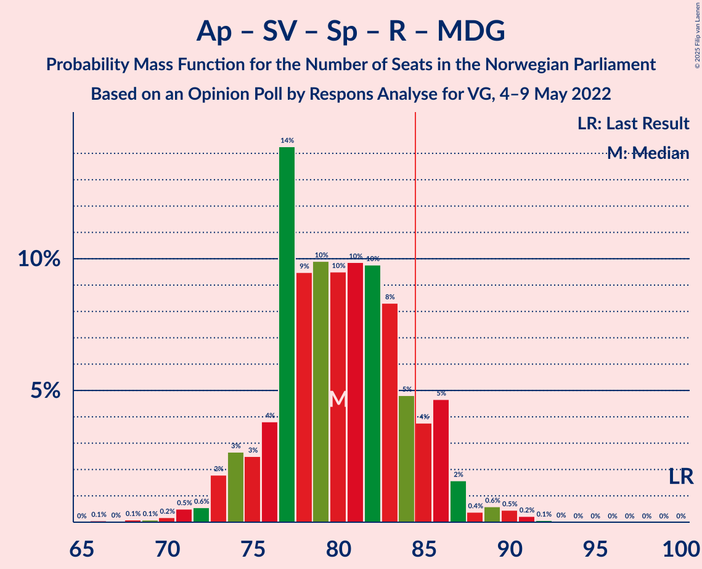

| Number of Seats | Probability | Accumulated | Special Marks |
|:---------------:|:-----------:|:-----------:|:-------------:|
| 66 | 0.1% | 100% |  |
| 67 | 0% | 99.9% |  |
| 68 | 0.1% | 99.9% |  |
| 69 | 0.1% | 99.8% |  |
| 70 | 0.2% | 99.7% |  |
| 71 | 0.5% | 99.5% |  |
| 72 | 0.6% | 99.0% |  |
| 73 | 2% | 98% |  |
| 74 | 3% | 97% |  |
| 75 | 3% | 94% |  |
| 76 | 4% | 92% |  |
| 77 | 14% | 88% |  |
| 78 | 9% | 73% |  |
| 79 | 10% | 64% | Median |
| 80 | 10% | 54% |  |
| 81 | 10% | 45% |  |
| 82 | 10% | 35% |  |
| 83 | 8% | 25% |  |
| 84 | 5% | 17% |  |
| 85 | 4% | 12% | Majority |
| 86 | 5% | 8% |  |
| 87 | 2% | 3% |  |
| 88 | 0.4% | 2% |  |
| 89 | 0.6% | 1.4% |  |
| 90 | 0.5% | 0.8% |  |
| 91 | 0.2% | 0.3% |  |
| 92 | 0.1% | 0.1% |  |
| 93 | 0% | 0% |  |
| 94 | 0% | 0% |  |
| 95 | 0% | 0% |  |
| 96 | 0% | 0% |  |
| 97 | 0% | 0% |  |
| 98 | 0% | 0% |  |
| 99 | 0% | 0% |  |
| 100 | 0% | 0% | Last Result |

### Høyre – Fremskrittspartiet – Venstre

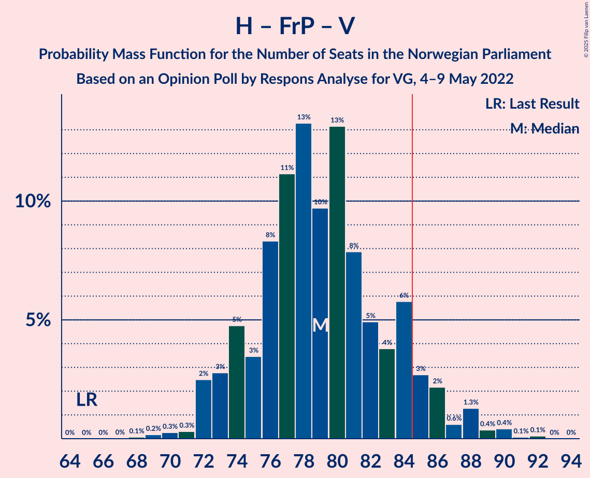

| Number of Seats | Probability | Accumulated | Special Marks |
|:---------------:|:-----------:|:-----------:|:-------------:|
| 65 | 0% | 100% | Last Result |
| 66 | 0% | 100% |  |
| 67 | 0% | 100% |  |
| 68 | 0.1% | 100% |  |
| 69 | 0.2% | 99.9% |  |
| 70 | 0.3% | 99.7% |  |
| 71 | 0.3% | 99.5% |  |
| 72 | 2% | 99.2% |  |
| 73 | 3% | 97% |  |
| 74 | 5% | 94% |  |
| 75 | 3% | 89% |  |
| 76 | 8% | 86% |  |
| 77 | 11% | 77% |  |
| 78 | 13% | 66% |  |
| 79 | 10% | 53% | Median |
| 80 | 13% | 43% |  |
| 81 | 8% | 30% |  |
| 82 | 5% | 22% |  |
| 83 | 4% | 17% |  |
| 84 | 6% | 14% |  |
| 85 | 3% | 8% | Majority |
| 86 | 2% | 5% |  |
| 87 | 0.6% | 3% |  |
| 88 | 1.3% | 2% |  |
| 89 | 0.4% | 1.0% |  |
| 90 | 0.4% | 0.6% |  |
| 91 | 0.1% | 0.2% |  |
| 92 | 0.1% | 0.1% |  |
| 93 | 0% | 0% |  |

### Arbeiderpartiet – Sosialistisk Venstreparti – Senterpartiet – Rødt

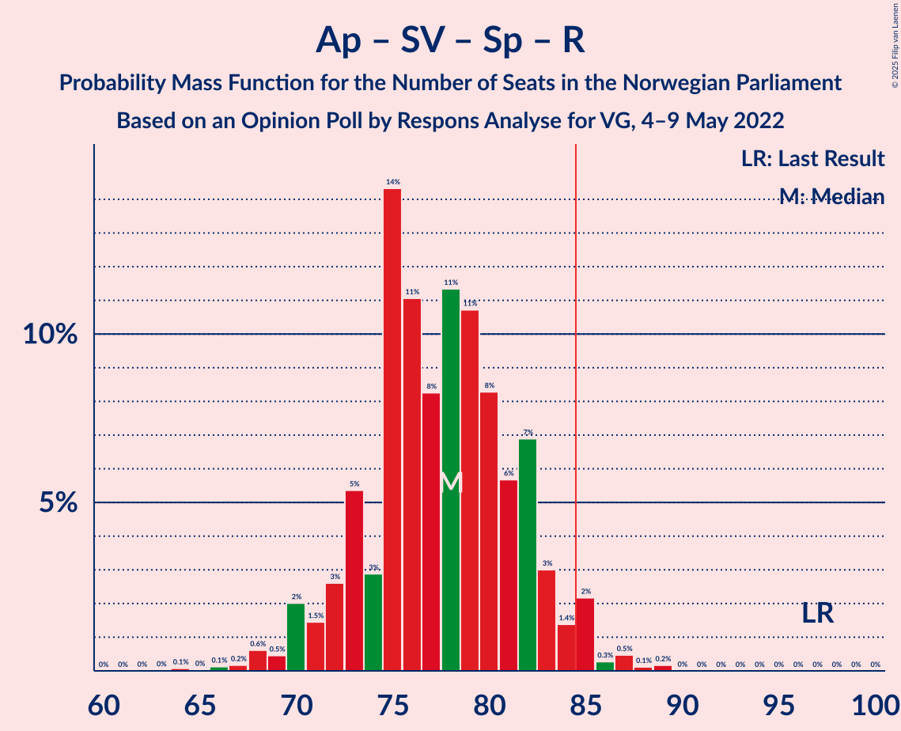

| Number of Seats | Probability | Accumulated | Special Marks |
|:---------------:|:-----------:|:-----------:|:-------------:|
| 64 | 0.1% | 100% |  |
| 65 | 0% | 99.9% |  |
| 66 | 0.1% | 99.9% |  |
| 67 | 0.2% | 99.7% |  |
| 68 | 0.6% | 99.6% |  |
| 69 | 0.5% | 99.0% |  |
| 70 | 2% | 98% |  |
| 71 | 1.5% | 96% |  |
| 72 | 3% | 95% |  |
| 73 | 5% | 92% |  |
| 74 | 3% | 87% |  |
| 75 | 14% | 84% |  |
| 76 | 11% | 70% |  |
| 77 | 8% | 59% | Median |
| 78 | 11% | 51% |  |
| 79 | 11% | 39% |  |
| 80 | 8% | 28% |  |
| 81 | 6% | 20% |  |
| 82 | 7% | 14% |  |
| 83 | 3% | 8% |  |
| 84 | 1.4% | 5% |  |
| 85 | 2% | 3% | Majority |
| 86 | 0.3% | 1.0% |  |
| 87 | 0.5% | 0.8% |  |
| 88 | 0.1% | 0.3% |  |
| 89 | 0.2% | 0.2% |  |
| 90 | 0% | 0% |  |
| 91 | 0% | 0% |  |
| 92 | 0% | 0% |  |
| 93 | 0% | 0% |  |
| 94 | 0% | 0% |  |
| 95 | 0% | 0% |  |
| 96 | 0% | 0% |  |
| 97 | 0% | 0% | Last Result |

### Arbeiderpartiet – Sosialistisk Venstreparti – Senterpartiet – Kristelig Folkeparti – Miljøpartiet De Grønne

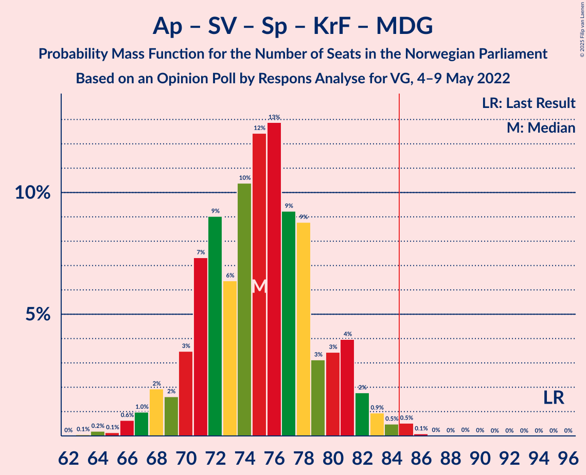

| Number of Seats | Probability | Accumulated | Special Marks |
|:---------------:|:-----------:|:-----------:|:-------------:|
| 63 | 0.1% | 100% |  |
| 64 | 0.2% | 99.9% |  |
| 65 | 0.1% | 99.7% |  |
| 66 | 0.6% | 99.6% |  |
| 67 | 1.0% | 98.9% |  |
| 68 | 2% | 98% |  |
| 69 | 2% | 96% |  |
| 70 | 3% | 94% |  |
| 71 | 7% | 91% |  |
| 72 | 9% | 84% |  |
| 73 | 6% | 75% | Median |
| 74 | 10% | 68% |  |
| 75 | 12% | 58% |  |
| 76 | 13% | 45% |  |
| 77 | 9% | 32% |  |
| 78 | 9% | 23% |  |
| 79 | 3% | 14% |  |
| 80 | 3% | 11% |  |
| 81 | 4% | 8% |  |
| 82 | 2% | 4% |  |
| 83 | 0.9% | 2% |  |
| 84 | 0.5% | 1.2% |  |
| 85 | 0.5% | 0.7% | Majority |
| 86 | 0.1% | 0.2% |  |
| 87 | 0% | 0.1% |  |
| 88 | 0% | 0.1% |  |
| 89 | 0% | 0% |  |
| 90 | 0% | 0% |  |
| 91 | 0% | 0% |  |
| 92 | 0% | 0% |  |
| 93 | 0% | 0% |  |
| 94 | 0% | 0% |  |
| 95 | 0% | 0% | Last Result |

### Høyre – Fremskrittspartiet

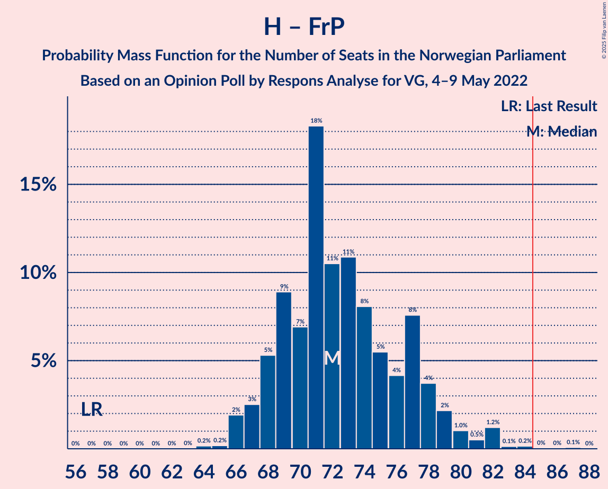

| Number of Seats | Probability | Accumulated | Special Marks |
|:---------------:|:-----------:|:-----------:|:-------------:|
| 57 | 0% | 100% | Last Result |
| 58 | 0% | 100% |  |
| 59 | 0% | 100% |  |
| 60 | 0% | 100% |  |
| 61 | 0% | 100% |  |
| 62 | 0% | 100% |  |
| 63 | 0% | 100% |  |
| 64 | 0.2% | 100% |  |
| 65 | 0.2% | 99.8% |  |
| 66 | 2% | 99.6% |  |
| 67 | 3% | 98% |  |
| 68 | 5% | 95% |  |
| 69 | 9% | 90% |  |
| 70 | 7% | 81% |  |
| 71 | 18% | 74% |  |
| 72 | 11% | 56% | Median |
| 73 | 11% | 45% |  |
| 74 | 8% | 34% |  |
| 75 | 5% | 26% |  |
| 76 | 4% | 21% |  |
| 77 | 8% | 17% |  |
| 78 | 4% | 9% |  |
| 79 | 2% | 5% |  |
| 80 | 1.0% | 3% |  |
| 81 | 0.5% | 2% |  |
| 82 | 1.2% | 2% |  |
| 83 | 0.1% | 0.4% |  |
| 84 | 0.2% | 0.3% |  |
| 85 | 0% | 0.1% | Majority |
| 86 | 0% | 0.1% |  |
| 87 | 0.1% | 0.1% |  |
| 88 | 0% | 0% |  |

### Arbeiderpartiet – Sosialistisk Venstreparti – Senterpartiet – Miljøpartiet De Grønne

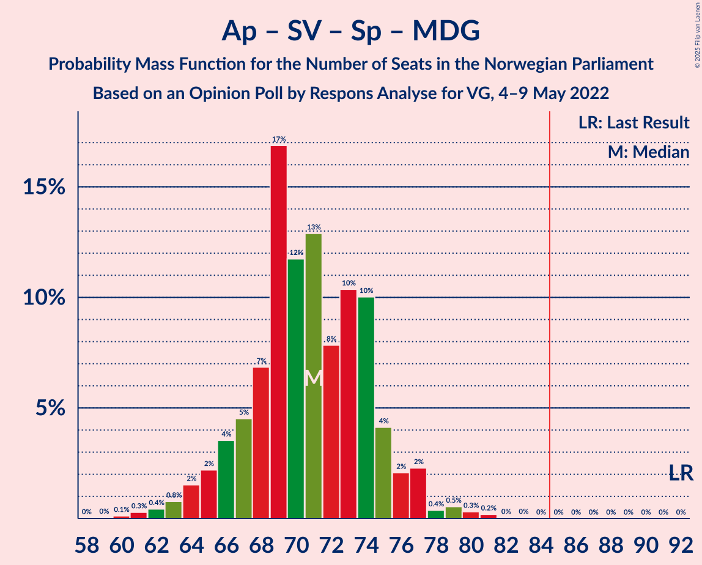

| Number of Seats | Probability | Accumulated | Special Marks |
|:---------------:|:-----------:|:-----------:|:-------------:|
| 59 | 0% | 100% |  |
| 60 | 0.1% | 99.9% |  |
| 61 | 0.3% | 99.8% |  |
| 62 | 0.4% | 99.5% |  |
| 63 | 0.8% | 99.1% |  |
| 64 | 2% | 98% |  |
| 65 | 2% | 97% |  |
| 66 | 4% | 95% |  |
| 67 | 5% | 91% |  |
| 68 | 7% | 87% |  |
| 69 | 17% | 80% |  |
| 70 | 12% | 63% | Median |
| 71 | 13% | 51% |  |
| 72 | 8% | 38% |  |
| 73 | 10% | 30% |  |
| 74 | 10% | 20% |  |
| 75 | 4% | 10% |  |
| 76 | 2% | 6% |  |
| 77 | 2% | 4% |  |
| 78 | 0.4% | 1.5% |  |
| 79 | 0.5% | 1.1% |  |
| 80 | 0.3% | 0.6% |  |
| 81 | 0.2% | 0.3% |  |
| 82 | 0% | 0.1% |  |
| 83 | 0% | 0% |  |
| 84 | 0% | 0% |  |
| 85 | 0% | 0% | Majority |
| 86 | 0% | 0% |  |
| 87 | 0% | 0% |  |
| 88 | 0% | 0% |  |
| 89 | 0% | 0% |  |
| 90 | 0% | 0% |  |
| 91 | 0% | 0% |  |
| 92 | 0% | 0% | Last Result |

### Arbeiderpartiet – Sosialistisk Venstreparti – Rødt – Miljøpartiet De Grønne

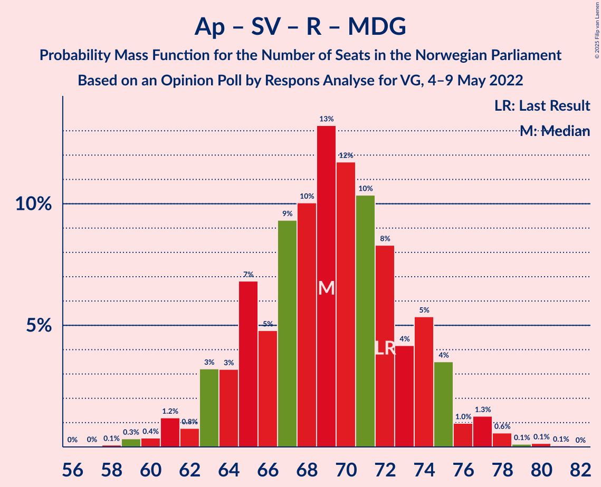

| Number of Seats | Probability | Accumulated | Special Marks |
|:---------------:|:-----------:|:-----------:|:-------------:|
| 57 | 0% | 100% |  |
| 58 | 0.1% | 99.9% |  |
| 59 | 0.3% | 99.8% |  |
| 60 | 0.4% | 99.5% |  |
| 61 | 1.2% | 99.1% |  |
| 62 | 0.8% | 98% |  |
| 63 | 3% | 97% |  |
| 64 | 3% | 94% |  |
| 65 | 7% | 91% |  |
| 66 | 5% | 84% |  |
| 67 | 9% | 79% |  |
| 68 | 10% | 70% | Median |
| 69 | 13% | 60% |  |
| 70 | 12% | 47% |  |
| 71 | 10% | 35% |  |
| 72 | 8% | 24% | Last Result |
| 73 | 4% | 16% |  |
| 74 | 5% | 12% |  |
| 75 | 4% | 7% |  |
| 76 | 1.0% | 3% |  |
| 77 | 1.3% | 2% |  |
| 78 | 0.6% | 0.9% |  |
| 79 | 0.1% | 0.3% |  |
| 80 | 0.1% | 0.2% |  |
| 81 | 0.1% | 0.1% |  |
| 82 | 0% | 0% |  |

### Arbeiderpartiet – Sosialistisk Venstreparti – Senterpartiet

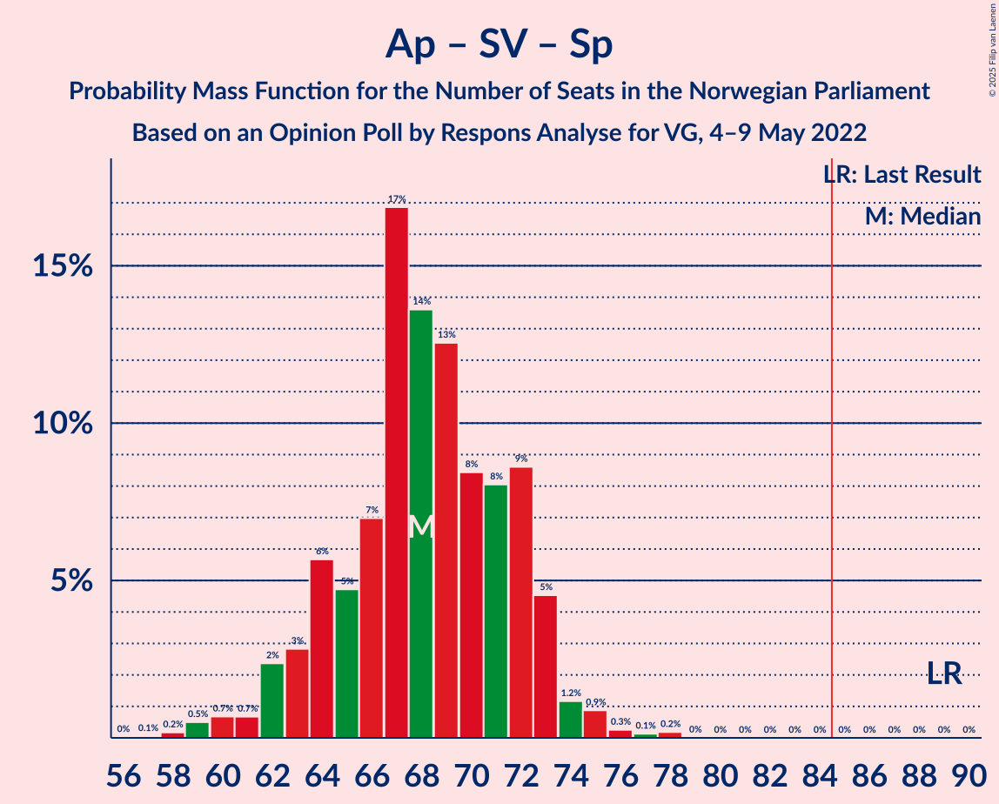

| Number of Seats | Probability | Accumulated | Special Marks |
|:---------------:|:-----------:|:-----------:|:-------------:|
| 57 | 0.1% | 100% |  |
| 58 | 0.2% | 99.9% |  |
| 59 | 0.5% | 99.7% |  |
| 60 | 0.7% | 99.2% |  |
| 61 | 0.7% | 98.5% |  |
| 62 | 2% | 98% |  |
| 63 | 3% | 96% |  |
| 64 | 6% | 93% |  |
| 65 | 5% | 87% |  |
| 66 | 7% | 82% |  |
| 67 | 17% | 75% |  |
| 68 | 14% | 58% | Median |
| 69 | 13% | 45% |  |
| 70 | 8% | 32% |  |
| 71 | 8% | 24% |  |
| 72 | 9% | 16% |  |
| 73 | 5% | 7% |  |
| 74 | 1.2% | 3% |  |
| 75 | 0.9% | 1.5% |  |
| 76 | 0.3% | 0.6% |  |
| 77 | 0.1% | 0.3% |  |
| 78 | 0.2% | 0.2% |  |
| 79 | 0% | 0% |  |
| 80 | 0% | 0% |  |
| 81 | 0% | 0% |  |
| 82 | 0% | 0% |  |
| 83 | 0% | 0% |  |
| 84 | 0% | 0% |  |
| 85 | 0% | 0% | Majority |
| 86 | 0% | 0% |  |
| 87 | 0% | 0% |  |
| 88 | 0% | 0% |  |
| 89 | 0% | 0% | Last Result |

### Høyre – Venstre – Kristelig Folkeparti

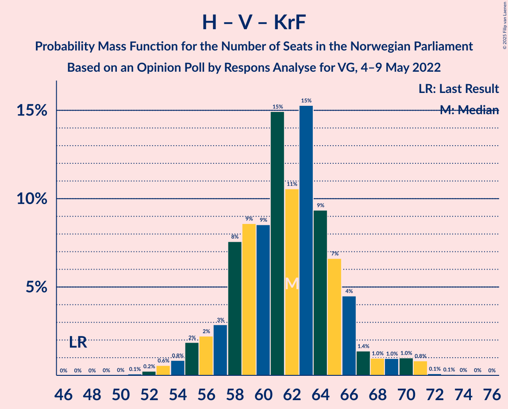

| Number of Seats | Probability | Accumulated | Special Marks |
|:---------------:|:-----------:|:-----------:|:-------------:|
| 47 | 0% | 100% | Last Result |
| 48 | 0% | 100% |  |
| 49 | 0% | 100% |  |
| 50 | 0% | 100% |  |
| 51 | 0.1% | 100% |  |
| 52 | 0.2% | 99.9% |  |
| 53 | 0.6% | 99.6% |  |
| 54 | 0.8% | 99.1% |  |
| 55 | 2% | 98% |  |
| 56 | 2% | 96% |  |
| 57 | 3% | 94% |  |
| 58 | 8% | 91% |  |
| 59 | 9% | 84% |  |
| 60 | 9% | 75% |  |
| 61 | 15% | 67% | Median |
| 62 | 11% | 52% |  |
| 63 | 15% | 41% |  |
| 64 | 9% | 26% |  |
| 65 | 7% | 16% |  |
| 66 | 4% | 10% |  |
| 67 | 1.4% | 5% |  |
| 68 | 1.0% | 4% |  |
| 69 | 1.0% | 3% |  |
| 70 | 1.0% | 2% |  |
| 71 | 0.8% | 1.0% |  |
| 72 | 0.1% | 0.2% |  |
| 73 | 0.1% | 0.1% |  |
| 74 | 0% | 0.1% |  |
| 75 | 0% | 0% |  |

### Arbeiderpartiet – Senterpartiet – Kristelig Folkeparti – Miljøpartiet De Grønne

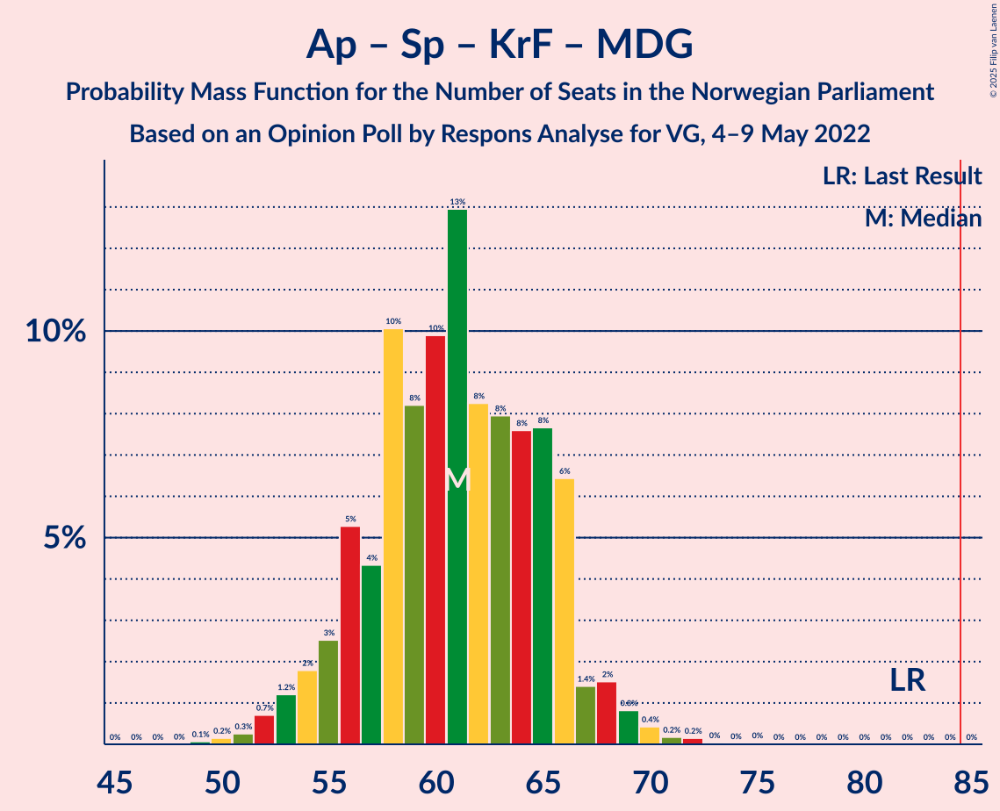

| Number of Seats | Probability | Accumulated | Special Marks |
|:---------------:|:-----------:|:-----------:|:-------------:|
| 49 | 0.1% | 100% |  |
| 50 | 0.2% | 99.9% |  |
| 51 | 0.3% | 99.8% |  |
| 52 | 0.7% | 99.5% |  |
| 53 | 1.2% | 98.8% |  |
| 54 | 2% | 98% |  |
| 55 | 3% | 96% |  |
| 56 | 5% | 93% |  |
| 57 | 4% | 88% |  |
| 58 | 10% | 84% |  |
| 59 | 8% | 74% | Median |
| 60 | 10% | 65% |  |
| 61 | 13% | 55% |  |
| 62 | 8% | 43% |  |
| 63 | 8% | 34% |  |
| 64 | 8% | 26% |  |
| 65 | 8% | 19% |  |
| 66 | 6% | 11% |  |
| 67 | 1.4% | 5% |  |
| 68 | 2% | 3% |  |
| 69 | 0.8% | 2% |  |
| 70 | 0.4% | 0.9% |  |
| 71 | 0.2% | 0.4% |  |
| 72 | 0.2% | 0.3% |  |
| 73 | 0% | 0.1% |  |
| 74 | 0% | 0.1% |  |
| 75 | 0% | 0% |  |
| 76 | 0% | 0% |  |
| 77 | 0% | 0% |  |
| 78 | 0% | 0% |  |
| 79 | 0% | 0% |  |
| 80 | 0% | 0% |  |
| 81 | 0% | 0% |  |
| 82 | 0% | 0% | Last Result |

### Arbeiderpartiet – Senterpartiet – Kristelig Folkeparti

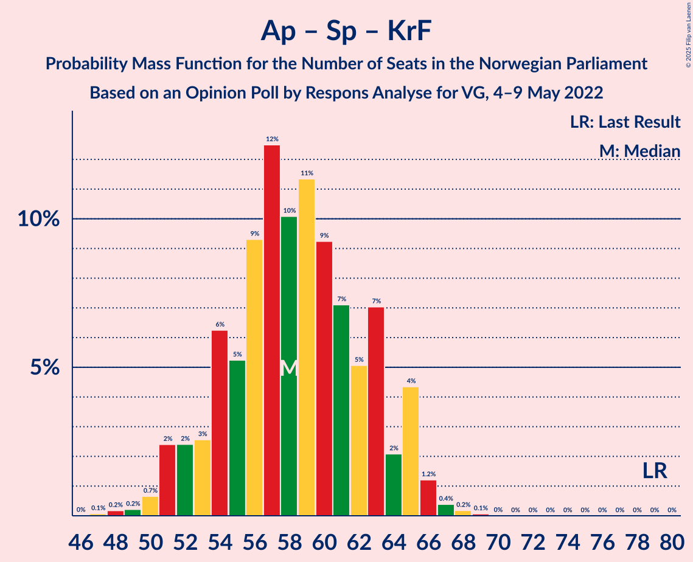

| Number of Seats | Probability | Accumulated | Special Marks |
|:---------------:|:-----------:|:-----------:|:-------------:|
| 47 | 0.1% | 100% |  |
| 48 | 0.2% | 99.9% |  |
| 49 | 0.2% | 99.7% |  |
| 50 | 0.7% | 99.5% |  |
| 51 | 2% | 98.9% |  |
| 52 | 2% | 96% |  |
| 53 | 3% | 94% |  |
| 54 | 6% | 91% |  |
| 55 | 5% | 85% |  |
| 56 | 9% | 80% |  |
| 57 | 12% | 71% | Median |
| 58 | 10% | 58% |  |
| 59 | 11% | 48% |  |
| 60 | 9% | 37% |  |
| 61 | 7% | 28% |  |
| 62 | 5% | 20% |  |
| 63 | 7% | 15% |  |
| 64 | 2% | 8% |  |
| 65 | 4% | 6% |  |
| 66 | 1.2% | 2% |  |
| 67 | 0.4% | 0.6% |  |
| 68 | 0.2% | 0.3% |  |
| 69 | 0.1% | 0.1% |  |
| 70 | 0% | 0% |  |
| 71 | 0% | 0% |  |
| 72 | 0% | 0% |  |
| 73 | 0% | 0% |  |
| 74 | 0% | 0% |  |
| 75 | 0% | 0% |  |
| 76 | 0% | 0% |  |
| 77 | 0% | 0% |  |
| 78 | 0% | 0% |  |
| 79 | 0% | 0% | Last Result |

### Arbeiderpartiet – Sosialistisk Venstreparti

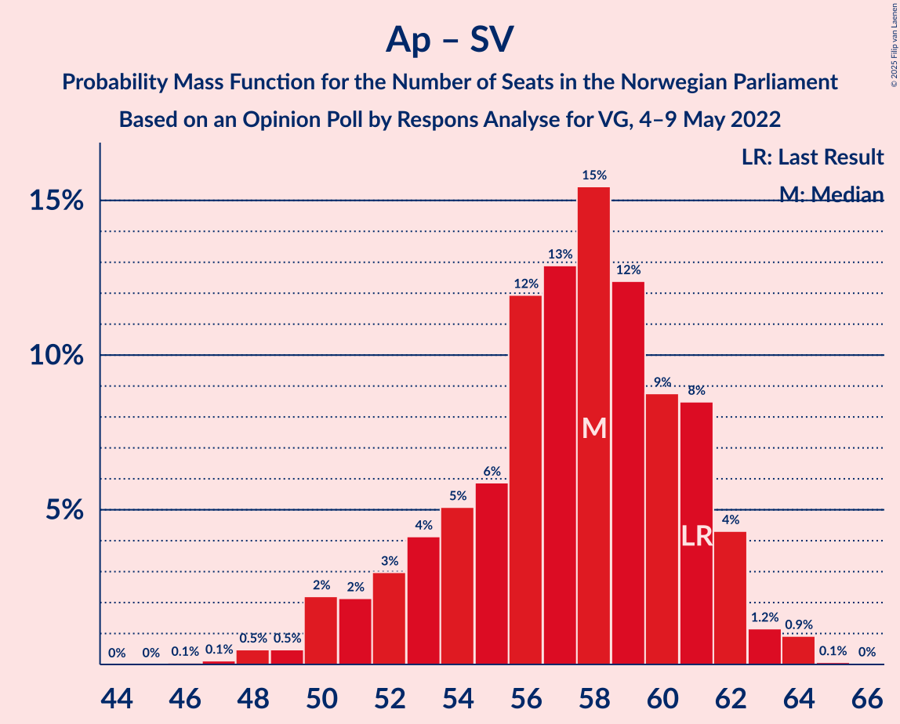

| Number of Seats | Probability | Accumulated | Special Marks |
|:---------------:|:-----------:|:-----------:|:-------------:|
| 46 | 0.1% | 100% |  |
| 47 | 0.1% | 99.9% |  |
| 48 | 0.5% | 99.8% |  |
| 49 | 0.5% | 99.3% |  |
| 50 | 2% | 98.8% |  |
| 51 | 2% | 97% |  |
| 52 | 3% | 95% |  |
| 53 | 4% | 92% |  |
| 54 | 5% | 87% |  |
| 55 | 6% | 82% |  |
| 56 | 12% | 76% |  |
| 57 | 13% | 64% | Median |
| 58 | 15% | 52% |  |
| 59 | 12% | 36% |  |
| 60 | 9% | 24% |  |
| 61 | 8% | 15% | Last Result |
| 62 | 4% | 7% |  |
| 63 | 1.2% | 2% |  |
| 64 | 0.9% | 1.0% |  |
| 65 | 0.1% | 0.1% |  |
| 66 | 0% | 0% |  |

### Arbeiderpartiet – Senterpartiet

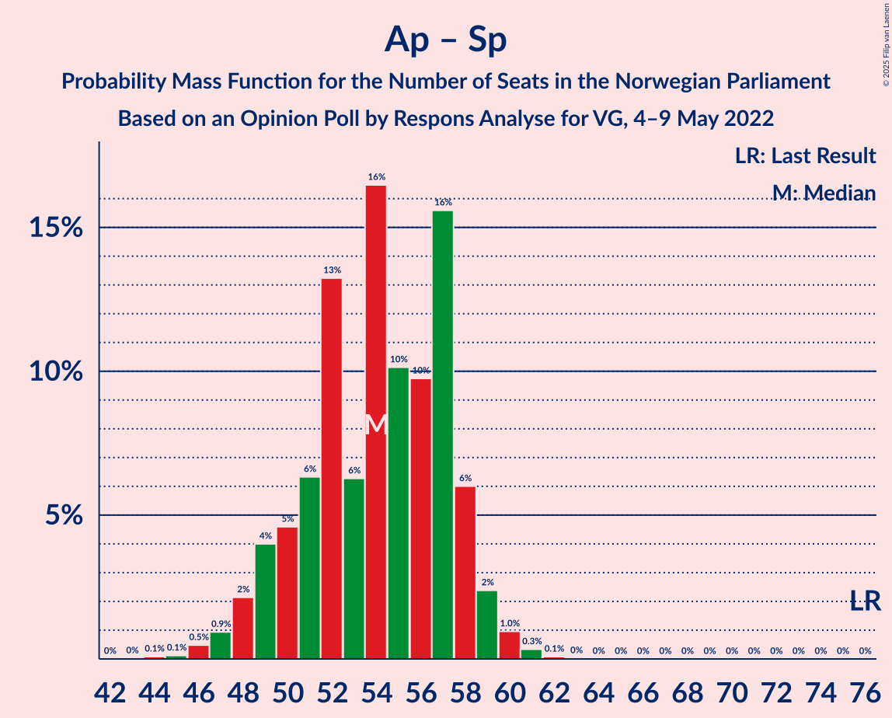

| Number of Seats | Probability | Accumulated | Special Marks |
|:---------------:|:-----------:|:-----------:|:-------------:|
| 44 | 0.1% | 100% |  |
| 45 | 0.1% | 99.9% |  |
| 46 | 0.5% | 99.8% |  |
| 47 | 0.9% | 99.3% |  |
| 48 | 2% | 98% |  |
| 49 | 4% | 96% |  |
| 50 | 5% | 92% |  |
| 51 | 6% | 88% |  |
| 52 | 13% | 81% |  |
| 53 | 6% | 68% |  |
| 54 | 16% | 62% | Median |
| 55 | 10% | 45% |  |
| 56 | 10% | 35% |  |
| 57 | 16% | 25% |  |
| 58 | 6% | 10% |  |
| 59 | 2% | 4% |  |
| 60 | 1.0% | 1.4% |  |
| 61 | 0.3% | 0.4% |  |
| 62 | 0.1% | 0.1% |  |
| 63 | 0% | 0% |  |
| 64 | 0% | 0% |  |
| 65 | 0% | 0% |  |
| 66 | 0% | 0% |  |
| 67 | 0% | 0% |  |
| 68 | 0% | 0% |  |
| 69 | 0% | 0% |  |
| 70 | 0% | 0% |  |
| 71 | 0% | 0% |  |
| 72 | 0% | 0% |  |
| 73 | 0% | 0% |  |
| 74 | 0% | 0% |  |
| 75 | 0% | 0% |  |
| 76 | 0% | 0% | Last Result |

### Senterpartiet – Venstre – Kristelig Folkeparti

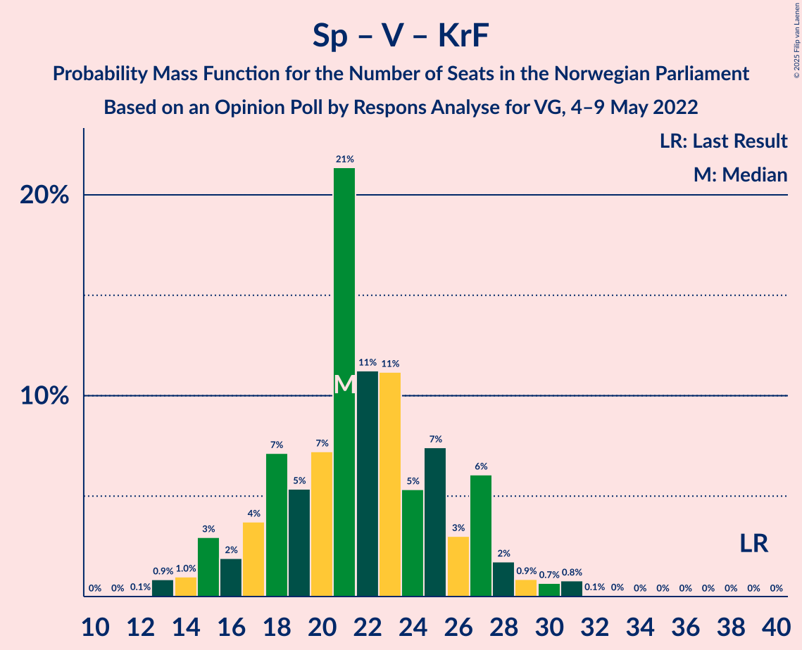

| Number of Seats | Probability | Accumulated | Special Marks |
|:---------------:|:-----------:|:-----------:|:-------------:|
| 12 | 0.1% | 100% |  |
| 13 | 0.9% | 99.9% |  |
| 14 | 1.0% | 99.1% |  |
| 15 | 3% | 98% |  |
| 16 | 2% | 95% |  |
| 17 | 4% | 93% |  |
| 18 | 7% | 90% |  |
| 19 | 5% | 82% |  |
| 20 | 7% | 77% |  |
| 21 | 21% | 70% | Median |
| 22 | 11% | 48% |  |
| 23 | 11% | 37% |  |
| 24 | 5% | 26% |  |
| 25 | 7% | 21% |  |
| 26 | 3% | 13% |  |
| 27 | 6% | 10% |  |
| 28 | 2% | 4% |  |
| 29 | 0.9% | 2% |  |
| 30 | 0.7% | 2% |  |
| 31 | 0.8% | 0.9% |  |
| 32 | 0.1% | 0.1% |  |
| 33 | 0% | 0.1% |  |
| 34 | 0% | 0% |  |
| 35 | 0% | 0% |  |
| 36 | 0% | 0% |  |
| 37 | 0% | 0% |  |
| 38 | 0% | 0% |  |
| 39 | 0% | 0% | Last Result |

## Technical Information

### Opinion Poll

+ **Polling firm:** Respons Analyse
+ **Commissioner(s):** VG
+ **Fieldwork period:** 4–9 May 2022

### Calculations

+ **Sample size:** 1000
+ **Simulations done:** 1,048,576
+ **Error estimate:** 1.34%

