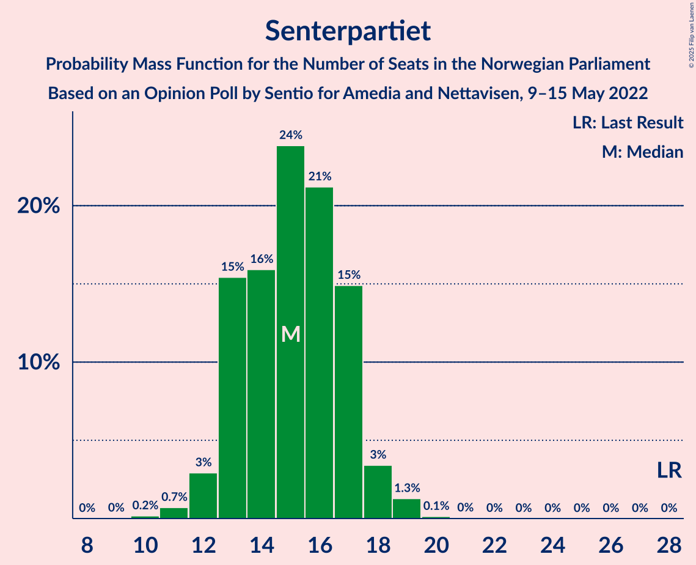
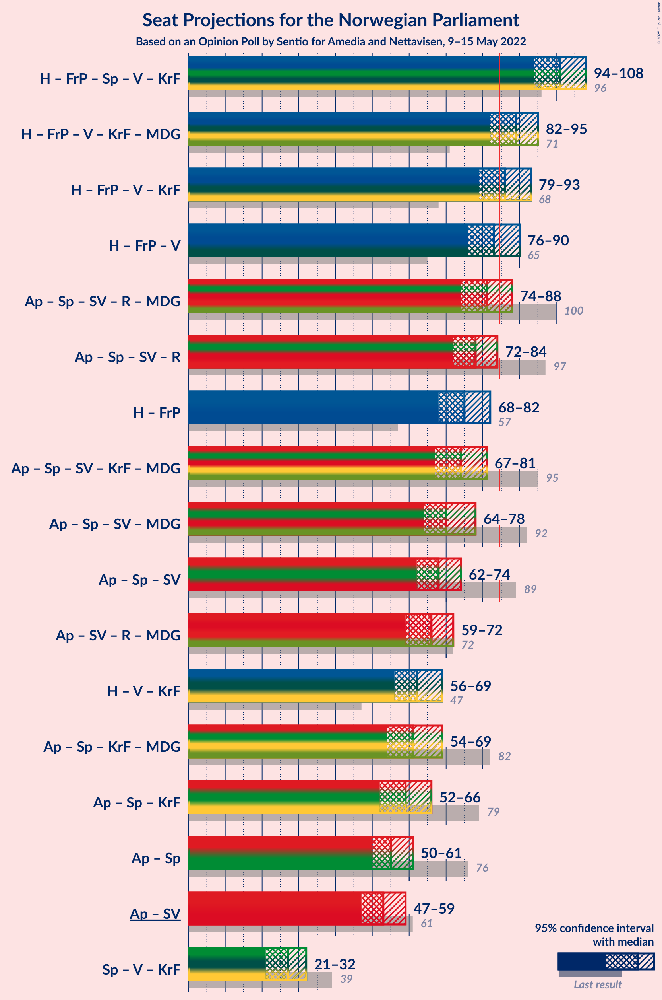

# Opinion Poll by Sentio for Amedia and Nettavisen, 9–15 May 2022

<a href="#voting-intentions">Voting Intentions</a> | <a href="#seats">Seats</a> | <a href="#coalitions">Coalitions</a> | <a href="#technical-information">Technical Information</a>

## Voting Intentions

### Confidence Intervals

| Party | Last Result | Poll Result | 80% Confidence Interval | 90% Confidence Interval | 95% Confidence Interval | 99% Confidence Interval |
|:-----:|:-----------:|:-----------:|:-----------------------:|:-----------------------:|:-----------------------:|:-----------------------:|
| Høyre | 20.4% | 28.8% | 27.0–30.7% |26.5–31.2% |26.1–31.7% |25.2–32.6% |
| Arbeiderpartiet | 26.2% | 21.3% | 19.7–23.0% |19.3–23.5% |18.9–24.0% |18.1–24.8% |
| Fremskrittspartiet | 11.6% | 13.4% | 12.1–14.9% |11.7–15.3% |11.4–15.7% |10.8–16.4% |
| Senterpartiet | 13.5% | 8.4% | 7.4–9.6% |7.1–10.0% |6.8–10.3% |6.4–10.9% |
| Sosialistisk Venstreparti | 7.6% | 7.1% | 6.2–8.3% |5.9–8.6% |5.7–8.9% |5.2–9.4% |
| Rødt | 4.7% | 6.0% | 5.1–7.1% |4.9–7.4% |4.7–7.7% |4.3–8.2% |
| Venstre | 4.6% | 4.9% | 4.1–5.9% |3.9–6.2% |3.7–6.4% |3.4–6.9% |
| Kristelig Folkeparti | 3.8% | 3.5% | 2.9–4.4% |2.7–4.6% |2.5–4.8% |2.2–5.3% |
| Miljøpartiet De Grønne | 3.9% | 3.2% | 2.6–4.0% |2.4–4.3% |2.3–4.5% |2.0–4.9% |

*Note:* The poll result column reflects the actual value used in the calculations. Published results may vary slightly, and in addition be rounded to fewer digits.

## Seats

### Confidence Intervals

| Party | Last Result | Median | 80% Confidence Interval | 90% Confidence Interval | 95% Confidence Interval | 99% Confidence Interval |
|:-----:|:-----------:|:------:|:-----------------------:|:-----------------------:|:-----------------------:|:-----------------------:|
| <a href="#høyre">Høyre</a> | 36 | 51 | 47–54 |46–55 |45–56 |45–58 |
| <a href="#arbeiderpartiet">Arbeiderpartiet</a> | 48 | 40 | 37–45 |35–45 |35–46 |34–47 |
| <a href="#fremskrittspartiet">Fremskrittspartiet</a> | 21 | 24 | 21–27 |20–28 |19–28 |18–29 |
| <a href="#senterpartiet">Senterpartiet</a> | 28 | 15 | 13–17 |13–17 |12–18 |11–19 |
| <a href="#sosialistisk-venstreparti">Sosialistisk Venstreparti</a> | 13 | 12 | 10–14 |10–15 |9–16 |9–17 |
| <a href="#rødt">Rødt</a> | 8 | 11 | 9–12 |8–13 |8–13 |7–14 |
| <a href="#venstre">Venstre</a> | 8 | 9 | 7–10 |3–11 |3–11 |2–12 |
| <a href="#kristelig-folkeparti">Kristelig Folkeparti</a> | 3 | 3 | 2–7 |2–8 |2–8 |0–9 |
| <a href="#miljøpartiet-de-grønne">Miljøpartiet De Grønne</a> | 3 | 2 | 1–7 |1–7 |1–8 |1–8 |

### Høyre

*For a full overview of the results for this party, see the [Høyre](party-høyre.html) page.*

| Number of Seats | Probability | Accumulated | Special Marks |
|:---------------:|:-----------:|:-----------:|:-------------:|
| 36 | 0% | 100% | Last Result |
| 37 | 0% | 100% |  |
| 38 | 0% | 100% |  |
| 39 | 0% | 100% |  |
| 40 | 0% | 100% |  |
| 41 | 0% | 100% |  |
| 42 | 0% | 100% |  |
| 43 | 0.1% | 100% |  |
| 44 | 0.3% | 99.9% |  |
| 45 | 2% | 99.6% |  |
| 46 | 3% | 97% |  |
| 47 | 6% | 95% |  |
| 48 | 10% | 89% |  |
| 49 | 14% | 79% |  |
| 50 | 12% | 65% |  |
| 51 | 16% | 53% | Median |
| 52 | 17% | 37% |  |
| 53 | 7% | 20% |  |
| 54 | 5% | 13% |  |
| 55 | 4% | 8% |  |
| 56 | 2% | 4% |  |
| 57 | 0.7% | 2% |  |
| 58 | 0.5% | 1.0% |  |
| 59 | 0.3% | 0.5% |  |
| 60 | 0.1% | 0.2% |  |
| 61 | 0% | 0.1% |  |
| 62 | 0% | 0.1% |  |
| 63 | 0% | 0% |  |

### Arbeiderpartiet

*For a full overview of the results for this party, see the [Arbeiderpartiet](party-arbeiderpartiet.html) page.*

| Number of Seats | Probability | Accumulated | Special Marks |
|:---------------:|:-----------:|:-----------:|:-------------:|
| 32 | 0% | 100% |  |
| 33 | 0.3% | 99.9% |  |
| 34 | 1.4% | 99.6% |  |
| 35 | 3% | 98% |  |
| 36 | 5% | 95% |  |
| 37 | 6% | 90% |  |
| 38 | 16% | 84% |  |
| 39 | 13% | 68% |  |
| 40 | 8% | 55% | Median |
| 41 | 5% | 47% |  |
| 42 | 12% | 42% |  |
| 43 | 13% | 30% |  |
| 44 | 6% | 17% |  |
| 45 | 7% | 12% |  |
| 46 | 4% | 5% |  |
| 47 | 0.8% | 1.0% |  |
| 48 | 0.1% | 0.2% | Last Result |
| 49 | 0% | 0% |  |

### Fremskrittspartiet

*For a full overview of the results for this party, see the [Fremskrittspartiet](party-fremskrittspartiet.html) page.*

| Number of Seats | Probability | Accumulated | Special Marks |
|:---------------:|:-----------:|:-----------:|:-------------:|
| 17 | 0.1% | 100% |  |
| 18 | 1.2% | 99.9% |  |
| 19 | 2% | 98.7% |  |
| 20 | 4% | 97% |  |
| 21 | 11% | 93% | Last Result |
| 22 | 14% | 82% |  |
| 23 | 15% | 68% |  |
| 24 | 11% | 53% | Median |
| 25 | 13% | 41% |  |
| 26 | 6% | 28% |  |
| 27 | 12% | 22% |  |
| 28 | 8% | 10% |  |
| 29 | 0.9% | 1.2% |  |
| 30 | 0.2% | 0.3% |  |
| 31 | 0.1% | 0.1% |  |
| 32 | 0% | 0% |  |

### Senterpartiet

*For a full overview of the results for this party, see the [Senterpartiet](party-senterpartiet.html) page.*

| Number of Seats | Probability | Accumulated | Special Marks |
|:---------------:|:-----------:|:-----------:|:-------------:|
| 10 | 0.2% | 100% |  |
| 11 | 0.7% | 99.8% |  |
| 12 | 3% | 99.1% |  |
| 13 | 15% | 96% |  |
| 14 | 16% | 81% |  |
| 15 | 24% | 65% | Median |
| 16 | 21% | 41% |  |
| 17 | 15% | 20% |  |
| 18 | 3% | 5% |  |
| 19 | 1.3% | 1.5% |  |
| 20 | 0.1% | 0.2% |  |
| 21 | 0% | 0% |  |
| 22 | 0% | 0% |  |
| 23 | 0% | 0% |  |
| 24 | 0% | 0% |  |
| 25 | 0% | 0% |  |
| 26 | 0% | 0% |  |
| 27 | 0% | 0% |  |
| 28 | 0% | 0% | Last Result |

### Sosialistisk Venstreparti

*For a full overview of the results for this party, see the [Sosialistisk Venstreparti](party-sosialistiskvenstreparti.html) page.*

| Number of Seats | Probability | Accumulated | Special Marks |
|:---------------:|:-----------:|:-----------:|:-------------:|
| 8 | 0.5% | 100% |  |
| 9 | 2% | 99.5% |  |
| 10 | 8% | 97% |  |
| 11 | 18% | 89% |  |
| 12 | 28% | 70% | Median |
| 13 | 16% | 42% | Last Result |
| 14 | 17% | 27% |  |
| 15 | 5% | 10% |  |
| 16 | 4% | 4% |  |
| 17 | 0.5% | 0.7% |  |
| 18 | 0.1% | 0.2% |  |
| 19 | 0% | 0% |  |

### Rødt

*For a full overview of the results for this party, see the [Rødt](party-rødt.html) page.*

| Number of Seats | Probability | Accumulated | Special Marks |
|:---------------:|:-----------:|:-----------:|:-------------:|
| 1 | 0.1% | 100% |  |
| 2 | 0% | 99.9% |  |
| 3 | 0% | 99.9% |  |
| 4 | 0% | 99.9% |  |
| 5 | 0% | 99.9% |  |
| 6 | 0.1% | 99.9% |  |
| 7 | 2% | 99.7% |  |
| 8 | 8% | 98% | Last Result |
| 9 | 16% | 90% |  |
| 10 | 21% | 75% |  |
| 11 | 28% | 53% | Median |
| 12 | 17% | 25% |  |
| 13 | 6% | 8% |  |
| 14 | 2% | 2% |  |
| 15 | 0.3% | 0.3% |  |
| 16 | 0% | 0% |  |

### Venstre

*For a full overview of the results for this party, see the [Venstre](party-venstre.html) page.*

| Number of Seats | Probability | Accumulated | Special Marks |
|:---------------:|:-----------:|:-----------:|:-------------:|
| 2 | 1.2% | 100% |  |
| 3 | 6% | 98.8% |  |
| 4 | 0% | 93% |  |
| 5 | 0% | 93% |  |
| 6 | 2% | 93% |  |
| 7 | 11% | 91% |  |
| 8 | 29% | 80% | Last Result |
| 9 | 27% | 51% | Median |
| 10 | 17% | 25% |  |
| 11 | 7% | 8% |  |
| 12 | 0.9% | 1.1% |  |
| 13 | 0.1% | 0.2% |  |
| 14 | 0% | 0% |  |

### Kristelig Folkeparti

*For a full overview of the results for this party, see the [Kristelig Folkeparti](party-kristeligfolkeparti.html) page.*

| Number of Seats | Probability | Accumulated | Special Marks |
|:---------------:|:-----------:|:-----------:|:-------------:|
| 0 | 0.6% | 100% |  |
| 1 | 0.5% | 99.4% |  |
| 2 | 40% | 98.9% |  |
| 3 | 37% | 59% | Last Result, Median |
| 4 | 0% | 22% |  |
| 5 | 0.4% | 22% |  |
| 6 | 2% | 22% |  |
| 7 | 14% | 20% |  |
| 8 | 5% | 6% |  |
| 9 | 0.5% | 0.7% |  |
| 10 | 0.1% | 0.1% |  |
| 11 | 0% | 0% |  |

### Miljøpartiet De Grønne

*For a full overview of the results for this party, see the [Miljøpartiet De Grønne](party-miljøpartietdegrønne.html) page.*

| Number of Seats | Probability | Accumulated | Special Marks |
|:---------------:|:-----------:|:-----------:|:-------------:|
| 1 | 30% | 100% |  |
| 2 | 42% | 70% | Median |
| 3 | 15% | 28% | Last Result |
| 4 | 0% | 12% |  |
| 5 | 0% | 12% |  |
| 6 | 1.4% | 12% |  |
| 7 | 7% | 11% |  |
| 8 | 4% | 4% |  |
| 9 | 0.3% | 0.3% |  |
| 10 | 0% | 0% |  |

## Coalitions

### Confidence Intervals

| Coalition | Last Result | Median | Majority? | 80% Confidence Interval | 90% Confidence Interval | 95% Confidence Interval | 99% Confidence Interval |
|:---------:|:-----------:|:------:|:---------:|:-----------------------:|:-----------------------:|:-----------------------:|:-----------------------:|
| Høyre – Fremskrittspartiet – Senterpartiet – Venstre – Kristelig Folkeparti | 96 | 101 | 100% | 96–106 | 95–107 | 94–108 | 91–110 |
| Høyre – Fremskrittspartiet – Venstre – Kristelig Folkeparti – Miljøpartiet De Grønne | 71 | 89 | 90% | 84–93 | 83–94 | 82–95 | 79–97 |
| Høyre – Fremskrittspartiet – Venstre – Kristelig Folkeparti | 68 | 86 | 70% | 82–91 | 80–92 | 79–93 | 77–95 |
| Høyre – Fremskrittspartiet – Venstre | 65 | 83 | 34% | 78–87 | 77–89 | 76–90 | 74–92 |
| Arbeiderpartiet – Senterpartiet – Sosialistisk Venstreparti – Rødt – Miljøpartiet De Grønne | 100 | 81 | 13% | 77–85 | 76–87 | 74–88 | 72–90 |
| Arbeiderpartiet – Senterpartiet – Sosialistisk Venstreparti – Rødt | 97 | 78 | 2% | 74–82 | 73–84 | 72–84 | 69–87 |
| Høyre – Fremskrittspartiet | 57 | 75 | 0.2% | 70–79 | 69–80 | 68–82 | 67–83 |
| Arbeiderpartiet – Senterpartiet – Sosialistisk Venstreparti – Kristelig Folkeparti – Miljøpartiet De Grønne | 95 | 74 | 0.1% | 69–79 | 68–80 | 67–81 | 65–82 |
| Arbeiderpartiet – Senterpartiet – Sosialistisk Venstreparti – Miljøpartiet De Grønne | 92 | 70 | 0% | 66–75 | 65–77 | 64–78 | 62–79 |
| Arbeiderpartiet – Senterpartiet – Sosialistisk Venstreparti | 89 | 68 | 0% | 64–72 | 63–73 | 62–74 | 60–75 |
| Arbeiderpartiet – Sosialistisk Venstreparti – Rødt – Miljøpartiet De Grønne | 72 | 66 | 0% | 61–70 | 61–72 | 59–72 | 57–75 |
| Høyre – Venstre – Kristelig Folkeparti | 47 | 62 | 0% | 58–67 | 58–68 | 56–69 | 54–71 |
| Arbeiderpartiet – Senterpartiet – Kristelig Folkeparti – Miljøpartiet De Grønne | 82 | 61 | 0% | 56–68 | 55–68 | 54–69 | 53–71 |
| Arbeiderpartiet – Senterpartiet – Kristelig Folkeparti | 79 | 59 | 0% | 54–63 | 53–65 | 52–66 | 51–68 |
| Arbeiderpartiet – Senterpartiet | 76 | 55 | 0% | 51–60 | 50–60 | 50–61 | 48–63 |
| Arbeiderpartiet – Sosialistisk Venstreparti | 61 | 53 | 0% | 49–57 | 48–58 | 47–59 | 46–60 |
| Senterpartiet – Venstre – Kristelig Folkeparti | 39 | 27 | 0% | 23–30 | 22–32 | 21–32 | 18–34 |

### Høyre – Fremskrittspartiet – Senterpartiet – Venstre – Kristelig Folkeparti

| Number of Seats | Probability | Accumulated | Special Marks |
|:---------------:|:-----------:|:-----------:|:-------------:|
| 89 | 0.1% | 100% |  |
| 90 | 0.1% | 99.9% |  |
| 91 | 0.4% | 99.8% |  |
| 92 | 0.2% | 99.4% |  |
| 93 | 0.9% | 99.2% |  |
| 94 | 2% | 98% |  |
| 95 | 2% | 97% |  |
| 96 | 5% | 94% | Last Result |
| 97 | 5% | 90% |  |
| 98 | 5% | 85% |  |
| 99 | 12% | 80% |  |
| 100 | 11% | 68% |  |
| 101 | 8% | 57% |  |
| 102 | 8% | 49% | Median |
| 103 | 7% | 41% |  |
| 104 | 3% | 34% |  |
| 105 | 15% | 30% |  |
| 106 | 7% | 15% |  |
| 107 | 5% | 8% |  |
| 108 | 1.4% | 3% |  |
| 109 | 0.8% | 2% |  |
| 110 | 0.7% | 1.0% |  |
| 111 | 0.2% | 0.3% |  |
| 112 | 0% | 0.1% |  |
| 113 | 0% | 0% |  |

### Høyre – Fremskrittspartiet – Venstre – Kristelig Folkeparti – Miljøpartiet De Grønne

| Number of Seats | Probability | Accumulated | Special Marks |
|:---------------:|:-----------:|:-----------:|:-------------:|
| 71 | 0% | 100% | Last Result |
| 72 | 0% | 100% |  |
| 73 | 0% | 100% |  |
| 74 | 0% | 100% |  |
| 75 | 0.1% | 100% |  |
| 76 | 0% | 99.9% |  |
| 77 | 0% | 99.9% |  |
| 78 | 0% | 99.9% |  |
| 79 | 0.4% | 99.8% |  |
| 80 | 0.4% | 99.5% |  |
| 81 | 0.9% | 99.1% |  |
| 82 | 2% | 98% |  |
| 83 | 2% | 96% |  |
| 84 | 5% | 95% |  |
| 85 | 6% | 90% | Majority |
| 86 | 7% | 84% |  |
| 87 | 12% | 77% |  |
| 88 | 11% | 64% |  |
| 89 | 8% | 53% | Median |
| 90 | 6% | 45% |  |
| 91 | 18% | 39% |  |
| 92 | 9% | 22% |  |
| 93 | 5% | 13% |  |
| 94 | 4% | 7% |  |
| 95 | 1.5% | 4% |  |
| 96 | 1.1% | 2% |  |
| 97 | 0.8% | 1.1% |  |
| 98 | 0.2% | 0.3% |  |
| 99 | 0.1% | 0.1% |  |
| 100 | 0% | 0.1% |  |
| 101 | 0% | 0.1% |  |
| 102 | 0% | 0% |  |

### Høyre – Fremskrittspartiet – Venstre – Kristelig Folkeparti

| Number of Seats | Probability | Accumulated | Special Marks |
|:---------------:|:-----------:|:-----------:|:-------------:|
| 68 | 0% | 100% | Last Result |
| 69 | 0% | 100% |  |
| 70 | 0% | 100% |  |
| 71 | 0% | 100% |  |
| 72 | 0% | 100% |  |
| 73 | 0.1% | 100% |  |
| 74 | 0% | 99.9% |  |
| 75 | 0.1% | 99.9% |  |
| 76 | 0.2% | 99.9% |  |
| 77 | 0.5% | 99.7% |  |
| 78 | 0.7% | 99.1% |  |
| 79 | 2% | 98% |  |
| 80 | 3% | 96% |  |
| 81 | 4% | 94% |  |
| 82 | 5% | 90% |  |
| 83 | 5% | 85% |  |
| 84 | 10% | 80% |  |
| 85 | 8% | 70% | Majority |
| 86 | 15% | 63% |  |
| 87 | 6% | 47% | Median |
| 88 | 7% | 41% |  |
| 89 | 16% | 34% |  |
| 90 | 7% | 19% |  |
| 91 | 6% | 12% |  |
| 92 | 3% | 6% |  |
| 93 | 1.3% | 3% |  |
| 94 | 1.1% | 2% |  |
| 95 | 0.4% | 0.6% |  |
| 96 | 0.1% | 0.2% |  |
| 97 | 0% | 0.1% |  |
| 98 | 0% | 0% |  |

### Høyre – Fremskrittspartiet – Venstre

| Number of Seats | Probability | Accumulated | Special Marks |
|:---------------:|:-----------:|:-----------:|:-------------:|
| 65 | 0% | 100% | Last Result |
| 66 | 0% | 100% |  |
| 67 | 0% | 100% |  |
| 68 | 0% | 100% |  |
| 69 | 0% | 100% |  |
| 70 | 0% | 100% |  |
| 71 | 0.1% | 100% |  |
| 72 | 0.1% | 99.9% |  |
| 73 | 0.2% | 99.8% |  |
| 74 | 0.3% | 99.6% |  |
| 75 | 1.1% | 99.3% |  |
| 76 | 2% | 98% |  |
| 77 | 3% | 96% |  |
| 78 | 6% | 93% |  |
| 79 | 7% | 87% |  |
| 80 | 5% | 80% |  |
| 81 | 9% | 75% |  |
| 82 | 10% | 66% |  |
| 83 | 14% | 56% |  |
| 84 | 8% | 42% | Median |
| 85 | 6% | 34% | Majority |
| 86 | 14% | 29% |  |
| 87 | 5% | 15% |  |
| 88 | 3% | 10% |  |
| 89 | 4% | 7% |  |
| 90 | 2% | 3% |  |
| 91 | 0.8% | 1.3% |  |
| 92 | 0.2% | 0.5% |  |
| 93 | 0.3% | 0.3% |  |
| 94 | 0% | 0.1% |  |
| 95 | 0% | 0% |  |

### Arbeiderpartiet – Senterpartiet – Sosialistisk Venstreparti – Rødt – Miljøpartiet De Grønne

| Number of Seats | Probability | Accumulated | Special Marks |
|:---------------:|:-----------:|:-----------:|:-------------:|
| 69 | 0.1% | 100% |  |
| 70 | 0.3% | 99.9% |  |
| 71 | 0.1% | 99.7% |  |
| 72 | 0.4% | 99.5% |  |
| 73 | 0.8% | 99.2% |  |
| 74 | 1.4% | 98% |  |
| 75 | 2% | 97% |  |
| 76 | 3% | 95% |  |
| 77 | 7% | 92% |  |
| 78 | 7% | 84% |  |
| 79 | 15% | 77% |  |
| 80 | 10% | 62% | Median |
| 81 | 7% | 53% |  |
| 82 | 15% | 46% |  |
| 83 | 8% | 31% |  |
| 84 | 10% | 23% |  |
| 85 | 3% | 13% | Majority |
| 86 | 4% | 10% |  |
| 87 | 3% | 6% |  |
| 88 | 2% | 3% |  |
| 89 | 1.0% | 2% |  |
| 90 | 0.2% | 0.6% |  |
| 91 | 0.2% | 0.4% |  |
| 92 | 0.1% | 0.2% |  |
| 93 | 0% | 0% |  |
| 94 | 0% | 0% |  |
| 95 | 0% | 0% |  |
| 96 | 0% | 0% |  |
| 97 | 0% | 0% |  |
| 98 | 0% | 0% |  |
| 99 | 0% | 0% |  |
| 100 | 0% | 0% | Last Result |

### Arbeiderpartiet – Senterpartiet – Sosialistisk Venstreparti – Rødt

| Number of Seats | Probability | Accumulated | Special Marks |
|:---------------:|:-----------:|:-----------:|:-------------:|
| 66 | 0.1% | 100% |  |
| 67 | 0.1% | 99.9% |  |
| 68 | 0.3% | 99.9% |  |
| 69 | 0.3% | 99.6% |  |
| 70 | 0.4% | 99.3% |  |
| 71 | 1.4% | 98.9% |  |
| 72 | 1.4% | 98% |  |
| 73 | 2% | 96% |  |
| 74 | 4% | 94% |  |
| 75 | 6% | 90% |  |
| 76 | 11% | 84% |  |
| 77 | 16% | 73% |  |
| 78 | 9% | 58% | Median |
| 79 | 8% | 48% |  |
| 80 | 11% | 40% |  |
| 81 | 13% | 29% |  |
| 82 | 7% | 17% |  |
| 83 | 4% | 9% |  |
| 84 | 4% | 5% |  |
| 85 | 0.7% | 2% | Majority |
| 86 | 0.4% | 1.0% |  |
| 87 | 0.4% | 0.6% |  |
| 88 | 0.1% | 0.2% |  |
| 89 | 0.1% | 0.1% |  |
| 90 | 0% | 0% |  |
| 91 | 0% | 0% |  |
| 92 | 0% | 0% |  |
| 93 | 0% | 0% |  |
| 94 | 0% | 0% |  |
| 95 | 0% | 0% |  |
| 96 | 0% | 0% |  |
| 97 | 0% | 0% | Last Result |

### Høyre – Fremskrittspartiet

| Number of Seats | Probability | Accumulated | Special Marks |
|:---------------:|:-----------:|:-----------:|:-------------:|
| 57 | 0% | 100% | Last Result |
| 58 | 0% | 100% |  |
| 59 | 0% | 100% |  |
| 60 | 0% | 100% |  |
| 61 | 0% | 100% |  |
| 62 | 0% | 100% |  |
| 63 | 0% | 100% |  |
| 64 | 0% | 100% |  |
| 65 | 0.1% | 100% |  |
| 66 | 0.3% | 99.9% |  |
| 67 | 0.9% | 99.6% |  |
| 68 | 3% | 98.7% |  |
| 69 | 4% | 96% |  |
| 70 | 6% | 92% |  |
| 71 | 7% | 87% |  |
| 72 | 10% | 79% |  |
| 73 | 8% | 69% |  |
| 74 | 11% | 61% |  |
| 75 | 9% | 50% | Median |
| 76 | 8% | 41% |  |
| 77 | 9% | 33% |  |
| 78 | 13% | 24% |  |
| 79 | 3% | 11% |  |
| 80 | 3% | 7% |  |
| 81 | 1.3% | 4% |  |
| 82 | 2% | 3% |  |
| 83 | 0.5% | 1.0% |  |
| 84 | 0.2% | 0.4% |  |
| 85 | 0.1% | 0.2% | Majority |
| 86 | 0.1% | 0.1% |  |
| 87 | 0% | 0% |  |

### Arbeiderpartiet – Senterpartiet – Sosialistisk Venstreparti – Kristelig Folkeparti – Miljøpartiet De Grønne

| Number of Seats | Probability | Accumulated | Special Marks |
|:---------------:|:-----------:|:-----------:|:-------------:|
| 62 | 0.1% | 100% |  |
| 63 | 0.1% | 99.9% |  |
| 64 | 0.2% | 99.9% |  |
| 65 | 0.4% | 99.7% |  |
| 66 | 0.5% | 99.2% |  |
| 67 | 2% | 98.8% |  |
| 68 | 4% | 97% |  |
| 69 | 4% | 92% |  |
| 70 | 4% | 88% |  |
| 71 | 13% | 85% |  |
| 72 | 8% | 71% | Median |
| 73 | 10% | 63% |  |
| 74 | 13% | 53% |  |
| 75 | 8% | 41% |  |
| 76 | 9% | 33% |  |
| 77 | 7% | 24% |  |
| 78 | 5% | 17% |  |
| 79 | 3% | 12% |  |
| 80 | 5% | 9% |  |
| 81 | 3% | 4% |  |
| 82 | 1.3% | 2% |  |
| 83 | 0.2% | 0.5% |  |
| 84 | 0.1% | 0.3% |  |
| 85 | 0% | 0.1% | Majority |
| 86 | 0.1% | 0.1% |  |
| 87 | 0% | 0% |  |
| 88 | 0% | 0% |  |
| 89 | 0% | 0% |  |
| 90 | 0% | 0% |  |
| 91 | 0% | 0% |  |
| 92 | 0% | 0% |  |
| 93 | 0% | 0% |  |
| 94 | 0% | 0% |  |
| 95 | 0% | 0% | Last Result |

### Arbeiderpartiet – Senterpartiet – Sosialistisk Venstreparti – Miljøpartiet De Grønne

| Number of Seats | Probability | Accumulated | Special Marks |
|:---------------:|:-----------:|:-----------:|:-------------:|
| 60 | 0.2% | 100% |  |
| 61 | 0.2% | 99.8% |  |
| 62 | 0.4% | 99.6% |  |
| 63 | 0.7% | 99.2% |  |
| 64 | 1.2% | 98% |  |
| 65 | 3% | 97% |  |
| 66 | 5% | 94% |  |
| 67 | 6% | 90% |  |
| 68 | 13% | 83% |  |
| 69 | 14% | 70% | Median |
| 70 | 9% | 56% |  |
| 71 | 11% | 47% |  |
| 72 | 12% | 37% |  |
| 73 | 9% | 24% |  |
| 74 | 3% | 15% |  |
| 75 | 5% | 12% |  |
| 76 | 2% | 7% |  |
| 77 | 1.5% | 5% |  |
| 78 | 2% | 4% |  |
| 79 | 2% | 2% |  |
| 80 | 0.1% | 0.1% |  |
| 81 | 0% | 0% |  |
| 82 | 0% | 0% |  |
| 83 | 0% | 0% |  |
| 84 | 0% | 0% |  |
| 85 | 0% | 0% | Majority |
| 86 | 0% | 0% |  |
| 87 | 0% | 0% |  |
| 88 | 0% | 0% |  |
| 89 | 0% | 0% |  |
| 90 | 0% | 0% |  |
| 91 | 0% | 0% |  |
| 92 | 0% | 0% | Last Result |

### Arbeiderpartiet – Senterpartiet – Sosialistisk Venstreparti

| Number of Seats | Probability | Accumulated | Special Marks |
|:---------------:|:-----------:|:-----------:|:-------------:|
| 57 | 0% | 100% |  |
| 58 | 0.1% | 99.9% |  |
| 59 | 0.3% | 99.8% |  |
| 60 | 0.4% | 99.5% |  |
| 61 | 1.0% | 99.1% |  |
| 62 | 2% | 98% |  |
| 63 | 3% | 96% |  |
| 64 | 4% | 93% |  |
| 65 | 8% | 89% |  |
| 66 | 15% | 81% |  |
| 67 | 12% | 66% | Median |
| 68 | 12% | 54% |  |
| 69 | 11% | 42% |  |
| 70 | 12% | 30% |  |
| 71 | 5% | 18% |  |
| 72 | 7% | 13% |  |
| 73 | 3% | 6% |  |
| 74 | 2% | 3% |  |
| 75 | 0.5% | 1.0% |  |
| 76 | 0.3% | 0.5% |  |
| 77 | 0.2% | 0.2% |  |
| 78 | 0% | 0% |  |
| 79 | 0% | 0% |  |
| 80 | 0% | 0% |  |
| 81 | 0% | 0% |  |
| 82 | 0% | 0% |  |
| 83 | 0% | 0% |  |
| 84 | 0% | 0% |  |
| 85 | 0% | 0% | Majority |
| 86 | 0% | 0% |  |
| 87 | 0% | 0% |  |
| 88 | 0% | 0% |  |
| 89 | 0% | 0% | Last Result |

### Arbeiderpartiet – Sosialistisk Venstreparti – Rødt – Miljøpartiet De Grønne

| Number of Seats | Probability | Accumulated | Special Marks |
|:---------------:|:-----------:|:-----------:|:-------------:|
| 54 | 0.1% | 100% |  |
| 55 | 0.1% | 99.9% |  |
| 56 | 0.1% | 99.8% |  |
| 57 | 0.3% | 99.8% |  |
| 58 | 1.1% | 99.4% |  |
| 59 | 1.1% | 98% |  |
| 60 | 2% | 97% |  |
| 61 | 5% | 95% |  |
| 62 | 5% | 90% |  |
| 63 | 19% | 85% |  |
| 64 | 4% | 66% |  |
| 65 | 8% | 62% | Median |
| 66 | 9% | 54% |  |
| 67 | 9% | 44% |  |
| 68 | 10% | 35% |  |
| 69 | 12% | 26% |  |
| 70 | 4% | 13% |  |
| 71 | 4% | 10% |  |
| 72 | 3% | 5% | Last Result |
| 73 | 0.9% | 2% |  |
| 74 | 0.8% | 1.4% |  |
| 75 | 0.4% | 0.6% |  |
| 76 | 0.1% | 0.2% |  |
| 77 | 0% | 0.1% |  |
| 78 | 0% | 0% |  |

### Høyre – Venstre – Kristelig Folkeparti

| Number of Seats | Probability | Accumulated | Special Marks |
|:---------------:|:-----------:|:-----------:|:-------------:|
| 47 | 0% | 100% | Last Result |
| 48 | 0% | 100% |  |
| 49 | 0% | 100% |  |
| 50 | 0% | 100% |  |
| 51 | 0% | 100% |  |
| 52 | 0% | 99.9% |  |
| 53 | 0.3% | 99.9% |  |
| 54 | 0.4% | 99.6% |  |
| 55 | 0.6% | 99.2% |  |
| 56 | 2% | 98.6% |  |
| 57 | 2% | 97% |  |
| 58 | 6% | 95% |  |
| 59 | 7% | 89% |  |
| 60 | 6% | 83% |  |
| 61 | 12% | 76% |  |
| 62 | 17% | 65% |  |
| 63 | 10% | 48% | Median |
| 64 | 15% | 38% |  |
| 65 | 9% | 23% |  |
| 66 | 3% | 14% |  |
| 67 | 6% | 12% |  |
| 68 | 2% | 5% |  |
| 69 | 2% | 3% |  |
| 70 | 0.5% | 1.1% |  |
| 71 | 0.2% | 0.6% |  |
| 72 | 0.1% | 0.4% |  |
| 73 | 0% | 0.2% |  |
| 74 | 0.2% | 0.2% |  |
| 75 | 0% | 0% |  |

### Arbeiderpartiet – Senterpartiet – Kristelig Folkeparti – Miljøpartiet De Grønne

| Number of Seats | Probability | Accumulated | Special Marks |
|:---------------:|:-----------:|:-----------:|:-------------:|
| 51 | 0.1% | 100% |  |
| 52 | 0.3% | 99.9% |  |
| 53 | 1.0% | 99.6% |  |
| 54 | 2% | 98.6% |  |
| 55 | 3% | 96% |  |
| 56 | 3% | 93% |  |
| 57 | 6% | 90% |  |
| 58 | 4% | 84% |  |
| 59 | 13% | 80% |  |
| 60 | 7% | 67% | Median |
| 61 | 10% | 59% |  |
| 62 | 11% | 49% |  |
| 63 | 9% | 38% |  |
| 64 | 7% | 29% |  |
| 65 | 6% | 22% |  |
| 66 | 3% | 15% |  |
| 67 | 2% | 13% |  |
| 68 | 5% | 10% |  |
| 69 | 3% | 5% |  |
| 70 | 2% | 2% |  |
| 71 | 0.3% | 0.6% |  |
| 72 | 0.1% | 0.3% |  |
| 73 | 0.1% | 0.2% |  |
| 74 | 0.1% | 0.1% |  |
| 75 | 0% | 0% |  |
| 76 | 0% | 0% |  |
| 77 | 0% | 0% |  |
| 78 | 0% | 0% |  |
| 79 | 0% | 0% |  |
| 80 | 0% | 0% |  |
| 81 | 0% | 0% |  |
| 82 | 0% | 0% | Last Result |

### Arbeiderpartiet – Senterpartiet – Kristelig Folkeparti

| Number of Seats | Probability | Accumulated | Special Marks |
|:---------------:|:-----------:|:-----------:|:-------------:|
| 49 | 0% | 100% |  |
| 50 | 0.3% | 99.9% |  |
| 51 | 0.5% | 99.6% |  |
| 52 | 3% | 99.1% |  |
| 53 | 4% | 96% |  |
| 54 | 3% | 92% |  |
| 55 | 6% | 90% |  |
| 56 | 8% | 83% |  |
| 57 | 15% | 75% |  |
| 58 | 4% | 60% | Median |
| 59 | 9% | 56% |  |
| 60 | 11% | 47% |  |
| 61 | 12% | 37% |  |
| 62 | 6% | 25% |  |
| 63 | 10% | 19% |  |
| 64 | 2% | 9% |  |
| 65 | 3% | 7% |  |
| 66 | 2% | 4% |  |
| 67 | 1.5% | 2% |  |
| 68 | 0.3% | 0.6% |  |
| 69 | 0.1% | 0.2% |  |
| 70 | 0.1% | 0.1% |  |
| 71 | 0% | 0% |  |
| 72 | 0% | 0% |  |
| 73 | 0% | 0% |  |
| 74 | 0% | 0% |  |
| 75 | 0% | 0% |  |
| 76 | 0% | 0% |  |
| 77 | 0% | 0% |  |
| 78 | 0% | 0% |  |
| 79 | 0% | 0% | Last Result |

### Arbeiderpartiet – Senterpartiet

| Number of Seats | Probability | Accumulated | Special Marks |
|:---------------:|:-----------:|:-----------:|:-------------:|
| 47 | 0.2% | 100% |  |
| 48 | 0.5% | 99.8% |  |
| 49 | 1.3% | 99.3% |  |
| 50 | 3% | 98% |  |
| 51 | 5% | 95% |  |
| 52 | 8% | 90% |  |
| 53 | 7% | 82% |  |
| 54 | 18% | 75% |  |
| 55 | 8% | 58% | Median |
| 56 | 9% | 49% |  |
| 57 | 9% | 40% |  |
| 58 | 11% | 31% |  |
| 59 | 9% | 19% |  |
| 60 | 7% | 10% |  |
| 61 | 2% | 3% |  |
| 62 | 0.7% | 1.2% |  |
| 63 | 0.3% | 0.5% |  |
| 64 | 0.2% | 0.2% |  |
| 65 | 0% | 0% |  |
| 66 | 0% | 0% |  |
| 67 | 0% | 0% |  |
| 68 | 0% | 0% |  |
| 69 | 0% | 0% |  |
| 70 | 0% | 0% |  |
| 71 | 0% | 0% |  |
| 72 | 0% | 0% |  |
| 73 | 0% | 0% |  |
| 74 | 0% | 0% |  |
| 75 | 0% | 0% |  |
| 76 | 0% | 0% | Last Result |

### Arbeiderpartiet – Sosialistisk Venstreparti

| Number of Seats | Probability | Accumulated | Special Marks |
|:---------------:|:-----------:|:-----------:|:-------------:|
| 43 | 0.1% | 100% |  |
| 44 | 0.1% | 99.9% |  |
| 45 | 0.3% | 99.8% |  |
| 46 | 1.2% | 99.5% |  |
| 47 | 2% | 98% |  |
| 48 | 3% | 96% |  |
| 49 | 3% | 93% |  |
| 50 | 17% | 90% |  |
| 51 | 8% | 72% |  |
| 52 | 9% | 65% | Median |
| 53 | 13% | 55% |  |
| 54 | 10% | 42% |  |
| 55 | 12% | 32% |  |
| 56 | 9% | 20% |  |
| 57 | 4% | 11% |  |
| 58 | 3% | 6% |  |
| 59 | 2% | 3% |  |
| 60 | 0.7% | 0.9% |  |
| 61 | 0.2% | 0.2% | Last Result |
| 62 | 0% | 0.1% |  |
| 63 | 0% | 0% |  |

### Senterpartiet – Venstre – Kristelig Folkeparti

| Number of Seats | Probability | Accumulated | Special Marks |
|:---------------:|:-----------:|:-----------:|:-------------:|
| 17 | 0.1% | 100% |  |
| 18 | 0.6% | 99.9% |  |
| 19 | 0.6% | 99.3% |  |
| 20 | 0.9% | 98.6% |  |
| 21 | 1.5% | 98% |  |
| 22 | 3% | 96% |  |
| 23 | 5% | 93% |  |
| 24 | 6% | 88% |  |
| 25 | 9% | 82% |  |
| 26 | 11% | 74% |  |
| 27 | 22% | 63% | Median |
| 28 | 11% | 41% |  |
| 29 | 17% | 30% |  |
| 30 | 5% | 13% |  |
| 31 | 3% | 8% |  |
| 32 | 3% | 5% |  |
| 33 | 1.2% | 2% |  |
| 34 | 0.4% | 0.8% |  |
| 35 | 0.2% | 0.3% |  |
| 36 | 0.1% | 0.1% |  |
| 37 | 0% | 0% |  |
| 38 | 0% | 0% |  |
| 39 | 0% | 0% | Last Result |

## Technical Information

### Opinion Poll

+ **Polling firm:** Sentio
+ **Commissioner(s):** Amedia and Nettavisen
+ **Fieldwork period:** 9–15 May 2022

### Calculations

+ **Sample size:** 1000
+ **Simulations done:** 1,048,576
+ **Error estimate:** 1.62%

