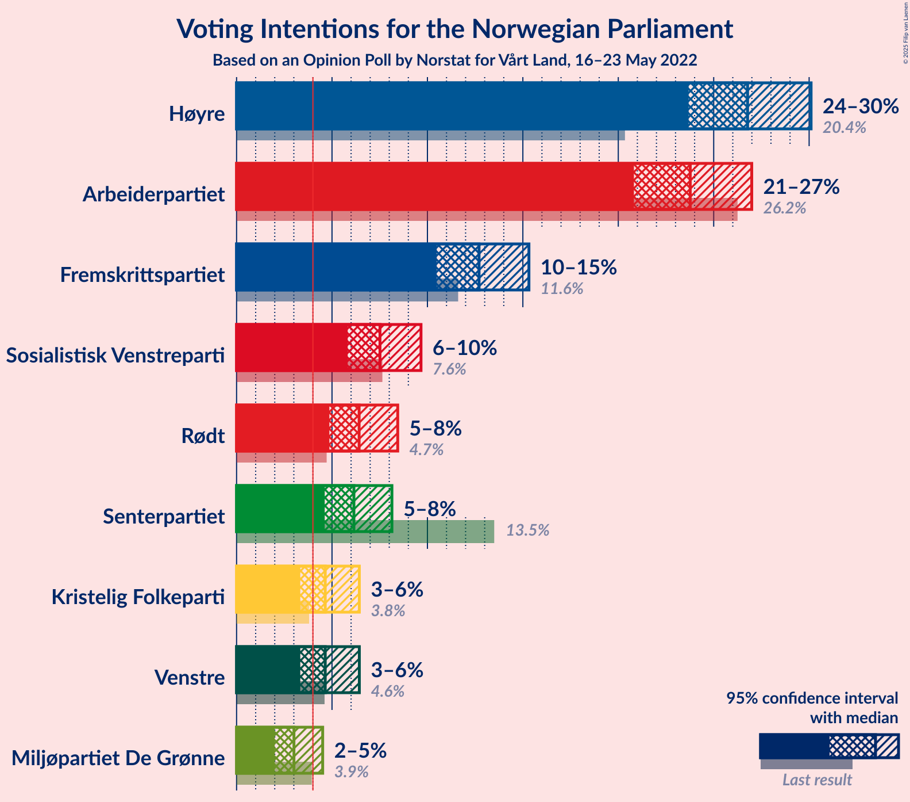

# Opinion Poll by Norstat for Vårt Land, 16–23 May 2022

<a href="#voting-intentions">Voting Intentions</a> | <a href="#seats">Seats</a> | <a href="#coalitions">Coalitions</a> | <a href="#technical-information">Technical Information</a>

## Voting Intentions

### Confidence Intervals

| Party | Last Result | Poll Result | 80% Confidence Interval | 90% Confidence Interval | 95% Confidence Interval | 99% Confidence Interval |
|:-----:|:-----------:|:-----------:|:-----------------------:|:-----------------------:|:-----------------------:|:-----------------------:|
| Høyre | 20.4% | 26.8% | 24.8–29.0% |24.2–29.6% |23.7–30.1% |22.7–31.2% |
| Arbeiderpartiet | 26.2% | 23.8% | 21.8–25.9% |21.3–26.5% |20.8–27.0% |19.9–28.0% |
| Fremskrittspartiet | 11.6% | 12.7% | 11.2–14.4% |10.8–14.9% |10.5–15.3% |9.8–16.2% |
| Sosialistisk Venstreparti | 7.6% | 7.5% | 6.4–8.9% |6.1–9.3% |5.8–9.7% |5.3–10.4% |
| Rødt | 4.7% | 6.4% | 5.4–7.7% |5.1–8.1% |4.9–8.4% |4.4–9.1% |
| Senterpartiet | 13.5% | 6.1% | 5.1–7.4% |4.9–7.8% |4.6–8.1% |4.2–8.8% |
| Kristelig Folkeparti | 3.8% | 4.6% | 3.8–5.8% |3.5–6.1% |3.3–6.4% |3.0–7.0% |
| Venstre | 4.6% | 4.6% | 3.8–5.8% |3.5–6.1% |3.3–6.4% |3.0–7.0% |
| Miljøpartiet De Grønne | 3.9% | 3.0% | 2.3–4.0% |2.1–4.3% |2.0–4.5% |1.7–5.0% |

*Note:* The poll result column reflects the actual value used in the calculations. Published results may vary slightly, and in addition be rounded to fewer digits.

## Seats

### Confidence Intervals

| Party | Last Result | Median | 80% Confidence Interval | 90% Confidence Interval | 95% Confidence Interval | 99% Confidence Interval |
|:-----:|:-----------:|:------:|:-----------------------:|:-----------------------:|:-----------------------:|:-----------------------:|
| <a href="#høyre">Høyre</a> | 36 | 48 | 45–51 |44–52 |42–53 |40–55 |
| <a href="#arbeiderpartiet">Arbeiderpartiet</a> | 48 | 46 | 43–49 |41–50 |39–51 |37–54 |
| <a href="#fremskrittspartiet">Fremskrittspartiet</a> | 21 | 21 | 19–25 |18–27 |18–29 |17–31 |
| <a href="#sosialistisk-venstreparti">Sosialistisk Venstreparti</a> | 13 | 12 | 10–14 |9–15 |8–16 |8–17 |
| <a href="#rødt">Rødt</a> | 8 | 10 | 8–12 |8–13 |7–13 |6–15 |
| <a href="#senterpartiet">Senterpartiet</a> | 28 | 10 | 7–13 |7–14 |7–14 |6–15 |
| <a href="#kristelig-folkeparti">Kristelig Folkeparti</a> | 3 | 7 | 3–9 |3–10 |2–10 |2–11 |
| <a href="#venstre">Venstre</a> | 8 | 7 | 3–9 |3–10 |2–10 |2–11 |
| <a href="#miljøpartiet-de-grønne">Miljøpartiet De Grønne</a> | 3 | 2 | 1–3 |1–6 |1–6 |1–7 |

### Høyre

*For a full overview of the results for this party, see the [Høyre](party-høyre.html) page.*

| Number of Seats | Probability | Accumulated | Special Marks |
|:---------------:|:-----------:|:-----------:|:-------------:|
| 36 | 0% | 100% | Last Result |
| 37 | 0% | 100% |  |
| 38 | 0% | 100% |  |
| 39 | 0.1% | 100% |  |
| 40 | 0.5% | 99.9% |  |
| 41 | 1.1% | 99.4% |  |
| 42 | 1.0% | 98% |  |
| 43 | 1.4% | 97% |  |
| 44 | 2% | 96% |  |
| 45 | 6% | 94% |  |
| 46 | 13% | 87% |  |
| 47 | 16% | 75% |  |
| 48 | 27% | 59% | Median |
| 49 | 7% | 32% |  |
| 50 | 10% | 25% |  |
| 51 | 8% | 15% |  |
| 52 | 4% | 7% |  |
| 53 | 2% | 3% |  |
| 54 | 1.1% | 2% |  |
| 55 | 0.3% | 0.7% |  |
| 56 | 0.1% | 0.4% |  |
| 57 | 0.1% | 0.2% |  |
| 58 | 0.1% | 0.1% |  |
| 59 | 0% | 0.1% |  |
| 60 | 0% | 0% |  |

### Arbeiderpartiet

*For a full overview of the results for this party, see the [Arbeiderpartiet](party-arbeiderpartiet.html) page.*

| Number of Seats | Probability | Accumulated | Special Marks |
|:---------------:|:-----------:|:-----------:|:-------------:|
| 36 | 0.1% | 100% |  |
| 37 | 0.6% | 99.8% |  |
| 38 | 0.8% | 99.3% |  |
| 39 | 1.3% | 98% |  |
| 40 | 2% | 97% |  |
| 41 | 2% | 95% |  |
| 42 | 3% | 93% |  |
| 43 | 5% | 90% |  |
| 44 | 5% | 85% |  |
| 45 | 13% | 79% |  |
| 46 | 21% | 66% | Median |
| 47 | 15% | 45% |  |
| 48 | 9% | 30% | Last Result |
| 49 | 10% | 20% |  |
| 50 | 6% | 10% |  |
| 51 | 1.3% | 4% |  |
| 52 | 1.0% | 2% |  |
| 53 | 0.4% | 1.4% |  |
| 54 | 0.6% | 1.0% |  |
| 55 | 0.2% | 0.4% |  |
| 56 | 0.1% | 0.2% |  |
| 57 | 0% | 0.1% |  |
| 58 | 0% | 0% |  |

### Fremskrittspartiet

*For a full overview of the results for this party, see the [Fremskrittspartiet](party-fremskrittspartiet.html) page.*

| Number of Seats | Probability | Accumulated | Special Marks |
|:---------------:|:-----------:|:-----------:|:-------------:|
| 16 | 0.1% | 100% |  |
| 17 | 2% | 99.9% |  |
| 18 | 7% | 98% |  |
| 19 | 19% | 90% |  |
| 20 | 16% | 72% |  |
| 21 | 8% | 56% | Last Result, Median |
| 22 | 22% | 47% |  |
| 23 | 8% | 26% |  |
| 24 | 4% | 18% |  |
| 25 | 5% | 14% |  |
| 26 | 3% | 10% |  |
| 27 | 2% | 6% |  |
| 28 | 1.5% | 5% |  |
| 29 | 2% | 3% |  |
| 30 | 0.7% | 1.2% |  |
| 31 | 0.3% | 0.5% |  |
| 32 | 0.2% | 0.2% |  |
| 33 | 0% | 0.1% |  |
| 34 | 0% | 0% |  |

### Sosialistisk Venstreparti

*For a full overview of the results for this party, see the [Sosialistisk Venstreparti](party-sosialistiskvenstreparti.html) page.*

| Number of Seats | Probability | Accumulated | Special Marks |
|:---------------:|:-----------:|:-----------:|:-------------:|
| 7 | 0.4% | 100% |  |
| 8 | 2% | 99.6% |  |
| 9 | 7% | 97% |  |
| 10 | 23% | 91% |  |
| 11 | 15% | 68% |  |
| 12 | 27% | 53% | Median |
| 13 | 9% | 26% | Last Result |
| 14 | 8% | 17% |  |
| 15 | 5% | 9% |  |
| 16 | 3% | 4% |  |
| 17 | 0.8% | 1.1% |  |
| 18 | 0.2% | 0.3% |  |
| 19 | 0.1% | 0.1% |  |
| 20 | 0% | 0% |  |

### Rødt

*For a full overview of the results for this party, see the [Rødt](party-rødt.html) page.*

| Number of Seats | Probability | Accumulated | Special Marks |
|:---------------:|:-----------:|:-----------:|:-------------:|
| 1 | 0.1% | 100% |  |
| 2 | 0% | 99.9% |  |
| 3 | 0% | 99.9% |  |
| 4 | 0% | 99.9% |  |
| 5 | 0% | 99.9% |  |
| 6 | 0.5% | 99.9% |  |
| 7 | 4% | 99.4% |  |
| 8 | 20% | 95% | Last Result |
| 9 | 19% | 75% |  |
| 10 | 19% | 57% | Median |
| 11 | 20% | 37% |  |
| 12 | 12% | 17% |  |
| 13 | 3% | 6% |  |
| 14 | 2% | 2% |  |
| 15 | 0.4% | 0.7% |  |
| 16 | 0.2% | 0.2% |  |
| 17 | 0% | 0% |  |

### Senterpartiet

*For a full overview of the results for this party, see the [Senterpartiet](party-senterpartiet.html) page.*

| Number of Seats | Probability | Accumulated | Special Marks |
|:---------------:|:-----------:|:-----------:|:-------------:|
| 1 | 0.2% | 100% |  |
| 2 | 0% | 99.8% |  |
| 3 | 0% | 99.7% |  |
| 4 | 0% | 99.7% |  |
| 5 | 0.2% | 99.7% |  |
| 6 | 1.4% | 99.6% |  |
| 7 | 12% | 98% |  |
| 8 | 17% | 87% |  |
| 9 | 12% | 70% |  |
| 10 | 9% | 58% | Median |
| 11 | 10% | 49% |  |
| 12 | 23% | 40% |  |
| 13 | 10% | 16% |  |
| 14 | 4% | 6% |  |
| 15 | 1.1% | 2% |  |
| 16 | 0.3% | 0.4% |  |
| 17 | 0.1% | 0.1% |  |
| 18 | 0% | 0% |  |
| 19 | 0% | 0% |  |
| 20 | 0% | 0% |  |
| 21 | 0% | 0% |  |
| 22 | 0% | 0% |  |
| 23 | 0% | 0% |  |
| 24 | 0% | 0% |  |
| 25 | 0% | 0% |  |
| 26 | 0% | 0% |  |
| 27 | 0% | 0% |  |
| 28 | 0% | 0% | Last Result |

### Kristelig Folkeparti

*For a full overview of the results for this party, see the [Kristelig Folkeparti](party-kristeligfolkeparti.html) page.*

| Number of Seats | Probability | Accumulated | Special Marks |
|:---------------:|:-----------:|:-----------:|:-------------:|
| 1 | 0.1% | 100% |  |
| 2 | 3% | 99.9% |  |
| 3 | 12% | 97% | Last Result |
| 4 | 0% | 85% |  |
| 5 | 0.2% | 85% |  |
| 6 | 17% | 85% |  |
| 7 | 29% | 68% | Median |
| 8 | 23% | 39% |  |
| 9 | 9% | 15% |  |
| 10 | 5% | 6% |  |
| 11 | 1.0% | 1.3% |  |
| 12 | 0.3% | 0.4% |  |
| 13 | 0.1% | 0.1% |  |
| 14 | 0% | 0% |  |

### Venstre

*For a full overview of the results for this party, see the [Venstre](party-venstre.html) page.*

| Number of Seats | Probability | Accumulated | Special Marks |
|:---------------:|:-----------:|:-----------:|:-------------:|
| 2 | 4% | 100% |  |
| 3 | 14% | 96% |  |
| 4 | 0% | 82% |  |
| 5 | 0.3% | 82% |  |
| 6 | 22% | 82% |  |
| 7 | 18% | 60% | Median |
| 8 | 24% | 41% | Last Result |
| 9 | 8% | 17% |  |
| 10 | 7% | 9% |  |
| 11 | 0.7% | 1.1% |  |
| 12 | 0.3% | 0.4% |  |
| 13 | 0% | 0.1% |  |
| 14 | 0% | 0% |  |

### Miljøpartiet De Grønne

*For a full overview of the results for this party, see the [Miljøpartiet De Grønne](party-miljøpartietdegrønne.html) page.*

| Number of Seats | Probability | Accumulated | Special Marks |
|:---------------:|:-----------:|:-----------:|:-------------:|
| 0 | 0.3% | 100% |  |
| 1 | 35% | 99.7% |  |
| 2 | 47% | 65% | Median |
| 3 | 11% | 18% | Last Result |
| 4 | 0% | 6% |  |
| 5 | 0.3% | 6% |  |
| 6 | 4% | 6% |  |
| 7 | 2% | 2% |  |
| 8 | 0.4% | 0.5% |  |
| 9 | 0.1% | 0.1% |  |
| 10 | 0% | 0% |  |

## Coalitions

### Confidence Intervals

| Coalition | Last Result | Median | Majority? | 80% Confidence Interval | 90% Confidence Interval | 95% Confidence Interval | 99% Confidence Interval |
|:---------:|:-----------:|:------:|:---------:|:-----------------------:|:-----------------------:|:-----------------------:|:-----------------------:|
| Høyre – Fremskrittspartiet – Senterpartiet – Kristelig Folkeparti – Venstre | 96 | 93 | 98.9% | 88–98 | 86–99 | 86–101 | 83–104 |
| Høyre – Fremskrittspartiet – Kristelig Folkeparti – Venstre – Miljøpartiet De Grønne | 71 | 85 | 52% | 80–89 | 79–91 | 78–93 | 75–96 |
| Høyre – Fremskrittspartiet – Kristelig Folkeparti – Venstre | 68 | 83 | 32% | 78–87 | 77–89 | 75–91 | 73–93 |
| Arbeiderpartiet – Sosialistisk Venstreparti – Rødt – Senterpartiet – Miljøpartiet De Grønne | 100 | 80 | 11% | 75–85 | 74–86 | 72–88 | 70–90 |
| Arbeiderpartiet – Sosialistisk Venstreparti – Rødt – Senterpartiet | 97 | 78 | 5% | 73–83 | 72–84 | 70–86 | 68–89 |
| Arbeiderpartiet – Sosialistisk Venstreparti – Senterpartiet – Kristelig Folkeparti – Miljøpartiet De Grønne | 95 | 77 | 3% | 72–81 | 71–83 | 70–85 | 66–87 |
| Høyre – Fremskrittspartiet – Venstre | 65 | 76 | 2% | 72–80 | 69–83 | 69–84 | 67–86 |
| Arbeiderpartiet – Sosialistisk Venstreparti – Rødt – Miljøpartiet De Grønne | 72 | 70 | 0% | 65–75 | 63–76 | 63–77 | 59–80 |
| Arbeiderpartiet – Sosialistisk Venstreparti – Senterpartiet – Miljøpartiet De Grønne | 92 | 70 | 0% | 66–74 | 64–76 | 63–77 | 61–79 |
| Høyre – Fremskrittspartiet | 57 | 69 | 0% | 66–74 | 65–75 | 63–77 | 60–80 |
| Arbeiderpartiet – Sosialistisk Venstreparti – Senterpartiet | 89 | 68 | 0% | 64–72 | 62–73 | 61–74 | 58–76 |
| Arbeiderpartiet – Senterpartiet – Kristelig Folkeparti – Miljøpartiet De Grønne | 82 | 65 | 0% | 60–70 | 59–71 | 58–72 | 55–74 |
| Arbeiderpartiet – Senterpartiet – Kristelig Folkeparti | 79 | 63 | 0% | 58–67 | 57–69 | 56–69 | 53–72 |
| Høyre – Kristelig Folkeparti – Venstre | 47 | 61 | 0% | 57–65 | 56–67 | 55–68 | 51–70 |
| Arbeiderpartiet – Sosialistisk Venstreparti | 61 | 58 | 0% | 54–62 | 52–63 | 51–64 | 48–66 |
| Arbeiderpartiet – Senterpartiet | 76 | 57 | 0% | 53–60 | 51–61 | 49–62 | 48–64 |
| Senterpartiet – Kristelig Folkeparti – Venstre | 39 | 24 | 0% | 19–28 | 18–30 | 17–31 | 14–32 |

### Høyre – Fremskrittspartiet – Senterpartiet – Kristelig Folkeparti – Venstre

| Number of Seats | Probability | Accumulated | Special Marks |
|:---------------:|:-----------:|:-----------:|:-------------:|
| 80 | 0.1% | 100% |  |
| 81 | 0.1% | 99.9% |  |
| 82 | 0.1% | 99.8% |  |
| 83 | 0.2% | 99.7% |  |
| 84 | 0.6% | 99.4% |  |
| 85 | 0.8% | 98.9% | Majority |
| 86 | 4% | 98% |  |
| 87 | 2% | 94% |  |
| 88 | 2% | 92% |  |
| 89 | 4% | 90% |  |
| 90 | 13% | 86% |  |
| 91 | 5% | 73% |  |
| 92 | 12% | 68% |  |
| 93 | 8% | 56% | Median |
| 94 | 12% | 48% |  |
| 95 | 10% | 36% |  |
| 96 | 9% | 26% | Last Result |
| 97 | 5% | 17% |  |
| 98 | 4% | 13% |  |
| 99 | 3% | 8% |  |
| 100 | 2% | 5% |  |
| 101 | 1.2% | 3% |  |
| 102 | 0.6% | 2% |  |
| 103 | 0.7% | 1.2% |  |
| 104 | 0.3% | 0.5% |  |
| 105 | 0.1% | 0.2% |  |
| 106 | 0.1% | 0.1% |  |
| 107 | 0% | 0% |  |

### Høyre – Fremskrittspartiet – Kristelig Folkeparti – Venstre – Miljøpartiet De Grønne

| Number of Seats | Probability | Accumulated | Special Marks |
|:---------------:|:-----------:|:-----------:|:-------------:|
| 71 | 0% | 100% | Last Result |
| 72 | 0.1% | 100% |  |
| 73 | 0.1% | 99.9% |  |
| 74 | 0.2% | 99.8% |  |
| 75 | 0.3% | 99.6% |  |
| 76 | 0.5% | 99.3% |  |
| 77 | 1.2% | 98.8% |  |
| 78 | 1.2% | 98% |  |
| 79 | 1.4% | 96% |  |
| 80 | 7% | 95% |  |
| 81 | 3% | 88% |  |
| 82 | 12% | 85% |  |
| 83 | 7% | 72% |  |
| 84 | 13% | 65% |  |
| 85 | 9% | 52% | Median, Majority |
| 86 | 10% | 43% |  |
| 87 | 7% | 33% |  |
| 88 | 12% | 26% |  |
| 89 | 5% | 14% |  |
| 90 | 2% | 10% |  |
| 91 | 2% | 7% |  |
| 92 | 2% | 5% |  |
| 93 | 1.3% | 3% |  |
| 94 | 0.9% | 2% |  |
| 95 | 0.3% | 0.8% |  |
| 96 | 0.4% | 0.5% |  |
| 97 | 0.1% | 0.2% |  |
| 98 | 0.1% | 0.1% |  |
| 99 | 0% | 0.1% |  |
| 100 | 0% | 0% |  |

### Høyre – Fremskrittspartiet – Kristelig Folkeparti – Venstre

| Number of Seats | Probability | Accumulated | Special Marks |
|:---------------:|:-----------:|:-----------:|:-------------:|
| 68 | 0% | 100% | Last Result |
| 69 | 0% | 100% |  |
| 70 | 0% | 100% |  |
| 71 | 0.2% | 99.9% |  |
| 72 | 0.1% | 99.7% |  |
| 73 | 0.3% | 99.6% |  |
| 74 | 0.8% | 99.3% |  |
| 75 | 1.2% | 98.5% |  |
| 76 | 1.3% | 97% |  |
| 77 | 3% | 96% |  |
| 78 | 4% | 93% |  |
| 79 | 4% | 88% |  |
| 80 | 14% | 84% |  |
| 81 | 7% | 71% |  |
| 82 | 10% | 64% |  |
| 83 | 13% | 55% | Median |
| 84 | 10% | 41% |  |
| 85 | 6% | 32% | Majority |
| 86 | 7% | 26% |  |
| 87 | 10% | 19% |  |
| 88 | 3% | 9% |  |
| 89 | 2% | 7% |  |
| 90 | 1.5% | 5% |  |
| 91 | 2% | 3% |  |
| 92 | 0.6% | 1.4% |  |
| 93 | 0.4% | 0.9% |  |
| 94 | 0.3% | 0.5% |  |
| 95 | 0.1% | 0.2% |  |
| 96 | 0.1% | 0.1% |  |
| 97 | 0% | 0% |  |

### Arbeiderpartiet – Sosialistisk Venstreparti – Rødt – Senterpartiet – Miljøpartiet De Grønne

| Number of Seats | Probability | Accumulated | Special Marks |
|:---------------:|:-----------:|:-----------:|:-------------:|
| 66 | 0% | 100% |  |
| 67 | 0.1% | 99.9% |  |
| 68 | 0.1% | 99.9% |  |
| 69 | 0.1% | 99.8% |  |
| 70 | 0.6% | 99.6% |  |
| 71 | 0.5% | 99.0% |  |
| 72 | 2% | 98.6% |  |
| 73 | 1.1% | 97% |  |
| 74 | 2% | 96% |  |
| 75 | 9% | 93% |  |
| 76 | 3% | 84% |  |
| 77 | 6% | 81% |  |
| 78 | 8% | 75% |  |
| 79 | 12% | 66% |  |
| 80 | 6% | 54% | Median |
| 81 | 14% | 48% |  |
| 82 | 8% | 35% |  |
| 83 | 6% | 26% |  |
| 84 | 9% | 20% |  |
| 85 | 5% | 11% | Majority |
| 86 | 2% | 7% |  |
| 87 | 1.4% | 4% |  |
| 88 | 1.0% | 3% |  |
| 89 | 1.0% | 2% |  |
| 90 | 0.5% | 1.0% |  |
| 91 | 0.2% | 0.5% |  |
| 92 | 0.2% | 0.3% |  |
| 93 | 0.1% | 0.1% |  |
| 94 | 0% | 0.1% |  |
| 95 | 0% | 0% |  |
| 96 | 0% | 0% |  |
| 97 | 0% | 0% |  |
| 98 | 0% | 0% |  |
| 99 | 0% | 0% |  |
| 100 | 0% | 0% | Last Result |

### Arbeiderpartiet – Sosialistisk Venstreparti – Rødt – Senterpartiet

| Number of Seats | Probability | Accumulated | Special Marks |
|:---------------:|:-----------:|:-----------:|:-------------:|
| 65 | 0.1% | 100% |  |
| 66 | 0.2% | 99.9% |  |
| 67 | 0.1% | 99.7% |  |
| 68 | 0.4% | 99.6% |  |
| 69 | 1.0% | 99.2% |  |
| 70 | 1.2% | 98% |  |
| 71 | 2% | 97% |  |
| 72 | 3% | 95% |  |
| 73 | 3% | 92% |  |
| 74 | 10% | 89% |  |
| 75 | 6% | 80% |  |
| 76 | 6% | 74% |  |
| 77 | 17% | 68% |  |
| 78 | 5% | 51% | Median |
| 79 | 12% | 46% |  |
| 80 | 7% | 35% |  |
| 81 | 9% | 27% |  |
| 82 | 7% | 19% |  |
| 83 | 5% | 12% |  |
| 84 | 2% | 6% |  |
| 85 | 2% | 5% | Majority |
| 86 | 1.1% | 3% |  |
| 87 | 0.7% | 2% |  |
| 88 | 0.3% | 0.9% |  |
| 89 | 0.4% | 0.5% |  |
| 90 | 0.1% | 0.1% |  |
| 91 | 0% | 0.1% |  |
| 92 | 0% | 0% |  |
| 93 | 0% | 0% |  |
| 94 | 0% | 0% |  |
| 95 | 0% | 0% |  |
| 96 | 0% | 0% |  |
| 97 | 0% | 0% | Last Result |

### Arbeiderpartiet – Sosialistisk Venstreparti – Senterpartiet – Kristelig Folkeparti – Miljøpartiet De Grønne

| Number of Seats | Probability | Accumulated | Special Marks |
|:---------------:|:-----------:|:-----------:|:-------------:|
| 63 | 0.1% | 100% |  |
| 64 | 0% | 99.9% |  |
| 65 | 0.1% | 99.8% |  |
| 66 | 0.2% | 99.7% |  |
| 67 | 0.7% | 99.5% |  |
| 68 | 0.5% | 98.7% |  |
| 69 | 0.7% | 98% |  |
| 70 | 1.1% | 98% |  |
| 71 | 3% | 96% |  |
| 72 | 6% | 94% |  |
| 73 | 5% | 88% |  |
| 74 | 16% | 83% |  |
| 75 | 6% | 67% |  |
| 76 | 6% | 61% |  |
| 77 | 12% | 55% | Median |
| 78 | 5% | 43% |  |
| 79 | 4% | 38% |  |
| 80 | 16% | 34% |  |
| 81 | 8% | 17% |  |
| 82 | 3% | 9% |  |
| 83 | 2% | 6% |  |
| 84 | 1.3% | 4% |  |
| 85 | 1.1% | 3% | Majority |
| 86 | 1.1% | 2% |  |
| 87 | 0.3% | 0.6% |  |
| 88 | 0.1% | 0.3% |  |
| 89 | 0.1% | 0.1% |  |
| 90 | 0% | 0% |  |
| 91 | 0% | 0% |  |
| 92 | 0% | 0% |  |
| 93 | 0% | 0% |  |
| 94 | 0% | 0% |  |
| 95 | 0% | 0% | Last Result |

### Høyre – Fremskrittspartiet – Venstre

| Number of Seats | Probability | Accumulated | Special Marks |
|:---------------:|:-----------:|:-----------:|:-------------:|
| 64 | 0% | 100% |  |
| 65 | 0.1% | 99.9% | Last Result |
| 66 | 0.3% | 99.8% |  |
| 67 | 0.7% | 99.6% |  |
| 68 | 0.9% | 98.8% |  |
| 69 | 5% | 98% |  |
| 70 | 1.3% | 93% |  |
| 71 | 2% | 92% |  |
| 72 | 3% | 90% |  |
| 73 | 12% | 87% |  |
| 74 | 8% | 75% |  |
| 75 | 9% | 67% |  |
| 76 | 18% | 58% | Median |
| 77 | 5% | 40% |  |
| 78 | 10% | 35% |  |
| 79 | 5% | 25% |  |
| 80 | 10% | 20% |  |
| 81 | 2% | 9% |  |
| 82 | 2% | 7% |  |
| 83 | 2% | 5% |  |
| 84 | 1.3% | 3% |  |
| 85 | 1.2% | 2% | Majority |
| 86 | 0.5% | 0.9% |  |
| 87 | 0.2% | 0.5% |  |
| 88 | 0.2% | 0.2% |  |
| 89 | 0% | 0.1% |  |
| 90 | 0% | 0% |  |

### Arbeiderpartiet – Sosialistisk Venstreparti – Rødt – Miljøpartiet De Grønne

| Number of Seats | Probability | Accumulated | Special Marks |
|:---------------:|:-----------:|:-----------:|:-------------:|
| 57 | 0% | 100% |  |
| 58 | 0.3% | 99.9% |  |
| 59 | 0.2% | 99.6% |  |
| 60 | 0.3% | 99.5% |  |
| 61 | 0.5% | 99.2% |  |
| 62 | 0.7% | 98.6% |  |
| 63 | 3% | 98% |  |
| 64 | 2% | 95% |  |
| 65 | 4% | 93% |  |
| 66 | 6% | 88% |  |
| 67 | 7% | 82% |  |
| 68 | 11% | 76% |  |
| 69 | 12% | 64% |  |
| 70 | 12% | 52% | Median |
| 71 | 12% | 41% |  |
| 72 | 9% | 29% | Last Result |
| 73 | 5% | 20% |  |
| 74 | 4% | 15% |  |
| 75 | 5% | 11% |  |
| 76 | 3% | 6% |  |
| 77 | 2% | 3% |  |
| 78 | 0.5% | 2% |  |
| 79 | 0.5% | 1.2% |  |
| 80 | 0.3% | 0.6% |  |
| 81 | 0.1% | 0.3% |  |
| 82 | 0.1% | 0.2% |  |
| 83 | 0.1% | 0.1% |  |
| 84 | 0% | 0% |  |

### Arbeiderpartiet – Sosialistisk Venstreparti – Senterpartiet – Miljøpartiet De Grønne

| Number of Seats | Probability | Accumulated | Special Marks |
|:---------------:|:-----------:|:-----------:|:-------------:|
| 56 | 0.1% | 100% |  |
| 57 | 0% | 99.9% |  |
| 58 | 0% | 99.9% |  |
| 59 | 0.1% | 99.9% |  |
| 60 | 0.2% | 99.8% |  |
| 61 | 0.7% | 99.6% |  |
| 62 | 0.4% | 98.9% |  |
| 63 | 1.4% | 98% |  |
| 64 | 2% | 97% |  |
| 65 | 4% | 95% |  |
| 66 | 3% | 91% |  |
| 67 | 11% | 88% |  |
| 68 | 10% | 77% |  |
| 69 | 10% | 68% |  |
| 70 | 12% | 57% | Median |
| 71 | 8% | 45% |  |
| 72 | 13% | 37% |  |
| 73 | 11% | 24% |  |
| 74 | 4% | 13% |  |
| 75 | 3% | 9% |  |
| 76 | 2% | 6% |  |
| 77 | 2% | 3% |  |
| 78 | 1.2% | 2% |  |
| 79 | 0.2% | 0.6% |  |
| 80 | 0.2% | 0.4% |  |
| 81 | 0.1% | 0.2% |  |
| 82 | 0.1% | 0.1% |  |
| 83 | 0% | 0.1% |  |
| 84 | 0% | 0% |  |
| 85 | 0% | 0% | Majority |
| 86 | 0% | 0% |  |
| 87 | 0% | 0% |  |
| 88 | 0% | 0% |  |
| 89 | 0% | 0% |  |
| 90 | 0% | 0% |  |
| 91 | 0% | 0% |  |
| 92 | 0% | 0% | Last Result |

### Høyre – Fremskrittspartiet

| Number of Seats | Probability | Accumulated | Special Marks |
|:---------------:|:-----------:|:-----------:|:-------------:|
| 57 | 0% | 100% | Last Result |
| 58 | 0% | 100% |  |
| 59 | 0.1% | 99.9% |  |
| 60 | 0.4% | 99.8% |  |
| 61 | 0.5% | 99.5% |  |
| 62 | 0.7% | 99.0% |  |
| 63 | 1.4% | 98% |  |
| 64 | 2% | 97% |  |
| 65 | 3% | 95% |  |
| 66 | 12% | 92% |  |
| 67 | 11% | 80% |  |
| 68 | 16% | 69% |  |
| 69 | 5% | 52% | Median |
| 70 | 13% | 47% |  |
| 71 | 5% | 34% |  |
| 72 | 11% | 29% |  |
| 73 | 8% | 18% |  |
| 74 | 3% | 10% |  |
| 75 | 2% | 7% |  |
| 76 | 2% | 5% |  |
| 77 | 0.8% | 3% |  |
| 78 | 1.3% | 2% |  |
| 79 | 0.3% | 1.1% |  |
| 80 | 0.5% | 0.7% |  |
| 81 | 0.2% | 0.3% |  |
| 82 | 0.1% | 0.1% |  |
| 83 | 0% | 0% |  |

### Arbeiderpartiet – Sosialistisk Venstreparti – Senterpartiet

| Number of Seats | Probability | Accumulated | Special Marks |
|:---------------:|:-----------:|:-----------:|:-------------:|
| 55 | 0.1% | 100% |  |
| 56 | 0% | 99.9% |  |
| 57 | 0% | 99.9% |  |
| 58 | 0.4% | 99.8% |  |
| 59 | 0.4% | 99.4% |  |
| 60 | 0.8% | 99.0% |  |
| 61 | 1.0% | 98% |  |
| 62 | 3% | 97% |  |
| 63 | 3% | 94% |  |
| 64 | 3% | 91% |  |
| 65 | 6% | 88% |  |
| 66 | 17% | 83% |  |
| 67 | 10% | 66% |  |
| 68 | 12% | 56% | Median |
| 69 | 7% | 44% |  |
| 70 | 12% | 37% |  |
| 71 | 12% | 25% |  |
| 72 | 6% | 13% |  |
| 73 | 2% | 7% |  |
| 74 | 2% | 5% |  |
| 75 | 1.2% | 2% |  |
| 76 | 0.9% | 1.3% |  |
| 77 | 0.1% | 0.4% |  |
| 78 | 0.1% | 0.3% |  |
| 79 | 0.1% | 0.2% |  |
| 80 | 0% | 0.1% |  |
| 81 | 0% | 0% |  |
| 82 | 0% | 0% |  |
| 83 | 0% | 0% |  |
| 84 | 0% | 0% |  |
| 85 | 0% | 0% | Majority |
| 86 | 0% | 0% |  |
| 87 | 0% | 0% |  |
| 88 | 0% | 0% |  |
| 89 | 0% | 0% | Last Result |

### Arbeiderpartiet – Senterpartiet – Kristelig Folkeparti – Miljøpartiet De Grønne

| Number of Seats | Probability | Accumulated | Special Marks |
|:---------------:|:-----------:|:-----------:|:-------------:|
| 52 | 0% | 100% |  |
| 53 | 0% | 99.9% |  |
| 54 | 0.2% | 99.9% |  |
| 55 | 0.4% | 99.7% |  |
| 56 | 0.8% | 99.4% |  |
| 57 | 0.8% | 98.6% |  |
| 58 | 2% | 98% |  |
| 59 | 0.9% | 96% |  |
| 60 | 5% | 95% |  |
| 61 | 4% | 89% |  |
| 62 | 9% | 85% |  |
| 63 | 5% | 76% |  |
| 64 | 14% | 71% |  |
| 65 | 7% | 57% | Median |
| 66 | 9% | 49% |  |
| 67 | 9% | 41% |  |
| 68 | 15% | 31% |  |
| 69 | 6% | 17% |  |
| 70 | 3% | 10% |  |
| 71 | 3% | 7% |  |
| 72 | 3% | 4% |  |
| 73 | 0.8% | 2% |  |
| 74 | 0.6% | 1.0% |  |
| 75 | 0.2% | 0.4% |  |
| 76 | 0.1% | 0.2% |  |
| 77 | 0% | 0.1% |  |
| 78 | 0% | 0% |  |
| 79 | 0% | 0% |  |
| 80 | 0% | 0% |  |
| 81 | 0% | 0% |  |
| 82 | 0% | 0% | Last Result |

### Arbeiderpartiet – Senterpartiet – Kristelig Folkeparti

| Number of Seats | Probability | Accumulated | Special Marks |
|:---------------:|:-----------:|:-----------:|:-------------:|
| 50 | 0% | 100% |  |
| 51 | 0% | 99.9% |  |
| 52 | 0.1% | 99.9% |  |
| 53 | 0.3% | 99.8% |  |
| 54 | 0.4% | 99.5% |  |
| 55 | 1.1% | 99.0% |  |
| 56 | 2% | 98% |  |
| 57 | 1.2% | 96% |  |
| 58 | 5% | 94% |  |
| 59 | 4% | 89% |  |
| 60 | 9% | 85% |  |
| 61 | 6% | 76% |  |
| 62 | 8% | 70% |  |
| 63 | 12% | 61% | Median |
| 64 | 9% | 49% |  |
| 65 | 9% | 40% |  |
| 66 | 15% | 31% |  |
| 67 | 7% | 16% |  |
| 68 | 3% | 9% |  |
| 69 | 4% | 6% |  |
| 70 | 1.0% | 2% |  |
| 71 | 0.8% | 1.4% |  |
| 72 | 0.2% | 0.6% |  |
| 73 | 0.3% | 0.4% |  |
| 74 | 0.1% | 0.1% |  |
| 75 | 0% | 0% |  |
| 76 | 0% | 0% |  |
| 77 | 0% | 0% |  |
| 78 | 0% | 0% |  |
| 79 | 0% | 0% | Last Result |

### Høyre – Kristelig Folkeparti – Venstre

| Number of Seats | Probability | Accumulated | Special Marks |
|:---------------:|:-----------:|:-----------:|:-------------:|
| 47 | 0% | 100% | Last Result |
| 48 | 0% | 100% |  |
| 49 | 0% | 99.9% |  |
| 50 | 0.2% | 99.9% |  |
| 51 | 0.4% | 99.7% |  |
| 52 | 0.2% | 99.3% |  |
| 53 | 0.6% | 99.1% |  |
| 54 | 0.9% | 98% |  |
| 55 | 2% | 98% |  |
| 56 | 4% | 95% |  |
| 57 | 4% | 92% |  |
| 58 | 5% | 87% |  |
| 59 | 7% | 82% |  |
| 60 | 10% | 75% |  |
| 61 | 17% | 65% |  |
| 62 | 12% | 48% | Median |
| 63 | 10% | 36% |  |
| 64 | 6% | 27% |  |
| 65 | 11% | 21% |  |
| 66 | 4% | 9% |  |
| 67 | 2% | 5% |  |
| 68 | 2% | 3% |  |
| 69 | 1.0% | 2% |  |
| 70 | 0.3% | 0.6% |  |
| 71 | 0.1% | 0.3% |  |
| 72 | 0.1% | 0.2% |  |
| 73 | 0.1% | 0.1% |  |
| 74 | 0% | 0% |  |

### Arbeiderpartiet – Sosialistisk Venstreparti

| Number of Seats | Probability | Accumulated | Special Marks |
|:---------------:|:-----------:|:-----------:|:-------------:|
| 46 | 0.1% | 100% |  |
| 47 | 0.2% | 99.9% |  |
| 48 | 0.4% | 99.8% |  |
| 49 | 0.2% | 99.3% |  |
| 50 | 1.5% | 99.1% |  |
| 51 | 0.7% | 98% |  |
| 52 | 3% | 97% |  |
| 53 | 2% | 94% |  |
| 54 | 6% | 92% |  |
| 55 | 5% | 86% |  |
| 56 | 11% | 81% |  |
| 57 | 11% | 71% |  |
| 58 | 20% | 60% | Median |
| 59 | 18% | 40% |  |
| 60 | 6% | 23% |  |
| 61 | 4% | 16% | Last Result |
| 62 | 6% | 13% |  |
| 63 | 3% | 7% |  |
| 64 | 2% | 3% |  |
| 65 | 0.7% | 2% |  |
| 66 | 0.5% | 0.9% |  |
| 67 | 0.2% | 0.4% |  |
| 68 | 0.1% | 0.2% |  |
| 69 | 0.1% | 0.1% |  |
| 70 | 0% | 0% |  |

### Arbeiderpartiet – Senterpartiet

| Number of Seats | Probability | Accumulated | Special Marks |
|:---------------:|:-----------:|:-----------:|:-------------:|
| 46 | 0.2% | 100% |  |
| 47 | 0.2% | 99.8% |  |
| 48 | 1.3% | 99.6% |  |
| 49 | 1.3% | 98% |  |
| 50 | 0.7% | 97% |  |
| 51 | 2% | 96% |  |
| 52 | 3% | 94% |  |
| 53 | 5% | 91% |  |
| 54 | 12% | 86% |  |
| 55 | 7% | 74% |  |
| 56 | 15% | 67% | Median |
| 57 | 14% | 52% |  |
| 58 | 15% | 38% |  |
| 59 | 10% | 23% |  |
| 60 | 6% | 13% |  |
| 61 | 4% | 7% |  |
| 62 | 1.2% | 3% |  |
| 63 | 1.0% | 2% |  |
| 64 | 0.3% | 0.7% |  |
| 65 | 0.3% | 0.4% |  |
| 66 | 0.1% | 0.2% |  |
| 67 | 0% | 0.1% |  |
| 68 | 0% | 0% |  |
| 69 | 0% | 0% |  |
| 70 | 0% | 0% |  |
| 71 | 0% | 0% |  |
| 72 | 0% | 0% |  |
| 73 | 0% | 0% |  |
| 74 | 0% | 0% |  |
| 75 | 0% | 0% |  |
| 76 | 0% | 0% | Last Result |

### Senterpartiet – Kristelig Folkeparti – Venstre

| Number of Seats | Probability | Accumulated | Special Marks |
|:---------------:|:-----------:|:-----------:|:-------------:|
| 12 | 0.1% | 100% |  |
| 13 | 0.1% | 99.9% |  |
| 14 | 0.2% | 99.7% |  |
| 15 | 0.4% | 99.5% |  |
| 16 | 0.7% | 99.1% |  |
| 17 | 2% | 98% |  |
| 18 | 3% | 97% |  |
| 19 | 6% | 94% |  |
| 20 | 10% | 88% |  |
| 21 | 5% | 78% |  |
| 22 | 13% | 73% |  |
| 23 | 8% | 60% |  |
| 24 | 7% | 52% | Median |
| 25 | 12% | 45% |  |
| 26 | 9% | 33% |  |
| 27 | 8% | 24% |  |
| 28 | 8% | 17% |  |
| 29 | 3% | 8% |  |
| 30 | 3% | 6% |  |
| 31 | 2% | 3% |  |
| 32 | 1.1% | 2% |  |
| 33 | 0.3% | 0.4% |  |
| 34 | 0.1% | 0.1% |  |
| 35 | 0% | 0% |  |
| 36 | 0% | 0% |  |
| 37 | 0% | 0% |  |
| 38 | 0% | 0% |  |
| 39 | 0% | 0% | Last Result |

## Technical Information

### Opinion Poll

+ **Polling firm:** Norstat
+ **Commissioner(s):** Vårt Land
+ **Fieldwork period:** 16–23 May 2022

### Calculations

+ **Sample size:** 732
+ **Simulations done:** 1,048,576
+ **Error estimate:** 1.37%

