# Opinion Poll by Ipsos for Dagbladet, 23–25 May 2022

<a href="#voting-intentions">Voting Intentions</a> | <a href="#seats">Seats</a> | <a href="#coalitions">Coalitions</a> | <a href="#technical-information">Technical Information</a>

## Voting Intentions

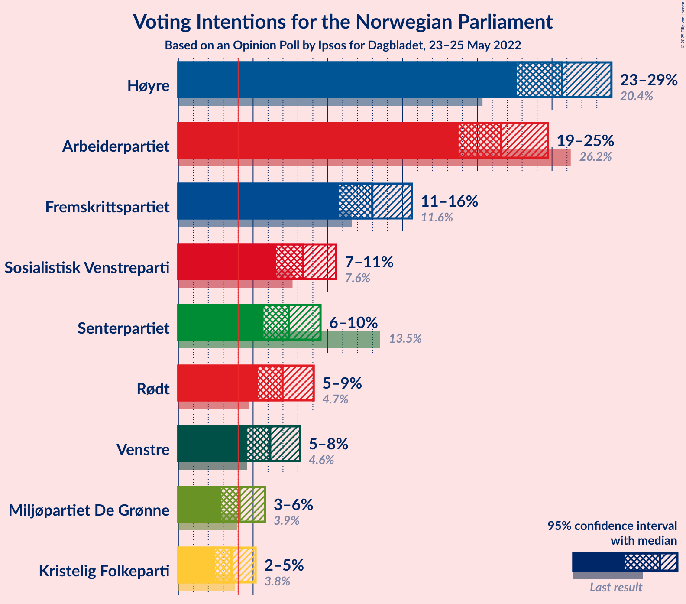

### Confidence Intervals

| Party | Last Result | Poll Result | 80% Confidence Interval | 90% Confidence Interval | 95% Confidence Interval | 99% Confidence Interval |
|:-----:|:-----------:|:-----------:|:-----------------------:|:-----------------------:|:-----------------------:|:-----------------------:|
| Høyre | 20.4% | 25.7% | 23.7–27.8% |23.1–28.4% |22.6–29.0% |21.7–30.0% |
| Arbeiderpartiet | 26.2% | 21.6% | 19.7–23.6% |19.2–24.2% |18.7–24.7% |17.9–25.7% |
| Fremskrittspartiet | 11.6% | 13.0% | 11.5–14.7% |11.1–15.2% |10.7–15.6% |10.1–16.5% |
| Sosialistisk Venstreparti | 7.6% | 8.3% | 7.1–9.8% |6.8–10.2% |6.5–10.6% |6.0–11.3% |
| Senterpartiet | 13.5% | 7.4% | 6.3–8.8% |6.0–9.2% |5.7–9.5% |5.2–10.2% |
| Rødt | 4.7% | 7.0% | 5.9–8.3% |5.6–8.7% |5.3–9.1% |4.9–9.7% |
| Venstre | 4.6% | 6.1% | 5.1–7.4% |4.9–7.8% |4.6–8.1% |4.2–8.8% |
| Miljøpartiet De Grønne | 3.9% | 4.1% | 3.3–5.2% |3.1–5.5% |2.9–5.8% |2.5–6.4% |
| Kristelig Folkeparti | 3.8% | 3.6% | 2.8–4.6% |2.6–4.9% |2.4–5.2% |2.1–5.7% |

*Note:* The poll result column reflects the actual value used in the calculations. Published results may vary slightly, and in addition be rounded to fewer digits.

## Seats

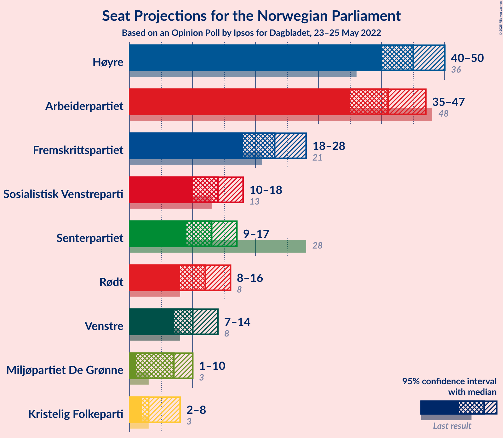

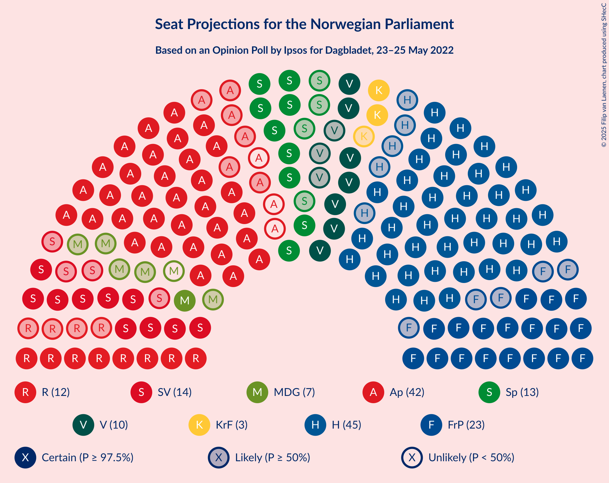

### Confidence Intervals

| Party | Last Result | Median | 80% Confidence Interval | 90% Confidence Interval | 95% Confidence Interval | 99% Confidence Interval |
|:-----:|:-----------:|:------:|:-----------------------:|:-----------------------:|:-----------------------:|:-----------------------:|
| <a href="#høyre">Høyre</a> | 36 | 45 | 42–48 |41–49 |40–50 |39–52 |
| <a href="#arbeiderpartiet">Arbeiderpartiet</a> | 48 | 41 | 36–45 |36–46 |35–47 |34–49 |
| <a href="#fremskrittspartiet">Fremskrittspartiet</a> | 21 | 23 | 20–26 |19–27 |18–28 |17–30 |
| <a href="#sosialistisk-venstreparti">Sosialistisk Venstreparti</a> | 13 | 14 | 11–17 |11–17 |10–18 |9–20 |
| <a href="#senterpartiet">Senterpartiet</a> | 28 | 13 | 10–15 |10–16 |9–17 |8–18 |
| <a href="#rødt">Rødt</a> | 8 | 12 | 9–14 |9–15 |8–16 |8–17 |
| <a href="#venstre">Venstre</a> | 8 | 10 | 8–13 |8–13 |7–14 |7–15 |
| <a href="#miljøpartiet-de-grønne">Miljøpartiet De Grønne</a> | 3 | 7 | 2–9 |2–9 |1–10 |1–11 |
| <a href="#kristelig-folkeparti">Kristelig Folkeparti</a> | 3 | 3 | 2–7 |2–8 |2–8 |0–9 |

### Høyre

*For a full overview of the results for this party, see the [Høyre](party-høyre.html) page.*

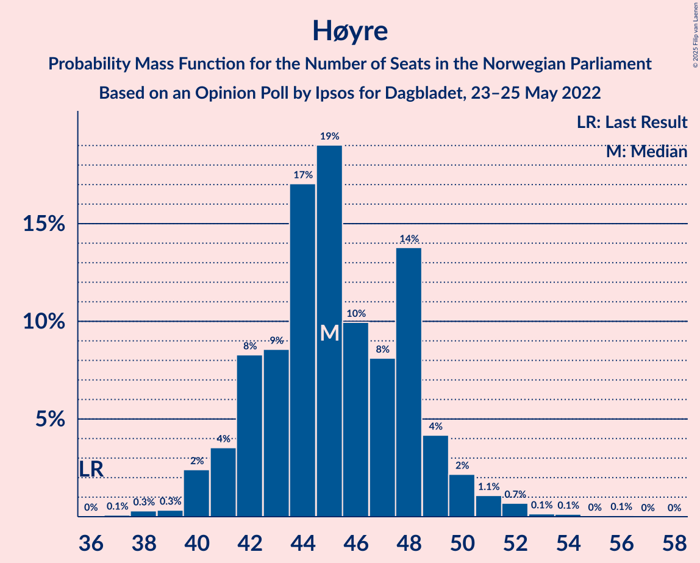

| Number of Seats | Probability | Accumulated | Special Marks |
|:---------------:|:-----------:|:-----------:|:-------------:|
| 36 | 0% | 100% | Last Result |
| 37 | 0.1% | 99.9% |  |
| 38 | 0.3% | 99.9% |  |
| 39 | 0.3% | 99.6% |  |
| 40 | 2% | 99.2% |  |
| 41 | 4% | 97% |  |
| 42 | 8% | 93% |  |
| 43 | 9% | 85% |  |
| 44 | 17% | 76% |  |
| 45 | 19% | 59% | Median |
| 46 | 10% | 40% |  |
| 47 | 8% | 30% |  |
| 48 | 14% | 22% |  |
| 49 | 4% | 9% |  |
| 50 | 2% | 4% |  |
| 51 | 1.1% | 2% |  |
| 52 | 0.7% | 1.1% |  |
| 53 | 0.1% | 0.4% |  |
| 54 | 0.1% | 0.2% |  |
| 55 | 0% | 0.1% |  |
| 56 | 0.1% | 0.1% |  |
| 57 | 0% | 0% |  |

### Arbeiderpartiet

*For a full overview of the results for this party, see the [Arbeiderpartiet](party-arbeiderpartiet.html) page.*

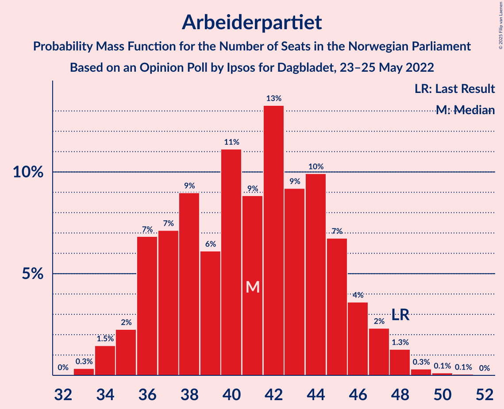

| Number of Seats | Probability | Accumulated | Special Marks |
|:---------------:|:-----------:|:-----------:|:-------------:|
| 32 | 0% | 100% |  |
| 33 | 0.3% | 99.9% |  |
| 34 | 1.5% | 99.6% |  |
| 35 | 2% | 98% |  |
| 36 | 7% | 96% |  |
| 37 | 7% | 89% |  |
| 38 | 9% | 82% |  |
| 39 | 6% | 73% |  |
| 40 | 11% | 67% |  |
| 41 | 9% | 56% | Median |
| 42 | 13% | 47% |  |
| 43 | 9% | 34% |  |
| 44 | 10% | 24% |  |
| 45 | 7% | 14% |  |
| 46 | 4% | 8% |  |
| 47 | 2% | 4% |  |
| 48 | 1.3% | 2% | Last Result |
| 49 | 0.3% | 0.5% |  |
| 50 | 0.1% | 0.2% |  |
| 51 | 0.1% | 0.1% |  |
| 52 | 0% | 0% |  |

### Fremskrittspartiet

*For a full overview of the results for this party, see the [Fremskrittspartiet](party-fremskrittspartiet.html) page.*

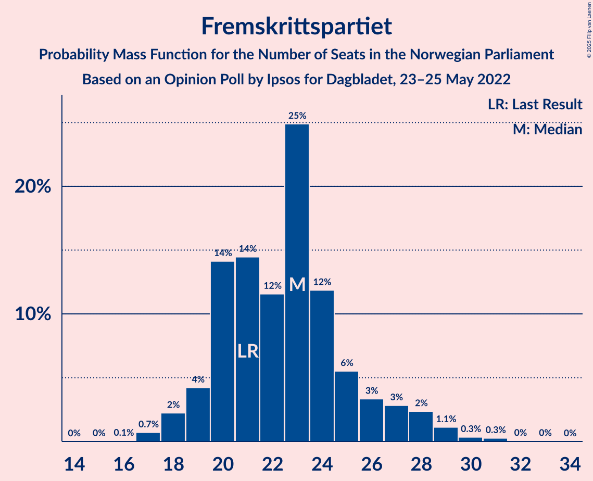

| Number of Seats | Probability | Accumulated | Special Marks |
|:---------------:|:-----------:|:-----------:|:-------------:|
| 16 | 0.1% | 100% |  |
| 17 | 0.7% | 99.9% |  |
| 18 | 2% | 99.2% |  |
| 19 | 4% | 97% |  |
| 20 | 14% | 93% |  |
| 21 | 14% | 79% | Last Result |
| 22 | 12% | 64% |  |
| 23 | 25% | 53% | Median |
| 24 | 12% | 28% |  |
| 25 | 6% | 16% |  |
| 26 | 3% | 10% |  |
| 27 | 3% | 7% |  |
| 28 | 2% | 4% |  |
| 29 | 1.1% | 2% |  |
| 30 | 0.3% | 0.7% |  |
| 31 | 0.3% | 0.3% |  |
| 32 | 0% | 0.1% |  |
| 33 | 0% | 0% |  |

### Sosialistisk Venstreparti

*For a full overview of the results for this party, see the [Sosialistisk Venstreparti](party-sosialistiskvenstreparti.html) page.*

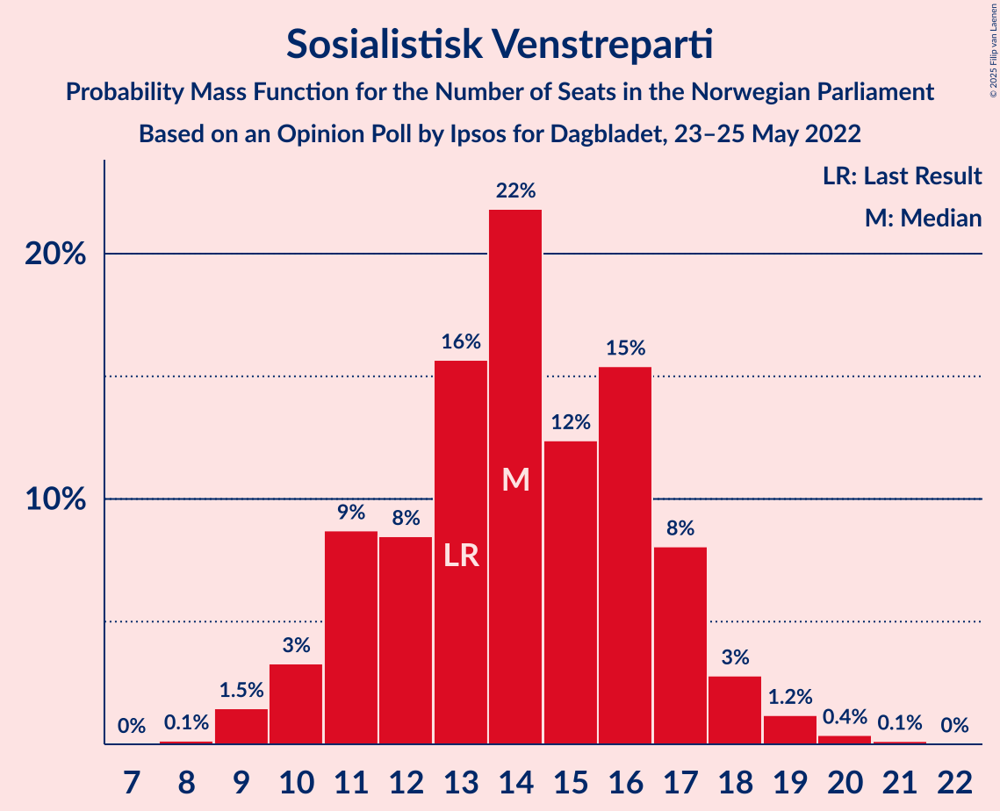

| Number of Seats | Probability | Accumulated | Special Marks |
|:---------------:|:-----------:|:-----------:|:-------------:|
| 8 | 0.1% | 100% |  |
| 9 | 1.5% | 99.8% |  |
| 10 | 3% | 98% |  |
| 11 | 9% | 95% |  |
| 12 | 8% | 86% |  |
| 13 | 16% | 78% | Last Result |
| 14 | 22% | 62% | Median |
| 15 | 12% | 40% |  |
| 16 | 15% | 28% |  |
| 17 | 8% | 13% |  |
| 18 | 3% | 5% |  |
| 19 | 1.2% | 2% |  |
| 20 | 0.4% | 0.5% |  |
| 21 | 0.1% | 0.2% |  |
| 22 | 0% | 0% |  |

### Senterpartiet

*For a full overview of the results for this party, see the [Senterpartiet](party-senterpartiet.html) page.*

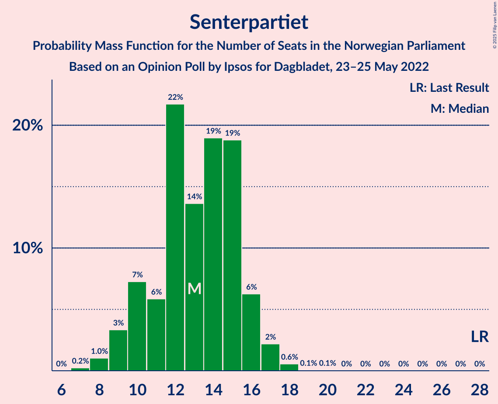

| Number of Seats | Probability | Accumulated | Special Marks |
|:---------------:|:-----------:|:-----------:|:-------------:|
| 7 | 0.2% | 100% |  |
| 8 | 1.0% | 99.8% |  |
| 9 | 3% | 98.7% |  |
| 10 | 7% | 95% |  |
| 11 | 6% | 88% |  |
| 12 | 22% | 82% |  |
| 13 | 14% | 61% | Median |
| 14 | 19% | 47% |  |
| 15 | 19% | 28% |  |
| 16 | 6% | 9% |  |
| 17 | 2% | 3% |  |
| 18 | 0.6% | 0.7% |  |
| 19 | 0.1% | 0.1% |  |
| 20 | 0.1% | 0.1% |  |
| 21 | 0% | 0% |  |
| 22 | 0% | 0% |  |
| 23 | 0% | 0% |  |
| 24 | 0% | 0% |  |
| 25 | 0% | 0% |  |
| 26 | 0% | 0% |  |
| 27 | 0% | 0% |  |
| 28 | 0% | 0% | Last Result |

### Rødt

*For a full overview of the results for this party, see the [Rødt](party-rødt.html) page.*

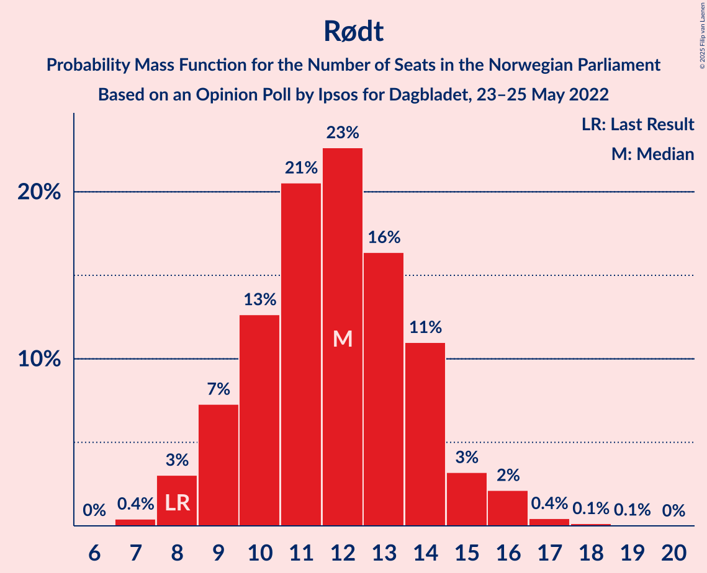

| Number of Seats | Probability | Accumulated | Special Marks |
|:---------------:|:-----------:|:-----------:|:-------------:|
| 7 | 0.4% | 100% |  |
| 8 | 3% | 99.5% | Last Result |
| 9 | 7% | 96% |  |
| 10 | 13% | 89% |  |
| 11 | 21% | 77% |  |
| 12 | 23% | 56% | Median |
| 13 | 16% | 33% |  |
| 14 | 11% | 17% |  |
| 15 | 3% | 6% |  |
| 16 | 2% | 3% |  |
| 17 | 0.4% | 0.7% |  |
| 18 | 0.1% | 0.2% |  |
| 19 | 0.1% | 0.1% |  |
| 20 | 0% | 0% |  |

### Venstre

*For a full overview of the results for this party, see the [Venstre](party-venstre.html) page.*

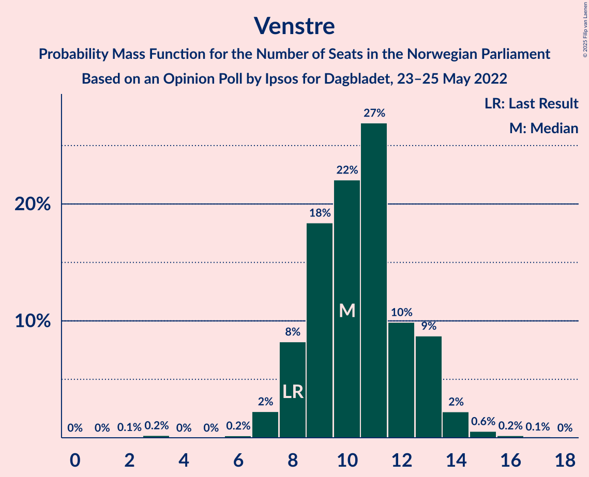

| Number of Seats | Probability | Accumulated | Special Marks |
|:---------------:|:-----------:|:-----------:|:-------------:|
| 2 | 0.1% | 100% |  |
| 3 | 0.2% | 99.9% |  |
| 4 | 0% | 99.7% |  |
| 5 | 0% | 99.7% |  |
| 6 | 0.2% | 99.7% |  |
| 7 | 2% | 99.6% |  |
| 8 | 8% | 97% | Last Result |
| 9 | 18% | 89% |  |
| 10 | 22% | 71% | Median |
| 11 | 27% | 49% |  |
| 12 | 10% | 22% |  |
| 13 | 9% | 12% |  |
| 14 | 2% | 3% |  |
| 15 | 0.6% | 0.9% |  |
| 16 | 0.2% | 0.3% |  |
| 17 | 0.1% | 0.1% |  |
| 18 | 0% | 0% |  |

### Miljøpartiet De Grønne

*For a full overview of the results for this party, see the [Miljøpartiet De Grønne](party-miljøpartietdegrønne.html) page.*

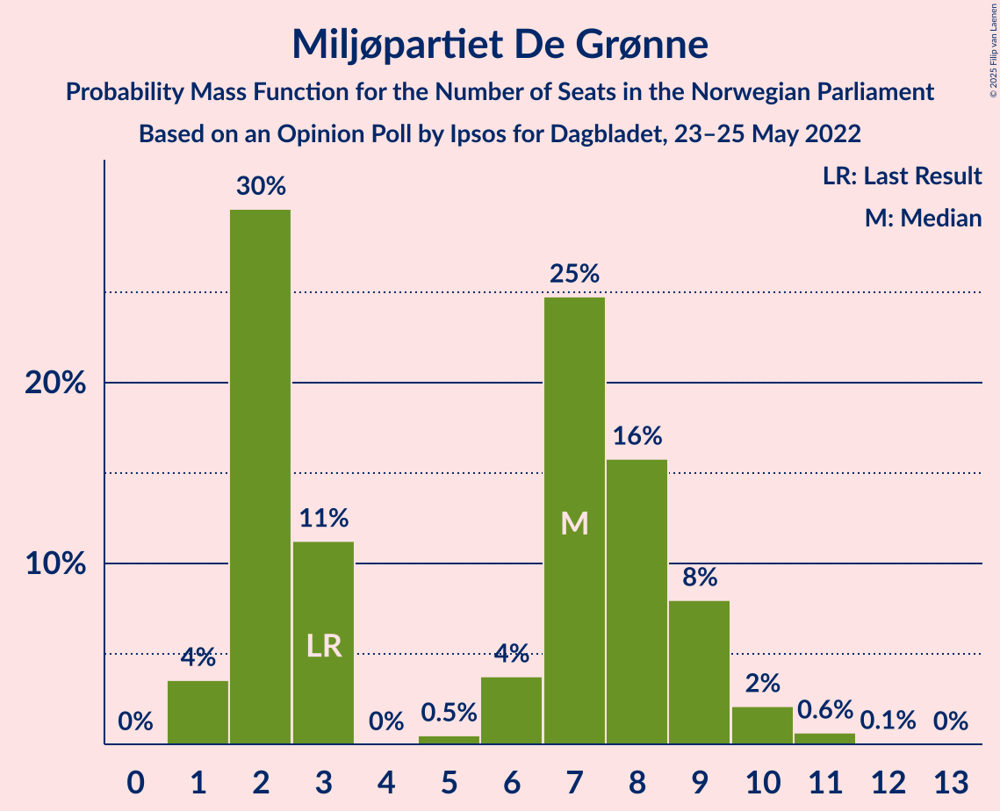

| Number of Seats | Probability | Accumulated | Special Marks |
|:---------------:|:-----------:|:-----------:|:-------------:|
| 1 | 4% | 100% |  |
| 2 | 30% | 96% |  |
| 3 | 11% | 67% | Last Result |
| 4 | 0% | 56% |  |
| 5 | 0.5% | 56% |  |
| 6 | 4% | 55% |  |
| 7 | 25% | 51% | Median |
| 8 | 16% | 27% |  |
| 9 | 8% | 11% |  |
| 10 | 2% | 3% |  |
| 11 | 0.6% | 0.7% |  |
| 12 | 0.1% | 0.1% |  |
| 13 | 0% | 0% |  |

### Kristelig Folkeparti

*For a full overview of the results for this party, see the [Kristelig Folkeparti](party-kristeligfolkeparti.html) page.*

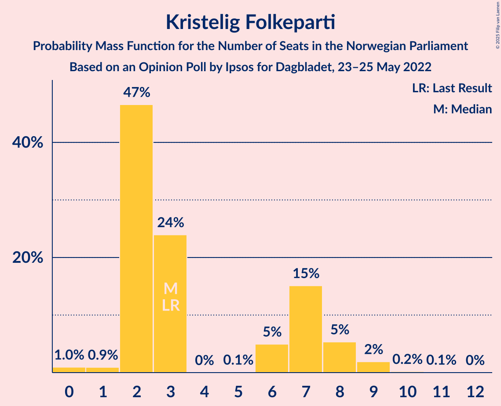

| Number of Seats | Probability | Accumulated | Special Marks |
|:---------------:|:-----------:|:-----------:|:-------------:|
| 0 | 1.0% | 100% |  |
| 1 | 0.9% | 99.0% |  |
| 2 | 47% | 98% |  |
| 3 | 24% | 52% | Last Result, Median |
| 4 | 0% | 28% |  |
| 5 | 0.1% | 28% |  |
| 6 | 5% | 28% |  |
| 7 | 15% | 23% |  |
| 8 | 5% | 7% |  |
| 9 | 2% | 2% |  |
| 10 | 0.2% | 0.3% |  |
| 11 | 0.1% | 0.1% |  |
| 12 | 0% | 0% |  |

## Coalitions

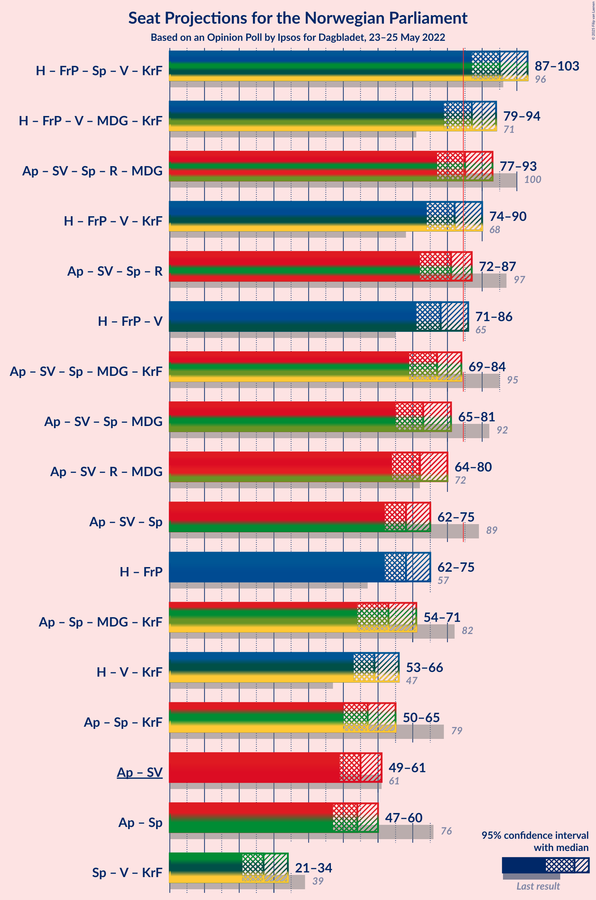

### Confidence Intervals

| Coalition | Last Result | Median | Majority? | 80% Confidence Interval | 90% Confidence Interval | 95% Confidence Interval | 99% Confidence Interval |
|:---------:|:-----------:|:------:|:---------:|:-----------------------:|:-----------------------:|:-----------------------:|:-----------------------:|
| Høyre – Fremskrittspartiet – Senterpartiet – Venstre – Kristelig Folkeparti | 96 | 95 | 99.6% | 90–100 | 88–101 | 87–103 | 85–105 |
| Høyre – Fremskrittspartiet – Venstre – Miljøpartiet De Grønne – Kristelig Folkeparti | 71 | 87 | 79% | 82–92 | 81–93 | 79–94 | 77–97 |
| Arbeiderpartiet – Sosialistisk Venstreparti – Senterpartiet – Rødt – Miljøpartiet De Grønne | 100 | 85 | 52% | 80–90 | 78–91 | 77–93 | 74–94 |
| Høyre – Fremskrittspartiet – Venstre – Kristelig Folkeparti | 68 | 82 | 21% | 77–87 | 76–88 | 74–90 | 72–92 |
| Arbeiderpartiet – Sosialistisk Venstreparti – Senterpartiet – Rødt | 97 | 81 | 10% | 75–84 | 74–86 | 72–87 | 70–89 |
| Høyre – Fremskrittspartiet – Venstre | 65 | 78 | 4% | 74–82 | 72–84 | 71–86 | 69–89 |
| Arbeiderpartiet – Sosialistisk Venstreparti – Senterpartiet – Miljøpartiet De Grønne – Kristelig Folkeparti | 95 | 77 | 2% | 72–82 | 70–83 | 69–84 | 67–87 |
| Arbeiderpartiet – Sosialistisk Venstreparti – Senterpartiet – Miljøpartiet De Grønne | 92 | 73 | 0.1% | 68–78 | 66–80 | 65–81 | 64–83 |
| Arbeiderpartiet – Sosialistisk Venstreparti – Rødt – Miljøpartiet De Grønne | 72 | 72 | 0.1% | 67–77 | 65–79 | 64–80 | 62–81 |
| Arbeiderpartiet – Sosialistisk Venstreparti – Senterpartiet | 89 | 68 | 0% | 63–72 | 63–74 | 62–75 | 59–76 |
| Høyre – Fremskrittspartiet | 57 | 68 | 0% | 63–71 | 62–73 | 62–75 | 59–77 |
| Arbeiderpartiet – Senterpartiet – Miljøpartiet De Grønne – Kristelig Folkeparti | 82 | 63 | 0% | 58–69 | 56–70 | 54–71 | 52–74 |
| Høyre – Venstre – Kristelig Folkeparti | 47 | 59 | 0% | 55–64 | 54–65 | 53–66 | 51–68 |
| Arbeiderpartiet – Senterpartiet – Kristelig Folkeparti | 79 | 57 | 0% | 53–63 | 52–64 | 50–65 | 49–68 |
| Arbeiderpartiet – Sosialistisk Venstreparti | 61 | 55 | 0% | 50–60 | 49–61 | 49–61 | 47–63 |
| Arbeiderpartiet – Senterpartiet | 76 | 54 | 0% | 50–59 | 48–59 | 47–60 | 46–62 |
| Senterpartiet – Venstre – Kristelig Folkeparti | 39 | 27 | 0% | 24–31 | 23–32 | 21–34 | 19–36 |

### Høyre – Fremskrittspartiet – Senterpartiet – Venstre – Kristelig Folkeparti

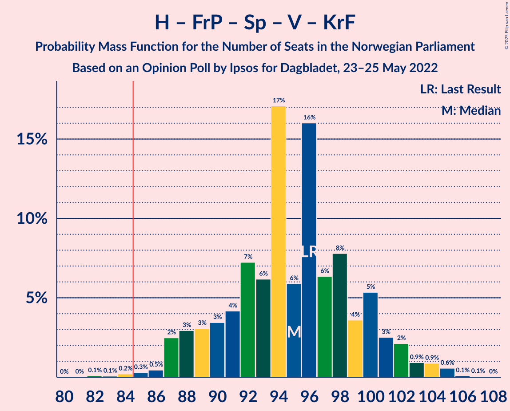

| Number of Seats | Probability | Accumulated | Special Marks |
|:---------------:|:-----------:|:-----------:|:-------------:|
| 82 | 0.1% | 100% |  |
| 83 | 0.1% | 99.9% |  |
| 84 | 0.2% | 99.8% |  |
| 85 | 0.3% | 99.6% | Majority |
| 86 | 0.5% | 99.3% |  |
| 87 | 2% | 98.8% |  |
| 88 | 3% | 96% |  |
| 89 | 3% | 93% |  |
| 90 | 3% | 90% |  |
| 91 | 4% | 87% |  |
| 92 | 7% | 83% |  |
| 93 | 6% | 75% |  |
| 94 | 17% | 69% | Median |
| 95 | 6% | 52% |  |
| 96 | 16% | 46% | Last Result |
| 97 | 6% | 30% |  |
| 98 | 8% | 24% |  |
| 99 | 4% | 16% |  |
| 100 | 5% | 13% |  |
| 101 | 3% | 7% |  |
| 102 | 2% | 5% |  |
| 103 | 0.9% | 3% |  |
| 104 | 0.9% | 2% |  |
| 105 | 0.6% | 0.8% |  |
| 106 | 0.1% | 0.2% |  |
| 107 | 0.1% | 0.1% |  |
| 108 | 0% | 0% |  |

### Høyre – Fremskrittspartiet – Venstre – Miljøpartiet De Grønne – Kristelig Folkeparti

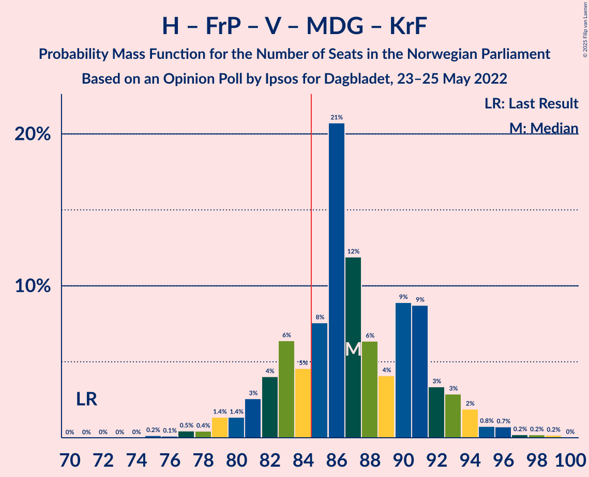

| Number of Seats | Probability | Accumulated | Special Marks |
|:---------------:|:-----------:|:-----------:|:-------------:|
| 71 | 0% | 100% | Last Result |
| 72 | 0% | 100% |  |
| 73 | 0% | 100% |  |
| 74 | 0% | 100% |  |
| 75 | 0.2% | 100% |  |
| 76 | 0.1% | 99.8% |  |
| 77 | 0.5% | 99.7% |  |
| 78 | 0.4% | 99.2% |  |
| 79 | 1.4% | 98.8% |  |
| 80 | 1.4% | 97% |  |
| 81 | 3% | 96% |  |
| 82 | 4% | 94% |  |
| 83 | 6% | 89% |  |
| 84 | 5% | 83% |  |
| 85 | 8% | 79% | Majority |
| 86 | 21% | 71% |  |
| 87 | 12% | 50% |  |
| 88 | 6% | 38% | Median |
| 89 | 4% | 32% |  |
| 90 | 9% | 28% |  |
| 91 | 9% | 19% |  |
| 92 | 3% | 10% |  |
| 93 | 3% | 7% |  |
| 94 | 2% | 4% |  |
| 95 | 0.8% | 2% |  |
| 96 | 0.7% | 1.4% |  |
| 97 | 0.2% | 0.6% |  |
| 98 | 0.2% | 0.4% |  |
| 99 | 0.2% | 0.2% |  |
| 100 | 0% | 0% |  |

### Arbeiderpartiet – Sosialistisk Venstreparti – Senterpartiet – Rødt – Miljøpartiet De Grønne

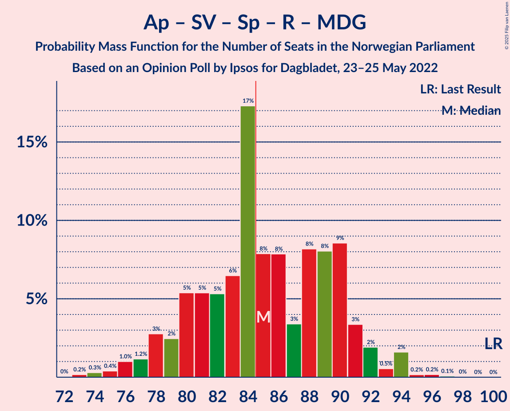

| Number of Seats | Probability | Accumulated | Special Marks |
|:---------------:|:-----------:|:-----------:|:-------------:|
| 72 | 0% | 100% |  |
| 73 | 0.2% | 99.9% |  |
| 74 | 0.3% | 99.7% |  |
| 75 | 0.4% | 99.4% |  |
| 76 | 1.0% | 99.1% |  |
| 77 | 1.2% | 98% |  |
| 78 | 3% | 97% |  |
| 79 | 2% | 94% |  |
| 80 | 5% | 92% |  |
| 81 | 5% | 86% |  |
| 82 | 5% | 81% |  |
| 83 | 6% | 76% |  |
| 84 | 17% | 69% |  |
| 85 | 8% | 52% | Majority |
| 86 | 8% | 44% |  |
| 87 | 3% | 36% | Median |
| 88 | 8% | 33% |  |
| 89 | 8% | 24% |  |
| 90 | 9% | 16% |  |
| 91 | 3% | 8% |  |
| 92 | 2% | 5% |  |
| 93 | 0.5% | 3% |  |
| 94 | 2% | 2% |  |
| 95 | 0.2% | 0.4% |  |
| 96 | 0.2% | 0.3% |  |
| 97 | 0.1% | 0.1% |  |
| 98 | 0% | 0% |  |
| 99 | 0% | 0% |  |
| 100 | 0% | 0% | Last Result |

### Høyre – Fremskrittspartiet – Venstre – Kristelig Folkeparti

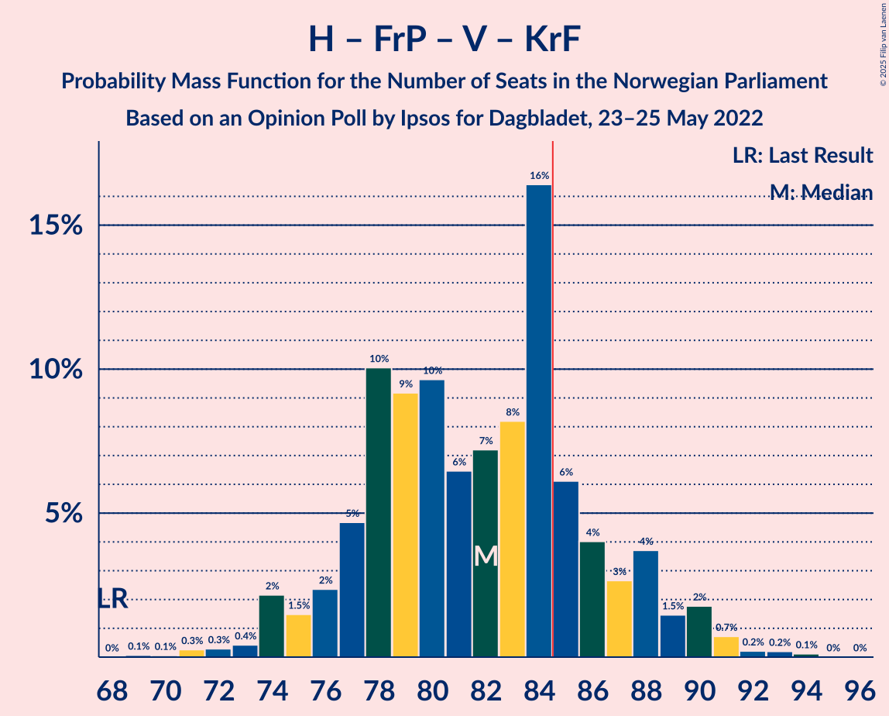

| Number of Seats | Probability | Accumulated | Special Marks |
|:---------------:|:-----------:|:-----------:|:-------------:|
| 68 | 0% | 100% | Last Result |
| 69 | 0.1% | 100% |  |
| 70 | 0.1% | 99.9% |  |
| 71 | 0.3% | 99.9% |  |
| 72 | 0.3% | 99.6% |  |
| 73 | 0.4% | 99.3% |  |
| 74 | 2% | 98.9% |  |
| 75 | 1.5% | 97% |  |
| 76 | 2% | 95% |  |
| 77 | 5% | 93% |  |
| 78 | 10% | 88% |  |
| 79 | 9% | 78% |  |
| 80 | 10% | 69% |  |
| 81 | 6% | 59% | Median |
| 82 | 7% | 53% |  |
| 83 | 8% | 46% |  |
| 84 | 16% | 37% |  |
| 85 | 6% | 21% | Majority |
| 86 | 4% | 15% |  |
| 87 | 3% | 11% |  |
| 88 | 4% | 8% |  |
| 89 | 1.5% | 5% |  |
| 90 | 2% | 3% |  |
| 91 | 0.7% | 1.3% |  |
| 92 | 0.2% | 0.6% |  |
| 93 | 0.2% | 0.3% |  |
| 94 | 0.1% | 0.1% |  |
| 95 | 0% | 0% |  |

### Arbeiderpartiet – Sosialistisk Venstreparti – Senterpartiet – Rødt

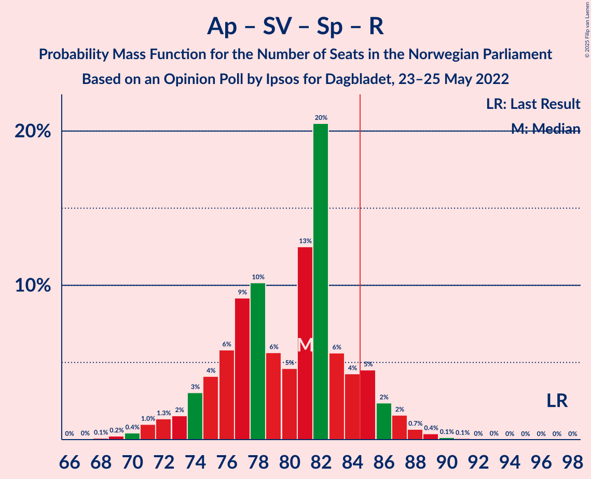

| Number of Seats | Probability | Accumulated | Special Marks |
|:---------------:|:-----------:|:-----------:|:-------------:|
| 67 | 0% | 100% |  |
| 68 | 0.1% | 99.9% |  |
| 69 | 0.2% | 99.8% |  |
| 70 | 0.4% | 99.6% |  |
| 71 | 1.0% | 99.2% |  |
| 72 | 1.3% | 98% |  |
| 73 | 2% | 97% |  |
| 74 | 3% | 95% |  |
| 75 | 4% | 92% |  |
| 76 | 6% | 88% |  |
| 77 | 9% | 82% |  |
| 78 | 10% | 73% |  |
| 79 | 6% | 63% |  |
| 80 | 5% | 57% | Median |
| 81 | 13% | 53% |  |
| 82 | 20% | 40% |  |
| 83 | 6% | 20% |  |
| 84 | 4% | 14% |  |
| 85 | 5% | 10% | Majority |
| 86 | 2% | 5% |  |
| 87 | 2% | 3% |  |
| 88 | 0.7% | 1.3% |  |
| 89 | 0.4% | 0.7% |  |
| 90 | 0.1% | 0.3% |  |
| 91 | 0.1% | 0.1% |  |
| 92 | 0% | 0.1% |  |
| 93 | 0% | 0% |  |
| 94 | 0% | 0% |  |
| 95 | 0% | 0% |  |
| 96 | 0% | 0% |  |
| 97 | 0% | 0% | Last Result |

### Høyre – Fremskrittspartiet – Venstre

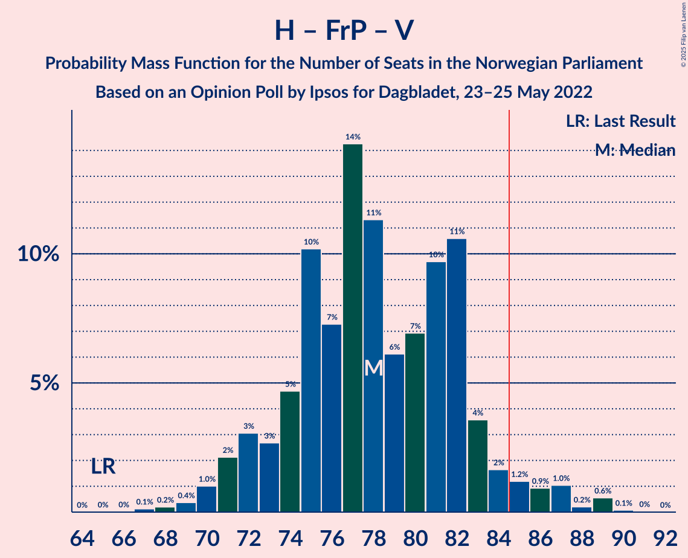

| Number of Seats | Probability | Accumulated | Special Marks |
|:---------------:|:-----------:|:-----------:|:-------------:|
| 65 | 0% | 100% | Last Result |
| 66 | 0% | 100% |  |
| 67 | 0.1% | 100% |  |
| 68 | 0.2% | 99.8% |  |
| 69 | 0.4% | 99.6% |  |
| 70 | 1.0% | 99.3% |  |
| 71 | 2% | 98% |  |
| 72 | 3% | 96% |  |
| 73 | 3% | 93% |  |
| 74 | 5% | 90% |  |
| 75 | 10% | 86% |  |
| 76 | 7% | 75% |  |
| 77 | 14% | 68% |  |
| 78 | 11% | 54% | Median |
| 79 | 6% | 43% |  |
| 80 | 7% | 37% |  |
| 81 | 10% | 30% |  |
| 82 | 11% | 20% |  |
| 83 | 4% | 9% |  |
| 84 | 2% | 6% |  |
| 85 | 1.2% | 4% | Majority |
| 86 | 0.9% | 3% |  |
| 87 | 1.0% | 2% |  |
| 88 | 0.2% | 0.9% |  |
| 89 | 0.6% | 0.7% |  |
| 90 | 0.1% | 0.1% |  |
| 91 | 0% | 0% |  |

### Arbeiderpartiet – Sosialistisk Venstreparti – Senterpartiet – Miljøpartiet De Grønne – Kristelig Folkeparti

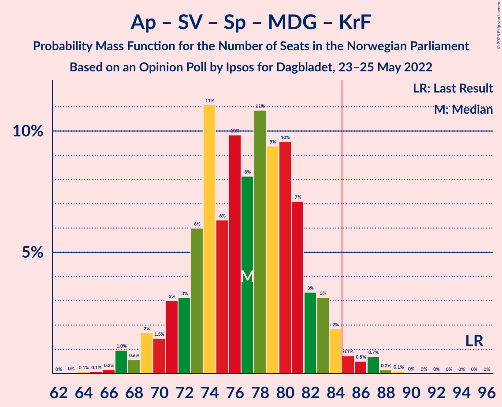

| Number of Seats | Probability | Accumulated | Special Marks |
|:---------------:|:-----------:|:-----------:|:-------------:|
| 64 | 0.1% | 100% |  |
| 65 | 0.1% | 99.9% |  |
| 66 | 0.2% | 99.8% |  |
| 67 | 1.0% | 99.7% |  |
| 68 | 0.6% | 98.7% |  |
| 69 | 2% | 98% |  |
| 70 | 1.5% | 96% |  |
| 71 | 3% | 95% |  |
| 72 | 3% | 92% |  |
| 73 | 6% | 89% |  |
| 74 | 11% | 83% |  |
| 75 | 6% | 72% |  |
| 76 | 10% | 65% |  |
| 77 | 8% | 56% |  |
| 78 | 11% | 47% | Median |
| 79 | 9% | 37% |  |
| 80 | 10% | 27% |  |
| 81 | 7% | 18% |  |
| 82 | 3% | 11% |  |
| 83 | 3% | 7% |  |
| 84 | 2% | 4% |  |
| 85 | 0.7% | 2% | Majority |
| 86 | 0.5% | 1.5% |  |
| 87 | 0.7% | 1.0% |  |
| 88 | 0.2% | 0.3% |  |
| 89 | 0.1% | 0.1% |  |
| 90 | 0% | 0% |  |
| 91 | 0% | 0% |  |
| 92 | 0% | 0% |  |
| 93 | 0% | 0% |  |
| 94 | 0% | 0% |  |
| 95 | 0% | 0% | Last Result |

### Arbeiderpartiet – Sosialistisk Venstreparti – Senterpartiet – Miljøpartiet De Grønne

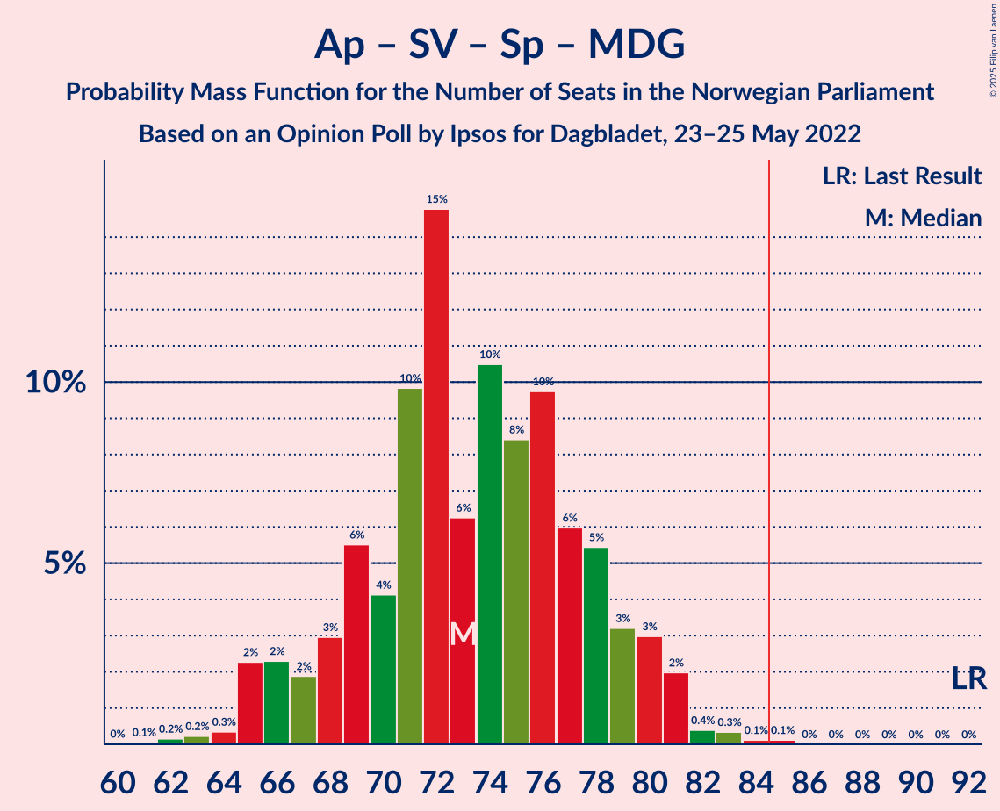

| Number of Seats | Probability | Accumulated | Special Marks |
|:---------------:|:-----------:|:-----------:|:-------------:|
| 61 | 0.1% | 100% |  |
| 62 | 0.2% | 99.9% |  |
| 63 | 0.2% | 99.7% |  |
| 64 | 0.3% | 99.5% |  |
| 65 | 2% | 99.2% |  |
| 66 | 2% | 97% |  |
| 67 | 2% | 95% |  |
| 68 | 3% | 93% |  |
| 69 | 6% | 90% |  |
| 70 | 4% | 84% |  |
| 71 | 10% | 80% |  |
| 72 | 15% | 70% |  |
| 73 | 6% | 55% |  |
| 74 | 10% | 49% |  |
| 75 | 8% | 39% | Median |
| 76 | 10% | 30% |  |
| 77 | 6% | 21% |  |
| 78 | 5% | 15% |  |
| 79 | 3% | 9% |  |
| 80 | 3% | 6% |  |
| 81 | 2% | 3% |  |
| 82 | 0.4% | 1.0% |  |
| 83 | 0.3% | 0.6% |  |
| 84 | 0.1% | 0.3% |  |
| 85 | 0.1% | 0.1% | Majority |
| 86 | 0% | 0% |  |
| 87 | 0% | 0% |  |
| 88 | 0% | 0% |  |
| 89 | 0% | 0% |  |
| 90 | 0% | 0% |  |
| 91 | 0% | 0% |  |
| 92 | 0% | 0% | Last Result |

### Arbeiderpartiet – Sosialistisk Venstreparti – Rødt – Miljøpartiet De Grønne

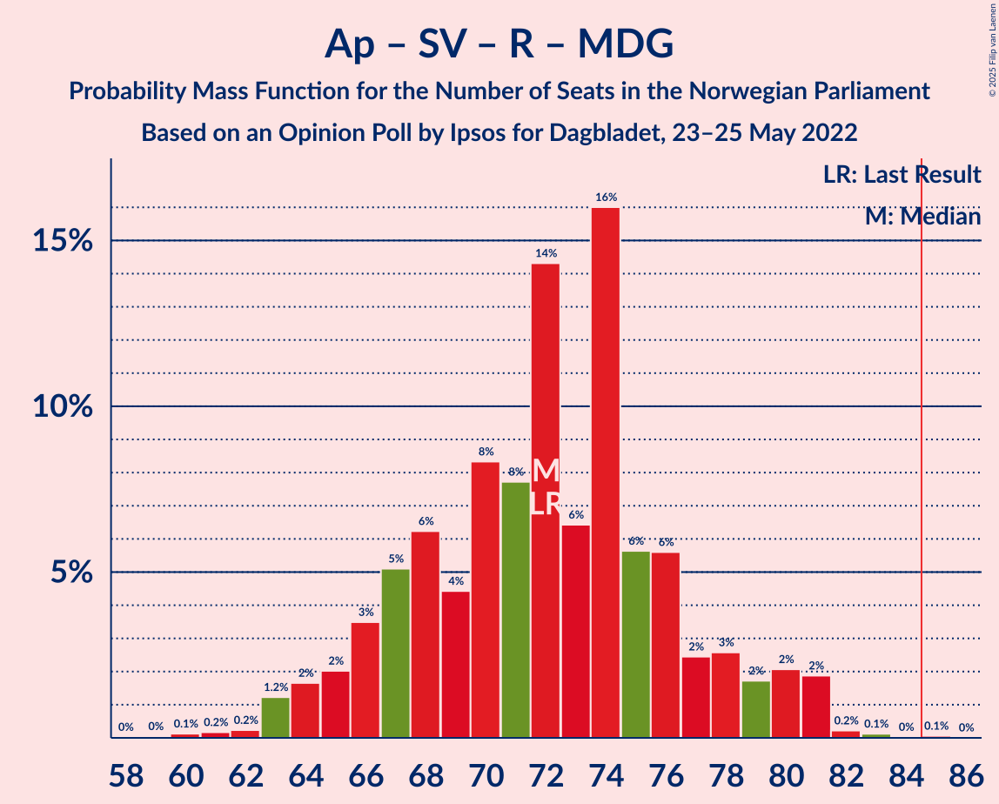

| Number of Seats | Probability | Accumulated | Special Marks |
|:---------------:|:-----------:|:-----------:|:-------------:|
| 59 | 0% | 100% |  |
| 60 | 0.1% | 99.9% |  |
| 61 | 0.2% | 99.8% |  |
| 62 | 0.2% | 99.6% |  |
| 63 | 1.2% | 99.4% |  |
| 64 | 2% | 98% |  |
| 65 | 2% | 96% |  |
| 66 | 3% | 94% |  |
| 67 | 5% | 91% |  |
| 68 | 6% | 86% |  |
| 69 | 4% | 80% |  |
| 70 | 8% | 75% |  |
| 71 | 8% | 67% |  |
| 72 | 14% | 59% | Last Result |
| 73 | 6% | 45% |  |
| 74 | 16% | 38% | Median |
| 75 | 6% | 22% |  |
| 76 | 6% | 17% |  |
| 77 | 2% | 11% |  |
| 78 | 3% | 9% |  |
| 79 | 2% | 6% |  |
| 80 | 2% | 4% |  |
| 81 | 2% | 2% |  |
| 82 | 0.2% | 0.4% |  |
| 83 | 0.1% | 0.2% |  |
| 84 | 0% | 0.1% |  |
| 85 | 0.1% | 0.1% | Majority |
| 86 | 0% | 0% |  |

### Arbeiderpartiet – Sosialistisk Venstreparti – Senterpartiet

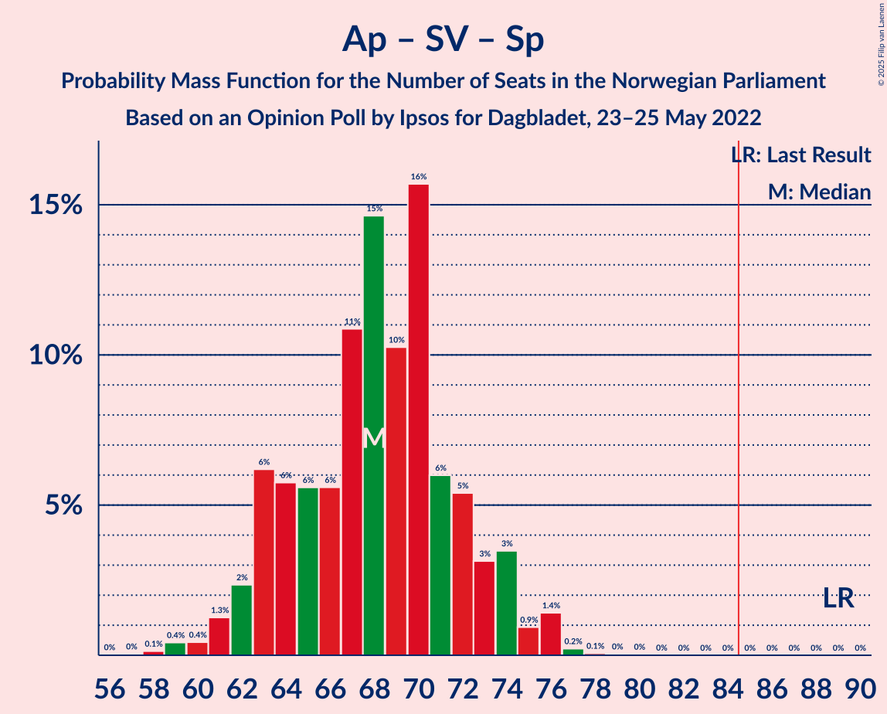

| Number of Seats | Probability | Accumulated | Special Marks |
|:---------------:|:-----------:|:-----------:|:-------------:|
| 57 | 0% | 100% |  |
| 58 | 0.1% | 99.9% |  |
| 59 | 0.4% | 99.8% |  |
| 60 | 0.4% | 99.4% |  |
| 61 | 1.3% | 98.9% |  |
| 62 | 2% | 98% |  |
| 63 | 6% | 95% |  |
| 64 | 6% | 89% |  |
| 65 | 6% | 83% |  |
| 66 | 6% | 78% |  |
| 67 | 11% | 72% |  |
| 68 | 15% | 61% | Median |
| 69 | 10% | 47% |  |
| 70 | 16% | 36% |  |
| 71 | 6% | 21% |  |
| 72 | 5% | 15% |  |
| 73 | 3% | 9% |  |
| 74 | 3% | 6% |  |
| 75 | 0.9% | 3% |  |
| 76 | 1.4% | 2% |  |
| 77 | 0.2% | 0.4% |  |
| 78 | 0.1% | 0.2% |  |
| 79 | 0% | 0.1% |  |
| 80 | 0% | 0% |  |
| 81 | 0% | 0% |  |
| 82 | 0% | 0% |  |
| 83 | 0% | 0% |  |
| 84 | 0% | 0% |  |
| 85 | 0% | 0% | Majority |
| 86 | 0% | 0% |  |
| 87 | 0% | 0% |  |
| 88 | 0% | 0% |  |
| 89 | 0% | 0% | Last Result |

### Høyre – Fremskrittspartiet

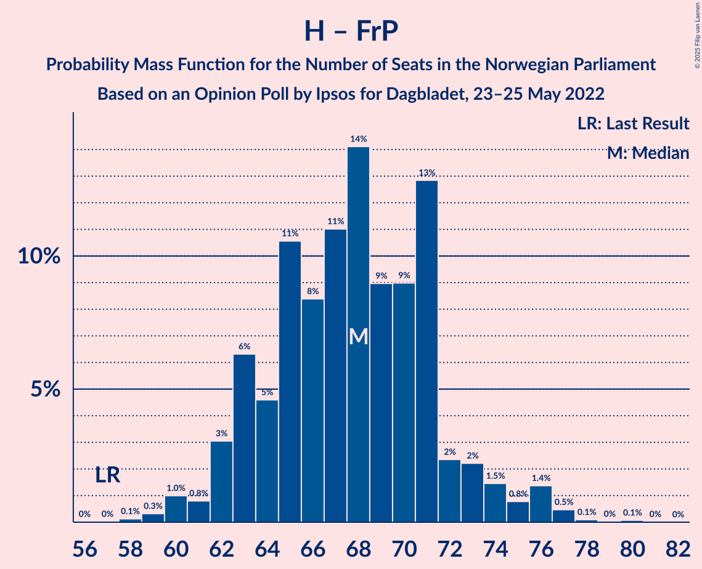

| Number of Seats | Probability | Accumulated | Special Marks |
|:---------------:|:-----------:|:-----------:|:-------------:|
| 57 | 0% | 100% | Last Result |
| 58 | 0.1% | 99.9% |  |
| 59 | 0.3% | 99.8% |  |
| 60 | 1.0% | 99.5% |  |
| 61 | 0.8% | 98% |  |
| 62 | 3% | 98% |  |
| 63 | 6% | 95% |  |
| 64 | 5% | 88% |  |
| 65 | 11% | 84% |  |
| 66 | 8% | 73% |  |
| 67 | 11% | 65% |  |
| 68 | 14% | 54% | Median |
| 69 | 9% | 40% |  |
| 70 | 9% | 31% |  |
| 71 | 13% | 22% |  |
| 72 | 2% | 9% |  |
| 73 | 2% | 7% |  |
| 74 | 1.5% | 4% |  |
| 75 | 0.8% | 3% |  |
| 76 | 1.4% | 2% |  |
| 77 | 0.5% | 0.7% |  |
| 78 | 0.1% | 0.2% |  |
| 79 | 0% | 0.1% |  |
| 80 | 0.1% | 0.1% |  |
| 81 | 0% | 0% |  |

### Arbeiderpartiet – Senterpartiet – Miljøpartiet De Grønne – Kristelig Folkeparti

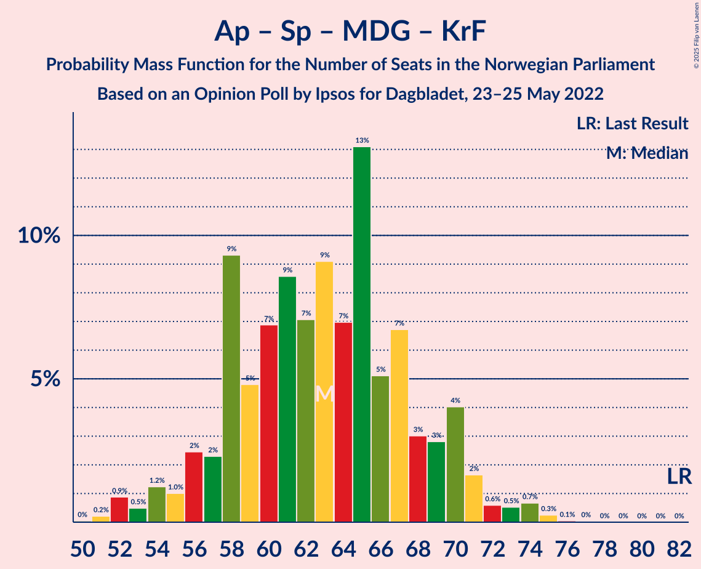

| Number of Seats | Probability | Accumulated | Special Marks |
|:---------------:|:-----------:|:-----------:|:-------------:|
| 50 | 0% | 100% |  |
| 51 | 0.2% | 99.9% |  |
| 52 | 0.9% | 99.7% |  |
| 53 | 0.5% | 98.8% |  |
| 54 | 1.2% | 98% |  |
| 55 | 1.0% | 97% |  |
| 56 | 2% | 96% |  |
| 57 | 2% | 94% |  |
| 58 | 9% | 91% |  |
| 59 | 5% | 82% |  |
| 60 | 7% | 77% |  |
| 61 | 9% | 70% |  |
| 62 | 7% | 62% |  |
| 63 | 9% | 55% |  |
| 64 | 7% | 46% | Median |
| 65 | 13% | 39% |  |
| 66 | 5% | 25% |  |
| 67 | 7% | 20% |  |
| 68 | 3% | 14% |  |
| 69 | 3% | 11% |  |
| 70 | 4% | 8% |  |
| 71 | 2% | 4% |  |
| 72 | 0.6% | 2% |  |
| 73 | 0.5% | 2% |  |
| 74 | 0.7% | 1.0% |  |
| 75 | 0.3% | 0.4% |  |
| 76 | 0.1% | 0.1% |  |
| 77 | 0% | 0.1% |  |
| 78 | 0% | 0% |  |
| 79 | 0% | 0% |  |
| 80 | 0% | 0% |  |
| 81 | 0% | 0% |  |
| 82 | 0% | 0% | Last Result |

### Høyre – Venstre – Kristelig Folkeparti

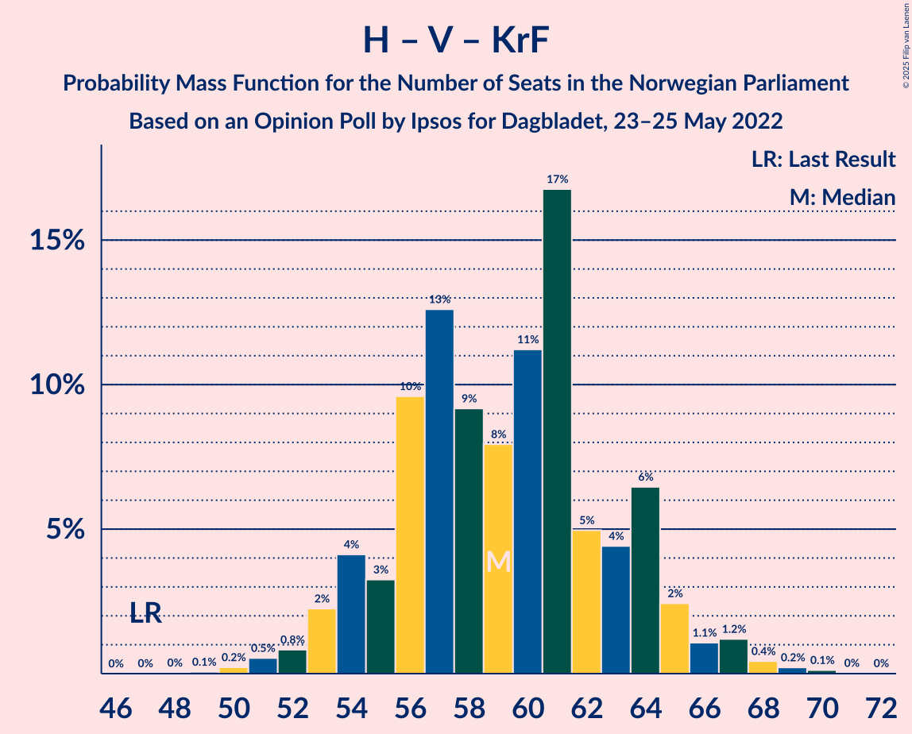

| Number of Seats | Probability | Accumulated | Special Marks |
|:---------------:|:-----------:|:-----------:|:-------------:|
| 47 | 0% | 100% | Last Result |
| 48 | 0% | 100% |  |
| 49 | 0.1% | 99.9% |  |
| 50 | 0.2% | 99.9% |  |
| 51 | 0.5% | 99.7% |  |
| 52 | 0.8% | 99.1% |  |
| 53 | 2% | 98% |  |
| 54 | 4% | 96% |  |
| 55 | 3% | 92% |  |
| 56 | 10% | 89% |  |
| 57 | 13% | 79% |  |
| 58 | 9% | 66% | Median |
| 59 | 8% | 57% |  |
| 60 | 11% | 49% |  |
| 61 | 17% | 38% |  |
| 62 | 5% | 21% |  |
| 63 | 4% | 16% |  |
| 64 | 6% | 12% |  |
| 65 | 2% | 6% |  |
| 66 | 1.1% | 3% |  |
| 67 | 1.2% | 2% |  |
| 68 | 0.4% | 0.8% |  |
| 69 | 0.2% | 0.4% |  |
| 70 | 0.1% | 0.2% |  |
| 71 | 0% | 0% |  |

### Arbeiderpartiet – Senterpartiet – Kristelig Folkeparti

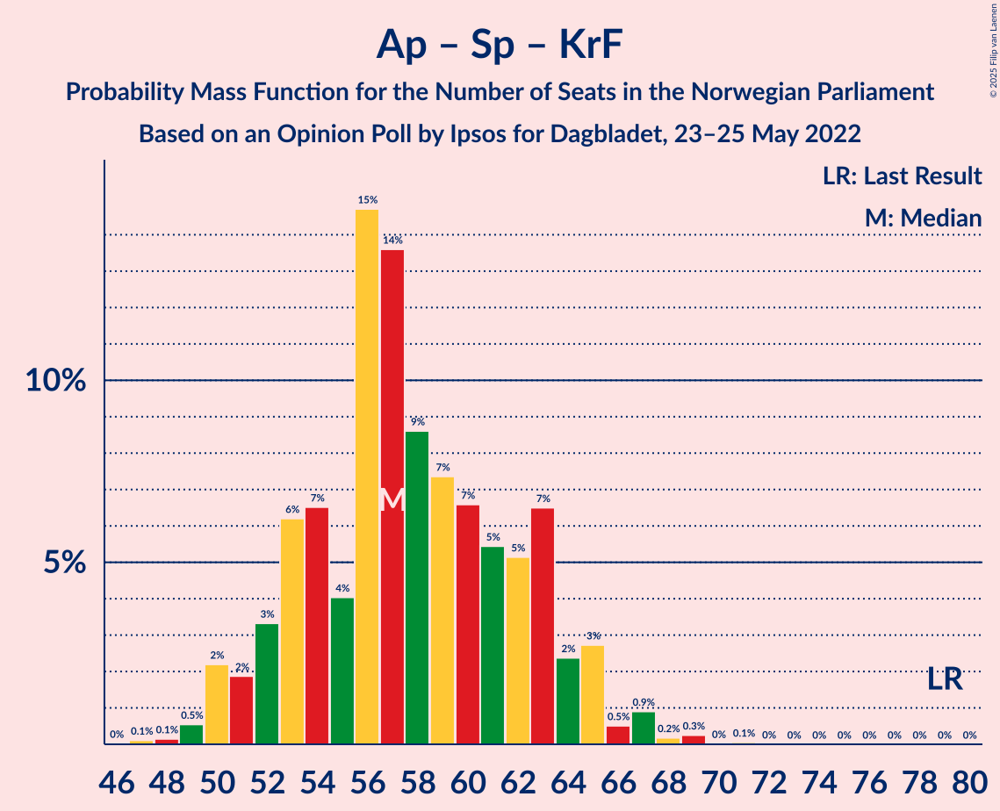

| Number of Seats | Probability | Accumulated | Special Marks |
|:---------------:|:-----------:|:-----------:|:-------------:|
| 47 | 0.1% | 100% |  |
| 48 | 0.1% | 99.9% |  |
| 49 | 0.5% | 99.7% |  |
| 50 | 2% | 99.2% |  |
| 51 | 2% | 97% |  |
| 52 | 3% | 95% |  |
| 53 | 6% | 92% |  |
| 54 | 7% | 86% |  |
| 55 | 4% | 79% |  |
| 56 | 15% | 75% |  |
| 57 | 14% | 60% | Median |
| 58 | 9% | 47% |  |
| 59 | 7% | 38% |  |
| 60 | 7% | 31% |  |
| 61 | 5% | 24% |  |
| 62 | 5% | 19% |  |
| 63 | 7% | 14% |  |
| 64 | 2% | 7% |  |
| 65 | 3% | 5% |  |
| 66 | 0.5% | 2% |  |
| 67 | 0.9% | 1.4% |  |
| 68 | 0.2% | 0.5% |  |
| 69 | 0.3% | 0.3% |  |
| 70 | 0% | 0.1% |  |
| 71 | 0.1% | 0.1% |  |
| 72 | 0% | 0% |  |
| 73 | 0% | 0% |  |
| 74 | 0% | 0% |  |
| 75 | 0% | 0% |  |
| 76 | 0% | 0% |  |
| 77 | 0% | 0% |  |
| 78 | 0% | 0% |  |
| 79 | 0% | 0% | Last Result |

### Arbeiderpartiet – Sosialistisk Venstreparti

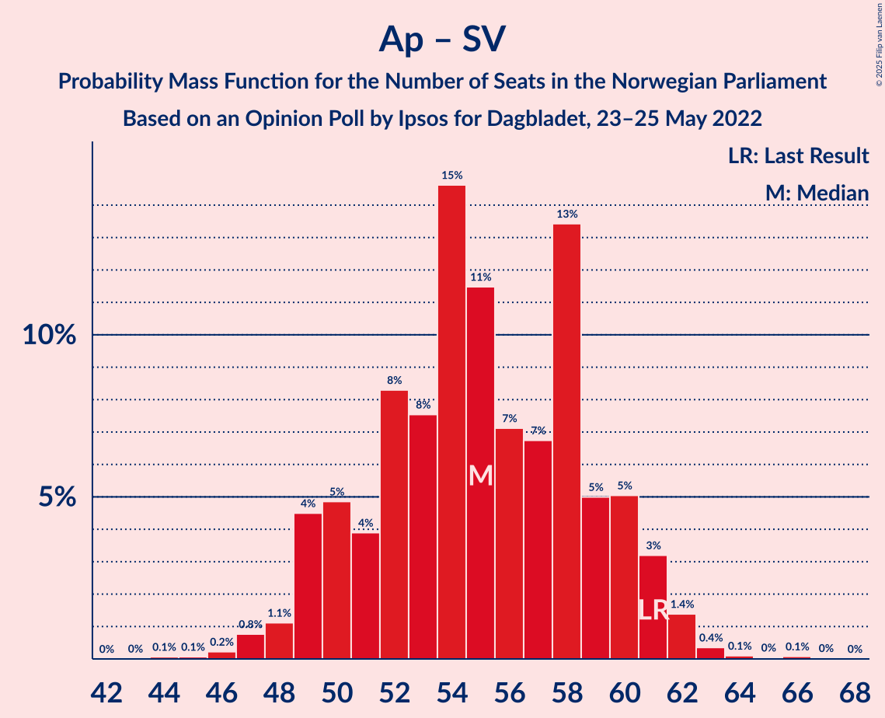

| Number of Seats | Probability | Accumulated | Special Marks |
|:---------------:|:-----------:|:-----------:|:-------------:|
| 44 | 0.1% | 100% |  |
| 45 | 0.1% | 99.9% |  |
| 46 | 0.2% | 99.8% |  |
| 47 | 0.8% | 99.6% |  |
| 48 | 1.1% | 98.9% |  |
| 49 | 4% | 98% |  |
| 50 | 5% | 93% |  |
| 51 | 4% | 88% |  |
| 52 | 8% | 84% |  |
| 53 | 8% | 76% |  |
| 54 | 15% | 69% |  |
| 55 | 11% | 54% | Median |
| 56 | 7% | 43% |  |
| 57 | 7% | 35% |  |
| 58 | 13% | 29% |  |
| 59 | 5% | 15% |  |
| 60 | 5% | 10% |  |
| 61 | 3% | 5% | Last Result |
| 62 | 1.4% | 2% |  |
| 63 | 0.4% | 0.6% |  |
| 64 | 0.1% | 0.3% |  |
| 65 | 0% | 0.2% |  |
| 66 | 0.1% | 0.1% |  |
| 67 | 0% | 0% |  |

### Arbeiderpartiet – Senterpartiet

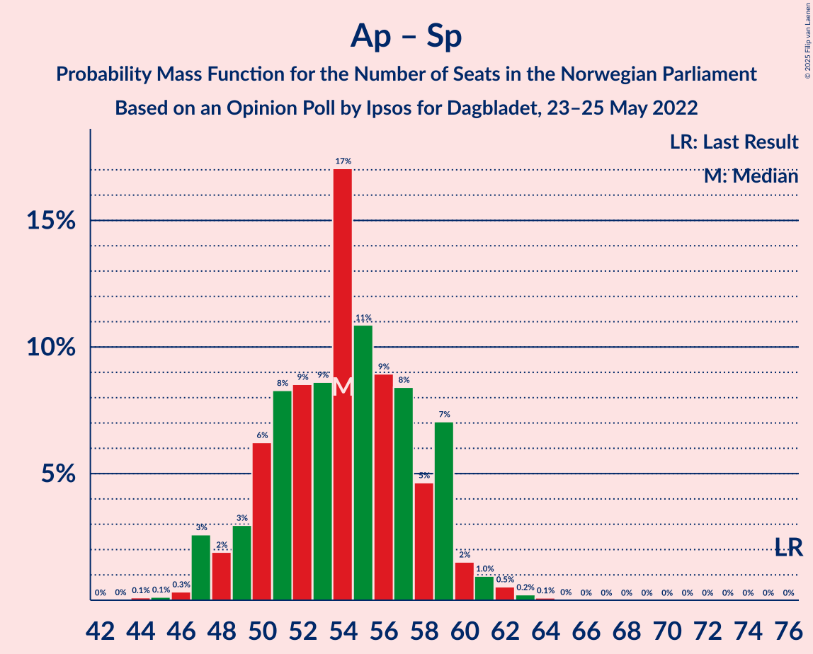

| Number of Seats | Probability | Accumulated | Special Marks |
|:---------------:|:-----------:|:-----------:|:-------------:|
| 44 | 0.1% | 100% |  |
| 45 | 0.1% | 99.9% |  |
| 46 | 0.3% | 99.7% |  |
| 47 | 3% | 99.4% |  |
| 48 | 2% | 97% |  |
| 49 | 3% | 95% |  |
| 50 | 6% | 92% |  |
| 51 | 8% | 86% |  |
| 52 | 9% | 77% |  |
| 53 | 9% | 69% |  |
| 54 | 17% | 60% | Median |
| 55 | 11% | 43% |  |
| 56 | 9% | 32% |  |
| 57 | 8% | 23% |  |
| 58 | 5% | 15% |  |
| 59 | 7% | 10% |  |
| 60 | 2% | 3% |  |
| 61 | 1.0% | 2% |  |
| 62 | 0.5% | 0.9% |  |
| 63 | 0.2% | 0.3% |  |
| 64 | 0.1% | 0.1% |  |
| 65 | 0% | 0% |  |
| 66 | 0% | 0% |  |
| 67 | 0% | 0% |  |
| 68 | 0% | 0% |  |
| 69 | 0% | 0% |  |
| 70 | 0% | 0% |  |
| 71 | 0% | 0% |  |
| 72 | 0% | 0% |  |
| 73 | 0% | 0% |  |
| 74 | 0% | 0% |  |
| 75 | 0% | 0% |  |
| 76 | 0% | 0% | Last Result |

### Senterpartiet – Venstre – Kristelig Folkeparti

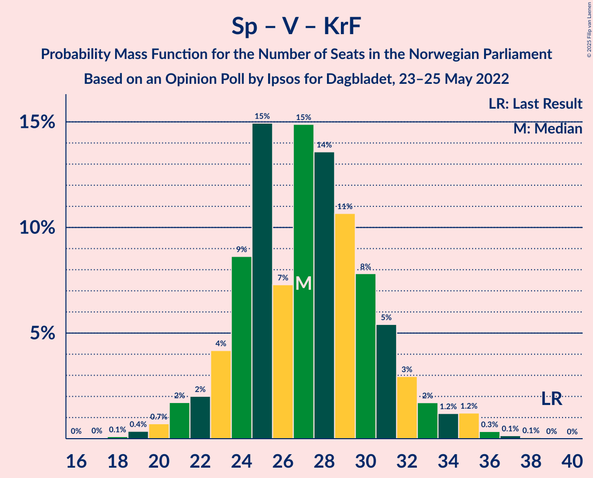

| Number of Seats | Probability | Accumulated | Special Marks |
|:---------------:|:-----------:|:-----------:|:-------------:|
| 17 | 0% | 100% |  |
| 18 | 0.1% | 99.9% |  |
| 19 | 0.4% | 99.8% |  |
| 20 | 0.7% | 99.5% |  |
| 21 | 2% | 98.8% |  |
| 22 | 2% | 97% |  |
| 23 | 4% | 95% |  |
| 24 | 9% | 91% |  |
| 25 | 15% | 82% |  |
| 26 | 7% | 67% | Median |
| 27 | 15% | 60% |  |
| 28 | 14% | 45% |  |
| 29 | 11% | 32% |  |
| 30 | 8% | 21% |  |
| 31 | 5% | 13% |  |
| 32 | 3% | 8% |  |
| 33 | 2% | 5% |  |
| 34 | 1.2% | 3% |  |
| 35 | 1.2% | 2% |  |
| 36 | 0.3% | 0.6% |  |
| 37 | 0.1% | 0.2% |  |
| 38 | 0.1% | 0.1% |  |
| 39 | 0% | 0% | Last Result |

## Technical Information

### Opinion Poll

+ **Polling firm:** Ipsos
+ **Commissioner(s):** Dagbladet
+ **Fieldwork period:** 23–25 May 2022

### Calculations

+ **Sample size:** 732
+ **Simulations done:** 1,048,576
+ **Error estimate:** 2.88%

