# Opinion Poll by Norstat for Aftenposten and NRK, 24–30 May 2022

<a href="#voting-intentions">Voting Intentions</a> | <a href="#seats">Seats</a> | <a href="#coalitions">Coalitions</a> | <a href="#technical-information">Technical Information</a>

## Voting Intentions

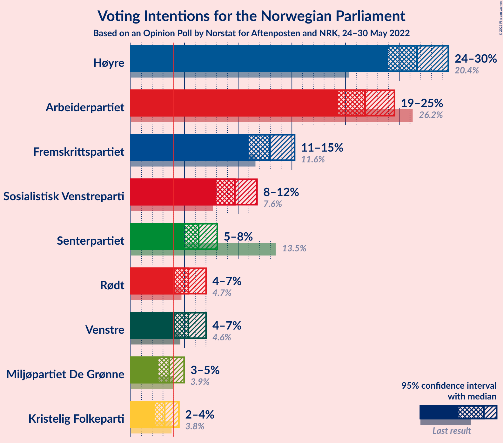

### Confidence Intervals

| Party | Last Result | Poll Result | 80% Confidence Interval | 90% Confidence Interval | 95% Confidence Interval | 99% Confidence Interval |
|:-----:|:-----------:|:-----------:|:-----------------------:|:-----------------------:|:-----------------------:|:-----------------------:|
| Høyre | 20.4% | 26.7% | 24.9–28.6% |24.4–29.1% |23.9–29.6% |23.1–30.5% |
| Arbeiderpartiet | 26.2% | 21.8% | 20.2–23.6% |19.7–24.1% |19.3–24.6% |18.5–25.4% |
| Fremskrittspartiet | 11.6% | 13.0% | 11.6–14.5% |11.3–14.9% |11.0–15.3% |10.4–16.0% |
| Sosialistisk Venstreparti | 7.6% | 9.7% | 8.6–11.0% |8.2–11.4% |8.0–11.8% |7.5–12.4% |
| Senterpartiet | 13.5% | 6.3% | 5.4–7.5% |5.2–7.8% |4.9–8.1% |4.5–8.6% |
| Venstre | 4.6% | 5.4% | 4.5–6.4% |4.3–6.7% |4.1–7.0% |3.7–7.5% |
| Rødt | 4.7% | 5.4% | 4.5–6.4% |4.3–6.7% |4.1–7.0% |3.7–7.5% |
| Miljøpartiet De Grønne | 3.9% | 3.6% | 2.9–4.5% |2.7–4.7% |2.6–5.0% |2.3–5.4% |
| Kristelig Folkeparti | 3.8% | 3.2% | 2.5–4.0% |2.4–4.3% |2.2–4.5% |2.0–4.9% |

*Note:* The poll result column reflects the actual value used in the calculations. Published results may vary slightly, and in addition be rounded to fewer digits.

## Seats

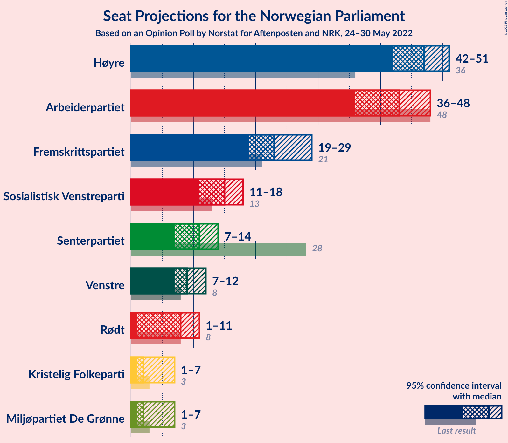

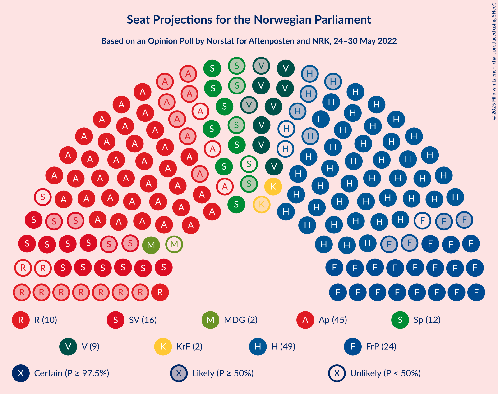

### Confidence Intervals

| Party | Last Result | Median | 80% Confidence Interval | 90% Confidence Interval | 95% Confidence Interval | 99% Confidence Interval |
|:-----:|:-----------:|:------:|:-----------------------:|:-----------------------:|:-----------------------:|:-----------------------:|
| <a href="#høyre">Høyre</a> | 36 | 47 | 44–50 |42–51 |42–51 |40–53 |
| <a href="#arbeiderpartiet">Arbeiderpartiet</a> | 48 | 43 | 38–46 |37–46 |36–48 |35–49 |
| <a href="#fremskrittspartiet">Fremskrittspartiet</a> | 21 | 23 | 21–26 |20–28 |19–29 |18–30 |
| <a href="#sosialistisk-venstreparti">Sosialistisk Venstreparti</a> | 13 | 15 | 13–17 |12–18 |11–18 |10–20 |
| <a href="#senterpartiet">Senterpartiet</a> | 28 | 11 | 8–13 |8–14 |7–14 |7–15 |
| <a href="#venstre">Venstre</a> | 8 | 9 | 7–11 |7–11 |7–12 |6–13 |
| <a href="#rødt">Rødt</a> | 8 | 8 | 7–10 |6–10 |1–11 |1–12 |
| <a href="#miljøpartiet-de-grønne">Miljøpartiet De Grønne</a> | 3 | 2 | 1–7 |1–7 |1–7 |1–8 |
| <a href="#kristelig-folkeparti">Kristelig Folkeparti</a> | 3 | 2 | 2–3 |2–6 |1–7 |0–7 |

### Høyre

*For a full overview of the results for this party, see the [Høyre](party-høyre.html) page.*

| Number of Seats | Probability | Accumulated | Special Marks |
|:---------------:|:-----------:|:-----------:|:-------------:|
| 36 | 0% | 100% | Last Result |
| 37 | 0% | 100% |  |
| 38 | 0% | 100% |  |
| 39 | 0% | 100% |  |
| 40 | 0.7% | 100% |  |
| 41 | 0.9% | 99.3% |  |
| 42 | 5% | 98% |  |
| 43 | 3% | 94% |  |
| 44 | 8% | 90% |  |
| 45 | 12% | 83% |  |
| 46 | 13% | 71% |  |
| 47 | 12% | 58% | Median |
| 48 | 20% | 46% |  |
| 49 | 14% | 26% |  |
| 50 | 7% | 12% |  |
| 51 | 3% | 5% |  |
| 52 | 2% | 2% |  |
| 53 | 0.3% | 0.8% |  |
| 54 | 0.3% | 0.5% |  |
| 55 | 0.1% | 0.2% |  |
| 56 | 0% | 0.1% |  |
| 57 | 0% | 0% |  |

### Arbeiderpartiet

*For a full overview of the results for this party, see the [Arbeiderpartiet](party-arbeiderpartiet.html) page.*

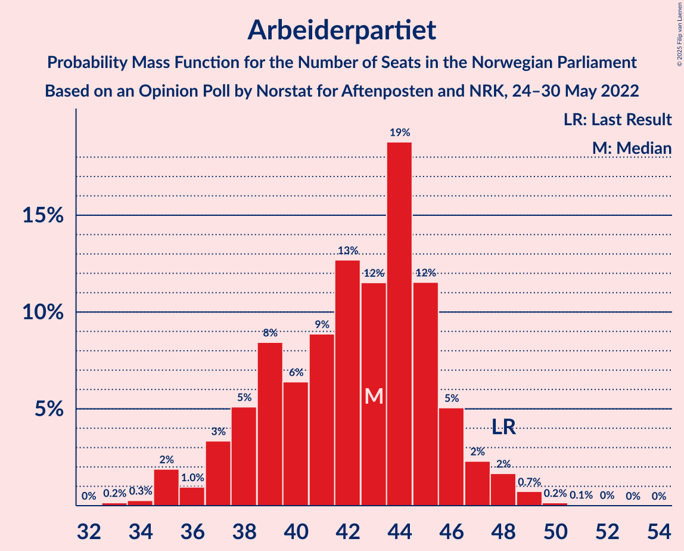

| Number of Seats | Probability | Accumulated | Special Marks |
|:---------------:|:-----------:|:-----------:|:-------------:|
| 33 | 0.2% | 100% |  |
| 34 | 0.3% | 99.8% |  |
| 35 | 2% | 99.6% |  |
| 36 | 1.0% | 98% |  |
| 37 | 3% | 97% |  |
| 38 | 5% | 93% |  |
| 39 | 8% | 88% |  |
| 40 | 6% | 80% |  |
| 41 | 9% | 73% |  |
| 42 | 13% | 65% |  |
| 43 | 12% | 52% | Median |
| 44 | 19% | 40% |  |
| 45 | 12% | 22% |  |
| 46 | 5% | 10% |  |
| 47 | 2% | 5% |  |
| 48 | 2% | 3% | Last Result |
| 49 | 0.7% | 1.0% |  |
| 50 | 0.2% | 0.3% |  |
| 51 | 0.1% | 0.1% |  |
| 52 | 0% | 0.1% |  |
| 53 | 0% | 0% |  |

### Fremskrittspartiet

*For a full overview of the results for this party, see the [Fremskrittspartiet](party-fremskrittspartiet.html) page.*

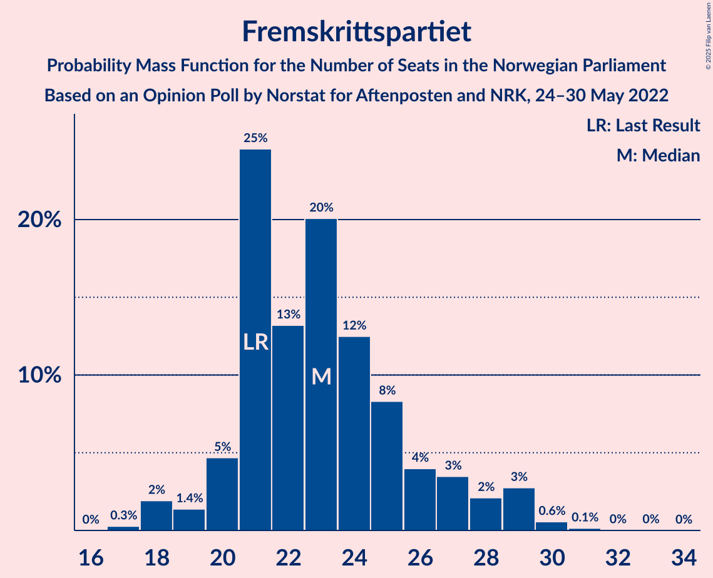

| Number of Seats | Probability | Accumulated | Special Marks |
|:---------------:|:-----------:|:-----------:|:-------------:|
| 17 | 0.3% | 100% |  |
| 18 | 2% | 99.7% |  |
| 19 | 1.4% | 98% |  |
| 20 | 5% | 96% |  |
| 21 | 25% | 92% | Last Result |
| 22 | 13% | 67% |  |
| 23 | 20% | 54% | Median |
| 24 | 12% | 34% |  |
| 25 | 8% | 21% |  |
| 26 | 4% | 13% |  |
| 27 | 3% | 9% |  |
| 28 | 2% | 6% |  |
| 29 | 3% | 4% |  |
| 30 | 0.6% | 0.8% |  |
| 31 | 0.1% | 0.2% |  |
| 32 | 0% | 0.1% |  |
| 33 | 0% | 0% |  |

### Sosialistisk Venstreparti

*For a full overview of the results for this party, see the [Sosialistisk Venstreparti](party-sosialistiskvenstreparti.html) page.*

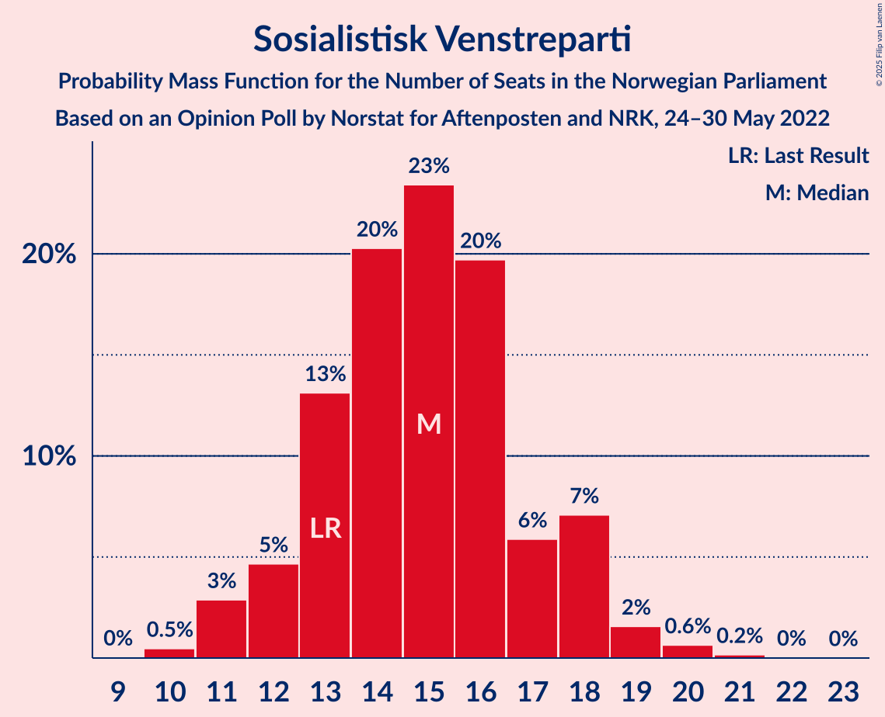

| Number of Seats | Probability | Accumulated | Special Marks |
|:---------------:|:-----------:|:-----------:|:-------------:|
| 10 | 0.5% | 100% |  |
| 11 | 3% | 99.5% |  |
| 12 | 5% | 97% |  |
| 13 | 13% | 92% | Last Result |
| 14 | 20% | 79% |  |
| 15 | 23% | 59% | Median |
| 16 | 20% | 35% |  |
| 17 | 6% | 15% |  |
| 18 | 7% | 10% |  |
| 19 | 2% | 2% |  |
| 20 | 0.6% | 0.9% |  |
| 21 | 0.2% | 0.2% |  |
| 22 | 0% | 0.1% |  |
| 23 | 0% | 0% |  |

### Senterpartiet

*For a full overview of the results for this party, see the [Senterpartiet](party-senterpartiet.html) page.*

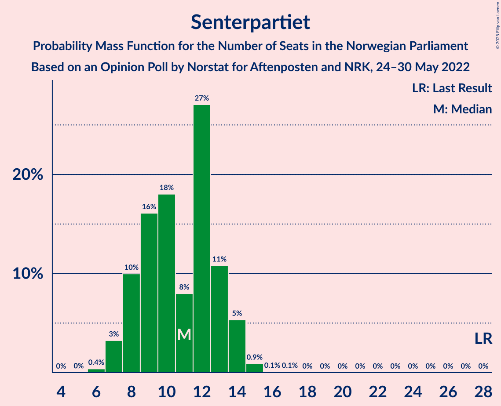

| Number of Seats | Probability | Accumulated | Special Marks |
|:---------------:|:-----------:|:-----------:|:-------------:|
| 5 | 0% | 100% |  |
| 6 | 0.4% | 99.9% |  |
| 7 | 3% | 99.6% |  |
| 8 | 10% | 96% |  |
| 9 | 16% | 86% |  |
| 10 | 18% | 70% |  |
| 11 | 8% | 52% | Median |
| 12 | 27% | 44% |  |
| 13 | 11% | 17% |  |
| 14 | 5% | 6% |  |
| 15 | 0.9% | 1.1% |  |
| 16 | 0.1% | 0.2% |  |
| 17 | 0.1% | 0.1% |  |
| 18 | 0% | 0% |  |
| 19 | 0% | 0% |  |
| 20 | 0% | 0% |  |
| 21 | 0% | 0% |  |
| 22 | 0% | 0% |  |
| 23 | 0% | 0% |  |
| 24 | 0% | 0% |  |
| 25 | 0% | 0% |  |
| 26 | 0% | 0% |  |
| 27 | 0% | 0% |  |
| 28 | 0% | 0% | Last Result |

### Venstre

*For a full overview of the results for this party, see the [Venstre](party-venstre.html) page.*

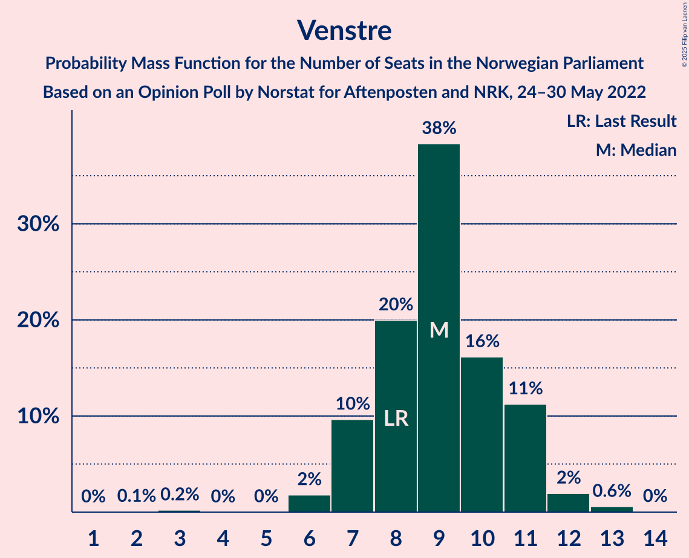

| Number of Seats | Probability | Accumulated | Special Marks |
|:---------------:|:-----------:|:-----------:|:-------------:|
| 2 | 0.1% | 100% |  |
| 3 | 0.2% | 99.9% |  |
| 4 | 0% | 99.7% |  |
| 5 | 0% | 99.7% |  |
| 6 | 2% | 99.7% |  |
| 7 | 10% | 98% |  |
| 8 | 20% | 88% | Last Result |
| 9 | 38% | 68% | Median |
| 10 | 16% | 30% |  |
| 11 | 11% | 14% |  |
| 12 | 2% | 3% |  |
| 13 | 0.6% | 0.6% |  |
| 14 | 0% | 0% |  |

### Rødt

*For a full overview of the results for this party, see the [Rødt](party-rødt.html) page.*

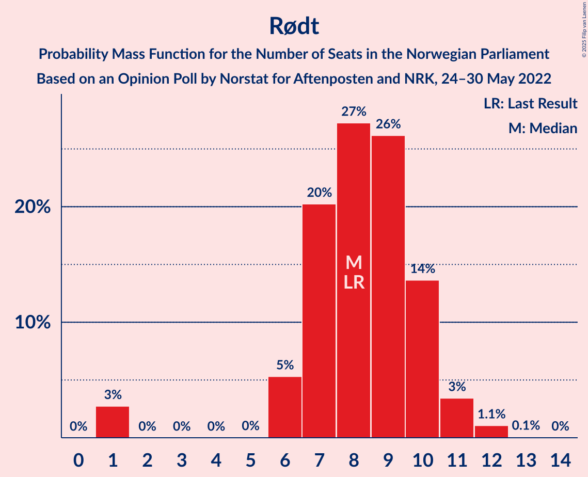

| Number of Seats | Probability | Accumulated | Special Marks |
|:---------------:|:-----------:|:-----------:|:-------------:|
| 1 | 3% | 100% |  |
| 2 | 0% | 97% |  |
| 3 | 0% | 97% |  |
| 4 | 0% | 97% |  |
| 5 | 0% | 97% |  |
| 6 | 5% | 97% |  |
| 7 | 20% | 92% |  |
| 8 | 27% | 72% | Last Result, Median |
| 9 | 26% | 44% |  |
| 10 | 14% | 18% |  |
| 11 | 3% | 5% |  |
| 12 | 1.1% | 1.2% |  |
| 13 | 0.1% | 0.1% |  |
| 14 | 0% | 0% |  |

### Miljøpartiet De Grønne

*For a full overview of the results for this party, see the [Miljøpartiet De Grønne](party-miljøpartietdegrønne.html) page.*

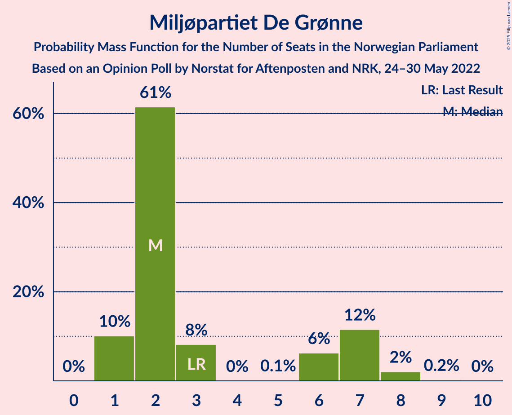

| Number of Seats | Probability | Accumulated | Special Marks |
|:---------------:|:-----------:|:-----------:|:-------------:|
| 1 | 10% | 100% |  |
| 2 | 61% | 90% | Median |
| 3 | 8% | 28% | Last Result |
| 4 | 0% | 20% |  |
| 5 | 0.1% | 20% |  |
| 6 | 6% | 20% |  |
| 7 | 12% | 14% |  |
| 8 | 2% | 2% |  |
| 9 | 0.2% | 0.2% |  |
| 10 | 0% | 0% |  |

### Kristelig Folkeparti

*For a full overview of the results for this party, see the [Kristelig Folkeparti](party-kristeligfolkeparti.html) page.*

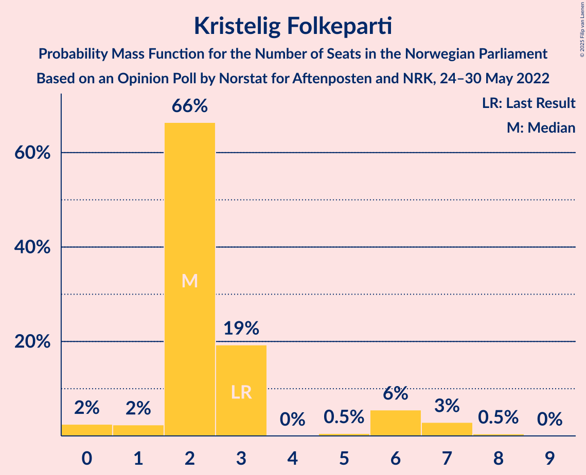

| Number of Seats | Probability | Accumulated | Special Marks |
|:---------------:|:-----------:|:-----------:|:-------------:|
| 0 | 2% | 100% |  |
| 1 | 2% | 98% |  |
| 2 | 66% | 95% | Median |
| 3 | 19% | 29% | Last Result |
| 4 | 0% | 9% |  |
| 5 | 0.5% | 9% |  |
| 6 | 6% | 9% |  |
| 7 | 3% | 3% |  |
| 8 | 0.5% | 0.5% |  |
| 9 | 0% | 0% |  |

## Coalitions

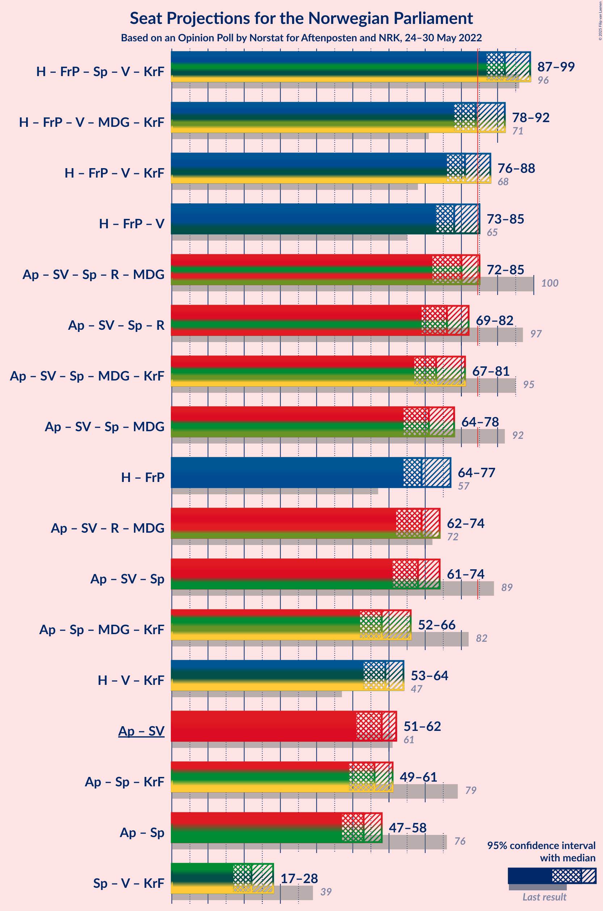

### Confidence Intervals

| Coalition | Last Result | Median | Majority? | 80% Confidence Interval | 90% Confidence Interval | 95% Confidence Interval | 99% Confidence Interval |
|:---------:|:-----------:|:------:|:---------:|:-----------------------:|:-----------------------:|:-----------------------:|:-----------------------:|
| Høyre – Fremskrittspartiet – Senterpartiet – Venstre – Kristelig Folkeparti | 96 | 92 | 99.5% | 88–97 | 88–97 | 87–99 | 84–101 |
| Høyre – Fremskrittspartiet – Venstre – Miljøpartiet De Grønne – Kristelig Folkeparti | 71 | 84 | 48% | 79–89 | 79–90 | 78–92 | 77–94 |
| Høyre – Fremskrittspartiet – Venstre – Kristelig Folkeparti | 68 | 81 | 18% | 77–86 | 76–87 | 76–88 | 74–90 |
| Høyre – Fremskrittspartiet – Venstre | 65 | 78 | 4% | 75–83 | 74–84 | 73–85 | 71–87 |
| Arbeiderpartiet – Sosialistisk Venstreparti – Senterpartiet – Rødt – Miljøpartiet De Grønne | 100 | 80 | 4% | 74–83 | 73–84 | 72–85 | 71–87 |
| Arbeiderpartiet – Sosialistisk Venstreparti – Senterpartiet – Rødt | 97 | 76 | 0.2% | 71–81 | 70–81 | 69–82 | 67–84 |
| Arbeiderpartiet – Sosialistisk Venstreparti – Senterpartiet – Miljøpartiet De Grønne – Kristelig Folkeparti | 95 | 73 | 0.1% | 69–77 | 68–79 | 67–81 | 65–82 |
| Arbeiderpartiet – Sosialistisk Venstreparti – Senterpartiet – Miljøpartiet De Grønne | 92 | 71 | 0% | 66–75 | 65–76 | 64–78 | 63–79 |
| Høyre – Fremskrittspartiet | 57 | 69 | 0% | 66–74 | 65–76 | 64–77 | 62–78 |
| Arbeiderpartiet – Sosialistisk Venstreparti – Rødt – Miljøpartiet De Grønne | 72 | 69 | 0% | 64–72 | 63–73 | 62–74 | 59–77 |
| Arbeiderpartiet – Sosialistisk Venstreparti – Senterpartiet | 89 | 68 | 0% | 64–72 | 62–72 | 61–74 | 60–75 |
| Arbeiderpartiet – Senterpartiet – Miljøpartiet De Grønne – Kristelig Folkeparti | 82 | 58 | 0% | 54–63 | 53–65 | 52–66 | 49–68 |
| Høyre – Venstre – Kristelig Folkeparti | 47 | 59 | 0% | 55–62 | 54–63 | 53–64 | 51–66 |
| Arbeiderpartiet – Sosialistisk Venstreparti | 61 | 58 | 0% | 53–60 | 52–61 | 51–62 | 49–64 |
| Arbeiderpartiet – Senterpartiet – Kristelig Folkeparti | 79 | 56 | 0% | 51–59 | 50–61 | 49–61 | 47–64 |
| Arbeiderpartiet – Senterpartiet | 76 | 53 | 0% | 49–57 | 48–57 | 47–58 | 45–60 |
| Senterpartiet – Venstre – Kristelig Folkeparti | 39 | 22 | 0% | 19–25 | 18–27 | 17–28 | 16–30 |

### Høyre – Fremskrittspartiet – Senterpartiet – Venstre – Kristelig Folkeparti

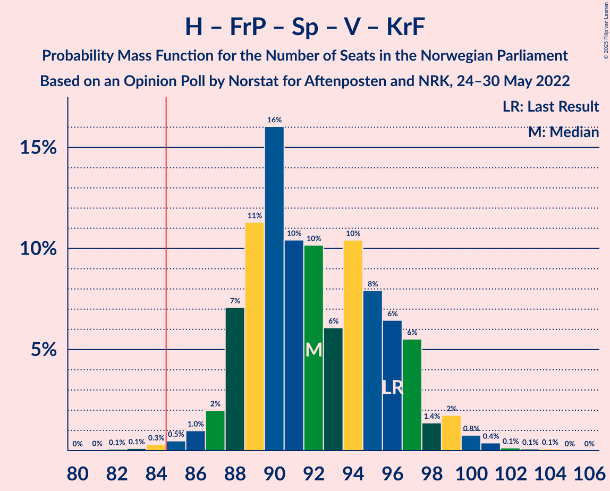

| Number of Seats | Probability | Accumulated | Special Marks |
|:---------------:|:-----------:|:-----------:|:-------------:|
| 82 | 0.1% | 100% |  |
| 83 | 0.1% | 99.9% |  |
| 84 | 0.3% | 99.8% |  |
| 85 | 0.5% | 99.5% | Majority |
| 86 | 1.0% | 99.0% |  |
| 87 | 2% | 98% |  |
| 88 | 7% | 96% |  |
| 89 | 11% | 89% |  |
| 90 | 16% | 78% |  |
| 91 | 10% | 62% |  |
| 92 | 10% | 51% | Median |
| 93 | 6% | 41% |  |
| 94 | 10% | 35% |  |
| 95 | 8% | 24% |  |
| 96 | 6% | 17% | Last Result |
| 97 | 6% | 10% |  |
| 98 | 1.4% | 5% |  |
| 99 | 2% | 3% |  |
| 100 | 0.8% | 1.5% |  |
| 101 | 0.4% | 0.7% |  |
| 102 | 0.1% | 0.3% |  |
| 103 | 0.1% | 0.2% |  |
| 104 | 0.1% | 0.1% |  |
| 105 | 0% | 0% |  |

### Høyre – Fremskrittspartiet – Venstre – Miljøpartiet De Grønne – Kristelig Folkeparti

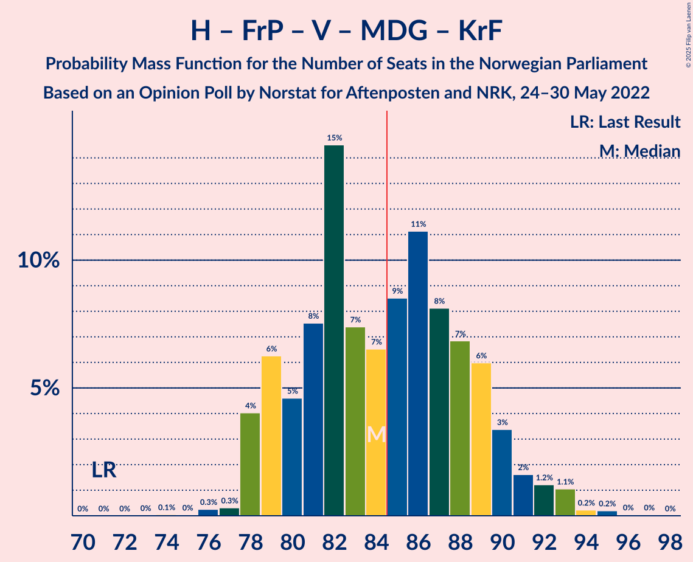

| Number of Seats | Probability | Accumulated | Special Marks |
|:---------------:|:-----------:|:-----------:|:-------------:|
| 71 | 0% | 100% | Last Result |
| 72 | 0% | 100% |  |
| 73 | 0% | 100% |  |
| 74 | 0.1% | 100% |  |
| 75 | 0% | 99.9% |  |
| 76 | 0.3% | 99.9% |  |
| 77 | 0.3% | 99.6% |  |
| 78 | 4% | 99.3% |  |
| 79 | 6% | 95% |  |
| 80 | 5% | 89% |  |
| 81 | 8% | 84% |  |
| 82 | 15% | 77% |  |
| 83 | 7% | 62% | Median |
| 84 | 7% | 55% |  |
| 85 | 9% | 48% | Majority |
| 86 | 11% | 40% |  |
| 87 | 8% | 29% |  |
| 88 | 7% | 21% |  |
| 89 | 6% | 14% |  |
| 90 | 3% | 8% |  |
| 91 | 2% | 4% |  |
| 92 | 1.2% | 3% |  |
| 93 | 1.1% | 2% |  |
| 94 | 0.2% | 0.5% |  |
| 95 | 0.2% | 0.3% |  |
| 96 | 0% | 0.1% |  |
| 97 | 0% | 0.1% |  |
| 98 | 0% | 0% |  |

### Høyre – Fremskrittspartiet – Venstre – Kristelig Folkeparti

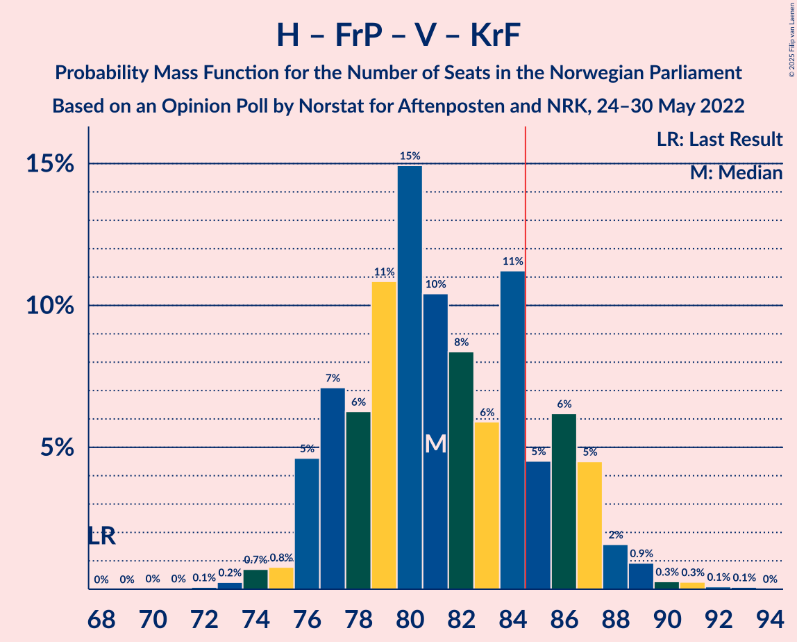

| Number of Seats | Probability | Accumulated | Special Marks |
|:---------------:|:-----------:|:-----------:|:-------------:|
| 68 | 0% | 100% | Last Result |
| 69 | 0% | 100% |  |
| 70 | 0% | 100% |  |
| 71 | 0% | 100% |  |
| 72 | 0.1% | 99.9% |  |
| 73 | 0.2% | 99.8% |  |
| 74 | 0.7% | 99.6% |  |
| 75 | 0.8% | 98.9% |  |
| 76 | 5% | 98% |  |
| 77 | 7% | 93% |  |
| 78 | 6% | 86% |  |
| 79 | 11% | 80% |  |
| 80 | 15% | 69% |  |
| 81 | 10% | 54% | Median |
| 82 | 8% | 44% |  |
| 83 | 6% | 36% |  |
| 84 | 11% | 30% |  |
| 85 | 5% | 18% | Majority |
| 86 | 6% | 14% |  |
| 87 | 5% | 8% |  |
| 88 | 2% | 3% |  |
| 89 | 0.9% | 2% |  |
| 90 | 0.3% | 0.7% |  |
| 91 | 0.3% | 0.4% |  |
| 92 | 0.1% | 0.2% |  |
| 93 | 0.1% | 0.1% |  |
| 94 | 0% | 0% |  |

### Høyre – Fremskrittspartiet – Venstre

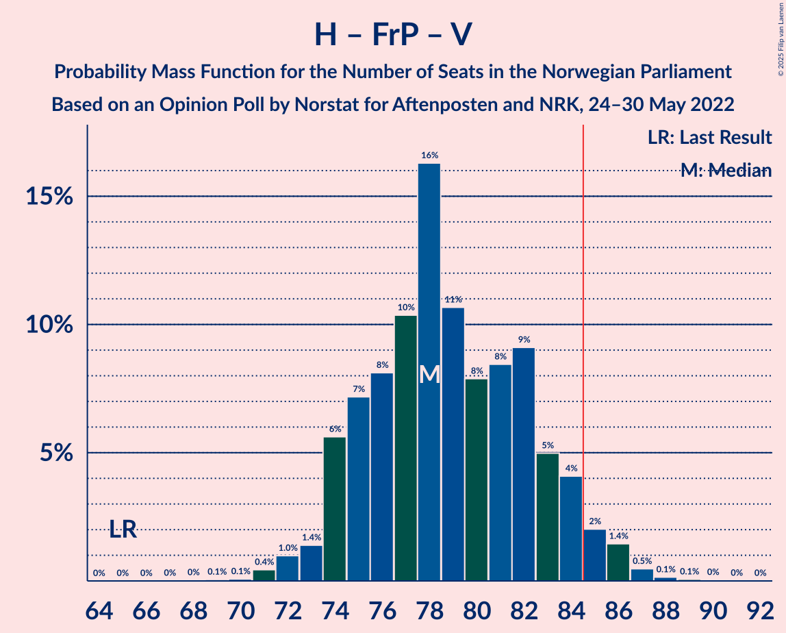

| Number of Seats | Probability | Accumulated | Special Marks |
|:---------------:|:-----------:|:-----------:|:-------------:|
| 65 | 0% | 100% | Last Result |
| 66 | 0% | 100% |  |
| 67 | 0% | 100% |  |
| 68 | 0% | 100% |  |
| 69 | 0.1% | 99.9% |  |
| 70 | 0.1% | 99.9% |  |
| 71 | 0.4% | 99.8% |  |
| 72 | 1.0% | 99.4% |  |
| 73 | 1.4% | 98% |  |
| 74 | 6% | 97% |  |
| 75 | 7% | 91% |  |
| 76 | 8% | 84% |  |
| 77 | 10% | 76% |  |
| 78 | 16% | 66% |  |
| 79 | 11% | 49% | Median |
| 80 | 8% | 39% |  |
| 81 | 8% | 31% |  |
| 82 | 9% | 22% |  |
| 83 | 5% | 13% |  |
| 84 | 4% | 8% |  |
| 85 | 2% | 4% | Majority |
| 86 | 1.4% | 2% |  |
| 87 | 0.5% | 0.8% |  |
| 88 | 0.1% | 0.3% |  |
| 89 | 0.1% | 0.1% |  |
| 90 | 0% | 0.1% |  |
| 91 | 0% | 0% |  |

### Arbeiderpartiet – Sosialistisk Venstreparti – Senterpartiet – Rødt – Miljøpartiet De Grønne

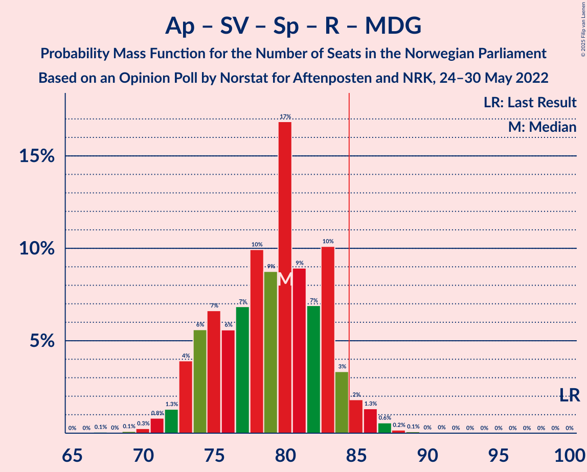

| Number of Seats | Probability | Accumulated | Special Marks |
|:---------------:|:-----------:|:-----------:|:-------------:|
| 67 | 0.1% | 100% |  |
| 68 | 0% | 99.9% |  |
| 69 | 0.1% | 99.9% |  |
| 70 | 0.3% | 99.8% |  |
| 71 | 0.8% | 99.6% |  |
| 72 | 1.3% | 98.7% |  |
| 73 | 4% | 97% |  |
| 74 | 6% | 94% |  |
| 75 | 7% | 88% |  |
| 76 | 6% | 81% |  |
| 77 | 7% | 76% |  |
| 78 | 10% | 69% |  |
| 79 | 9% | 59% | Median |
| 80 | 17% | 50% |  |
| 81 | 9% | 33% |  |
| 82 | 7% | 24% |  |
| 83 | 10% | 17% |  |
| 84 | 3% | 7% |  |
| 85 | 2% | 4% | Majority |
| 86 | 1.3% | 2% |  |
| 87 | 0.6% | 0.9% |  |
| 88 | 0.2% | 0.3% |  |
| 89 | 0.1% | 0.2% |  |
| 90 | 0% | 0.1% |  |
| 91 | 0% | 0.1% |  |
| 92 | 0% | 0% |  |
| 93 | 0% | 0% |  |
| 94 | 0% | 0% |  |
| 95 | 0% | 0% |  |
| 96 | 0% | 0% |  |
| 97 | 0% | 0% |  |
| 98 | 0% | 0% |  |
| 99 | 0% | 0% |  |
| 100 | 0% | 0% | Last Result |

### Arbeiderpartiet – Sosialistisk Venstreparti – Senterpartiet – Rødt

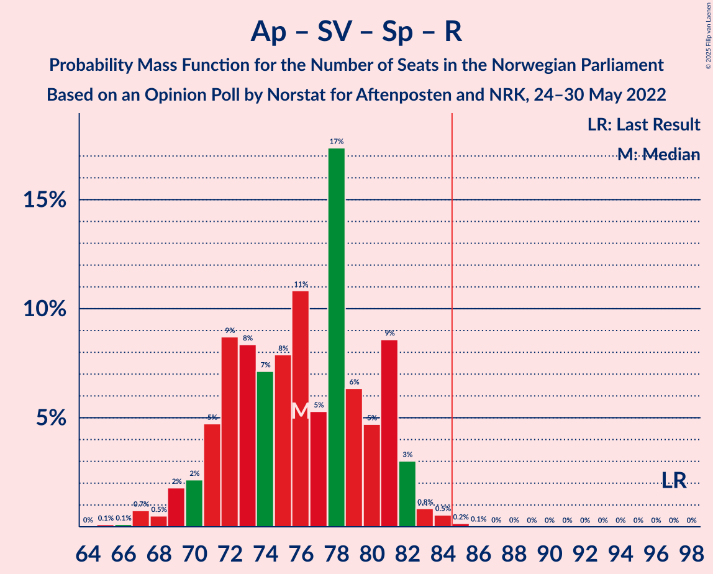

| Number of Seats | Probability | Accumulated | Special Marks |
|:---------------:|:-----------:|:-----------:|:-------------:|
| 65 | 0.1% | 100% |  |
| 66 | 0.1% | 99.9% |  |
| 67 | 0.7% | 99.8% |  |
| 68 | 0.5% | 99.0% |  |
| 69 | 2% | 98.5% |  |
| 70 | 2% | 97% |  |
| 71 | 5% | 95% |  |
| 72 | 9% | 90% |  |
| 73 | 8% | 81% |  |
| 74 | 7% | 73% |  |
| 75 | 8% | 66% |  |
| 76 | 11% | 58% |  |
| 77 | 5% | 47% | Median |
| 78 | 17% | 42% |  |
| 79 | 6% | 24% |  |
| 80 | 5% | 18% |  |
| 81 | 9% | 13% |  |
| 82 | 3% | 5% |  |
| 83 | 0.8% | 2% |  |
| 84 | 0.5% | 0.8% |  |
| 85 | 0.2% | 0.2% | Majority |
| 86 | 0.1% | 0.1% |  |
| 87 | 0% | 0% |  |
| 88 | 0% | 0% |  |
| 89 | 0% | 0% |  |
| 90 | 0% | 0% |  |
| 91 | 0% | 0% |  |
| 92 | 0% | 0% |  |
| 93 | 0% | 0% |  |
| 94 | 0% | 0% |  |
| 95 | 0% | 0% |  |
| 96 | 0% | 0% |  |
| 97 | 0% | 0% | Last Result |

### Arbeiderpartiet – Sosialistisk Venstreparti – Senterpartiet – Miljøpartiet De Grønne – Kristelig Folkeparti

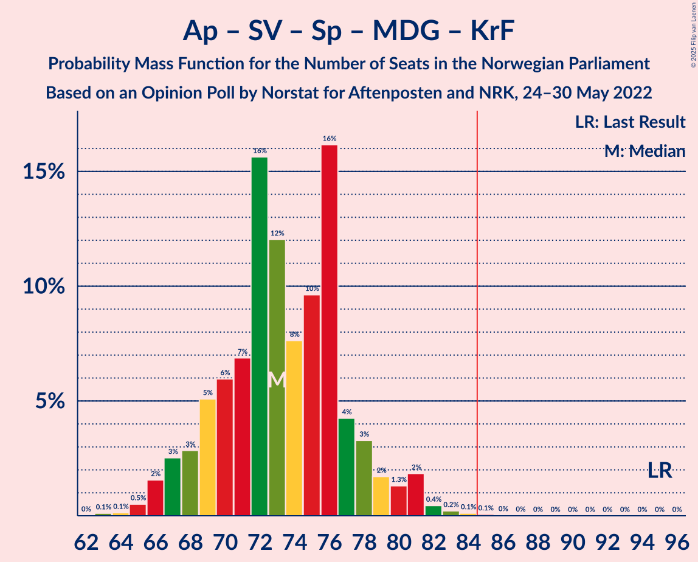

| Number of Seats | Probability | Accumulated | Special Marks |
|:---------------:|:-----------:|:-----------:|:-------------:|
| 63 | 0.1% | 100% |  |
| 64 | 0.1% | 99.9% |  |
| 65 | 0.5% | 99.7% |  |
| 66 | 2% | 99.2% |  |
| 67 | 3% | 98% |  |
| 68 | 3% | 95% |  |
| 69 | 5% | 92% |  |
| 70 | 6% | 87% |  |
| 71 | 7% | 81% |  |
| 72 | 16% | 74% |  |
| 73 | 12% | 59% | Median |
| 74 | 8% | 47% |  |
| 75 | 10% | 39% |  |
| 76 | 16% | 29% |  |
| 77 | 4% | 13% |  |
| 78 | 3% | 9% |  |
| 79 | 2% | 6% |  |
| 80 | 1.3% | 4% |  |
| 81 | 2% | 3% |  |
| 82 | 0.4% | 0.9% |  |
| 83 | 0.2% | 0.4% |  |
| 84 | 0.1% | 0.2% |  |
| 85 | 0.1% | 0.1% | Majority |
| 86 | 0% | 0.1% |  |
| 87 | 0% | 0% |  |
| 88 | 0% | 0% |  |
| 89 | 0% | 0% |  |
| 90 | 0% | 0% |  |
| 91 | 0% | 0% |  |
| 92 | 0% | 0% |  |
| 93 | 0% | 0% |  |
| 94 | 0% | 0% |  |
| 95 | 0% | 0% | Last Result |

### Arbeiderpartiet – Sosialistisk Venstreparti – Senterpartiet – Miljøpartiet De Grønne

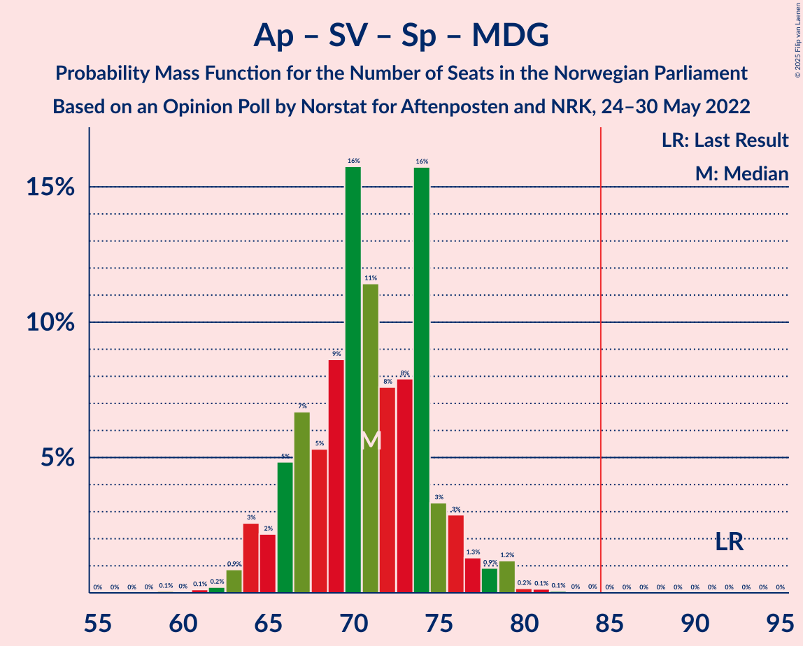

| Number of Seats | Probability | Accumulated | Special Marks |
|:---------------:|:-----------:|:-----------:|:-------------:|
| 59 | 0.1% | 100% |  |
| 60 | 0% | 99.9% |  |
| 61 | 0.1% | 99.9% |  |
| 62 | 0.2% | 99.8% |  |
| 63 | 0.9% | 99.6% |  |
| 64 | 3% | 98.7% |  |
| 65 | 2% | 96% |  |
| 66 | 5% | 94% |  |
| 67 | 7% | 89% |  |
| 68 | 5% | 82% |  |
| 69 | 9% | 77% |  |
| 70 | 16% | 68% |  |
| 71 | 11% | 53% | Median |
| 72 | 8% | 41% |  |
| 73 | 8% | 34% |  |
| 74 | 16% | 26% |  |
| 75 | 3% | 10% |  |
| 76 | 3% | 7% |  |
| 77 | 1.3% | 4% |  |
| 78 | 0.9% | 3% |  |
| 79 | 1.2% | 2% |  |
| 80 | 0.2% | 0.4% |  |
| 81 | 0.1% | 0.3% |  |
| 82 | 0.1% | 0.1% |  |
| 83 | 0% | 0% |  |
| 84 | 0% | 0% |  |
| 85 | 0% | 0% | Majority |
| 86 | 0% | 0% |  |
| 87 | 0% | 0% |  |
| 88 | 0% | 0% |  |
| 89 | 0% | 0% |  |
| 90 | 0% | 0% |  |
| 91 | 0% | 0% |  |
| 92 | 0% | 0% | Last Result |

### Høyre – Fremskrittspartiet

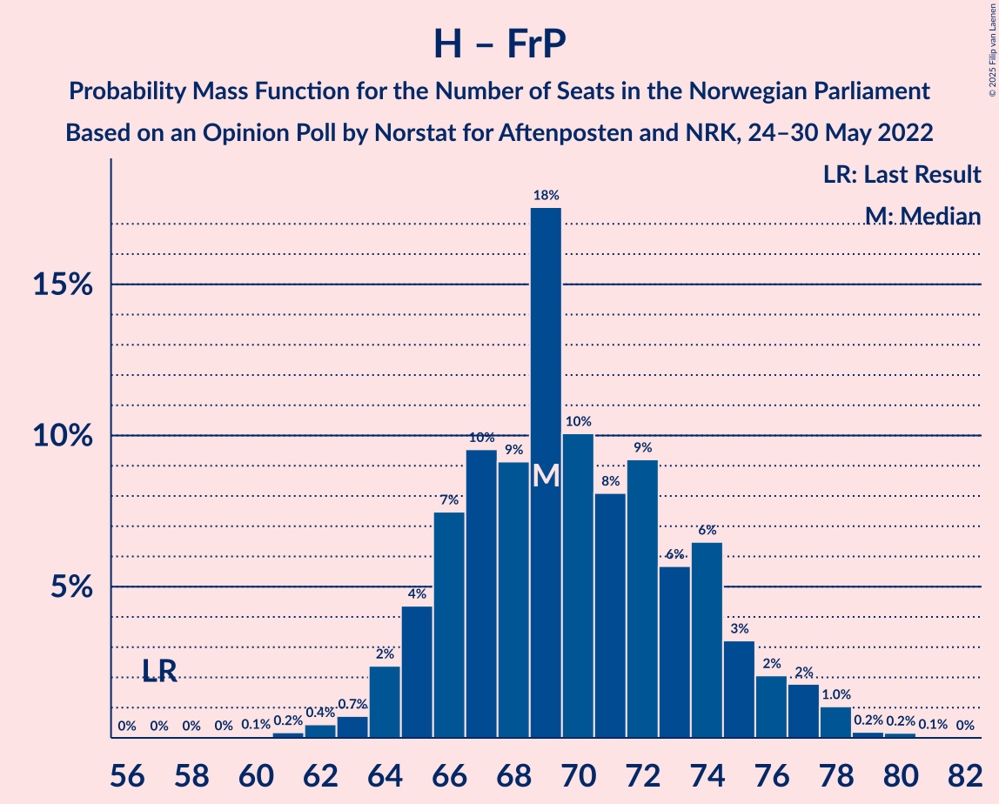

| Number of Seats | Probability | Accumulated | Special Marks |
|:---------------:|:-----------:|:-----------:|:-------------:|
| 57 | 0% | 100% | Last Result |
| 58 | 0% | 100% |  |
| 59 | 0% | 100% |  |
| 60 | 0.1% | 100% |  |
| 61 | 0.2% | 99.9% |  |
| 62 | 0.4% | 99.7% |  |
| 63 | 0.7% | 99.3% |  |
| 64 | 2% | 98.6% |  |
| 65 | 4% | 96% |  |
| 66 | 7% | 92% |  |
| 67 | 10% | 84% |  |
| 68 | 9% | 75% |  |
| 69 | 18% | 66% |  |
| 70 | 10% | 48% | Median |
| 71 | 8% | 38% |  |
| 72 | 9% | 30% |  |
| 73 | 6% | 21% |  |
| 74 | 6% | 15% |  |
| 75 | 3% | 9% |  |
| 76 | 2% | 5% |  |
| 77 | 2% | 3% |  |
| 78 | 1.0% | 1.5% |  |
| 79 | 0.2% | 0.5% |  |
| 80 | 0.2% | 0.3% |  |
| 81 | 0.1% | 0.1% |  |
| 82 | 0% | 0% |  |

### Arbeiderpartiet – Sosialistisk Venstreparti – Rødt – Miljøpartiet De Grønne

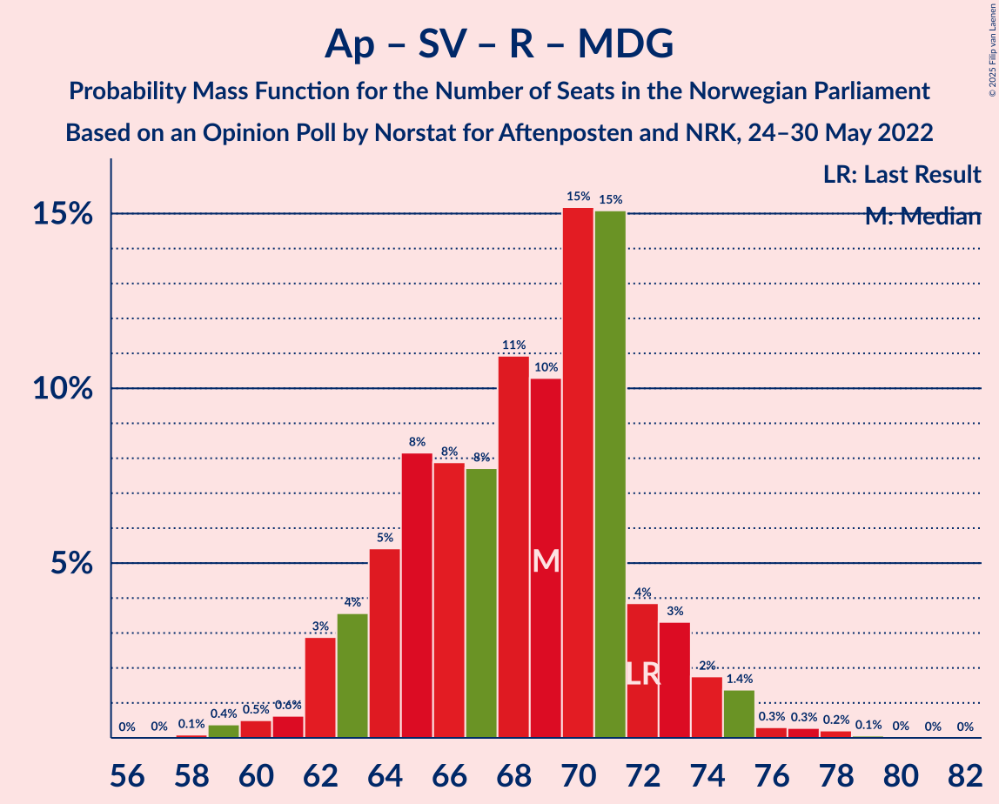

| Number of Seats | Probability | Accumulated | Special Marks |
|:---------------:|:-----------:|:-----------:|:-------------:|
| 58 | 0.1% | 100% |  |
| 59 | 0.4% | 99.9% |  |
| 60 | 0.5% | 99.5% |  |
| 61 | 0.6% | 99.0% |  |
| 62 | 3% | 98% |  |
| 63 | 4% | 95% |  |
| 64 | 5% | 92% |  |
| 65 | 8% | 86% |  |
| 66 | 8% | 78% |  |
| 67 | 8% | 70% |  |
| 68 | 11% | 63% | Median |
| 69 | 10% | 52% |  |
| 70 | 15% | 42% |  |
| 71 | 15% | 26% |  |
| 72 | 4% | 11% | Last Result |
| 73 | 3% | 7% |  |
| 74 | 2% | 4% |  |
| 75 | 1.4% | 2% |  |
| 76 | 0.3% | 0.9% |  |
| 77 | 0.3% | 0.6% |  |
| 78 | 0.2% | 0.3% |  |
| 79 | 0.1% | 0.1% |  |
| 80 | 0% | 0.1% |  |
| 81 | 0% | 0% |  |

### Arbeiderpartiet – Sosialistisk Venstreparti – Senterpartiet

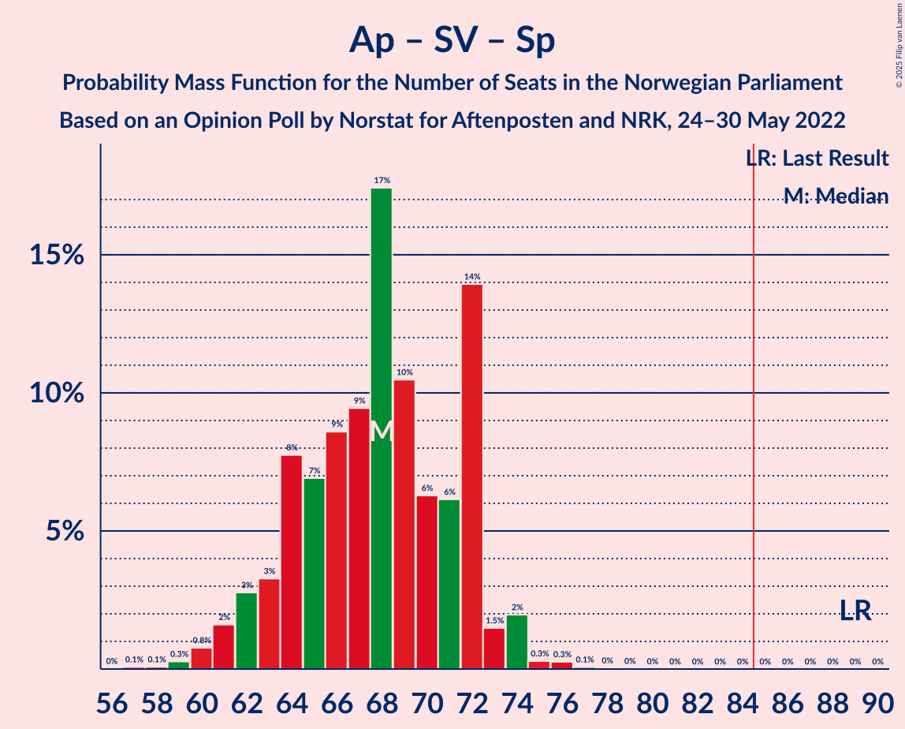

| Number of Seats | Probability | Accumulated | Special Marks |
|:---------------:|:-----------:|:-----------:|:-------------:|
| 57 | 0.1% | 100% |  |
| 58 | 0.1% | 99.9% |  |
| 59 | 0.3% | 99.8% |  |
| 60 | 0.8% | 99.6% |  |
| 61 | 2% | 98.8% |  |
| 62 | 3% | 97% |  |
| 63 | 3% | 94% |  |
| 64 | 8% | 91% |  |
| 65 | 7% | 83% |  |
| 66 | 9% | 76% |  |
| 67 | 9% | 68% |  |
| 68 | 17% | 58% |  |
| 69 | 10% | 41% | Median |
| 70 | 6% | 31% |  |
| 71 | 6% | 24% |  |
| 72 | 14% | 18% |  |
| 73 | 1.5% | 4% |  |
| 74 | 2% | 3% |  |
| 75 | 0.3% | 0.7% |  |
| 76 | 0.3% | 0.4% |  |
| 77 | 0.1% | 0.1% |  |
| 78 | 0% | 0.1% |  |
| 79 | 0% | 0% |  |
| 80 | 0% | 0% |  |
| 81 | 0% | 0% |  |
| 82 | 0% | 0% |  |
| 83 | 0% | 0% |  |
| 84 | 0% | 0% |  |
| 85 | 0% | 0% | Majority |
| 86 | 0% | 0% |  |
| 87 | 0% | 0% |  |
| 88 | 0% | 0% |  |
| 89 | 0% | 0% | Last Result |

### Arbeiderpartiet – Senterpartiet – Miljøpartiet De Grønne – Kristelig Folkeparti

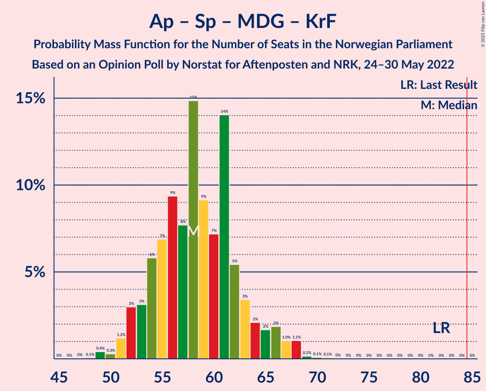

| Number of Seats | Probability | Accumulated | Special Marks |
|:---------------:|:-----------:|:-----------:|:-------------:|
| 48 | 0.1% | 100% |  |
| 49 | 0.4% | 99.9% |  |
| 50 | 0.3% | 99.5% |  |
| 51 | 1.2% | 99.2% |  |
| 52 | 3% | 98% |  |
| 53 | 3% | 95% |  |
| 54 | 6% | 92% |  |
| 55 | 7% | 86% |  |
| 56 | 9% | 79% |  |
| 57 | 8% | 70% |  |
| 58 | 15% | 62% | Median |
| 59 | 9% | 47% |  |
| 60 | 7% | 38% |  |
| 61 | 14% | 31% |  |
| 62 | 5% | 17% |  |
| 63 | 3% | 11% |  |
| 64 | 2% | 8% |  |
| 65 | 2% | 6% |  |
| 66 | 2% | 4% |  |
| 67 | 1.0% | 2% |  |
| 68 | 1.1% | 1.4% |  |
| 69 | 0.2% | 0.3% |  |
| 70 | 0.1% | 0.2% |  |
| 71 | 0.1% | 0.1% |  |
| 72 | 0% | 0% |  |
| 73 | 0% | 0% |  |
| 74 | 0% | 0% |  |
| 75 | 0% | 0% |  |
| 76 | 0% | 0% |  |
| 77 | 0% | 0% |  |
| 78 | 0% | 0% |  |
| 79 | 0% | 0% |  |
| 80 | 0% | 0% |  |
| 81 | 0% | 0% |  |
| 82 | 0% | 0% | Last Result |

### Høyre – Venstre – Kristelig Folkeparti

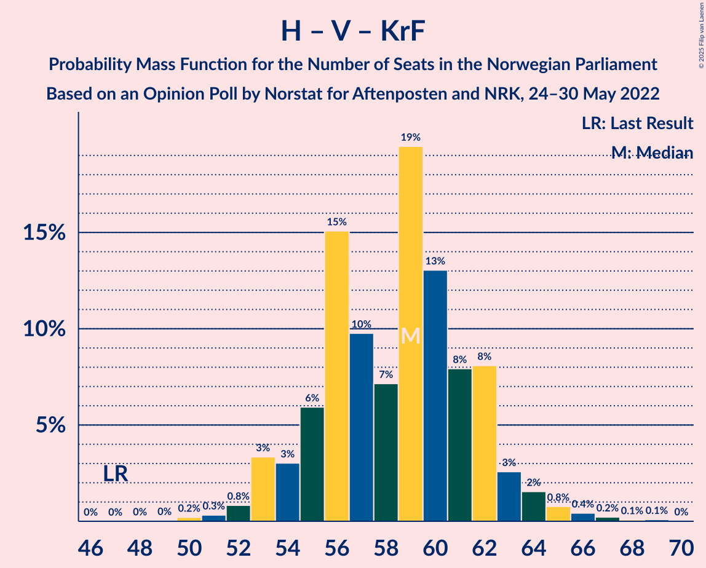

| Number of Seats | Probability | Accumulated | Special Marks |
|:---------------:|:-----------:|:-----------:|:-------------:|
| 47 | 0% | 100% | Last Result |
| 48 | 0% | 100% |  |
| 49 | 0% | 100% |  |
| 50 | 0.2% | 99.9% |  |
| 51 | 0.3% | 99.7% |  |
| 52 | 0.8% | 99.4% |  |
| 53 | 3% | 98.6% |  |
| 54 | 3% | 95% |  |
| 55 | 6% | 92% |  |
| 56 | 15% | 86% |  |
| 57 | 10% | 71% |  |
| 58 | 7% | 61% | Median |
| 59 | 19% | 54% |  |
| 60 | 13% | 35% |  |
| 61 | 8% | 22% |  |
| 62 | 8% | 14% |  |
| 63 | 3% | 6% |  |
| 64 | 2% | 3% |  |
| 65 | 0.8% | 2% |  |
| 66 | 0.4% | 0.8% |  |
| 67 | 0.2% | 0.4% |  |
| 68 | 0.1% | 0.2% |  |
| 69 | 0.1% | 0.1% |  |
| 70 | 0% | 0% |  |

### Arbeiderpartiet – Sosialistisk Venstreparti

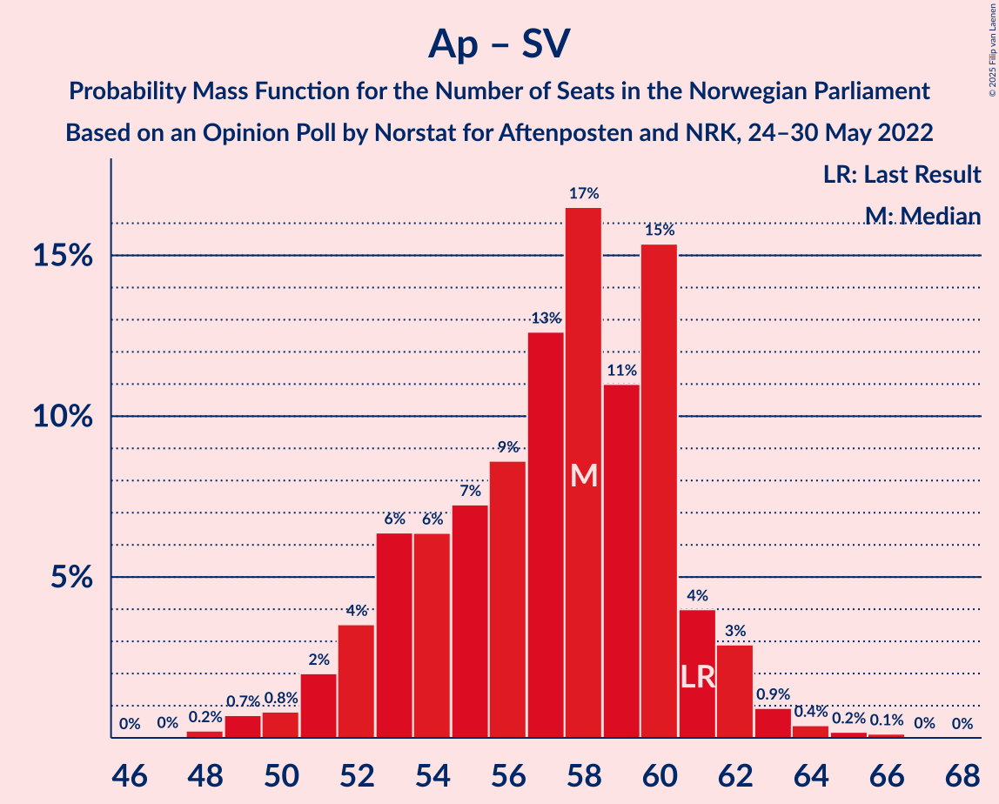

| Number of Seats | Probability | Accumulated | Special Marks |
|:---------------:|:-----------:|:-----------:|:-------------:|
| 47 | 0% | 100% |  |
| 48 | 0.2% | 99.9% |  |
| 49 | 0.7% | 99.7% |  |
| 50 | 0.8% | 99.0% |  |
| 51 | 2% | 98% |  |
| 52 | 4% | 96% |  |
| 53 | 6% | 93% |  |
| 54 | 6% | 86% |  |
| 55 | 7% | 80% |  |
| 56 | 9% | 73% |  |
| 57 | 13% | 64% |  |
| 58 | 17% | 51% | Median |
| 59 | 11% | 35% |  |
| 60 | 15% | 24% |  |
| 61 | 4% | 9% | Last Result |
| 62 | 3% | 5% |  |
| 63 | 0.9% | 2% |  |
| 64 | 0.4% | 0.7% |  |
| 65 | 0.2% | 0.4% |  |
| 66 | 0.1% | 0.2% |  |
| 67 | 0% | 0% |  |

### Arbeiderpartiet – Senterpartiet – Kristelig Folkeparti

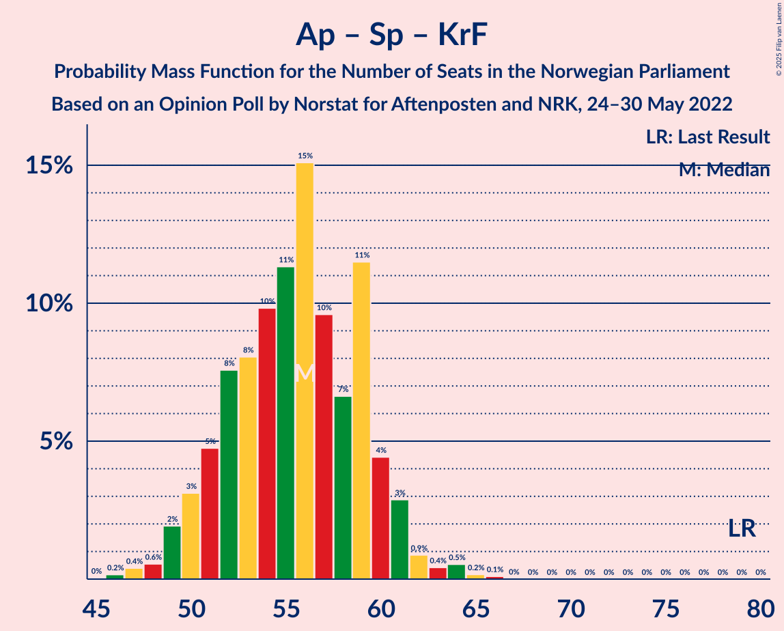

| Number of Seats | Probability | Accumulated | Special Marks |
|:---------------:|:-----------:|:-----------:|:-------------:|
| 45 | 0% | 100% |  |
| 46 | 0.2% | 99.9% |  |
| 47 | 0.4% | 99.8% |  |
| 48 | 0.6% | 99.4% |  |
| 49 | 2% | 98.8% |  |
| 50 | 3% | 97% |  |
| 51 | 5% | 94% |  |
| 52 | 8% | 89% |  |
| 53 | 8% | 81% |  |
| 54 | 10% | 73% |  |
| 55 | 11% | 64% |  |
| 56 | 15% | 52% | Median |
| 57 | 10% | 37% |  |
| 58 | 7% | 28% |  |
| 59 | 11% | 21% |  |
| 60 | 4% | 9% |  |
| 61 | 3% | 5% |  |
| 62 | 0.9% | 2% |  |
| 63 | 0.4% | 1.2% |  |
| 64 | 0.5% | 0.8% |  |
| 65 | 0.2% | 0.3% |  |
| 66 | 0.1% | 0.1% |  |
| 67 | 0% | 0% |  |
| 68 | 0% | 0% |  |
| 69 | 0% | 0% |  |
| 70 | 0% | 0% |  |
| 71 | 0% | 0% |  |
| 72 | 0% | 0% |  |
| 73 | 0% | 0% |  |
| 74 | 0% | 0% |  |
| 75 | 0% | 0% |  |
| 76 | 0% | 0% |  |
| 77 | 0% | 0% |  |
| 78 | 0% | 0% |  |
| 79 | 0% | 0% | Last Result |

### Arbeiderpartiet – Senterpartiet

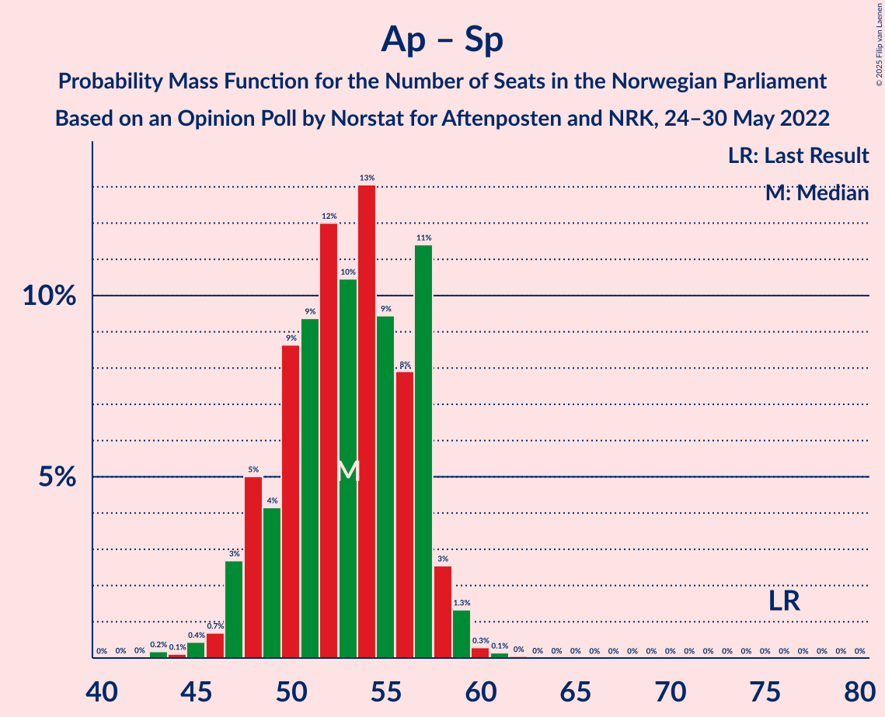

| Number of Seats | Probability | Accumulated | Special Marks |
|:---------------:|:-----------:|:-----------:|:-------------:|
| 43 | 0.2% | 100% |  |
| 44 | 0.1% | 99.8% |  |
| 45 | 0.4% | 99.7% |  |
| 46 | 0.7% | 99.2% |  |
| 47 | 3% | 98.5% |  |
| 48 | 5% | 96% |  |
| 49 | 4% | 91% |  |
| 50 | 9% | 87% |  |
| 51 | 9% | 78% |  |
| 52 | 12% | 69% |  |
| 53 | 10% | 57% |  |
| 54 | 13% | 46% | Median |
| 55 | 9% | 33% |  |
| 56 | 8% | 24% |  |
| 57 | 11% | 16% |  |
| 58 | 3% | 4% |  |
| 59 | 1.3% | 2% |  |
| 60 | 0.3% | 0.5% |  |
| 61 | 0.1% | 0.2% |  |
| 62 | 0% | 0.1% |  |
| 63 | 0% | 0% |  |
| 64 | 0% | 0% |  |
| 65 | 0% | 0% |  |
| 66 | 0% | 0% |  |
| 67 | 0% | 0% |  |
| 68 | 0% | 0% |  |
| 69 | 0% | 0% |  |
| 70 | 0% | 0% |  |
| 71 | 0% | 0% |  |
| 72 | 0% | 0% |  |
| 73 | 0% | 0% |  |
| 74 | 0% | 0% |  |
| 75 | 0% | 0% |  |
| 76 | 0% | 0% | Last Result |

### Senterpartiet – Venstre – Kristelig Folkeparti

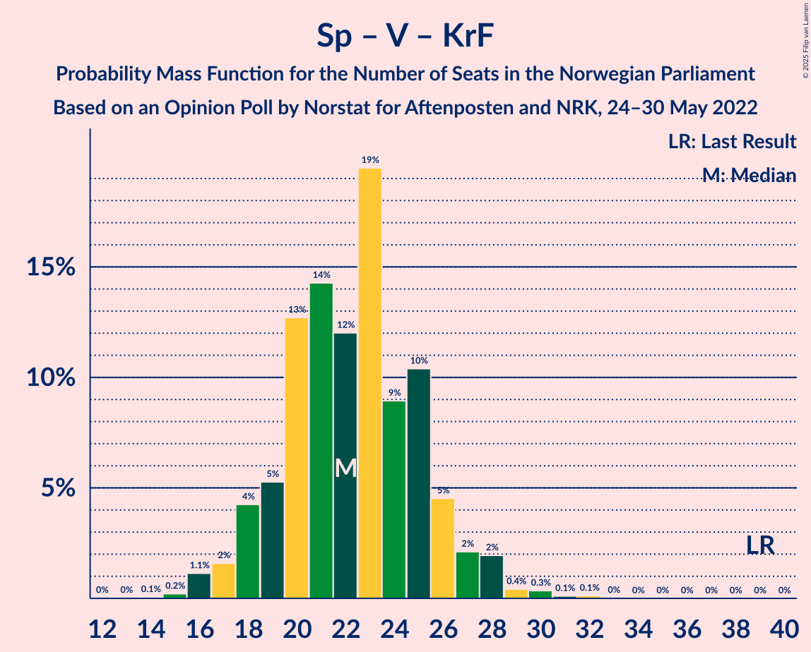

| Number of Seats | Probability | Accumulated | Special Marks |
|:---------------:|:-----------:|:-----------:|:-------------:|
| 13 | 0% | 100% |  |
| 14 | 0.1% | 99.9% |  |
| 15 | 0.2% | 99.9% |  |
| 16 | 1.1% | 99.7% |  |
| 17 | 2% | 98.5% |  |
| 18 | 4% | 97% |  |
| 19 | 5% | 93% |  |
| 20 | 13% | 87% |  |
| 21 | 14% | 75% |  |
| 22 | 12% | 60% | Median |
| 23 | 19% | 48% |  |
| 24 | 9% | 29% |  |
| 25 | 10% | 20% |  |
| 26 | 5% | 10% |  |
| 27 | 2% | 5% |  |
| 28 | 2% | 3% |  |
| 29 | 0.4% | 1.0% |  |
| 30 | 0.3% | 0.6% |  |
| 31 | 0.1% | 0.3% |  |
| 32 | 0.1% | 0.1% |  |
| 33 | 0% | 0% |  |
| 34 | 0% | 0% |  |
| 35 | 0% | 0% |  |
| 36 | 0% | 0% |  |
| 37 | 0% | 0% |  |
| 38 | 0% | 0% |  |
| 39 | 0% | 0% | Last Result |

## Technical Information

### Opinion Poll

+ **Polling firm:** Norstat
+ **Commissioner(s):** Aftenposten and NRK
+ **Fieldwork period:** 24–30 May 2022

### Calculations

+ **Sample size:** 949
+ **Simulations done:** 1,048,576
+ **Error estimate:** 1.45%

