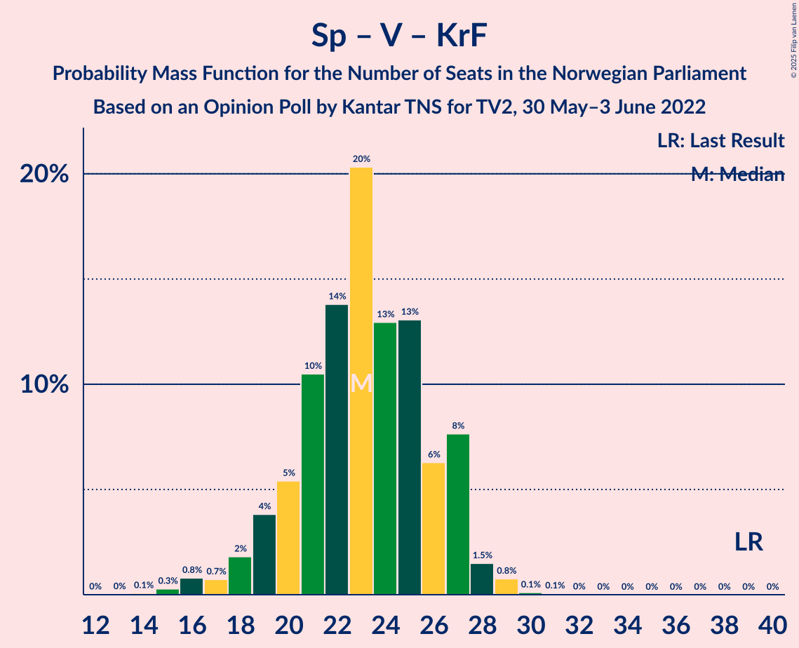

# Opinion Poll by Kantar TNS for TV2, 30 May–3 June 2022

<a href="#voting-intentions">Voting Intentions</a> | <a href="#seats">Seats</a> | <a href="#coalitions">Coalitions</a> | <a href="#technical-information">Technical Information</a>

## Voting Intentions

### Confidence Intervals

| Party | Last Result | Poll Result | 80% Confidence Interval | 90% Confidence Interval | 95% Confidence Interval | 99% Confidence Interval |
|:-----:|:-----------:|:-----------:|:-----------------------:|:-----------------------:|:-----------------------:|:-----------------------:|
| Høyre | 20.4% | 26.3% | 24.5–28.1% |24.0–28.6% |23.6–29.1% |22.8–30.0% |
| Arbeiderpartiet | 26.2% | 21.8% | 20.1–23.5% |19.7–24.0% |19.3–24.5% |18.5–25.3% |
| Fremskrittspartiet | 11.6% | 13.9% | 12.6–15.4% |12.2–15.8% |11.9–16.2% |11.2–17.0% |
| Sosialistisk Venstreparti | 7.6% | 10.0% | 8.9–11.4% |8.6–11.7% |8.3–12.1% |7.8–12.7% |
| Senterpartiet | 13.5% | 7.7% | 6.7–8.9% |6.4–9.2% |6.2–9.5% |5.7–10.1% |
| Rødt | 4.7% | 7.0% | 6.1–8.2% |5.8–8.5% |5.6–8.8% |5.2–9.4% |
| Venstre | 4.6% | 5.1% | 4.3–6.1% |4.1–6.4% |3.9–6.7% |3.5–7.2% |
| Miljøpartiet De Grønne | 3.9% | 2.7% | 2.1–3.4% |2.0–3.7% |1.8–3.9% |1.6–4.3% |
| Kristelig Folkeparti | 3.8% | 2.0% | 1.6–2.8% |1.4–3.0% |1.3–3.1% |1.1–3.5% |

*Note:* The poll result column reflects the actual value used in the calculations. Published results may vary slightly, and in addition be rounded to fewer digits.

## Seats

### Confidence Intervals

| Party | Last Result | Median | 80% Confidence Interval | 90% Confidence Interval | 95% Confidence Interval | 99% Confidence Interval |
|:-----:|:-----------:|:------:|:-----------------------:|:-----------------------:|:-----------------------:|:-----------------------:|
| <a href="#høyre">Høyre</a> | 36 | 46 | 43–50 |42–51 |41–52 |40–53 |
| <a href="#arbeiderpartiet">Arbeiderpartiet</a> | 48 | 40 | 37–44 |37–45 |36–46 |34–48 |
| <a href="#fremskrittspartiet">Fremskrittspartiet</a> | 21 | 24 | 22–28 |21–28 |21–29 |19–30 |
| <a href="#sosialistisk-venstreparti">Sosialistisk Venstreparti</a> | 13 | 18 | 15–20 |15–21 |14–22 |13–23 |
| <a href="#senterpartiet">Senterpartiet</a> | 28 | 14 | 12–16 |11–16 |10–17 |9–18 |
| <a href="#rødt">Rødt</a> | 8 | 12 | 11–14 |10–15 |10–15 |9–17 |
| <a href="#venstre">Venstre</a> | 8 | 9 | 8–11 |7–11 |3–12 |2–13 |
| <a href="#miljøpartiet-de-grønne">Miljøpartiet De Grønne</a> | 3 | 1 | 1–2 |1–2 |1–3 |0–7 |
| <a href="#kristelig-folkeparti">Kristelig Folkeparti</a> | 3 | 0 | 0–2 |0–2 |0–2 |0–3 |

### Høyre

*For a full overview of the results for this party, see the [Høyre](party-høyre.html) page.*

| Number of Seats | Probability | Accumulated | Special Marks |
|:---------------:|:-----------:|:-----------:|:-------------:|
| 36 | 0% | 100% | Last Result |
| 37 | 0% | 100% |  |
| 38 | 0.1% | 100% |  |
| 39 | 0.1% | 99.9% |  |
| 40 | 0.5% | 99.8% |  |
| 41 | 3% | 99.3% |  |
| 42 | 2% | 96% |  |
| 43 | 6% | 94% |  |
| 44 | 9% | 88% |  |
| 45 | 14% | 79% |  |
| 46 | 16% | 66% | Median |
| 47 | 17% | 49% |  |
| 48 | 9% | 33% |  |
| 49 | 9% | 23% |  |
| 50 | 7% | 15% |  |
| 51 | 3% | 7% |  |
| 52 | 3% | 4% |  |
| 53 | 0.8% | 1.2% |  |
| 54 | 0.2% | 0.4% |  |
| 55 | 0.2% | 0.2% |  |
| 56 | 0% | 0% |  |

### Arbeiderpartiet

*For a full overview of the results for this party, see the [Arbeiderpartiet](party-arbeiderpartiet.html) page.*

| Number of Seats | Probability | Accumulated | Special Marks |
|:---------------:|:-----------:|:-----------:|:-------------:|
| 32 | 0% | 100% |  |
| 33 | 0.1% | 99.9% |  |
| 34 | 0.4% | 99.8% |  |
| 35 | 1.1% | 99.4% |  |
| 36 | 3% | 98% |  |
| 37 | 11% | 96% |  |
| 38 | 14% | 85% |  |
| 39 | 14% | 71% |  |
| 40 | 14% | 57% | Median |
| 41 | 7% | 44% |  |
| 42 | 10% | 37% |  |
| 43 | 5% | 26% |  |
| 44 | 12% | 21% |  |
| 45 | 5% | 9% |  |
| 46 | 3% | 4% |  |
| 47 | 0.8% | 1.3% |  |
| 48 | 0.3% | 0.5% | Last Result |
| 49 | 0.1% | 0.2% |  |
| 50 | 0% | 0% |  |

### Fremskrittspartiet

*For a full overview of the results for this party, see the [Fremskrittspartiet](party-fremskrittspartiet.html) page.*

| Number of Seats | Probability | Accumulated | Special Marks |
|:---------------:|:-----------:|:-----------:|:-------------:|
| 18 | 0.1% | 100% |  |
| 19 | 0.4% | 99.9% |  |
| 20 | 2% | 99.5% |  |
| 21 | 7% | 98% | Last Result |
| 22 | 15% | 91% |  |
| 23 | 11% | 76% |  |
| 24 | 18% | 65% | Median |
| 25 | 14% | 47% |  |
| 26 | 14% | 32% |  |
| 27 | 7% | 18% |  |
| 28 | 7% | 11% |  |
| 29 | 2% | 4% |  |
| 30 | 2% | 2% |  |
| 31 | 0.3% | 0.5% |  |
| 32 | 0.1% | 0.2% |  |
| 33 | 0% | 0.1% |  |
| 34 | 0% | 0% |  |

### Sosialistisk Venstreparti

*For a full overview of the results for this party, see the [Sosialistisk Venstreparti](party-sosialistiskvenstreparti.html) page.*

| Number of Seats | Probability | Accumulated | Special Marks |
|:---------------:|:-----------:|:-----------:|:-------------:|
| 12 | 0.2% | 100% |  |
| 13 | 0.8% | 99.7% | Last Result |
| 14 | 4% | 99.0% |  |
| 15 | 7% | 95% |  |
| 16 | 17% | 88% |  |
| 17 | 20% | 72% |  |
| 18 | 16% | 52% | Median |
| 19 | 19% | 36% |  |
| 20 | 10% | 17% |  |
| 21 | 4% | 6% |  |
| 22 | 2% | 3% |  |
| 23 | 0.4% | 0.5% |  |
| 24 | 0.1% | 0.1% |  |
| 25 | 0% | 0% |  |

### Senterpartiet

*For a full overview of the results for this party, see the [Senterpartiet](party-senterpartiet.html) page.*

| Number of Seats | Probability | Accumulated | Special Marks |
|:---------------:|:-----------:|:-----------:|:-------------:|
| 8 | 0.1% | 100% |  |
| 9 | 0.5% | 99.9% |  |
| 10 | 2% | 99.4% |  |
| 11 | 6% | 97% |  |
| 12 | 15% | 91% |  |
| 13 | 20% | 76% |  |
| 14 | 27% | 56% | Median |
| 15 | 18% | 29% |  |
| 16 | 8% | 11% |  |
| 17 | 2% | 3% |  |
| 18 | 0.9% | 1.0% |  |
| 19 | 0.1% | 0.2% |  |
| 20 | 0% | 0% |  |
| 21 | 0% | 0% |  |
| 22 | 0% | 0% |  |
| 23 | 0% | 0% |  |
| 24 | 0% | 0% |  |
| 25 | 0% | 0% |  |
| 26 | 0% | 0% |  |
| 27 | 0% | 0% |  |
| 28 | 0% | 0% | Last Result |

### Rødt

*For a full overview of the results for this party, see the [Rødt](party-rødt.html) page.*

| Number of Seats | Probability | Accumulated | Special Marks |
|:---------------:|:-----------:|:-----------:|:-------------:|
| 8 | 0.1% | 100% | Last Result |
| 9 | 2% | 99.9% |  |
| 10 | 6% | 98% |  |
| 11 | 24% | 92% |  |
| 12 | 20% | 68% | Median |
| 13 | 22% | 47% |  |
| 14 | 18% | 25% |  |
| 15 | 5% | 7% |  |
| 16 | 2% | 2% |  |
| 17 | 0.4% | 0.5% |  |
| 18 | 0.1% | 0.1% |  |
| 19 | 0% | 0% |  |

### Venstre

*For a full overview of the results for this party, see the [Venstre](party-venstre.html) page.*

| Number of Seats | Probability | Accumulated | Special Marks |
|:---------------:|:-----------:|:-----------:|:-------------:|
| 2 | 1.1% | 100% |  |
| 3 | 3% | 98.9% |  |
| 4 | 0% | 95% |  |
| 5 | 0% | 95% |  |
| 6 | 0% | 95% |  |
| 7 | 5% | 95% |  |
| 8 | 20% | 91% | Last Result |
| 9 | 38% | 70% | Median |
| 10 | 21% | 33% |  |
| 11 | 8% | 11% |  |
| 12 | 2% | 3% |  |
| 13 | 0.6% | 0.7% |  |
| 14 | 0.1% | 0.1% |  |
| 15 | 0% | 0% |  |

### Miljøpartiet De Grønne

*For a full overview of the results for this party, see the [Miljøpartiet De Grønne](party-miljøpartietdegrønne.html) page.*

| Number of Seats | Probability | Accumulated | Special Marks |
|:---------------:|:-----------:|:-----------:|:-------------:|
| 0 | 1.2% | 100% |  |
| 1 | 69% | 98.8% | Median |
| 2 | 25% | 29% |  |
| 3 | 3% | 4% | Last Result |
| 4 | 0% | 1.4% |  |
| 5 | 0% | 1.4% |  |
| 6 | 0.2% | 1.4% |  |
| 7 | 1.0% | 1.2% |  |
| 8 | 0.3% | 0.3% |  |
| 9 | 0% | 0% |  |

### Kristelig Folkeparti

*For a full overview of the results for this party, see the [Kristelig Folkeparti](party-kristeligfolkeparti.html) page.*

| Number of Seats | Probability | Accumulated | Special Marks |
|:---------------:|:-----------:|:-----------:|:-------------:|
| 0 | 66% | 100% | Median |
| 1 | 8% | 34% |  |
| 2 | 25% | 26% |  |
| 3 | 0.5% | 0.5% | Last Result |
| 4 | 0% | 0% |  |

## Coalitions

### Confidence Intervals

| Coalition | Last Result | Median | Majority? | 80% Confidence Interval | 90% Confidence Interval | 95% Confidence Interval | 99% Confidence Interval |
|:---------:|:-----------:|:------:|:---------:|:-----------------------:|:-----------------------:|:-----------------------:|:-----------------------:|
| Høyre – Fremskrittspartiet – Senterpartiet – Venstre – Kristelig Folkeparti | 96 | 95 | 99.6% | 89–99 | 86–100 | 86–101 | 85–103 |
| Arbeiderpartiet – Sosialistisk Venstreparti – Senterpartiet – Rødt – Miljøpartiet De Grønne | 100 | 86 | 66% | 81–89 | 80–91 | 79–92 | 77–94 |
| Arbeiderpartiet – Sosialistisk Venstreparti – Senterpartiet – Rødt | 97 | 84 | 48% | 79–88 | 79–90 | 77–90 | 75–92 |
| Høyre – Fremskrittspartiet – Venstre – Miljøpartiet De Grønne – Kristelig Folkeparti | 71 | 82 | 21% | 77–86 | 75–88 | 74–88 | 73–91 |
| Høyre – Fremskrittspartiet – Venstre – Kristelig Folkeparti | 68 | 81 | 10% | 75–85 | 74–86 | 73–87 | 72–89 |
| Høyre – Fremskrittspartiet – Venstre | 65 | 80 | 7% | 75–84 | 74–85 | 72–87 | 71–88 |
| Arbeiderpartiet – Sosialistisk Venstreparti – Senterpartiet – Miljøpartiet De Grønne – Kristelig Folkeparti | 95 | 74 | 0% | 70–78 | 69–79 | 68–80 | 66–81 |
| Arbeiderpartiet – Sosialistisk Venstreparti – Senterpartiet – Miljøpartiet De Grønne | 92 | 74 | 0% | 69–77 | 68–78 | 67–79 | 65–81 |
| Arbeiderpartiet – Sosialistisk Venstreparti – Rødt – Miljøpartiet De Grønne | 72 | 72 | 0% | 68–76 | 67–77 | 66–78 | 64–80 |
| Arbeiderpartiet – Sosialistisk Venstreparti – Senterpartiet | 89 | 72 | 0% | 68–76 | 67–77 | 66–77 | 64–79 |
| Høyre – Fremskrittspartiet | 57 | 71 | 0% | 66–75 | 66–76 | 64–77 | 63–79 |
| Arbeiderpartiet – Sosialistisk Venstreparti | 61 | 58 | 0% | 54–62 | 53–63 | 52–63 | 51–65 |
| Arbeiderpartiet – Senterpartiet – Miljøpartiet De Grønne – Kristelig Folkeparti | 82 | 56 | 0% | 52–60 | 51–61 | 51–62 | 49–64 |
| Høyre – Venstre – Kristelig Folkeparti | 47 | 56 | 0% | 52–60 | 51–61 | 50–62 | 48–64 |
| Arbeiderpartiet – Senterpartiet – Kristelig Folkeparti | 79 | 54 | 0% | 51–59 | 50–59 | 49–60 | 48–62 |
| Arbeiderpartiet – Senterpartiet | 76 | 54 | 0% | 51–58 | 50–59 | 49–59 | 48–62 |
| Senterpartiet – Venstre – Kristelig Folkeparti | 39 | 23 | 0% | 20–27 | 19–27 | 18–27 | 16–29 |

### Høyre – Fremskrittspartiet – Senterpartiet – Venstre – Kristelig Folkeparti

| Number of Seats | Probability | Accumulated | Special Marks |
|:---------------:|:-----------:|:-----------:|:-------------:|
| 82 | 0.1% | 100% |  |
| 83 | 0% | 99.9% |  |
| 84 | 0.2% | 99.8% |  |
| 85 | 2% | 99.6% | Majority |
| 86 | 3% | 98% |  |
| 87 | 0.8% | 95% |  |
| 88 | 2% | 94% |  |
| 89 | 4% | 92% |  |
| 90 | 4% | 88% |  |
| 91 | 8% | 84% |  |
| 92 | 5% | 76% |  |
| 93 | 14% | 71% | Median |
| 94 | 7% | 57% |  |
| 95 | 10% | 50% |  |
| 96 | 13% | 40% | Last Result |
| 97 | 7% | 27% |  |
| 98 | 10% | 20% |  |
| 99 | 4% | 10% |  |
| 100 | 2% | 6% |  |
| 101 | 2% | 4% |  |
| 102 | 1.1% | 2% |  |
| 103 | 0.4% | 0.7% |  |
| 104 | 0.2% | 0.3% |  |
| 105 | 0.1% | 0.1% |  |
| 106 | 0% | 0% |  |

### Arbeiderpartiet – Sosialistisk Venstreparti – Senterpartiet – Rødt – Miljøpartiet De Grønne

| Number of Seats | Probability | Accumulated | Special Marks |
|:---------------:|:-----------:|:-----------:|:-------------:|
| 74 | 0% | 100% |  |
| 75 | 0% | 99.9% |  |
| 76 | 0.2% | 99.9% |  |
| 77 | 0.7% | 99.6% |  |
| 78 | 0.9% | 98.9% |  |
| 79 | 2% | 98% |  |
| 80 | 6% | 96% |  |
| 81 | 4% | 91% |  |
| 82 | 6% | 87% |  |
| 83 | 4% | 81% |  |
| 84 | 11% | 76% |  |
| 85 | 14% | 66% | Median, Majority |
| 86 | 12% | 52% |  |
| 87 | 7% | 40% |  |
| 88 | 15% | 33% |  |
| 89 | 9% | 19% |  |
| 90 | 2% | 10% |  |
| 91 | 4% | 7% |  |
| 92 | 1.4% | 3% |  |
| 93 | 1.0% | 1.5% |  |
| 94 | 0.3% | 0.5% |  |
| 95 | 0.2% | 0.3% |  |
| 96 | 0.1% | 0.1% |  |
| 97 | 0% | 0% |  |
| 98 | 0% | 0% |  |
| 99 | 0% | 0% |  |
| 100 | 0% | 0% | Last Result |

### Arbeiderpartiet – Sosialistisk Venstreparti – Senterpartiet – Rødt

| Number of Seats | Probability | Accumulated | Special Marks |
|:---------------:|:-----------:|:-----------:|:-------------:|
| 72 | 0% | 100% |  |
| 73 | 0% | 99.9% |  |
| 74 | 0.1% | 99.9% |  |
| 75 | 0.3% | 99.8% |  |
| 76 | 0.7% | 99.5% |  |
| 77 | 1.3% | 98.8% |  |
| 78 | 2% | 97% |  |
| 79 | 6% | 95% |  |
| 80 | 5% | 89% |  |
| 81 | 5% | 84% |  |
| 82 | 5% | 79% |  |
| 83 | 12% | 74% |  |
| 84 | 15% | 62% | Median |
| 85 | 11% | 48% | Majority |
| 86 | 13% | 37% |  |
| 87 | 10% | 24% |  |
| 88 | 7% | 14% |  |
| 89 | 2% | 8% |  |
| 90 | 4% | 6% |  |
| 91 | 0.9% | 2% |  |
| 92 | 0.9% | 1.1% |  |
| 93 | 0.1% | 0.3% |  |
| 94 | 0.1% | 0.1% |  |
| 95 | 0% | 0.1% |  |
| 96 | 0% | 0% |  |
| 97 | 0% | 0% | Last Result |

### Høyre – Fremskrittspartiet – Venstre – Miljøpartiet De Grønne – Kristelig Folkeparti

| Number of Seats | Probability | Accumulated | Special Marks |
|:---------------:|:-----------:|:-----------:|:-------------:|
| 70 | 0% | 100% |  |
| 71 | 0.1% | 99.9% | Last Result |
| 72 | 0.1% | 99.9% |  |
| 73 | 2% | 99.7% |  |
| 74 | 0.4% | 98% |  |
| 75 | 3% | 97% |  |
| 76 | 4% | 95% |  |
| 77 | 4% | 91% |  |
| 78 | 7% | 87% |  |
| 79 | 3% | 81% |  |
| 80 | 6% | 78% | Median |
| 81 | 11% | 71% |  |
| 82 | 15% | 61% |  |
| 83 | 10% | 45% |  |
| 84 | 14% | 35% |  |
| 85 | 10% | 21% | Majority |
| 86 | 3% | 12% |  |
| 87 | 3% | 8% |  |
| 88 | 3% | 5% |  |
| 89 | 0.9% | 2% |  |
| 90 | 0.8% | 1.4% |  |
| 91 | 0.3% | 0.5% |  |
| 92 | 0.2% | 0.2% |  |
| 93 | 0% | 0% |  |

### Høyre – Fremskrittspartiet – Venstre – Kristelig Folkeparti

| Number of Seats | Probability | Accumulated | Special Marks |
|:---------------:|:-----------:|:-----------:|:-------------:|
| 68 | 0% | 100% | Last Result |
| 69 | 0.1% | 100% |  |
| 70 | 0.1% | 99.9% |  |
| 71 | 0.2% | 99.8% |  |
| 72 | 2% | 99.6% |  |
| 73 | 0.8% | 98% |  |
| 74 | 2% | 97% |  |
| 75 | 5% | 95% |  |
| 76 | 4% | 90% |  |
| 77 | 6% | 85% |  |
| 78 | 4% | 79% |  |
| 79 | 9% | 75% | Median |
| 80 | 15% | 67% |  |
| 81 | 11% | 52% |  |
| 82 | 10% | 41% |  |
| 83 | 12% | 31% |  |
| 84 | 9% | 19% |  |
| 85 | 3% | 10% | Majority |
| 86 | 3% | 7% |  |
| 87 | 2% | 4% |  |
| 88 | 0.8% | 2% |  |
| 89 | 0.6% | 0.9% |  |
| 90 | 0.1% | 0.3% |  |
| 91 | 0.1% | 0.2% |  |
| 92 | 0% | 0% |  |

### Høyre – Fremskrittspartiet – Venstre

| Number of Seats | Probability | Accumulated | Special Marks |
|:---------------:|:-----------:|:-----------:|:-------------:|
| 65 | 0% | 100% | Last Result |
| 66 | 0% | 100% |  |
| 67 | 0% | 100% |  |
| 68 | 0.1% | 100% |  |
| 69 | 0.1% | 99.9% |  |
| 70 | 0.1% | 99.8% |  |
| 71 | 0.4% | 99.7% |  |
| 72 | 2% | 99.4% |  |
| 73 | 2% | 97% |  |
| 74 | 3% | 96% |  |
| 75 | 5% | 92% |  |
| 76 | 4% | 87% |  |
| 77 | 8% | 83% |  |
| 78 | 3% | 75% |  |
| 79 | 11% | 71% | Median |
| 80 | 15% | 60% |  |
| 81 | 13% | 45% |  |
| 82 | 10% | 33% |  |
| 83 | 10% | 23% |  |
| 84 | 6% | 13% |  |
| 85 | 2% | 7% | Majority |
| 86 | 2% | 5% |  |
| 87 | 2% | 3% |  |
| 88 | 0.5% | 1.0% |  |
| 89 | 0.4% | 0.5% |  |
| 90 | 0.1% | 0.1% |  |
| 91 | 0% | 0% |  |

### Arbeiderpartiet – Sosialistisk Venstreparti – Senterpartiet – Miljøpartiet De Grønne – Kristelig Folkeparti

| Number of Seats | Probability | Accumulated | Special Marks |
|:---------------:|:-----------:|:-----------:|:-------------:|
| 63 | 0.1% | 100% |  |
| 64 | 0.1% | 99.9% |  |
| 65 | 0.2% | 99.8% |  |
| 66 | 0.7% | 99.6% |  |
| 67 | 0.9% | 98.9% |  |
| 68 | 2% | 98% |  |
| 69 | 6% | 96% |  |
| 70 | 7% | 90% |  |
| 71 | 8% | 83% |  |
| 72 | 7% | 76% |  |
| 73 | 11% | 68% | Median |
| 74 | 16% | 57% |  |
| 75 | 10% | 41% |  |
| 76 | 10% | 31% |  |
| 77 | 11% | 21% |  |
| 78 | 5% | 10% |  |
| 79 | 2% | 5% |  |
| 80 | 2% | 3% |  |
| 81 | 0.7% | 1.1% |  |
| 82 | 0.3% | 0.5% |  |
| 83 | 0.1% | 0.2% |  |
| 84 | 0% | 0.1% |  |
| 85 | 0% | 0% | Majority |
| 86 | 0% | 0% |  |
| 87 | 0% | 0% |  |
| 88 | 0% | 0% |  |
| 89 | 0% | 0% |  |
| 90 | 0% | 0% |  |
| 91 | 0% | 0% |  |
| 92 | 0% | 0% |  |
| 93 | 0% | 0% |  |
| 94 | 0% | 0% |  |
| 95 | 0% | 0% | Last Result |

### Arbeiderpartiet – Sosialistisk Venstreparti – Senterpartiet – Miljøpartiet De Grønne

| Number of Seats | Probability | Accumulated | Special Marks |
|:---------------:|:-----------:|:-----------:|:-------------:|
| 63 | 0.1% | 100% |  |
| 64 | 0.1% | 99.9% |  |
| 65 | 0.6% | 99.8% |  |
| 66 | 0.9% | 99.2% |  |
| 67 | 1.4% | 98% |  |
| 68 | 3% | 97% |  |
| 69 | 7% | 94% |  |
| 70 | 7% | 86% |  |
| 71 | 9% | 79% |  |
| 72 | 9% | 70% |  |
| 73 | 10% | 61% | Median |
| 74 | 19% | 51% |  |
| 75 | 10% | 32% |  |
| 76 | 7% | 22% |  |
| 77 | 7% | 15% |  |
| 78 | 4% | 8% |  |
| 79 | 2% | 4% |  |
| 80 | 1.1% | 2% |  |
| 81 | 0.3% | 0.6% |  |
| 82 | 0.2% | 0.3% |  |
| 83 | 0.1% | 0.1% |  |
| 84 | 0% | 0% |  |
| 85 | 0% | 0% | Majority |
| 86 | 0% | 0% |  |
| 87 | 0% | 0% |  |
| 88 | 0% | 0% |  |
| 89 | 0% | 0% |  |
| 90 | 0% | 0% |  |
| 91 | 0% | 0% |  |
| 92 | 0% | 0% | Last Result |

### Arbeiderpartiet – Sosialistisk Venstreparti – Rødt – Miljøpartiet De Grønne

| Number of Seats | Probability | Accumulated | Special Marks |
|:---------------:|:-----------:|:-----------:|:-------------:|
| 61 | 0% | 100% |  |
| 62 | 0.2% | 99.9% |  |
| 63 | 0.2% | 99.8% |  |
| 64 | 0.8% | 99.6% |  |
| 65 | 1.0% | 98.8% |  |
| 66 | 2% | 98% |  |
| 67 | 3% | 96% |  |
| 68 | 7% | 92% |  |
| 69 | 5% | 85% |  |
| 70 | 14% | 80% |  |
| 71 | 10% | 66% | Median |
| 72 | 14% | 56% | Last Result |
| 73 | 11% | 42% |  |
| 74 | 6% | 31% |  |
| 75 | 12% | 25% |  |
| 76 | 6% | 13% |  |
| 77 | 4% | 7% |  |
| 78 | 2% | 3% |  |
| 79 | 0.9% | 2% |  |
| 80 | 0.3% | 0.6% |  |
| 81 | 0.2% | 0.3% |  |
| 82 | 0.1% | 0.1% |  |
| 83 | 0% | 0.1% |  |
| 84 | 0% | 0% |  |

### Arbeiderpartiet – Sosialistisk Venstreparti – Senterpartiet

| Number of Seats | Probability | Accumulated | Special Marks |
|:---------------:|:-----------:|:-----------:|:-------------:|
| 61 | 0% | 100% |  |
| 62 | 0.1% | 99.9% |  |
| 63 | 0.1% | 99.9% |  |
| 64 | 0.9% | 99.7% |  |
| 65 | 0.9% | 98.9% |  |
| 66 | 2% | 98% |  |
| 67 | 4% | 96% |  |
| 68 | 7% | 92% |  |
| 69 | 8% | 85% |  |
| 70 | 10% | 77% |  |
| 71 | 8% | 67% |  |
| 72 | 16% | 59% | Median |
| 73 | 16% | 43% |  |
| 74 | 8% | 27% |  |
| 75 | 9% | 19% |  |
| 76 | 4% | 10% |  |
| 77 | 4% | 6% |  |
| 78 | 1.3% | 2% |  |
| 79 | 0.5% | 0.9% |  |
| 80 | 0.3% | 0.4% |  |
| 81 | 0.1% | 0.2% |  |
| 82 | 0% | 0.1% |  |
| 83 | 0% | 0% |  |
| 84 | 0% | 0% |  |
| 85 | 0% | 0% | Majority |
| 86 | 0% | 0% |  |
| 87 | 0% | 0% |  |
| 88 | 0% | 0% |  |
| 89 | 0% | 0% | Last Result |

### Høyre – Fremskrittspartiet

| Number of Seats | Probability | Accumulated | Special Marks |
|:---------------:|:-----------:|:-----------:|:-------------:|
| 57 | 0% | 100% | Last Result |
| 58 | 0% | 100% |  |
| 59 | 0% | 100% |  |
| 60 | 0% | 100% |  |
| 61 | 0.1% | 100% |  |
| 62 | 0.1% | 99.9% |  |
| 63 | 2% | 99.8% |  |
| 64 | 0.6% | 98% |  |
| 65 | 2% | 97% |  |
| 66 | 5% | 95% |  |
| 67 | 5% | 90% |  |
| 68 | 5% | 85% |  |
| 69 | 8% | 80% |  |
| 70 | 14% | 72% | Median |
| 71 | 13% | 58% |  |
| 72 | 14% | 45% |  |
| 73 | 7% | 30% |  |
| 74 | 8% | 23% |  |
| 75 | 6% | 14% |  |
| 76 | 4% | 9% |  |
| 77 | 2% | 4% |  |
| 78 | 1.3% | 2% |  |
| 79 | 0.6% | 1.0% |  |
| 80 | 0.2% | 0.3% |  |
| 81 | 0% | 0.1% |  |
| 82 | 0% | 0.1% |  |
| 83 | 0% | 0% |  |

### Arbeiderpartiet – Sosialistisk Venstreparti

| Number of Seats | Probability | Accumulated | Special Marks |
|:---------------:|:-----------:|:-----------:|:-------------:|
| 49 | 0.1% | 100% |  |
| 50 | 0.1% | 99.9% |  |
| 51 | 1.0% | 99.8% |  |
| 52 | 2% | 98.8% |  |
| 53 | 3% | 97% |  |
| 54 | 5% | 94% |  |
| 55 | 5% | 89% |  |
| 56 | 10% | 84% |  |
| 57 | 11% | 75% |  |
| 58 | 20% | 63% | Median |
| 59 | 14% | 43% |  |
| 60 | 7% | 29% |  |
| 61 | 11% | 22% | Last Result |
| 62 | 3% | 11% |  |
| 63 | 6% | 8% |  |
| 64 | 1.2% | 2% |  |
| 65 | 0.5% | 0.9% |  |
| 66 | 0.2% | 0.3% |  |
| 67 | 0.1% | 0.2% |  |
| 68 | 0% | 0% |  |

### Arbeiderpartiet – Senterpartiet – Miljøpartiet De Grønne – Kristelig Folkeparti

| Number of Seats | Probability | Accumulated | Special Marks |
|:---------------:|:-----------:|:-----------:|:-------------:|
| 47 | 0% | 100% |  |
| 48 | 0.1% | 99.9% |  |
| 49 | 0.7% | 99.8% |  |
| 50 | 1.1% | 99.1% |  |
| 51 | 4% | 98% |  |
| 52 | 10% | 94% |  |
| 53 | 3% | 85% |  |
| 54 | 11% | 81% |  |
| 55 | 16% | 70% | Median |
| 56 | 11% | 53% |  |
| 57 | 10% | 43% |  |
| 58 | 9% | 33% |  |
| 59 | 7% | 24% |  |
| 60 | 9% | 17% |  |
| 61 | 5% | 8% |  |
| 62 | 1.4% | 3% |  |
| 63 | 0.7% | 2% |  |
| 64 | 0.5% | 0.8% |  |
| 65 | 0.2% | 0.3% |  |
| 66 | 0.1% | 0.2% |  |
| 67 | 0% | 0.1% |  |
| 68 | 0% | 0% |  |
| 69 | 0% | 0% |  |
| 70 | 0% | 0% |  |
| 71 | 0% | 0% |  |
| 72 | 0% | 0% |  |
| 73 | 0% | 0% |  |
| 74 | 0% | 0% |  |
| 75 | 0% | 0% |  |
| 76 | 0% | 0% |  |
| 77 | 0% | 0% |  |
| 78 | 0% | 0% |  |
| 79 | 0% | 0% |  |
| 80 | 0% | 0% |  |
| 81 | 0% | 0% |  |
| 82 | 0% | 0% | Last Result |

### Høyre – Venstre – Kristelig Folkeparti

| Number of Seats | Probability | Accumulated | Special Marks |
|:---------------:|:-----------:|:-----------:|:-------------:|
| 44 | 0.1% | 100% |  |
| 45 | 0% | 99.9% |  |
| 46 | 0% | 99.9% |  |
| 47 | 0.2% | 99.8% | Last Result |
| 48 | 0.3% | 99.6% |  |
| 49 | 0.9% | 99.3% |  |
| 50 | 2% | 98% |  |
| 51 | 3% | 96% |  |
| 52 | 4% | 93% |  |
| 53 | 6% | 90% |  |
| 54 | 13% | 83% |  |
| 55 | 15% | 70% | Median |
| 56 | 14% | 55% |  |
| 57 | 8% | 41% |  |
| 58 | 12% | 33% |  |
| 59 | 6% | 20% |  |
| 60 | 6% | 14% |  |
| 61 | 4% | 8% |  |
| 62 | 2% | 4% |  |
| 63 | 0.7% | 1.3% |  |
| 64 | 0.5% | 0.6% |  |
| 65 | 0.1% | 0.1% |  |
| 66 | 0% | 0.1% |  |
| 67 | 0% | 0% |  |

### Arbeiderpartiet – Senterpartiet – Kristelig Folkeparti

| Number of Seats | Probability | Accumulated | Special Marks |
|:---------------:|:-----------:|:-----------:|:-------------:|
| 45 | 0.1% | 100% |  |
| 46 | 0% | 99.9% |  |
| 47 | 0.2% | 99.9% |  |
| 48 | 0.9% | 99.7% |  |
| 49 | 1.3% | 98.8% |  |
| 50 | 4% | 97% |  |
| 51 | 10% | 93% |  |
| 52 | 5% | 84% |  |
| 53 | 14% | 79% |  |
| 54 | 17% | 65% | Median |
| 55 | 12% | 48% |  |
| 56 | 8% | 36% |  |
| 57 | 6% | 28% |  |
| 58 | 8% | 22% |  |
| 59 | 10% | 14% |  |
| 60 | 2% | 4% |  |
| 61 | 0.6% | 1.5% |  |
| 62 | 0.5% | 0.9% |  |
| 63 | 0.2% | 0.4% |  |
| 64 | 0.1% | 0.2% |  |
| 65 | 0.1% | 0.1% |  |
| 66 | 0% | 0% |  |
| 67 | 0% | 0% |  |
| 68 | 0% | 0% |  |
| 69 | 0% | 0% |  |
| 70 | 0% | 0% |  |
| 71 | 0% | 0% |  |
| 72 | 0% | 0% |  |
| 73 | 0% | 0% |  |
| 74 | 0% | 0% |  |
| 75 | 0% | 0% |  |
| 76 | 0% | 0% |  |
| 77 | 0% | 0% |  |
| 78 | 0% | 0% |  |
| 79 | 0% | 0% | Last Result |

### Arbeiderpartiet – Senterpartiet

| Number of Seats | Probability | Accumulated | Special Marks |
|:---------------:|:-----------:|:-----------:|:-------------:|
| 45 | 0.1% | 100% |  |
| 46 | 0.1% | 99.9% |  |
| 47 | 0.3% | 99.8% |  |
| 48 | 1.4% | 99.5% |  |
| 49 | 2% | 98% |  |
| 50 | 5% | 96% |  |
| 51 | 13% | 90% |  |
| 52 | 8% | 77% |  |
| 53 | 13% | 70% |  |
| 54 | 16% | 57% | Median |
| 55 | 10% | 41% |  |
| 56 | 6% | 31% |  |
| 57 | 8% | 25% |  |
| 58 | 7% | 16% |  |
| 59 | 7% | 9% |  |
| 60 | 1.2% | 2% |  |
| 61 | 0.3% | 1.0% |  |
| 62 | 0.4% | 0.6% |  |
| 63 | 0.1% | 0.2% |  |
| 64 | 0% | 0.1% |  |
| 65 | 0.1% | 0.1% |  |
| 66 | 0% | 0% |  |
| 67 | 0% | 0% |  |
| 68 | 0% | 0% |  |
| 69 | 0% | 0% |  |
| 70 | 0% | 0% |  |
| 71 | 0% | 0% |  |
| 72 | 0% | 0% |  |
| 73 | 0% | 0% |  |
| 74 | 0% | 0% |  |
| 75 | 0% | 0% |  |
| 76 | 0% | 0% | Last Result |

### Senterpartiet – Venstre – Kristelig Folkeparti

| Number of Seats | Probability | Accumulated | Special Marks |
|:---------------:|:-----------:|:-----------:|:-------------:|
| 14 | 0.1% | 100% |  |
| 15 | 0.3% | 99.9% |  |
| 16 | 0.8% | 99.6% |  |
| 17 | 0.7% | 98.8% |  |
| 18 | 2% | 98% |  |
| 19 | 4% | 96% |  |
| 20 | 5% | 92% |  |
| 21 | 10% | 87% |  |
| 22 | 14% | 77% |  |
| 23 | 20% | 63% | Median |
| 24 | 13% | 42% |  |
| 25 | 13% | 29% |  |
| 26 | 6% | 16% |  |
| 27 | 8% | 10% |  |
| 28 | 1.5% | 2% |  |
| 29 | 0.8% | 1.0% |  |
| 30 | 0.1% | 0.2% |  |
| 31 | 0.1% | 0.1% |  |
| 32 | 0% | 0% |  |
| 33 | 0% | 0% |  |
| 34 | 0% | 0% |  |
| 35 | 0% | 0% |  |
| 36 | 0% | 0% |  |
| 37 | 0% | 0% |  |
| 38 | 0% | 0% |  |
| 39 | 0% | 0% | Last Result |

## Technical Information

### Opinion Poll

+ **Polling firm:** Kantar TNS
+ **Commissioner(s):** TV2
+ **Fieldwork period:** 30 May–3 June 2022

### Calculations

+ **Sample size:** 979
+ **Simulations done:** 1,048,576
+ **Error estimate:** 3.12%

