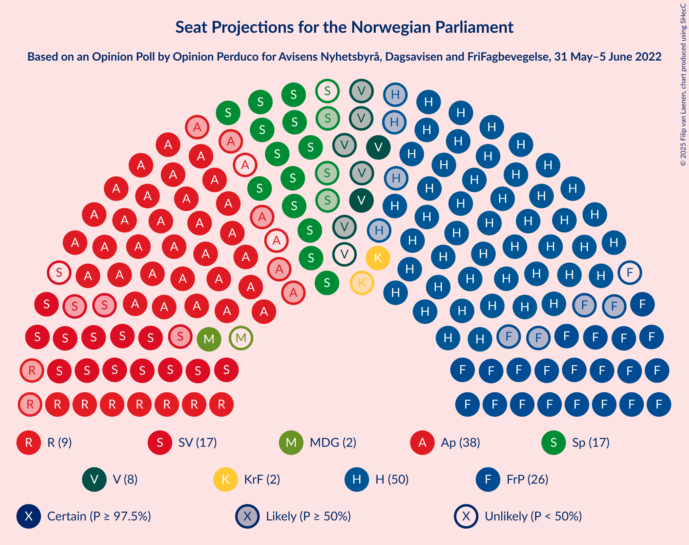
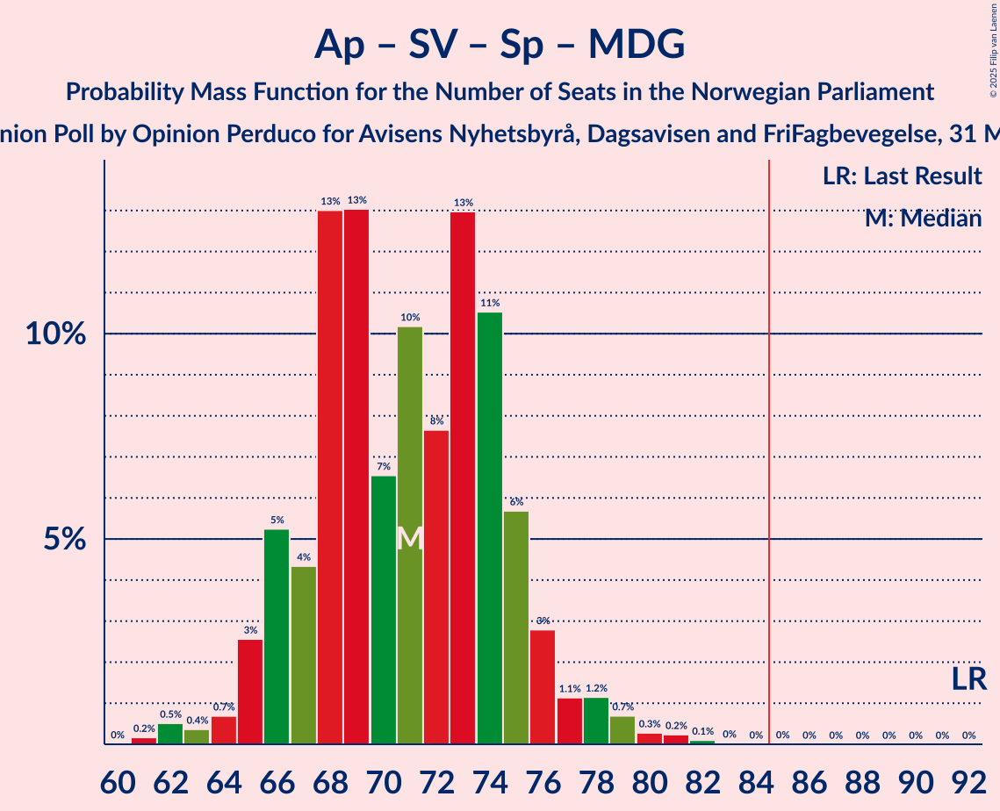
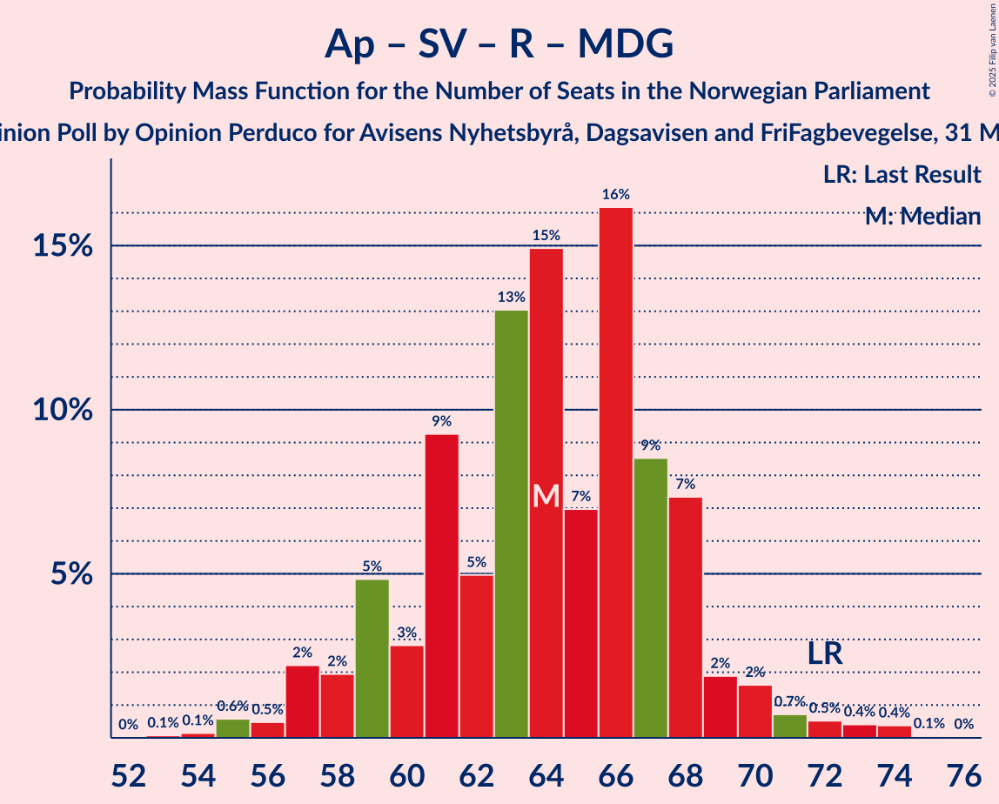
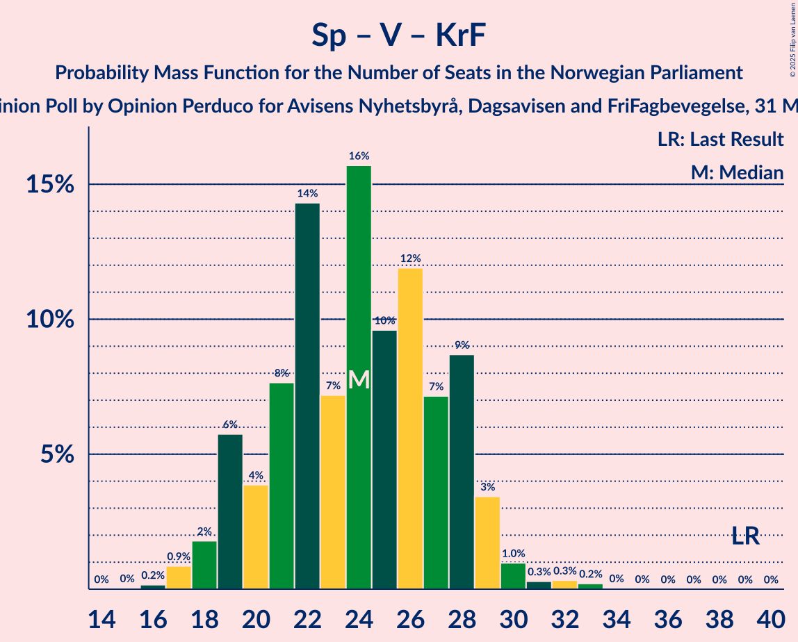

# Opinion Poll by Opinion Perduco for Avisens Nyhetsbyrå, Dagsavisen and FriFagbevegelse, 31 May–5 June 2022

<a href="#voting-intentions">Voting Intentions</a> | <a href="#seats">Seats</a> | <a href="#coalitions">Coalitions</a> | <a href="#technical-information">Technical Information</a>

## Voting Intentions

### Confidence Intervals

| Party | Last Result | Poll Result | 80% Confidence Interval | 90% Confidence Interval | 95% Confidence Interval | 99% Confidence Interval |
|:-----:|:-----------:|:-----------:|:-----------------------:|:-----------------------:|:-----------------------:|:-----------------------:|
| Høyre | 20.4% | 28.0% | 26.2–29.9% |25.7–30.4% |25.2–30.9% |24.4–31.8% |
| Arbeiderpartiet | 26.2% | 19.7% | 18.1–21.4% |17.7–21.9% |17.3–22.3% |16.6–23.2% |
| Fremskrittspartiet | 11.6% | 14.1% | 12.7–15.6% |12.4–16.1% |12.0–16.4% |11.4–17.2% |
| Sosialistisk Venstreparti | 7.6% | 9.3% | 8.2–10.6% |7.9–11.0% |7.7–11.3% |7.1–12.0% |
| Senterpartiet | 13.5% | 9.2% | 8.1–10.5% |7.8–10.9% |7.5–11.2% |7.1–11.9% |
| Rødt | 4.7% | 5.4% | 4.6–6.4% |4.3–6.7% |4.1–7.0% |3.8–7.5% |
| Venstre | 4.6% | 4.1% | 3.4–5.1% |3.2–5.4% |3.0–5.6% |2.7–6.1% |
| Miljøpartiet De Grønne | 3.9% | 2.9% | 2.3–3.7% |2.1–4.0% |2.0–4.2% |1.8–4.6% |
| Kristelig Folkeparti | 3.8% | 2.8% | 2.2–3.6% |2.1–3.8% |1.9–4.1% |1.7–4.5% |

*Note:* The poll result column reflects the actual value used in the calculations. Published results may vary slightly, and in addition be rounded to fewer digits.

## Seats

### Confidence Intervals

| Party | Last Result | Median | 80% Confidence Interval | 90% Confidence Interval | 95% Confidence Interval | 99% Confidence Interval |
|:-----:|:-----------:|:------:|:-----------------------:|:-----------------------:|:-----------------------:|:-----------------------:|
| <a href="#høyre">Høyre</a> | 36 | 50 | 46–53 |45–54 |45–55 |42–58 |
| <a href="#arbeiderpartiet">Arbeiderpartiet</a> | 48 | 37 | 34–40 |33–41 |32–41 |31–44 |
| <a href="#fremskrittspartiet">Fremskrittspartiet</a> | 21 | 25 | 22–28 |21–29 |21–30 |19–31 |
| <a href="#sosialistisk-venstreparti">Sosialistisk Venstreparti</a> | 13 | 16 | 14–18 |13–19 |13–20 |11–21 |
| <a href="#senterpartiet">Senterpartiet</a> | 28 | 16 | 14–18 |13–19 |13–20 |12–21 |
| <a href="#rødt">Rødt</a> | 8 | 9 | 8–11 |7–11 |7–12 |1–13 |
| <a href="#venstre">Venstre</a> | 8 | 7 | 2–9 |2–9 |2–9 |2–10 |
| <a href="#miljøpartiet-de-grønne">Miljøpartiet De Grønne</a> | 3 | 2 | 1–3 |1–3 |1–6 |1–8 |
| <a href="#kristelig-folkeparti">Kristelig Folkeparti</a> | 3 | 2 | 0–3 |0–3 |0–3 |0–7 |

### Høyre

*For a full overview of the results for this party, see the [Høyre](party-høyre.html) page.*

| Number of Seats | Probability | Accumulated | Special Marks |
|:---------------:|:-----------:|:-----------:|:-------------:|
| 36 | 0% | 100% | Last Result |
| 37 | 0% | 100% |  |
| 38 | 0% | 100% |  |
| 39 | 0% | 100% |  |
| 40 | 0% | 100% |  |
| 41 | 0.2% | 100% |  |
| 42 | 0.3% | 99.8% |  |
| 43 | 1.1% | 99.5% |  |
| 44 | 0.8% | 98% |  |
| 45 | 4% | 98% |  |
| 46 | 8% | 94% |  |
| 47 | 14% | 85% |  |
| 48 | 12% | 71% |  |
| 49 | 9% | 59% |  |
| 50 | 17% | 50% | Median |
| 51 | 11% | 33% |  |
| 52 | 9% | 21% |  |
| 53 | 7% | 12% |  |
| 54 | 3% | 6% |  |
| 55 | 1.2% | 3% |  |
| 56 | 0.6% | 1.4% |  |
| 57 | 0.3% | 0.8% |  |
| 58 | 0.4% | 0.5% |  |
| 59 | 0.1% | 0.2% |  |
| 60 | 0% | 0.1% |  |
| 61 | 0% | 0% |  |

### Arbeiderpartiet

*For a full overview of the results for this party, see the [Arbeiderpartiet](party-arbeiderpartiet.html) page.*

| Number of Seats | Probability | Accumulated | Special Marks |
|:---------------:|:-----------:|:-----------:|:-------------:|
| 30 | 0.1% | 100% |  |
| 31 | 0.7% | 99.9% |  |
| 32 | 3% | 99.2% |  |
| 33 | 3% | 97% |  |
| 34 | 6% | 93% |  |
| 35 | 6% | 87% |  |
| 36 | 28% | 81% |  |
| 37 | 18% | 53% | Median |
| 38 | 17% | 35% |  |
| 39 | 8% | 18% |  |
| 40 | 4% | 10% |  |
| 41 | 4% | 6% |  |
| 42 | 0.9% | 2% |  |
| 43 | 0.5% | 1.2% |  |
| 44 | 0.4% | 0.8% |  |
| 45 | 0.3% | 0.3% |  |
| 46 | 0.1% | 0.1% |  |
| 47 | 0% | 0% |  |
| 48 | 0% | 0% | Last Result |

### Fremskrittspartiet

*For a full overview of the results for this party, see the [Fremskrittspartiet](party-fremskrittspartiet.html) page.*

| Number of Seats | Probability | Accumulated | Special Marks |
|:---------------:|:-----------:|:-----------:|:-------------:|
| 17 | 0.1% | 100% |  |
| 18 | 0.1% | 99.9% |  |
| 19 | 0.4% | 99.8% |  |
| 20 | 1.5% | 99.4% |  |
| 21 | 5% | 98% | Last Result |
| 22 | 12% | 93% |  |
| 23 | 8% | 82% |  |
| 24 | 12% | 74% |  |
| 25 | 18% | 62% | Median |
| 26 | 21% | 44% |  |
| 27 | 11% | 23% |  |
| 28 | 6% | 13% |  |
| 29 | 3% | 7% |  |
| 30 | 2% | 4% |  |
| 31 | 2% | 2% |  |
| 32 | 0.2% | 0.3% |  |
| 33 | 0.1% | 0.1% |  |
| 34 | 0% | 0.1% |  |
| 35 | 0% | 0% |  |

### Sosialistisk Venstreparti

*For a full overview of the results for this party, see the [Sosialistisk Venstreparti](party-sosialistiskvenstreparti.html) page.*

| Number of Seats | Probability | Accumulated | Special Marks |
|:---------------:|:-----------:|:-----------:|:-------------:|
| 10 | 0.2% | 100% |  |
| 11 | 0.6% | 99.8% |  |
| 12 | 2% | 99.2% |  |
| 13 | 7% | 98% | Last Result |
| 14 | 14% | 91% |  |
| 15 | 11% | 77% |  |
| 16 | 21% | 65% | Median |
| 17 | 25% | 45% |  |
| 18 | 10% | 20% |  |
| 19 | 6% | 10% |  |
| 20 | 2% | 3% |  |
| 21 | 1.0% | 1.4% |  |
| 22 | 0.3% | 0.4% |  |
| 23 | 0.1% | 0.1% |  |
| 24 | 0% | 0% |  |

### Senterpartiet

*For a full overview of the results for this party, see the [Senterpartiet](party-senterpartiet.html) page.*

| Number of Seats | Probability | Accumulated | Special Marks |
|:---------------:|:-----------:|:-----------:|:-------------:|
| 11 | 0% | 100% |  |
| 12 | 0.5% | 99.9% |  |
| 13 | 6% | 99.5% |  |
| 14 | 16% | 93% |  |
| 15 | 17% | 78% |  |
| 16 | 16% | 61% | Median |
| 17 | 25% | 46% |  |
| 18 | 15% | 20% |  |
| 19 | 3% | 6% |  |
| 20 | 2% | 3% |  |
| 21 | 0.5% | 0.9% |  |
| 22 | 0.2% | 0.4% |  |
| 23 | 0.1% | 0.1% |  |
| 24 | 0% | 0% |  |
| 25 | 0% | 0% |  |
| 26 | 0% | 0% |  |
| 27 | 0% | 0% |  |
| 28 | 0% | 0% | Last Result |

### Rødt

*For a full overview of the results for this party, see the [Rødt](party-rødt.html) page.*

| Number of Seats | Probability | Accumulated | Special Marks |
|:---------------:|:-----------:|:-----------:|:-------------:|
| 1 | 1.2% | 100% |  |
| 2 | 0% | 98.8% |  |
| 3 | 0% | 98.8% |  |
| 4 | 0% | 98.8% |  |
| 5 | 0% | 98.8% |  |
| 6 | 1.1% | 98.8% |  |
| 7 | 7% | 98% |  |
| 8 | 19% | 91% | Last Result |
| 9 | 26% | 71% | Median |
| 10 | 20% | 45% |  |
| 11 | 20% | 25% |  |
| 12 | 4% | 5% |  |
| 13 | 1.1% | 1.3% |  |
| 14 | 0.2% | 0.2% |  |
| 15 | 0% | 0% |  |

### Venstre

*For a full overview of the results for this party, see the [Venstre](party-venstre.html) page.*

| Number of Seats | Probability | Accumulated | Special Marks |
|:---------------:|:-----------:|:-----------:|:-------------:|
| 2 | 12% | 100% |  |
| 3 | 23% | 88% |  |
| 4 | 0% | 65% |  |
| 5 | 0% | 65% |  |
| 6 | 2% | 65% |  |
| 7 | 27% | 63% | Median |
| 8 | 25% | 36% | Last Result |
| 9 | 10% | 12% |  |
| 10 | 1.5% | 2% |  |
| 11 | 0.4% | 0.4% |  |
| 12 | 0.1% | 0.1% |  |
| 13 | 0% | 0% |  |

### Miljøpartiet De Grønne

*For a full overview of the results for this party, see the [Miljøpartiet De Grønne](party-miljøpartietdegrønne.html) page.*

| Number of Seats | Probability | Accumulated | Special Marks |
|:---------------:|:-----------:|:-----------:|:-------------:|
| 0 | 0.1% | 100% |  |
| 1 | 50% | 99.9% |  |
| 2 | 33% | 50% | Median |
| 3 | 13% | 17% | Last Result |
| 4 | 0% | 4% |  |
| 5 | 0% | 4% |  |
| 6 | 2% | 4% |  |
| 7 | 2% | 2% |  |
| 8 | 0.7% | 0.7% |  |
| 9 | 0% | 0% |  |

### Kristelig Folkeparti

*For a full overview of the results for this party, see the [Kristelig Folkeparti](party-kristeligfolkeparti.html) page.*

| Number of Seats | Probability | Accumulated | Special Marks |
|:---------------:|:-----------:|:-----------:|:-------------:|
| 0 | 13% | 100% |  |
| 1 | 2% | 87% |  |
| 2 | 71% | 85% | Median |
| 3 | 12% | 14% | Last Result |
| 4 | 0% | 2% |  |
| 5 | 0% | 2% |  |
| 6 | 0.6% | 2% |  |
| 7 | 0.8% | 1.1% |  |
| 8 | 0.3% | 0.4% |  |
| 9 | 0% | 0% |  |

## Coalitions

### Confidence Intervals

| Coalition | Last Result | Median | Majority? | 80% Confidence Interval | 90% Confidence Interval | 95% Confidence Interval | 99% Confidence Interval |
|:---------:|:-----------:|:------:|:---------:|:-----------------------:|:-----------------------:|:-----------------------:|:-----------------------:|
| Høyre – Fremskrittspartiet – Senterpartiet – Venstre – Kristelig Folkeparti | 96 | 98 | 100% | 93–103 | 92–104 | 91–105 | 89–108 |
| Høyre – Fremskrittspartiet – Venstre – Miljøpartiet De Grønne – Kristelig Folkeparti | 71 | 84 | 47% | 79–88 | 78–90 | 77–91 | 75–93 |
| Høyre – Fremskrittspartiet – Venstre – Kristelig Folkeparti | 68 | 83 | 30% | 77–87 | 76–88 | 75–90 | 73–91 |
| Høyre – Fremskrittspartiet – Venstre | 65 | 81 | 11% | 75–85 | 74–87 | 73–88 | 71–90 |
| Arbeiderpartiet – Sosialistisk Venstreparti – Senterpartiet – Rødt – Miljøpartiet De Grønne | 100 | 80 | 8% | 76–84 | 74–86 | 73–87 | 70–90 |
| Arbeiderpartiet – Sosialistisk Venstreparti – Senterpartiet – Rødt | 97 | 78 | 3% | 74–82 | 73–84 | 71–85 | 69–89 |
| Høyre – Fremskrittspartiet | 57 | 74 | 0.6% | 70–79 | 69–80 | 68–81 | 66–85 |
| Arbeiderpartiet – Sosialistisk Venstreparti – Senterpartiet – Miljøpartiet De Grønne – Kristelig Folkeparti | 95 | 73 | 0.1% | 68–77 | 68–78 | 67–80 | 64–82 |
| Arbeiderpartiet – Sosialistisk Venstreparti – Senterpartiet – Miljøpartiet De Grønne | 92 | 71 | 0% | 67–75 | 66–76 | 65–78 | 62–80 |
| Arbeiderpartiet – Sosialistisk Venstreparti – Senterpartiet | 89 | 69 | 0% | 65–73 | 64–74 | 63–75 | 61–78 |
| Arbeiderpartiet – Sosialistisk Venstreparti – Rødt – Miljøpartiet De Grønne | 72 | 64 | 0% | 59–68 | 58–69 | 57–70 | 55–73 |
| Arbeiderpartiet – Senterpartiet – Miljøpartiet De Grønne – Kristelig Folkeparti | 82 | 57 | 0% | 53–60 | 52–62 | 51–63 | 49–65 |
| Høyre – Venstre – Kristelig Folkeparti | 47 | 57 | 0% | 53–61 | 52–63 | 51–63 | 49–65 |
| Arbeiderpartiet – Senterpartiet – Kristelig Folkeparti | 79 | 55 | 0% | 52–58 | 51–60 | 50–61 | 48–63 |
| Arbeiderpartiet – Senterpartiet | 76 | 53 | 0% | 50–56 | 49–57 | 48–59 | 46–60 |
| Arbeiderpartiet – Sosialistisk Venstreparti | 61 | 53 | 0% | 49–56 | 48–57 | 47–58 | 46–61 |
| Senterpartiet – Venstre – Kristelig Folkeparti | 39 | 24 | 0% | 20–28 | 19–29 | 18–29 | 17–32 |

### Høyre – Fremskrittspartiet – Senterpartiet – Venstre – Kristelig Folkeparti

| Number of Seats | Probability | Accumulated | Special Marks |
|:---------------:|:-----------:|:-----------:|:-------------:|
| 87 | 0.1% | 100% |  |
| 88 | 0.3% | 99.9% |  |
| 89 | 0.3% | 99.6% |  |
| 90 | 0.9% | 99.2% |  |
| 91 | 2% | 98% |  |
| 92 | 3% | 96% |  |
| 93 | 5% | 93% |  |
| 94 | 6% | 88% |  |
| 95 | 6% | 82% |  |
| 96 | 13% | 76% | Last Result |
| 97 | 11% | 64% |  |
| 98 | 6% | 53% |  |
| 99 | 5% | 47% |  |
| 100 | 11% | 42% | Median |
| 101 | 6% | 31% |  |
| 102 | 5% | 25% |  |
| 103 | 13% | 20% |  |
| 104 | 2% | 7% |  |
| 105 | 3% | 5% |  |
| 106 | 0.9% | 2% |  |
| 107 | 0.3% | 1.2% |  |
| 108 | 0.6% | 1.0% |  |
| 109 | 0.1% | 0.4% |  |
| 110 | 0.2% | 0.3% |  |
| 111 | 0.1% | 0.1% |  |
| 112 | 0% | 0% |  |

### Høyre – Fremskrittspartiet – Venstre – Miljøpartiet De Grønne – Kristelig Folkeparti

| Number of Seats | Probability | Accumulated | Special Marks |
|:---------------:|:-----------:|:-----------:|:-------------:|
| 71 | 0% | 100% | Last Result |
| 72 | 0% | 100% |  |
| 73 | 0.1% | 100% |  |
| 74 | 0.2% | 99.9% |  |
| 75 | 1.2% | 99.7% |  |
| 76 | 0.9% | 98% |  |
| 77 | 0.9% | 98% |  |
| 78 | 4% | 97% |  |
| 79 | 5% | 92% |  |
| 80 | 7% | 87% |  |
| 81 | 8% | 80% |  |
| 82 | 6% | 73% |  |
| 83 | 5% | 67% |  |
| 84 | 14% | 61% |  |
| 85 | 8% | 47% | Majority |
| 86 | 7% | 39% | Median |
| 87 | 17% | 32% |  |
| 88 | 7% | 15% |  |
| 89 | 2% | 8% |  |
| 90 | 2% | 6% |  |
| 91 | 2% | 4% |  |
| 92 | 1.0% | 2% |  |
| 93 | 0.4% | 0.8% |  |
| 94 | 0.2% | 0.4% |  |
| 95 | 0.1% | 0.2% |  |
| 96 | 0.1% | 0.1% |  |
| 97 | 0% | 0% |  |

### Høyre – Fremskrittspartiet – Venstre – Kristelig Folkeparti

| Number of Seats | Probability | Accumulated | Special Marks |
|:---------------:|:-----------:|:-----------:|:-------------:|
| 68 | 0% | 100% | Last Result |
| 69 | 0% | 100% |  |
| 70 | 0% | 100% |  |
| 71 | 0.1% | 100% |  |
| 72 | 0.1% | 99.9% |  |
| 73 | 0.9% | 99.7% |  |
| 74 | 1.1% | 98.8% |  |
| 75 | 1.2% | 98% |  |
| 76 | 5% | 97% |  |
| 77 | 4% | 91% |  |
| 78 | 6% | 87% |  |
| 79 | 5% | 82% |  |
| 80 | 9% | 76% |  |
| 81 | 7% | 68% |  |
| 82 | 7% | 61% |  |
| 83 | 16% | 54% |  |
| 84 | 8% | 38% | Median |
| 85 | 13% | 30% | Majority |
| 86 | 6% | 17% |  |
| 87 | 5% | 11% |  |
| 88 | 1.0% | 6% |  |
| 89 | 2% | 5% |  |
| 90 | 2% | 3% |  |
| 91 | 0.6% | 1.1% |  |
| 92 | 0.3% | 0.5% |  |
| 93 | 0.1% | 0.2% |  |
| 94 | 0% | 0.1% |  |
| 95 | 0% | 0% |  |

### Høyre – Fremskrittspartiet – Venstre

| Number of Seats | Probability | Accumulated | Special Marks |
|:---------------:|:-----------:|:-----------:|:-------------:|
| 65 | 0% | 100% | Last Result |
| 66 | 0% | 100% |  |
| 67 | 0% | 100% |  |
| 68 | 0% | 100% |  |
| 69 | 0.1% | 100% |  |
| 70 | 0.1% | 99.9% |  |
| 71 | 1.0% | 99.7% |  |
| 72 | 1.1% | 98.7% |  |
| 73 | 1.5% | 98% |  |
| 74 | 5% | 96% |  |
| 75 | 3% | 91% |  |
| 76 | 5% | 88% |  |
| 77 | 5% | 83% |  |
| 78 | 11% | 78% |  |
| 79 | 7% | 68% |  |
| 80 | 8% | 61% |  |
| 81 | 13% | 53% |  |
| 82 | 10% | 40% | Median |
| 83 | 13% | 30% |  |
| 84 | 5% | 17% |  |
| 85 | 4% | 11% | Majority |
| 86 | 2% | 7% |  |
| 87 | 3% | 6% |  |
| 88 | 2% | 3% |  |
| 89 | 0.5% | 1.1% |  |
| 90 | 0.4% | 0.6% |  |
| 91 | 0.1% | 0.2% |  |
| 92 | 0% | 0.1% |  |
| 93 | 0% | 0% |  |

### Arbeiderpartiet – Sosialistisk Venstreparti – Senterpartiet – Rødt – Miljøpartiet De Grønne

| Number of Seats | Probability | Accumulated | Special Marks |
|:---------------:|:-----------:|:-----------:|:-------------:|
| 68 | 0% | 100% |  |
| 69 | 0.1% | 99.9% |  |
| 70 | 0.5% | 99.8% |  |
| 71 | 0.5% | 99.3% |  |
| 72 | 0.5% | 98.8% |  |
| 73 | 2% | 98% |  |
| 74 | 2% | 96% |  |
| 75 | 4% | 95% |  |
| 76 | 6% | 91% |  |
| 77 | 12% | 85% |  |
| 78 | 11% | 72% |  |
| 79 | 7% | 61% |  |
| 80 | 9% | 54% | Median |
| 81 | 5% | 45% |  |
| 82 | 6% | 40% |  |
| 83 | 12% | 34% |  |
| 84 | 14% | 23% |  |
| 85 | 3% | 8% | Majority |
| 86 | 2% | 5% |  |
| 87 | 1.2% | 4% |  |
| 88 | 1.0% | 2% |  |
| 89 | 0.6% | 1.3% |  |
| 90 | 0.2% | 0.7% |  |
| 91 | 0.4% | 0.5% |  |
| 92 | 0.1% | 0.1% |  |
| 93 | 0% | 0% |  |
| 94 | 0% | 0% |  |
| 95 | 0% | 0% |  |
| 96 | 0% | 0% |  |
| 97 | 0% | 0% |  |
| 98 | 0% | 0% |  |
| 99 | 0% | 0% |  |
| 100 | 0% | 0% | Last Result |

### Arbeiderpartiet – Sosialistisk Venstreparti – Senterpartiet – Rødt

| Number of Seats | Probability | Accumulated | Special Marks |
|:---------------:|:-----------:|:-----------:|:-------------:|
| 67 | 0.1% | 100% |  |
| 68 | 0.2% | 99.8% |  |
| 69 | 0.7% | 99.6% |  |
| 70 | 0.4% | 98.9% |  |
| 71 | 2% | 98.5% |  |
| 72 | 2% | 97% |  |
| 73 | 2% | 95% |  |
| 74 | 9% | 93% |  |
| 75 | 5% | 84% |  |
| 76 | 17% | 79% |  |
| 77 | 7% | 62% |  |
| 78 | 6% | 55% | Median |
| 79 | 7% | 49% |  |
| 80 | 6% | 42% |  |
| 81 | 15% | 36% |  |
| 82 | 13% | 21% |  |
| 83 | 3% | 8% |  |
| 84 | 2% | 5% |  |
| 85 | 0.9% | 3% | Majority |
| 86 | 0.8% | 2% |  |
| 87 | 0.7% | 2% |  |
| 88 | 0.3% | 0.8% |  |
| 89 | 0.5% | 0.6% |  |
| 90 | 0% | 0.1% |  |
| 91 | 0% | 0% |  |
| 92 | 0% | 0% |  |
| 93 | 0% | 0% |  |
| 94 | 0% | 0% |  |
| 95 | 0% | 0% |  |
| 96 | 0% | 0% |  |
| 97 | 0% | 0% | Last Result |

### Høyre – Fremskrittspartiet

| Number of Seats | Probability | Accumulated | Special Marks |
|:---------------:|:-----------:|:-----------:|:-------------:|
| 57 | 0% | 100% | Last Result |
| 58 | 0% | 100% |  |
| 59 | 0% | 100% |  |
| 60 | 0% | 100% |  |
| 61 | 0% | 100% |  |
| 62 | 0% | 100% |  |
| 63 | 0.1% | 100% |  |
| 64 | 0.1% | 99.9% |  |
| 65 | 0.2% | 99.9% |  |
| 66 | 0.7% | 99.7% |  |
| 67 | 0.8% | 99.0% |  |
| 68 | 2% | 98% |  |
| 69 | 4% | 96% |  |
| 70 | 4% | 92% |  |
| 71 | 8% | 88% |  |
| 72 | 7% | 80% |  |
| 73 | 12% | 73% |  |
| 74 | 11% | 61% |  |
| 75 | 19% | 49% | Median |
| 76 | 8% | 31% |  |
| 77 | 5% | 23% |  |
| 78 | 6% | 18% |  |
| 79 | 4% | 12% |  |
| 80 | 4% | 8% |  |
| 81 | 2% | 4% |  |
| 82 | 0.6% | 2% |  |
| 83 | 0.4% | 1.1% |  |
| 84 | 0.2% | 0.7% |  |
| 85 | 0.1% | 0.6% | Majority |
| 86 | 0.4% | 0.5% |  |
| 87 | 0% | 0.1% |  |
| 88 | 0% | 0% |  |

### Arbeiderpartiet – Sosialistisk Venstreparti – Senterpartiet – Miljøpartiet De Grønne – Kristelig Folkeparti

| Number of Seats | Probability | Accumulated | Special Marks |
|:---------------:|:-----------:|:-----------:|:-------------:|
| 62 | 0% | 100% |  |
| 63 | 0.1% | 99.9% |  |
| 64 | 0.5% | 99.8% |  |
| 65 | 1.1% | 99.3% |  |
| 66 | 0.7% | 98% |  |
| 67 | 1.2% | 98% |  |
| 68 | 7% | 96% |  |
| 69 | 5% | 90% |  |
| 70 | 12% | 85% |  |
| 71 | 15% | 73% |  |
| 72 | 5% | 58% |  |
| 73 | 10% | 53% | Median |
| 74 | 9% | 43% |  |
| 75 | 13% | 34% |  |
| 76 | 10% | 21% |  |
| 77 | 4% | 11% |  |
| 78 | 3% | 7% |  |
| 79 | 1.2% | 4% |  |
| 80 | 1.0% | 3% |  |
| 81 | 0.8% | 2% |  |
| 82 | 0.3% | 0.7% |  |
| 83 | 0.3% | 0.4% |  |
| 84 | 0.1% | 0.2% |  |
| 85 | 0% | 0.1% | Majority |
| 86 | 0% | 0% |  |
| 87 | 0% | 0% |  |
| 88 | 0% | 0% |  |
| 89 | 0% | 0% |  |
| 90 | 0% | 0% |  |
| 91 | 0% | 0% |  |
| 92 | 0% | 0% |  |
| 93 | 0% | 0% |  |
| 94 | 0% | 0% |  |
| 95 | 0% | 0% | Last Result |

### Arbeiderpartiet – Sosialistisk Venstreparti – Senterpartiet – Miljøpartiet De Grønne

| Number of Seats | Probability | Accumulated | Special Marks |
|:---------------:|:-----------:|:-----------:|:-------------:|
| 61 | 0.2% | 100% |  |
| 62 | 0.5% | 99.8% |  |
| 63 | 0.4% | 99.3% |  |
| 64 | 0.7% | 98.9% |  |
| 65 | 3% | 98% |  |
| 66 | 5% | 96% |  |
| 67 | 4% | 90% |  |
| 68 | 13% | 86% |  |
| 69 | 13% | 73% |  |
| 70 | 7% | 60% |  |
| 71 | 10% | 53% | Median |
| 72 | 8% | 43% |  |
| 73 | 13% | 36% |  |
| 74 | 11% | 23% |  |
| 75 | 6% | 12% |  |
| 76 | 3% | 6% |  |
| 77 | 1.1% | 4% |  |
| 78 | 1.2% | 3% |  |
| 79 | 0.7% | 1.4% |  |
| 80 | 0.3% | 0.7% |  |
| 81 | 0.2% | 0.4% |  |
| 82 | 0.1% | 0.2% |  |
| 83 | 0% | 0.1% |  |
| 84 | 0% | 0% |  |
| 85 | 0% | 0% | Majority |
| 86 | 0% | 0% |  |
| 87 | 0% | 0% |  |
| 88 | 0% | 0% |  |
| 89 | 0% | 0% |  |
| 90 | 0% | 0% |  |
| 91 | 0% | 0% |  |
| 92 | 0% | 0% | Last Result |

### Arbeiderpartiet – Sosialistisk Venstreparti – Senterpartiet

| Number of Seats | Probability | Accumulated | Special Marks |
|:---------------:|:-----------:|:-----------:|:-------------:|
| 59 | 0.1% | 100% |  |
| 60 | 0.2% | 99.9% |  |
| 61 | 0.6% | 99.7% |  |
| 62 | 0.6% | 99.1% |  |
| 63 | 1.0% | 98% |  |
| 64 | 6% | 97% |  |
| 65 | 6% | 91% |  |
| 66 | 6% | 86% |  |
| 67 | 13% | 79% |  |
| 68 | 14% | 66% |  |
| 69 | 6% | 53% | Median |
| 70 | 9% | 47% |  |
| 71 | 18% | 37% |  |
| 72 | 7% | 19% |  |
| 73 | 4% | 12% |  |
| 74 | 4% | 8% |  |
| 75 | 1.4% | 3% |  |
| 76 | 0.8% | 2% |  |
| 77 | 0.5% | 1.3% |  |
| 78 | 0.4% | 0.7% |  |
| 79 | 0.2% | 0.3% |  |
| 80 | 0% | 0.1% |  |
| 81 | 0% | 0.1% |  |
| 82 | 0% | 0% |  |
| 83 | 0% | 0% |  |
| 84 | 0% | 0% |  |
| 85 | 0% | 0% | Majority |
| 86 | 0% | 0% |  |
| 87 | 0% | 0% |  |
| 88 | 0% | 0% |  |
| 89 | 0% | 0% | Last Result |

### Arbeiderpartiet – Sosialistisk Venstreparti – Rødt – Miljøpartiet De Grønne

| Number of Seats | Probability | Accumulated | Special Marks |
|:---------------:|:-----------:|:-----------:|:-------------:|
| 53 | 0.1% | 100% |  |
| 54 | 0.1% | 99.9% |  |
| 55 | 0.6% | 99.7% |  |
| 56 | 0.5% | 99.2% |  |
| 57 | 2% | 98.7% |  |
| 58 | 2% | 96% |  |
| 59 | 5% | 95% |  |
| 60 | 3% | 90% |  |
| 61 | 9% | 87% |  |
| 62 | 5% | 78% |  |
| 63 | 13% | 73% |  |
| 64 | 15% | 60% | Median |
| 65 | 7% | 45% |  |
| 66 | 16% | 38% |  |
| 67 | 9% | 22% |  |
| 68 | 7% | 13% |  |
| 69 | 2% | 6% |  |
| 70 | 2% | 4% |  |
| 71 | 0.7% | 2% |  |
| 72 | 0.5% | 1.4% | Last Result |
| 73 | 0.4% | 0.9% |  |
| 74 | 0.4% | 0.5% |  |
| 75 | 0.1% | 0.1% |  |
| 76 | 0% | 0% |  |

### Arbeiderpartiet – Senterpartiet – Miljøpartiet De Grønne – Kristelig Folkeparti

| Number of Seats | Probability | Accumulated | Special Marks |
|:---------------:|:-----------:|:-----------:|:-------------:|
| 48 | 0.2% | 100% |  |
| 49 | 0.3% | 99.8% |  |
| 50 | 0.9% | 99.5% |  |
| 51 | 2% | 98.6% |  |
| 52 | 3% | 97% |  |
| 53 | 9% | 94% |  |
| 54 | 12% | 85% |  |
| 55 | 13% | 74% |  |
| 56 | 8% | 61% |  |
| 57 | 13% | 53% | Median |
| 58 | 13% | 40% |  |
| 59 | 9% | 27% |  |
| 60 | 9% | 18% |  |
| 61 | 3% | 9% |  |
| 62 | 2% | 5% |  |
| 63 | 2% | 3% |  |
| 64 | 0.7% | 2% |  |
| 65 | 0.5% | 0.9% |  |
| 66 | 0.2% | 0.5% |  |
| 67 | 0.1% | 0.2% |  |
| 68 | 0.1% | 0.1% |  |
| 69 | 0% | 0% |  |
| 70 | 0% | 0% |  |
| 71 | 0% | 0% |  |
| 72 | 0% | 0% |  |
| 73 | 0% | 0% |  |
| 74 | 0% | 0% |  |
| 75 | 0% | 0% |  |
| 76 | 0% | 0% |  |
| 77 | 0% | 0% |  |
| 78 | 0% | 0% |  |
| 79 | 0% | 0% |  |
| 80 | 0% | 0% |  |
| 81 | 0% | 0% |  |
| 82 | 0% | 0% | Last Result |

### Høyre – Venstre – Kristelig Folkeparti

| Number of Seats | Probability | Accumulated | Special Marks |
|:---------------:|:-----------:|:-----------:|:-------------:|
| 46 | 0% | 100% |  |
| 47 | 0.1% | 99.9% | Last Result |
| 48 | 0.3% | 99.8% |  |
| 49 | 0.5% | 99.5% |  |
| 50 | 0.6% | 99.1% |  |
| 51 | 3% | 98% |  |
| 52 | 3% | 95% |  |
| 53 | 5% | 93% |  |
| 54 | 8% | 87% |  |
| 55 | 9% | 80% |  |
| 56 | 11% | 70% |  |
| 57 | 14% | 59% |  |
| 58 | 8% | 45% |  |
| 59 | 9% | 37% | Median |
| 60 | 13% | 28% |  |
| 61 | 7% | 15% |  |
| 62 | 3% | 8% |  |
| 63 | 3% | 5% |  |
| 64 | 1.3% | 2% |  |
| 65 | 0.4% | 0.7% |  |
| 66 | 0.1% | 0.3% |  |
| 67 | 0.1% | 0.2% |  |
| 68 | 0.1% | 0.1% |  |
| 69 | 0% | 0.1% |  |
| 70 | 0% | 0% |  |

### Arbeiderpartiet – Senterpartiet – Kristelig Folkeparti

| Number of Seats | Probability | Accumulated | Special Marks |
|:---------------:|:-----------:|:-----------:|:-------------:|
| 46 | 0.1% | 100% |  |
| 47 | 0.3% | 99.9% |  |
| 48 | 0.4% | 99.6% |  |
| 49 | 1.4% | 99.2% |  |
| 50 | 3% | 98% |  |
| 51 | 4% | 95% |  |
| 52 | 11% | 92% |  |
| 53 | 15% | 80% |  |
| 54 | 14% | 65% |  |
| 55 | 11% | 52% | Median |
| 56 | 14% | 41% |  |
| 57 | 8% | 26% |  |
| 58 | 10% | 18% |  |
| 59 | 3% | 8% |  |
| 60 | 3% | 5% |  |
| 61 | 1.3% | 3% |  |
| 62 | 0.7% | 1.3% |  |
| 63 | 0.3% | 0.6% |  |
| 64 | 0.1% | 0.3% |  |
| 65 | 0.1% | 0.1% |  |
| 66 | 0% | 0.1% |  |
| 67 | 0% | 0% |  |
| 68 | 0% | 0% |  |
| 69 | 0% | 0% |  |
| 70 | 0% | 0% |  |
| 71 | 0% | 0% |  |
| 72 | 0% | 0% |  |
| 73 | 0% | 0% |  |
| 74 | 0% | 0% |  |
| 75 | 0% | 0% |  |
| 76 | 0% | 0% |  |
| 77 | 0% | 0% |  |
| 78 | 0% | 0% |  |
| 79 | 0% | 0% | Last Result |

### Arbeiderpartiet – Senterpartiet

| Number of Seats | Probability | Accumulated | Special Marks |
|:---------------:|:-----------:|:-----------:|:-------------:|
| 45 | 0.1% | 100% |  |
| 46 | 0.4% | 99.8% |  |
| 47 | 1.2% | 99.5% |  |
| 48 | 2% | 98% |  |
| 49 | 4% | 96% |  |
| 50 | 11% | 93% |  |
| 51 | 15% | 81% |  |
| 52 | 13% | 67% |  |
| 53 | 12% | 54% | Median |
| 54 | 14% | 42% |  |
| 55 | 11% | 28% |  |
| 56 | 9% | 17% |  |
| 57 | 3% | 7% |  |
| 58 | 2% | 4% |  |
| 59 | 2% | 3% |  |
| 60 | 0.7% | 1.1% |  |
| 61 | 0.3% | 0.4% |  |
| 62 | 0.1% | 0.2% |  |
| 63 | 0% | 0.1% |  |
| 64 | 0% | 0% |  |
| 65 | 0% | 0% |  |
| 66 | 0% | 0% |  |
| 67 | 0% | 0% |  |
| 68 | 0% | 0% |  |
| 69 | 0% | 0% |  |
| 70 | 0% | 0% |  |
| 71 | 0% | 0% |  |
| 72 | 0% | 0% |  |
| 73 | 0% | 0% |  |
| 74 | 0% | 0% |  |
| 75 | 0% | 0% |  |
| 76 | 0% | 0% | Last Result |

### Arbeiderpartiet – Sosialistisk Venstreparti

| Number of Seats | Probability | Accumulated | Special Marks |
|:---------------:|:-----------:|:-----------:|:-------------:|
| 44 | 0.1% | 100% |  |
| 45 | 0.2% | 99.9% |  |
| 46 | 1.4% | 99.6% |  |
| 47 | 1.0% | 98% |  |
| 48 | 3% | 97% |  |
| 49 | 6% | 94% |  |
| 50 | 7% | 89% |  |
| 51 | 11% | 82% |  |
| 52 | 9% | 71% |  |
| 53 | 21% | 62% | Median |
| 54 | 14% | 41% |  |
| 55 | 11% | 27% |  |
| 56 | 6% | 15% |  |
| 57 | 6% | 9% |  |
| 58 | 1.3% | 3% |  |
| 59 | 0.7% | 2% |  |
| 60 | 0.5% | 1.2% |  |
| 61 | 0.4% | 0.7% | Last Result |
| 62 | 0.2% | 0.3% |  |
| 63 | 0% | 0.1% |  |
| 64 | 0% | 0% |  |

### Senterpartiet – Venstre – Kristelig Folkeparti

| Number of Seats | Probability | Accumulated | Special Marks |
|:---------------:|:-----------:|:-----------:|:-------------:|
| 15 | 0% | 100% |  |
| 16 | 0.2% | 99.9% |  |
| 17 | 0.9% | 99.8% |  |
| 18 | 2% | 98.9% |  |
| 19 | 6% | 97% |  |
| 20 | 4% | 91% |  |
| 21 | 8% | 88% |  |
| 22 | 14% | 80% |  |
| 23 | 7% | 66% |  |
| 24 | 16% | 58% |  |
| 25 | 10% | 43% | Median |
| 26 | 12% | 33% |  |
| 27 | 7% | 21% |  |
| 28 | 9% | 14% |  |
| 29 | 3% | 5% |  |
| 30 | 1.0% | 2% |  |
| 31 | 0.3% | 0.9% |  |
| 32 | 0.3% | 0.6% |  |
| 33 | 0.2% | 0.3% |  |
| 34 | 0% | 0.1% |  |
| 35 | 0% | 0% |  |
| 36 | 0% | 0% |  |
| 37 | 0% | 0% |  |
| 38 | 0% | 0% |  |
| 39 | 0% | 0% | Last Result |

## Technical Information

### Opinion Poll

+ **Polling firm:** Opinion Perduco
+ **Commissioner(s):** Avisens Nyhetsbyrå, Dagsavisen and FriFagbevegelse
+ **Fieldwork period:** 31 May–5 June 2022

### Calculations

+ **Sample size:** 965
+ **Simulations done:** 1,048,576
+ **Error estimate:** 1.43%

