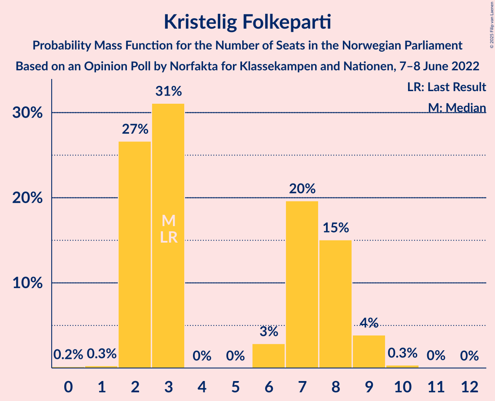
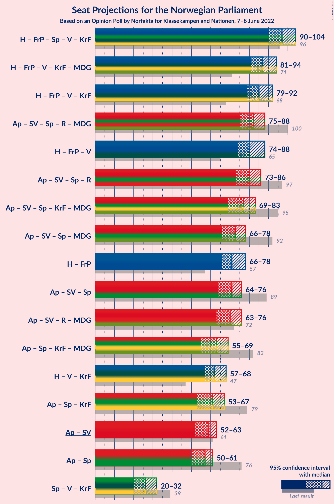
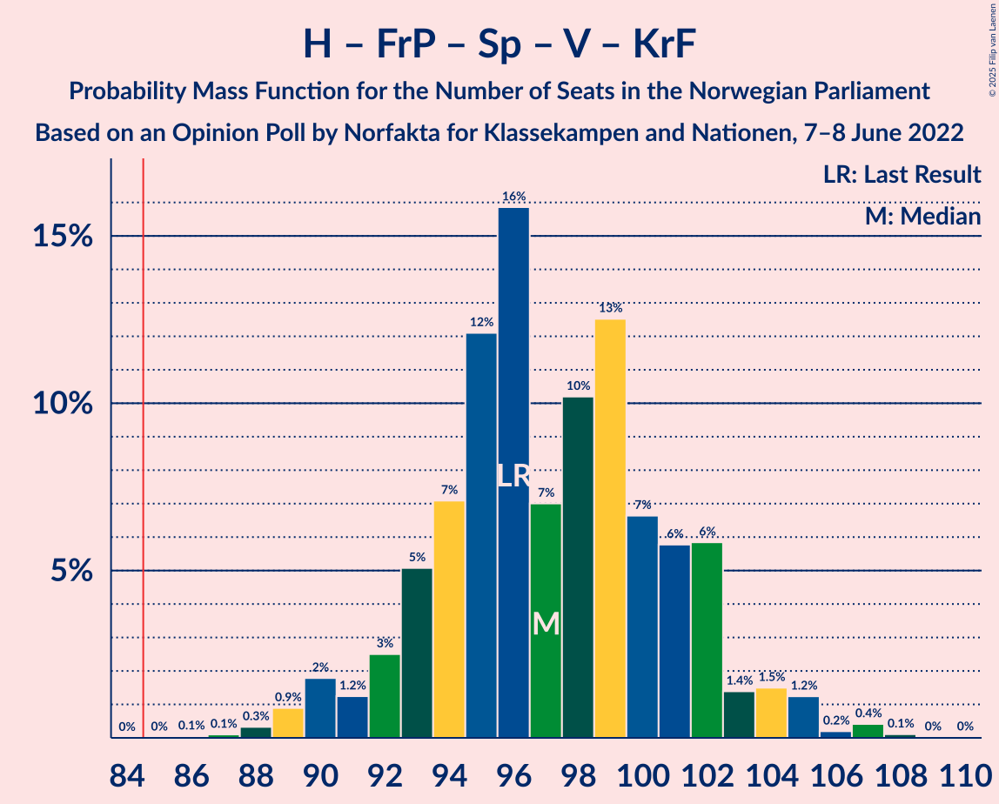
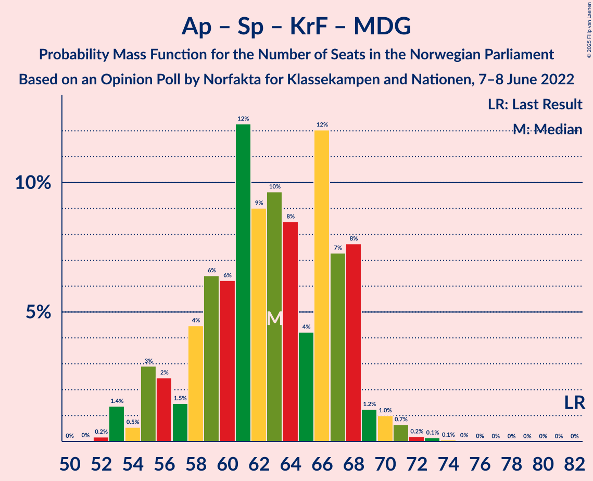

# Opinion Poll by Norfakta for Klassekampen and Nationen, 7–8 June 2022

<a href="#voting-intentions">Voting Intentions</a> | <a href="#seats">Seats</a> | <a href="#coalitions">Coalitions</a> | <a href="#technical-information">Technical Information</a>

## Voting Intentions

### Confidence Intervals

| Party | Last Result | Poll Result | 80% Confidence Interval | 90% Confidence Interval | 95% Confidence Interval | 99% Confidence Interval |
|:-----:|:-----------:|:-----------:|:-----------------------:|:-----------------------:|:-----------------------:|:-----------------------:|
| Høyre | 20.4% | 27.8% | 26.0–29.6% |25.5–30.2% |25.1–30.6% |24.2–31.6% |
| Arbeiderpartiet | 26.2% | 23.0% | 21.3–24.8% |20.9–25.3% |20.5–25.7% |19.7–26.6% |
| Fremskrittspartiet | 11.6% | 13.1% | 11.8–14.6% |11.4–15.0% |11.1–15.3% |10.5–16.0% |
| Sosialistisk Venstreparti | 7.6% | 8.3% | 7.3–9.5% |7.0–9.9% |6.7–10.2% |6.3–10.8% |
| Senterpartiet | 13.5% | 6.9% | 6.0–8.0% |5.7–8.4% |5.5–8.6% |5.1–9.2% |
| Rødt | 4.7% | 5.6% | 4.8–6.6% |4.5–6.9% |4.3–7.2% |4.0–7.7% |
| Venstre | 4.6% | 5.3% | 4.5–6.3% |4.3–6.6% |4.1–6.9% |3.7–7.4% |
| Kristelig Folkeparti | 3.8% | 3.8% | 3.1–4.7% |2.9–5.0% |2.8–5.2% |2.5–5.6% |
| Miljøpartiet De Grønne | 3.9% | 3.0% | 2.4–3.8% |2.2–4.0% |2.1–4.3% |1.9–4.7% |

*Note:* The poll result column reflects the actual value used in the calculations. Published results may vary slightly, and in addition be rounded to fewer digits.

## Seats

### Confidence Intervals

| Party | Last Result | Median | 80% Confidence Interval | 90% Confidence Interval | 95% Confidence Interval | 99% Confidence Interval |
|:-----:|:-----------:|:------:|:-----------------------:|:-----------------------:|:-----------------------:|:-----------------------:|
| <a href="#høyre">Høyre</a> | 36 | 49 | 46–52 |45–53 |44–54 |43–56 |
| <a href="#arbeiderpartiet">Arbeiderpartiet</a> | 48 | 45 | 39–47 |37–47 |37–48 |36–50 |
| <a href="#fremskrittspartiet">Fremskrittspartiet</a> | 21 | 22 | 20–26 |19–27 |18–28 |18–29 |
| <a href="#sosialistisk-venstreparti">Sosialistisk Venstreparti</a> | 13 | 14 | 12–17 |11–17 |11–18 |10–19 |
| <a href="#senterpartiet">Senterpartiet</a> | 28 | 12 | 10–15 |9–15 |9–16 |8–16 |
| <a href="#rødt">Rødt</a> | 8 | 10 | 8–11 |7–12 |7–12 |1–13 |
| <a href="#venstre">Venstre</a> | 8 | 9 | 7–11 |7–11 |3–12 |3–13 |
| <a href="#kristelig-folkeparti">Kristelig Folkeparti</a> | 3 | 3 | 2–8 |2–9 |2–9 |2–9 |
| <a href="#miljøpartiet-de-grønne">Miljøpartiet De Grønne</a> | 3 | 2 | 1–3 |1–7 |1–7 |1–8 |

### Høyre

*For a full overview of the results for this party, see the [Høyre](party-høyre.html) page.*

| Number of Seats | Probability | Accumulated | Special Marks |
|:---------------:|:-----------:|:-----------:|:-------------:|
| 36 | 0% | 100% | Last Result |
| 37 | 0% | 100% |  |
| 38 | 0% | 100% |  |
| 39 | 0% | 100% |  |
| 40 | 0% | 100% |  |
| 41 | 0.1% | 100% |  |
| 42 | 0.4% | 99.9% |  |
| 43 | 2% | 99.5% |  |
| 44 | 2% | 98% |  |
| 45 | 2% | 95% |  |
| 46 | 8% | 93% |  |
| 47 | 11% | 85% |  |
| 48 | 13% | 75% |  |
| 49 | 25% | 62% | Median |
| 50 | 12% | 37% |  |
| 51 | 12% | 25% |  |
| 52 | 3% | 13% |  |
| 53 | 5% | 9% |  |
| 54 | 3% | 5% |  |
| 55 | 1.0% | 2% |  |
| 56 | 0.2% | 0.5% |  |
| 57 | 0.2% | 0.3% |  |
| 58 | 0.1% | 0.1% |  |
| 59 | 0% | 0% |  |

### Arbeiderpartiet

*For a full overview of the results for this party, see the [Arbeiderpartiet](party-arbeiderpartiet.html) page.*

| Number of Seats | Probability | Accumulated | Special Marks |
|:---------------:|:-----------:|:-----------:|:-------------:|
| 35 | 0.1% | 100% |  |
| 36 | 2% | 99.8% |  |
| 37 | 3% | 98% |  |
| 38 | 3% | 95% |  |
| 39 | 5% | 91% |  |
| 40 | 1.3% | 86% |  |
| 41 | 4% | 85% |  |
| 42 | 6% | 81% |  |
| 43 | 14% | 75% |  |
| 44 | 10% | 61% |  |
| 45 | 26% | 51% | Median |
| 46 | 11% | 25% |  |
| 47 | 9% | 14% |  |
| 48 | 2% | 5% | Last Result |
| 49 | 2% | 2% |  |
| 50 | 0.4% | 0.6% |  |
| 51 | 0.1% | 0.2% |  |
| 52 | 0% | 0% |  |

### Fremskrittspartiet

*For a full overview of the results for this party, see the [Fremskrittspartiet](party-fremskrittspartiet.html) page.*

| Number of Seats | Probability | Accumulated | Special Marks |
|:---------------:|:-----------:|:-----------:|:-------------:|
| 17 | 0.2% | 100% |  |
| 18 | 2% | 99.8% |  |
| 19 | 4% | 97% |  |
| 20 | 20% | 94% |  |
| 21 | 14% | 74% | Last Result |
| 22 | 17% | 60% | Median |
| 23 | 8% | 43% |  |
| 24 | 9% | 35% |  |
| 25 | 10% | 26% |  |
| 26 | 8% | 17% |  |
| 27 | 6% | 8% |  |
| 28 | 1.0% | 3% |  |
| 29 | 1.1% | 2% |  |
| 30 | 0.3% | 0.4% |  |
| 31 | 0.1% | 0.1% |  |
| 32 | 0% | 0% |  |

### Sosialistisk Venstreparti

*For a full overview of the results for this party, see the [Sosialistisk Venstreparti](party-sosialistiskvenstreparti.html) page.*

| Number of Seats | Probability | Accumulated | Special Marks |
|:---------------:|:-----------:|:-----------:|:-------------:|
| 9 | 0.2% | 100% |  |
| 10 | 1.1% | 99.8% |  |
| 11 | 5% | 98.7% |  |
| 12 | 10% | 94% |  |
| 13 | 21% | 83% | Last Result |
| 14 | 19% | 62% | Median |
| 15 | 17% | 43% |  |
| 16 | 11% | 26% |  |
| 17 | 12% | 15% |  |
| 18 | 1.4% | 3% |  |
| 19 | 2% | 2% |  |
| 20 | 0.2% | 0.2% |  |
| 21 | 0% | 0% |  |

### Senterpartiet

*For a full overview of the results for this party, see the [Senterpartiet](party-senterpartiet.html) page.*

| Number of Seats | Probability | Accumulated | Special Marks |
|:---------------:|:-----------:|:-----------:|:-------------:|
| 7 | 0.2% | 100% |  |
| 8 | 2% | 99.8% |  |
| 9 | 7% | 98% |  |
| 10 | 14% | 91% |  |
| 11 | 10% | 78% |  |
| 12 | 31% | 67% | Median |
| 13 | 15% | 36% |  |
| 14 | 10% | 21% |  |
| 15 | 8% | 11% |  |
| 16 | 3% | 3% |  |
| 17 | 0.3% | 0.4% |  |
| 18 | 0.1% | 0.1% |  |
| 19 | 0% | 0% |  |
| 20 | 0% | 0% |  |
| 21 | 0% | 0% |  |
| 22 | 0% | 0% |  |
| 23 | 0% | 0% |  |
| 24 | 0% | 0% |  |
| 25 | 0% | 0% |  |
| 26 | 0% | 0% |  |
| 27 | 0% | 0% |  |
| 28 | 0% | 0% | Last Result |

### Rødt

*For a full overview of the results for this party, see the [Rødt](party-rødt.html) page.*

| Number of Seats | Probability | Accumulated | Special Marks |
|:---------------:|:-----------:|:-----------:|:-------------:|
| 1 | 0.7% | 100% |  |
| 2 | 0% | 99.3% |  |
| 3 | 0% | 99.3% |  |
| 4 | 0% | 99.3% |  |
| 5 | 0% | 99.3% |  |
| 6 | 0.1% | 99.3% |  |
| 7 | 7% | 99.1% |  |
| 8 | 14% | 93% | Last Result |
| 9 | 21% | 78% |  |
| 10 | 33% | 57% | Median |
| 11 | 15% | 24% |  |
| 12 | 7% | 9% |  |
| 13 | 2% | 2% |  |
| 14 | 0.3% | 0.4% |  |
| 15 | 0.1% | 0.1% |  |
| 16 | 0% | 0% |  |

### Venstre

*For a full overview of the results for this party, see the [Venstre](party-venstre.html) page.*

| Number of Seats | Probability | Accumulated | Special Marks |
|:---------------:|:-----------:|:-----------:|:-------------:|
| 2 | 0.2% | 100% |  |
| 3 | 3% | 99.8% |  |
| 4 | 0% | 97% |  |
| 5 | 0% | 97% |  |
| 6 | 0.3% | 97% |  |
| 7 | 10% | 97% |  |
| 8 | 18% | 87% | Last Result |
| 9 | 27% | 69% | Median |
| 10 | 27% | 42% |  |
| 11 | 10% | 15% |  |
| 12 | 3% | 5% |  |
| 13 | 1.2% | 1.3% |  |
| 14 | 0.1% | 0.1% |  |
| 15 | 0% | 0% |  |

### Kristelig Folkeparti

*For a full overview of the results for this party, see the [Kristelig Folkeparti](party-kristeligfolkeparti.html) page.*

| Number of Seats | Probability | Accumulated | Special Marks |
|:---------------:|:-----------:|:-----------:|:-------------:|
| 0 | 0.2% | 100% |  |
| 1 | 0.2% | 99.8% |  |
| 2 | 29% | 99.6% |  |
| 3 | 26% | 71% | Last Result, Median |
| 4 | 0% | 44% |  |
| 5 | 0% | 44% |  |
| 6 | 3% | 44% |  |
| 7 | 17% | 41% |  |
| 8 | 19% | 24% |  |
| 9 | 5% | 5% |  |
| 10 | 0.2% | 0.3% |  |
| 11 | 0.1% | 0.1% |  |
| 12 | 0% | 0% |  |

### Miljøpartiet De Grønne

*For a full overview of the results for this party, see the [Miljøpartiet De Grønne](party-miljøpartietdegrønne.html) page.*

| Number of Seats | Probability | Accumulated | Special Marks |
|:---------------:|:-----------:|:-----------:|:-------------:|
| 0 | 0.1% | 100% |  |
| 1 | 48% | 99.9% |  |
| 2 | 36% | 51% | Median |
| 3 | 10% | 16% | Last Result |
| 4 | 0% | 6% |  |
| 5 | 0% | 6% |  |
| 6 | 0.7% | 6% |  |
| 7 | 3% | 5% |  |
| 8 | 2% | 2% |  |
| 9 | 0.1% | 0.1% |  |
| 10 | 0% | 0% |  |

## Coalitions

### Confidence Intervals

| Coalition | Last Result | Median | Majority? | 80% Confidence Interval | 90% Confidence Interval | 95% Confidence Interval | 99% Confidence Interval |
|:---------:|:-----------:|:------:|:---------:|:-----------------------:|:-----------------------:|:-----------------------:|:-----------------------:|
| Høyre – Fremskrittspartiet – Senterpartiet – Venstre – Kristelig Folkeparti | 96 | 98 | 100% | 93–102 | 90–104 | 90–104 | 89–107 |
| Høyre – Fremskrittspartiet – Venstre – Kristelig Folkeparti – Miljøpartiet De Grønne | 71 | 88 | 78% | 83–91 | 81–93 | 81–94 | 78–96 |
| Høyre – Fremskrittspartiet – Venstre – Kristelig Folkeparti | 68 | 86 | 61% | 81–89 | 79–91 | 79–92 | 77–94 |
| Arbeiderpartiet – Sosialistisk Venstreparti – Senterpartiet – Rødt – Miljøpartiet De Grønne | 100 | 81 | 21% | 77–86 | 76–87 | 75–88 | 73–90 |
| Høyre – Fremskrittspartiet – Venstre | 65 | 80 | 15% | 77–86 | 75–87 | 74–88 | 72–90 |
| Arbeiderpartiet – Sosialistisk Venstreparti – Senterpartiet – Rødt | 97 | 80 | 10% | 75–85 | 74–85 | 73–86 | 71–88 |
| Arbeiderpartiet – Sosialistisk Venstreparti – Senterpartiet – Kristelig Folkeparti – Miljøpartiet De Grønne | 95 | 77 | 0.9% | 71–81 | 70–82 | 69–83 | 68–86 |
| Høyre – Fremskrittspartiet | 57 | 71 | 0% | 68–77 | 67–78 | 66–79 | 64–80 |
| Arbeiderpartiet – Sosialistisk Venstreparti – Senterpartiet – Miljøpartiet De Grønne | 92 | 72 | 0% | 68–76 | 67–77 | 66–78 | 63–80 |
| Arbeiderpartiet – Sosialistisk Venstreparti – Senterpartiet | 89 | 70 | 0% | 66–74 | 65–75 | 64–76 | 62–77 |
| Arbeiderpartiet – Sosialistisk Venstreparti – Rødt – Miljøpartiet De Grønne | 72 | 69 | 0% | 65–74 | 64–75 | 63–76 | 61–78 |
| Arbeiderpartiet – Senterpartiet – Kristelig Folkeparti – Miljøpartiet De Grønne | 82 | 63 | 0% | 56–67 | 55–68 | 53–69 | 53–71 |
| Høyre – Venstre – Kristelig Folkeparti | 47 | 63 | 0% | 58–67 | 57–67 | 56–67 | 54–70 |
| Arbeiderpartiet – Senterpartiet – Kristelig Folkeparti | 79 | 61 | 0% | 55–65 | 53–66 | 52–67 | 51–69 |
| Arbeiderpartiet – Sosialistisk Venstreparti | 61 | 58 | 0% | 54–62 | 53–62 | 51–63 | 50–65 |
| Arbeiderpartiet – Senterpartiet | 76 | 56 | 0% | 51–59 | 50–60 | 49–61 | 49–62 |
| Senterpartiet – Venstre – Kristelig Folkeparti | 39 | 26 | 0% | 21–30 | 21–31 | 19–32 | 18–33 |

### Høyre – Fremskrittspartiet – Senterpartiet – Venstre – Kristelig Folkeparti

| Number of Seats | Probability | Accumulated | Special Marks |
|:---------------:|:-----------:|:-----------:|:-------------:|
| 86 | 0.1% | 100% |  |
| 87 | 0.1% | 99.9% |  |
| 88 | 0.3% | 99.8% |  |
| 89 | 2% | 99.5% |  |
| 90 | 3% | 98% |  |
| 91 | 1.1% | 95% |  |
| 92 | 3% | 94% |  |
| 93 | 4% | 91% |  |
| 94 | 6% | 87% |  |
| 95 | 9% | 81% | Median |
| 96 | 11% | 71% | Last Result |
| 97 | 8% | 60% |  |
| 98 | 9% | 52% |  |
| 99 | 19% | 43% |  |
| 100 | 5% | 24% |  |
| 101 | 8% | 20% |  |
| 102 | 6% | 12% |  |
| 103 | 1.1% | 6% |  |
| 104 | 3% | 5% |  |
| 105 | 1.4% | 2% |  |
| 106 | 0.2% | 1.0% |  |
| 107 | 0.6% | 0.9% |  |
| 108 | 0.2% | 0.3% |  |
| 109 | 0% | 0.1% |  |
| 110 | 0% | 0.1% |  |
| 111 | 0% | 0% |  |

### Høyre – Fremskrittspartiet – Venstre – Kristelig Folkeparti – Miljøpartiet De Grønne

| Number of Seats | Probability | Accumulated | Special Marks |
|:---------------:|:-----------:|:-----------:|:-------------:|
| 71 | 0% | 100% | Last Result |
| 72 | 0% | 100% |  |
| 73 | 0% | 100% |  |
| 74 | 0% | 100% |  |
| 75 | 0% | 100% |  |
| 76 | 0% | 99.9% |  |
| 77 | 0% | 99.9% |  |
| 78 | 0.7% | 99.9% |  |
| 79 | 0.7% | 99.2% |  |
| 80 | 0.3% | 98.5% |  |
| 81 | 4% | 98% |  |
| 82 | 3% | 94% |  |
| 83 | 8% | 92% |  |
| 84 | 6% | 84% |  |
| 85 | 8% | 78% | Median, Majority |
| 86 | 8% | 70% |  |
| 87 | 8% | 62% |  |
| 88 | 19% | 54% |  |
| 89 | 10% | 35% |  |
| 90 | 10% | 26% |  |
| 91 | 6% | 16% |  |
| 92 | 3% | 9% |  |
| 93 | 3% | 6% |  |
| 94 | 2% | 3% |  |
| 95 | 0.9% | 2% |  |
| 96 | 0.2% | 0.7% |  |
| 97 | 0.3% | 0.4% |  |
| 98 | 0.1% | 0.1% |  |
| 99 | 0% | 0% |  |

### Høyre – Fremskrittspartiet – Venstre – Kristelig Folkeparti

| Number of Seats | Probability | Accumulated | Special Marks |
|:---------------:|:-----------:|:-----------:|:-------------:|
| 68 | 0% | 100% | Last Result |
| 69 | 0% | 100% |  |
| 70 | 0% | 100% |  |
| 71 | 0% | 100% |  |
| 72 | 0% | 100% |  |
| 73 | 0% | 100% |  |
| 74 | 0.1% | 100% |  |
| 75 | 0.2% | 99.9% |  |
| 76 | 0.1% | 99.7% |  |
| 77 | 1.2% | 99.6% |  |
| 78 | 0.6% | 98% |  |
| 79 | 3% | 98% |  |
| 80 | 3% | 94% |  |
| 81 | 4% | 92% |  |
| 82 | 9% | 88% |  |
| 83 | 10% | 78% | Median |
| 84 | 7% | 69% |  |
| 85 | 8% | 61% | Majority |
| 86 | 11% | 54% |  |
| 87 | 20% | 43% |  |
| 88 | 5% | 22% |  |
| 89 | 9% | 18% |  |
| 90 | 3% | 9% |  |
| 91 | 2% | 6% |  |
| 92 | 2% | 4% |  |
| 93 | 0.9% | 2% |  |
| 94 | 0.4% | 0.8% |  |
| 95 | 0.2% | 0.4% |  |
| 96 | 0.2% | 0.2% |  |
| 97 | 0% | 0% |  |

### Arbeiderpartiet – Sosialistisk Venstreparti – Senterpartiet – Rødt – Miljøpartiet De Grønne

| Number of Seats | Probability | Accumulated | Special Marks |
|:---------------:|:-----------:|:-----------:|:-------------:|
| 70 | 0% | 100% |  |
| 71 | 0.1% | 99.9% |  |
| 72 | 0.3% | 99.9% |  |
| 73 | 1.2% | 99.6% |  |
| 74 | 0.5% | 98% |  |
| 75 | 2% | 98% |  |
| 76 | 5% | 96% |  |
| 77 | 3% | 91% |  |
| 78 | 6% | 89% |  |
| 79 | 10% | 83% |  |
| 80 | 6% | 73% |  |
| 81 | 18% | 67% |  |
| 82 | 16% | 49% |  |
| 83 | 5% | 34% | Median |
| 84 | 8% | 29% |  |
| 85 | 6% | 21% | Majority |
| 86 | 9% | 15% |  |
| 87 | 3% | 6% |  |
| 88 | 2% | 3% |  |
| 89 | 0.3% | 1.1% |  |
| 90 | 0.3% | 0.8% |  |
| 91 | 0.4% | 0.5% |  |
| 92 | 0% | 0.1% |  |
| 93 | 0% | 0% |  |
| 94 | 0% | 0% |  |
| 95 | 0% | 0% |  |
| 96 | 0% | 0% |  |
| 97 | 0% | 0% |  |
| 98 | 0% | 0% |  |
| 99 | 0% | 0% |  |
| 100 | 0% | 0% | Last Result |

### Høyre – Fremskrittspartiet – Venstre

| Number of Seats | Probability | Accumulated | Special Marks |
|:---------------:|:-----------:|:-----------:|:-------------:|
| 65 | 0% | 100% | Last Result |
| 66 | 0% | 100% |  |
| 67 | 0% | 100% |  |
| 68 | 0% | 100% |  |
| 69 | 0% | 100% |  |
| 70 | 0.1% | 100% |  |
| 71 | 0.2% | 99.9% |  |
| 72 | 0.5% | 99.7% |  |
| 73 | 0.5% | 99.3% |  |
| 74 | 2% | 98.8% |  |
| 75 | 3% | 97% |  |
| 76 | 4% | 95% |  |
| 77 | 9% | 91% |  |
| 78 | 10% | 82% |  |
| 79 | 12% | 72% |  |
| 80 | 15% | 60% | Median |
| 81 | 9% | 45% |  |
| 82 | 7% | 36% |  |
| 83 | 7% | 29% |  |
| 84 | 8% | 22% |  |
| 85 | 3% | 15% | Majority |
| 86 | 5% | 11% |  |
| 87 | 4% | 7% |  |
| 88 | 2% | 3% |  |
| 89 | 0.4% | 1.0% |  |
| 90 | 0.3% | 0.5% |  |
| 91 | 0.1% | 0.2% |  |
| 92 | 0% | 0.1% |  |
| 93 | 0% | 0.1% |  |
| 94 | 0% | 0% |  |

### Arbeiderpartiet – Sosialistisk Venstreparti – Senterpartiet – Rødt

| Number of Seats | Probability | Accumulated | Special Marks |
|:---------------:|:-----------:|:-----------:|:-------------:|
| 68 | 0% | 100% |  |
| 69 | 0.1% | 99.9% |  |
| 70 | 0.2% | 99.9% |  |
| 71 | 0.6% | 99.7% |  |
| 72 | 1.3% | 99.1% |  |
| 73 | 2% | 98% |  |
| 74 | 2% | 96% |  |
| 75 | 6% | 94% |  |
| 76 | 6% | 88% |  |
| 77 | 7% | 83% |  |
| 78 | 12% | 76% |  |
| 79 | 8% | 64% |  |
| 80 | 23% | 56% |  |
| 81 | 6% | 33% | Median |
| 82 | 6% | 27% |  |
| 83 | 8% | 21% |  |
| 84 | 3% | 13% |  |
| 85 | 7% | 10% | Majority |
| 86 | 2% | 3% |  |
| 87 | 0.5% | 1.0% |  |
| 88 | 0.1% | 0.5% |  |
| 89 | 0.3% | 0.4% |  |
| 90 | 0.1% | 0.1% |  |
| 91 | 0% | 0% |  |
| 92 | 0% | 0% |  |
| 93 | 0% | 0% |  |
| 94 | 0% | 0% |  |
| 95 | 0% | 0% |  |
| 96 | 0% | 0% |  |
| 97 | 0% | 0% | Last Result |

### Arbeiderpartiet – Sosialistisk Venstreparti – Senterpartiet – Kristelig Folkeparti – Miljøpartiet De Grønne

| Number of Seats | Probability | Accumulated | Special Marks |
|:---------------:|:-----------:|:-----------:|:-------------:|
| 65 | 0% | 100% |  |
| 66 | 0% | 99.9% |  |
| 67 | 0.2% | 99.9% |  |
| 68 | 0.4% | 99.7% |  |
| 69 | 3% | 99.2% |  |
| 70 | 4% | 97% |  |
| 71 | 3% | 92% |  |
| 72 | 5% | 89% |  |
| 73 | 5% | 84% |  |
| 74 | 8% | 80% |  |
| 75 | 9% | 71% |  |
| 76 | 7% | 62% | Median |
| 77 | 9% | 55% |  |
| 78 | 9% | 46% |  |
| 79 | 13% | 37% |  |
| 80 | 9% | 24% |  |
| 81 | 6% | 15% |  |
| 82 | 4% | 9% |  |
| 83 | 3% | 4% |  |
| 84 | 0.9% | 2% |  |
| 85 | 0.3% | 0.9% | Majority |
| 86 | 0.4% | 0.6% |  |
| 87 | 0% | 0.2% |  |
| 88 | 0.1% | 0.1% |  |
| 89 | 0% | 0% |  |
| 90 | 0% | 0% |  |
| 91 | 0% | 0% |  |
| 92 | 0% | 0% |  |
| 93 | 0% | 0% |  |
| 94 | 0% | 0% |  |
| 95 | 0% | 0% | Last Result |

### Høyre – Fremskrittspartiet

| Number of Seats | Probability | Accumulated | Special Marks |
|:---------------:|:-----------:|:-----------:|:-------------:|
| 57 | 0% | 100% | Last Result |
| 58 | 0% | 100% |  |
| 59 | 0% | 100% |  |
| 60 | 0% | 100% |  |
| 61 | 0% | 100% |  |
| 62 | 0.1% | 99.9% |  |
| 63 | 0.3% | 99.9% |  |
| 64 | 0.3% | 99.5% |  |
| 65 | 1.4% | 99.2% |  |
| 66 | 3% | 98% |  |
| 67 | 4% | 95% |  |
| 68 | 9% | 91% |  |
| 69 | 16% | 83% |  |
| 70 | 9% | 67% |  |
| 71 | 13% | 58% | Median |
| 72 | 11% | 45% |  |
| 73 | 7% | 34% |  |
| 74 | 4% | 27% |  |
| 75 | 8% | 23% |  |
| 76 | 4% | 15% |  |
| 77 | 5% | 11% |  |
| 78 | 3% | 6% |  |
| 79 | 2% | 3% |  |
| 80 | 0.2% | 0.7% |  |
| 81 | 0.3% | 0.4% |  |
| 82 | 0.1% | 0.2% |  |
| 83 | 0% | 0.1% |  |
| 84 | 0% | 0% |  |

### Arbeiderpartiet – Sosialistisk Venstreparti – Senterpartiet – Miljøpartiet De Grønne

| Number of Seats | Probability | Accumulated | Special Marks |
|:---------------:|:-----------:|:-----------:|:-------------:|
| 62 | 0.1% | 100% |  |
| 63 | 0.8% | 99.9% |  |
| 64 | 0.5% | 99.1% |  |
| 65 | 0.7% | 98.6% |  |
| 66 | 2% | 98% |  |
| 67 | 5% | 96% |  |
| 68 | 6% | 91% |  |
| 69 | 6% | 85% |  |
| 70 | 8% | 79% |  |
| 71 | 18% | 71% |  |
| 72 | 12% | 53% |  |
| 73 | 8% | 41% | Median |
| 74 | 10% | 33% |  |
| 75 | 10% | 23% |  |
| 76 | 4% | 13% |  |
| 77 | 5% | 8% |  |
| 78 | 2% | 3% |  |
| 79 | 0.8% | 2% |  |
| 80 | 0.5% | 0.8% |  |
| 81 | 0.1% | 0.3% |  |
| 82 | 0.1% | 0.2% |  |
| 83 | 0% | 0% |  |
| 84 | 0% | 0% |  |
| 85 | 0% | 0% | Majority |
| 86 | 0% | 0% |  |
| 87 | 0% | 0% |  |
| 88 | 0% | 0% |  |
| 89 | 0% | 0% |  |
| 90 | 0% | 0% |  |
| 91 | 0% | 0% |  |
| 92 | 0% | 0% | Last Result |

### Arbeiderpartiet – Sosialistisk Venstreparti – Senterpartiet

| Number of Seats | Probability | Accumulated | Special Marks |
|:---------------:|:-----------:|:-----------:|:-------------:|
| 60 | 0.1% | 100% |  |
| 61 | 0.1% | 99.9% |  |
| 62 | 0.9% | 99.8% |  |
| 63 | 0.8% | 98.9% |  |
| 64 | 1.5% | 98% |  |
| 65 | 5% | 97% |  |
| 66 | 5% | 92% |  |
| 67 | 5% | 86% |  |
| 68 | 11% | 81% |  |
| 69 | 9% | 70% |  |
| 70 | 20% | 61% |  |
| 71 | 12% | 41% | Median |
| 72 | 9% | 30% |  |
| 73 | 5% | 21% |  |
| 74 | 8% | 15% |  |
| 75 | 4% | 7% |  |
| 76 | 2% | 3% |  |
| 77 | 0.7% | 1.0% |  |
| 78 | 0.2% | 0.4% |  |
| 79 | 0.1% | 0.2% |  |
| 80 | 0% | 0.1% |  |
| 81 | 0% | 0% |  |
| 82 | 0% | 0% |  |
| 83 | 0% | 0% |  |
| 84 | 0% | 0% |  |
| 85 | 0% | 0% | Majority |
| 86 | 0% | 0% |  |
| 87 | 0% | 0% |  |
| 88 | 0% | 0% |  |
| 89 | 0% | 0% | Last Result |

### Arbeiderpartiet – Sosialistisk Venstreparti – Rødt – Miljøpartiet De Grønne

| Number of Seats | Probability | Accumulated | Special Marks |
|:---------------:|:-----------:|:-----------:|:-------------:|
| 57 | 0% | 100% |  |
| 58 | 0.1% | 99.9% |  |
| 59 | 0.1% | 99.9% |  |
| 60 | 0.3% | 99.8% |  |
| 61 | 0.7% | 99.6% |  |
| 62 | 0.6% | 98.9% |  |
| 63 | 2% | 98% |  |
| 64 | 3% | 97% |  |
| 65 | 4% | 94% |  |
| 66 | 7% | 90% |  |
| 67 | 10% | 82% |  |
| 68 | 7% | 72% |  |
| 69 | 18% | 66% |  |
| 70 | 11% | 47% |  |
| 71 | 9% | 36% | Median |
| 72 | 7% | 27% | Last Result |
| 73 | 10% | 20% |  |
| 74 | 5% | 10% |  |
| 75 | 3% | 5% |  |
| 76 | 1.4% | 3% |  |
| 77 | 0.4% | 1.2% |  |
| 78 | 0.5% | 0.7% |  |
| 79 | 0.2% | 0.3% |  |
| 80 | 0% | 0.1% |  |
| 81 | 0% | 0% |  |

### Arbeiderpartiet – Senterpartiet – Kristelig Folkeparti – Miljøpartiet De Grønne

| Number of Seats | Probability | Accumulated | Special Marks |
|:---------------:|:-----------:|:-----------:|:-------------:|
| 51 | 0% | 100% |  |
| 52 | 0.3% | 99.9% |  |
| 53 | 3% | 99.7% |  |
| 54 | 0.6% | 97% |  |
| 55 | 5% | 96% |  |
| 56 | 2% | 92% |  |
| 57 | 2% | 90% |  |
| 58 | 6% | 88% |  |
| 59 | 9% | 82% |  |
| 60 | 4% | 74% |  |
| 61 | 11% | 69% |  |
| 62 | 7% | 59% | Median |
| 63 | 7% | 52% |  |
| 64 | 6% | 44% |  |
| 65 | 7% | 38% |  |
| 66 | 17% | 31% |  |
| 67 | 7% | 14% |  |
| 68 | 4% | 8% |  |
| 69 | 2% | 3% |  |
| 70 | 0.7% | 2% |  |
| 71 | 0.5% | 0.9% |  |
| 72 | 0.1% | 0.5% |  |
| 73 | 0.2% | 0.4% |  |
| 74 | 0.1% | 0.2% |  |
| 75 | 0% | 0% |  |
| 76 | 0% | 0% |  |
| 77 | 0% | 0% |  |
| 78 | 0% | 0% |  |
| 79 | 0% | 0% |  |
| 80 | 0% | 0% |  |
| 81 | 0% | 0% |  |
| 82 | 0% | 0% | Last Result |

### Høyre – Venstre – Kristelig Folkeparti

| Number of Seats | Probability | Accumulated | Special Marks |
|:---------------:|:-----------:|:-----------:|:-------------:|
| 47 | 0% | 100% | Last Result |
| 48 | 0% | 100% |  |
| 49 | 0% | 100% |  |
| 50 | 0% | 100% |  |
| 51 | 0% | 100% |  |
| 52 | 0% | 100% |  |
| 53 | 0.1% | 99.9% |  |
| 54 | 0.4% | 99.9% |  |
| 55 | 1.1% | 99.5% |  |
| 56 | 1.2% | 98% |  |
| 57 | 4% | 97% |  |
| 58 | 5% | 93% |  |
| 59 | 6% | 88% |  |
| 60 | 6% | 82% |  |
| 61 | 14% | 76% | Median |
| 62 | 9% | 62% |  |
| 63 | 10% | 53% |  |
| 64 | 9% | 44% |  |
| 65 | 8% | 34% |  |
| 66 | 8% | 26% |  |
| 67 | 16% | 18% |  |
| 68 | 1.3% | 2% |  |
| 69 | 0.4% | 1.1% |  |
| 70 | 0.3% | 0.6% |  |
| 71 | 0.2% | 0.4% |  |
| 72 | 0.1% | 0.2% |  |
| 73 | 0% | 0.1% |  |
| 74 | 0% | 0% |  |

### Arbeiderpartiet – Senterpartiet – Kristelig Folkeparti

| Number of Seats | Probability | Accumulated | Special Marks |
|:---------------:|:-----------:|:-----------:|:-------------:|
| 50 | 0.1% | 100% |  |
| 51 | 2% | 99.9% |  |
| 52 | 1.2% | 98% |  |
| 53 | 2% | 97% |  |
| 54 | 4% | 94% |  |
| 55 | 2% | 91% |  |
| 56 | 5% | 88% |  |
| 57 | 8% | 83% |  |
| 58 | 7% | 76% |  |
| 59 | 9% | 69% |  |
| 60 | 9% | 60% | Median |
| 61 | 8% | 51% |  |
| 62 | 8% | 44% |  |
| 63 | 7% | 35% |  |
| 64 | 7% | 28% |  |
| 65 | 14% | 21% |  |
| 66 | 2% | 7% |  |
| 67 | 4% | 5% |  |
| 68 | 0.6% | 1.3% |  |
| 69 | 0.4% | 0.6% |  |
| 70 | 0.1% | 0.2% |  |
| 71 | 0.1% | 0.1% |  |
| 72 | 0% | 0% |  |
| 73 | 0% | 0% |  |
| 74 | 0% | 0% |  |
| 75 | 0% | 0% |  |
| 76 | 0% | 0% |  |
| 77 | 0% | 0% |  |
| 78 | 0% | 0% |  |
| 79 | 0% | 0% | Last Result |

### Arbeiderpartiet – Sosialistisk Venstreparti

| Number of Seats | Probability | Accumulated | Special Marks |
|:---------------:|:-----------:|:-----------:|:-------------:|
| 48 | 0% | 100% |  |
| 49 | 0.2% | 99.9% |  |
| 50 | 0.3% | 99.8% |  |
| 51 | 2% | 99.5% |  |
| 52 | 1.1% | 97% |  |
| 53 | 4% | 96% |  |
| 54 | 5% | 92% |  |
| 55 | 5% | 88% |  |
| 56 | 9% | 82% |  |
| 57 | 11% | 73% |  |
| 58 | 20% | 63% |  |
| 59 | 15% | 42% | Median |
| 60 | 9% | 28% |  |
| 61 | 9% | 19% | Last Result |
| 62 | 5% | 10% |  |
| 63 | 3% | 5% |  |
| 64 | 0.7% | 1.4% |  |
| 65 | 0.4% | 0.7% |  |
| 66 | 0.2% | 0.3% |  |
| 67 | 0.1% | 0.1% |  |
| 68 | 0% | 0% |  |

### Arbeiderpartiet – Senterpartiet

| Number of Seats | Probability | Accumulated | Special Marks |
|:---------------:|:-----------:|:-----------:|:-------------:|
| 47 | 0.1% | 100% |  |
| 48 | 0.2% | 99.9% |  |
| 49 | 2% | 99.7% |  |
| 50 | 3% | 97% |  |
| 51 | 8% | 94% |  |
| 52 | 2% | 87% |  |
| 53 | 5% | 84% |  |
| 54 | 6% | 79% |  |
| 55 | 16% | 73% |  |
| 56 | 8% | 57% |  |
| 57 | 20% | 49% | Median |
| 58 | 14% | 29% |  |
| 59 | 7% | 14% |  |
| 60 | 4% | 7% |  |
| 61 | 2% | 4% |  |
| 62 | 0.9% | 1.2% |  |
| 63 | 0.2% | 0.4% |  |
| 64 | 0.1% | 0.1% |  |
| 65 | 0% | 0% |  |
| 66 | 0% | 0% |  |
| 67 | 0% | 0% |  |
| 68 | 0% | 0% |  |
| 69 | 0% | 0% |  |
| 70 | 0% | 0% |  |
| 71 | 0% | 0% |  |
| 72 | 0% | 0% |  |
| 73 | 0% | 0% |  |
| 74 | 0% | 0% |  |
| 75 | 0% | 0% |  |
| 76 | 0% | 0% | Last Result |

### Senterpartiet – Venstre – Kristelig Folkeparti

| Number of Seats | Probability | Accumulated | Special Marks |
|:---------------:|:-----------:|:-----------:|:-------------:|
| 16 | 0% | 100% |  |
| 17 | 0.4% | 99.9% |  |
| 18 | 1.2% | 99.5% |  |
| 19 | 1.4% | 98% |  |
| 20 | 2% | 97% |  |
| 21 | 6% | 95% |  |
| 22 | 7% | 90% |  |
| 23 | 10% | 83% |  |
| 24 | 10% | 73% | Median |
| 25 | 10% | 63% |  |
| 26 | 8% | 54% |  |
| 27 | 11% | 45% |  |
| 28 | 11% | 35% |  |
| 29 | 6% | 24% |  |
| 30 | 12% | 18% |  |
| 31 | 3% | 6% |  |
| 32 | 2% | 3% |  |
| 33 | 1.1% | 1.5% |  |
| 34 | 0.3% | 0.4% |  |
| 35 | 0.1% | 0.1% |  |
| 36 | 0% | 0% |  |
| 37 | 0% | 0% |  |
| 38 | 0% | 0% |  |
| 39 | 0% | 0% | Last Result |

## Technical Information

### Opinion Poll

+ **Polling firm:** Norfakta
+ **Commissioner(s):** Klassekampen and Nationen
+ **Fieldwork period:** 7–8 June 2022

### Calculations

+ **Sample size:** 1001
+ **Simulations done:** 524,288
+ **Error estimate:** 1.60%

