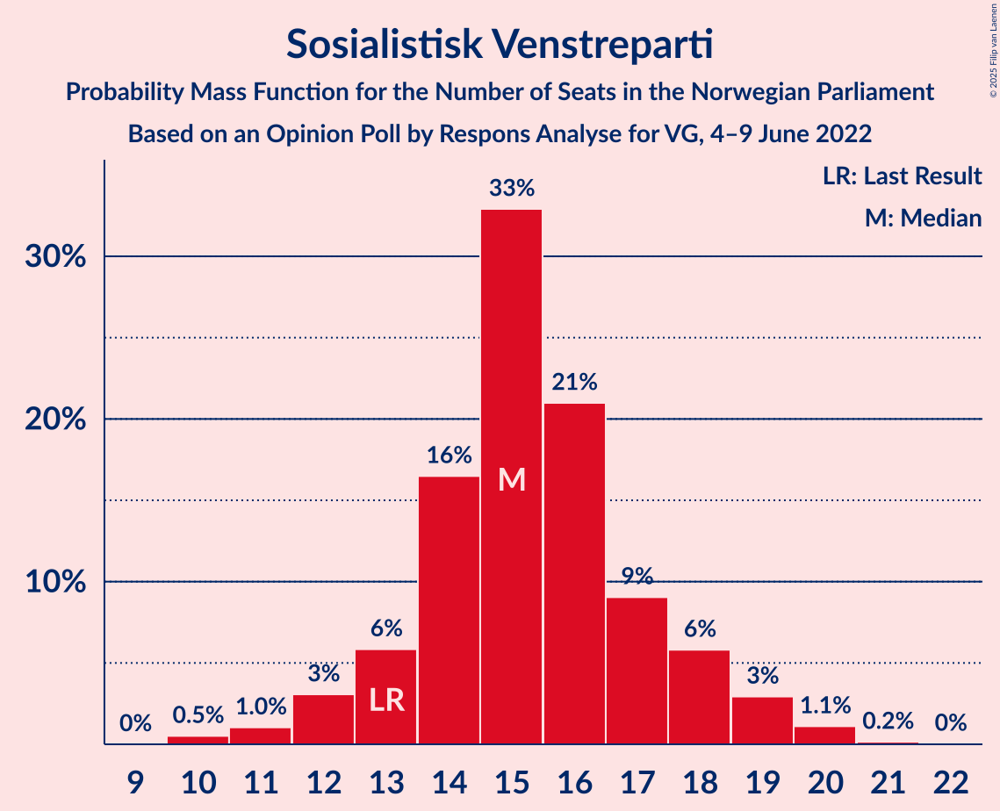

# Opinion Poll by Respons Analyse for VG, 4–9 June 2022

<a href="#voting-intentions">Voting Intentions</a> | <a href="#seats">Seats</a> | <a href="#coalitions">Coalitions</a> | <a href="#technical-information">Technical Information</a>

## Voting Intentions

### Confidence Intervals

| Party | Last Result | Poll Result | 80% Confidence Interval | 90% Confidence Interval | 95% Confidence Interval | 99% Confidence Interval |
|:-----:|:-----------:|:-----------:|:-----------------------:|:-----------------------:|:-----------------------:|:-----------------------:|
| Høyre | 20.4% | 26.8% | 25.1–28.7% |24.6–29.2% |24.1–29.6% |23.3–30.5% |
| Arbeiderpartiet | 26.2% | 20.2% | 18.6–21.9% |18.2–22.4% |17.8–22.8% |17.1–23.6% |
| Fremskrittspartiet | 11.6% | 14.0% | 12.7–15.5% |12.3–15.9% |12.0–16.3% |11.4–17.0% |
| Sosialistisk Venstreparti | 7.6% | 9.0% | 7.9–10.3% |7.6–10.6% |7.4–10.9% |6.9–11.6% |
| Senterpartiet | 13.5% | 7.4% | 6.4–8.6% |6.2–8.9% |5.9–9.2% |5.5–9.8% |
| Rødt | 4.7% | 6.8% | 5.9–7.9% |5.6–8.3% |5.4–8.5% |5.0–9.1% |
| Venstre | 4.6% | 4.9% | 4.1–5.9% |3.9–6.2% |3.7–6.4% |3.4–6.9% |
| Miljøpartiet De Grønne | 3.9% | 4.0% | 3.3–4.9% |3.1–5.2% |2.9–5.4% |2.7–5.9% |
| Kristelig Folkeparti | 3.8% | 3.9% | 3.2–4.8% |3.0–5.1% |2.9–5.3% |2.6–5.8% |

*Note:* The poll result column reflects the actual value used in the calculations. Published results may vary slightly, and in addition be rounded to fewer digits.

## Seats

### Confidence Intervals

| Party | Last Result | Median | 80% Confidence Interval | 90% Confidence Interval | 95% Confidence Interval | 99% Confidence Interval |
|:-----:|:-----------:|:------:|:-----------------------:|:-----------------------:|:-----------------------:|:-----------------------:|
| <a href="#høyre">Høyre</a> | 36 | 47 | 44–50 |43–51 |42–53 |40–54 |
| <a href="#arbeiderpartiet">Arbeiderpartiet</a> | 48 | 38 | 34–41 |34–42 |34–43 |33–45 |
| <a href="#fremskrittspartiet">Fremskrittspartiet</a> | 21 | 24 | 22–28 |21–28 |21–29 |20–31 |
| <a href="#sosialistisk-venstreparti">Sosialistisk Venstreparti</a> | 13 | 15 | 13–18 |13–18 |12–19 |10–20 |
| <a href="#senterpartiet">Senterpartiet</a> | 28 | 13 | 11–15 |10–15 |10–16 |9–17 |
| <a href="#rødt">Rødt</a> | 8 | 12 | 10–13 |9–14 |9–15 |8–16 |
| <a href="#venstre">Venstre</a> | 8 | 8 | 7–10 |3–10 |3–11 |2–12 |
| <a href="#miljøpartiet-de-grønne">Miljøpartiet De Grønne</a> | 3 | 7 | 2–8 |1–9 |1–9 |1–10 |
| <a href="#kristelig-folkeparti">Kristelig Folkeparti</a> | 3 | 7 | 2–8 |2–8 |2–8 |2–10 |

### Høyre

*For a full overview of the results for this party, see the [Høyre](party-høyre.html) page.*

| Number of Seats | Probability | Accumulated | Special Marks |
|:---------------:|:-----------:|:-----------:|:-------------:|
| 36 | 0% | 100% | Last Result |
| 37 | 0% | 100% |  |
| 38 | 0% | 100% |  |
| 39 | 0% | 100% |  |
| 40 | 0.6% | 100% |  |
| 41 | 0.8% | 99.4% |  |
| 42 | 2% | 98.6% |  |
| 43 | 4% | 96% |  |
| 44 | 8% | 93% |  |
| 45 | 11% | 85% |  |
| 46 | 23% | 74% |  |
| 47 | 16% | 51% | Median |
| 48 | 14% | 35% |  |
| 49 | 9% | 21% |  |
| 50 | 4% | 12% |  |
| 51 | 3% | 7% |  |
| 52 | 2% | 5% |  |
| 53 | 2% | 3% |  |
| 54 | 0.4% | 0.8% |  |
| 55 | 0.2% | 0.3% |  |
| 56 | 0.1% | 0.1% |  |
| 57 | 0% | 0% |  |

### Arbeiderpartiet

*For a full overview of the results for this party, see the [Arbeiderpartiet](party-arbeiderpartiet.html) page.*

| Number of Seats | Probability | Accumulated | Special Marks |
|:---------------:|:-----------:|:-----------:|:-------------:|
| 31 | 0.1% | 100% |  |
| 32 | 0.3% | 99.9% |  |
| 33 | 2% | 99.6% |  |
| 34 | 8% | 98% |  |
| 35 | 7% | 89% |  |
| 36 | 12% | 83% |  |
| 37 | 14% | 71% |  |
| 38 | 26% | 57% | Median |
| 39 | 17% | 32% |  |
| 40 | 3% | 15% |  |
| 41 | 3% | 11% |  |
| 42 | 4% | 9% |  |
| 43 | 2% | 5% |  |
| 44 | 2% | 2% |  |
| 45 | 0.7% | 0.9% |  |
| 46 | 0.1% | 0.2% |  |
| 47 | 0% | 0% |  |
| 48 | 0% | 0% | Last Result |

### Fremskrittspartiet

*For a full overview of the results for this party, see the [Fremskrittspartiet](party-fremskrittspartiet.html) page.*

| Number of Seats | Probability | Accumulated | Special Marks |
|:---------------:|:-----------:|:-----------:|:-------------:|
| 18 | 0.1% | 100% |  |
| 19 | 0.2% | 99.9% |  |
| 20 | 2% | 99.7% |  |
| 21 | 4% | 98% | Last Result |
| 22 | 15% | 93% |  |
| 23 | 10% | 78% |  |
| 24 | 22% | 68% | Median |
| 25 | 22% | 47% |  |
| 26 | 7% | 24% |  |
| 27 | 6% | 17% |  |
| 28 | 6% | 11% |  |
| 29 | 3% | 5% |  |
| 30 | 0.8% | 1.4% |  |
| 31 | 0.3% | 0.7% |  |
| 32 | 0.2% | 0.3% |  |
| 33 | 0.1% | 0.1% |  |
| 34 | 0% | 0.1% |  |
| 35 | 0% | 0% |  |

### Sosialistisk Venstreparti

*For a full overview of the results for this party, see the [Sosialistisk Venstreparti](party-sosialistiskvenstreparti.html) page.*

| Number of Seats | Probability | Accumulated | Special Marks |
|:---------------:|:-----------:|:-----------:|:-------------:|
| 10 | 0.5% | 100% |  |
| 11 | 1.0% | 99.5% |  |
| 12 | 3% | 98% |  |
| 13 | 6% | 95% | Last Result |
| 14 | 16% | 90% |  |
| 15 | 33% | 73% | Median |
| 16 | 21% | 40% |  |
| 17 | 9% | 19% |  |
| 18 | 6% | 10% |  |
| 19 | 3% | 4% |  |
| 20 | 1.1% | 1.3% |  |
| 21 | 0.2% | 0.2% |  |
| 22 | 0% | 0% |  |

### Senterpartiet

*For a full overview of the results for this party, see the [Senterpartiet](party-senterpartiet.html) page.*

| Number of Seats | Probability | Accumulated | Special Marks |
|:---------------:|:-----------:|:-----------:|:-------------:|
| 8 | 0.2% | 100% |  |
| 9 | 2% | 99.8% |  |
| 10 | 4% | 98% |  |
| 11 | 8% | 94% |  |
| 12 | 24% | 86% |  |
| 13 | 26% | 62% | Median |
| 14 | 18% | 35% |  |
| 15 | 15% | 18% |  |
| 16 | 3% | 3% |  |
| 17 | 0.5% | 0.7% |  |
| 18 | 0.2% | 0.2% |  |
| 19 | 0% | 0% |  |
| 20 | 0% | 0% |  |
| 21 | 0% | 0% |  |
| 22 | 0% | 0% |  |
| 23 | 0% | 0% |  |
| 24 | 0% | 0% |  |
| 25 | 0% | 0% |  |
| 26 | 0% | 0% |  |
| 27 | 0% | 0% |  |
| 28 | 0% | 0% | Last Result |

### Rødt

*For a full overview of the results for this party, see the [Rødt](party-rødt.html) page.*

| Number of Seats | Probability | Accumulated | Special Marks |
|:---------------:|:-----------:|:-----------:|:-------------:|
| 7 | 0.1% | 100% |  |
| 8 | 0.5% | 99.9% | Last Result |
| 9 | 6% | 99.5% |  |
| 10 | 16% | 94% |  |
| 11 | 25% | 77% |  |
| 12 | 28% | 53% | Median |
| 13 | 16% | 24% |  |
| 14 | 6% | 9% |  |
| 15 | 2% | 3% |  |
| 16 | 0.5% | 0.6% |  |
| 17 | 0.1% | 0.1% |  |
| 18 | 0% | 0% |  |

### Venstre

*For a full overview of the results for this party, see the [Venstre](party-venstre.html) page.*

| Number of Seats | Probability | Accumulated | Special Marks |
|:---------------:|:-----------:|:-----------:|:-------------:|
| 2 | 2% | 100% |  |
| 3 | 4% | 98% |  |
| 4 | 0% | 93% |  |
| 5 | 0% | 93% |  |
| 6 | 1.2% | 93% |  |
| 7 | 14% | 92% |  |
| 8 | 40% | 79% | Last Result, Median |
| 9 | 24% | 38% |  |
| 10 | 10% | 15% |  |
| 11 | 3% | 4% |  |
| 12 | 0.7% | 0.8% |  |
| 13 | 0.1% | 0.1% |  |
| 14 | 0% | 0% |  |

### Miljøpartiet De Grønne

*For a full overview of the results for this party, see the [Miljøpartiet De Grønne](party-miljøpartietdegrønne.html) page.*

| Number of Seats | Probability | Accumulated | Special Marks |
|:---------------:|:-----------:|:-----------:|:-------------:|
| 1 | 6% | 100% |  |
| 2 | 17% | 94% |  |
| 3 | 16% | 77% | Last Result |
| 4 | 0% | 60% |  |
| 5 | 0% | 60% |  |
| 6 | 2% | 60% |  |
| 7 | 27% | 59% | Median |
| 8 | 25% | 31% |  |
| 9 | 5% | 6% |  |
| 10 | 1.3% | 1.4% |  |
| 11 | 0.1% | 0.1% |  |
| 12 | 0% | 0% |  |

### Kristelig Folkeparti

*For a full overview of the results for this party, see the [Kristelig Folkeparti](party-kristeligfolkeparti.html) page.*

| Number of Seats | Probability | Accumulated | Special Marks |
|:---------------:|:-----------:|:-----------:|:-------------:|
| 0 | 0.1% | 100% |  |
| 1 | 0.1% | 99.9% |  |
| 2 | 12% | 99.9% |  |
| 3 | 33% | 88% | Last Result |
| 4 | 0% | 55% |  |
| 5 | 0% | 55% |  |
| 6 | 3% | 55% |  |
| 7 | 36% | 52% | Median |
| 8 | 14% | 16% |  |
| 9 | 1.3% | 2% |  |
| 10 | 0.6% | 0.7% |  |
| 11 | 0.1% | 0.1% |  |
| 12 | 0% | 0% |  |

## Coalitions

### Confidence Intervals

| Coalition | Last Result | Median | Majority? | 80% Confidence Interval | 90% Confidence Interval | 95% Confidence Interval | 99% Confidence Interval |
|:---------:|:-----------:|:------:|:---------:|:-----------------------:|:-----------------------:|:-----------------------:|:-----------------------:|
| Høyre – Fremskrittspartiet – Senterpartiet – Venstre – Kristelig Folkeparti | 96 | 97 | 100% | 93–102 | 92–103 | 91–104 | 89–106 |
| Høyre – Fremskrittspartiet – Venstre – Miljøpartiet De Grønne – Kristelig Folkeparti | 71 | 90 | 96% | 86–94 | 85–95 | 84–95 | 81–97 |
| Høyre – Fremskrittspartiet – Venstre – Kristelig Folkeparti | 68 | 84 | 49% | 81–89 | 79–90 | 79–91 | 76–93 |
| Arbeiderpartiet – Sosialistisk Venstreparti – Senterpartiet – Rødt – Miljøpartiet De Grønne | 100 | 83 | 34% | 79–87 | 78–89 | 76–89 | 75–91 |
| Høyre – Fremskrittspartiet – Venstre | 65 | 79 | 9% | 75–84 | 73–85 | 72–87 | 71–90 |
| Arbeiderpartiet – Sosialistisk Venstreparti – Senterpartiet – Rødt | 97 | 78 | 1.3% | 73–82 | 73–82 | 72–84 | 69–86 |
| Arbeiderpartiet – Sosialistisk Venstreparti – Senterpartiet – Miljøpartiet De Grønne – Kristelig Folkeparti | 95 | 77 | 1.4% | 72–81 | 70–83 | 69–84 | 66–85 |
| Arbeiderpartiet – Sosialistisk Venstreparti – Senterpartiet – Miljøpartiet De Grønne | 92 | 72 | 0% | 67–76 | 66–77 | 65–78 | 63–80 |
| Høyre – Fremskrittspartiet | 57 | 71 | 0% | 67–76 | 66–77 | 65–78 | 64–80 |
| Arbeiderpartiet – Sosialistisk Venstreparti – Rødt – Miljøpartiet De Grønne | 72 | 70 | 0% | 66–74 | 64–76 | 63–77 | 61–78 |
| Arbeiderpartiet – Sosialistisk Venstreparti – Senterpartiet | 89 | 66 | 0% | 62–70 | 61–71 | 61–72 | 59–74 |
| Arbeiderpartiet – Senterpartiet – Miljøpartiet De Grønne – Kristelig Folkeparti | 82 | 61 | 0% | 56–67 | 55–68 | 53–69 | 51–70 |
| Høyre – Venstre – Kristelig Folkeparti | 47 | 60 | 0% | 56–64 | 54–65 | 54–66 | 51–67 |
| Arbeiderpartiet – Senterpartiet – Kristelig Folkeparti | 79 | 56 | 0% | 52–61 | 50–62 | 49–63 | 48–65 |
| Arbeiderpartiet – Sosialistisk Venstreparti | 61 | 53 | 0% | 49–57 | 48–58 | 48–59 | 46–61 |
| Arbeiderpartiet – Senterpartiet | 76 | 50 | 0% | 47–54 | 47–55 | 46–56 | 45–58 |
| Senterpartiet – Venstre – Kristelig Folkeparti | 39 | 26 | 0% | 22–31 | 20–31 | 19–32 | 17–33 |

### Høyre – Fremskrittspartiet – Senterpartiet – Venstre – Kristelig Folkeparti

| Number of Seats | Probability | Accumulated | Special Marks |
|:---------------:|:-----------:|:-----------:|:-------------:|
| 85 | 0% | 100% | Majority |
| 86 | 0% | 99.9% |  |
| 87 | 0.1% | 99.9% |  |
| 88 | 0.1% | 99.8% |  |
| 89 | 0.5% | 99.7% |  |
| 90 | 0.5% | 99.2% |  |
| 91 | 2% | 98.7% |  |
| 92 | 3% | 96% |  |
| 93 | 3% | 93% |  |
| 94 | 14% | 90% |  |
| 95 | 7% | 76% |  |
| 96 | 12% | 69% | Last Result |
| 97 | 9% | 57% |  |
| 98 | 7% | 48% |  |
| 99 | 8% | 41% | Median |
| 100 | 6% | 33% |  |
| 101 | 16% | 27% |  |
| 102 | 5% | 11% |  |
| 103 | 2% | 6% |  |
| 104 | 2% | 4% |  |
| 105 | 1.4% | 2% |  |
| 106 | 0.5% | 0.9% |  |
| 107 | 0.2% | 0.4% |  |
| 108 | 0.2% | 0.2% |  |
| 109 | 0% | 0% |  |

### Høyre – Fremskrittspartiet – Venstre – Miljøpartiet De Grønne – Kristelig Folkeparti

| Number of Seats | Probability | Accumulated | Special Marks |
|:---------------:|:-----------:|:-----------:|:-------------:|
| 71 | 0% | 100% | Last Result |
| 72 | 0% | 100% |  |
| 73 | 0% | 100% |  |
| 74 | 0% | 100% |  |
| 75 | 0% | 100% |  |
| 76 | 0% | 100% |  |
| 77 | 0% | 100% |  |
| 78 | 0% | 100% |  |
| 79 | 0.1% | 100% |  |
| 80 | 0.2% | 99.9% |  |
| 81 | 0.2% | 99.7% |  |
| 82 | 0.7% | 99.5% |  |
| 83 | 0.8% | 98.8% |  |
| 84 | 2% | 98% |  |
| 85 | 2% | 96% | Majority |
| 86 | 6% | 93% |  |
| 87 | 4% | 87% |  |
| 88 | 10% | 83% |  |
| 89 | 13% | 72% |  |
| 90 | 19% | 60% |  |
| 91 | 10% | 40% |  |
| 92 | 11% | 31% |  |
| 93 | 4% | 19% | Median |
| 94 | 6% | 15% |  |
| 95 | 7% | 9% |  |
| 96 | 0.9% | 2% |  |
| 97 | 0.5% | 0.9% |  |
| 98 | 0.2% | 0.4% |  |
| 99 | 0.2% | 0.3% |  |
| 100 | 0% | 0.1% |  |
| 101 | 0% | 0% |  |

### Høyre – Fremskrittspartiet – Venstre – Kristelig Folkeparti

| Number of Seats | Probability | Accumulated | Special Marks |
|:---------------:|:-----------:|:-----------:|:-------------:|
| 68 | 0% | 100% | Last Result |
| 69 | 0% | 100% |  |
| 70 | 0% | 100% |  |
| 71 | 0% | 100% |  |
| 72 | 0% | 100% |  |
| 73 | 0.1% | 100% |  |
| 74 | 0.1% | 99.9% |  |
| 75 | 0.1% | 99.8% |  |
| 76 | 0.2% | 99.7% |  |
| 77 | 0.8% | 99.5% |  |
| 78 | 0.8% | 98.7% |  |
| 79 | 4% | 98% |  |
| 80 | 3% | 94% |  |
| 81 | 6% | 91% |  |
| 82 | 17% | 85% |  |
| 83 | 6% | 68% |  |
| 84 | 13% | 62% |  |
| 85 | 10% | 49% | Majority |
| 86 | 10% | 39% | Median |
| 87 | 7% | 29% |  |
| 88 | 11% | 21% |  |
| 89 | 4% | 10% |  |
| 90 | 3% | 6% |  |
| 91 | 1.3% | 3% |  |
| 92 | 1.0% | 2% |  |
| 93 | 0.4% | 0.6% |  |
| 94 | 0.1% | 0.2% |  |
| 95 | 0% | 0.1% |  |
| 96 | 0% | 0% |  |

### Arbeiderpartiet – Sosialistisk Venstreparti – Senterpartiet – Rødt – Miljøpartiet De Grønne

| Number of Seats | Probability | Accumulated | Special Marks |
|:---------------:|:-----------:|:-----------:|:-------------:|
| 72 | 0% | 100% |  |
| 73 | 0.1% | 99.9% |  |
| 74 | 0.2% | 99.8% |  |
| 75 | 1.0% | 99.6% |  |
| 76 | 2% | 98.6% |  |
| 77 | 1.4% | 97% |  |
| 78 | 3% | 96% |  |
| 79 | 6% | 92% |  |
| 80 | 12% | 86% |  |
| 81 | 7% | 75% |  |
| 82 | 10% | 67% |  |
| 83 | 10% | 57% |  |
| 84 | 13% | 47% |  |
| 85 | 6% | 34% | Median, Majority |
| 86 | 16% | 29% |  |
| 87 | 5% | 13% |  |
| 88 | 3% | 8% |  |
| 89 | 3% | 5% |  |
| 90 | 0.6% | 2% |  |
| 91 | 0.7% | 1.0% |  |
| 92 | 0.2% | 0.4% |  |
| 93 | 0.1% | 0.2% |  |
| 94 | 0% | 0.1% |  |
| 95 | 0% | 0% |  |
| 96 | 0% | 0% |  |
| 97 | 0% | 0% |  |
| 98 | 0% | 0% |  |
| 99 | 0% | 0% |  |
| 100 | 0% | 0% | Last Result |

### Høyre – Fremskrittspartiet – Venstre

| Number of Seats | Probability | Accumulated | Special Marks |
|:---------------:|:-----------:|:-----------:|:-------------:|
| 65 | 0% | 100% | Last Result |
| 66 | 0% | 100% |  |
| 67 | 0% | 100% |  |
| 68 | 0% | 100% |  |
| 69 | 0.1% | 100% |  |
| 70 | 0.3% | 99.8% |  |
| 71 | 0.2% | 99.6% |  |
| 72 | 2% | 99.4% |  |
| 73 | 3% | 97% |  |
| 74 | 2% | 94% |  |
| 75 | 5% | 92% |  |
| 76 | 6% | 87% |  |
| 77 | 13% | 81% |  |
| 78 | 6% | 68% |  |
| 79 | 19% | 62% | Median |
| 80 | 8% | 43% |  |
| 81 | 9% | 35% |  |
| 82 | 10% | 26% |  |
| 83 | 5% | 16% |  |
| 84 | 2% | 11% |  |
| 85 | 6% | 9% | Majority |
| 86 | 1.0% | 4% |  |
| 87 | 1.0% | 3% |  |
| 88 | 0.6% | 2% |  |
| 89 | 0.7% | 1.3% |  |
| 90 | 0.5% | 0.6% |  |
| 91 | 0% | 0.1% |  |
| 92 | 0% | 0% |  |

### Arbeiderpartiet – Sosialistisk Venstreparti – Senterpartiet – Rødt

| Number of Seats | Probability | Accumulated | Special Marks |
|:---------------:|:-----------:|:-----------:|:-------------:|
| 67 | 0% | 100% |  |
| 68 | 0.1% | 99.9% |  |
| 69 | 0.3% | 99.8% |  |
| 70 | 0.3% | 99.5% |  |
| 71 | 0.7% | 99.2% |  |
| 72 | 1.5% | 98.5% |  |
| 73 | 8% | 97% |  |
| 74 | 7% | 89% |  |
| 75 | 5% | 82% |  |
| 76 | 11% | 78% |  |
| 77 | 10% | 66% |  |
| 78 | 19% | 56% | Median |
| 79 | 13% | 37% |  |
| 80 | 10% | 24% |  |
| 81 | 4% | 14% |  |
| 82 | 6% | 10% |  |
| 83 | 2% | 5% |  |
| 84 | 1.5% | 3% |  |
| 85 | 0.7% | 1.3% | Majority |
| 86 | 0.4% | 0.6% |  |
| 87 | 0.1% | 0.2% |  |
| 88 | 0% | 0.1% |  |
| 89 | 0% | 0.1% |  |
| 90 | 0% | 0% |  |
| 91 | 0% | 0% |  |
| 92 | 0% | 0% |  |
| 93 | 0% | 0% |  |
| 94 | 0% | 0% |  |
| 95 | 0% | 0% |  |
| 96 | 0% | 0% |  |
| 97 | 0% | 0% | Last Result |

### Arbeiderpartiet – Sosialistisk Venstreparti – Senterpartiet – Miljøpartiet De Grønne – Kristelig Folkeparti

| Number of Seats | Probability | Accumulated | Special Marks |
|:---------------:|:-----------:|:-----------:|:-------------:|
| 65 | 0.1% | 100% |  |
| 66 | 0.5% | 99.9% |  |
| 67 | 0.5% | 99.4% |  |
| 68 | 0.4% | 98.9% |  |
| 69 | 2% | 98% |  |
| 70 | 2% | 97% |  |
| 71 | 4% | 95% |  |
| 72 | 2% | 91% |  |
| 73 | 6% | 89% |  |
| 74 | 11% | 83% |  |
| 75 | 8% | 72% |  |
| 76 | 13% | 64% |  |
| 77 | 6% | 50% |  |
| 78 | 10% | 44% |  |
| 79 | 12% | 35% |  |
| 80 | 10% | 23% | Median |
| 81 | 5% | 13% |  |
| 82 | 2% | 8% |  |
| 83 | 3% | 7% |  |
| 84 | 2% | 4% |  |
| 85 | 1.1% | 1.4% | Majority |
| 86 | 0.1% | 0.4% |  |
| 87 | 0.1% | 0.2% |  |
| 88 | 0.1% | 0.2% |  |
| 89 | 0% | 0% |  |
| 90 | 0% | 0% |  |
| 91 | 0% | 0% |  |
| 92 | 0% | 0% |  |
| 93 | 0% | 0% |  |
| 94 | 0% | 0% |  |
| 95 | 0% | 0% | Last Result |

### Arbeiderpartiet – Sosialistisk Venstreparti – Senterpartiet – Miljøpartiet De Grønne

| Number of Seats | Probability | Accumulated | Special Marks |
|:---------------:|:-----------:|:-----------:|:-------------:|
| 61 | 0% | 100% |  |
| 62 | 0.3% | 99.9% |  |
| 63 | 0.4% | 99.6% |  |
| 64 | 1.0% | 99.2% |  |
| 65 | 2% | 98% |  |
| 66 | 4% | 97% |  |
| 67 | 5% | 93% |  |
| 68 | 9% | 88% |  |
| 69 | 8% | 79% |  |
| 70 | 6% | 71% |  |
| 71 | 12% | 66% |  |
| 72 | 13% | 54% |  |
| 73 | 16% | 41% | Median |
| 74 | 6% | 25% |  |
| 75 | 8% | 19% |  |
| 76 | 4% | 10% |  |
| 77 | 3% | 6% |  |
| 78 | 2% | 3% |  |
| 79 | 0.5% | 1.0% |  |
| 80 | 0.3% | 0.5% |  |
| 81 | 0.1% | 0.2% |  |
| 82 | 0% | 0.1% |  |
| 83 | 0% | 0% |  |
| 84 | 0% | 0% |  |
| 85 | 0% | 0% | Majority |
| 86 | 0% | 0% |  |
| 87 | 0% | 0% |  |
| 88 | 0% | 0% |  |
| 89 | 0% | 0% |  |
| 90 | 0% | 0% |  |
| 91 | 0% | 0% |  |
| 92 | 0% | 0% | Last Result |

### Høyre – Fremskrittspartiet

| Number of Seats | Probability | Accumulated | Special Marks |
|:---------------:|:-----------:|:-----------:|:-------------:|
| 57 | 0% | 100% | Last Result |
| 58 | 0% | 100% |  |
| 59 | 0% | 100% |  |
| 60 | 0% | 100% |  |
| 61 | 0% | 100% |  |
| 62 | 0.1% | 100% |  |
| 63 | 0.2% | 99.9% |  |
| 64 | 0.8% | 99.7% |  |
| 65 | 2% | 98.9% |  |
| 66 | 4% | 97% |  |
| 67 | 4% | 93% |  |
| 68 | 7% | 89% |  |
| 69 | 15% | 82% |  |
| 70 | 10% | 67% |  |
| 71 | 15% | 57% | Median |
| 72 | 8% | 42% |  |
| 73 | 10% | 34% |  |
| 74 | 7% | 24% |  |
| 75 | 6% | 16% |  |
| 76 | 4% | 11% |  |
| 77 | 3% | 7% |  |
| 78 | 1.4% | 4% |  |
| 79 | 1.0% | 2% |  |
| 80 | 1.0% | 1.3% |  |
| 81 | 0.3% | 0.4% |  |
| 82 | 0% | 0.1% |  |
| 83 | 0% | 0% |  |

### Arbeiderpartiet – Sosialistisk Venstreparti – Rødt – Miljøpartiet De Grønne

| Number of Seats | Probability | Accumulated | Special Marks |
|:---------------:|:-----------:|:-----------:|:-------------:|
| 59 | 0% | 100% |  |
| 60 | 0.3% | 99.9% |  |
| 61 | 0.7% | 99.6% |  |
| 62 | 0.7% | 99.0% |  |
| 63 | 2% | 98% |  |
| 64 | 2% | 96% |  |
| 65 | 2% | 94% |  |
| 66 | 6% | 92% |  |
| 67 | 17% | 86% |  |
| 68 | 6% | 69% |  |
| 69 | 8% | 63% |  |
| 70 | 6% | 55% |  |
| 71 | 9% | 49% |  |
| 72 | 12% | 40% | Last Result, Median |
| 73 | 5% | 28% |  |
| 74 | 14% | 23% |  |
| 75 | 3% | 9% |  |
| 76 | 3% | 6% |  |
| 77 | 2% | 3% |  |
| 78 | 0.3% | 0.8% |  |
| 79 | 0.2% | 0.5% |  |
| 80 | 0.1% | 0.2% |  |
| 81 | 0.1% | 0.1% |  |
| 82 | 0% | 0% |  |

### Arbeiderpartiet – Sosialistisk Venstreparti – Senterpartiet

| Number of Seats | Probability | Accumulated | Special Marks |
|:---------------:|:-----------:|:-----------:|:-------------:|
| 57 | 0% | 100% |  |
| 58 | 0.1% | 99.9% |  |
| 59 | 0.3% | 99.8% |  |
| 60 | 0.8% | 99.4% |  |
| 61 | 5% | 98.6% |  |
| 62 | 5% | 93% |  |
| 63 | 8% | 88% |  |
| 64 | 11% | 80% |  |
| 65 | 16% | 69% |  |
| 66 | 10% | 54% | Median |
| 67 | 13% | 44% |  |
| 68 | 9% | 31% |  |
| 69 | 11% | 21% |  |
| 70 | 5% | 11% |  |
| 71 | 3% | 6% |  |
| 72 | 1.3% | 3% |  |
| 73 | 0.9% | 2% |  |
| 74 | 0.4% | 0.6% |  |
| 75 | 0.1% | 0.2% |  |
| 76 | 0.1% | 0.1% |  |
| 77 | 0% | 0% |  |
| 78 | 0% | 0% |  |
| 79 | 0% | 0% |  |
| 80 | 0% | 0% |  |
| 81 | 0% | 0% |  |
| 82 | 0% | 0% |  |
| 83 | 0% | 0% |  |
| 84 | 0% | 0% |  |
| 85 | 0% | 0% | Majority |
| 86 | 0% | 0% |  |
| 87 | 0% | 0% |  |
| 88 | 0% | 0% |  |
| 89 | 0% | 0% | Last Result |

### Arbeiderpartiet – Senterpartiet – Miljøpartiet De Grønne – Kristelig Folkeparti

| Number of Seats | Probability | Accumulated | Special Marks |
|:---------------:|:-----------:|:-----------:|:-------------:|
| 49 | 0.1% | 100% |  |
| 50 | 0.1% | 99.9% |  |
| 51 | 0.4% | 99.8% |  |
| 52 | 2% | 99.4% |  |
| 53 | 0.5% | 98% |  |
| 54 | 2% | 97% |  |
| 55 | 4% | 95% |  |
| 56 | 3% | 92% |  |
| 57 | 3% | 89% |  |
| 58 | 5% | 86% |  |
| 59 | 9% | 81% |  |
| 60 | 5% | 71% |  |
| 61 | 19% | 66% |  |
| 62 | 9% | 48% |  |
| 63 | 10% | 39% |  |
| 64 | 13% | 29% |  |
| 65 | 3% | 16% | Median |
| 66 | 2% | 13% |  |
| 67 | 4% | 11% |  |
| 68 | 3% | 6% |  |
| 69 | 1.2% | 3% |  |
| 70 | 2% | 2% |  |
| 71 | 0.1% | 0.4% |  |
| 72 | 0.2% | 0.3% |  |
| 73 | 0% | 0.1% |  |
| 74 | 0.1% | 0.1% |  |
| 75 | 0% | 0% |  |
| 76 | 0% | 0% |  |
| 77 | 0% | 0% |  |
| 78 | 0% | 0% |  |
| 79 | 0% | 0% |  |
| 80 | 0% | 0% |  |
| 81 | 0% | 0% |  |
| 82 | 0% | 0% | Last Result |

### Høyre – Venstre – Kristelig Folkeparti

| Number of Seats | Probability | Accumulated | Special Marks |
|:---------------:|:-----------:|:-----------:|:-------------:|
| 47 | 0% | 100% | Last Result |
| 48 | 0% | 100% |  |
| 49 | 0.1% | 100% |  |
| 50 | 0.2% | 99.9% |  |
| 51 | 1.0% | 99.7% |  |
| 52 | 0.4% | 98.7% |  |
| 53 | 0.8% | 98% |  |
| 54 | 3% | 98% |  |
| 55 | 2% | 95% |  |
| 56 | 3% | 93% |  |
| 57 | 10% | 90% |  |
| 58 | 10% | 79% |  |
| 59 | 8% | 70% |  |
| 60 | 18% | 61% |  |
| 61 | 7% | 43% |  |
| 62 | 12% | 36% | Median |
| 63 | 10% | 24% |  |
| 64 | 6% | 14% |  |
| 65 | 5% | 8% |  |
| 66 | 1.2% | 3% |  |
| 67 | 1.2% | 2% |  |
| 68 | 0.3% | 0.5% |  |
| 69 | 0.1% | 0.2% |  |
| 70 | 0% | 0.1% |  |
| 71 | 0% | 0% |  |

### Arbeiderpartiet – Senterpartiet – Kristelig Folkeparti

| Number of Seats | Probability | Accumulated | Special Marks |
|:---------------:|:-----------:|:-----------:|:-------------:|
| 46 | 0% | 100% |  |
| 47 | 0.3% | 99.9% |  |
| 48 | 0.4% | 99.6% |  |
| 49 | 2% | 99.3% |  |
| 50 | 2% | 97% |  |
| 51 | 4% | 95% |  |
| 52 | 8% | 91% |  |
| 53 | 10% | 83% |  |
| 54 | 15% | 73% |  |
| 55 | 7% | 58% |  |
| 56 | 10% | 51% |  |
| 57 | 8% | 41% |  |
| 58 | 6% | 34% | Median |
| 59 | 8% | 28% |  |
| 60 | 8% | 20% |  |
| 61 | 7% | 12% |  |
| 62 | 2% | 5% |  |
| 63 | 2% | 3% |  |
| 64 | 0.6% | 1.1% |  |
| 65 | 0.2% | 0.5% |  |
| 66 | 0.3% | 0.4% |  |
| 67 | 0% | 0.1% |  |
| 68 | 0% | 0% |  |
| 69 | 0% | 0% |  |
| 70 | 0% | 0% |  |
| 71 | 0% | 0% |  |
| 72 | 0% | 0% |  |
| 73 | 0% | 0% |  |
| 74 | 0% | 0% |  |
| 75 | 0% | 0% |  |
| 76 | 0% | 0% |  |
| 77 | 0% | 0% |  |
| 78 | 0% | 0% |  |
| 79 | 0% | 0% | Last Result |

### Arbeiderpartiet – Sosialistisk Venstreparti

| Number of Seats | Probability | Accumulated | Special Marks |
|:---------------:|:-----------:|:-----------:|:-------------:|
| 44 | 0% | 100% |  |
| 45 | 0.2% | 99.9% |  |
| 46 | 0.4% | 99.8% |  |
| 47 | 0.6% | 99.4% |  |
| 48 | 6% | 98.8% |  |
| 49 | 4% | 93% |  |
| 50 | 7% | 88% |  |
| 51 | 9% | 82% |  |
| 52 | 10% | 73% |  |
| 53 | 20% | 63% | Median |
| 54 | 17% | 43% |  |
| 55 | 10% | 26% |  |
| 56 | 6% | 16% |  |
| 57 | 4% | 10% |  |
| 58 | 3% | 6% |  |
| 59 | 2% | 4% |  |
| 60 | 1.4% | 2% |  |
| 61 | 0.3% | 0.5% | Last Result |
| 62 | 0.1% | 0.2% |  |
| 63 | 0% | 0.1% |  |
| 64 | 0% | 0% |  |

### Arbeiderpartiet – Senterpartiet

| Number of Seats | Probability | Accumulated | Special Marks |
|:---------------:|:-----------:|:-----------:|:-------------:|
| 43 | 0.1% | 100% |  |
| 44 | 0.2% | 99.9% |  |
| 45 | 0.8% | 99.6% |  |
| 46 | 2% | 98.8% |  |
| 47 | 7% | 97% |  |
| 48 | 9% | 90% |  |
| 49 | 14% | 81% |  |
| 50 | 17% | 66% |  |
| 51 | 17% | 49% | Median |
| 52 | 8% | 33% |  |
| 53 | 10% | 25% |  |
| 54 | 7% | 15% |  |
| 55 | 3% | 8% |  |
| 56 | 2% | 4% |  |
| 57 | 0.9% | 2% |  |
| 58 | 0.6% | 0.9% |  |
| 59 | 0.2% | 0.3% |  |
| 60 | 0.1% | 0.1% |  |
| 61 | 0% | 0% |  |
| 62 | 0% | 0% |  |
| 63 | 0% | 0% |  |
| 64 | 0% | 0% |  |
| 65 | 0% | 0% |  |
| 66 | 0% | 0% |  |
| 67 | 0% | 0% |  |
| 68 | 0% | 0% |  |
| 69 | 0% | 0% |  |
| 70 | 0% | 0% |  |
| 71 | 0% | 0% |  |
| 72 | 0% | 0% |  |
| 73 | 0% | 0% |  |
| 74 | 0% | 0% |  |
| 75 | 0% | 0% |  |
| 76 | 0% | 0% | Last Result |

### Senterpartiet – Venstre – Kristelig Folkeparti

| Number of Seats | Probability | Accumulated | Special Marks |
|:---------------:|:-----------:|:-----------:|:-------------:|
| 15 | 0.1% | 100% |  |
| 16 | 0.2% | 99.9% |  |
| 17 | 0.8% | 99.7% |  |
| 18 | 0.6% | 98.9% |  |
| 19 | 2% | 98% |  |
| 20 | 1.5% | 96% |  |
| 21 | 1.5% | 95% |  |
| 22 | 6% | 93% |  |
| 23 | 15% | 87% |  |
| 24 | 7% | 72% |  |
| 25 | 6% | 65% |  |
| 26 | 9% | 59% |  |
| 27 | 8% | 50% |  |
| 28 | 11% | 42% | Median |
| 29 | 12% | 31% |  |
| 30 | 4% | 19% |  |
| 31 | 10% | 15% |  |
| 32 | 3% | 5% |  |
| 33 | 0.9% | 1.4% |  |
| 34 | 0.3% | 0.5% |  |
| 35 | 0.1% | 0.2% |  |
| 36 | 0% | 0% |  |
| 37 | 0% | 0% |  |
| 38 | 0% | 0% |  |
| 39 | 0% | 0% | Last Result |

## Technical Information

### Opinion Poll

+ **Polling firm:** Respons Analyse
+ **Commissioner(s):** VG
+ **Fieldwork period:** 4–9 June 2022

### Calculations

+ **Sample size:** 1000
+ **Simulations done:** 1,048,576
+ **Error estimate:** 0.93%

