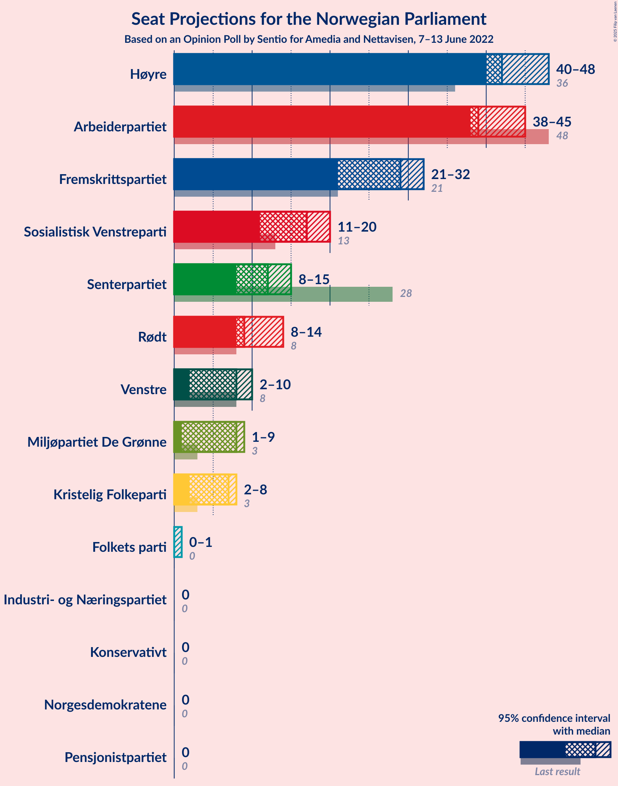

# Opinion Poll by Sentio for Amedia and Nettavisen, 7–13 June 2022

<a href="#voting-intentions">Voting Intentions</a> | <a href="#seats">Seats</a> | <a href="#coalitions">Coalitions</a> | <a href="#technical-information">Technical Information</a>

## Voting Intentions

### Confidence Intervals

| Party | Last Result | Poll Result | 80% Confidence Interval | 90% Confidence Interval | 95% Confidence Interval | 99% Confidence Interval |
|:-----:|:-----------:|:-----------:|:-----------------------:|:-----------------------:|:-----------------------:|:-----------------------:|
| Høyre | 20.4% | 24.6% | 22.9–26.4% |22.4–26.9% |22.0–27.4% |21.2–28.3% |
| Arbeiderpartiet | 26.2% | 22.2% | 20.6–24.0% |20.1–24.4% |19.7–24.9% |19.0–25.7% |
| Fremskrittspartiet | 11.6% | 14.6% | 13.2–16.1% |12.9–16.6% |12.5–16.9% |11.9–17.7% |
| Sosialistisk Venstreparti | 7.6% | 9.5% | 8.4–10.8% |8.1–11.2% |7.8–11.5% |7.3–12.1% |
| Senterpartiet | 13.5% | 7.0% | 6.1–8.2% |5.8–8.5% |5.6–8.8% |5.2–9.3% |
| Rødt | 4.7% | 5.7% | 4.9–6.8% |4.6–7.1% |4.4–7.3% |4.1–7.9% |
| Venstre | 4.6% | 4.6% | 3.9–5.6% |3.6–5.9% |3.5–6.1% |3.1–6.6% |
| Miljøpartiet De Grønne | 3.9% | 4.3% | 3.6–5.2% |3.4–5.5% |3.2–5.7% |2.9–6.2% |
| Kristelig Folkeparti | 3.8% | 3.5% | 2.9–4.4% |2.7–4.6% |2.5–4.8% |2.2–5.3% |
| Norgesdemokratene | 1.1% | 0.9% | 0.6–1.4% |0.5–1.6% |0.5–1.7% |0.4–2.0% |
| Pensjonistpartiet | 0.6% | 0.9% | 0.6–1.4% |0.5–1.6% |0.5–1.7% |0.4–2.0% |
| Folkets parti | 0.1% | 0.7% | 0.5–1.2% |0.4–1.3% |0.3–1.4% |0.2–1.7% |
| Industri- og Næringspartiet | 0.3% | 0.5% | 0.3–0.9% |0.3–1.1% |0.2–1.2% |0.2–1.4% |
| Konservativt | 0.4% | 0.2% | 0.1–0.5% |0.1–0.6% |0.1–0.7% |0.0–0.9% |

*Note:* The poll result column reflects the actual value used in the calculations. Published results may vary slightly, and in addition be rounded to fewer digits.

## Seats

### Confidence Intervals

| Party | Last Result | Median | 80% Confidence Interval | 90% Confidence Interval | 95% Confidence Interval | 99% Confidence Interval |
|:-----:|:-----------:|:------:|:-----------------------:|:-----------------------:|:-----------------------:|:-----------------------:|
| <a href="#høyre">Høyre</a> | 36 | 42 | 40–47 |40–48 |40–48 |39–49 |
| <a href="#arbeiderpartiet">Arbeiderpartiet</a> | 48 | 39 | 38–44 |38–45 |38–45 |36–48 |
| <a href="#fremskrittspartiet">Fremskrittspartiet</a> | 21 | 29 | 21–31 |21–32 |21–32 |21–35 |
| <a href="#sosialistisk-venstreparti">Sosialistisk Venstreparti</a> | 13 | 17 | 13–18 |13–19 |11–20 |11–21 |
| <a href="#senterpartiet">Senterpartiet</a> | 28 | 12 | 10–14 |9–15 |8–15 |8–17 |
| <a href="#rødt">Rødt</a> | 8 | 9 | 8–12 |8–12 |8–14 |7–14 |
| <a href="#venstre">Venstre</a> | 8 | 8 | 7–10 |3–10 |2–10 |2–11 |
| <a href="#miljøpartiet-de-grønne">Miljøpartiet De Grønne</a> | 3 | 8 | 2–9 |2–9 |1–9 |1–10 |
| <a href="#kristelig-folkeparti">Kristelig Folkeparti</a> | 3 | 7 | 2–7 |2–8 |2–8 |2–8 |
| <a href="#norgesdemokratene">Norgesdemokratene</a> | 0 | 0 | 0 |0 |0 |0 |
| <a href="#pensjonistpartiet">Pensjonistpartiet</a> | 0 | 0 | 0 |0 |0 |0 |
| <a href="#folkets-parti">Folkets parti</a> | 0 | 0 | 0–1 |0–1 |0–1 |0–1 |
| <a href="#industri--og-næringspartiet">Industri- og Næringspartiet</a> | 0 | 0 | 0 |0 |0 |0 |
| <a href="#konservativt">Konservativt</a> | 0 | 0 | 0 |0 |0 |0 |

### Høyre

*For a full overview of the results for this party, see the [Høyre](party-høyre.html) page.*

| Number of Seats | Probability | Accumulated | Special Marks |
|:---------------:|:-----------:|:-----------:|:-------------:|
| 36 | 0.1% | 100% | Last Result |
| 37 | 0% | 99.9% |  |
| 38 | 0.3% | 99.9% |  |
| 39 | 0.8% | 99.5% |  |
| 40 | 9% | 98.7% |  |
| 41 | 2% | 89% |  |
| 42 | 46% | 87% | Median |
| 43 | 0.2% | 41% |  |
| 44 | 2% | 41% |  |
| 45 | 16% | 39% |  |
| 46 | 5% | 24% |  |
| 47 | 12% | 18% |  |
| 48 | 4% | 6% |  |
| 49 | 1.5% | 2% |  |
| 50 | 0% | 0.2% |  |
| 51 | 0% | 0.1% |  |
| 52 | 0.1% | 0.1% |  |
| 53 | 0% | 0% |  |

### Arbeiderpartiet

*For a full overview of the results for this party, see the [Arbeiderpartiet](party-arbeiderpartiet.html) page.*

| Number of Seats | Probability | Accumulated | Special Marks |
|:---------------:|:-----------:|:-----------:|:-------------:|
| 34 | 0.2% | 100% |  |
| 35 | 0.2% | 99.8% |  |
| 36 | 0.6% | 99.6% |  |
| 37 | 0.8% | 99.1% |  |
| 38 | 34% | 98% |  |
| 39 | 15% | 64% | Median |
| 40 | 4% | 49% |  |
| 41 | 13% | 45% |  |
| 42 | 6% | 32% |  |
| 43 | 6% | 26% |  |
| 44 | 11% | 21% |  |
| 45 | 7% | 9% |  |
| 46 | 0.6% | 2% |  |
| 47 | 0.9% | 2% |  |
| 48 | 0.2% | 0.6% | Last Result |
| 49 | 0.3% | 0.4% |  |
| 50 | 0% | 0.1% |  |
| 51 | 0% | 0.1% |  |
| 52 | 0.1% | 0.1% |  |
| 53 | 0% | 0% |  |

### Fremskrittspartiet

*For a full overview of the results for this party, see the [Fremskrittspartiet](party-fremskrittspartiet.html) page.*

| Number of Seats | Probability | Accumulated | Special Marks |
|:---------------:|:-----------:|:-----------:|:-------------:|
| 20 | 0.3% | 100% |  |
| 21 | 11% | 99.7% | Last Result |
| 22 | 2% | 89% |  |
| 23 | 7% | 87% |  |
| 24 | 4% | 80% |  |
| 25 | 0.5% | 77% |  |
| 26 | 4% | 76% |  |
| 27 | 13% | 72% |  |
| 28 | 5% | 59% |  |
| 29 | 33% | 54% | Median |
| 30 | 10% | 20% |  |
| 31 | 0.5% | 10% |  |
| 32 | 9% | 10% |  |
| 33 | 0.1% | 0.7% |  |
| 34 | 0.1% | 0.6% |  |
| 35 | 0.5% | 0.6% |  |
| 36 | 0% | 0% |  |

### Sosialistisk Venstreparti

*For a full overview of the results for this party, see the [Sosialistisk Venstreparti](party-sosialistiskvenstreparti.html) page.*

| Number of Seats | Probability | Accumulated | Special Marks |
|:---------------:|:-----------:|:-----------:|:-------------:|
| 11 | 3% | 100% |  |
| 12 | 0.3% | 97% |  |
| 13 | 12% | 97% | Last Result |
| 14 | 7% | 85% |  |
| 15 | 20% | 78% |  |
| 16 | 3% | 58% |  |
| 17 | 44% | 55% | Median |
| 18 | 4% | 11% |  |
| 19 | 4% | 6% |  |
| 20 | 1.2% | 3% |  |
| 21 | 1.1% | 2% |  |
| 22 | 0% | 0.5% |  |
| 23 | 0.4% | 0.4% |  |
| 24 | 0% | 0% |  |

### Senterpartiet

*For a full overview of the results for this party, see the [Senterpartiet](party-senterpartiet.html) page.*

| Number of Seats | Probability | Accumulated | Special Marks |
|:---------------:|:-----------:|:-----------:|:-------------:|
| 7 | 0.1% | 100% |  |
| 8 | 4% | 99.9% |  |
| 9 | 4% | 96% |  |
| 10 | 31% | 92% |  |
| 11 | 10% | 61% |  |
| 12 | 18% | 52% | Median |
| 13 | 20% | 33% |  |
| 14 | 7% | 14% |  |
| 15 | 4% | 6% |  |
| 16 | 1.0% | 2% |  |
| 17 | 1.4% | 1.4% |  |
| 18 | 0% | 0% |  |
| 19 | 0% | 0% |  |
| 20 | 0% | 0% |  |
| 21 | 0% | 0% |  |
| 22 | 0% | 0% |  |
| 23 | 0% | 0% |  |
| 24 | 0% | 0% |  |
| 25 | 0% | 0% |  |
| 26 | 0% | 0% |  |
| 27 | 0% | 0% |  |
| 28 | 0% | 0% | Last Result |

### Rødt

*For a full overview of the results for this party, see the [Rødt](party-rødt.html) page.*

| Number of Seats | Probability | Accumulated | Special Marks |
|:---------------:|:-----------:|:-----------:|:-------------:|
| 1 | 0.2% | 100% |  |
| 2 | 0% | 99.8% |  |
| 3 | 0% | 99.8% |  |
| 4 | 0% | 99.8% |  |
| 5 | 0% | 99.8% |  |
| 6 | 0% | 99.8% |  |
| 7 | 0.6% | 99.8% |  |
| 8 | 13% | 99.2% | Last Result |
| 9 | 50% | 86% | Median |
| 10 | 18% | 36% |  |
| 11 | 5% | 19% |  |
| 12 | 9% | 14% |  |
| 13 | 0.4% | 4% |  |
| 14 | 4% | 4% |  |
| 15 | 0.2% | 0.2% |  |
| 16 | 0% | 0% |  |

### Venstre

*For a full overview of the results for this party, see the [Venstre](party-venstre.html) page.*

| Number of Seats | Probability | Accumulated | Special Marks |
|:---------------:|:-----------:|:-----------:|:-------------:|
| 2 | 4% | 100% |  |
| 3 | 2% | 96% |  |
| 4 | 0% | 94% |  |
| 5 | 0% | 94% |  |
| 6 | 0.1% | 94% |  |
| 7 | 17% | 94% |  |
| 8 | 43% | 77% | Last Result, Median |
| 9 | 18% | 34% |  |
| 10 | 14% | 16% |  |
| 11 | 2% | 2% |  |
| 12 | 0.1% | 0.1% |  |
| 13 | 0% | 0% |  |

### Miljøpartiet De Grønne

*For a full overview of the results for this party, see the [Miljøpartiet De Grønne](party-miljøpartietdegrønne.html) page.*

| Number of Seats | Probability | Accumulated | Special Marks |
|:---------------:|:-----------:|:-----------:|:-------------:|
| 1 | 3% | 100% |  |
| 2 | 15% | 97% |  |
| 3 | 6% | 82% | Last Result |
| 4 | 0% | 77% |  |
| 5 | 0% | 77% |  |
| 6 | 0% | 77% |  |
| 7 | 14% | 77% |  |
| 8 | 50% | 62% | Median |
| 9 | 10% | 12% |  |
| 10 | 2% | 2% |  |
| 11 | 0.1% | 0.1% |  |
| 12 | 0% | 0% |  |

### Kristelig Folkeparti

*For a full overview of the results for this party, see the [Kristelig Folkeparti](party-kristeligfolkeparti.html) page.*

| Number of Seats | Probability | Accumulated | Special Marks |
|:---------------:|:-----------:|:-----------:|:-------------:|
| 0 | 0.1% | 100% |  |
| 1 | 0.2% | 99.9% |  |
| 2 | 29% | 99.7% |  |
| 3 | 16% | 70% | Last Result |
| 4 | 0% | 55% |  |
| 5 | 0% | 55% |  |
| 6 | 3% | 55% |  |
| 7 | 46% | 51% | Median |
| 8 | 5% | 6% |  |
| 9 | 0.3% | 0.3% |  |
| 10 | 0% | 0% |  |

### Norgesdemokratene

*For a full overview of the results for this party, see the [Norgesdemokratene](party-norgesdemokratene.html) page.*

| Number of Seats | Probability | Accumulated | Special Marks |
|:---------------:|:-----------:|:-----------:|:-------------:|
| 0 | 100% | 100% | Last Result, Median |

### Pensjonistpartiet

*For a full overview of the results for this party, see the [Pensjonistpartiet](party-pensjonistpartiet.html) page.*

| Number of Seats | Probability | Accumulated | Special Marks |
|:---------------:|:-----------:|:-----------:|:-------------:|
| 0 | 100% | 100% | Last Result, Median |

### Folkets parti

*For a full overview of the results for this party, see the [Folkets parti](party-folketsparti.html) page.*

| Number of Seats | Probability | Accumulated | Special Marks |
|:---------------:|:-----------:|:-----------:|:-------------:|
| 0 | 90% | 100% | Last Result, Median |
| 1 | 10% | 10% |  |
| 2 | 0% | 0% |  |

### Industri- og Næringspartiet

*For a full overview of the results for this party, see the [Industri- og Næringspartiet](party-industri-ognæringspartiet.html) page.*

| Number of Seats | Probability | Accumulated | Special Marks |
|:---------------:|:-----------:|:-----------:|:-------------:|
| 0 | 100% | 100% | Last Result, Median |

### Konservativt

*For a full overview of the results for this party, see the [Konservativt](party-konservativt.html) page.*

| Number of Seats | Probability | Accumulated | Special Marks |
|:---------------:|:-----------:|:-----------:|:-------------:|
| 0 | 100% | 100% | Last Result, Median |

## Coalitions

### Confidence Intervals

| Coalition | Last Result | Median | Majority? | 80% Confidence Interval | 90% Confidence Interval | 95% Confidence Interval | 99% Confidence Interval |
|:---------:|:-----------:|:------:|:---------:|:-----------------------:|:-----------------------:|:-----------------------:|:-----------------------:|
| Høyre – Fremskrittspartiet – Senterpartiet – Venstre – Kristelig Folkeparti | 96 | 96 | 99.9% | 91–98 | 90–100 | 88–103 | 86–103 |
| Høyre – Fremskrittspartiet – Venstre – Miljøpartiet De Grønne – Kristelig Folkeparti | 71 | 92 | 91% | 85–94 | 84–95 | 82–96 | 79–96 |
| Arbeiderpartiet – Sosialistisk Venstreparti – Senterpartiet – Rødt – Miljøpartiet De Grønne | 100 | 83 | 36% | 81–89 | 79–89 | 78–92 | 78–97 |
| Høyre – Fremskrittspartiet – Venstre – Kristelig Folkeparti | 68 | 85 | 52% | 80–87 | 79–89 | 75–90 | 71–90 |
| Arbeiderpartiet – Sosialistisk Venstreparti – Senterpartiet – Miljøpartiet De Grønne – Kristelig Folkeparti | 95 | 80 | 19% | 74–86 | 73–88 | 73–88 | 73–89 |
| Høyre – Fremskrittspartiet – Venstre | 65 | 79 | 7% | 73–82 | 72–85 | 72–87 | 69–87 |
| Arbeiderpartiet – Sosialistisk Venstreparti – Senterpartiet – Rødt | 97 | 76 | 4% | 74–83 | 73–84 | 72–86 | 72–89 |
| Arbeiderpartiet – Sosialistisk Venstreparti – Senterpartiet – Miljøpartiet De Grønne | 92 | 73 | 1.3% | 71–80 | 71–80 | 70–82 | 70–86 |
| Arbeiderpartiet – Sosialistisk Venstreparti – Rødt – Miljøpartiet De Grønne | 72 | 72 | 0% | 70–77 | 68–78 | 65–79 | 65–82 |
| Høyre – Fremskrittspartiet | 57 | 71 | 0% | 66–75 | 64–77 | 63–78 | 63–81 |
| Arbeiderpartiet – Sosialistisk Venstreparti – Senterpartiet | 89 | 68 | 0% | 64–71 | 64–74 | 63–76 | 63–78 |
| Arbeiderpartiet – Senterpartiet – Miljøpartiet De Grønne – Kristelig Folkeparti | 82 | 63 | 0% | 58–71 | 56–73 | 54–73 | 54–74 |
| Arbeiderpartiet – Senterpartiet – Kristelig Folkeparti | 79 | 55 | 0% | 54–63 | 54–64 | 53–64 | 51–67 |
| Arbeiderpartiet – Sosialistisk Venstreparti | 61 | 55 | 0% | 54–60 | 52–60 | 52–61 | 52–65 |
| Høyre – Venstre – Kristelig Folkeparti | 47 | 57 | 0% | 53–59 | 52–61 | 51–61 | 44–61 |
| Arbeiderpartiet – Senterpartiet | 76 | 52 | 0% | 48–56 | 48–57 | 48–58 | 48–61 |
| Senterpartiet – Venstre – Kristelig Folkeparti | 39 | 25 | 0% | 22–26 | 20–28 | 19–28 | 16–29 |

### Høyre – Fremskrittspartiet – Senterpartiet – Venstre – Kristelig Folkeparti

| Number of Seats | Probability | Accumulated | Special Marks |
|:---------------:|:-----------:|:-----------:|:-------------:|
| 84 | 0% | 100% |  |
| 85 | 0.1% | 99.9% | Majority |
| 86 | 0.5% | 99.9% |  |
| 87 | 0.5% | 99.3% |  |
| 88 | 2% | 98.9% |  |
| 89 | 1.1% | 97% |  |
| 90 | 1.2% | 96% |  |
| 91 | 6% | 95% |  |
| 92 | 10% | 88% |  |
| 93 | 3% | 78% |  |
| 94 | 2% | 75% |  |
| 95 | 8% | 74% |  |
| 96 | 33% | 66% | Last Result |
| 97 | 21% | 32% |  |
| 98 | 6% | 11% | Median |
| 99 | 0.1% | 5% |  |
| 100 | 0.8% | 5% |  |
| 101 | 0.3% | 4% |  |
| 102 | 0.1% | 4% |  |
| 103 | 4% | 4% |  |
| 104 | 0% | 0.1% |  |
| 105 | 0% | 0% |  |

### Høyre – Fremskrittspartiet – Venstre – Miljøpartiet De Grønne – Kristelig Folkeparti

| Number of Seats | Probability | Accumulated | Special Marks |
|:---------------:|:-----------:|:-----------:|:-------------:|
| 71 | 0% | 100% | Last Result |
| 72 | 0% | 100% |  |
| 73 | 0% | 100% |  |
| 74 | 0.1% | 100% |  |
| 75 | 0% | 99.9% |  |
| 76 | 0% | 99.9% |  |
| 77 | 0% | 99.9% |  |
| 78 | 0% | 99.8% |  |
| 79 | 0.9% | 99.8% |  |
| 80 | 0.1% | 98.9% |  |
| 81 | 0.5% | 98.9% |  |
| 82 | 1.0% | 98% |  |
| 83 | 2% | 97% |  |
| 84 | 4% | 95% |  |
| 85 | 1.0% | 91% | Majority |
| 86 | 10% | 90% |  |
| 87 | 1.1% | 80% |  |
| 88 | 16% | 79% |  |
| 89 | 10% | 63% |  |
| 90 | 1.4% | 53% |  |
| 91 | 0.2% | 52% |  |
| 92 | 10% | 51% |  |
| 93 | 4% | 41% |  |
| 94 | 30% | 37% | Median |
| 95 | 3% | 8% |  |
| 96 | 4% | 4% |  |
| 97 | 0.2% | 0.3% |  |
| 98 | 0.2% | 0.2% |  |
| 99 | 0% | 0% |  |

### Arbeiderpartiet – Sosialistisk Venstreparti – Senterpartiet – Rødt – Miljøpartiet De Grønne

| Number of Seats | Probability | Accumulated | Special Marks |
|:---------------:|:-----------:|:-----------:|:-------------:|
| 77 | 0% | 100% |  |
| 78 | 4% | 99.9% |  |
| 79 | 4% | 96% |  |
| 80 | 0.3% | 92% |  |
| 81 | 6% | 91% |  |
| 82 | 30% | 85% |  |
| 83 | 16% | 55% |  |
| 84 | 3% | 39% |  |
| 85 | 0.3% | 36% | Median, Majority |
| 86 | 5% | 35% |  |
| 87 | 2% | 31% |  |
| 88 | 15% | 29% |  |
| 89 | 9% | 14% |  |
| 90 | 0.6% | 5% |  |
| 91 | 0.4% | 4% |  |
| 92 | 2% | 4% |  |
| 93 | 0.7% | 2% |  |
| 94 | 0.3% | 2% |  |
| 95 | 0.1% | 1.2% |  |
| 96 | 0.1% | 1.0% |  |
| 97 | 0.9% | 0.9% |  |
| 98 | 0% | 0% |  |
| 99 | 0% | 0% |  |
| 100 | 0% | 0% | Last Result |

### Høyre – Fremskrittspartiet – Venstre – Kristelig Folkeparti

| Number of Seats | Probability | Accumulated | Special Marks |
|:---------------:|:-----------:|:-----------:|:-------------:|
| 68 | 0% | 100% | Last Result |
| 69 | 0% | 100% |  |
| 70 | 0% | 100% |  |
| 71 | 0.9% | 100% |  |
| 72 | 0.1% | 99.1% |  |
| 73 | 0.2% | 99.0% |  |
| 74 | 0.3% | 98.8% |  |
| 75 | 2% | 98% |  |
| 76 | 0.5% | 97% |  |
| 77 | 0.5% | 96% |  |
| 78 | 0.8% | 96% |  |
| 79 | 3% | 95% |  |
| 80 | 20% | 92% |  |
| 81 | 2% | 72% |  |
| 82 | 5% | 70% |  |
| 83 | 0.6% | 65% |  |
| 84 | 12% | 64% |  |
| 85 | 7% | 52% | Majority |
| 86 | 30% | 45% | Median |
| 87 | 6% | 15% |  |
| 88 | 0.4% | 9% |  |
| 89 | 4% | 8% |  |
| 90 | 4% | 4% |  |
| 91 | 0% | 0.1% |  |
| 92 | 0% | 0% |  |

### Arbeiderpartiet – Sosialistisk Venstreparti – Senterpartiet – Miljøpartiet De Grønne – Kristelig Folkeparti

| Number of Seats | Probability | Accumulated | Special Marks |
|:---------------:|:-----------:|:-----------:|:-------------:|
| 72 | 0.1% | 100% |  |
| 73 | 7% | 99.9% |  |
| 74 | 11% | 93% |  |
| 75 | 10% | 82% |  |
| 76 | 0.2% | 72% |  |
| 77 | 4% | 72% |  |
| 78 | 7% | 68% |  |
| 79 | 3% | 61% |  |
| 80 | 30% | 58% |  |
| 81 | 6% | 29% |  |
| 82 | 2% | 23% |  |
| 83 | 1.3% | 21% | Median |
| 84 | 0.5% | 20% |  |
| 85 | 2% | 19% | Majority |
| 86 | 10% | 17% |  |
| 87 | 0% | 7% |  |
| 88 | 6% | 7% |  |
| 89 | 0.3% | 0.6% |  |
| 90 | 0.2% | 0.3% |  |
| 91 | 0% | 0.1% |  |
| 92 | 0.1% | 0.1% |  |
| 93 | 0% | 0% |  |
| 94 | 0% | 0% |  |
| 95 | 0% | 0% | Last Result |

### Høyre – Fremskrittspartiet – Venstre

| Number of Seats | Probability | Accumulated | Special Marks |
|:---------------:|:-----------:|:-----------:|:-------------:|
| 65 | 0% | 100% | Last Result |
| 66 | 0% | 100% |  |
| 67 | 0% | 100% |  |
| 68 | 0.1% | 100% |  |
| 69 | 0.9% | 99.8% |  |
| 70 | 0.3% | 99.0% |  |
| 71 | 0.2% | 98.7% |  |
| 72 | 6% | 98% |  |
| 73 | 12% | 92% |  |
| 74 | 0.3% | 80% |  |
| 75 | 1.4% | 80% |  |
| 76 | 0.8% | 78% |  |
| 77 | 4% | 78% |  |
| 78 | 5% | 74% |  |
| 79 | 30% | 69% | Median |
| 80 | 4% | 39% |  |
| 81 | 4% | 35% |  |
| 82 | 23% | 31% |  |
| 83 | 0.1% | 8% |  |
| 84 | 0.7% | 8% |  |
| 85 | 3% | 7% | Majority |
| 86 | 0% | 4% |  |
| 87 | 4% | 4% |  |
| 88 | 0% | 0% |  |

### Arbeiderpartiet – Sosialistisk Venstreparti – Senterpartiet – Rødt

| Number of Seats | Probability | Accumulated | Special Marks |
|:---------------:|:-----------:|:-----------:|:-------------:|
| 70 | 0.1% | 100% |  |
| 71 | 0.2% | 99.8% |  |
| 72 | 4% | 99.7% |  |
| 73 | 3% | 96% |  |
| 74 | 30% | 92% |  |
| 75 | 4% | 63% |  |
| 76 | 10% | 59% |  |
| 77 | 0.2% | 49% | Median |
| 78 | 1.1% | 48% |  |
| 79 | 6% | 47% |  |
| 80 | 21% | 42% |  |
| 81 | 10% | 21% |  |
| 82 | 1.4% | 11% |  |
| 83 | 0.9% | 10% |  |
| 84 | 5% | 9% |  |
| 85 | 1.3% | 4% | Majority |
| 86 | 1.2% | 3% |  |
| 87 | 0.5% | 2% |  |
| 88 | 0.1% | 1.2% |  |
| 89 | 0.9% | 1.1% |  |
| 90 | 0% | 0.2% |  |
| 91 | 0% | 0.2% |  |
| 92 | 0% | 0.1% |  |
| 93 | 0% | 0.1% |  |
| 94 | 0.1% | 0.1% |  |
| 95 | 0% | 0% |  |
| 96 | 0% | 0% |  |
| 97 | 0% | 0% | Last Result |

### Arbeiderpartiet – Sosialistisk Venstreparti – Senterpartiet – Miljøpartiet De Grønne

| Number of Seats | Probability | Accumulated | Special Marks |
|:---------------:|:-----------:|:-----------:|:-------------:|
| 67 | 0% | 100% |  |
| 68 | 0% | 99.9% |  |
| 69 | 0.1% | 99.9% |  |
| 70 | 4% | 99.8% |  |
| 71 | 17% | 96% |  |
| 72 | 4% | 79% |  |
| 73 | 39% | 74% |  |
| 74 | 0.2% | 35% |  |
| 75 | 0.6% | 35% |  |
| 76 | 4% | 34% | Median |
| 77 | 2% | 30% |  |
| 78 | 4% | 28% |  |
| 79 | 14% | 25% |  |
| 80 | 6% | 11% |  |
| 81 | 2% | 5% |  |
| 82 | 0.4% | 3% |  |
| 83 | 0.7% | 2% |  |
| 84 | 0.3% | 2% |  |
| 85 | 0.1% | 1.3% | Majority |
| 86 | 1.1% | 1.2% |  |
| 87 | 0% | 0.1% |  |
| 88 | 0% | 0.1% |  |
| 89 | 0% | 0.1% |  |
| 90 | 0% | 0% |  |
| 91 | 0% | 0% |  |
| 92 | 0% | 0% | Last Result |

### Arbeiderpartiet – Sosialistisk Venstreparti – Rødt – Miljøpartiet De Grønne

| Number of Seats | Probability | Accumulated | Special Marks |
|:---------------:|:-----------:|:-----------:|:-------------:|
| 65 | 4% | 100% |  |
| 66 | 0% | 96% |  |
| 67 | 0.3% | 96% |  |
| 68 | 0.7% | 96% |  |
| 69 | 0.2% | 95% |  |
| 70 | 15% | 95% |  |
| 71 | 12% | 79% |  |
| 72 | 34% | 68% | Last Result |
| 73 | 8% | 34% | Median |
| 74 | 0.9% | 26% |  |
| 75 | 3% | 25% |  |
| 76 | 11% | 23% |  |
| 77 | 2% | 12% |  |
| 78 | 5% | 10% |  |
| 79 | 3% | 5% |  |
| 80 | 1.0% | 2% |  |
| 81 | 0.2% | 1.1% |  |
| 82 | 0.7% | 0.9% |  |
| 83 | 0.1% | 0.2% |  |
| 84 | 0% | 0.1% |  |
| 85 | 0% | 0% | Majority |

### Høyre – Fremskrittspartiet

| Number of Seats | Probability | Accumulated | Special Marks |
|:---------------:|:-----------:|:-----------:|:-------------:|
| 57 | 0% | 100% | Last Result |
| 58 | 0% | 100% |  |
| 59 | 0% | 100% |  |
| 60 | 0% | 100% |  |
| 61 | 0% | 100% |  |
| 62 | 0.1% | 99.9% |  |
| 63 | 5% | 99.8% |  |
| 64 | 0.7% | 95% |  |
| 65 | 1.1% | 95% |  |
| 66 | 11% | 93% |  |
| 67 | 4% | 82% |  |
| 68 | 2% | 78% |  |
| 69 | 4% | 77% |  |
| 70 | 1.2% | 73% |  |
| 71 | 34% | 71% | Median |
| 72 | 14% | 37% |  |
| 73 | 0.8% | 24% |  |
| 74 | 10% | 23% |  |
| 75 | 5% | 13% |  |
| 76 | 0.9% | 8% |  |
| 77 | 4% | 7% |  |
| 78 | 3% | 3% |  |
| 79 | 0.1% | 0.7% |  |
| 80 | 0% | 0.6% |  |
| 81 | 0.5% | 0.5% |  |
| 82 | 0% | 0% |  |

### Arbeiderpartiet – Sosialistisk Venstreparti – Senterpartiet

| Number of Seats | Probability | Accumulated | Special Marks |
|:---------------:|:-----------:|:-----------:|:-------------:|
| 60 | 0.1% | 100% |  |
| 61 | 0% | 99.8% |  |
| 62 | 0% | 99.8% |  |
| 63 | 4% | 99.8% |  |
| 64 | 11% | 96% |  |
| 65 | 29% | 85% |  |
| 66 | 0.1% | 56% |  |
| 67 | 4% | 56% |  |
| 68 | 4% | 51% | Median |
| 69 | 3% | 47% |  |
| 70 | 11% | 44% |  |
| 71 | 24% | 33% |  |
| 72 | 2% | 8% |  |
| 73 | 1.1% | 6% |  |
| 74 | 2% | 5% |  |
| 75 | 0.5% | 3% |  |
| 76 | 1.0% | 3% |  |
| 77 | 0.5% | 2% |  |
| 78 | 0.9% | 1.2% |  |
| 79 | 0.1% | 0.3% |  |
| 80 | 0.1% | 0.2% |  |
| 81 | 0% | 0.1% |  |
| 82 | 0% | 0.1% |  |
| 83 | 0.1% | 0.1% |  |
| 84 | 0% | 0% |  |
| 85 | 0% | 0% | Majority |
| 86 | 0% | 0% |  |
| 87 | 0% | 0% |  |
| 88 | 0% | 0% |  |
| 89 | 0% | 0% | Last Result |

### Arbeiderpartiet – Senterpartiet – Miljøpartiet De Grønne – Kristelig Folkeparti

| Number of Seats | Probability | Accumulated | Special Marks |
|:---------------:|:-----------:|:-----------:|:-------------:|
| 54 | 3% | 100% |  |
| 55 | 0.3% | 97% |  |
| 56 | 3% | 97% |  |
| 57 | 0.5% | 93% |  |
| 58 | 14% | 93% |  |
| 59 | 0.5% | 79% |  |
| 60 | 0.3% | 79% |  |
| 61 | 8% | 78% |  |
| 62 | 1.0% | 71% |  |
| 63 | 30% | 70% |  |
| 64 | 12% | 39% |  |
| 65 | 0.3% | 27% |  |
| 66 | 0.9% | 27% | Median |
| 67 | 6% | 26% |  |
| 68 | 2% | 20% |  |
| 69 | 1.4% | 18% |  |
| 70 | 1.1% | 17% |  |
| 71 | 10% | 16% |  |
| 72 | 0.3% | 6% |  |
| 73 | 5% | 6% |  |
| 74 | 0.7% | 0.7% |  |
| 75 | 0% | 0% |  |
| 76 | 0% | 0% |  |
| 77 | 0% | 0% |  |
| 78 | 0% | 0% |  |
| 79 | 0% | 0% |  |
| 80 | 0% | 0% |  |
| 81 | 0% | 0% |  |
| 82 | 0% | 0% | Last Result |

### Arbeiderpartiet – Senterpartiet – Kristelig Folkeparti

| Number of Seats | Probability | Accumulated | Special Marks |
|:---------------:|:-----------:|:-----------:|:-------------:|
| 48 | 0.1% | 100% |  |
| 49 | 0% | 99.9% |  |
| 50 | 0.1% | 99.9% |  |
| 51 | 0.4% | 99.8% |  |
| 52 | 0.4% | 99.3% |  |
| 53 | 3% | 98.9% |  |
| 54 | 12% | 96% |  |
| 55 | 37% | 84% |  |
| 56 | 13% | 47% |  |
| 57 | 5% | 34% |  |
| 58 | 1.3% | 29% | Median |
| 59 | 7% | 28% |  |
| 60 | 3% | 21% |  |
| 61 | 0.3% | 18% |  |
| 62 | 2% | 18% |  |
| 63 | 10% | 16% |  |
| 64 | 5% | 6% |  |
| 65 | 0.1% | 1.2% |  |
| 66 | 0.4% | 1.1% |  |
| 67 | 0.7% | 0.7% |  |
| 68 | 0% | 0% |  |
| 69 | 0% | 0% |  |
| 70 | 0% | 0% |  |
| 71 | 0% | 0% |  |
| 72 | 0% | 0% |  |
| 73 | 0% | 0% |  |
| 74 | 0% | 0% |  |
| 75 | 0% | 0% |  |
| 76 | 0% | 0% |  |
| 77 | 0% | 0% |  |
| 78 | 0% | 0% |  |
| 79 | 0% | 0% | Last Result |

### Arbeiderpartiet – Sosialistisk Venstreparti

| Number of Seats | Probability | Accumulated | Special Marks |
|:---------------:|:-----------:|:-----------:|:-------------:|
| 49 | 0.1% | 100% |  |
| 50 | 0% | 99.9% |  |
| 51 | 0.3% | 99.9% |  |
| 52 | 7% | 99.6% |  |
| 53 | 0.1% | 92% |  |
| 54 | 11% | 92% |  |
| 55 | 35% | 82% |  |
| 56 | 4% | 47% | Median |
| 57 | 5% | 42% |  |
| 58 | 11% | 38% |  |
| 59 | 16% | 26% |  |
| 60 | 6% | 11% |  |
| 61 | 3% | 4% | Last Result |
| 62 | 0.5% | 2% |  |
| 63 | 0.5% | 1.3% |  |
| 64 | 0.2% | 0.9% |  |
| 65 | 0.3% | 0.6% |  |
| 66 | 0.1% | 0.3% |  |
| 67 | 0.1% | 0.2% |  |
| 68 | 0% | 0.1% |  |
| 69 | 0.1% | 0.1% |  |
| 70 | 0% | 0% |  |

### Høyre – Venstre – Kristelig Folkeparti

| Number of Seats | Probability | Accumulated | Special Marks |
|:---------------:|:-----------:|:-----------:|:-------------:|
| 43 | 0.2% | 100% |  |
| 44 | 0.9% | 99.7% |  |
| 45 | 0% | 98.9% |  |
| 46 | 0.1% | 98.8% |  |
| 47 | 0.1% | 98.8% | Last Result |
| 48 | 0.1% | 98.7% |  |
| 49 | 0.2% | 98.6% |  |
| 50 | 0.6% | 98% |  |
| 51 | 2% | 98% |  |
| 52 | 4% | 96% |  |
| 53 | 4% | 92% |  |
| 54 | 10% | 87% |  |
| 55 | 9% | 77% |  |
| 56 | 5% | 68% |  |
| 57 | 34% | 63% | Median |
| 58 | 10% | 29% |  |
| 59 | 11% | 19% |  |
| 60 | 0.2% | 9% |  |
| 61 | 8% | 9% |  |
| 62 | 0.1% | 0.4% |  |
| 63 | 0% | 0.3% |  |
| 64 | 0% | 0.2% |  |
| 65 | 0.2% | 0.2% |  |
| 66 | 0% | 0% |  |

### Arbeiderpartiet – Senterpartiet

| Number of Seats | Probability | Accumulated | Special Marks |
|:---------------:|:-----------:|:-----------:|:-------------:|
| 46 | 0.2% | 100% |  |
| 47 | 0.1% | 99.8% |  |
| 48 | 29% | 99.7% |  |
| 49 | 0.4% | 70% |  |
| 50 | 8% | 70% |  |
| 51 | 10% | 62% | Median |
| 52 | 9% | 52% |  |
| 53 | 5% | 43% |  |
| 54 | 10% | 37% |  |
| 55 | 1.2% | 27% |  |
| 56 | 18% | 26% |  |
| 57 | 4% | 9% |  |
| 58 | 2% | 4% |  |
| 59 | 0.3% | 2% |  |
| 60 | 1.1% | 2% |  |
| 61 | 0.2% | 0.6% |  |
| 62 | 0.1% | 0.4% |  |
| 63 | 0.3% | 0.4% |  |
| 64 | 0% | 0.1% |  |
| 65 | 0% | 0.1% |  |
| 66 | 0.1% | 0.1% |  |
| 67 | 0% | 0% |  |
| 68 | 0% | 0% |  |
| 69 | 0% | 0% |  |
| 70 | 0% | 0% |  |
| 71 | 0% | 0% |  |
| 72 | 0% | 0% |  |
| 73 | 0% | 0% |  |
| 74 | 0% | 0% |  |
| 75 | 0% | 0% |  |
| 76 | 0% | 0% | Last Result |

### Senterpartiet – Venstre – Kristelig Folkeparti

| Number of Seats | Probability | Accumulated | Special Marks |
|:---------------:|:-----------:|:-----------:|:-------------:|
| 15 | 0.4% | 100% |  |
| 16 | 0.1% | 99.5% |  |
| 17 | 1.2% | 99.5% |  |
| 18 | 0.2% | 98% |  |
| 19 | 2% | 98% |  |
| 20 | 3% | 96% |  |
| 21 | 2% | 93% |  |
| 22 | 5% | 91% |  |
| 23 | 8% | 86% |  |
| 24 | 11% | 78% |  |
| 25 | 39% | 67% |  |
| 26 | 19% | 27% |  |
| 27 | 2% | 9% | Median |
| 28 | 6% | 7% |  |
| 29 | 0.3% | 0.7% |  |
| 30 | 0.3% | 0.4% |  |
| 31 | 0% | 0.1% |  |
| 32 | 0% | 0% |  |
| 33 | 0% | 0% |  |
| 34 | 0% | 0% |  |
| 35 | 0% | 0% |  |
| 36 | 0% | 0% |  |
| 37 | 0% | 0% |  |
| 38 | 0% | 0% |  |
| 39 | 0% | 0% | Last Result |

## Technical Information

### Opinion Poll

+ **Polling firm:** Sentio
+ **Commissioner(s):** Amedia and Nettavisen
+ **Fieldwork period:** 7–13 June 2022

### Calculations

+ **Sample size:** 1000
+ **Simulations done:** 1,048,576
+ **Error estimate:** 3.35%

