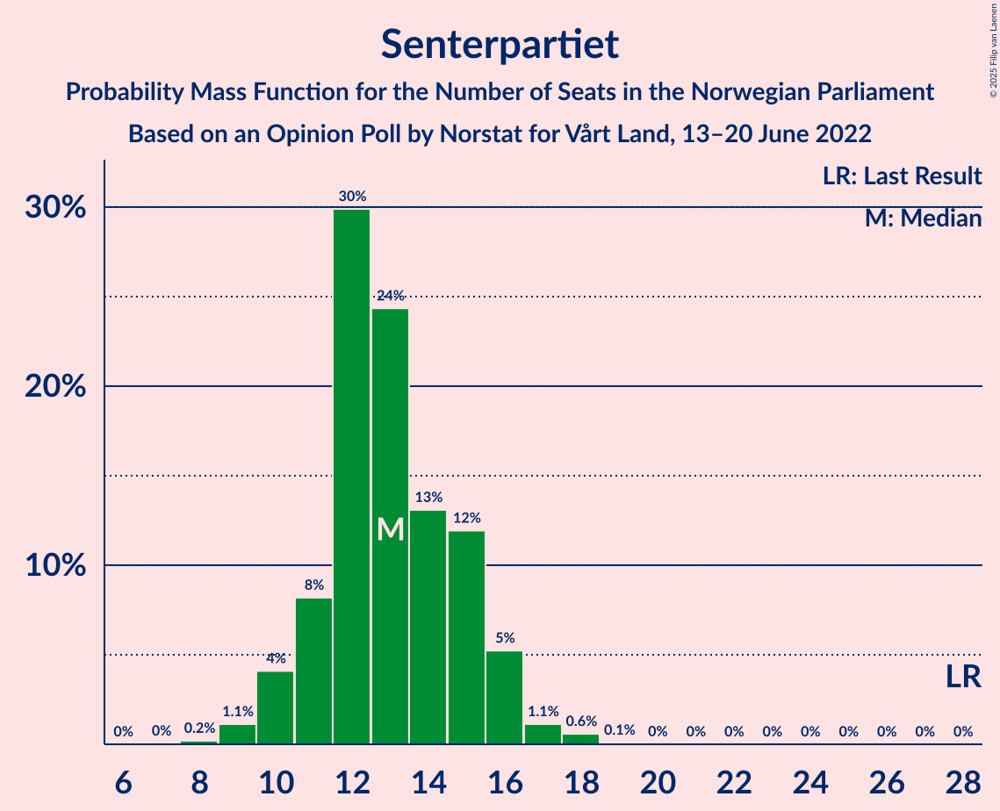
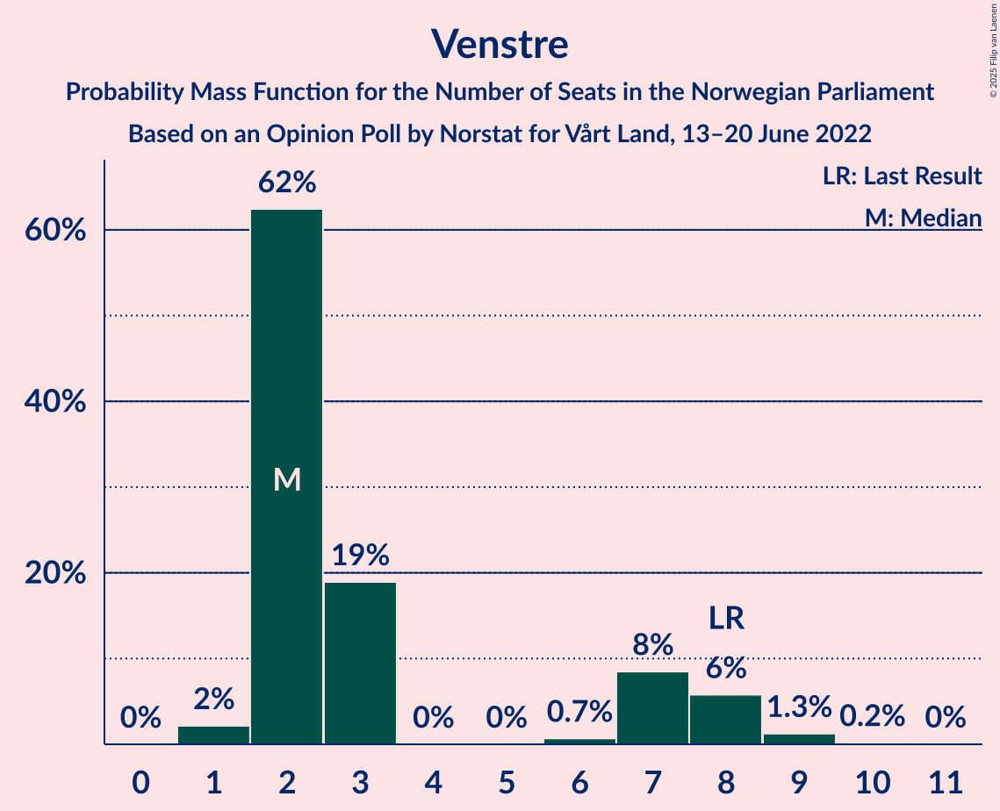

# Opinion Poll by Norstat for Vårt Land, 13–20 June 2022

<a href="#voting-intentions">Voting Intentions</a> | <a href="#seats">Seats</a> | <a href="#coalitions">Coalitions</a> | <a href="#technical-information">Technical Information</a>

## Voting Intentions

### Confidence Intervals

| Party | Last Result | Poll Result | 80% Confidence Interval | 90% Confidence Interval | 95% Confidence Interval | 99% Confidence Interval |
|:-----:|:-----------:|:-----------:|:-----------------------:|:-----------------------:|:-----------------------:|:-----------------------:|
| Høyre | 20.4% | 29.1% | 27.3–31.1% |26.8–31.6% |26.3–32.1% |25.5–33.0% |
| Arbeiderpartiet | 26.2% | 20.5% | 18.9–22.3% |18.4–22.8% |18.1–23.2% |17.3–24.1% |
| Fremskrittspartiet | 11.6% | 15.8% | 14.3–17.4% |13.9–17.8% |13.6–18.2% |12.9–19.0% |
| Sosialistisk Venstreparti | 7.6% | 8.5% | 7.5–9.8% |7.1–10.2% |6.9–10.5% |6.4–11.1% |
| Senterpartiet | 13.5% | 7.3% | 6.3–8.5% |6.0–8.8% |5.8–9.1% |5.3–9.7% |
| Rødt | 4.7% | 5.3% | 4.4–6.3% |4.2–6.6% |4.0–6.9% |3.6–7.4% |
| Miljøpartiet De Grønne | 3.9% | 3.8% | 3.1–4.7% |2.9–5.0% |2.7–5.2% |2.5–5.7% |
| Venstre | 4.6% | 3.5% | 2.8–4.4% |2.6–4.6% |2.5–4.8% |2.2–5.3% |
| Kristelig Folkeparti | 3.8% | 2.6% | 2.1–3.4% |1.9–3.7% |1.8–3.9% |1.6–4.3% |

*Note:* The poll result column reflects the actual value used in the calculations. Published results may vary slightly, and in addition be rounded to fewer digits.

## Seats

### Confidence Intervals

| Party | Last Result | Median | 80% Confidence Interval | 90% Confidence Interval | 95% Confidence Interval | 99% Confidence Interval |
|:-----:|:-----------:|:------:|:-----------------------:|:-----------------------:|:-----------------------:|:-----------------------:|
| <a href="#høyre">Høyre</a> | 36 | 52 | 48–56 |47–58 |46–58 |44–60 |
| <a href="#arbeiderpartiet">Arbeiderpartiet</a> | 48 | 38 | 35–41 |34–43 |33–44 |32–45 |
| <a href="#fremskrittspartiet">Fremskrittspartiet</a> | 21 | 29 | 26–31 |25–33 |24–34 |23–35 |
| <a href="#sosialistisk-venstreparti">Sosialistisk Venstreparti</a> | 13 | 15 | 13–17 |13–18 |12–18 |10–20 |
| <a href="#senterpartiet">Senterpartiet</a> | 28 | 13 | 11–15 |10–16 |10–16 |9–18 |
| <a href="#rødt">Rødt</a> | 8 | 9 | 7–11 |7–12 |1–12 |1–13 |
| <a href="#miljøpartiet-de-grønne">Miljøpartiet De Grønne</a> | 3 | 3 | 2–8 |1–9 |1–9 |1–10 |
| <a href="#venstre">Venstre</a> | 8 | 2 | 2–7 |2–8 |2–8 |1–9 |
| <a href="#kristelig-folkeparti">Kristelig Folkeparti</a> | 3 | 2 | 0–2 |0–3 |0–3 |0–7 |

### Høyre

*For a full overview of the results for this party, see the [Høyre](party-høyre.html) page.*

| Number of Seats | Probability | Accumulated | Special Marks |
|:---------------:|:-----------:|:-----------:|:-------------:|
| 36 | 0% | 100% | Last Result |
| 37 | 0% | 100% |  |
| 38 | 0% | 100% |  |
| 39 | 0% | 100% |  |
| 40 | 0% | 100% |  |
| 41 | 0% | 100% |  |
| 42 | 0.1% | 100% |  |
| 43 | 0.1% | 99.9% |  |
| 44 | 0.3% | 99.8% |  |
| 45 | 0.7% | 99.5% |  |
| 46 | 2% | 98.8% |  |
| 47 | 5% | 97% |  |
| 48 | 3% | 92% |  |
| 49 | 10% | 88% |  |
| 50 | 8% | 78% |  |
| 51 | 8% | 70% |  |
| 52 | 15% | 62% | Median |
| 53 | 11% | 47% |  |
| 54 | 18% | 36% |  |
| 55 | 7% | 18% |  |
| 56 | 4% | 11% |  |
| 57 | 2% | 8% |  |
| 58 | 3% | 5% |  |
| 59 | 2% | 2% |  |
| 60 | 0.5% | 0.8% |  |
| 61 | 0.2% | 0.3% |  |
| 62 | 0.1% | 0.1% |  |
| 63 | 0% | 0% |  |

### Arbeiderpartiet

*For a full overview of the results for this party, see the [Arbeiderpartiet](party-arbeiderpartiet.html) page.*

| Number of Seats | Probability | Accumulated | Special Marks |
|:---------------:|:-----------:|:-----------:|:-------------:|
| 31 | 0.3% | 100% |  |
| 32 | 0.7% | 99.7% |  |
| 33 | 2% | 99.0% |  |
| 34 | 4% | 97% |  |
| 35 | 8% | 94% |  |
| 36 | 11% | 86% |  |
| 37 | 12% | 74% |  |
| 38 | 13% | 62% | Median |
| 39 | 27% | 49% |  |
| 40 | 9% | 22% |  |
| 41 | 4% | 13% |  |
| 42 | 4% | 10% |  |
| 43 | 3% | 6% |  |
| 44 | 2% | 3% |  |
| 45 | 0.8% | 1.2% |  |
| 46 | 0.3% | 0.4% |  |
| 47 | 0.1% | 0.1% |  |
| 48 | 0.1% | 0.1% | Last Result |
| 49 | 0% | 0% |  |

### Fremskrittspartiet

*For a full overview of the results for this party, see the [Fremskrittspartiet](party-fremskrittspartiet.html) page.*

| Number of Seats | Probability | Accumulated | Special Marks |
|:---------------:|:-----------:|:-----------:|:-------------:|
| 21 | 0.1% | 100% | Last Result |
| 22 | 0.3% | 99.9% |  |
| 23 | 0.8% | 99.5% |  |
| 24 | 2% | 98.7% |  |
| 25 | 6% | 97% |  |
| 26 | 10% | 90% |  |
| 27 | 12% | 80% |  |
| 28 | 14% | 68% |  |
| 29 | 14% | 54% | Median |
| 30 | 20% | 39% |  |
| 31 | 9% | 19% |  |
| 32 | 4% | 10% |  |
| 33 | 2% | 6% |  |
| 34 | 2% | 3% |  |
| 35 | 0.8% | 1.0% |  |
| 36 | 0.1% | 0.3% |  |
| 37 | 0.1% | 0.1% |  |
| 38 | 0% | 0% |  |

### Sosialistisk Venstreparti

*For a full overview of the results for this party, see the [Sosialistisk Venstreparti](party-sosialistiskvenstreparti.html) page.*

| Number of Seats | Probability | Accumulated | Special Marks |
|:---------------:|:-----------:|:-----------:|:-------------:|
| 9 | 0.1% | 100% |  |
| 10 | 0.4% | 99.9% |  |
| 11 | 1.2% | 99.5% |  |
| 12 | 3% | 98% |  |
| 13 | 14% | 95% | Last Result |
| 14 | 15% | 81% |  |
| 15 | 21% | 66% | Median |
| 16 | 18% | 45% |  |
| 17 | 19% | 27% |  |
| 18 | 5% | 8% |  |
| 19 | 2% | 2% |  |
| 20 | 0.3% | 0.5% |  |
| 21 | 0.1% | 0.2% |  |
| 22 | 0.1% | 0.1% |  |
| 23 | 0% | 0% |  |

### Senterpartiet

*For a full overview of the results for this party, see the [Senterpartiet](party-senterpartiet.html) page.*

| Number of Seats | Probability | Accumulated | Special Marks |
|:---------------:|:-----------:|:-----------:|:-------------:|
| 7 | 0% | 100% |  |
| 8 | 0.2% | 99.9% |  |
| 9 | 1.1% | 99.7% |  |
| 10 | 4% | 98.6% |  |
| 11 | 8% | 95% |  |
| 12 | 30% | 86% |  |
| 13 | 24% | 56% | Median |
| 14 | 13% | 32% |  |
| 15 | 12% | 19% |  |
| 16 | 5% | 7% |  |
| 17 | 1.1% | 2% |  |
| 18 | 0.6% | 0.7% |  |
| 19 | 0.1% | 0.1% |  |
| 20 | 0% | 0% |  |
| 21 | 0% | 0% |  |
| 22 | 0% | 0% |  |
| 23 | 0% | 0% |  |
| 24 | 0% | 0% |  |
| 25 | 0% | 0% |  |
| 26 | 0% | 0% |  |
| 27 | 0% | 0% |  |
| 28 | 0% | 0% | Last Result |

### Rødt

*For a full overview of the results for this party, see the [Rødt](party-rødt.html) page.*

| Number of Seats | Probability | Accumulated | Special Marks |
|:---------------:|:-----------:|:-----------:|:-------------:|
| 1 | 3% | 100% |  |
| 2 | 0% | 97% |  |
| 3 | 0% | 97% |  |
| 4 | 0% | 97% |  |
| 5 | 0% | 97% |  |
| 6 | 0.5% | 97% |  |
| 7 | 7% | 97% |  |
| 8 | 17% | 90% | Last Result |
| 9 | 36% | 73% | Median |
| 10 | 19% | 37% |  |
| 11 | 10% | 17% |  |
| 12 | 6% | 7% |  |
| 13 | 0.7% | 1.0% |  |
| 14 | 0.3% | 0.3% |  |
| 15 | 0% | 0% |  |

### Miljøpartiet De Grønne

*For a full overview of the results for this party, see the [Miljøpartiet De Grønne](party-miljøpartietdegrønne.html) page.*

| Number of Seats | Probability | Accumulated | Special Marks |
|:---------------:|:-----------:|:-----------:|:-------------:|
| 1 | 9% | 100% |  |
| 2 | 28% | 91% |  |
| 3 | 25% | 63% | Last Result, Median |
| 4 | 0% | 38% |  |
| 5 | 0% | 38% |  |
| 6 | 2% | 38% |  |
| 7 | 17% | 36% |  |
| 8 | 13% | 19% |  |
| 9 | 5% | 6% |  |
| 10 | 1.0% | 1.1% |  |
| 11 | 0.1% | 0.1% |  |
| 12 | 0% | 0% |  |

### Venstre

*For a full overview of the results for this party, see the [Venstre](party-venstre.html) page.*

| Number of Seats | Probability | Accumulated | Special Marks |
|:---------------:|:-----------:|:-----------:|:-------------:|
| 1 | 2% | 100% |  |
| 2 | 62% | 98% | Median |
| 3 | 19% | 35% |  |
| 4 | 0% | 16% |  |
| 5 | 0% | 16% |  |
| 6 | 0.7% | 16% |  |
| 7 | 8% | 16% |  |
| 8 | 6% | 7% | Last Result |
| 9 | 1.3% | 1.5% |  |
| 10 | 0.2% | 0.2% |  |
| 11 | 0% | 0% |  |

### Kristelig Folkeparti

*For a full overview of the results for this party, see the [Kristelig Folkeparti](party-kristeligfolkeparti.html) page.*

| Number of Seats | Probability | Accumulated | Special Marks |
|:---------------:|:-----------:|:-----------:|:-------------:|
| 0 | 23% | 100% |  |
| 1 | 10% | 77% |  |
| 2 | 60% | 67% | Median |
| 3 | 6% | 7% | Last Result |
| 4 | 0% | 1.3% |  |
| 5 | 0% | 1.3% |  |
| 6 | 0.2% | 1.3% |  |
| 7 | 0.8% | 1.1% |  |
| 8 | 0.3% | 0.4% |  |
| 9 | 0.1% | 0.1% |  |
| 10 | 0% | 0% |  |

## Coalitions

### Confidence Intervals

| Coalition | Last Result | Median | Majority? | 80% Confidence Interval | 90% Confidence Interval | 95% Confidence Interval | 99% Confidence Interval |
|:---------:|:-----------:|:------:|:---------:|:-----------------------:|:-----------------------:|:-----------------------:|:-----------------------:|
| Høyre – Fremskrittspartiet – Senterpartiet – Venstre – Kristelig Folkeparti | 96 | 99 | 100% | 94–104 | 91–105 | 88–107 | 88–109 |
| Høyre – Fremskrittspartiet – Miljøpartiet De Grønne – Venstre – Kristelig Folkeparti | 71 | 90 | 91% | 85–95 | 83–96 | 83–97 | 80–101 |
| Høyre – Fremskrittspartiet – Venstre – Kristelig Folkeparti | 68 | 86 | 59% | 81–90 | 78–92 | 76–93 | 76–97 |
| Høyre – Fremskrittspartiet – Venstre | 65 | 84 | 44% | 79–88 | 77–91 | 75–92 | 74–95 |
| Høyre – Fremskrittspartiet | 57 | 81 | 13% | 76–85 | 74–87 | 73–89 | 71–90 |
| Arbeiderpartiet – Sosialistisk Venstreparti – Senterpartiet – Rødt – Miljøpartiet De Grønne | 100 | 80 | 12% | 75–85 | 74–86 | 72–87 | 70–89 |
| Arbeiderpartiet – Sosialistisk Venstreparti – Senterpartiet – Rødt | 97 | 75 | 0.8% | 71–80 | 70–81 | 69–83 | 65–85 |
| Arbeiderpartiet – Sosialistisk Venstreparti – Senterpartiet – Miljøpartiet De Grønne – Kristelig Folkeparti | 95 | 73 | 0.1% | 68–77 | 66–78 | 65–80 | 63–82 |
| Arbeiderpartiet – Sosialistisk Venstreparti – Senterpartiet – Miljøpartiet De Grønne | 92 | 71 | 0% | 66–75 | 65–77 | 64–78 | 62–80 |
| Arbeiderpartiet – Sosialistisk Venstreparti – Rødt – Miljøpartiet De Grønne | 72 | 67 | 0% | 62–72 | 61–73 | 60–74 | 56–77 |
| Arbeiderpartiet – Sosialistisk Venstreparti – Senterpartiet | 89 | 67 | 0% | 62–71 | 62–72 | 60–73 | 57–75 |
| Arbeiderpartiet – Senterpartiet – Miljøpartiet De Grønne – Kristelig Folkeparti | 82 | 56 | 0% | 53–62 | 51–63 | 51–64 | 48–67 |
| Høyre – Venstre – Kristelig Folkeparti | 47 | 57 | 0% | 52–61 | 51–62 | 50–64 | 48–67 |
| Arbeiderpartiet – Senterpartiet – Kristelig Folkeparti | 79 | 53 | 0% | 49–57 | 48–58 | 48–59 | 45–61 |
| Arbeiderpartiet – Sosialistisk Venstreparti | 61 | 53 | 0% | 49–57 | 49–58 | 47–59 | 46–61 |
| Arbeiderpartiet – Senterpartiet | 76 | 51 | 0% | 48–55 | 47–56 | 46–57 | 44–59 |
| Senterpartiet – Venstre – Kristelig Folkeparti | 39 | 17 | 0% | 15–21 | 14–23 | 13–24 | 12–26 |

### Høyre – Fremskrittspartiet – Senterpartiet – Venstre – Kristelig Folkeparti

| Number of Seats | Probability | Accumulated | Special Marks |
|:---------------:|:-----------:|:-----------:|:-------------:|
| 86 | 0% | 100% |  |
| 87 | 0.2% | 99.9% |  |
| 88 | 4% | 99.7% |  |
| 89 | 0.3% | 96% |  |
| 90 | 0.9% | 96% |  |
| 91 | 0.5% | 95% |  |
| 92 | 2% | 95% |  |
| 93 | 2% | 92% |  |
| 94 | 5% | 90% |  |
| 95 | 11% | 86% |  |
| 96 | 5% | 75% | Last Result |
| 97 | 11% | 70% |  |
| 98 | 6% | 58% | Median |
| 99 | 8% | 53% |  |
| 100 | 17% | 45% |  |
| 101 | 10% | 28% |  |
| 102 | 3% | 18% |  |
| 103 | 3% | 15% |  |
| 104 | 5% | 12% |  |
| 105 | 3% | 7% |  |
| 106 | 1.3% | 4% |  |
| 107 | 1.0% | 3% |  |
| 108 | 1.2% | 2% |  |
| 109 | 0.2% | 0.5% |  |
| 110 | 0.1% | 0.4% |  |
| 111 | 0.1% | 0.3% |  |
| 112 | 0.2% | 0.2% |  |
| 113 | 0% | 0% |  |

### Høyre – Fremskrittspartiet – Miljøpartiet De Grønne – Venstre – Kristelig Folkeparti

| Number of Seats | Probability | Accumulated | Special Marks |
|:---------------:|:-----------:|:-----------:|:-------------:|
| 71 | 0% | 100% | Last Result |
| 72 | 0% | 100% |  |
| 73 | 0% | 100% |  |
| 74 | 0% | 100% |  |
| 75 | 0% | 100% |  |
| 76 | 0% | 100% |  |
| 77 | 0.1% | 100% |  |
| 78 | 0.1% | 99.9% |  |
| 79 | 0.1% | 99.9% |  |
| 80 | 0.4% | 99.8% |  |
| 81 | 0.8% | 99.4% |  |
| 82 | 0.8% | 98.6% |  |
| 83 | 4% | 98% |  |
| 84 | 3% | 94% |  |
| 85 | 8% | 91% | Majority |
| 86 | 5% | 84% |  |
| 87 | 9% | 79% |  |
| 88 | 6% | 70% | Median |
| 89 | 8% | 64% |  |
| 90 | 11% | 56% |  |
| 91 | 17% | 45% |  |
| 92 | 5% | 28% |  |
| 93 | 5% | 24% |  |
| 94 | 7% | 18% |  |
| 95 | 5% | 12% |  |
| 96 | 4% | 7% |  |
| 97 | 1.2% | 3% |  |
| 98 | 0.6% | 2% |  |
| 99 | 0.6% | 1.4% |  |
| 100 | 0.3% | 0.8% |  |
| 101 | 0.3% | 0.5% |  |
| 102 | 0% | 0.2% |  |
| 103 | 0.2% | 0.2% |  |
| 104 | 0% | 0% |  |

### Høyre – Fremskrittspartiet – Venstre – Kristelig Folkeparti

| Number of Seats | Probability | Accumulated | Special Marks |
|:---------------:|:-----------:|:-----------:|:-------------:|
| 68 | 0% | 100% | Last Result |
| 69 | 0% | 100% |  |
| 70 | 0% | 100% |  |
| 71 | 0% | 100% |  |
| 72 | 0% | 100% |  |
| 73 | 0% | 100% |  |
| 74 | 0% | 100% |  |
| 75 | 0.4% | 99.9% |  |
| 76 | 3% | 99.6% |  |
| 77 | 2% | 97% |  |
| 78 | 1.1% | 95% |  |
| 79 | 1.0% | 94% |  |
| 80 | 3% | 93% |  |
| 81 | 4% | 90% |  |
| 82 | 6% | 87% |  |
| 83 | 12% | 81% |  |
| 84 | 10% | 69% |  |
| 85 | 8% | 59% | Median, Majority |
| 86 | 10% | 51% |  |
| 87 | 8% | 42% |  |
| 88 | 18% | 34% |  |
| 89 | 5% | 16% |  |
| 90 | 3% | 12% |  |
| 91 | 2% | 9% |  |
| 92 | 2% | 6% |  |
| 93 | 2% | 4% |  |
| 94 | 0.6% | 2% |  |
| 95 | 0.2% | 1.5% |  |
| 96 | 0.4% | 1.2% |  |
| 97 | 0.5% | 0.8% |  |
| 98 | 0.2% | 0.3% |  |
| 99 | 0.1% | 0.1% |  |
| 100 | 0% | 0% |  |

### Høyre – Fremskrittspartiet – Venstre

| Number of Seats | Probability | Accumulated | Special Marks |
|:---------------:|:-----------:|:-----------:|:-------------:|
| 65 | 0% | 100% | Last Result |
| 66 | 0% | 100% |  |
| 67 | 0% | 100% |  |
| 68 | 0% | 100% |  |
| 69 | 0% | 100% |  |
| 70 | 0% | 100% |  |
| 71 | 0% | 100% |  |
| 72 | 0% | 100% |  |
| 73 | 0.3% | 99.9% |  |
| 74 | 0.1% | 99.6% |  |
| 75 | 3% | 99.5% |  |
| 76 | 0.8% | 96% |  |
| 77 | 2% | 95% |  |
| 78 | 2% | 94% |  |
| 79 | 3% | 92% |  |
| 80 | 6% | 89% |  |
| 81 | 10% | 83% |  |
| 82 | 8% | 72% |  |
| 83 | 8% | 65% | Median |
| 84 | 12% | 57% |  |
| 85 | 6% | 44% | Majority |
| 86 | 16% | 38% |  |
| 87 | 8% | 22% |  |
| 88 | 5% | 14% |  |
| 89 | 2% | 9% |  |
| 90 | 2% | 7% |  |
| 91 | 2% | 5% |  |
| 92 | 2% | 3% |  |
| 93 | 0.4% | 2% |  |
| 94 | 0.4% | 1.3% |  |
| 95 | 0.4% | 0.8% |  |
| 96 | 0.2% | 0.5% |  |
| 97 | 0.1% | 0.2% |  |
| 98 | 0.1% | 0.1% |  |
| 99 | 0% | 0% |  |

### Høyre – Fremskrittspartiet

| Number of Seats | Probability | Accumulated | Special Marks |
|:---------------:|:-----------:|:-----------:|:-------------:|
| 57 | 0% | 100% | Last Result |
| 58 | 0% | 100% |  |
| 59 | 0% | 100% |  |
| 60 | 0% | 100% |  |
| 61 | 0% | 100% |  |
| 62 | 0% | 100% |  |
| 63 | 0% | 100% |  |
| 64 | 0% | 100% |  |
| 65 | 0% | 100% |  |
| 66 | 0% | 100% |  |
| 67 | 0% | 100% |  |
| 68 | 0.1% | 100% |  |
| 69 | 0.1% | 99.9% |  |
| 70 | 0.1% | 99.9% |  |
| 71 | 0.4% | 99.8% |  |
| 72 | 0.4% | 99.4% |  |
| 73 | 4% | 99.0% |  |
| 74 | 2% | 95% |  |
| 75 | 2% | 94% |  |
| 76 | 4% | 91% |  |
| 77 | 6% | 88% |  |
| 78 | 10% | 82% |  |
| 79 | 9% | 72% |  |
| 80 | 11% | 63% |  |
| 81 | 7% | 53% | Median |
| 82 | 10% | 45% |  |
| 83 | 7% | 35% |  |
| 84 | 16% | 28% |  |
| 85 | 4% | 13% | Majority |
| 86 | 4% | 9% |  |
| 87 | 1.3% | 5% |  |
| 88 | 0.9% | 4% |  |
| 89 | 2% | 3% |  |
| 90 | 0.4% | 0.7% |  |
| 91 | 0.1% | 0.3% |  |
| 92 | 0.1% | 0.2% |  |
| 93 | 0% | 0.1% |  |
| 94 | 0% | 0% |  |

### Arbeiderpartiet – Sosialistisk Venstreparti – Senterpartiet – Rødt – Miljøpartiet De Grønne

| Number of Seats | Probability | Accumulated | Special Marks |
|:---------------:|:-----------:|:-----------:|:-------------:|
| 66 | 0% | 100% |  |
| 67 | 0% | 99.9% |  |
| 68 | 0.2% | 99.9% |  |
| 69 | 0.2% | 99.8% |  |
| 70 | 0.5% | 99.6% |  |
| 71 | 0.9% | 99.1% |  |
| 72 | 1.3% | 98% |  |
| 73 | 0.9% | 97% |  |
| 74 | 3% | 96% |  |
| 75 | 5% | 93% |  |
| 76 | 6% | 88% |  |
| 77 | 11% | 82% |  |
| 78 | 8% | 71% | Median |
| 79 | 7% | 63% |  |
| 80 | 20% | 56% |  |
| 81 | 7% | 37% |  |
| 82 | 8% | 30% |  |
| 83 | 6% | 22% |  |
| 84 | 4% | 16% |  |
| 85 | 6% | 12% | Majority |
| 86 | 2% | 6% |  |
| 87 | 2% | 4% |  |
| 88 | 1.0% | 2% |  |
| 89 | 0.6% | 1.1% |  |
| 90 | 0.3% | 0.5% |  |
| 91 | 0.1% | 0.2% |  |
| 92 | 0.1% | 0.1% |  |
| 93 | 0% | 0.1% |  |
| 94 | 0% | 0% |  |
| 95 | 0% | 0% |  |
| 96 | 0% | 0% |  |
| 97 | 0% | 0% |  |
| 98 | 0% | 0% |  |
| 99 | 0% | 0% |  |
| 100 | 0% | 0% | Last Result |

### Arbeiderpartiet – Sosialistisk Venstreparti – Senterpartiet – Rødt

| Number of Seats | Probability | Accumulated | Special Marks |
|:---------------:|:-----------:|:-----------:|:-------------:|
| 63 | 0% | 100% |  |
| 64 | 0.1% | 99.9% |  |
| 65 | 0.3% | 99.8% |  |
| 66 | 0.3% | 99.5% |  |
| 67 | 0.6% | 99.2% |  |
| 68 | 0.8% | 98.5% |  |
| 69 | 1.1% | 98% |  |
| 70 | 3% | 97% |  |
| 71 | 6% | 94% |  |
| 72 | 9% | 88% |  |
| 73 | 7% | 79% |  |
| 74 | 13% | 72% |  |
| 75 | 10% | 59% | Median |
| 76 | 7% | 49% |  |
| 77 | 17% | 42% |  |
| 78 | 9% | 25% |  |
| 79 | 4% | 16% |  |
| 80 | 3% | 12% |  |
| 81 | 4% | 8% |  |
| 82 | 1.0% | 4% |  |
| 83 | 2% | 3% |  |
| 84 | 0.7% | 1.4% |  |
| 85 | 0.5% | 0.8% | Majority |
| 86 | 0.1% | 0.2% |  |
| 87 | 0.1% | 0.1% |  |
| 88 | 0% | 0% |  |
| 89 | 0% | 0% |  |
| 90 | 0% | 0% |  |
| 91 | 0% | 0% |  |
| 92 | 0% | 0% |  |
| 93 | 0% | 0% |  |
| 94 | 0% | 0% |  |
| 95 | 0% | 0% |  |
| 96 | 0% | 0% |  |
| 97 | 0% | 0% | Last Result |

### Arbeiderpartiet – Sosialistisk Venstreparti – Senterpartiet – Miljøpartiet De Grønne – Kristelig Folkeparti

| Number of Seats | Probability | Accumulated | Special Marks |
|:---------------:|:-----------:|:-----------:|:-------------:|
| 60 | 0% | 100% |  |
| 61 | 0.2% | 99.9% |  |
| 62 | 0.2% | 99.8% |  |
| 63 | 0.5% | 99.6% |  |
| 64 | 0.7% | 99.1% |  |
| 65 | 3% | 98% |  |
| 66 | 1.3% | 96% |  |
| 67 | 3% | 94% |  |
| 68 | 8% | 92% |  |
| 69 | 7% | 83% |  |
| 70 | 8% | 76% |  |
| 71 | 13% | 68% | Median |
| 72 | 5% | 55% |  |
| 73 | 18% | 50% |  |
| 74 | 8% | 32% |  |
| 75 | 3% | 25% |  |
| 76 | 9% | 22% |  |
| 77 | 5% | 13% |  |
| 78 | 3% | 8% |  |
| 79 | 1.4% | 5% |  |
| 80 | 1.1% | 3% |  |
| 81 | 0.5% | 2% |  |
| 82 | 1.2% | 2% |  |
| 83 | 0.2% | 0.3% |  |
| 84 | 0.1% | 0.1% |  |
| 85 | 0% | 0.1% | Majority |
| 86 | 0% | 0% |  |
| 87 | 0% | 0% |  |
| 88 | 0% | 0% |  |
| 89 | 0% | 0% |  |
| 90 | 0% | 0% |  |
| 91 | 0% | 0% |  |
| 92 | 0% | 0% |  |
| 93 | 0% | 0% |  |
| 94 | 0% | 0% |  |
| 95 | 0% | 0% | Last Result |

### Arbeiderpartiet – Sosialistisk Venstreparti – Senterpartiet – Miljøpartiet De Grønne

| Number of Seats | Probability | Accumulated | Special Marks |
|:---------------:|:-----------:|:-----------:|:-------------:|
| 59 | 0.1% | 100% |  |
| 60 | 0.1% | 99.9% |  |
| 61 | 0.3% | 99.8% |  |
| 62 | 0.8% | 99.5% |  |
| 63 | 0.9% | 98.7% |  |
| 64 | 1.4% | 98% |  |
| 65 | 4% | 96% |  |
| 66 | 4% | 93% |  |
| 67 | 8% | 89% |  |
| 68 | 9% | 81% |  |
| 69 | 14% | 73% | Median |
| 70 | 6% | 59% |  |
| 71 | 19% | 53% |  |
| 72 | 5% | 34% |  |
| 73 | 5% | 29% |  |
| 74 | 7% | 24% |  |
| 75 | 8% | 17% |  |
| 76 | 2% | 9% |  |
| 77 | 2% | 6% |  |
| 78 | 2% | 4% |  |
| 79 | 0.9% | 2% |  |
| 80 | 1.2% | 2% |  |
| 81 | 0.1% | 0.4% |  |
| 82 | 0.2% | 0.3% |  |
| 83 | 0% | 0.1% |  |
| 84 | 0% | 0% |  |
| 85 | 0% | 0% | Majority |
| 86 | 0% | 0% |  |
| 87 | 0% | 0% |  |
| 88 | 0% | 0% |  |
| 89 | 0% | 0% |  |
| 90 | 0% | 0% |  |
| 91 | 0% | 0% |  |
| 92 | 0% | 0% | Last Result |

### Arbeiderpartiet – Sosialistisk Venstreparti – Rødt – Miljøpartiet De Grønne

| Number of Seats | Probability | Accumulated | Special Marks |
|:---------------:|:-----------:|:-----------:|:-------------:|
| 55 | 0.1% | 100% |  |
| 56 | 0.4% | 99.9% |  |
| 57 | 0.2% | 99.4% |  |
| 58 | 0.3% | 99.2% |  |
| 59 | 1.3% | 98.9% |  |
| 60 | 2% | 98% |  |
| 61 | 3% | 96% |  |
| 62 | 5% | 93% |  |
| 63 | 7% | 88% |  |
| 64 | 11% | 81% |  |
| 65 | 8% | 70% | Median |
| 66 | 8% | 62% |  |
| 67 | 12% | 54% |  |
| 68 | 17% | 43% |  |
| 69 | 4% | 26% |  |
| 70 | 5% | 22% |  |
| 71 | 5% | 18% |  |
| 72 | 3% | 13% | Last Result |
| 73 | 6% | 9% |  |
| 74 | 0.7% | 3% |  |
| 75 | 1.2% | 2% |  |
| 76 | 0.4% | 1.1% |  |
| 77 | 0.5% | 0.7% |  |
| 78 | 0.1% | 0.3% |  |
| 79 | 0% | 0.1% |  |
| 80 | 0% | 0.1% |  |
| 81 | 0% | 0% |  |

### Arbeiderpartiet – Sosialistisk Venstreparti – Senterpartiet

| Number of Seats | Probability | Accumulated | Special Marks |
|:---------------:|:-----------:|:-----------:|:-------------:|
| 55 | 0% | 100% |  |
| 56 | 0.1% | 99.9% |  |
| 57 | 0.3% | 99.8% |  |
| 58 | 0.2% | 99.5% |  |
| 59 | 0.6% | 99.3% |  |
| 60 | 1.4% | 98.7% |  |
| 61 | 2% | 97% |  |
| 62 | 7% | 95% |  |
| 63 | 10% | 89% |  |
| 64 | 5% | 79% |  |
| 65 | 13% | 74% |  |
| 66 | 10% | 60% | Median |
| 67 | 13% | 50% |  |
| 68 | 17% | 38% |  |
| 69 | 6% | 21% |  |
| 70 | 4% | 14% |  |
| 71 | 4% | 10% |  |
| 72 | 3% | 6% |  |
| 73 | 1.1% | 3% |  |
| 74 | 1.2% | 2% |  |
| 75 | 0.3% | 0.6% |  |
| 76 | 0.2% | 0.3% |  |
| 77 | 0.1% | 0.1% |  |
| 78 | 0% | 0% |  |
| 79 | 0% | 0% |  |
| 80 | 0% | 0% |  |
| 81 | 0% | 0% |  |
| 82 | 0% | 0% |  |
| 83 | 0% | 0% |  |
| 84 | 0% | 0% |  |
| 85 | 0% | 0% | Majority |
| 86 | 0% | 0% |  |
| 87 | 0% | 0% |  |
| 88 | 0% | 0% |  |
| 89 | 0% | 0% | Last Result |

### Arbeiderpartiet – Senterpartiet – Miljøpartiet De Grønne – Kristelig Folkeparti

| Number of Seats | Probability | Accumulated | Special Marks |
|:---------------:|:-----------:|:-----------:|:-------------:|
| 46 | 0% | 100% |  |
| 47 | 0.3% | 99.9% |  |
| 48 | 0.4% | 99.7% |  |
| 49 | 0.4% | 99.2% |  |
| 50 | 1.3% | 98.8% |  |
| 51 | 3% | 98% |  |
| 52 | 3% | 95% |  |
| 53 | 4% | 92% |  |
| 54 | 7% | 88% |  |
| 55 | 14% | 81% |  |
| 56 | 21% | 68% | Median |
| 57 | 4% | 46% |  |
| 58 | 12% | 42% |  |
| 59 | 8% | 30% |  |
| 60 | 7% | 22% |  |
| 61 | 4% | 15% |  |
| 62 | 5% | 11% |  |
| 63 | 2% | 6% |  |
| 64 | 1.1% | 3% |  |
| 65 | 0.6% | 2% |  |
| 66 | 1.1% | 2% |  |
| 67 | 0.3% | 0.5% |  |
| 68 | 0.1% | 0.2% |  |
| 69 | 0.1% | 0.1% |  |
| 70 | 0% | 0.1% |  |
| 71 | 0% | 0% |  |
| 72 | 0% | 0% |  |
| 73 | 0% | 0% |  |
| 74 | 0% | 0% |  |
| 75 | 0% | 0% |  |
| 76 | 0% | 0% |  |
| 77 | 0% | 0% |  |
| 78 | 0% | 0% |  |
| 79 | 0% | 0% |  |
| 80 | 0% | 0% |  |
| 81 | 0% | 0% |  |
| 82 | 0% | 0% | Last Result |

### Høyre – Venstre – Kristelig Folkeparti

| Number of Seats | Probability | Accumulated | Special Marks |
|:---------------:|:-----------:|:-----------:|:-------------:|
| 46 | 0% | 100% |  |
| 47 | 0.1% | 99.9% | Last Result |
| 48 | 0.6% | 99.8% |  |
| 49 | 0.6% | 99.2% |  |
| 50 | 3% | 98.6% |  |
| 51 | 3% | 95% |  |
| 52 | 3% | 92% |  |
| 53 | 6% | 89% |  |
| 54 | 12% | 84% |  |
| 55 | 9% | 72% |  |
| 56 | 6% | 63% | Median |
| 57 | 9% | 56% |  |
| 58 | 20% | 48% |  |
| 59 | 9% | 28% |  |
| 60 | 5% | 20% |  |
| 61 | 6% | 15% |  |
| 62 | 4% | 9% |  |
| 63 | 2% | 5% |  |
| 64 | 1.0% | 3% |  |
| 65 | 0.8% | 2% |  |
| 66 | 0.3% | 0.9% |  |
| 67 | 0.4% | 0.6% |  |
| 68 | 0.1% | 0.2% |  |
| 69 | 0% | 0.1% |  |
| 70 | 0.1% | 0.1% |  |
| 71 | 0% | 0% |  |

### Arbeiderpartiet – Senterpartiet – Kristelig Folkeparti

| Number of Seats | Probability | Accumulated | Special Marks |
|:---------------:|:-----------:|:-----------:|:-------------:|
| 44 | 0.2% | 100% |  |
| 45 | 0.3% | 99.8% |  |
| 46 | 0.8% | 99.4% |  |
| 47 | 1.0% | 98.7% |  |
| 48 | 4% | 98% |  |
| 49 | 6% | 94% |  |
| 50 | 3% | 88% |  |
| 51 | 16% | 84% |  |
| 52 | 12% | 68% |  |
| 53 | 25% | 56% | Median |
| 54 | 12% | 31% |  |
| 55 | 5% | 18% |  |
| 56 | 4% | 14% |  |
| 57 | 4% | 10% |  |
| 58 | 3% | 6% |  |
| 59 | 2% | 3% |  |
| 60 | 0.8% | 1.4% |  |
| 61 | 0.3% | 0.6% |  |
| 62 | 0.2% | 0.3% |  |
| 63 | 0.1% | 0.1% |  |
| 64 | 0% | 0% |  |
| 65 | 0% | 0% |  |
| 66 | 0% | 0% |  |
| 67 | 0% | 0% |  |
| 68 | 0% | 0% |  |
| 69 | 0% | 0% |  |
| 70 | 0% | 0% |  |
| 71 | 0% | 0% |  |
| 72 | 0% | 0% |  |
| 73 | 0% | 0% |  |
| 74 | 0% | 0% |  |
| 75 | 0% | 0% |  |
| 76 | 0% | 0% |  |
| 77 | 0% | 0% |  |
| 78 | 0% | 0% |  |
| 79 | 0% | 0% | Last Result |

### Arbeiderpartiet – Sosialistisk Venstreparti

| Number of Seats | Probability | Accumulated | Special Marks |
|:---------------:|:-----------:|:-----------:|:-------------:|
| 43 | 0.1% | 100% |  |
| 44 | 0.1% | 99.9% |  |
| 45 | 0.2% | 99.9% |  |
| 46 | 0.5% | 99.7% |  |
| 47 | 2% | 99.1% |  |
| 48 | 2% | 97% |  |
| 49 | 6% | 95% |  |
| 50 | 9% | 89% |  |
| 51 | 10% | 81% |  |
| 52 | 11% | 70% |  |
| 53 | 11% | 59% | Median |
| 54 | 6% | 48% |  |
| 55 | 10% | 42% |  |
| 56 | 18% | 31% |  |
| 57 | 6% | 13% |  |
| 58 | 3% | 8% |  |
| 59 | 3% | 5% |  |
| 60 | 0.7% | 2% |  |
| 61 | 0.5% | 0.9% | Last Result |
| 62 | 0.2% | 0.4% |  |
| 63 | 0.1% | 0.1% |  |
| 64 | 0% | 0% |  |

### Arbeiderpartiet – Senterpartiet

| Number of Seats | Probability | Accumulated | Special Marks |
|:---------------:|:-----------:|:-----------:|:-------------:|
| 42 | 0.1% | 100% |  |
| 43 | 0.2% | 99.9% |  |
| 44 | 0.3% | 99.6% |  |
| 45 | 1.2% | 99.3% |  |
| 46 | 1.3% | 98% |  |
| 47 | 3% | 97% |  |
| 48 | 7% | 93% |  |
| 49 | 12% | 86% |  |
| 50 | 10% | 74% |  |
| 51 | 23% | 64% | Median |
| 52 | 19% | 41% |  |
| 53 | 8% | 23% |  |
| 54 | 4% | 14% |  |
| 55 | 5% | 11% |  |
| 56 | 2% | 6% |  |
| 57 | 2% | 3% |  |
| 58 | 0.8% | 2% |  |
| 59 | 0.5% | 0.8% |  |
| 60 | 0.2% | 0.3% |  |
| 61 | 0.1% | 0.1% |  |
| 62 | 0% | 0% |  |
| 63 | 0% | 0% |  |
| 64 | 0% | 0% |  |
| 65 | 0% | 0% |  |
| 66 | 0% | 0% |  |
| 67 | 0% | 0% |  |
| 68 | 0% | 0% |  |
| 69 | 0% | 0% |  |
| 70 | 0% | 0% |  |
| 71 | 0% | 0% |  |
| 72 | 0% | 0% |  |
| 73 | 0% | 0% |  |
| 74 | 0% | 0% |  |
| 75 | 0% | 0% |  |
| 76 | 0% | 0% | Last Result |

### Senterpartiet – Venstre – Kristelig Folkeparti

| Number of Seats | Probability | Accumulated | Special Marks |
|:---------------:|:-----------:|:-----------:|:-------------:|
| 11 | 0.1% | 100% |  |
| 12 | 0.4% | 99.9% |  |
| 13 | 3% | 99.5% |  |
| 14 | 5% | 97% |  |
| 15 | 12% | 92% |  |
| 16 | 24% | 80% |  |
| 17 | 15% | 57% | Median |
| 18 | 9% | 42% |  |
| 19 | 9% | 32% |  |
| 20 | 9% | 24% |  |
| 21 | 5% | 15% |  |
| 22 | 4% | 10% |  |
| 23 | 2% | 6% |  |
| 24 | 2% | 4% |  |
| 25 | 0.9% | 2% |  |
| 26 | 0.4% | 0.7% |  |
| 27 | 0.2% | 0.3% |  |
| 28 | 0% | 0.1% |  |
| 29 | 0% | 0% |  |
| 30 | 0% | 0% |  |
| 31 | 0% | 0% |  |
| 32 | 0% | 0% |  |
| 33 | 0% | 0% |  |
| 34 | 0% | 0% |  |
| 35 | 0% | 0% |  |
| 36 | 0% | 0% |  |
| 37 | 0% | 0% |  |
| 38 | 0% | 0% |  |
| 39 | 0% | 0% | Last Result |

## Technical Information

### Opinion Poll

+ **Polling firm:** Norstat
+ **Commissioner(s):** Vårt Land
+ **Fieldwork period:** 13–20 June 2022

### Calculations

+ **Sample size:** 951
+ **Simulations done:** 1,048,576
+ **Error estimate:** 1.30%

