# Opinion Poll by Ipsos for Dagbladet, 27–29 June 2022

<a href="#voting-intentions">Voting Intentions</a> | <a href="#seats">Seats</a> | <a href="#coalitions">Coalitions</a> | <a href="#technical-information">Technical Information</a>

## Voting Intentions

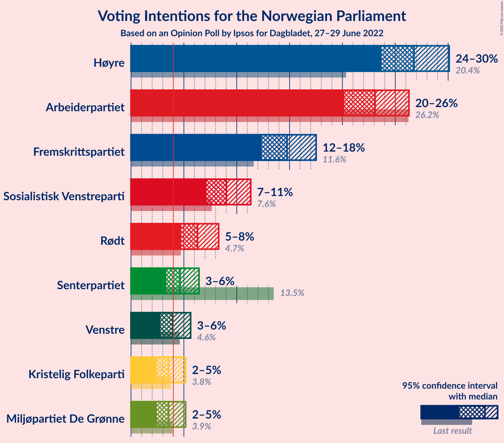

### Confidence Intervals

| Party | Last Result | Poll Result | 80% Confidence Interval | 90% Confidence Interval | 95% Confidence Interval | 99% Confidence Interval |
|:-----:|:-----------:|:-----------:|:-----------------------:|:-----------------------:|:-----------------------:|:-----------------------:|
| Høyre | 20.4% | 26.8% | 24.8–29.0% |24.2–29.6% |23.7–30.1% |22.7–31.2% |
| Arbeiderpartiet | 26.2% | 23.1% | 21.2–25.2% |20.6–25.8% |20.2–26.3% |19.3–27.3% |
| Fremskrittspartiet | 11.6% | 14.8% | 13.2–16.6% |12.7–17.1% |12.4–17.5% |11.6–18.4% |
| Sosialistisk Venstreparti | 7.6% | 9.0% | 7.8–10.5% |7.4–10.9% |7.1–11.3% |6.6–12.1% |
| Rødt | 4.7% | 6.3% | 5.3–7.6% |5.0–8.0% |4.7–8.3% |4.3–9.0% |
| Senterpartiet | 13.5% | 4.6% | 3.8–5.8% |3.5–6.1% |3.3–6.4% |3.0–7.0% |
| Venstre | 4.6% | 4.0% | 3.2–5.1% |3.0–5.4% |2.8–5.6% |2.4–6.2% |
| Kristelig Folkeparti | 3.8% | 3.6% | 2.8–4.6% |2.6–4.9% |2.4–5.2% |2.1–5.7% |
| Miljøpartiet De Grønne | 3.9% | 3.6% | 2.8–4.6% |2.6–4.9% |2.4–5.2% |2.1–5.7% |

*Note:* The poll result column reflects the actual value used in the calculations. Published results may vary slightly, and in addition be rounded to fewer digits.

## Seats

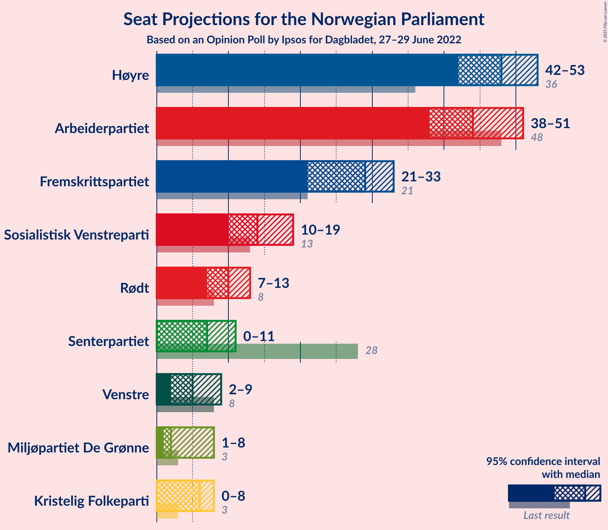

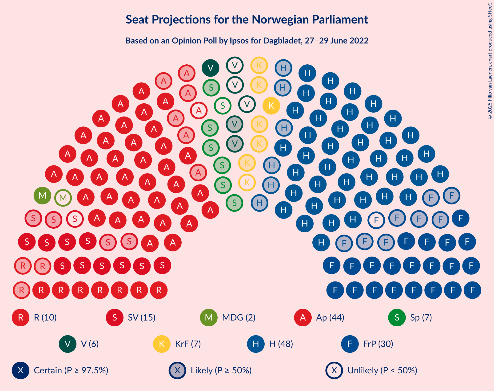

### Confidence Intervals

| Party | Last Result | Median | 80% Confidence Interval | 90% Confidence Interval | 95% Confidence Interval | 99% Confidence Interval |
|:-----:|:-----------:|:------:|:-----------------------:|:-----------------------:|:-----------------------:|:-----------------------:|
| <a href="#høyre">Høyre</a> | 36 | 48 | 44–51 |43–52 |42–53 |40–56 |
| <a href="#arbeiderpartiet">Arbeiderpartiet</a> | 48 | 44 | 40–48 |39–50 |38–51 |37–52 |
| <a href="#fremskrittspartiet">Fremskrittspartiet</a> | 21 | 29 | 22–31 |21–32 |21–33 |19–35 |
| <a href="#sosialistisk-venstreparti">Sosialistisk Venstreparti</a> | 13 | 14 | 12–17 |11–18 |10–19 |9–21 |
| <a href="#rødt">Rødt</a> | 8 | 10 | 7–12 |7–13 |7–13 |6–15 |
| <a href="#senterpartiet">Senterpartiet</a> | 28 | 7 | 0–10 |0–10 |0–11 |0–12 |
| <a href="#venstre">Venstre</a> | 8 | 5 | 2–8 |2–8 |2–9 |2–10 |
| <a href="#kristelig-folkeparti">Kristelig Folkeparti</a> | 3 | 6 | 3–7 |1–8 |0–8 |0–8 |
| <a href="#miljøpartiet-de-grønne">Miljøpartiet De Grønne</a> | 3 | 2 | 1–7 |1–7 |1–8 |1–9 |

### Høyre

*For a full overview of the results for this party, see the [Høyre](party-høyre.html) page.*

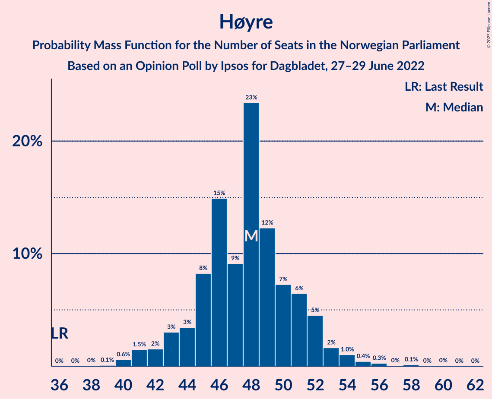

| Number of Seats | Probability | Accumulated | Special Marks |
|:---------------:|:-----------:|:-----------:|:-------------:|
| 36 | 0% | 100% | Last Result |
| 37 | 0% | 100% |  |
| 38 | 0% | 100% |  |
| 39 | 0.1% | 99.9% |  |
| 40 | 0.6% | 99.9% |  |
| 41 | 1.5% | 99.3% |  |
| 42 | 2% | 98% |  |
| 43 | 3% | 96% |  |
| 44 | 3% | 93% |  |
| 45 | 8% | 90% |  |
| 46 | 15% | 82% |  |
| 47 | 9% | 67% |  |
| 48 | 23% | 58% | Median |
| 49 | 12% | 34% |  |
| 50 | 7% | 22% |  |
| 51 | 6% | 15% |  |
| 52 | 5% | 8% |  |
| 53 | 2% | 4% |  |
| 54 | 1.0% | 2% |  |
| 55 | 0.4% | 0.9% |  |
| 56 | 0.3% | 0.5% |  |
| 57 | 0% | 0.3% |  |
| 58 | 0.1% | 0.2% |  |
| 59 | 0% | 0.1% |  |
| 60 | 0% | 0.1% |  |
| 61 | 0% | 0% |  |

### Arbeiderpartiet

*For a full overview of the results for this party, see the [Arbeiderpartiet](party-arbeiderpartiet.html) page.*

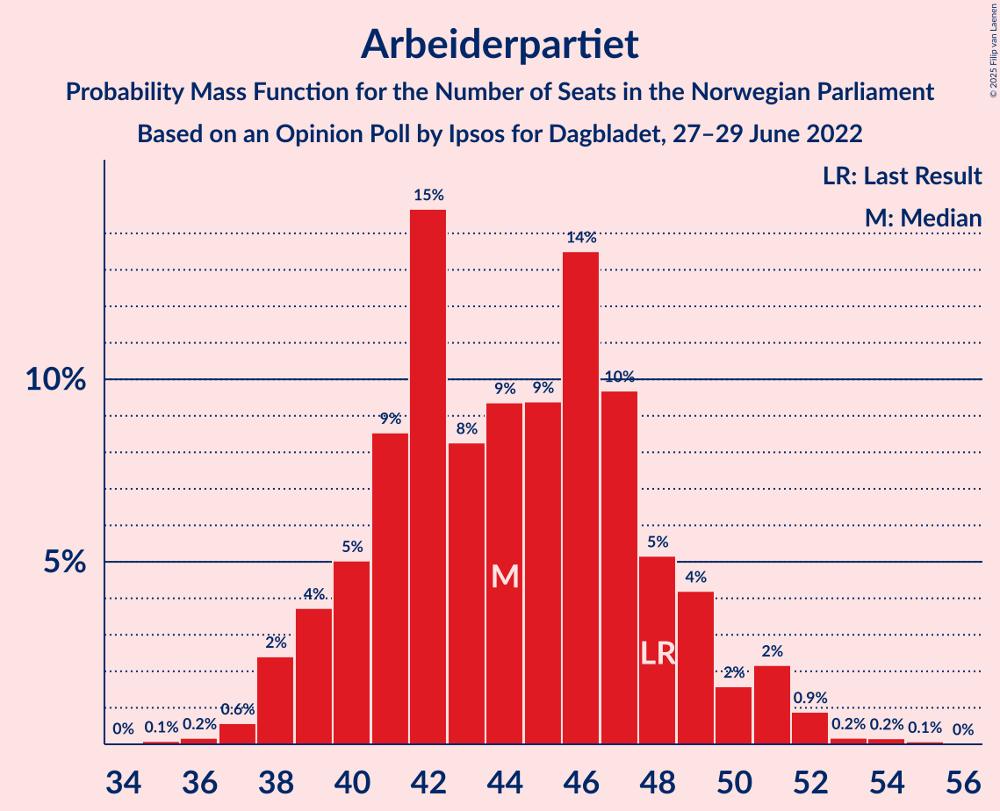

| Number of Seats | Probability | Accumulated | Special Marks |
|:---------------:|:-----------:|:-----------:|:-------------:|
| 34 | 0% | 100% |  |
| 35 | 0.1% | 99.9% |  |
| 36 | 0.2% | 99.8% |  |
| 37 | 0.6% | 99.7% |  |
| 38 | 2% | 99.1% |  |
| 39 | 4% | 97% |  |
| 40 | 5% | 93% |  |
| 41 | 9% | 88% |  |
| 42 | 15% | 79% |  |
| 43 | 8% | 65% |  |
| 44 | 9% | 56% | Median |
| 45 | 9% | 47% |  |
| 46 | 14% | 38% |  |
| 47 | 10% | 24% |  |
| 48 | 5% | 14% | Last Result |
| 49 | 4% | 9% |  |
| 50 | 2% | 5% |  |
| 51 | 2% | 4% |  |
| 52 | 0.9% | 1.3% |  |
| 53 | 0.2% | 0.5% |  |
| 54 | 0.2% | 0.3% |  |
| 55 | 0.1% | 0.1% |  |
| 56 | 0% | 0% |  |

### Fremskrittspartiet

*For a full overview of the results for this party, see the [Fremskrittspartiet](party-fremskrittspartiet.html) page.*

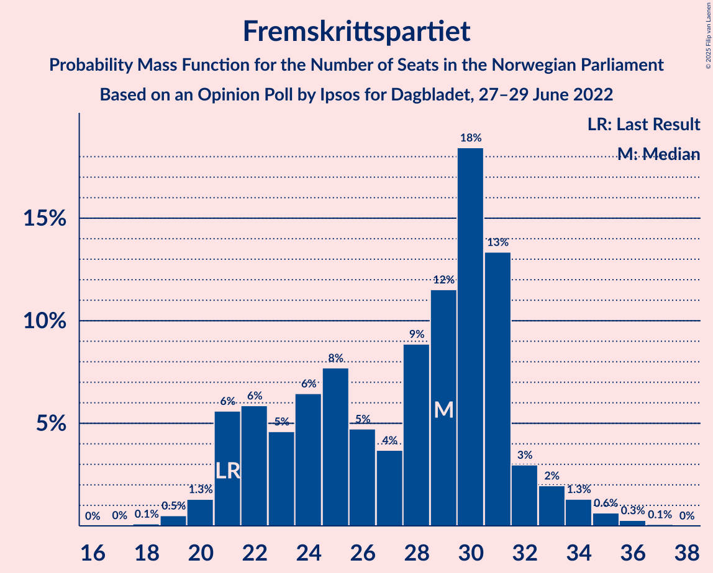

| Number of Seats | Probability | Accumulated | Special Marks |
|:---------------:|:-----------:|:-----------:|:-------------:|
| 18 | 0.1% | 100% |  |
| 19 | 0.5% | 99.9% |  |
| 20 | 1.3% | 99.4% |  |
| 21 | 6% | 98% | Last Result |
| 22 | 6% | 92% |  |
| 23 | 5% | 87% |  |
| 24 | 6% | 82% |  |
| 25 | 8% | 76% |  |
| 26 | 5% | 68% |  |
| 27 | 4% | 63% |  |
| 28 | 9% | 59% |  |
| 29 | 12% | 51% | Median |
| 30 | 18% | 39% |  |
| 31 | 13% | 21% |  |
| 32 | 3% | 7% |  |
| 33 | 2% | 4% |  |
| 34 | 1.3% | 2% |  |
| 35 | 0.6% | 1.0% |  |
| 36 | 0.3% | 0.4% |  |
| 37 | 0.1% | 0.1% |  |
| 38 | 0% | 0% |  |

### Sosialistisk Venstreparti

*For a full overview of the results for this party, see the [Sosialistisk Venstreparti](party-sosialistiskvenstreparti.html) page.*

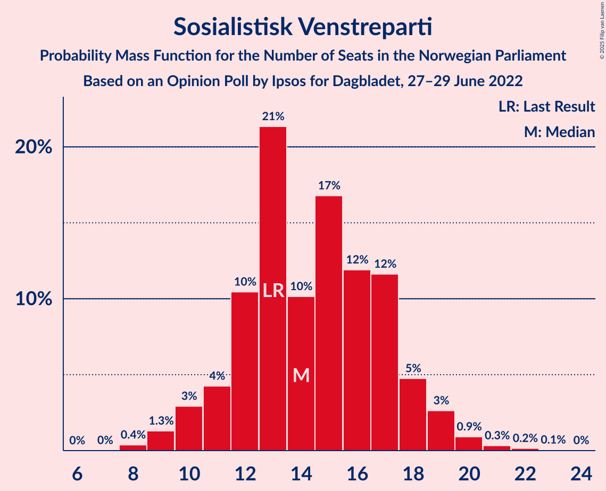

| Number of Seats | Probability | Accumulated | Special Marks |
|:---------------:|:-----------:|:-----------:|:-------------:|
| 8 | 0.4% | 100% |  |
| 9 | 1.3% | 99.6% |  |
| 10 | 3% | 98% |  |
| 11 | 4% | 95% |  |
| 12 | 10% | 91% |  |
| 13 | 21% | 81% | Last Result |
| 14 | 10% | 59% | Median |
| 15 | 17% | 49% |  |
| 16 | 12% | 32% |  |
| 17 | 12% | 20% |  |
| 18 | 5% | 9% |  |
| 19 | 3% | 4% |  |
| 20 | 0.9% | 1.5% |  |
| 21 | 0.3% | 0.6% |  |
| 22 | 0.2% | 0.2% |  |
| 23 | 0.1% | 0.1% |  |
| 24 | 0% | 0% |  |

### Rødt

*For a full overview of the results for this party, see the [Rødt](party-rødt.html) page.*

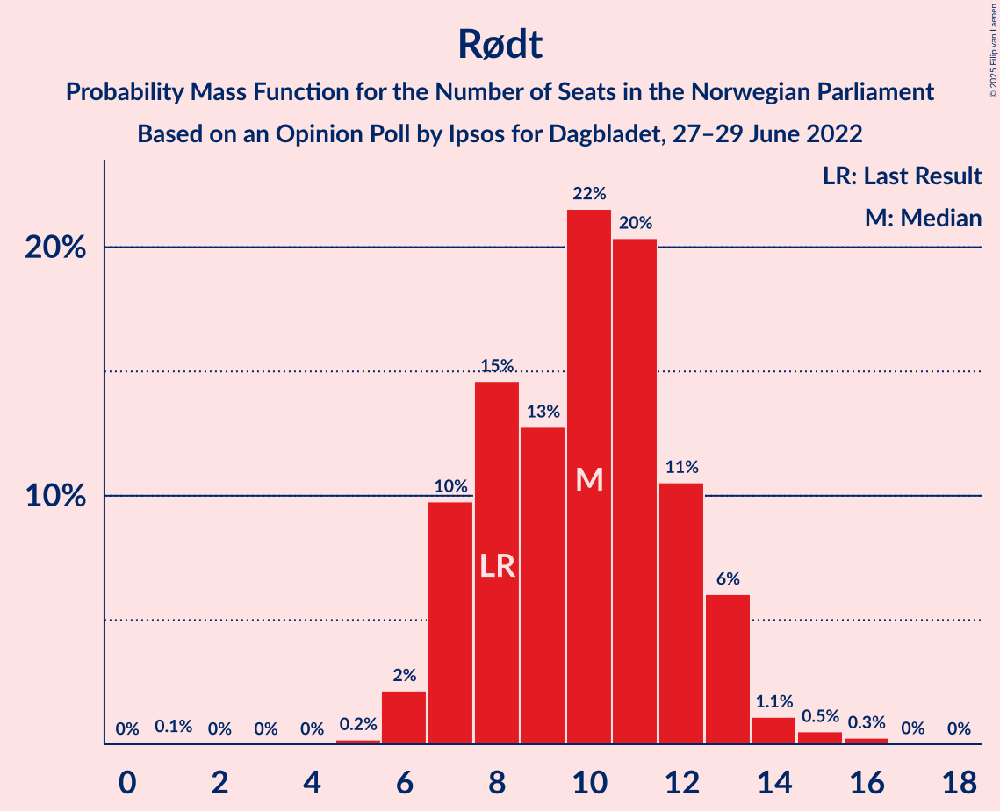

| Number of Seats | Probability | Accumulated | Special Marks |
|:---------------:|:-----------:|:-----------:|:-------------:|
| 1 | 0.1% | 100% |  |
| 2 | 0% | 99.9% |  |
| 3 | 0% | 99.9% |  |
| 4 | 0% | 99.9% |  |
| 5 | 0.2% | 99.9% |  |
| 6 | 2% | 99.7% |  |
| 7 | 10% | 98% |  |
| 8 | 15% | 88% | Last Result |
| 9 | 13% | 73% |  |
| 10 | 22% | 60% | Median |
| 11 | 20% | 39% |  |
| 12 | 11% | 18% |  |
| 13 | 6% | 8% |  |
| 14 | 1.1% | 2% |  |
| 15 | 0.5% | 0.8% |  |
| 16 | 0.3% | 0.3% |  |
| 17 | 0% | 0% |  |

### Senterpartiet

*For a full overview of the results for this party, see the [Senterpartiet](party-senterpartiet.html) page.*

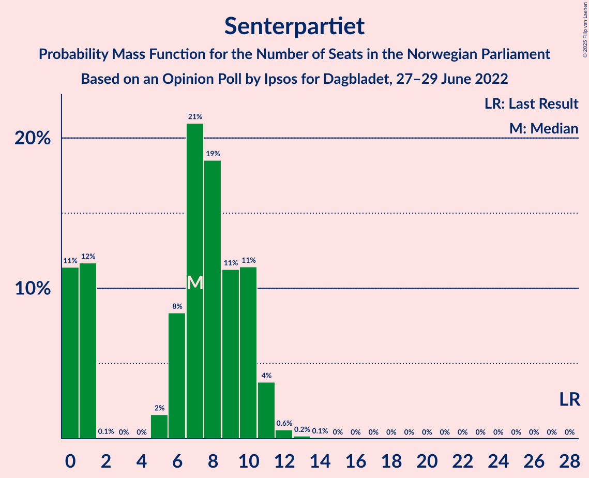

| Number of Seats | Probability | Accumulated | Special Marks |
|:---------------:|:-----------:|:-----------:|:-------------:|
| 0 | 11% | 100% |  |
| 1 | 12% | 89% |  |
| 2 | 0.1% | 77% |  |
| 3 | 0% | 77% |  |
| 4 | 0% | 77% |  |
| 5 | 2% | 77% |  |
| 6 | 8% | 75% |  |
| 7 | 21% | 67% | Median |
| 8 | 19% | 46% |  |
| 9 | 11% | 27% |  |
| 10 | 11% | 16% |  |
| 11 | 4% | 5% |  |
| 12 | 0.6% | 0.9% |  |
| 13 | 0.2% | 0.3% |  |
| 14 | 0.1% | 0.1% |  |
| 15 | 0% | 0% |  |
| 16 | 0% | 0% |  |
| 17 | 0% | 0% |  |
| 18 | 0% | 0% |  |
| 19 | 0% | 0% |  |
| 20 | 0% | 0% |  |
| 21 | 0% | 0% |  |
| 22 | 0% | 0% |  |
| 23 | 0% | 0% |  |
| 24 | 0% | 0% |  |
| 25 | 0% | 0% |  |
| 26 | 0% | 0% |  |
| 27 | 0% | 0% |  |
| 28 | 0% | 0% | Last Result |

### Venstre

*For a full overview of the results for this party, see the [Venstre](party-venstre.html) page.*

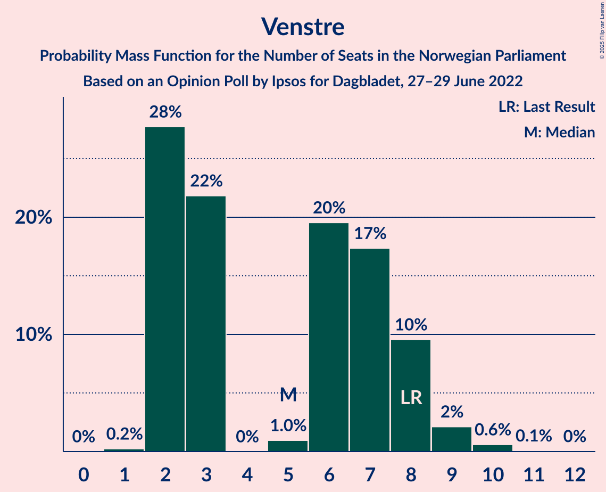

| Number of Seats | Probability | Accumulated | Special Marks |
|:---------------:|:-----------:|:-----------:|:-------------:|
| 1 | 0.2% | 100% |  |
| 2 | 28% | 99.8% |  |
| 3 | 22% | 72% |  |
| 4 | 0% | 50% |  |
| 5 | 1.0% | 50% | Median |
| 6 | 20% | 49% |  |
| 7 | 17% | 30% |  |
| 8 | 10% | 12% | Last Result |
| 9 | 2% | 3% |  |
| 10 | 0.6% | 0.7% |  |
| 11 | 0.1% | 0.1% |  |
| 12 | 0% | 0% |  |

### Kristelig Folkeparti

*For a full overview of the results for this party, see the [Kristelig Folkeparti](party-kristeligfolkeparti.html) page.*

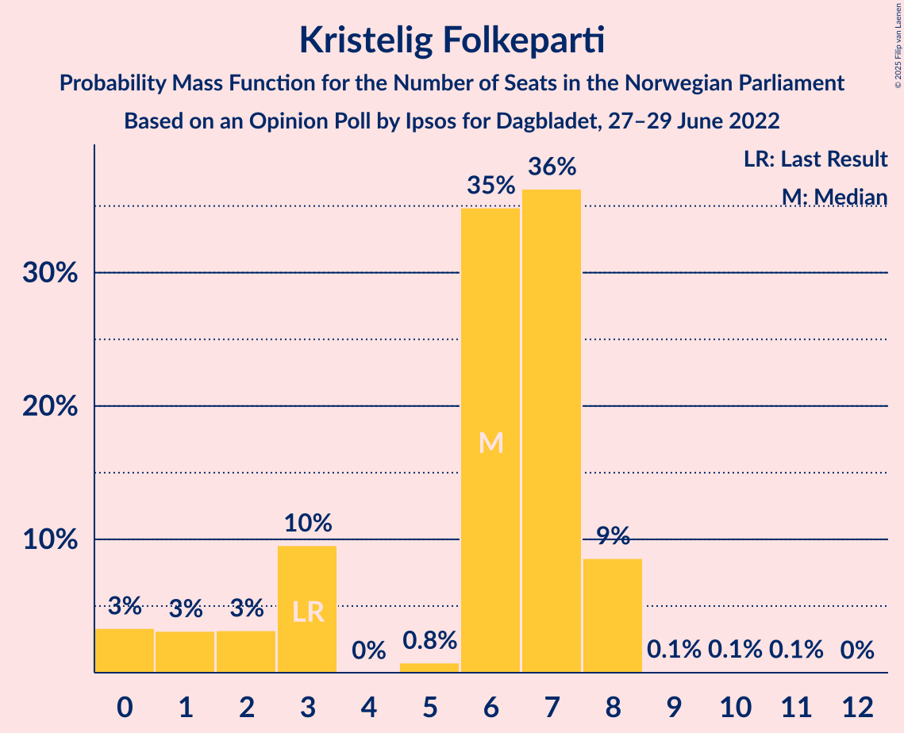

| Number of Seats | Probability | Accumulated | Special Marks |
|:---------------:|:-----------:|:-----------:|:-------------:|
| 0 | 3% | 100% |  |
| 1 | 3% | 97% |  |
| 2 | 3% | 94% |  |
| 3 | 10% | 90% | Last Result |
| 4 | 0% | 81% |  |
| 5 | 0.8% | 81% |  |
| 6 | 35% | 80% | Median |
| 7 | 36% | 45% |  |
| 8 | 9% | 9% |  |
| 9 | 0.1% | 0.3% |  |
| 10 | 0.1% | 0.2% |  |
| 11 | 0.1% | 0.1% |  |
| 12 | 0% | 0% |  |

### Miljøpartiet De Grønne

*For a full overview of the results for this party, see the [Miljøpartiet De Grønne](party-miljøpartietdegrønne.html) page.*

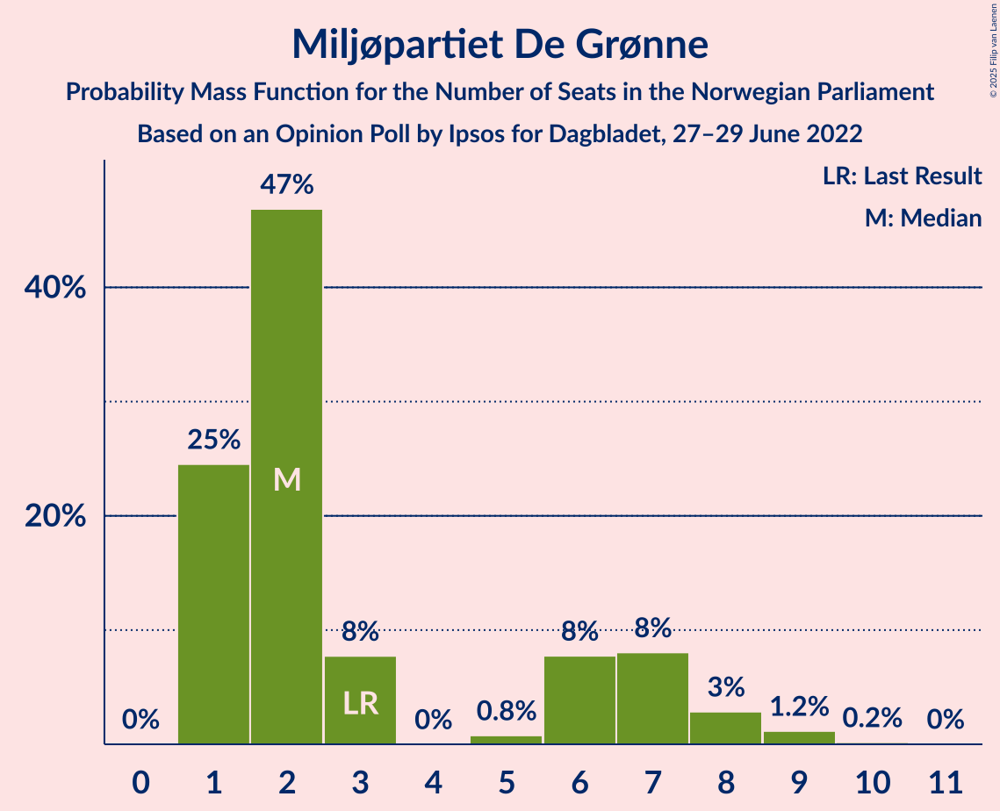

| Number of Seats | Probability | Accumulated | Special Marks |
|:---------------:|:-----------:|:-----------:|:-------------:|
| 1 | 25% | 100% |  |
| 2 | 47% | 75% | Median |
| 3 | 8% | 29% | Last Result |
| 4 | 0% | 21% |  |
| 5 | 0.8% | 21% |  |
| 6 | 8% | 20% |  |
| 7 | 8% | 12% |  |
| 8 | 3% | 4% |  |
| 9 | 1.2% | 1.4% |  |
| 10 | 0.2% | 0.2% |  |
| 11 | 0% | 0% |  |

## Coalitions

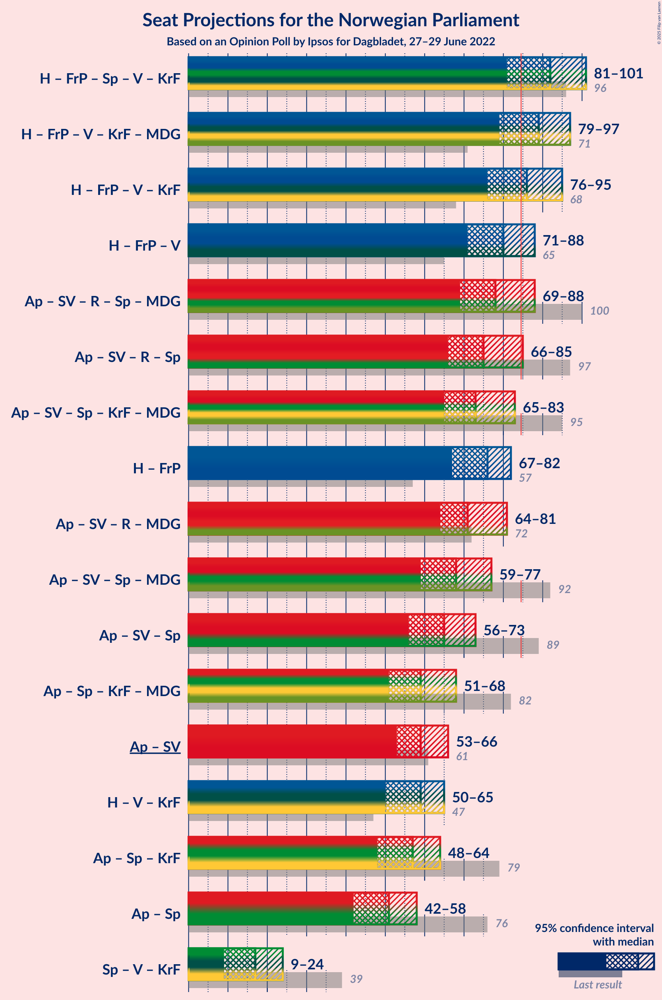

### Confidence Intervals

| Coalition | Last Result | Median | Majority? | 80% Confidence Interval | 90% Confidence Interval | 95% Confidence Interval | 99% Confidence Interval |
|:---------:|:-----------:|:------:|:---------:|:-----------------------:|:-----------------------:|:-----------------------:|:-----------------------:|
| Høyre – Fremskrittspartiet – Senterpartiet – Venstre – Kristelig Folkeparti | 96 | 92 | 91% | 85–98 | 84–100 | 81–101 | 78–103 |
| Høyre – Fremskrittspartiet – Venstre – Kristelig Folkeparti – Miljøpartiet De Grønne | 71 | 89 | 79% | 82–93 | 80–96 | 79–97 | 77–100 |
| Høyre – Fremskrittspartiet – Venstre – Kristelig Folkeparti | 68 | 86 | 62% | 79–90 | 78–93 | 76–95 | 73–96 |
| Høyre – Fremskrittspartiet – Venstre | 65 | 80 | 11% | 73–85 | 72–87 | 71–88 | 68–91 |
| Arbeiderpartiet – Sosialistisk Venstreparti – Rødt – Senterpartiet – Miljøpartiet De Grønne | 100 | 78 | 9% | 71–84 | 70–86 | 69–88 | 67–92 |
| Arbeiderpartiet – Sosialistisk Venstreparti – Rødt – Senterpartiet | 97 | 75 | 3% | 69–81 | 67–83 | 66–85 | 64–87 |
| Arbeiderpartiet – Sosialistisk Venstreparti – Senterpartiet – Kristelig Folkeparti – Miljøpartiet De Grønne | 95 | 73 | 1.1% | 67–80 | 66–82 | 65–83 | 62–86 |
| Høyre – Fremskrittspartiet | 57 | 76 | 0.6% | 69–80 | 68–81 | 67–82 | 65–85 |
| Arbeiderpartiet – Sosialistisk Venstreparti – Rødt – Miljøpartiet De Grønne | 72 | 71 | 0.8% | 65–77 | 64–79 | 64–81 | 61–85 |
| Arbeiderpartiet – Sosialistisk Venstreparti – Senterpartiet – Miljøpartiet De Grønne | 92 | 68 | 0.1% | 61–74 | 60–76 | 59–77 | 56–81 |
| Arbeiderpartiet – Sosialistisk Venstreparti – Senterpartiet | 89 | 65 | 0% | 59–71 | 58–72 | 56–73 | 54–76 |
| Arbeiderpartiet – Senterpartiet – Kristelig Folkeparti – Miljøpartiet De Grønne | 82 | 59 | 0% | 53–65 | 52–68 | 51–68 | 46–71 |
| Arbeiderpartiet – Sosialistisk Venstreparti | 61 | 59 | 0% | 54–63 | 53–65 | 53–66 | 50–69 |
| Høyre – Venstre – Kristelig Folkeparti | 47 | 59 | 0% | 53–62 | 52–64 | 50–65 | 47–68 |
| Arbeiderpartiet – Senterpartiet – Kristelig Folkeparti | 79 | 57 | 0% | 51–61 | 49–63 | 48–64 | 44–66 |
| Arbeiderpartiet – Senterpartiet | 76 | 51 | 0% | 45–56 | 44–57 | 42–58 | 39–60 |
| Senterpartiet – Venstre – Kristelig Folkeparti | 39 | 17 | 0% | 10–22 | 10–23 | 9–24 | 4–26 |

### Høyre – Fremskrittspartiet – Senterpartiet – Venstre – Kristelig Folkeparti

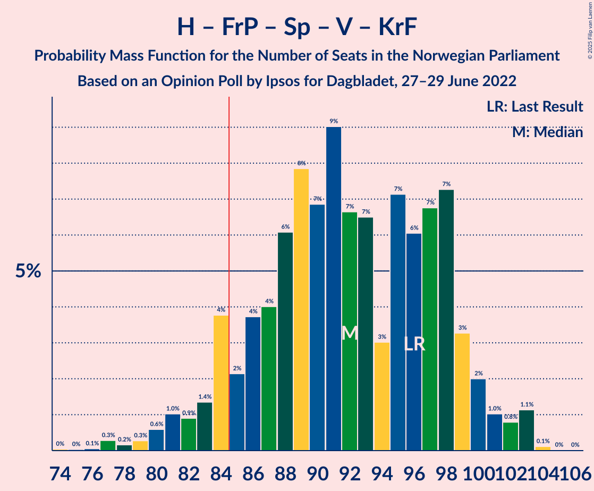

| Number of Seats | Probability | Accumulated | Special Marks |
|:---------------:|:-----------:|:-----------:|:-------------:|
| 74 | 0% | 100% |  |
| 75 | 0% | 99.9% |  |
| 76 | 0.1% | 99.9% |  |
| 77 | 0.3% | 99.8% |  |
| 78 | 0.2% | 99.5% |  |
| 79 | 0.3% | 99.4% |  |
| 80 | 0.6% | 99.1% |  |
| 81 | 1.0% | 98.5% |  |
| 82 | 0.9% | 97% |  |
| 83 | 1.4% | 97% |  |
| 84 | 4% | 95% |  |
| 85 | 2% | 91% | Majority |
| 86 | 4% | 89% |  |
| 87 | 4% | 86% |  |
| 88 | 6% | 82% |  |
| 89 | 8% | 76% |  |
| 90 | 7% | 68% |  |
| 91 | 9% | 61% |  |
| 92 | 7% | 52% |  |
| 93 | 7% | 45% |  |
| 94 | 3% | 39% |  |
| 95 | 7% | 36% | Median |
| 96 | 6% | 28% | Last Result |
| 97 | 7% | 22% |  |
| 98 | 7% | 16% |  |
| 99 | 3% | 8% |  |
| 100 | 2% | 5% |  |
| 101 | 1.0% | 3% |  |
| 102 | 0.8% | 2% |  |
| 103 | 1.1% | 1.3% |  |
| 104 | 0.1% | 0.2% |  |
| 105 | 0% | 0% |  |

### Høyre – Fremskrittspartiet – Venstre – Kristelig Folkeparti – Miljøpartiet De Grønne

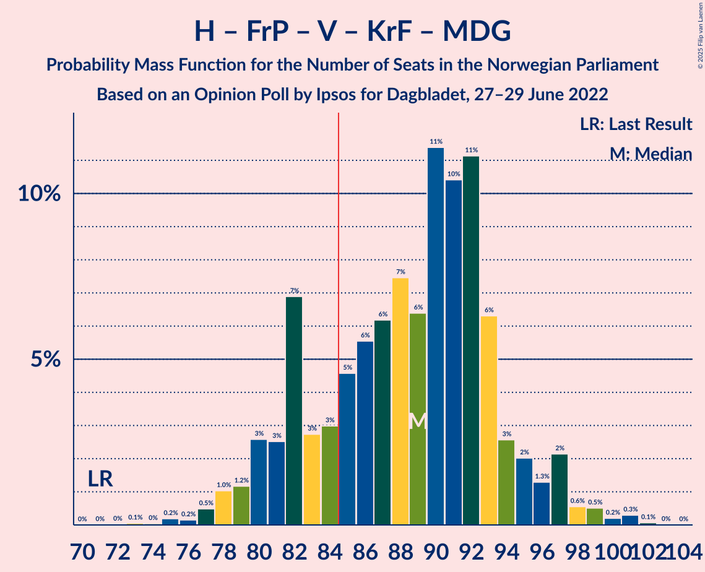

| Number of Seats | Probability | Accumulated | Special Marks |
|:---------------:|:-----------:|:-----------:|:-------------:|
| 71 | 0% | 100% | Last Result |
| 72 | 0% | 100% |  |
| 73 | 0.1% | 100% |  |
| 74 | 0% | 99.9% |  |
| 75 | 0.2% | 99.9% |  |
| 76 | 0.2% | 99.7% |  |
| 77 | 0.5% | 99.5% |  |
| 78 | 1.0% | 99.0% |  |
| 79 | 1.2% | 98% |  |
| 80 | 3% | 97% |  |
| 81 | 3% | 94% |  |
| 82 | 7% | 92% |  |
| 83 | 3% | 85% |  |
| 84 | 3% | 82% |  |
| 85 | 5% | 79% | Majority |
| 86 | 6% | 75% |  |
| 87 | 6% | 69% |  |
| 88 | 7% | 63% |  |
| 89 | 6% | 55% |  |
| 90 | 11% | 49% | Median |
| 91 | 10% | 38% |  |
| 92 | 11% | 27% |  |
| 93 | 6% | 16% |  |
| 94 | 3% | 10% |  |
| 95 | 2% | 7% |  |
| 96 | 1.3% | 5% |  |
| 97 | 2% | 4% |  |
| 98 | 0.6% | 2% |  |
| 99 | 0.5% | 1.1% |  |
| 100 | 0.2% | 0.6% |  |
| 101 | 0.3% | 0.4% |  |
| 102 | 0.1% | 0.1% |  |
| 103 | 0% | 0% |  |

### Høyre – Fremskrittspartiet – Venstre – Kristelig Folkeparti

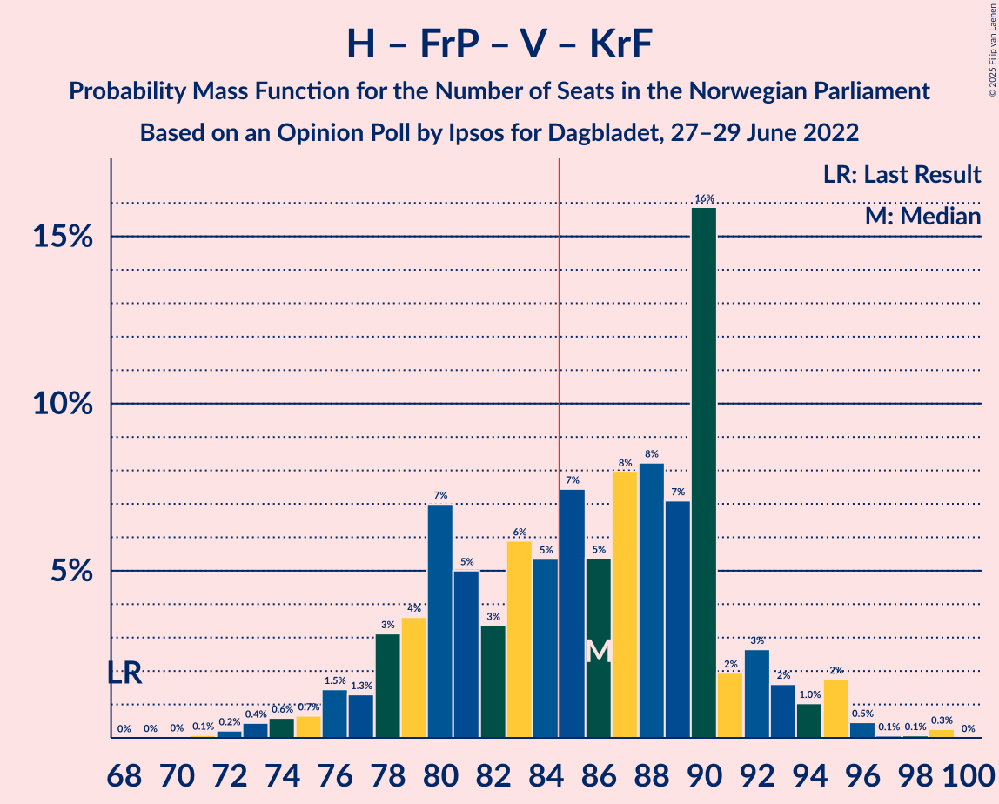

| Number of Seats | Probability | Accumulated | Special Marks |
|:---------------:|:-----------:|:-----------:|:-------------:|
| 68 | 0% | 100% | Last Result |
| 69 | 0% | 100% |  |
| 70 | 0% | 100% |  |
| 71 | 0.1% | 99.9% |  |
| 72 | 0.2% | 99.9% |  |
| 73 | 0.4% | 99.6% |  |
| 74 | 0.6% | 99.2% |  |
| 75 | 0.7% | 98.6% |  |
| 76 | 1.5% | 98% |  |
| 77 | 1.3% | 96% |  |
| 78 | 3% | 95% |  |
| 79 | 4% | 92% |  |
| 80 | 7% | 88% |  |
| 81 | 5% | 81% |  |
| 82 | 3% | 76% |  |
| 83 | 6% | 73% |  |
| 84 | 5% | 67% |  |
| 85 | 7% | 62% | Majority |
| 86 | 5% | 54% |  |
| 87 | 8% | 49% |  |
| 88 | 8% | 41% | Median |
| 89 | 7% | 33% |  |
| 90 | 16% | 26% |  |
| 91 | 2% | 10% |  |
| 92 | 3% | 8% |  |
| 93 | 2% | 5% |  |
| 94 | 1.0% | 4% |  |
| 95 | 2% | 3% |  |
| 96 | 0.5% | 0.9% |  |
| 97 | 0.1% | 0.4% |  |
| 98 | 0.1% | 0.4% |  |
| 99 | 0.3% | 0.3% |  |
| 100 | 0% | 0% |  |

### Høyre – Fremskrittspartiet – Venstre

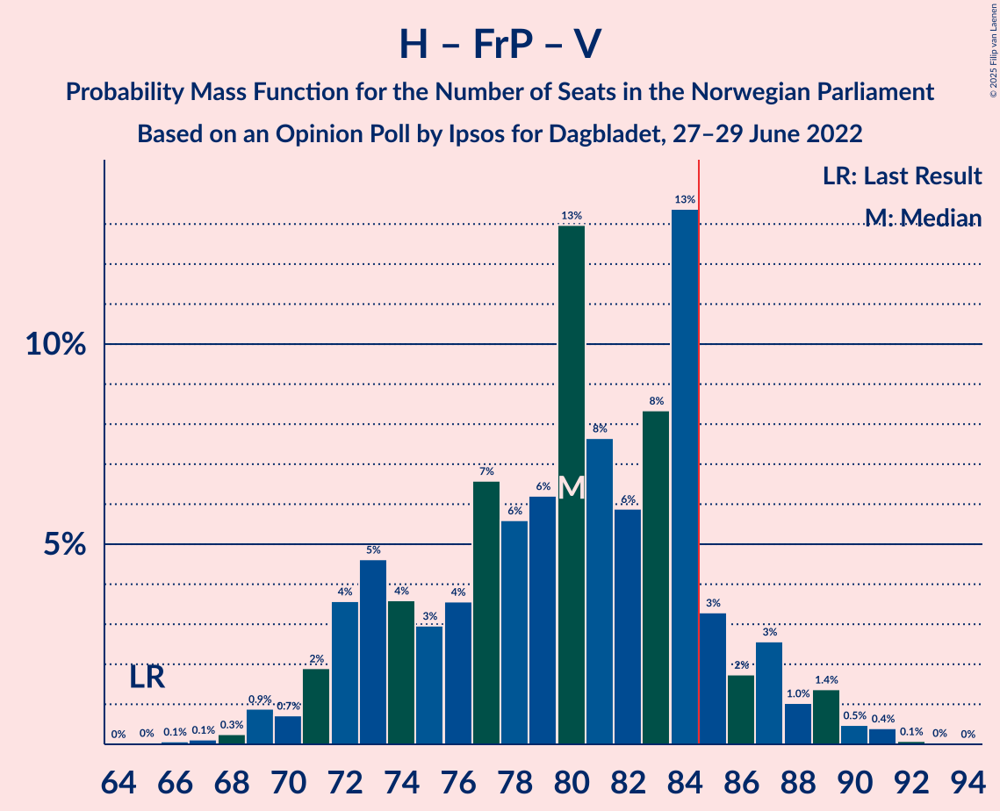

| Number of Seats | Probability | Accumulated | Special Marks |
|:---------------:|:-----------:|:-----------:|:-------------:|
| 65 | 0% | 100% | Last Result |
| 66 | 0.1% | 99.9% |  |
| 67 | 0.1% | 99.9% |  |
| 68 | 0.3% | 99.7% |  |
| 69 | 0.9% | 99.5% |  |
| 70 | 0.7% | 98.6% |  |
| 71 | 2% | 98% |  |
| 72 | 4% | 96% |  |
| 73 | 5% | 92% |  |
| 74 | 4% | 88% |  |
| 75 | 3% | 84% |  |
| 76 | 4% | 81% |  |
| 77 | 7% | 78% |  |
| 78 | 6% | 71% |  |
| 79 | 6% | 65% |  |
| 80 | 13% | 59% |  |
| 81 | 8% | 46% |  |
| 82 | 6% | 39% | Median |
| 83 | 8% | 33% |  |
| 84 | 13% | 24% |  |
| 85 | 3% | 11% | Majority |
| 86 | 2% | 8% |  |
| 87 | 3% | 6% |  |
| 88 | 1.0% | 3% |  |
| 89 | 1.4% | 2% |  |
| 90 | 0.5% | 1.0% |  |
| 91 | 0.4% | 0.5% |  |
| 92 | 0.1% | 0.1% |  |
| 93 | 0% | 0.1% |  |
| 94 | 0% | 0% |  |

### Arbeiderpartiet – Sosialistisk Venstreparti – Rødt – Senterpartiet – Miljøpartiet De Grønne

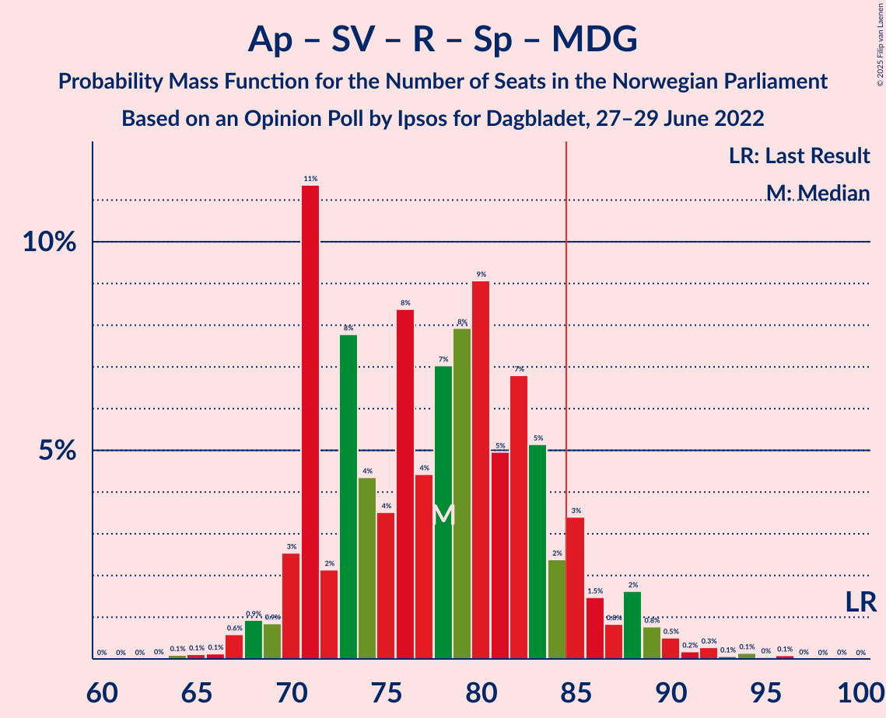

| Number of Seats | Probability | Accumulated | Special Marks |
|:---------------:|:-----------:|:-----------:|:-------------:|
| 64 | 0.1% | 100% |  |
| 65 | 0.1% | 99.9% |  |
| 66 | 0.1% | 99.8% |  |
| 67 | 0.6% | 99.6% |  |
| 68 | 0.9% | 99.1% |  |
| 69 | 0.9% | 98% |  |
| 70 | 3% | 97% |  |
| 71 | 11% | 95% |  |
| 72 | 2% | 83% |  |
| 73 | 8% | 81% |  |
| 74 | 4% | 73% |  |
| 75 | 4% | 69% |  |
| 76 | 8% | 66% |  |
| 77 | 4% | 57% | Median |
| 78 | 7% | 53% |  |
| 79 | 8% | 46% |  |
| 80 | 9% | 38% |  |
| 81 | 5% | 29% |  |
| 82 | 7% | 24% |  |
| 83 | 5% | 17% |  |
| 84 | 2% | 12% |  |
| 85 | 3% | 9% | Majority |
| 86 | 1.5% | 6% |  |
| 87 | 0.8% | 5% |  |
| 88 | 2% | 4% |  |
| 89 | 0.8% | 2% |  |
| 90 | 0.5% | 1.3% |  |
| 91 | 0.2% | 0.8% |  |
| 92 | 0.3% | 0.6% |  |
| 93 | 0.1% | 0.4% |  |
| 94 | 0.1% | 0.3% |  |
| 95 | 0% | 0.2% |  |
| 96 | 0.1% | 0.1% |  |
| 97 | 0% | 0% |  |
| 98 | 0% | 0% |  |
| 99 | 0% | 0% |  |
| 100 | 0% | 0% | Last Result |

### Arbeiderpartiet – Sosialistisk Venstreparti – Rødt – Senterpartiet

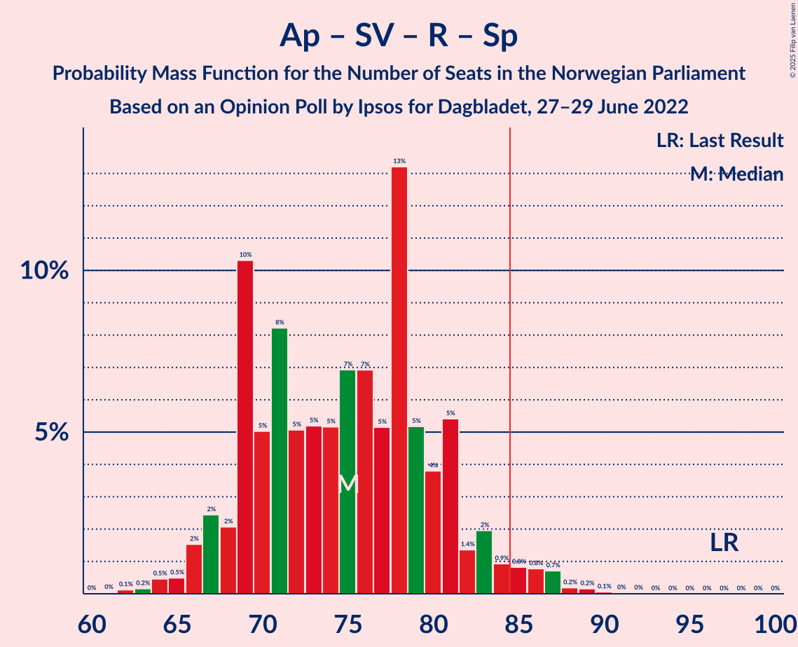

| Number of Seats | Probability | Accumulated | Special Marks |
|:---------------:|:-----------:|:-----------:|:-------------:|
| 61 | 0% | 100% |  |
| 62 | 0.1% | 99.9% |  |
| 63 | 0.2% | 99.8% |  |
| 64 | 0.5% | 99.7% |  |
| 65 | 0.5% | 99.2% |  |
| 66 | 2% | 98.7% |  |
| 67 | 2% | 97% |  |
| 68 | 2% | 95% |  |
| 69 | 10% | 93% |  |
| 70 | 5% | 82% |  |
| 71 | 8% | 77% |  |
| 72 | 5% | 69% |  |
| 73 | 5% | 64% |  |
| 74 | 5% | 59% |  |
| 75 | 7% | 54% | Median |
| 76 | 7% | 47% |  |
| 77 | 5% | 40% |  |
| 78 | 13% | 35% |  |
| 79 | 5% | 21% |  |
| 80 | 4% | 16% |  |
| 81 | 5% | 12% |  |
| 82 | 1.4% | 7% |  |
| 83 | 2% | 6% |  |
| 84 | 0.9% | 4% |  |
| 85 | 0.8% | 3% | Majority |
| 86 | 0.8% | 2% |  |
| 87 | 0.7% | 1.2% |  |
| 88 | 0.2% | 0.5% |  |
| 89 | 0.2% | 0.3% |  |
| 90 | 0.1% | 0.1% |  |
| 91 | 0% | 0.1% |  |
| 92 | 0% | 0% |  |
| 93 | 0% | 0% |  |
| 94 | 0% | 0% |  |
| 95 | 0% | 0% |  |
| 96 | 0% | 0% |  |
| 97 | 0% | 0% | Last Result |

### Arbeiderpartiet – Sosialistisk Venstreparti – Senterpartiet – Kristelig Folkeparti – Miljøpartiet De Grønne

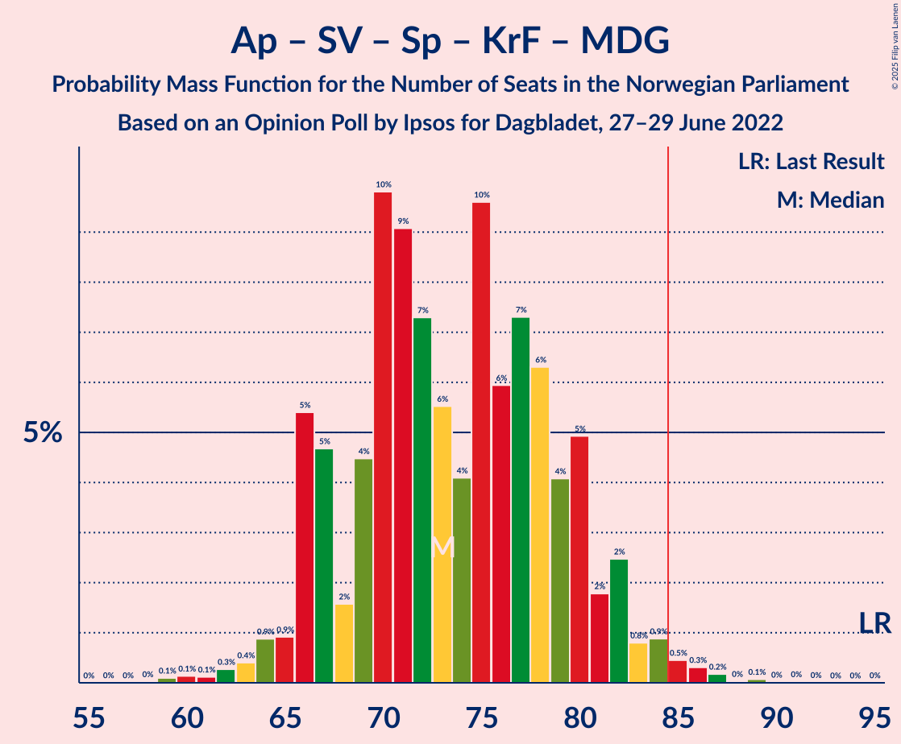

| Number of Seats | Probability | Accumulated | Special Marks |
|:---------------:|:-----------:|:-----------:|:-------------:|
| 59 | 0.1% | 100% |  |
| 60 | 0.1% | 99.9% |  |
| 61 | 0.1% | 99.7% |  |
| 62 | 0.3% | 99.6% |  |
| 63 | 0.4% | 99.3% |  |
| 64 | 0.9% | 98.9% |  |
| 65 | 0.9% | 98% |  |
| 66 | 5% | 97% |  |
| 67 | 5% | 92% |  |
| 68 | 2% | 87% |  |
| 69 | 4% | 85% |  |
| 70 | 10% | 81% |  |
| 71 | 9% | 71% |  |
| 72 | 7% | 62% |  |
| 73 | 6% | 55% | Median |
| 74 | 4% | 49% |  |
| 75 | 10% | 45% |  |
| 76 | 6% | 36% |  |
| 77 | 7% | 30% |  |
| 78 | 6% | 22% |  |
| 79 | 4% | 16% |  |
| 80 | 5% | 12% |  |
| 81 | 2% | 7% |  |
| 82 | 2% | 5% |  |
| 83 | 0.8% | 3% |  |
| 84 | 0.9% | 2% |  |
| 85 | 0.5% | 1.1% | Majority |
| 86 | 0.3% | 0.6% |  |
| 87 | 0.2% | 0.3% |  |
| 88 | 0% | 0.2% |  |
| 89 | 0.1% | 0.1% |  |
| 90 | 0% | 0.1% |  |
| 91 | 0% | 0% |  |
| 92 | 0% | 0% |  |
| 93 | 0% | 0% |  |
| 94 | 0% | 0% |  |
| 95 | 0% | 0% | Last Result |

### Høyre – Fremskrittspartiet

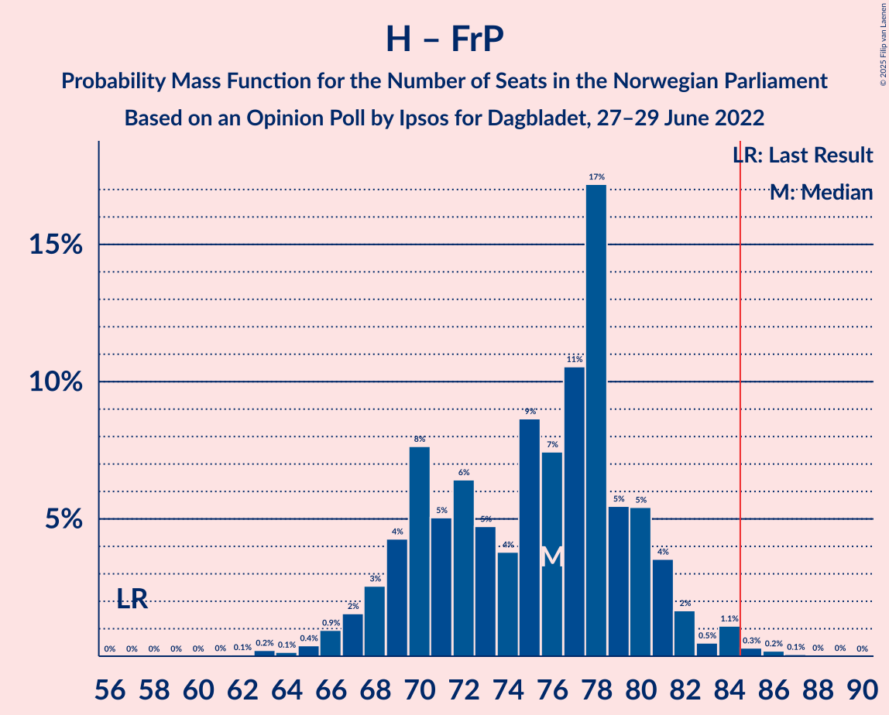

| Number of Seats | Probability | Accumulated | Special Marks |
|:---------------:|:-----------:|:-----------:|:-------------:|
| 57 | 0% | 100% | Last Result |
| 58 | 0% | 100% |  |
| 59 | 0% | 100% |  |
| 60 | 0% | 100% |  |
| 61 | 0% | 100% |  |
| 62 | 0.1% | 100% |  |
| 63 | 0.2% | 99.9% |  |
| 64 | 0.1% | 99.7% |  |
| 65 | 0.4% | 99.5% |  |
| 66 | 0.9% | 99.2% |  |
| 67 | 2% | 98% |  |
| 68 | 3% | 97% |  |
| 69 | 4% | 94% |  |
| 70 | 8% | 90% |  |
| 71 | 5% | 82% |  |
| 72 | 6% | 77% |  |
| 73 | 5% | 71% |  |
| 74 | 4% | 66% |  |
| 75 | 9% | 62% |  |
| 76 | 7% | 54% |  |
| 77 | 11% | 46% | Median |
| 78 | 17% | 36% |  |
| 79 | 5% | 18% |  |
| 80 | 5% | 13% |  |
| 81 | 4% | 7% |  |
| 82 | 2% | 4% |  |
| 83 | 0.5% | 2% |  |
| 84 | 1.1% | 2% |  |
| 85 | 0.3% | 0.6% | Majority |
| 86 | 0.2% | 0.3% |  |
| 87 | 0.1% | 0.1% |  |
| 88 | 0% | 0.1% |  |
| 89 | 0% | 0% |  |

### Arbeiderpartiet – Sosialistisk Venstreparti – Rødt – Miljøpartiet De Grønne

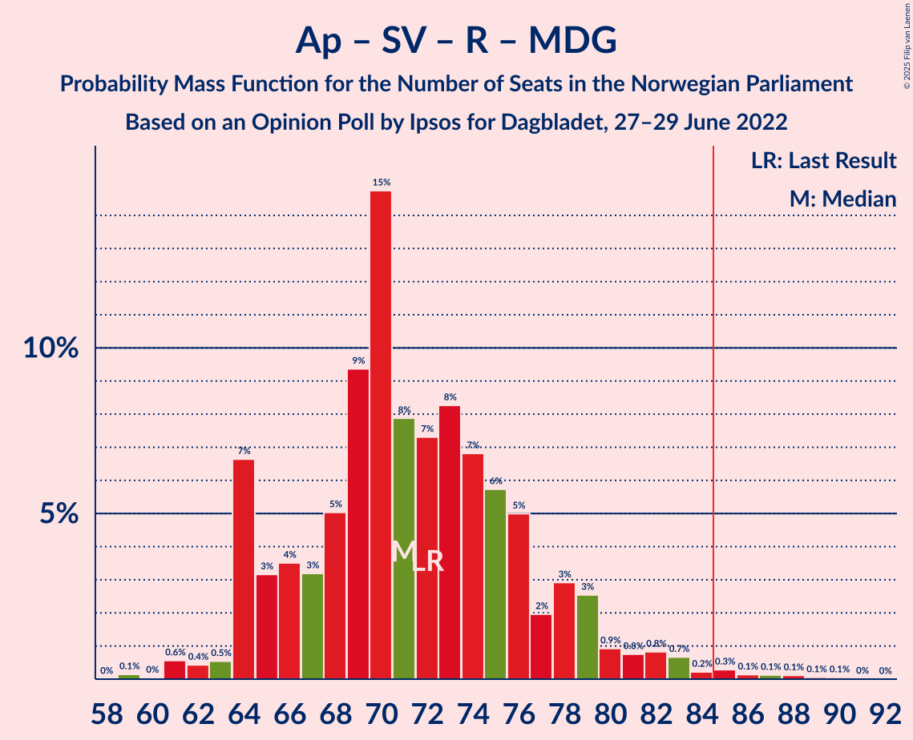

| Number of Seats | Probability | Accumulated | Special Marks |
|:---------------:|:-----------:|:-----------:|:-------------:|
| 59 | 0.1% | 100% |  |
| 60 | 0% | 99.8% |  |
| 61 | 0.6% | 99.8% |  |
| 62 | 0.4% | 99.2% |  |
| 63 | 0.5% | 98.8% |  |
| 64 | 7% | 98% |  |
| 65 | 3% | 92% |  |
| 66 | 4% | 88% |  |
| 67 | 3% | 85% |  |
| 68 | 5% | 82% |  |
| 69 | 9% | 77% |  |
| 70 | 15% | 67% | Median |
| 71 | 8% | 53% |  |
| 72 | 7% | 45% | Last Result |
| 73 | 8% | 37% |  |
| 74 | 7% | 29% |  |
| 75 | 6% | 22% |  |
| 76 | 5% | 17% |  |
| 77 | 2% | 12% |  |
| 78 | 3% | 10% |  |
| 79 | 3% | 7% |  |
| 80 | 0.9% | 4% |  |
| 81 | 0.8% | 3% |  |
| 82 | 0.8% | 2% |  |
| 83 | 0.7% | 2% |  |
| 84 | 0.2% | 1.0% |  |
| 85 | 0.3% | 0.8% | Majority |
| 86 | 0.1% | 0.5% |  |
| 87 | 0.1% | 0.4% |  |
| 88 | 0.1% | 0.2% |  |
| 89 | 0.1% | 0.1% |  |
| 90 | 0.1% | 0.1% |  |
| 91 | 0% | 0% |  |

### Arbeiderpartiet – Sosialistisk Venstreparti – Senterpartiet – Miljøpartiet De Grønne

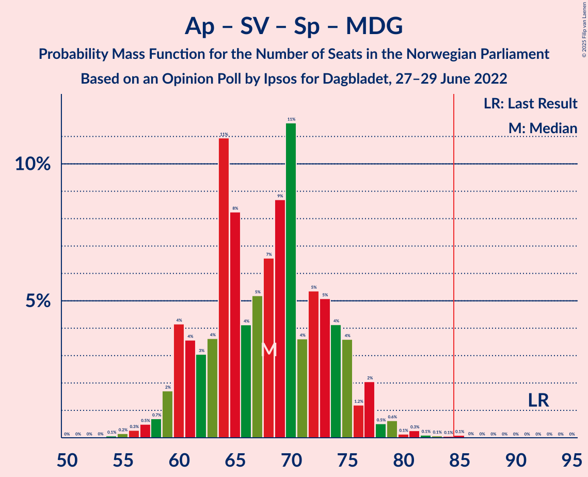

| Number of Seats | Probability | Accumulated | Special Marks |
|:---------------:|:-----------:|:-----------:|:-------------:|
| 54 | 0.1% | 100% |  |
| 55 | 0.2% | 99.9% |  |
| 56 | 0.3% | 99.8% |  |
| 57 | 0.5% | 99.5% |  |
| 58 | 0.7% | 99.0% |  |
| 59 | 2% | 98% |  |
| 60 | 4% | 97% |  |
| 61 | 4% | 92% |  |
| 62 | 3% | 89% |  |
| 63 | 4% | 86% |  |
| 64 | 11% | 82% |  |
| 65 | 8% | 71% |  |
| 66 | 4% | 63% |  |
| 67 | 5% | 59% | Median |
| 68 | 7% | 54% |  |
| 69 | 9% | 47% |  |
| 70 | 11% | 38% |  |
| 71 | 4% | 27% |  |
| 72 | 5% | 23% |  |
| 73 | 5% | 18% |  |
| 74 | 4% | 13% |  |
| 75 | 4% | 9% |  |
| 76 | 1.2% | 5% |  |
| 77 | 2% | 4% |  |
| 78 | 0.5% | 2% |  |
| 79 | 0.6% | 1.4% |  |
| 80 | 0.1% | 0.7% |  |
| 81 | 0.3% | 0.6% |  |
| 82 | 0.1% | 0.3% |  |
| 83 | 0.1% | 0.2% |  |
| 84 | 0.1% | 0.2% |  |
| 85 | 0.1% | 0.1% | Majority |
| 86 | 0% | 0% |  |
| 87 | 0% | 0% |  |
| 88 | 0% | 0% |  |
| 89 | 0% | 0% |  |
| 90 | 0% | 0% |  |
| 91 | 0% | 0% |  |
| 92 | 0% | 0% | Last Result |

### Arbeiderpartiet – Sosialistisk Venstreparti – Senterpartiet

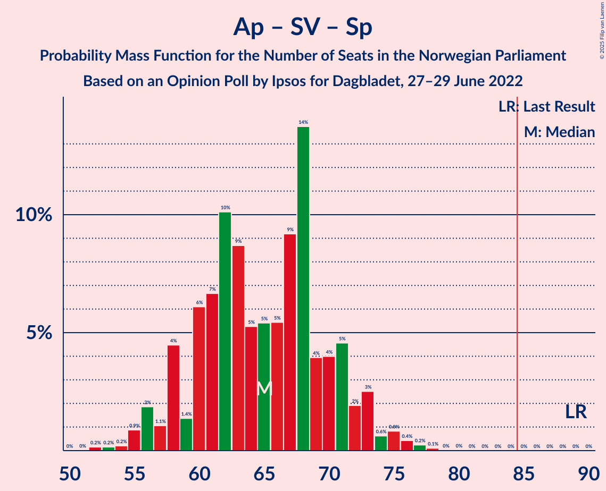

| Number of Seats | Probability | Accumulated | Special Marks |
|:---------------:|:-----------:|:-----------:|:-------------:|
| 52 | 0.2% | 100% |  |
| 53 | 0.2% | 99.8% |  |
| 54 | 0.2% | 99.7% |  |
| 55 | 0.9% | 99.5% |  |
| 56 | 2% | 98.6% |  |
| 57 | 1.1% | 97% |  |
| 58 | 4% | 96% |  |
| 59 | 1.4% | 91% |  |
| 60 | 6% | 90% |  |
| 61 | 7% | 84% |  |
| 62 | 10% | 77% |  |
| 63 | 9% | 67% |  |
| 64 | 5% | 58% |  |
| 65 | 5% | 53% | Median |
| 66 | 5% | 48% |  |
| 67 | 9% | 42% |  |
| 68 | 14% | 33% |  |
| 69 | 4% | 19% |  |
| 70 | 4% | 15% |  |
| 71 | 5% | 11% |  |
| 72 | 2% | 7% |  |
| 73 | 3% | 5% |  |
| 74 | 0.6% | 2% |  |
| 75 | 0.8% | 2% |  |
| 76 | 0.4% | 0.8% |  |
| 77 | 0.2% | 0.4% |  |
| 78 | 0.1% | 0.2% |  |
| 79 | 0% | 0% |  |
| 80 | 0% | 0% |  |
| 81 | 0% | 0% |  |
| 82 | 0% | 0% |  |
| 83 | 0% | 0% |  |
| 84 | 0% | 0% |  |
| 85 | 0% | 0% | Majority |
| 86 | 0% | 0% |  |
| 87 | 0% | 0% |  |
| 88 | 0% | 0% |  |
| 89 | 0% | 0% | Last Result |

### Arbeiderpartiet – Senterpartiet – Kristelig Folkeparti – Miljøpartiet De Grønne

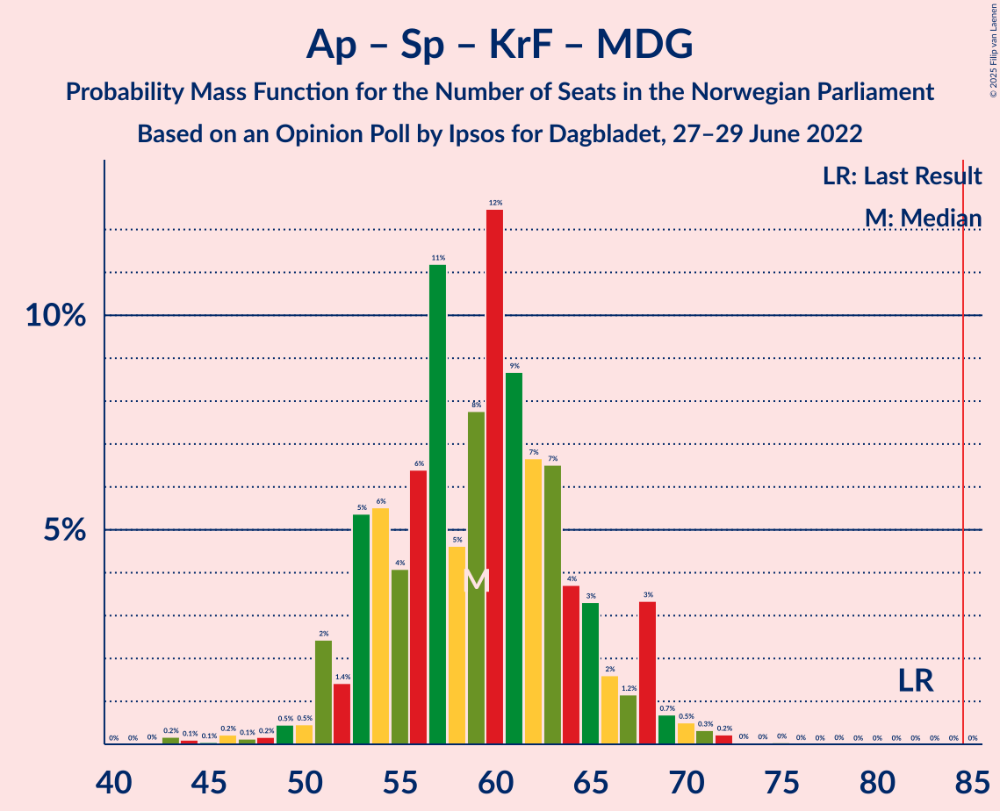

| Number of Seats | Probability | Accumulated | Special Marks |
|:---------------:|:-----------:|:-----------:|:-------------:|
| 43 | 0.2% | 100% |  |
| 44 | 0.1% | 99.8% |  |
| 45 | 0.1% | 99.7% |  |
| 46 | 0.2% | 99.6% |  |
| 47 | 0.1% | 99.4% |  |
| 48 | 0.2% | 99.3% |  |
| 49 | 0.5% | 99.1% |  |
| 50 | 0.5% | 98.7% |  |
| 51 | 2% | 98% |  |
| 52 | 1.4% | 96% |  |
| 53 | 5% | 94% |  |
| 54 | 6% | 89% |  |
| 55 | 4% | 83% |  |
| 56 | 6% | 79% |  |
| 57 | 11% | 73% |  |
| 58 | 5% | 62% |  |
| 59 | 8% | 57% | Median |
| 60 | 12% | 49% |  |
| 61 | 9% | 37% |  |
| 62 | 7% | 28% |  |
| 63 | 7% | 22% |  |
| 64 | 4% | 15% |  |
| 65 | 3% | 11% |  |
| 66 | 2% | 8% |  |
| 67 | 1.2% | 6% |  |
| 68 | 3% | 5% |  |
| 69 | 0.7% | 2% |  |
| 70 | 0.5% | 1.2% |  |
| 71 | 0.3% | 0.7% |  |
| 72 | 0.2% | 0.4% |  |
| 73 | 0% | 0.1% |  |
| 74 | 0% | 0.1% |  |
| 75 | 0% | 0.1% |  |
| 76 | 0% | 0% |  |
| 77 | 0% | 0% |  |
| 78 | 0% | 0% |  |
| 79 | 0% | 0% |  |
| 80 | 0% | 0% |  |
| 81 | 0% | 0% |  |
| 82 | 0% | 0% | Last Result |

### Arbeiderpartiet – Sosialistisk Venstreparti

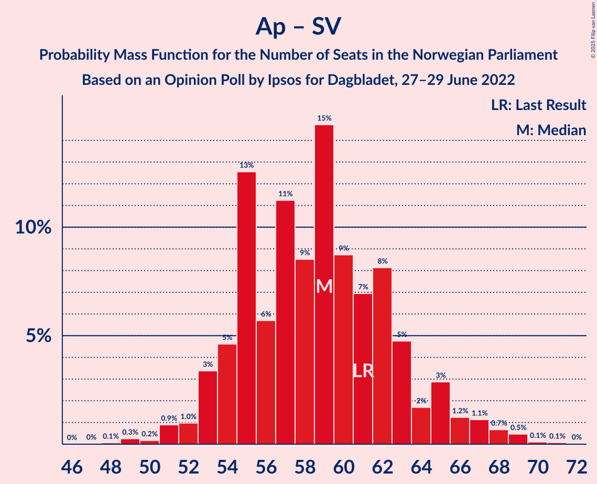

| Number of Seats | Probability | Accumulated | Special Marks |
|:---------------:|:-----------:|:-----------:|:-------------:|
| 48 | 0.1% | 100% |  |
| 49 | 0.3% | 99.9% |  |
| 50 | 0.2% | 99.6% |  |
| 51 | 0.9% | 99.5% |  |
| 52 | 1.0% | 98.6% |  |
| 53 | 3% | 98% |  |
| 54 | 5% | 94% |  |
| 55 | 13% | 90% |  |
| 56 | 6% | 77% |  |
| 57 | 11% | 71% |  |
| 58 | 9% | 60% | Median |
| 59 | 15% | 52% |  |
| 60 | 9% | 37% |  |
| 61 | 7% | 28% | Last Result |
| 62 | 8% | 21% |  |
| 63 | 5% | 13% |  |
| 64 | 2% | 8% |  |
| 65 | 3% | 7% |  |
| 66 | 1.2% | 4% |  |
| 67 | 1.1% | 2% |  |
| 68 | 0.7% | 1.4% |  |
| 69 | 0.5% | 0.7% |  |
| 70 | 0.1% | 0.2% |  |
| 71 | 0.1% | 0.1% |  |
| 72 | 0% | 0% |  |

### Høyre – Venstre – Kristelig Folkeparti

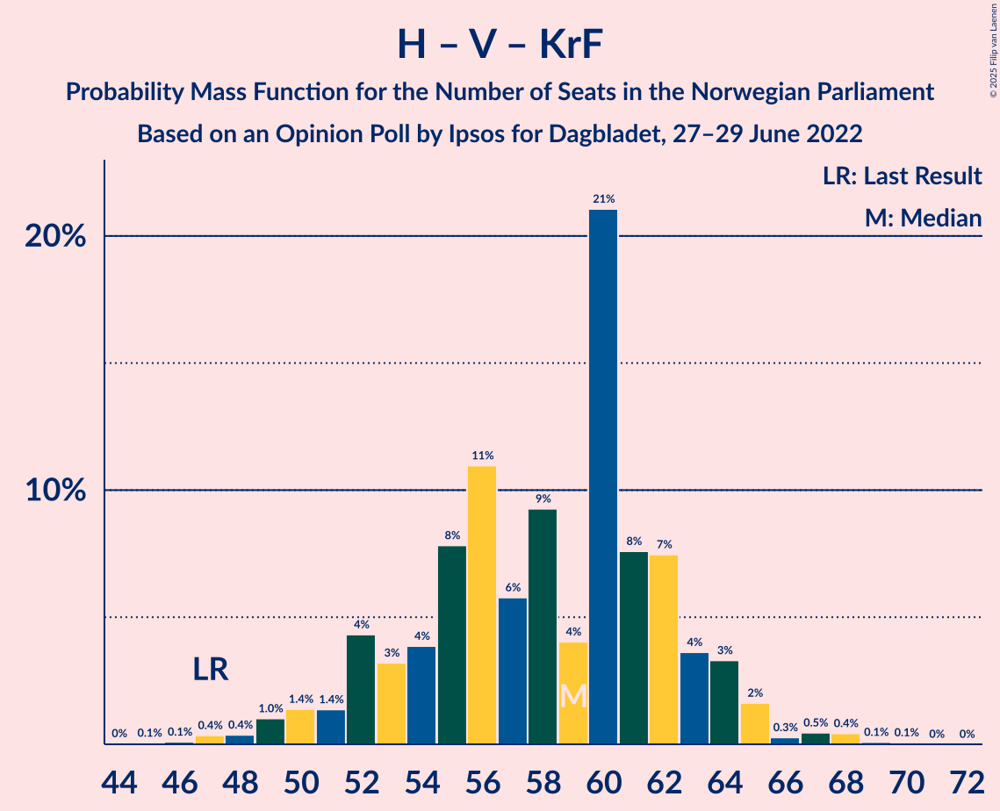

| Number of Seats | Probability | Accumulated | Special Marks |
|:---------------:|:-----------:|:-----------:|:-------------:|
| 44 | 0% | 100% |  |
| 45 | 0.1% | 99.9% |  |
| 46 | 0.1% | 99.9% |  |
| 47 | 0.4% | 99.8% | Last Result |
| 48 | 0.4% | 99.4% |  |
| 49 | 1.0% | 99.1% |  |
| 50 | 1.4% | 98% |  |
| 51 | 1.4% | 97% |  |
| 52 | 4% | 95% |  |
| 53 | 3% | 91% |  |
| 54 | 4% | 88% |  |
| 55 | 8% | 84% |  |
| 56 | 11% | 76% |  |
| 57 | 6% | 65% |  |
| 58 | 9% | 59% |  |
| 59 | 4% | 50% | Median |
| 60 | 21% | 46% |  |
| 61 | 8% | 25% |  |
| 62 | 7% | 17% |  |
| 63 | 4% | 10% |  |
| 64 | 3% | 6% |  |
| 65 | 2% | 3% |  |
| 66 | 0.3% | 1.3% |  |
| 67 | 0.5% | 1.1% |  |
| 68 | 0.4% | 0.6% |  |
| 69 | 0.1% | 0.2% |  |
| 70 | 0.1% | 0.1% |  |
| 71 | 0% | 0% |  |

### Arbeiderpartiet – Senterpartiet – Kristelig Folkeparti

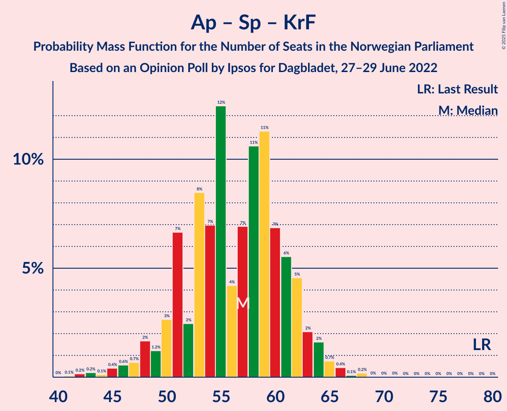

| Number of Seats | Probability | Accumulated | Special Marks |
|:---------------:|:-----------:|:-----------:|:-------------:|
| 40 | 0% | 100% |  |
| 41 | 0.1% | 99.9% |  |
| 42 | 0.2% | 99.9% |  |
| 43 | 0.2% | 99.7% |  |
| 44 | 0.1% | 99.5% |  |
| 45 | 0.4% | 99.4% |  |
| 46 | 0.6% | 99.0% |  |
| 47 | 0.7% | 98% |  |
| 48 | 2% | 98% |  |
| 49 | 1.2% | 96% |  |
| 50 | 3% | 95% |  |
| 51 | 7% | 92% |  |
| 52 | 2% | 86% |  |
| 53 | 8% | 83% |  |
| 54 | 7% | 75% |  |
| 55 | 12% | 68% |  |
| 56 | 4% | 55% |  |
| 57 | 7% | 51% | Median |
| 58 | 11% | 44% |  |
| 59 | 11% | 33% |  |
| 60 | 7% | 22% |  |
| 61 | 6% | 15% |  |
| 62 | 5% | 10% |  |
| 63 | 2% | 5% |  |
| 64 | 2% | 3% |  |
| 65 | 0.7% | 2% |  |
| 66 | 0.4% | 0.8% |  |
| 67 | 0.1% | 0.3% |  |
| 68 | 0.2% | 0.2% |  |
| 69 | 0% | 0.1% |  |
| 70 | 0% | 0% |  |
| 71 | 0% | 0% |  |
| 72 | 0% | 0% |  |
| 73 | 0% | 0% |  |
| 74 | 0% | 0% |  |
| 75 | 0% | 0% |  |
| 76 | 0% | 0% |  |
| 77 | 0% | 0% |  |
| 78 | 0% | 0% |  |
| 79 | 0% | 0% | Last Result |

### Arbeiderpartiet – Senterpartiet

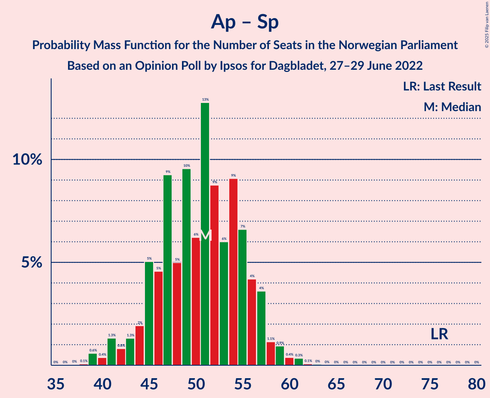

| Number of Seats | Probability | Accumulated | Special Marks |
|:---------------:|:-----------:|:-----------:|:-------------:|
| 37 | 0% | 100% |  |
| 38 | 0.1% | 99.9% |  |
| 39 | 0.6% | 99.9% |  |
| 40 | 0.4% | 99.3% |  |
| 41 | 1.3% | 98.9% |  |
| 42 | 0.8% | 98% |  |
| 43 | 1.3% | 97% |  |
| 44 | 2% | 95% |  |
| 45 | 5% | 94% |  |
| 46 | 5% | 89% |  |
| 47 | 9% | 84% |  |
| 48 | 5% | 75% |  |
| 49 | 10% | 70% |  |
| 50 | 6% | 60% |  |
| 51 | 13% | 54% | Median |
| 52 | 9% | 41% |  |
| 53 | 6% | 32% |  |
| 54 | 9% | 26% |  |
| 55 | 7% | 17% |  |
| 56 | 4% | 11% |  |
| 57 | 4% | 7% |  |
| 58 | 1.1% | 3% |  |
| 59 | 0.9% | 2% |  |
| 60 | 0.4% | 0.9% |  |
| 61 | 0.3% | 0.5% |  |
| 62 | 0.1% | 0.1% |  |
| 63 | 0% | 0.1% |  |
| 64 | 0% | 0% |  |
| 65 | 0% | 0% |  |
| 66 | 0% | 0% |  |
| 67 | 0% | 0% |  |
| 68 | 0% | 0% |  |
| 69 | 0% | 0% |  |
| 70 | 0% | 0% |  |
| 71 | 0% | 0% |  |
| 72 | 0% | 0% |  |
| 73 | 0% | 0% |  |
| 74 | 0% | 0% |  |
| 75 | 0% | 0% |  |
| 76 | 0% | 0% | Last Result |

### Senterpartiet – Venstre – Kristelig Folkeparti

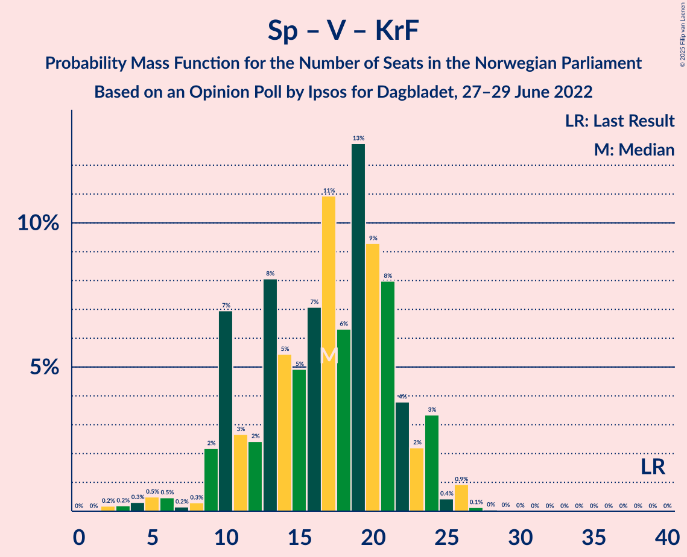

| Number of Seats | Probability | Accumulated | Special Marks |
|:---------------:|:-----------:|:-----------:|:-------------:|
| 2 | 0.2% | 100% |  |
| 3 | 0.2% | 99.8% |  |
| 4 | 0.3% | 99.6% |  |
| 5 | 0.5% | 99.3% |  |
| 6 | 0.5% | 98.8% |  |
| 7 | 0.2% | 98% |  |
| 8 | 0.3% | 98% |  |
| 9 | 2% | 98% |  |
| 10 | 7% | 96% |  |
| 11 | 3% | 89% |  |
| 12 | 2% | 86% |  |
| 13 | 8% | 84% |  |
| 14 | 5% | 76% |  |
| 15 | 5% | 70% |  |
| 16 | 7% | 65% |  |
| 17 | 11% | 58% |  |
| 18 | 6% | 47% | Median |
| 19 | 13% | 41% |  |
| 20 | 9% | 28% |  |
| 21 | 8% | 19% |  |
| 22 | 4% | 11% |  |
| 23 | 2% | 7% |  |
| 24 | 3% | 5% |  |
| 25 | 0.4% | 2% |  |
| 26 | 0.9% | 1.2% |  |
| 27 | 0.1% | 0.2% |  |
| 28 | 0% | 0.1% |  |
| 29 | 0% | 0.1% |  |
| 30 | 0% | 0% |  |
| 31 | 0% | 0% |  |
| 32 | 0% | 0% |  |
| 33 | 0% | 0% |  |
| 34 | 0% | 0% |  |
| 35 | 0% | 0% |  |
| 36 | 0% | 0% |  |
| 37 | 0% | 0% |  |
| 38 | 0% | 0% |  |
| 39 | 0% | 0% | Last Result |

## Technical Information

### Opinion Poll

+ **Polling firm:** Ipsos
+ **Commissioner(s):** Dagbladet
+ **Fieldwork period:** 27–29 June 2022

### Calculations

+ **Sample size:** 732
+ **Simulations done:** 1,048,576
+ **Error estimate:** 1.27%

