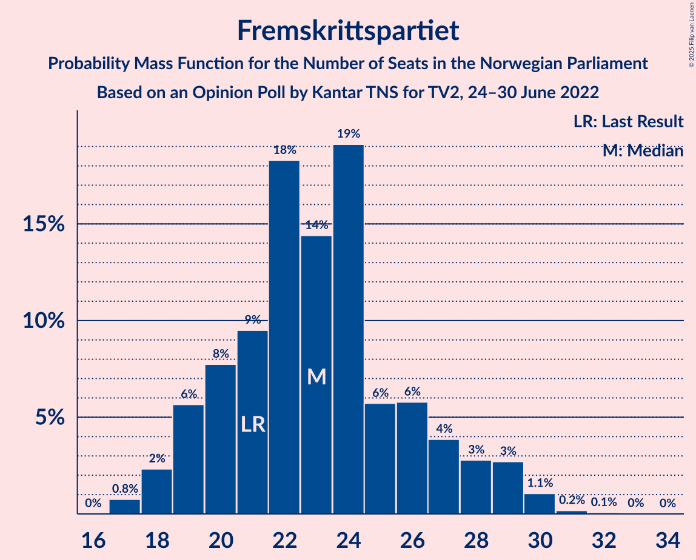
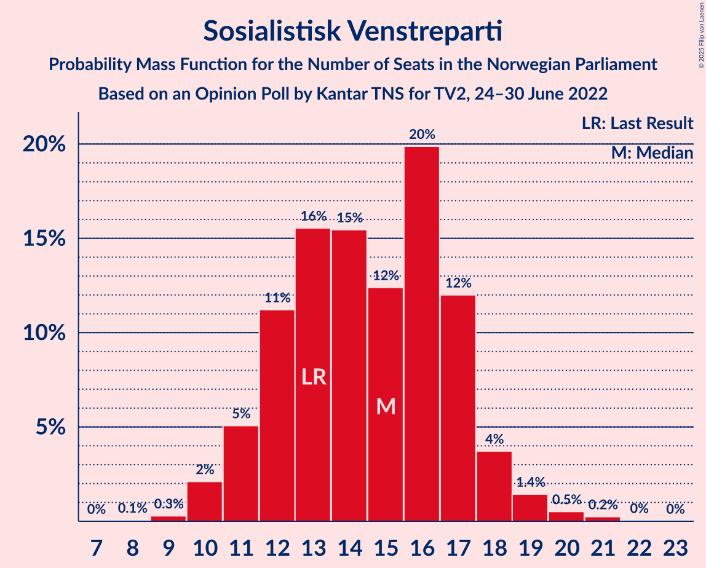
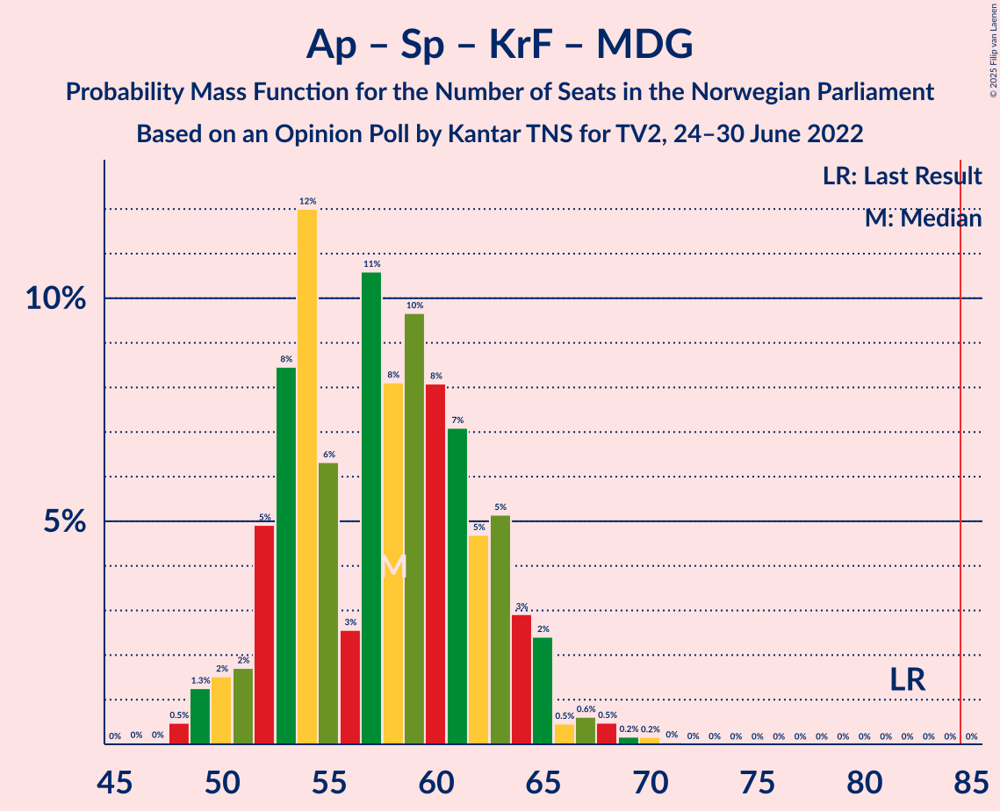

# Opinion Poll by Kantar TNS for TV2, 24–30 June 2022

<a href="#voting-intentions">Voting Intentions</a> | <a href="#seats">Seats</a> | <a href="#coalitions">Coalitions</a> | <a href="#technical-information">Technical Information</a>

## Voting Intentions

### Confidence Intervals

| Party | Last Result | Poll Result | 80% Confidence Interval | 90% Confidence Interval | 95% Confidence Interval | 99% Confidence Interval |
|:-----:|:-----------:|:-----------:|:-----------------------:|:-----------------------:|:-----------------------:|:-----------------------:|
| Høyre | 20.4% | 29.4% | 27.4–31.6% |26.8–32.2% |26.3–32.8% |25.4–33.8% |
| Arbeiderpartiet | 26.2% | 21.4% | 19.6–23.4% |19.1–23.9% |18.6–24.4% |17.8–25.4% |
| Fremskrittspartiet | 11.6% | 13.1% | 11.6–14.8% |11.2–15.3% |10.9–15.7% |10.2–16.5% |
| Sosialistisk Venstreparti | 7.6% | 8.3% | 7.1–9.7% |6.8–10.1% |6.6–10.5% |6.0–11.2% |
| Rødt | 4.7% | 6.9% | 5.8–8.2% |5.5–8.6% |5.3–8.9% |4.8–9.6% |
| Senterpartiet | 13.5% | 6.7% | 5.7–8.0% |5.4–8.4% |5.2–8.7% |4.7–9.4% |
| Venstre | 4.6% | 4.4% | 3.6–5.5% |3.4–5.8% |3.2–6.1% |2.8–6.7% |
| Kristelig Folkeparti | 3.8% | 3.1% | 2.4–4.1% |2.3–4.4% |2.1–4.6% |1.8–5.1% |
| Miljøpartiet De Grønne | 3.9% | 3.0% | 2.3–3.9% |2.1–4.2% |2.0–4.5% |1.7–4.9% |

*Note:* The poll result column reflects the actual value used in the calculations. Published results may vary slightly, and in addition be rounded to fewer digits.

## Seats

### Confidence Intervals

| Party | Last Result | Median | 80% Confidence Interval | 90% Confidence Interval | 95% Confidence Interval | 99% Confidence Interval |
|:-----:|:-----------:|:------:|:-----------------------:|:-----------------------:|:-----------------------:|:-----------------------:|
| <a href="#høyre">Høyre</a> | 36 | 51 | 48–56 |47–58 |46–58 |45–61 |
| <a href="#arbeiderpartiet">Arbeiderpartiet</a> | 48 | 40 | 36–46 |36–46 |35–47 |34–49 |
| <a href="#fremskrittspartiet">Fremskrittspartiet</a> | 21 | 23 | 20–27 |19–28 |18–29 |17–30 |
| <a href="#sosialistisk-venstreparti">Sosialistisk Venstreparti</a> | 13 | 15 | 12–17 |11–18 |11–18 |10–20 |
| <a href="#rødt">Rødt</a> | 8 | 12 | 10–14 |9–15 |9–16 |8–17 |
| <a href="#senterpartiet">Senterpartiet</a> | 28 | 12 | 10–14 |9–15 |8–16 |7–17 |
| <a href="#venstre">Venstre</a> | 8 | 8 | 3–10 |2–10 |2–10 |2–11 |
| <a href="#kristelig-folkeparti">Kristelig Folkeparti</a> | 3 | 2 | 2–6 |0–7 |0–8 |0–8 |
| <a href="#miljøpartiet-de-grønne">Miljøpartiet De Grønne</a> | 3 | 2 | 1–3 |1–7 |1–7 |1–8 |

### Høyre

*For a full overview of the results for this party, see the [Høyre](party-høyre.html) page.*

| Number of Seats | Probability | Accumulated | Special Marks |
|:---------------:|:-----------:|:-----------:|:-------------:|
| 36 | 0% | 100% | Last Result |
| 37 | 0% | 100% |  |
| 38 | 0% | 100% |  |
| 39 | 0% | 100% |  |
| 40 | 0% | 100% |  |
| 41 | 0% | 100% |  |
| 42 | 0% | 100% |  |
| 43 | 0.1% | 100% |  |
| 44 | 0.3% | 99.9% |  |
| 45 | 0.7% | 99.6% |  |
| 46 | 2% | 98.8% |  |
| 47 | 4% | 96% |  |
| 48 | 5% | 93% |  |
| 49 | 8% | 88% |  |
| 50 | 11% | 80% |  |
| 51 | 20% | 69% | Median |
| 52 | 9% | 48% |  |
| 53 | 9% | 40% |  |
| 54 | 10% | 31% |  |
| 55 | 9% | 20% |  |
| 56 | 3% | 12% |  |
| 57 | 3% | 9% |  |
| 58 | 3% | 6% |  |
| 59 | 0.7% | 2% |  |
| 60 | 0.9% | 2% |  |
| 61 | 0.5% | 0.9% |  |
| 62 | 0.2% | 0.3% |  |
| 63 | 0.1% | 0.2% |  |
| 64 | 0% | 0.1% |  |
| 65 | 0% | 0% |  |

### Arbeiderpartiet

*For a full overview of the results for this party, see the [Arbeiderpartiet](party-arbeiderpartiet.html) page.*

| Number of Seats | Probability | Accumulated | Special Marks |
|:---------------:|:-----------:|:-----------:|:-------------:|
| 32 | 0.1% | 100% |  |
| 33 | 0.4% | 99.9% |  |
| 34 | 1.3% | 99.6% |  |
| 35 | 2% | 98% |  |
| 36 | 9% | 97% |  |
| 37 | 14% | 87% |  |
| 38 | 6% | 74% |  |
| 39 | 9% | 68% |  |
| 40 | 11% | 58% | Median |
| 41 | 9% | 47% |  |
| 42 | 6% | 39% |  |
| 43 | 8% | 33% |  |
| 44 | 7% | 24% |  |
| 45 | 5% | 17% |  |
| 46 | 8% | 12% |  |
| 47 | 2% | 4% |  |
| 48 | 1.1% | 2% | Last Result |
| 49 | 0.5% | 0.7% |  |
| 50 | 0.1% | 0.2% |  |
| 51 | 0.1% | 0.1% |  |
| 52 | 0% | 0% |  |

### Fremskrittspartiet

*For a full overview of the results for this party, see the [Fremskrittspartiet](party-fremskrittspartiet.html) page.*

| Number of Seats | Probability | Accumulated | Special Marks |
|:---------------:|:-----------:|:-----------:|:-------------:|
| 17 | 0.8% | 100% |  |
| 18 | 2% | 99.2% |  |
| 19 | 6% | 97% |  |
| 20 | 8% | 91% |  |
| 21 | 9% | 83% | Last Result |
| 22 | 18% | 74% |  |
| 23 | 14% | 56% | Median |
| 24 | 19% | 41% |  |
| 25 | 6% | 22% |  |
| 26 | 6% | 16% |  |
| 27 | 4% | 11% |  |
| 28 | 3% | 7% |  |
| 29 | 3% | 4% |  |
| 30 | 1.1% | 1.3% |  |
| 31 | 0.2% | 0.3% |  |
| 32 | 0.1% | 0.1% |  |
| 33 | 0% | 0% |  |

### Sosialistisk Venstreparti

*For a full overview of the results for this party, see the [Sosialistisk Venstreparti](party-sosialistiskvenstreparti.html) page.*

| Number of Seats | Probability | Accumulated | Special Marks |
|:---------------:|:-----------:|:-----------:|:-------------:|
| 8 | 0.1% | 100% |  |
| 9 | 0.3% | 99.9% |  |
| 10 | 2% | 99.6% |  |
| 11 | 5% | 98% |  |
| 12 | 11% | 92% |  |
| 13 | 16% | 81% | Last Result |
| 14 | 15% | 66% |  |
| 15 | 12% | 50% | Median |
| 16 | 20% | 38% |  |
| 17 | 12% | 18% |  |
| 18 | 4% | 6% |  |
| 19 | 1.4% | 2% |  |
| 20 | 0.5% | 0.8% |  |
| 21 | 0.2% | 0.3% |  |
| 22 | 0% | 0.1% |  |
| 23 | 0% | 0% |  |

### Rødt

*For a full overview of the results for this party, see the [Rødt](party-rødt.html) page.*

| Number of Seats | Probability | Accumulated | Special Marks |
|:---------------:|:-----------:|:-----------:|:-------------:|
| 7 | 0.2% | 100% |  |
| 8 | 2% | 99.8% | Last Result |
| 9 | 5% | 98% |  |
| 10 | 13% | 92% |  |
| 11 | 21% | 80% |  |
| 12 | 19% | 58% | Median |
| 13 | 19% | 40% |  |
| 14 | 13% | 21% |  |
| 15 | 6% | 9% |  |
| 16 | 2% | 3% |  |
| 17 | 0.7% | 0.9% |  |
| 18 | 0.1% | 0.2% |  |
| 19 | 0% | 0% |  |

### Senterpartiet

*For a full overview of the results for this party, see the [Senterpartiet](party-senterpartiet.html) page.*

| Number of Seats | Probability | Accumulated | Special Marks |
|:---------------:|:-----------:|:-----------:|:-------------:|
| 6 | 0.1% | 100% |  |
| 7 | 0.5% | 99.9% |  |
| 8 | 3% | 99.4% |  |
| 9 | 5% | 97% |  |
| 10 | 9% | 92% |  |
| 11 | 20% | 83% |  |
| 12 | 20% | 63% | Median |
| 13 | 24% | 43% |  |
| 14 | 11% | 19% |  |
| 15 | 5% | 8% |  |
| 16 | 2% | 3% |  |
| 17 | 1.0% | 1.1% |  |
| 18 | 0.1% | 0.1% |  |
| 19 | 0% | 0% |  |
| 20 | 0% | 0% |  |
| 21 | 0% | 0% |  |
| 22 | 0% | 0% |  |
| 23 | 0% | 0% |  |
| 24 | 0% | 0% |  |
| 25 | 0% | 0% |  |
| 26 | 0% | 0% |  |
| 27 | 0% | 0% |  |
| 28 | 0% | 0% | Last Result |

### Venstre

*For a full overview of the results for this party, see the [Venstre](party-venstre.html) page.*

| Number of Seats | Probability | Accumulated | Special Marks |
|:---------------:|:-----------:|:-----------:|:-------------:|
| 1 | 0.1% | 100% |  |
| 2 | 10% | 99.9% |  |
| 3 | 13% | 90% |  |
| 4 | 0% | 77% |  |
| 5 | 0% | 77% |  |
| 6 | 1.3% | 77% |  |
| 7 | 21% | 76% |  |
| 8 | 28% | 55% | Last Result, Median |
| 9 | 17% | 27% |  |
| 10 | 8% | 10% |  |
| 11 | 2% | 2% |  |
| 12 | 0.4% | 0.5% |  |
| 13 | 0.1% | 0.1% |  |
| 14 | 0% | 0% |  |

### Kristelig Folkeparti

*For a full overview of the results for this party, see the [Kristelig Folkeparti](party-kristeligfolkeparti.html) page.*

| Number of Seats | Probability | Accumulated | Special Marks |
|:---------------:|:-----------:|:-----------:|:-------------:|
| 0 | 7% | 100% |  |
| 1 | 3% | 93% |  |
| 2 | 51% | 91% | Median |
| 3 | 28% | 40% | Last Result |
| 4 | 0% | 12% |  |
| 5 | 0% | 12% |  |
| 6 | 2% | 12% |  |
| 7 | 5% | 10% |  |
| 8 | 4% | 5% |  |
| 9 | 0.3% | 0.4% |  |
| 10 | 0.1% | 0.1% |  |
| 11 | 0% | 0% |  |

### Miljøpartiet De Grønne

*For a full overview of the results for this party, see the [Miljøpartiet De Grønne](party-miljøpartietdegrønne.html) page.*

| Number of Seats | Probability | Accumulated | Special Marks |
|:---------------:|:-----------:|:-----------:|:-------------:|
| 0 | 0.3% | 100% |  |
| 1 | 46% | 99.7% |  |
| 2 | 39% | 54% | Median |
| 3 | 5% | 15% | Last Result |
| 4 | 0% | 9% |  |
| 5 | 0% | 9% |  |
| 6 | 1.1% | 9% |  |
| 7 | 6% | 8% |  |
| 8 | 2% | 2% |  |
| 9 | 0.4% | 0.4% |  |
| 10 | 0.1% | 0.1% |  |
| 11 | 0% | 0% |  |

## Coalitions

### Confidence Intervals

| Coalition | Last Result | Median | Majority? | 80% Confidence Interval | 90% Confidence Interval | 95% Confidence Interval | 99% Confidence Interval |
|:---------:|:-----------:|:------:|:---------:|:-----------------------:|:-----------------------:|:-----------------------:|:-----------------------:|
| Høyre – Fremskrittspartiet – Senterpartiet – Venstre – Kristelig Folkeparti | 96 | 97 | 99.7% | 90–102 | 90–103 | 89–105 | 86–107 |
| Høyre – Fremskrittspartiet – Venstre – Kristelig Folkeparti – Miljøpartiet De Grønne | 71 | 87 | 70% | 81–92 | 80–93 | 79–94 | 77–97 |
| Høyre – Fremskrittspartiet – Venstre – Kristelig Folkeparti | 68 | 85 | 52% | 79–90 | 78–91 | 77–93 | 74–95 |
| Høyre – Fremskrittspartiet – Venstre | 65 | 82 | 27% | 77–87 | 75–88 | 74–90 | 72–93 |
| Arbeiderpartiet – Sosialistisk Venstreparti – Rødt – Senterpartiet – Miljøpartiet De Grønne | 100 | 82 | 20% | 76–86 | 74–88 | 72–89 | 70–92 |
| Arbeiderpartiet – Sosialistisk Venstreparti – Rødt – Senterpartiet | 97 | 79 | 9% | 75–84 | 72–85 | 70–87 | 68–89 |
| Høyre – Fremskrittspartiet | 57 | 75 | 1.3% | 70–80 | 69–81 | 68–83 | 66–85 |
| Arbeiderpartiet – Sosialistisk Venstreparti – Senterpartiet – Kristelig Folkeparti – Miljøpartiet De Grønne | 95 | 72 | 0.1% | 67–77 | 65–78 | 64–80 | 62–82 |
| Arbeiderpartiet – Sosialistisk Venstreparti – Senterpartiet – Miljøpartiet De Grønne | 92 | 69 | 0% | 64–74 | 63–75 | 62–77 | 60–79 |
| Arbeiderpartiet – Sosialistisk Venstreparti – Rødt – Miljøpartiet De Grønne | 72 | 69 | 0% | 64–74 | 63–76 | 61–77 | 58–80 |
| Arbeiderpartiet – Sosialistisk Venstreparti – Senterpartiet | 89 | 67 | 0% | 63–72 | 61–73 | 60–74 | 57–77 |
| Høyre – Venstre – Kristelig Folkeparti | 47 | 61 | 0% | 57–67 | 55–68 | 54–69 | 52–72 |
| Arbeiderpartiet – Senterpartiet – Kristelig Folkeparti – Miljøpartiet De Grønne | 82 | 58 | 0% | 53–63 | 51–64 | 50–65 | 48–68 |
| Arbeiderpartiet – Senterpartiet – Kristelig Folkeparti | 79 | 55 | 0% | 51–60 | 50–62 | 49–63 | 47–65 |
| Arbeiderpartiet – Sosialistisk Venstreparti | 61 | 55 | 0% | 51–59 | 49–61 | 48–62 | 46–64 |
| Arbeiderpartiet – Senterpartiet | 76 | 53 | 0% | 48–58 | 48–58 | 46–59 | 44–61 |
| Senterpartiet – Venstre – Kristelig Folkeparti | 39 | 23 | 0% | 17–26 | 15–27 | 15–28 | 13–30 |

### Høyre – Fremskrittspartiet – Senterpartiet – Venstre – Kristelig Folkeparti

| Number of Seats | Probability | Accumulated | Special Marks |
|:---------------:|:-----------:|:-----------:|:-------------:|
| 83 | 0% | 100% |  |
| 84 | 0.2% | 99.9% |  |
| 85 | 0.1% | 99.7% | Majority |
| 86 | 0.3% | 99.6% |  |
| 87 | 0.7% | 99.3% |  |
| 88 | 0.9% | 98.6% |  |
| 89 | 1.4% | 98% |  |
| 90 | 7% | 96% |  |
| 91 | 3% | 90% |  |
| 92 | 5% | 87% |  |
| 93 | 5% | 82% |  |
| 94 | 7% | 77% |  |
| 95 | 8% | 70% |  |
| 96 | 6% | 62% | Last Result, Median |
| 97 | 11% | 57% |  |
| 98 | 10% | 45% |  |
| 99 | 9% | 35% |  |
| 100 | 7% | 27% |  |
| 101 | 7% | 20% |  |
| 102 | 4% | 13% |  |
| 103 | 5% | 9% |  |
| 104 | 1.1% | 4% |  |
| 105 | 1.4% | 3% |  |
| 106 | 0.7% | 2% |  |
| 107 | 0.6% | 0.9% |  |
| 108 | 0.2% | 0.3% |  |
| 109 | 0% | 0.1% |  |
| 110 | 0% | 0% |  |

### Høyre – Fremskrittspartiet – Venstre – Kristelig Folkeparti – Miljøpartiet De Grønne

| Number of Seats | Probability | Accumulated | Special Marks |
|:---------------:|:-----------:|:-----------:|:-------------:|
| 71 | 0% | 100% | Last Result |
| 72 | 0% | 100% |  |
| 73 | 0% | 100% |  |
| 74 | 0.1% | 99.9% |  |
| 75 | 0.1% | 99.8% |  |
| 76 | 0.3% | 99.8% |  |
| 77 | 0.3% | 99.5% |  |
| 78 | 0.8% | 99.2% |  |
| 79 | 2% | 98% |  |
| 80 | 5% | 97% |  |
| 81 | 4% | 91% |  |
| 82 | 4% | 88% |  |
| 83 | 7% | 83% |  |
| 84 | 6% | 76% |  |
| 85 | 5% | 70% | Majority |
| 86 | 13% | 66% | Median |
| 87 | 8% | 53% |  |
| 88 | 9% | 45% |  |
| 89 | 6% | 36% |  |
| 90 | 14% | 29% |  |
| 91 | 4% | 16% |  |
| 92 | 5% | 12% |  |
| 93 | 3% | 7% |  |
| 94 | 1.4% | 4% |  |
| 95 | 0.9% | 2% |  |
| 96 | 0.8% | 1.5% |  |
| 97 | 0.3% | 0.7% |  |
| 98 | 0.3% | 0.4% |  |
| 99 | 0.1% | 0.1% |  |
| 100 | 0% | 0% |  |

### Høyre – Fremskrittspartiet – Venstre – Kristelig Folkeparti

| Number of Seats | Probability | Accumulated | Special Marks |
|:---------------:|:-----------:|:-----------:|:-------------:|
| 68 | 0% | 100% | Last Result |
| 69 | 0% | 100% |  |
| 70 | 0% | 100% |  |
| 71 | 0.1% | 100% |  |
| 72 | 0.1% | 99.9% |  |
| 73 | 0.1% | 99.8% |  |
| 74 | 0.2% | 99.6% |  |
| 75 | 0.5% | 99.5% |  |
| 76 | 1.0% | 99.0% |  |
| 77 | 1.2% | 98% |  |
| 78 | 3% | 97% |  |
| 79 | 6% | 94% |  |
| 80 | 4% | 87% |  |
| 81 | 6% | 83% |  |
| 82 | 7% | 77% |  |
| 83 | 8% | 71% |  |
| 84 | 11% | 63% | Median |
| 85 | 7% | 52% | Majority |
| 86 | 13% | 45% |  |
| 87 | 5% | 32% |  |
| 88 | 11% | 27% |  |
| 89 | 6% | 17% |  |
| 90 | 5% | 11% |  |
| 91 | 1.5% | 6% |  |
| 92 | 2% | 4% |  |
| 93 | 1.1% | 3% |  |
| 94 | 0.5% | 1.4% |  |
| 95 | 0.6% | 1.0% |  |
| 96 | 0.2% | 0.4% |  |
| 97 | 0.1% | 0.2% |  |
| 98 | 0% | 0.1% |  |
| 99 | 0% | 0% |  |

### Høyre – Fremskrittspartiet – Venstre

| Number of Seats | Probability | Accumulated | Special Marks |
|:---------------:|:-----------:|:-----------:|:-------------:|
| 65 | 0% | 100% | Last Result |
| 66 | 0% | 100% |  |
| 67 | 0% | 100% |  |
| 68 | 0% | 100% |  |
| 69 | 0.1% | 100% |  |
| 70 | 0.1% | 99.9% |  |
| 71 | 0.2% | 99.7% |  |
| 72 | 0.5% | 99.5% |  |
| 73 | 0.6% | 99.0% |  |
| 74 | 2% | 98% |  |
| 75 | 3% | 97% |  |
| 76 | 4% | 94% |  |
| 77 | 6% | 90% |  |
| 78 | 5% | 84% |  |
| 79 | 6% | 79% |  |
| 80 | 8% | 73% |  |
| 81 | 8% | 65% |  |
| 82 | 10% | 56% | Median |
| 83 | 13% | 47% |  |
| 84 | 7% | 34% |  |
| 85 | 7% | 27% | Majority |
| 86 | 9% | 20% |  |
| 87 | 2% | 11% |  |
| 88 | 5% | 9% |  |
| 89 | 2% | 4% |  |
| 90 | 1.2% | 3% |  |
| 91 | 0.6% | 1.5% |  |
| 92 | 0.4% | 0.9% |  |
| 93 | 0.4% | 0.5% |  |
| 94 | 0% | 0.1% |  |
| 95 | 0% | 0.1% |  |
| 96 | 0% | 0% |  |

### Arbeiderpartiet – Sosialistisk Venstreparti – Rødt – Senterpartiet – Miljøpartiet De Grønne

| Number of Seats | Probability | Accumulated | Special Marks |
|:---------------:|:-----------:|:-----------:|:-------------:|
| 67 | 0.1% | 100% |  |
| 68 | 0% | 99.9% |  |
| 69 | 0.2% | 99.9% |  |
| 70 | 0.2% | 99.6% |  |
| 71 | 0.3% | 99.5% |  |
| 72 | 2% | 99.2% |  |
| 73 | 1.2% | 97% |  |
| 74 | 2% | 96% |  |
| 75 | 2% | 94% |  |
| 76 | 3% | 92% |  |
| 77 | 4% | 89% |  |
| 78 | 7% | 86% |  |
| 79 | 10% | 79% |  |
| 80 | 13% | 69% |  |
| 81 | 4% | 56% | Median |
| 82 | 16% | 52% |  |
| 83 | 6% | 36% |  |
| 84 | 10% | 30% |  |
| 85 | 6% | 20% | Majority |
| 86 | 4% | 13% |  |
| 87 | 4% | 9% |  |
| 88 | 2% | 5% |  |
| 89 | 2% | 3% |  |
| 90 | 0.8% | 2% |  |
| 91 | 0.3% | 1.0% |  |
| 92 | 0.5% | 0.6% |  |
| 93 | 0.1% | 0.2% |  |
| 94 | 0.1% | 0.1% |  |
| 95 | 0% | 0% |  |
| 96 | 0% | 0% |  |
| 97 | 0% | 0% |  |
| 98 | 0% | 0% |  |
| 99 | 0% | 0% |  |
| 100 | 0% | 0% | Last Result |

### Arbeiderpartiet – Sosialistisk Venstreparti – Rødt – Senterpartiet

| Number of Seats | Probability | Accumulated | Special Marks |
|:---------------:|:-----------:|:-----------:|:-------------:|
| 66 | 0.1% | 100% |  |
| 67 | 0.3% | 99.9% |  |
| 68 | 0.1% | 99.5% |  |
| 69 | 0.3% | 99.4% |  |
| 70 | 2% | 99.1% |  |
| 71 | 1.1% | 97% |  |
| 72 | 2% | 96% |  |
| 73 | 2% | 94% |  |
| 74 | 2% | 92% |  |
| 75 | 6% | 90% |  |
| 76 | 6% | 84% |  |
| 77 | 7% | 78% |  |
| 78 | 16% | 72% |  |
| 79 | 7% | 55% | Median |
| 80 | 10% | 48% |  |
| 81 | 10% | 38% |  |
| 82 | 10% | 28% |  |
| 83 | 6% | 18% |  |
| 84 | 4% | 13% |  |
| 85 | 4% | 9% | Majority |
| 86 | 2% | 5% |  |
| 87 | 1.3% | 3% |  |
| 88 | 1.0% | 2% |  |
| 89 | 0.3% | 0.6% |  |
| 90 | 0.1% | 0.2% |  |
| 91 | 0.1% | 0.1% |  |
| 92 | 0% | 0% |  |
| 93 | 0% | 0% |  |
| 94 | 0% | 0% |  |
| 95 | 0% | 0% |  |
| 96 | 0% | 0% |  |
| 97 | 0% | 0% | Last Result |

### Høyre – Fremskrittspartiet

| Number of Seats | Probability | Accumulated | Special Marks |
|:---------------:|:-----------:|:-----------:|:-------------:|
| 57 | 0% | 100% | Last Result |
| 58 | 0% | 100% |  |
| 59 | 0% | 100% |  |
| 60 | 0% | 100% |  |
| 61 | 0% | 100% |  |
| 62 | 0% | 100% |  |
| 63 | 0% | 100% |  |
| 64 | 0.1% | 100% |  |
| 65 | 0.2% | 99.9% |  |
| 66 | 0.3% | 99.7% |  |
| 67 | 2% | 99.3% |  |
| 68 | 1.5% | 98% |  |
| 69 | 4% | 96% |  |
| 70 | 6% | 92% |  |
| 71 | 5% | 86% |  |
| 72 | 5% | 82% |  |
| 73 | 10% | 76% |  |
| 74 | 10% | 66% | Median |
| 75 | 12% | 55% |  |
| 76 | 11% | 43% |  |
| 77 | 9% | 33% |  |
| 78 | 7% | 24% |  |
| 79 | 4% | 17% |  |
| 80 | 6% | 13% |  |
| 81 | 2% | 7% |  |
| 82 | 2% | 5% |  |
| 83 | 1.5% | 3% |  |
| 84 | 0.7% | 2% |  |
| 85 | 0.8% | 1.3% | Majority |
| 86 | 0.4% | 0.5% |  |
| 87 | 0% | 0.1% |  |
| 88 | 0% | 0.1% |  |
| 89 | 0% | 0% |  |

### Arbeiderpartiet – Sosialistisk Venstreparti – Senterpartiet – Kristelig Folkeparti – Miljøpartiet De Grønne

| Number of Seats | Probability | Accumulated | Special Marks |
|:---------------:|:-----------:|:-----------:|:-------------:|
| 59 | 0.1% | 100% |  |
| 60 | 0% | 99.9% |  |
| 61 | 0.2% | 99.8% |  |
| 62 | 0.4% | 99.6% |  |
| 63 | 1.0% | 99.2% |  |
| 64 | 2% | 98% |  |
| 65 | 2% | 96% |  |
| 66 | 2% | 95% |  |
| 67 | 3% | 92% |  |
| 68 | 10% | 89% |  |
| 69 | 8% | 79% |  |
| 70 | 6% | 71% |  |
| 71 | 8% | 65% | Median |
| 72 | 8% | 57% |  |
| 73 | 14% | 49% |  |
| 74 | 7% | 35% |  |
| 75 | 8% | 28% |  |
| 76 | 8% | 20% |  |
| 77 | 6% | 12% |  |
| 78 | 2% | 6% |  |
| 79 | 1.2% | 4% |  |
| 80 | 0.8% | 3% |  |
| 81 | 1.2% | 2% |  |
| 82 | 0.4% | 0.9% |  |
| 83 | 0.3% | 0.4% |  |
| 84 | 0.1% | 0.1% |  |
| 85 | 0% | 0.1% | Majority |
| 86 | 0% | 0% |  |
| 87 | 0% | 0% |  |
| 88 | 0% | 0% |  |
| 89 | 0% | 0% |  |
| 90 | 0% | 0% |  |
| 91 | 0% | 0% |  |
| 92 | 0% | 0% |  |
| 93 | 0% | 0% |  |
| 94 | 0% | 0% |  |
| 95 | 0% | 0% | Last Result |

### Arbeiderpartiet – Sosialistisk Venstreparti – Senterpartiet – Miljøpartiet De Grønne

| Number of Seats | Probability | Accumulated | Special Marks |
|:---------------:|:-----------:|:-----------:|:-------------:|
| 57 | 0.1% | 100% |  |
| 58 | 0.2% | 99.9% |  |
| 59 | 0.2% | 99.7% |  |
| 60 | 0.7% | 99.5% |  |
| 61 | 0.9% | 98.9% |  |
| 62 | 2% | 98% |  |
| 63 | 2% | 96% |  |
| 64 | 4% | 93% |  |
| 65 | 4% | 89% |  |
| 66 | 10% | 85% |  |
| 67 | 6% | 74% |  |
| 68 | 10% | 68% |  |
| 69 | 8% | 58% | Median |
| 70 | 10% | 50% |  |
| 71 | 12% | 39% |  |
| 72 | 6% | 27% |  |
| 73 | 8% | 21% |  |
| 74 | 7% | 14% |  |
| 75 | 3% | 7% |  |
| 76 | 1.0% | 4% |  |
| 77 | 1.0% | 3% |  |
| 78 | 0.9% | 2% |  |
| 79 | 0.5% | 0.9% |  |
| 80 | 0.2% | 0.3% |  |
| 81 | 0% | 0.1% |  |
| 82 | 0% | 0% |  |
| 83 | 0% | 0% |  |
| 84 | 0% | 0% |  |
| 85 | 0% | 0% | Majority |
| 86 | 0% | 0% |  |
| 87 | 0% | 0% |  |
| 88 | 0% | 0% |  |
| 89 | 0% | 0% |  |
| 90 | 0% | 0% |  |
| 91 | 0% | 0% |  |
| 92 | 0% | 0% | Last Result |

### Arbeiderpartiet – Sosialistisk Venstreparti – Rødt – Miljøpartiet De Grønne

| Number of Seats | Probability | Accumulated | Special Marks |
|:---------------:|:-----------:|:-----------:|:-------------:|
| 57 | 0.1% | 100% |  |
| 58 | 0.4% | 99.9% |  |
| 59 | 0.4% | 99.5% |  |
| 60 | 0.6% | 99.1% |  |
| 61 | 1.1% | 98.6% |  |
| 62 | 2% | 97% |  |
| 63 | 3% | 95% |  |
| 64 | 3% | 93% |  |
| 65 | 7% | 90% |  |
| 66 | 6% | 83% |  |
| 67 | 8% | 76% |  |
| 68 | 10% | 68% |  |
| 69 | 9% | 58% | Median |
| 70 | 10% | 48% |  |
| 71 | 15% | 38% |  |
| 72 | 4% | 23% | Last Result |
| 73 | 4% | 19% |  |
| 74 | 7% | 15% |  |
| 75 | 2% | 7% |  |
| 76 | 2% | 5% |  |
| 77 | 0.9% | 3% |  |
| 78 | 0.9% | 2% |  |
| 79 | 0.3% | 0.9% |  |
| 80 | 0.4% | 0.6% |  |
| 81 | 0.2% | 0.3% |  |
| 82 | 0% | 0.1% |  |
| 83 | 0% | 0% |  |

### Arbeiderpartiet – Sosialistisk Venstreparti – Senterpartiet

| Number of Seats | Probability | Accumulated | Special Marks |
|:---------------:|:-----------:|:-----------:|:-------------:|
| 55 | 0% | 100% |  |
| 56 | 0.3% | 99.9% |  |
| 57 | 0.2% | 99.7% |  |
| 58 | 0.6% | 99.5% |  |
| 59 | 0.5% | 98.9% |  |
| 60 | 2% | 98% |  |
| 61 | 3% | 96% |  |
| 62 | 3% | 94% |  |
| 63 | 5% | 90% |  |
| 64 | 10% | 85% |  |
| 65 | 7% | 75% |  |
| 66 | 9% | 68% |  |
| 67 | 13% | 59% | Median |
| 68 | 7% | 46% |  |
| 69 | 13% | 39% |  |
| 70 | 7% | 26% |  |
| 71 | 7% | 19% |  |
| 72 | 6% | 12% |  |
| 73 | 3% | 6% |  |
| 74 | 1.4% | 3% |  |
| 75 | 0.8% | 2% |  |
| 76 | 0.3% | 1.1% |  |
| 77 | 0.7% | 0.8% |  |
| 78 | 0.1% | 0.1% |  |
| 79 | 0% | 0% |  |
| 80 | 0% | 0% |  |
| 81 | 0% | 0% |  |
| 82 | 0% | 0% |  |
| 83 | 0% | 0% |  |
| 84 | 0% | 0% |  |
| 85 | 0% | 0% | Majority |
| 86 | 0% | 0% |  |
| 87 | 0% | 0% |  |
| 88 | 0% | 0% |  |
| 89 | 0% | 0% | Last Result |

### Høyre – Venstre – Kristelig Folkeparti

| Number of Seats | Probability | Accumulated | Special Marks |
|:---------------:|:-----------:|:-----------:|:-------------:|
| 47 | 0% | 100% | Last Result |
| 48 | 0% | 100% |  |
| 49 | 0.1% | 100% |  |
| 50 | 0.1% | 99.9% |  |
| 51 | 0.2% | 99.8% |  |
| 52 | 0.7% | 99.6% |  |
| 53 | 0.8% | 98.9% |  |
| 54 | 1.0% | 98% |  |
| 55 | 2% | 97% |  |
| 56 | 4% | 95% |  |
| 57 | 4% | 91% |  |
| 58 | 6% | 87% |  |
| 59 | 8% | 81% |  |
| 60 | 15% | 74% |  |
| 61 | 9% | 59% | Median |
| 62 | 13% | 50% |  |
| 63 | 5% | 37% |  |
| 64 | 8% | 31% |  |
| 65 | 8% | 23% |  |
| 66 | 4% | 15% |  |
| 67 | 5% | 11% |  |
| 68 | 2% | 6% |  |
| 69 | 2% | 4% |  |
| 70 | 0.3% | 2% |  |
| 71 | 0.6% | 1.3% |  |
| 72 | 0.5% | 0.7% |  |
| 73 | 0.1% | 0.2% |  |
| 74 | 0% | 0.2% |  |
| 75 | 0.1% | 0.1% |  |
| 76 | 0.1% | 0.1% |  |
| 77 | 0% | 0% |  |

### Arbeiderpartiet – Senterpartiet – Kristelig Folkeparti – Miljøpartiet De Grønne

| Number of Seats | Probability | Accumulated | Special Marks |
|:---------------:|:-----------:|:-----------:|:-------------:|
| 46 | 0% | 100% |  |
| 47 | 0% | 99.9% |  |
| 48 | 0.5% | 99.9% |  |
| 49 | 1.3% | 99.4% |  |
| 50 | 2% | 98% |  |
| 51 | 2% | 97% |  |
| 52 | 5% | 95% |  |
| 53 | 8% | 90% |  |
| 54 | 12% | 82% |  |
| 55 | 6% | 70% |  |
| 56 | 3% | 63% | Median |
| 57 | 11% | 61% |  |
| 58 | 8% | 50% |  |
| 59 | 10% | 42% |  |
| 60 | 8% | 32% |  |
| 61 | 7% | 24% |  |
| 62 | 5% | 17% |  |
| 63 | 5% | 12% |  |
| 64 | 3% | 7% |  |
| 65 | 2% | 4% |  |
| 66 | 0.5% | 2% |  |
| 67 | 0.6% | 1.5% |  |
| 68 | 0.5% | 0.9% |  |
| 69 | 0.2% | 0.4% |  |
| 70 | 0.2% | 0.2% |  |
| 71 | 0% | 0.1% |  |
| 72 | 0% | 0% |  |
| 73 | 0% | 0% |  |
| 74 | 0% | 0% |  |
| 75 | 0% | 0% |  |
| 76 | 0% | 0% |  |
| 77 | 0% | 0% |  |
| 78 | 0% | 0% |  |
| 79 | 0% | 0% |  |
| 80 | 0% | 0% |  |
| 81 | 0% | 0% |  |
| 82 | 0% | 0% | Last Result |

### Arbeiderpartiet – Senterpartiet – Kristelig Folkeparti

| Number of Seats | Probability | Accumulated | Special Marks |
|:---------------:|:-----------:|:-----------:|:-------------:|
| 45 | 0.1% | 100% |  |
| 46 | 0.3% | 99.9% |  |
| 47 | 1.1% | 99.6% |  |
| 48 | 0.8% | 98.5% |  |
| 49 | 2% | 98% |  |
| 50 | 5% | 96% |  |
| 51 | 4% | 91% |  |
| 52 | 16% | 87% |  |
| 53 | 8% | 71% |  |
| 54 | 5% | 63% | Median |
| 55 | 8% | 58% |  |
| 56 | 10% | 50% |  |
| 57 | 10% | 40% |  |
| 58 | 6% | 29% |  |
| 59 | 8% | 23% |  |
| 60 | 6% | 15% |  |
| 61 | 3% | 10% |  |
| 62 | 2% | 6% |  |
| 63 | 3% | 4% |  |
| 64 | 0.5% | 1.2% |  |
| 65 | 0.2% | 0.7% |  |
| 66 | 0.3% | 0.5% |  |
| 67 | 0.1% | 0.2% |  |
| 68 | 0% | 0.1% |  |
| 69 | 0.1% | 0.1% |  |
| 70 | 0% | 0% |  |
| 71 | 0% | 0% |  |
| 72 | 0% | 0% |  |
| 73 | 0% | 0% |  |
| 74 | 0% | 0% |  |
| 75 | 0% | 0% |  |
| 76 | 0% | 0% |  |
| 77 | 0% | 0% |  |
| 78 | 0% | 0% |  |
| 79 | 0% | 0% | Last Result |

### Arbeiderpartiet – Sosialistisk Venstreparti

| Number of Seats | Probability | Accumulated | Special Marks |
|:---------------:|:-----------:|:-----------:|:-------------:|
| 45 | 0.1% | 100% |  |
| 46 | 0.4% | 99.9% |  |
| 47 | 1.0% | 99.5% |  |
| 48 | 2% | 98.5% |  |
| 49 | 2% | 96% |  |
| 50 | 2% | 94% |  |
| 51 | 8% | 92% |  |
| 52 | 5% | 84% |  |
| 53 | 14% | 79% |  |
| 54 | 11% | 65% |  |
| 55 | 9% | 54% | Median |
| 56 | 10% | 45% |  |
| 57 | 6% | 35% |  |
| 58 | 8% | 29% |  |
| 59 | 11% | 20% |  |
| 60 | 4% | 10% |  |
| 61 | 3% | 6% | Last Result |
| 62 | 1.1% | 3% |  |
| 63 | 0.5% | 1.4% |  |
| 64 | 0.7% | 0.9% |  |
| 65 | 0.1% | 0.2% |  |
| 66 | 0% | 0.1% |  |
| 67 | 0% | 0% |  |

### Arbeiderpartiet – Senterpartiet

| Number of Seats | Probability | Accumulated | Special Marks |
|:---------------:|:-----------:|:-----------:|:-------------:|
| 43 | 0.1% | 100% |  |
| 44 | 0.6% | 99.9% |  |
| 45 | 0.7% | 99.3% |  |
| 46 | 1.3% | 98.6% |  |
| 47 | 2% | 97% |  |
| 48 | 6% | 95% |  |
| 49 | 13% | 89% |  |
| 50 | 9% | 77% |  |
| 51 | 7% | 68% |  |
| 52 | 7% | 61% | Median |
| 53 | 12% | 53% |  |
| 54 | 13% | 41% |  |
| 55 | 6% | 29% |  |
| 56 | 4% | 22% |  |
| 57 | 8% | 18% |  |
| 58 | 6% | 10% |  |
| 59 | 2% | 4% |  |
| 60 | 1.3% | 2% |  |
| 61 | 0.8% | 1.0% |  |
| 62 | 0.1% | 0.2% |  |
| 63 | 0% | 0.1% |  |
| 64 | 0% | 0% |  |
| 65 | 0% | 0% |  |
| 66 | 0% | 0% |  |
| 67 | 0% | 0% |  |
| 68 | 0% | 0% |  |
| 69 | 0% | 0% |  |
| 70 | 0% | 0% |  |
| 71 | 0% | 0% |  |
| 72 | 0% | 0% |  |
| 73 | 0% | 0% |  |
| 74 | 0% | 0% |  |
| 75 | 0% | 0% |  |
| 76 | 0% | 0% | Last Result |

### Senterpartiet – Venstre – Kristelig Folkeparti

| Number of Seats | Probability | Accumulated | Special Marks |
|:---------------:|:-----------:|:-----------:|:-------------:|
| 11 | 0% | 100% |  |
| 12 | 0.2% | 99.9% |  |
| 13 | 0.8% | 99.7% |  |
| 14 | 1.3% | 98.9% |  |
| 15 | 4% | 98% |  |
| 16 | 2% | 94% |  |
| 17 | 4% | 92% |  |
| 18 | 7% | 88% |  |
| 19 | 5% | 81% |  |
| 20 | 8% | 76% |  |
| 21 | 10% | 68% |  |
| 22 | 8% | 58% | Median |
| 23 | 20% | 50% |  |
| 24 | 14% | 30% |  |
| 25 | 5% | 16% |  |
| 26 | 5% | 11% |  |
| 27 | 2% | 6% |  |
| 28 | 2% | 4% |  |
| 29 | 1.3% | 2% |  |
| 30 | 0.8% | 1.1% |  |
| 31 | 0.2% | 0.3% |  |
| 32 | 0.1% | 0.1% |  |
| 33 | 0% | 0% |  |
| 34 | 0% | 0% |  |
| 35 | 0% | 0% |  |
| 36 | 0% | 0% |  |
| 37 | 0% | 0% |  |
| 38 | 0% | 0% |  |
| 39 | 0% | 0% | Last Result |

## Technical Information

### Opinion Poll

+ **Polling firm:** Kantar TNS
+ **Commissioner(s):** TV2
+ **Fieldwork period:** 24–30 June 2022

### Calculations

+ **Sample size:** 771
+ **Simulations done:** 1,048,576
+ **Error estimate:** 2.94%

