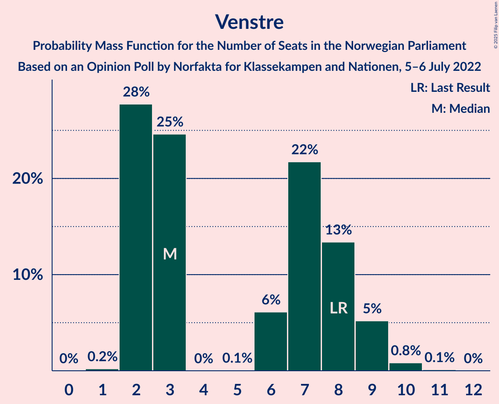
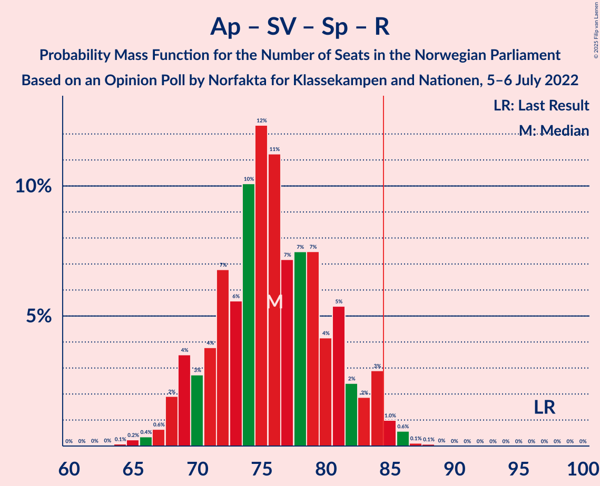
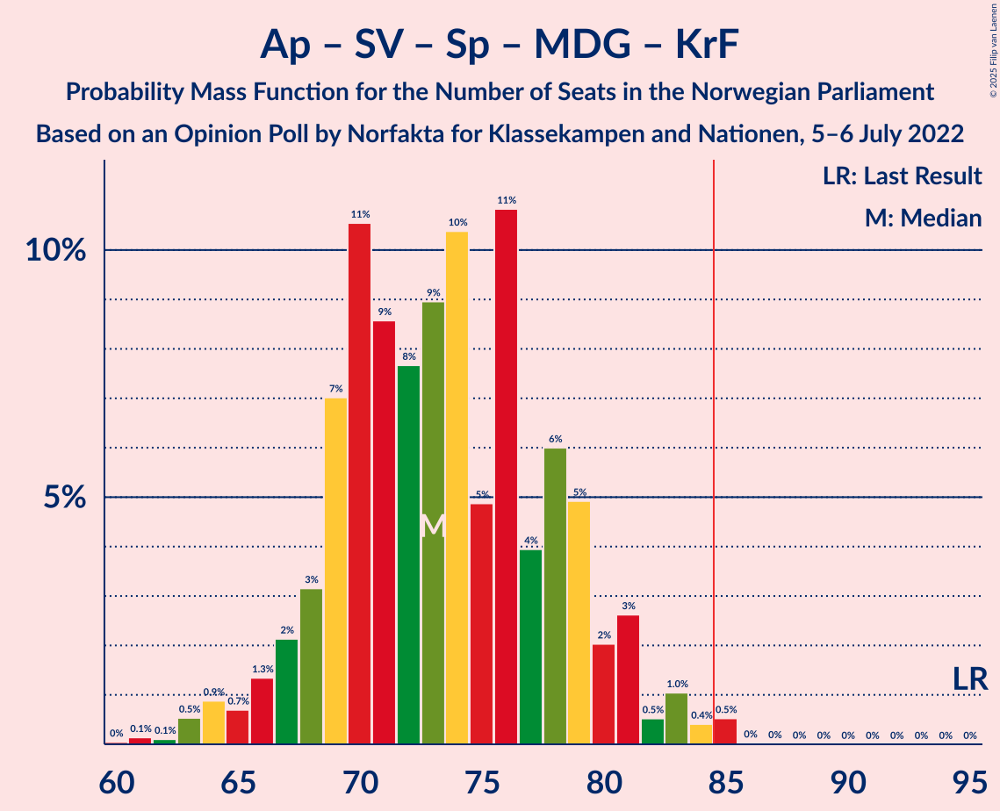

# Opinion Poll by Norfakta for Klassekampen and Nationen, 5–6 July 2022

<a href="#voting-intentions">Voting Intentions</a> | <a href="#seats">Seats</a> | <a href="#coalitions">Coalitions</a> | <a href="#technical-information">Technical Information</a>

## Voting Intentions

### Confidence Intervals

| Party | Last Result | Poll Result | 80% Confidence Interval | 90% Confidence Interval | 95% Confidence Interval | 99% Confidence Interval |
|:-----:|:-----------:|:-----------:|:-----------------------:|:-----------------------:|:-----------------------:|:-----------------------:|
| Høyre | 20.4% | 28.9% | 27.1–30.7% |26.6–31.3% |26.1–31.7% |25.3–32.7% |
| Arbeiderpartiet | 26.2% | 21.2% | 19.6–22.9% |19.2–23.4% |18.8–23.8% |18.0–24.7% |
| Fremskrittspartiet | 11.6% | 14.0% | 12.7–15.5% |12.3–16.0% |12.0–16.3% |11.4–17.1% |
| Sosialistisk Venstreparti | 7.6% | 10.0% | 8.9–11.4% |8.6–11.7% |8.3–12.1% |7.8–12.7% |
| Senterpartiet | 13.5% | 5.6% | 4.7–6.6% |4.5–6.9% |4.3–7.2% |3.9–7.7% |
| Rødt | 4.7% | 5.4% | 4.6–6.4% |4.3–6.7% |4.1–7.0% |3.8–7.5% |
| Venstre | 4.6% | 4.0% | 3.3–4.9% |3.1–5.2% |2.9–5.4% |2.6–5.9% |
| Miljøpartiet De Grønne | 3.9% | 3.6% | 2.9–4.5% |2.7–4.7% |2.6–4.9% |2.3–5.4% |
| Kristelig Folkeparti | 3.8% | 3.2% | 2.6–4.0% |2.4–4.3% |2.3–4.5% |2.0–4.9% |

*Note:* The poll result column reflects the actual value used in the calculations. Published results may vary slightly, and in addition be rounded to fewer digits.

## Seats

### Confidence Intervals

| Party | Last Result | Median | 80% Confidence Interval | 90% Confidence Interval | 95% Confidence Interval | 99% Confidence Interval |
|:-----:|:-----------:|:------:|:-----------------------:|:-----------------------:|:-----------------------:|:-----------------------:|
| <a href="#høyre">Høyre</a> | 36 | 51 | 48–54 |47–55 |46–57 |44–59 |
| <a href="#arbeiderpartiet">Arbeiderpartiet</a> | 48 | 41 | 37–44 |36–45 |35–46 |34–49 |
| <a href="#fremskrittspartiet">Fremskrittspartiet</a> | 21 | 25 | 21–29 |21–30 |20–31 |18–32 |
| <a href="#sosialistisk-venstreparti">Sosialistisk Venstreparti</a> | 13 | 17 | 15–20 |14–21 |13–21 |12–23 |
| <a href="#senterpartiet">Senterpartiet</a> | 28 | 9 | 8–12 |7–12 |7–13 |1–14 |
| <a href="#rødt">Rødt</a> | 8 | 9 | 7–11 |7–12 |6–12 |1–13 |
| <a href="#venstre">Venstre</a> | 8 | 3 | 2–8 |2–9 |2–9 |2–10 |
| <a href="#miljøpartiet-de-grønne">Miljøpartiet De Grønne</a> | 3 | 3 | 1–7 |1–8 |1–8 |1–9 |
| <a href="#kristelig-folkeparti">Kristelig Folkeparti</a> | 3 | 2 | 2–6 |1–7 |1–7 |0–8 |

### Høyre

*For a full overview of the results for this party, see the [Høyre](party-høyre.html) page.*

| Number of Seats | Probability | Accumulated | Special Marks |
|:---------------:|:-----------:|:-----------:|:-------------:|
| 36 | 0% | 100% | Last Result |
| 37 | 0% | 100% |  |
| 38 | 0% | 100% |  |
| 39 | 0% | 100% |  |
| 40 | 0% | 100% |  |
| 41 | 0% | 100% |  |
| 42 | 0.1% | 99.9% |  |
| 43 | 0.3% | 99.9% |  |
| 44 | 0.5% | 99.5% |  |
| 45 | 0.6% | 99.1% |  |
| 46 | 2% | 98% |  |
| 47 | 3% | 96% |  |
| 48 | 17% | 93% |  |
| 49 | 14% | 77% |  |
| 50 | 10% | 62% |  |
| 51 | 21% | 52% | Median |
| 52 | 11% | 31% |  |
| 53 | 5% | 20% |  |
| 54 | 6% | 14% |  |
| 55 | 4% | 8% |  |
| 56 | 1.3% | 4% |  |
| 57 | 1.4% | 3% |  |
| 58 | 0.9% | 2% |  |
| 59 | 0.5% | 0.7% |  |
| 60 | 0.1% | 0.2% |  |
| 61 | 0.1% | 0.1% |  |
| 62 | 0% | 0.1% |  |
| 63 | 0% | 0% |  |

### Arbeiderpartiet

*For a full overview of the results for this party, see the [Arbeiderpartiet](party-arbeiderpartiet.html) page.*

| Number of Seats | Probability | Accumulated | Special Marks |
|:---------------:|:-----------:|:-----------:|:-------------:|
| 32 | 0.1% | 100% |  |
| 33 | 0.3% | 99.9% |  |
| 34 | 1.1% | 99.7% |  |
| 35 | 2% | 98.6% |  |
| 36 | 5% | 97% |  |
| 37 | 6% | 92% |  |
| 38 | 9% | 86% |  |
| 39 | 15% | 77% |  |
| 40 | 12% | 62% |  |
| 41 | 16% | 50% | Median |
| 42 | 13% | 34% |  |
| 43 | 6% | 22% |  |
| 44 | 7% | 16% |  |
| 45 | 5% | 8% |  |
| 46 | 1.2% | 3% |  |
| 47 | 0.6% | 2% |  |
| 48 | 0.9% | 1.4% | Last Result |
| 49 | 0.4% | 0.5% |  |
| 50 | 0.1% | 0.1% |  |
| 51 | 0% | 0% |  |

### Fremskrittspartiet

*For a full overview of the results for this party, see the [Fremskrittspartiet](party-fremskrittspartiet.html) page.*

| Number of Seats | Probability | Accumulated | Special Marks |
|:---------------:|:-----------:|:-----------:|:-------------:|
| 18 | 0.5% | 100% |  |
| 19 | 0.8% | 99.5% |  |
| 20 | 1.3% | 98.7% |  |
| 21 | 8% | 97% | Last Result |
| 22 | 11% | 89% |  |
| 23 | 11% | 79% |  |
| 24 | 10% | 68% |  |
| 25 | 12% | 57% | Median |
| 26 | 11% | 45% |  |
| 27 | 10% | 34% |  |
| 28 | 7% | 24% |  |
| 29 | 10% | 17% |  |
| 30 | 3% | 7% |  |
| 31 | 2% | 3% |  |
| 32 | 1.0% | 1.5% |  |
| 33 | 0.3% | 0.4% |  |
| 34 | 0.1% | 0.1% |  |
| 35 | 0% | 0% |  |

### Sosialistisk Venstreparti

*For a full overview of the results for this party, see the [Sosialistisk Venstreparti](party-sosialistiskvenstreparti.html) page.*

| Number of Seats | Probability | Accumulated | Special Marks |
|:---------------:|:-----------:|:-----------:|:-------------:|
| 11 | 0.4% | 100% |  |
| 12 | 1.0% | 99.6% |  |
| 13 | 2% | 98.6% | Last Result |
| 14 | 6% | 97% |  |
| 15 | 19% | 91% |  |
| 16 | 21% | 72% |  |
| 17 | 17% | 51% | Median |
| 18 | 11% | 34% |  |
| 19 | 9% | 23% |  |
| 20 | 8% | 14% |  |
| 21 | 4% | 6% |  |
| 22 | 0.6% | 2% |  |
| 23 | 2% | 2% |  |
| 24 | 0% | 0.1% |  |
| 25 | 0% | 0% |  |

### Senterpartiet

*For a full overview of the results for this party, see the [Senterpartiet](party-senterpartiet.html) page.*

| Number of Seats | Probability | Accumulated | Special Marks |
|:---------------:|:-----------:|:-----------:|:-------------:|
| 0 | 0.2% | 100% |  |
| 1 | 0.6% | 99.8% |  |
| 2 | 0% | 99.2% |  |
| 3 | 0% | 99.2% |  |
| 4 | 0% | 99.2% |  |
| 5 | 0% | 99.2% |  |
| 6 | 1.3% | 99.2% |  |
| 7 | 7% | 98% |  |
| 8 | 23% | 91% |  |
| 9 | 24% | 68% | Median |
| 10 | 17% | 44% |  |
| 11 | 13% | 27% |  |
| 12 | 9% | 13% |  |
| 13 | 4% | 5% |  |
| 14 | 1.0% | 1.1% |  |
| 15 | 0.1% | 0.1% |  |
| 16 | 0% | 0% |  |
| 17 | 0% | 0% |  |
| 18 | 0% | 0% |  |
| 19 | 0% | 0% |  |
| 20 | 0% | 0% |  |
| 21 | 0% | 0% |  |
| 22 | 0% | 0% |  |
| 23 | 0% | 0% |  |
| 24 | 0% | 0% |  |
| 25 | 0% | 0% |  |
| 26 | 0% | 0% |  |
| 27 | 0% | 0% |  |
| 28 | 0% | 0% | Last Result |

### Rødt

*For a full overview of the results for this party, see the [Rødt](party-rødt.html) page.*

| Number of Seats | Probability | Accumulated | Special Marks |
|:---------------:|:-----------:|:-----------:|:-------------:|
| 1 | 1.1% | 100% |  |
| 2 | 0% | 98.9% |  |
| 3 | 0% | 98.9% |  |
| 4 | 0% | 98.9% |  |
| 5 | 0% | 98.9% |  |
| 6 | 3% | 98.9% |  |
| 7 | 8% | 96% |  |
| 8 | 24% | 88% | Last Result |
| 9 | 25% | 64% | Median |
| 10 | 22% | 40% |  |
| 11 | 12% | 18% |  |
| 12 | 5% | 6% |  |
| 13 | 0.9% | 1.3% |  |
| 14 | 0.3% | 0.4% |  |
| 15 | 0% | 0% |  |

### Venstre

*For a full overview of the results for this party, see the [Venstre](party-venstre.html) page.*

| Number of Seats | Probability | Accumulated | Special Marks |
|:---------------:|:-----------:|:-----------:|:-------------:|
| 1 | 0.2% | 100% |  |
| 2 | 28% | 99.8% |  |
| 3 | 25% | 72% | Median |
| 4 | 0% | 47% |  |
| 5 | 0.1% | 47% |  |
| 6 | 6% | 47% |  |
| 7 | 22% | 41% |  |
| 8 | 13% | 20% | Last Result |
| 9 | 5% | 6% |  |
| 10 | 0.8% | 1.0% |  |
| 11 | 0.1% | 0.1% |  |
| 12 | 0% | 0% |  |

### Miljøpartiet De Grønne

*For a full overview of the results for this party, see the [Miljøpartiet De Grønne](party-miljøpartietdegrønne.html) page.*

| Number of Seats | Probability | Accumulated | Special Marks |
|:---------------:|:-----------:|:-----------:|:-------------:|
| 1 | 16% | 100% |  |
| 2 | 32% | 84% |  |
| 3 | 15% | 52% | Last Result, Median |
| 4 | 0% | 37% |  |
| 5 | 0% | 37% |  |
| 6 | 5% | 37% |  |
| 7 | 24% | 32% |  |
| 8 | 7% | 8% |  |
| 9 | 0.7% | 0.8% |  |
| 10 | 0.1% | 0.1% |  |
| 11 | 0% | 0% |  |

### Kristelig Folkeparti

*For a full overview of the results for this party, see the [Kristelig Folkeparti](party-kristeligfolkeparti.html) page.*

| Number of Seats | Probability | Accumulated | Special Marks |
|:---------------:|:-----------:|:-----------:|:-------------:|
| 0 | 2% | 100% |  |
| 1 | 3% | 98% |  |
| 2 | 58% | 95% | Median |
| 3 | 26% | 37% | Last Result |
| 4 | 0% | 12% |  |
| 5 | 0.1% | 12% |  |
| 6 | 3% | 11% |  |
| 7 | 7% | 9% |  |
| 8 | 1.1% | 1.3% |  |
| 9 | 0.1% | 0.2% |  |
| 10 | 0% | 0% |  |

## Coalitions

### Confidence Intervals

| Coalition | Last Result | Median | Majority? | 80% Confidence Interval | 90% Confidence Interval | 95% Confidence Interval | 99% Confidence Interval |
|:---------:|:-----------:|:------:|:---------:|:-----------------------:|:-----------------------:|:-----------------------:|:-----------------------:|
| Høyre – Fremskrittspartiet – Senterpartiet – Venstre – Kristelig Folkeparti | 96 | 93 | 98.5% | 87–99 | 86–100 | 85–101 | 83–103 |
| Høyre – Fremskrittspartiet – Venstre – Miljøpartiet De Grønne – Kristelig Folkeparti | 71 | 87 | 72% | 82–93 | 80–94 | 79–96 | 78–99 |
| Høyre – Fremskrittspartiet – Venstre – Kristelig Folkeparti | 68 | 83 | 37% | 78–89 | 76–90 | 75–92 | 73–94 |
| Høyre – Fremskrittspartiet – Venstre | 65 | 81 | 17% | 75–86 | 74–88 | 72–89 | 71–91 |
| Arbeiderpartiet – Sosialistisk Venstreparti – Senterpartiet – Rødt – Miljøpartiet De Grønne | 100 | 79 | 15% | 75–85 | 73–87 | 71–88 | 69–90 |
| Arbeiderpartiet – Sosialistisk Venstreparti – Senterpartiet – Rødt | 97 | 76 | 2% | 71–81 | 69–83 | 68–84 | 66–86 |
| Høyre – Fremskrittspartiet | 57 | 76 | 1.0% | 70–81 | 69–82 | 69–83 | 68–86 |
| Arbeiderpartiet – Sosialistisk Venstreparti – Senterpartiet – Miljøpartiet De Grønne – Kristelig Folkeparti | 95 | 73 | 0.6% | 69–79 | 67–81 | 66–82 | 63–85 |
| Arbeiderpartiet – Sosialistisk Venstreparti – Senterpartiet – Miljøpartiet De Grønne | 92 | 70 | 0% | 66–76 | 65–78 | 63–79 | 61–81 |
| Arbeiderpartiet – Sosialistisk Venstreparti – Rødt – Miljøpartiet De Grønne | 72 | 70 | 0% | 65–76 | 64–77 | 62–78 | 61–81 |
| Arbeiderpartiet – Sosialistisk Venstreparti – Senterpartiet | 89 | 66 | 0% | 62–72 | 61–74 | 60–75 | 58–76 |
| Høyre – Venstre – Kristelig Folkeparti | 47 | 58 | 0% | 54–63 | 53–64 | 52–65 | 50–68 |
| Arbeiderpartiet – Sosialistisk Venstreparti | 61 | 57 | 0% | 53–62 | 52–63 | 52–64 | 50–66 |
| Arbeiderpartiet – Senterpartiet – Miljøpartiet De Grønne – Kristelig Folkeparti | 82 | 56 | 0% | 52–62 | 50–63 | 49–64 | 47–66 |
| Arbeiderpartiet – Senterpartiet – Kristelig Folkeparti | 79 | 53 | 0% | 48–58 | 48–58 | 47–59 | 44–63 |
| Arbeiderpartiet – Senterpartiet | 76 | 50 | 0% | 46–54 | 45–55 | 44–56 | 42–57 |
| Senterpartiet – Venstre – Kristelig Folkeparti | 39 | 17 | 0% | 13–21 | 12–23 | 12–24 | 10–26 |

### Høyre – Fremskrittspartiet – Senterpartiet – Venstre – Kristelig Folkeparti

| Number of Seats | Probability | Accumulated | Special Marks |
|:---------------:|:-----------:|:-----------:|:-------------:|
| 81 | 0.1% | 100% |  |
| 82 | 0.2% | 99.9% |  |
| 83 | 0.4% | 99.7% |  |
| 84 | 0.8% | 99.3% |  |
| 85 | 1.4% | 98.5% | Majority |
| 86 | 5% | 97% |  |
| 87 | 3% | 92% |  |
| 88 | 3% | 89% |  |
| 89 | 5% | 87% |  |
| 90 | 10% | 82% | Median |
| 91 | 10% | 72% |  |
| 92 | 9% | 62% |  |
| 93 | 14% | 53% |  |
| 94 | 9% | 39% |  |
| 95 | 7% | 30% |  |
| 96 | 4% | 23% | Last Result |
| 97 | 4% | 19% |  |
| 98 | 5% | 15% |  |
| 99 | 4% | 10% |  |
| 100 | 2% | 6% |  |
| 101 | 2% | 4% |  |
| 102 | 1.2% | 2% |  |
| 103 | 0.3% | 0.7% |  |
| 104 | 0.2% | 0.4% |  |
| 105 | 0.1% | 0.2% |  |
| 106 | 0% | 0.1% |  |
| 107 | 0% | 0.1% |  |
| 108 | 0.1% | 0.1% |  |
| 109 | 0% | 0% |  |

### Høyre – Fremskrittspartiet – Venstre – Miljøpartiet De Grønne – Kristelig Folkeparti

| Number of Seats | Probability | Accumulated | Special Marks |
|:---------------:|:-----------:|:-----------:|:-------------:|
| 71 | 0% | 100% | Last Result |
| 72 | 0% | 100% |  |
| 73 | 0% | 100% |  |
| 74 | 0.1% | 100% |  |
| 75 | 0% | 99.9% |  |
| 76 | 0.1% | 99.9% |  |
| 77 | 0.2% | 99.8% |  |
| 78 | 0.6% | 99.6% |  |
| 79 | 2% | 98.9% |  |
| 80 | 3% | 97% |  |
| 81 | 4% | 94% |  |
| 82 | 5% | 90% |  |
| 83 | 4% | 85% |  |
| 84 | 9% | 82% | Median |
| 85 | 10% | 72% | Majority |
| 86 | 7% | 62% |  |
| 87 | 9% | 55% |  |
| 88 | 6% | 46% |  |
| 89 | 10% | 40% |  |
| 90 | 4% | 29% |  |
| 91 | 4% | 25% |  |
| 92 | 7% | 21% |  |
| 93 | 7% | 14% |  |
| 94 | 2% | 6% |  |
| 95 | 2% | 4% |  |
| 96 | 0.9% | 3% |  |
| 97 | 0.7% | 2% |  |
| 98 | 0.4% | 1.0% |  |
| 99 | 0.5% | 0.6% |  |
| 100 | 0% | 0.1% |  |
| 101 | 0.1% | 0.1% |  |
| 102 | 0% | 0% |  |

### Høyre – Fremskrittspartiet – Venstre – Kristelig Folkeparti

| Number of Seats | Probability | Accumulated | Special Marks |
|:---------------:|:-----------:|:-----------:|:-------------:|
| 68 | 0% | 100% | Last Result |
| 69 | 0% | 100% |  |
| 70 | 0% | 100% |  |
| 71 | 0% | 100% |  |
| 72 | 0.1% | 100% |  |
| 73 | 0.5% | 99.9% |  |
| 74 | 0.4% | 99.5% |  |
| 75 | 3% | 99.0% |  |
| 76 | 3% | 96% |  |
| 77 | 1.5% | 93% |  |
| 78 | 4% | 91% |  |
| 79 | 3% | 87% |  |
| 80 | 7% | 84% |  |
| 81 | 6% | 78% | Median |
| 82 | 13% | 71% |  |
| 83 | 10% | 58% |  |
| 84 | 11% | 48% |  |
| 85 | 6% | 37% | Majority |
| 86 | 10% | 31% |  |
| 87 | 6% | 21% |  |
| 88 | 3% | 15% |  |
| 89 | 4% | 11% |  |
| 90 | 3% | 8% |  |
| 91 | 2% | 5% |  |
| 92 | 1.1% | 3% |  |
| 93 | 1.5% | 2% |  |
| 94 | 0.3% | 0.6% |  |
| 95 | 0.1% | 0.2% |  |
| 96 | 0.1% | 0.1% |  |
| 97 | 0% | 0.1% |  |
| 98 | 0% | 0% |  |

### Høyre – Fremskrittspartiet – Venstre

| Number of Seats | Probability | Accumulated | Special Marks |
|:---------------:|:-----------:|:-----------:|:-------------:|
| 65 | 0% | 100% | Last Result |
| 66 | 0% | 100% |  |
| 67 | 0% | 100% |  |
| 68 | 0% | 100% |  |
| 69 | 0% | 100% |  |
| 70 | 0.3% | 99.9% |  |
| 71 | 0.4% | 99.6% |  |
| 72 | 3% | 99.2% |  |
| 73 | 0.9% | 96% |  |
| 74 | 3% | 95% |  |
| 75 | 3% | 92% |  |
| 76 | 4% | 89% |  |
| 77 | 8% | 85% |  |
| 78 | 6% | 77% |  |
| 79 | 9% | 71% | Median |
| 80 | 11% | 62% |  |
| 81 | 10% | 51% |  |
| 82 | 8% | 40% |  |
| 83 | 8% | 33% |  |
| 84 | 8% | 25% |  |
| 85 | 5% | 17% | Majority |
| 86 | 4% | 12% |  |
| 87 | 3% | 8% |  |
| 88 | 2% | 5% |  |
| 89 | 0.9% | 3% |  |
| 90 | 1.4% | 2% |  |
| 91 | 0.4% | 0.7% |  |
| 92 | 0.2% | 0.3% |  |
| 93 | 0.1% | 0.1% |  |
| 94 | 0% | 0.1% |  |
| 95 | 0% | 0% |  |

### Arbeiderpartiet – Sosialistisk Venstreparti – Senterpartiet – Rødt – Miljøpartiet De Grønne

| Number of Seats | Probability | Accumulated | Special Marks |
|:---------------:|:-----------:|:-----------:|:-------------:|
| 66 | 0% | 100% |  |
| 67 | 0.1% | 99.9% |  |
| 68 | 0.2% | 99.8% |  |
| 69 | 0.4% | 99.6% |  |
| 70 | 0.9% | 99.3% |  |
| 71 | 1.4% | 98% |  |
| 72 | 0.8% | 97% |  |
| 73 | 3% | 96% |  |
| 74 | 3% | 93% |  |
| 75 | 5% | 90% |  |
| 76 | 5% | 85% |  |
| 77 | 12% | 80% |  |
| 78 | 7% | 68% |  |
| 79 | 12% | 60% | Median |
| 80 | 9% | 49% |  |
| 81 | 4% | 40% |  |
| 82 | 8% | 35% |  |
| 83 | 6% | 27% |  |
| 84 | 6% | 22% |  |
| 85 | 6% | 15% | Majority |
| 86 | 3% | 10% |  |
| 87 | 3% | 7% |  |
| 88 | 2% | 3% |  |
| 89 | 0.7% | 2% |  |
| 90 | 0.4% | 0.9% |  |
| 91 | 0.1% | 0.5% |  |
| 92 | 0.2% | 0.3% |  |
| 93 | 0.1% | 0.1% |  |
| 94 | 0% | 0% |  |
| 95 | 0% | 0% |  |
| 96 | 0% | 0% |  |
| 97 | 0% | 0% |  |
| 98 | 0% | 0% |  |
| 99 | 0% | 0% |  |
| 100 | 0% | 0% | Last Result |

### Arbeiderpartiet – Sosialistisk Venstreparti – Senterpartiet – Rødt

| Number of Seats | Probability | Accumulated | Special Marks |
|:---------------:|:-----------:|:-----------:|:-------------:|
| 63 | 0% | 100% |  |
| 64 | 0.1% | 99.9% |  |
| 65 | 0.2% | 99.9% |  |
| 66 | 0.4% | 99.6% |  |
| 67 | 0.6% | 99.3% |  |
| 68 | 2% | 98.6% |  |
| 69 | 4% | 97% |  |
| 70 | 3% | 93% |  |
| 71 | 4% | 90% |  |
| 72 | 7% | 87% |  |
| 73 | 6% | 80% |  |
| 74 | 10% | 74% |  |
| 75 | 12% | 64% |  |
| 76 | 11% | 52% | Median |
| 77 | 7% | 41% |  |
| 78 | 7% | 33% |  |
| 79 | 7% | 26% |  |
| 80 | 4% | 19% |  |
| 81 | 5% | 14% |  |
| 82 | 2% | 9% |  |
| 83 | 2% | 7% |  |
| 84 | 3% | 5% |  |
| 85 | 1.0% | 2% | Majority |
| 86 | 0.6% | 0.8% |  |
| 87 | 0.1% | 0.2% |  |
| 88 | 0.1% | 0.1% |  |
| 89 | 0% | 0% |  |
| 90 | 0% | 0% |  |
| 91 | 0% | 0% |  |
| 92 | 0% | 0% |  |
| 93 | 0% | 0% |  |
| 94 | 0% | 0% |  |
| 95 | 0% | 0% |  |
| 96 | 0% | 0% |  |
| 97 | 0% | 0% | Last Result |

### Høyre – Fremskrittspartiet

| Number of Seats | Probability | Accumulated | Special Marks |
|:---------------:|:-----------:|:-----------:|:-------------:|
| 57 | 0% | 100% | Last Result |
| 58 | 0% | 100% |  |
| 59 | 0% | 100% |  |
| 60 | 0% | 100% |  |
| 61 | 0% | 100% |  |
| 62 | 0% | 100% |  |
| 63 | 0% | 100% |  |
| 64 | 0% | 100% |  |
| 65 | 0% | 99.9% |  |
| 66 | 0.1% | 99.9% |  |
| 67 | 0.3% | 99.8% |  |
| 68 | 0.8% | 99.5% |  |
| 69 | 4% | 98.7% |  |
| 70 | 5% | 95% |  |
| 71 | 5% | 90% |  |
| 72 | 5% | 85% |  |
| 73 | 6% | 79% |  |
| 74 | 10% | 73% |  |
| 75 | 10% | 63% |  |
| 76 | 10% | 53% | Median |
| 77 | 10% | 43% |  |
| 78 | 11% | 33% |  |
| 79 | 3% | 22% |  |
| 80 | 6% | 19% |  |
| 81 | 5% | 13% |  |
| 82 | 3% | 8% |  |
| 83 | 3% | 5% |  |
| 84 | 0.8% | 2% |  |
| 85 | 0.3% | 1.0% | Majority |
| 86 | 0.3% | 0.7% |  |
| 87 | 0.1% | 0.4% |  |
| 88 | 0.2% | 0.3% |  |
| 89 | 0% | 0.1% |  |
| 90 | 0% | 0.1% |  |
| 91 | 0% | 0% |  |

### Arbeiderpartiet – Sosialistisk Venstreparti – Senterpartiet – Miljøpartiet De Grønne – Kristelig Folkeparti

| Number of Seats | Probability | Accumulated | Special Marks |
|:---------------:|:-----------:|:-----------:|:-------------:|
| 60 | 0% | 100% |  |
| 61 | 0.1% | 99.9% |  |
| 62 | 0.1% | 99.8% |  |
| 63 | 0.5% | 99.7% |  |
| 64 | 0.9% | 99.2% |  |
| 65 | 0.7% | 98% |  |
| 66 | 1.3% | 98% |  |
| 67 | 2% | 96% |  |
| 68 | 3% | 94% |  |
| 69 | 7% | 91% |  |
| 70 | 11% | 84% |  |
| 71 | 9% | 73% |  |
| 72 | 8% | 65% | Median |
| 73 | 9% | 57% |  |
| 74 | 10% | 48% |  |
| 75 | 5% | 38% |  |
| 76 | 11% | 33% |  |
| 77 | 4% | 22% |  |
| 78 | 6% | 18% |  |
| 79 | 5% | 12% |  |
| 80 | 2% | 7% |  |
| 81 | 3% | 5% |  |
| 82 | 0.5% | 3% |  |
| 83 | 1.0% | 2% |  |
| 84 | 0.4% | 1.0% |  |
| 85 | 0.5% | 0.6% | Majority |
| 86 | 0% | 0.1% |  |
| 87 | 0% | 0% |  |
| 88 | 0% | 0% |  |
| 89 | 0% | 0% |  |
| 90 | 0% | 0% |  |
| 91 | 0% | 0% |  |
| 92 | 0% | 0% |  |
| 93 | 0% | 0% |  |
| 94 | 0% | 0% |  |
| 95 | 0% | 0% | Last Result |

### Arbeiderpartiet – Sosialistisk Venstreparti – Senterpartiet – Miljøpartiet De Grønne

| Number of Seats | Probability | Accumulated | Special Marks |
|:---------------:|:-----------:|:-----------:|:-------------:|
| 58 | 0.1% | 100% |  |
| 59 | 0.1% | 99.9% |  |
| 60 | 0.1% | 99.8% |  |
| 61 | 0.6% | 99.6% |  |
| 62 | 1.0% | 99.0% |  |
| 63 | 1.1% | 98% |  |
| 64 | 2% | 97% |  |
| 65 | 4% | 95% |  |
| 66 | 4% | 92% |  |
| 67 | 7% | 87% |  |
| 68 | 13% | 80% |  |
| 69 | 13% | 67% |  |
| 70 | 5% | 54% | Median |
| 71 | 8% | 49% |  |
| 72 | 9% | 41% |  |
| 73 | 7% | 32% |  |
| 74 | 5% | 24% |  |
| 75 | 5% | 20% |  |
| 76 | 8% | 15% |  |
| 77 | 2% | 8% |  |
| 78 | 2% | 5% |  |
| 79 | 2% | 3% |  |
| 80 | 0.2% | 1.2% |  |
| 81 | 0.6% | 1.0% |  |
| 82 | 0.4% | 0.5% |  |
| 83 | 0% | 0.1% |  |
| 84 | 0% | 0% |  |
| 85 | 0% | 0% | Majority |
| 86 | 0% | 0% |  |
| 87 | 0% | 0% |  |
| 88 | 0% | 0% |  |
| 89 | 0% | 0% |  |
| 90 | 0% | 0% |  |
| 91 | 0% | 0% |  |
| 92 | 0% | 0% | Last Result |

### Arbeiderpartiet – Sosialistisk Venstreparti – Rødt – Miljøpartiet De Grønne

| Number of Seats | Probability | Accumulated | Special Marks |
|:---------------:|:-----------:|:-----------:|:-------------:|
| 57 | 0% | 100% |  |
| 58 | 0.1% | 99.9% |  |
| 59 | 0.1% | 99.9% |  |
| 60 | 0.2% | 99.8% |  |
| 61 | 0.6% | 99.6% |  |
| 62 | 2% | 99.0% |  |
| 63 | 2% | 97% |  |
| 64 | 2% | 96% |  |
| 65 | 4% | 93% |  |
| 66 | 5% | 89% |  |
| 67 | 6% | 85% |  |
| 68 | 11% | 78% |  |
| 69 | 11% | 67% |  |
| 70 | 10% | 56% | Median |
| 71 | 11% | 46% |  |
| 72 | 4% | 35% | Last Result |
| 73 | 5% | 31% |  |
| 74 | 12% | 26% |  |
| 75 | 4% | 14% |  |
| 76 | 4% | 10% |  |
| 77 | 3% | 6% |  |
| 78 | 1.1% | 3% |  |
| 79 | 0.9% | 2% |  |
| 80 | 0.5% | 1.1% |  |
| 81 | 0.4% | 0.6% |  |
| 82 | 0.1% | 0.2% |  |
| 83 | 0.1% | 0.1% |  |
| 84 | 0% | 0% |  |

### Arbeiderpartiet – Sosialistisk Venstreparti – Senterpartiet

| Number of Seats | Probability | Accumulated | Special Marks |
|:---------------:|:-----------:|:-----------:|:-------------:|
| 55 | 0% | 100% |  |
| 56 | 0.1% | 99.9% |  |
| 57 | 0.1% | 99.8% |  |
| 58 | 0.3% | 99.7% |  |
| 59 | 1.0% | 99.3% |  |
| 60 | 2% | 98% |  |
| 61 | 5% | 96% |  |
| 62 | 3% | 92% |  |
| 63 | 5% | 88% |  |
| 64 | 8% | 84% |  |
| 65 | 11% | 75% |  |
| 66 | 16% | 64% |  |
| 67 | 9% | 48% | Median |
| 68 | 8% | 39% |  |
| 69 | 8% | 31% |  |
| 70 | 7% | 23% |  |
| 71 | 5% | 16% |  |
| 72 | 3% | 11% |  |
| 73 | 3% | 8% |  |
| 74 | 2% | 5% |  |
| 75 | 1.1% | 3% |  |
| 76 | 1.2% | 1.4% |  |
| 77 | 0.1% | 0.2% |  |
| 78 | 0% | 0.1% |  |
| 79 | 0% | 0% |  |
| 80 | 0% | 0% |  |
| 81 | 0% | 0% |  |
| 82 | 0% | 0% |  |
| 83 | 0% | 0% |  |
| 84 | 0% | 0% |  |
| 85 | 0% | 0% | Majority |
| 86 | 0% | 0% |  |
| 87 | 0% | 0% |  |
| 88 | 0% | 0% |  |
| 89 | 0% | 0% | Last Result |

### Høyre – Venstre – Kristelig Folkeparti

| Number of Seats | Probability | Accumulated | Special Marks |
|:---------------:|:-----------:|:-----------:|:-------------:|
| 47 | 0% | 100% | Last Result |
| 48 | 0% | 99.9% |  |
| 49 | 0.2% | 99.9% |  |
| 50 | 0.6% | 99.7% |  |
| 51 | 0.3% | 99.1% |  |
| 52 | 1.3% | 98.7% |  |
| 53 | 6% | 97% |  |
| 54 | 8% | 92% |  |
| 55 | 10% | 84% |  |
| 56 | 8% | 74% | Median |
| 57 | 12% | 66% |  |
| 58 | 10% | 54% |  |
| 59 | 8% | 44% |  |
| 60 | 8% | 36% |  |
| 61 | 9% | 28% |  |
| 62 | 8% | 20% |  |
| 63 | 6% | 11% |  |
| 64 | 2% | 5% |  |
| 65 | 1.5% | 4% |  |
| 66 | 1.0% | 2% |  |
| 67 | 0.3% | 1.3% |  |
| 68 | 0.8% | 1.0% |  |
| 69 | 0.1% | 0.2% |  |
| 70 | 0.1% | 0.1% |  |
| 71 | 0% | 0.1% |  |
| 72 | 0% | 0% |  |

### Arbeiderpartiet – Sosialistisk Venstreparti

| Number of Seats | Probability | Accumulated | Special Marks |
|:---------------:|:-----------:|:-----------:|:-------------:|
| 48 | 0.2% | 100% |  |
| 49 | 0.2% | 99.8% |  |
| 50 | 0.7% | 99.6% |  |
| 51 | 1.3% | 98.9% |  |
| 52 | 4% | 98% |  |
| 53 | 6% | 94% |  |
| 54 | 6% | 88% |  |
| 55 | 7% | 82% |  |
| 56 | 14% | 75% |  |
| 57 | 14% | 61% |  |
| 58 | 14% | 47% | Median |
| 59 | 8% | 33% |  |
| 60 | 10% | 25% |  |
| 61 | 4% | 14% | Last Result |
| 62 | 2% | 11% |  |
| 63 | 5% | 9% |  |
| 64 | 2% | 4% |  |
| 65 | 2% | 2% |  |
| 66 | 0.4% | 0.6% |  |
| 67 | 0.1% | 0.2% |  |
| 68 | 0% | 0.1% |  |
| 69 | 0% | 0% |  |

### Arbeiderpartiet – Senterpartiet – Miljøpartiet De Grønne – Kristelig Folkeparti

| Number of Seats | Probability | Accumulated | Special Marks |
|:---------------:|:-----------:|:-----------:|:-------------:|
| 43 | 0% | 100% |  |
| 44 | 0.1% | 99.9% |  |
| 45 | 0% | 99.9% |  |
| 46 | 0.2% | 99.8% |  |
| 47 | 0.4% | 99.6% |  |
| 48 | 0.9% | 99.2% |  |
| 49 | 2% | 98% |  |
| 50 | 2% | 96% |  |
| 51 | 3% | 94% |  |
| 52 | 4% | 91% |  |
| 53 | 12% | 88% |  |
| 54 | 10% | 76% |  |
| 55 | 10% | 66% | Median |
| 56 | 13% | 56% |  |
| 57 | 4% | 43% |  |
| 58 | 6% | 38% |  |
| 59 | 4% | 32% |  |
| 60 | 7% | 28% |  |
| 61 | 8% | 21% |  |
| 62 | 4% | 13% |  |
| 63 | 4% | 9% |  |
| 64 | 2% | 4% |  |
| 65 | 2% | 2% |  |
| 66 | 0.4% | 0.6% |  |
| 67 | 0.1% | 0.3% |  |
| 68 | 0.1% | 0.1% |  |
| 69 | 0% | 0.1% |  |
| 70 | 0% | 0% |  |
| 71 | 0% | 0% |  |
| 72 | 0% | 0% |  |
| 73 | 0% | 0% |  |
| 74 | 0% | 0% |  |
| 75 | 0% | 0% |  |
| 76 | 0% | 0% |  |
| 77 | 0% | 0% |  |
| 78 | 0% | 0% |  |
| 79 | 0% | 0% |  |
| 80 | 0% | 0% |  |
| 81 | 0% | 0% |  |
| 82 | 0% | 0% | Last Result |

### Arbeiderpartiet – Senterpartiet – Kristelig Folkeparti

| Number of Seats | Probability | Accumulated | Special Marks |
|:---------------:|:-----------:|:-----------:|:-------------:|
| 41 | 0% | 100% |  |
| 42 | 0.1% | 99.9% |  |
| 43 | 0.1% | 99.9% |  |
| 44 | 0.4% | 99.7% |  |
| 45 | 0.5% | 99.4% |  |
| 46 | 0.7% | 98.9% |  |
| 47 | 3% | 98% |  |
| 48 | 6% | 96% |  |
| 49 | 11% | 90% |  |
| 50 | 7% | 79% |  |
| 51 | 11% | 72% |  |
| 52 | 9% | 61% | Median |
| 53 | 15% | 52% |  |
| 54 | 9% | 37% |  |
| 55 | 5% | 28% |  |
| 56 | 7% | 23% |  |
| 57 | 6% | 16% |  |
| 58 | 6% | 10% |  |
| 59 | 2% | 4% |  |
| 60 | 0.7% | 2% |  |
| 61 | 0.5% | 1.1% |  |
| 62 | 0.1% | 0.7% |  |
| 63 | 0.3% | 0.5% |  |
| 64 | 0.2% | 0.2% |  |
| 65 | 0% | 0% |  |
| 66 | 0% | 0% |  |
| 67 | 0% | 0% |  |
| 68 | 0% | 0% |  |
| 69 | 0% | 0% |  |
| 70 | 0% | 0% |  |
| 71 | 0% | 0% |  |
| 72 | 0% | 0% |  |
| 73 | 0% | 0% |  |
| 74 | 0% | 0% |  |
| 75 | 0% | 0% |  |
| 76 | 0% | 0% |  |
| 77 | 0% | 0% |  |
| 78 | 0% | 0% |  |
| 79 | 0% | 0% | Last Result |

### Arbeiderpartiet – Senterpartiet

| Number of Seats | Probability | Accumulated | Special Marks |
|:---------------:|:-----------:|:-----------:|:-------------:|
| 38 | 0% | 100% |  |
| 39 | 0% | 99.9% |  |
| 40 | 0.1% | 99.9% |  |
| 41 | 0.3% | 99.8% |  |
| 42 | 0.4% | 99.6% |  |
| 43 | 0.5% | 99.2% |  |
| 44 | 2% | 98.7% |  |
| 45 | 3% | 97% |  |
| 46 | 6% | 94% |  |
| 47 | 12% | 88% |  |
| 48 | 9% | 76% |  |
| 49 | 13% | 67% |  |
| 50 | 14% | 55% | Median |
| 51 | 15% | 41% |  |
| 52 | 5% | 26% |  |
| 53 | 8% | 21% |  |
| 54 | 5% | 14% |  |
| 55 | 5% | 9% |  |
| 56 | 1.4% | 4% |  |
| 57 | 2% | 2% |  |
| 58 | 0.3% | 0.4% |  |
| 59 | 0% | 0.1% |  |
| 60 | 0% | 0% |  |
| 61 | 0% | 0% |  |
| 62 | 0% | 0% |  |
| 63 | 0% | 0% |  |
| 64 | 0% | 0% |  |
| 65 | 0% | 0% |  |
| 66 | 0% | 0% |  |
| 67 | 0% | 0% |  |
| 68 | 0% | 0% |  |
| 69 | 0% | 0% |  |
| 70 | 0% | 0% |  |
| 71 | 0% | 0% |  |
| 72 | 0% | 0% |  |
| 73 | 0% | 0% |  |
| 74 | 0% | 0% |  |
| 75 | 0% | 0% |  |
| 76 | 0% | 0% | Last Result |

### Senterpartiet – Venstre – Kristelig Folkeparti

| Number of Seats | Probability | Accumulated | Special Marks |
|:---------------:|:-----------:|:-----------:|:-------------:|
| 5 | 0.1% | 100% |  |
| 6 | 0.3% | 99.9% |  |
| 7 | 0% | 99.6% |  |
| 8 | 0% | 99.6% |  |
| 9 | 0.1% | 99.6% |  |
| 10 | 0.3% | 99.5% |  |
| 11 | 1.4% | 99.2% |  |
| 12 | 5% | 98% |  |
| 13 | 9% | 93% |  |
| 14 | 9% | 85% | Median |
| 15 | 12% | 76% |  |
| 16 | 8% | 63% |  |
| 17 | 14% | 55% |  |
| 18 | 10% | 41% |  |
| 19 | 7% | 31% |  |
| 20 | 8% | 24% |  |
| 21 | 6% | 15% |  |
| 22 | 2% | 9% |  |
| 23 | 5% | 8% |  |
| 24 | 2% | 3% |  |
| 25 | 0.7% | 1.3% |  |
| 26 | 0.3% | 0.5% |  |
| 27 | 0.2% | 0.3% |  |
| 28 | 0% | 0% |  |
| 29 | 0% | 0% |  |
| 30 | 0% | 0% |  |
| 31 | 0% | 0% |  |
| 32 | 0% | 0% |  |
| 33 | 0% | 0% |  |
| 34 | 0% | 0% |  |
| 35 | 0% | 0% |  |
| 36 | 0% | 0% |  |
| 37 | 0% | 0% |  |
| 38 | 0% | 0% |  |
| 39 | 0% | 0% | Last Result |

## Technical Information

### Opinion Poll

+ **Polling firm:** Norfakta
+ **Commissioner(s):** Klassekampen and Nationen
+ **Fieldwork period:** 5–6 July 2022

### Calculations

+ **Sample size:** 1005
+ **Simulations done:** 1,048,576
+ **Error estimate:** 3.46%

