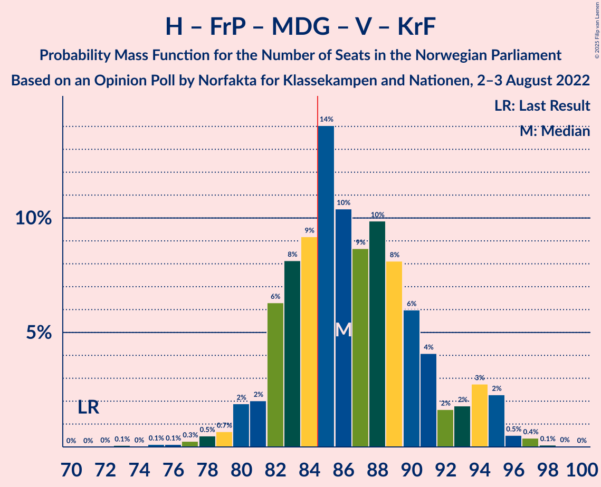

# Opinion Poll by Norfakta for Klassekampen and Nationen, 2–3 August 2022

<a href="#voting-intentions">Voting Intentions</a> | <a href="#seats">Seats</a> | <a href="#coalitions">Coalitions</a> | <a href="#technical-information">Technical Information</a>

## Voting Intentions

### Confidence Intervals

| Party | Last Result | Poll Result | 80% Confidence Interval | 90% Confidence Interval | 95% Confidence Interval | 99% Confidence Interval |
|:-----:|:-----------:|:-----------:|:-----------------------:|:-----------------------:|:-----------------------:|:-----------------------:|
| Høyre | 20.4% | 28.7% | 26.7–30.8% |26.2–31.4% |25.7–32.0% |24.7–33.0% |
| Arbeiderpartiet | 26.2% | 22.2% | 20.4–24.1% |19.8–24.7% |19.4–25.2% |18.6–26.2% |
| Fremskrittspartiet | 11.6% | 13.4% | 11.9–15.0% |11.5–15.5% |11.2–15.9% |10.5–16.7% |
| Sosialistisk Venstreparti | 7.6% | 8.4% | 7.3–9.8% |7.0–10.2% |6.7–10.6% |6.2–11.3% |
| Senterpartiet | 13.5% | 7.2% | 6.1–8.5% |5.8–8.9% |5.6–9.2% |5.1–9.9% |
| Rødt | 4.7% | 6.4% | 5.4–7.7% |5.2–8.0% |4.9–8.4% |4.5–9.0% |
| Miljøpartiet De Grønne | 3.9% | 4.2% | 3.4–5.2% |3.2–5.5% |3.0–5.8% |2.6–6.3% |
| Venstre | 4.6% | 3.7% | 2.9–4.7% |2.7–5.0% |2.5–5.2% |2.2–5.7% |
| Kristelig Folkeparti | 3.8% | 2.9% | 2.3–3.8% |2.1–4.1% |1.9–4.3% |1.7–4.8% |

*Note:* The poll result column reflects the actual value used in the calculations. Published results may vary slightly, and in addition be rounded to fewer digits.

## Seats

### Confidence Intervals

| Party | Last Result | Median | 80% Confidence Interval | 90% Confidence Interval | 95% Confidence Interval | 99% Confidence Interval |
|:-----:|:-----------:|:------:|:-----------------------:|:-----------------------:|:-----------------------:|:-----------------------:|
| <a href="#høyre">Høyre</a> | 36 | 51 | 47–55 |46–57 |45–57 |44–60 |
| <a href="#arbeiderpartiet">Arbeiderpartiet</a> | 48 | 43 | 37–46 |37–47 |36–47 |34–49 |
| <a href="#fremskrittspartiet">Fremskrittspartiet</a> | 21 | 24 | 21–27 |20–28 |19–29 |18–30 |
| <a href="#sosialistisk-venstreparti">Sosialistisk Venstreparti</a> | 13 | 14 | 12–17 |11–17 |11–19 |10–20 |
| <a href="#senterpartiet">Senterpartiet</a> | 28 | 13 | 11–15 |10–16 |9–16 |8–18 |
| <a href="#rødt">Rødt</a> | 8 | 12 | 10–14 |9–14 |9–15 |8–16 |
| <a href="#miljøpartiet-de-grønne">Miljøpartiet De Grønne</a> | 3 | 3 | 2–8 |2–9 |1–10 |1–11 |
| <a href="#venstre">Venstre</a> | 8 | 3 | 2–8 |2–9 |2–9 |1–10 |
| <a href="#kristelig-folkeparti">Kristelig Folkeparti</a> | 3 | 2 | 0–3 |0–3 |0–7 |0–8 |

### Høyre

*For a full overview of the results for this party, see the [Høyre](party-høyre.html) page.*

| Number of Seats | Probability | Accumulated | Special Marks |
|:---------------:|:-----------:|:-----------:|:-------------:|
| 36 | 0% | 100% | Last Result |
| 37 | 0% | 100% |  |
| 38 | 0% | 100% |  |
| 39 | 0% | 100% |  |
| 40 | 0% | 100% |  |
| 41 | 0% | 100% |  |
| 42 | 0.1% | 100% |  |
| 43 | 0.2% | 99.8% |  |
| 44 | 0.9% | 99.7% |  |
| 45 | 2% | 98.8% |  |
| 46 | 4% | 97% |  |
| 47 | 5% | 93% |  |
| 48 | 8% | 88% |  |
| 49 | 14% | 80% |  |
| 50 | 13% | 66% |  |
| 51 | 12% | 53% | Median |
| 52 | 12% | 41% |  |
| 53 | 10% | 29% |  |
| 54 | 6% | 18% |  |
| 55 | 5% | 12% |  |
| 56 | 1.4% | 7% |  |
| 57 | 3% | 5% |  |
| 58 | 0.8% | 2% |  |
| 59 | 0.6% | 1.2% |  |
| 60 | 0.2% | 0.6% |  |
| 61 | 0.3% | 0.4% |  |
| 62 | 0% | 0.1% |  |
| 63 | 0% | 0% |  |

### Arbeiderpartiet

*For a full overview of the results for this party, see the [Arbeiderpartiet](party-arbeiderpartiet.html) page.*

| Number of Seats | Probability | Accumulated | Special Marks |
|:---------------:|:-----------:|:-----------:|:-------------:|
| 33 | 0.1% | 100% |  |
| 34 | 0.4% | 99.9% |  |
| 35 | 0.9% | 99.5% |  |
| 36 | 3% | 98.5% |  |
| 37 | 9% | 95% |  |
| 38 | 4% | 86% |  |
| 39 | 7% | 82% |  |
| 40 | 6% | 75% |  |
| 41 | 8% | 69% |  |
| 42 | 6% | 61% |  |
| 43 | 12% | 55% | Median |
| 44 | 11% | 43% |  |
| 45 | 11% | 32% |  |
| 46 | 13% | 21% |  |
| 47 | 5% | 8% |  |
| 48 | 1.1% | 2% | Last Result |
| 49 | 0.9% | 1.3% |  |
| 50 | 0.3% | 0.3% |  |
| 51 | 0.1% | 0.1% |  |
| 52 | 0% | 0% |  |

### Fremskrittspartiet

*For a full overview of the results for this party, see the [Fremskrittspartiet](party-fremskrittspartiet.html) page.*

| Number of Seats | Probability | Accumulated | Special Marks |
|:---------------:|:-----------:|:-----------:|:-------------:|
| 17 | 0.1% | 100% |  |
| 18 | 0.7% | 99.9% |  |
| 19 | 2% | 99.2% |  |
| 20 | 4% | 97% |  |
| 21 | 7% | 93% | Last Result |
| 22 | 12% | 86% |  |
| 23 | 12% | 74% |  |
| 24 | 15% | 62% | Median |
| 25 | 14% | 47% |  |
| 26 | 10% | 33% |  |
| 27 | 13% | 22% |  |
| 28 | 4% | 9% |  |
| 29 | 4% | 5% |  |
| 30 | 0.9% | 1.3% |  |
| 31 | 0.3% | 0.4% |  |
| 32 | 0.1% | 0.1% |  |
| 33 | 0% | 0% |  |

### Sosialistisk Venstreparti

*For a full overview of the results for this party, see the [Sosialistisk Venstreparti](party-sosialistiskvenstreparti.html) page.*

| Number of Seats | Probability | Accumulated | Special Marks |
|:---------------:|:-----------:|:-----------:|:-------------:|
| 9 | 0.1% | 100% |  |
| 10 | 2% | 99.9% |  |
| 11 | 4% | 98% |  |
| 12 | 10% | 95% |  |
| 13 | 19% | 84% | Last Result |
| 14 | 22% | 66% | Median |
| 15 | 24% | 44% |  |
| 16 | 9% | 20% |  |
| 17 | 6% | 11% |  |
| 18 | 2% | 5% |  |
| 19 | 2% | 3% |  |
| 20 | 0.6% | 1.0% |  |
| 21 | 0.3% | 0.4% |  |
| 22 | 0.1% | 0.1% |  |
| 23 | 0% | 0% |  |

### Senterpartiet

*For a full overview of the results for this party, see the [Senterpartiet](party-senterpartiet.html) page.*

| Number of Seats | Probability | Accumulated | Special Marks |
|:---------------:|:-----------:|:-----------:|:-------------:|
| 7 | 0.1% | 100% |  |
| 8 | 0.6% | 99.9% |  |
| 9 | 3% | 99.3% |  |
| 10 | 6% | 96% |  |
| 11 | 7% | 91% |  |
| 12 | 19% | 83% |  |
| 13 | 32% | 64% | Median |
| 14 | 16% | 32% |  |
| 15 | 9% | 15% |  |
| 16 | 5% | 7% |  |
| 17 | 1.1% | 2% |  |
| 18 | 1.0% | 1.1% |  |
| 19 | 0.2% | 0.2% |  |
| 20 | 0% | 0% |  |
| 21 | 0% | 0% |  |
| 22 | 0% | 0% |  |
| 23 | 0% | 0% |  |
| 24 | 0% | 0% |  |
| 25 | 0% | 0% |  |
| 26 | 0% | 0% |  |
| 27 | 0% | 0% |  |
| 28 | 0% | 0% | Last Result |

### Rødt

*For a full overview of the results for this party, see the [Rødt](party-rødt.html) page.*

| Number of Seats | Probability | Accumulated | Special Marks |
|:---------------:|:-----------:|:-----------:|:-------------:|
| 7 | 0.1% | 100% |  |
| 8 | 1.3% | 99.8% | Last Result |
| 9 | 6% | 98.5% |  |
| 10 | 19% | 92% |  |
| 11 | 22% | 74% |  |
| 12 | 27% | 52% | Median |
| 13 | 14% | 25% |  |
| 14 | 6% | 11% |  |
| 15 | 4% | 5% |  |
| 16 | 0.6% | 0.8% |  |
| 17 | 0.2% | 0.2% |  |
| 18 | 0% | 0.1% |  |
| 19 | 0% | 0% |  |

### Miljøpartiet De Grønne

*For a full overview of the results for this party, see the [Miljøpartiet De Grønne](party-miljøpartietdegrønne.html) page.*

| Number of Seats | Probability | Accumulated | Special Marks |
|:---------------:|:-----------:|:-----------:|:-------------:|
| 1 | 3% | 100% |  |
| 2 | 28% | 97% |  |
| 3 | 21% | 68% | Last Result, Median |
| 4 | 0% | 47% |  |
| 5 | 0% | 47% |  |
| 6 | 2% | 47% |  |
| 7 | 12% | 45% |  |
| 8 | 24% | 33% |  |
| 9 | 6% | 8% |  |
| 10 | 2% | 3% |  |
| 11 | 0.5% | 0.7% |  |
| 12 | 0.1% | 0.2% |  |
| 13 | 0% | 0% |  |

### Venstre

*For a full overview of the results for this party, see the [Venstre](party-venstre.html) page.*

| Number of Seats | Probability | Accumulated | Special Marks |
|:---------------:|:-----------:|:-----------:|:-------------:|
| 1 | 0.9% | 100% |  |
| 2 | 41% | 99.1% |  |
| 3 | 20% | 58% | Median |
| 4 | 0% | 38% |  |
| 5 | 0% | 38% |  |
| 6 | 1.4% | 38% |  |
| 7 | 19% | 37% |  |
| 8 | 12% | 18% | Last Result |
| 9 | 4% | 5% |  |
| 10 | 0.7% | 0.8% |  |
| 11 | 0.1% | 0.1% |  |
| 12 | 0% | 0% |  |

### Kristelig Folkeparti

*For a full overview of the results for this party, see the [Kristelig Folkeparti](party-kristeligfolkeparti.html) page.*

| Number of Seats | Probability | Accumulated | Special Marks |
|:---------------:|:-----------:|:-----------:|:-------------:|
| 0 | 14% | 100% |  |
| 1 | 5% | 86% |  |
| 2 | 59% | 81% | Median |
| 3 | 18% | 22% | Last Result |
| 4 | 0% | 4% |  |
| 5 | 0% | 4% |  |
| 6 | 0.3% | 4% |  |
| 7 | 3% | 4% |  |
| 8 | 0.7% | 0.9% |  |
| 9 | 0.1% | 0.2% |  |
| 10 | 0% | 0% |  |

## Coalitions

### Confidence Intervals

| Coalition | Last Result | Median | Majority? | 80% Confidence Interval | 90% Confidence Interval | 95% Confidence Interval | 99% Confidence Interval |
|:---------:|:-----------:|:------:|:---------:|:-----------------------:|:-----------------------:|:-----------------------:|:-----------------------:|
| Høyre – Fremskrittspartiet – Senterpartiet – Venstre – Kristelig Folkeparti | 96 | 94 | 99.0% | 90–100 | 88–101 | 87–102 | 84–104 |
| Høyre – Fremskrittspartiet – Miljøpartiet De Grønne – Venstre – Kristelig Folkeparti | 71 | 86 | 71% | 82–91 | 81–94 | 80–95 | 77–97 |
| Arbeiderpartiet – Sosialistisk Venstreparti – Senterpartiet – Rødt – Miljøpartiet De Grønne | 100 | 87 | 67% | 81–91 | 80–92 | 79–93 | 76–96 |
| Høyre – Fremskrittspartiet – Venstre – Kristelig Folkeparti | 68 | 82 | 22% | 77–87 | 76–88 | 74–89 | 71–91 |
| Arbeiderpartiet – Sosialistisk Venstreparti – Senterpartiet – Rødt | 97 | 81 | 18% | 75–86 | 74–86 | 73–87 | 71–90 |
| Høyre – Fremskrittspartiet – Venstre | 65 | 80 | 11% | 75–85 | 73–86 | 72–86 | 69–89 |
| Arbeiderpartiet – Sosialistisk Venstreparti – Senterpartiet – Miljøpartiet De Grønne – Kristelig Folkeparti | 95 | 77 | 3% | 72–82 | 70–83 | 70–85 | 67–87 |
| Høyre – Fremskrittspartiet | 57 | 75 | 0.7% | 70–80 | 69–81 | 68–83 | 66–85 |
| Arbeiderpartiet – Sosialistisk Venstreparti – Senterpartiet – Miljøpartiet De Grønne | 92 | 75 | 0.4% | 70–79 | 69–81 | 67–81 | 66–84 |
| Arbeiderpartiet – Sosialistisk Venstreparti – Rødt – Miljøpartiet De Grønne | 72 | 73 | 0.2% | 68–78 | 67–79 | 66–81 | 64–83 |
| Arbeiderpartiet – Sosialistisk Venstreparti – Senterpartiet | 89 | 70 | 0% | 64–73 | 63–74 | 62–75 | 60–77 |
| Arbeiderpartiet – Senterpartiet – Miljøpartiet De Grønne – Kristelig Folkeparti | 82 | 62 | 0% | 57–69 | 55–70 | 54–70 | 53–73 |
| Arbeiderpartiet – Senterpartiet – Kristelig Folkeparti | 79 | 58 | 0% | 52–61 | 51–62 | 51–64 | 48–66 |
| Høyre – Venstre – Kristelig Folkeparti | 47 | 57 | 0% | 53–61 | 51–64 | 51–64 | 49–67 |
| Arbeiderpartiet – Sosialistisk Venstreparti | 61 | 57 | 0% | 52–61 | 50–61 | 50–62 | 48–64 |
| Arbeiderpartiet – Senterpartiet | 76 | 56 | 0% | 50–59 | 49–60 | 49–60 | 47–63 |
| Senterpartiet – Venstre – Kristelig Folkeparti | 39 | 19 | 0% | 15–24 | 14–25 | 14–25 | 12–28 |

### Høyre – Fremskrittspartiet – Senterpartiet – Venstre – Kristelig Folkeparti

| Number of Seats | Probability | Accumulated | Special Marks |
|:---------------:|:-----------:|:-----------:|:-------------:|
| 81 | 0.1% | 100% |  |
| 82 | 0.2% | 99.9% |  |
| 83 | 0.1% | 99.7% |  |
| 84 | 0.5% | 99.5% |  |
| 85 | 0.8% | 99.0% | Majority |
| 86 | 0.5% | 98% |  |
| 87 | 2% | 98% |  |
| 88 | 2% | 96% |  |
| 89 | 2% | 94% |  |
| 90 | 6% | 92% |  |
| 91 | 8% | 86% |  |
| 92 | 6% | 78% |  |
| 93 | 12% | 72% | Median |
| 94 | 11% | 60% |  |
| 95 | 12% | 50% |  |
| 96 | 8% | 38% | Last Result |
| 97 | 7% | 30% |  |
| 98 | 7% | 22% |  |
| 99 | 4% | 15% |  |
| 100 | 5% | 11% |  |
| 101 | 3% | 6% |  |
| 102 | 1.5% | 3% |  |
| 103 | 0.8% | 1.4% |  |
| 104 | 0.4% | 0.6% |  |
| 105 | 0.2% | 0.3% |  |
| 106 | 0.1% | 0.1% |  |
| 107 | 0% | 0.1% |  |
| 108 | 0% | 0% |  |

### Høyre – Fremskrittspartiet – Miljøpartiet De Grønne – Venstre – Kristelig Folkeparti

| Number of Seats | Probability | Accumulated | Special Marks |
|:---------------:|:-----------:|:-----------:|:-------------:|
| 71 | 0% | 100% | Last Result |
| 72 | 0% | 100% |  |
| 73 | 0.1% | 100% |  |
| 74 | 0% | 99.9% |  |
| 75 | 0.1% | 99.9% |  |
| 76 | 0.1% | 99.8% |  |
| 77 | 0.3% | 99.6% |  |
| 78 | 0.5% | 99.4% |  |
| 79 | 0.7% | 98.9% |  |
| 80 | 2% | 98% |  |
| 81 | 2% | 96% |  |
| 82 | 6% | 94% |  |
| 83 | 8% | 88% | Median |
| 84 | 9% | 80% |  |
| 85 | 14% | 71% | Majority |
| 86 | 10% | 57% |  |
| 87 | 9% | 46% |  |
| 88 | 10% | 38% |  |
| 89 | 8% | 28% |  |
| 90 | 6% | 20% |  |
| 91 | 4% | 14% |  |
| 92 | 2% | 10% |  |
| 93 | 2% | 8% |  |
| 94 | 3% | 6% |  |
| 95 | 2% | 3% |  |
| 96 | 0.5% | 1.0% |  |
| 97 | 0.4% | 0.5% |  |
| 98 | 0.1% | 0.1% |  |
| 99 | 0% | 0.1% |  |
| 100 | 0% | 0% |  |

### Arbeiderpartiet – Sosialistisk Venstreparti – Senterpartiet – Rødt – Miljøpartiet De Grønne

| Number of Seats | Probability | Accumulated | Special Marks |
|:---------------:|:-----------:|:-----------:|:-------------:|
| 73 | 0% | 100% |  |
| 74 | 0.1% | 99.9% |  |
| 75 | 0.1% | 99.8% |  |
| 76 | 0.5% | 99.7% |  |
| 77 | 0.6% | 99.2% |  |
| 78 | 0.6% | 98.6% |  |
| 79 | 2% | 98% |  |
| 80 | 5% | 96% |  |
| 81 | 5% | 90% |  |
| 82 | 5% | 85% |  |
| 83 | 7% | 80% |  |
| 84 | 7% | 73% |  |
| 85 | 6% | 67% | Median, Majority |
| 86 | 11% | 61% |  |
| 87 | 16% | 50% |  |
| 88 | 8% | 34% |  |
| 89 | 10% | 26% |  |
| 90 | 5% | 16% |  |
| 91 | 3% | 11% |  |
| 92 | 4% | 8% |  |
| 93 | 2% | 4% |  |
| 94 | 0.9% | 2% |  |
| 95 | 0.3% | 1.1% |  |
| 96 | 0.4% | 0.8% |  |
| 97 | 0.1% | 0.3% |  |
| 98 | 0.1% | 0.2% |  |
| 99 | 0.1% | 0.1% |  |
| 100 | 0% | 0% | Last Result |

### Høyre – Fremskrittspartiet – Venstre – Kristelig Folkeparti

| Number of Seats | Probability | Accumulated | Special Marks |
|:---------------:|:-----------:|:-----------:|:-------------:|
| 68 | 0.1% | 100% | Last Result |
| 69 | 0.1% | 99.9% |  |
| 70 | 0.2% | 99.8% |  |
| 71 | 0.2% | 99.6% |  |
| 72 | 0.7% | 99.4% |  |
| 73 | 0.5% | 98.7% |  |
| 74 | 1.2% | 98% |  |
| 75 | 1.5% | 97% |  |
| 76 | 3% | 96% |  |
| 77 | 7% | 93% |  |
| 78 | 5% | 86% |  |
| 79 | 8% | 81% |  |
| 80 | 11% | 73% | Median |
| 81 | 11% | 62% |  |
| 82 | 15% | 51% |  |
| 83 | 8% | 36% |  |
| 84 | 6% | 28% |  |
| 85 | 6% | 22% | Majority |
| 86 | 5% | 16% |  |
| 87 | 5% | 11% |  |
| 88 | 3% | 6% |  |
| 89 | 2% | 3% |  |
| 90 | 0.4% | 1.1% |  |
| 91 | 0.5% | 0.7% |  |
| 92 | 0.1% | 0.2% |  |
| 93 | 0% | 0.1% |  |
| 94 | 0% | 0% |  |

### Arbeiderpartiet – Sosialistisk Venstreparti – Senterpartiet – Rødt

| Number of Seats | Probability | Accumulated | Special Marks |
|:---------------:|:-----------:|:-----------:|:-------------:|
| 68 | 0% | 100% |  |
| 69 | 0.1% | 99.9% |  |
| 70 | 0.1% | 99.9% |  |
| 71 | 0.5% | 99.7% |  |
| 72 | 1.0% | 99.3% |  |
| 73 | 3% | 98% |  |
| 74 | 4% | 95% |  |
| 75 | 2% | 91% |  |
| 76 | 2% | 89% |  |
| 77 | 5% | 87% |  |
| 78 | 6% | 82% |  |
| 79 | 9% | 76% |  |
| 80 | 9% | 67% |  |
| 81 | 8% | 58% |  |
| 82 | 10% | 50% | Median |
| 83 | 6% | 40% |  |
| 84 | 16% | 34% |  |
| 85 | 6% | 18% | Majority |
| 86 | 8% | 12% |  |
| 87 | 1.5% | 4% |  |
| 88 | 1.2% | 2% |  |
| 89 | 0.4% | 0.9% |  |
| 90 | 0.3% | 0.5% |  |
| 91 | 0.1% | 0.2% |  |
| 92 | 0.1% | 0.1% |  |
| 93 | 0% | 0% |  |
| 94 | 0% | 0% |  |
| 95 | 0% | 0% |  |
| 96 | 0% | 0% |  |
| 97 | 0% | 0% | Last Result |

### Høyre – Fremskrittspartiet – Venstre

| Number of Seats | Probability | Accumulated | Special Marks |
|:---------------:|:-----------:|:-----------:|:-------------:|
| 65 | 0% | 100% | Last Result |
| 66 | 0% | 100% |  |
| 67 | 0.1% | 100% |  |
| 68 | 0.2% | 99.8% |  |
| 69 | 0.4% | 99.7% |  |
| 70 | 0.5% | 99.3% |  |
| 71 | 0.7% | 98.8% |  |
| 72 | 2% | 98% |  |
| 73 | 2% | 96% |  |
| 74 | 3% | 94% |  |
| 75 | 6% | 91% |  |
| 76 | 4% | 85% |  |
| 77 | 8% | 80% |  |
| 78 | 8% | 73% | Median |
| 79 | 10% | 64% |  |
| 80 | 16% | 54% |  |
| 81 | 14% | 39% |  |
| 82 | 5% | 25% |  |
| 83 | 5% | 20% |  |
| 84 | 4% | 15% |  |
| 85 | 5% | 11% | Majority |
| 86 | 3% | 5% |  |
| 87 | 0.8% | 2% |  |
| 88 | 0.3% | 1.3% |  |
| 89 | 0.7% | 0.9% |  |
| 90 | 0.1% | 0.2% |  |
| 91 | 0% | 0.1% |  |
| 92 | 0% | 0% |  |

### Arbeiderpartiet – Sosialistisk Venstreparti – Senterpartiet – Miljøpartiet De Grønne – Kristelig Folkeparti

| Number of Seats | Probability | Accumulated | Special Marks |
|:---------------:|:-----------:|:-----------:|:-------------:|
| 65 | 0.1% | 100% |  |
| 66 | 0.2% | 99.9% |  |
| 67 | 0.3% | 99.8% |  |
| 68 | 0.5% | 99.5% |  |
| 69 | 1.4% | 99.0% |  |
| 70 | 3% | 98% |  |
| 71 | 4% | 95% |  |
| 72 | 5% | 91% |  |
| 73 | 6% | 86% |  |
| 74 | 9% | 80% |  |
| 75 | 12% | 71% | Median |
| 76 | 7% | 59% |  |
| 77 | 16% | 51% |  |
| 78 | 10% | 35% |  |
| 79 | 7% | 25% |  |
| 80 | 2% | 18% |  |
| 81 | 4% | 15% |  |
| 82 | 3% | 12% |  |
| 83 | 5% | 9% |  |
| 84 | 1.0% | 4% |  |
| 85 | 1.2% | 3% | Majority |
| 86 | 0.8% | 1.4% |  |
| 87 | 0.2% | 0.6% |  |
| 88 | 0.2% | 0.4% |  |
| 89 | 0.1% | 0.2% |  |
| 90 | 0% | 0.1% |  |
| 91 | 0% | 0% |  |
| 92 | 0% | 0% |  |
| 93 | 0% | 0% |  |
| 94 | 0% | 0% |  |
| 95 | 0% | 0% | Last Result |

### Høyre – Fremskrittspartiet

| Number of Seats | Probability | Accumulated | Special Marks |
|:---------------:|:-----------:|:-----------:|:-------------:|
| 57 | 0% | 100% | Last Result |
| 58 | 0% | 100% |  |
| 59 | 0% | 100% |  |
| 60 | 0% | 100% |  |
| 61 | 0% | 100% |  |
| 62 | 0% | 100% |  |
| 63 | 0% | 100% |  |
| 64 | 0.1% | 99.9% |  |
| 65 | 0.3% | 99.8% |  |
| 66 | 0.7% | 99.6% |  |
| 67 | 1.2% | 98.9% |  |
| 68 | 1.4% | 98% |  |
| 69 | 3% | 96% |  |
| 70 | 4% | 93% |  |
| 71 | 5% | 89% |  |
| 72 | 9% | 84% |  |
| 73 | 12% | 76% |  |
| 74 | 8% | 63% |  |
| 75 | 8% | 55% | Median |
| 76 | 7% | 48% |  |
| 77 | 10% | 40% |  |
| 78 | 13% | 31% |  |
| 79 | 6% | 17% |  |
| 80 | 1.4% | 11% |  |
| 81 | 5% | 10% |  |
| 82 | 1.0% | 5% |  |
| 83 | 2% | 4% |  |
| 84 | 0.6% | 1.3% |  |
| 85 | 0.3% | 0.7% | Majority |
| 86 | 0.1% | 0.4% |  |
| 87 | 0.2% | 0.3% |  |
| 88 | 0% | 0.1% |  |
| 89 | 0% | 0% |  |

### Arbeiderpartiet – Sosialistisk Venstreparti – Senterpartiet – Miljøpartiet De Grønne

| Number of Seats | Probability | Accumulated | Special Marks |
|:---------------:|:-----------:|:-----------:|:-------------:|
| 63 | 0.1% | 100% |  |
| 64 | 0.1% | 99.9% |  |
| 65 | 0.2% | 99.8% |  |
| 66 | 0.6% | 99.5% |  |
| 67 | 1.4% | 98.9% |  |
| 68 | 2% | 97% |  |
| 69 | 4% | 95% |  |
| 70 | 7% | 92% |  |
| 71 | 9% | 84% |  |
| 72 | 8% | 75% |  |
| 73 | 5% | 68% | Median |
| 74 | 8% | 62% |  |
| 75 | 19% | 55% |  |
| 76 | 9% | 36% |  |
| 77 | 9% | 27% |  |
| 78 | 4% | 18% |  |
| 79 | 5% | 14% |  |
| 80 | 2% | 9% |  |
| 81 | 5% | 7% |  |
| 82 | 0.8% | 2% |  |
| 83 | 0.6% | 1.5% |  |
| 84 | 0.5% | 0.9% |  |
| 85 | 0.2% | 0.4% | Majority |
| 86 | 0.1% | 0.2% |  |
| 87 | 0.1% | 0.1% |  |
| 88 | 0% | 0% |  |
| 89 | 0% | 0% |  |
| 90 | 0% | 0% |  |
| 91 | 0% | 0% |  |
| 92 | 0% | 0% | Last Result |

### Arbeiderpartiet – Sosialistisk Venstreparti – Rødt – Miljøpartiet De Grønne

| Number of Seats | Probability | Accumulated | Special Marks |
|:---------------:|:-----------:|:-----------:|:-------------:|
| 60 | 0% | 100% |  |
| 61 | 0.1% | 99.9% |  |
| 62 | 0.1% | 99.9% |  |
| 63 | 0.2% | 99.8% |  |
| 64 | 0.6% | 99.6% |  |
| 65 | 0.9% | 99.0% |  |
| 66 | 3% | 98% |  |
| 67 | 4% | 95% |  |
| 68 | 5% | 91% |  |
| 69 | 5% | 86% |  |
| 70 | 8% | 81% |  |
| 71 | 7% | 73% |  |
| 72 | 7% | 66% | Last Result, Median |
| 73 | 9% | 59% |  |
| 74 | 15% | 50% |  |
| 75 | 8% | 35% |  |
| 76 | 9% | 27% |  |
| 77 | 4% | 18% |  |
| 78 | 7% | 14% |  |
| 79 | 3% | 7% |  |
| 80 | 2% | 4% |  |
| 81 | 1.2% | 3% |  |
| 82 | 0.3% | 1.3% |  |
| 83 | 0.5% | 1.0% |  |
| 84 | 0.2% | 0.4% |  |
| 85 | 0.1% | 0.2% | Majority |
| 86 | 0.1% | 0.1% |  |
| 87 | 0% | 0% |  |

### Arbeiderpartiet – Sosialistisk Venstreparti – Senterpartiet

| Number of Seats | Probability | Accumulated | Special Marks |
|:---------------:|:-----------:|:-----------:|:-------------:|
| 58 | 0% | 100% |  |
| 59 | 0.4% | 99.9% |  |
| 60 | 0.4% | 99.6% |  |
| 61 | 0.4% | 99.2% |  |
| 62 | 2% | 98.8% |  |
| 63 | 4% | 97% |  |
| 64 | 5% | 93% |  |
| 65 | 4% | 89% |  |
| 66 | 4% | 84% |  |
| 67 | 10% | 80% |  |
| 68 | 8% | 71% |  |
| 69 | 11% | 62% |  |
| 70 | 7% | 51% | Median |
| 71 | 8% | 44% |  |
| 72 | 13% | 36% |  |
| 73 | 13% | 23% |  |
| 74 | 6% | 10% |  |
| 75 | 2% | 4% |  |
| 76 | 1.3% | 2% |  |
| 77 | 0.5% | 1.0% |  |
| 78 | 0.2% | 0.5% |  |
| 79 | 0.2% | 0.3% |  |
| 80 | 0% | 0.1% |  |
| 81 | 0% | 0% |  |
| 82 | 0% | 0% |  |
| 83 | 0% | 0% |  |
| 84 | 0% | 0% |  |
| 85 | 0% | 0% | Majority |
| 86 | 0% | 0% |  |
| 87 | 0% | 0% |  |
| 88 | 0% | 0% |  |
| 89 | 0% | 0% | Last Result |

### Arbeiderpartiet – Senterpartiet – Miljøpartiet De Grønne – Kristelig Folkeparti

| Number of Seats | Probability | Accumulated | Special Marks |
|:---------------:|:-----------:|:-----------:|:-------------:|
| 50 | 0.1% | 100% |  |
| 51 | 0.2% | 99.8% |  |
| 52 | 0.1% | 99.6% |  |
| 53 | 1.2% | 99.5% |  |
| 54 | 2% | 98% |  |
| 55 | 2% | 96% |  |
| 56 | 2% | 94% |  |
| 57 | 5% | 92% |  |
| 58 | 5% | 87% |  |
| 59 | 4% | 83% |  |
| 60 | 9% | 79% |  |
| 61 | 14% | 70% | Median |
| 62 | 11% | 57% |  |
| 63 | 13% | 46% |  |
| 64 | 11% | 33% |  |
| 65 | 3% | 22% |  |
| 66 | 4% | 19% |  |
| 67 | 3% | 16% |  |
| 68 | 2% | 12% |  |
| 69 | 3% | 10% |  |
| 70 | 5% | 7% |  |
| 71 | 1.1% | 2% |  |
| 72 | 0.3% | 1.3% |  |
| 73 | 0.8% | 0.9% |  |
| 74 | 0.1% | 0.2% |  |
| 75 | 0% | 0% |  |
| 76 | 0% | 0% |  |
| 77 | 0% | 0% |  |
| 78 | 0% | 0% |  |
| 79 | 0% | 0% |  |
| 80 | 0% | 0% |  |
| 81 | 0% | 0% |  |
| 82 | 0% | 0% | Last Result |

### Arbeiderpartiet – Senterpartiet – Kristelig Folkeparti

| Number of Seats | Probability | Accumulated | Special Marks |
|:---------------:|:-----------:|:-----------:|:-------------:|
| 47 | 0.2% | 100% |  |
| 48 | 0.4% | 99.7% |  |
| 49 | 0.7% | 99.3% |  |
| 50 | 1.1% | 98.7% |  |
| 51 | 3% | 98% |  |
| 52 | 5% | 94% |  |
| 53 | 9% | 89% |  |
| 54 | 7% | 80% |  |
| 55 | 9% | 73% |  |
| 56 | 6% | 64% |  |
| 57 | 4% | 58% |  |
| 58 | 7% | 54% | Median |
| 59 | 18% | 47% |  |
| 60 | 5% | 29% |  |
| 61 | 14% | 24% |  |
| 62 | 6% | 10% |  |
| 63 | 0.8% | 3% |  |
| 64 | 0.9% | 3% |  |
| 65 | 0.4% | 2% |  |
| 66 | 1.0% | 1.2% |  |
| 67 | 0.1% | 0.2% |  |
| 68 | 0% | 0.1% |  |
| 69 | 0% | 0% |  |
| 70 | 0% | 0% |  |
| 71 | 0% | 0% |  |
| 72 | 0% | 0% |  |
| 73 | 0% | 0% |  |
| 74 | 0% | 0% |  |
| 75 | 0% | 0% |  |
| 76 | 0% | 0% |  |
| 77 | 0% | 0% |  |
| 78 | 0% | 0% |  |
| 79 | 0% | 0% | Last Result |

### Høyre – Venstre – Kristelig Folkeparti

| Number of Seats | Probability | Accumulated | Special Marks |
|:---------------:|:-----------:|:-----------:|:-------------:|
| 46 | 0% | 100% |  |
| 47 | 0.1% | 99.9% | Last Result |
| 48 | 0.3% | 99.9% |  |
| 49 | 0.6% | 99.5% |  |
| 50 | 0.7% | 98.9% |  |
| 51 | 3% | 98% |  |
| 52 | 2% | 95% |  |
| 53 | 8% | 93% |  |
| 54 | 7% | 85% |  |
| 55 | 8% | 78% |  |
| 56 | 14% | 70% | Median |
| 57 | 7% | 55% |  |
| 58 | 12% | 48% |  |
| 59 | 12% | 36% |  |
| 60 | 4% | 24% |  |
| 61 | 11% | 20% |  |
| 62 | 3% | 10% |  |
| 63 | 2% | 7% |  |
| 64 | 3% | 5% |  |
| 65 | 1.3% | 2% |  |
| 66 | 0.4% | 1.0% |  |
| 67 | 0.2% | 0.5% |  |
| 68 | 0.1% | 0.3% |  |
| 69 | 0.1% | 0.2% |  |
| 70 | 0% | 0% |  |

### Arbeiderpartiet – Sosialistisk Venstreparti

| Number of Seats | Probability | Accumulated | Special Marks |
|:---------------:|:-----------:|:-----------:|:-------------:|
| 46 | 0.1% | 100% |  |
| 47 | 0.2% | 99.9% |  |
| 48 | 0.3% | 99.7% |  |
| 49 | 2% | 99.5% |  |
| 50 | 4% | 98% |  |
| 51 | 4% | 94% |  |
| 52 | 7% | 90% |  |
| 53 | 4% | 83% |  |
| 54 | 5% | 79% |  |
| 55 | 12% | 74% |  |
| 56 | 8% | 62% |  |
| 57 | 11% | 54% | Median |
| 58 | 7% | 43% |  |
| 59 | 14% | 36% |  |
| 60 | 8% | 22% |  |
| 61 | 9% | 13% | Last Result |
| 62 | 2% | 4% |  |
| 63 | 2% | 2% |  |
| 64 | 0.5% | 0.8% |  |
| 65 | 0.2% | 0.3% |  |
| 66 | 0% | 0.1% |  |
| 67 | 0% | 0.1% |  |
| 68 | 0% | 0% |  |

### Arbeiderpartiet – Senterpartiet

| Number of Seats | Probability | Accumulated | Special Marks |
|:---------------:|:-----------:|:-----------:|:-------------:|
| 45 | 0.1% | 100% |  |
| 46 | 0.2% | 99.9% |  |
| 47 | 1.0% | 99.7% |  |
| 48 | 1.1% | 98.7% |  |
| 49 | 3% | 98% |  |
| 50 | 5% | 95% |  |
| 51 | 7% | 90% |  |
| 52 | 7% | 82% |  |
| 53 | 9% | 75% |  |
| 54 | 6% | 66% |  |
| 55 | 6% | 60% |  |
| 56 | 14% | 53% | Median |
| 57 | 10% | 39% |  |
| 58 | 6% | 29% |  |
| 59 | 15% | 23% |  |
| 60 | 6% | 8% |  |
| 61 | 1.2% | 2% |  |
| 62 | 0.4% | 1.1% |  |
| 63 | 0.4% | 0.7% |  |
| 64 | 0.2% | 0.3% |  |
| 65 | 0.1% | 0.1% |  |
| 66 | 0% | 0% |  |
| 67 | 0% | 0% |  |
| 68 | 0% | 0% |  |
| 69 | 0% | 0% |  |
| 70 | 0% | 0% |  |
| 71 | 0% | 0% |  |
| 72 | 0% | 0% |  |
| 73 | 0% | 0% |  |
| 74 | 0% | 0% |  |
| 75 | 0% | 0% |  |
| 76 | 0% | 0% | Last Result |

### Senterpartiet – Venstre – Kristelig Folkeparti

| Number of Seats | Probability | Accumulated | Special Marks |
|:---------------:|:-----------:|:-----------:|:-------------:|
| 11 | 0.1% | 100% |  |
| 12 | 0.8% | 99.9% |  |
| 13 | 1.4% | 99.1% |  |
| 14 | 3% | 98% |  |
| 15 | 5% | 95% |  |
| 16 | 7% | 89% |  |
| 17 | 16% | 83% |  |
| 18 | 12% | 67% | Median |
| 19 | 12% | 55% |  |
| 20 | 8% | 43% |  |
| 21 | 9% | 35% |  |
| 22 | 8% | 26% |  |
| 23 | 8% | 18% |  |
| 24 | 5% | 10% |  |
| 25 | 3% | 5% |  |
| 26 | 0.7% | 2% |  |
| 27 | 0.9% | 1.5% |  |
| 28 | 0.3% | 0.6% |  |
| 29 | 0.2% | 0.3% |  |
| 30 | 0.1% | 0.1% |  |
| 31 | 0% | 0.1% |  |
| 32 | 0% | 0% |  |
| 33 | 0% | 0% |  |
| 34 | 0% | 0% |  |
| 35 | 0% | 0% |  |
| 36 | 0% | 0% |  |
| 37 | 0% | 0% |  |
| 38 | 0% | 0% |  |
| 39 | 0% | 0% | Last Result |

## Technical Information

### Opinion Poll

+ **Polling firm:** Norfakta
+ **Commissioner(s):** Klassekampen and Nationen
+ **Fieldwork period:** 2–3 August 2022

### Calculations

+ **Sample size:** 794
+ **Simulations done:** 1,048,576
+ **Error estimate:** 0.94%

