# Opinion Poll by Kantar TNS for TV2, 1–5 August 2022

<a href="#voting-intentions">Voting Intentions</a> | <a href="#seats">Seats</a> | <a href="#coalitions">Coalitions</a> | <a href="#technical-information">Technical Information</a>

## Voting Intentions

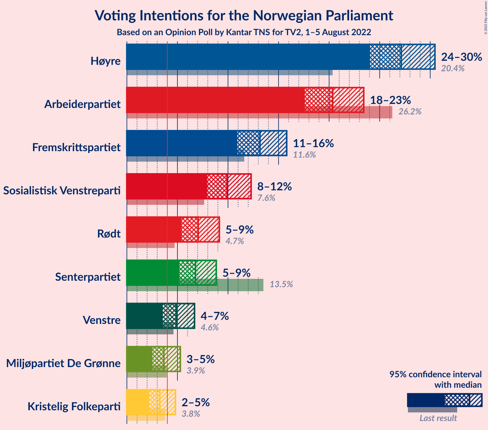

### Confidence Intervals

| Party | Last Result | Poll Result | 80% Confidence Interval | 90% Confidence Interval | 95% Confidence Interval | 99% Confidence Interval |
|:-----:|:-----------:|:-----------:|:-----------------------:|:-----------------------:|:-----------------------:|:-----------------------:|
| Høyre | 20.4% | 27.1% | 25.1–29.3% |24.5–29.9% |24.1–30.5% |23.1–31.5% |
| Arbeiderpartiet | 26.2% | 20.4% | 18.5–22.4% |18.0–22.9% |17.6–23.4% |16.8–24.4% |
| Fremskrittspartiet | 11.6% | 13.2% | 11.7–14.9% |11.3–15.4% |10.9–15.8% |10.2–16.7% |
| Sosialistisk Venstreparti | 7.6% | 9.9% | 8.6–11.5% |8.3–11.9% |7.9–12.3% |7.4–13.1% |
| Rødt | 4.7% | 7.1% | 6.0–8.4% |5.7–8.8% |5.4–9.1% |4.9–9.8% |
| Senterpartiet | 13.5% | 6.8% | 5.7–8.1% |5.4–8.5% |5.2–8.8% |4.7–9.5% |
| Venstre | 4.6% | 4.9% | 4.0–6.1% |3.7–6.4% |3.6–6.7% |3.2–7.3% |
| Miljøpartiet De Grønne | 3.9% | 3.7% | 2.9–4.7% |2.7–5.0% |2.5–5.3% |2.2–5.8% |
| Kristelig Folkeparti | 3.8% | 3.3% | 2.6–4.3% |2.4–4.6% |2.2–4.8% |1.9–5.3% |

*Note:* The poll result column reflects the actual value used in the calculations. Published results may vary slightly, and in addition be rounded to fewer digits.

## Seats

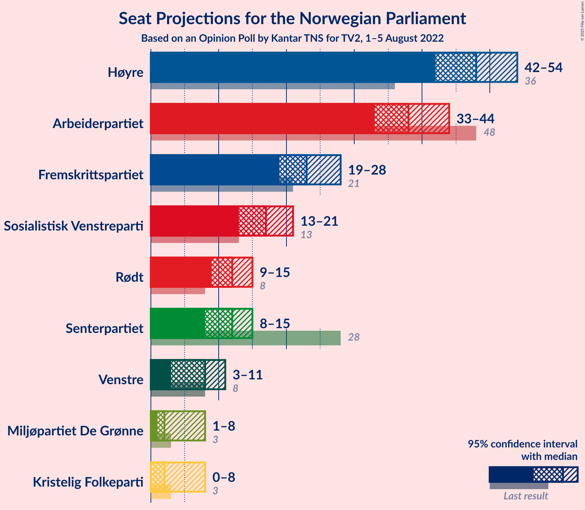

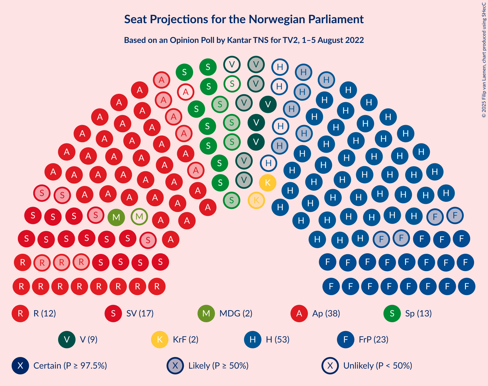

### Confidence Intervals

| Party | Last Result | Median | 80% Confidence Interval | 90% Confidence Interval | 95% Confidence Interval | 99% Confidence Interval |
|:-----:|:-----------:|:------:|:-----------------------:|:-----------------------:|:-----------------------:|:-----------------------:|
| <a href="#høyre">Høyre</a> | 36 | 48 | 44–52 |43–53 |42–54 |41–55 |
| <a href="#arbeiderpartiet">Arbeiderpartiet</a> | 48 | 38 | 35–43 |34–44 |33–44 |32–47 |
| <a href="#fremskrittspartiet">Fremskrittspartiet</a> | 21 | 23 | 20–26 |20–27 |19–28 |18–30 |
| <a href="#sosialistisk-venstreparti">Sosialistisk Venstreparti</a> | 13 | 17 | 15–20 |14–20 |13–21 |12–23 |
| <a href="#rødt">Rødt</a> | 8 | 12 | 10–14 |9–15 |9–15 |8–17 |
| <a href="#senterpartiet">Senterpartiet</a> | 28 | 12 | 10–14 |9–15 |8–15 |8–17 |
| <a href="#venstre">Venstre</a> | 8 | 8 | 7–10 |3–10 |3–11 |2–12 |
| <a href="#miljøpartiet-de-grønne">Miljøpartiet De Grønne</a> | 3 | 2 | 1–7 |1–8 |1–8 |1–10 |
| <a href="#kristelig-folkeparti">Kristelig Folkeparti</a> | 3 | 2 | 2–7 |1–7 |0–8 |0–9 |

### Høyre

*For a full overview of the results for this party, see the [Høyre](party-høyre.html) page.*

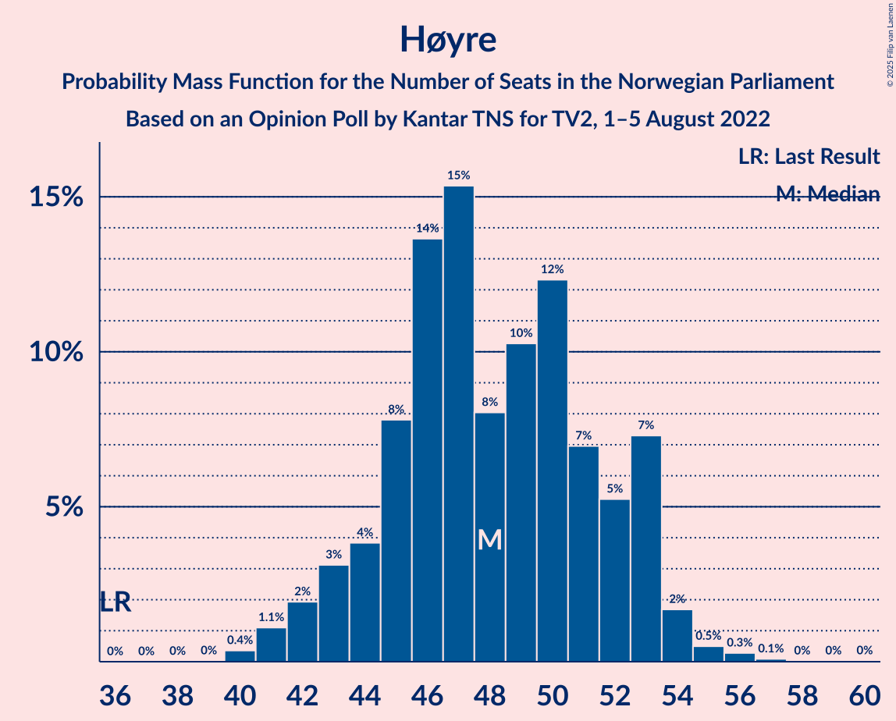

| Number of Seats | Probability | Accumulated | Special Marks |
|:---------------:|:-----------:|:-----------:|:-------------:|
| 36 | 0% | 100% | Last Result |
| 37 | 0% | 100% |  |
| 38 | 0% | 100% |  |
| 39 | 0% | 100% |  |
| 40 | 0.4% | 100% |  |
| 41 | 1.1% | 99.6% |  |
| 42 | 2% | 98% |  |
| 43 | 3% | 97% |  |
| 44 | 4% | 93% |  |
| 45 | 8% | 90% |  |
| 46 | 14% | 82% |  |
| 47 | 15% | 68% |  |
| 48 | 8% | 53% | Median |
| 49 | 10% | 45% |  |
| 50 | 12% | 34% |  |
| 51 | 7% | 22% |  |
| 52 | 5% | 15% |  |
| 53 | 7% | 10% |  |
| 54 | 2% | 3% |  |
| 55 | 0.5% | 1.0% |  |
| 56 | 0.3% | 0.5% |  |
| 57 | 0.1% | 0.2% |  |
| 58 | 0% | 0.1% |  |
| 59 | 0% | 0.1% |  |
| 60 | 0% | 0% |  |

### Arbeiderpartiet

*For a full overview of the results for this party, see the [Arbeiderpartiet](party-arbeiderpartiet.html) page.*

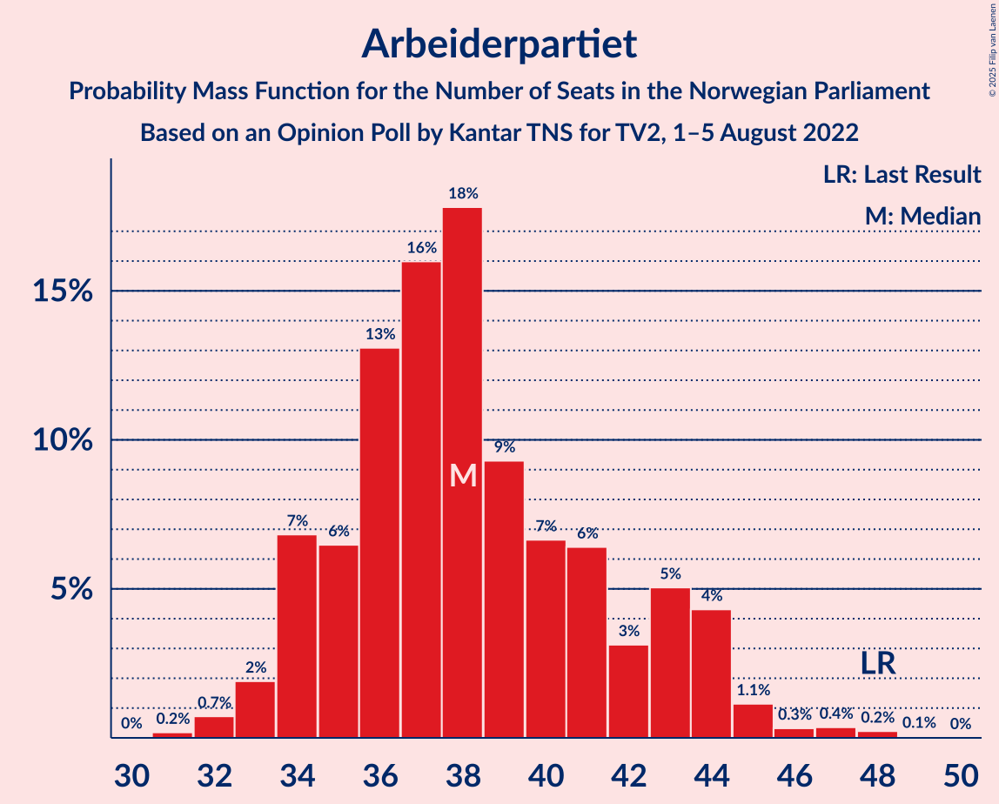

| Number of Seats | Probability | Accumulated | Special Marks |
|:---------------:|:-----------:|:-----------:|:-------------:|
| 31 | 0.2% | 100% |  |
| 32 | 0.7% | 99.8% |  |
| 33 | 2% | 99.1% |  |
| 34 | 7% | 97% |  |
| 35 | 6% | 90% |  |
| 36 | 13% | 84% |  |
| 37 | 16% | 71% |  |
| 38 | 18% | 55% | Median |
| 39 | 9% | 37% |  |
| 40 | 7% | 28% |  |
| 41 | 6% | 21% |  |
| 42 | 3% | 15% |  |
| 43 | 5% | 11% |  |
| 44 | 4% | 6% |  |
| 45 | 1.1% | 2% |  |
| 46 | 0.3% | 1.0% |  |
| 47 | 0.4% | 0.6% |  |
| 48 | 0.2% | 0.3% | Last Result |
| 49 | 0.1% | 0.1% |  |
| 50 | 0% | 0% |  |

### Fremskrittspartiet

*For a full overview of the results for this party, see the [Fremskrittspartiet](party-fremskrittspartiet.html) page.*

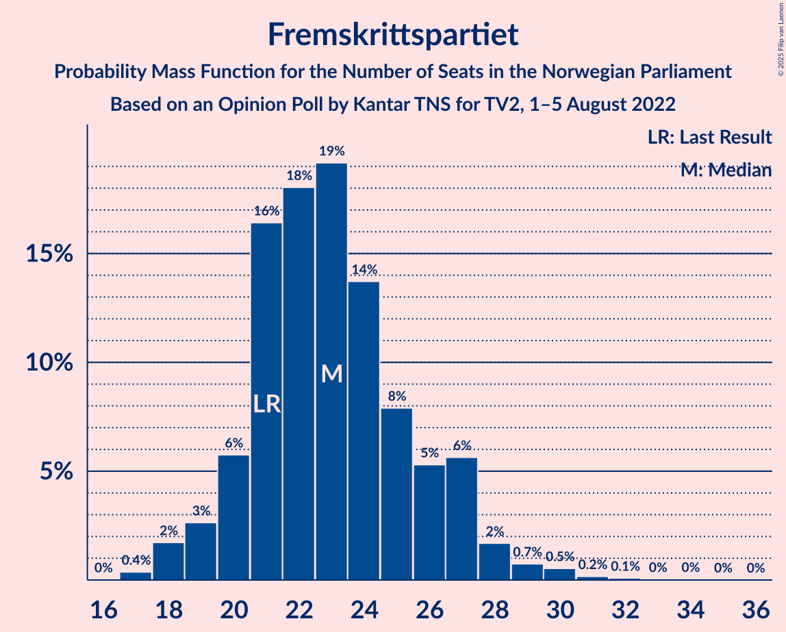

| Number of Seats | Probability | Accumulated | Special Marks |
|:---------------:|:-----------:|:-----------:|:-------------:|
| 17 | 0.4% | 100% |  |
| 18 | 2% | 99.6% |  |
| 19 | 3% | 98% |  |
| 20 | 6% | 95% |  |
| 21 | 16% | 89% | Last Result |
| 22 | 18% | 73% |  |
| 23 | 19% | 55% | Median |
| 24 | 14% | 36% |  |
| 25 | 8% | 22% |  |
| 26 | 5% | 14% |  |
| 27 | 6% | 9% |  |
| 28 | 2% | 3% |  |
| 29 | 0.7% | 2% |  |
| 30 | 0.5% | 0.9% |  |
| 31 | 0.2% | 0.3% |  |
| 32 | 0.1% | 0.2% |  |
| 33 | 0% | 0.1% |  |
| 34 | 0% | 0.1% |  |
| 35 | 0% | 0% |  |

### Sosialistisk Venstreparti

*For a full overview of the results for this party, see the [Sosialistisk Venstreparti](party-sosialistiskvenstreparti.html) page.*

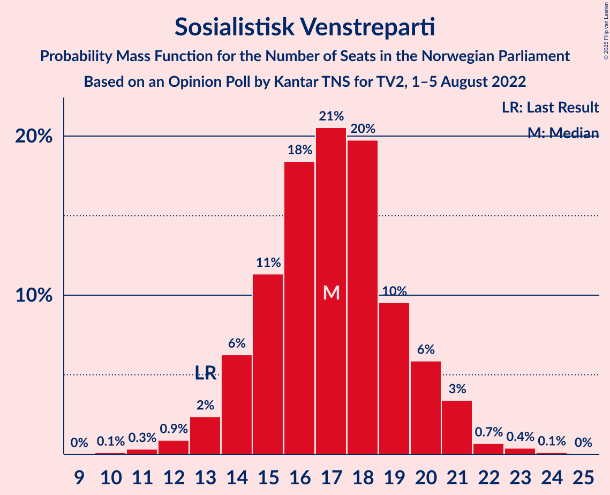

| Number of Seats | Probability | Accumulated | Special Marks |
|:---------------:|:-----------:|:-----------:|:-------------:|
| 10 | 0.1% | 100% |  |
| 11 | 0.3% | 99.9% |  |
| 12 | 0.9% | 99.6% |  |
| 13 | 2% | 98.7% | Last Result |
| 14 | 6% | 96% |  |
| 15 | 11% | 90% |  |
| 16 | 18% | 79% |  |
| 17 | 21% | 60% | Median |
| 18 | 20% | 40% |  |
| 19 | 10% | 20% |  |
| 20 | 6% | 10% |  |
| 21 | 3% | 5% |  |
| 22 | 0.7% | 1.2% |  |
| 23 | 0.4% | 0.5% |  |
| 24 | 0.1% | 0.1% |  |
| 25 | 0% | 0% |  |

### Rødt

*For a full overview of the results for this party, see the [Rødt](party-rødt.html) page.*

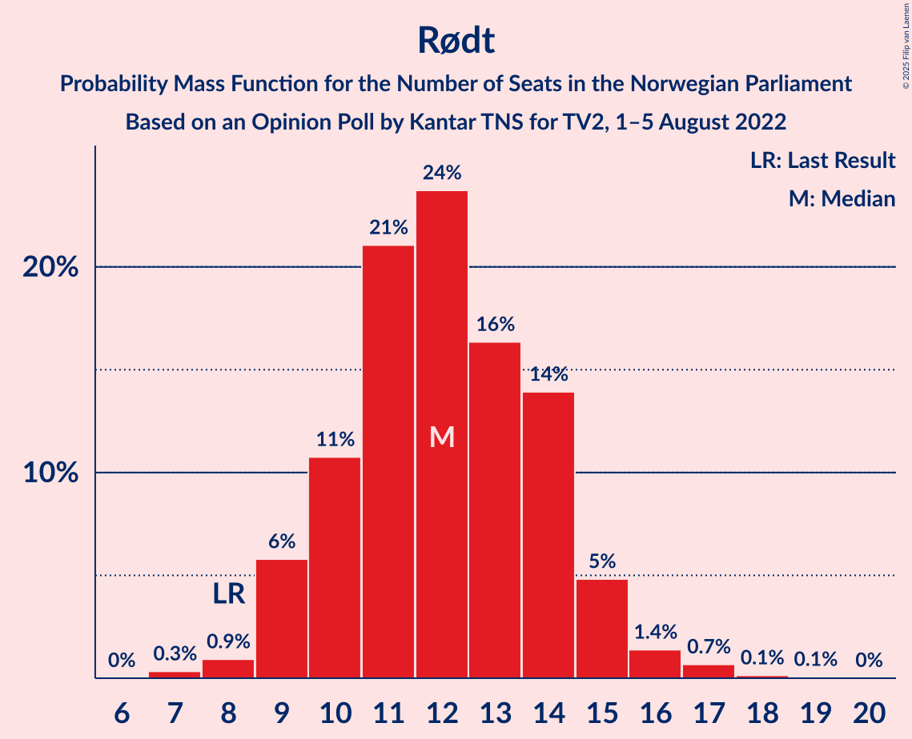

| Number of Seats | Probability | Accumulated | Special Marks |
|:---------------:|:-----------:|:-----------:|:-------------:|
| 7 | 0.3% | 100% |  |
| 8 | 0.9% | 99.6% | Last Result |
| 9 | 6% | 98.7% |  |
| 10 | 11% | 93% |  |
| 11 | 21% | 82% |  |
| 12 | 24% | 61% | Median |
| 13 | 16% | 37% |  |
| 14 | 14% | 21% |  |
| 15 | 5% | 7% |  |
| 16 | 1.4% | 2% |  |
| 17 | 0.7% | 0.9% |  |
| 18 | 0.1% | 0.2% |  |
| 19 | 0.1% | 0.1% |  |
| 20 | 0% | 0% |  |

### Senterpartiet

*For a full overview of the results for this party, see the [Senterpartiet](party-senterpartiet.html) page.*

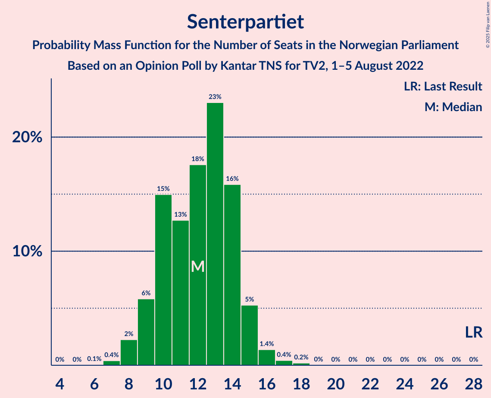

| Number of Seats | Probability | Accumulated | Special Marks |
|:---------------:|:-----------:|:-----------:|:-------------:|
| 6 | 0.1% | 100% |  |
| 7 | 0.4% | 99.9% |  |
| 8 | 2% | 99.5% |  |
| 9 | 6% | 97% |  |
| 10 | 15% | 91% |  |
| 11 | 13% | 76% |  |
| 12 | 18% | 64% | Median |
| 13 | 23% | 46% |  |
| 14 | 16% | 23% |  |
| 15 | 5% | 7% |  |
| 16 | 1.4% | 2% |  |
| 17 | 0.4% | 0.7% |  |
| 18 | 0.2% | 0.2% |  |
| 19 | 0% | 0% |  |
| 20 | 0% | 0% |  |
| 21 | 0% | 0% |  |
| 22 | 0% | 0% |  |
| 23 | 0% | 0% |  |
| 24 | 0% | 0% |  |
| 25 | 0% | 0% |  |
| 26 | 0% | 0% |  |
| 27 | 0% | 0% |  |
| 28 | 0% | 0% | Last Result |

### Venstre

*For a full overview of the results for this party, see the [Venstre](party-venstre.html) page.*

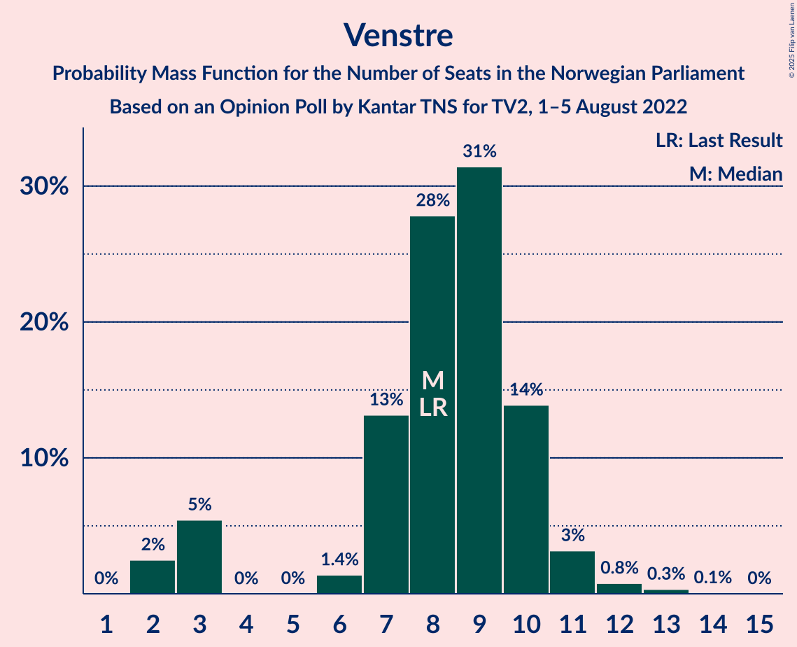

| Number of Seats | Probability | Accumulated | Special Marks |
|:---------------:|:-----------:|:-----------:|:-------------:|
| 2 | 2% | 100% |  |
| 3 | 5% | 98% |  |
| 4 | 0% | 92% |  |
| 5 | 0% | 92% |  |
| 6 | 1.4% | 92% |  |
| 7 | 13% | 91% |  |
| 8 | 28% | 78% | Last Result, Median |
| 9 | 31% | 50% |  |
| 10 | 14% | 18% |  |
| 11 | 3% | 4% |  |
| 12 | 0.8% | 1.2% |  |
| 13 | 0.3% | 0.4% |  |
| 14 | 0.1% | 0.1% |  |
| 15 | 0% | 0% |  |

### Miljøpartiet De Grønne

*For a full overview of the results for this party, see the [Miljøpartiet De Grønne](party-miljøpartietdegrønne.html) page.*

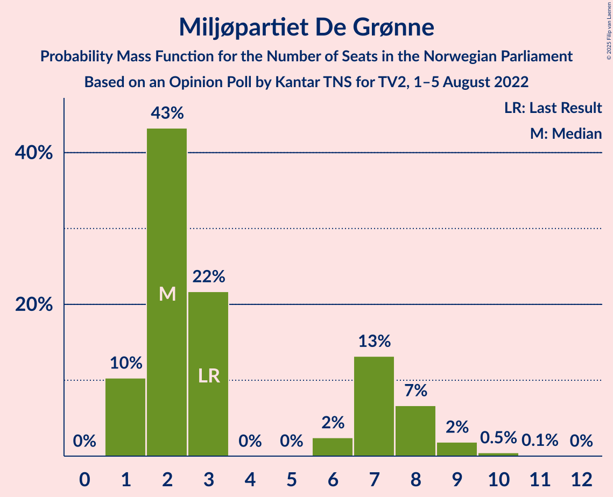

| Number of Seats | Probability | Accumulated | Special Marks |
|:---------------:|:-----------:|:-----------:|:-------------:|
| 1 | 10% | 100% |  |
| 2 | 43% | 90% | Median |
| 3 | 22% | 46% | Last Result |
| 4 | 0% | 25% |  |
| 5 | 0% | 25% |  |
| 6 | 2% | 25% |  |
| 7 | 13% | 22% |  |
| 8 | 7% | 9% |  |
| 9 | 2% | 2% |  |
| 10 | 0.5% | 0.6% |  |
| 11 | 0.1% | 0.1% |  |
| 12 | 0% | 0% |  |

### Kristelig Folkeparti

*For a full overview of the results for this party, see the [Kristelig Folkeparti](party-kristeligfolkeparti.html) page.*

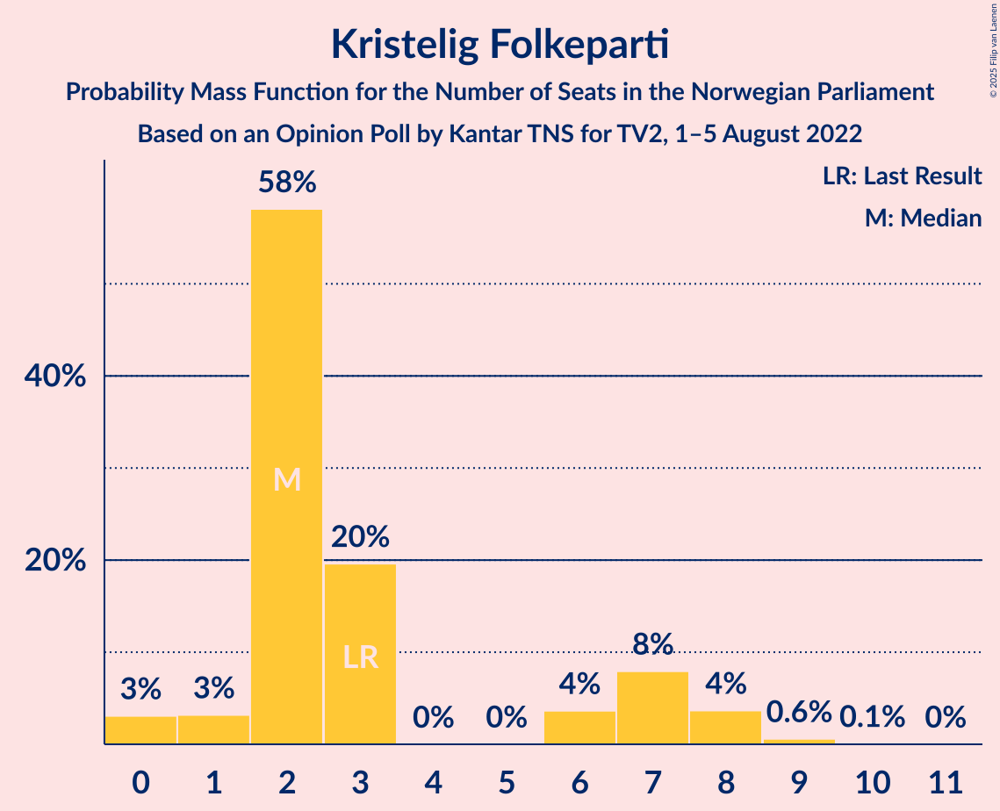

| Number of Seats | Probability | Accumulated | Special Marks |
|:---------------:|:-----------:|:-----------:|:-------------:|
| 0 | 3% | 100% |  |
| 1 | 3% | 97% |  |
| 2 | 58% | 94% | Median |
| 3 | 20% | 36% | Last Result |
| 4 | 0% | 16% |  |
| 5 | 0% | 16% |  |
| 6 | 4% | 16% |  |
| 7 | 8% | 12% |  |
| 8 | 4% | 4% |  |
| 9 | 0.6% | 0.7% |  |
| 10 | 0.1% | 0.1% |  |
| 11 | 0% | 0% |  |

## Coalitions

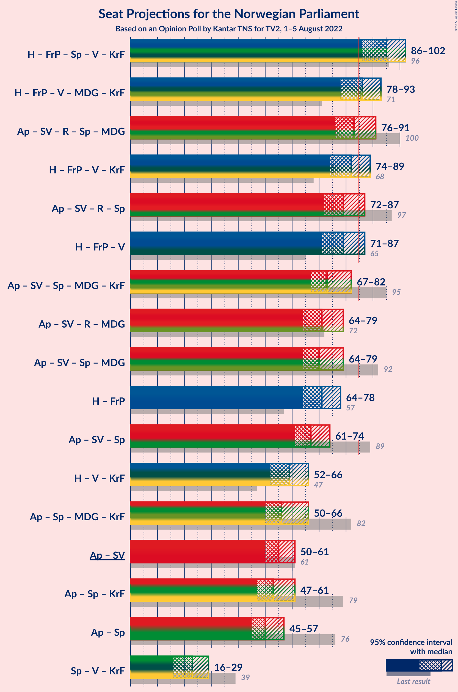

### Confidence Intervals

| Coalition | Last Result | Median | Majority? | 80% Confidence Interval | 90% Confidence Interval | 95% Confidence Interval | 99% Confidence Interval |
|:---------:|:-----------:|:------:|:---------:|:-----------------------:|:-----------------------:|:-----------------------:|:-----------------------:|
| Høyre – Fremskrittspartiet – Senterpartiet – Venstre – Kristelig Folkeparti | 96 | 95 | 98.6% | 89–100 | 87–101 | 86–102 | 83–104 |
| Høyre – Fremskrittspartiet – Venstre – Miljøpartiet De Grønne – Kristelig Folkeparti | 71 | 86 | 62% | 81–91 | 79–92 | 78–93 | 75–96 |
| Arbeiderpartiet – Sosialistisk Venstreparti – Rødt – Senterpartiet – Miljøpartiet De Grønne | 100 | 83 | 29% | 79–88 | 77–89 | 76–91 | 72–94 |
| Høyre – Fremskrittspartiet – Venstre – Kristelig Folkeparti | 68 | 82 | 30% | 77–88 | 75–89 | 74–89 | 71–92 |
| Arbeiderpartiet – Sosialistisk Venstreparti – Rødt – Senterpartiet | 97 | 79 | 8% | 75–84 | 73–86 | 72–87 | 69–89 |
| Høyre – Fremskrittspartiet – Venstre | 65 | 79 | 10% | 74–84 | 73–87 | 71–87 | 68–89 |
| Arbeiderpartiet – Sosialistisk Venstreparti – Senterpartiet – Miljøpartiet De Grønne – Kristelig Folkeparti | 95 | 73 | 0.3% | 69–79 | 68–81 | 67–82 | 64–84 |
| Arbeiderpartiet – Sosialistisk Venstreparti – Rødt – Miljøpartiet De Grønne | 72 | 71 | 0% | 66–76 | 65–78 | 64–79 | 61–82 |
| Arbeiderpartiet – Sosialistisk Venstreparti – Senterpartiet – Miljøpartiet De Grønne | 92 | 70 | 0% | 67–76 | 66–77 | 64–79 | 61–82 |
| Høyre – Fremskrittspartiet | 57 | 71 | 0% | 67–76 | 66–77 | 64–78 | 62–80 |
| Arbeiderpartiet – Sosialistisk Venstreparti – Senterpartiet | 89 | 67 | 0% | 64–72 | 62–73 | 61–74 | 58–76 |
| Høyre – Venstre – Kristelig Folkeparti | 47 | 59 | 0% | 55–64 | 53–65 | 52–66 | 49–68 |
| Arbeiderpartiet – Senterpartiet – Miljøpartiet De Grønne – Kristelig Folkeparti | 82 | 56 | 0% | 51–62 | 51–65 | 50–66 | 48–68 |
| Arbeiderpartiet – Sosialistisk Venstreparti | 61 | 55 | 0% | 51–59 | 51–61 | 50–61 | 48–64 |
| Arbeiderpartiet – Senterpartiet – Kristelig Folkeparti | 79 | 53 | 0% | 49–58 | 48–59 | 47–61 | 45–64 |
| Arbeiderpartiet – Senterpartiet | 76 | 50 | 0% | 47–54 | 46–56 | 45–57 | 43–58 |
| Senterpartiet – Venstre – Kristelig Folkeparti | 39 | 23 | 0% | 20–27 | 18–29 | 16–29 | 15–31 |

### Høyre – Fremskrittspartiet – Senterpartiet – Venstre – Kristelig Folkeparti

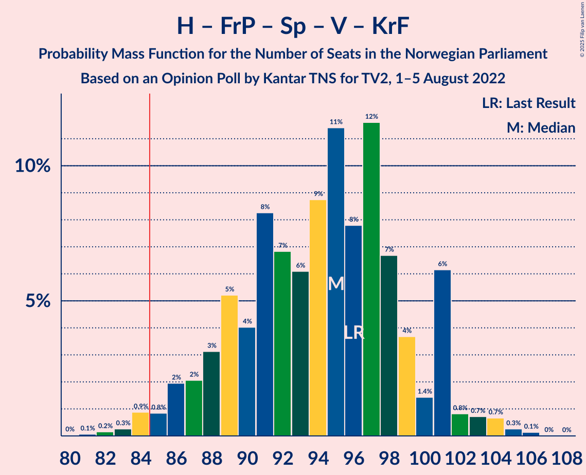

| Number of Seats | Probability | Accumulated | Special Marks |
|:---------------:|:-----------:|:-----------:|:-------------:|
| 80 | 0% | 100% |  |
| 81 | 0.1% | 99.9% |  |
| 82 | 0.2% | 99.9% |  |
| 83 | 0.3% | 99.7% |  |
| 84 | 0.9% | 99.4% |  |
| 85 | 0.8% | 98.6% | Majority |
| 86 | 2% | 98% |  |
| 87 | 2% | 96% |  |
| 88 | 3% | 94% |  |
| 89 | 5% | 91% |  |
| 90 | 4% | 85% |  |
| 91 | 8% | 81% |  |
| 92 | 7% | 73% |  |
| 93 | 6% | 66% | Median |
| 94 | 9% | 60% |  |
| 95 | 11% | 51% |  |
| 96 | 8% | 40% | Last Result |
| 97 | 12% | 32% |  |
| 98 | 7% | 21% |  |
| 99 | 4% | 14% |  |
| 100 | 1.4% | 10% |  |
| 101 | 6% | 9% |  |
| 102 | 0.8% | 3% |  |
| 103 | 0.7% | 2% |  |
| 104 | 0.7% | 1.1% |  |
| 105 | 0.3% | 0.4% |  |
| 106 | 0.1% | 0.2% |  |
| 107 | 0% | 0% |  |

### Høyre – Fremskrittspartiet – Venstre – Miljøpartiet De Grønne – Kristelig Folkeparti

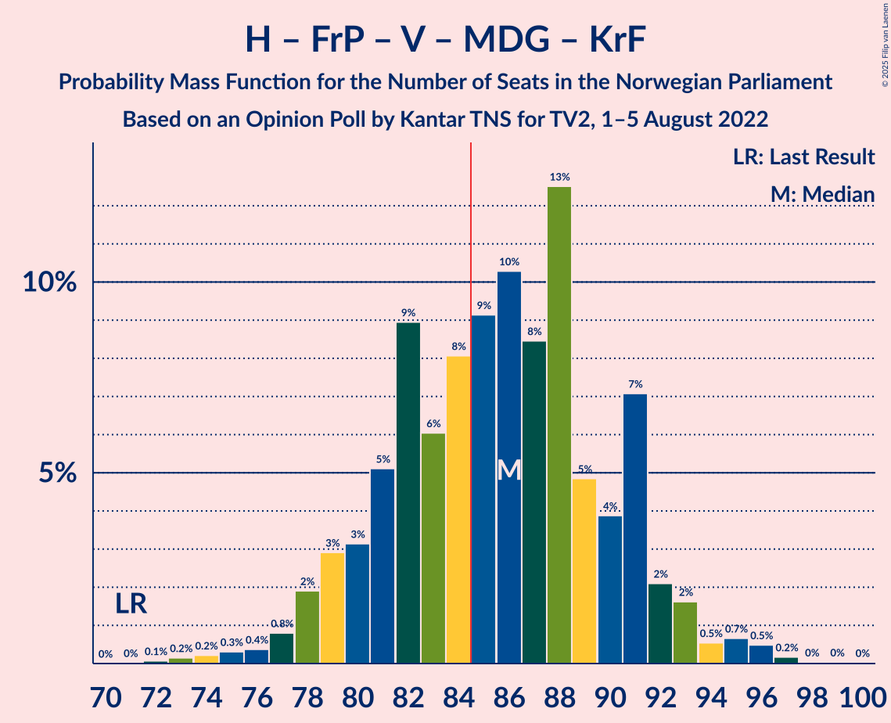

| Number of Seats | Probability | Accumulated | Special Marks |
|:---------------:|:-----------:|:-----------:|:-------------:|
| 71 | 0% | 100% | Last Result |
| 72 | 0.1% | 100% |  |
| 73 | 0.2% | 99.9% |  |
| 74 | 0.2% | 99.8% |  |
| 75 | 0.3% | 99.5% |  |
| 76 | 0.4% | 99.2% |  |
| 77 | 0.8% | 98.8% |  |
| 78 | 2% | 98% |  |
| 79 | 3% | 96% |  |
| 80 | 3% | 93% |  |
| 81 | 5% | 90% |  |
| 82 | 9% | 85% |  |
| 83 | 6% | 76% | Median |
| 84 | 8% | 70% |  |
| 85 | 9% | 62% | Majority |
| 86 | 10% | 53% |  |
| 87 | 8% | 42% |  |
| 88 | 13% | 34% |  |
| 89 | 5% | 22% |  |
| 90 | 4% | 17% |  |
| 91 | 7% | 13% |  |
| 92 | 2% | 6% |  |
| 93 | 2% | 4% |  |
| 94 | 0.5% | 2% |  |
| 95 | 0.7% | 1.4% |  |
| 96 | 0.5% | 0.8% |  |
| 97 | 0.2% | 0.3% |  |
| 98 | 0% | 0.1% |  |
| 99 | 0% | 0.1% |  |
| 100 | 0% | 0% |  |

### Arbeiderpartiet – Sosialistisk Venstreparti – Rødt – Senterpartiet – Miljøpartiet De Grønne

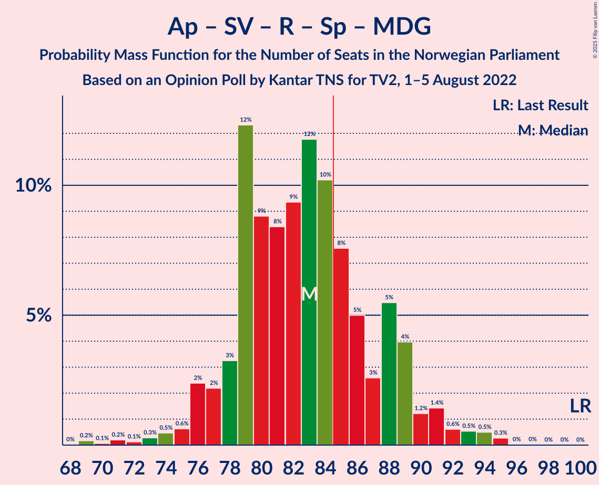

| Number of Seats | Probability | Accumulated | Special Marks |
|:---------------:|:-----------:|:-----------:|:-------------:|
| 69 | 0.2% | 100% |  |
| 70 | 0.1% | 99.8% |  |
| 71 | 0.2% | 99.7% |  |
| 72 | 0.1% | 99.5% |  |
| 73 | 0.3% | 99.4% |  |
| 74 | 0.5% | 99.1% |  |
| 75 | 0.6% | 98.6% |  |
| 76 | 2% | 98% |  |
| 77 | 2% | 96% |  |
| 78 | 3% | 93% |  |
| 79 | 12% | 90% |  |
| 80 | 9% | 78% |  |
| 81 | 8% | 69% | Median |
| 82 | 9% | 61% |  |
| 83 | 12% | 51% |  |
| 84 | 10% | 39% |  |
| 85 | 8% | 29% | Majority |
| 86 | 5% | 22% |  |
| 87 | 3% | 17% |  |
| 88 | 5% | 14% |  |
| 89 | 4% | 9% |  |
| 90 | 1.2% | 5% |  |
| 91 | 1.4% | 3% |  |
| 92 | 0.6% | 2% |  |
| 93 | 0.5% | 1.4% |  |
| 94 | 0.5% | 0.8% |  |
| 95 | 0.3% | 0.3% |  |
| 96 | 0% | 0.1% |  |
| 97 | 0% | 0% |  |
| 98 | 0% | 0% |  |
| 99 | 0% | 0% |  |
| 100 | 0% | 0% | Last Result |

### Høyre – Fremskrittspartiet – Venstre – Kristelig Folkeparti

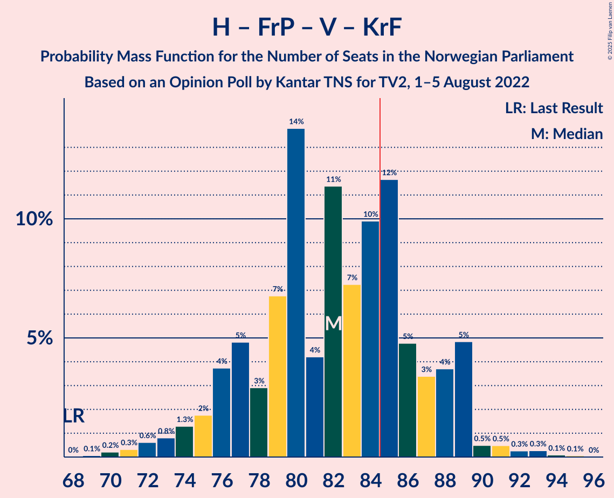

| Number of Seats | Probability | Accumulated | Special Marks |
|:---------------:|:-----------:|:-----------:|:-------------:|
| 68 | 0% | 100% | Last Result |
| 69 | 0.1% | 100% |  |
| 70 | 0.2% | 99.9% |  |
| 71 | 0.3% | 99.7% |  |
| 72 | 0.6% | 99.4% |  |
| 73 | 0.8% | 98.7% |  |
| 74 | 1.3% | 98% |  |
| 75 | 2% | 97% |  |
| 76 | 4% | 95% |  |
| 77 | 5% | 91% |  |
| 78 | 3% | 86% |  |
| 79 | 7% | 83% |  |
| 80 | 14% | 77% |  |
| 81 | 4% | 63% | Median |
| 82 | 11% | 59% |  |
| 83 | 7% | 47% |  |
| 84 | 10% | 40% |  |
| 85 | 12% | 30% | Majority |
| 86 | 5% | 18% |  |
| 87 | 3% | 14% |  |
| 88 | 4% | 10% |  |
| 89 | 5% | 7% |  |
| 90 | 0.5% | 2% |  |
| 91 | 0.5% | 1.2% |  |
| 92 | 0.3% | 0.7% |  |
| 93 | 0.3% | 0.5% |  |
| 94 | 0.1% | 0.2% |  |
| 95 | 0.1% | 0.1% |  |
| 96 | 0% | 0% |  |

### Arbeiderpartiet – Sosialistisk Venstreparti – Rødt – Senterpartiet

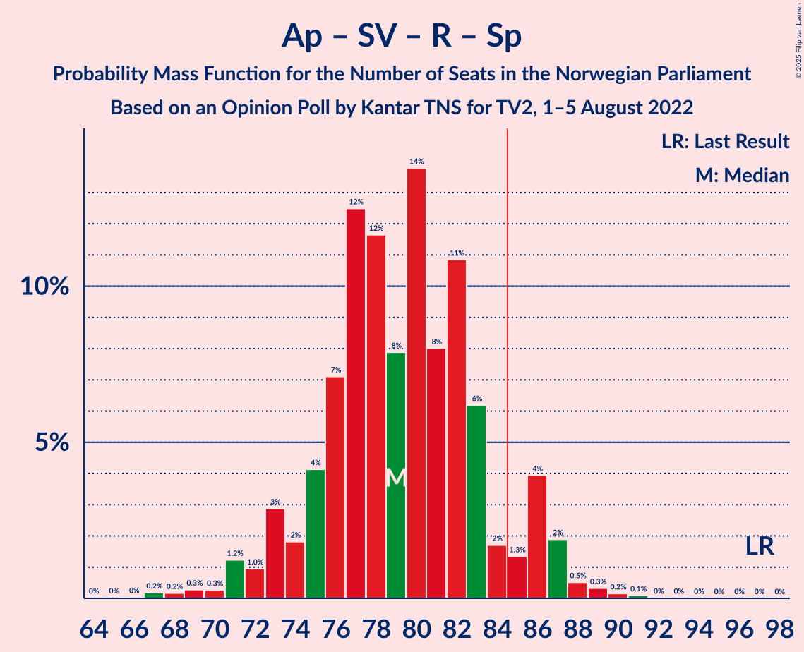

| Number of Seats | Probability | Accumulated | Special Marks |
|:---------------:|:-----------:|:-----------:|:-------------:|
| 65 | 0% | 100% |  |
| 66 | 0% | 99.9% |  |
| 67 | 0.2% | 99.9% |  |
| 68 | 0.2% | 99.7% |  |
| 69 | 0.3% | 99.5% |  |
| 70 | 0.3% | 99.3% |  |
| 71 | 1.2% | 99.0% |  |
| 72 | 1.0% | 98% |  |
| 73 | 3% | 97% |  |
| 74 | 2% | 94% |  |
| 75 | 4% | 92% |  |
| 76 | 7% | 88% |  |
| 77 | 12% | 81% |  |
| 78 | 12% | 68% |  |
| 79 | 8% | 57% | Median |
| 80 | 14% | 49% |  |
| 81 | 8% | 35% |  |
| 82 | 11% | 27% |  |
| 83 | 6% | 16% |  |
| 84 | 2% | 10% |  |
| 85 | 1.3% | 8% | Majority |
| 86 | 4% | 7% |  |
| 87 | 2% | 3% |  |
| 88 | 0.5% | 1.1% |  |
| 89 | 0.3% | 0.6% |  |
| 90 | 0.2% | 0.3% |  |
| 91 | 0.1% | 0.1% |  |
| 92 | 0% | 0% |  |
| 93 | 0% | 0% |  |
| 94 | 0% | 0% |  |
| 95 | 0% | 0% |  |
| 96 | 0% | 0% |  |
| 97 | 0% | 0% | Last Result |

### Høyre – Fremskrittspartiet – Venstre

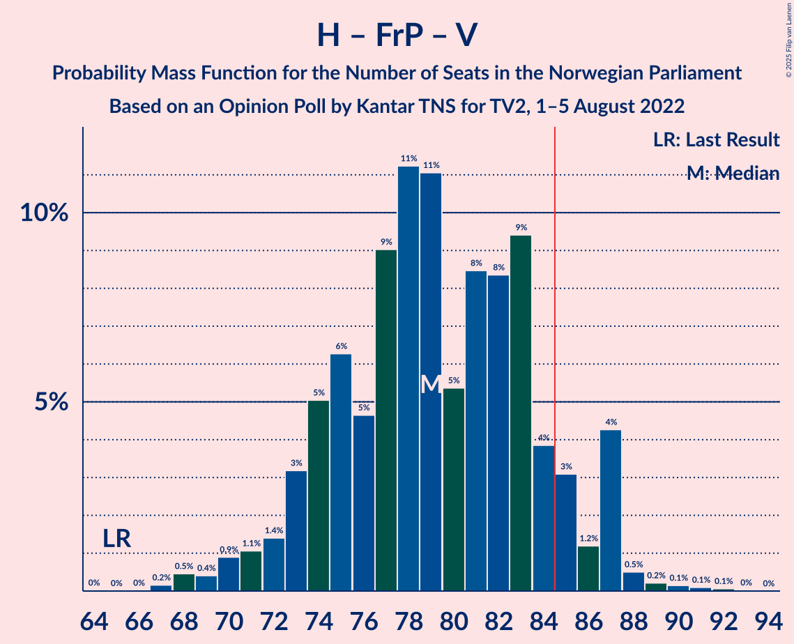

| Number of Seats | Probability | Accumulated | Special Marks |
|:---------------:|:-----------:|:-----------:|:-------------:|
| 65 | 0% | 100% | Last Result |
| 66 | 0% | 100% |  |
| 67 | 0.2% | 99.9% |  |
| 68 | 0.5% | 99.8% |  |
| 69 | 0.4% | 99.3% |  |
| 70 | 0.9% | 98.9% |  |
| 71 | 1.1% | 98% |  |
| 72 | 1.4% | 97% |  |
| 73 | 3% | 96% |  |
| 74 | 5% | 92% |  |
| 75 | 6% | 87% |  |
| 76 | 5% | 81% |  |
| 77 | 9% | 76% |  |
| 78 | 11% | 67% |  |
| 79 | 11% | 56% | Median |
| 80 | 5% | 45% |  |
| 81 | 8% | 40% |  |
| 82 | 8% | 31% |  |
| 83 | 9% | 23% |  |
| 84 | 4% | 13% |  |
| 85 | 3% | 10% | Majority |
| 86 | 1.2% | 7% |  |
| 87 | 4% | 5% |  |
| 88 | 0.5% | 1.1% |  |
| 89 | 0.2% | 0.6% |  |
| 90 | 0.1% | 0.3% |  |
| 91 | 0.1% | 0.2% |  |
| 92 | 0.1% | 0.1% |  |
| 93 | 0% | 0% |  |

### Arbeiderpartiet – Sosialistisk Venstreparti – Senterpartiet – Miljøpartiet De Grønne – Kristelig Folkeparti

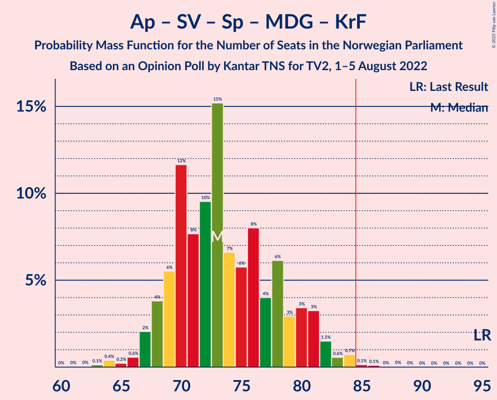

| Number of Seats | Probability | Accumulated | Special Marks |
|:---------------:|:-----------:|:-----------:|:-------------:|
| 61 | 0% | 100% |  |
| 62 | 0% | 99.9% |  |
| 63 | 0.1% | 99.9% |  |
| 64 | 0.4% | 99.8% |  |
| 65 | 0.2% | 99.4% |  |
| 66 | 0.6% | 99.2% |  |
| 67 | 2% | 98.6% |  |
| 68 | 4% | 97% |  |
| 69 | 6% | 93% |  |
| 70 | 12% | 87% |  |
| 71 | 8% | 76% | Median |
| 72 | 10% | 68% |  |
| 73 | 15% | 58% |  |
| 74 | 7% | 43% |  |
| 75 | 6% | 37% |  |
| 76 | 8% | 31% |  |
| 77 | 4% | 23% |  |
| 78 | 6% | 19% |  |
| 79 | 3% | 13% |  |
| 80 | 3% | 10% |  |
| 81 | 3% | 6% |  |
| 82 | 1.5% | 3% |  |
| 83 | 0.6% | 2% |  |
| 84 | 0.7% | 1.0% |  |
| 85 | 0.1% | 0.3% | Majority |
| 86 | 0.1% | 0.2% |  |
| 87 | 0% | 0.1% |  |
| 88 | 0% | 0.1% |  |
| 89 | 0% | 0% |  |
| 90 | 0% | 0% |  |
| 91 | 0% | 0% |  |
| 92 | 0% | 0% |  |
| 93 | 0% | 0% |  |
| 94 | 0% | 0% |  |
| 95 | 0% | 0% | Last Result |

### Arbeiderpartiet – Sosialistisk Venstreparti – Rødt – Miljøpartiet De Grønne

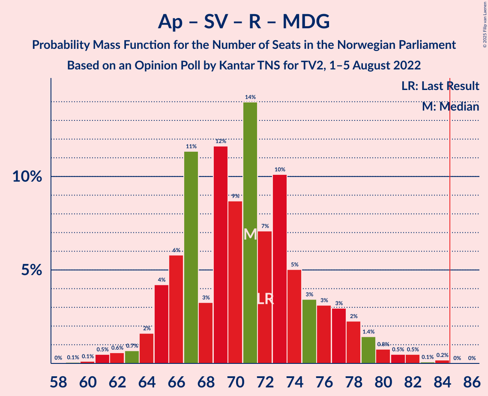

| Number of Seats | Probability | Accumulated | Special Marks |
|:---------------:|:-----------:|:-----------:|:-------------:|
| 58 | 0% | 100% |  |
| 59 | 0.1% | 99.9% |  |
| 60 | 0.1% | 99.9% |  |
| 61 | 0.5% | 99.8% |  |
| 62 | 0.6% | 99.3% |  |
| 63 | 0.7% | 98.7% |  |
| 64 | 2% | 98% |  |
| 65 | 4% | 96% |  |
| 66 | 6% | 92% |  |
| 67 | 11% | 86% |  |
| 68 | 3% | 75% |  |
| 69 | 12% | 72% | Median |
| 70 | 9% | 60% |  |
| 71 | 14% | 51% |  |
| 72 | 7% | 37% | Last Result |
| 73 | 10% | 30% |  |
| 74 | 5% | 20% |  |
| 75 | 3% | 15% |  |
| 76 | 3% | 12% |  |
| 77 | 3% | 9% |  |
| 78 | 2% | 6% |  |
| 79 | 1.4% | 3% |  |
| 80 | 0.8% | 2% |  |
| 81 | 0.5% | 1.3% |  |
| 82 | 0.5% | 0.8% |  |
| 83 | 0.1% | 0.3% |  |
| 84 | 0.2% | 0.2% |  |
| 85 | 0% | 0% | Majority |

### Arbeiderpartiet – Sosialistisk Venstreparti – Senterpartiet – Miljøpartiet De Grønne

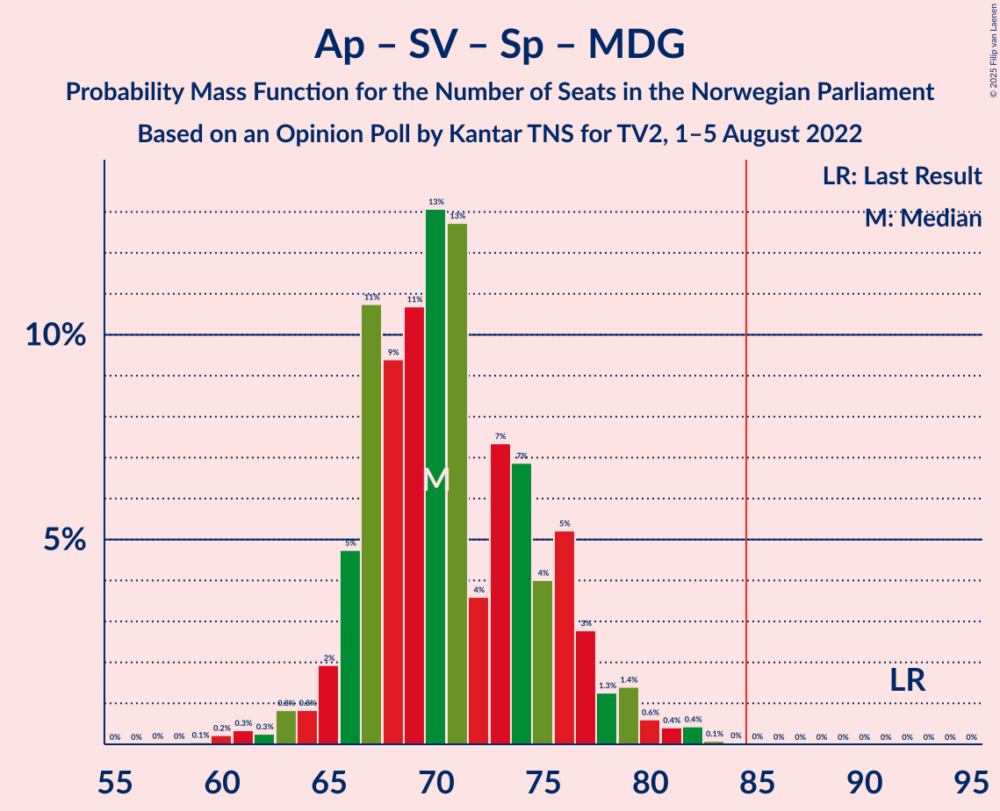

| Number of Seats | Probability | Accumulated | Special Marks |
|:---------------:|:-----------:|:-----------:|:-------------:|
| 58 | 0% | 100% |  |
| 59 | 0.1% | 99.9% |  |
| 60 | 0.2% | 99.9% |  |
| 61 | 0.3% | 99.7% |  |
| 62 | 0.3% | 99.3% |  |
| 63 | 0.8% | 99.1% |  |
| 64 | 0.8% | 98% |  |
| 65 | 2% | 97% |  |
| 66 | 5% | 95% |  |
| 67 | 11% | 91% |  |
| 68 | 9% | 80% |  |
| 69 | 11% | 71% | Median |
| 70 | 13% | 60% |  |
| 71 | 13% | 47% |  |
| 72 | 4% | 34% |  |
| 73 | 7% | 30% |  |
| 74 | 7% | 23% |  |
| 75 | 4% | 16% |  |
| 76 | 5% | 12% |  |
| 77 | 3% | 7% |  |
| 78 | 1.3% | 4% |  |
| 79 | 1.4% | 3% |  |
| 80 | 0.6% | 2% |  |
| 81 | 0.4% | 1.0% |  |
| 82 | 0.4% | 0.6% |  |
| 83 | 0.1% | 0.1% |  |
| 84 | 0% | 0.1% |  |
| 85 | 0% | 0% | Majority |
| 86 | 0% | 0% |  |
| 87 | 0% | 0% |  |
| 88 | 0% | 0% |  |
| 89 | 0% | 0% |  |
| 90 | 0% | 0% |  |
| 91 | 0% | 0% |  |
| 92 | 0% | 0% | Last Result |

### Høyre – Fremskrittspartiet

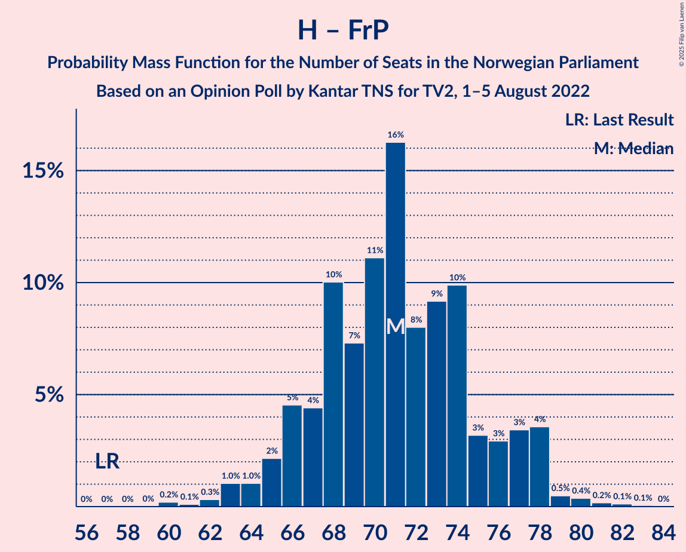

| Number of Seats | Probability | Accumulated | Special Marks |
|:---------------:|:-----------:|:-----------:|:-------------:|
| 57 | 0% | 100% | Last Result |
| 58 | 0% | 100% |  |
| 59 | 0% | 100% |  |
| 60 | 0.2% | 100% |  |
| 61 | 0.1% | 99.8% |  |
| 62 | 0.3% | 99.7% |  |
| 63 | 1.0% | 99.3% |  |
| 64 | 1.0% | 98% |  |
| 65 | 2% | 97% |  |
| 66 | 5% | 95% |  |
| 67 | 4% | 91% |  |
| 68 | 10% | 86% |  |
| 69 | 7% | 76% |  |
| 70 | 11% | 69% |  |
| 71 | 16% | 58% | Median |
| 72 | 8% | 41% |  |
| 73 | 9% | 33% |  |
| 74 | 10% | 24% |  |
| 75 | 3% | 14% |  |
| 76 | 3% | 11% |  |
| 77 | 3% | 8% |  |
| 78 | 4% | 5% |  |
| 79 | 0.5% | 1.2% |  |
| 80 | 0.4% | 0.8% |  |
| 81 | 0.2% | 0.4% |  |
| 82 | 0.1% | 0.2% |  |
| 83 | 0.1% | 0.1% |  |
| 84 | 0% | 0% |  |

### Arbeiderpartiet – Sosialistisk Venstreparti – Senterpartiet

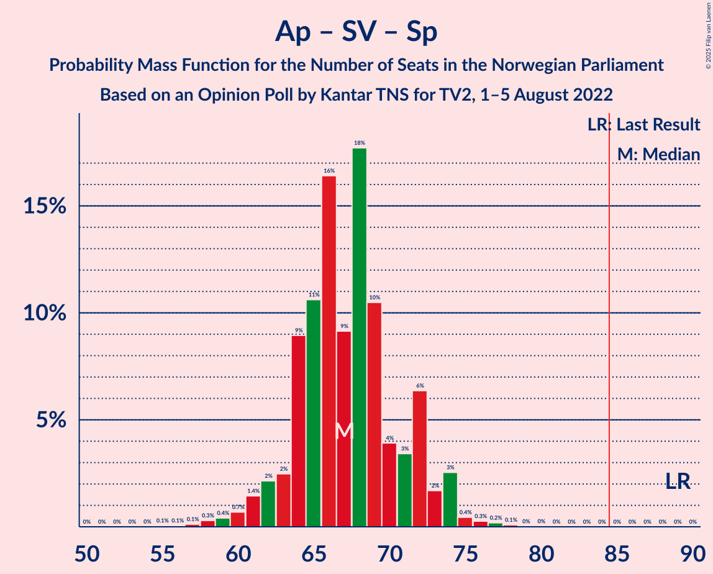

| Number of Seats | Probability | Accumulated | Special Marks |
|:---------------:|:-----------:|:-----------:|:-------------:|
| 55 | 0.1% | 100% |  |
| 56 | 0.1% | 99.9% |  |
| 57 | 0.1% | 99.9% |  |
| 58 | 0.3% | 99.7% |  |
| 59 | 0.4% | 99.5% |  |
| 60 | 0.7% | 99.0% |  |
| 61 | 1.4% | 98% |  |
| 62 | 2% | 97% |  |
| 63 | 2% | 95% |  |
| 64 | 9% | 92% |  |
| 65 | 11% | 83% |  |
| 66 | 16% | 73% |  |
| 67 | 9% | 56% | Median |
| 68 | 18% | 47% |  |
| 69 | 10% | 29% |  |
| 70 | 4% | 19% |  |
| 71 | 3% | 15% |  |
| 72 | 6% | 12% |  |
| 73 | 2% | 5% |  |
| 74 | 3% | 4% |  |
| 75 | 0.4% | 1.0% |  |
| 76 | 0.3% | 0.6% |  |
| 77 | 0.2% | 0.3% |  |
| 78 | 0.1% | 0.1% |  |
| 79 | 0% | 0% |  |
| 80 | 0% | 0% |  |
| 81 | 0% | 0% |  |
| 82 | 0% | 0% |  |
| 83 | 0% | 0% |  |
| 84 | 0% | 0% |  |
| 85 | 0% | 0% | Majority |
| 86 | 0% | 0% |  |
| 87 | 0% | 0% |  |
| 88 | 0% | 0% |  |
| 89 | 0% | 0% | Last Result |

### Høyre – Venstre – Kristelig Folkeparti

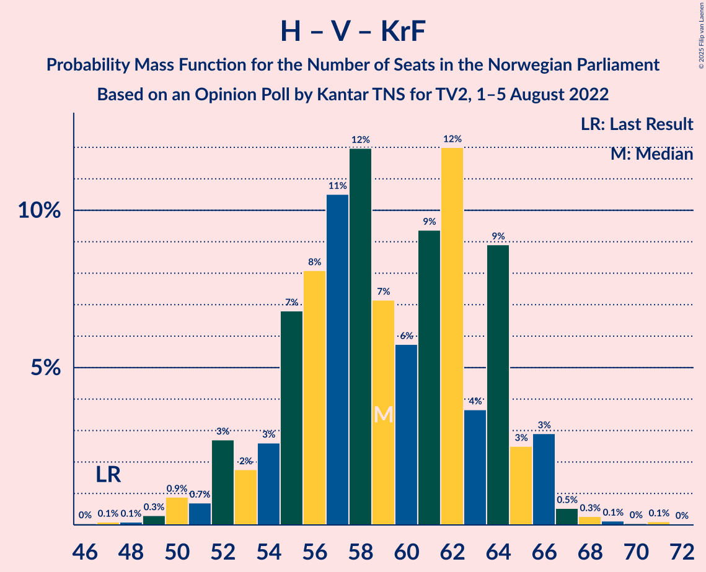

| Number of Seats | Probability | Accumulated | Special Marks |
|:---------------:|:-----------:|:-----------:|:-------------:|
| 46 | 0% | 100% |  |
| 47 | 0.1% | 99.9% | Last Result |
| 48 | 0.1% | 99.8% |  |
| 49 | 0.3% | 99.7% |  |
| 50 | 0.9% | 99.4% |  |
| 51 | 0.7% | 98.6% |  |
| 52 | 3% | 98% |  |
| 53 | 2% | 95% |  |
| 54 | 3% | 93% |  |
| 55 | 7% | 91% |  |
| 56 | 8% | 84% |  |
| 57 | 11% | 76% |  |
| 58 | 12% | 65% | Median |
| 59 | 7% | 53% |  |
| 60 | 6% | 46% |  |
| 61 | 9% | 40% |  |
| 62 | 12% | 31% |  |
| 63 | 4% | 19% |  |
| 64 | 9% | 15% |  |
| 65 | 3% | 7% |  |
| 66 | 3% | 4% |  |
| 67 | 0.5% | 1.1% |  |
| 68 | 0.3% | 0.6% |  |
| 69 | 0.1% | 0.3% |  |
| 70 | 0% | 0.2% |  |
| 71 | 0.1% | 0.1% |  |
| 72 | 0% | 0% |  |

### Arbeiderpartiet – Senterpartiet – Miljøpartiet De Grønne – Kristelig Folkeparti

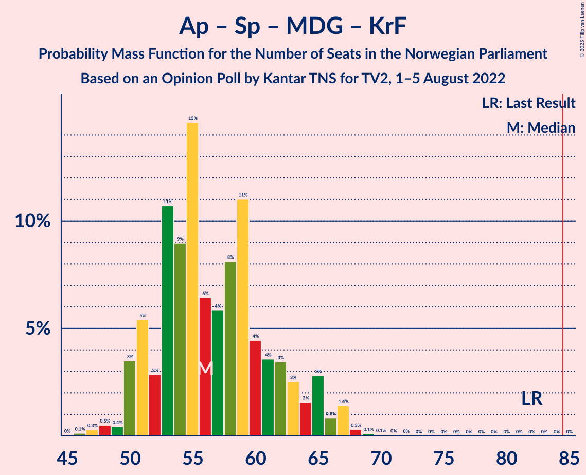

| Number of Seats | Probability | Accumulated | Special Marks |
|:---------------:|:-----------:|:-----------:|:-------------:|
| 46 | 0.1% | 100% |  |
| 47 | 0.3% | 99.8% |  |
| 48 | 0.5% | 99.5% |  |
| 49 | 0.4% | 99.0% |  |
| 50 | 3% | 98.6% |  |
| 51 | 5% | 95% |  |
| 52 | 3% | 90% |  |
| 53 | 11% | 87% |  |
| 54 | 9% | 76% | Median |
| 55 | 15% | 67% |  |
| 56 | 6% | 53% |  |
| 57 | 6% | 46% |  |
| 58 | 8% | 40% |  |
| 59 | 11% | 32% |  |
| 60 | 4% | 21% |  |
| 61 | 4% | 17% |  |
| 62 | 3% | 13% |  |
| 63 | 3% | 10% |  |
| 64 | 2% | 7% |  |
| 65 | 3% | 6% |  |
| 66 | 0.8% | 3% |  |
| 67 | 1.4% | 2% |  |
| 68 | 0.3% | 0.5% |  |
| 69 | 0.1% | 0.2% |  |
| 70 | 0.1% | 0.1% |  |
| 71 | 0% | 0.1% |  |
| 72 | 0% | 0% |  |
| 73 | 0% | 0% |  |
| 74 | 0% | 0% |  |
| 75 | 0% | 0% |  |
| 76 | 0% | 0% |  |
| 77 | 0% | 0% |  |
| 78 | 0% | 0% |  |
| 79 | 0% | 0% |  |
| 80 | 0% | 0% |  |
| 81 | 0% | 0% |  |
| 82 | 0% | 0% | Last Result |

### Arbeiderpartiet – Sosialistisk Venstreparti

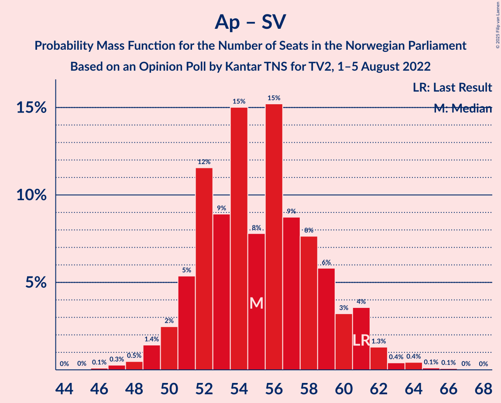

| Number of Seats | Probability | Accumulated | Special Marks |
|:---------------:|:-----------:|:-----------:|:-------------:|
| 46 | 0.1% | 100% |  |
| 47 | 0.3% | 99.9% |  |
| 48 | 0.5% | 99.6% |  |
| 49 | 1.4% | 99.1% |  |
| 50 | 2% | 98% |  |
| 51 | 5% | 95% |  |
| 52 | 12% | 90% |  |
| 53 | 9% | 78% |  |
| 54 | 15% | 69% |  |
| 55 | 8% | 54% | Median |
| 56 | 15% | 47% |  |
| 57 | 9% | 31% |  |
| 58 | 8% | 23% |  |
| 59 | 6% | 15% |  |
| 60 | 3% | 9% |  |
| 61 | 4% | 6% | Last Result |
| 62 | 1.3% | 2% |  |
| 63 | 0.4% | 1.1% |  |
| 64 | 0.4% | 0.7% |  |
| 65 | 0.1% | 0.2% |  |
| 66 | 0.1% | 0.1% |  |
| 67 | 0% | 0% |  |

### Arbeiderpartiet – Senterpartiet – Kristelig Folkeparti

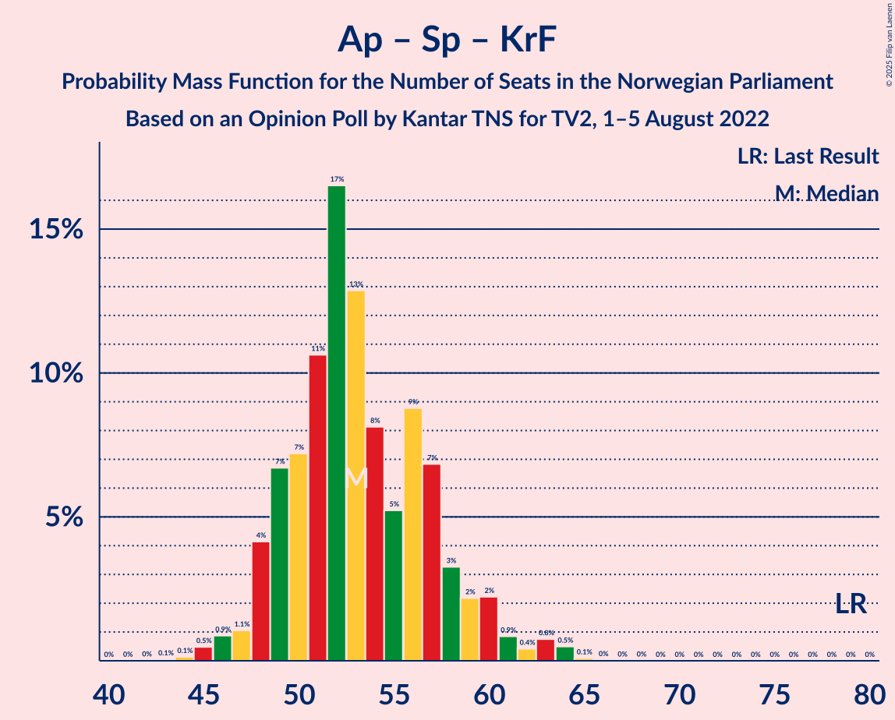

| Number of Seats | Probability | Accumulated | Special Marks |
|:---------------:|:-----------:|:-----------:|:-------------:|
| 43 | 0.1% | 100% |  |
| 44 | 0.1% | 99.9% |  |
| 45 | 0.5% | 99.8% |  |
| 46 | 0.9% | 99.3% |  |
| 47 | 1.1% | 98% |  |
| 48 | 4% | 97% |  |
| 49 | 7% | 93% |  |
| 50 | 7% | 87% |  |
| 51 | 11% | 79% |  |
| 52 | 17% | 69% | Median |
| 53 | 13% | 52% |  |
| 54 | 8% | 39% |  |
| 55 | 5% | 31% |  |
| 56 | 9% | 26% |  |
| 57 | 7% | 17% |  |
| 58 | 3% | 10% |  |
| 59 | 2% | 7% |  |
| 60 | 2% | 5% |  |
| 61 | 0.9% | 3% |  |
| 62 | 0.4% | 2% |  |
| 63 | 0.8% | 1.4% |  |
| 64 | 0.5% | 0.6% |  |
| 65 | 0.1% | 0.1% |  |
| 66 | 0% | 0.1% |  |
| 67 | 0% | 0% |  |
| 68 | 0% | 0% |  |
| 69 | 0% | 0% |  |
| 70 | 0% | 0% |  |
| 71 | 0% | 0% |  |
| 72 | 0% | 0% |  |
| 73 | 0% | 0% |  |
| 74 | 0% | 0% |  |
| 75 | 0% | 0% |  |
| 76 | 0% | 0% |  |
| 77 | 0% | 0% |  |
| 78 | 0% | 0% |  |
| 79 | 0% | 0% | Last Result |

### Arbeiderpartiet – Senterpartiet

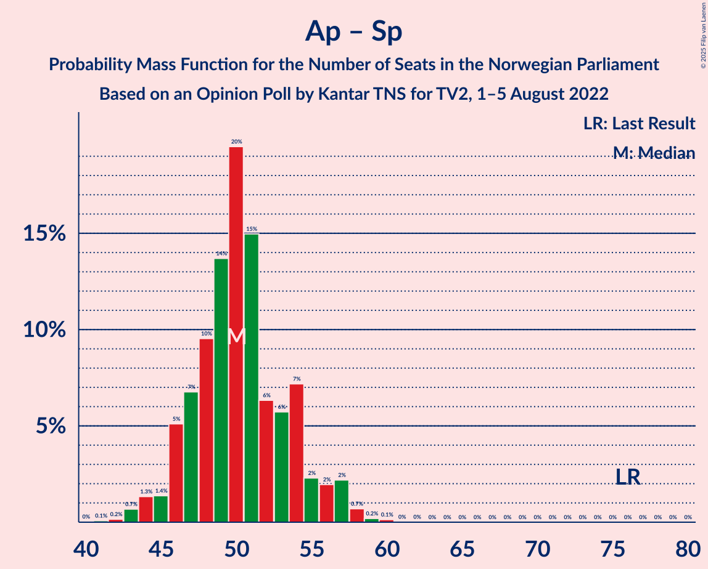

| Number of Seats | Probability | Accumulated | Special Marks |
|:---------------:|:-----------:|:-----------:|:-------------:|
| 41 | 0.1% | 100% |  |
| 42 | 0.2% | 99.9% |  |
| 43 | 0.7% | 99.7% |  |
| 44 | 1.3% | 99.0% |  |
| 45 | 1.4% | 98% |  |
| 46 | 5% | 96% |  |
| 47 | 7% | 91% |  |
| 48 | 10% | 84% |  |
| 49 | 14% | 75% |  |
| 50 | 20% | 61% | Median |
| 51 | 15% | 42% |  |
| 52 | 6% | 27% |  |
| 53 | 6% | 20% |  |
| 54 | 7% | 15% |  |
| 55 | 2% | 8% |  |
| 56 | 2% | 5% |  |
| 57 | 2% | 3% |  |
| 58 | 0.7% | 1.1% |  |
| 59 | 0.2% | 0.4% |  |
| 60 | 0.1% | 0.2% |  |
| 61 | 0% | 0% |  |
| 62 | 0% | 0% |  |
| 63 | 0% | 0% |  |
| 64 | 0% | 0% |  |
| 65 | 0% | 0% |  |
| 66 | 0% | 0% |  |
| 67 | 0% | 0% |  |
| 68 | 0% | 0% |  |
| 69 | 0% | 0% |  |
| 70 | 0% | 0% |  |
| 71 | 0% | 0% |  |
| 72 | 0% | 0% |  |
| 73 | 0% | 0% |  |
| 74 | 0% | 0% |  |
| 75 | 0% | 0% |  |
| 76 | 0% | 0% | Last Result |

### Senterpartiet – Venstre – Kristelig Folkeparti

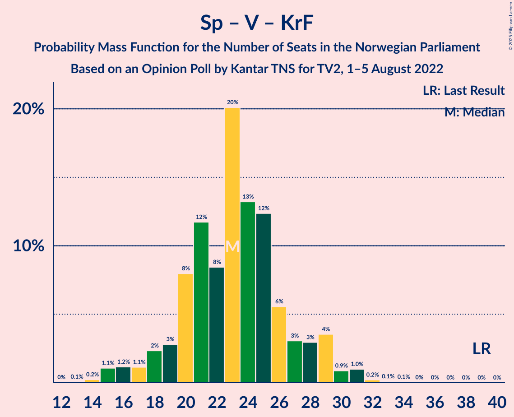

| Number of Seats | Probability | Accumulated | Special Marks |
|:---------------:|:-----------:|:-----------:|:-------------:|
| 13 | 0.1% | 100% |  |
| 14 | 0.2% | 99.9% |  |
| 15 | 1.1% | 99.7% |  |
| 16 | 1.2% | 98.6% |  |
| 17 | 1.1% | 97% |  |
| 18 | 2% | 96% |  |
| 19 | 3% | 94% |  |
| 20 | 8% | 91% |  |
| 21 | 12% | 83% |  |
| 22 | 8% | 71% | Median |
| 23 | 20% | 63% |  |
| 24 | 13% | 43% |  |
| 25 | 12% | 30% |  |
| 26 | 6% | 17% |  |
| 27 | 3% | 12% |  |
| 28 | 3% | 9% |  |
| 29 | 4% | 6% |  |
| 30 | 0.9% | 2% |  |
| 31 | 1.0% | 1.4% |  |
| 32 | 0.2% | 0.4% |  |
| 33 | 0.1% | 0.2% |  |
| 34 | 0.1% | 0.1% |  |
| 35 | 0% | 0% |  |
| 36 | 0% | 0% |  |
| 37 | 0% | 0% |  |
| 38 | 0% | 0% |  |
| 39 | 0% | 0% | Last Result |

## Technical Information

### Opinion Poll

+ **Polling firm:** Kantar TNS
+ **Commissioner(s):** TV2
+ **Fieldwork period:** 1–5 August 2022

### Calculations

+ **Sample size:** 737
+ **Simulations done:** 1,048,576
+ **Error estimate:** 2.64%

