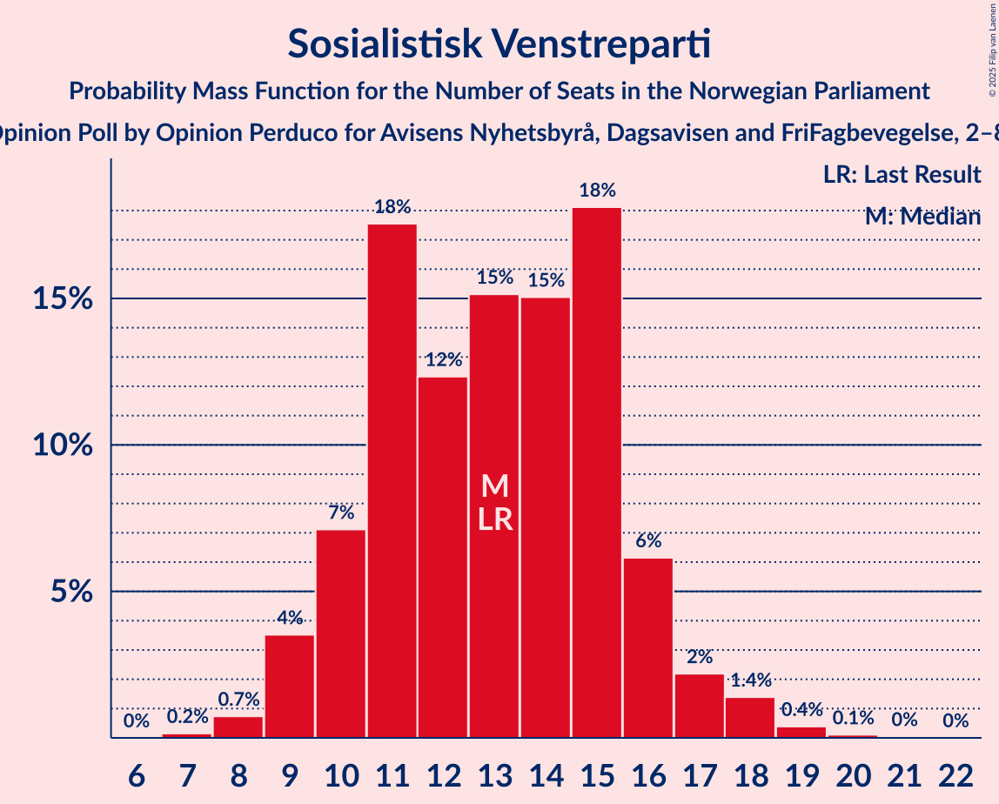

# Opinion Poll by Opinion Perduco for Avisens Nyhetsbyrå, Dagsavisen and FriFagbevegelse, 2–8 August 2022

<a href="#voting-intentions">Voting Intentions</a> | <a href="#seats">Seats</a> | <a href="#coalitions">Coalitions</a> | <a href="#technical-information">Technical Information</a>

## Voting Intentions

### Confidence Intervals

| Party | Last Result | Poll Result | 80% Confidence Interval | 90% Confidence Interval | 95% Confidence Interval | 99% Confidence Interval |
|:-----:|:-----------:|:-----------:|:-----------------------:|:-----------------------:|:-----------------------:|:-----------------------:|
| Høyre | 20.4% | 29.1% | 27.0–31.4% |26.4–32.1% |25.8–32.6% |24.8–33.8% |
| Arbeiderpartiet | 26.2% | 19.3% | 17.4–21.3% |16.9–21.9% |16.5–22.4% |15.6–23.4% |
| Fremskrittspartiet | 11.6% | 14.9% | 13.2–16.7% |12.8–17.3% |12.4–17.7% |11.6–18.7% |
| Sosialistisk Venstreparti | 7.6% | 8.4% | 7.2–9.9% |6.8–10.3% |6.5–10.7% |6.0–11.5% |
| Senterpartiet | 13.5% | 6.0% | 5.0–7.4% |4.7–7.7% |4.5–8.1% |4.0–8.8% |
| Rødt | 4.7% | 5.1% | 4.2–6.4% |3.9–6.8% |3.7–7.1% |3.3–7.7% |
| Venstre | 4.6% | 5.0% | 4.1–6.2% |3.8–6.6% |3.6–6.9% |3.2–7.6% |
| Kristelig Folkeparti | 3.8% | 3.2% | 2.5–4.3% |2.3–4.6% |2.1–4.9% |1.8–5.4% |
| Miljøpartiet De Grønne | 3.9% | 3.1% | 2.4–4.1% |2.2–4.4% |2.0–4.7% |1.7–5.2% |

*Note:* The poll result column reflects the actual value used in the calculations. Published results may vary slightly, and in addition be rounded to fewer digits.

## Seats

### Confidence Intervals

| Party | Last Result | Median | 80% Confidence Interval | 90% Confidence Interval | 95% Confidence Interval | 99% Confidence Interval |
|:-----:|:-----------:|:------:|:-----------------------:|:-----------------------:|:-----------------------:|:-----------------------:|
| <a href="#høyre">Høyre</a> | 36 | 51 | 48–55 |47–56 |46–58 |43–62 |
| <a href="#arbeiderpartiet">Arbeiderpartiet</a> | 48 | 36 | 33–42 |32–43 |32–44 |31–46 |
| <a href="#fremskrittspartiet">Fremskrittspartiet</a> | 21 | 28 | 23–32 |22–33 |21–35 |19–36 |
| <a href="#sosialistisk-venstreparti">Sosialistisk Venstreparti</a> | 13 | 13 | 10–16 |10–16 |9–17 |8–19 |
| <a href="#senterpartiet">Senterpartiet</a> | 28 | 10 | 7–13 |7–14 |6–14 |1–15 |
| <a href="#rødt">Rødt</a> | 8 | 8 | 6–10 |1–10 |1–11 |1–12 |
| <a href="#venstre">Venstre</a> | 8 | 7 | 3–10 |3–10 |2–11 |2–12 |
| <a href="#kristelig-folkeparti">Kristelig Folkeparti</a> | 3 | 2 | 2–6 |1–6 |0–7 |0–8 |
| <a href="#miljøpartiet-de-grønne">Miljøpartiet De Grønne</a> | 3 | 2 | 1–6 |1–6 |1–7 |1–8 |

### Høyre

*For a full overview of the results for this party, see the [Høyre](party-høyre.html) page.*

| Number of Seats | Probability | Accumulated | Special Marks |
|:---------------:|:-----------:|:-----------:|:-------------:|
| 36 | 0% | 100% | Last Result |
| 37 | 0% | 100% |  |
| 38 | 0% | 100% |  |
| 39 | 0% | 100% |  |
| 40 | 0% | 100% |  |
| 41 | 0.1% | 100% |  |
| 42 | 0.1% | 99.9% |  |
| 43 | 0.4% | 99.8% |  |
| 44 | 0.5% | 99.4% |  |
| 45 | 0.6% | 98.9% |  |
| 46 | 2% | 98% |  |
| 47 | 4% | 97% |  |
| 48 | 5% | 93% |  |
| 49 | 20% | 88% |  |
| 50 | 11% | 68% |  |
| 51 | 13% | 57% | Median |
| 52 | 9% | 43% |  |
| 53 | 8% | 34% |  |
| 54 | 14% | 26% |  |
| 55 | 4% | 12% |  |
| 56 | 3% | 7% |  |
| 57 | 2% | 5% |  |
| 58 | 0.7% | 3% |  |
| 59 | 0.3% | 2% |  |
| 60 | 0.7% | 2% |  |
| 61 | 0.2% | 0.8% |  |
| 62 | 0.3% | 0.6% |  |
| 63 | 0.2% | 0.3% |  |
| 64 | 0% | 0.1% |  |
| 65 | 0% | 0.1% |  |
| 66 | 0% | 0% |  |

### Arbeiderpartiet

*For a full overview of the results for this party, see the [Arbeiderpartiet](party-arbeiderpartiet.html) page.*

| Number of Seats | Probability | Accumulated | Special Marks |
|:---------------:|:-----------:|:-----------:|:-------------:|
| 28 | 0% | 100% |  |
| 29 | 0.1% | 99.9% |  |
| 30 | 0.2% | 99.8% |  |
| 31 | 0.8% | 99.6% |  |
| 32 | 5% | 98.8% |  |
| 33 | 5% | 94% |  |
| 34 | 8% | 89% |  |
| 35 | 9% | 81% |  |
| 36 | 25% | 72% | Median |
| 37 | 11% | 47% |  |
| 38 | 7% | 37% |  |
| 39 | 7% | 29% |  |
| 40 | 6% | 22% |  |
| 41 | 4% | 16% |  |
| 42 | 4% | 11% |  |
| 43 | 4% | 7% |  |
| 44 | 2% | 3% |  |
| 45 | 0.8% | 2% |  |
| 46 | 0.2% | 0.7% |  |
| 47 | 0.2% | 0.4% |  |
| 48 | 0.2% | 0.3% | Last Result |
| 49 | 0.1% | 0.1% |  |
| 50 | 0% | 0% |  |

### Fremskrittspartiet

*For a full overview of the results for this party, see the [Fremskrittspartiet](party-fremskrittspartiet.html) page.*

| Number of Seats | Probability | Accumulated | Special Marks |
|:---------------:|:-----------:|:-----------:|:-------------:|
| 18 | 0.4% | 100% |  |
| 19 | 0.3% | 99.6% |  |
| 20 | 0.9% | 99.2% |  |
| 21 | 3% | 98% | Last Result |
| 22 | 4% | 96% |  |
| 23 | 5% | 92% |  |
| 24 | 11% | 87% |  |
| 25 | 9% | 76% |  |
| 26 | 3% | 67% |  |
| 27 | 10% | 64% |  |
| 28 | 13% | 54% | Median |
| 29 | 16% | 41% |  |
| 30 | 8% | 25% |  |
| 31 | 5% | 17% |  |
| 32 | 4% | 12% |  |
| 33 | 3% | 7% |  |
| 34 | 1.1% | 4% |  |
| 35 | 3% | 3% |  |
| 36 | 0.5% | 0.7% |  |
| 37 | 0.1% | 0.2% |  |
| 38 | 0% | 0.1% |  |
| 39 | 0% | 0% |  |

### Sosialistisk Venstreparti

*For a full overview of the results for this party, see the [Sosialistisk Venstreparti](party-sosialistiskvenstreparti.html) page.*

| Number of Seats | Probability | Accumulated | Special Marks |
|:---------------:|:-----------:|:-----------:|:-------------:|
| 7 | 0.2% | 100% |  |
| 8 | 0.7% | 99.8% |  |
| 9 | 4% | 99.1% |  |
| 10 | 7% | 96% |  |
| 11 | 18% | 88% |  |
| 12 | 12% | 71% |  |
| 13 | 15% | 59% | Last Result, Median |
| 14 | 15% | 43% |  |
| 15 | 18% | 28% |  |
| 16 | 6% | 10% |  |
| 17 | 2% | 4% |  |
| 18 | 1.4% | 2% |  |
| 19 | 0.4% | 0.6% |  |
| 20 | 0.1% | 0.2% |  |
| 21 | 0% | 0.1% |  |
| 22 | 0% | 0% |  |

### Senterpartiet

*For a full overview of the results for this party, see the [Senterpartiet](party-senterpartiet.html) page.*

| Number of Seats | Probability | Accumulated | Special Marks |
|:---------------:|:-----------:|:-----------:|:-------------:|
| 0 | 0.1% | 100% |  |
| 1 | 0.5% | 99.9% |  |
| 2 | 0.1% | 99.4% |  |
| 3 | 0% | 99.3% |  |
| 4 | 0% | 99.3% |  |
| 5 | 0.2% | 99.3% |  |
| 6 | 4% | 99.1% |  |
| 7 | 14% | 96% |  |
| 8 | 12% | 82% |  |
| 9 | 12% | 70% |  |
| 10 | 11% | 57% | Median |
| 11 | 14% | 46% |  |
| 12 | 10% | 33% |  |
| 13 | 17% | 23% |  |
| 14 | 4% | 6% |  |
| 15 | 1.4% | 2% |  |
| 16 | 0.2% | 0.4% |  |
| 17 | 0.2% | 0.2% |  |
| 18 | 0% | 0% |  |
| 19 | 0% | 0% |  |
| 20 | 0% | 0% |  |
| 21 | 0% | 0% |  |
| 22 | 0% | 0% |  |
| 23 | 0% | 0% |  |
| 24 | 0% | 0% |  |
| 25 | 0% | 0% |  |
| 26 | 0% | 0% |  |
| 27 | 0% | 0% |  |
| 28 | 0% | 0% | Last Result |

### Rødt

*For a full overview of the results for this party, see the [Rødt](party-rødt.html) page.*

| Number of Seats | Probability | Accumulated | Special Marks |
|:---------------:|:-----------:|:-----------:|:-------------:|
| 1 | 8% | 100% |  |
| 2 | 0% | 92% |  |
| 3 | 0% | 92% |  |
| 4 | 0% | 92% |  |
| 5 | 0.5% | 92% |  |
| 6 | 12% | 92% |  |
| 7 | 22% | 80% |  |
| 8 | 23% | 58% | Last Result, Median |
| 9 | 20% | 34% |  |
| 10 | 11% | 14% |  |
| 11 | 2% | 3% |  |
| 12 | 1.1% | 1.3% |  |
| 13 | 0.2% | 0.2% |  |
| 14 | 0.1% | 0.1% |  |
| 15 | 0% | 0% |  |

### Venstre

*For a full overview of the results for this party, see the [Venstre](party-venstre.html) page.*

| Number of Seats | Probability | Accumulated | Special Marks |
|:---------------:|:-----------:|:-----------:|:-------------:|
| 2 | 3% | 100% |  |
| 3 | 8% | 97% |  |
| 4 | 0% | 89% |  |
| 5 | 0.6% | 89% |  |
| 6 | 14% | 88% |  |
| 7 | 26% | 74% | Median |
| 8 | 19% | 48% | Last Result |
| 9 | 15% | 29% |  |
| 10 | 11% | 14% |  |
| 11 | 2% | 3% |  |
| 12 | 0.5% | 0.7% |  |
| 13 | 0.1% | 0.2% |  |
| 14 | 0% | 0% |  |

### Kristelig Folkeparti

*For a full overview of the results for this party, see the [Kristelig Folkeparti](party-kristeligfolkeparti.html) page.*

| Number of Seats | Probability | Accumulated | Special Marks |
|:---------------:|:-----------:|:-----------:|:-------------:|
| 0 | 3% | 100% |  |
| 1 | 5% | 97% |  |
| 2 | 46% | 92% | Median |
| 3 | 30% | 46% | Last Result |
| 4 | 0% | 16% |  |
| 5 | 0.8% | 16% |  |
| 6 | 10% | 15% |  |
| 7 | 4% | 5% |  |
| 8 | 0.9% | 1.0% |  |
| 9 | 0.1% | 0.2% |  |
| 10 | 0% | 0% |  |

### Miljøpartiet De Grønne

*For a full overview of the results for this party, see the [Miljøpartiet De Grønne](party-miljøpartietdegrønne.html) page.*

| Number of Seats | Probability | Accumulated | Special Marks |
|:---------------:|:-----------:|:-----------:|:-------------:|
| 0 | 0.3% | 100% |  |
| 1 | 37% | 99.7% |  |
| 2 | 40% | 62% | Median |
| 3 | 10% | 22% | Last Result |
| 4 | 0% | 12% |  |
| 5 | 0.4% | 12% |  |
| 6 | 7% | 12% |  |
| 7 | 4% | 4% |  |
| 8 | 0.5% | 0.5% |  |
| 9 | 0.1% | 0.1% |  |
| 10 | 0% | 0% |  |

## Coalitions

### Confidence Intervals

| Coalition | Last Result | Median | Majority? | 80% Confidence Interval | 90% Confidence Interval | 95% Confidence Interval | 99% Confidence Interval |
|:---------:|:-----------:|:------:|:---------:|:-----------------------:|:-----------------------:|:-----------------------:|:-----------------------:|
| Høyre – Fremskrittspartiet – Senterpartiet – Venstre – Kristelig Folkeparti | 96 | 99 | 100% | 94–104 | 92–106 | 91–107 | 89–110 |
| Høyre – Fremskrittspartiet – Venstre – Kristelig Folkeparti – Miljøpartiet De Grønne | 71 | 91 | 94% | 86–97 | 84–99 | 82–100 | 80–103 |
| Høyre – Fremskrittspartiet – Venstre – Kristelig Folkeparti | 68 | 89 | 86% | 84–95 | 82–96 | 80–98 | 78–100 |
| Høyre – Fremskrittspartiet – Venstre | 65 | 86 | 63% | 81–92 | 79–93 | 78–95 | 75–97 |
| Høyre – Fremskrittspartiet | 57 | 79 | 9% | 73–84 | 72–86 | 71–88 | 68–90 |
| Arbeiderpartiet – Sosialistisk Venstreparti – Senterpartiet – Rødt – Miljøpartiet De Grønne | 100 | 70 | 0% | 65–76 | 63–77 | 60–79 | 58–81 |
| Arbeiderpartiet – Sosialistisk Venstreparti – Senterpartiet – Rødt | 97 | 68 | 0% | 63–73 | 61–75 | 59–76 | 56–78 |
| Arbeiderpartiet – Sosialistisk Venstreparti – Senterpartiet – Kristelig Folkeparti – Miljøpartiet De Grønne | 95 | 65 | 0% | 60–71 | 59–72 | 57–74 | 54–76 |
| Arbeiderpartiet – Sosialistisk Venstreparti – Senterpartiet – Miljøpartiet De Grønne | 92 | 62 | 0% | 58–68 | 56–69 | 54–70 | 52–73 |
| Høyre – Venstre – Kristelig Folkeparti | 47 | 61 | 0% | 57–66 | 56–67 | 55–69 | 52–72 |
| Arbeiderpartiet – Sosialistisk Venstreparti – Rødt – Miljøpartiet De Grønne | 72 | 60 | 0% | 55–65 | 54–66 | 53–68 | 49–70 |
| Arbeiderpartiet – Sosialistisk Venstreparti – Senterpartiet | 89 | 60 | 0% | 56–65 | 54–67 | 52–68 | 50–70 |
| Arbeiderpartiet – Senterpartiet – Kristelig Folkeparti – Miljøpartiet De Grønne | 82 | 52 | 0% | 48–58 | 46–59 | 44–61 | 43–64 |
| Arbeiderpartiet – Senterpartiet – Kristelig Folkeparti | 79 | 50 | 0% | 45–55 | 44–57 | 42–58 | 41–61 |
| Arbeiderpartiet – Sosialistisk Venstreparti | 61 | 50 | 0% | 46–55 | 45–56 | 43–57 | 42–59 |
| Arbeiderpartiet – Senterpartiet | 76 | 47 | 0% | 43–52 | 41–53 | 40–54 | 38–57 |
| Senterpartiet – Venstre – Kristelig Folkeparti | 39 | 20 | 0% | 16–25 | 15–26 | 14–27 | 12–29 |

### Høyre – Fremskrittspartiet – Senterpartiet – Venstre – Kristelig Folkeparti

| Number of Seats | Probability | Accumulated | Special Marks |
|:---------------:|:-----------:|:-----------:|:-------------:|
| 85 | 0% | 100% | Majority |
| 86 | 0% | 99.9% |  |
| 87 | 0.1% | 99.9% |  |
| 88 | 0.1% | 99.8% |  |
| 89 | 0.4% | 99.7% |  |
| 90 | 0.7% | 99.2% |  |
| 91 | 2% | 98.6% |  |
| 92 | 2% | 97% |  |
| 93 | 3% | 95% |  |
| 94 | 3% | 91% |  |
| 95 | 4% | 88% |  |
| 96 | 6% | 84% | Last Result |
| 97 | 12% | 78% |  |
| 98 | 9% | 66% | Median |
| 99 | 13% | 57% |  |
| 100 | 8% | 43% |  |
| 101 | 11% | 36% |  |
| 102 | 7% | 25% |  |
| 103 | 6% | 18% |  |
| 104 | 4% | 12% |  |
| 105 | 3% | 8% |  |
| 106 | 3% | 5% |  |
| 107 | 0.7% | 3% |  |
| 108 | 0.9% | 2% |  |
| 109 | 0.4% | 0.9% |  |
| 110 | 0.2% | 0.5% |  |
| 111 | 0.2% | 0.3% |  |
| 112 | 0.1% | 0.1% |  |
| 113 | 0% | 0.1% |  |
| 114 | 0% | 0% |  |

### Høyre – Fremskrittspartiet – Venstre – Kristelig Folkeparti – Miljøpartiet De Grønne

| Number of Seats | Probability | Accumulated | Special Marks |
|:---------------:|:-----------:|:-----------:|:-------------:|
| 71 | 0% | 100% | Last Result |
| 72 | 0% | 100% |  |
| 73 | 0% | 100% |  |
| 74 | 0% | 100% |  |
| 75 | 0% | 100% |  |
| 76 | 0% | 100% |  |
| 77 | 0% | 100% |  |
| 78 | 0.1% | 99.9% |  |
| 79 | 0.2% | 99.9% |  |
| 80 | 0.5% | 99.7% |  |
| 81 | 0.3% | 99.2% |  |
| 82 | 1.5% | 98.8% |  |
| 83 | 1.4% | 97% |  |
| 84 | 1.5% | 96% |  |
| 85 | 2% | 94% | Majority |
| 86 | 5% | 93% |  |
| 87 | 8% | 88% |  |
| 88 | 5% | 80% |  |
| 89 | 8% | 74% |  |
| 90 | 15% | 66% | Median |
| 91 | 8% | 51% |  |
| 92 | 6% | 43% |  |
| 93 | 8% | 37% |  |
| 94 | 4% | 29% |  |
| 95 | 8% | 25% |  |
| 96 | 5% | 17% |  |
| 97 | 4% | 11% |  |
| 98 | 2% | 7% |  |
| 99 | 2% | 6% |  |
| 100 | 2% | 4% |  |
| 101 | 1.1% | 2% |  |
| 102 | 0.3% | 0.9% |  |
| 103 | 0.3% | 0.6% |  |
| 104 | 0.1% | 0.3% |  |
| 105 | 0.1% | 0.2% |  |
| 106 | 0% | 0.1% |  |
| 107 | 0% | 0% |  |

### Høyre – Fremskrittspartiet – Venstre – Kristelig Folkeparti

| Number of Seats | Probability | Accumulated | Special Marks |
|:---------------:|:-----------:|:-----------:|:-------------:|
| 68 | 0% | 100% | Last Result |
| 69 | 0% | 100% |  |
| 70 | 0% | 100% |  |
| 71 | 0% | 100% |  |
| 72 | 0% | 100% |  |
| 73 | 0% | 100% |  |
| 74 | 0% | 100% |  |
| 75 | 0% | 100% |  |
| 76 | 0.1% | 99.9% |  |
| 77 | 0.2% | 99.8% |  |
| 78 | 0.6% | 99.7% |  |
| 79 | 0.5% | 99.1% |  |
| 80 | 1.5% | 98.6% |  |
| 81 | 2% | 97% |  |
| 82 | 2% | 95% |  |
| 83 | 3% | 93% |  |
| 84 | 4% | 90% |  |
| 85 | 9% | 86% | Majority |
| 86 | 7% | 78% |  |
| 87 | 7% | 71% |  |
| 88 | 9% | 64% | Median |
| 89 | 15% | 56% |  |
| 90 | 7% | 41% |  |
| 91 | 6% | 34% |  |
| 92 | 8% | 28% |  |
| 93 | 4% | 20% |  |
| 94 | 6% | 16% |  |
| 95 | 4% | 10% |  |
| 96 | 1.4% | 6% |  |
| 97 | 1.1% | 5% |  |
| 98 | 2% | 4% |  |
| 99 | 0.5% | 2% |  |
| 100 | 0.9% | 1.2% |  |
| 101 | 0.2% | 0.4% |  |
| 102 | 0% | 0.2% |  |
| 103 | 0.1% | 0.1% |  |
| 104 | 0% | 0.1% |  |
| 105 | 0% | 0% |  |

### Høyre – Fremskrittspartiet – Venstre

| Number of Seats | Probability | Accumulated | Special Marks |
|:---------------:|:-----------:|:-----------:|:-------------:|
| 65 | 0% | 100% | Last Result |
| 66 | 0% | 100% |  |
| 67 | 0% | 100% |  |
| 68 | 0% | 100% |  |
| 69 | 0% | 100% |  |
| 70 | 0% | 100% |  |
| 71 | 0% | 100% |  |
| 72 | 0% | 100% |  |
| 73 | 0.1% | 99.9% |  |
| 74 | 0.1% | 99.9% |  |
| 75 | 0.4% | 99.7% |  |
| 76 | 0.7% | 99.4% |  |
| 77 | 1.1% | 98.7% |  |
| 78 | 2% | 98% |  |
| 79 | 2% | 96% |  |
| 80 | 2% | 94% |  |
| 81 | 5% | 91% |  |
| 82 | 3% | 86% |  |
| 83 | 11% | 83% |  |
| 84 | 9% | 72% |  |
| 85 | 5% | 63% | Majority |
| 86 | 13% | 58% | Median |
| 87 | 9% | 44% |  |
| 88 | 10% | 36% |  |
| 89 | 5% | 26% |  |
| 90 | 6% | 21% |  |
| 91 | 5% | 15% |  |
| 92 | 3% | 10% |  |
| 93 | 3% | 7% |  |
| 94 | 1.1% | 4% |  |
| 95 | 1.2% | 3% |  |
| 96 | 0.6% | 2% |  |
| 97 | 0.7% | 1.1% |  |
| 98 | 0.2% | 0.4% |  |
| 99 | 0.1% | 0.2% |  |
| 100 | 0.1% | 0.1% |  |
| 101 | 0% | 0.1% |  |
| 102 | 0% | 0% |  |

### Høyre – Fremskrittspartiet

| Number of Seats | Probability | Accumulated | Special Marks |
|:---------------:|:-----------:|:-----------:|:-------------:|
| 57 | 0% | 100% | Last Result |
| 58 | 0% | 100% |  |
| 59 | 0% | 100% |  |
| 60 | 0% | 100% |  |
| 61 | 0% | 100% |  |
| 62 | 0% | 100% |  |
| 63 | 0% | 100% |  |
| 64 | 0% | 100% |  |
| 65 | 0% | 100% |  |
| 66 | 0% | 100% |  |
| 67 | 0.1% | 99.9% |  |
| 68 | 0.5% | 99.8% |  |
| 69 | 1.0% | 99.3% |  |
| 70 | 0.5% | 98% |  |
| 71 | 2% | 98% |  |
| 72 | 2% | 96% |  |
| 73 | 7% | 94% |  |
| 74 | 3% | 87% |  |
| 75 | 6% | 84% |  |
| 76 | 8% | 78% |  |
| 77 | 8% | 70% |  |
| 78 | 12% | 62% |  |
| 79 | 6% | 50% | Median |
| 80 | 10% | 45% |  |
| 81 | 10% | 35% |  |
| 82 | 5% | 25% |  |
| 83 | 8% | 20% |  |
| 84 | 3% | 12% |  |
| 85 | 3% | 9% | Majority |
| 86 | 2% | 6% |  |
| 87 | 0.7% | 3% |  |
| 88 | 1.3% | 3% |  |
| 89 | 0.7% | 1.4% |  |
| 90 | 0.3% | 0.7% |  |
| 91 | 0.2% | 0.4% |  |
| 92 | 0.1% | 0.1% |  |
| 93 | 0% | 0.1% |  |
| 94 | 0% | 0% |  |

### Arbeiderpartiet – Sosialistisk Venstreparti – Senterpartiet – Rødt – Miljøpartiet De Grønne

| Number of Seats | Probability | Accumulated | Special Marks |
|:---------------:|:-----------:|:-----------:|:-------------:|
| 56 | 0% | 100% |  |
| 57 | 0.1% | 99.9% |  |
| 58 | 0.4% | 99.9% |  |
| 59 | 0.3% | 99.5% |  |
| 60 | 2% | 99.2% |  |
| 61 | 0.6% | 97% |  |
| 62 | 0.9% | 97% |  |
| 63 | 2% | 96% |  |
| 64 | 3% | 94% |  |
| 65 | 3% | 91% |  |
| 66 | 8% | 88% |  |
| 67 | 10% | 80% |  |
| 68 | 6% | 70% |  |
| 69 | 8% | 64% | Median |
| 70 | 13% | 56% |  |
| 71 | 5% | 43% |  |
| 72 | 9% | 38% |  |
| 73 | 9% | 28% |  |
| 74 | 7% | 20% |  |
| 75 | 2% | 12% |  |
| 76 | 4% | 10% |  |
| 77 | 2% | 6% |  |
| 78 | 2% | 4% |  |
| 79 | 2% | 3% |  |
| 80 | 0.5% | 1.1% |  |
| 81 | 0.2% | 0.6% |  |
| 82 | 0.2% | 0.4% |  |
| 83 | 0.1% | 0.2% |  |
| 84 | 0% | 0.1% |  |
| 85 | 0% | 0% | Majority |
| 86 | 0% | 0% |  |
| 87 | 0% | 0% |  |
| 88 | 0% | 0% |  |
| 89 | 0% | 0% |  |
| 90 | 0% | 0% |  |
| 91 | 0% | 0% |  |
| 92 | 0% | 0% |  |
| 93 | 0% | 0% |  |
| 94 | 0% | 0% |  |
| 95 | 0% | 0% |  |
| 96 | 0% | 0% |  |
| 97 | 0% | 0% |  |
| 98 | 0% | 0% |  |
| 99 | 0% | 0% |  |
| 100 | 0% | 0% | Last Result |

### Arbeiderpartiet – Sosialistisk Venstreparti – Senterpartiet – Rødt

| Number of Seats | Probability | Accumulated | Special Marks |
|:---------------:|:-----------:|:-----------:|:-------------:|
| 54 | 0.1% | 100% |  |
| 55 | 0.1% | 99.9% |  |
| 56 | 0.2% | 99.7% |  |
| 57 | 0.5% | 99.5% |  |
| 58 | 1.1% | 99.0% |  |
| 59 | 1.5% | 98% |  |
| 60 | 0.7% | 96% |  |
| 61 | 2% | 96% |  |
| 62 | 3% | 94% |  |
| 63 | 3% | 90% |  |
| 64 | 10% | 87% |  |
| 65 | 7% | 78% |  |
| 66 | 9% | 70% |  |
| 67 | 7% | 62% | Median |
| 68 | 9% | 55% |  |
| 69 | 13% | 46% |  |
| 70 | 8% | 33% |  |
| 71 | 8% | 25% |  |
| 72 | 6% | 17% |  |
| 73 | 4% | 11% |  |
| 74 | 2% | 7% |  |
| 75 | 3% | 6% |  |
| 76 | 0.8% | 3% |  |
| 77 | 1.1% | 2% |  |
| 78 | 0.5% | 0.9% |  |
| 79 | 0.2% | 0.4% |  |
| 80 | 0.1% | 0.2% |  |
| 81 | 0.1% | 0.1% |  |
| 82 | 0% | 0% |  |
| 83 | 0% | 0% |  |
| 84 | 0% | 0% |  |
| 85 | 0% | 0% | Majority |
| 86 | 0% | 0% |  |
| 87 | 0% | 0% |  |
| 88 | 0% | 0% |  |
| 89 | 0% | 0% |  |
| 90 | 0% | 0% |  |
| 91 | 0% | 0% |  |
| 92 | 0% | 0% |  |
| 93 | 0% | 0% |  |
| 94 | 0% | 0% |  |
| 95 | 0% | 0% |  |
| 96 | 0% | 0% |  |
| 97 | 0% | 0% | Last Result |

### Arbeiderpartiet – Sosialistisk Venstreparti – Senterpartiet – Kristelig Folkeparti – Miljøpartiet De Grønne

| Number of Seats | Probability | Accumulated | Special Marks |
|:---------------:|:-----------:|:-----------:|:-------------:|
| 52 | 0.1% | 100% |  |
| 53 | 0.2% | 99.9% |  |
| 54 | 0.3% | 99.7% |  |
| 55 | 1.2% | 99.4% |  |
| 56 | 0.5% | 98% |  |
| 57 | 0.5% | 98% |  |
| 58 | 2% | 97% |  |
| 59 | 2% | 95% |  |
| 60 | 4% | 94% |  |
| 61 | 5% | 90% |  |
| 62 | 7% | 85% |  |
| 63 | 12% | 78% | Median |
| 64 | 6% | 66% |  |
| 65 | 12% | 60% |  |
| 66 | 13% | 48% |  |
| 67 | 9% | 35% |  |
| 68 | 4% | 26% |  |
| 69 | 7% | 22% |  |
| 70 | 3% | 14% |  |
| 71 | 4% | 11% |  |
| 72 | 3% | 7% |  |
| 73 | 1.3% | 4% |  |
| 74 | 2% | 3% |  |
| 75 | 0.6% | 1.4% |  |
| 76 | 0.4% | 0.8% |  |
| 77 | 0.2% | 0.4% |  |
| 78 | 0.1% | 0.2% |  |
| 79 | 0.1% | 0.1% |  |
| 80 | 0% | 0% |  |
| 81 | 0% | 0% |  |
| 82 | 0% | 0% |  |
| 83 | 0% | 0% |  |
| 84 | 0% | 0% |  |
| 85 | 0% | 0% | Majority |
| 86 | 0% | 0% |  |
| 87 | 0% | 0% |  |
| 88 | 0% | 0% |  |
| 89 | 0% | 0% |  |
| 90 | 0% | 0% |  |
| 91 | 0% | 0% |  |
| 92 | 0% | 0% |  |
| 93 | 0% | 0% |  |
| 94 | 0% | 0% |  |
| 95 | 0% | 0% | Last Result |

### Arbeiderpartiet – Sosialistisk Venstreparti – Senterpartiet – Miljøpartiet De Grønne

| Number of Seats | Probability | Accumulated | Special Marks |
|:---------------:|:-----------:|:-----------:|:-------------:|
| 50 | 0.1% | 100% |  |
| 51 | 0.2% | 99.9% |  |
| 52 | 1.2% | 99.6% |  |
| 53 | 0.4% | 98% |  |
| 54 | 0.8% | 98% |  |
| 55 | 0.7% | 97% |  |
| 56 | 3% | 97% |  |
| 57 | 2% | 93% |  |
| 58 | 6% | 92% |  |
| 59 | 7% | 86% |  |
| 60 | 8% | 78% |  |
| 61 | 10% | 70% | Median |
| 62 | 12% | 60% |  |
| 63 | 9% | 48% |  |
| 64 | 12% | 39% |  |
| 65 | 5% | 27% |  |
| 66 | 6% | 22% |  |
| 67 | 5% | 16% |  |
| 68 | 4% | 11% |  |
| 69 | 3% | 7% |  |
| 70 | 2% | 4% |  |
| 71 | 1.1% | 2% |  |
| 72 | 0.6% | 1.2% |  |
| 73 | 0.3% | 0.6% |  |
| 74 | 0.2% | 0.3% |  |
| 75 | 0.1% | 0.1% |  |
| 76 | 0% | 0.1% |  |
| 77 | 0% | 0% |  |
| 78 | 0% | 0% |  |
| 79 | 0% | 0% |  |
| 80 | 0% | 0% |  |
| 81 | 0% | 0% |  |
| 82 | 0% | 0% |  |
| 83 | 0% | 0% |  |
| 84 | 0% | 0% |  |
| 85 | 0% | 0% | Majority |
| 86 | 0% | 0% |  |
| 87 | 0% | 0% |  |
| 88 | 0% | 0% |  |
| 89 | 0% | 0% |  |
| 90 | 0% | 0% |  |
| 91 | 0% | 0% |  |
| 92 | 0% | 0% | Last Result |

### Høyre – Venstre – Kristelig Folkeparti

| Number of Seats | Probability | Accumulated | Special Marks |
|:---------------:|:-----------:|:-----------:|:-------------:|
| 47 | 0% | 100% | Last Result |
| 48 | 0.1% | 100% |  |
| 49 | 0% | 99.9% |  |
| 50 | 0.1% | 99.9% |  |
| 51 | 0.1% | 99.8% |  |
| 52 | 0.4% | 99.7% |  |
| 53 | 1.0% | 99.3% |  |
| 54 | 0.6% | 98% |  |
| 55 | 1.2% | 98% |  |
| 56 | 3% | 97% |  |
| 57 | 5% | 94% |  |
| 58 | 7% | 89% |  |
| 59 | 8% | 82% |  |
| 60 | 13% | 74% | Median |
| 61 | 14% | 61% |  |
| 62 | 8% | 47% |  |
| 63 | 13% | 39% |  |
| 64 | 9% | 25% |  |
| 65 | 4% | 17% |  |
| 66 | 4% | 13% |  |
| 67 | 4% | 9% |  |
| 68 | 1.1% | 4% |  |
| 69 | 1.1% | 3% |  |
| 70 | 0.8% | 2% |  |
| 71 | 0.5% | 1.1% |  |
| 72 | 0.2% | 0.6% |  |
| 73 | 0.2% | 0.4% |  |
| 74 | 0.1% | 0.2% |  |
| 75 | 0% | 0.1% |  |
| 76 | 0% | 0% |  |

### Arbeiderpartiet – Sosialistisk Venstreparti – Rødt – Miljøpartiet De Grønne

| Number of Seats | Probability | Accumulated | Special Marks |
|:---------------:|:-----------:|:-----------:|:-------------:|
| 47 | 0% | 100% |  |
| 48 | 0.2% | 99.9% |  |
| 49 | 0.3% | 99.7% |  |
| 50 | 0.3% | 99.4% |  |
| 51 | 0.6% | 99.1% |  |
| 52 | 1.0% | 98.6% |  |
| 53 | 2% | 98% |  |
| 54 | 4% | 96% |  |
| 55 | 4% | 92% |  |
| 56 | 8% | 88% |  |
| 57 | 6% | 80% |  |
| 58 | 8% | 74% |  |
| 59 | 13% | 66% | Median |
| 60 | 10% | 53% |  |
| 61 | 13% | 43% |  |
| 62 | 7% | 30% |  |
| 63 | 8% | 23% |  |
| 64 | 4% | 16% |  |
| 65 | 4% | 12% |  |
| 66 | 3% | 8% |  |
| 67 | 2% | 5% |  |
| 68 | 2% | 3% |  |
| 69 | 0.8% | 2% |  |
| 70 | 0.3% | 0.8% |  |
| 71 | 0.3% | 0.5% |  |
| 72 | 0.1% | 0.2% | Last Result |
| 73 | 0% | 0.1% |  |
| 74 | 0% | 0.1% |  |
| 75 | 0% | 0% |  |

### Arbeiderpartiet – Sosialistisk Venstreparti – Senterpartiet

| Number of Seats | Probability | Accumulated | Special Marks |
|:---------------:|:-----------:|:-----------:|:-------------:|
| 48 | 0.1% | 100% |  |
| 49 | 0.2% | 99.9% |  |
| 50 | 1.0% | 99.6% |  |
| 51 | 0.5% | 98.7% |  |
| 52 | 0.8% | 98% |  |
| 53 | 1.2% | 97% |  |
| 54 | 2% | 96% |  |
| 55 | 3% | 94% |  |
| 56 | 4% | 90% |  |
| 57 | 7% | 86% |  |
| 58 | 12% | 79% |  |
| 59 | 7% | 67% | Median |
| 60 | 12% | 60% |  |
| 61 | 13% | 48% |  |
| 62 | 12% | 36% |  |
| 63 | 5% | 24% |  |
| 64 | 7% | 19% |  |
| 65 | 5% | 12% |  |
| 66 | 2% | 8% |  |
| 67 | 2% | 5% |  |
| 68 | 1.1% | 3% |  |
| 69 | 0.8% | 2% |  |
| 70 | 0.4% | 0.9% |  |
| 71 | 0.4% | 0.5% |  |
| 72 | 0.1% | 0.1% |  |
| 73 | 0% | 0% |  |
| 74 | 0% | 0% |  |
| 75 | 0% | 0% |  |
| 76 | 0% | 0% |  |
| 77 | 0% | 0% |  |
| 78 | 0% | 0% |  |
| 79 | 0% | 0% |  |
| 80 | 0% | 0% |  |
| 81 | 0% | 0% |  |
| 82 | 0% | 0% |  |
| 83 | 0% | 0% |  |
| 84 | 0% | 0% |  |
| 85 | 0% | 0% | Majority |
| 86 | 0% | 0% |  |
| 87 | 0% | 0% |  |
| 88 | 0% | 0% |  |
| 89 | 0% | 0% | Last Result |

### Arbeiderpartiet – Senterpartiet – Kristelig Folkeparti – Miljøpartiet De Grønne

| Number of Seats | Probability | Accumulated | Special Marks |
|:---------------:|:-----------:|:-----------:|:-------------:|
| 39 | 0.1% | 100% |  |
| 40 | 0.1% | 99.9% |  |
| 41 | 0.1% | 99.8% |  |
| 42 | 0.2% | 99.7% |  |
| 43 | 0.3% | 99.5% |  |
| 44 | 2% | 99.2% |  |
| 45 | 2% | 97% |  |
| 46 | 2% | 96% |  |
| 47 | 3% | 94% |  |
| 48 | 9% | 90% |  |
| 49 | 4% | 81% |  |
| 50 | 11% | 78% | Median |
| 51 | 8% | 66% |  |
| 52 | 13% | 58% |  |
| 53 | 5% | 45% |  |
| 54 | 13% | 39% |  |
| 55 | 8% | 26% |  |
| 56 | 3% | 19% |  |
| 57 | 4% | 15% |  |
| 58 | 4% | 12% |  |
| 59 | 3% | 8% |  |
| 60 | 1.5% | 4% |  |
| 61 | 1.1% | 3% |  |
| 62 | 0.9% | 2% |  |
| 63 | 0.4% | 1.0% |  |
| 64 | 0.2% | 0.6% |  |
| 65 | 0.2% | 0.4% |  |
| 66 | 0.2% | 0.2% |  |
| 67 | 0% | 0% |  |
| 68 | 0% | 0% |  |
| 69 | 0% | 0% |  |
| 70 | 0% | 0% |  |
| 71 | 0% | 0% |  |
| 72 | 0% | 0% |  |
| 73 | 0% | 0% |  |
| 74 | 0% | 0% |  |
| 75 | 0% | 0% |  |
| 76 | 0% | 0% |  |
| 77 | 0% | 0% |  |
| 78 | 0% | 0% |  |
| 79 | 0% | 0% |  |
| 80 | 0% | 0% |  |
| 81 | 0% | 0% |  |
| 82 | 0% | 0% | Last Result |

### Arbeiderpartiet – Senterpartiet – Kristelig Folkeparti

| Number of Seats | Probability | Accumulated | Special Marks |
|:---------------:|:-----------:|:-----------:|:-------------:|
| 37 | 0% | 100% |  |
| 38 | 0.1% | 99.9% |  |
| 39 | 0.1% | 99.8% |  |
| 40 | 0.2% | 99.7% |  |
| 41 | 0.4% | 99.5% |  |
| 42 | 2% | 99.1% |  |
| 43 | 1.5% | 97% |  |
| 44 | 3% | 96% |  |
| 45 | 3% | 93% |  |
| 46 | 7% | 90% |  |
| 47 | 7% | 83% |  |
| 48 | 6% | 76% | Median |
| 49 | 17% | 70% |  |
| 50 | 6% | 53% |  |
| 51 | 11% | 47% |  |
| 52 | 12% | 36% |  |
| 53 | 9% | 24% |  |
| 54 | 5% | 15% |  |
| 55 | 2% | 10% |  |
| 56 | 3% | 8% |  |
| 57 | 2% | 5% |  |
| 58 | 1.0% | 3% |  |
| 59 | 0.7% | 2% |  |
| 60 | 0.9% | 1.5% |  |
| 61 | 0.4% | 0.6% |  |
| 62 | 0.1% | 0.2% |  |
| 63 | 0% | 0.1% |  |
| 64 | 0% | 0% |  |
| 65 | 0% | 0% |  |
| 66 | 0% | 0% |  |
| 67 | 0% | 0% |  |
| 68 | 0% | 0% |  |
| 69 | 0% | 0% |  |
| 70 | 0% | 0% |  |
| 71 | 0% | 0% |  |
| 72 | 0% | 0% |  |
| 73 | 0% | 0% |  |
| 74 | 0% | 0% |  |
| 75 | 0% | 0% |  |
| 76 | 0% | 0% |  |
| 77 | 0% | 0% |  |
| 78 | 0% | 0% |  |
| 79 | 0% | 0% | Last Result |

### Arbeiderpartiet – Sosialistisk Venstreparti

| Number of Seats | Probability | Accumulated | Special Marks |
|:---------------:|:-----------:|:-----------:|:-------------:|
| 40 | 0.1% | 100% |  |
| 41 | 0.4% | 99.9% |  |
| 42 | 0.5% | 99.6% |  |
| 43 | 2% | 99.1% |  |
| 44 | 2% | 97% |  |
| 45 | 4% | 95% |  |
| 46 | 3% | 92% |  |
| 47 | 13% | 89% |  |
| 48 | 7% | 76% |  |
| 49 | 11% | 69% | Median |
| 50 | 16% | 59% |  |
| 51 | 10% | 43% |  |
| 52 | 9% | 32% |  |
| 53 | 9% | 23% |  |
| 54 | 5% | 15% |  |
| 55 | 4% | 10% |  |
| 56 | 3% | 6% |  |
| 57 | 0.8% | 3% |  |
| 58 | 1.0% | 2% |  |
| 59 | 0.7% | 1.1% |  |
| 60 | 0.2% | 0.5% |  |
| 61 | 0.1% | 0.2% | Last Result |
| 62 | 0.1% | 0.2% |  |
| 63 | 0% | 0% |  |

### Arbeiderpartiet – Senterpartiet

| Number of Seats | Probability | Accumulated | Special Marks |
|:---------------:|:-----------:|:-----------:|:-------------:|
| 35 | 0.1% | 100% |  |
| 36 | 0.1% | 99.9% |  |
| 37 | 0.1% | 99.8% |  |
| 38 | 0.2% | 99.7% |  |
| 39 | 1.2% | 99.5% |  |
| 40 | 1.4% | 98% |  |
| 41 | 2% | 97% |  |
| 42 | 3% | 95% |  |
| 43 | 5% | 92% |  |
| 44 | 5% | 87% |  |
| 45 | 11% | 82% |  |
| 46 | 14% | 71% | Median |
| 47 | 15% | 57% |  |
| 48 | 5% | 42% |  |
| 49 | 14% | 37% |  |
| 50 | 9% | 23% |  |
| 51 | 4% | 15% |  |
| 52 | 3% | 10% |  |
| 53 | 2% | 7% |  |
| 54 | 3% | 5% |  |
| 55 | 0.8% | 2% |  |
| 56 | 0.7% | 2% |  |
| 57 | 0.6% | 0.9% |  |
| 58 | 0.2% | 0.3% |  |
| 59 | 0.1% | 0.1% |  |
| 60 | 0% | 0% |  |
| 61 | 0% | 0% |  |
| 62 | 0% | 0% |  |
| 63 | 0% | 0% |  |
| 64 | 0% | 0% |  |
| 65 | 0% | 0% |  |
| 66 | 0% | 0% |  |
| 67 | 0% | 0% |  |
| 68 | 0% | 0% |  |
| 69 | 0% | 0% |  |
| 70 | 0% | 0% |  |
| 71 | 0% | 0% |  |
| 72 | 0% | 0% |  |
| 73 | 0% | 0% |  |
| 74 | 0% | 0% |  |
| 75 | 0% | 0% |  |
| 76 | 0% | 0% | Last Result |

### Senterpartiet – Venstre – Kristelig Folkeparti

| Number of Seats | Probability | Accumulated | Special Marks |
|:---------------:|:-----------:|:-----------:|:-------------:|
| 10 | 0.2% | 100% |  |
| 11 | 0.2% | 99.8% |  |
| 12 | 0.4% | 99.6% |  |
| 13 | 0.7% | 99.1% |  |
| 14 | 2% | 98% |  |
| 15 | 6% | 96% |  |
| 16 | 5% | 91% |  |
| 17 | 8% | 86% |  |
| 18 | 7% | 78% |  |
| 19 | 10% | 71% | Median |
| 20 | 13% | 61% |  |
| 21 | 12% | 48% |  |
| 22 | 10% | 36% |  |
| 23 | 5% | 26% |  |
| 24 | 10% | 20% |  |
| 25 | 4% | 10% |  |
| 26 | 3% | 6% |  |
| 27 | 1.1% | 3% |  |
| 28 | 0.8% | 1.5% |  |
| 29 | 0.3% | 0.7% |  |
| 30 | 0.3% | 0.4% |  |
| 31 | 0.1% | 0.1% |  |
| 32 | 0% | 0% |  |
| 33 | 0% | 0% |  |
| 34 | 0% | 0% |  |
| 35 | 0% | 0% |  |
| 36 | 0% | 0% |  |
| 37 | 0% | 0% |  |
| 38 | 0% | 0% |  |
| 39 | 0% | 0% | Last Result |

## Technical Information

### Opinion Poll

+ **Polling firm:** Opinion Perduco
+ **Commissioner(s):** Avisens Nyhetsbyrå, Dagsavisen and FriFagbevegelse
+ **Fieldwork period:** 2–8 August 2022

### Calculations

+ **Sample size:** 680
+ **Simulations done:** 1,048,576
+ **Error estimate:** 1.63%

