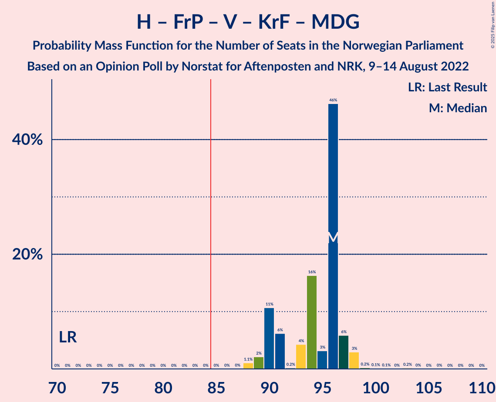

# Opinion Poll by Norstat for Aftenposten and NRK, 9–14 August 2022

<a href="#voting-intentions">Voting Intentions</a> | <a href="#seats">Seats</a> | <a href="#coalitions">Coalitions</a> | <a href="#technical-information">Technical Information</a>

## Voting Intentions

### Confidence Intervals

| Party | Last Result | Poll Result | 80% Confidence Interval | 90% Confidence Interval | 95% Confidence Interval | 99% Confidence Interval |
|:-----:|:-----------:|:-----------:|:-----------------------:|:-----------------------:|:-----------------------:|:-----------------------:|
| Høyre | 20.4% | 30.0% | 28.2–31.9% |27.6–32.5% |27.2–33.0% |26.3–33.9% |
| Arbeiderpartiet | 26.2% | 19.4% | 17.8–21.1% |17.4–21.6% |17.0–22.0% |16.3–22.8% |
| Fremskrittspartiet | 11.6% | 14.4% | 13.0–15.9% |12.6–16.4% |12.3–16.8% |11.7–17.5% |
| Sosialistisk Venstreparti | 7.6% | 8.9% | 7.8–10.1% |7.5–10.5% |7.2–10.8% |6.7–11.5% |
| Senterpartiet | 13.5% | 5.9% | 5.1–7.0% |4.8–7.3% |4.6–7.6% |4.2–8.2% |
| Rødt | 4.7% | 5.8% | 5.0–6.9% |4.7–7.2% |4.5–7.5% |4.1–8.1% |
| Venstre | 4.6% | 4.6% | 3.8–5.6% |3.6–5.9% |3.4–6.1% |3.1–6.6% |
| Miljøpartiet De Grønne | 3.9% | 3.8% | 3.1–4.7% |2.9–4.9% |2.7–5.2% |2.4–5.6% |
| Kristelig Folkeparti | 3.8% | 3.8% | 3.1–4.7% |2.9–4.9% |2.7–5.2% |2.4–5.6% |
| Industri- og Næringspartiet | 0.3% | 1.4% | 1.0–2.0% |0.9–2.1% |0.8–2.3% |0.6–2.6% |
| Norgesdemokratene | 1.1% | 0.6% | 0.4–1.1% |0.3–1.2% |0.3–1.4% |0.2–1.6% |
| Folkets parti | 0.1% | 0.4% | 0.2–0.8% |0.2–1.0% |0.2–1.1% |0.1–1.3% |
| Liberalistene | 0.2% | 0.4% | 0.2–0.8% |0.2–1.0% |0.2–1.1% |0.1–1.3% |
| Konservativt | 0.4% | 0.4% | 0.2–0.8% |0.2–1.0% |0.2–1.1% |0.1–1.3% |
| Helsepartiet | 0.2% | 0.2% | 0.1–0.6% |0.1–0.7% |0.1–0.8% |0.0–1.0% |

*Note:* The poll result column reflects the actual value used in the calculations. Published results may vary slightly, and in addition be rounded to fewer digits.

## Seats

### Confidence Intervals

| Party | Last Result | Median | 80% Confidence Interval | 90% Confidence Interval | 95% Confidence Interval | 99% Confidence Interval |
|:-----:|:-----------:|:------:|:-----------------------:|:-----------------------:|:-----------------------:|:-----------------------:|
| <a href="#høyre">Høyre</a> | 36 | 48 | 46–56 |46–59 |46–59 |46–59 |
| <a href="#arbeiderpartiet">Arbeiderpartiet</a> | 48 | 37 | 35–37 |34–41 |34–41 |33–41 |
| <a href="#fremskrittspartiet">Fremskrittspartiet</a> | 21 | 24 | 24–31 |24–31 |23–31 |21–31 |
| <a href="#sosialistisk-venstreparti">Sosialistisk Venstreparti</a> | 13 | 14 | 14–19 |14–19 |12–19 |12–20 |
| <a href="#senterpartiet">Senterpartiet</a> | 28 | 10 | 8–13 |8–13 |8–13 |8–13 |
| <a href="#rødt">Rødt</a> | 8 | 11 | 9–12 |9–13 |9–15 |8–15 |
| <a href="#venstre">Venstre</a> | 8 | 7 | 3–9 |3–9 |3–10 |2–10 |
| <a href="#miljøpartiet-de-grønne">Miljøpartiet De Grønne</a> | 3 | 8 | 2–10 |2–10 |2–10 |1–10 |
| <a href="#kristelig-folkeparti">Kristelig Folkeparti</a> | 3 | 7 | 2–7 |2–7 |2–9 |2–9 |
| <a href="#industri--og-næringspartiet">Industri- og Næringspartiet</a> | 0 | 0 | 0 |0 |0 |0 |
| <a href="#norgesdemokratene">Norgesdemokratene</a> | 0 | 0 | 0 |0 |0 |0 |
| <a href="#folkets-parti">Folkets parti</a> | 0 | 0 | 0 |0 |0 |0 |
| <a href="#liberalistene">Liberalistene</a> | 0 | 0 | 0 |0 |0 |0 |
| <a href="#konservativt">Konservativt</a> | 0 | 0 | 0 |0 |0 |0 |
| <a href="#helsepartiet">Helsepartiet</a> | 0 | 0 | 0 |0 |0 |0 |

### Høyre

*For a full overview of the results for this party, see the [Høyre](party-høyre.html) page.*

| Number of Seats | Probability | Accumulated | Special Marks |
|:---------------:|:-----------:|:-----------:|:-------------:|
| 36 | 0% | 100% | Last Result |
| 37 | 0% | 100% |  |
| 38 | 0% | 100% |  |
| 39 | 0% | 100% |  |
| 40 | 0% | 100% |  |
| 41 | 0% | 100% |  |
| 42 | 0.1% | 100% |  |
| 43 | 0% | 99.9% |  |
| 44 | 0% | 99.9% |  |
| 45 | 0% | 99.8% |  |
| 46 | 11% | 99.8% |  |
| 47 | 0.2% | 88% |  |
| 48 | 52% | 88% | Median |
| 49 | 0.3% | 36% |  |
| 50 | 0.6% | 36% |  |
| 51 | 16% | 35% |  |
| 52 | 0.2% | 19% |  |
| 53 | 0.5% | 18% |  |
| 54 | 0.3% | 18% |  |
| 55 | 5% | 18% |  |
| 56 | 6% | 13% |  |
| 57 | 0.1% | 7% |  |
| 58 | 0.7% | 7% |  |
| 59 | 6% | 6% |  |
| 60 | 0.1% | 0.2% |  |
| 61 | 0% | 0.1% |  |
| 62 | 0% | 0.1% |  |
| 63 | 0.1% | 0.1% |  |
| 64 | 0% | 0% |  |

### Arbeiderpartiet

*For a full overview of the results for this party, see the [Arbeiderpartiet](party-arbeiderpartiet.html) page.*

| Number of Seats | Probability | Accumulated | Special Marks |
|:---------------:|:-----------:|:-----------:|:-------------:|
| 31 | 0.1% | 100% |  |
| 32 | 0.1% | 99.9% |  |
| 33 | 0.8% | 99.8% |  |
| 34 | 6% | 99.0% |  |
| 35 | 7% | 93% |  |
| 36 | 1.2% | 86% |  |
| 37 | 76% | 85% | Median |
| 38 | 0.3% | 8% |  |
| 39 | 0.5% | 8% |  |
| 40 | 0.6% | 7% |  |
| 41 | 6% | 7% |  |
| 42 | 0.2% | 0.5% |  |
| 43 | 0.1% | 0.2% |  |
| 44 | 0% | 0.1% |  |
| 45 | 0% | 0.1% |  |
| 46 | 0% | 0.1% |  |
| 47 | 0.1% | 0.1% |  |
| 48 | 0% | 0% | Last Result |

### Fremskrittspartiet

*For a full overview of the results for this party, see the [Fremskrittspartiet](party-fremskrittspartiet.html) page.*

| Number of Seats | Probability | Accumulated | Special Marks |
|:---------------:|:-----------:|:-----------:|:-------------:|
| 18 | 0.1% | 100% |  |
| 19 | 0.1% | 99.9% |  |
| 20 | 0% | 99.8% |  |
| 21 | 0.3% | 99.8% | Last Result |
| 22 | 1.2% | 99.5% |  |
| 23 | 3% | 98% |  |
| 24 | 56% | 95% | Median |
| 25 | 20% | 39% |  |
| 26 | 0.3% | 19% |  |
| 27 | 0.9% | 19% |  |
| 28 | 0.7% | 18% |  |
| 29 | 0.2% | 17% |  |
| 30 | 6% | 17% |  |
| 31 | 11% | 11% |  |
| 32 | 0.1% | 0.2% |  |
| 33 | 0% | 0.1% |  |
| 34 | 0% | 0.1% |  |
| 35 | 0.1% | 0.1% |  |
| 36 | 0% | 0% |  |

### Sosialistisk Venstreparti

*For a full overview of the results for this party, see the [Sosialistisk Venstreparti](party-sosialistiskvenstreparti.html) page.*

| Number of Seats | Probability | Accumulated | Special Marks |
|:---------------:|:-----------:|:-----------:|:-------------:|
| 11 | 0.1% | 100% |  |
| 12 | 3% | 99.9% |  |
| 13 | 1.0% | 97% | Last Result |
| 14 | 47% | 96% | Median |
| 15 | 18% | 49% |  |
| 16 | 17% | 30% |  |
| 17 | 0.3% | 13% |  |
| 18 | 2% | 13% |  |
| 19 | 11% | 11% |  |
| 20 | 0.6% | 0.9% |  |
| 21 | 0.3% | 0.3% |  |
| 22 | 0% | 0% |  |

### Senterpartiet

*For a full overview of the results for this party, see the [Senterpartiet](party-senterpartiet.html) page.*

| Number of Seats | Probability | Accumulated | Special Marks |
|:---------------:|:-----------:|:-----------:|:-------------:|
| 7 | 0.4% | 100% |  |
| 8 | 14% | 99.6% |  |
| 9 | 0.8% | 86% |  |
| 10 | 51% | 85% | Median |
| 11 | 2% | 34% |  |
| 12 | 20% | 33% |  |
| 13 | 12% | 13% |  |
| 14 | 0% | 0.5% |  |
| 15 | 0.1% | 0.4% |  |
| 16 | 0.3% | 0.3% |  |
| 17 | 0% | 0% |  |
| 18 | 0% | 0% |  |
| 19 | 0% | 0% |  |
| 20 | 0% | 0% |  |
| 21 | 0% | 0% |  |
| 22 | 0% | 0% |  |
| 23 | 0% | 0% |  |
| 24 | 0% | 0% |  |
| 25 | 0% | 0% |  |
| 26 | 0% | 0% |  |
| 27 | 0% | 0% |  |
| 28 | 0% | 0% | Last Result |

### Rødt

*For a full overview of the results for this party, see the [Rødt](party-rødt.html) page.*

| Number of Seats | Probability | Accumulated | Special Marks |
|:---------------:|:-----------:|:-----------:|:-------------:|
| 7 | 0.2% | 100% |  |
| 8 | 0.6% | 99.8% | Last Result |
| 9 | 10% | 99.1% |  |
| 10 | 17% | 89% |  |
| 11 | 50% | 72% | Median |
| 12 | 13% | 22% |  |
| 13 | 6% | 9% |  |
| 14 | 0.1% | 3% |  |
| 15 | 3% | 3% |  |
| 16 | 0% | 0% |  |

### Venstre

*For a full overview of the results for this party, see the [Venstre](party-venstre.html) page.*

| Number of Seats | Probability | Accumulated | Special Marks |
|:---------------:|:-----------:|:-----------:|:-------------:|
| 1 | 0.1% | 100% |  |
| 2 | 0.6% | 99.9% |  |
| 3 | 19% | 99.3% |  |
| 4 | 0% | 81% |  |
| 5 | 0% | 81% |  |
| 6 | 0.4% | 81% |  |
| 7 | 49% | 80% | Median |
| 8 | 18% | 31% | Last Result |
| 9 | 8% | 13% |  |
| 10 | 5% | 5% |  |
| 11 | 0.2% | 0.3% |  |
| 12 | 0% | 0.1% |  |
| 13 | 0% | 0% |  |

### Miljøpartiet De Grønne

*For a full overview of the results for this party, see the [Miljøpartiet De Grønne](party-miljøpartietdegrønne.html) page.*

| Number of Seats | Probability | Accumulated | Special Marks |
|:---------------:|:-----------:|:-----------:|:-------------:|
| 1 | 1.3% | 100% |  |
| 2 | 14% | 98.7% |  |
| 3 | 9% | 84% | Last Result |
| 4 | 0% | 75% |  |
| 5 | 0% | 75% |  |
| 6 | 0% | 75% |  |
| 7 | 0.7% | 75% |  |
| 8 | 27% | 75% | Median |
| 9 | 0.1% | 47% |  |
| 10 | 47% | 47% |  |
| 11 | 0.1% | 0.1% |  |
| 12 | 0% | 0% |  |

### Kristelig Folkeparti

*For a full overview of the results for this party, see the [Kristelig Folkeparti](party-kristeligfolkeparti.html) page.*

| Number of Seats | Probability | Accumulated | Special Marks |
|:---------------:|:-----------:|:-----------:|:-------------:|
| 1 | 0% | 100% |  |
| 2 | 33% | 99.9% |  |
| 3 | 10% | 67% | Last Result |
| 4 | 0% | 57% |  |
| 5 | 0% | 57% |  |
| 6 | 0.1% | 57% |  |
| 7 | 52% | 57% | Median |
| 8 | 1.2% | 4% |  |
| 9 | 3% | 3% |  |
| 10 | 0.1% | 0.1% |  |
| 11 | 0% | 0% |  |

### Industri- og Næringspartiet

*For a full overview of the results for this party, see the [Industri- og Næringspartiet](party-industri-ognæringspartiet.html) page.*

| Number of Seats | Probability | Accumulated | Special Marks |
|:---------------:|:-----------:|:-----------:|:-------------:|
| 0 | 99.9% | 100% | Last Result, Median |
| 1 | 0% | 0.1% |  |
| 2 | 0.1% | 0.1% |  |
| 3 | 0% | 0% |  |

### Norgesdemokratene

*For a full overview of the results for this party, see the [Norgesdemokratene](party-norgesdemokratene.html) page.*

| Number of Seats | Probability | Accumulated | Special Marks |
|:---------------:|:-----------:|:-----------:|:-------------:|
| 0 | 100% | 100% | Last Result, Median |

### Folkets parti

*For a full overview of the results for this party, see the [Folkets parti](party-folketsparti.html) page.*

| Number of Seats | Probability | Accumulated | Special Marks |
|:---------------:|:-----------:|:-----------:|:-------------:|
| 0 | 99.8% | 100% | Last Result, Median |
| 1 | 0.2% | 0.2% |  |
| 2 | 0% | 0% |  |

### Liberalistene

*For a full overview of the results for this party, see the [Liberalistene](party-liberalistene.html) page.*

| Number of Seats | Probability | Accumulated | Special Marks |
|:---------------:|:-----------:|:-----------:|:-------------:|
| 0 | 100% | 100% | Last Result, Median |

### Konservativt

*For a full overview of the results for this party, see the [Konservativt](party-konservativt.html) page.*

| Number of Seats | Probability | Accumulated | Special Marks |
|:---------------:|:-----------:|:-----------:|:-------------:|
| 0 | 100% | 100% | Last Result, Median |

### Helsepartiet

*For a full overview of the results for this party, see the [Helsepartiet](party-helsepartiet.html) page.*

| Number of Seats | Probability | Accumulated | Special Marks |
|:---------------:|:-----------:|:-----------:|:-------------:|
| 0 | 100% | 100% | Last Result, Median |

## Coalitions

### Confidence Intervals

| Coalition | Last Result | Median | Majority? | 80% Confidence Interval | 90% Confidence Interval | 95% Confidence Interval | 99% Confidence Interval |
|:---------:|:-----------:|:------:|:---------:|:-----------------------:|:-----------------------:|:-----------------------:|:-----------------------:|
| Høyre – Fremskrittspartiet – Senterpartiet – Venstre – Kristelig Folkeparti | 96 | 96 | 100% | 95–102 | 95–102 | 95–107 | 93–107 |
| Høyre – Fremskrittspartiet – Venstre – Kristelig Folkeparti – Miljøpartiet De Grønne | 71 | 96 | 100% | 90–96 | 90–97 | 89–98 | 88–99 |
| Høyre – Fremskrittspartiet – Venstre – Kristelig Folkeparti | 68 | 86 | 89% | 82–93 | 82–94 | 82–95 | 82–96 |
| Høyre – Fremskrittspartiet – Venstre | 65 | 80 | 23% | 79–87 | 79–89 | 79–90 | 79–91 |
| Arbeiderpartiet – Sosialistisk Venstreparti – Senterpartiet – Rødt – Miljøpartiet De Grønne | 100 | 82 | 11% | 75–86 | 74–86 | 73–86 | 72–86 |
| Høyre – Fremskrittspartiet | 57 | 76 | 0.9% | 72–81 | 72–83 | 72–83 | 70–88 |
| Arbeiderpartiet – Sosialistisk Venstreparti – Senterpartiet – Rødt | 97 | 72 | 0% | 72–78 | 71–78 | 70–79 | 68–80 |
| Arbeiderpartiet – Sosialistisk Venstreparti – Senterpartiet – Kristelig Folkeparti – Miljøpartiet De Grønne | 95 | 76 | 0% | 68–78 | 68–78 | 68–78 | 63–80 |
| Arbeiderpartiet – Sosialistisk Venstreparti – Senterpartiet – Miljøpartiet De Grønne | 92 | 71 | 0% | 64–74 | 61–74 | 61–74 | 60–76 |
| Arbeiderpartiet – Sosialistisk Venstreparti – Rødt – Miljøpartiet De Grønne | 72 | 72 | 0% | 66–73 | 66–73 | 61–73 | 61–75 |
| Høyre – Venstre – Kristelig Folkeparti | 47 | 62 | 0% | 51–65 | 51–68 | 51–72 | 51–72 |
| Arbeiderpartiet – Sosialistisk Venstreparti – Senterpartiet | 89 | 61 | 0% | 61–66 | 58–68 | 58–68 | 58–70 |
| Arbeiderpartiet – Senterpartiet – Kristelig Folkeparti – Miljøpartiet De Grønne | 82 | 61 | 0% | 52–64 | 49–64 | 49–64 | 48–64 |
| Arbeiderpartiet – Sosialistisk Venstreparti | 61 | 51 | 0% | 50–54 | 50–60 | 49–60 | 47–60 |
| Arbeiderpartiet – Senterpartiet – Kristelig Folkeparti | 79 | 54 | 0% | 49–54 | 47–54 | 47–58 | 46–58 |
| Arbeiderpartiet – Senterpartiet | 76 | 47 | 0% | 45–50 | 42–50 | 42–50 | 42–51 |
| Senterpartiet – Venstre – Kristelig Folkeparti | 39 | 24 | 0% | 18–24 | 14–24 | 14–28 | 14–30 |

### Høyre – Fremskrittspartiet – Senterpartiet – Venstre – Kristelig Folkeparti

| Number of Seats | Probability | Accumulated | Special Marks |
|:---------------:|:-----------:|:-----------:|:-------------:|
| 91 | 0% | 100% |  |
| 92 | 0.1% | 99.9% |  |
| 93 | 0.5% | 99.9% |  |
| 94 | 0.4% | 99.4% |  |
| 95 | 11% | 99.0% |  |
| 96 | 46% | 88% | Last Result, Median |
| 97 | 6% | 42% |  |
| 98 | 17% | 36% |  |
| 99 | 0.4% | 18% |  |
| 100 | 2% | 18% |  |
| 101 | 6% | 16% |  |
| 102 | 6% | 10% |  |
| 103 | 0.6% | 4% |  |
| 104 | 0.2% | 4% |  |
| 105 | 0.1% | 3% |  |
| 106 | 0% | 3% |  |
| 107 | 3% | 3% |  |
| 108 | 0.1% | 0.3% |  |
| 109 | 0% | 0.2% |  |
| 110 | 0.1% | 0.2% |  |
| 111 | 0% | 0.1% |  |
| 112 | 0% | 0.1% |  |
| 113 | 0% | 0.1% |  |
| 114 | 0% | 0% |  |

### Høyre – Fremskrittspartiet – Venstre – Kristelig Folkeparti – Miljøpartiet De Grønne

| Number of Seats | Probability | Accumulated | Special Marks |
|:---------------:|:-----------:|:-----------:|:-------------:|
| 71 | 0% | 100% | Last Result |
| 72 | 0% | 100% |  |
| 73 | 0% | 100% |  |
| 74 | 0% | 100% |  |
| 75 | 0% | 100% |  |
| 76 | 0% | 100% |  |
| 77 | 0% | 100% |  |
| 78 | 0% | 100% |  |
| 79 | 0% | 100% |  |
| 80 | 0% | 100% |  |
| 81 | 0% | 100% |  |
| 82 | 0% | 100% |  |
| 83 | 0% | 100% |  |
| 84 | 0% | 100% |  |
| 85 | 0% | 100% | Majority |
| 86 | 0% | 100% |  |
| 87 | 0% | 100% |  |
| 88 | 1.1% | 99.9% |  |
| 89 | 2% | 98.8% |  |
| 90 | 11% | 97% |  |
| 91 | 6% | 86% |  |
| 92 | 0.2% | 80% |  |
| 93 | 4% | 80% |  |
| 94 | 16% | 75% | Median |
| 95 | 3% | 59% |  |
| 96 | 46% | 56% |  |
| 97 | 6% | 10% |  |
| 98 | 3% | 4% |  |
| 99 | 0.2% | 0.7% |  |
| 100 | 0.1% | 0.5% |  |
| 101 | 0.1% | 0.4% |  |
| 102 | 0% | 0.3% |  |
| 103 | 0.2% | 0.3% |  |
| 104 | 0% | 0.1% |  |
| 105 | 0% | 0.1% |  |
| 106 | 0% | 0% |  |

### Høyre – Fremskrittspartiet – Venstre – Kristelig Folkeparti

| Number of Seats | Probability | Accumulated | Special Marks |
|:---------------:|:-----------:|:-----------:|:-------------:|
| 68 | 0% | 100% | Last Result |
| 69 | 0% | 100% |  |
| 70 | 0% | 100% |  |
| 71 | 0% | 100% |  |
| 72 | 0% | 100% |  |
| 73 | 0% | 100% |  |
| 74 | 0% | 100% |  |
| 75 | 0% | 100% |  |
| 76 | 0% | 100% |  |
| 77 | 0% | 100% |  |
| 78 | 0% | 100% |  |
| 79 | 0% | 100% |  |
| 80 | 0% | 100% |  |
| 81 | 0% | 100% |  |
| 82 | 11% | 100% |  |
| 83 | 0.4% | 89% |  |
| 84 | 0.3% | 89% |  |
| 85 | 0.8% | 89% | Majority |
| 86 | 62% | 88% | Median |
| 87 | 4% | 25% |  |
| 88 | 0.1% | 22% |  |
| 89 | 6% | 22% |  |
| 90 | 0.1% | 16% |  |
| 91 | 4% | 16% |  |
| 92 | 0.1% | 12% |  |
| 93 | 3% | 12% |  |
| 94 | 6% | 9% |  |
| 95 | 3% | 3% |  |
| 96 | 0.3% | 0.5% |  |
| 97 | 0% | 0.3% |  |
| 98 | 0.1% | 0.2% |  |
| 99 | 0% | 0.1% |  |
| 100 | 0% | 0.1% |  |
| 101 | 0% | 0.1% |  |
| 102 | 0.1% | 0.1% |  |
| 103 | 0% | 0% |  |

### Høyre – Fremskrittspartiet – Venstre

| Number of Seats | Probability | Accumulated | Special Marks |
|:---------------:|:-----------:|:-----------:|:-------------:|
| 65 | 0% | 100% | Last Result |
| 66 | 0% | 100% |  |
| 67 | 0% | 100% |  |
| 68 | 0% | 100% |  |
| 69 | 0% | 100% |  |
| 70 | 0% | 100% |  |
| 71 | 0% | 100% |  |
| 72 | 0% | 100% |  |
| 73 | 0% | 100% |  |
| 74 | 0% | 100% |  |
| 75 | 0% | 100% |  |
| 76 | 0% | 100% |  |
| 77 | 0.1% | 100% |  |
| 78 | 0.1% | 99.9% |  |
| 79 | 47% | 99.8% | Median |
| 80 | 11% | 53% |  |
| 81 | 0.5% | 42% |  |
| 82 | 0.1% | 41% |  |
| 83 | 0.8% | 41% |  |
| 84 | 18% | 41% |  |
| 85 | 2% | 23% | Majority |
| 86 | 9% | 21% |  |
| 87 | 6% | 13% |  |
| 88 | 0.1% | 7% |  |
| 89 | 4% | 6% |  |
| 90 | 2% | 3% |  |
| 91 | 0.6% | 0.8% |  |
| 92 | 0.1% | 0.3% |  |
| 93 | 0.1% | 0.2% |  |
| 94 | 0% | 0.2% |  |
| 95 | 0.1% | 0.1% |  |
| 96 | 0% | 0% |  |

### Arbeiderpartiet – Sosialistisk Venstreparti – Senterpartiet – Rødt – Miljøpartiet De Grønne

| Number of Seats | Probability | Accumulated | Special Marks |
|:---------------:|:-----------:|:-----------:|:-------------:|
| 66 | 0.1% | 100% |  |
| 67 | 0% | 99.9% |  |
| 68 | 0% | 99.9% |  |
| 69 | 0% | 99.9% |  |
| 70 | 0.1% | 99.9% |  |
| 71 | 0% | 99.8% |  |
| 72 | 0.3% | 99.7% |  |
| 73 | 3% | 99.5% |  |
| 74 | 6% | 97% |  |
| 75 | 2% | 91% |  |
| 76 | 0.1% | 88% |  |
| 77 | 4% | 88% |  |
| 78 | 0.1% | 84% |  |
| 79 | 6% | 84% |  |
| 80 | 0.2% | 78% | Median |
| 81 | 4% | 78% |  |
| 82 | 62% | 75% |  |
| 83 | 0.8% | 12% |  |
| 84 | 0.3% | 11% |  |
| 85 | 0.4% | 11% | Majority |
| 86 | 11% | 11% |  |
| 87 | 0% | 0% |  |
| 88 | 0% | 0% |  |
| 89 | 0% | 0% |  |
| 90 | 0% | 0% |  |
| 91 | 0% | 0% |  |
| 92 | 0% | 0% |  |
| 93 | 0% | 0% |  |
| 94 | 0% | 0% |  |
| 95 | 0% | 0% |  |
| 96 | 0% | 0% |  |
| 97 | 0% | 0% |  |
| 98 | 0% | 0% |  |
| 99 | 0% | 0% |  |
| 100 | 0% | 0% | Last Result |

### Høyre – Fremskrittspartiet

| Number of Seats | Probability | Accumulated | Special Marks |
|:---------------:|:-----------:|:-----------:|:-------------:|
| 57 | 0% | 100% | Last Result |
| 58 | 0% | 100% |  |
| 59 | 0% | 100% |  |
| 60 | 0% | 100% |  |
| 61 | 0% | 100% |  |
| 62 | 0% | 100% |  |
| 63 | 0% | 100% |  |
| 64 | 0% | 100% |  |
| 65 | 0% | 100% |  |
| 66 | 0% | 100% |  |
| 67 | 0% | 100% |  |
| 68 | 0.1% | 100% |  |
| 69 | 0% | 99.9% |  |
| 70 | 1.0% | 99.9% |  |
| 71 | 0.1% | 98.9% |  |
| 72 | 46% | 98.8% | Median |
| 73 | 0.3% | 53% |  |
| 74 | 0.3% | 52% |  |
| 75 | 0.3% | 52% |  |
| 76 | 16% | 52% |  |
| 77 | 12% | 35% |  |
| 78 | 6% | 24% |  |
| 79 | 7% | 18% |  |
| 80 | 0.8% | 11% |  |
| 81 | 3% | 10% |  |
| 82 | 0.1% | 7% |  |
| 83 | 6% | 7% |  |
| 84 | 0.1% | 1.0% |  |
| 85 | 0.2% | 0.9% | Majority |
| 86 | 0% | 0.7% |  |
| 87 | 0.1% | 0.7% |  |
| 88 | 0.5% | 0.6% |  |
| 89 | 0% | 0% |  |

### Arbeiderpartiet – Sosialistisk Venstreparti – Senterpartiet – Rødt

| Number of Seats | Probability | Accumulated | Special Marks |
|:---------------:|:-----------:|:-----------:|:-------------:|
| 63 | 0% | 100% |  |
| 64 | 0% | 99.9% |  |
| 65 | 0.2% | 99.9% |  |
| 66 | 0% | 99.7% |  |
| 67 | 0.1% | 99.7% |  |
| 68 | 0.1% | 99.6% |  |
| 69 | 0.2% | 99.5% |  |
| 70 | 3% | 99.3% |  |
| 71 | 6% | 96% |  |
| 72 | 46% | 90% | Median |
| 73 | 3% | 44% |  |
| 74 | 16% | 41% |  |
| 75 | 4% | 25% |  |
| 76 | 0.2% | 20% |  |
| 77 | 6% | 20% |  |
| 78 | 11% | 14% |  |
| 79 | 2% | 3% |  |
| 80 | 1.1% | 1.2% |  |
| 81 | 0% | 0.1% |  |
| 82 | 0% | 0% |  |
| 83 | 0% | 0% |  |
| 84 | 0% | 0% |  |
| 85 | 0% | 0% | Majority |
| 86 | 0% | 0% |  |
| 87 | 0% | 0% |  |
| 88 | 0% | 0% |  |
| 89 | 0% | 0% |  |
| 90 | 0% | 0% |  |
| 91 | 0% | 0% |  |
| 92 | 0% | 0% |  |
| 93 | 0% | 0% |  |
| 94 | 0% | 0% |  |
| 95 | 0% | 0% |  |
| 96 | 0% | 0% |  |
| 97 | 0% | 0% | Last Result |

### Arbeiderpartiet – Sosialistisk Venstreparti – Senterpartiet – Kristelig Folkeparti – Miljøpartiet De Grønne

| Number of Seats | Probability | Accumulated | Special Marks |
|:---------------:|:-----------:|:-----------:|:-------------:|
| 63 | 2% | 100% |  |
| 64 | 0% | 98% |  |
| 65 | 0.1% | 98% |  |
| 66 | 0.1% | 98% |  |
| 67 | 0% | 98% |  |
| 68 | 10% | 98% |  |
| 69 | 1.5% | 88% |  |
| 70 | 0.3% | 86% |  |
| 71 | 1.4% | 86% |  |
| 72 | 0.3% | 85% |  |
| 73 | 9% | 85% |  |
| 74 | 16% | 75% |  |
| 75 | 0.2% | 59% |  |
| 76 | 11% | 59% | Median |
| 77 | 0.2% | 48% |  |
| 78 | 46% | 48% |  |
| 79 | 0.7% | 2% |  |
| 80 | 0.7% | 0.8% |  |
| 81 | 0.1% | 0.2% |  |
| 82 | 0.1% | 0.1% |  |
| 83 | 0% | 0% |  |
| 84 | 0% | 0% |  |
| 85 | 0% | 0% | Majority |
| 86 | 0% | 0% |  |
| 87 | 0% | 0% |  |
| 88 | 0% | 0% |  |
| 89 | 0% | 0% |  |
| 90 | 0% | 0% |  |
| 91 | 0% | 0% |  |
| 92 | 0% | 0% |  |
| 93 | 0% | 0% |  |
| 94 | 0% | 0% |  |
| 95 | 0% | 0% | Last Result |

### Arbeiderpartiet – Sosialistisk Venstreparti – Senterpartiet – Miljøpartiet De Grønne

| Number of Seats | Probability | Accumulated | Special Marks |
|:---------------:|:-----------:|:-----------:|:-------------:|
| 56 | 0% | 100% |  |
| 57 | 0% | 99.9% |  |
| 58 | 0% | 99.9% |  |
| 59 | 0% | 99.9% |  |
| 60 | 2% | 99.9% |  |
| 61 | 6% | 98% |  |
| 62 | 0.1% | 92% |  |
| 63 | 0.1% | 92% |  |
| 64 | 3% | 92% |  |
| 65 | 0.3% | 89% |  |
| 66 | 6% | 89% |  |
| 67 | 0.3% | 83% |  |
| 68 | 0.3% | 83% |  |
| 69 | 1.4% | 83% | Median |
| 70 | 6% | 81% |  |
| 71 | 47% | 75% |  |
| 72 | 17% | 29% |  |
| 73 | 0.1% | 11% |  |
| 74 | 11% | 11% |  |
| 75 | 0.1% | 0.7% |  |
| 76 | 0.5% | 0.5% |  |
| 77 | 0% | 0% |  |
| 78 | 0% | 0% |  |
| 79 | 0% | 0% |  |
| 80 | 0% | 0% |  |
| 81 | 0% | 0% |  |
| 82 | 0% | 0% |  |
| 83 | 0% | 0% |  |
| 84 | 0% | 0% |  |
| 85 | 0% | 0% | Majority |
| 86 | 0% | 0% |  |
| 87 | 0% | 0% |  |
| 88 | 0% | 0% |  |
| 89 | 0% | 0% |  |
| 90 | 0% | 0% |  |
| 91 | 0% | 0% |  |
| 92 | 0% | 0% | Last Result |

### Arbeiderpartiet – Sosialistisk Venstreparti – Rødt – Miljøpartiet De Grønne

| Number of Seats | Probability | Accumulated | Special Marks |
|:---------------:|:-----------:|:-----------:|:-------------:|
| 55 | 0.1% | 100% |  |
| 56 | 0% | 99.9% |  |
| 57 | 0% | 99.9% |  |
| 58 | 0.1% | 99.9% |  |
| 59 | 0% | 99.8% |  |
| 60 | 0.1% | 99.8% |  |
| 61 | 3% | 99.7% |  |
| 62 | 0% | 97% |  |
| 63 | 0.1% | 97% |  |
| 64 | 0.2% | 97% |  |
| 65 | 0.6% | 96% |  |
| 66 | 6% | 96% |  |
| 67 | 6% | 90% |  |
| 68 | 2% | 84% |  |
| 69 | 0.3% | 82% |  |
| 70 | 17% | 82% | Median |
| 71 | 6% | 64% |  |
| 72 | 46% | 58% | Last Result |
| 73 | 11% | 12% |  |
| 74 | 0.4% | 1.0% |  |
| 75 | 0.5% | 0.6% |  |
| 76 | 0.1% | 0.1% |  |
| 77 | 0% | 0% |  |

### Høyre – Venstre – Kristelig Folkeparti

| Number of Seats | Probability | Accumulated | Special Marks |
|:---------------:|:-----------:|:-----------:|:-------------:|
| 47 | 0% | 100% | Last Result |
| 48 | 0% | 100% |  |
| 49 | 0% | 100% |  |
| 50 | 0% | 100% |  |
| 51 | 10% | 100% |  |
| 52 | 0% | 90% |  |
| 53 | 0% | 90% |  |
| 54 | 0% | 90% |  |
| 55 | 0.2% | 89% |  |
| 56 | 0.3% | 89% |  |
| 57 | 0% | 89% |  |
| 58 | 0.5% | 89% |  |
| 59 | 0.4% | 89% |  |
| 60 | 0.6% | 88% |  |
| 61 | 16% | 88% |  |
| 62 | 48% | 71% | Median |
| 63 | 1.2% | 24% |  |
| 64 | 6% | 22% |  |
| 65 | 7% | 16% |  |
| 66 | 0.3% | 9% |  |
| 67 | 4% | 9% |  |
| 68 | 2% | 5% |  |
| 69 | 0.1% | 3% |  |
| 70 | 0.2% | 3% |  |
| 71 | 0.1% | 3% |  |
| 72 | 3% | 3% |  |
| 73 | 0% | 0.1% |  |
| 74 | 0.1% | 0.1% |  |
| 75 | 0% | 0% |  |

### Arbeiderpartiet – Sosialistisk Venstreparti – Senterpartiet

| Number of Seats | Probability | Accumulated | Special Marks |
|:---------------:|:-----------:|:-----------:|:-------------:|
| 54 | 0.1% | 100% |  |
| 55 | 0% | 99.9% |  |
| 56 | 0% | 99.9% |  |
| 57 | 0.2% | 99.9% |  |
| 58 | 8% | 99.6% |  |
| 59 | 0% | 92% |  |
| 60 | 0.1% | 92% |  |
| 61 | 50% | 92% | Median |
| 62 | 0.4% | 42% |  |
| 63 | 0.4% | 42% |  |
| 64 | 22% | 41% |  |
| 65 | 0.4% | 20% |  |
| 66 | 11% | 19% |  |
| 67 | 0.3% | 8% |  |
| 68 | 7% | 8% |  |
| 69 | 0.3% | 0.9% |  |
| 70 | 0.6% | 0.6% |  |
| 71 | 0% | 0% |  |
| 72 | 0% | 0% |  |
| 73 | 0% | 0% |  |
| 74 | 0% | 0% |  |
| 75 | 0% | 0% |  |
| 76 | 0% | 0% |  |
| 77 | 0% | 0% |  |
| 78 | 0% | 0% |  |
| 79 | 0% | 0% |  |
| 80 | 0% | 0% |  |
| 81 | 0% | 0% |  |
| 82 | 0% | 0% |  |
| 83 | 0% | 0% |  |
| 84 | 0% | 0% |  |
| 85 | 0% | 0% | Majority |
| 86 | 0% | 0% |  |
| 87 | 0% | 0% |  |
| 88 | 0% | 0% |  |
| 89 | 0% | 0% | Last Result |

### Arbeiderpartiet – Senterpartiet – Kristelig Folkeparti – Miljøpartiet De Grønne

| Number of Seats | Probability | Accumulated | Special Marks |
|:---------------:|:-----------:|:-----------:|:-------------:|
| 48 | 2% | 100% |  |
| 49 | 4% | 98% |  |
| 50 | 0% | 95% |  |
| 51 | 1.3% | 94% |  |
| 52 | 7% | 93% |  |
| 53 | 0.2% | 86% |  |
| 54 | 6% | 86% |  |
| 55 | 0.7% | 80% |  |
| 56 | 0.1% | 79% |  |
| 57 | 0.5% | 79% |  |
| 58 | 0.7% | 79% |  |
| 59 | 17% | 78% |  |
| 60 | 11% | 61% |  |
| 61 | 3% | 50% |  |
| 62 | 0% | 47% | Median |
| 63 | 0.3% | 47% |  |
| 64 | 46% | 46% |  |
| 65 | 0% | 0.3% |  |
| 66 | 0% | 0.2% |  |
| 67 | 0.2% | 0.2% |  |
| 68 | 0% | 0.1% |  |
| 69 | 0% | 0% |  |
| 70 | 0% | 0% |  |
| 71 | 0% | 0% |  |
| 72 | 0% | 0% |  |
| 73 | 0% | 0% |  |
| 74 | 0% | 0% |  |
| 75 | 0% | 0% |  |
| 76 | 0% | 0% |  |
| 77 | 0% | 0% |  |
| 78 | 0% | 0% |  |
| 79 | 0% | 0% |  |
| 80 | 0% | 0% |  |
| 81 | 0% | 0% |  |
| 82 | 0% | 0% | Last Result |

### Arbeiderpartiet – Sosialistisk Venstreparti

| Number of Seats | Probability | Accumulated | Special Marks |
|:---------------:|:-----------:|:-----------:|:-------------:|
| 43 | 0.1% | 100% |  |
| 44 | 0% | 99.9% |  |
| 45 | 0% | 99.9% |  |
| 46 | 0.1% | 99.9% |  |
| 47 | 0.3% | 99.8% |  |
| 48 | 0.4% | 99.4% |  |
| 49 | 3% | 99.0% |  |
| 50 | 8% | 96% |  |
| 51 | 46% | 88% | Median |
| 52 | 16% | 42% |  |
| 53 | 12% | 25% |  |
| 54 | 4% | 14% |  |
| 55 | 1.4% | 9% |  |
| 56 | 0.4% | 8% |  |
| 57 | 1.0% | 7% |  |
| 58 | 0% | 6% |  |
| 59 | 0.1% | 6% |  |
| 60 | 6% | 6% |  |
| 61 | 0% | 0% | Last Result |

### Arbeiderpartiet – Senterpartiet – Kristelig Folkeparti

| Number of Seats | Probability | Accumulated | Special Marks |
|:---------------:|:-----------:|:-----------:|:-------------:|
| 45 | 0.1% | 100% |  |
| 46 | 2% | 99.9% |  |
| 47 | 4% | 98% |  |
| 48 | 0% | 94% |  |
| 49 | 7% | 94% |  |
| 50 | 0.2% | 87% |  |
| 51 | 18% | 86% |  |
| 52 | 16% | 68% |  |
| 53 | 1.2% | 52% |  |
| 54 | 46% | 51% | Median |
| 55 | 0.1% | 4% |  |
| 56 | 0.5% | 4% |  |
| 57 | 0.2% | 4% |  |
| 58 | 3% | 4% |  |
| 59 | 0% | 0.2% |  |
| 60 | 0.1% | 0.2% |  |
| 61 | 0% | 0.1% |  |
| 62 | 0% | 0% |  |
| 63 | 0% | 0% |  |
| 64 | 0% | 0% |  |
| 65 | 0% | 0% |  |
| 66 | 0% | 0% |  |
| 67 | 0% | 0% |  |
| 68 | 0% | 0% |  |
| 69 | 0% | 0% |  |
| 70 | 0% | 0% |  |
| 71 | 0% | 0% |  |
| 72 | 0% | 0% |  |
| 73 | 0% | 0% |  |
| 74 | 0% | 0% |  |
| 75 | 0% | 0% |  |
| 76 | 0% | 0% |  |
| 77 | 0% | 0% |  |
| 78 | 0% | 0% |  |
| 79 | 0% | 0% | Last Result |

### Arbeiderpartiet – Senterpartiet

| Number of Seats | Probability | Accumulated | Special Marks |
|:---------------:|:-----------:|:-----------:|:-------------:|
| 42 | 6% | 100% |  |
| 43 | 2% | 94% |  |
| 44 | 0.2% | 92% |  |
| 45 | 4% | 92% |  |
| 46 | 2% | 88% |  |
| 47 | 46% | 86% | Median |
| 48 | 0.7% | 40% |  |
| 49 | 26% | 39% |  |
| 50 | 12% | 13% |  |
| 51 | 0.8% | 1.2% |  |
| 52 | 0% | 0.4% |  |
| 53 | 0% | 0.4% |  |
| 54 | 0.3% | 0.4% |  |
| 55 | 0% | 0% |  |
| 56 | 0% | 0% |  |
| 57 | 0% | 0% |  |
| 58 | 0% | 0% |  |
| 59 | 0% | 0% |  |
| 60 | 0% | 0% |  |
| 61 | 0% | 0% |  |
| 62 | 0% | 0% |  |
| 63 | 0% | 0% |  |
| 64 | 0% | 0% |  |
| 65 | 0% | 0% |  |
| 66 | 0% | 0% |  |
| 67 | 0% | 0% |  |
| 68 | 0% | 0% |  |
| 69 | 0% | 0% |  |
| 70 | 0% | 0% |  |
| 71 | 0% | 0% |  |
| 72 | 0% | 0% |  |
| 73 | 0% | 0% |  |
| 74 | 0% | 0% |  |
| 75 | 0% | 0% |  |
| 76 | 0% | 0% | Last Result |

### Senterpartiet – Venstre – Kristelig Folkeparti

| Number of Seats | Probability | Accumulated | Special Marks |
|:---------------:|:-----------:|:-----------:|:-------------:|
| 12 | 0.1% | 100% |  |
| 13 | 0% | 99.9% |  |
| 14 | 6% | 99.9% |  |
| 15 | 0.8% | 94% |  |
| 16 | 0.3% | 93% |  |
| 17 | 2% | 93% |  |
| 18 | 11% | 91% |  |
| 19 | 0.1% | 81% |  |
| 20 | 2% | 81% |  |
| 21 | 0.1% | 79% |  |
| 22 | 20% | 78% |  |
| 23 | 2% | 58% |  |
| 24 | 52% | 57% | Median |
| 25 | 0.1% | 5% |  |
| 26 | 0.2% | 4% |  |
| 27 | 0.3% | 4% |  |
| 28 | 3% | 4% |  |
| 29 | 0% | 0.8% |  |
| 30 | 0.6% | 0.7% |  |
| 31 | 0% | 0.1% |  |
| 32 | 0% | 0.1% |  |
| 33 | 0.1% | 0.1% |  |
| 34 | 0% | 0% |  |
| 35 | 0% | 0% |  |
| 36 | 0% | 0% |  |
| 37 | 0% | 0% |  |
| 38 | 0% | 0% |  |
| 39 | 0% | 0% | Last Result |

## Technical Information

### Opinion Poll

+ **Polling firm:** Norstat
+ **Commissioner(s):** Aftenposten and NRK
+ **Fieldwork period:** 9–14 August 2022

### Calculations

+ **Sample size:** 960
+ **Simulations done:** 1,048,576
+ **Error estimate:** 2.90%

