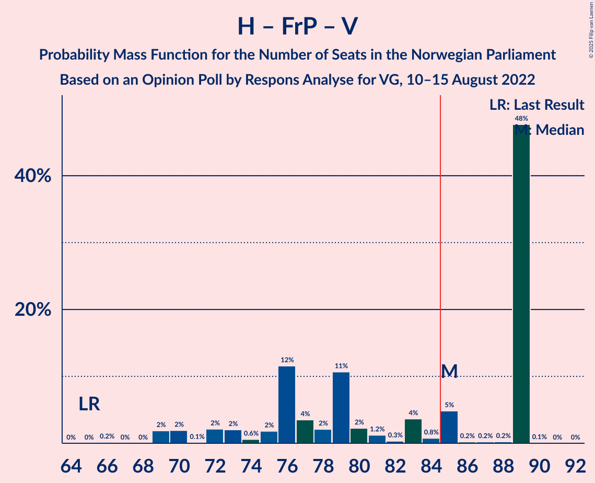
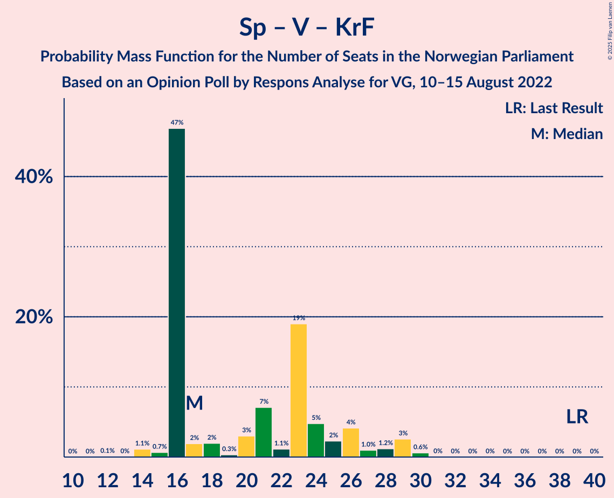

# Opinion Poll by Respons Analyse for VG, 10–15 August 2022

<a href="#voting-intentions">Voting Intentions</a> | <a href="#seats">Seats</a> | <a href="#coalitions">Coalitions</a> | <a href="#technical-information">Technical Information</a>

## Voting Intentions

### Confidence Intervals

| Party | Last Result | Poll Result | 80% Confidence Interval | 90% Confidence Interval | 95% Confidence Interval | 99% Confidence Interval |
|:-----:|:-----------:|:-----------:|:-----------------------:|:-----------------------:|:-----------------------:|:-----------------------:|
| Høyre | 20.4% | 28.8% | 27.0–30.7% |26.5–31.2% |26.0–31.7% |25.2–32.6% |
| Arbeiderpartiet | 26.2% | 19.9% | 18.3–21.6% |17.9–22.1% |17.5–22.5% |16.8–23.3% |
| Fremskrittspartiet | 11.6% | 12.5% | 11.2–13.9% |10.9–14.3% |10.6–14.7% |10.0–15.4% |
| Sosialistisk Venstreparti | 7.6% | 9.5% | 8.4–10.8% |8.1–11.2% |7.8–11.5% |7.3–12.1% |
| Rødt | 4.7% | 7.5% | 6.5–8.7% |6.2–9.0% |6.0–9.3% |5.6–9.9% |
| Senterpartiet | 13.5% | 6.6% | 5.7–7.7% |5.4–8.0% |5.2–8.3% |4.8–8.9% |
| Venstre | 4.6% | 4.1% | 3.4–5.0% |3.2–5.3% |3.0–5.5% |2.7–6.0% |
| Kristelig Folkeparti | 3.8% | 3.9% | 3.2–4.8% |3.0–5.1% |2.9–5.3% |2.6–5.8% |
| Miljøpartiet De Grønne | 3.9% | 3.8% | 3.1–4.7% |2.9–5.0% |2.8–5.2% |2.5–5.6% |
| Industri- og Næringspartiet | 0.3% | 1.7% | 1.3–2.4% |1.2–2.5% |1.1–2.7% |0.9–3.1% |
| Norgesdemokratene | 1.1% | 0.6% | 0.4–1.1% |0.3–1.2% |0.3–1.3% |0.2–1.6% |
| Konservativt | 0.4% | 0.6% | 0.4–1.1% |0.3–1.2% |0.3–1.3% |0.2–1.6% |
| Liberalistene | 0.2% | 0.3% | 0.2–0.7% |0.1–0.8% |0.1–0.9% |0.1–1.1% |
| Pensjonistpartiet | 0.6% | 0.3% | 0.2–0.7% |0.1–0.8% |0.1–0.9% |0.1–1.1% |

*Note:* The poll result column reflects the actual value used in the calculations. Published results may vary slightly, and in addition be rounded to fewer digits.

## Seats

### Confidence Intervals

| Party | Last Result | Median | 80% Confidence Interval | 90% Confidence Interval | 95% Confidence Interval | 99% Confidence Interval |
|:-----:|:-----------:|:------:|:-----------------------:|:-----------------------:|:-----------------------:|:-----------------------:|
| <a href="#høyre">Høyre</a> | 36 | 56 | 44–59 |44–59 |44–59 |42–59 |
| <a href="#arbeiderpartiet">Arbeiderpartiet</a> | 48 | 36 | 34–40 |33–42 |33–43 |33–46 |
| <a href="#fremskrittspartiet">Fremskrittspartiet</a> | 21 | 28 | 20–29 |19–29 |18–29 |18–29 |
| <a href="#sosialistisk-venstreparti">Sosialistisk Venstreparti</a> | 13 | 15 | 15–20 |12–20 |12–21 |10–22 |
| <a href="#rødt">Rødt</a> | 8 | 13 | 12–15 |11–15 |11–16 |10–17 |
| <a href="#senterpartiet">Senterpartiet</a> | 28 | 11 | 11–13 |10–13 |9–14 |8–16 |
| <a href="#venstre">Venstre</a> | 8 | 2 | 2–8 |2–9 |2–9 |2–10 |
| <a href="#kristelig-folkeparti">Kristelig Folkeparti</a> | 3 | 3 | 3–9 |2–9 |2–9 |2–10 |
| <a href="#miljøpartiet-de-grønne">Miljøpartiet De Grønne</a> | 3 | 1 | 1–7 |1–8 |1–9 |1–10 |
| <a href="#industri--og-næringspartiet">Industri- og Næringspartiet</a> | 0 | 0 | 0–1 |0–2 |0–2 |0–2 |
| <a href="#norgesdemokratene">Norgesdemokratene</a> | 0 | 0 | 0 |0 |0 |0 |
| <a href="#konservativt">Konservativt</a> | 0 | 0 | 0 |0 |0 |0 |
| <a href="#liberalistene">Liberalistene</a> | 0 | 0 | 0 |0 |0 |0 |
| <a href="#pensjonistpartiet">Pensjonistpartiet</a> | 0 | 0 | 0 |0 |0 |0 |

### Høyre

*For a full overview of the results for this party, see the [Høyre](party-høyre.html) page.*

| Number of Seats | Probability | Accumulated | Special Marks |
|:---------------:|:-----------:|:-----------:|:-------------:|
| 36 | 0% | 100% | Last Result |
| 37 | 0% | 100% |  |
| 38 | 0% | 100% |  |
| 39 | 0% | 100% |  |
| 40 | 0% | 100% |  |
| 41 | 0.3% | 100% |  |
| 42 | 2% | 99.7% |  |
| 43 | 0% | 98% |  |
| 44 | 11% | 98% |  |
| 45 | 0.7% | 87% |  |
| 46 | 0.7% | 86% |  |
| 47 | 0.1% | 86% |  |
| 48 | 3% | 86% |  |
| 49 | 8% | 83% |  |
| 50 | 3% | 74% |  |
| 51 | 3% | 72% |  |
| 52 | 1.0% | 68% |  |
| 53 | 5% | 67% |  |
| 54 | 3% | 62% |  |
| 55 | 2% | 60% |  |
| 56 | 10% | 57% | Median |
| 57 | 0.1% | 47% |  |
| 58 | 0.1% | 47% |  |
| 59 | 47% | 47% |  |
| 60 | 0% | 0.1% |  |
| 61 | 0% | 0% |  |

### Arbeiderpartiet

*For a full overview of the results for this party, see the [Arbeiderpartiet](party-arbeiderpartiet.html) page.*

| Number of Seats | Probability | Accumulated | Special Marks |
|:---------------:|:-----------:|:-----------:|:-------------:|
| 32 | 0.3% | 100% |  |
| 33 | 8% | 99.7% |  |
| 34 | 3% | 92% |  |
| 35 | 9% | 89% |  |
| 36 | 49% | 80% | Median |
| 37 | 2% | 31% |  |
| 38 | 16% | 29% |  |
| 39 | 1.1% | 13% |  |
| 40 | 3% | 12% |  |
| 41 | 4% | 9% |  |
| 42 | 3% | 5% |  |
| 43 | 0.7% | 3% |  |
| 44 | 0.1% | 2% |  |
| 45 | 0.3% | 2% |  |
| 46 | 1.4% | 1.4% |  |
| 47 | 0% | 0% |  |
| 48 | 0% | 0% | Last Result |

### Fremskrittspartiet

*For a full overview of the results for this party, see the [Fremskrittspartiet](party-fremskrittspartiet.html) page.*

| Number of Seats | Probability | Accumulated | Special Marks |
|:---------------:|:-----------:|:-----------:|:-------------:|
| 17 | 0.1% | 100% |  |
| 18 | 3% | 99.9% |  |
| 19 | 2% | 97% |  |
| 20 | 9% | 95% |  |
| 21 | 11% | 85% | Last Result |
| 22 | 5% | 74% |  |
| 23 | 3% | 69% |  |
| 24 | 5% | 66% |  |
| 25 | 2% | 61% |  |
| 26 | 1.4% | 60% |  |
| 27 | 0.1% | 58% |  |
| 28 | 47% | 58% | Median |
| 29 | 11% | 11% |  |
| 30 | 0% | 0.2% |  |
| 31 | 0.2% | 0.2% |  |
| 32 | 0% | 0% |  |

### Sosialistisk Venstreparti

*For a full overview of the results for this party, see the [Sosialistisk Venstreparti](party-sosialistiskvenstreparti.html) page.*

| Number of Seats | Probability | Accumulated | Special Marks |
|:---------------:|:-----------:|:-----------:|:-------------:|
| 10 | 1.1% | 100% |  |
| 11 | 1.3% | 98.9% |  |
| 12 | 3% | 98% |  |
| 13 | 0.2% | 95% | Last Result |
| 14 | 4% | 94% |  |
| 15 | 51% | 91% | Median |
| 16 | 12% | 40% |  |
| 17 | 6% | 28% |  |
| 18 | 4% | 22% |  |
| 19 | 7% | 18% |  |
| 20 | 9% | 11% |  |
| 21 | 2% | 3% |  |
| 22 | 0.6% | 0.7% |  |
| 23 | 0.1% | 0.1% |  |
| 24 | 0% | 0% |  |

### Rødt

*For a full overview of the results for this party, see the [Rødt](party-rødt.html) page.*

| Number of Seats | Probability | Accumulated | Special Marks |
|:---------------:|:-----------:|:-----------:|:-------------:|
| 8 | 0% | 100% | Last Result |
| 9 | 0.1% | 100% |  |
| 10 | 1.0% | 99.9% |  |
| 11 | 5% | 98.8% |  |
| 12 | 7% | 94% |  |
| 13 | 65% | 87% | Median |
| 14 | 4% | 22% |  |
| 15 | 15% | 18% |  |
| 16 | 0.9% | 3% |  |
| 17 | 2% | 2% |  |
| 18 | 0.1% | 0.2% |  |
| 19 | 0.1% | 0.1% |  |
| 20 | 0% | 0% |  |

### Senterpartiet

*For a full overview of the results for this party, see the [Senterpartiet](party-senterpartiet.html) page.*

| Number of Seats | Probability | Accumulated | Special Marks |
|:---------------:|:-----------:|:-----------:|:-------------:|
| 2 | 0.1% | 100% |  |
| 3 | 0% | 99.9% |  |
| 4 | 0% | 99.9% |  |
| 5 | 0% | 99.9% |  |
| 6 | 0% | 99.9% |  |
| 7 | 0.3% | 99.9% |  |
| 8 | 0.4% | 99.7% |  |
| 9 | 3% | 99.3% |  |
| 10 | 6% | 96% |  |
| 11 | 65% | 91% | Median |
| 12 | 12% | 26% |  |
| 13 | 11% | 14% |  |
| 14 | 2% | 4% |  |
| 15 | 0.5% | 1.5% |  |
| 16 | 0.9% | 1.0% |  |
| 17 | 0% | 0% |  |
| 18 | 0% | 0% |  |
| 19 | 0% | 0% |  |
| 20 | 0% | 0% |  |
| 21 | 0% | 0% |  |
| 22 | 0% | 0% |  |
| 23 | 0% | 0% |  |
| 24 | 0% | 0% |  |
| 25 | 0% | 0% |  |
| 26 | 0% | 0% |  |
| 27 | 0% | 0% |  |
| 28 | 0% | 0% | Last Result |

### Venstre

*For a full overview of the results for this party, see the [Venstre](party-venstre.html) page.*

| Number of Seats | Probability | Accumulated | Special Marks |
|:---------------:|:-----------:|:-----------:|:-------------:|
| 2 | 63% | 100% | Median |
| 3 | 14% | 37% |  |
| 4 | 0% | 23% |  |
| 5 | 0% | 23% |  |
| 6 | 0% | 23% |  |
| 7 | 5% | 23% |  |
| 8 | 11% | 18% | Last Result |
| 9 | 5% | 7% |  |
| 10 | 1.1% | 1.5% |  |
| 11 | 0.4% | 0.4% |  |
| 12 | 0% | 0% |  |

### Kristelig Folkeparti

*For a full overview of the results for this party, see the [Kristelig Folkeparti](party-kristeligfolkeparti.html) page.*

| Number of Seats | Probability | Accumulated | Special Marks |
|:---------------:|:-----------:|:-----------:|:-------------:|
| 1 | 0% | 100% |  |
| 2 | 9% | 99.9% |  |
| 3 | 55% | 91% | Last Result, Median |
| 4 | 0% | 36% |  |
| 5 | 0% | 36% |  |
| 6 | 3% | 36% |  |
| 7 | 10% | 33% |  |
| 8 | 8% | 23% |  |
| 9 | 12% | 15% |  |
| 10 | 2% | 2% |  |
| 11 | 0.1% | 0.1% |  |
| 12 | 0% | 0% |  |

### Miljøpartiet De Grønne

*For a full overview of the results for this party, see the [Miljøpartiet De Grønne](party-miljøpartietdegrønne.html) page.*

| Number of Seats | Probability | Accumulated | Special Marks |
|:---------------:|:-----------:|:-----------:|:-------------:|
| 1 | 53% | 100% | Median |
| 2 | 14% | 47% |  |
| 3 | 14% | 33% | Last Result |
| 4 | 0% | 19% |  |
| 5 | 0% | 19% |  |
| 6 | 0% | 19% |  |
| 7 | 10% | 19% |  |
| 8 | 5% | 8% |  |
| 9 | 2% | 3% |  |
| 10 | 0.7% | 0.8% |  |
| 11 | 0.1% | 0.1% |  |
| 12 | 0% | 0% |  |

### Industri- og Næringspartiet

*For a full overview of the results for this party, see the [Industri- og Næringspartiet](party-industri-ognæringspartiet.html) page.*

| Number of Seats | Probability | Accumulated | Special Marks |
|:---------------:|:-----------:|:-----------:|:-------------:|
| 0 | 89% | 100% | Last Result, Median |
| 1 | 2% | 11% |  |
| 2 | 9% | 9% |  |
| 3 | 0% | 0% |  |

### Norgesdemokratene

*For a full overview of the results for this party, see the [Norgesdemokratene](party-norgesdemokratene.html) page.*

| Number of Seats | Probability | Accumulated | Special Marks |
|:---------------:|:-----------:|:-----------:|:-------------:|
| 0 | 100% | 100% | Last Result, Median |

### Konservativt

*For a full overview of the results for this party, see the [Konservativt](party-konservativt.html) page.*

| Number of Seats | Probability | Accumulated | Special Marks |
|:---------------:|:-----------:|:-----------:|:-------------:|
| 0 | 100% | 100% | Last Result, Median |

### Liberalistene

*For a full overview of the results for this party, see the [Liberalistene](party-liberalistene.html) page.*

| Number of Seats | Probability | Accumulated | Special Marks |
|:---------------:|:-----------:|:-----------:|:-------------:|
| 0 | 100% | 100% | Last Result, Median |

### Pensjonistpartiet

*For a full overview of the results for this party, see the [Pensjonistpartiet](party-pensjonistpartiet.html) page.*

| Number of Seats | Probability | Accumulated | Special Marks |
|:---------------:|:-----------:|:-----------:|:-------------:|
| 0 | 100% | 100% | Last Result, Median |

## Coalitions

### Confidence Intervals

| Coalition | Last Result | Median | Majority? | 80% Confidence Interval | 90% Confidence Interval | 95% Confidence Interval | 99% Confidence Interval |
|:---------:|:-----------:|:------:|:---------:|:-----------------------:|:-----------------------:|:-----------------------:|:-----------------------:|
| Høyre – Fremskrittspartiet – Senterpartiet – Venstre – Kristelig Folkeparti | 96 | 101 | 98% | 93–103 | 89–103 | 87–103 | 84–103 |
| Høyre – Fremskrittspartiet – Venstre – Kristelig Folkeparti – Miljøpartiet De Grønne | 71 | 93 | 92% | 85–93 | 83–95 | 79–99 | 77–99 |
| Arbeiderpartiet – Sosialistisk Venstreparti – Rødt – Senterpartiet – Miljøpartiet De Grønne | 100 | 77 | 14% | 76–87 | 76–90 | 76–92 | 76–96 |
| Høyre – Fremskrittspartiet – Venstre – Kristelig Folkeparti | 68 | 91 | 84% | 81–92 | 78–92 | 75–92 | 72–92 |
| Høyre – Fremskrittspartiet – Venstre | 65 | 85 | 53% | 75–89 | 72–89 | 70–89 | 69–89 |
| Arbeiderpartiet – Sosialistisk Venstreparti – Rødt – Senterpartiet | 97 | 75 | 7% | 75–83 | 73–85 | 69–89 | 69–89 |
| Høyre – Fremskrittspartiet | 57 | 77 | 47% | 70–87 | 68–87 | 66–87 | 61–87 |
| Arbeiderpartiet – Sosialistisk Venstreparti – Senterpartiet – Kristelig Folkeparti – Miljøpartiet De Grønne | 95 | 70 | 3% | 66–80 | 66–83 | 66–85 | 66–86 |
| Arbeiderpartiet – Sosialistisk Venstreparti – Rødt – Miljøpartiet De Grønne | 72 | 67 | 0% | 65–74 | 65–77 | 65–81 | 65–84 |
| Arbeiderpartiet – Sosialistisk Venstreparti – Senterpartiet – Miljøpartiet De Grønne | 92 | 64 | 0% | 63–73 | 63–77 | 63–79 | 63–82 |
| Arbeiderpartiet – Sosialistisk Venstreparti – Senterpartiet | 89 | 62 | 0% | 62–69 | 60–72 | 56–75 | 56–75 |
| Høyre – Venstre – Kristelig Folkeparti | 47 | 64 | 0% | 56–65 | 56–67 | 55–67 | 53–68 |
| Arbeiderpartiet – Senterpartiet – Kristelig Folkeparti – Miljøpartiet De Grønne | 82 | 53 | 0% | 51–63 | 51–64 | 51–65 | 50–75 |
| Arbeiderpartiet – Senterpartiet – Kristelig Folkeparti | 79 | 50 | 0% | 50–58 | 50–59 | 48–63 | 46–68 |
| Arbeiderpartiet – Sosialistisk Venstreparti | 61 | 51 | 0% | 51–57 | 50–59 | 47–61 | 45–63 |
| Arbeiderpartiet – Senterpartiet | 76 | 47 | 0% | 45–52 | 44–54 | 44–55 | 43–60 |
| Senterpartiet – Venstre – Kristelig Folkeparti | 39 | 17 | 0% | 16–25 | 16–27 | 16–29 | 14–30 |

### Høyre – Fremskrittspartiet – Senterpartiet – Venstre – Kristelig Folkeparti

| Number of Seats | Probability | Accumulated | Special Marks |
|:---------------:|:-----------:|:-----------:|:-------------:|
| 84 | 2% | 100% |  |
| 85 | 0.1% | 98% | Majority |
| 86 | 0.2% | 98% |  |
| 87 | 0.9% | 98% |  |
| 88 | 0.3% | 97% |  |
| 89 | 2% | 97% |  |
| 90 | 0.4% | 95% |  |
| 91 | 0.8% | 95% |  |
| 92 | 2% | 94% |  |
| 93 | 2% | 91% |  |
| 94 | 2% | 89% |  |
| 95 | 5% | 88% |  |
| 96 | 15% | 83% | Last Result |
| 97 | 0.5% | 68% |  |
| 98 | 7% | 67% |  |
| 99 | 5% | 60% |  |
| 100 | 3% | 55% | Median |
| 101 | 4% | 52% |  |
| 102 | 0.5% | 48% |  |
| 103 | 48% | 48% |  |
| 104 | 0.1% | 0.1% |  |
| 105 | 0% | 0.1% |  |
| 106 | 0% | 0.1% |  |
| 107 | 0.1% | 0.1% |  |
| 108 | 0% | 0% |  |

### Høyre – Fremskrittspartiet – Venstre – Kristelig Folkeparti – Miljøpartiet De Grønne

| Number of Seats | Probability | Accumulated | Special Marks |
|:---------------:|:-----------:|:-----------:|:-------------:|
| 71 | 0% | 100% | Last Result |
| 72 | 0% | 100% |  |
| 73 | 0% | 100% |  |
| 74 | 0% | 100% |  |
| 75 | 0% | 100% |  |
| 76 | 0% | 100% |  |
| 77 | 0.7% | 100% |  |
| 78 | 0% | 99.3% |  |
| 79 | 2% | 99.3% |  |
| 80 | 0.1% | 97% |  |
| 81 | 0.1% | 97% |  |
| 82 | 2% | 97% |  |
| 83 | 3% | 95% |  |
| 84 | 0.6% | 93% |  |
| 85 | 2% | 92% | Majority |
| 86 | 3% | 90% |  |
| 87 | 4% | 87% |  |
| 88 | 19% | 83% |  |
| 89 | 1.3% | 64% |  |
| 90 | 2% | 63% | Median |
| 91 | 2% | 61% |  |
| 92 | 4% | 59% |  |
| 93 | 50% | 56% |  |
| 94 | 0.8% | 6% |  |
| 95 | 2% | 5% |  |
| 96 | 0.1% | 3% |  |
| 97 | 0% | 3% |  |
| 98 | 0% | 3% |  |
| 99 | 3% | 3% |  |
| 100 | 0% | 0% |  |

### Arbeiderpartiet – Sosialistisk Venstreparti – Rødt – Senterpartiet – Miljøpartiet De Grønne

| Number of Seats | Probability | Accumulated | Special Marks |
|:---------------:|:-----------:|:-----------:|:-------------:|
| 73 | 0% | 100% |  |
| 74 | 0% | 99.9% |  |
| 75 | 0% | 99.9% |  |
| 76 | 48% | 99.9% | Median |
| 77 | 3% | 52% |  |
| 78 | 1.4% | 49% |  |
| 79 | 0.2% | 48% |  |
| 80 | 9% | 48% |  |
| 81 | 2% | 39% |  |
| 82 | 4% | 36% |  |
| 83 | 17% | 33% |  |
| 84 | 2% | 16% |  |
| 85 | 1.1% | 14% | Majority |
| 86 | 2% | 12% |  |
| 87 | 2% | 10% |  |
| 88 | 0.9% | 8% |  |
| 89 | 1.4% | 7% |  |
| 90 | 2% | 6% |  |
| 91 | 2% | 4% |  |
| 92 | 0.7% | 3% |  |
| 93 | 0.1% | 2% |  |
| 94 | 0% | 2% |  |
| 95 | 0.2% | 2% |  |
| 96 | 2% | 2% |  |
| 97 | 0% | 0% |  |
| 98 | 0% | 0% |  |
| 99 | 0% | 0% |  |
| 100 | 0% | 0% | Last Result |

### Høyre – Fremskrittspartiet – Venstre – Kristelig Folkeparti

| Number of Seats | Probability | Accumulated | Special Marks |
|:---------------:|:-----------:|:-----------:|:-------------:|
| 68 | 0% | 100% | Last Result |
| 69 | 0% | 100% |  |
| 70 | 0% | 100% |  |
| 71 | 0% | 100% |  |
| 72 | 2% | 100% |  |
| 73 | 0.2% | 98% |  |
| 74 | 0% | 98% |  |
| 75 | 0.8% | 98% |  |
| 76 | 0.7% | 97% |  |
| 77 | 1.0% | 97% |  |
| 78 | 2% | 96% |  |
| 79 | 0.8% | 93% |  |
| 80 | 0.9% | 93% |  |
| 81 | 3% | 92% |  |
| 82 | 2% | 89% |  |
| 83 | 1.0% | 87% |  |
| 84 | 1.3% | 86% |  |
| 85 | 17% | 84% | Majority |
| 86 | 9% | 67% |  |
| 87 | 2% | 58% |  |
| 88 | 4% | 55% |  |
| 89 | 0.1% | 51% | Median |
| 90 | 0.5% | 51% |  |
| 91 | 3% | 51% |  |
| 92 | 48% | 48% |  |
| 93 | 0% | 0.1% |  |
| 94 | 0% | 0.1% |  |
| 95 | 0% | 0% |  |

### Høyre – Fremskrittspartiet – Venstre

| Number of Seats | Probability | Accumulated | Special Marks |
|:---------------:|:-----------:|:-----------:|:-------------:|
| 65 | 0% | 100% | Last Result |
| 66 | 0.2% | 100% |  |
| 67 | 0% | 99.8% |  |
| 68 | 0% | 99.8% |  |
| 69 | 2% | 99.8% |  |
| 70 | 2% | 98% |  |
| 71 | 0.1% | 96% |  |
| 72 | 2% | 96% |  |
| 73 | 2% | 94% |  |
| 74 | 0.6% | 92% |  |
| 75 | 2% | 91% |  |
| 76 | 12% | 89% |  |
| 77 | 4% | 78% |  |
| 78 | 2% | 74% |  |
| 79 | 11% | 72% |  |
| 80 | 2% | 61% |  |
| 81 | 1.2% | 59% |  |
| 82 | 0.3% | 58% |  |
| 83 | 4% | 58% |  |
| 84 | 0.8% | 54% |  |
| 85 | 5% | 53% | Majority |
| 86 | 0.2% | 48% | Median |
| 87 | 0.2% | 48% |  |
| 88 | 0.2% | 48% |  |
| 89 | 48% | 48% |  |
| 90 | 0.1% | 0.1% |  |
| 91 | 0% | 0% |  |

### Arbeiderpartiet – Sosialistisk Venstreparti – Rødt – Senterpartiet

| Number of Seats | Probability | Accumulated | Special Marks |
|:---------------:|:-----------:|:-----------:|:-------------:|
| 69 | 3% | 100% |  |
| 70 | 0.1% | 97% |  |
| 71 | 1.2% | 97% |  |
| 72 | 0.3% | 96% |  |
| 73 | 1.3% | 96% |  |
| 74 | 0.8% | 95% |  |
| 75 | 50% | 94% | Median |
| 76 | 3% | 44% |  |
| 77 | 3% | 41% |  |
| 78 | 8% | 38% |  |
| 79 | 0.3% | 30% |  |
| 80 | 14% | 30% |  |
| 81 | 4% | 16% |  |
| 82 | 2% | 12% |  |
| 83 | 2% | 10% |  |
| 84 | 0.6% | 8% |  |
| 85 | 3% | 7% | Majority |
| 86 | 2% | 4% |  |
| 87 | 0.1% | 3% |  |
| 88 | 0.1% | 3% |  |
| 89 | 3% | 3% |  |
| 90 | 0% | 0% |  |
| 91 | 0% | 0% |  |
| 92 | 0% | 0% |  |
| 93 | 0% | 0% |  |
| 94 | 0% | 0% |  |
| 95 | 0% | 0% |  |
| 96 | 0% | 0% |  |
| 97 | 0% | 0% | Last Result |

### Høyre – Fremskrittspartiet

| Number of Seats | Probability | Accumulated | Special Marks |
|:---------------:|:-----------:|:-----------:|:-------------:|
| 57 | 0% | 100% | Last Result |
| 58 | 0% | 100% |  |
| 59 | 0% | 100% |  |
| 60 | 0% | 100% |  |
| 61 | 2% | 100% |  |
| 62 | 0.3% | 98% |  |
| 63 | 0% | 98% |  |
| 64 | 0.2% | 98% |  |
| 65 | 0.1% | 98% |  |
| 66 | 0.1% | 98% |  |
| 67 | 0.7% | 97% |  |
| 68 | 2% | 97% |  |
| 69 | 3% | 95% |  |
| 70 | 5% | 91% |  |
| 71 | 3% | 86% |  |
| 72 | 2% | 84% |  |
| 73 | 13% | 81% |  |
| 74 | 1.2% | 69% |  |
| 75 | 3% | 67% |  |
| 76 | 3% | 64% |  |
| 77 | 11% | 61% |  |
| 78 | 0.2% | 50% |  |
| 79 | 0.3% | 50% |  |
| 80 | 1.1% | 49% |  |
| 81 | 0.1% | 48% |  |
| 82 | 1.1% | 48% |  |
| 83 | 0% | 47% |  |
| 84 | 0.1% | 47% | Median |
| 85 | 0.2% | 47% | Majority |
| 86 | 0% | 47% |  |
| 87 | 47% | 47% |  |
| 88 | 0% | 0% |  |

### Arbeiderpartiet – Sosialistisk Venstreparti – Senterpartiet – Kristelig Folkeparti – Miljøpartiet De Grønne

| Number of Seats | Probability | Accumulated | Special Marks |
|:---------------:|:-----------:|:-----------:|:-------------:|
| 66 | 47% | 100% | Median |
| 67 | 0.1% | 53% |  |
| 68 | 1.0% | 53% |  |
| 69 | 0.3% | 52% |  |
| 70 | 7% | 51% |  |
| 71 | 0.4% | 44% |  |
| 72 | 2% | 44% |  |
| 73 | 3% | 42% |  |
| 74 | 6% | 39% |  |
| 75 | 2% | 33% |  |
| 76 | 2% | 30% |  |
| 77 | 13% | 28% |  |
| 78 | 1.0% | 15% |  |
| 79 | 2% | 14% |  |
| 80 | 3% | 12% |  |
| 81 | 1.2% | 8% |  |
| 82 | 0.1% | 7% |  |
| 83 | 4% | 7% |  |
| 84 | 0.1% | 3% |  |
| 85 | 2% | 3% | Majority |
| 86 | 1.3% | 2% |  |
| 87 | 0% | 0.2% |  |
| 88 | 0% | 0.2% |  |
| 89 | 0% | 0.2% |  |
| 90 | 0.2% | 0.2% |  |
| 91 | 0% | 0% |  |
| 92 | 0% | 0% |  |
| 93 | 0% | 0% |  |
| 94 | 0% | 0% |  |
| 95 | 0% | 0% | Last Result |

### Arbeiderpartiet – Sosialistisk Venstreparti – Rødt – Miljøpartiet De Grønne

| Number of Seats | Probability | Accumulated | Special Marks |
|:---------------:|:-----------:|:-----------:|:-------------:|
| 61 | 0.1% | 100% |  |
| 62 | 0% | 99.9% |  |
| 63 | 0% | 99.9% |  |
| 64 | 0.1% | 99.9% |  |
| 65 | 49% | 99.8% | Median |
| 66 | 0.5% | 51% |  |
| 67 | 2% | 50% |  |
| 68 | 9% | 48% |  |
| 69 | 5% | 39% |  |
| 70 | 1.5% | 34% |  |
| 71 | 0.5% | 33% |  |
| 72 | 16% | 32% | Last Result |
| 73 | 5% | 16% |  |
| 74 | 2% | 11% |  |
| 75 | 1.0% | 10% |  |
| 76 | 3% | 9% |  |
| 77 | 0.9% | 5% |  |
| 78 | 0.1% | 5% |  |
| 79 | 1.1% | 4% |  |
| 80 | 0.3% | 3% |  |
| 81 | 0.9% | 3% |  |
| 82 | 0.2% | 2% |  |
| 83 | 0.1% | 2% |  |
| 84 | 2% | 2% |  |
| 85 | 0% | 0% | Majority |

### Arbeiderpartiet – Sosialistisk Venstreparti – Senterpartiet – Miljøpartiet De Grønne

| Number of Seats | Probability | Accumulated | Special Marks |
|:---------------:|:-----------:|:-----------:|:-------------:|
| 61 | 0% | 100% |  |
| 62 | 0.1% | 99.9% |  |
| 63 | 47% | 99.9% | Median |
| 64 | 3% | 53% |  |
| 65 | 2% | 50% |  |
| 66 | 0.4% | 47% |  |
| 67 | 9% | 47% |  |
| 68 | 15% | 39% |  |
| 69 | 0.9% | 23% |  |
| 70 | 5% | 22% |  |
| 71 | 2% | 17% |  |
| 72 | 4% | 15% |  |
| 73 | 3% | 11% |  |
| 74 | 0.1% | 8% |  |
| 75 | 2% | 8% |  |
| 76 | 1.1% | 7% |  |
| 77 | 0.8% | 6% |  |
| 78 | 2% | 5% |  |
| 79 | 0.6% | 3% |  |
| 80 | 0.1% | 2% |  |
| 81 | 0% | 2% |  |
| 82 | 2% | 2% |  |
| 83 | 0.2% | 0.2% |  |
| 84 | 0% | 0% |  |
| 85 | 0% | 0% | Majority |
| 86 | 0% | 0% |  |
| 87 | 0% | 0% |  |
| 88 | 0% | 0% |  |
| 89 | 0% | 0% |  |
| 90 | 0% | 0% |  |
| 91 | 0% | 0% |  |
| 92 | 0% | 0% | Last Result |

### Arbeiderpartiet – Sosialistisk Venstreparti – Senterpartiet

| Number of Seats | Probability | Accumulated | Special Marks |
|:---------------:|:-----------:|:-----------:|:-------------:|
| 56 | 3% | 100% |  |
| 57 | 0% | 97% |  |
| 58 | 1.2% | 97% |  |
| 59 | 0.2% | 96% |  |
| 60 | 0.9% | 96% |  |
| 61 | 0.7% | 95% |  |
| 62 | 49% | 94% | Median |
| 63 | 3% | 46% |  |
| 64 | 1.5% | 43% |  |
| 65 | 21% | 41% |  |
| 66 | 4% | 20% |  |
| 67 | 3% | 16% |  |
| 68 | 1.2% | 13% |  |
| 69 | 2% | 12% |  |
| 70 | 0.8% | 10% |  |
| 71 | 4% | 9% |  |
| 72 | 2% | 5% |  |
| 73 | 0.2% | 3% |  |
| 74 | 0.2% | 3% |  |
| 75 | 3% | 3% |  |
| 76 | 0% | 0.1% |  |
| 77 | 0% | 0% |  |
| 78 | 0% | 0% |  |
| 79 | 0% | 0% |  |
| 80 | 0% | 0% |  |
| 81 | 0% | 0% |  |
| 82 | 0% | 0% |  |
| 83 | 0% | 0% |  |
| 84 | 0% | 0% |  |
| 85 | 0% | 0% | Majority |
| 86 | 0% | 0% |  |
| 87 | 0% | 0% |  |
| 88 | 0% | 0% |  |
| 89 | 0% | 0% | Last Result |

### Høyre – Venstre – Kristelig Folkeparti

| Number of Seats | Probability | Accumulated | Special Marks |
|:---------------:|:-----------:|:-----------:|:-------------:|
| 47 | 0% | 100% | Last Result |
| 48 | 0% | 100% |  |
| 49 | 0% | 100% |  |
| 50 | 0% | 100% |  |
| 51 | 0.1% | 100% |  |
| 52 | 0% | 99.9% |  |
| 53 | 2% | 99.9% |  |
| 54 | 0.4% | 98% |  |
| 55 | 2% | 98% |  |
| 56 | 12% | 95% |  |
| 57 | 2% | 84% |  |
| 58 | 0.3% | 82% |  |
| 59 | 2% | 82% |  |
| 60 | 5% | 80% |  |
| 61 | 0.6% | 75% | Median |
| 62 | 1.3% | 74% |  |
| 63 | 0.4% | 73% |  |
| 64 | 48% | 72% |  |
| 65 | 18% | 25% |  |
| 66 | 0.2% | 7% |  |
| 67 | 6% | 7% |  |
| 68 | 1.2% | 1.5% |  |
| 69 | 0.1% | 0.2% |  |
| 70 | 0% | 0.1% |  |
| 71 | 0.1% | 0.1% |  |
| 72 | 0% | 0% |  |

### Arbeiderpartiet – Senterpartiet – Kristelig Folkeparti – Miljøpartiet De Grønne

| Number of Seats | Probability | Accumulated | Special Marks |
|:---------------:|:-----------:|:-----------:|:-------------:|
| 47 | 0% | 100% |  |
| 48 | 0.1% | 99.9% |  |
| 49 | 0.3% | 99.9% |  |
| 50 | 1.2% | 99.5% |  |
| 51 | 48% | 98% | Median |
| 52 | 0.2% | 51% |  |
| 53 | 1.3% | 50% |  |
| 54 | 8% | 49% |  |
| 55 | 0.5% | 41% |  |
| 56 | 4% | 41% |  |
| 57 | 0.5% | 37% |  |
| 58 | 8% | 37% |  |
| 59 | 1.3% | 29% |  |
| 60 | 1.2% | 28% |  |
| 61 | 12% | 27% |  |
| 62 | 3% | 15% |  |
| 63 | 5% | 12% |  |
| 64 | 5% | 8% |  |
| 65 | 0.9% | 3% |  |
| 66 | 0.1% | 2% |  |
| 67 | 0.1% | 2% |  |
| 68 | 0.1% | 2% |  |
| 69 | 0.2% | 2% |  |
| 70 | 0% | 2% |  |
| 71 | 0% | 1.5% |  |
| 72 | 0.2% | 1.5% |  |
| 73 | 0% | 1.3% |  |
| 74 | 0% | 1.3% |  |
| 75 | 1.3% | 1.3% |  |
| 76 | 0% | 0% |  |
| 77 | 0% | 0% |  |
| 78 | 0% | 0% |  |
| 79 | 0% | 0% |  |
| 80 | 0% | 0% |  |
| 81 | 0% | 0% |  |
| 82 | 0% | 0% | Last Result |

### Arbeiderpartiet – Senterpartiet – Kristelig Folkeparti

| Number of Seats | Probability | Accumulated | Special Marks |
|:---------------:|:-----------:|:-----------:|:-------------:|
| 44 | 0% | 100% |  |
| 45 | 0.2% | 99.9% |  |
| 46 | 0.9% | 99.8% |  |
| 47 | 1.2% | 98.9% |  |
| 48 | 0.4% | 98% |  |
| 49 | 1.2% | 97% |  |
| 50 | 52% | 96% | Median |
| 51 | 0.8% | 44% |  |
| 52 | 7% | 43% |  |
| 53 | 2% | 37% |  |
| 54 | 3% | 35% |  |
| 55 | 3% | 32% |  |
| 56 | 8% | 29% |  |
| 57 | 5% | 21% |  |
| 58 | 11% | 16% |  |
| 59 | 1.1% | 5% |  |
| 60 | 0.2% | 4% |  |
| 61 | 0.1% | 4% |  |
| 62 | 0.1% | 4% |  |
| 63 | 2% | 4% |  |
| 64 | 0.1% | 1.4% |  |
| 65 | 0% | 1.4% |  |
| 66 | 0% | 1.3% |  |
| 67 | 0% | 1.3% |  |
| 68 | 1.3% | 1.3% |  |
| 69 | 0% | 0% |  |
| 70 | 0% | 0% |  |
| 71 | 0% | 0% |  |
| 72 | 0% | 0% |  |
| 73 | 0% | 0% |  |
| 74 | 0% | 0% |  |
| 75 | 0% | 0% |  |
| 76 | 0% | 0% |  |
| 77 | 0% | 0% |  |
| 78 | 0% | 0% |  |
| 79 | 0% | 0% | Last Result |

### Arbeiderpartiet – Sosialistisk Venstreparti

| Number of Seats | Probability | Accumulated | Special Marks |
|:---------------:|:-----------:|:-----------:|:-------------:|
| 45 | 1.1% | 100% |  |
| 46 | 0.1% | 98.9% |  |
| 47 | 3% | 98.8% |  |
| 48 | 0% | 96% |  |
| 49 | 0.7% | 96% |  |
| 50 | 4% | 95% |  |
| 51 | 48% | 92% | Median |
| 52 | 2% | 43% |  |
| 53 | 8% | 41% |  |
| 54 | 12% | 33% |  |
| 55 | 7% | 21% |  |
| 56 | 2% | 14% |  |
| 57 | 3% | 12% |  |
| 58 | 1.4% | 9% |  |
| 59 | 4% | 7% |  |
| 60 | 0.1% | 3% |  |
| 61 | 1.4% | 3% | Last Result |
| 62 | 0% | 2% |  |
| 63 | 2% | 2% |  |
| 64 | 0% | 0% |  |

### Arbeiderpartiet – Senterpartiet

| Number of Seats | Probability | Accumulated | Special Marks |
|:---------------:|:-----------:|:-----------:|:-------------:|
| 41 | 0.1% | 100% |  |
| 42 | 0.4% | 99.9% |  |
| 43 | 0.2% | 99.5% |  |
| 44 | 5% | 99.4% |  |
| 45 | 6% | 95% |  |
| 46 | 0.5% | 88% |  |
| 47 | 51% | 88% | Median |
| 48 | 9% | 37% |  |
| 49 | 12% | 28% |  |
| 50 | 2% | 15% |  |
| 51 | 1.3% | 13% |  |
| 52 | 4% | 12% |  |
| 53 | 3% | 8% |  |
| 54 | 3% | 6% |  |
| 55 | 0.8% | 3% |  |
| 56 | 0.2% | 2% |  |
| 57 | 0.4% | 2% |  |
| 58 | 0% | 1.5% |  |
| 59 | 0.1% | 1.5% |  |
| 60 | 1.4% | 1.4% |  |
| 61 | 0% | 0% |  |
| 62 | 0% | 0% |  |
| 63 | 0% | 0% |  |
| 64 | 0% | 0% |  |
| 65 | 0% | 0% |  |
| 66 | 0% | 0% |  |
| 67 | 0% | 0% |  |
| 68 | 0% | 0% |  |
| 69 | 0% | 0% |  |
| 70 | 0% | 0% |  |
| 71 | 0% | 0% |  |
| 72 | 0% | 0% |  |
| 73 | 0% | 0% |  |
| 74 | 0% | 0% |  |
| 75 | 0% | 0% |  |
| 76 | 0% | 0% | Last Result |

### Senterpartiet – Venstre – Kristelig Folkeparti

| Number of Seats | Probability | Accumulated | Special Marks |
|:---------------:|:-----------:|:-----------:|:-------------:|
| 12 | 0.1% | 100% |  |
| 13 | 0% | 99.9% |  |
| 14 | 1.1% | 99.9% |  |
| 15 | 0.7% | 98.7% |  |
| 16 | 47% | 98% | Median |
| 17 | 2% | 51% |  |
| 18 | 2% | 49% |  |
| 19 | 0.3% | 47% |  |
| 20 | 3% | 47% |  |
| 21 | 7% | 44% |  |
| 22 | 1.1% | 37% |  |
| 23 | 19% | 36% |  |
| 24 | 5% | 17% |  |
| 25 | 2% | 12% |  |
| 26 | 4% | 10% |  |
| 27 | 1.0% | 5% |  |
| 28 | 1.2% | 4% |  |
| 29 | 3% | 3% |  |
| 30 | 0.6% | 0.7% |  |
| 31 | 0% | 0.1% |  |
| 32 | 0% | 0.1% |  |
| 33 | 0% | 0% |  |
| 34 | 0% | 0% |  |
| 35 | 0% | 0% |  |
| 36 | 0% | 0% |  |
| 37 | 0% | 0% |  |
| 38 | 0% | 0% |  |
| 39 | 0% | 0% | Last Result |

## Technical Information

### Opinion Poll

+ **Polling firm:** Respons Analyse
+ **Commissioner(s):** VG
+ **Fieldwork period:** 10–15 August 2022

### Calculations

+ **Sample size:** 1001
+ **Simulations done:** 1,048,576
+ **Error estimate:** 2.27%

