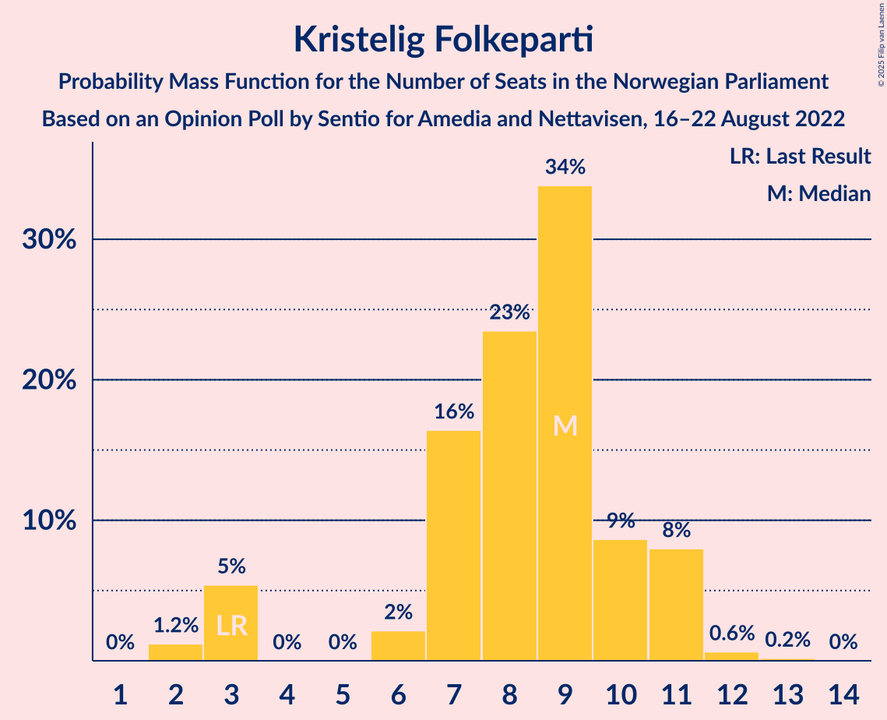

# Opinion Poll by Sentio for Amedia and Nettavisen, 16–22 August 2022

<a href="#voting-intentions">Voting Intentions</a> | <a href="#seats">Seats</a> | <a href="#coalitions">Coalitions</a> | <a href="#technical-information">Technical Information</a>

## Voting Intentions

### Confidence Intervals

| Party | Last Result | Poll Result | 80% Confidence Interval | 90% Confidence Interval | 95% Confidence Interval | 99% Confidence Interval |
|:-----:|:-----------:|:-----------:|:-----------------------:|:-----------------------:|:-----------------------:|:-----------------------:|
| Høyre | 20.4% | 28.9% | 27.1–30.8% |26.6–31.3% |26.2–31.8% |25.3–32.7% |
| Arbeiderpartiet | 26.2% | 20.2% | 18.6–21.9% |18.2–22.4% |17.8–22.8% |17.1–23.6% |
| Fremskrittspartiet | 11.6% | 13.4% | 12.1–14.9% |11.7–15.3% |11.4–15.7% |10.8–16.4% |
| Sosialistisk Venstreparti | 7.6% | 8.7% | 7.7–10.0% |7.3–10.3% |7.1–10.6% |6.6–11.2% |
| Senterpartiet | 13.5% | 6.9% | 6.0–8.0% |5.7–8.4% |5.5–8.7% |5.1–9.2% |
| Rødt | 4.7% | 5.8% | 5.0–6.9% |4.7–7.2% |4.5–7.4% |4.1–8.0% |
| Kristelig Folkeparti | 3.8% | 4.9% | 4.1–5.9% |3.9–6.2% |3.7–6.4% |3.4–6.9% |
| Venstre | 4.6% | 3.8% | 3.1–4.7% |2.9–5.0% |2.8–5.2% |2.5–5.6% |
| Miljøpartiet De Grønne | 3.9% | 3.8% | 3.1–4.7% |2.9–5.0% |2.8–5.2% |2.5–5.6% |

*Note:* The poll result column reflects the actual value used in the calculations. Published results may vary slightly, and in addition be rounded to fewer digits.

## Seats

### Confidence Intervals

| Party | Last Result | Median | 80% Confidence Interval | 90% Confidence Interval | 95% Confidence Interval | 99% Confidence Interval |
|:-----:|:-----------:|:------:|:-----------------------:|:-----------------------:|:-----------------------:|:-----------------------:|
| <a href="#høyre">Høyre</a> | 36 | 51 | 47–54 |46–55 |46–56 |45–59 |
| <a href="#arbeiderpartiet">Arbeiderpartiet</a> | 48 | 38 | 35–43 |34–44 |34–44 |33–46 |
| <a href="#fremskrittspartiet">Fremskrittspartiet</a> | 21 | 24 | 20–27 |20–28 |19–29 |18–30 |
| <a href="#sosialistisk-venstreparti">Sosialistisk Venstreparti</a> | 13 | 15 | 12–18 |12–18 |11–18 |10–20 |
| <a href="#senterpartiet">Senterpartiet</a> | 28 | 12 | 10–14 |9–15 |9–15 |8–17 |
| <a href="#rødt">Rødt</a> | 8 | 10 | 8–12 |8–13 |7–13 |6–14 |
| <a href="#kristelig-folkeparti">Kristelig Folkeparti</a> | 3 | 9 | 7–10 |3–11 |3–11 |2–12 |
| <a href="#venstre">Venstre</a> | 8 | 3 | 2–8 |2–8 |2–9 |1–10 |
| <a href="#miljøpartiet-de-grønne">Miljøpartiet De Grønne</a> | 3 | 3 | 2–8 |1–8 |1–9 |1–9 |

### Høyre

*For a full overview of the results for this party, see the [Høyre](party-høyre.html) page.*

| Number of Seats | Probability | Accumulated | Special Marks |
|:---------------:|:-----------:|:-----------:|:-------------:|
| 36 | 0% | 100% | Last Result |
| 37 | 0% | 100% |  |
| 38 | 0% | 100% |  |
| 39 | 0% | 100% |  |
| 40 | 0% | 100% |  |
| 41 | 0% | 100% |  |
| 42 | 0% | 100% |  |
| 43 | 0.1% | 99.9% |  |
| 44 | 0.2% | 99.9% |  |
| 45 | 1.2% | 99.6% |  |
| 46 | 5% | 98% |  |
| 47 | 6% | 93% |  |
| 48 | 10% | 87% |  |
| 49 | 15% | 77% |  |
| 50 | 8% | 62% |  |
| 51 | 16% | 54% | Median |
| 52 | 14% | 37% |  |
| 53 | 8% | 23% |  |
| 54 | 9% | 15% |  |
| 55 | 2% | 7% |  |
| 56 | 2% | 5% |  |
| 57 | 1.2% | 2% |  |
| 58 | 0.4% | 1.1% |  |
| 59 | 0.4% | 0.7% |  |
| 60 | 0.1% | 0.2% |  |
| 61 | 0.1% | 0.1% |  |
| 62 | 0% | 0% |  |

### Arbeiderpartiet

*For a full overview of the results for this party, see the [Arbeiderpartiet](party-arbeiderpartiet.html) page.*

| Number of Seats | Probability | Accumulated | Special Marks |
|:---------------:|:-----------:|:-----------:|:-------------:|
| 32 | 0.2% | 100% |  |
| 33 | 1.4% | 99.8% |  |
| 34 | 7% | 98% |  |
| 35 | 4% | 91% |  |
| 36 | 17% | 87% |  |
| 37 | 14% | 71% |  |
| 38 | 13% | 57% | Median |
| 39 | 10% | 44% |  |
| 40 | 6% | 33% |  |
| 41 | 9% | 27% |  |
| 42 | 7% | 19% |  |
| 43 | 6% | 12% |  |
| 44 | 4% | 6% |  |
| 45 | 1.3% | 2% |  |
| 46 | 0.4% | 0.6% |  |
| 47 | 0.1% | 0.2% |  |
| 48 | 0% | 0% | Last Result |

### Fremskrittspartiet

*For a full overview of the results for this party, see the [Fremskrittspartiet](party-fremskrittspartiet.html) page.*

| Number of Seats | Probability | Accumulated | Special Marks |
|:---------------:|:-----------:|:-----------:|:-------------:|
| 17 | 0.1% | 100% |  |
| 18 | 1.0% | 99.9% |  |
| 19 | 3% | 98.9% |  |
| 20 | 6% | 96% |  |
| 21 | 12% | 90% | Last Result |
| 22 | 12% | 78% |  |
| 23 | 12% | 66% |  |
| 24 | 19% | 54% | Median |
| 25 | 13% | 35% |  |
| 26 | 11% | 21% |  |
| 27 | 4% | 11% |  |
| 28 | 4% | 7% |  |
| 29 | 2% | 3% |  |
| 30 | 0.7% | 1.0% |  |
| 31 | 0.1% | 0.3% |  |
| 32 | 0.2% | 0.2% |  |
| 33 | 0% | 0% |  |

### Sosialistisk Venstreparti

*For a full overview of the results for this party, see the [Sosialistisk Venstreparti](party-sosialistiskvenstreparti.html) page.*

| Number of Seats | Probability | Accumulated | Special Marks |
|:---------------:|:-----------:|:-----------:|:-------------:|
| 9 | 0.3% | 100% |  |
| 10 | 1.4% | 99.7% |  |
| 11 | 2% | 98% |  |
| 12 | 9% | 96% |  |
| 13 | 9% | 88% | Last Result |
| 14 | 19% | 79% |  |
| 15 | 18% | 60% | Median |
| 16 | 15% | 42% |  |
| 17 | 16% | 27% |  |
| 18 | 9% | 11% |  |
| 19 | 0.9% | 2% |  |
| 20 | 0.6% | 0.8% |  |
| 21 | 0.1% | 0.2% |  |
| 22 | 0% | 0% |  |

### Senterpartiet

*For a full overview of the results for this party, see the [Senterpartiet](party-senterpartiet.html) page.*

| Number of Seats | Probability | Accumulated | Special Marks |
|:---------------:|:-----------:|:-----------:|:-------------:|
| 7 | 0.3% | 100% |  |
| 8 | 2% | 99.7% |  |
| 9 | 4% | 98% |  |
| 10 | 10% | 95% |  |
| 11 | 19% | 85% |  |
| 12 | 20% | 66% | Median |
| 13 | 29% | 46% |  |
| 14 | 8% | 17% |  |
| 15 | 7% | 9% |  |
| 16 | 0.9% | 2% |  |
| 17 | 0.5% | 0.6% |  |
| 18 | 0% | 0.1% |  |
| 19 | 0% | 0% |  |
| 20 | 0% | 0% |  |
| 21 | 0% | 0% |  |
| 22 | 0% | 0% |  |
| 23 | 0% | 0% |  |
| 24 | 0% | 0% |  |
| 25 | 0% | 0% |  |
| 26 | 0% | 0% |  |
| 27 | 0% | 0% |  |
| 28 | 0% | 0% | Last Result |

### Rødt

*For a full overview of the results for this party, see the [Rødt](party-rødt.html) page.*

| Number of Seats | Probability | Accumulated | Special Marks |
|:---------------:|:-----------:|:-----------:|:-------------:|
| 1 | 0.3% | 100% |  |
| 2 | 0% | 99.7% |  |
| 3 | 0% | 99.7% |  |
| 4 | 0% | 99.7% |  |
| 5 | 0% | 99.7% |  |
| 6 | 0.5% | 99.7% |  |
| 7 | 4% | 99.2% |  |
| 8 | 12% | 96% | Last Result |
| 9 | 24% | 84% |  |
| 10 | 25% | 60% | Median |
| 11 | 20% | 35% |  |
| 12 | 10% | 15% |  |
| 13 | 4% | 6% |  |
| 14 | 1.2% | 1.3% |  |
| 15 | 0.1% | 0.2% |  |
| 16 | 0% | 0% |  |

### Kristelig Folkeparti

*For a full overview of the results for this party, see the [Kristelig Folkeparti](party-kristeligfolkeparti.html) page.*

| Number of Seats | Probability | Accumulated | Special Marks |
|:---------------:|:-----------:|:-----------:|:-------------:|
| 2 | 1.2% | 100% |  |
| 3 | 5% | 98.8% | Last Result |
| 4 | 0% | 93% |  |
| 5 | 0% | 93% |  |
| 6 | 2% | 93% |  |
| 7 | 16% | 91% |  |
| 8 | 23% | 75% |  |
| 9 | 34% | 51% | Median |
| 10 | 9% | 17% |  |
| 11 | 8% | 9% |  |
| 12 | 0.6% | 0.9% |  |
| 13 | 0.2% | 0.2% |  |
| 14 | 0% | 0% |  |

### Venstre

*For a full overview of the results for this party, see the [Venstre](party-venstre.html) page.*

| Number of Seats | Probability | Accumulated | Special Marks |
|:---------------:|:-----------:|:-----------:|:-------------:|
| 1 | 0.6% | 100% |  |
| 2 | 38% | 99.4% |  |
| 3 | 33% | 62% | Median |
| 4 | 0% | 28% |  |
| 5 | 0.1% | 28% |  |
| 6 | 4% | 28% |  |
| 7 | 13% | 24% |  |
| 8 | 8% | 11% | Last Result |
| 9 | 2% | 3% |  |
| 10 | 0.6% | 0.6% |  |
| 11 | 0.1% | 0.1% |  |
| 12 | 0% | 0% |  |

### Miljøpartiet De Grønne

*For a full overview of the results for this party, see the [Miljøpartiet De Grønne](party-miljøpartietdegrønne.html) page.*

| Number of Seats | Probability | Accumulated | Special Marks |
|:---------------:|:-----------:|:-----------:|:-------------:|
| 1 | 5% | 100% |  |
| 2 | 34% | 95% |  |
| 3 | 23% | 61% | Last Result, Median |
| 4 | 0% | 38% |  |
| 5 | 0.2% | 38% |  |
| 6 | 4% | 38% |  |
| 7 | 20% | 34% |  |
| 8 | 9% | 13% |  |
| 9 | 4% | 4% |  |
| 10 | 0.2% | 0.2% |  |
| 11 | 0% | 0% |  |

## Coalitions

### Confidence Intervals

| Coalition | Last Result | Median | Majority? | 80% Confidence Interval | 90% Confidence Interval | 95% Confidence Interval | 99% Confidence Interval |
|:---------:|:-----------:|:------:|:---------:|:-----------------------:|:-----------------------:|:-----------------------:|:-----------------------:|
| Høyre – Fremskrittspartiet – Senterpartiet – Kristelig Folkeparti – Venstre | 96 | 99 | 100% | 93–103 | 92–105 | 91–106 | 87–108 |
| Høyre – Fremskrittspartiet – Kristelig Folkeparti – Miljøpartiet De Grønne – Venstre | 71 | 91 | 91% | 85–95 | 84–97 | 83–98 | 81–101 |
| Høyre – Fremskrittspartiet – Kristelig Folkeparti – Venstre | 68 | 86 | 67% | 82–91 | 80–93 | 79–94 | 76–96 |
| Arbeiderpartiet – Sosialistisk Venstreparti – Senterpartiet – Rødt – Miljøpartiet De Grønne | 100 | 80 | 12% | 75–85 | 73–85 | 72–87 | 70–89 |
| Høyre – Fremskrittspartiet – Venstre | 65 | 78 | 5% | 74–83 | 72–85 | 72–86 | 70–88 |
| Arbeiderpartiet – Sosialistisk Venstreparti – Senterpartiet – Kristelig Folkeparti – Miljøpartiet De Grønne | 95 | 78 | 2% | 73–82 | 72–84 | 70–84 | 68–87 |
| Arbeiderpartiet – Sosialistisk Venstreparti – Senterpartiet – Rødt | 97 | 76 | 0.3% | 71–80 | 69–82 | 68–83 | 66–84 |
| Høyre – Fremskrittspartiet | 57 | 74 | 0.3% | 69–78 | 69–80 | 68–81 | 66–84 |
| Arbeiderpartiet – Sosialistisk Venstreparti – Senterpartiet – Miljøpartiet De Grønne | 92 | 70 | 0% | 66–74 | 64–75 | 63–76 | 61–79 |
| Arbeiderpartiet – Sosialistisk Venstreparti – Rødt – Miljøpartiet De Grønne | 72 | 68 | 0% | 63–73 | 62–74 | 60–75 | 58–77 |
| Arbeiderpartiet – Sosialistisk Venstreparti – Senterpartiet | 89 | 66 | 0% | 62–70 | 61–71 | 60–72 | 58–73 |
| Arbeiderpartiet – Senterpartiet – Kristelig Folkeparti – Miljøpartiet De Grønne | 82 | 63 | 0% | 59–68 | 57–69 | 56–70 | 53–72 |
| Høyre – Kristelig Folkeparti – Venstre | 47 | 62 | 0% | 58–67 | 57–68 | 56–69 | 53–71 |
| Arbeiderpartiet – Senterpartiet – Kristelig Folkeparti | 79 | 59 | 0% | 54–63 | 53–65 | 52–65 | 50–67 |
| Arbeiderpartiet – Sosialistisk Venstreparti | 61 | 53 | 0% | 49–58 | 48–59 | 48–59 | 46–61 |
| Arbeiderpartiet – Senterpartiet | 76 | 50 | 0% | 47–55 | 47–56 | 45–57 | 44–58 |
| Senterpartiet – Kristelig Folkeparti – Venstre | 39 | 24 | 0% | 21–28 | 19–29 | 18–31 | 16–33 |

### Høyre – Fremskrittspartiet – Senterpartiet – Kristelig Folkeparti – Venstre

| Number of Seats | Probability | Accumulated | Special Marks |
|:---------------:|:-----------:|:-----------:|:-------------:|
| 85 | 0.3% | 100% | Majority |
| 86 | 0.1% | 99.6% |  |
| 87 | 0.1% | 99.6% |  |
| 88 | 0.2% | 99.5% |  |
| 89 | 0.4% | 99.3% |  |
| 90 | 0.7% | 98.8% |  |
| 91 | 2% | 98% |  |
| 92 | 2% | 96% |  |
| 93 | 9% | 95% |  |
| 94 | 4% | 86% |  |
| 95 | 7% | 83% |  |
| 96 | 10% | 76% | Last Result |
| 97 | 6% | 66% |  |
| 98 | 7% | 60% |  |
| 99 | 9% | 52% | Median |
| 100 | 7% | 43% |  |
| 101 | 14% | 36% |  |
| 102 | 7% | 22% |  |
| 103 | 6% | 16% |  |
| 104 | 4% | 9% |  |
| 105 | 2% | 6% |  |
| 106 | 2% | 4% |  |
| 107 | 0.6% | 1.3% |  |
| 108 | 0.4% | 0.7% |  |
| 109 | 0.1% | 0.3% |  |
| 110 | 0% | 0.1% |  |
| 111 | 0.1% | 0.1% |  |
| 112 | 0% | 0% |  |

### Høyre – Fremskrittspartiet – Kristelig Folkeparti – Miljøpartiet De Grønne – Venstre

| Number of Seats | Probability | Accumulated | Special Marks |
|:---------------:|:-----------:|:-----------:|:-------------:|
| 71 | 0% | 100% | Last Result |
| 72 | 0% | 100% |  |
| 73 | 0% | 100% |  |
| 74 | 0% | 100% |  |
| 75 | 0% | 100% |  |
| 76 | 0% | 100% |  |
| 77 | 0% | 100% |  |
| 78 | 0% | 100% |  |
| 79 | 0.1% | 99.9% |  |
| 80 | 0.2% | 99.9% |  |
| 81 | 0.5% | 99.6% |  |
| 82 | 1.1% | 99.1% |  |
| 83 | 0.9% | 98% |  |
| 84 | 6% | 97% |  |
| 85 | 6% | 91% | Majority |
| 86 | 2% | 85% |  |
| 87 | 6% | 82% |  |
| 88 | 4% | 77% |  |
| 89 | 6% | 73% |  |
| 90 | 11% | 66% | Median |
| 91 | 11% | 55% |  |
| 92 | 18% | 44% |  |
| 93 | 7% | 26% |  |
| 94 | 5% | 20% |  |
| 95 | 5% | 14% |  |
| 96 | 4% | 10% |  |
| 97 | 3% | 6% |  |
| 98 | 1.0% | 3% |  |
| 99 | 0.9% | 2% |  |
| 100 | 0.7% | 1.3% |  |
| 101 | 0.4% | 0.6% |  |
| 102 | 0.1% | 0.2% |  |
| 103 | 0% | 0.1% |  |
| 104 | 0% | 0% |  |

### Høyre – Fremskrittspartiet – Kristelig Folkeparti – Venstre

| Number of Seats | Probability | Accumulated | Special Marks |
|:---------------:|:-----------:|:-----------:|:-------------:|
| 68 | 0% | 100% | Last Result |
| 69 | 0% | 100% |  |
| 70 | 0% | 100% |  |
| 71 | 0% | 100% |  |
| 72 | 0% | 100% |  |
| 73 | 0% | 100% |  |
| 74 | 0.4% | 100% |  |
| 75 | 0.1% | 99.6% |  |
| 76 | 0.2% | 99.5% |  |
| 77 | 0.4% | 99.4% |  |
| 78 | 1.0% | 98.9% |  |
| 79 | 1.0% | 98% |  |
| 80 | 3% | 97% |  |
| 81 | 4% | 94% |  |
| 82 | 6% | 90% |  |
| 83 | 12% | 84% |  |
| 84 | 6% | 73% |  |
| 85 | 10% | 67% | Majority |
| 86 | 7% | 57% |  |
| 87 | 10% | 50% | Median |
| 88 | 9% | 39% |  |
| 89 | 10% | 31% |  |
| 90 | 8% | 21% |  |
| 91 | 4% | 13% |  |
| 92 | 2% | 8% |  |
| 93 | 3% | 6% |  |
| 94 | 1.4% | 3% |  |
| 95 | 0.9% | 1.5% |  |
| 96 | 0.3% | 0.6% |  |
| 97 | 0.2% | 0.3% |  |
| 98 | 0% | 0.1% |  |
| 99 | 0% | 0.1% |  |
| 100 | 0% | 0% |  |

### Arbeiderpartiet – Sosialistisk Venstreparti – Senterpartiet – Rødt – Miljøpartiet De Grønne

| Number of Seats | Probability | Accumulated | Special Marks |
|:---------------:|:-----------:|:-----------:|:-------------:|
| 67 | 0.1% | 100% |  |
| 68 | 0.2% | 99.9% |  |
| 69 | 0.1% | 99.7% |  |
| 70 | 0.4% | 99.6% |  |
| 71 | 0.4% | 99.2% |  |
| 72 | 1.4% | 98.8% |  |
| 73 | 2% | 97% |  |
| 74 | 2% | 95% |  |
| 75 | 5% | 93% |  |
| 76 | 3% | 88% |  |
| 77 | 8% | 84% |  |
| 78 | 10% | 76% | Median |
| 79 | 14% | 66% |  |
| 80 | 11% | 52% |  |
| 81 | 11% | 41% |  |
| 82 | 7% | 31% |  |
| 83 | 8% | 24% |  |
| 84 | 4% | 16% |  |
| 85 | 7% | 12% | Majority |
| 86 | 2% | 5% |  |
| 87 | 1.0% | 3% |  |
| 88 | 1.4% | 2% |  |
| 89 | 0.2% | 0.5% |  |
| 90 | 0.1% | 0.3% |  |
| 91 | 0.1% | 0.2% |  |
| 92 | 0% | 0.1% |  |
| 93 | 0% | 0% |  |
| 94 | 0% | 0% |  |
| 95 | 0% | 0% |  |
| 96 | 0% | 0% |  |
| 97 | 0% | 0% |  |
| 98 | 0% | 0% |  |
| 99 | 0% | 0% |  |
| 100 | 0% | 0% | Last Result |

### Høyre – Fremskrittspartiet – Venstre

| Number of Seats | Probability | Accumulated | Special Marks |
|:---------------:|:-----------:|:-----------:|:-------------:|
| 65 | 0% | 100% | Last Result |
| 66 | 0% | 100% |  |
| 67 | 0% | 100% |  |
| 68 | 0.1% | 100% |  |
| 69 | 0.2% | 99.9% |  |
| 70 | 0.4% | 99.7% |  |
| 71 | 0.9% | 99.3% |  |
| 72 | 4% | 98% |  |
| 73 | 3% | 94% |  |
| 74 | 5% | 91% |  |
| 75 | 12% | 86% |  |
| 76 | 12% | 74% |  |
| 77 | 9% | 62% |  |
| 78 | 12% | 54% | Median |
| 79 | 12% | 42% |  |
| 80 | 5% | 30% |  |
| 81 | 9% | 25% |  |
| 82 | 3% | 16% |  |
| 83 | 3% | 13% |  |
| 84 | 4% | 10% |  |
| 85 | 2% | 5% | Majority |
| 86 | 2% | 4% |  |
| 87 | 1.1% | 2% |  |
| 88 | 0.4% | 0.7% |  |
| 89 | 0.2% | 0.4% |  |
| 90 | 0% | 0.1% |  |
| 91 | 0.1% | 0.1% |  |
| 92 | 0% | 0% |  |

### Arbeiderpartiet – Sosialistisk Venstreparti – Senterpartiet – Kristelig Folkeparti – Miljøpartiet De Grønne

| Number of Seats | Probability | Accumulated | Special Marks |
|:---------------:|:-----------:|:-----------:|:-------------:|
| 65 | 0% | 100% |  |
| 66 | 0.1% | 99.9% |  |
| 67 | 0.1% | 99.8% |  |
| 68 | 1.0% | 99.7% |  |
| 69 | 0.7% | 98.7% |  |
| 70 | 0.8% | 98% |  |
| 71 | 2% | 97% |  |
| 72 | 3% | 95% |  |
| 73 | 3% | 92% |  |
| 74 | 4% | 89% |  |
| 75 | 5% | 86% |  |
| 76 | 10% | 80% |  |
| 77 | 9% | 70% | Median |
| 78 | 16% | 61% |  |
| 79 | 10% | 45% |  |
| 80 | 9% | 35% |  |
| 81 | 8% | 26% |  |
| 82 | 9% | 18% |  |
| 83 | 4% | 10% |  |
| 84 | 4% | 6% |  |
| 85 | 0.6% | 2% | Majority |
| 86 | 0.6% | 1.4% |  |
| 87 | 0.6% | 0.8% |  |
| 88 | 0.1% | 0.2% |  |
| 89 | 0% | 0.1% |  |
| 90 | 0% | 0% |  |
| 91 | 0% | 0% |  |
| 92 | 0% | 0% |  |
| 93 | 0% | 0% |  |
| 94 | 0% | 0% |  |
| 95 | 0% | 0% | Last Result |

### Arbeiderpartiet – Sosialistisk Venstreparti – Senterpartiet – Rødt

| Number of Seats | Probability | Accumulated | Special Marks |
|:---------------:|:-----------:|:-----------:|:-------------:|
| 63 | 0% | 100% |  |
| 64 | 0.1% | 99.9% |  |
| 65 | 0.2% | 99.9% |  |
| 66 | 0.5% | 99.7% |  |
| 67 | 0.7% | 99.2% |  |
| 68 | 2% | 98% |  |
| 69 | 2% | 97% |  |
| 70 | 3% | 95% |  |
| 71 | 5% | 92% |  |
| 72 | 6% | 86% |  |
| 73 | 6% | 80% |  |
| 74 | 7% | 75% |  |
| 75 | 9% | 68% | Median |
| 76 | 18% | 59% |  |
| 77 | 15% | 41% |  |
| 78 | 9% | 26% |  |
| 79 | 6% | 17% |  |
| 80 | 3% | 11% |  |
| 81 | 3% | 8% |  |
| 82 | 1.4% | 5% |  |
| 83 | 3% | 4% |  |
| 84 | 0.4% | 0.7% |  |
| 85 | 0.2% | 0.3% | Majority |
| 86 | 0.1% | 0.1% |  |
| 87 | 0% | 0% |  |
| 88 | 0% | 0% |  |
| 89 | 0% | 0% |  |
| 90 | 0% | 0% |  |
| 91 | 0% | 0% |  |
| 92 | 0% | 0% |  |
| 93 | 0% | 0% |  |
| 94 | 0% | 0% |  |
| 95 | 0% | 0% |  |
| 96 | 0% | 0% |  |
| 97 | 0% | 0% | Last Result |

### Høyre – Fremskrittspartiet

| Number of Seats | Probability | Accumulated | Special Marks |
|:---------------:|:-----------:|:-----------:|:-------------:|
| 57 | 0% | 100% | Last Result |
| 58 | 0% | 100% |  |
| 59 | 0% | 100% |  |
| 60 | 0% | 100% |  |
| 61 | 0% | 100% |  |
| 62 | 0% | 100% |  |
| 63 | 0% | 100% |  |
| 64 | 0% | 100% |  |
| 65 | 0.2% | 100% |  |
| 66 | 0.4% | 99.8% |  |
| 67 | 2% | 99.4% |  |
| 68 | 2% | 98% |  |
| 69 | 7% | 96% |  |
| 70 | 6% | 89% |  |
| 71 | 5% | 84% |  |
| 72 | 12% | 79% |  |
| 73 | 8% | 67% |  |
| 74 | 11% | 59% |  |
| 75 | 11% | 49% | Median |
| 76 | 12% | 38% |  |
| 77 | 10% | 26% |  |
| 78 | 7% | 16% |  |
| 79 | 3% | 9% |  |
| 80 | 2% | 6% |  |
| 81 | 2% | 4% |  |
| 82 | 0.8% | 2% |  |
| 83 | 0.6% | 1.2% |  |
| 84 | 0.2% | 0.5% |  |
| 85 | 0.1% | 0.3% | Majority |
| 86 | 0.1% | 0.2% |  |
| 87 | 0% | 0% |  |

### Arbeiderpartiet – Sosialistisk Venstreparti – Senterpartiet – Miljøpartiet De Grønne

| Number of Seats | Probability | Accumulated | Special Marks |
|:---------------:|:-----------:|:-----------:|:-------------:|
| 58 | 0% | 100% |  |
| 59 | 0.1% | 99.9% |  |
| 60 | 0.2% | 99.8% |  |
| 61 | 0.4% | 99.6% |  |
| 62 | 1.1% | 99.1% |  |
| 63 | 1.4% | 98% |  |
| 64 | 2% | 97% |  |
| 65 | 4% | 94% |  |
| 66 | 4% | 90% |  |
| 67 | 7% | 87% |  |
| 68 | 14% | 80% | Median |
| 69 | 16% | 66% |  |
| 70 | 10% | 50% |  |
| 71 | 7% | 41% |  |
| 72 | 9% | 33% |  |
| 73 | 12% | 24% |  |
| 74 | 4% | 13% |  |
| 75 | 5% | 9% |  |
| 76 | 1.2% | 4% |  |
| 77 | 1.1% | 2% |  |
| 78 | 0.5% | 1.3% |  |
| 79 | 0.6% | 0.8% |  |
| 80 | 0.1% | 0.3% |  |
| 81 | 0% | 0.1% |  |
| 82 | 0.1% | 0.1% |  |
| 83 | 0% | 0% |  |
| 84 | 0% | 0% |  |
| 85 | 0% | 0% | Majority |
| 86 | 0% | 0% |  |
| 87 | 0% | 0% |  |
| 88 | 0% | 0% |  |
| 89 | 0% | 0% |  |
| 90 | 0% | 0% |  |
| 91 | 0% | 0% |  |
| 92 | 0% | 0% | Last Result |

### Arbeiderpartiet – Sosialistisk Venstreparti – Rødt – Miljøpartiet De Grønne

| Number of Seats | Probability | Accumulated | Special Marks |
|:---------------:|:-----------:|:-----------:|:-------------:|
| 56 | 0.1% | 100% |  |
| 57 | 0.1% | 99.9% |  |
| 58 | 0.3% | 99.8% |  |
| 59 | 0.7% | 99.5% |  |
| 60 | 2% | 98.8% |  |
| 61 | 1.5% | 97% |  |
| 62 | 4% | 95% |  |
| 63 | 4% | 91% |  |
| 64 | 7% | 88% |  |
| 65 | 9% | 81% |  |
| 66 | 8% | 72% | Median |
| 67 | 14% | 64% |  |
| 68 | 12% | 50% |  |
| 69 | 10% | 38% |  |
| 70 | 7% | 29% |  |
| 71 | 4% | 22% |  |
| 72 | 6% | 18% | Last Result |
| 73 | 5% | 12% |  |
| 74 | 3% | 6% |  |
| 75 | 2% | 3% |  |
| 76 | 0.8% | 1.4% |  |
| 77 | 0.2% | 0.6% |  |
| 78 | 0.3% | 0.5% |  |
| 79 | 0.1% | 0.2% |  |
| 80 | 0.1% | 0.1% |  |
| 81 | 0% | 0% |  |

### Arbeiderpartiet – Sosialistisk Venstreparti – Senterpartiet

| Number of Seats | Probability | Accumulated | Special Marks |
|:---------------:|:-----------:|:-----------:|:-------------:|
| 55 | 0% | 100% |  |
| 56 | 0.2% | 99.9% |  |
| 57 | 0.2% | 99.7% |  |
| 58 | 0.9% | 99.5% |  |
| 59 | 1.1% | 98.6% |  |
| 60 | 2% | 98% |  |
| 61 | 4% | 95% |  |
| 62 | 8% | 91% |  |
| 63 | 6% | 83% |  |
| 64 | 8% | 77% |  |
| 65 | 14% | 69% | Median |
| 66 | 16% | 55% |  |
| 67 | 14% | 38% |  |
| 68 | 10% | 25% |  |
| 69 | 4% | 15% |  |
| 70 | 5% | 11% |  |
| 71 | 3% | 7% |  |
| 72 | 0.9% | 3% |  |
| 73 | 2% | 2% |  |
| 74 | 0.3% | 0.5% |  |
| 75 | 0.1% | 0.1% |  |
| 76 | 0.1% | 0.1% |  |
| 77 | 0% | 0% |  |
| 78 | 0% | 0% |  |
| 79 | 0% | 0% |  |
| 80 | 0% | 0% |  |
| 81 | 0% | 0% |  |
| 82 | 0% | 0% |  |
| 83 | 0% | 0% |  |
| 84 | 0% | 0% |  |
| 85 | 0% | 0% | Majority |
| 86 | 0% | 0% |  |
| 87 | 0% | 0% |  |
| 88 | 0% | 0% |  |
| 89 | 0% | 0% | Last Result |

### Arbeiderpartiet – Senterpartiet – Kristelig Folkeparti – Miljøpartiet De Grønne

| Number of Seats | Probability | Accumulated | Special Marks |
|:---------------:|:-----------:|:-----------:|:-------------:|
| 51 | 0.1% | 100% |  |
| 52 | 0.1% | 99.9% |  |
| 53 | 0.2% | 99.7% |  |
| 54 | 0.5% | 99.5% |  |
| 55 | 1.2% | 99.0% |  |
| 56 | 1.4% | 98% |  |
| 57 | 2% | 96% |  |
| 58 | 5% | 95% |  |
| 59 | 6% | 90% |  |
| 60 | 10% | 84% |  |
| 61 | 7% | 73% |  |
| 62 | 13% | 67% | Median |
| 63 | 12% | 53% |  |
| 64 | 6% | 42% |  |
| 65 | 8% | 36% |  |
| 66 | 7% | 28% |  |
| 67 | 8% | 21% |  |
| 68 | 6% | 13% |  |
| 69 | 3% | 7% |  |
| 70 | 2% | 4% |  |
| 71 | 1.1% | 2% |  |
| 72 | 0.6% | 1.1% |  |
| 73 | 0.3% | 0.5% |  |
| 74 | 0.1% | 0.2% |  |
| 75 | 0% | 0% |  |
| 76 | 0% | 0% |  |
| 77 | 0% | 0% |  |
| 78 | 0% | 0% |  |
| 79 | 0% | 0% |  |
| 80 | 0% | 0% |  |
| 81 | 0% | 0% |  |
| 82 | 0% | 0% | Last Result |

### Høyre – Kristelig Folkeparti – Venstre

| Number of Seats | Probability | Accumulated | Special Marks |
|:---------------:|:-----------:|:-----------:|:-------------:|
| 47 | 0% | 100% | Last Result |
| 48 | 0% | 100% |  |
| 49 | 0% | 100% |  |
| 50 | 0% | 100% |  |
| 51 | 0% | 100% |  |
| 52 | 0.1% | 99.9% |  |
| 53 | 0.6% | 99.9% |  |
| 54 | 0.2% | 99.3% |  |
| 55 | 1.1% | 99.0% |  |
| 56 | 1.2% | 98% |  |
| 57 | 2% | 97% |  |
| 58 | 9% | 94% |  |
| 59 | 4% | 85% |  |
| 60 | 6% | 81% |  |
| 61 | 11% | 75% |  |
| 62 | 16% | 64% |  |
| 63 | 5% | 49% | Median |
| 64 | 7% | 44% |  |
| 65 | 15% | 36% |  |
| 66 | 10% | 21% |  |
| 67 | 3% | 12% |  |
| 68 | 4% | 8% |  |
| 69 | 2% | 4% |  |
| 70 | 0.8% | 2% |  |
| 71 | 0.8% | 1.2% |  |
| 72 | 0.2% | 0.5% |  |
| 73 | 0.2% | 0.3% |  |
| 74 | 0.1% | 0.1% |  |
| 75 | 0.1% | 0.1% |  |
| 76 | 0% | 0% |  |

### Arbeiderpartiet – Senterpartiet – Kristelig Folkeparti

| Number of Seats | Probability | Accumulated | Special Marks |
|:---------------:|:-----------:|:-----------:|:-------------:|
| 47 | 0% | 100% |  |
| 48 | 0% | 99.9% |  |
| 49 | 0.2% | 99.9% |  |
| 50 | 0.3% | 99.7% |  |
| 51 | 0.8% | 99.4% |  |
| 52 | 2% | 98.6% |  |
| 53 | 2% | 97% |  |
| 54 | 5% | 94% |  |
| 55 | 3% | 89% |  |
| 56 | 9% | 86% |  |
| 57 | 8% | 78% |  |
| 58 | 15% | 70% |  |
| 59 | 16% | 55% | Median |
| 60 | 8% | 39% |  |
| 61 | 12% | 31% |  |
| 62 | 3% | 19% |  |
| 63 | 6% | 16% |  |
| 64 | 5% | 10% |  |
| 65 | 3% | 5% |  |
| 66 | 1.2% | 2% |  |
| 67 | 0.6% | 0.8% |  |
| 68 | 0.1% | 0.2% |  |
| 69 | 0% | 0.1% |  |
| 70 | 0% | 0% |  |
| 71 | 0% | 0% |  |
| 72 | 0% | 0% |  |
| 73 | 0% | 0% |  |
| 74 | 0% | 0% |  |
| 75 | 0% | 0% |  |
| 76 | 0% | 0% |  |
| 77 | 0% | 0% |  |
| 78 | 0% | 0% |  |
| 79 | 0% | 0% | Last Result |

### Arbeiderpartiet – Sosialistisk Venstreparti

| Number of Seats | Probability | Accumulated | Special Marks |
|:---------------:|:-----------:|:-----------:|:-------------:|
| 44 | 0.1% | 100% |  |
| 45 | 0.1% | 99.9% |  |
| 46 | 1.1% | 99.8% |  |
| 47 | 1.2% | 98.7% |  |
| 48 | 3% | 98% |  |
| 49 | 6% | 95% |  |
| 50 | 7% | 89% |  |
| 51 | 8% | 81% |  |
| 52 | 9% | 73% |  |
| 53 | 18% | 64% | Median |
| 54 | 11% | 47% |  |
| 55 | 4% | 36% |  |
| 56 | 13% | 32% |  |
| 57 | 7% | 19% |  |
| 58 | 7% | 12% |  |
| 59 | 3% | 5% |  |
| 60 | 2% | 2% |  |
| 61 | 0.4% | 0.6% | Last Result |
| 62 | 0.1% | 0.2% |  |
| 63 | 0% | 0.1% |  |
| 64 | 0% | 0% |  |

### Arbeiderpartiet – Senterpartiet

| Number of Seats | Probability | Accumulated | Special Marks |
|:---------------:|:-----------:|:-----------:|:-------------:|
| 42 | 0.1% | 100% |  |
| 43 | 0.2% | 99.9% |  |
| 44 | 0.6% | 99.7% |  |
| 45 | 2% | 99.1% |  |
| 46 | 2% | 97% |  |
| 47 | 8% | 95% |  |
| 48 | 9% | 87% |  |
| 49 | 18% | 78% |  |
| 50 | 12% | 60% | Median |
| 51 | 12% | 48% |  |
| 52 | 15% | 37% |  |
| 53 | 6% | 21% |  |
| 54 | 3% | 16% |  |
| 55 | 6% | 13% |  |
| 56 | 2% | 7% |  |
| 57 | 4% | 5% |  |
| 58 | 0.5% | 1.0% |  |
| 59 | 0.4% | 0.5% |  |
| 60 | 0.1% | 0.1% |  |
| 61 | 0% | 0% |  |
| 62 | 0% | 0% |  |
| 63 | 0% | 0% |  |
| 64 | 0% | 0% |  |
| 65 | 0% | 0% |  |
| 66 | 0% | 0% |  |
| 67 | 0% | 0% |  |
| 68 | 0% | 0% |  |
| 69 | 0% | 0% |  |
| 70 | 0% | 0% |  |
| 71 | 0% | 0% |  |
| 72 | 0% | 0% |  |
| 73 | 0% | 0% |  |
| 74 | 0% | 0% |  |
| 75 | 0% | 0% |  |
| 76 | 0% | 0% | Last Result |

### Senterpartiet – Kristelig Folkeparti – Venstre

| Number of Seats | Probability | Accumulated | Special Marks |
|:---------------:|:-----------:|:-----------:|:-------------:|
| 14 | 0% | 100% |  |
| 15 | 0.2% | 99.9% |  |
| 16 | 0.6% | 99.7% |  |
| 17 | 0.6% | 99.1% |  |
| 18 | 2% | 98% |  |
| 19 | 3% | 97% |  |
| 20 | 3% | 94% |  |
| 21 | 8% | 91% |  |
| 22 | 9% | 83% |  |
| 23 | 12% | 74% |  |
| 24 | 17% | 62% | Median |
| 25 | 12% | 45% |  |
| 26 | 14% | 32% |  |
| 27 | 6% | 19% |  |
| 28 | 4% | 13% |  |
| 29 | 4% | 9% |  |
| 30 | 1.4% | 4% |  |
| 31 | 1.2% | 3% |  |
| 32 | 0.7% | 1.4% |  |
| 33 | 0.6% | 0.8% |  |
| 34 | 0.1% | 0.2% |  |
| 35 | 0% | 0.1% |  |
| 36 | 0% | 0% |  |
| 37 | 0% | 0% |  |
| 38 | 0% | 0% |  |
| 39 | 0% | 0% | Last Result |

## Technical Information

### Opinion Poll

+ **Polling firm:** Sentio
+ **Commissioner(s):** Amedia and Nettavisen
+ **Fieldwork period:** 16–22 August 2022

### Calculations

+ **Sample size:** 1000
+ **Simulations done:** 1,048,576
+ **Error estimate:** 1.52%

