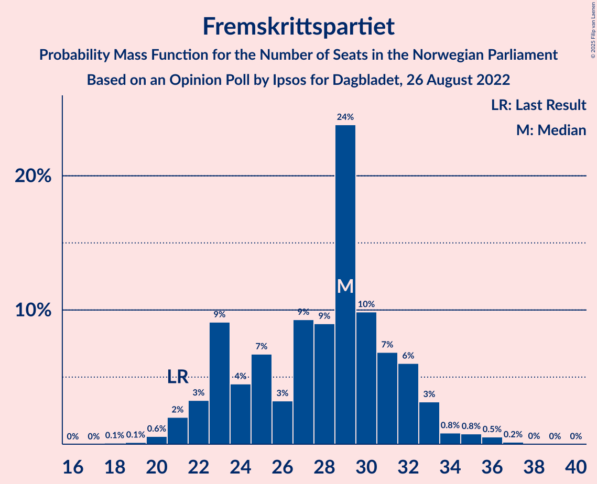

# Opinion Poll by Ipsos for Dagbladet, 26 August 2022

<a href="#voting-intentions">Voting Intentions</a> | <a href="#seats">Seats</a> | <a href="#coalitions">Coalitions</a> | <a href="#technical-information">Technical Information</a>

## Voting Intentions

### Confidence Intervals

| Party | Last Result | Poll Result | 80% Confidence Interval | 90% Confidence Interval | 95% Confidence Interval | 99% Confidence Interval |
|:-----:|:-----------:|:-----------:|:-----------------------:|:-----------------------:|:-----------------------:|:-----------------------:|
| Høyre | 20.4% | 27.2% | 25.1–29.4% |24.6–30.0% |24.1–30.5% |23.1–31.6% |
| Arbeiderpartiet | 26.2% | 21.6% | 19.7–23.6% |19.2–24.2% |18.7–24.7% |17.9–25.7% |
| Fremskrittspartiet | 11.6% | 15.2% | 13.6–17.0% |13.1–17.5% |12.7–18.0% |12.0–18.9% |
| Sosialistisk Venstreparti | 7.6% | 7.4% | 6.3–8.8% |6.0–9.2% |5.7–9.5% |5.2–10.2% |
| Rødt | 4.7% | 7.4% | 6.3–8.8% |6.0–9.2% |5.7–9.5% |5.2–10.2% |
| Senterpartiet | 13.5% | 5.7% | 4.8–7.0% |4.5–7.4% |4.3–7.7% |3.8–8.3% |
| Venstre | 4.6% | 4.2% | 3.4–5.3% |3.2–5.7% |3.0–6.0% |2.7–6.5% |
| Kristelig Folkeparti | 3.8% | 3.8% | 3.0–4.9% |2.8–5.2% |2.7–5.5% |2.3–6.0% |
| Miljøpartiet De Grønne | 3.9% | 3.6% | 2.8–4.6% |2.6–4.9% |2.4–5.2% |2.1–5.7% |

*Note:* The poll result column reflects the actual value used in the calculations. Published results may vary slightly, and in addition be rounded to fewer digits.

## Seats

### Confidence Intervals

| Party | Last Result | Median | 80% Confidence Interval | 90% Confidence Interval | 95% Confidence Interval | 99% Confidence Interval |
|:-----:|:-----------:|:------:|:-----------------------:|:-----------------------:|:-----------------------:|:-----------------------:|
| <a href="#høyre">Høyre</a> | 36 | 48 | 45–52 |44–53 |43–54 |41–56 |
| <a href="#arbeiderpartiet">Arbeiderpartiet</a> | 48 | 42 | 38–46 |36–47 |35–48 |34–49 |
| <a href="#fremskrittspartiet">Fremskrittspartiet</a> | 21 | 29 | 23–32 |22–33 |21–33 |20–36 |
| <a href="#sosialistisk-venstreparti">Sosialistisk Venstreparti</a> | 13 | 12 | 9–15 |9–16 |8–17 |8–17 |
| <a href="#rødt">Rødt</a> | 8 | 12 | 9–14 |9–15 |8–15 |7–18 |
| <a href="#senterpartiet">Senterpartiet</a> | 28 | 10 | 7–12 |7–13 |6–14 |1–15 |
| <a href="#venstre">Venstre</a> | 8 | 7 | 2–8 |2–9 |2–10 |2–10 |
| <a href="#kristelig-folkeparti">Kristelig Folkeparti</a> | 3 | 3 | 2–8 |2–8 |2–9 |1–10 |
| <a href="#miljøpartiet-de-grønne">Miljøpartiet De Grønne</a> | 3 | 2 | 1–7 |1–7 |1–8 |1–9 |

### Høyre

*For a full overview of the results for this party, see the [Høyre](party-høyre.html) page.*

| Number of Seats | Probability | Accumulated | Special Marks |
|:---------------:|:-----------:|:-----------:|:-------------:|
| 36 | 0% | 100% | Last Result |
| 37 | 0% | 100% |  |
| 38 | 0% | 100% |  |
| 39 | 0.1% | 100% |  |
| 40 | 0.4% | 99.9% |  |
| 41 | 0.6% | 99.5% |  |
| 42 | 1.0% | 98.9% |  |
| 43 | 2% | 98% |  |
| 44 | 2% | 96% |  |
| 45 | 7% | 94% |  |
| 46 | 14% | 87% |  |
| 47 | 10% | 73% |  |
| 48 | 14% | 63% | Median |
| 49 | 15% | 49% |  |
| 50 | 15% | 34% |  |
| 51 | 5% | 18% |  |
| 52 | 7% | 14% |  |
| 53 | 4% | 7% |  |
| 54 | 2% | 3% |  |
| 55 | 0.3% | 1.2% |  |
| 56 | 0.5% | 0.9% |  |
| 57 | 0.2% | 0.4% |  |
| 58 | 0.1% | 0.2% |  |
| 59 | 0.1% | 0.1% |  |
| 60 | 0% | 0% |  |

### Arbeiderpartiet

*For a full overview of the results for this party, see the [Arbeiderpartiet](party-arbeiderpartiet.html) page.*

| Number of Seats | Probability | Accumulated | Special Marks |
|:---------------:|:-----------:|:-----------:|:-------------:|
| 32 | 0.1% | 100% |  |
| 33 | 0.3% | 99.8% |  |
| 34 | 1.0% | 99.6% |  |
| 35 | 3% | 98.5% |  |
| 36 | 2% | 96% |  |
| 37 | 3% | 94% |  |
| 38 | 6% | 91% |  |
| 39 | 13% | 86% |  |
| 40 | 5% | 72% |  |
| 41 | 8% | 67% |  |
| 42 | 17% | 59% | Median |
| 43 | 21% | 42% |  |
| 44 | 6% | 21% |  |
| 45 | 3% | 14% |  |
| 46 | 4% | 11% |  |
| 47 | 3% | 7% |  |
| 48 | 3% | 4% | Last Result |
| 49 | 1.4% | 2% |  |
| 50 | 0.2% | 0.3% |  |
| 51 | 0.1% | 0.1% |  |
| 52 | 0% | 0.1% |  |
| 53 | 0% | 0% |  |

### Fremskrittspartiet

*For a full overview of the results for this party, see the [Fremskrittspartiet](party-fremskrittspartiet.html) page.*

| Number of Seats | Probability | Accumulated | Special Marks |
|:---------------:|:-----------:|:-----------:|:-------------:|
| 18 | 0.1% | 100% |  |
| 19 | 0.1% | 99.9% |  |
| 20 | 0.6% | 99.8% |  |
| 21 | 2% | 99.2% | Last Result |
| 22 | 3% | 97% |  |
| 23 | 9% | 94% |  |
| 24 | 4% | 85% |  |
| 25 | 7% | 80% |  |
| 26 | 3% | 74% |  |
| 27 | 9% | 70% |  |
| 28 | 9% | 61% |  |
| 29 | 24% | 52% | Median |
| 30 | 10% | 28% |  |
| 31 | 7% | 18% |  |
| 32 | 6% | 12% |  |
| 33 | 3% | 6% |  |
| 34 | 0.8% | 2% |  |
| 35 | 0.8% | 2% |  |
| 36 | 0.5% | 0.8% |  |
| 37 | 0.2% | 0.2% |  |
| 38 | 0% | 0.1% |  |
| 39 | 0% | 0% |  |

### Sosialistisk Venstreparti

*For a full overview of the results for this party, see the [Sosialistisk Venstreparti](party-sosialistiskvenstreparti.html) page.*

| Number of Seats | Probability | Accumulated | Special Marks |
|:---------------:|:-----------:|:-----------:|:-------------:|
| 7 | 0.4% | 100% |  |
| 8 | 2% | 99.5% |  |
| 9 | 7% | 97% |  |
| 10 | 12% | 90% |  |
| 11 | 16% | 78% |  |
| 12 | 21% | 62% | Median |
| 13 | 21% | 41% | Last Result |
| 14 | 9% | 19% |  |
| 15 | 5% | 11% |  |
| 16 | 3% | 6% |  |
| 17 | 2% | 3% |  |
| 18 | 0.3% | 0.5% |  |
| 19 | 0.1% | 0.1% |  |
| 20 | 0% | 0% |  |

### Rødt

*For a full overview of the results for this party, see the [Rødt](party-rødt.html) page.*

| Number of Seats | Probability | Accumulated | Special Marks |
|:---------------:|:-----------:|:-----------:|:-------------:|
| 6 | 0.1% | 100% |  |
| 7 | 0.4% | 99.9% |  |
| 8 | 2% | 99.5% | Last Result |
| 9 | 7% | 97% |  |
| 10 | 9% | 90% |  |
| 11 | 18% | 80% |  |
| 12 | 26% | 63% | Median |
| 13 | 18% | 37% |  |
| 14 | 11% | 19% |  |
| 15 | 6% | 8% |  |
| 16 | 1.4% | 2% |  |
| 17 | 0.4% | 1.0% |  |
| 18 | 0.4% | 0.6% |  |
| 19 | 0.1% | 0.1% |  |
| 20 | 0% | 0.1% |  |
| 21 | 0% | 0% |  |

### Senterpartiet

*For a full overview of the results for this party, see the [Senterpartiet](party-senterpartiet.html) page.*

| Number of Seats | Probability | Accumulated | Special Marks |
|:---------------:|:-----------:|:-----------:|:-------------:|
| 0 | 0.1% | 100% |  |
| 1 | 1.0% | 99.9% |  |
| 2 | 0% | 98.9% |  |
| 3 | 0% | 98.9% |  |
| 4 | 0% | 98.9% |  |
| 5 | 0.2% | 98.9% |  |
| 6 | 3% | 98.8% |  |
| 7 | 11% | 96% |  |
| 8 | 18% | 85% |  |
| 9 | 15% | 68% |  |
| 10 | 22% | 52% | Median |
| 11 | 12% | 31% |  |
| 12 | 9% | 18% |  |
| 13 | 7% | 10% |  |
| 14 | 2% | 3% |  |
| 15 | 0.9% | 1.1% |  |
| 16 | 0.1% | 0.1% |  |
| 17 | 0% | 0% |  |
| 18 | 0% | 0% |  |
| 19 | 0% | 0% |  |
| 20 | 0% | 0% |  |
| 21 | 0% | 0% |  |
| 22 | 0% | 0% |  |
| 23 | 0% | 0% |  |
| 24 | 0% | 0% |  |
| 25 | 0% | 0% |  |
| 26 | 0% | 0% |  |
| 27 | 0% | 0% |  |
| 28 | 0% | 0% | Last Result |

### Venstre

*For a full overview of the results for this party, see the [Venstre](party-venstre.html) page.*

| Number of Seats | Probability | Accumulated | Special Marks |
|:---------------:|:-----------:|:-----------:|:-------------:|
| 1 | 0.1% | 100% |  |
| 2 | 15% | 99.9% |  |
| 3 | 20% | 85% |  |
| 4 | 0% | 66% |  |
| 5 | 0.3% | 66% |  |
| 6 | 10% | 65% |  |
| 7 | 20% | 56% | Median |
| 8 | 26% | 36% | Last Result |
| 9 | 7% | 10% |  |
| 10 | 2% | 3% |  |
| 11 | 0.3% | 0.4% |  |
| 12 | 0.1% | 0.1% |  |
| 13 | 0% | 0% |  |

### Kristelig Folkeparti

*For a full overview of the results for this party, see the [Kristelig Folkeparti](party-kristeligfolkeparti.html) page.*

| Number of Seats | Probability | Accumulated | Special Marks |
|:---------------:|:-----------:|:-----------:|:-------------:|
| 0 | 0.2% | 100% |  |
| 1 | 0.5% | 99.8% |  |
| 2 | 25% | 99.3% |  |
| 3 | 34% | 74% | Last Result, Median |
| 4 | 0% | 40% |  |
| 5 | 0.7% | 40% |  |
| 6 | 8% | 39% |  |
| 7 | 20% | 31% |  |
| 8 | 9% | 12% |  |
| 9 | 2% | 3% |  |
| 10 | 0.8% | 0.9% |  |
| 11 | 0.2% | 0.2% |  |
| 12 | 0% | 0% |  |

### Miljøpartiet De Grønne

*For a full overview of the results for this party, see the [Miljøpartiet De Grønne](party-miljøpartietdegrønne.html) page.*

| Number of Seats | Probability | Accumulated | Special Marks |
|:---------------:|:-----------:|:-----------:|:-------------:|
| 1 | 13% | 100% |  |
| 2 | 42% | 87% | Median |
| 3 | 18% | 45% | Last Result |
| 4 | 0% | 27% |  |
| 5 | 0.3% | 27% |  |
| 6 | 10% | 26% |  |
| 7 | 12% | 16% |  |
| 8 | 3% | 5% |  |
| 9 | 1.1% | 1.3% |  |
| 10 | 0.2% | 0.2% |  |
| 11 | 0% | 0% |  |

## Coalitions

### Confidence Intervals

| Coalition | Last Result | Median | Majority? | 80% Confidence Interval | 90% Confidence Interval | 95% Confidence Interval | 99% Confidence Interval |
|:---------:|:-----------:|:------:|:---------:|:-----------------------:|:-----------------------:|:-----------------------:|:-----------------------:|
| Høyre – Fremskrittspartiet – Senterpartiet – Venstre – Kristelig Folkeparti | 96 | 97 | 99.5% | 91–101 | 88–103 | 87–106 | 84–107 |
| Høyre – Fremskrittspartiet – Venstre – Kristelig Folkeparti – Miljøpartiet De Grønne | 71 | 90 | 89% | 84–95 | 82–97 | 80–98 | 78–101 |
| Høyre – Fremskrittspartiet – Venstre – Kristelig Folkeparti | 68 | 87 | 67% | 80–92 | 78–94 | 77–96 | 75–97 |
| Høyre – Fremskrittspartiet – Venstre | 65 | 82 | 33% | 76–87 | 74–89 | 73–90 | 71–92 |
| Arbeiderpartiet – Rødt – Sosialistisk Venstreparti – Senterpartiet – Miljøpartiet De Grønne | 100 | 79 | 14% | 72–85 | 71–86 | 70–88 | 67–91 |
| Arbeiderpartiet – Rødt – Sosialistisk Venstreparti – Senterpartiet | 97 | 75 | 2% | 69–81 | 68–82 | 66–84 | 64–86 |
| Høyre – Fremskrittspartiet | 57 | 77 | 1.1% | 71–81 | 70–83 | 68–83 | 66–87 |
| Arbeiderpartiet – Sosialistisk Venstreparti – Senterpartiet – Kristelig Folkeparti – Miljøpartiet De Grønne | 95 | 71 | 0.2% | 65–76 | 63–78 | 63–80 | 60–82 |
| Arbeiderpartiet – Rødt – Sosialistisk Venstreparti – Miljøpartiet De Grønne | 72 | 69 | 0% | 64–75 | 62–76 | 61–77 | 59–81 |
| Arbeiderpartiet – Sosialistisk Venstreparti – Senterpartiet – Miljøpartiet De Grønne | 92 | 67 | 0% | 61–71 | 60–73 | 59–75 | 56–78 |
| Arbeiderpartiet – Sosialistisk Venstreparti – Senterpartiet | 89 | 63 | 0% | 58–68 | 57–70 | 56–70 | 53–73 |
| Arbeiderpartiet – Senterpartiet – Kristelig Folkeparti – Miljøpartiet De Grønne | 82 | 59 | 0% | 54–65 | 52–66 | 51–67 | 48–70 |
| Høyre – Venstre – Kristelig Folkeparti | 47 | 59 | 0% | 54–64 | 52–64 | 51–66 | 48–68 |
| Arbeiderpartiet – Senterpartiet – Kristelig Folkeparti | 79 | 56 | 0% | 51–60 | 49–62 | 48–64 | 46–65 |
| Arbeiderpartiet – Sosialistisk Venstreparti | 61 | 54 | 0% | 49–58 | 48–59 | 47–60 | 45–62 |
| Arbeiderpartiet – Senterpartiet | 76 | 51 | 0% | 47–56 | 45–57 | 44–57 | 42–59 |
| Senterpartiet – Venstre – Kristelig Folkeparti | 39 | 20 | 0% | 15–25 | 14–26 | 13–27 | 11–29 |

### Høyre – Fremskrittspartiet – Senterpartiet – Venstre – Kristelig Folkeparti

| Number of Seats | Probability | Accumulated | Special Marks |
|:---------------:|:-----------:|:-----------:|:-------------:|
| 81 | 0% | 100% |  |
| 82 | 0.1% | 99.9% |  |
| 83 | 0.1% | 99.8% |  |
| 84 | 0.3% | 99.7% |  |
| 85 | 0.4% | 99.5% | Majority |
| 86 | 0.6% | 99.1% |  |
| 87 | 2% | 98% |  |
| 88 | 2% | 96% |  |
| 89 | 1.4% | 94% |  |
| 90 | 2% | 93% |  |
| 91 | 7% | 91% |  |
| 92 | 7% | 84% |  |
| 93 | 5% | 76% |  |
| 94 | 7% | 71% |  |
| 95 | 5% | 64% |  |
| 96 | 7% | 60% | Last Result |
| 97 | 16% | 53% | Median |
| 98 | 11% | 37% |  |
| 99 | 6% | 26% |  |
| 100 | 6% | 20% |  |
| 101 | 7% | 14% |  |
| 102 | 2% | 8% |  |
| 103 | 1.3% | 5% |  |
| 104 | 1.3% | 4% |  |
| 105 | 0.3% | 3% |  |
| 106 | 2% | 3% |  |
| 107 | 0.4% | 0.6% |  |
| 108 | 0.1% | 0.2% |  |
| 109 | 0% | 0% |  |

### Høyre – Fremskrittspartiet – Venstre – Kristelig Folkeparti – Miljøpartiet De Grønne

| Number of Seats | Probability | Accumulated | Special Marks |
|:---------------:|:-----------:|:-----------:|:-------------:|
| 71 | 0% | 100% | Last Result |
| 72 | 0% | 100% |  |
| 73 | 0% | 100% |  |
| 74 | 0% | 100% |  |
| 75 | 0% | 99.9% |  |
| 76 | 0% | 99.9% |  |
| 77 | 0.2% | 99.9% |  |
| 78 | 0.9% | 99.7% |  |
| 79 | 0.9% | 98.8% |  |
| 80 | 0.7% | 98% |  |
| 81 | 1.1% | 97% |  |
| 82 | 2% | 96% |  |
| 83 | 2% | 95% |  |
| 84 | 3% | 92% |  |
| 85 | 4% | 89% | Majority |
| 86 | 6% | 85% |  |
| 87 | 6% | 79% |  |
| 88 | 7% | 73% |  |
| 89 | 11% | 66% | Median |
| 90 | 17% | 55% |  |
| 91 | 4% | 38% |  |
| 92 | 8% | 34% |  |
| 93 | 9% | 26% |  |
| 94 | 4% | 17% |  |
| 95 | 3% | 13% |  |
| 96 | 4% | 10% |  |
| 97 | 1.5% | 6% |  |
| 98 | 3% | 5% |  |
| 99 | 0.8% | 2% |  |
| 100 | 0.5% | 1.1% |  |
| 101 | 0.2% | 0.6% |  |
| 102 | 0.2% | 0.4% |  |
| 103 | 0.1% | 0.2% |  |
| 104 | 0.1% | 0.1% |  |
| 105 | 0% | 0% |  |

### Høyre – Fremskrittspartiet – Venstre – Kristelig Folkeparti

| Number of Seats | Probability | Accumulated | Special Marks |
|:---------------:|:-----------:|:-----------:|:-------------:|
| 68 | 0% | 100% | Last Result |
| 69 | 0% | 100% |  |
| 70 | 0% | 100% |  |
| 71 | 0% | 100% |  |
| 72 | 0.1% | 99.9% |  |
| 73 | 0.2% | 99.9% |  |
| 74 | 0.1% | 99.6% |  |
| 75 | 0.4% | 99.5% |  |
| 76 | 1.2% | 99.1% |  |
| 77 | 2% | 98% |  |
| 78 | 1.1% | 96% |  |
| 79 | 2% | 95% |  |
| 80 | 4% | 93% |  |
| 81 | 3% | 89% |  |
| 82 | 4% | 87% |  |
| 83 | 9% | 82% |  |
| 84 | 6% | 73% |  |
| 85 | 8% | 67% | Majority |
| 86 | 4% | 59% |  |
| 87 | 13% | 54% | Median |
| 88 | 9% | 42% |  |
| 89 | 7% | 32% |  |
| 90 | 9% | 25% |  |
| 91 | 5% | 16% |  |
| 92 | 3% | 12% |  |
| 93 | 3% | 9% |  |
| 94 | 2% | 6% |  |
| 95 | 1.4% | 5% |  |
| 96 | 2% | 3% |  |
| 97 | 0.3% | 0.8% |  |
| 98 | 0.4% | 0.5% |  |
| 99 | 0% | 0.1% |  |
| 100 | 0% | 0.1% |  |
| 101 | 0% | 0.1% |  |
| 102 | 0% | 0% |  |

### Høyre – Fremskrittspartiet – Venstre

| Number of Seats | Probability | Accumulated | Special Marks |
|:---------------:|:-----------:|:-----------:|:-------------:|
| 65 | 0% | 100% | Last Result |
| 66 | 0% | 100% |  |
| 67 | 0% | 100% |  |
| 68 | 0.1% | 100% |  |
| 69 | 0.1% | 99.9% |  |
| 70 | 0.3% | 99.8% |  |
| 71 | 0.2% | 99.5% |  |
| 72 | 0.7% | 99.3% |  |
| 73 | 2% | 98.6% |  |
| 74 | 4% | 97% |  |
| 75 | 2% | 93% |  |
| 76 | 3% | 90% |  |
| 77 | 3% | 87% |  |
| 78 | 4% | 84% |  |
| 79 | 5% | 80% |  |
| 80 | 15% | 75% |  |
| 81 | 7% | 60% |  |
| 82 | 7% | 53% |  |
| 83 | 5% | 46% |  |
| 84 | 8% | 41% | Median |
| 85 | 7% | 33% | Majority |
| 86 | 5% | 26% |  |
| 87 | 10% | 20% |  |
| 88 | 4% | 10% |  |
| 89 | 3% | 6% |  |
| 90 | 2% | 3% |  |
| 91 | 0.6% | 1.2% |  |
| 92 | 0.3% | 0.6% |  |
| 93 | 0.1% | 0.3% |  |
| 94 | 0.1% | 0.2% |  |
| 95 | 0.1% | 0.1% |  |
| 96 | 0% | 0% |  |

### Arbeiderpartiet – Rødt – Sosialistisk Venstreparti – Senterpartiet – Miljøpartiet De Grønne

| Number of Seats | Probability | Accumulated | Special Marks |
|:---------------:|:-----------:|:-----------:|:-------------:|
| 64 | 0.1% | 100% |  |
| 65 | 0.1% | 99.9% |  |
| 66 | 0.3% | 99.8% |  |
| 67 | 0.3% | 99.6% |  |
| 68 | 0.7% | 99.2% |  |
| 69 | 1.0% | 98.5% |  |
| 70 | 2% | 98% |  |
| 71 | 3% | 95% |  |
| 72 | 3% | 92% |  |
| 73 | 5% | 89% |  |
| 74 | 5% | 84% |  |
| 75 | 5% | 79% |  |
| 76 | 6% | 74% |  |
| 77 | 6% | 68% |  |
| 78 | 10% | 62% | Median |
| 79 | 10% | 52% |  |
| 80 | 8% | 42% |  |
| 81 | 10% | 34% |  |
| 82 | 4% | 24% |  |
| 83 | 2% | 20% |  |
| 84 | 3% | 17% |  |
| 85 | 7% | 14% | Majority |
| 86 | 2% | 7% |  |
| 87 | 1.0% | 5% |  |
| 88 | 2% | 4% |  |
| 89 | 0.7% | 2% |  |
| 90 | 0.5% | 1.1% |  |
| 91 | 0.2% | 0.6% |  |
| 92 | 0.1% | 0.4% |  |
| 93 | 0.2% | 0.2% |  |
| 94 | 0% | 0.1% |  |
| 95 | 0% | 0% |  |
| 96 | 0% | 0% |  |
| 97 | 0% | 0% |  |
| 98 | 0% | 0% |  |
| 99 | 0% | 0% |  |
| 100 | 0% | 0% | Last Result |

### Arbeiderpartiet – Rødt – Sosialistisk Venstreparti – Senterpartiet

| Number of Seats | Probability | Accumulated | Special Marks |
|:---------------:|:-----------:|:-----------:|:-------------:|
| 60 | 0% | 100% |  |
| 61 | 0.1% | 99.9% |  |
| 62 | 0.2% | 99.8% |  |
| 63 | 0.1% | 99.7% |  |
| 64 | 0.5% | 99.6% |  |
| 65 | 0.5% | 99.0% |  |
| 66 | 1.0% | 98% |  |
| 67 | 1.3% | 97% |  |
| 68 | 3% | 96% |  |
| 69 | 4% | 93% |  |
| 70 | 5% | 89% |  |
| 71 | 5% | 84% |  |
| 72 | 7% | 79% |  |
| 73 | 7% | 73% |  |
| 74 | 7% | 65% |  |
| 75 | 9% | 59% |  |
| 76 | 6% | 49% | Median |
| 77 | 7% | 43% |  |
| 78 | 13% | 36% |  |
| 79 | 9% | 23% |  |
| 80 | 4% | 14% |  |
| 81 | 3% | 10% |  |
| 82 | 3% | 7% |  |
| 83 | 2% | 4% |  |
| 84 | 1.1% | 3% |  |
| 85 | 0.9% | 2% | Majority |
| 86 | 0.4% | 0.8% |  |
| 87 | 0.1% | 0.4% |  |
| 88 | 0.2% | 0.3% |  |
| 89 | 0% | 0.1% |  |
| 90 | 0% | 0.1% |  |
| 91 | 0% | 0% |  |
| 92 | 0% | 0% |  |
| 93 | 0% | 0% |  |
| 94 | 0% | 0% |  |
| 95 | 0% | 0% |  |
| 96 | 0% | 0% |  |
| 97 | 0% | 0% | Last Result |

### Høyre – Fremskrittspartiet

| Number of Seats | Probability | Accumulated | Special Marks |
|:---------------:|:-----------:|:-----------:|:-------------:|
| 57 | 0% | 100% | Last Result |
| 58 | 0% | 100% |  |
| 59 | 0% | 100% |  |
| 60 | 0% | 100% |  |
| 61 | 0% | 100% |  |
| 62 | 0% | 100% |  |
| 63 | 0% | 100% |  |
| 64 | 0.1% | 100% |  |
| 65 | 0.1% | 99.9% |  |
| 66 | 0.3% | 99.8% |  |
| 67 | 2% | 99.4% |  |
| 68 | 2% | 98% |  |
| 69 | 1.2% | 96% |  |
| 70 | 4% | 95% |  |
| 71 | 4% | 91% |  |
| 72 | 10% | 87% |  |
| 73 | 7% | 77% |  |
| 74 | 6% | 70% |  |
| 75 | 4% | 64% |  |
| 76 | 9% | 60% |  |
| 77 | 11% | 51% | Median |
| 78 | 5% | 40% |  |
| 79 | 14% | 35% |  |
| 80 | 6% | 21% |  |
| 81 | 7% | 15% |  |
| 82 | 3% | 8% |  |
| 83 | 3% | 5% |  |
| 84 | 1.2% | 2% |  |
| 85 | 0.3% | 1.1% | Majority |
| 86 | 0.3% | 0.8% |  |
| 87 | 0.3% | 0.5% |  |
| 88 | 0.1% | 0.2% |  |
| 89 | 0.1% | 0.2% |  |
| 90 | 0% | 0% |  |

### Arbeiderpartiet – Sosialistisk Venstreparti – Senterpartiet – Kristelig Folkeparti – Miljøpartiet De Grønne

| Number of Seats | Probability | Accumulated | Special Marks |
|:---------------:|:-----------:|:-----------:|:-------------:|
| 57 | 0.1% | 100% |  |
| 58 | 0.1% | 99.9% |  |
| 59 | 0.1% | 99.8% |  |
| 60 | 0.6% | 99.7% |  |
| 61 | 0.5% | 99.0% |  |
| 62 | 0.4% | 98% |  |
| 63 | 3% | 98% |  |
| 64 | 2% | 95% |  |
| 65 | 4% | 93% |  |
| 66 | 3% | 89% |  |
| 67 | 6% | 86% |  |
| 68 | 9% | 80% |  |
| 69 | 13% | 71% | Median |
| 70 | 6% | 58% |  |
| 71 | 7% | 52% |  |
| 72 | 5% | 46% |  |
| 73 | 10% | 41% |  |
| 74 | 9% | 31% |  |
| 75 | 10% | 23% |  |
| 76 | 4% | 13% |  |
| 77 | 2% | 9% |  |
| 78 | 2% | 7% |  |
| 79 | 1.2% | 5% |  |
| 80 | 2% | 4% |  |
| 81 | 1.0% | 2% |  |
| 82 | 0.5% | 0.8% |  |
| 83 | 0.1% | 0.3% |  |
| 84 | 0% | 0.2% |  |
| 85 | 0.1% | 0.2% | Majority |
| 86 | 0% | 0% |  |
| 87 | 0% | 0% |  |
| 88 | 0% | 0% |  |
| 89 | 0% | 0% |  |
| 90 | 0% | 0% |  |
| 91 | 0% | 0% |  |
| 92 | 0% | 0% |  |
| 93 | 0% | 0% |  |
| 94 | 0% | 0% |  |
| 95 | 0% | 0% | Last Result |

### Arbeiderpartiet – Rødt – Sosialistisk Venstreparti – Miljøpartiet De Grønne

| Number of Seats | Probability | Accumulated | Special Marks |
|:---------------:|:-----------:|:-----------:|:-------------:|
| 55 | 0% | 100% |  |
| 56 | 0.1% | 99.9% |  |
| 57 | 0.1% | 99.9% |  |
| 58 | 0.1% | 99.8% |  |
| 59 | 0.4% | 99.7% |  |
| 60 | 0.5% | 99.3% |  |
| 61 | 2% | 98.8% |  |
| 62 | 4% | 97% |  |
| 63 | 3% | 93% |  |
| 64 | 9% | 90% |  |
| 65 | 5% | 81% |  |
| 66 | 4% | 76% |  |
| 67 | 9% | 72% |  |
| 68 | 7% | 63% | Median |
| 69 | 7% | 55% |  |
| 70 | 11% | 48% |  |
| 71 | 12% | 37% |  |
| 72 | 4% | 25% | Last Result |
| 73 | 4% | 20% |  |
| 74 | 2% | 16% |  |
| 75 | 4% | 14% |  |
| 76 | 6% | 10% |  |
| 77 | 2% | 4% |  |
| 78 | 1.1% | 2% |  |
| 79 | 0.3% | 1.2% |  |
| 80 | 0.2% | 0.9% |  |
| 81 | 0.3% | 0.7% |  |
| 82 | 0.2% | 0.4% |  |
| 83 | 0% | 0.2% |  |
| 84 | 0.1% | 0.2% |  |
| 85 | 0% | 0% | Majority |

### Arbeiderpartiet – Sosialistisk Venstreparti – Senterpartiet – Miljøpartiet De Grønne

| Number of Seats | Probability | Accumulated | Special Marks |
|:---------------:|:-----------:|:-----------:|:-------------:|
| 53 | 0% | 100% |  |
| 54 | 0.2% | 99.9% |  |
| 55 | 0.1% | 99.8% |  |
| 56 | 0.3% | 99.6% |  |
| 57 | 0.8% | 99.3% |  |
| 58 | 1.0% | 98.5% |  |
| 59 | 2% | 98% |  |
| 60 | 4% | 96% |  |
| 61 | 5% | 92% |  |
| 62 | 5% | 87% |  |
| 63 | 5% | 81% |  |
| 64 | 4% | 77% |  |
| 65 | 7% | 73% |  |
| 66 | 14% | 66% | Median |
| 67 | 10% | 52% |  |
| 68 | 14% | 43% |  |
| 69 | 5% | 29% |  |
| 70 | 5% | 24% |  |
| 71 | 10% | 19% |  |
| 72 | 2% | 10% |  |
| 73 | 3% | 8% |  |
| 74 | 2% | 5% |  |
| 75 | 1.1% | 3% |  |
| 76 | 0.6% | 2% |  |
| 77 | 0.2% | 1.4% |  |
| 78 | 0.7% | 1.1% |  |
| 79 | 0.4% | 0.4% |  |
| 80 | 0% | 0.1% |  |
| 81 | 0% | 0% |  |
| 82 | 0% | 0% |  |
| 83 | 0% | 0% |  |
| 84 | 0% | 0% |  |
| 85 | 0% | 0% | Majority |
| 86 | 0% | 0% |  |
| 87 | 0% | 0% |  |
| 88 | 0% | 0% |  |
| 89 | 0% | 0% |  |
| 90 | 0% | 0% |  |
| 91 | 0% | 0% |  |
| 92 | 0% | 0% | Last Result |

### Arbeiderpartiet – Sosialistisk Venstreparti – Senterpartiet

| Number of Seats | Probability | Accumulated | Special Marks |
|:---------------:|:-----------:|:-----------:|:-------------:|
| 50 | 0% | 100% |  |
| 51 | 0.1% | 99.9% |  |
| 52 | 0.3% | 99.9% |  |
| 53 | 0.3% | 99.6% |  |
| 54 | 0.5% | 99.3% |  |
| 55 | 1.3% | 98.8% |  |
| 56 | 2% | 98% |  |
| 57 | 2% | 96% |  |
| 58 | 4% | 94% |  |
| 59 | 7% | 89% |  |
| 60 | 7% | 82% |  |
| 61 | 8% | 76% |  |
| 62 | 4% | 67% |  |
| 63 | 15% | 63% |  |
| 64 | 10% | 48% | Median |
| 65 | 5% | 38% |  |
| 66 | 16% | 33% |  |
| 67 | 5% | 17% |  |
| 68 | 4% | 13% |  |
| 69 | 4% | 9% |  |
| 70 | 3% | 5% |  |
| 71 | 1.4% | 2% |  |
| 72 | 0.5% | 1.0% |  |
| 73 | 0.3% | 0.5% |  |
| 74 | 0.1% | 0.2% |  |
| 75 | 0% | 0.1% |  |
| 76 | 0% | 0% |  |
| 77 | 0% | 0% |  |
| 78 | 0% | 0% |  |
| 79 | 0% | 0% |  |
| 80 | 0% | 0% |  |
| 81 | 0% | 0% |  |
| 82 | 0% | 0% |  |
| 83 | 0% | 0% |  |
| 84 | 0% | 0% |  |
| 85 | 0% | 0% | Majority |
| 86 | 0% | 0% |  |
| 87 | 0% | 0% |  |
| 88 | 0% | 0% |  |
| 89 | 0% | 0% | Last Result |

### Arbeiderpartiet – Senterpartiet – Kristelig Folkeparti – Miljøpartiet De Grønne

| Number of Seats | Probability | Accumulated | Special Marks |
|:---------------:|:-----------:|:-----------:|:-------------:|
| 44 | 0% | 100% |  |
| 45 | 0% | 99.9% |  |
| 46 | 0% | 99.9% |  |
| 47 | 0.1% | 99.9% |  |
| 48 | 0.4% | 99.8% |  |
| 49 | 0.8% | 99.4% |  |
| 50 | 0.6% | 98.6% |  |
| 51 | 0.8% | 98% |  |
| 52 | 3% | 97% |  |
| 53 | 3% | 94% |  |
| 54 | 4% | 91% |  |
| 55 | 5% | 86% |  |
| 56 | 10% | 82% |  |
| 57 | 12% | 72% | Median |
| 58 | 9% | 60% |  |
| 59 | 9% | 51% |  |
| 60 | 5% | 42% |  |
| 61 | 9% | 37% |  |
| 62 | 9% | 28% |  |
| 63 | 4% | 19% |  |
| 64 | 5% | 15% |  |
| 65 | 4% | 10% |  |
| 66 | 2% | 6% |  |
| 67 | 2% | 4% |  |
| 68 | 1.3% | 2% |  |
| 69 | 0.4% | 1.1% |  |
| 70 | 0.3% | 0.6% |  |
| 71 | 0.1% | 0.3% |  |
| 72 | 0.1% | 0.2% |  |
| 73 | 0.1% | 0.1% |  |
| 74 | 0% | 0% |  |
| 75 | 0% | 0% |  |
| 76 | 0% | 0% |  |
| 77 | 0% | 0% |  |
| 78 | 0% | 0% |  |
| 79 | 0% | 0% |  |
| 80 | 0% | 0% |  |
| 81 | 0% | 0% |  |
| 82 | 0% | 0% | Last Result |

### Høyre – Venstre – Kristelig Folkeparti

| Number of Seats | Probability | Accumulated | Special Marks |
|:---------------:|:-----------:|:-----------:|:-------------:|
| 46 | 0.1% | 100% |  |
| 47 | 0.1% | 99.8% | Last Result |
| 48 | 0.3% | 99.7% |  |
| 49 | 0.5% | 99.5% |  |
| 50 | 0.8% | 99.0% |  |
| 51 | 3% | 98% |  |
| 52 | 2% | 95% |  |
| 53 | 2% | 93% |  |
| 54 | 9% | 90% |  |
| 55 | 6% | 82% |  |
| 56 | 5% | 75% |  |
| 57 | 10% | 71% |  |
| 58 | 9% | 61% | Median |
| 59 | 8% | 52% |  |
| 60 | 11% | 45% |  |
| 61 | 12% | 34% |  |
| 62 | 3% | 22% |  |
| 63 | 3% | 19% |  |
| 64 | 11% | 16% |  |
| 65 | 1.0% | 4% |  |
| 66 | 1.0% | 3% |  |
| 67 | 1.2% | 2% |  |
| 68 | 0.7% | 0.9% |  |
| 69 | 0.1% | 0.2% |  |
| 70 | 0.1% | 0.2% |  |
| 71 | 0% | 0.1% |  |
| 72 | 0% | 0.1% |  |
| 73 | 0% | 0% |  |

### Arbeiderpartiet – Senterpartiet – Kristelig Folkeparti

| Number of Seats | Probability | Accumulated | Special Marks |
|:---------------:|:-----------:|:-----------:|:-------------:|
| 42 | 0.1% | 100% |  |
| 43 | 0.1% | 99.9% |  |
| 44 | 0.1% | 99.9% |  |
| 45 | 0.1% | 99.8% |  |
| 46 | 0.6% | 99.7% |  |
| 47 | 1.0% | 99.0% |  |
| 48 | 1.0% | 98% |  |
| 49 | 2% | 97% |  |
| 50 | 4% | 95% |  |
| 51 | 4% | 90% |  |
| 52 | 6% | 86% |  |
| 53 | 9% | 80% |  |
| 54 | 14% | 71% |  |
| 55 | 7% | 57% | Median |
| 56 | 11% | 50% |  |
| 57 | 8% | 39% |  |
| 58 | 6% | 30% |  |
| 59 | 5% | 25% |  |
| 60 | 11% | 20% |  |
| 61 | 3% | 9% |  |
| 62 | 2% | 6% |  |
| 63 | 0.9% | 4% |  |
| 64 | 2% | 3% |  |
| 65 | 0.7% | 1.2% |  |
| 66 | 0.3% | 0.5% |  |
| 67 | 0.1% | 0.2% |  |
| 68 | 0% | 0.1% |  |
| 69 | 0% | 0.1% |  |
| 70 | 0% | 0% |  |
| 71 | 0% | 0% |  |
| 72 | 0% | 0% |  |
| 73 | 0% | 0% |  |
| 74 | 0% | 0% |  |
| 75 | 0% | 0% |  |
| 76 | 0% | 0% |  |
| 77 | 0% | 0% |  |
| 78 | 0% | 0% |  |
| 79 | 0% | 0% | Last Result |

### Arbeiderpartiet – Sosialistisk Venstreparti

| Number of Seats | Probability | Accumulated | Special Marks |
|:---------------:|:-----------:|:-----------:|:-------------:|
| 43 | 0.1% | 100% |  |
| 44 | 0.2% | 99.9% |  |
| 45 | 0.6% | 99.6% |  |
| 46 | 0.8% | 99.0% |  |
| 47 | 1.5% | 98% |  |
| 48 | 3% | 97% |  |
| 49 | 4% | 94% |  |
| 50 | 8% | 90% |  |
| 51 | 10% | 82% |  |
| 52 | 8% | 72% |  |
| 53 | 10% | 64% |  |
| 54 | 6% | 53% | Median |
| 55 | 17% | 47% |  |
| 56 | 13% | 30% |  |
| 57 | 4% | 17% |  |
| 58 | 4% | 13% |  |
| 59 | 5% | 9% |  |
| 60 | 3% | 5% |  |
| 61 | 0.6% | 2% | Last Result |
| 62 | 0.4% | 0.9% |  |
| 63 | 0.3% | 0.5% |  |
| 64 | 0.2% | 0.2% |  |
| 65 | 0% | 0.1% |  |
| 66 | 0% | 0% |  |

### Arbeiderpartiet – Senterpartiet

| Number of Seats | Probability | Accumulated | Special Marks |
|:---------------:|:-----------:|:-----------:|:-------------:|
| 39 | 0.1% | 100% |  |
| 40 | 0.1% | 99.9% |  |
| 41 | 0.2% | 99.8% |  |
| 42 | 0.2% | 99.6% |  |
| 43 | 0.8% | 99.4% |  |
| 44 | 1.4% | 98.6% |  |
| 45 | 3% | 97% |  |
| 46 | 2% | 94% |  |
| 47 | 5% | 91% |  |
| 48 | 7% | 86% |  |
| 49 | 8% | 79% |  |
| 50 | 6% | 71% |  |
| 51 | 21% | 65% |  |
| 52 | 6% | 44% | Median |
| 53 | 15% | 38% |  |
| 54 | 8% | 23% |  |
| 55 | 4% | 15% |  |
| 56 | 4% | 11% |  |
| 57 | 4% | 7% |  |
| 58 | 2% | 2% |  |
| 59 | 0.5% | 0.9% |  |
| 60 | 0.2% | 0.4% |  |
| 61 | 0.1% | 0.2% |  |
| 62 | 0.1% | 0.1% |  |
| 63 | 0% | 0% |  |
| 64 | 0% | 0% |  |
| 65 | 0% | 0% |  |
| 66 | 0% | 0% |  |
| 67 | 0% | 0% |  |
| 68 | 0% | 0% |  |
| 69 | 0% | 0% |  |
| 70 | 0% | 0% |  |
| 71 | 0% | 0% |  |
| 72 | 0% | 0% |  |
| 73 | 0% | 0% |  |
| 74 | 0% | 0% |  |
| 75 | 0% | 0% |  |
| 76 | 0% | 0% | Last Result |

### Senterpartiet – Venstre – Kristelig Folkeparti

| Number of Seats | Probability | Accumulated | Special Marks |
|:---------------:|:-----------:|:-----------:|:-------------:|
| 5 | 0% | 100% |  |
| 6 | 0.1% | 99.9% |  |
| 7 | 0% | 99.9% |  |
| 8 | 0% | 99.9% |  |
| 9 | 0% | 99.9% |  |
| 10 | 0.1% | 99.8% |  |
| 11 | 0.6% | 99.8% |  |
| 12 | 1.4% | 99.2% |  |
| 13 | 2% | 98% |  |
| 14 | 3% | 95% |  |
| 15 | 9% | 93% |  |
| 16 | 4% | 83% |  |
| 17 | 6% | 79% |  |
| 18 | 10% | 73% |  |
| 19 | 11% | 63% |  |
| 20 | 9% | 52% | Median |
| 21 | 9% | 44% |  |
| 22 | 11% | 34% |  |
| 23 | 4% | 24% |  |
| 24 | 4% | 19% |  |
| 25 | 10% | 15% |  |
| 26 | 3% | 5% |  |
| 27 | 0.8% | 3% |  |
| 28 | 0.8% | 2% |  |
| 29 | 0.8% | 1.2% |  |
| 30 | 0.3% | 0.4% |  |
| 31 | 0.1% | 0.2% |  |
| 32 | 0.1% | 0.1% |  |
| 33 | 0% | 0% |  |
| 34 | 0% | 0% |  |
| 35 | 0% | 0% |  |
| 36 | 0% | 0% |  |
| 37 | 0% | 0% |  |
| 38 | 0% | 0% |  |
| 39 | 0% | 0% | Last Result |

## Technical Information

### Opinion Poll

+ **Polling firm:** Ipsos
+ **Commissioner(s):** Dagbladet
+ **Fieldwork period:** 26 August 2022

### Calculations

+ **Sample size:** 732
+ **Simulations done:** 1,048,576
+ **Error estimate:** 2.21%

