# Opinion Poll by Norstat for Vårt Land, 23–29 August 2022

<a href="#voting-intentions">Voting Intentions</a> | <a href="#seats">Seats</a> | <a href="#coalitions">Coalitions</a> | <a href="#technical-information">Technical Information</a>

## Voting Intentions

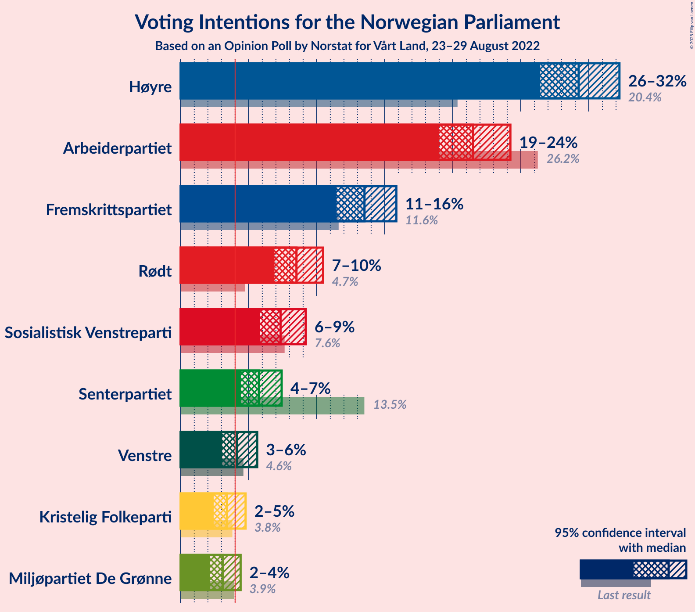

### Confidence Intervals

| Party | Last Result | Poll Result | 80% Confidence Interval | 90% Confidence Interval | 95% Confidence Interval | 99% Confidence Interval |
|:-----:|:-----------:|:-----------:|:-----------------------:|:-----------------------:|:-----------------------:|:-----------------------:|
| Høyre | 20.4% | 29.3% | 27.4–31.2% |26.9–31.8% |26.4–32.3% |25.6–33.2% |
| Arbeiderpartiet | 26.2% | 21.5% | 19.8–23.3% |19.4–23.8% |19.0–24.2% |18.2–25.1% |
| Fremskrittspartiet | 11.6% | 13.5% | 12.2–15.0% |11.8–15.5% |11.5–15.9% |10.9–16.6% |
| Rødt | 4.7% | 8.5% | 7.4–9.8% |7.1–10.2% |6.9–10.5% |6.4–11.1% |
| Sosialistisk Venstreparti | 7.6% | 7.3% | 6.4–8.6% |6.1–8.9% |5.8–9.2% |5.4–9.8% |
| Senterpartiet | 13.5% | 5.7% | 4.9–6.8% |4.6–7.1% |4.4–7.4% |4.0–8.0% |
| Venstre | 4.6% | 4.1% | 3.4–5.1% |3.2–5.4% |3.0–5.6% |2.7–6.1% |
| Kristelig Folkeparti | 3.8% | 3.4% | 2.8–4.3% |2.6–4.5% |2.4–4.8% |2.1–5.2% |
| Miljøpartiet De Grønne | 3.9% | 3.1% | 2.5–3.9% |2.3–4.2% |2.1–4.4% |1.9–4.8% |

*Note:* The poll result column reflects the actual value used in the calculations. Published results may vary slightly, and in addition be rounded to fewer digits.

## Seats

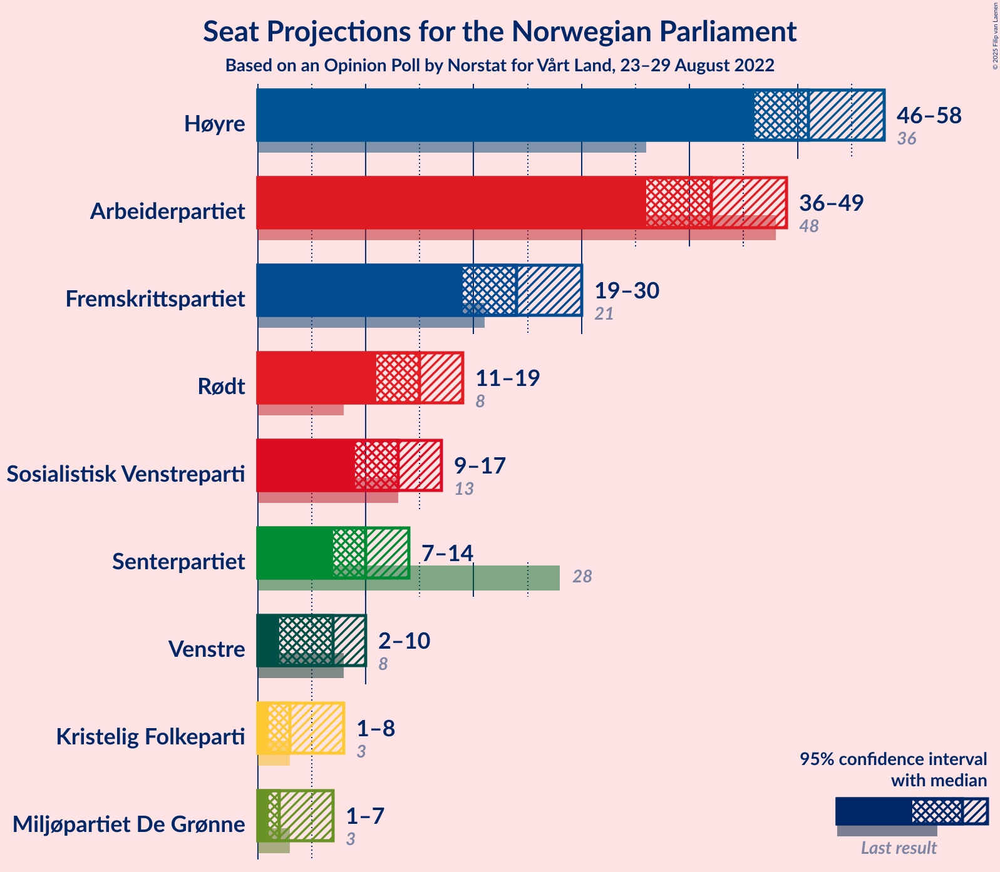

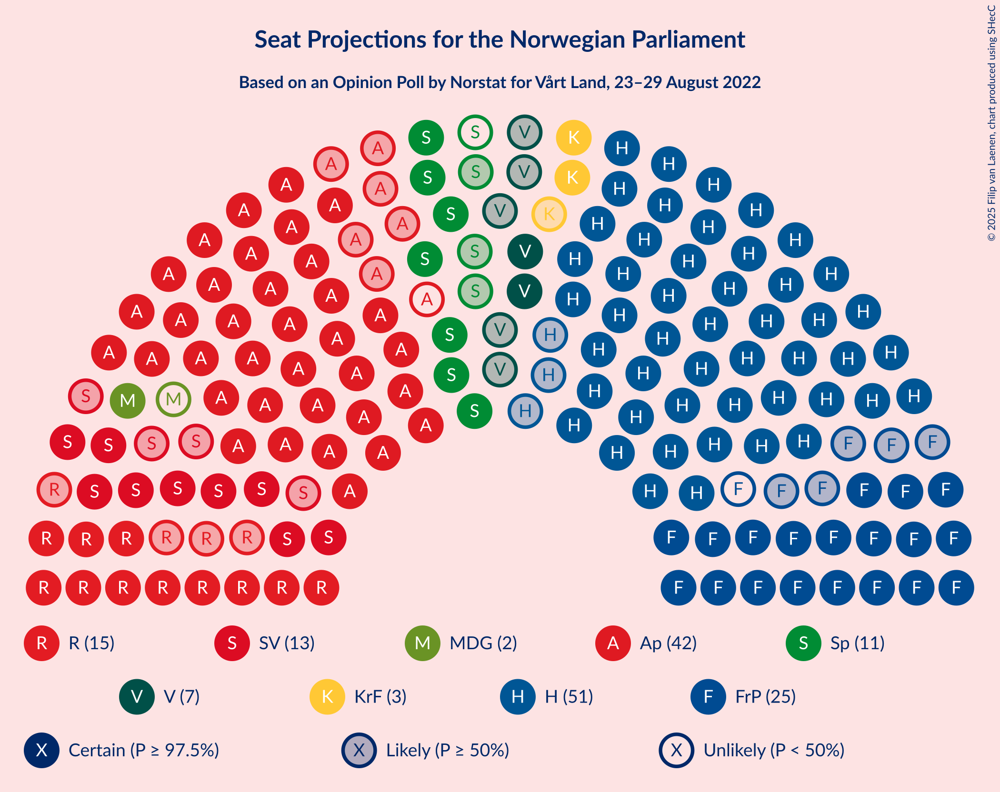

### Confidence Intervals

| Party | Last Result | Median | 80% Confidence Interval | 90% Confidence Interval | 95% Confidence Interval | 99% Confidence Interval |
|:-----:|:-----------:|:------:|:-----------------------:|:-----------------------:|:-----------------------:|:-----------------------:|
| <a href="#høyre">Høyre</a> | 36 | 51 | 48–56 |47–57 |46–58 |45–61 |
| <a href="#arbeiderpartiet">Arbeiderpartiet</a> | 48 | 42 | 37–47 |36–48 |36–49 |34–50 |
| <a href="#fremskrittspartiet">Fremskrittspartiet</a> | 21 | 24 | 21–28 |19–30 |19–30 |18–31 |
| <a href="#rødt">Rødt</a> | 8 | 15 | 12–17 |12–18 |11–19 |10–20 |
| <a href="#sosialistisk-venstreparti">Sosialistisk Venstreparti</a> | 13 | 13 | 10–16 |10–16 |9–17 |9–18 |
| <a href="#senterpartiet">Senterpartiet</a> | 28 | 10 | 8–12 |7–13 |7–14 |1–14 |
| <a href="#venstre">Venstre</a> | 8 | 7 | 2–9 |2–9 |2–10 |2–10 |
| <a href="#kristelig-folkeparti">Kristelig Folkeparti</a> | 3 | 3 | 2–7 |2–8 |1–8 |0–9 |
| <a href="#miljøpartiet-de-grønne">Miljøpartiet De Grønne</a> | 3 | 2 | 1–7 |1–7 |1–7 |1–8 |

### Høyre

*For a full overview of the results for this party, see the [Høyre](party-høyre.html) page.*

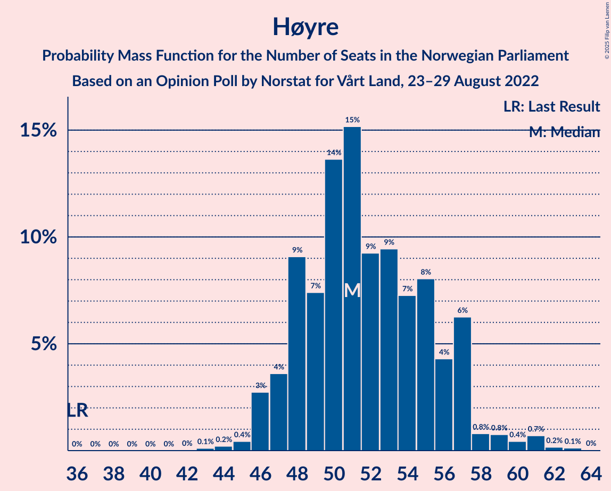

| Number of Seats | Probability | Accumulated | Special Marks |
|:---------------:|:-----------:|:-----------:|:-------------:|
| 36 | 0% | 100% | Last Result |
| 37 | 0% | 100% |  |
| 38 | 0% | 100% |  |
| 39 | 0% | 100% |  |
| 40 | 0% | 100% |  |
| 41 | 0% | 100% |  |
| 42 | 0% | 100% |  |
| 43 | 0.1% | 100% |  |
| 44 | 0.2% | 99.9% |  |
| 45 | 0.4% | 99.6% |  |
| 46 | 3% | 99.2% |  |
| 47 | 4% | 96% |  |
| 48 | 9% | 93% |  |
| 49 | 7% | 84% |  |
| 50 | 14% | 76% |  |
| 51 | 15% | 63% | Median |
| 52 | 9% | 48% |  |
| 53 | 9% | 38% |  |
| 54 | 7% | 29% |  |
| 55 | 8% | 22% |  |
| 56 | 4% | 14% |  |
| 57 | 6% | 9% |  |
| 58 | 0.8% | 3% |  |
| 59 | 0.8% | 2% |  |
| 60 | 0.4% | 1.5% |  |
| 61 | 0.7% | 1.0% |  |
| 62 | 0.2% | 0.3% |  |
| 63 | 0.1% | 0.2% |  |
| 64 | 0% | 0% |  |

### Arbeiderpartiet

*For a full overview of the results for this party, see the [Arbeiderpartiet](party-arbeiderpartiet.html) page.*

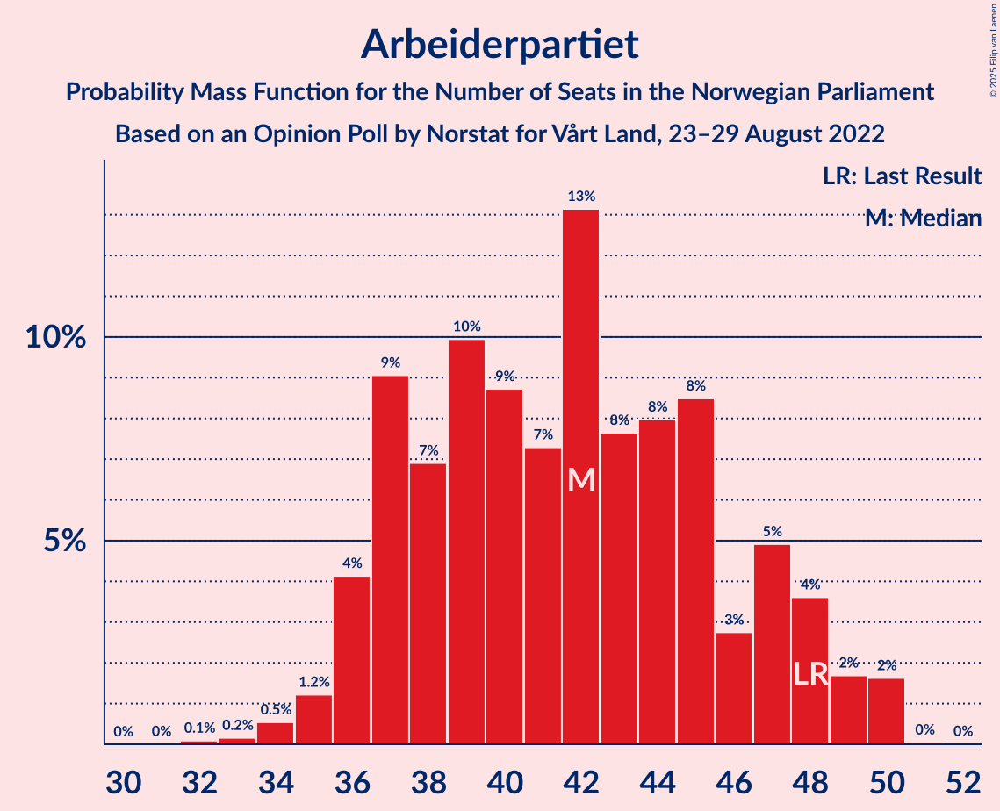

| Number of Seats | Probability | Accumulated | Special Marks |
|:---------------:|:-----------:|:-----------:|:-------------:|
| 32 | 0.1% | 100% |  |
| 33 | 0.2% | 99.9% |  |
| 34 | 0.5% | 99.7% |  |
| 35 | 1.2% | 99.2% |  |
| 36 | 4% | 98% |  |
| 37 | 9% | 94% |  |
| 38 | 7% | 85% |  |
| 39 | 10% | 78% |  |
| 40 | 9% | 68% |  |
| 41 | 7% | 59% |  |
| 42 | 13% | 52% | Median |
| 43 | 8% | 39% |  |
| 44 | 8% | 31% |  |
| 45 | 8% | 23% |  |
| 46 | 3% | 15% |  |
| 47 | 5% | 12% |  |
| 48 | 4% | 7% | Last Result |
| 49 | 2% | 3% |  |
| 50 | 2% | 2% |  |
| 51 | 0% | 0.1% |  |
| 52 | 0% | 0% |  |

### Fremskrittspartiet

*For a full overview of the results for this party, see the [Fremskrittspartiet](party-fremskrittspartiet.html) page.*

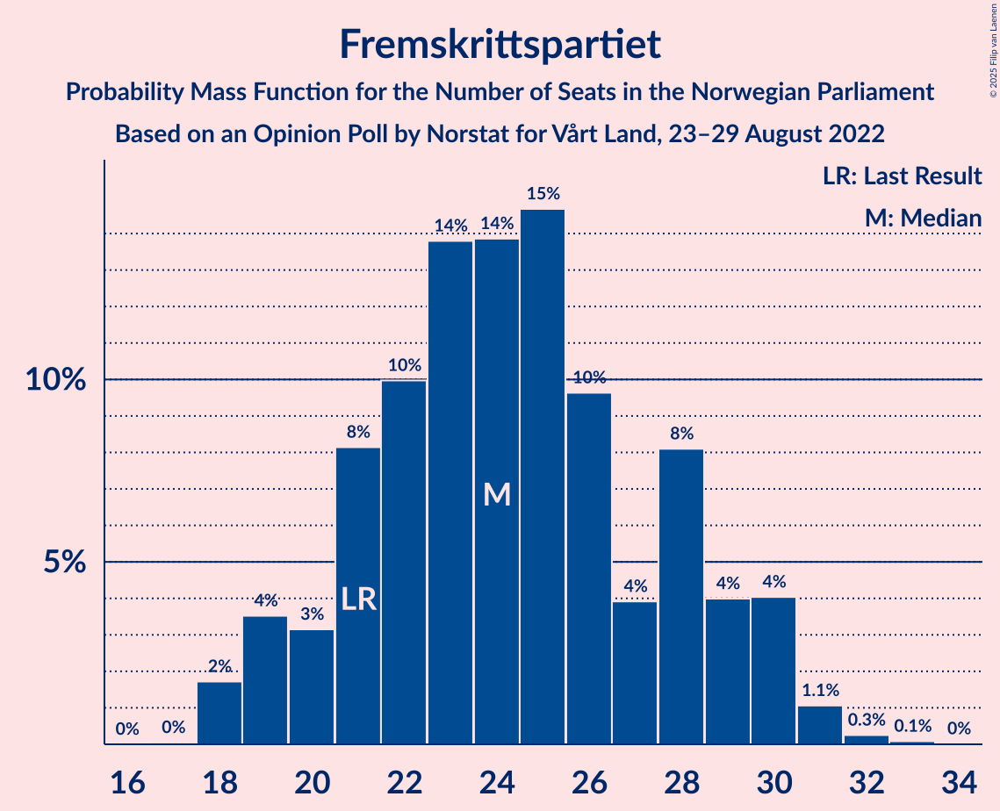

| Number of Seats | Probability | Accumulated | Special Marks |
|:---------------:|:-----------:|:-----------:|:-------------:|
| 18 | 2% | 100% |  |
| 19 | 4% | 98% |  |
| 20 | 3% | 95% |  |
| 21 | 8% | 92% | Last Result |
| 22 | 10% | 83% |  |
| 23 | 14% | 73% |  |
| 24 | 14% | 60% | Median |
| 25 | 15% | 46% |  |
| 26 | 10% | 31% |  |
| 27 | 4% | 21% |  |
| 28 | 8% | 18% |  |
| 29 | 4% | 9% |  |
| 30 | 4% | 5% |  |
| 31 | 1.1% | 1.4% |  |
| 32 | 0.3% | 0.4% |  |
| 33 | 0.1% | 0.1% |  |
| 34 | 0% | 0% |  |

### Rødt

*For a full overview of the results for this party, see the [Rødt](party-rødt.html) page.*

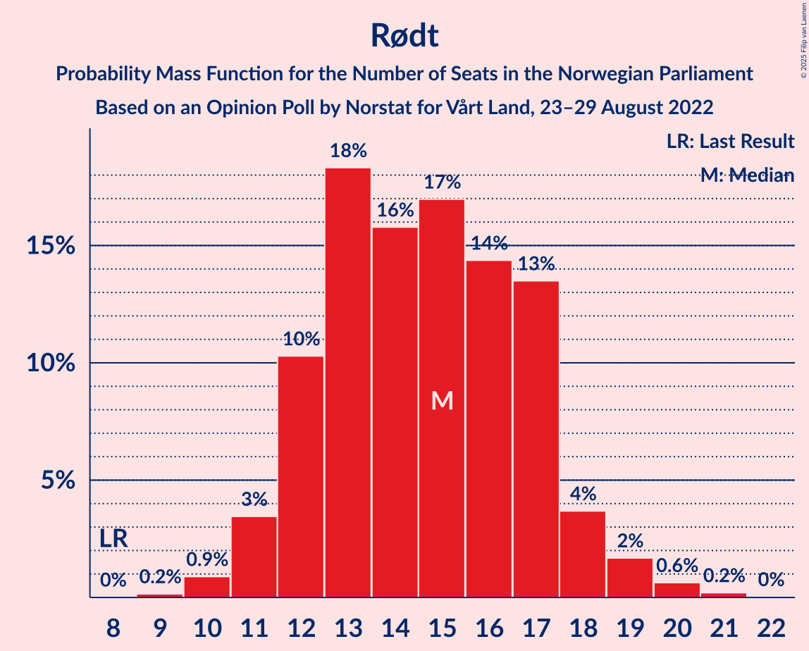

| Number of Seats | Probability | Accumulated | Special Marks |
|:---------------:|:-----------:|:-----------:|:-------------:|
| 8 | 0% | 100% | Last Result |
| 9 | 0.2% | 100% |  |
| 10 | 0.9% | 99.8% |  |
| 11 | 3% | 98.9% |  |
| 12 | 10% | 95% |  |
| 13 | 18% | 85% |  |
| 14 | 16% | 67% |  |
| 15 | 17% | 51% | Median |
| 16 | 14% | 34% |  |
| 17 | 13% | 20% |  |
| 18 | 4% | 6% |  |
| 19 | 2% | 3% |  |
| 20 | 0.6% | 0.9% |  |
| 21 | 0.2% | 0.2% |  |
| 22 | 0% | 0% |  |

### Sosialistisk Venstreparti

*For a full overview of the results for this party, see the [Sosialistisk Venstreparti](party-sosialistiskvenstreparti.html) page.*

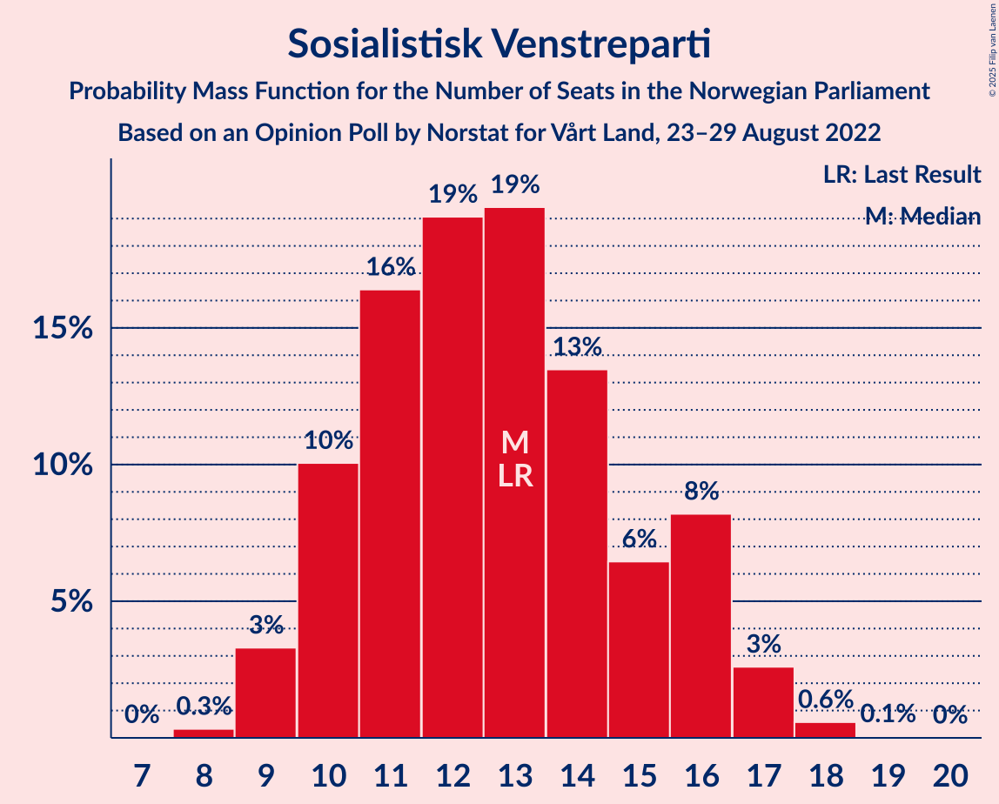

| Number of Seats | Probability | Accumulated | Special Marks |
|:---------------:|:-----------:|:-----------:|:-------------:|
| 8 | 0.3% | 100% |  |
| 9 | 3% | 99.6% |  |
| 10 | 10% | 96% |  |
| 11 | 16% | 86% |  |
| 12 | 19% | 70% |  |
| 13 | 19% | 51% | Last Result, Median |
| 14 | 13% | 31% |  |
| 15 | 6% | 18% |  |
| 16 | 8% | 11% |  |
| 17 | 3% | 3% |  |
| 18 | 0.6% | 0.7% |  |
| 19 | 0.1% | 0.1% |  |
| 20 | 0% | 0% |  |

### Senterpartiet

*For a full overview of the results for this party, see the [Senterpartiet](party-senterpartiet.html) page.*

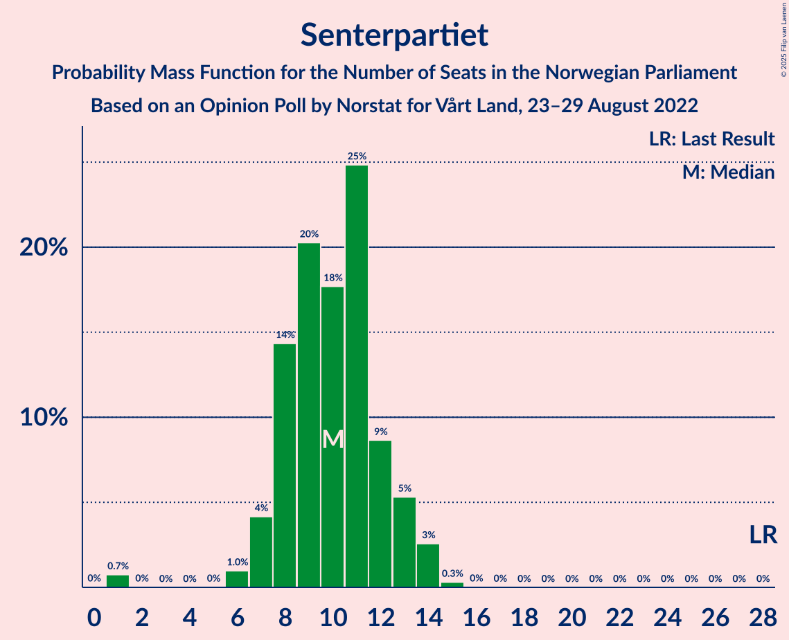

| Number of Seats | Probability | Accumulated | Special Marks |
|:---------------:|:-----------:|:-----------:|:-------------:|
| 1 | 0.7% | 100% |  |
| 2 | 0% | 99.2% |  |
| 3 | 0% | 99.2% |  |
| 4 | 0% | 99.2% |  |
| 5 | 0% | 99.2% |  |
| 6 | 1.0% | 99.2% |  |
| 7 | 4% | 98% |  |
| 8 | 14% | 94% |  |
| 9 | 20% | 80% |  |
| 10 | 18% | 59% | Median |
| 11 | 25% | 42% |  |
| 12 | 9% | 17% |  |
| 13 | 5% | 8% |  |
| 14 | 3% | 3% |  |
| 15 | 0.3% | 0.4% |  |
| 16 | 0% | 0% |  |
| 17 | 0% | 0% |  |
| 18 | 0% | 0% |  |
| 19 | 0% | 0% |  |
| 20 | 0% | 0% |  |
| 21 | 0% | 0% |  |
| 22 | 0% | 0% |  |
| 23 | 0% | 0% |  |
| 24 | 0% | 0% |  |
| 25 | 0% | 0% |  |
| 26 | 0% | 0% |  |
| 27 | 0% | 0% |  |
| 28 | 0% | 0% | Last Result |

### Venstre

*For a full overview of the results for this party, see the [Venstre](party-venstre.html) page.*

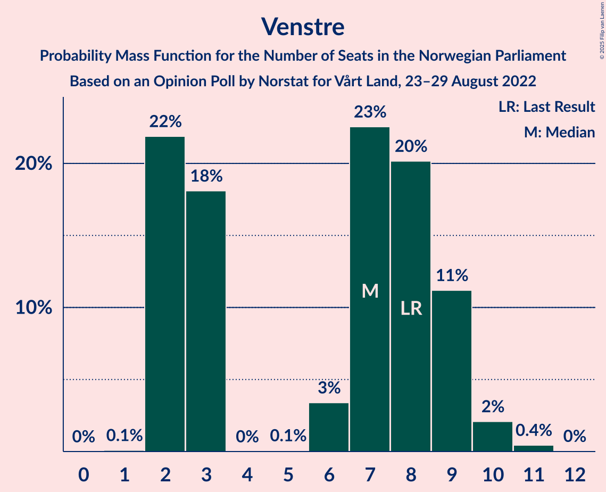

| Number of Seats | Probability | Accumulated | Special Marks |
|:---------------:|:-----------:|:-----------:|:-------------:|
| 1 | 0.1% | 100% |  |
| 2 | 22% | 99.9% |  |
| 3 | 18% | 78% |  |
| 4 | 0% | 60% |  |
| 5 | 0.1% | 60% |  |
| 6 | 3% | 60% |  |
| 7 | 23% | 56% | Median |
| 8 | 20% | 34% | Last Result |
| 9 | 11% | 14% |  |
| 10 | 2% | 3% |  |
| 11 | 0.4% | 0.5% |  |
| 12 | 0% | 0% |  |

### Kristelig Folkeparti

*For a full overview of the results for this party, see the [Kristelig Folkeparti](party-kristeligfolkeparti.html) page.*

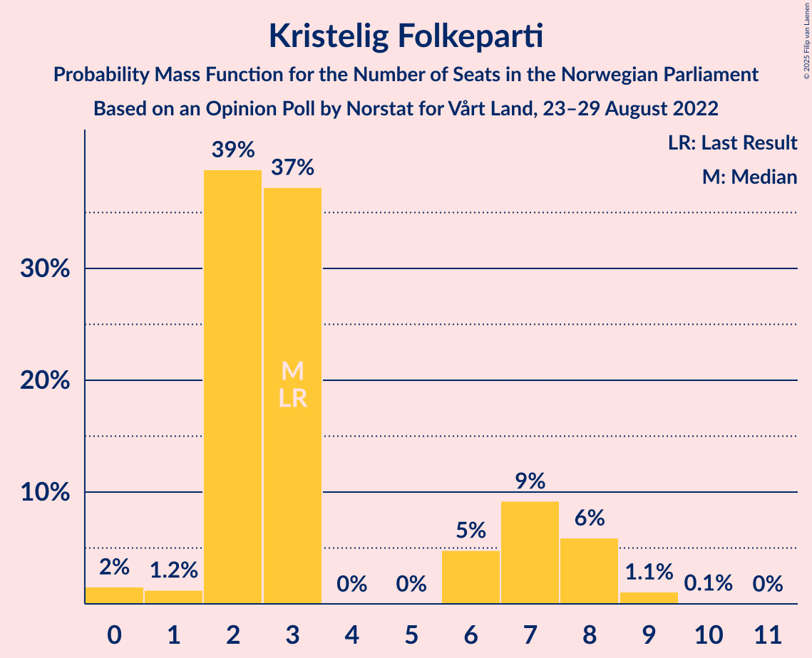

| Number of Seats | Probability | Accumulated | Special Marks |
|:---------------:|:-----------:|:-----------:|:-------------:|
| 0 | 2% | 100% |  |
| 1 | 1.2% | 98% |  |
| 2 | 39% | 97% |  |
| 3 | 37% | 58% | Last Result, Median |
| 4 | 0% | 21% |  |
| 5 | 0% | 21% |  |
| 6 | 5% | 21% |  |
| 7 | 9% | 16% |  |
| 8 | 6% | 7% |  |
| 9 | 1.1% | 1.2% |  |
| 10 | 0.1% | 0.1% |  |
| 11 | 0% | 0% |  |

### Miljøpartiet De Grønne

*For a full overview of the results for this party, see the [Miljøpartiet De Grønne](party-miljøpartietdegrønne.html) page.*

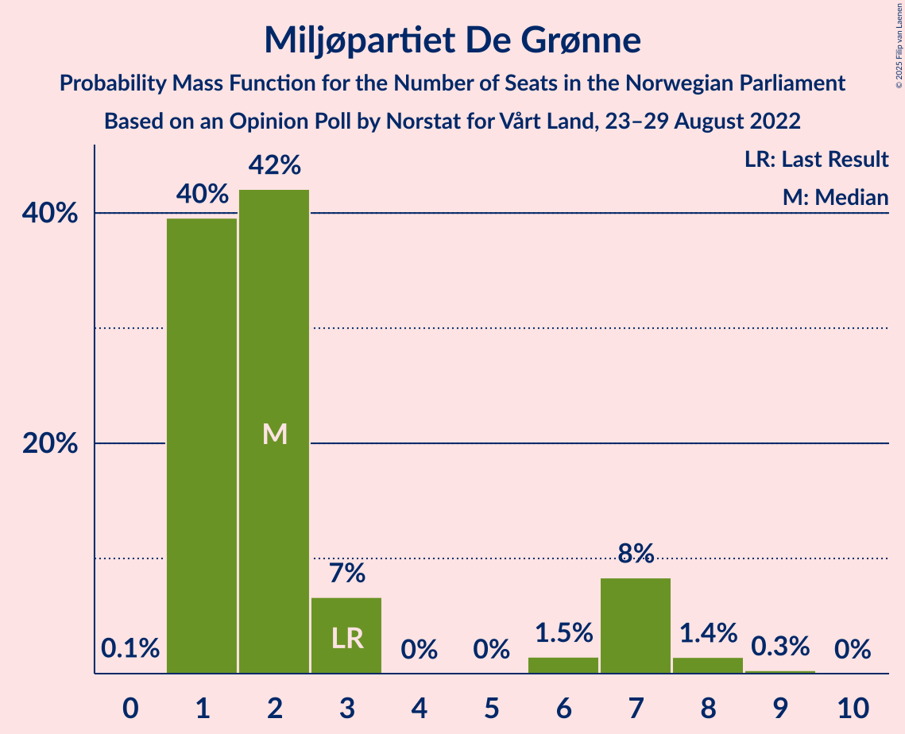

| Number of Seats | Probability | Accumulated | Special Marks |
|:---------------:|:-----------:|:-----------:|:-------------:|
| 0 | 0.1% | 100% |  |
| 1 | 40% | 99.9% |  |
| 2 | 42% | 60% | Median |
| 3 | 7% | 18% | Last Result |
| 4 | 0% | 12% |  |
| 5 | 0% | 12% |  |
| 6 | 1.5% | 12% |  |
| 7 | 8% | 10% |  |
| 8 | 1.4% | 2% |  |
| 9 | 0.3% | 0.3% |  |
| 10 | 0% | 0% |  |

## Coalitions

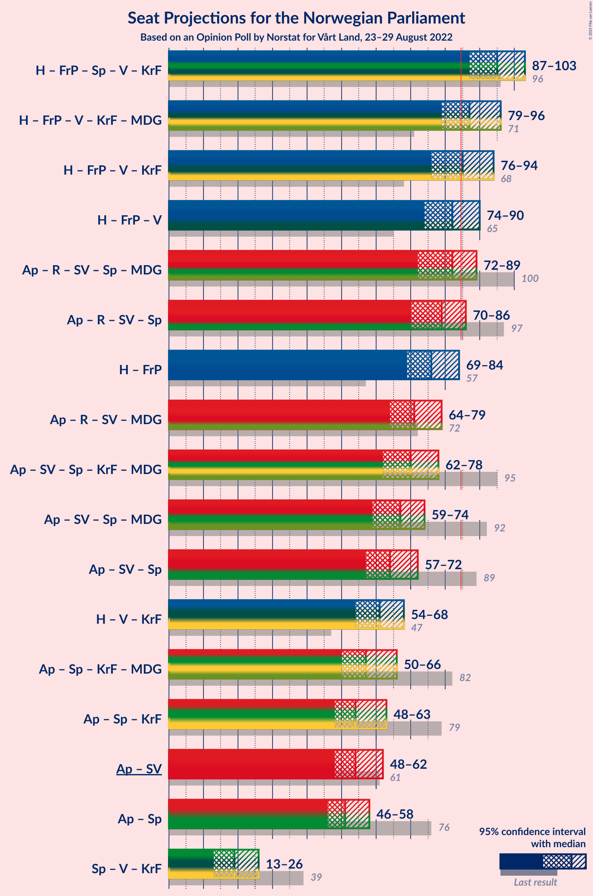

### Confidence Intervals

| Coalition | Last Result | Median | Majority? | 80% Confidence Interval | 90% Confidence Interval | 95% Confidence Interval | 99% Confidence Interval |
|:---------:|:-----------:|:------:|:---------:|:-----------------------:|:-----------------------:|:-----------------------:|:-----------------------:|
| Høyre – Fremskrittspartiet – Senterpartiet – Venstre – Kristelig Folkeparti | 96 | 95 | 98.9% | 90–101 | 89–103 | 87–103 | 83–105 |
| Høyre – Fremskrittspartiet – Venstre – Kristelig Folkeparti – Miljøpartiet De Grønne | 71 | 87 | 79% | 82–93 | 81–94 | 79–96 | 77–98 |
| Høyre – Fremskrittspartiet – Venstre – Kristelig Folkeparti | 68 | 85 | 53% | 81–91 | 79–92 | 76–94 | 74–96 |
| Høyre – Fremskrittspartiet – Venstre | 65 | 82 | 24% | 76–87 | 75–89 | 74–90 | 71–92 |
| Arbeiderpartiet – Rødt – Sosialistisk Venstreparti – Senterpartiet – Miljøpartiet De Grønne | 100 | 82 | 23% | 75–87 | 74–88 | 72–89 | 70–92 |
| Arbeiderpartiet – Rødt – Sosialistisk Venstreparti – Senterpartiet | 97 | 79 | 9% | 73–84 | 71–86 | 70–86 | 67–88 |
| Høyre – Fremskrittspartiet | 57 | 76 | 2% | 71–82 | 70–82 | 69–84 | 67–86 |
| Arbeiderpartiet – Rødt – Sosialistisk Venstreparti – Miljøpartiet De Grønne | 72 | 71 | 0% | 65–77 | 65–78 | 64–79 | 61–81 |
| Arbeiderpartiet – Sosialistisk Venstreparti – Senterpartiet – Kristelig Folkeparti – Miljøpartiet De Grønne | 95 | 70 | 0% | 65–75 | 63–76 | 62–78 | 60–81 |
| Arbeiderpartiet – Sosialistisk Venstreparti – Senterpartiet – Miljøpartiet De Grønne | 92 | 67 | 0% | 61–72 | 60–73 | 59–74 | 57–76 |
| Arbeiderpartiet – Sosialistisk Venstreparti – Senterpartiet | 89 | 64 | 0% | 59–69 | 58–71 | 57–72 | 55–72 |
| Høyre – Venstre – Kristelig Folkeparti | 47 | 61 | 0% | 56–66 | 54–67 | 54–68 | 52–71 |
| Arbeiderpartiet – Senterpartiet – Kristelig Folkeparti – Miljøpartiet De Grønne | 82 | 57 | 0% | 52–63 | 51–64 | 50–66 | 48–69 |
| Arbeiderpartiet – Senterpartiet – Kristelig Folkeparti | 79 | 54 | 0% | 51–60 | 49–62 | 48–63 | 46–66 |
| Arbeiderpartiet – Sosialistisk Venstreparti | 61 | 54 | 0% | 50–60 | 48–61 | 48–62 | 46–63 |
| Arbeiderpartiet – Senterpartiet | 76 | 51 | 0% | 47–56 | 47–58 | 46–58 | 43–59 |
| Senterpartiet – Venstre – Kristelig Folkeparti | 39 | 19 | 0% | 14–24 | 13–25 | 13–26 | 11–28 |

### Høyre – Fremskrittspartiet – Senterpartiet – Venstre – Kristelig Folkeparti

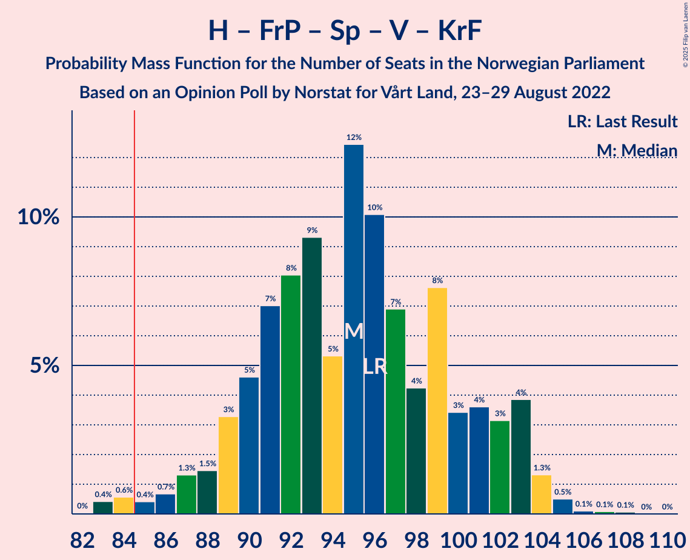

| Number of Seats | Probability | Accumulated | Special Marks |
|:---------------:|:-----------:|:-----------:|:-------------:|
| 82 | 0% | 100% |  |
| 83 | 0.4% | 99.9% |  |
| 84 | 0.6% | 99.5% |  |
| 85 | 0.4% | 98.9% | Majority |
| 86 | 0.7% | 98.5% |  |
| 87 | 1.3% | 98% |  |
| 88 | 1.5% | 97% |  |
| 89 | 3% | 95% |  |
| 90 | 5% | 92% |  |
| 91 | 7% | 87% |  |
| 92 | 8% | 80% |  |
| 93 | 9% | 72% |  |
| 94 | 5% | 63% |  |
| 95 | 12% | 57% | Median |
| 96 | 10% | 45% | Last Result |
| 97 | 7% | 35% |  |
| 98 | 4% | 28% |  |
| 99 | 8% | 24% |  |
| 100 | 3% | 16% |  |
| 101 | 4% | 13% |  |
| 102 | 3% | 9% |  |
| 103 | 4% | 6% |  |
| 104 | 1.3% | 2% |  |
| 105 | 0.5% | 0.8% |  |
| 106 | 0.1% | 0.3% |  |
| 107 | 0.1% | 0.2% |  |
| 108 | 0.1% | 0.1% |  |
| 109 | 0% | 0% |  |

### Høyre – Fremskrittspartiet – Venstre – Kristelig Folkeparti – Miljøpartiet De Grønne

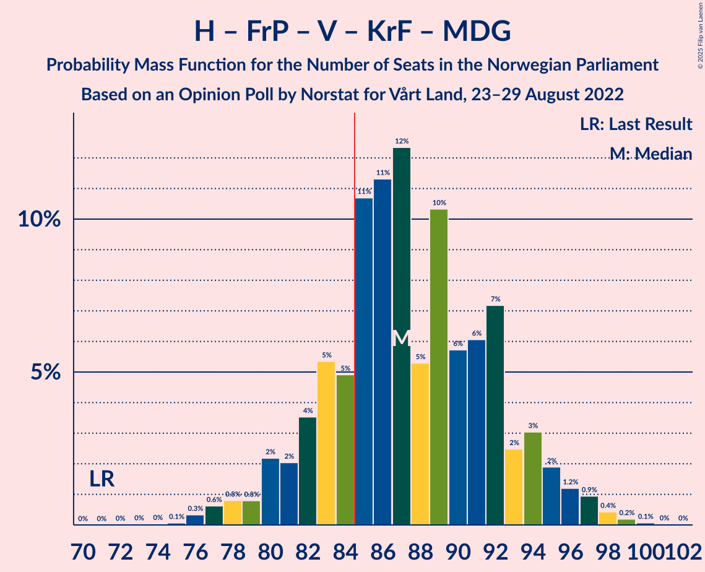

| Number of Seats | Probability | Accumulated | Special Marks |
|:---------------:|:-----------:|:-----------:|:-------------:|
| 71 | 0% | 100% | Last Result |
| 72 | 0% | 100% |  |
| 73 | 0% | 100% |  |
| 74 | 0% | 100% |  |
| 75 | 0.1% | 99.9% |  |
| 76 | 0.3% | 99.9% |  |
| 77 | 0.6% | 99.5% |  |
| 78 | 0.8% | 98.9% |  |
| 79 | 0.8% | 98% |  |
| 80 | 2% | 97% |  |
| 81 | 2% | 95% |  |
| 82 | 4% | 93% |  |
| 83 | 5% | 90% |  |
| 84 | 5% | 84% |  |
| 85 | 11% | 79% | Majority |
| 86 | 11% | 69% |  |
| 87 | 12% | 57% | Median |
| 88 | 5% | 45% |  |
| 89 | 10% | 40% |  |
| 90 | 6% | 29% |  |
| 91 | 6% | 24% |  |
| 92 | 7% | 17% |  |
| 93 | 2% | 10% |  |
| 94 | 3% | 8% |  |
| 95 | 2% | 5% |  |
| 96 | 1.2% | 3% |  |
| 97 | 0.9% | 2% |  |
| 98 | 0.4% | 0.7% |  |
| 99 | 0.2% | 0.3% |  |
| 100 | 0.1% | 0.1% |  |
| 101 | 0% | 0% |  |

### Høyre – Fremskrittspartiet – Venstre – Kristelig Folkeparti

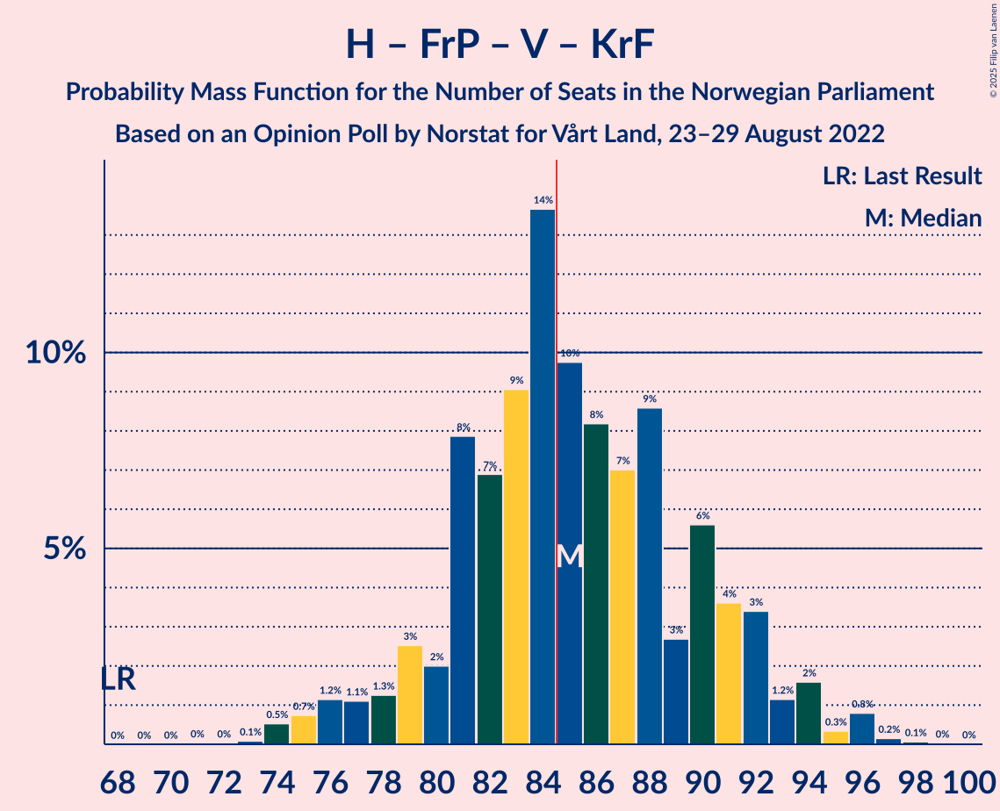

| Number of Seats | Probability | Accumulated | Special Marks |
|:---------------:|:-----------:|:-----------:|:-------------:|
| 68 | 0% | 100% | Last Result |
| 69 | 0% | 100% |  |
| 70 | 0% | 100% |  |
| 71 | 0% | 100% |  |
| 72 | 0% | 100% |  |
| 73 | 0.1% | 99.9% |  |
| 74 | 0.5% | 99.8% |  |
| 75 | 0.7% | 99.3% |  |
| 76 | 1.2% | 98.6% |  |
| 77 | 1.1% | 97% |  |
| 78 | 1.3% | 96% |  |
| 79 | 3% | 95% |  |
| 80 | 2% | 93% |  |
| 81 | 8% | 91% |  |
| 82 | 7% | 83% |  |
| 83 | 9% | 76% |  |
| 84 | 14% | 67% |  |
| 85 | 10% | 53% | Median, Majority |
| 86 | 8% | 43% |  |
| 87 | 7% | 35% |  |
| 88 | 9% | 28% |  |
| 89 | 3% | 19% |  |
| 90 | 6% | 17% |  |
| 91 | 4% | 11% |  |
| 92 | 3% | 8% |  |
| 93 | 1.2% | 4% |  |
| 94 | 2% | 3% |  |
| 95 | 0.3% | 1.4% |  |
| 96 | 0.8% | 1.1% |  |
| 97 | 0.2% | 0.3% |  |
| 98 | 0.1% | 0.1% |  |
| 99 | 0% | 0% |  |

### Høyre – Fremskrittspartiet – Venstre

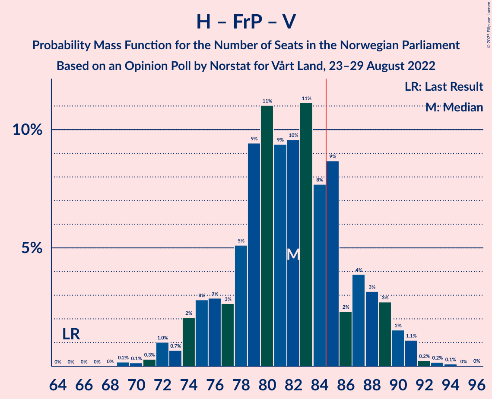

| Number of Seats | Probability | Accumulated | Special Marks |
|:---------------:|:-----------:|:-----------:|:-------------:|
| 65 | 0% | 100% | Last Result |
| 66 | 0% | 100% |  |
| 67 | 0% | 100% |  |
| 68 | 0% | 100% |  |
| 69 | 0.2% | 100% |  |
| 70 | 0.1% | 99.8% |  |
| 71 | 0.3% | 99.7% |  |
| 72 | 1.0% | 99.4% |  |
| 73 | 0.7% | 98% |  |
| 74 | 2% | 98% |  |
| 75 | 3% | 96% |  |
| 76 | 3% | 93% |  |
| 77 | 3% | 90% |  |
| 78 | 5% | 87% |  |
| 79 | 9% | 82% |  |
| 80 | 11% | 73% |  |
| 81 | 9% | 62% |  |
| 82 | 10% | 52% | Median |
| 83 | 11% | 43% |  |
| 84 | 8% | 32% |  |
| 85 | 9% | 24% | Majority |
| 86 | 2% | 15% |  |
| 87 | 4% | 13% |  |
| 88 | 3% | 9% |  |
| 89 | 3% | 6% |  |
| 90 | 2% | 3% |  |
| 91 | 1.1% | 2% |  |
| 92 | 0.2% | 0.5% |  |
| 93 | 0.2% | 0.3% |  |
| 94 | 0.1% | 0.1% |  |
| 95 | 0% | 0.1% |  |
| 96 | 0% | 0% |  |

### Arbeiderpartiet – Rødt – Sosialistisk Venstreparti – Senterpartiet – Miljøpartiet De Grønne

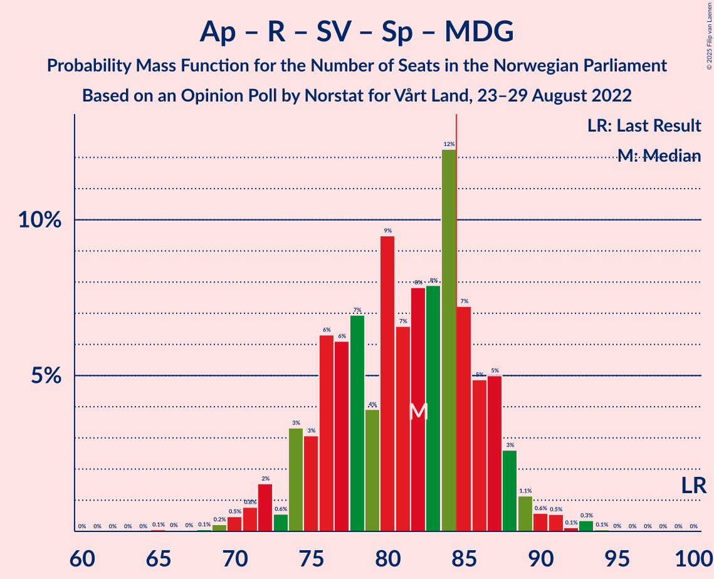

| Number of Seats | Probability | Accumulated | Special Marks |
|:---------------:|:-----------:|:-----------:|:-------------:|
| 65 | 0.1% | 100% |  |
| 66 | 0% | 99.9% |  |
| 67 | 0% | 99.9% |  |
| 68 | 0.1% | 99.9% |  |
| 69 | 0.2% | 99.8% |  |
| 70 | 0.5% | 99.6% |  |
| 71 | 0.8% | 99.1% |  |
| 72 | 2% | 98% |  |
| 73 | 0.6% | 97% |  |
| 74 | 3% | 96% |  |
| 75 | 3% | 93% |  |
| 76 | 6% | 90% |  |
| 77 | 6% | 84% |  |
| 78 | 7% | 77% |  |
| 79 | 4% | 70% |  |
| 80 | 9% | 67% |  |
| 81 | 7% | 57% |  |
| 82 | 8% | 51% | Median |
| 83 | 8% | 43% |  |
| 84 | 12% | 35% |  |
| 85 | 7% | 23% | Majority |
| 86 | 5% | 15% |  |
| 87 | 5% | 10% |  |
| 88 | 3% | 5% |  |
| 89 | 1.1% | 3% |  |
| 90 | 0.6% | 2% |  |
| 91 | 0.5% | 1.1% |  |
| 92 | 0.1% | 0.5% |  |
| 93 | 0.3% | 0.4% |  |
| 94 | 0.1% | 0.1% |  |
| 95 | 0% | 0% |  |
| 96 | 0% | 0% |  |
| 97 | 0% | 0% |  |
| 98 | 0% | 0% |  |
| 99 | 0% | 0% |  |
| 100 | 0% | 0% | Last Result |

### Arbeiderpartiet – Rødt – Sosialistisk Venstreparti – Senterpartiet

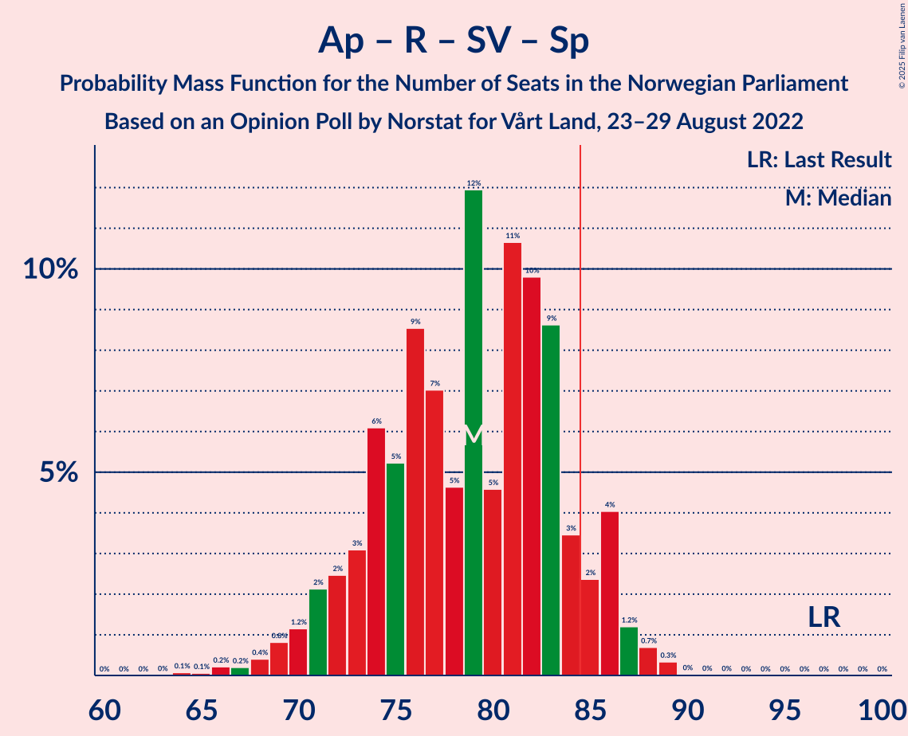

| Number of Seats | Probability | Accumulated | Special Marks |
|:---------------:|:-----------:|:-----------:|:-------------:|
| 64 | 0.1% | 100% |  |
| 65 | 0.1% | 99.9% |  |
| 66 | 0.2% | 99.8% |  |
| 67 | 0.2% | 99.6% |  |
| 68 | 0.4% | 99.4% |  |
| 69 | 0.8% | 99.0% |  |
| 70 | 1.2% | 98% |  |
| 71 | 2% | 97% |  |
| 72 | 2% | 95% |  |
| 73 | 3% | 92% |  |
| 74 | 6% | 89% |  |
| 75 | 5% | 83% |  |
| 76 | 9% | 78% |  |
| 77 | 7% | 69% |  |
| 78 | 5% | 62% |  |
| 79 | 12% | 58% |  |
| 80 | 5% | 46% | Median |
| 81 | 11% | 41% |  |
| 82 | 10% | 31% |  |
| 83 | 9% | 21% |  |
| 84 | 3% | 12% |  |
| 85 | 2% | 9% | Majority |
| 86 | 4% | 6% |  |
| 87 | 1.2% | 2% |  |
| 88 | 0.7% | 1.1% |  |
| 89 | 0.3% | 0.4% |  |
| 90 | 0% | 0.1% |  |
| 91 | 0% | 0% |  |
| 92 | 0% | 0% |  |
| 93 | 0% | 0% |  |
| 94 | 0% | 0% |  |
| 95 | 0% | 0% |  |
| 96 | 0% | 0% |  |
| 97 | 0% | 0% | Last Result |

### Høyre – Fremskrittspartiet

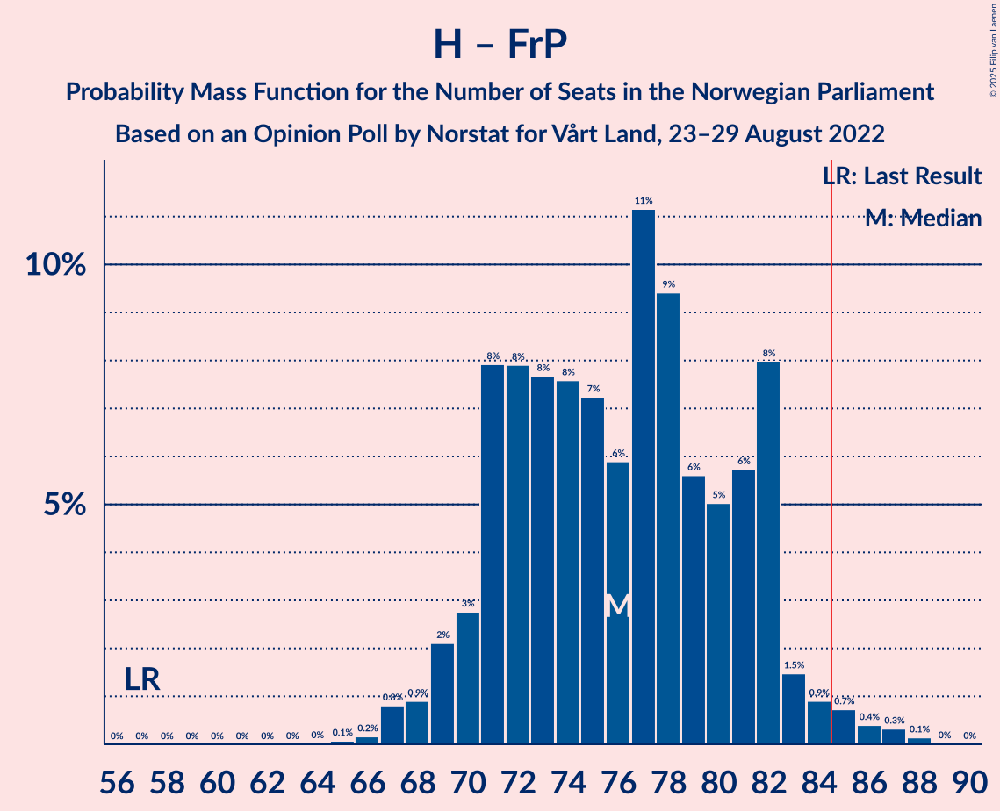

| Number of Seats | Probability | Accumulated | Special Marks |
|:---------------:|:-----------:|:-----------:|:-------------:|
| 57 | 0% | 100% | Last Result |
| 58 | 0% | 100% |  |
| 59 | 0% | 100% |  |
| 60 | 0% | 100% |  |
| 61 | 0% | 100% |  |
| 62 | 0% | 100% |  |
| 63 | 0% | 100% |  |
| 64 | 0% | 100% |  |
| 65 | 0.1% | 100% |  |
| 66 | 0.2% | 99.9% |  |
| 67 | 0.8% | 99.7% |  |
| 68 | 0.9% | 98.9% |  |
| 69 | 2% | 98% |  |
| 70 | 3% | 96% |  |
| 71 | 8% | 93% |  |
| 72 | 8% | 85% |  |
| 73 | 8% | 77% |  |
| 74 | 8% | 70% |  |
| 75 | 7% | 62% | Median |
| 76 | 6% | 55% |  |
| 77 | 11% | 49% |  |
| 78 | 9% | 38% |  |
| 79 | 6% | 28% |  |
| 80 | 5% | 23% |  |
| 81 | 6% | 18% |  |
| 82 | 8% | 12% |  |
| 83 | 1.5% | 4% |  |
| 84 | 0.9% | 3% |  |
| 85 | 0.7% | 2% | Majority |
| 86 | 0.4% | 0.9% |  |
| 87 | 0.3% | 0.5% |  |
| 88 | 0.1% | 0.2% |  |
| 89 | 0% | 0% |  |

### Arbeiderpartiet – Rødt – Sosialistisk Venstreparti – Miljøpartiet De Grønne

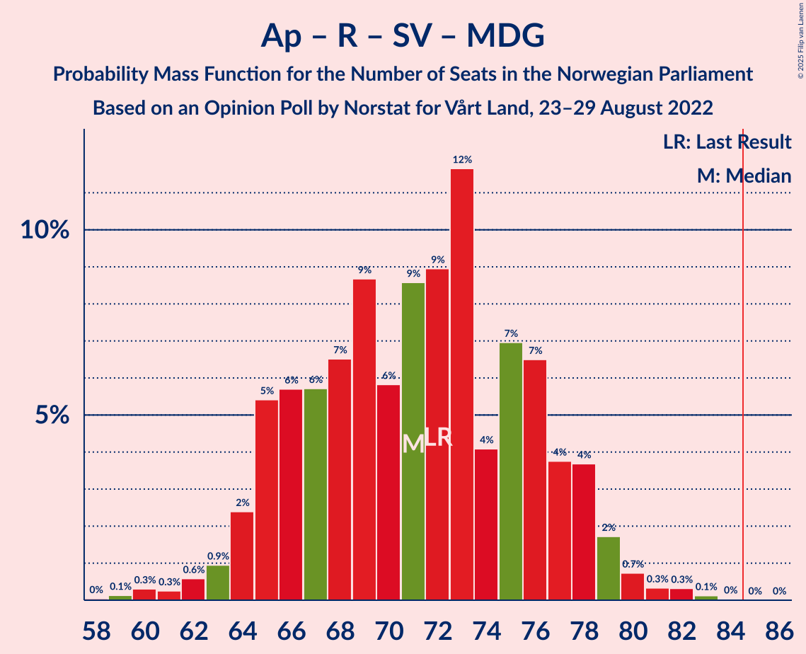

| Number of Seats | Probability | Accumulated | Special Marks |
|:---------------:|:-----------:|:-----------:|:-------------:|
| 58 | 0% | 100% |  |
| 59 | 0.1% | 99.9% |  |
| 60 | 0.3% | 99.8% |  |
| 61 | 0.3% | 99.5% |  |
| 62 | 0.6% | 99.3% |  |
| 63 | 0.9% | 98.7% |  |
| 64 | 2% | 98% |  |
| 65 | 5% | 95% |  |
| 66 | 6% | 90% |  |
| 67 | 6% | 84% |  |
| 68 | 7% | 78% |  |
| 69 | 9% | 72% |  |
| 70 | 6% | 63% |  |
| 71 | 9% | 57% |  |
| 72 | 9% | 49% | Last Result, Median |
| 73 | 12% | 40% |  |
| 74 | 4% | 28% |  |
| 75 | 7% | 24% |  |
| 76 | 7% | 17% |  |
| 77 | 4% | 11% |  |
| 78 | 4% | 7% |  |
| 79 | 2% | 3% |  |
| 80 | 0.7% | 2% |  |
| 81 | 0.3% | 0.8% |  |
| 82 | 0.3% | 0.5% |  |
| 83 | 0.1% | 0.2% |  |
| 84 | 0% | 0.1% |  |
| 85 | 0% | 0% | Majority |

### Arbeiderpartiet – Sosialistisk Venstreparti – Senterpartiet – Kristelig Folkeparti – Miljøpartiet De Grønne

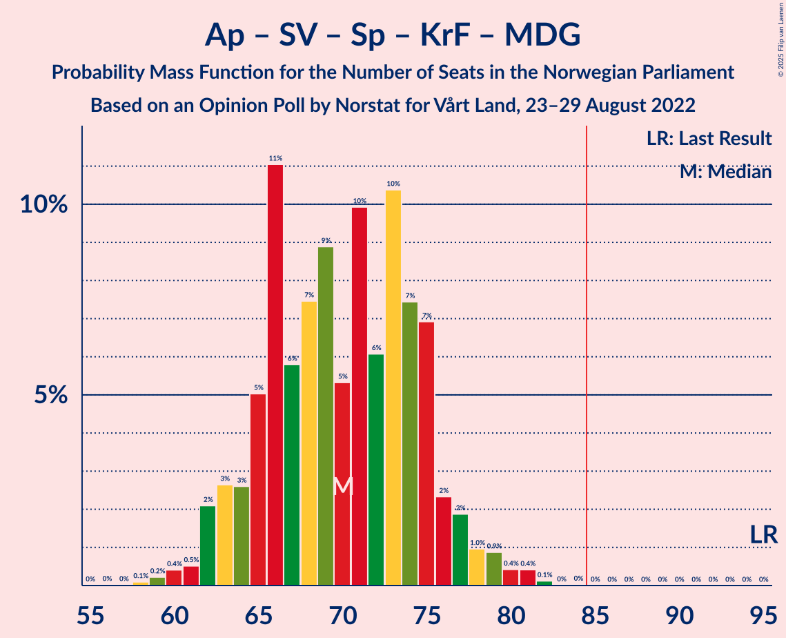

| Number of Seats | Probability | Accumulated | Special Marks |
|:---------------:|:-----------:|:-----------:|:-------------:|
| 57 | 0% | 100% |  |
| 58 | 0.1% | 99.9% |  |
| 59 | 0.2% | 99.8% |  |
| 60 | 0.4% | 99.6% |  |
| 61 | 0.5% | 99.2% |  |
| 62 | 2% | 98.7% |  |
| 63 | 3% | 97% |  |
| 64 | 3% | 94% |  |
| 65 | 5% | 91% |  |
| 66 | 11% | 86% |  |
| 67 | 6% | 75% |  |
| 68 | 7% | 69% |  |
| 69 | 9% | 62% |  |
| 70 | 5% | 53% | Median |
| 71 | 10% | 48% |  |
| 72 | 6% | 38% |  |
| 73 | 10% | 32% |  |
| 74 | 7% | 21% |  |
| 75 | 7% | 14% |  |
| 76 | 2% | 7% |  |
| 77 | 2% | 5% |  |
| 78 | 1.0% | 3% |  |
| 79 | 0.9% | 2% |  |
| 80 | 0.4% | 1.0% |  |
| 81 | 0.4% | 0.6% |  |
| 82 | 0.1% | 0.2% |  |
| 83 | 0% | 0% |  |
| 84 | 0% | 0% |  |
| 85 | 0% | 0% | Majority |
| 86 | 0% | 0% |  |
| 87 | 0% | 0% |  |
| 88 | 0% | 0% |  |
| 89 | 0% | 0% |  |
| 90 | 0% | 0% |  |
| 91 | 0% | 0% |  |
| 92 | 0% | 0% |  |
| 93 | 0% | 0% |  |
| 94 | 0% | 0% |  |
| 95 | 0% | 0% | Last Result |

### Arbeiderpartiet – Sosialistisk Venstreparti – Senterpartiet – Miljøpartiet De Grønne

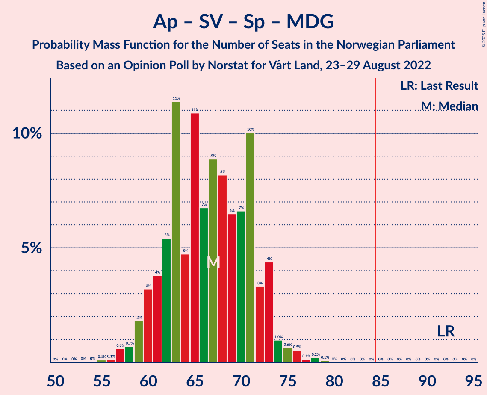

| Number of Seats | Probability | Accumulated | Special Marks |
|:---------------:|:-----------:|:-----------:|:-------------:|
| 54 | 0% | 100% |  |
| 55 | 0.1% | 99.9% |  |
| 56 | 0.1% | 99.8% |  |
| 57 | 0.6% | 99.7% |  |
| 58 | 0.7% | 99.1% |  |
| 59 | 2% | 98% |  |
| 60 | 3% | 97% |  |
| 61 | 4% | 93% |  |
| 62 | 5% | 90% |  |
| 63 | 11% | 84% |  |
| 64 | 5% | 73% |  |
| 65 | 11% | 68% |  |
| 66 | 7% | 57% |  |
| 67 | 9% | 50% | Median |
| 68 | 8% | 42% |  |
| 69 | 6% | 33% |  |
| 70 | 7% | 27% |  |
| 71 | 10% | 20% |  |
| 72 | 3% | 10% |  |
| 73 | 4% | 7% |  |
| 74 | 1.0% | 3% |  |
| 75 | 0.6% | 2% |  |
| 76 | 0.5% | 1.0% |  |
| 77 | 0.1% | 0.4% |  |
| 78 | 0.2% | 0.3% |  |
| 79 | 0.1% | 0.1% |  |
| 80 | 0% | 0% |  |
| 81 | 0% | 0% |  |
| 82 | 0% | 0% |  |
| 83 | 0% | 0% |  |
| 84 | 0% | 0% |  |
| 85 | 0% | 0% | Majority |
| 86 | 0% | 0% |  |
| 87 | 0% | 0% |  |
| 88 | 0% | 0% |  |
| 89 | 0% | 0% |  |
| 90 | 0% | 0% |  |
| 91 | 0% | 0% |  |
| 92 | 0% | 0% | Last Result |

### Arbeiderpartiet – Sosialistisk Venstreparti – Senterpartiet

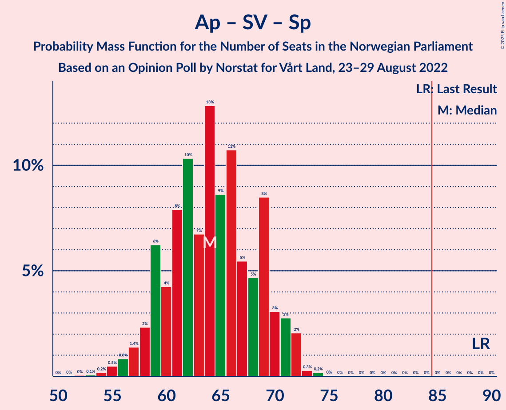

| Number of Seats | Probability | Accumulated | Special Marks |
|:---------------:|:-----------:|:-----------:|:-------------:|
| 52 | 0% | 100% |  |
| 53 | 0.1% | 99.9% |  |
| 54 | 0.2% | 99.9% |  |
| 55 | 0.5% | 99.7% |  |
| 56 | 0.8% | 99.2% |  |
| 57 | 1.4% | 98% |  |
| 58 | 2% | 97% |  |
| 59 | 6% | 95% |  |
| 60 | 4% | 88% |  |
| 61 | 8% | 84% |  |
| 62 | 10% | 76% |  |
| 63 | 7% | 66% |  |
| 64 | 13% | 59% |  |
| 65 | 9% | 46% | Median |
| 66 | 11% | 38% |  |
| 67 | 5% | 27% |  |
| 68 | 5% | 22% |  |
| 69 | 8% | 17% |  |
| 70 | 3% | 8% |  |
| 71 | 3% | 5% |  |
| 72 | 2% | 3% |  |
| 73 | 0.3% | 0.5% |  |
| 74 | 0.2% | 0.2% |  |
| 75 | 0% | 0% |  |
| 76 | 0% | 0% |  |
| 77 | 0% | 0% |  |
| 78 | 0% | 0% |  |
| 79 | 0% | 0% |  |
| 80 | 0% | 0% |  |
| 81 | 0% | 0% |  |
| 82 | 0% | 0% |  |
| 83 | 0% | 0% |  |
| 84 | 0% | 0% |  |
| 85 | 0% | 0% | Majority |
| 86 | 0% | 0% |  |
| 87 | 0% | 0% |  |
| 88 | 0% | 0% |  |
| 89 | 0% | 0% | Last Result |

### Høyre – Venstre – Kristelig Folkeparti

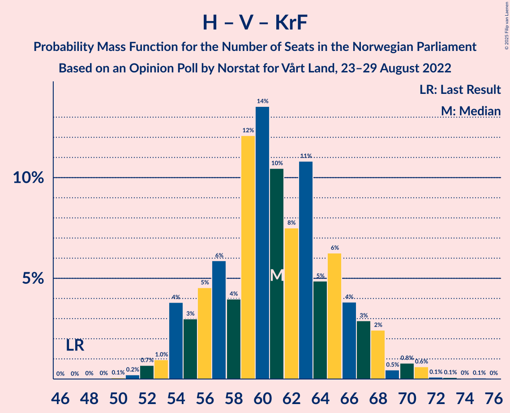

| Number of Seats | Probability | Accumulated | Special Marks |
|:---------------:|:-----------:|:-----------:|:-------------:|
| 47 | 0% | 100% | Last Result |
| 48 | 0% | 100% |  |
| 49 | 0% | 100% |  |
| 50 | 0.1% | 99.9% |  |
| 51 | 0.2% | 99.9% |  |
| 52 | 0.7% | 99.7% |  |
| 53 | 1.0% | 99.0% |  |
| 54 | 4% | 98% |  |
| 55 | 3% | 94% |  |
| 56 | 5% | 91% |  |
| 57 | 6% | 87% |  |
| 58 | 4% | 81% |  |
| 59 | 12% | 77% |  |
| 60 | 14% | 65% |  |
| 61 | 10% | 51% | Median |
| 62 | 8% | 41% |  |
| 63 | 11% | 33% |  |
| 64 | 5% | 22% |  |
| 65 | 6% | 18% |  |
| 66 | 4% | 11% |  |
| 67 | 3% | 7% |  |
| 68 | 2% | 5% |  |
| 69 | 0.5% | 2% |  |
| 70 | 0.8% | 2% |  |
| 71 | 0.6% | 0.9% |  |
| 72 | 0.1% | 0.3% |  |
| 73 | 0.1% | 0.2% |  |
| 74 | 0% | 0.1% |  |
| 75 | 0.1% | 0.1% |  |
| 76 | 0% | 0% |  |

### Arbeiderpartiet – Senterpartiet – Kristelig Folkeparti – Miljøpartiet De Grønne

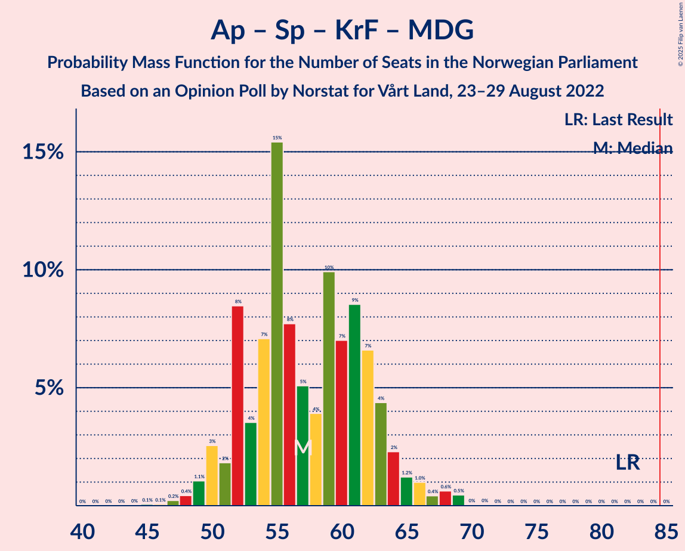

| Number of Seats | Probability | Accumulated | Special Marks |
|:---------------:|:-----------:|:-----------:|:-------------:|
| 45 | 0.1% | 100% |  |
| 46 | 0.1% | 99.9% |  |
| 47 | 0.2% | 99.8% |  |
| 48 | 0.4% | 99.6% |  |
| 49 | 1.1% | 99.2% |  |
| 50 | 3% | 98% |  |
| 51 | 2% | 96% |  |
| 52 | 8% | 94% |  |
| 53 | 4% | 85% |  |
| 54 | 7% | 82% |  |
| 55 | 15% | 75% |  |
| 56 | 8% | 59% |  |
| 57 | 5% | 52% | Median |
| 58 | 4% | 46% |  |
| 59 | 10% | 43% |  |
| 60 | 7% | 33% |  |
| 61 | 9% | 26% |  |
| 62 | 7% | 17% |  |
| 63 | 4% | 10% |  |
| 64 | 2% | 6% |  |
| 65 | 1.2% | 4% |  |
| 66 | 1.0% | 3% |  |
| 67 | 0.4% | 2% |  |
| 68 | 0.6% | 1.2% |  |
| 69 | 0.5% | 0.5% |  |
| 70 | 0% | 0.1% |  |
| 71 | 0% | 0% |  |
| 72 | 0% | 0% |  |
| 73 | 0% | 0% |  |
| 74 | 0% | 0% |  |
| 75 | 0% | 0% |  |
| 76 | 0% | 0% |  |
| 77 | 0% | 0% |  |
| 78 | 0% | 0% |  |
| 79 | 0% | 0% |  |
| 80 | 0% | 0% |  |
| 81 | 0% | 0% |  |
| 82 | 0% | 0% | Last Result |

### Arbeiderpartiet – Senterpartiet – Kristelig Folkeparti

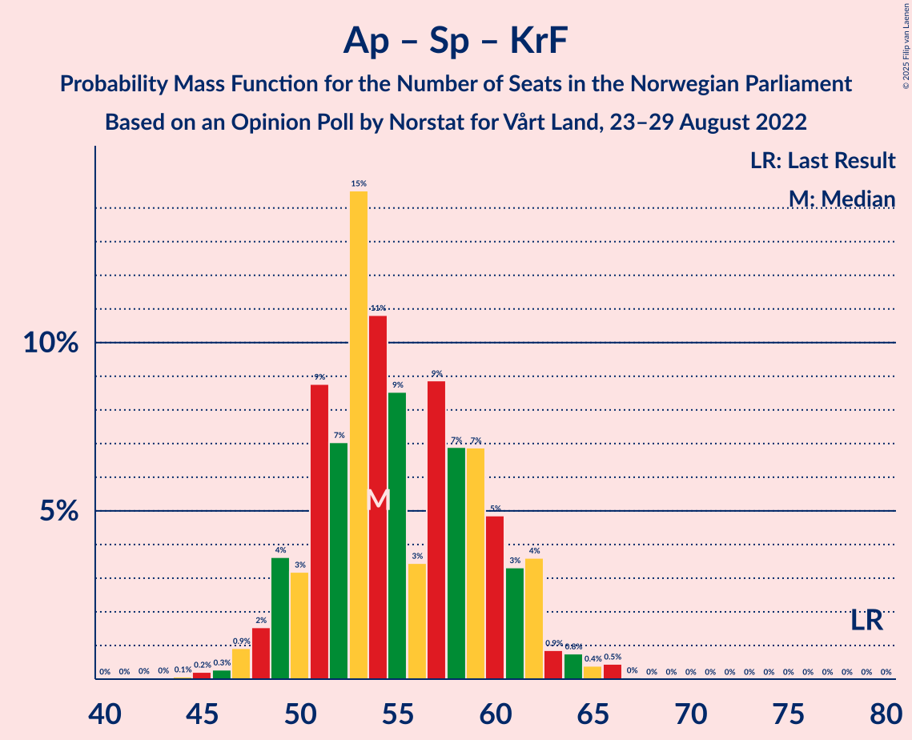

| Number of Seats | Probability | Accumulated | Special Marks |
|:---------------:|:-----------:|:-----------:|:-------------:|
| 42 | 0% | 100% |  |
| 43 | 0% | 99.9% |  |
| 44 | 0.1% | 99.9% |  |
| 45 | 0.2% | 99.8% |  |
| 46 | 0.3% | 99.6% |  |
| 47 | 0.9% | 99.3% |  |
| 48 | 2% | 98% |  |
| 49 | 4% | 97% |  |
| 50 | 3% | 93% |  |
| 51 | 9% | 90% |  |
| 52 | 7% | 81% |  |
| 53 | 15% | 74% |  |
| 54 | 11% | 60% |  |
| 55 | 9% | 49% | Median |
| 56 | 3% | 40% |  |
| 57 | 9% | 37% |  |
| 58 | 7% | 28% |  |
| 59 | 7% | 21% |  |
| 60 | 5% | 14% |  |
| 61 | 3% | 9% |  |
| 62 | 4% | 6% |  |
| 63 | 0.9% | 3% |  |
| 64 | 0.8% | 2% |  |
| 65 | 0.4% | 0.9% |  |
| 66 | 0.5% | 0.5% |  |
| 67 | 0% | 0.1% |  |
| 68 | 0% | 0% |  |
| 69 | 0% | 0% |  |
| 70 | 0% | 0% |  |
| 71 | 0% | 0% |  |
| 72 | 0% | 0% |  |
| 73 | 0% | 0% |  |
| 74 | 0% | 0% |  |
| 75 | 0% | 0% |  |
| 76 | 0% | 0% |  |
| 77 | 0% | 0% |  |
| 78 | 0% | 0% |  |
| 79 | 0% | 0% | Last Result |

### Arbeiderpartiet – Sosialistisk Venstreparti

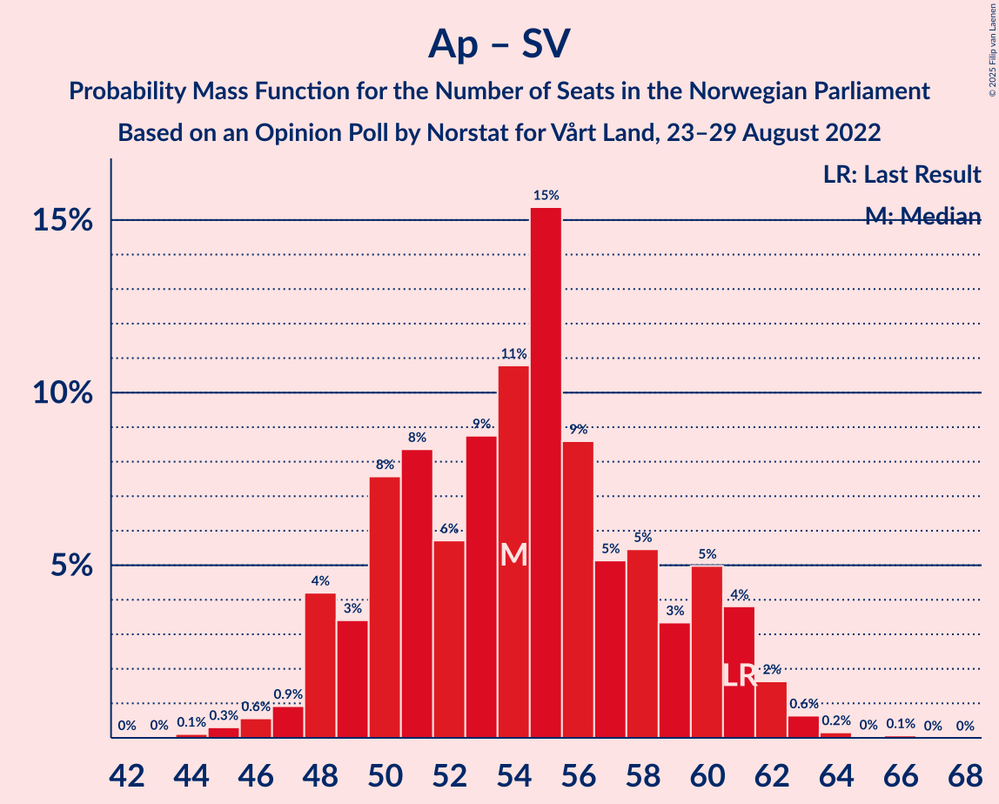

| Number of Seats | Probability | Accumulated | Special Marks |
|:---------------:|:-----------:|:-----------:|:-------------:|
| 44 | 0.1% | 100% |  |
| 45 | 0.3% | 99.8% |  |
| 46 | 0.6% | 99.5% |  |
| 47 | 0.9% | 99.0% |  |
| 48 | 4% | 98% |  |
| 49 | 3% | 94% |  |
| 50 | 8% | 90% |  |
| 51 | 8% | 83% |  |
| 52 | 6% | 75% |  |
| 53 | 9% | 69% |  |
| 54 | 11% | 60% |  |
| 55 | 15% | 49% | Median |
| 56 | 9% | 34% |  |
| 57 | 5% | 25% |  |
| 58 | 5% | 20% |  |
| 59 | 3% | 15% |  |
| 60 | 5% | 11% |  |
| 61 | 4% | 6% | Last Result |
| 62 | 2% | 3% |  |
| 63 | 0.6% | 0.9% |  |
| 64 | 0.2% | 0.3% |  |
| 65 | 0% | 0.1% |  |
| 66 | 0.1% | 0.1% |  |
| 67 | 0% | 0% |  |

### Arbeiderpartiet – Senterpartiet

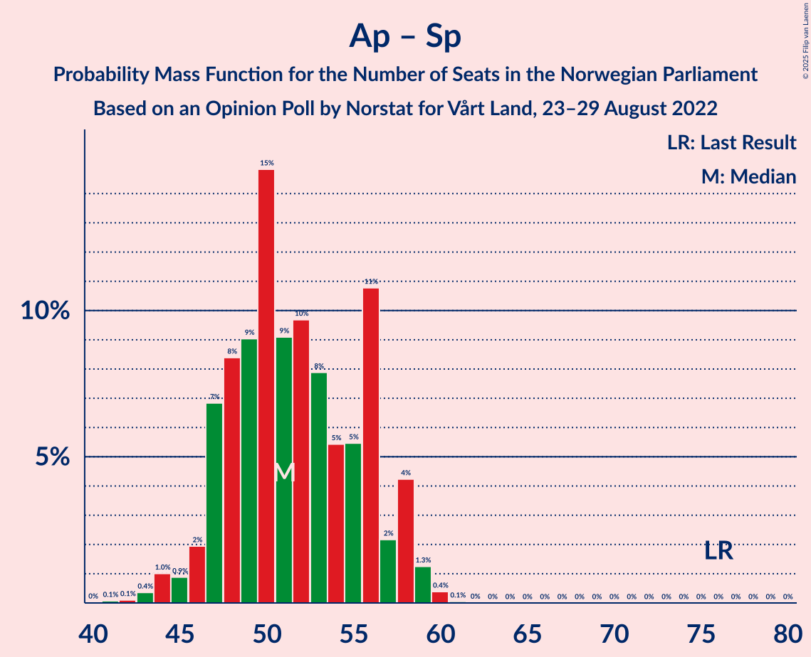

| Number of Seats | Probability | Accumulated | Special Marks |
|:---------------:|:-----------:|:-----------:|:-------------:|
| 40 | 0% | 100% |  |
| 41 | 0.1% | 99.9% |  |
| 42 | 0.1% | 99.9% |  |
| 43 | 0.4% | 99.8% |  |
| 44 | 1.0% | 99.4% |  |
| 45 | 0.9% | 98% |  |
| 46 | 2% | 98% |  |
| 47 | 7% | 96% |  |
| 48 | 8% | 89% |  |
| 49 | 9% | 80% |  |
| 50 | 15% | 71% |  |
| 51 | 9% | 56% |  |
| 52 | 10% | 47% | Median |
| 53 | 8% | 38% |  |
| 54 | 5% | 30% |  |
| 55 | 5% | 24% |  |
| 56 | 11% | 19% |  |
| 57 | 2% | 8% |  |
| 58 | 4% | 6% |  |
| 59 | 1.3% | 2% |  |
| 60 | 0.4% | 0.5% |  |
| 61 | 0.1% | 0.1% |  |
| 62 | 0% | 0% |  |
| 63 | 0% | 0% |  |
| 64 | 0% | 0% |  |
| 65 | 0% | 0% |  |
| 66 | 0% | 0% |  |
| 67 | 0% | 0% |  |
| 68 | 0% | 0% |  |
| 69 | 0% | 0% |  |
| 70 | 0% | 0% |  |
| 71 | 0% | 0% |  |
| 72 | 0% | 0% |  |
| 73 | 0% | 0% |  |
| 74 | 0% | 0% |  |
| 75 | 0% | 0% |  |
| 76 | 0% | 0% | Last Result |

### Senterpartiet – Venstre – Kristelig Folkeparti

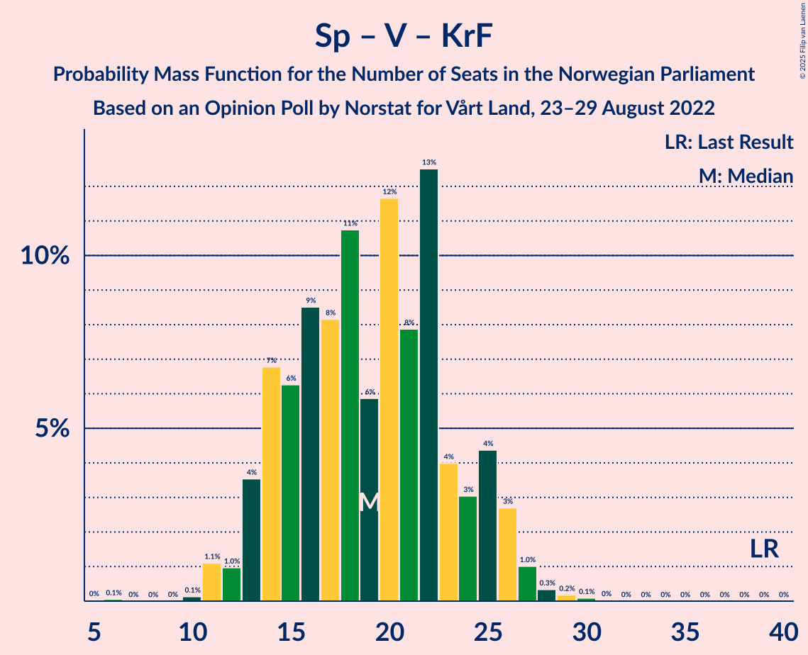

| Number of Seats | Probability | Accumulated | Special Marks |
|:---------------:|:-----------:|:-----------:|:-------------:|
| 6 | 0.1% | 100% |  |
| 7 | 0% | 99.9% |  |
| 8 | 0% | 99.9% |  |
| 9 | 0% | 99.9% |  |
| 10 | 0.1% | 99.9% |  |
| 11 | 1.1% | 99.8% |  |
| 12 | 1.0% | 98.6% |  |
| 13 | 4% | 98% |  |
| 14 | 7% | 94% |  |
| 15 | 6% | 87% |  |
| 16 | 9% | 81% |  |
| 17 | 8% | 73% |  |
| 18 | 11% | 64% |  |
| 19 | 6% | 54% |  |
| 20 | 12% | 48% | Median |
| 21 | 8% | 36% |  |
| 22 | 13% | 28% |  |
| 23 | 4% | 16% |  |
| 24 | 3% | 12% |  |
| 25 | 4% | 9% |  |
| 26 | 3% | 4% |  |
| 27 | 1.0% | 2% |  |
| 28 | 0.3% | 0.6% |  |
| 29 | 0.2% | 0.3% |  |
| 30 | 0.1% | 0.1% |  |
| 31 | 0% | 0% |  |
| 32 | 0% | 0% |  |
| 33 | 0% | 0% |  |
| 34 | 0% | 0% |  |
| 35 | 0% | 0% |  |
| 36 | 0% | 0% |  |
| 37 | 0% | 0% |  |
| 38 | 0% | 0% |  |
| 39 | 0% | 0% | Last Result |

## Technical Information

### Opinion Poll

+ **Polling firm:** Norstat
+ **Commissioner(s):** Vårt Land
+ **Fieldwork period:** 23–29 August 2022

### Calculations

+ **Sample size:** 940
+ **Simulations done:** 1,048,576
+ **Error estimate:** 3.43%

