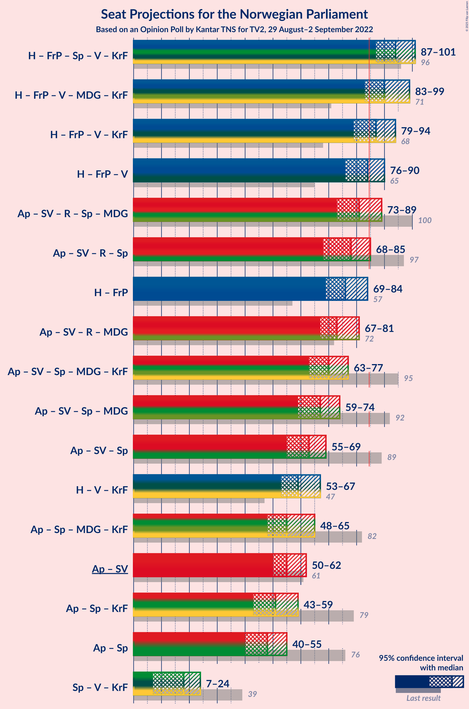
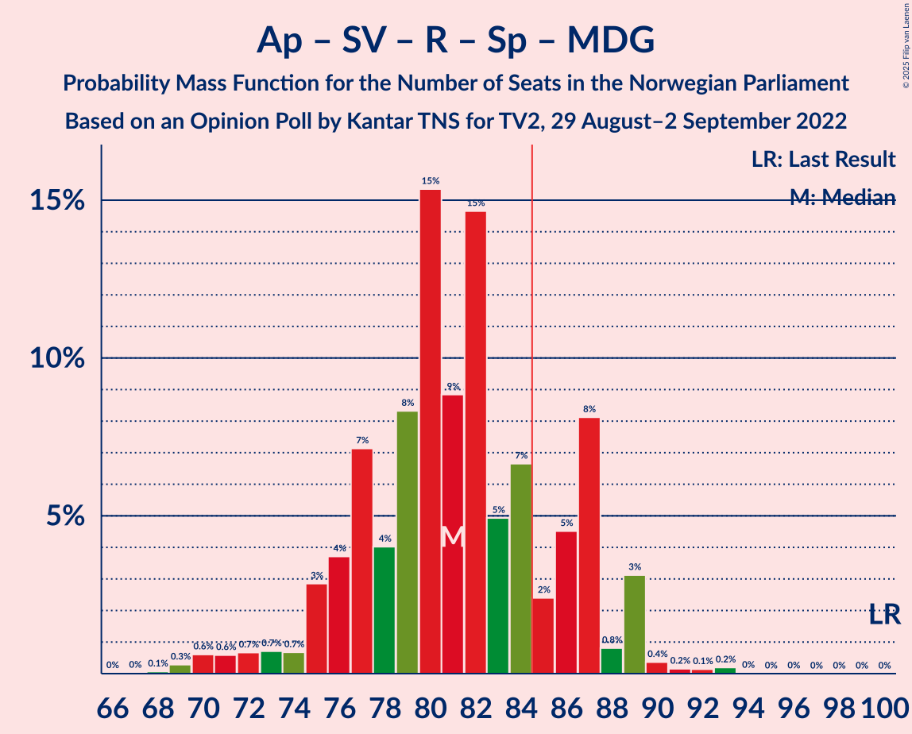
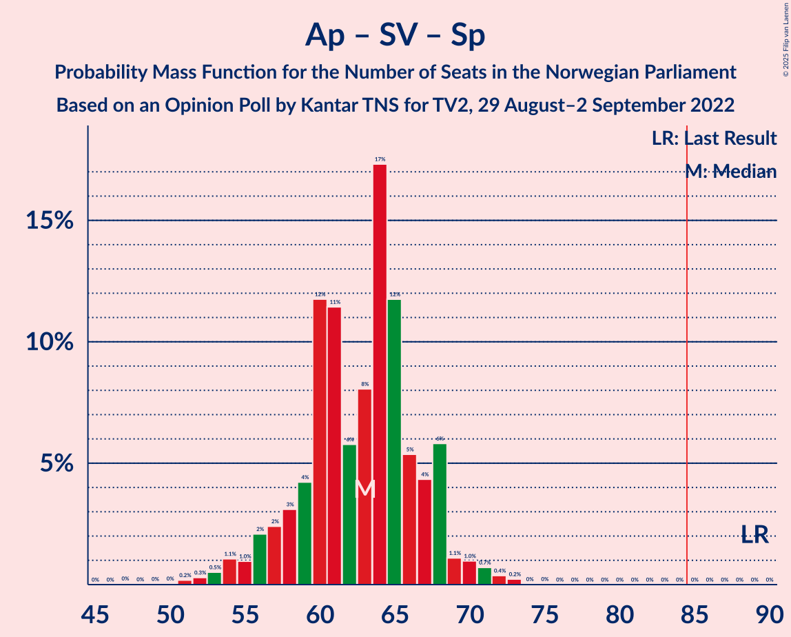

# Opinion Poll by Kantar TNS for TV2, 29 August–2 September 2022

<a href="#voting-intentions">Voting Intentions</a> | <a href="#seats">Seats</a> | <a href="#coalitions">Coalitions</a> | <a href="#technical-information">Technical Information</a>

## Voting Intentions

### Confidence Intervals

| Party | Last Result | Poll Result | 80% Confidence Interval | 90% Confidence Interval | 95% Confidence Interval | 99% Confidence Interval |
|:-----:|:-----------:|:-----------:|:-----------------------:|:-----------------------:|:-----------------------:|:-----------------------:|
| Høyre | 20.4% | 27.8% | 26.0–29.7% |25.5–30.2% |25.0–30.7% |24.2–31.6% |
| Arbeiderpartiet | 26.2% | 20.8% | 19.2–22.5% |18.7–23.0% |18.4–23.5% |17.6–24.3% |
| Fremskrittspartiet | 11.6% | 14.1% | 12.8–15.7% |12.4–16.1% |12.1–16.5% |11.5–17.2% |
| Sosialistisk Venstreparti | 7.6% | 8.4% | 7.4–9.6% |7.1–10.0% |6.8–10.3% |6.3–10.9% |
| Rødt | 4.7% | 8.2% | 7.2–9.4% |6.9–9.8% |6.6–10.1% |6.2–10.7% |
| Senterpartiet | 13.5% | 4.6% | 3.9–5.6% |3.6–5.9% |3.5–6.1% |3.1–6.6% |
| Venstre | 4.6% | 4.5% | 3.8–5.5% |3.6–5.8% |3.4–6.0% |3.0–6.5% |
| Miljøpartiet De Grønne | 3.9% | 3.7% | 3.0–4.6% |2.8–4.8% |2.7–5.1% |2.4–5.5% |
| Kristelig Folkeparti | 3.8% | 3.5% | 2.8–4.4% |2.7–4.6% |2.5–4.8% |2.2–5.3% |
| Industri- og Næringspartiet | 0.3% | 2.2% | 1.7–2.9% |1.5–3.1% |1.4–3.3% |1.2–3.7% |

*Note:* The poll result column reflects the actual value used in the calculations. Published results may vary slightly, and in addition be rounded to fewer digits.

## Seats

### Confidence Intervals

| Party | Last Result | Median | 80% Confidence Interval | 90% Confidence Interval | 95% Confidence Interval | 99% Confidence Interval |
|:-----:|:-----------:|:------:|:-----------------------:|:-----------------------:|:-----------------------:|:-----------------------:|
| <a href="#høyre">Høyre</a> | 36 | 49 | 46–53 |45–54 |44–55 |43–58 |
| <a href="#arbeiderpartiet">Arbeiderpartiet</a> | 48 | 40 | 38–45 |36–47 |36–48 |34–49 |
| <a href="#fremskrittspartiet">Fremskrittspartiet</a> | 21 | 27 | 23–30 |22–31 |21–31 |20–33 |
| <a href="#sosialistisk-venstreparti">Sosialistisk Venstreparti</a> | 13 | 15 | 12–17 |11–18 |11–19 |10–20 |
| <a href="#rødt">Rødt</a> | 8 | 14 | 12–17 |11–17 |11–18 |10–20 |
| <a href="#senterpartiet">Senterpartiet</a> | 28 | 8 | 1–10 |1–10 |0–11 |0–12 |
| <a href="#venstre">Venstre</a> | 8 | 8 | 3–9 |2–10 |2–11 |2–11 |
| <a href="#miljøpartiet-de-grønne">Miljøpartiet De Grønne</a> | 3 | 3 | 1–8 |1–8 |1–8 |1–9 |
| <a href="#kristelig-folkeparti">Kristelig Folkeparti</a> | 3 | 2 | 2–7 |2–8 |2–8 |0–9 |
| <a href="#industri--og-næringspartiet">Industri- og Næringspartiet</a> | 0 | 0 | 0–2 |0–2 |0–2 |0–3 |

### Høyre

*For a full overview of the results for this party, see the [Høyre](party-høyre.html) page.*

| Number of Seats | Probability | Accumulated | Special Marks |
|:---------------:|:-----------:|:-----------:|:-------------:|
| 36 | 0% | 100% | Last Result |
| 37 | 0% | 100% |  |
| 38 | 0% | 100% |  |
| 39 | 0% | 100% |  |
| 40 | 0% | 100% |  |
| 41 | 0.1% | 100% |  |
| 42 | 0.3% | 99.9% |  |
| 43 | 0.4% | 99.7% |  |
| 44 | 2% | 99.2% |  |
| 45 | 3% | 97% |  |
| 46 | 8% | 94% |  |
| 47 | 15% | 86% |  |
| 48 | 17% | 70% |  |
| 49 | 9% | 53% | Median |
| 50 | 14% | 44% |  |
| 51 | 12% | 30% |  |
| 52 | 5% | 17% |  |
| 53 | 6% | 13% |  |
| 54 | 2% | 7% |  |
| 55 | 2% | 5% |  |
| 56 | 1.3% | 2% |  |
| 57 | 0.4% | 1.1% |  |
| 58 | 0.3% | 0.7% |  |
| 59 | 0.2% | 0.5% |  |
| 60 | 0.2% | 0.3% |  |
| 61 | 0.1% | 0.1% |  |
| 62 | 0% | 0% |  |

### Arbeiderpartiet

*For a full overview of the results for this party, see the [Arbeiderpartiet](party-arbeiderpartiet.html) page.*

| Number of Seats | Probability | Accumulated | Special Marks |
|:---------------:|:-----------:|:-----------:|:-------------:|
| 32 | 0.1% | 100% |  |
| 33 | 0.3% | 99.9% |  |
| 34 | 0.7% | 99.6% |  |
| 35 | 1.4% | 98.9% |  |
| 36 | 3% | 98% |  |
| 37 | 3% | 94% |  |
| 38 | 14% | 91% |  |
| 39 | 21% | 77% |  |
| 40 | 16% | 56% | Median |
| 41 | 15% | 39% |  |
| 42 | 8% | 24% |  |
| 43 | 4% | 16% |  |
| 44 | 2% | 12% |  |
| 45 | 2% | 10% |  |
| 46 | 2% | 8% |  |
| 47 | 1.5% | 6% |  |
| 48 | 3% | 5% | Last Result |
| 49 | 1.5% | 2% |  |
| 50 | 0.3% | 0.3% |  |
| 51 | 0% | 0.1% |  |
| 52 | 0% | 0% |  |

### Fremskrittspartiet

*For a full overview of the results for this party, see the [Fremskrittspartiet](party-fremskrittspartiet.html) page.*

| Number of Seats | Probability | Accumulated | Special Marks |
|:---------------:|:-----------:|:-----------:|:-------------:|
| 18 | 0.1% | 100% |  |
| 19 | 0.2% | 99.9% |  |
| 20 | 0.8% | 99.8% |  |
| 21 | 2% | 98.9% | Last Result |
| 22 | 5% | 97% |  |
| 23 | 9% | 92% |  |
| 24 | 7% | 83% |  |
| 25 | 10% | 76% |  |
| 26 | 7% | 66% |  |
| 27 | 10% | 59% | Median |
| 28 | 13% | 49% |  |
| 29 | 15% | 35% |  |
| 30 | 11% | 20% |  |
| 31 | 7% | 9% |  |
| 32 | 0.7% | 1.4% |  |
| 33 | 0.3% | 0.7% |  |
| 34 | 0.3% | 0.4% |  |
| 35 | 0.1% | 0.1% |  |
| 36 | 0% | 0% |  |

### Sosialistisk Venstreparti

*For a full overview of the results for this party, see the [Sosialistisk Venstreparti](party-sosialistiskvenstreparti.html) page.*

| Number of Seats | Probability | Accumulated | Special Marks |
|:---------------:|:-----------:|:-----------:|:-------------:|
| 9 | 0.1% | 100% |  |
| 10 | 0.8% | 99.9% |  |
| 11 | 7% | 99.1% |  |
| 12 | 8% | 92% |  |
| 13 | 13% | 84% | Last Result |
| 14 | 7% | 70% |  |
| 15 | 23% | 63% | Median |
| 16 | 18% | 40% |  |
| 17 | 16% | 22% |  |
| 18 | 3% | 6% |  |
| 19 | 2% | 3% |  |
| 20 | 1.1% | 1.2% |  |
| 21 | 0.1% | 0.2% |  |
| 22 | 0% | 0% |  |

### Rødt

*For a full overview of the results for this party, see the [Rødt](party-rødt.html) page.*

| Number of Seats | Probability | Accumulated | Special Marks |
|:---------------:|:-----------:|:-----------:|:-------------:|
| 8 | 0% | 100% | Last Result |
| 9 | 0.1% | 100% |  |
| 10 | 0.8% | 99.9% |  |
| 11 | 5% | 99.1% |  |
| 12 | 8% | 94% |  |
| 13 | 25% | 86% |  |
| 14 | 24% | 61% | Median |
| 15 | 15% | 37% |  |
| 16 | 10% | 21% |  |
| 17 | 7% | 11% |  |
| 18 | 3% | 4% |  |
| 19 | 0.6% | 2% |  |
| 20 | 0.8% | 1.0% |  |
| 21 | 0.1% | 0.2% |  |
| 22 | 0% | 0% |  |

### Senterpartiet

*For a full overview of the results for this party, see the [Senterpartiet](party-senterpartiet.html) page.*

| Number of Seats | Probability | Accumulated | Special Marks |
|:---------------:|:-----------:|:-----------:|:-------------:|
| 0 | 3% | 100% |  |
| 1 | 7% | 97% |  |
| 2 | 0.2% | 90% |  |
| 3 | 0% | 89% |  |
| 4 | 0% | 89% |  |
| 5 | 0% | 89% |  |
| 6 | 2% | 89% |  |
| 7 | 25% | 87% |  |
| 8 | 24% | 63% | Median |
| 9 | 23% | 38% |  |
| 10 | 11% | 16% |  |
| 11 | 3% | 4% |  |
| 12 | 1.1% | 1.3% |  |
| 13 | 0.1% | 0.2% |  |
| 14 | 0% | 0.1% |  |
| 15 | 0% | 0% |  |
| 16 | 0% | 0% |  |
| 17 | 0% | 0% |  |
| 18 | 0% | 0% |  |
| 19 | 0% | 0% |  |
| 20 | 0% | 0% |  |
| 21 | 0% | 0% |  |
| 22 | 0% | 0% |  |
| 23 | 0% | 0% |  |
| 24 | 0% | 0% |  |
| 25 | 0% | 0% |  |
| 26 | 0% | 0% |  |
| 27 | 0% | 0% |  |
| 28 | 0% | 0% | Last Result |

### Venstre

*For a full overview of the results for this party, see the [Venstre](party-venstre.html) page.*

| Number of Seats | Probability | Accumulated | Special Marks |
|:---------------:|:-----------:|:-----------:|:-------------:|
| 2 | 9% | 100% |  |
| 3 | 9% | 91% |  |
| 4 | 0% | 82% |  |
| 5 | 0% | 82% |  |
| 6 | 3% | 82% |  |
| 7 | 15% | 78% |  |
| 8 | 37% | 63% | Last Result, Median |
| 9 | 17% | 26% |  |
| 10 | 6% | 9% |  |
| 11 | 2% | 3% |  |
| 12 | 0.2% | 0.3% |  |
| 13 | 0.1% | 0.1% |  |
| 14 | 0% | 0% |  |

### Miljøpartiet De Grønne

*For a full overview of the results for this party, see the [Miljøpartiet De Grønne](party-miljøpartietdegrønne.html) page.*

| Number of Seats | Probability | Accumulated | Special Marks |
|:---------------:|:-----------:|:-----------:|:-------------:|
| 1 | 11% | 100% |  |
| 2 | 37% | 89% |  |
| 3 | 9% | 53% | Last Result, Median |
| 4 | 0% | 43% |  |
| 5 | 0% | 43% |  |
| 6 | 4% | 43% |  |
| 7 | 19% | 39% |  |
| 8 | 18% | 20% |  |
| 9 | 2% | 2% |  |
| 10 | 0.4% | 0.5% |  |
| 11 | 0% | 0% |  |

### Kristelig Folkeparti

*For a full overview of the results for this party, see the [Kristelig Folkeparti](party-kristeligfolkeparti.html) page.*

| Number of Seats | Probability | Accumulated | Special Marks |
|:---------------:|:-----------:|:-----------:|:-------------:|
| 0 | 0.6% | 100% |  |
| 1 | 1.0% | 99.4% |  |
| 2 | 49% | 98% | Median |
| 3 | 31% | 49% | Last Result |
| 4 | 0% | 18% |  |
| 5 | 0% | 18% |  |
| 6 | 4% | 18% |  |
| 7 | 9% | 15% |  |
| 8 | 5% | 6% |  |
| 9 | 0.8% | 0.8% |  |
| 10 | 0.1% | 0.1% |  |
| 11 | 0% | 0% |  |

### Industri- og Næringspartiet

*For a full overview of the results for this party, see the [Industri- og Næringspartiet](party-industri-ognæringspartiet.html) page.*

| Number of Seats | Probability | Accumulated | Special Marks |
|:---------------:|:-----------:|:-----------:|:-------------:|
| 0 | 81% | 100% | Last Result, Median |
| 1 | 6% | 19% |  |
| 2 | 11% | 13% |  |
| 3 | 1.3% | 1.3% |  |
| 4 | 0% | 0.1% |  |
| 5 | 0% | 0.1% |  |
| 6 | 0% | 0.1% |  |
| 7 | 0% | 0.1% |  |
| 8 | 0% | 0% |  |

## Coalitions

### Confidence Intervals

| Coalition | Last Result | Median | Majority? | 80% Confidence Interval | 90% Confidence Interval | 95% Confidence Interval | 99% Confidence Interval |
|:---------:|:-----------:|:------:|:---------:|:-----------------------:|:-----------------------:|:-----------------------:|:-----------------------:|
| Høyre – Fremskrittspartiet – Senterpartiet – Venstre – Kristelig Folkeparti | 96 | 94 | 99.3% | 89–99 | 88–99 | 87–101 | 84–103 |
| Høyre – Fremskrittspartiet – Venstre – Miljøpartiet De Grønne – Kristelig Folkeparti | 71 | 90 | 95% | 87–96 | 84–97 | 83–99 | 81–101 |
| Høyre – Fremskrittspartiet – Venstre – Kristelig Folkeparti | 68 | 87 | 72% | 81–91 | 80–92 | 79–94 | 77–97 |
| Høyre – Fremskrittspartiet – Venstre | 65 | 84 | 41% | 78–87 | 77–89 | 76–90 | 73–94 |
| Arbeiderpartiet – Sosialistisk Venstreparti – Rødt – Senterpartiet – Miljøpartiet De Grønne | 100 | 81 | 20% | 76–87 | 75–87 | 73–89 | 70–91 |
| Arbeiderpartiet – Sosialistisk Venstreparti – Rødt – Senterpartiet | 97 | 78 | 3% | 71–81 | 70–83 | 68–85 | 66–87 |
| Høyre – Fremskrittspartiet | 57 | 76 | 1.4% | 71–81 | 71–83 | 69–84 | 67–86 |
| Arbeiderpartiet – Sosialistisk Venstreparti – Rødt – Miljøpartiet De Grønne | 72 | 73 | 0.4% | 69–79 | 68–80 | 67–81 | 64–83 |
| Arbeiderpartiet – Sosialistisk Venstreparti – Senterpartiet – Miljøpartiet De Grønne – Kristelig Folkeparti | 95 | 70 | 0% | 66–76 | 64–77 | 63–77 | 59–81 |
| Arbeiderpartiet – Sosialistisk Venstreparti – Senterpartiet – Miljøpartiet De Grønne | 92 | 67 | 0% | 62–73 | 61–74 | 59–74 | 55–77 |
| Arbeiderpartiet – Sosialistisk Venstreparti – Senterpartiet | 89 | 63 | 0% | 58–67 | 56–68 | 55–69 | 52–72 |
| Høyre – Venstre – Kristelig Folkeparti | 47 | 59 | 0% | 56–64 | 54–66 | 53–67 | 52–69 |
| Arbeiderpartiet – Senterpartiet – Miljøpartiet De Grønne – Kristelig Folkeparti | 82 | 55 | 0% | 51–61 | 50–63 | 48–65 | 43–66 |
| Arbeiderpartiet – Sosialistisk Venstreparti | 61 | 55 | 0% | 52–59 | 51–60 | 50–62 | 48–65 |
| Arbeiderpartiet – Senterpartiet – Kristelig Folkeparti | 79 | 51 | 0% | 47–56 | 44–57 | 43–59 | 40–62 |
| Arbeiderpartiet – Senterpartiet | 76 | 48 | 0% | 44–52 | 42–54 | 40–55 | 38–56 |
| Senterpartiet – Venstre – Kristelig Folkeparti | 39 | 18 | 0% | 14–22 | 12–23 | 7–24 | 5–26 |

### Høyre – Fremskrittspartiet – Senterpartiet – Venstre – Kristelig Folkeparti

| Number of Seats | Probability | Accumulated | Special Marks |
|:---------------:|:-----------:|:-----------:|:-------------:|
| 80 | 0% | 100% |  |
| 81 | 0.1% | 99.9% |  |
| 82 | 0.2% | 99.9% |  |
| 83 | 0.1% | 99.7% |  |
| 84 | 0.2% | 99.5% |  |
| 85 | 0.6% | 99.3% | Majority |
| 86 | 0.5% | 98.6% |  |
| 87 | 3% | 98% |  |
| 88 | 4% | 95% |  |
| 89 | 4% | 91% |  |
| 90 | 5% | 88% |  |
| 91 | 7% | 82% |  |
| 92 | 2% | 75% |  |
| 93 | 14% | 73% |  |
| 94 | 11% | 58% | Median |
| 95 | 13% | 47% |  |
| 96 | 11% | 34% | Last Result |
| 97 | 7% | 23% |  |
| 98 | 5% | 16% |  |
| 99 | 6% | 11% |  |
| 100 | 2% | 5% |  |
| 101 | 1.3% | 3% |  |
| 102 | 0.7% | 1.3% |  |
| 103 | 0.2% | 0.6% |  |
| 104 | 0.3% | 0.4% |  |
| 105 | 0.1% | 0.1% |  |
| 106 | 0% | 0.1% |  |
| 107 | 0% | 0% |  |

### Høyre – Fremskrittspartiet – Venstre – Miljøpartiet De Grønne – Kristelig Folkeparti

| Number of Seats | Probability | Accumulated | Special Marks |
|:---------------:|:-----------:|:-----------:|:-------------:|
| 71 | 0% | 100% | Last Result |
| 72 | 0% | 100% |  |
| 73 | 0% | 100% |  |
| 74 | 0% | 100% |  |
| 75 | 0% | 100% |  |
| 76 | 0% | 100% |  |
| 77 | 0% | 100% |  |
| 78 | 0% | 100% |  |
| 79 | 0% | 100% |  |
| 80 | 0.3% | 99.9% |  |
| 81 | 0.4% | 99.6% |  |
| 82 | 0.7% | 99.3% |  |
| 83 | 2% | 98.5% |  |
| 84 | 2% | 97% |  |
| 85 | 1.4% | 95% | Majority |
| 86 | 2% | 93% |  |
| 87 | 13% | 92% |  |
| 88 | 7% | 79% |  |
| 89 | 12% | 72% | Median |
| 90 | 13% | 61% |  |
| 91 | 9% | 47% |  |
| 92 | 7% | 38% |  |
| 93 | 3% | 31% |  |
| 94 | 13% | 28% |  |
| 95 | 3% | 15% |  |
| 96 | 2% | 12% |  |
| 97 | 5% | 10% |  |
| 98 | 1.1% | 4% |  |
| 99 | 1.5% | 3% |  |
| 100 | 1.1% | 2% |  |
| 101 | 0.2% | 0.7% |  |
| 102 | 0.1% | 0.5% |  |
| 103 | 0.1% | 0.4% |  |
| 104 | 0.2% | 0.3% |  |
| 105 | 0% | 0.1% |  |
| 106 | 0% | 0.1% |  |
| 107 | 0% | 0% |  |

### Høyre – Fremskrittspartiet – Venstre – Kristelig Folkeparti

| Number of Seats | Probability | Accumulated | Special Marks |
|:---------------:|:-----------:|:-----------:|:-------------:|
| 68 | 0% | 100% | Last Result |
| 69 | 0% | 100% |  |
| 70 | 0% | 100% |  |
| 71 | 0% | 100% |  |
| 72 | 0% | 100% |  |
| 73 | 0% | 100% |  |
| 74 | 0.1% | 100% |  |
| 75 | 0.2% | 99.9% |  |
| 76 | 0.2% | 99.7% |  |
| 77 | 0.4% | 99.5% |  |
| 78 | 0.4% | 99.2% |  |
| 79 | 3% | 98.8% |  |
| 80 | 1.1% | 96% |  |
| 81 | 8% | 95% |  |
| 82 | 5% | 86% |  |
| 83 | 2% | 81% |  |
| 84 | 7% | 79% |  |
| 85 | 7% | 72% | Majority |
| 86 | 15% | 65% | Median |
| 87 | 9% | 50% |  |
| 88 | 14% | 41% |  |
| 89 | 9% | 27% |  |
| 90 | 3% | 19% |  |
| 91 | 7% | 15% |  |
| 92 | 3% | 8% |  |
| 93 | 2% | 5% |  |
| 94 | 0.7% | 3% |  |
| 95 | 0.7% | 2% |  |
| 96 | 0.7% | 2% |  |
| 97 | 0.6% | 1.1% |  |
| 98 | 0.3% | 0.5% |  |
| 99 | 0.1% | 0.1% |  |
| 100 | 0% | 0.1% |  |
| 101 | 0% | 0% |  |

### Høyre – Fremskrittspartiet – Venstre

| Number of Seats | Probability | Accumulated | Special Marks |
|:---------------:|:-----------:|:-----------:|:-------------:|
| 65 | 0% | 100% | Last Result |
| 66 | 0% | 100% |  |
| 67 | 0% | 100% |  |
| 68 | 0% | 100% |  |
| 69 | 0% | 100% |  |
| 70 | 0% | 100% |  |
| 71 | 0.1% | 100% |  |
| 72 | 0.3% | 99.9% |  |
| 73 | 0.3% | 99.6% |  |
| 74 | 0.4% | 99.3% |  |
| 75 | 0.7% | 98.9% |  |
| 76 | 2% | 98% |  |
| 77 | 1.5% | 96% |  |
| 78 | 8% | 94% |  |
| 79 | 5% | 86% |  |
| 80 | 5% | 81% |  |
| 81 | 3% | 76% |  |
| 82 | 8% | 72% |  |
| 83 | 8% | 64% |  |
| 84 | 16% | 56% | Median |
| 85 | 18% | 41% | Majority |
| 86 | 9% | 23% |  |
| 87 | 4% | 14% |  |
| 88 | 3% | 9% |  |
| 89 | 2% | 6% |  |
| 90 | 2% | 4% |  |
| 91 | 1.1% | 2% |  |
| 92 | 0.2% | 1.0% |  |
| 93 | 0.1% | 0.7% |  |
| 94 | 0.4% | 0.6% |  |
| 95 | 0.1% | 0.2% |  |
| 96 | 0.1% | 0.1% |  |
| 97 | 0% | 0% |  |

### Arbeiderpartiet – Sosialistisk Venstreparti – Rødt – Senterpartiet – Miljøpartiet De Grønne

| Number of Seats | Probability | Accumulated | Special Marks |
|:---------------:|:-----------:|:-----------:|:-------------:|
| 67 | 0% | 100% |  |
| 68 | 0.1% | 99.9% |  |
| 69 | 0.3% | 99.9% |  |
| 70 | 0.6% | 99.6% |  |
| 71 | 0.6% | 99.0% |  |
| 72 | 0.7% | 98% |  |
| 73 | 0.7% | 98% |  |
| 74 | 0.7% | 97% |  |
| 75 | 3% | 96% |  |
| 76 | 4% | 93% |  |
| 77 | 7% | 90% |  |
| 78 | 4% | 83% |  |
| 79 | 8% | 79% |  |
| 80 | 15% | 70% | Median |
| 81 | 9% | 55% |  |
| 82 | 15% | 46% |  |
| 83 | 5% | 31% |  |
| 84 | 7% | 27% |  |
| 85 | 2% | 20% | Majority |
| 86 | 5% | 17% |  |
| 87 | 8% | 13% |  |
| 88 | 0.8% | 5% |  |
| 89 | 3% | 4% |  |
| 90 | 0.4% | 0.9% |  |
| 91 | 0.2% | 0.5% |  |
| 92 | 0.1% | 0.4% |  |
| 93 | 0.2% | 0.2% |  |
| 94 | 0% | 0% |  |
| 95 | 0% | 0% |  |
| 96 | 0% | 0% |  |
| 97 | 0% | 0% |  |
| 98 | 0% | 0% |  |
| 99 | 0% | 0% |  |
| 100 | 0% | 0% | Last Result |

### Arbeiderpartiet – Sosialistisk Venstreparti – Rødt – Senterpartiet

| Number of Seats | Probability | Accumulated | Special Marks |
|:---------------:|:-----------:|:-----------:|:-------------:|
| 61 | 0% | 100% |  |
| 62 | 0% | 99.9% |  |
| 63 | 0% | 99.9% |  |
| 64 | 0.2% | 99.9% |  |
| 65 | 0.1% | 99.7% |  |
| 66 | 0.2% | 99.6% |  |
| 67 | 0.7% | 99.4% |  |
| 68 | 1.3% | 98.8% |  |
| 69 | 2% | 97% |  |
| 70 | 0.9% | 96% |  |
| 71 | 5% | 95% |  |
| 72 | 3% | 89% |  |
| 73 | 3% | 86% |  |
| 74 | 13% | 83% |  |
| 75 | 3% | 70% |  |
| 76 | 8% | 67% |  |
| 77 | 9% | 59% | Median |
| 78 | 14% | 51% |  |
| 79 | 13% | 36% |  |
| 80 | 7% | 24% |  |
| 81 | 9% | 17% |  |
| 82 | 2% | 7% |  |
| 83 | 1.3% | 5% |  |
| 84 | 1.1% | 4% |  |
| 85 | 1.5% | 3% | Majority |
| 86 | 0.9% | 1.4% |  |
| 87 | 0.4% | 0.5% |  |
| 88 | 0.1% | 0.1% |  |
| 89 | 0% | 0% |  |
| 90 | 0% | 0% |  |
| 91 | 0% | 0% |  |
| 92 | 0% | 0% |  |
| 93 | 0% | 0% |  |
| 94 | 0% | 0% |  |
| 95 | 0% | 0% |  |
| 96 | 0% | 0% |  |
| 97 | 0% | 0% | Last Result |

### Høyre – Fremskrittspartiet

| Number of Seats | Probability | Accumulated | Special Marks |
|:---------------:|:-----------:|:-----------:|:-------------:|
| 57 | 0% | 100% | Last Result |
| 58 | 0% | 100% |  |
| 59 | 0% | 100% |  |
| 60 | 0% | 100% |  |
| 61 | 0% | 100% |  |
| 62 | 0% | 100% |  |
| 63 | 0% | 100% |  |
| 64 | 0% | 100% |  |
| 65 | 0.1% | 100% |  |
| 66 | 0.3% | 99.9% |  |
| 67 | 0.3% | 99.6% |  |
| 68 | 0.8% | 99.3% |  |
| 69 | 1.2% | 98% |  |
| 70 | 2% | 97% |  |
| 71 | 6% | 96% |  |
| 72 | 4% | 89% |  |
| 73 | 5% | 85% |  |
| 74 | 9% | 80% |  |
| 75 | 8% | 71% |  |
| 76 | 22% | 62% | Median |
| 77 | 15% | 40% |  |
| 78 | 7% | 25% |  |
| 79 | 5% | 18% |  |
| 80 | 2% | 13% |  |
| 81 | 3% | 11% |  |
| 82 | 2% | 8% |  |
| 83 | 3% | 7% |  |
| 84 | 2% | 4% |  |
| 85 | 0.6% | 1.4% | Majority |
| 86 | 0.4% | 0.8% |  |
| 87 | 0.3% | 0.4% |  |
| 88 | 0.1% | 0.1% |  |
| 89 | 0% | 0% |  |

### Arbeiderpartiet – Sosialistisk Venstreparti – Rødt – Miljøpartiet De Grønne

| Number of Seats | Probability | Accumulated | Special Marks |
|:---------------:|:-----------:|:-----------:|:-------------:|
| 62 | 0% | 100% |  |
| 63 | 0.2% | 99.9% |  |
| 64 | 0.5% | 99.7% |  |
| 65 | 0.3% | 99.2% |  |
| 66 | 0.6% | 99.0% |  |
| 67 | 2% | 98% |  |
| 68 | 3% | 96% |  |
| 69 | 7% | 93% |  |
| 70 | 6% | 86% |  |
| 71 | 6% | 80% |  |
| 72 | 10% | 74% | Last Result, Median |
| 73 | 16% | 64% |  |
| 74 | 10% | 49% |  |
| 75 | 13% | 38% |  |
| 76 | 3% | 26% |  |
| 77 | 6% | 22% |  |
| 78 | 4% | 16% |  |
| 79 | 4% | 12% |  |
| 80 | 3% | 7% |  |
| 81 | 2% | 4% |  |
| 82 | 0.6% | 2% |  |
| 83 | 0.7% | 1.1% |  |
| 84 | 0.1% | 0.5% |  |
| 85 | 0.2% | 0.4% | Majority |
| 86 | 0.1% | 0.2% |  |
| 87 | 0.1% | 0.1% |  |
| 88 | 0% | 0% |  |

### Arbeiderpartiet – Sosialistisk Venstreparti – Senterpartiet – Miljøpartiet De Grønne – Kristelig Folkeparti

| Number of Seats | Probability | Accumulated | Special Marks |
|:---------------:|:-----------:|:-----------:|:-------------:|
| 56 | 0% | 100% |  |
| 57 | 0.1% | 99.9% |  |
| 58 | 0.2% | 99.9% |  |
| 59 | 0.4% | 99.7% |  |
| 60 | 0.2% | 99.3% |  |
| 61 | 0.7% | 99.1% |  |
| 62 | 0.8% | 98% |  |
| 63 | 1.3% | 98% |  |
| 64 | 3% | 96% |  |
| 65 | 2% | 94% |  |
| 66 | 5% | 92% |  |
| 67 | 10% | 87% |  |
| 68 | 12% | 77% | Median |
| 69 | 9% | 65% |  |
| 70 | 11% | 56% |  |
| 71 | 11% | 45% |  |
| 72 | 5% | 34% |  |
| 73 | 8% | 29% |  |
| 74 | 3% | 21% |  |
| 75 | 3% | 17% |  |
| 76 | 8% | 14% |  |
| 77 | 4% | 6% |  |
| 78 | 0.9% | 2% |  |
| 79 | 0.6% | 1.4% |  |
| 80 | 0.2% | 0.7% |  |
| 81 | 0.2% | 0.5% |  |
| 82 | 0.2% | 0.3% |  |
| 83 | 0% | 0.1% |  |
| 84 | 0% | 0% |  |
| 85 | 0% | 0% | Majority |
| 86 | 0% | 0% |  |
| 87 | 0% | 0% |  |
| 88 | 0% | 0% |  |
| 89 | 0% | 0% |  |
| 90 | 0% | 0% |  |
| 91 | 0% | 0% |  |
| 92 | 0% | 0% |  |
| 93 | 0% | 0% |  |
| 94 | 0% | 0% |  |
| 95 | 0% | 0% | Last Result |

### Arbeiderpartiet – Sosialistisk Venstreparti – Senterpartiet – Miljøpartiet De Grønne

| Number of Seats | Probability | Accumulated | Special Marks |
|:---------------:|:-----------:|:-----------:|:-------------:|
| 54 | 0.2% | 100% |  |
| 55 | 0.4% | 99.8% |  |
| 56 | 0.2% | 99.4% |  |
| 57 | 0.7% | 99.2% |  |
| 58 | 0.9% | 98% |  |
| 59 | 1.2% | 98% |  |
| 60 | 1.4% | 96% |  |
| 61 | 3% | 95% |  |
| 62 | 3% | 92% |  |
| 63 | 4% | 89% |  |
| 64 | 10% | 85% |  |
| 65 | 8% | 76% |  |
| 66 | 17% | 68% | Median |
| 67 | 7% | 51% |  |
| 68 | 12% | 44% |  |
| 69 | 9% | 32% |  |
| 70 | 2% | 23% |  |
| 71 | 6% | 21% |  |
| 72 | 1.5% | 16% |  |
| 73 | 9% | 14% |  |
| 74 | 4% | 6% |  |
| 75 | 0.8% | 2% |  |
| 76 | 0.2% | 0.7% |  |
| 77 | 0.3% | 0.5% |  |
| 78 | 0.1% | 0.3% |  |
| 79 | 0.2% | 0.2% |  |
| 80 | 0% | 0% |  |
| 81 | 0% | 0% |  |
| 82 | 0% | 0% |  |
| 83 | 0% | 0% |  |
| 84 | 0% | 0% |  |
| 85 | 0% | 0% | Majority |
| 86 | 0% | 0% |  |
| 87 | 0% | 0% |  |
| 88 | 0% | 0% |  |
| 89 | 0% | 0% |  |
| 90 | 0% | 0% |  |
| 91 | 0% | 0% |  |
| 92 | 0% | 0% | Last Result |

### Arbeiderpartiet – Sosialistisk Venstreparti – Senterpartiet

| Number of Seats | Probability | Accumulated | Special Marks |
|:---------------:|:-----------:|:-----------:|:-------------:|
| 48 | 0% | 100% |  |
| 49 | 0% | 99.9% |  |
| 50 | 0% | 99.9% |  |
| 51 | 0.2% | 99.9% |  |
| 52 | 0.3% | 99.7% |  |
| 53 | 0.5% | 99.4% |  |
| 54 | 1.1% | 98.9% |  |
| 55 | 1.0% | 98% |  |
| 56 | 2% | 97% |  |
| 57 | 2% | 95% |  |
| 58 | 3% | 92% |  |
| 59 | 4% | 89% |  |
| 60 | 12% | 85% |  |
| 61 | 11% | 73% |  |
| 62 | 6% | 62% |  |
| 63 | 8% | 56% | Median |
| 64 | 17% | 48% |  |
| 65 | 12% | 31% |  |
| 66 | 5% | 19% |  |
| 67 | 4% | 14% |  |
| 68 | 6% | 9% |  |
| 69 | 1.1% | 3% |  |
| 70 | 1.0% | 2% |  |
| 71 | 0.7% | 1.4% |  |
| 72 | 0.4% | 0.6% |  |
| 73 | 0.2% | 0.3% |  |
| 74 | 0% | 0% |  |
| 75 | 0% | 0% |  |
| 76 | 0% | 0% |  |
| 77 | 0% | 0% |  |
| 78 | 0% | 0% |  |
| 79 | 0% | 0% |  |
| 80 | 0% | 0% |  |
| 81 | 0% | 0% |  |
| 82 | 0% | 0% |  |
| 83 | 0% | 0% |  |
| 84 | 0% | 0% |  |
| 85 | 0% | 0% | Majority |
| 86 | 0% | 0% |  |
| 87 | 0% | 0% |  |
| 88 | 0% | 0% |  |
| 89 | 0% | 0% | Last Result |

### Høyre – Venstre – Kristelig Folkeparti

| Number of Seats | Probability | Accumulated | Special Marks |
|:---------------:|:-----------:|:-----------:|:-------------:|
| 47 | 0% | 100% | Last Result |
| 48 | 0% | 100% |  |
| 49 | 0.1% | 100% |  |
| 50 | 0.1% | 99.9% |  |
| 51 | 0.2% | 99.8% |  |
| 52 | 0.3% | 99.6% |  |
| 53 | 3% | 99.3% |  |
| 54 | 3% | 97% |  |
| 55 | 2% | 94% |  |
| 56 | 9% | 91% |  |
| 57 | 12% | 83% |  |
| 58 | 10% | 71% |  |
| 59 | 16% | 62% | Median |
| 60 | 12% | 46% |  |
| 61 | 6% | 34% |  |
| 62 | 10% | 28% |  |
| 63 | 6% | 19% |  |
| 64 | 3% | 13% |  |
| 65 | 2% | 9% |  |
| 66 | 3% | 7% |  |
| 67 | 2% | 4% |  |
| 68 | 0.4% | 2% |  |
| 69 | 1.0% | 1.5% |  |
| 70 | 0.3% | 0.5% |  |
| 71 | 0.1% | 0.2% |  |
| 72 | 0% | 0.1% |  |
| 73 | 0% | 0.1% |  |
| 74 | 0% | 0% |  |

### Arbeiderpartiet – Senterpartiet – Miljøpartiet De Grønne – Kristelig Folkeparti

| Number of Seats | Probability | Accumulated | Special Marks |
|:---------------:|:-----------:|:-----------:|:-------------:|
| 41 | 0.1% | 100% |  |
| 42 | 0.3% | 99.9% |  |
| 43 | 0.5% | 99.6% |  |
| 44 | 0.3% | 99.1% |  |
| 45 | 0.4% | 98.8% |  |
| 46 | 0.4% | 98% |  |
| 47 | 0.5% | 98% |  |
| 48 | 0.7% | 98% |  |
| 49 | 1.1% | 97% |  |
| 50 | 6% | 96% |  |
| 51 | 8% | 90% |  |
| 52 | 9% | 82% |  |
| 53 | 7% | 73% | Median |
| 54 | 11% | 66% |  |
| 55 | 6% | 55% |  |
| 56 | 7% | 49% |  |
| 57 | 12% | 42% |  |
| 58 | 6% | 30% |  |
| 59 | 2% | 24% |  |
| 60 | 8% | 22% |  |
| 61 | 6% | 13% |  |
| 62 | 2% | 7% |  |
| 63 | 0.6% | 5% |  |
| 64 | 2% | 5% |  |
| 65 | 2% | 3% |  |
| 66 | 0.6% | 0.8% |  |
| 67 | 0.1% | 0.2% |  |
| 68 | 0.1% | 0.2% |  |
| 69 | 0% | 0.1% |  |
| 70 | 0% | 0.1% |  |
| 71 | 0% | 0% |  |
| 72 | 0% | 0% |  |
| 73 | 0% | 0% |  |
| 74 | 0% | 0% |  |
| 75 | 0% | 0% |  |
| 76 | 0% | 0% |  |
| 77 | 0% | 0% |  |
| 78 | 0% | 0% |  |
| 79 | 0% | 0% |  |
| 80 | 0% | 0% |  |
| 81 | 0% | 0% |  |
| 82 | 0% | 0% | Last Result |

### Arbeiderpartiet – Sosialistisk Venstreparti

| Number of Seats | Probability | Accumulated | Special Marks |
|:---------------:|:-----------:|:-----------:|:-------------:|
| 46 | 0.1% | 100% |  |
| 47 | 0.2% | 99.8% |  |
| 48 | 0.6% | 99.6% |  |
| 49 | 0.9% | 99.1% |  |
| 50 | 2% | 98% |  |
| 51 | 4% | 96% |  |
| 52 | 12% | 91% |  |
| 53 | 9% | 79% |  |
| 54 | 10% | 70% |  |
| 55 | 20% | 61% | Median |
| 56 | 13% | 41% |  |
| 57 | 8% | 28% |  |
| 58 | 4% | 20% |  |
| 59 | 9% | 16% |  |
| 60 | 3% | 8% |  |
| 61 | 2% | 5% | Last Result |
| 62 | 0.7% | 3% |  |
| 63 | 0.5% | 2% |  |
| 64 | 0.5% | 1.3% |  |
| 65 | 0.6% | 0.8% |  |
| 66 | 0.1% | 0.2% |  |
| 67 | 0.1% | 0.2% |  |
| 68 | 0.1% | 0.1% |  |
| 69 | 0% | 0% |  |

### Arbeiderpartiet – Senterpartiet – Kristelig Folkeparti

| Number of Seats | Probability | Accumulated | Special Marks |
|:---------------:|:-----------:|:-----------:|:-------------:|
| 37 | 0% | 100% |  |
| 38 | 0.1% | 99.9% |  |
| 39 | 0.1% | 99.8% |  |
| 40 | 0.4% | 99.7% |  |
| 41 | 0.4% | 99.4% |  |
| 42 | 1.0% | 98.9% |  |
| 43 | 1.3% | 98% |  |
| 44 | 2% | 97% |  |
| 45 | 0.4% | 95% |  |
| 46 | 1.3% | 94% |  |
| 47 | 6% | 93% |  |
| 48 | 9% | 87% |  |
| 49 | 6% | 78% |  |
| 50 | 18% | 72% | Median |
| 51 | 9% | 54% |  |
| 52 | 11% | 45% |  |
| 53 | 9% | 34% |  |
| 54 | 7% | 25% |  |
| 55 | 6% | 18% |  |
| 56 | 4% | 12% |  |
| 57 | 3% | 7% |  |
| 58 | 2% | 5% |  |
| 59 | 1.3% | 3% |  |
| 60 | 0.5% | 1.3% |  |
| 61 | 0.4% | 0.9% |  |
| 62 | 0.1% | 0.5% |  |
| 63 | 0.2% | 0.4% |  |
| 64 | 0.1% | 0.1% |  |
| 65 | 0% | 0% |  |
| 66 | 0% | 0% |  |
| 67 | 0% | 0% |  |
| 68 | 0% | 0% |  |
| 69 | 0% | 0% |  |
| 70 | 0% | 0% |  |
| 71 | 0% | 0% |  |
| 72 | 0% | 0% |  |
| 73 | 0% | 0% |  |
| 74 | 0% | 0% |  |
| 75 | 0% | 0% |  |
| 76 | 0% | 0% |  |
| 77 | 0% | 0% |  |
| 78 | 0% | 0% |  |
| 79 | 0% | 0% | Last Result |

### Arbeiderpartiet – Senterpartiet

| Number of Seats | Probability | Accumulated | Special Marks |
|:---------------:|:-----------:|:-----------:|:-------------:|
| 35 | 0.1% | 100% |  |
| 36 | 0.1% | 99.8% |  |
| 37 | 0.1% | 99.7% |  |
| 38 | 0.6% | 99.6% |  |
| 39 | 1.0% | 99.0% |  |
| 40 | 1.4% | 98% |  |
| 41 | 2% | 97% |  |
| 42 | 2% | 95% |  |
| 43 | 2% | 93% |  |
| 44 | 1.5% | 91% |  |
| 45 | 9% | 90% |  |
| 46 | 10% | 81% |  |
| 47 | 12% | 71% |  |
| 48 | 17% | 60% | Median |
| 49 | 18% | 43% |  |
| 50 | 5% | 25% |  |
| 51 | 7% | 19% |  |
| 52 | 4% | 12% |  |
| 53 | 3% | 9% |  |
| 54 | 1.3% | 5% |  |
| 55 | 2% | 4% |  |
| 56 | 1.4% | 2% |  |
| 57 | 0.3% | 0.5% |  |
| 58 | 0.2% | 0.2% |  |
| 59 | 0% | 0% |  |
| 60 | 0% | 0% |  |
| 61 | 0% | 0% |  |
| 62 | 0% | 0% |  |
| 63 | 0% | 0% |  |
| 64 | 0% | 0% |  |
| 65 | 0% | 0% |  |
| 66 | 0% | 0% |  |
| 67 | 0% | 0% |  |
| 68 | 0% | 0% |  |
| 69 | 0% | 0% |  |
| 70 | 0% | 0% |  |
| 71 | 0% | 0% |  |
| 72 | 0% | 0% |  |
| 73 | 0% | 0% |  |
| 74 | 0% | 0% |  |
| 75 | 0% | 0% |  |
| 76 | 0% | 0% | Last Result |

### Senterpartiet – Venstre – Kristelig Folkeparti

| Number of Seats | Probability | Accumulated | Special Marks |
|:---------------:|:-----------:|:-----------:|:-------------:|
| 4 | 0.2% | 100% |  |
| 5 | 2% | 99.8% |  |
| 6 | 0.4% | 98% |  |
| 7 | 0.1% | 98% |  |
| 8 | 0% | 97% |  |
| 9 | 0.1% | 97% |  |
| 10 | 0.8% | 97% |  |
| 11 | 0.9% | 97% |  |
| 12 | 1.2% | 96% |  |
| 13 | 4% | 95% |  |
| 14 | 5% | 91% |  |
| 15 | 5% | 86% |  |
| 16 | 6% | 81% |  |
| 17 | 7% | 75% |  |
| 18 | 18% | 67% | Median |
| 19 | 21% | 49% |  |
| 20 | 11% | 28% |  |
| 21 | 5% | 17% |  |
| 22 | 6% | 12% |  |
| 23 | 1.3% | 6% |  |
| 24 | 2% | 4% |  |
| 25 | 1.2% | 2% |  |
| 26 | 0.5% | 0.9% |  |
| 27 | 0.2% | 0.4% |  |
| 28 | 0.1% | 0.1% |  |
| 29 | 0% | 0.1% |  |
| 30 | 0% | 0% |  |
| 31 | 0% | 0% |  |
| 32 | 0% | 0% |  |
| 33 | 0% | 0% |  |
| 34 | 0% | 0% |  |
| 35 | 0% | 0% |  |
| 36 | 0% | 0% |  |
| 37 | 0% | 0% |  |
| 38 | 0% | 0% |  |
| 39 | 0% | 0% | Last Result |

## Technical Information

### Opinion Poll

+ **Polling firm:** Kantar TNS
+ **Commissioner(s):** TV2
+ **Fieldwork period:** 29 August–2 September 2022

### Calculations

+ **Sample size:** 976
+ **Simulations done:** 1,048,576
+ **Error estimate:** 1.05%

