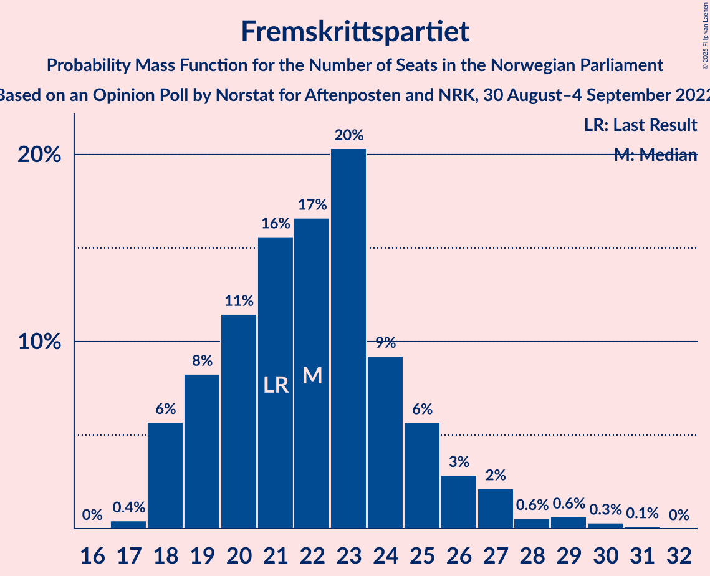

# Opinion Poll by Norstat for Aftenposten and NRK, 30 August–4 September 2022

<a href="#voting-intentions">Voting Intentions</a> | <a href="#seats">Seats</a> | <a href="#coalitions">Coalitions</a> | <a href="#technical-information">Technical Information</a>

## Voting Intentions

### Confidence Intervals

| Party | Last Result | Poll Result | 80% Confidence Interval | 90% Confidence Interval | 95% Confidence Interval | 99% Confidence Interval |
|:-----:|:-----------:|:-----------:|:-----------------------:|:-----------------------:|:-----------------------:|:-----------------------:|
| Høyre | 20.4% | 32.4% | 30.5–34.5% |30.0–35.0% |29.5–35.5% |28.6–36.5% |
| Arbeiderpartiet | 26.2% | 19.6% | 18.0–21.3% |17.5–21.8% |17.2–22.2% |16.4–23.1% |
| Fremskrittspartiet | 11.6% | 12.6% | 11.3–14.0% |10.9–14.5% |10.6–14.8% |10.0–15.6% |
| Sosialistisk Venstreparti | 7.6% | 7.4% | 6.4–8.7% |6.2–9.0% |5.9–9.3% |5.5–9.9% |
| Rødt | 4.7% | 6.8% | 5.9–8.0% |5.6–8.3% |5.4–8.6% |4.9–9.2% |
| Senterpartiet | 13.5% | 6.4% | 5.5–7.5% |5.2–7.8% |5.0–8.1% |4.6–8.7% |
| Venstre | 4.6% | 5.3% | 4.5–6.4% |4.3–6.7% |4.1–7.0% |3.7–7.5% |
| Miljøpartiet De Grønne | 3.9% | 3.4% | 2.8–4.3% |2.6–4.5% |2.4–4.8% |2.1–5.2% |
| Kristelig Folkeparti | 3.8% | 3.1% | 2.5–3.9% |2.3–4.2% |2.1–4.4% |1.9–4.8% |

*Note:* The poll result column reflects the actual value used in the calculations. Published results may vary slightly, and in addition be rounded to fewer digits.

## Seats

### Confidence Intervals

| Party | Last Result | Median | 80% Confidence Interval | 90% Confidence Interval | 95% Confidence Interval | 99% Confidence Interval |
|:-----:|:-----------:|:------:|:-----------------------:|:-----------------------:|:-----------------------:|:-----------------------:|
| <a href="#høyre">Høyre</a> | 36 | 58 | 53–63 |52–63 |51–64 |49–66 |
| <a href="#arbeiderpartiet">Arbeiderpartiet</a> | 48 | 37 | 34–42 |34–43 |33–44 |32–45 |
| <a href="#fremskrittspartiet">Fremskrittspartiet</a> | 21 | 22 | 19–25 |18–26 |18–27 |18–29 |
| <a href="#sosialistisk-venstreparti">Sosialistisk Venstreparti</a> | 13 | 13 | 11–16 |10–16 |10–17 |9–18 |
| <a href="#rødt">Rødt</a> | 8 | 12 | 10–14 |10–14 |9–15 |8–16 |
| <a href="#senterpartiet">Senterpartiet</a> | 28 | 11 | 9–13 |9–14 |8–14 |7–16 |
| <a href="#venstre">Venstre</a> | 8 | 9 | 8–11 |7–11 |7–12 |3–13 |
| <a href="#miljøpartiet-de-grønne">Miljøpartiet De Grønne</a> | 3 | 2 | 1–7 |1–8 |1–8 |1–9 |
| <a href="#kristelig-folkeparti">Kristelig Folkeparti</a> | 3 | 2 | 1–3 |0–7 |0–7 |0–8 |

### Høyre

*For a full overview of the results for this party, see the [Høyre](party-høyre.html) page.*

| Number of Seats | Probability | Accumulated | Special Marks |
|:---------------:|:-----------:|:-----------:|:-------------:|
| 36 | 0% | 100% | Last Result |
| 37 | 0% | 100% |  |
| 38 | 0% | 100% |  |
| 39 | 0% | 100% |  |
| 40 | 0% | 100% |  |
| 41 | 0% | 100% |  |
| 42 | 0% | 100% |  |
| 43 | 0% | 100% |  |
| 44 | 0% | 100% |  |
| 45 | 0% | 100% |  |
| 46 | 0% | 100% |  |
| 47 | 0% | 100% |  |
| 48 | 0.1% | 100% |  |
| 49 | 0.7% | 99.9% |  |
| 50 | 0.8% | 99.2% |  |
| 51 | 3% | 98% |  |
| 52 | 4% | 96% |  |
| 53 | 4% | 91% |  |
| 54 | 8% | 87% |  |
| 55 | 8% | 79% |  |
| 56 | 9% | 72% |  |
| 57 | 11% | 62% |  |
| 58 | 8% | 51% | Median |
| 59 | 9% | 43% |  |
| 60 | 14% | 34% |  |
| 61 | 5% | 20% |  |
| 62 | 4% | 15% |  |
| 63 | 7% | 10% |  |
| 64 | 1.2% | 4% |  |
| 65 | 2% | 2% |  |
| 66 | 0.4% | 0.6% |  |
| 67 | 0.1% | 0.3% |  |
| 68 | 0.1% | 0.2% |  |
| 69 | 0.1% | 0.1% |  |
| 70 | 0% | 0% |  |

### Arbeiderpartiet

*For a full overview of the results for this party, see the [Arbeiderpartiet](party-arbeiderpartiet.html) page.*

| Number of Seats | Probability | Accumulated | Special Marks |
|:---------------:|:-----------:|:-----------:|:-------------:|
| 30 | 0% | 100% |  |
| 31 | 0.2% | 99.9% |  |
| 32 | 1.1% | 99.7% |  |
| 33 | 4% | 98.7% |  |
| 34 | 8% | 95% |  |
| 35 | 17% | 87% |  |
| 36 | 19% | 69% |  |
| 37 | 11% | 51% | Median |
| 38 | 10% | 39% |  |
| 39 | 5% | 30% |  |
| 40 | 6% | 24% |  |
| 41 | 4% | 18% |  |
| 42 | 7% | 14% |  |
| 43 | 3% | 6% |  |
| 44 | 1.5% | 3% |  |
| 45 | 1.3% | 2% |  |
| 46 | 0.3% | 0.4% |  |
| 47 | 0.1% | 0.1% |  |
| 48 | 0.1% | 0.1% | Last Result |
| 49 | 0% | 0% |  |

### Fremskrittspartiet

*For a full overview of the results for this party, see the [Fremskrittspartiet](party-fremskrittspartiet.html) page.*

| Number of Seats | Probability | Accumulated | Special Marks |
|:---------------:|:-----------:|:-----------:|:-------------:|
| 17 | 0.4% | 100% |  |
| 18 | 6% | 99.5% |  |
| 19 | 8% | 94% |  |
| 20 | 11% | 86% |  |
| 21 | 16% | 74% | Last Result |
| 22 | 17% | 59% | Median |
| 23 | 20% | 42% |  |
| 24 | 9% | 22% |  |
| 25 | 6% | 12% |  |
| 26 | 3% | 7% |  |
| 27 | 2% | 4% |  |
| 28 | 0.6% | 2% |  |
| 29 | 0.6% | 1.1% |  |
| 30 | 0.3% | 0.5% |  |
| 31 | 0.1% | 0.1% |  |
| 32 | 0% | 0% |  |

### Sosialistisk Venstreparti

*For a full overview of the results for this party, see the [Sosialistisk Venstreparti](party-sosialistiskvenstreparti.html) page.*

| Number of Seats | Probability | Accumulated | Special Marks |
|:---------------:|:-----------:|:-----------:|:-------------:|
| 8 | 0.1% | 100% |  |
| 9 | 1.3% | 99.9% |  |
| 10 | 4% | 98.6% |  |
| 11 | 16% | 95% |  |
| 12 | 16% | 79% |  |
| 13 | 28% | 63% | Last Result, Median |
| 14 | 17% | 35% |  |
| 15 | 6% | 18% |  |
| 16 | 9% | 12% |  |
| 17 | 3% | 3% |  |
| 18 | 0.4% | 0.5% |  |
| 19 | 0.1% | 0.1% |  |
| 20 | 0% | 0% |  |

### Rødt

*For a full overview of the results for this party, see the [Rødt](party-rødt.html) page.*

| Number of Seats | Probability | Accumulated | Special Marks |
|:---------------:|:-----------:|:-----------:|:-------------:|
| 7 | 0.1% | 100% |  |
| 8 | 0.8% | 99.9% | Last Result |
| 9 | 3% | 99.1% |  |
| 10 | 11% | 96% |  |
| 11 | 26% | 84% |  |
| 12 | 28% | 59% | Median |
| 13 | 16% | 31% |  |
| 14 | 11% | 15% |  |
| 15 | 3% | 3% |  |
| 16 | 0.4% | 0.7% |  |
| 17 | 0.2% | 0.3% |  |
| 18 | 0% | 0% |  |

### Senterpartiet

*For a full overview of the results for this party, see the [Senterpartiet](party-senterpartiet.html) page.*

| Number of Seats | Probability | Accumulated | Special Marks |
|:---------------:|:-----------:|:-----------:|:-------------:|
| 6 | 0% | 100% |  |
| 7 | 0.7% | 99.9% |  |
| 8 | 2% | 99.3% |  |
| 9 | 10% | 97% |  |
| 10 | 18% | 87% |  |
| 11 | 24% | 69% | Median |
| 12 | 22% | 45% |  |
| 13 | 14% | 23% |  |
| 14 | 6% | 9% |  |
| 15 | 2% | 2% |  |
| 16 | 0.4% | 0.5% |  |
| 17 | 0.1% | 0.1% |  |
| 18 | 0% | 0% |  |
| 19 | 0% | 0% |  |
| 20 | 0% | 0% |  |
| 21 | 0% | 0% |  |
| 22 | 0% | 0% |  |
| 23 | 0% | 0% |  |
| 24 | 0% | 0% |  |
| 25 | 0% | 0% |  |
| 26 | 0% | 0% |  |
| 27 | 0% | 0% |  |
| 28 | 0% | 0% | Last Result |

### Venstre

*For a full overview of the results for this party, see the [Venstre](party-venstre.html) page.*

| Number of Seats | Probability | Accumulated | Special Marks |
|:---------------:|:-----------:|:-----------:|:-------------:|
| 2 | 0.4% | 100% |  |
| 3 | 2% | 99.6% |  |
| 4 | 0% | 98% |  |
| 5 | 0% | 98% |  |
| 6 | 0.1% | 98% |  |
| 7 | 6% | 98% |  |
| 8 | 25% | 91% | Last Result |
| 9 | 26% | 66% | Median |
| 10 | 26% | 40% |  |
| 11 | 10% | 14% |  |
| 12 | 3% | 5% |  |
| 13 | 1.0% | 1.2% |  |
| 14 | 0.2% | 0.2% |  |
| 15 | 0% | 0% |  |

### Miljøpartiet De Grønne

*For a full overview of the results for this party, see the [Miljøpartiet De Grønne](party-miljøpartietdegrønne.html) page.*

| Number of Seats | Probability | Accumulated | Special Marks |
|:---------------:|:-----------:|:-----------:|:-------------:|
| 1 | 28% | 100% |  |
| 2 | 45% | 72% | Median |
| 3 | 9% | 27% | Last Result |
| 4 | 0% | 18% |  |
| 5 | 0% | 18% |  |
| 6 | 0.8% | 18% |  |
| 7 | 11% | 17% |  |
| 8 | 5% | 6% |  |
| 9 | 0.9% | 1.0% |  |
| 10 | 0% | 0% |  |

### Kristelig Folkeparti

*For a full overview of the results for this party, see the [Kristelig Folkeparti](party-kristeligfolkeparti.html) page.*

| Number of Seats | Probability | Accumulated | Special Marks |
|:---------------:|:-----------:|:-----------:|:-------------:|
| 0 | 6% | 100% |  |
| 1 | 11% | 94% |  |
| 2 | 53% | 83% | Median |
| 3 | 22% | 30% | Last Result |
| 4 | 0% | 7% |  |
| 5 | 0% | 7% |  |
| 6 | 0.7% | 7% |  |
| 7 | 5% | 7% |  |
| 8 | 1.3% | 1.4% |  |
| 9 | 0.1% | 0.1% |  |
| 10 | 0% | 0% |  |

## Coalitions

### Confidence Intervals

| Coalition | Last Result | Median | Majority? | 80% Confidence Interval | 90% Confidence Interval | 95% Confidence Interval | 99% Confidence Interval |
|:---------:|:-----------:|:------:|:---------:|:-----------------------:|:-----------------------:|:-----------------------:|:-----------------------:|
| Høyre – Fremskrittspartiet – Senterpartiet – Venstre – Kristelig Folkeparti | 96 | 103 | 100% | 98–107 | 97–108 | 95–109 | 93–110 |
| Høyre – Fremskrittspartiet – Venstre – Miljøpartiet De Grønne – Kristelig Folkeparti | 71 | 94 | 99.8% | 89–98 | 88–100 | 87–100 | 85–102 |
| Høyre – Fremskrittspartiet – Venstre – Kristelig Folkeparti | 68 | 91 | 96% | 86–95 | 85–96 | 83–97 | 82–100 |
| Høyre – Fremskrittspartiet – Venstre | 65 | 89 | 87% | 84–93 | 82–94 | 81–95 | 79–97 |
| Høyre – Fremskrittspartiet | 57 | 80 | 8% | 75–84 | 73–85 | 72–86 | 70–88 |
| Arbeiderpartiet – Sosialistisk Venstreparti – Rødt – Senterpartiet – Miljøpartiet De Grønne | 100 | 76 | 2% | 72–81 | 71–83 | 70–84 | 68–86 |
| Arbeiderpartiet – Sosialistisk Venstreparti – Rødt – Senterpartiet | 97 | 74 | 0% | 69–78 | 68–80 | 67–80 | 65–82 |
| Høyre – Venstre – Kristelig Folkeparti | 47 | 69 | 0% | 64–73 | 63–75 | 62–76 | 60–78 |
| Arbeiderpartiet – Sosialistisk Venstreparti – Senterpartiet – Miljøpartiet De Grønne – Kristelig Folkeparti | 95 | 66 | 0% | 62–72 | 62–74 | 61–75 | 59–78 |
| Arbeiderpartiet – Sosialistisk Venstreparti – Rødt – Miljøpartiet De Grønne | 72 | 65 | 0% | 61–70 | 59–71 | 59–73 | 57–75 |
| Arbeiderpartiet – Sosialistisk Venstreparti – Senterpartiet – Miljøpartiet De Grønne | 92 | 64 | 0% | 61–69 | 59–72 | 59–73 | 56–75 |
| Arbeiderpartiet – Sosialistisk Venstreparti – Senterpartiet | 89 | 62 | 0% | 57–67 | 57–68 | 56–68 | 54–70 |
| Arbeiderpartiet – Senterpartiet – Miljøpartiet De Grønne – Kristelig Folkeparti | 82 | 53 | 0% | 50–59 | 49–61 | 48–63 | 46–66 |
| Arbeiderpartiet – Senterpartiet – Kristelig Folkeparti | 79 | 51 | 0% | 47–55 | 47–57 | 46–58 | 44–61 |
| Arbeiderpartiet – Sosialistisk Venstreparti | 61 | 50 | 0% | 47–55 | 46–56 | 45–57 | 43–59 |
| Arbeiderpartiet – Senterpartiet | 76 | 48 | 0% | 45–53 | 45–55 | 44–55 | 42–58 |
| Senterpartiet – Venstre – Kristelig Folkeparti | 39 | 23 | 0% | 19–26 | 18–27 | 18–29 | 15–31 |

### Høyre – Fremskrittspartiet – Senterpartiet – Venstre – Kristelig Folkeparti

| Number of Seats | Probability | Accumulated | Special Marks |
|:---------------:|:-----------:|:-----------:|:-------------:|
| 90 | 0% | 100% |  |
| 91 | 0.1% | 99.9% |  |
| 92 | 0.1% | 99.9% |  |
| 93 | 0.9% | 99.8% |  |
| 94 | 0.9% | 98.9% |  |
| 95 | 1.0% | 98% |  |
| 96 | 1.5% | 97% | Last Result |
| 97 | 4% | 96% |  |
| 98 | 8% | 92% |  |
| 99 | 5% | 84% |  |
| 100 | 9% | 79% |  |
| 101 | 8% | 70% |  |
| 102 | 10% | 62% | Median |
| 103 | 9% | 52% |  |
| 104 | 12% | 42% |  |
| 105 | 14% | 31% |  |
| 106 | 4% | 17% |  |
| 107 | 4% | 12% |  |
| 108 | 3% | 8% |  |
| 109 | 4% | 5% |  |
| 110 | 0.5% | 0.9% |  |
| 111 | 0.2% | 0.5% |  |
| 112 | 0.2% | 0.3% |  |
| 113 | 0% | 0.1% |  |
| 114 | 0% | 0% |  |

### Høyre – Fremskrittspartiet – Venstre – Miljøpartiet De Grønne – Kristelig Folkeparti

| Number of Seats | Probability | Accumulated | Special Marks |
|:---------------:|:-----------:|:-----------:|:-------------:|
| 71 | 0% | 100% | Last Result |
| 72 | 0% | 100% |  |
| 73 | 0% | 100% |  |
| 74 | 0% | 100% |  |
| 75 | 0% | 100% |  |
| 76 | 0% | 100% |  |
| 77 | 0% | 100% |  |
| 78 | 0% | 100% |  |
| 79 | 0% | 100% |  |
| 80 | 0% | 100% |  |
| 81 | 0% | 100% |  |
| 82 | 0% | 100% |  |
| 83 | 0% | 100% |  |
| 84 | 0.1% | 99.9% |  |
| 85 | 0.5% | 99.8% | Majority |
| 86 | 0.8% | 99.3% |  |
| 87 | 2% | 98.6% |  |
| 88 | 4% | 97% |  |
| 89 | 4% | 92% |  |
| 90 | 7% | 89% |  |
| 91 | 7% | 82% |  |
| 92 | 9% | 75% |  |
| 93 | 12% | 66% | Median |
| 94 | 13% | 54% |  |
| 95 | 6% | 42% |  |
| 96 | 12% | 36% |  |
| 97 | 7% | 23% |  |
| 98 | 6% | 16% |  |
| 99 | 3% | 10% |  |
| 100 | 5% | 7% |  |
| 101 | 1.1% | 2% |  |
| 102 | 0.7% | 1.2% |  |
| 103 | 0.2% | 0.5% |  |
| 104 | 0.1% | 0.2% |  |
| 105 | 0.1% | 0.1% |  |
| 106 | 0% | 0% |  |

### Høyre – Fremskrittspartiet – Venstre – Kristelig Folkeparti

| Number of Seats | Probability | Accumulated | Special Marks |
|:---------------:|:-----------:|:-----------:|:-------------:|
| 68 | 0% | 100% | Last Result |
| 69 | 0% | 100% |  |
| 70 | 0% | 100% |  |
| 71 | 0% | 100% |  |
| 72 | 0% | 100% |  |
| 73 | 0% | 100% |  |
| 74 | 0% | 100% |  |
| 75 | 0% | 100% |  |
| 76 | 0% | 100% |  |
| 77 | 0% | 100% |  |
| 78 | 0% | 100% |  |
| 79 | 0% | 100% |  |
| 80 | 0.2% | 100% |  |
| 81 | 0.1% | 99.8% |  |
| 82 | 0.7% | 99.7% |  |
| 83 | 2% | 99.0% |  |
| 84 | 2% | 97% |  |
| 85 | 2% | 96% | Majority |
| 86 | 4% | 94% |  |
| 87 | 7% | 90% |  |
| 88 | 4% | 83% |  |
| 89 | 8% | 79% |  |
| 90 | 9% | 71% |  |
| 91 | 13% | 62% | Median |
| 92 | 15% | 49% |  |
| 93 | 9% | 35% |  |
| 94 | 11% | 26% |  |
| 95 | 7% | 15% |  |
| 96 | 3% | 8% |  |
| 97 | 3% | 5% |  |
| 98 | 1.0% | 2% |  |
| 99 | 0.3% | 0.9% |  |
| 100 | 0.3% | 0.6% |  |
| 101 | 0.1% | 0.2% |  |
| 102 | 0.1% | 0.1% |  |
| 103 | 0% | 0.1% |  |
| 104 | 0% | 0% |  |

### Høyre – Fremskrittspartiet – Venstre

| Number of Seats | Probability | Accumulated | Special Marks |
|:---------------:|:-----------:|:-----------:|:-------------:|
| 65 | 0% | 100% | Last Result |
| 66 | 0% | 100% |  |
| 67 | 0% | 100% |  |
| 68 | 0% | 100% |  |
| 69 | 0% | 100% |  |
| 70 | 0% | 100% |  |
| 71 | 0% | 100% |  |
| 72 | 0% | 100% |  |
| 73 | 0% | 100% |  |
| 74 | 0% | 100% |  |
| 75 | 0% | 100% |  |
| 76 | 0% | 100% |  |
| 77 | 0% | 100% |  |
| 78 | 0.2% | 99.9% |  |
| 79 | 0.4% | 99.7% |  |
| 80 | 0.8% | 99.3% |  |
| 81 | 2% | 98.6% |  |
| 82 | 2% | 97% |  |
| 83 | 3% | 94% |  |
| 84 | 5% | 92% |  |
| 85 | 7% | 87% | Majority |
| 86 | 4% | 80% |  |
| 87 | 9% | 76% |  |
| 88 | 10% | 67% |  |
| 89 | 11% | 57% | Median |
| 90 | 11% | 46% |  |
| 91 | 16% | 35% |  |
| 92 | 4% | 18% |  |
| 93 | 7% | 15% |  |
| 94 | 3% | 7% |  |
| 95 | 3% | 4% |  |
| 96 | 0.5% | 1.3% |  |
| 97 | 0.4% | 0.8% |  |
| 98 | 0.3% | 0.4% |  |
| 99 | 0.1% | 0.1% |  |
| 100 | 0% | 0.1% |  |
| 101 | 0% | 0% |  |

### Høyre – Fremskrittspartiet

| Number of Seats | Probability | Accumulated | Special Marks |
|:---------------:|:-----------:|:-----------:|:-------------:|
| 57 | 0% | 100% | Last Result |
| 58 | 0% | 100% |  |
| 59 | 0% | 100% |  |
| 60 | 0% | 100% |  |
| 61 | 0% | 100% |  |
| 62 | 0% | 100% |  |
| 63 | 0% | 100% |  |
| 64 | 0% | 100% |  |
| 65 | 0% | 100% |  |
| 66 | 0% | 100% |  |
| 67 | 0% | 100% |  |
| 68 | 0% | 100% |  |
| 69 | 0.1% | 100% |  |
| 70 | 0.5% | 99.9% |  |
| 71 | 1.1% | 99.3% |  |
| 72 | 0.9% | 98% |  |
| 73 | 3% | 97% |  |
| 74 | 4% | 95% |  |
| 75 | 7% | 91% |  |
| 76 | 4% | 84% |  |
| 77 | 6% | 80% |  |
| 78 | 7% | 74% |  |
| 79 | 13% | 67% |  |
| 80 | 12% | 54% | Median |
| 81 | 8% | 41% |  |
| 82 | 8% | 33% |  |
| 83 | 12% | 25% |  |
| 84 | 5% | 13% |  |
| 85 | 4% | 8% | Majority |
| 86 | 2% | 4% |  |
| 87 | 2% | 2% |  |
| 88 | 0.3% | 0.7% |  |
| 89 | 0.2% | 0.4% |  |
| 90 | 0.1% | 0.2% |  |
| 91 | 0% | 0.1% |  |
| 92 | 0.1% | 0.1% |  |
| 93 | 0% | 0% |  |

### Arbeiderpartiet – Sosialistisk Venstreparti – Rødt – Senterpartiet – Miljøpartiet De Grønne

| Number of Seats | Probability | Accumulated | Special Marks |
|:---------------:|:-----------:|:-----------:|:-------------:|
| 63 | 0.1% | 100% |  |
| 64 | 0% | 99.9% |  |
| 65 | 0.1% | 99.9% |  |
| 66 | 0.1% | 99.8% |  |
| 67 | 0.2% | 99.8% |  |
| 68 | 0.5% | 99.6% |  |
| 69 | 0.5% | 99.1% |  |
| 70 | 3% | 98.6% |  |
| 71 | 4% | 96% |  |
| 72 | 4% | 92% |  |
| 73 | 9% | 88% |  |
| 74 | 11% | 79% |  |
| 75 | 9% | 68% | Median |
| 76 | 15% | 59% |  |
| 77 | 12% | 44% |  |
| 78 | 8% | 33% |  |
| 79 | 6% | 25% |  |
| 80 | 4% | 19% |  |
| 81 | 6% | 15% |  |
| 82 | 3% | 9% |  |
| 83 | 2% | 6% |  |
| 84 | 2% | 4% |  |
| 85 | 2% | 2% | Majority |
| 86 | 0.6% | 0.8% |  |
| 87 | 0.1% | 0.2% |  |
| 88 | 0.1% | 0.1% |  |
| 89 | 0% | 0% |  |
| 90 | 0% | 0% |  |
| 91 | 0% | 0% |  |
| 92 | 0% | 0% |  |
| 93 | 0% | 0% |  |
| 94 | 0% | 0% |  |
| 95 | 0% | 0% |  |
| 96 | 0% | 0% |  |
| 97 | 0% | 0% |  |
| 98 | 0% | 0% |  |
| 99 | 0% | 0% |  |
| 100 | 0% | 0% | Last Result |

### Arbeiderpartiet – Sosialistisk Venstreparti – Rødt – Senterpartiet

| Number of Seats | Probability | Accumulated | Special Marks |
|:---------------:|:-----------:|:-----------:|:-------------:|
| 61 | 0% | 100% |  |
| 62 | 0.1% | 99.9% |  |
| 63 | 0.1% | 99.8% |  |
| 64 | 0.2% | 99.7% |  |
| 65 | 0.3% | 99.5% |  |
| 66 | 0.8% | 99.2% |  |
| 67 | 1.3% | 98% |  |
| 68 | 6% | 97% |  |
| 69 | 4% | 91% |  |
| 70 | 7% | 87% |  |
| 71 | 8% | 80% |  |
| 72 | 14% | 73% |  |
| 73 | 6% | 59% | Median |
| 74 | 13% | 53% |  |
| 75 | 10% | 40% |  |
| 76 | 8% | 29% |  |
| 77 | 7% | 22% |  |
| 78 | 5% | 15% |  |
| 79 | 4% | 10% |  |
| 80 | 4% | 6% |  |
| 81 | 1.4% | 2% |  |
| 82 | 0.6% | 1.0% |  |
| 83 | 0.3% | 0.4% |  |
| 84 | 0.1% | 0.1% |  |
| 85 | 0% | 0% | Majority |
| 86 | 0% | 0% |  |
| 87 | 0% | 0% |  |
| 88 | 0% | 0% |  |
| 89 | 0% | 0% |  |
| 90 | 0% | 0% |  |
| 91 | 0% | 0% |  |
| 92 | 0% | 0% |  |
| 93 | 0% | 0% |  |
| 94 | 0% | 0% |  |
| 95 | 0% | 0% |  |
| 96 | 0% | 0% |  |
| 97 | 0% | 0% | Last Result |

### Høyre – Venstre – Kristelig Folkeparti

| Number of Seats | Probability | Accumulated | Special Marks |
|:---------------:|:-----------:|:-----------:|:-------------:|
| 47 | 0% | 100% | Last Result |
| 48 | 0% | 100% |  |
| 49 | 0% | 100% |  |
| 50 | 0% | 100% |  |
| 51 | 0% | 100% |  |
| 52 | 0% | 100% |  |
| 53 | 0% | 100% |  |
| 54 | 0% | 100% |  |
| 55 | 0% | 100% |  |
| 56 | 0% | 100% |  |
| 57 | 0% | 100% |  |
| 58 | 0% | 100% |  |
| 59 | 0.1% | 100% |  |
| 60 | 0.4% | 99.8% |  |
| 61 | 1.2% | 99.4% |  |
| 62 | 1.4% | 98% |  |
| 63 | 5% | 97% |  |
| 64 | 3% | 92% |  |
| 65 | 4% | 89% |  |
| 66 | 9% | 86% |  |
| 67 | 6% | 76% |  |
| 68 | 8% | 70% |  |
| 69 | 18% | 62% | Median |
| 70 | 9% | 45% |  |
| 71 | 10% | 36% |  |
| 72 | 10% | 26% |  |
| 73 | 7% | 16% |  |
| 74 | 3% | 8% |  |
| 75 | 3% | 5% |  |
| 76 | 1.4% | 3% |  |
| 77 | 0.5% | 1.3% |  |
| 78 | 0.3% | 0.7% |  |
| 79 | 0.2% | 0.5% |  |
| 80 | 0.1% | 0.2% |  |
| 81 | 0.1% | 0.1% |  |
| 82 | 0% | 0% |  |

### Arbeiderpartiet – Sosialistisk Venstreparti – Senterpartiet – Miljøpartiet De Grønne – Kristelig Folkeparti

| Number of Seats | Probability | Accumulated | Special Marks |
|:---------------:|:-----------:|:-----------:|:-------------:|
| 56 | 0.1% | 100% |  |
| 57 | 0.1% | 99.9% |  |
| 58 | 0.2% | 99.7% |  |
| 59 | 0.3% | 99.5% |  |
| 60 | 0.5% | 99.3% |  |
| 61 | 3% | 98.8% |  |
| 62 | 6% | 95% |  |
| 63 | 5% | 90% |  |
| 64 | 10% | 85% |  |
| 65 | 13% | 75% | Median |
| 66 | 15% | 62% |  |
| 67 | 12% | 46% |  |
| 68 | 6% | 34% |  |
| 69 | 6% | 28% |  |
| 70 | 7% | 23% |  |
| 71 | 3% | 16% |  |
| 72 | 3% | 12% |  |
| 73 | 3% | 9% |  |
| 74 | 3% | 6% |  |
| 75 | 1.0% | 3% |  |
| 76 | 1.4% | 2% |  |
| 77 | 0.4% | 0.9% |  |
| 78 | 0.4% | 0.5% |  |
| 79 | 0.1% | 0.1% |  |
| 80 | 0% | 0% |  |
| 81 | 0% | 0% |  |
| 82 | 0% | 0% |  |
| 83 | 0% | 0% |  |
| 84 | 0% | 0% |  |
| 85 | 0% | 0% | Majority |
| 86 | 0% | 0% |  |
| 87 | 0% | 0% |  |
| 88 | 0% | 0% |  |
| 89 | 0% | 0% |  |
| 90 | 0% | 0% |  |
| 91 | 0% | 0% |  |
| 92 | 0% | 0% |  |
| 93 | 0% | 0% |  |
| 94 | 0% | 0% |  |
| 95 | 0% | 0% | Last Result |

### Arbeiderpartiet – Sosialistisk Venstreparti – Rødt – Miljøpartiet De Grønne

| Number of Seats | Probability | Accumulated | Special Marks |
|:---------------:|:-----------:|:-----------:|:-------------:|
| 54 | 0% | 100% |  |
| 55 | 0.1% | 99.9% |  |
| 56 | 0.3% | 99.8% |  |
| 57 | 0.3% | 99.6% |  |
| 58 | 0.6% | 99.2% |  |
| 59 | 4% | 98.6% |  |
| 60 | 4% | 95% |  |
| 61 | 7% | 90% |  |
| 62 | 5% | 84% |  |
| 63 | 16% | 79% |  |
| 64 | 12% | 64% | Median |
| 65 | 10% | 51% |  |
| 66 | 10% | 42% |  |
| 67 | 8% | 32% |  |
| 68 | 7% | 24% |  |
| 69 | 3% | 17% |  |
| 70 | 8% | 15% |  |
| 71 | 4% | 7% |  |
| 72 | 0.9% | 3% | Last Result |
| 73 | 0.9% | 3% |  |
| 74 | 0.6% | 2% |  |
| 75 | 0.8% | 1.0% |  |
| 76 | 0.1% | 0.2% |  |
| 77 | 0.1% | 0.1% |  |
| 78 | 0% | 0% |  |

### Arbeiderpartiet – Sosialistisk Venstreparti – Senterpartiet – Miljøpartiet De Grønne

| Number of Seats | Probability | Accumulated | Special Marks |
|:---------------:|:-----------:|:-----------:|:-------------:|
| 53 | 0.1% | 100% |  |
| 54 | 0% | 99.9% |  |
| 55 | 0.2% | 99.9% |  |
| 56 | 0.2% | 99.7% |  |
| 57 | 0.5% | 99.5% |  |
| 58 | 1.0% | 99.0% |  |
| 59 | 4% | 98% |  |
| 60 | 4% | 94% |  |
| 61 | 6% | 90% |  |
| 62 | 14% | 84% |  |
| 63 | 10% | 70% | Median |
| 64 | 21% | 60% |  |
| 65 | 8% | 39% |  |
| 66 | 8% | 31% |  |
| 67 | 4% | 24% |  |
| 68 | 6% | 19% |  |
| 69 | 3% | 13% |  |
| 70 | 2% | 10% |  |
| 71 | 3% | 8% |  |
| 72 | 2% | 5% |  |
| 73 | 0.4% | 3% |  |
| 74 | 2% | 2% |  |
| 75 | 0.1% | 0.5% |  |
| 76 | 0.4% | 0.4% |  |
| 77 | 0% | 0% |  |
| 78 | 0% | 0% |  |
| 79 | 0% | 0% |  |
| 80 | 0% | 0% |  |
| 81 | 0% | 0% |  |
| 82 | 0% | 0% |  |
| 83 | 0% | 0% |  |
| 84 | 0% | 0% |  |
| 85 | 0% | 0% | Majority |
| 86 | 0% | 0% |  |
| 87 | 0% | 0% |  |
| 88 | 0% | 0% |  |
| 89 | 0% | 0% |  |
| 90 | 0% | 0% |  |
| 91 | 0% | 0% |  |
| 92 | 0% | 0% | Last Result |

### Arbeiderpartiet – Sosialistisk Venstreparti – Senterpartiet

| Number of Seats | Probability | Accumulated | Special Marks |
|:---------------:|:-----------:|:-----------:|:-------------:|
| 51 | 0% | 100% |  |
| 52 | 0.1% | 99.9% |  |
| 53 | 0.1% | 99.8% |  |
| 54 | 0.4% | 99.7% |  |
| 55 | 1.2% | 99.3% |  |
| 56 | 2% | 98% |  |
| 57 | 7% | 96% |  |
| 58 | 7% | 89% |  |
| 59 | 5% | 82% |  |
| 60 | 15% | 77% |  |
| 61 | 10% | 62% | Median |
| 62 | 15% | 51% |  |
| 63 | 9% | 36% |  |
| 64 | 6% | 27% |  |
| 65 | 6% | 21% |  |
| 66 | 5% | 15% |  |
| 67 | 5% | 10% |  |
| 68 | 3% | 5% |  |
| 69 | 0.8% | 2% |  |
| 70 | 0.6% | 1.0% |  |
| 71 | 0.1% | 0.4% |  |
| 72 | 0.2% | 0.3% |  |
| 73 | 0% | 0% |  |
| 74 | 0% | 0% |  |
| 75 | 0% | 0% |  |
| 76 | 0% | 0% |  |
| 77 | 0% | 0% |  |
| 78 | 0% | 0% |  |
| 79 | 0% | 0% |  |
| 80 | 0% | 0% |  |
| 81 | 0% | 0% |  |
| 82 | 0% | 0% |  |
| 83 | 0% | 0% |  |
| 84 | 0% | 0% |  |
| 85 | 0% | 0% | Majority |
| 86 | 0% | 0% |  |
| 87 | 0% | 0% |  |
| 88 | 0% | 0% |  |
| 89 | 0% | 0% | Last Result |

### Arbeiderpartiet – Senterpartiet – Miljøpartiet De Grønne – Kristelig Folkeparti

| Number of Seats | Probability | Accumulated | Special Marks |
|:---------------:|:-----------:|:-----------:|:-------------:|
| 44 | 0% | 100% |  |
| 45 | 0.1% | 99.9% |  |
| 46 | 0.3% | 99.8% |  |
| 47 | 0.7% | 99.5% |  |
| 48 | 2% | 98.8% |  |
| 49 | 5% | 97% |  |
| 50 | 10% | 92% |  |
| 51 | 9% | 82% |  |
| 52 | 15% | 72% | Median |
| 53 | 8% | 58% |  |
| 54 | 14% | 49% |  |
| 55 | 8% | 35% |  |
| 56 | 8% | 27% |  |
| 57 | 3% | 19% |  |
| 58 | 5% | 16% |  |
| 59 | 2% | 11% |  |
| 60 | 3% | 9% |  |
| 61 | 2% | 6% |  |
| 62 | 0.9% | 4% |  |
| 63 | 1.3% | 3% |  |
| 64 | 0.6% | 2% |  |
| 65 | 0.5% | 1.1% |  |
| 66 | 0.4% | 0.5% |  |
| 67 | 0% | 0.1% |  |
| 68 | 0% | 0.1% |  |
| 69 | 0% | 0% |  |
| 70 | 0% | 0% |  |
| 71 | 0% | 0% |  |
| 72 | 0% | 0% |  |
| 73 | 0% | 0% |  |
| 74 | 0% | 0% |  |
| 75 | 0% | 0% |  |
| 76 | 0% | 0% |  |
| 77 | 0% | 0% |  |
| 78 | 0% | 0% |  |
| 79 | 0% | 0% |  |
| 80 | 0% | 0% |  |
| 81 | 0% | 0% |  |
| 82 | 0% | 0% | Last Result |

### Arbeiderpartiet – Senterpartiet – Kristelig Folkeparti

| Number of Seats | Probability | Accumulated | Special Marks |
|:---------------:|:-----------:|:-----------:|:-------------:|
| 42 | 0.1% | 100% |  |
| 43 | 0.2% | 99.9% |  |
| 44 | 0.5% | 99.7% |  |
| 45 | 1.2% | 99.3% |  |
| 46 | 3% | 98% |  |
| 47 | 8% | 95% |  |
| 48 | 9% | 87% |  |
| 49 | 16% | 78% |  |
| 50 | 12% | 62% | Median |
| 51 | 6% | 50% |  |
| 52 | 15% | 44% |  |
| 53 | 9% | 29% |  |
| 54 | 4% | 20% |  |
| 55 | 6% | 16% |  |
| 56 | 2% | 10% |  |
| 57 | 4% | 8% |  |
| 58 | 1.1% | 3% |  |
| 59 | 0.8% | 2% |  |
| 60 | 0.8% | 2% |  |
| 61 | 0.4% | 0.7% |  |
| 62 | 0.1% | 0.3% |  |
| 63 | 0% | 0.2% |  |
| 64 | 0.2% | 0.2% |  |
| 65 | 0% | 0% |  |
| 66 | 0% | 0% |  |
| 67 | 0% | 0% |  |
| 68 | 0% | 0% |  |
| 69 | 0% | 0% |  |
| 70 | 0% | 0% |  |
| 71 | 0% | 0% |  |
| 72 | 0% | 0% |  |
| 73 | 0% | 0% |  |
| 74 | 0% | 0% |  |
| 75 | 0% | 0% |  |
| 76 | 0% | 0% |  |
| 77 | 0% | 0% |  |
| 78 | 0% | 0% |  |
| 79 | 0% | 0% | Last Result |

### Arbeiderpartiet – Sosialistisk Venstreparti

| Number of Seats | Probability | Accumulated | Special Marks |
|:---------------:|:-----------:|:-----------:|:-------------:|
| 42 | 0.1% | 100% |  |
| 43 | 0.5% | 99.9% |  |
| 44 | 1.1% | 99.4% |  |
| 45 | 2% | 98% |  |
| 46 | 6% | 97% |  |
| 47 | 11% | 91% |  |
| 48 | 11% | 80% |  |
| 49 | 16% | 69% |  |
| 50 | 10% | 54% | Median |
| 51 | 6% | 44% |  |
| 52 | 12% | 38% |  |
| 53 | 7% | 26% |  |
| 54 | 7% | 19% |  |
| 55 | 3% | 12% |  |
| 56 | 6% | 9% |  |
| 57 | 1.4% | 3% |  |
| 58 | 0.5% | 1.1% |  |
| 59 | 0.4% | 0.6% |  |
| 60 | 0.1% | 0.1% |  |
| 61 | 0% | 0.1% | Last Result |
| 62 | 0% | 0% |  |

### Arbeiderpartiet – Senterpartiet

| Number of Seats | Probability | Accumulated | Special Marks |
|:---------------:|:-----------:|:-----------:|:-------------:|
| 40 | 0% | 100% |  |
| 41 | 0.1% | 99.9% |  |
| 42 | 0.4% | 99.8% |  |
| 43 | 2% | 99.4% |  |
| 44 | 2% | 98% |  |
| 45 | 8% | 96% |  |
| 46 | 15% | 87% |  |
| 47 | 15% | 73% |  |
| 48 | 10% | 58% | Median |
| 49 | 12% | 47% |  |
| 50 | 10% | 36% |  |
| 51 | 8% | 26% |  |
| 52 | 5% | 18% |  |
| 53 | 6% | 13% |  |
| 54 | 2% | 7% |  |
| 55 | 3% | 6% |  |
| 56 | 1.1% | 2% |  |
| 57 | 0.8% | 1.4% |  |
| 58 | 0.5% | 0.6% |  |
| 59 | 0.1% | 0.1% |  |
| 60 | 0% | 0% |  |
| 61 | 0% | 0% |  |
| 62 | 0% | 0% |  |
| 63 | 0% | 0% |  |
| 64 | 0% | 0% |  |
| 65 | 0% | 0% |  |
| 66 | 0% | 0% |  |
| 67 | 0% | 0% |  |
| 68 | 0% | 0% |  |
| 69 | 0% | 0% |  |
| 70 | 0% | 0% |  |
| 71 | 0% | 0% |  |
| 72 | 0% | 0% |  |
| 73 | 0% | 0% |  |
| 74 | 0% | 0% |  |
| 75 | 0% | 0% |  |
| 76 | 0% | 0% | Last Result |

### Senterpartiet – Venstre – Kristelig Folkeparti

| Number of Seats | Probability | Accumulated | Special Marks |
|:---------------:|:-----------:|:-----------:|:-------------:|
| 13 | 0% | 100% |  |
| 14 | 0.1% | 99.9% |  |
| 15 | 0.3% | 99.8% |  |
| 16 | 0.6% | 99.5% |  |
| 17 | 1.0% | 98.9% |  |
| 18 | 4% | 98% |  |
| 19 | 3% | 93% |  |
| 20 | 10% | 90% |  |
| 21 | 11% | 80% |  |
| 22 | 15% | 70% | Median |
| 23 | 20% | 55% |  |
| 24 | 8% | 35% |  |
| 25 | 12% | 27% |  |
| 26 | 7% | 15% |  |
| 27 | 3% | 7% |  |
| 28 | 2% | 4% |  |
| 29 | 1.3% | 3% |  |
| 30 | 0.6% | 1.2% |  |
| 31 | 0.3% | 0.6% |  |
| 32 | 0.2% | 0.3% |  |
| 33 | 0% | 0.1% |  |
| 34 | 0% | 0% |  |
| 35 | 0% | 0% |  |
| 36 | 0% | 0% |  |
| 37 | 0% | 0% |  |
| 38 | 0% | 0% |  |
| 39 | 0% | 0% | Last Result |

## Technical Information

### Opinion Poll

+ **Polling firm:** Norstat
+ **Commissioner(s):** Aftenposten and NRK
+ **Fieldwork period:** 30 August–4 September 2022

### Calculations

+ **Sample size:** 940
+ **Simulations done:** 1,048,576
+ **Error estimate:** 2.41%

