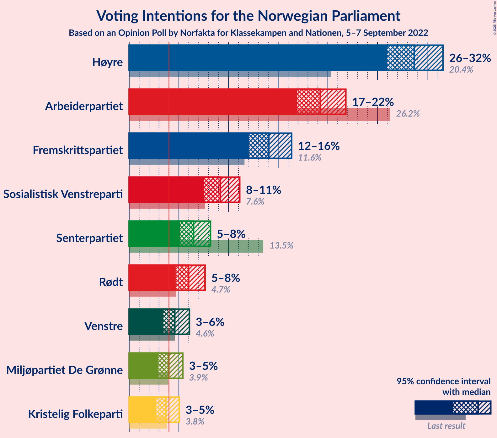

# Opinion Poll by Norfakta for Klassekampen and Nationen, 5–7 September 2022

<a href="#voting-intentions">Voting Intentions</a> | <a href="#seats">Seats</a> | <a href="#coalitions">Coalitions</a> | <a href="#technical-information">Technical Information</a>

## Voting Intentions

### Confidence Intervals

| Party | Last Result | Poll Result | 80% Confidence Interval | 90% Confidence Interval | 95% Confidence Interval | 99% Confidence Interval |
|:-----:|:-----------:|:-----------:|:-----------------------:|:-----------------------:|:-----------------------:|:-----------------------:|
| Høyre | 20.4% | 28.7% | 26.9–30.6% |26.4–31.1% |26.0–31.6% |25.1–32.5% |
| Arbeiderpartiet | 26.2% | 19.2% | 17.7–20.9% |17.3–21.4% |16.9–21.8% |16.2–22.6% |
| Fremskrittspartiet | 11.6% | 14.1% | 12.7–15.6% |12.4–16.0% |12.0–16.4% |11.4–17.1% |
| Sosialistisk Venstreparti | 7.6% | 9.2% | 8.1–10.5% |7.8–10.8% |7.5–11.1% |7.0–11.8% |
| Senterpartiet | 13.5% | 6.5% | 5.6–7.6% |5.3–7.9% |5.1–8.2% |4.7–8.7% |
| Rødt | 4.7% | 6.0% | 5.1–7.1% |4.9–7.4% |4.7–7.6% |4.3–8.2% |
| Venstre | 4.6% | 4.6% | 3.8–5.5% |3.6–5.8% |3.4–6.1% |3.1–6.6% |
| Miljøpartiet De Grønne | 3.9% | 4.0% | 3.3–4.9% |3.1–5.2% |2.9–5.4% |2.6–5.9% |
| Kristelig Folkeparti | 3.8% | 3.7% | 3.0–4.6% |2.8–4.8% |2.7–5.0% |2.4–5.5% |

*Note:* The poll result column reflects the actual value used in the calculations. Published results may vary slightly, and in addition be rounded to fewer digits.

## Seats

### Confidence Intervals

| Party | Last Result | Median | 80% Confidence Interval | 90% Confidence Interval | 95% Confidence Interval | 99% Confidence Interval |
|:-----:|:-----------:|:------:|:-----------------------:|:-----------------------:|:-----------------------:|:-----------------------:|
| <a href="#høyre">Høyre</a> | 36 | 50 | 47–54 |46–56 |46–56 |44–58 |
| <a href="#arbeiderpartiet">Arbeiderpartiet</a> | 48 | 36 | 34–40 |33–41 |33–42 |32–44 |
| <a href="#fremskrittspartiet">Fremskrittspartiet</a> | 21 | 25 | 22–28 |22–30 |21–30 |19–33 |
| <a href="#sosialistisk-venstreparti">Sosialistisk Venstreparti</a> | 13 | 15 | 13–18 |12–18 |11–19 |10–21 |
| <a href="#senterpartiet">Senterpartiet</a> | 28 | 12 | 9–13 |8–14 |7–14 |7–16 |
| <a href="#rødt">Rødt</a> | 8 | 10 | 8–12 |7–12 |7–13 |6–14 |
| <a href="#venstre">Venstre</a> | 8 | 8 | 3–9 |2–9 |2–10 |2–11 |
| <a href="#miljøpartiet-de-grønne">Miljøpartiet De Grønne</a> | 3 | 6 | 2–8 |2–8 |1–9 |1–10 |
| <a href="#kristelig-folkeparti">Kristelig Folkeparti</a> | 3 | 3 | 2–7 |2–8 |2–8 |1–9 |

### Høyre

*For a full overview of the results for this party, see the [Høyre](party-høyre.html) page.*

| Number of Seats | Probability | Accumulated | Special Marks |
|:---------------:|:-----------:|:-----------:|:-------------:|
| 36 | 0% | 100% | Last Result |
| 37 | 0% | 100% |  |
| 38 | 0% | 100% |  |
| 39 | 0% | 100% |  |
| 40 | 0% | 100% |  |
| 41 | 0.1% | 100% |  |
| 42 | 0.1% | 99.9% |  |
| 43 | 0.1% | 99.9% |  |
| 44 | 0.7% | 99.7% |  |
| 45 | 1.4% | 99.0% |  |
| 46 | 3% | 98% |  |
| 47 | 9% | 95% |  |
| 48 | 7% | 86% |  |
| 49 | 18% | 79% |  |
| 50 | 27% | 61% | Median |
| 51 | 8% | 34% |  |
| 52 | 5% | 26% |  |
| 53 | 9% | 21% |  |
| 54 | 3% | 12% |  |
| 55 | 3% | 9% |  |
| 56 | 5% | 6% |  |
| 57 | 0.5% | 1.1% |  |
| 58 | 0.3% | 0.6% |  |
| 59 | 0.2% | 0.2% |  |
| 60 | 0% | 0.1% |  |
| 61 | 0% | 0.1% |  |
| 62 | 0% | 0% |  |

### Arbeiderpartiet

*For a full overview of the results for this party, see the [Arbeiderpartiet](party-arbeiderpartiet.html) page.*

| Number of Seats | Probability | Accumulated | Special Marks |
|:---------------:|:-----------:|:-----------:|:-------------:|
| 30 | 0.1% | 100% |  |
| 31 | 0.2% | 99.9% |  |
| 32 | 1.4% | 99.7% |  |
| 33 | 5% | 98% |  |
| 34 | 12% | 93% |  |
| 35 | 17% | 81% |  |
| 36 | 18% | 64% | Median |
| 37 | 18% | 46% |  |
| 38 | 10% | 28% |  |
| 39 | 6% | 18% |  |
| 40 | 7% | 12% |  |
| 41 | 3% | 6% |  |
| 42 | 1.4% | 3% |  |
| 43 | 0.4% | 1.3% |  |
| 44 | 0.7% | 0.9% |  |
| 45 | 0.1% | 0.2% |  |
| 46 | 0% | 0.1% |  |
| 47 | 0% | 0% |  |
| 48 | 0% | 0% | Last Result |

### Fremskrittspartiet

*For a full overview of the results for this party, see the [Fremskrittspartiet](party-fremskrittspartiet.html) page.*

| Number of Seats | Probability | Accumulated | Special Marks |
|:---------------:|:-----------:|:-----------:|:-------------:|
| 18 | 0.2% | 100% |  |
| 19 | 0.8% | 99.8% |  |
| 20 | 1.2% | 99.0% |  |
| 21 | 2% | 98% | Last Result |
| 22 | 10% | 95% |  |
| 23 | 13% | 86% |  |
| 24 | 16% | 73% |  |
| 25 | 30% | 57% | Median |
| 26 | 7% | 27% |  |
| 27 | 4% | 20% |  |
| 28 | 7% | 16% |  |
| 29 | 4% | 9% |  |
| 30 | 3% | 5% |  |
| 31 | 1.4% | 2% |  |
| 32 | 0.4% | 1.1% |  |
| 33 | 0.5% | 0.7% |  |
| 34 | 0.1% | 0.2% |  |
| 35 | 0.1% | 0.1% |  |
| 36 | 0% | 0% |  |

### Sosialistisk Venstreparti

*For a full overview of the results for this party, see the [Sosialistisk Venstreparti](party-sosialistiskvenstreparti.html) page.*

| Number of Seats | Probability | Accumulated | Special Marks |
|:---------------:|:-----------:|:-----------:|:-------------:|
| 9 | 0.1% | 100% |  |
| 10 | 0.8% | 99.9% |  |
| 11 | 2% | 99.1% |  |
| 12 | 6% | 97% |  |
| 13 | 8% | 90% | Last Result |
| 14 | 28% | 83% |  |
| 15 | 13% | 54% | Median |
| 16 | 18% | 42% |  |
| 17 | 13% | 24% |  |
| 18 | 7% | 11% |  |
| 19 | 3% | 4% |  |
| 20 | 1.1% | 2% |  |
| 21 | 0.6% | 0.6% |  |
| 22 | 0% | 0.1% |  |
| 23 | 0% | 0% |  |

### Senterpartiet

*For a full overview of the results for this party, see the [Senterpartiet](party-senterpartiet.html) page.*

| Number of Seats | Probability | Accumulated | Special Marks |
|:---------------:|:-----------:|:-----------:|:-------------:|
| 6 | 0.2% | 100% |  |
| 7 | 3% | 99.8% |  |
| 8 | 4% | 97% |  |
| 9 | 9% | 93% |  |
| 10 | 13% | 84% |  |
| 11 | 17% | 70% |  |
| 12 | 23% | 53% | Median |
| 13 | 21% | 31% |  |
| 14 | 8% | 9% |  |
| 15 | 1.3% | 2% |  |
| 16 | 0.5% | 0.5% |  |
| 17 | 0% | 0.1% |  |
| 18 | 0% | 0% |  |
| 19 | 0% | 0% |  |
| 20 | 0% | 0% |  |
| 21 | 0% | 0% |  |
| 22 | 0% | 0% |  |
| 23 | 0% | 0% |  |
| 24 | 0% | 0% |  |
| 25 | 0% | 0% |  |
| 26 | 0% | 0% |  |
| 27 | 0% | 0% |  |
| 28 | 0% | 0% | Last Result |

### Rødt

*For a full overview of the results for this party, see the [Rødt](party-rødt.html) page.*

| Number of Seats | Probability | Accumulated | Special Marks |
|:---------------:|:-----------:|:-----------:|:-------------:|
| 1 | 0.1% | 100% |  |
| 2 | 0% | 99.9% |  |
| 3 | 0% | 99.9% |  |
| 4 | 0% | 99.9% |  |
| 5 | 0% | 99.9% |  |
| 6 | 0.4% | 99.9% |  |
| 7 | 5% | 99.5% |  |
| 8 | 9% | 94% | Last Result |
| 9 | 33% | 85% |  |
| 10 | 18% | 52% | Median |
| 11 | 19% | 34% |  |
| 12 | 10% | 14% |  |
| 13 | 3% | 5% |  |
| 14 | 1.2% | 1.3% |  |
| 15 | 0.1% | 0.1% |  |
| 16 | 0% | 0% |  |

### Venstre

*For a full overview of the results for this party, see the [Venstre](party-venstre.html) page.*

| Number of Seats | Probability | Accumulated | Special Marks |
|:---------------:|:-----------:|:-----------:|:-------------:|
| 2 | 6% | 100% |  |
| 3 | 9% | 94% |  |
| 4 | 0% | 86% |  |
| 5 | 0% | 86% |  |
| 6 | 11% | 86% |  |
| 7 | 19% | 75% |  |
| 8 | 34% | 56% | Last Result, Median |
| 9 | 18% | 22% |  |
| 10 | 3% | 4% |  |
| 11 | 0.8% | 1.0% |  |
| 12 | 0.2% | 0.2% |  |
| 13 | 0% | 0% |  |

### Miljøpartiet De Grønne

*For a full overview of the results for this party, see the [Miljøpartiet De Grønne](party-miljøpartietdegrønne.html) page.*

| Number of Seats | Probability | Accumulated | Special Marks |
|:---------------:|:-----------:|:-----------:|:-------------:|
| 1 | 4% | 100% |  |
| 2 | 27% | 96% |  |
| 3 | 13% | 69% | Last Result |
| 4 | 0% | 55% |  |
| 5 | 0.1% | 55% |  |
| 6 | 18% | 55% | Median |
| 7 | 22% | 37% |  |
| 8 | 12% | 16% |  |
| 9 | 3% | 4% |  |
| 10 | 0.4% | 0.5% |  |
| 11 | 0.1% | 0.1% |  |
| 12 | 0% | 0% |  |

### Kristelig Folkeparti

*For a full overview of the results for this party, see the [Kristelig Folkeparti](party-kristeligfolkeparti.html) page.*

| Number of Seats | Probability | Accumulated | Special Marks |
|:---------------:|:-----------:|:-----------:|:-------------:|
| 0 | 0.3% | 100% |  |
| 1 | 0.2% | 99.7% |  |
| 2 | 39% | 99.5% |  |
| 3 | 30% | 60% | Last Result, Median |
| 4 | 0% | 30% |  |
| 5 | 0.1% | 30% |  |
| 6 | 9% | 30% |  |
| 7 | 15% | 21% |  |
| 8 | 5% | 6% |  |
| 9 | 1.2% | 1.4% |  |
| 10 | 0.2% | 0.2% |  |
| 11 | 0% | 0% |  |

## Coalitions

### Confidence Intervals

| Coalition | Last Result | Median | Majority? | 80% Confidence Interval | 90% Confidence Interval | 95% Confidence Interval | 99% Confidence Interval |
|:---------:|:-----------:|:------:|:---------:|:-----------------------:|:-----------------------:|:-----------------------:|:-----------------------:|
| Høyre – Fremskrittspartiet – Senterpartiet – Venstre – Kristelig Folkeparti | 96 | 97 | 100% | 92–102 | 91–104 | 91–105 | 88–108 |
| Høyre – Fremskrittspartiet – Venstre – Miljøpartiet De Grønne – Kristelig Folkeparti | 71 | 91 | 95% | 86–96 | 85–97 | 83–98 | 81–102 |
| Høyre – Fremskrittspartiet – Venstre – Kristelig Folkeparti | 68 | 86 | 66% | 81–91 | 80–92 | 79–94 | 77–96 |
| Høyre – Fremskrittspartiet – Venstre | 65 | 82 | 27% | 78–87 | 77–89 | 75–90 | 72–93 |
| Arbeiderpartiet – Sosialistisk Venstreparti – Senterpartiet – Rødt – Miljøpartiet De Grønne | 100 | 77 | 8% | 72–83 | 71–86 | 70–87 | 68–88 |
| Høyre – Fremskrittspartiet | 57 | 75 | 0.5% | 71–79 | 70–81 | 69–82 | 68–84 |
| Arbeiderpartiet – Sosialistisk Venstreparti – Senterpartiet – Rødt | 97 | 72 | 0.1% | 69–78 | 67–79 | 66–80 | 63–82 |
| Arbeiderpartiet – Sosialistisk Venstreparti – Senterpartiet – Miljøpartiet De Grønne – Kristelig Folkeparti | 95 | 71 | 0.1% | 67–77 | 65–78 | 65–79 | 63–82 |
| Arbeiderpartiet – Sosialistisk Venstreparti – Senterpartiet – Miljøpartiet De Grønne | 92 | 68 | 0% | 63–73 | 62–75 | 61–76 | 59–77 |
| Arbeiderpartiet – Sosialistisk Venstreparti – Rødt – Miljøpartiet De Grønne | 72 | 66 | 0% | 61–71 | 61–73 | 60–75 | 57–77 |
| Arbeiderpartiet – Sosialistisk Venstreparti – Senterpartiet | 89 | 62 | 0% | 60–68 | 59–68 | 57–69 | 55–72 |
| Høyre – Venstre – Kristelig Folkeparti | 47 | 60 | 0% | 57–66 | 56–67 | 55–68 | 52–70 |
| Arbeiderpartiet – Senterpartiet – Miljøpartiet De Grønne – Kristelig Folkeparti | 82 | 56 | 0% | 51–62 | 51–63 | 50–65 | 48–67 |
| Arbeiderpartiet – Senterpartiet – Kristelig Folkeparti | 79 | 51 | 0% | 48–56 | 47–58 | 46–59 | 44–61 |
| Arbeiderpartiet – Sosialistisk Venstreparti | 61 | 51 | 0% | 48–55 | 48–56 | 47–57 | 45–60 |
| Arbeiderpartiet – Senterpartiet | 76 | 47 | 0% | 45–51 | 44–52 | 43–53 | 41–55 |
| Senterpartiet – Venstre – Kristelig Folkeparti | 39 | 22 | 0% | 18–27 | 16–28 | 15–29 | 14–30 |

### Høyre – Fremskrittspartiet – Senterpartiet – Venstre – Kristelig Folkeparti

| Number of Seats | Probability | Accumulated | Special Marks |
|:---------------:|:-----------:|:-----------:|:-------------:|
| 85 | 0.1% | 100% | Majority |
| 86 | 0.1% | 99.9% |  |
| 87 | 0.1% | 99.8% |  |
| 88 | 0.5% | 99.7% |  |
| 89 | 0.6% | 99.2% |  |
| 90 | 1.1% | 98.6% |  |
| 91 | 4% | 98% |  |
| 92 | 7% | 94% |  |
| 93 | 4% | 87% |  |
| 94 | 5% | 83% |  |
| 95 | 7% | 78% |  |
| 96 | 6% | 71% | Last Result |
| 97 | 21% | 64% |  |
| 98 | 5% | 43% | Median |
| 99 | 7% | 38% |  |
| 100 | 8% | 31% |  |
| 101 | 6% | 23% |  |
| 102 | 8% | 16% |  |
| 103 | 3% | 9% |  |
| 104 | 3% | 6% |  |
| 105 | 1.2% | 3% |  |
| 106 | 0.6% | 2% |  |
| 107 | 0.5% | 1.5% |  |
| 108 | 0.8% | 1.0% |  |
| 109 | 0.1% | 0.1% |  |
| 110 | 0.1% | 0.1% |  |
| 111 | 0% | 0% |  |

### Høyre – Fremskrittspartiet – Venstre – Miljøpartiet De Grønne – Kristelig Folkeparti

| Number of Seats | Probability | Accumulated | Special Marks |
|:---------------:|:-----------:|:-----------:|:-------------:|
| 71 | 0% | 100% | Last Result |
| 72 | 0% | 100% |  |
| 73 | 0% | 100% |  |
| 74 | 0% | 100% |  |
| 75 | 0% | 100% |  |
| 76 | 0% | 100% |  |
| 77 | 0% | 100% |  |
| 78 | 0% | 100% |  |
| 79 | 0.1% | 99.9% |  |
| 80 | 0.2% | 99.9% |  |
| 81 | 0.3% | 99.6% |  |
| 82 | 0.6% | 99.4% |  |
| 83 | 1.2% | 98.7% |  |
| 84 | 2% | 97% |  |
| 85 | 1.4% | 95% | Majority |
| 86 | 4% | 94% |  |
| 87 | 3% | 90% |  |
| 88 | 11% | 86% |  |
| 89 | 7% | 75% |  |
| 90 | 11% | 68% |  |
| 91 | 18% | 57% |  |
| 92 | 9% | 39% | Median |
| 93 | 6% | 30% |  |
| 94 | 7% | 24% |  |
| 95 | 5% | 16% |  |
| 96 | 5% | 11% |  |
| 97 | 3% | 6% |  |
| 98 | 1.3% | 3% |  |
| 99 | 0.5% | 2% |  |
| 100 | 0.4% | 1.4% |  |
| 101 | 0.5% | 1.0% |  |
| 102 | 0.4% | 0.5% |  |
| 103 | 0.1% | 0.2% |  |
| 104 | 0% | 0.1% |  |
| 105 | 0% | 0% |  |

### Høyre – Fremskrittspartiet – Venstre – Kristelig Folkeparti

| Number of Seats | Probability | Accumulated | Special Marks |
|:---------------:|:-----------:|:-----------:|:-------------:|
| 68 | 0% | 100% | Last Result |
| 69 | 0% | 100% |  |
| 70 | 0% | 100% |  |
| 71 | 0% | 100% |  |
| 72 | 0% | 100% |  |
| 73 | 0.1% | 100% |  |
| 74 | 0% | 99.9% |  |
| 75 | 0.1% | 99.9% |  |
| 76 | 0.3% | 99.8% |  |
| 77 | 0.4% | 99.5% |  |
| 78 | 0.5% | 99.1% |  |
| 79 | 1.4% | 98.6% |  |
| 80 | 3% | 97% |  |
| 81 | 9% | 95% |  |
| 82 | 5% | 86% |  |
| 83 | 7% | 81% |  |
| 84 | 8% | 74% |  |
| 85 | 15% | 66% | Majority |
| 86 | 10% | 51% | Median |
| 87 | 7% | 41% |  |
| 88 | 5% | 34% |  |
| 89 | 7% | 29% |  |
| 90 | 9% | 22% |  |
| 91 | 4% | 13% |  |
| 92 | 4% | 9% |  |
| 93 | 2% | 5% |  |
| 94 | 1.0% | 3% |  |
| 95 | 1.2% | 2% |  |
| 96 | 0.3% | 0.8% |  |
| 97 | 0.2% | 0.5% |  |
| 98 | 0.2% | 0.3% |  |
| 99 | 0.1% | 0.1% |  |
| 100 | 0% | 0% |  |

### Høyre – Fremskrittspartiet – Venstre

| Number of Seats | Probability | Accumulated | Special Marks |
|:---------------:|:-----------:|:-----------:|:-------------:|
| 65 | 0% | 100% | Last Result |
| 66 | 0% | 100% |  |
| 67 | 0% | 100% |  |
| 68 | 0% | 100% |  |
| 69 | 0% | 100% |  |
| 70 | 0.1% | 100% |  |
| 71 | 0.1% | 99.9% |  |
| 72 | 0.4% | 99.8% |  |
| 73 | 0.3% | 99.4% |  |
| 74 | 0.6% | 99.1% |  |
| 75 | 2% | 98.5% |  |
| 76 | 2% | 97% |  |
| 77 | 5% | 95% |  |
| 78 | 9% | 90% |  |
| 79 | 5% | 81% |  |
| 80 | 13% | 76% |  |
| 81 | 6% | 63% |  |
| 82 | 7% | 57% |  |
| 83 | 16% | 49% | Median |
| 84 | 7% | 34% |  |
| 85 | 6% | 27% | Majority |
| 86 | 4% | 21% |  |
| 87 | 8% | 17% |  |
| 88 | 3% | 9% |  |
| 89 | 0.8% | 6% |  |
| 90 | 3% | 5% |  |
| 91 | 0.2% | 1.4% |  |
| 92 | 0.3% | 1.2% |  |
| 93 | 0.7% | 0.9% |  |
| 94 | 0.1% | 0.2% |  |
| 95 | 0.1% | 0.1% |  |
| 96 | 0% | 0% |  |

### Arbeiderpartiet – Sosialistisk Venstreparti – Senterpartiet – Rødt – Miljøpartiet De Grønne

| Number of Seats | Probability | Accumulated | Special Marks |
|:---------------:|:-----------:|:-----------:|:-------------:|
| 65 | 0% | 100% |  |
| 66 | 0.1% | 99.9% |  |
| 67 | 0.2% | 99.8% |  |
| 68 | 0.2% | 99.6% |  |
| 69 | 0.5% | 99.4% |  |
| 70 | 2% | 98.9% |  |
| 71 | 5% | 97% |  |
| 72 | 2% | 92% |  |
| 73 | 4% | 90% |  |
| 74 | 7% | 86% |  |
| 75 | 4% | 79% |  |
| 76 | 17% | 75% |  |
| 77 | 9% | 58% |  |
| 78 | 7% | 49% |  |
| 79 | 11% | 41% | Median |
| 80 | 9% | 31% |  |
| 81 | 5% | 21% |  |
| 82 | 6% | 16% |  |
| 83 | 1.1% | 10% |  |
| 84 | 1.4% | 9% |  |
| 85 | 2% | 8% | Majority |
| 86 | 1.4% | 5% |  |
| 87 | 3% | 4% |  |
| 88 | 1.0% | 1.3% |  |
| 89 | 0.2% | 0.3% |  |
| 90 | 0.1% | 0.1% |  |
| 91 | 0% | 0% |  |
| 92 | 0% | 0% |  |
| 93 | 0% | 0% |  |
| 94 | 0% | 0% |  |
| 95 | 0% | 0% |  |
| 96 | 0% | 0% |  |
| 97 | 0% | 0% |  |
| 98 | 0% | 0% |  |
| 99 | 0% | 0% |  |
| 100 | 0% | 0% | Last Result |

### Høyre – Fremskrittspartiet

| Number of Seats | Probability | Accumulated | Special Marks |
|:---------------:|:-----------:|:-----------:|:-------------:|
| 57 | 0% | 100% | Last Result |
| 58 | 0% | 100% |  |
| 59 | 0% | 100% |  |
| 60 | 0% | 100% |  |
| 61 | 0% | 100% |  |
| 62 | 0% | 100% |  |
| 63 | 0% | 100% |  |
| 64 | 0% | 100% |  |
| 65 | 0.1% | 100% |  |
| 66 | 0.1% | 99.9% |  |
| 67 | 0.2% | 99.8% |  |
| 68 | 1.0% | 99.6% |  |
| 69 | 3% | 98.6% |  |
| 70 | 3% | 96% |  |
| 71 | 9% | 93% |  |
| 72 | 9% | 84% |  |
| 73 | 7% | 75% |  |
| 74 | 9% | 68% |  |
| 75 | 20% | 59% | Median |
| 76 | 6% | 39% |  |
| 77 | 7% | 34% |  |
| 78 | 8% | 27% |  |
| 79 | 9% | 18% |  |
| 80 | 2% | 10% |  |
| 81 | 4% | 7% |  |
| 82 | 1.2% | 3% |  |
| 83 | 0.4% | 2% |  |
| 84 | 1.1% | 2% |  |
| 85 | 0.2% | 0.5% | Majority |
| 86 | 0.1% | 0.2% |  |
| 87 | 0.1% | 0.1% |  |
| 88 | 0% | 0% |  |

### Arbeiderpartiet – Sosialistisk Venstreparti – Senterpartiet – Rødt

| Number of Seats | Probability | Accumulated | Special Marks |
|:---------------:|:-----------:|:-----------:|:-------------:|
| 60 | 0% | 100% |  |
| 61 | 0.1% | 99.9% |  |
| 62 | 0.1% | 99.8% |  |
| 63 | 0.2% | 99.7% |  |
| 64 | 0.6% | 99.5% |  |
| 65 | 1.0% | 98.9% |  |
| 66 | 1.3% | 98% |  |
| 67 | 2% | 97% |  |
| 68 | 3% | 94% |  |
| 69 | 7% | 91% |  |
| 70 | 15% | 84% |  |
| 71 | 8% | 69% |  |
| 72 | 10% | 60% |  |
| 73 | 10% | 50% | Median |
| 74 | 10% | 40% |  |
| 75 | 6% | 30% |  |
| 76 | 4% | 24% |  |
| 77 | 8% | 20% |  |
| 78 | 4% | 12% |  |
| 79 | 4% | 8% |  |
| 80 | 2% | 3% |  |
| 81 | 0.3% | 1.3% |  |
| 82 | 0.6% | 1.0% |  |
| 83 | 0.2% | 0.4% |  |
| 84 | 0% | 0.2% |  |
| 85 | 0.1% | 0.1% | Majority |
| 86 | 0% | 0% |  |
| 87 | 0% | 0% |  |
| 88 | 0% | 0% |  |
| 89 | 0% | 0% |  |
| 90 | 0% | 0% |  |
| 91 | 0% | 0% |  |
| 92 | 0% | 0% |  |
| 93 | 0% | 0% |  |
| 94 | 0% | 0% |  |
| 95 | 0% | 0% |  |
| 96 | 0% | 0% |  |
| 97 | 0% | 0% | Last Result |

### Arbeiderpartiet – Sosialistisk Venstreparti – Senterpartiet – Miljøpartiet De Grønne – Kristelig Folkeparti

| Number of Seats | Probability | Accumulated | Special Marks |
|:---------------:|:-----------:|:-----------:|:-------------:|
| 60 | 0% | 100% |  |
| 61 | 0.1% | 99.9% |  |
| 62 | 0.2% | 99.9% |  |
| 63 | 0.3% | 99.6% |  |
| 64 | 2% | 99.3% |  |
| 65 | 4% | 98% |  |
| 66 | 2% | 94% |  |
| 67 | 6% | 92% |  |
| 68 | 3% | 85% |  |
| 69 | 18% | 82% |  |
| 70 | 8% | 64% |  |
| 71 | 8% | 56% |  |
| 72 | 10% | 49% | Median |
| 73 | 7% | 39% |  |
| 74 | 9% | 31% |  |
| 75 | 5% | 23% |  |
| 76 | 2% | 18% |  |
| 77 | 6% | 16% |  |
| 78 | 5% | 10% |  |
| 79 | 3% | 5% |  |
| 80 | 0.6% | 2% |  |
| 81 | 0.5% | 1.0% |  |
| 82 | 0.1% | 0.5% |  |
| 83 | 0.2% | 0.4% |  |
| 84 | 0% | 0.1% |  |
| 85 | 0% | 0.1% | Majority |
| 86 | 0% | 0% |  |
| 87 | 0% | 0% |  |
| 88 | 0% | 0% |  |
| 89 | 0% | 0% |  |
| 90 | 0% | 0% |  |
| 91 | 0% | 0% |  |
| 92 | 0% | 0% |  |
| 93 | 0% | 0% |  |
| 94 | 0% | 0% |  |
| 95 | 0% | 0% | Last Result |

### Arbeiderpartiet – Sosialistisk Venstreparti – Senterpartiet – Miljøpartiet De Grønne

| Number of Seats | Probability | Accumulated | Special Marks |
|:---------------:|:-----------:|:-----------:|:-------------:|
| 56 | 0% | 100% |  |
| 57 | 0.1% | 99.9% |  |
| 58 | 0.2% | 99.9% |  |
| 59 | 0.4% | 99.7% |  |
| 60 | 0.4% | 99.3% |  |
| 61 | 2% | 98.8% |  |
| 62 | 5% | 97% |  |
| 63 | 5% | 91% |  |
| 64 | 6% | 87% |  |
| 65 | 7% | 81% |  |
| 66 | 6% | 74% |  |
| 67 | 17% | 68% |  |
| 68 | 9% | 50% |  |
| 69 | 7% | 41% | Median |
| 70 | 14% | 34% |  |
| 71 | 7% | 20% |  |
| 72 | 3% | 13% |  |
| 73 | 2% | 10% |  |
| 74 | 2% | 8% |  |
| 75 | 2% | 7% |  |
| 76 | 4% | 4% |  |
| 77 | 0.2% | 0.5% |  |
| 78 | 0.2% | 0.3% |  |
| 79 | 0.1% | 0.2% |  |
| 80 | 0.1% | 0.1% |  |
| 81 | 0% | 0% |  |
| 82 | 0% | 0% |  |
| 83 | 0% | 0% |  |
| 84 | 0% | 0% |  |
| 85 | 0% | 0% | Majority |
| 86 | 0% | 0% |  |
| 87 | 0% | 0% |  |
| 88 | 0% | 0% |  |
| 89 | 0% | 0% |  |
| 90 | 0% | 0% |  |
| 91 | 0% | 0% |  |
| 92 | 0% | 0% | Last Result |

### Arbeiderpartiet – Sosialistisk Venstreparti – Rødt – Miljøpartiet De Grønne

| Number of Seats | Probability | Accumulated | Special Marks |
|:---------------:|:-----------:|:-----------:|:-------------:|
| 55 | 0.1% | 100% |  |
| 56 | 0.1% | 99.9% |  |
| 57 | 0.6% | 99.8% |  |
| 58 | 0.5% | 99.2% |  |
| 59 | 0.9% | 98.6% |  |
| 60 | 2% | 98% |  |
| 61 | 7% | 96% |  |
| 62 | 3% | 88% |  |
| 63 | 6% | 85% |  |
| 64 | 17% | 78% |  |
| 65 | 4% | 61% |  |
| 66 | 11% | 57% |  |
| 67 | 10% | 45% | Median |
| 68 | 8% | 35% |  |
| 69 | 8% | 27% |  |
| 70 | 4% | 20% |  |
| 71 | 6% | 16% |  |
| 72 | 3% | 10% | Last Result |
| 73 | 3% | 7% |  |
| 74 | 1.2% | 4% |  |
| 75 | 1.0% | 3% |  |
| 76 | 0.7% | 2% |  |
| 77 | 0.9% | 1.1% |  |
| 78 | 0.1% | 0.1% |  |
| 79 | 0% | 0.1% |  |
| 80 | 0% | 0% |  |

### Arbeiderpartiet – Sosialistisk Venstreparti – Senterpartiet

| Number of Seats | Probability | Accumulated | Special Marks |
|:---------------:|:-----------:|:-----------:|:-------------:|
| 52 | 0.1% | 100% |  |
| 53 | 0.1% | 99.9% |  |
| 54 | 0.2% | 99.8% |  |
| 55 | 0.4% | 99.6% |  |
| 56 | 1.1% | 99.2% |  |
| 57 | 0.8% | 98% |  |
| 58 | 2% | 97% |  |
| 59 | 4% | 95% |  |
| 60 | 8% | 91% |  |
| 61 | 22% | 83% |  |
| 62 | 12% | 61% |  |
| 63 | 6% | 48% | Median |
| 64 | 15% | 42% |  |
| 65 | 6% | 27% |  |
| 66 | 6% | 22% |  |
| 67 | 6% | 16% |  |
| 68 | 8% | 10% |  |
| 69 | 1.1% | 3% |  |
| 70 | 0.8% | 2% |  |
| 71 | 0.2% | 0.7% |  |
| 72 | 0.2% | 0.6% |  |
| 73 | 0.3% | 0.3% |  |
| 74 | 0% | 0% |  |
| 75 | 0% | 0% |  |
| 76 | 0% | 0% |  |
| 77 | 0% | 0% |  |
| 78 | 0% | 0% |  |
| 79 | 0% | 0% |  |
| 80 | 0% | 0% |  |
| 81 | 0% | 0% |  |
| 82 | 0% | 0% |  |
| 83 | 0% | 0% |  |
| 84 | 0% | 0% |  |
| 85 | 0% | 0% | Majority |
| 86 | 0% | 0% |  |
| 87 | 0% | 0% |  |
| 88 | 0% | 0% |  |
| 89 | 0% | 0% | Last Result |

### Høyre – Venstre – Kristelig Folkeparti

| Number of Seats | Probability | Accumulated | Special Marks |
|:---------------:|:-----------:|:-----------:|:-------------:|
| 47 | 0% | 100% | Last Result |
| 48 | 0% | 100% |  |
| 49 | 0% | 100% |  |
| 50 | 0.1% | 100% |  |
| 51 | 0.1% | 99.9% |  |
| 52 | 0.4% | 99.8% |  |
| 53 | 0.8% | 99.4% |  |
| 54 | 1.1% | 98.6% |  |
| 55 | 2% | 98% |  |
| 56 | 5% | 95% |  |
| 57 | 5% | 91% |  |
| 58 | 5% | 86% |  |
| 59 | 10% | 81% |  |
| 60 | 23% | 71% |  |
| 61 | 5% | 47% | Median |
| 62 | 9% | 42% |  |
| 63 | 7% | 34% |  |
| 64 | 8% | 27% |  |
| 65 | 8% | 19% |  |
| 66 | 3% | 11% |  |
| 67 | 5% | 8% |  |
| 68 | 2% | 4% |  |
| 69 | 1.0% | 2% |  |
| 70 | 0.4% | 0.6% |  |
| 71 | 0.1% | 0.2% |  |
| 72 | 0.1% | 0.1% |  |
| 73 | 0% | 0.1% |  |
| 74 | 0% | 0% |  |

### Arbeiderpartiet – Senterpartiet – Miljøpartiet De Grønne – Kristelig Folkeparti

| Number of Seats | Probability | Accumulated | Special Marks |
|:---------------:|:-----------:|:-----------:|:-------------:|
| 45 | 0% | 100% |  |
| 46 | 0.2% | 99.9% |  |
| 47 | 0.2% | 99.7% |  |
| 48 | 0.7% | 99.5% |  |
| 49 | 1.3% | 98.9% |  |
| 50 | 2% | 98% |  |
| 51 | 8% | 96% |  |
| 52 | 4% | 88% |  |
| 53 | 5% | 83% |  |
| 54 | 8% | 78% |  |
| 55 | 17% | 70% |  |
| 56 | 7% | 53% |  |
| 57 | 6% | 46% | Median |
| 58 | 9% | 40% |  |
| 59 | 6% | 31% |  |
| 60 | 5% | 24% |  |
| 61 | 6% | 20% |  |
| 62 | 6% | 14% |  |
| 63 | 2% | 7% |  |
| 64 | 2% | 5% |  |
| 65 | 2% | 3% |  |
| 66 | 0.2% | 0.8% |  |
| 67 | 0.3% | 0.5% |  |
| 68 | 0.1% | 0.2% |  |
| 69 | 0% | 0.1% |  |
| 70 | 0% | 0.1% |  |
| 71 | 0% | 0% |  |
| 72 | 0% | 0% |  |
| 73 | 0% | 0% |  |
| 74 | 0% | 0% |  |
| 75 | 0% | 0% |  |
| 76 | 0% | 0% |  |
| 77 | 0% | 0% |  |
| 78 | 0% | 0% |  |
| 79 | 0% | 0% |  |
| 80 | 0% | 0% |  |
| 81 | 0% | 0% |  |
| 82 | 0% | 0% | Last Result |

### Arbeiderpartiet – Senterpartiet – Kristelig Folkeparti

| Number of Seats | Probability | Accumulated | Special Marks |
|:---------------:|:-----------:|:-----------:|:-------------:|
| 43 | 0.1% | 100% |  |
| 44 | 0.6% | 99.9% |  |
| 45 | 0.7% | 99.3% |  |
| 46 | 1.3% | 98.6% |  |
| 47 | 5% | 97% |  |
| 48 | 6% | 93% |  |
| 49 | 19% | 87% |  |
| 50 | 7% | 68% |  |
| 51 | 13% | 60% | Median |
| 52 | 10% | 47% |  |
| 53 | 9% | 38% |  |
| 54 | 10% | 29% |  |
| 55 | 6% | 18% |  |
| 56 | 4% | 12% |  |
| 57 | 4% | 9% |  |
| 58 | 0.9% | 5% |  |
| 59 | 3% | 4% |  |
| 60 | 0.5% | 1.1% |  |
| 61 | 0.3% | 0.6% |  |
| 62 | 0.1% | 0.3% |  |
| 63 | 0.1% | 0.2% |  |
| 64 | 0% | 0.1% |  |
| 65 | 0.1% | 0.1% |  |
| 66 | 0% | 0% |  |
| 67 | 0% | 0% |  |
| 68 | 0% | 0% |  |
| 69 | 0% | 0% |  |
| 70 | 0% | 0% |  |
| 71 | 0% | 0% |  |
| 72 | 0% | 0% |  |
| 73 | 0% | 0% |  |
| 74 | 0% | 0% |  |
| 75 | 0% | 0% |  |
| 76 | 0% | 0% |  |
| 77 | 0% | 0% |  |
| 78 | 0% | 0% |  |
| 79 | 0% | 0% | Last Result |

### Arbeiderpartiet – Sosialistisk Venstreparti

| Number of Seats | Probability | Accumulated | Special Marks |
|:---------------:|:-----------:|:-----------:|:-------------:|
| 43 | 0.1% | 100% |  |
| 44 | 0.2% | 99.9% |  |
| 45 | 0.6% | 99.7% |  |
| 46 | 1.2% | 99.1% |  |
| 47 | 3% | 98% |  |
| 48 | 7% | 95% |  |
| 49 | 16% | 88% |  |
| 50 | 12% | 72% |  |
| 51 | 12% | 60% | Median |
| 52 | 13% | 48% |  |
| 53 | 9% | 35% |  |
| 54 | 8% | 27% |  |
| 55 | 9% | 19% |  |
| 56 | 5% | 9% |  |
| 57 | 3% | 4% |  |
| 58 | 0.7% | 2% |  |
| 59 | 0.3% | 0.8% |  |
| 60 | 0.2% | 0.5% |  |
| 61 | 0.2% | 0.3% | Last Result |
| 62 | 0.1% | 0.1% |  |
| 63 | 0% | 0% |  |

### Arbeiderpartiet – Senterpartiet

| Number of Seats | Probability | Accumulated | Special Marks |
|:---------------:|:-----------:|:-----------:|:-------------:|
| 40 | 0.1% | 100% |  |
| 41 | 0.6% | 99.9% |  |
| 42 | 1.2% | 99.3% |  |
| 43 | 2% | 98% |  |
| 44 | 3% | 96% |  |
| 45 | 6% | 93% |  |
| 46 | 12% | 87% |  |
| 47 | 26% | 75% |  |
| 48 | 14% | 49% | Median |
| 49 | 8% | 35% |  |
| 50 | 12% | 27% |  |
| 51 | 6% | 15% |  |
| 52 | 5% | 8% |  |
| 53 | 1.3% | 3% |  |
| 54 | 0.8% | 2% |  |
| 55 | 0.4% | 0.8% |  |
| 56 | 0.1% | 0.4% |  |
| 57 | 0.2% | 0.3% |  |
| 58 | 0.1% | 0.1% |  |
| 59 | 0% | 0% |  |
| 60 | 0% | 0% |  |
| 61 | 0% | 0% |  |
| 62 | 0% | 0% |  |
| 63 | 0% | 0% |  |
| 64 | 0% | 0% |  |
| 65 | 0% | 0% |  |
| 66 | 0% | 0% |  |
| 67 | 0% | 0% |  |
| 68 | 0% | 0% |  |
| 69 | 0% | 0% |  |
| 70 | 0% | 0% |  |
| 71 | 0% | 0% |  |
| 72 | 0% | 0% |  |
| 73 | 0% | 0% |  |
| 74 | 0% | 0% |  |
| 75 | 0% | 0% |  |
| 76 | 0% | 0% | Last Result |

### Senterpartiet – Venstre – Kristelig Folkeparti

| Number of Seats | Probability | Accumulated | Special Marks |
|:---------------:|:-----------:|:-----------:|:-------------:|
| 13 | 0.2% | 100% |  |
| 14 | 0.8% | 99.8% |  |
| 15 | 2% | 99.0% |  |
| 16 | 3% | 97% |  |
| 17 | 4% | 94% |  |
| 18 | 2% | 90% |  |
| 19 | 4% | 88% |  |
| 20 | 8% | 84% |  |
| 21 | 11% | 75% |  |
| 22 | 23% | 65% |  |
| 23 | 9% | 41% | Median |
| 24 | 9% | 33% |  |
| 25 | 10% | 24% |  |
| 26 | 4% | 14% |  |
| 27 | 4% | 10% |  |
| 28 | 4% | 6% |  |
| 29 | 1.0% | 3% |  |
| 30 | 1.1% | 2% |  |
| 31 | 0.3% | 0.5% |  |
| 32 | 0.1% | 0.1% |  |
| 33 | 0% | 0% |  |
| 34 | 0% | 0% |  |
| 35 | 0% | 0% |  |
| 36 | 0% | 0% |  |
| 37 | 0% | 0% |  |
| 38 | 0% | 0% |  |
| 39 | 0% | 0% | Last Result |

## Technical Information

### Opinion Poll

+ **Polling firm:** Norfakta
+ **Commissioner(s):** Klassekampen and Nationen
+ **Fieldwork period:** 5–7 September 2022

### Calculations

+ **Sample size:** 1003
+ **Simulations done:** 1,048,576
+ **Error estimate:** 1.65%

