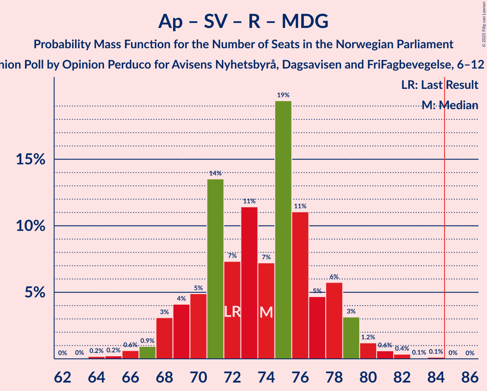

# Opinion Poll by Opinion Perduco for Avisens Nyhetsbyrå, Dagsavisen and FriFagbevegelse, 6–12 September 2022

<a href="#voting-intentions">Voting Intentions</a> | <a href="#seats">Seats</a> | <a href="#coalitions">Coalitions</a> | <a href="#technical-information">Technical Information</a>

## Voting Intentions

### Confidence Intervals

| Party | Last Result | Poll Result | 80% Confidence Interval | 90% Confidence Interval | 95% Confidence Interval | 99% Confidence Interval |
|:-----:|:-----------:|:-----------:|:-----------------------:|:-----------------------:|:-----------------------:|:-----------------------:|
| Høyre | 20.4% | 28.3% | 26.5–30.2% |26.0–30.8% |25.5–31.2% |24.7–32.2% |
| Arbeiderpartiet | 26.2% | 21.5% | 19.9–23.3% |19.4–23.8% |19.0–24.2% |18.3–25.1% |
| Fremskrittspartiet | 11.6% | 11.0% | 9.8–12.3% |9.4–12.7% |9.1–13.1% |8.6–13.8% |
| Sosialistisk Venstreparti | 7.6% | 9.5% | 8.4–10.8% |8.1–11.2% |7.8–11.5% |7.3–12.2% |
| Rødt | 4.7% | 8.6% | 7.5–9.8% |7.2–10.2% |7.0–10.5% |6.5–11.2% |
| Senterpartiet | 13.5% | 6.3% | 5.4–7.4% |5.2–7.7% |4.9–8.0% |4.5–8.6% |
| Venstre | 4.6% | 4.5% | 3.8–5.5% |3.6–5.8% |3.4–6.1% |3.1–6.6% |
| Miljøpartiet De Grønne | 3.9% | 3.0% | 2.4–3.8% |2.2–4.1% |2.1–4.3% |1.8–4.7% |
| Kristelig Folkeparti | 3.8% | 2.7% | 2.1–3.5% |2.0–3.7% |1.8–3.9% |1.6–4.3% |

*Note:* The poll result column reflects the actual value used in the calculations. Published results may vary slightly, and in addition be rounded to fewer digits.

## Seats

### Confidence Intervals

| Party | Last Result | Median | 80% Confidence Interval | 90% Confidence Interval | 95% Confidence Interval | 99% Confidence Interval |
|:-----:|:-----------:|:------:|:-----------------------:|:-----------------------:|:-----------------------:|:-----------------------:|
| <a href="#høyre">Høyre</a> | 36 | 49 | 46–53 |45–54 |45–55 |42–56 |
| <a href="#arbeiderpartiet">Arbeiderpartiet</a> | 48 | 42 | 37–46 |36–46 |36–47 |34–49 |
| <a href="#fremskrittspartiet">Fremskrittspartiet</a> | 21 | 18 | 17–21 |17–22 |17–22 |14–23 |
| <a href="#sosialistisk-venstreparti">Sosialistisk Venstreparti</a> | 13 | 16 | 14–18 |13–19 |13–20 |11–21 |
| <a href="#rødt">Rødt</a> | 8 | 14 | 12–17 |12–17 |11–18 |10–20 |
| <a href="#senterpartiet">Senterpartiet</a> | 28 | 11 | 9–13 |8–14 |8–14 |7–15 |
| <a href="#venstre">Venstre</a> | 8 | 8 | 3–9 |2–9 |2–10 |2–11 |
| <a href="#miljøpartiet-de-grønne">Miljøpartiet De Grønne</a> | 3 | 2 | 1–2 |1–3 |1–6 |1–7 |
| <a href="#kristelig-folkeparti">Kristelig Folkeparti</a> | 3 | 2 | 0–2 |0–3 |0–3 |0–6 |

### Høyre

*For a full overview of the results for this party, see the [Høyre](party-høyre.html) page.*

| Number of Seats | Probability | Accumulated | Special Marks |
|:---------------:|:-----------:|:-----------:|:-------------:|
| 36 | 0% | 100% | Last Result |
| 37 | 0% | 100% |  |
| 38 | 0% | 100% |  |
| 39 | 0% | 100% |  |
| 40 | 0% | 100% |  |
| 41 | 0.1% | 100% |  |
| 42 | 0.4% | 99.9% |  |
| 43 | 0.7% | 99.5% |  |
| 44 | 1.2% | 98.8% |  |
| 45 | 4% | 98% |  |
| 46 | 7% | 94% |  |
| 47 | 16% | 87% |  |
| 48 | 12% | 71% |  |
| 49 | 15% | 59% | Median |
| 50 | 7% | 44% |  |
| 51 | 13% | 37% |  |
| 52 | 8% | 24% |  |
| 53 | 11% | 16% |  |
| 54 | 3% | 5% |  |
| 55 | 2% | 3% |  |
| 56 | 0.9% | 1.3% |  |
| 57 | 0.2% | 0.5% |  |
| 58 | 0.1% | 0.2% |  |
| 59 | 0% | 0.1% |  |
| 60 | 0% | 0% |  |

### Arbeiderpartiet

*For a full overview of the results for this party, see the [Arbeiderpartiet](party-arbeiderpartiet.html) page.*

| Number of Seats | Probability | Accumulated | Special Marks |
|:---------------:|:-----------:|:-----------:|:-------------:|
| 32 | 0.1% | 100% |  |
| 33 | 0.3% | 99.9% |  |
| 34 | 0.3% | 99.7% |  |
| 35 | 1.3% | 99.3% |  |
| 36 | 3% | 98% |  |
| 37 | 7% | 95% |  |
| 38 | 7% | 88% |  |
| 39 | 12% | 81% |  |
| 40 | 7% | 69% |  |
| 41 | 11% | 62% |  |
| 42 | 7% | 51% | Median |
| 43 | 12% | 44% |  |
| 44 | 8% | 32% |  |
| 45 | 13% | 24% |  |
| 46 | 7% | 11% |  |
| 47 | 3% | 4% |  |
| 48 | 0.7% | 1.4% | Last Result |
| 49 | 0.4% | 0.7% |  |
| 50 | 0.2% | 0.3% |  |
| 51 | 0.1% | 0.1% |  |
| 52 | 0% | 0% |  |

### Fremskrittspartiet

*For a full overview of the results for this party, see the [Fremskrittspartiet](party-fremskrittspartiet.html) page.*

| Number of Seats | Probability | Accumulated | Special Marks |
|:---------------:|:-----------:|:-----------:|:-------------:|
| 13 | 0.1% | 100% |  |
| 14 | 0.7% | 99.9% |  |
| 15 | 0.7% | 99.2% |  |
| 16 | 0.5% | 98.5% |  |
| 17 | 42% | 98% |  |
| 18 | 21% | 56% | Median |
| 19 | 6% | 35% |  |
| 20 | 15% | 28% |  |
| 21 | 7% | 14% | Last Result |
| 22 | 5% | 7% |  |
| 23 | 0.6% | 1.1% |  |
| 24 | 0.3% | 0.5% |  |
| 25 | 0.1% | 0.1% |  |
| 26 | 0% | 0.1% |  |
| 27 | 0% | 0% |  |

### Sosialistisk Venstreparti

*For a full overview of the results for this party, see the [Sosialistisk Venstreparti](party-sosialistiskvenstreparti.html) page.*

| Number of Seats | Probability | Accumulated | Special Marks |
|:---------------:|:-----------:|:-----------:|:-------------:|
| 10 | 0.1% | 100% |  |
| 11 | 0.6% | 99.9% |  |
| 12 | 2% | 99.3% |  |
| 13 | 4% | 98% | Last Result |
| 14 | 10% | 94% |  |
| 15 | 15% | 83% |  |
| 16 | 33% | 68% | Median |
| 17 | 19% | 35% |  |
| 18 | 6% | 15% |  |
| 19 | 6% | 9% |  |
| 20 | 2% | 3% |  |
| 21 | 0.8% | 1.0% |  |
| 22 | 0.1% | 0.2% |  |
| 23 | 0% | 0% |  |

### Rødt

*For a full overview of the results for this party, see the [Rødt](party-rødt.html) page.*

| Number of Seats | Probability | Accumulated | Special Marks |
|:---------------:|:-----------:|:-----------:|:-------------:|
| 8 | 0% | 100% | Last Result |
| 9 | 0.1% | 100% |  |
| 10 | 0.5% | 99.9% |  |
| 11 | 2% | 99.5% |  |
| 12 | 9% | 97% |  |
| 13 | 27% | 88% |  |
| 14 | 28% | 61% | Median |
| 15 | 15% | 33% |  |
| 16 | 7% | 19% |  |
| 17 | 7% | 11% |  |
| 18 | 3% | 5% |  |
| 19 | 0.9% | 2% |  |
| 20 | 0.5% | 0.7% |  |
| 21 | 0.1% | 0.2% |  |
| 22 | 0% | 0% |  |

### Senterpartiet

*For a full overview of the results for this party, see the [Senterpartiet](party-senterpartiet.html) page.*

| Number of Seats | Probability | Accumulated | Special Marks |
|:---------------:|:-----------:|:-----------:|:-------------:|
| 6 | 0.1% | 100% |  |
| 7 | 1.0% | 99.9% |  |
| 8 | 6% | 98.8% |  |
| 9 | 12% | 92% |  |
| 10 | 26% | 80% |  |
| 11 | 27% | 54% | Median |
| 12 | 16% | 27% |  |
| 13 | 6% | 11% |  |
| 14 | 3% | 5% |  |
| 15 | 2% | 2% |  |
| 16 | 0.4% | 0.4% |  |
| 17 | 0.1% | 0.1% |  |
| 18 | 0% | 0% |  |
| 19 | 0% | 0% |  |
| 20 | 0% | 0% |  |
| 21 | 0% | 0% |  |
| 22 | 0% | 0% |  |
| 23 | 0% | 0% |  |
| 24 | 0% | 0% |  |
| 25 | 0% | 0% |  |
| 26 | 0% | 0% |  |
| 27 | 0% | 0% |  |
| 28 | 0% | 0% | Last Result |

### Venstre

*For a full overview of the results for this party, see the [Venstre](party-venstre.html) page.*

| Number of Seats | Probability | Accumulated | Special Marks |
|:---------------:|:-----------:|:-----------:|:-------------:|
| 2 | 9% | 100% |  |
| 3 | 5% | 91% |  |
| 4 | 0% | 86% |  |
| 5 | 0% | 86% |  |
| 6 | 9% | 86% |  |
| 7 | 27% | 77% |  |
| 8 | 35% | 50% | Last Result, Median |
| 9 | 12% | 15% |  |
| 10 | 3% | 4% |  |
| 11 | 0.5% | 0.6% |  |
| 12 | 0.1% | 0.1% |  |
| 13 | 0% | 0% |  |

### Miljøpartiet De Grønne

*For a full overview of the results for this party, see the [Miljøpartiet De Grønne](party-miljøpartietdegrønne.html) page.*

| Number of Seats | Probability | Accumulated | Special Marks |
|:---------------:|:-----------:|:-----------:|:-------------:|
| 0 | 0.1% | 100% |  |
| 1 | 29% | 99.9% |  |
| 2 | 66% | 71% | Median |
| 3 | 2% | 5% | Last Result |
| 4 | 0% | 3% |  |
| 5 | 0% | 3% |  |
| 6 | 1.4% | 3% |  |
| 7 | 1.3% | 1.5% |  |
| 8 | 0.2% | 0.2% |  |
| 9 | 0% | 0% |  |

### Kristelig Folkeparti

*For a full overview of the results for this party, see the [Kristelig Folkeparti](party-kristeligfolkeparti.html) page.*

| Number of Seats | Probability | Accumulated | Special Marks |
|:---------------:|:-----------:|:-----------:|:-------------:|
| 0 | 14% | 100% |  |
| 1 | 4% | 86% |  |
| 2 | 74% | 82% | Median |
| 3 | 7% | 8% | Last Result |
| 4 | 0% | 0.8% |  |
| 5 | 0% | 0.8% |  |
| 6 | 0.5% | 0.7% |  |
| 7 | 0.2% | 0.3% |  |
| 8 | 0% | 0% |  |

## Coalitions

### Confidence Intervals

| Coalition | Last Result | Median | Majority? | 80% Confidence Interval | 90% Confidence Interval | 95% Confidence Interval | 99% Confidence Interval |
|:---------:|:-----------:|:------:|:---------:|:-----------------------:|:-----------------------:|:-----------------------:|:-----------------------:|
| Høyre – Fremskrittspartiet – Senterpartiet – Venstre – Kristelig Folkeparti | 96 | 88 | 79% | 83–91 | 83–92 | 81–93 | 79–96 |
| Arbeiderpartiet – Sosialistisk Venstreparti – Rødt – Senterpartiet – Miljøpartiet De Grønne | 100 | 85 | 52% | 80–88 | 79–90 | 79–91 | 77–94 |
| Arbeiderpartiet – Sosialistisk Venstreparti – Rødt – Senterpartiet | 97 | 83 | 23% | 78–87 | 77–88 | 76–90 | 74–92 |
| Høyre – Fremskrittspartiet – Venstre – Miljøpartiet De Grønne – Kristelig Folkeparti | 71 | 78 | 4% | 74–82 | 73–84 | 72–86 | 70–88 |
| Høyre – Fremskrittspartiet – Venstre – Kristelig Folkeparti | 68 | 76 | 0.5% | 73–81 | 72–81 | 70–83 | 68–84 |
| Høyre – Fremskrittspartiet – Venstre | 65 | 74 | 0.1% | 71–79 | 70–80 | 69–81 | 67–83 |
| Arbeiderpartiet – Sosialistisk Venstreparti – Rødt – Miljøpartiet De Grønne | 72 | 74 | 0% | 70–78 | 68–79 | 68–79 | 66–82 |
| Arbeiderpartiet – Sosialistisk Venstreparti – Senterpartiet – Miljøpartiet De Grønne – Kristelig Folkeparti | 95 | 72 | 0% | 68–76 | 67–76 | 66–77 | 64–80 |
| Arbeiderpartiet – Sosialistisk Venstreparti – Senterpartiet – Miljøpartiet De Grønne | 92 | 70 | 0% | 67–74 | 66–75 | 65–76 | 63–78 |
| Arbeiderpartiet – Sosialistisk Venstreparti – Senterpartiet | 89 | 69 | 0% | 65–72 | 64–73 | 63–74 | 60–76 |
| Høyre – Fremskrittspartiet | 57 | 68 | 0% | 64–71 | 63–72 | 63–74 | 62–75 |
| Høyre – Venstre – Kristelig Folkeparti | 47 | 58 | 0% | 55–62 | 53–63 | 51–64 | 49–65 |
| Arbeiderpartiet – Sosialistisk Venstreparti | 61 | 58 | 0% | 54–62 | 53–63 | 52–63 | 50–65 |
| Arbeiderpartiet – Senterpartiet – Miljøpartiet De Grønne – Kristelig Folkeparti | 82 | 57 | 0% | 52–59 | 51–61 | 50–62 | 48–63 |
| Arbeiderpartiet – Senterpartiet – Kristelig Folkeparti | 79 | 55 | 0% | 50–58 | 49–58 | 49–59 | 47–61 |
| Arbeiderpartiet – Senterpartiet | 76 | 53 | 0% | 49–56 | 48–56 | 47–58 | 45–60 |
| Senterpartiet – Venstre – Kristelig Folkeparti | 39 | 20 | 0% | 16–22 | 15–24 | 14–24 | 12–26 |

### Høyre – Fremskrittspartiet – Senterpartiet – Venstre – Kristelig Folkeparti

| Number of Seats | Probability | Accumulated | Special Marks |
|:---------------:|:-----------:|:-----------:|:-------------:|
| 77 | 0% | 100% |  |
| 78 | 0.1% | 99.9% |  |
| 79 | 0.3% | 99.8% |  |
| 80 | 0.9% | 99.5% |  |
| 81 | 1.4% | 98.5% |  |
| 82 | 2% | 97% |  |
| 83 | 7% | 95% |  |
| 84 | 10% | 89% |  |
| 85 | 16% | 79% | Majority |
| 86 | 6% | 62% |  |
| 87 | 6% | 56% |  |
| 88 | 15% | 50% | Median |
| 89 | 10% | 35% |  |
| 90 | 11% | 26% |  |
| 91 | 5% | 14% |  |
| 92 | 5% | 10% |  |
| 93 | 2% | 5% |  |
| 94 | 1.0% | 2% |  |
| 95 | 0.5% | 1.5% |  |
| 96 | 0.6% | 1.0% | Last Result |
| 97 | 0.2% | 0.4% |  |
| 98 | 0.1% | 0.2% |  |
| 99 | 0.1% | 0.1% |  |
| 100 | 0% | 0% |  |

### Arbeiderpartiet – Sosialistisk Venstreparti – Rødt – Senterpartiet – Miljøpartiet De Grønne

| Number of Seats | Probability | Accumulated | Special Marks |
|:---------------:|:-----------:|:-----------:|:-------------:|
| 73 | 0% | 100% |  |
| 74 | 0% | 99.9% |  |
| 75 | 0.1% | 99.9% |  |
| 76 | 0.2% | 99.8% |  |
| 77 | 0.7% | 99.6% |  |
| 78 | 1.4% | 98.9% |  |
| 79 | 3% | 98% |  |
| 80 | 5% | 95% |  |
| 81 | 6% | 89% |  |
| 82 | 14% | 83% |  |
| 83 | 10% | 69% |  |
| 84 | 7% | 59% |  |
| 85 | 13% | 52% | Median, Majority |
| 86 | 17% | 39% |  |
| 87 | 6% | 22% |  |
| 88 | 8% | 16% |  |
| 89 | 3% | 8% |  |
| 90 | 2% | 5% |  |
| 91 | 1.5% | 3% |  |
| 92 | 0.9% | 2% |  |
| 93 | 0.2% | 0.7% |  |
| 94 | 0.4% | 0.5% |  |
| 95 | 0.1% | 0.1% |  |
| 96 | 0% | 0.1% |  |
| 97 | 0% | 0% |  |
| 98 | 0% | 0% |  |
| 99 | 0% | 0% |  |
| 100 | 0% | 0% | Last Result |

### Arbeiderpartiet – Sosialistisk Venstreparti – Rødt – Senterpartiet

| Number of Seats | Probability | Accumulated | Special Marks |
|:---------------:|:-----------:|:-----------:|:-------------:|
| 71 | 0.1% | 100% |  |
| 72 | 0.1% | 99.9% |  |
| 73 | 0.1% | 99.8% |  |
| 74 | 0.3% | 99.7% |  |
| 75 | 1.3% | 99.4% |  |
| 76 | 1.3% | 98% |  |
| 77 | 3% | 97% |  |
| 78 | 5% | 94% |  |
| 79 | 6% | 89% |  |
| 80 | 14% | 83% |  |
| 81 | 10% | 69% |  |
| 82 | 7% | 59% |  |
| 83 | 12% | 52% | Median |
| 84 | 17% | 41% |  |
| 85 | 5% | 23% | Majority |
| 86 | 5% | 19% |  |
| 87 | 7% | 13% |  |
| 88 | 2% | 7% |  |
| 89 | 2% | 5% |  |
| 90 | 2% | 3% |  |
| 91 | 0.3% | 0.9% |  |
| 92 | 0.2% | 0.6% |  |
| 93 | 0.3% | 0.4% |  |
| 94 | 0.1% | 0.1% |  |
| 95 | 0% | 0% |  |
| 96 | 0% | 0% |  |
| 97 | 0% | 0% | Last Result |

### Høyre – Fremskrittspartiet – Venstre – Miljøpartiet De Grønne – Kristelig Folkeparti

| Number of Seats | Probability | Accumulated | Special Marks |
|:---------------:|:-----------:|:-----------:|:-------------:|
| 68 | 0.1% | 100% |  |
| 69 | 0.3% | 99.9% |  |
| 70 | 0.6% | 99.6% |  |
| 71 | 0.7% | 98.9% | Last Result |
| 72 | 2% | 98% |  |
| 73 | 2% | 96% |  |
| 74 | 7% | 94% |  |
| 75 | 5% | 87% |  |
| 76 | 17% | 82% |  |
| 77 | 9% | 65% |  |
| 78 | 8% | 56% |  |
| 79 | 10% | 48% | Median |
| 80 | 7% | 38% |  |
| 81 | 11% | 30% |  |
| 82 | 9% | 19% |  |
| 83 | 3% | 10% |  |
| 84 | 3% | 6% |  |
| 85 | 1.3% | 4% | Majority |
| 86 | 1.4% | 3% |  |
| 87 | 0.6% | 1.2% |  |
| 88 | 0.4% | 0.6% |  |
| 89 | 0.1% | 0.3% |  |
| 90 | 0.1% | 0.2% |  |
| 91 | 0% | 0.1% |  |
| 92 | 0% | 0% |  |

### Høyre – Fremskrittspartiet – Venstre – Kristelig Folkeparti

| Number of Seats | Probability | Accumulated | Special Marks |
|:---------------:|:-----------:|:-----------:|:-------------:|
| 66 | 0% | 100% |  |
| 67 | 0.1% | 99.9% |  |
| 68 | 0.4% | 99.9% | Last Result |
| 69 | 0.6% | 99.4% |  |
| 70 | 1.4% | 98.8% |  |
| 71 | 2% | 97% |  |
| 72 | 3% | 96% |  |
| 73 | 8% | 92% |  |
| 74 | 16% | 85% |  |
| 75 | 11% | 68% |  |
| 76 | 8% | 57% |  |
| 77 | 10% | 49% | Median |
| 78 | 9% | 39% |  |
| 79 | 13% | 31% |  |
| 80 | 7% | 18% |  |
| 81 | 6% | 11% |  |
| 82 | 2% | 5% |  |
| 83 | 1.3% | 3% |  |
| 84 | 0.8% | 1.2% |  |
| 85 | 0.2% | 0.5% | Majority |
| 86 | 0.1% | 0.2% |  |
| 87 | 0.1% | 0.1% |  |
| 88 | 0% | 0.1% |  |
| 89 | 0% | 0% |  |

### Høyre – Fremskrittspartiet – Venstre

| Number of Seats | Probability | Accumulated | Special Marks |
|:---------------:|:-----------:|:-----------:|:-------------:|
| 65 | 0.2% | 100% | Last Result |
| 66 | 0.2% | 99.8% |  |
| 67 | 0.6% | 99.5% |  |
| 68 | 0.9% | 98.9% |  |
| 69 | 2% | 98% |  |
| 70 | 3% | 96% |  |
| 71 | 8% | 93% |  |
| 72 | 17% | 85% |  |
| 73 | 11% | 69% |  |
| 74 | 10% | 58% |  |
| 75 | 5% | 49% | Median |
| 76 | 8% | 43% |  |
| 77 | 14% | 35% |  |
| 78 | 9% | 21% |  |
| 79 | 6% | 13% |  |
| 80 | 2% | 6% |  |
| 81 | 2% | 4% |  |
| 82 | 1.1% | 2% |  |
| 83 | 0.3% | 0.6% |  |
| 84 | 0.2% | 0.3% |  |
| 85 | 0.1% | 0.1% | Majority |
| 86 | 0% | 0.1% |  |
| 87 | 0% | 0% |  |

### Arbeiderpartiet – Sosialistisk Venstreparti – Rødt – Miljøpartiet De Grønne

| Number of Seats | Probability | Accumulated | Special Marks |
|:---------------:|:-----------:|:-----------:|:-------------:|
| 63 | 0% | 100% |  |
| 64 | 0.2% | 99.9% |  |
| 65 | 0.2% | 99.8% |  |
| 66 | 0.6% | 99.5% |  |
| 67 | 0.9% | 98.9% |  |
| 68 | 3% | 98% |  |
| 69 | 4% | 95% |  |
| 70 | 5% | 91% |  |
| 71 | 14% | 86% |  |
| 72 | 7% | 72% | Last Result |
| 73 | 11% | 65% |  |
| 74 | 7% | 54% | Median |
| 75 | 19% | 46% |  |
| 76 | 11% | 27% |  |
| 77 | 5% | 16% |  |
| 78 | 6% | 11% |  |
| 79 | 3% | 6% |  |
| 80 | 1.2% | 2% |  |
| 81 | 0.6% | 1.2% |  |
| 82 | 0.4% | 0.6% |  |
| 83 | 0.1% | 0.2% |  |
| 84 | 0.1% | 0.2% |  |
| 85 | 0% | 0% | Majority |

### Arbeiderpartiet – Sosialistisk Venstreparti – Senterpartiet – Miljøpartiet De Grønne – Kristelig Folkeparti

| Number of Seats | Probability | Accumulated | Special Marks |
|:---------------:|:-----------:|:-----------:|:-------------:|
| 62 | 0.1% | 100% |  |
| 63 | 0.2% | 99.9% |  |
| 64 | 0.3% | 99.7% |  |
| 65 | 1.1% | 99.5% |  |
| 66 | 2% | 98% |  |
| 67 | 3% | 97% |  |
| 68 | 6% | 94% |  |
| 69 | 12% | 88% |  |
| 70 | 11% | 77% |  |
| 71 | 8% | 66% |  |
| 72 | 11% | 58% |  |
| 73 | 8% | 47% | Median |
| 74 | 19% | 39% |  |
| 75 | 9% | 20% |  |
| 76 | 7% | 11% |  |
| 77 | 2% | 5% |  |
| 78 | 1.2% | 2% |  |
| 79 | 0.5% | 1.2% |  |
| 80 | 0.4% | 0.6% |  |
| 81 | 0.1% | 0.2% |  |
| 82 | 0.1% | 0.1% |  |
| 83 | 0% | 0% |  |
| 84 | 0% | 0% |  |
| 85 | 0% | 0% | Majority |
| 86 | 0% | 0% |  |
| 87 | 0% | 0% |  |
| 88 | 0% | 0% |  |
| 89 | 0% | 0% |  |
| 90 | 0% | 0% |  |
| 91 | 0% | 0% |  |
| 92 | 0% | 0% |  |
| 93 | 0% | 0% |  |
| 94 | 0% | 0% |  |
| 95 | 0% | 0% | Last Result |

### Arbeiderpartiet – Sosialistisk Venstreparti – Senterpartiet – Miljøpartiet De Grønne

| Number of Seats | Probability | Accumulated | Special Marks |
|:---------------:|:-----------:|:-----------:|:-------------:|
| 60 | 0% | 100% |  |
| 61 | 0.1% | 99.9% |  |
| 62 | 0.3% | 99.8% |  |
| 63 | 0.6% | 99.5% |  |
| 64 | 0.9% | 98.9% |  |
| 65 | 1.4% | 98% |  |
| 66 | 6% | 97% |  |
| 67 | 12% | 91% |  |
| 68 | 10% | 79% |  |
| 69 | 8% | 69% |  |
| 70 | 12% | 61% |  |
| 71 | 10% | 48% | Median |
| 72 | 17% | 39% |  |
| 73 | 9% | 21% |  |
| 74 | 7% | 13% |  |
| 75 | 3% | 5% |  |
| 76 | 2% | 3% |  |
| 77 | 0.4% | 1.1% |  |
| 78 | 0.4% | 0.7% |  |
| 79 | 0.1% | 0.2% |  |
| 80 | 0% | 0.1% |  |
| 81 | 0% | 0% |  |
| 82 | 0% | 0% |  |
| 83 | 0% | 0% |  |
| 84 | 0% | 0% |  |
| 85 | 0% | 0% | Majority |
| 86 | 0% | 0% |  |
| 87 | 0% | 0% |  |
| 88 | 0% | 0% |  |
| 89 | 0% | 0% |  |
| 90 | 0% | 0% |  |
| 91 | 0% | 0% |  |
| 92 | 0% | 0% | Last Result |

### Arbeiderpartiet – Sosialistisk Venstreparti – Senterpartiet

| Number of Seats | Probability | Accumulated | Special Marks |
|:---------------:|:-----------:|:-----------:|:-------------:|
| 58 | 0% | 100% |  |
| 59 | 0.1% | 99.9% |  |
| 60 | 0.3% | 99.8% |  |
| 61 | 0.5% | 99.5% |  |
| 62 | 1.2% | 99.0% |  |
| 63 | 2% | 98% |  |
| 64 | 5% | 96% |  |
| 65 | 11% | 91% |  |
| 66 | 10% | 80% |  |
| 67 | 9% | 70% |  |
| 68 | 10% | 61% |  |
| 69 | 12% | 51% | Median |
| 70 | 16% | 39% |  |
| 71 | 9% | 23% |  |
| 72 | 5% | 14% |  |
| 73 | 6% | 9% |  |
| 74 | 2% | 4% |  |
| 75 | 0.9% | 2% |  |
| 76 | 0.3% | 0.8% |  |
| 77 | 0.3% | 0.4% |  |
| 78 | 0.1% | 0.1% |  |
| 79 | 0% | 0% |  |
| 80 | 0% | 0% |  |
| 81 | 0% | 0% |  |
| 82 | 0% | 0% |  |
| 83 | 0% | 0% |  |
| 84 | 0% | 0% |  |
| 85 | 0% | 0% | Majority |
| 86 | 0% | 0% |  |
| 87 | 0% | 0% |  |
| 88 | 0% | 0% |  |
| 89 | 0% | 0% | Last Result |

### Høyre – Fremskrittspartiet

| Number of Seats | Probability | Accumulated | Special Marks |
|:---------------:|:-----------:|:-----------:|:-------------:|
| 57 | 0% | 100% | Last Result |
| 58 | 0% | 100% |  |
| 59 | 0.1% | 100% |  |
| 60 | 0.1% | 99.9% |  |
| 61 | 0.3% | 99.8% |  |
| 62 | 0.8% | 99.5% |  |
| 63 | 4% | 98.7% |  |
| 64 | 11% | 95% |  |
| 65 | 11% | 84% |  |
| 66 | 11% | 72% |  |
| 67 | 10% | 61% | Median |
| 68 | 7% | 52% |  |
| 69 | 11% | 44% |  |
| 70 | 14% | 33% |  |
| 71 | 9% | 18% |  |
| 72 | 5% | 10% |  |
| 73 | 2% | 5% |  |
| 74 | 2% | 3% |  |
| 75 | 0.5% | 1.0% |  |
| 76 | 0.2% | 0.5% |  |
| 77 | 0.1% | 0.3% |  |
| 78 | 0.1% | 0.1% |  |
| 79 | 0% | 0.1% |  |
| 80 | 0% | 0% |  |

### Høyre – Venstre – Kristelig Folkeparti

| Number of Seats | Probability | Accumulated | Special Marks |
|:---------------:|:-----------:|:-----------:|:-------------:|
| 47 | 0% | 100% | Last Result |
| 48 | 0.2% | 100% |  |
| 49 | 0.7% | 99.8% |  |
| 50 | 0.7% | 99.1% |  |
| 51 | 1.2% | 98% |  |
| 52 | 1.3% | 97% |  |
| 53 | 3% | 96% |  |
| 54 | 3% | 93% |  |
| 55 | 6% | 90% |  |
| 56 | 11% | 84% |  |
| 57 | 21% | 73% |  |
| 58 | 12% | 53% |  |
| 59 | 6% | 41% | Median |
| 60 | 10% | 35% |  |
| 61 | 7% | 25% |  |
| 62 | 9% | 17% |  |
| 63 | 5% | 8% |  |
| 64 | 2% | 3% |  |
| 65 | 0.3% | 0.8% |  |
| 66 | 0.2% | 0.5% |  |
| 67 | 0.2% | 0.3% |  |
| 68 | 0% | 0.1% |  |
| 69 | 0% | 0% |  |

### Arbeiderpartiet – Sosialistisk Venstreparti

| Number of Seats | Probability | Accumulated | Special Marks |
|:---------------:|:-----------:|:-----------:|:-------------:|
| 47 | 0% | 100% |  |
| 48 | 0.1% | 99.9% |  |
| 49 | 0.3% | 99.8% |  |
| 50 | 0.5% | 99.5% |  |
| 51 | 1.4% | 99.0% |  |
| 52 | 3% | 98% |  |
| 53 | 3% | 95% |  |
| 54 | 9% | 92% |  |
| 55 | 8% | 83% |  |
| 56 | 11% | 75% |  |
| 57 | 8% | 63% |  |
| 58 | 15% | 55% | Median |
| 59 | 13% | 41% |  |
| 60 | 9% | 28% |  |
| 61 | 9% | 19% | Last Result |
| 62 | 4% | 10% |  |
| 63 | 5% | 6% |  |
| 64 | 1.0% | 2% |  |
| 65 | 0.7% | 0.8% |  |
| 66 | 0.1% | 0.2% |  |
| 67 | 0% | 0% |  |

### Arbeiderpartiet – Senterpartiet – Miljøpartiet De Grønne – Kristelig Folkeparti

| Number of Seats | Probability | Accumulated | Special Marks |
|:---------------:|:-----------:|:-----------:|:-------------:|
| 46 | 0% | 100% |  |
| 47 | 0.2% | 99.9% |  |
| 48 | 0.2% | 99.7% |  |
| 49 | 0.7% | 99.5% |  |
| 50 | 2% | 98.8% |  |
| 51 | 5% | 97% |  |
| 52 | 7% | 92% |  |
| 53 | 19% | 85% |  |
| 54 | 4% | 66% |  |
| 55 | 4% | 62% |  |
| 56 | 7% | 58% |  |
| 57 | 7% | 51% | Median |
| 58 | 18% | 43% |  |
| 59 | 17% | 26% |  |
| 60 | 4% | 9% |  |
| 61 | 2% | 5% |  |
| 62 | 2% | 3% |  |
| 63 | 0.9% | 1.3% |  |
| 64 | 0.2% | 0.4% |  |
| 65 | 0.1% | 0.2% |  |
| 66 | 0% | 0.1% |  |
| 67 | 0% | 0% |  |
| 68 | 0% | 0% |  |
| 69 | 0% | 0% |  |
| 70 | 0% | 0% |  |
| 71 | 0% | 0% |  |
| 72 | 0% | 0% |  |
| 73 | 0% | 0% |  |
| 74 | 0% | 0% |  |
| 75 | 0% | 0% |  |
| 76 | 0% | 0% |  |
| 77 | 0% | 0% |  |
| 78 | 0% | 0% |  |
| 79 | 0% | 0% |  |
| 80 | 0% | 0% |  |
| 81 | 0% | 0% |  |
| 82 | 0% | 0% | Last Result |

### Arbeiderpartiet – Senterpartiet – Kristelig Folkeparti

| Number of Seats | Probability | Accumulated | Special Marks |
|:---------------:|:-----------:|:-----------:|:-------------:|
| 44 | 0% | 100% |  |
| 45 | 0.2% | 99.9% |  |
| 46 | 0.2% | 99.7% |  |
| 47 | 0.5% | 99.5% |  |
| 48 | 1.4% | 99.0% |  |
| 49 | 4% | 98% |  |
| 50 | 6% | 94% |  |
| 51 | 17% | 87% |  |
| 52 | 8% | 71% |  |
| 53 | 5% | 63% |  |
| 54 | 5% | 58% |  |
| 55 | 9% | 52% | Median |
| 56 | 15% | 43% |  |
| 57 | 17% | 28% |  |
| 58 | 7% | 11% |  |
| 59 | 2% | 4% |  |
| 60 | 1.3% | 2% |  |
| 61 | 0.6% | 1.0% |  |
| 62 | 0.3% | 0.4% |  |
| 63 | 0.1% | 0.1% |  |
| 64 | 0% | 0% |  |
| 65 | 0% | 0% |  |
| 66 | 0% | 0% |  |
| 67 | 0% | 0% |  |
| 68 | 0% | 0% |  |
| 69 | 0% | 0% |  |
| 70 | 0% | 0% |  |
| 71 | 0% | 0% |  |
| 72 | 0% | 0% |  |
| 73 | 0% | 0% |  |
| 74 | 0% | 0% |  |
| 75 | 0% | 0% |  |
| 76 | 0% | 0% |  |
| 77 | 0% | 0% |  |
| 78 | 0% | 0% |  |
| 79 | 0% | 0% | Last Result |

### Arbeiderpartiet – Senterpartiet

| Number of Seats | Probability | Accumulated | Special Marks |
|:---------------:|:-----------:|:-----------:|:-------------:|
| 43 | 0.1% | 100% |  |
| 44 | 0.3% | 99.8% |  |
| 45 | 0.3% | 99.6% |  |
| 46 | 1.3% | 99.3% |  |
| 47 | 3% | 98% |  |
| 48 | 5% | 95% |  |
| 49 | 17% | 90% |  |
| 50 | 9% | 74% |  |
| 51 | 6% | 64% |  |
| 52 | 4% | 59% |  |
| 53 | 11% | 55% | Median |
| 54 | 14% | 44% |  |
| 55 | 18% | 31% |  |
| 56 | 8% | 13% |  |
| 57 | 2% | 5% |  |
| 58 | 1.2% | 3% |  |
| 59 | 0.8% | 2% |  |
| 60 | 0.6% | 0.7% |  |
| 61 | 0.1% | 0.1% |  |
| 62 | 0% | 0% |  |
| 63 | 0% | 0% |  |
| 64 | 0% | 0% |  |
| 65 | 0% | 0% |  |
| 66 | 0% | 0% |  |
| 67 | 0% | 0% |  |
| 68 | 0% | 0% |  |
| 69 | 0% | 0% |  |
| 70 | 0% | 0% |  |
| 71 | 0% | 0% |  |
| 72 | 0% | 0% |  |
| 73 | 0% | 0% |  |
| 74 | 0% | 0% |  |
| 75 | 0% | 0% |  |
| 76 | 0% | 0% | Last Result |

### Senterpartiet – Venstre – Kristelig Folkeparti

| Number of Seats | Probability | Accumulated | Special Marks |
|:---------------:|:-----------:|:-----------:|:-------------:|
| 11 | 0.1% | 100% |  |
| 12 | 1.0% | 99.8% |  |
| 13 | 1.1% | 98.9% |  |
| 14 | 3% | 98% |  |
| 15 | 5% | 95% |  |
| 16 | 4% | 91% |  |
| 17 | 6% | 87% |  |
| 18 | 13% | 80% |  |
| 19 | 13% | 67% |  |
| 20 | 14% | 54% |  |
| 21 | 23% | 40% | Median |
| 22 | 7% | 17% |  |
| 23 | 3% | 9% |  |
| 24 | 4% | 6% |  |
| 25 | 1.2% | 2% |  |
| 26 | 0.6% | 0.8% |  |
| 27 | 0.1% | 0.2% |  |
| 28 | 0.1% | 0.1% |  |
| 29 | 0% | 0% |  |
| 30 | 0% | 0% |  |
| 31 | 0% | 0% |  |
| 32 | 0% | 0% |  |
| 33 | 0% | 0% |  |
| 34 | 0% | 0% |  |
| 35 | 0% | 0% |  |
| 36 | 0% | 0% |  |
| 37 | 0% | 0% |  |
| 38 | 0% | 0% |  |
| 39 | 0% | 0% | Last Result |

## Technical Information

### Opinion Poll

+ **Polling firm:** Opinion Perduco
+ **Commissioner(s):** Avisens Nyhetsbyrå, Dagsavisen and FriFagbevegelse
+ **Fieldwork period:** 6–12 September 2022

### Calculations

+ **Sample size:** 968
+ **Simulations done:** 1,048,576
+ **Error estimate:** 0.88%

